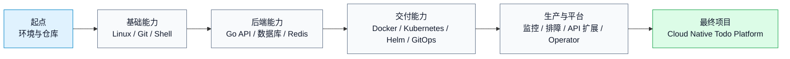
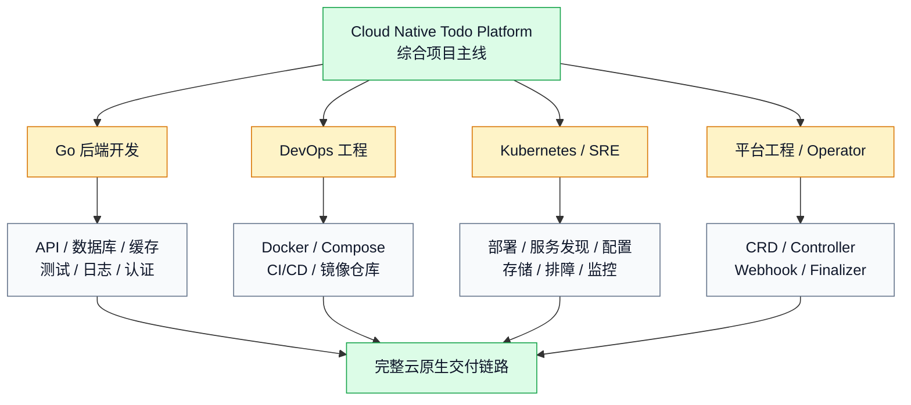
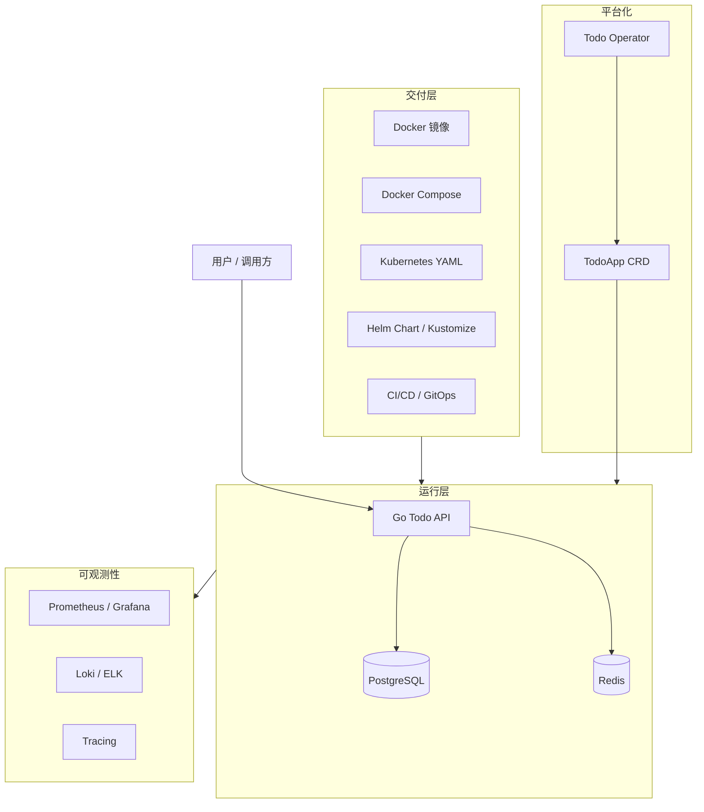
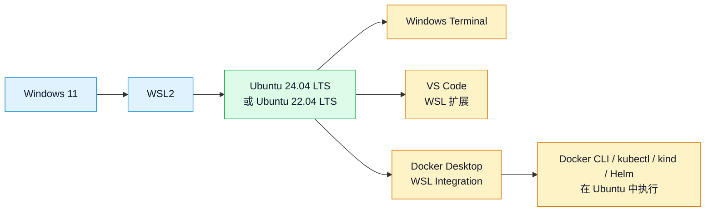
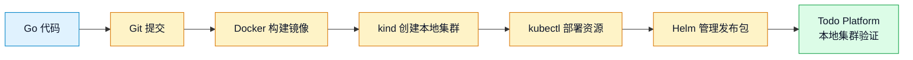
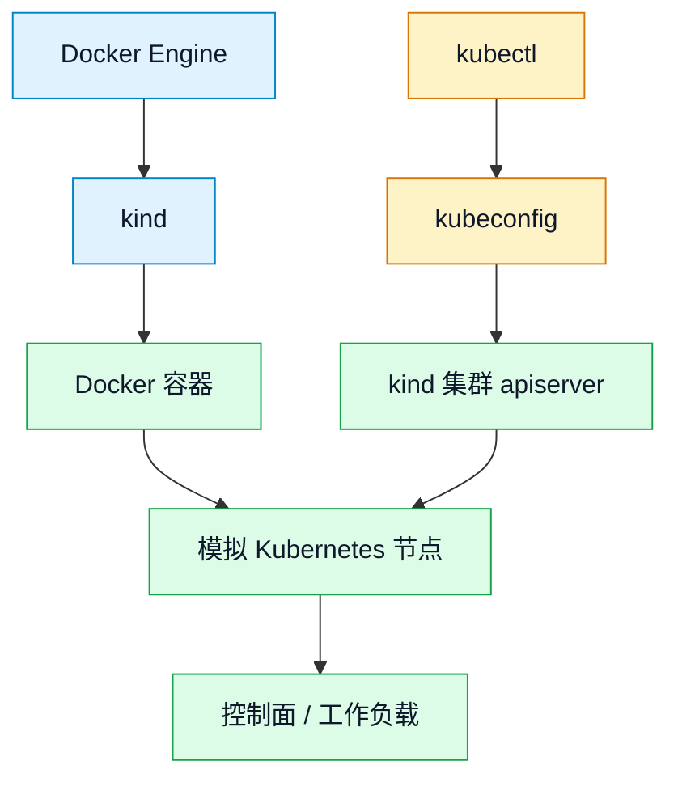
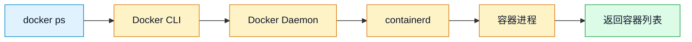

# 第 1 篇：课程导学与开发环境准备

本篇是整套课程的入口。它不急着写业务代码，而是先做三件事：看清学习地图，选定稳定的实验环境，把 Go、Git、Docker、kubectl、kind、Helm 这些后续每天都会用到的工具装好，并初始化课程主线仓库 `cloud-native-todo-platform`。

本篇对应 5 个章节主题：

- 1.1 课程目标、岗位路线与综合项目介绍
- 1.2 Windows / macOS / Linux 学习环境选择
- 1.3 WSL2、Ubuntu、终端与 VS Code 配置
- 1.4 安装 Go、Git、Docker、kubectl、kind、Helm
- 1.5 创建课程代码仓库与目录规范

## 1. 本章学习目标

学完本篇后，你应该能够独立准备一套可复用的云原生开发环境，并能解释每个工具在后续项目链路中的作用。

具体目标如下：

- 能说清本课程从 Go 后端、Docker、Kubernetes 到 Operator 的完整学习路线。
- 能理解 `Cloud Native Todo Platform` 不是普通 Todo Demo，而是后续所有能力逐步叠加的综合项目主线。
- 能根据自己的电脑系统选择合适的学习环境：Windows + WSL2、macOS 或 Linux。
- 能在 Windows 上安装 WSL2 与 Ubuntu，并理解为什么云原生学习推荐使用 Linux 用户态环境。
- 能配置终端、Shell、VS Code Remote WSL 或等价远程开发方式。
- 能安装并验证 `go`、`git`、`docker`、`kubectl`、`kind`、`helm`。
- 能创建 `cloud-native-todo-platform` 仓库，并按照课程规范初始化目录结构。
- 能编写并运行环境检查脚本，确认后续课程可以继续推进。

本篇结束时，你至少应该能成功运行以下命令：

```bash
go version
git --version
docker version
kubectl version --client
kind version
helm version
```

如果这些命令都能正常输出版本信息，说明你已经拿到了后续课程的“工作台”。

## 2. 本章工作场景

真实公司里的新项目，很少从“写第一行代码”开始。更常见的第一步是环境准备、工具统一和仓库规范确认。

典型工作场景包括：

- 新员工加入后端或平台团队，需要按团队文档安装 Go、Docker、kubectl、Helm，并能跑通项目的本地环境检查。
- 开发人员准备参与 Kubernetes 应用交付，需要在本机搭建 kind 或 minikube 集群，验证 YAML、Helm Chart 和镜像构建流程。
- DevOps 或 SRE 需要统一团队开发环境，避免“我这里能跑，你那里不能跑”的环境漂移。
- 平台团队要设计一个标准项目模板，让后续 API、CLI、Dockerfile、Kubernetes YAML、Helm Chart、CI/CD、Operator 代码有清晰归属。
- 面试中被问到“你如何从零搭建一个云原生 Go 项目的开发环境”，需要能讲清操作系统、工具链、仓库结构和验证方式。

本篇做的事情看起来基础，但它决定了后面几十篇学习是否顺畅。Go 编译、Docker 构建、kind 集群、kubectl 访问、Helm 渲染，都会依赖这里搭好的环境。

## 3. 前置知识

### 必须掌握

学习本篇前，你只需要具备最基础的电脑使用能力：

- 会打开终端或 PowerShell。
- 知道文件、目录、命令、软件安装包是什么意思。
- 能复制命令并观察输出。
- 遇到错误时愿意先读错误信息，而不是直接跳过。

### 建议了解

以下内容暂时不要求熟练，但建议有初步概念：

- 操作系统分为 Windows、macOS、Linux，不同系统的命令和路径格式不同。
- 后端服务最终大多运行在 Linux 服务器或 Linux 容器中。
- Git 用于管理代码版本。
- Docker 用于构建和运行容器。
- Kubernetes 用于管理大量容器化应用。

### 新手补充方向

如果你是完全新手，建议先补齐以下关键词：

| 关键词 | 最小理解 |
|---|---|
| 终端 | 输入命令与系统交互的窗口 |
| Shell | 解释和执行命令的程序，如 Bash、Zsh、PowerShell |
| PATH | 系统查找命令的位置列表 |
| 仓库 | 被 Git 管理的一组项目文件 |
| 容器 | 隔离运行应用的一种方式 |
| 集群 | 多个节点协同运行应用的系统 |

本篇会边做边解释，不要求你一次性背完这些概念。

## 4. 核心概念

### 4.1 课程学习地图

先用一张图看完整路线：



这条路线不是把工具名字排成列表，而是模拟真实项目的演进过程。

项目最开始只是一个本地 Todo 程序；后面它会变成 Go Web API；再接入数据库和缓存；再被构建成 Docker 镜像；再被部署到 Kubernetes；最后使用 Operator 自动管理整套平台生命周期。

### 4.2 岗位路线

本课程覆盖的岗位能力可以分成四条线：



| 路线 | 主要能力 | 课程中的体现 |
|---|---|---|
| Go 后端开发 | API、数据库、缓存、测试、日志、认证 | Todo API、PostgreSQL、Redis、JWT |
| DevOps | Docker、Compose、CI/CD、镜像仓库 | Dockerfile、Compose、GitHub Actions |
| Kubernetes / SRE | 部署、服务发现、配置、存储、排障、监控 | Deployment、Service、Ingress、Prometheus |
| 平台工程 / Operator | CRD、Controller、Webhook、Finalizer | TodoApp CRD、Todo Operator |

很多岗位不是只要求你会某一个工具，而是要求你能把工具串成完整交付链路。本课程的核心价值就在这里。

### 4.3 综合项目：Cloud Native Todo Platform

`Cloud Native Todo Platform` 不是一次性写完的项目，而是随着课程逐步长出来的系统：

```mermaid
flowchart LR
    P0["空仓库<br/>目录规范"] --> P1["Todo CLI<br/>本地命令行"]
    P1 --> P2["Go Todo API<br/>HTTP 服务"]
    P2 --> P3["数据层<br/>PostgreSQL / Redis"]
    P3 --> P4["容器化<br/>Docker 镜像 / Compose"]
    P4 --> P5["Kubernetes 交付<br/>Deployment / Service / Ingress"]
    P5 --> P6["发布工程<br/>Helm / Kustomize / GitOps"]
    P6 --> P7["生产能力<br/>监控 / 日志 / 链路追踪"]
    P7 --> P8["平台化<br/>TodoApp CRD / Operator"]

    classDef start fill:#e0f2fe,stroke:#0284c7,color:#0f172a
    classDef middle fill:#f8fafc,stroke:#64748b,color:#0f172a
    classDef final fill:#dcfce7,stroke:#16a34a,color:#0f172a
    class P0 start
    class P1,P2,P3,P4,P5,P6,P7 middle
    class P8 final
```



最终形态可以理解为四层：



在本篇中，我们还不会实现业务功能，只做项目初始化：

```text
cloud-native-todo-platform/
├── api/
├── cli/
├── deployments/
├── docs/
├── observability/
├── operator/
├── scripts/
├── Makefile
├── README.md
└── .gitignore
```

这就像真实项目开工前搭好施工场地。后续每篇都会往这个仓库里增加一部分能力。

### 4.4 学习环境选择

三类环境都能学习本课程：

=== "Windows + WSL2 Ubuntu"

    推荐大多数 Windows 用户采用这一方案。你可以继续使用 Windows 桌面软件，同时把课程命令、代码仓库、Go 编译、Docker CLI、kubectl、Helm 都放在 WSL2 Ubuntu 中执行。

    代码建议放在 WSL 的 Linux 文件系统中，例如 `~/workspace`，不要把主要仓库放在 `/mnt/c/Users/...` 下。这样路径、权限、文件监听和 Shell 行为都会更接近真实 Linux 服务器。

=== "macOS"

    推荐 Mac 用户采用本机终端加 Docker Desktop 的方案。macOS 自带类 Unix 终端体验，配合 Homebrew 可以比较顺畅地安装 Go、Git、kubectl、kind、Helm 等工具。

    需要注意 Docker Desktop 的资源配置，建议至少分配 4 核 CPU、6GB 内存和 30GB 磁盘空间，后续运行 kind 和 Kubernetes 组件时会更稳定。

=== "Linux"

    推荐已经使用 Linux 桌面或云服务器的人直接使用本机环境。它最贴近生产服务器和容器运行环境，后续理解路径、权限、systemd、Docker Engine 会更自然。

    如果你是完全新手，Linux 桌面的软件安装和驱动问题可能略有门槛。课程示例主要以 Ubuntu 22.04 / 24.04 为基准。

### 4.5 WSL2、Ubuntu、终端与 VS Code

WSL2 是 Windows 上运行 Linux 用户态环境的官方方案。你可以把它理解成“Windows 里的一套 Linux 开发环境”。

推荐组合：



后续课程中的 Linux 命令、Go 编译、Docker CLI、kubectl、Helm 都优先在 Ubuntu 终端里执行。

### 4.6 工具链的角色

一次本地开发到 Kubernetes 验证的链路可以这样看：



| 工具 | 作用 | 在项目中怎么用 |
|---|---|---|
| Go | 编译和运行 Go 程序 | 开发 Todo CLI、Todo API、Operator |
| Git | 管理代码版本 | 保存每个阶段的项目演进 |
| Docker | 构建镜像、运行容器 | 容器化 Todo API、运行 PostgreSQL 和 Redis |
| kubectl | 操作 Kubernetes 集群 | 创建、查看、删除 Kubernetes 资源 |
| kind | 在 Docker 中创建本地 Kubernetes 集群 | 本地验证部署清单和 Helm Chart |
| Helm | Kubernetes 应用包管理 | 打包、安装、升级 Todo Platform |

这些工具不是孤立使用的。一个典型流程是：用 Go 写服务，用 Git 提交代码，用 Docker 构建镜像，用 kind 创建本地 Kubernetes 集群，用 kubectl 部署资源，用 Helm 管理发布包。

## 5. 原理深入

### 5.1 为什么云原生学习绕不开 Linux

Go 后端服务可以在 Windows、macOS、Linux 上开发，但生产环境大多是 Linux：

- Docker 容器依赖 Linux Namespace、Cgroups、文件系统隔离等机制。
- Kubernetes 节点通常运行 Linux。
- 大量开源工具默认优先支持 Linux Shell。
- CI/CD Runner、镜像构建机、生产服务器通常都是 Linux。

所以本课程不要求你必须把电脑换成 Linux，但要求你拥有一个稳定的 Linux 用户态环境。Windows 用户用 WSL2，Mac 用户用 Terminal 和 Docker Desktop，Linux 用户直接使用本机。

### 5.2 命令为什么能被执行：PATH 机制

当你输入：

```bash
go version
```

Shell 会按下面流程处理：

1. 判断 `go` 是否是 Shell 内置命令。
2. 如果不是，就在 `PATH` 环境变量列出的目录中依次查找名为 `go` 的可执行文件。
3. 找到后启动进程，并把 `version` 作为参数传给它。
4. 进程结束后返回退出码。

查看 `PATH`：

```bash
echo "$PATH"
```

如果 Go 已经安装到 `/usr/local/go/bin/go`，但 `/usr/local/go/bin` 没在 `PATH` 里，就会出现：

```text
go: command not found
```

所以安装工具不只是“下载成功”，还必须确认命令能被当前终端找到。

### 5.3 Docker、kind、Kubernetes 的关系

kind 的全称是 Kubernetes IN Docker。它会使用 Docker 容器模拟 Kubernetes 节点。

关系可以理解为：



因此：

- Docker 没有正常运行，kind 就无法创建集群。
- kind 创建集群后，会自动写入 kubeconfig。
- kubectl 本身不是集群，它只是操作集群的客户端。
- Helm 也不是集群，它通过 Kubernetes API 安装一组资源。

后续你看到 `kubectl get nodes` 能列出节点时，背后其实是 kubectl 读取 kubeconfig，连接 kind 集群的 apiserver，再由 apiserver 返回节点对象。

### 5.4 Docker CLI 与 Docker Daemon

执行：

```bash
docker ps
```

不是 Docker CLI 自己在列容器。它会连接 Docker Daemon，由 Daemon 查询容器运行状态并返回结果。

简化流程：



如果 Docker Daemon 没启动，你可能会看到类似错误：

```text
Cannot connect to the Docker daemon
```

这时不能只检查 `docker` 命令是否安装，还要检查 Docker 服务是否运行。

### 5.5 kubectl、kubeconfig 与集群上下文

`kubectl` 通过 kubeconfig 知道要访问哪个 Kubernetes 集群。

常见文件位置：

```bash
~/.kube/config
```

查看当前上下文：

```bash
kubectl config current-context
```

kind 创建名为 `todo-dev` 的集群后，通常会生成上下文：

```text
kind-todo-dev
```

如果 kubectl 报错：

```text
The connection to the server localhost:8080 was refused
```

常见原因不是 kubectl 没安装，而是 kubeconfig 不存在、上下文错误，或本地集群没有启动。

### 5.6 版本兼容与可复现安装

开发环境准备不能只追求“今天能装上”，还要追求“团队成员能装出接近的结果”。企业项目中通常会固定一组经过验证的工具版本，并在升级时统一调整。

本篇示例使用的版本策略如下：

| 工具 | 示例版本策略 | 兼容关系 |
|---|---|---|
| Go | 固定一个课程验证版本，例如 `1.26.3` | 后续 Go 代码、测试和 Operator 开发都使用同一主版本 |
| Docker | 使用 Docker Desktop 或 Docker Engine 当前稳定版 | kind 依赖 Docker Daemon 创建本地集群 |
| kubectl | 使用 Kubernetes 官方 stable 版本 | 客户端与集群控制面 minor 版本差异建议不超过 1 |
| kind | 固定一个课程验证版本，例如 `v0.31.0` | kind 节点镜像决定本地 Kubernetes 集群版本 |
| Helm | 使用稳定版 Helm 3 | 通过 Kubernetes API 安装和升级资源 |

这里有两个容易踩坑的点：

- `kubectl` 只是客户端。它能安装成功，不代表你已经有可访问的 Kubernetes 集群。
- `kubectl` 版本不是越新越好。真实工作中要关注它和目标集群版本的兼容关系，尤其不要拿本地测试集群上下文误操作生产集群。

可复现安装还意味着下载二进制工具时尽量做校验。比如 kubectl 安装步骤中会校验 `sha256`，Go 和 kind 的二进制包也应该在企业环境中对照官方下载页或发布页的校验值确认来源可信。

### 5.7 仓库目录规范的底层逻辑

课程采用单仓结构，是为了让学习者看到一个项目从开发到交付的完整链路。

目录不是随便分的：

| 目录 | 原则 |
|---|---|
| `api/` | 后端服务代码放在一起，便于构建镜像和测试 |
| `cli/` | 命令行阶段的练习与 API 服务隔离 |
| `deployments/` | 所有部署相关文件集中管理 |
| `observability/` | 监控、日志、看板独立于业务代码 |
| `operator/` | Kubernetes 扩展代码独立演进 |
| `scripts/` | 自动化脚本统一入口 |
| `docs/` | 项目说明、架构记录、排障文档 |

这种结构符合真实团队的可维护性要求：开发者知道代码在哪里，运维知道部署文件在哪里，平台工程师知道 Operator 在哪里，后续 CI/CD 也能清楚找到构建入口。

## 6. 手把手实验

### 6.1 实验目标

本实验完成本篇特色项目：搭建统一实验环境，并初始化 `cloud-native-todo-platform` 仓库。

最终你会完成：

- 选择自己的学习环境。
- 在 Windows 上准备 WSL2 Ubuntu，或在 macOS / Linux 上准备本机终端。
- 安装 Go、Git、Docker、kubectl、kind、Helm。
- 创建本地 kind Kubernetes 集群并验证 kubectl 能访问。
- 初始化课程项目仓库和目录结构。
- 编写环境检查脚本。
- 用 Git 完成第一次提交。

### 6.2 实验环境

推荐配置：

| 项目 | 建议值 |
|---|---|
| CPU | 4 核及以上 |
| 内存 | 16GB 及以上 |
| 磁盘 | 至少预留 50GB 可用空间 |
| Windows | Windows 11 + WSL2 + Ubuntu 24.04 LTS |
| macOS | Apple Silicon 或 Intel Mac 均可 |
| Linux | Ubuntu 22.04 LTS 或 Ubuntu 24.04 LTS |
| 编辑器 | VS Code |
| Docker | Docker Desktop 或 Docker Engine |

如果机器只有 8GB 内存，也能学习前期 Go 和 Linux 内容，但 Docker、kind、Kubernetes、监控组件同时运行时会比较紧张。

本篇安装步骤按操作系统分流执行，不要把三套系统命令混在一起跑。先在 6.4-6.6 的标签页中完成自己系统的基础准备，再继续后续工具安装。

=== "Windows + WSL2"

    先完成 WSL2 Ubuntu、Windows Terminal、Docker Desktop WSL Integration 和 VS Code Remote WSL 配置。进入 Ubuntu 后，后续没有特别标明系统的命令都在 WSL2 Ubuntu 终端执行。

=== "macOS"

    先准备 Homebrew、Terminal、Docker Desktop 和 VS Code。后续没有特别标明系统的命令都在 macOS Terminal 执行。

=== "Linux"

    先准备 Ubuntu 基础软件包、Docker Engine 和 VS Code。后续没有特别标明系统的命令都在本机 Linux Shell 执行。

### 6.3 文件目录结构

实验完成后的项目目录：

```text
cloud-native-todo-platform/
├── Makefile
├── README.md
├── .gitignore
├── api/
│   ├── cmd/
│   ├── internal/
│   ├── migrations/
│   └── tests/
├── cli/
│   └── env-check/
│       └── main.go
├── deployments/
│   ├── docker-compose/
│   ├── helm/
│   ├── k8s-yaml/
│   │   └── smoke-test.yaml
│   ├── kind/
│   │   └── cluster.yaml
│   └── kustomize/
│       ├── base/
│       └── overlays/
│           ├── dev/
│           ├── test/
│           └── prod/
├── docs/
│   └── environment.md
├── observability/
│   ├── grafana/
│   ├── loki/
│   └── prometheus/
├── operator/
│   ├── api/
│   ├── config/
│   ├── controllers/
│   └── test/
└── scripts/
    └── check-env.sh
```

### 6.4-6.6 按系统准备基础环境

=== "Windows + WSL2"

    先用管理员身份打开 PowerShell，执行：

    ```powershell
    wsl --install
    ```

    这条命令会启用 WSL 所需功能，并安装默认 Ubuntu 发行版。安装完成后按提示重启电脑。

    查看可安装发行版：

    ```powershell
    wsl --list --online
    ```

    安装指定 Ubuntu 版本：

    ```powershell
    wsl --install -d Ubuntu-24.04
    ```

    查看当前 WSL 版本：

    ```powershell
    wsl -l -v
    ```

    预期输出类似：

    ```text
      NAME            STATE           VERSION
    * Ubuntu-24.04    Running         2
    ```

    如果 `VERSION` 是 `1`，切换到 WSL2：

    ```powershell
    wsl --set-version Ubuntu-24.04 2
    ```

    启动 Ubuntu 后，建议先更新基础包：

    ```bash
    sudo apt update
    sudo apt upgrade -y
    ```

    代码建议放在 Linux 文件系统中：

    ```bash
    mkdir -p ~/workspace
    cd ~/workspace
    ```

    不要把课程仓库放在 `/mnt/c/Users/...` 下作为主要开发目录。跨文件系统访问会带来性能、权限、换行符和文件监听问题。

=== "macOS"

    macOS 推荐安装 Homebrew，然后用 Homebrew 管理大部分开发工具。

    安装 Homebrew 后验证：

    ```bash
    brew --version
    ```

    安装基础工具：

    ```bash
    brew install git go kubectl kind helm
    ```

    Docker 推荐安装 Docker Desktop。安装后打开 Docker Desktop，并在设置中给它分配足够资源：

    ```text
    CPU: 4 核或更多
    Memory: 6GB 或更多
    Disk: 30GB 或更多
    ```

    验证 Docker：

    ```bash
    docker version
    docker run --rm hello-world
    ```

    `hello-world` 会拉取一个测试镜像并运行，看到确认信息说明 Docker 基本可用。

=== "Linux"

    以下命令以 Ubuntu 22.04 / 24.04 为例。

    更新软件索引并安装基础工具：

    ```bash
    sudo apt update
    sudo apt install -y ca-certificates curl wget gnupg git make vim tar gzip unzip
    ```

    安装这些工具的原因：

    - `ca-certificates` 用于校验 HTTPS 证书。
    - `curl`、`wget` 用于下载工具和测试接口。
    - `gnupg` 用于处理软件源签名。
    - `git` 用于管理代码。
    - `make` 用于统一项目命令入口。
    - `vim` 用于服务器上编辑文件。
    - `tar`、`gzip`、`unzip` 用于解压安装包。

### 6.7 安装 Go

Go 的安装方式和操作系统有关。Windows 用户在 WSL2 Ubuntu 中执行 Linux 安装方式；macOS 用户优先使用 Homebrew；Linux 用户使用官方二进制包。

=== "Windows + WSL2"

    在 WSL2 Ubuntu 终端中执行。先查看系统架构：

    ```bash
    uname -m
    ```

    常见输出：

    | 输出 | 架构 |
    |---|---|
    | `x86_64` | `amd64` |
    | `aarch64` | `arm64` |

    安装 Go：

    ```bash
    cd /tmp
    GO_VERSION=1.26.3
    case "$(uname -m)" in
      x86_64) GO_ARCH=amd64 ;;
      aarch64|arm64) GO_ARCH=arm64 ;;
      *) echo "unsupported architecture: $(uname -m)" && exit 1 ;;
    esac
    GO_TARBALL="go${GO_VERSION}.linux-${GO_ARCH}.tar.gz"
    curl -LO "https://go.dev/dl/${GO_TARBALL}"
    sha256sum "${GO_TARBALL}"
    sudo rm -rf /usr/local/go
    sudo tar -C /usr/local -xzf "${GO_TARBALL}"
    echo 'export PATH=$PATH:/usr/local/go/bin' >> ~/.profile
    source ~/.profile
    go version
    go env GOPATH
    ```

=== "macOS"

    使用 Homebrew 安装：

    ```bash
    brew install go
    go version
    go env GOPATH
    ```

=== "Linux"

    以下命令以 Ubuntu 22.04 / 24.04 为例。先查看系统架构：

    ```bash
    uname -m
    ```

    安装 Go：

    ```bash
    cd /tmp
    GO_VERSION=1.26.3
    case "$(uname -m)" in
      x86_64) GO_ARCH=amd64 ;;
      aarch64|arm64) GO_ARCH=arm64 ;;
      *) echo "unsupported architecture: $(uname -m)" && exit 1 ;;
    esac
    GO_TARBALL="go${GO_VERSION}.linux-${GO_ARCH}.tar.gz"
    curl -LO "https://go.dev/dl/${GO_TARBALL}"
    sha256sum "${GO_TARBALL}"
    sudo rm -rf /usr/local/go
    sudo tar -C /usr/local -xzf "${GO_TARBALL}"
    echo 'export PATH=$PATH:/usr/local/go/bin' >> ~/.profile
    source ~/.profile
    go version
    go env GOPATH
    ```

`sha256sum` 会输出安装包校验值。学习环境中你至少要知道它的作用；企业环境中应把这个值与 Go 官方下载页对应文件的 SHA256 对比，确认安装包没有被替换。

### 6.8 安装 Git

=== "Windows + WSL2"

    在 WSL2 Ubuntu 中执行：

    ```bash
    sudo apt install -y git
    git --version
    ```

=== "macOS"

    如果基础环境准备时已经执行过 `brew install git`，这里只需验证：

    ```bash
    git --version
    ```

    如果还没有安装：

    ```bash
    brew install git
    git --version
    ```

=== "Linux"

    Ubuntu 执行：

    ```bash
    sudo apt install -y git
    git --version
    ```

配置身份信息，各系统都需要执行：

```bash
git config --global user.name "Your Name"
git config --global user.email "you@example.com"
git config --global init.defaultBranch main
git config --global --list
```

这些配置会写入 `~/.gitconfig`。Git 提交需要作者信息，默认分支设置为 `main` 可以让本地仓库和主流托管平台保持一致。

### 6.9 安装 Docker

=== "Windows + WSL2"

    推荐安装 Docker Desktop，并启用 WSL Integration，让 WSL2 Ubuntu 访问 Docker Desktop 提供的 Docker Engine。新手不建议同时在 WSL2 里再安装一套独立 Docker Engine，否则容易出现“两个 Docker 环境互相混淆”的问题。

    在 WSL2 Ubuntu 中验证 Docker Desktop 集成：

    ```bash
    docker version
    docker info
    docker run --rm hello-world
    ```

    如果这三条命令成功，说明 WSL2 已经能访问 Docker。

=== "macOS"

    推荐安装 Docker Desktop。安装后打开 Docker Desktop，并验证：

    ```bash
    docker version
    docker info
    docker run --rm hello-world
    ```

=== "Linux"

    Ubuntu 可以安装 Docker Engine：

    ```bash
    sudo apt update
    sudo apt install -y ca-certificates curl
    for pkg in docker.io docker-doc docker-compose docker-compose-v2 podman-docker containerd runc; do
      sudo apt-get remove -y "$pkg" || true
    done
    sudo install -m 0755 -d /etc/apt/keyrings
    sudo curl -fsSL https://download.docker.com/linux/ubuntu/gpg -o /etc/apt/keyrings/docker.asc
    sudo chmod a+r /etc/apt/keyrings/docker.asc
    sudo tee /etc/apt/sources.list.d/docker.sources >/dev/null <<EOF
    Types: deb
    URIs: https://download.docker.com/linux/ubuntu
    Suites: $(. /etc/os-release && echo "${UBUNTU_CODENAME:-$VERSION_CODENAME}")
    Components: stable
    Architectures: $(dpkg --print-architecture)
    Signed-By: /etc/apt/keyrings/docker.asc
    EOF
    sudo apt update
    sudo apt install -y docker-ce docker-ce-cli containerd.io docker-buildx-plugin docker-compose-plugin
    sudo systemctl enable --now docker
    sudo docker run --rm hello-world
    sudo usermod -aG docker "$USER"
    ```

    执行后需要退出当前终端重新登录，或者临时执行：

    ```bash
    newgrp docker
    docker version
    docker ps
    ```

### 6.10 安装 kubectl

kubectl 是 Kubernetes 客户端。真实公司中如果要访问固定版本的生产集群，应按集群版本选择 kubectl，保证客户端与控制面版本差异在 Kubernetes 支持范围内。

=== "Windows + WSL2"

    在 WSL2 Ubuntu 中执行 Linux 安装方式：

    ```bash
    cd /tmp
    KUBECTL_VERSION="$(curl -L -s https://dl.k8s.io/release/stable.txt)"
    case "$(uname -m)" in
      x86_64) KUBECTL_ARCH=amd64 ;;
      aarch64|arm64) KUBECTL_ARCH=arm64 ;;
      *) echo "unsupported architecture: $(uname -m)" && exit 1 ;;
    esac
    curl -LO "https://dl.k8s.io/release/${KUBECTL_VERSION}/bin/linux/${KUBECTL_ARCH}/kubectl"
    curl -LO "https://dl.k8s.io/release/${KUBECTL_VERSION}/bin/linux/${KUBECTL_ARCH}/kubectl.sha256"
    echo "$(cat kubectl.sha256)  kubectl" | sha256sum --check
    sudo install -o root -g root -m 0755 kubectl /usr/local/bin/kubectl
    kubectl version --client
    kubectl version --client --output=yaml
    ```

=== "macOS"

    ```bash
    brew install kubectl
    kubectl version --client
    ```

=== "Linux"

    ```bash
    cd /tmp
    KUBECTL_VERSION="$(curl -L -s https://dl.k8s.io/release/stable.txt)"
    case "$(uname -m)" in
      x86_64) KUBECTL_ARCH=amd64 ;;
      aarch64|arm64) KUBECTL_ARCH=arm64 ;;
      *) echo "unsupported architecture: $(uname -m)" && exit 1 ;;
    esac
    curl -LO "https://dl.k8s.io/release/${KUBECTL_VERSION}/bin/linux/${KUBECTL_ARCH}/kubectl"
    curl -LO "https://dl.k8s.io/release/${KUBECTL_VERSION}/bin/linux/${KUBECTL_ARCH}/kubectl.sha256"
    echo "$(cat kubectl.sha256)  kubectl" | sha256sum --check
    sudo install -o root -g root -m 0755 kubectl /usr/local/bin/kubectl
    kubectl version --client
    kubectl version --client --output=yaml
    ```

此时还没有集群，所以只验证客户端版本即可。

### 6.11 安装 kind

kind 用于创建本地 Kubernetes 集群。本课程不依赖 kind 的某个极新功能，只要能稳定创建本地集群即可。

=== "Windows + WSL2"

    在 WSL2 Ubuntu 中执行：

    ```bash
    cd /tmp
    KIND_VERSION=v0.31.0
    case "$(uname -m)" in
      x86_64) KIND_ARCH=amd64 ;;
      aarch64|arm64) KIND_ARCH=arm64 ;;
      *) echo "unsupported architecture: $(uname -m)" && exit 1 ;;
    esac
    curl -Lo ./kind "https://kind.sigs.k8s.io/dl/${KIND_VERSION}/kind-linux-${KIND_ARCH}"
    sha256sum ./kind
    chmod +x ./kind
    sudo mv ./kind /usr/local/bin/kind
    kind version
    ```

=== "macOS"

    ```bash
    brew install kind
    kind version
    ```

=== "Linux"

    ```bash
    cd /tmp
    KIND_VERSION=v0.31.0
    case "$(uname -m)" in
      x86_64) KIND_ARCH=amd64 ;;
      aarch64|arm64) KIND_ARCH=arm64 ;;
      *) echo "unsupported architecture: $(uname -m)" && exit 1 ;;
    esac
    curl -Lo ./kind "https://kind.sigs.k8s.io/dl/${KIND_VERSION}/kind-linux-${KIND_ARCH}"
    sha256sum ./kind
    chmod +x ./kind
    sudo mv ./kind /usr/local/bin/kind
    kind version
    ```

`sha256sum ./kind` 用于输出二进制文件校验值。企业环境中建议对照 kind 发布页提供的校验信息，避免使用被篡改的工具。

### 6.12 安装 Helm

=== "Windows + WSL2"

    在 WSL2 Ubuntu 中执行：

    ```bash
    sudo apt-get install -y curl gpg apt-transport-https
    curl -fsSL https://packages.buildkite.com/helm-linux/helm-debian/gpgkey | gpg --dearmor | sudo tee /usr/share/keyrings/helm.gpg >/dev/null
    echo "deb [signed-by=/usr/share/keyrings/helm.gpg] https://packages.buildkite.com/helm-linux/helm-debian/any/ any main" | sudo tee /etc/apt/sources.list.d/helm-stable-debian.list
    sudo apt-get update
    sudo apt-get install -y helm
    helm version
    ```

=== "macOS"

    ```bash
    brew install helm
    helm version
    ```

=== "Linux"

    Ubuntu 使用 Helm Apt 源：

    ```bash
    sudo apt-get install -y curl gpg apt-transport-https
    curl -fsSL https://packages.buildkite.com/helm-linux/helm-debian/gpgkey | gpg --dearmor | sudo tee /usr/share/keyrings/helm.gpg >/dev/null
    echo "deb [signed-by=/usr/share/keyrings/helm.gpg] https://packages.buildkite.com/helm-linux/helm-debian/any/ any main" | sudo tee /etc/apt/sources.list.d/helm-stable-debian.list
    sudo apt-get update
    sudo apt-get install -y helm
    helm version
    ```

### 6.13 配置 VS Code

=== "Windows + WSL2"

    推荐安装：

    - VS Code Windows 版本
    - WSL 扩展
    - Go 扩展
    - Docker 扩展
    - Kubernetes 扩展
    - YAML 扩展

    从 WSL Ubuntu 进入项目目录后执行：

    ```bash
    code .
    ```

    第一次执行时，VS Code 会在 WSL 内安装 VS Code Server。后续编辑、终端、调试都会运行在 WSL 环境中。

    判断是否打开在 WSL 中：

    - VS Code 左下角显示 `WSL: Ubuntu-24.04` 或类似标识。
    - VS Code 集成终端中执行 `pwd`，路径应类似 `/home/your-user/workspace/...`。

=== "macOS"

    推荐安装 VS Code、Go、Docker、Kubernetes、YAML 等扩展。打开项目目录：

    ```bash
    code .
    ```

    如果 `code` 命令不存在，在 VS Code 中执行 `Shell Command: Install 'code' command in PATH`。

=== "Linux"

    推荐安装 VS Code、Go、Docker、Kubernetes、YAML 等扩展。进入项目目录后执行：

    ```bash
    code .
    ```

### 6.14 初始化课程仓库

创建工作目录：

```bash
mkdir -p ~/workspace
cd ~/workspace
mkdir -p cloud-native-todo-platform
cd cloud-native-todo-platform
```

创建目录结构：

```bash
mkdir -p api/{cmd,internal,migrations,tests}
mkdir -p cli/env-check
mkdir -p deployments/{docker-compose,helm,k8s-yaml,kind}
mkdir -p deployments/kustomize/{base,overlays/{dev,test,prod}}
mkdir -p docs
mkdir -p observability/{prometheus,grafana,loki}
mkdir -p operator/{api,controllers,config,test}
mkdir -p scripts
```

创建 README：

````bash
cat > README.md <<'EOF'
# Cloud Native Todo Platform

这是《从 Go 后端开发、Docker 容器化、Kubernetes 到 Operator 开发与生产实践》课程的综合项目仓库。

本项目会从一个 Todo 程序开始，逐步演进为具备后端 API、数据库、缓存、容器化、Kubernetes 部署、CI/CD、可观测性和 Operator 自动化能力的云原生平台。

## 当前阶段

- 第 1 篇：课程导学与开发环境准备

## 本地环境检查

```bash
make check
```
EOF
````

创建 `.gitignore`：

```bash
cat > .gitignore <<'EOF'
.DS_Store
.idea/
.vscode/
*.log
tmp/
dist/
build/
bin/
coverage.out
.env
.env.*
!.env.example
EOF
```

创建环境说明文档：

````bash
cat > docs/environment.md <<'EOF'
# 开发环境记录

本文件记录当前学习环境，便于后续排障和复现。

## 操作系统

- OS:
- CPU:
- Memory:

## 工具版本

```bash
go version
git --version
docker version
kubectl version --client
kind version
helm version
```

## 备注

- Windows 用户建议记录 WSL 发行版和 Docker Desktop WSL Integration 状态。
- macOS 用户建议记录芯片架构和 Docker Desktop 资源配置。
- Linux 用户建议记录发行版版本和 Docker Engine 安装方式。
EOF
````

创建 Go 环境烟测程序：

```bash
go mod init github.com/your-name/cloud-native-todo-platform
cat > cli/env-check/main.go <<'EOF'
package main

import (
	"fmt"
	"runtime"
)

func main() {
	fmt.Println("cloud native todo platform environment")
	fmt.Printf("go=%s os=%s arch=%s\n", runtime.Version(), runtime.GOOS, runtime.GOARCH)
}
EOF
```

`go mod init` 会创建 `go.mod`，声明当前仓库是一个 Go module。这里的 `github.com/your-name/cloud-native-todo-platform` 是示例模块路径，如果你已经确定自己的 GitHub 或 GitLab 仓库地址，可以替换成真实地址。

这段程序只做一件事：用 Go 编译并运行一个最小程序，输出当前 Go 版本、操作系统和 CPU 架构。它比 `go version` 多验证一步：Go 工具链不仅能显示版本，也能真正编译运行课程仓库中的代码。

### 6.15 创建 kind 集群配置

创建 `deployments/kind/cluster.yaml`：

```bash
cat > deployments/kind/cluster.yaml <<'EOF'
kind: Cluster
apiVersion: kind.x-k8s.io/v1alpha4
name: todo-dev
nodes:
  - role: control-plane
    extraPortMappings:
      - containerPort: 30080
        hostPort: 30080
        protocol: TCP
  - role: worker
EOF
```

关键字段解释：

| 字段 | 作用 |
|---|---|
| `kind: Cluster` | 表示这是 kind 的集群配置 |
| `apiVersion` | kind 配置文件版本，不是 Kubernetes 业务资源版本 |
| `name` | 集群名称，后续上下文通常是 `kind-todo-dev` |
| `nodes` | 定义集群节点 |
| `role: control-plane` | 控制面节点，运行 apiserver、scheduler 等组件 |
| `role: worker` | 工作节点，用于运行后续应用 Pod |
| `extraPortMappings` | 把节点容器端口映射到宿主机端口 |
| `containerPort` | kind 节点容器内端口 |
| `hostPort` | 本机访问端口 |
| `protocol` | 端口协议，通常是 TCP |

这里预留 `30080` 是为了后续通过 NodePort 或 Ingress 实验访问 Todo API。

### 6.16 创建 Kubernetes 烟测 YAML

创建 `deployments/k8s-yaml/smoke-test.yaml`：

```bash
cat > deployments/k8s-yaml/smoke-test.yaml <<'EOF'
apiVersion: apps/v1
kind: Deployment
metadata:
  name: todo-env-smoke
  labels:
    app: todo-env-smoke
spec:
  replicas: 1
  selector:
    matchLabels:
      app: todo-env-smoke
  template:
    metadata:
      labels:
        app: todo-env-smoke
    spec:
      containers:
        - name: nginx
          image: nginx:1.27-alpine
          ports:
            - containerPort: 80
---
apiVersion: v1
kind: Service
metadata:
  name: todo-env-smoke
  labels:
    app: todo-env-smoke
spec:
  type: NodePort
  selector:
    app: todo-env-smoke
  ports:
    - name: http
      port: 80
      targetPort: 80
      nodePort: 30080
EOF
```

关键字段解释：

| 字段 | 作用 |
|---|---|
| `apiVersion: apps/v1` | Deployment 所属 API 版本 |
| `kind: Deployment` | 声明一个工作负载，用来创建和维护 Pod |
| `metadata.name` | Kubernetes 对象名称 |
| `labels` | 资源标签，Service 会通过标签找到后端 Pod |
| `replicas: 1` | 启动 1 个副本，烟测阶段不需要多个副本 |
| `selector.matchLabels` | Deployment 识别自己管理哪些 Pod |
| `template` | Pod 模板，描述要创建的 Pod 长什么样 |
| `containers.image` | 使用 `nginx:1.27-alpine` 镜像做最小 Web 服务 |
| `kind: Service` | 声明一个服务入口 |
| `type: NodePort` | 把服务暴露到 kind 节点端口 |
| `nodePort: 30080` | 对应 kind 配置中的端口映射，方便本机访问 |

这份 YAML 不是 Todo 业务服务，只用于验证 kubectl 能把资源写入集群、Pod 能启动、Service 能暴露端口。后续章节会把它替换成真正的 Todo API。

### 6.17 编写环境检查脚本

创建 `scripts/check-env.sh`：

```bash
cat > scripts/check-env.sh <<'EOF'
#!/usr/bin/env bash
set -euo pipefail

required_commands=(
  go
  git
  docker
  kubectl
  kind
  helm
)

echo "==> checking required commands"
missing=0

for cmd in "${required_commands[@]}"; do
  if command -v "$cmd" >/dev/null 2>&1; then
    printf "ok   %s -> %s\n" "$cmd" "$(command -v "$cmd")"
  else
    printf "miss %s\n" "$cmd"
    missing=1
  fi
done

if [ "$missing" -ne 0 ]; then
  echo "some commands are missing, please install them first"
  exit 1
fi

echo
echo "==> versions"
go version
git --version
docker version --format 'Docker Client {{.Client.Version}} / Server {{.Server.Version}}'
kubectl version --client
kind version
helm version --short

echo
echo "==> checking docker daemon"
docker info >/dev/null
echo "docker daemon is reachable"

echo
echo "==> checking project directories"
for dir in api cli deployments docs observability operator scripts; do
  test -d "$dir"
  echo "ok   $dir/"
done

echo
echo "==> checking project files"
for file in cli/env-check/main.go deployments/kind/cluster.yaml deployments/k8s-yaml/smoke-test.yaml Makefile; do
  test -f "$file"
  echo "ok   $file"
done

echo
echo "cloud native todo platform environment check passed"
EOF
```

赋予执行权限：

```bash
chmod +x scripts/check-env.sh
```

脚本说明：

- `set -euo pipefail` 让脚本在错误、未定义变量、管道失败时尽早退出。
- `required_commands` 列出本篇必须安装的工具。
- `command -v` 检查命令是否能被 PATH 找到。
- `docker info` 不只验证 Docker CLI，还验证 Docker Daemon 是否可访问。
- `test -d` 验证项目关键目录是否存在。
- `test -f` 验证本篇必须生成的 Go、kind、Kubernetes 和 Makefile 文件是否存在。

### 6.18 创建 Makefile

创建 `Makefile`：

```makefile
.PHONY: check go-smoke kind-up k8s-smoke smoke clean

check:
	./scripts/check-env.sh

go-smoke:
	go run ./cli/env-check

kind-up:
	kind get clusters | grep -qx todo-dev || kind create cluster --config deployments/kind/cluster.yaml
	kubectl config use-context kind-todo-dev
	kubectl cluster-info
	kubectl get nodes

k8s-smoke: kind-up
	kubectl apply -f deployments/k8s-yaml/smoke-test.yaml
	kubectl rollout status deployment/todo-env-smoke --timeout=120s
	kubectl get deployment,service,pod -l app=todo-env-smoke
	curl -I --max-time 10 http://127.0.0.1:30080

smoke: check go-smoke k8s-smoke

clean:
	-kubectl config use-context kind-todo-dev
	-kubectl delete -f deployments/k8s-yaml/smoke-test.yaml --ignore-not-found=true
	-kind delete cluster --name todo-dev
```

注意：`Makefile` 中目标下面的命令行必须以 Tab 开头，不能用空格替代。

`kind-up` 中显式执行 `kubectl config use-context kind-todo-dev`，是为了避免后续 `kubectl apply` 误操作到其他集群。`clean` 目标中的命令前有 `-`，表示即使资源或集群不存在也继续执行清理流程，这让清理命令可以重复运行。

执行检查：

```bash
make check
```

预期输出包含：

```text
cloud native todo platform environment check passed
```

执行 Go 烟测：

```bash
make go-smoke
```

预期输出类似：

```text
cloud native todo platform environment
go=go1.26.3 os=linux arch=amd64
```

### 6.19 创建并验证 kind 集群

创建集群：

```bash
make kind-up
```

预期输出会包含：

```text
Creating cluster "todo-dev" ...
Kubernetes control plane is running
```

查看节点：

```bash
kubectl get nodes
```

预期输出类似：

```text
NAME                     STATUS   ROLES           AGE   VERSION
todo-dev-control-plane   Ready    control-plane   1m    v1.xx.x
todo-dev-worker          Ready    <none>          1m    v1.xx.x
```

查看当前上下文：

```bash
kubectl config current-context
```

预期输出：

```text
kind-todo-dev
```

清理集群：

```bash
make clean
```

`kind-up` 目标做了一个简单幂等处理：如果 `todo-dev` 集群已经存在，就不会重复创建，而是直接验证集群信息和节点状态。

### 6.20 执行 Kubernetes 烟测

应用 smoke test YAML：

```bash
make k8s-smoke
```

预期输出会包含：

```text
deployment.apps/todo-env-smoke created
service/todo-env-smoke created
deployment "todo-env-smoke" successfully rolled out
```

查看资源：

```bash
kubectl get deployment,service,pod -l app=todo-env-smoke
```

预期能看到 Deployment、Service 和一个 Running 状态的 Pod。这个步骤验证了三件事：

- kubectl 能连接 kind 集群。
- Kubernetes API 能创建 Deployment 和 Service。
- 节点能拉取镜像并运行一个最小 Pod。
- 本机可以通过 `127.0.0.1:30080` 访问 kind 集群中的测试服务。

如果你的网络无法拉取 `nginx:1.27-alpine`，Pod 可能进入 `ImagePullBackOff`。这不是 YAML 语法错误，而是镜像拉取问题，后面的排障方法会给出处理方向。

### 6.21 一次性执行完整 smoke test

执行：

```bash
make smoke
```

`make smoke` 会依次执行：

```text
check -> go-smoke -> kind-up -> k8s-smoke
```

这比只看版本号更接近真实工作中的验收方式：工具存在、Go 能运行、Docker 能支撑 kind、kubectl 能操作集群、YAML 能创建资源。

### 6.22 初始化 Git 仓库

初始化：

```bash
git init
git status
```

添加文件：

```bash
git add .
git commit -m "chore: initialize cloud native todo platform"
```

查看历史：

```bash
git log --oneline
```

预期输出类似：

```text
abc1234 chore: initialize cloud native todo platform
```

创建后续学习分支：

```bash
git switch -c feature/01-environment-setup
```

查看分支：

```bash
git branch
```

预期能看到当前分支前有 `*`：

```text
* feature/01-environment-setup
  main
```

### 6.23 可选：绑定远程仓库

如果你已经在 GitHub 或 GitLab 创建了空仓库，可以绑定远程地址：

```bash
git remote add origin git@github.com:your-name/cloud-native-todo-platform.git
git remote -v
```

推送：

```bash
git push -u origin main
git push -u origin feature/01-environment-setup
```

如果出现 `Permission denied (publickey)`，说明 SSH Key 没有配置好。先执行：

```bash
ssh-keygen -t ed25519 -C "you@example.com"
cat ~/.ssh/id_ed25519.pub
```

把公钥添加到 GitHub / GitLab 后，再测试：

```bash
ssh -T git@github.com
```

### 6.24 验证方法

最终在仓库根目录执行：

```bash
pwd
make smoke
kubectl get nodes
kubectl get deployment,service,pod -l app=todo-env-smoke
git status
git log --oneline
```

验收标准：

- `make smoke` 成功。
- 6 个核心工具都能输出版本。
- `go run ./cli/env-check` 能输出 Go 版本、操作系统和架构。
- Docker Daemon 可访问。
- kind 能创建本地 Kubernetes 集群。
- kubectl 能看到 kind 节点。
- `deployments/k8s-yaml/smoke-test.yaml` 能创建 Deployment 和 Service。
- 项目目录结构完整。
- Git 仓库已经初始化并至少有一次提交。

### 6.25 清理步骤

清理 smoke test 资源和 kind 集群：

```bash
make clean
```

清理测试容器和镜像：

```bash
docker container prune -f
docker image prune -f
```

不建议删除 `cloud-native-todo-platform` 仓库，因为它会贯穿后续整套课程。

如果你只是练习，确实要删除仓库，请先确认路径：

```bash
pwd
```

确认当前目录是 `~/workspace/cloud-native-todo-platform` 后，再返回上级目录删除。生产和学习中都不要在不确认路径的情况下执行递归删除命令。

## 7. 真实工作案例

某公司要启动一个新的内部任务管理平台，技术负责人决定用 Go 开发 API，用 Docker 交付镜像，用 Kubernetes 部署，并计划后续做成平台自助交付能力。

项目第一周通常不会直接写复杂业务，而是完成这些工作：

- 后端负责人确认 Go 版本、项目目录结构、代码提交规范。
- DevOps 负责人确认 Docker、kubectl、Helm、kind 或测试集群可用。
- SRE 负责人确认本地开发环境和测试环境的差异，避免后续排障困难。
- 团队统一用 `make check` 验证环境，降低新人加入成本。
- 仓库中预留 `deployments/`、`observability/`、`operator/` 目录，为后续演进留出位置。

职责边界通常是：

| 角色 | 关注点 |
|---|---|
| 后端开发 | Go 环境、代码结构、单元测试、API 运行 |
| DevOps | Docker、镜像构建、CI/CD、Helm 发布 |
| SRE | Kubernetes 运行、资源、监控、排障 |
| 平台工程师 | 项目模板、Operator、自动化交付入口 |

本篇的小项目就是这个过程的缩小版。你先把工作台搭好，后面每个角色的能力都会在同一个仓库里逐步出现。

## 8. 常见错误

| 错误现象 | 常见原因 | 修复方向 |
|---|---|---|
| `go: command not found` | Go 没安装，或 `/usr/local/go/bin` 没加入 PATH | 检查 `go` 安装路径和 `echo $PATH` |
| `docker: Cannot connect to the Docker daemon` | Docker Desktop 未启动，或 Docker Engine 服务未运行 | 启动 Docker Desktop 或 `sudo systemctl start docker` |
| WSL 中 `docker version` 失败 | Docker Desktop 没开启 WSL Integration | 在 Docker Desktop 设置中启用对应 Ubuntu 发行版 |
| `kubectl get nodes` 报连接拒绝 | 没有 Kubernetes 集群，或 kubeconfig 上下文错误 | 先用 kind 创建集群，检查 `kubectl config current-context` |
| `kind create cluster` 卡住或失败 | Docker 不可用、网络拉镜像失败、资源不足 | 检查 `docker info`、网络和 Docker 资源配置 |
| `kubectl apply` 成功但 Pod 是 `ImagePullBackOff` | 节点无法拉取 `nginx:1.27-alpine` 镜像 | 检查 Docker Hub 访问、代理、镜像源，或提前 `docker pull` 并导入 kind |
| `curl http://127.0.0.1:30080` 失败 | kind 端口映射未创建、Service 未就绪或 Pod 未运行 | 检查 `deployments/kind/cluster.yaml`、`kubectl get svc,pod` |
| kubectl 客户端很新但集群很旧 | 客户端和服务端版本差距过大 | 按目标集群版本安装兼容的 kubectl |
| 公司网络下下载工具失败 | 代理或镜像源未配置 | 配置 `http_proxy`、`https_proxy`、`NO_PROXY`，或使用公司内部制品源 |
| `helm version` 不存在 | Helm 未安装或 PATH 未生效 | 重新安装 Helm，重开终端 |
| `make: command not found` | 未安装 make | Ubuntu 执行 `sudo apt install -y make` |
| `Makefile: missing separator` | Makefile 命令缩进用了空格 | 把命令前缩进改为 Tab |
| Git 提交失败提示作者未知 | 未配置 `user.name` 和 `user.email` | 执行 `git config --global user.name/user.email` |
| Windows 下文件权限异常 | 仓库放在 `/mnt/c` 或混用 Windows 工具修改 Linux 文件 | 把仓库放在 WSL 的 `~/workspace` 下 |
| `Permission denied (publickey)` | Git 平台未添加公钥或使用了错误远程地址 | 添加 SSH 公钥，检查 `git remote -v` |

## 9. 排障方法

### 9.1 检查命令是否存在

```bash
command -v go
command -v git
command -v docker
command -v kubectl
command -v kind
command -v helm
echo "$PATH"
```

判断依据：

- `command -v` 有输出，说明命令能被当前 Shell 找到。
- 没有输出，说明未安装或 PATH 未配置。
- `echo "$PATH"` 用于确认安装目录是否在查找路径中。

修复方向：

- 未安装就安装工具。
- 已安装但找不到，就把二进制所在目录加入 `PATH`。
- 修改 `~/.profile` 或 `~/.bashrc` 后，执行 `source ~/.profile` 或重开终端。

### 9.2 检查 Docker

```bash
docker version
docker info
docker ps
```

判断依据：

- `docker version` 同时显示 Client 和 Server，说明 CLI 与 Daemon 都可用。
- 只显示 Client 或报连接失败，说明 Docker Daemon 不可达。
- `docker info` 能输出详细信息，说明后续 kind 有基础运行条件。

修复方向：

=== "Windows + WSL2"

    - 打开 Docker Desktop。
    - 确认 Docker Desktop 已完成启动。
    - 在 Docker Desktop 设置中启用当前 Ubuntu 发行版的 WSL Integration。
    - 回到 WSL2 Ubuntu 终端重新执行 `docker version` 和 `docker info`。

=== "macOS"

    - 打开 Docker Desktop。
    - 确认 Docker Desktop 已完成启动。
    - 重新执行 `docker version` 和 `docker info`。
    - 如果仍失败，检查 Docker Desktop 资源配置和当前用户权限。

=== "Linux"

    ```bash
    sudo systemctl status docker --no-pager
    sudo systemctl start docker
    sudo usermod -aG docker "$USER"
    ```

    修改用户组后需要重新登录，或临时执行 `newgrp docker` 后再试。

### 9.3 检查 kind

```bash
kind version
kind get clusters
docker ps --format 'table {{.Names}}\t{{.Status}}\t{{.Image}}'
```

判断依据：

- `kind get clusters` 能看到集群名称，说明 kind 已创建过集群。
- `docker ps` 能看到 `todo-dev-control-plane`，说明 kind 节点容器正在运行。

修复方向：

```bash
kind delete cluster --name todo-dev
kind create cluster --config deployments/kind/cluster.yaml
```

如果拉取节点镜像失败，检查网络代理、Docker Hub 访问或公司镜像源策略。

### 9.4 检查 kubectl 上下文

```bash
kubectl config get-contexts
kubectl config current-context
kubectl cluster-info
kubectl get nodes -o wide
```

判断依据：

- 当前上下文应是 `kind-todo-dev`。
- `cluster-info` 能返回 apiserver 地址，说明 kubectl 能连接集群。
- `get nodes` 能看到 Ready 节点，说明集群基本可用。

修复方向：

```bash
kubectl config use-context kind-todo-dev
```

如果上下文不存在，重新创建 kind 集群。

### 9.5 检查 Git 仓库

```bash
git status
git branch
git log --oneline --decorate -n 5
git remote -v
```

判断依据：

- `git status` 显示当前分支和工作区状态。
- `git branch` 能看到本地分支。
- `git log` 能看到提交历史。
- `git remote -v` 能看到远程仓库地址。

修复方向：

- 不是 Git 仓库就执行 `git init`。
- 没提交就先 `git add .` 和 `git commit`。
- 远程地址错误就用 `git remote set-url origin <url>` 修正。

### 9.6 排查 smoke test Pod

```bash
kubectl get pod -l app=todo-env-smoke -o wide
kubectl describe pod -l app=todo-env-smoke
kubectl get events --sort-by=.lastTimestamp
```

判断依据：

- `STATUS` 是 `Running`，说明 Pod 已经启动。
- `ImagePullBackOff` 或 `ErrImagePull`，说明节点拉取镜像失败。
- `Pending`，通常和调度、节点资源或集群状态有关。
- `describe pod` 的 `Events` 会显示具体失败原因，例如镜像拉取超时、DNS 失败或认证失败。

修复方向：

```bash
docker pull nginx:1.27-alpine
kind load docker-image nginx:1.27-alpine --name todo-dev
kubectl rollout restart deployment/todo-env-smoke
```

如果公司网络必须走代理，需要同时考虑 Docker Daemon、终端工具和 kind 节点的网络访问策略。只在 Shell 里设置代理，不一定能让 Docker Daemon 和 kind 节点都生效。

### 9.7 排查 NodePort 访问失败

```bash
kubectl get svc todo-env-smoke
kubectl get endpoints todo-env-smoke
kubectl get pod -l app=todo-env-smoke
curl -Iv http://127.0.0.1:30080
docker ps --format 'table {{.Names}}\t{{.Ports}}'
```

判断依据：

- Service 的 `PORT(S)` 应包含 `80:30080/TCP`。
- Endpoints 应有 Pod IP 和端口，若为空说明 Service selector 没匹配到 Pod。
- `docker ps` 中 kind control-plane 容器应有 `0.0.0.0:30080->30080/tcp` 或类似端口映射。

修复方向：

- 检查 `deployments/kind/cluster.yaml` 是否包含 `extraPortMappings`。
- 如果创建集群时没有端口映射，需要 `make clean` 后重新 `make kind-up`。
- 检查 Deployment 和 Service 的 `app: todo-env-smoke` 标签是否一致。

### 9.8 排查代理和下载失败

```bash
env | grep -i proxy || true
curl -I https://go.dev
curl -I https://dl.k8s.io
docker pull nginx:1.27-alpine
```

判断依据：

- `curl` 失败可能是终端代理、DNS、TLS 或公司网络策略问题。
- `curl` 成功但 `docker pull` 失败，通常是 Docker Daemon 没有配置代理。
- 访问 Kubernetes 本地地址时，如果代理没有排除 `127.0.0.1`、`localhost`、`.local` 等地址，kubectl 或 curl 可能被错误转发到代理。

修复方向：

=== "终端代理"

    如果 `curl`、`go env` 或安装脚本无法访问公网，先在当前终端临时设置代理：

    ```bash
    export http_proxy=http://proxy.example.com:8080
    export https_proxy=http://proxy.example.com:8080
    export NO_PROXY=localhost,127.0.0.1,.local,.cluster.local
    ```

    设置后重新验证：

    ```bash
    env | grep -i proxy
    curl -I https://go.dev
    curl -I https://dl.k8s.io
    ```

=== "Docker 代理"

    如果 `curl` 成功但 `docker pull` 失败，问题通常不在当前 Shell，而在 Docker Daemon。Windows 和 macOS 优先到 Docker Desktop 的代理设置中配置；Linux Docker Engine 通常通过 systemd drop-in 配置代理。

    配置后重新验证：

    ```bash
    docker info
    docker pull nginx:1.27-alpine
    ```

=== "本地地址绕过代理"

    访问 kind、kubectl、NodePort 或本地服务时，要确保本地地址不走代理：

    ```bash
    export NO_PROXY=localhost,127.0.0.1,.local,.cluster.local
    ```

    如果仍然异常，先确认当前终端实际生效的代理变量：

    ```bash
    env | grep -i proxy || true
    ```

企业环境应优先使用公司内部软件源、镜像仓库和制品缓存，而不是让每台开发机直接访问公网下载所有依赖。

## 10. 生产环境注意事项

本篇是开发环境准备，但很多习惯会直接影响生产稳定性。

- 不要随意安装来源不明的二进制工具。Go、Docker、kubectl、kind、Helm 应优先使用官方文档或可信包管理器。
- 下载二进制工具时，能校验 checksum 就校验，特别是 kubectl、Helm 这类会接触集群权限的工具。
- 不要把 kubeconfig、私钥、Token、`.env` 文件提交到 Git 仓库。
- 不要把生产 Kubernetes 集群上下文和本地 kind 上下文混着使用，执行删除命令前先确认 `kubectl config current-context`。
- Docker 用户组等同于较高本机权限，不要随意把不可信用户加入 `docker` 组。
- 团队项目应固定最低工具版本范围，避免不同成员生成不兼容的代码、镜像或 YAML。
- 生产服务器不应依赖个人电脑上的手工配置，所有环境安装和部署流程都应脚本化、版本化。
- Windows + WSL2 场景下，生产构建不要依赖 Windows 路径和本地 GUI 设置。
- kind 只适合本地开发和集成测试，不代表生产 Kubernetes 高可用架构。
- 初始化仓库时就建立目录边界，能减少后期 CI/CD、Helm、Operator 代码混乱。

## 11. 本章小项目

本章小项目：**统一实验环境与 `cloud-native-todo-platform` 仓库初始化**。

交付物：

- 一套可运行的本地学习环境。
- 已安装并能验证版本的 `go`、`git`、`docker`、`kubectl`、`kind`、`helm`。
- 一个本地 kind 集群配置文件 `deployments/kind/cluster.yaml`。
- 一个 Go 烟测程序 `cli/env-check/main.go`。
- 一个 Kubernetes 烟测文件 `deployments/k8s-yaml/smoke-test.yaml`。
- 一个课程主线仓库 `cloud-native-todo-platform`。
- 清晰的目录结构。
- 一个环境检查脚本 `scripts/check-env.sh`。
- 一个统一命令入口 `Makefile`。
- 至少一次 Git 提交。

验收命令：

```bash
cd ~/workspace/cloud-native-todo-platform
make smoke
kubectl get nodes
kubectl get deployment,service,pod -l app=todo-env-smoke
make clean
git log --oneline
```

能力验收标准：

| 能力项 | 验收方式 |
|---|---|
| 环境选择 | 能说明自己为什么选择 WSL2、macOS 或 Linux |
| 工具安装 | 6 个核心工具都能输出版本 |
| Docker | `docker info` 成功 |
| Go 工具链 | `make go-smoke` 能运行最小 Go 程序 |
| Kubernetes 本地集群 | kind 能创建集群，kubectl 能查看节点和 smoke test 资源 |
| YAML 验证 | `deployments/k8s-yaml/smoke-test.yaml` 能被 `kubectl apply` 成功应用 |
| 仓库规范 | 能解释每个一级目录的用途 |
| 自动化意识 | 能通过 `make smoke` 一次性完成环境、Go 和 Kubernetes 验证 |
| Git 基础 | 仓库有初始化提交和清晰提交信息 |

## 12. 本章练习题

### 基础题

1. 本课程为什么要围绕 `Cloud Native Todo Platform` 这个项目主线展开？
2. Windows 用户为什么推荐使用 WSL2 Ubuntu，而不是直接在 PowerShell 中完成所有实验？
3. `go`、`git`、`docker`、`kubectl`、`kind`、`helm` 分别解决什么问题？
4. `kubectl` 和 Kubernetes 集群是什么关系？
5. kind 为什么依赖 Docker？
6. `PATH` 的作用是什么？
7. 为什么代码仓库不建议放在 WSL 的 `/mnt/c` 目录下？
8. `.gitignore` 的作用是什么？
9. 为什么 kubectl 客户端版本要关注和集群控制面版本的兼容关系？
10. 为什么 smoke test 比单纯执行版本命令更能证明环境可用？

### 实操题

1. 在你的机器上执行 `go version`、`git --version`、`docker version`、`kubectl version --client`、`kind version`、`helm version`，记录输出到 `docs/environment.md`。
2. 执行 `make check`，如果失败，根据错误修复环境。
3. 执行 `make go-smoke`，确认最小 Go 程序可以运行。
4. 执行 `make smoke`，确认 kind 集群和 Kubernetes smoke test 都能通过。
5. 执行 `kubectl get deployment,service,pod -l app=todo-env-smoke -o wide`，记录资源状态。
6. 执行 `curl -I http://127.0.0.1:30080`，确认本机能访问 smoke test 服务。
7. 执行 `make clean`，并确认 `kind get clusters` 不再显示 `todo-dev`。
8. 新建分支 `feature/env-notes`，补充 `docs/environment.md`，提交一次 Git 记录。

### 思考题

1. 如果团队中有人使用 Windows PowerShell，有人使用 WSL2，有人使用 macOS，如何减少环境差异？
2. 为什么生产环境中不能只靠“我本机能运行”来证明应用可交付？
3. 如果 `kubectl config current-context` 指向生产集群，执行本地实验命令会有什么风险？
4. 为什么一个好的项目目录结构能降低后续维护成本？
5. 如果公司网络无法访问 Docker Hub，你会如何设计替代方案？
6. 如果 `kubectl apply` 成功但 Pod 进入 `ImagePullBackOff`，你会如何判断是 YAML 问题还是镜像拉取问题？

## 13. 本章面试题

### 1. 你会如何从零准备一个 Go + Kubernetes 项目的本地开发环境？

参考答案：

我会先确认操作系统和资源配置。Windows 用户优先使用 WSL2 Ubuntu，macOS 和 Linux 用户使用本机终端。然后安装 Go、Git、Docker、kubectl、kind、Helm，并分别验证版本。接着初始化项目仓库，建立 `api`、`cli`、`deployments`、`scripts`、`docs` 等目录。最后提供 `make smoke` 这种统一入口，让它同时验证环境命令、Go 最小程序、本地 kind 集群和 Kubernetes smoke YAML，保证团队成员能复现。

### 2. WSL2 在云原生开发中解决了什么问题？

参考答案：

WSL2 让 Windows 用户拥有接近真实 Linux 的开发环境。后续 Shell 脚本、Go 编译、Docker CLI、kubectl、Helm 都可以在 Ubuntu 用户态中运行，路径、权限和命令行为更接近 Linux 服务器。它能减少 Windows 原生命令和 Linux 工具混用带来的差异。

### 3. Docker、kind、kubectl 三者是什么关系？

参考答案：

Docker 提供容器运行能力。kind 使用 Docker 容器模拟 Kubernetes 节点，从而创建本地 Kubernetes 集群。kubectl 是 Kubernetes 客户端，它通过 kubeconfig 连接 kind 创建的集群，并对集群资源执行查询、创建、更新和删除操作。

### 4. kubectl 已安装但 `kubectl get nodes` 失败，你会怎么排查？

参考答案：

先执行 `kubectl version --client` 确认客户端存在。再执行 `kubectl config current-context` 和 `kubectl config get-contexts` 检查上下文。如果没有上下文或上下文不对，说明没有可访问集群或 kubeconfig 配置错误。若使用 kind，则检查 `kind get clusters` 和 `docker ps`，必要时重新创建 kind 集群。

### 5. 为什么项目一开始就要设计目录规范？

参考答案：

目录规范能降低后续协作和维护成本。后端代码、部署文件、监控配置、Operator 代码、脚本和文档如果边写边乱放，后续 CI/CD、镜像构建、Helm 打包和排障都会变复杂。一开始建立清晰边界，可以让项目逐步演进而不失控。

### 6. 为什么不建议把密钥和 kubeconfig 提交到 Git 仓库？

参考答案：

密钥、Token、kubeconfig 可能包含访问真实系统的凭据。一旦提交到 Git 仓库，尤其是远程仓库，就可能被团队外人员或自动化系统读取，造成供应链和生产环境安全风险。正确做法是使用 Secret 管理、环境变量注入或受控凭据系统。

### 7. Docker Desktop 已启动，但 WSL 中 Docker 命令失败，可能是什么原因？

参考答案：

常见原因是 Docker Desktop 没有开启对应 WSL 发行版的 Integration。还可能是 WSL 发行版未重启，或者 Docker Desktop 没完全启动。排查时先在 WSL 中执行 `docker version` 和 `docker info`，再到 Docker Desktop 设置里检查 WSL Integration。

### 8. Helm 在 Kubernetes 项目中解决什么问题？

参考答案：

Helm 用来把一组 Kubernetes YAML 打包成可复用、可参数化、可安装升级回滚的 Chart。它适合管理包含 Deployment、Service、ConfigMap、Ingress 等多个资源的应用。后续 Todo Platform 会用 Helm 管理不同环境下的发布配置。

## 14. 本章总结

本篇完成了课程正式开发前最重要的一步：把学习地图、工作环境、工具链和项目仓库准备好。

你已经理解：

- 本课程的目标是从 Go 后端一路走到 Kubernetes Operator。
- `Cloud Native Todo Platform` 会贯穿所有篇章。
- Windows 用户推荐使用 WSL2 Ubuntu，macOS 和 Linux 用户可以直接使用本机终端。
- Go、Git、Docker、kubectl、kind、Helm 各自承担不同职责，并会在后续形成完整交付链路。
- kind 依赖 Docker 创建本地 Kubernetes 集群，kubectl 通过 kubeconfig 操作集群。
- 一个清晰的仓库结构能让项目从 CLI、API、容器化、Kubernetes 部署一直演进到 Operator。

本篇项目成果是一个已经初始化的 `cloud-native-todo-platform` 仓库，以及一套可检查、可复现的本地实验环境。

## 15. 下一章衔接

下一篇将进入 Linux 文件系统、命令基础与终端操作。

本篇安装和初始化的环境会直接被复用：

- `cloud-native-todo-platform` 仓库会成为所有后续代码和部署文件的承载位置。
- `scripts/` 目录会继续增加 Shell 自动化脚本。
- `Makefile` 会逐步扩展出构建、测试、运行、部署命令。
- `Git` 会用于记录每个阶段的项目演进。
- `Docker`、`kubectl`、`kind`、`Helm` 会在后续 Docker 和 Kubernetes 篇章中深入使用。

从下一篇开始，我们会把这个工作台真正用起来，先掌握 Linux 文件、目录、权限、文本处理和终端排障能力，为 Go 开发和云原生交付打下基础。
