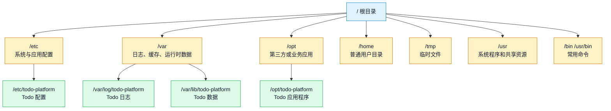
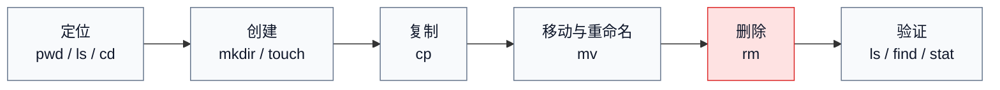
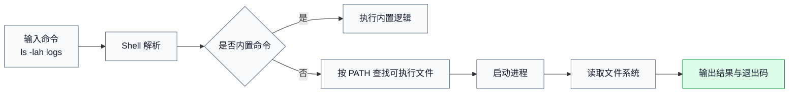
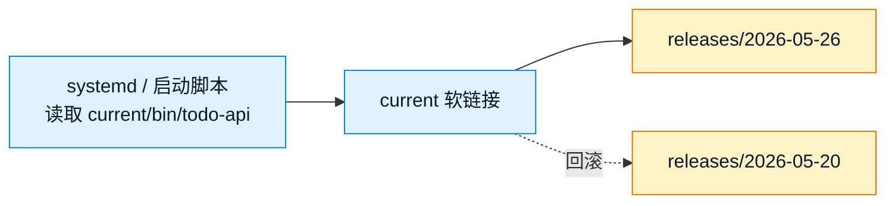

# 第 2 篇：Linux 文件系统与命令基础

本篇进入云原生学习中最基础、也最容易被低估的一层：Linux 文件系统与常用命令。

后端服务最终通常运行在 Linux 服务器、容器或 Kubernetes 节点中。你以后排查 Go 服务无法读取配置、容器日志找不到、挂载目录权限异常、CI 脚本找不到文件、Pod 因权限问题启动失败时，背后经常不是复杂框架问题，而是路径、权限、文件操作和文本处理这些基础没有打牢。

本篇对应 5 个章节主题：

- 2.1 Linux 目录结构与路径规则
- 2.2 文件与目录操作命令
- 2.3 用户、用户组与文件权限
- 2.4 文本查看、搜索与处理命令
- 2.5 压缩、解压、软链接与环境变量

本篇特色项目是：**搭建 Todo 平台服务器目录结构，创建日志、配置、数据目录**。

你会在 `cloud-native-todo-platform` 仓库中模拟一台 Linux 服务器的目录布局，为后续 Go API、Docker、Kubernetes、日志和配置管理提前准备工作基础。

## 1. 本章学习目标

学完本篇后，你应该能够熟练完成 Linux 服务器上最常见的文件、目录、权限和文本处理任务。

具体目标如下：

- 能说清 Linux 常见目录的用途，例如 `/etc`、`/var`、`/opt`、`/tmp`、`/home`。
- 能区分绝对路径、相对路径、当前目录、上级目录和用户主目录。
- 能熟练使用 `pwd`、`ls`、`cd` 查看和切换目录。
- 能使用 `mkdir`、`touch`、`cp`、`mv`、`rm` 创建、复制、移动、重命名和删除文件目录。
- 能理解用户、用户组、所有者、权限位和可执行权限。
- 能使用 `chmod`、`chown`、`stat` 检查和调整文件权限。
- 能使用 `cat`、`less`、`head`、`tail` 查看文本内容。
- 能使用 `grep`、`find` 搜索日志、配置和项目文件。
- 能使用 `tar` 完成目录压缩、备份和解压。
- 能使用 `ln -s` 创建软链接，理解它在版本发布中的价值。
- 能使用 `export`、`env`、`printenv` 查看和设置环境变量。
- 能为 Todo 平台设计一套清晰的服务器目录结构，并用脚本验证目录是否完整。

本篇结束时，你至少应该能独立完成以下任务：

```bash
ls -lah
cd ~/workspace/cloud-native-todo-platform
cp config/app.env config/app.env.bak
mv logs/api.log logs/todo-api.log
grep "ERROR" logs/todo-api.log
find . -name "*.env"
chmod 640 config/app.env
stat config/app.env
tar -czf todo-server-backup.tar.gz todo-server
ln -s releases/2026-05-26 current
```

这些命令看起来朴素，但它们是后端开发、DevOps、SRE 和 Kubernetes 排障每天都会用到的基本功。

## 2. 本章工作场景

Linux 文件系统能力在真实工作中非常常见，甚至比写复杂算法更频繁。

典型工作场景包括：

- 后端开发部署 Go 服务时，需要把可执行文件放到 `/opt/todo-platform/bin`，把配置放到 `/etc/todo-platform`，把日志写到 `/var/log/todo-platform`。
- 测试同学复现问题时，需要查看日志文件，搜索某个请求 ID 或错误关键字。
- DevOps 编写发布脚本时，需要创建目录、备份旧版本、切换软链接、回滚到上一个版本。
- SRE 排查线上故障时，需要判断服务进程是否因为权限不足无法读取配置或写入日志。
- 容器化时，需要理解容器内路径和宿主机挂载路径的关系。
- Kubernetes 中挂载 ConfigMap、Secret、PVC 时，需要理解文件权限、目录挂载和路径覆盖。
- 面试中经常会被问到：`chmod 755` 是什么意思，软链接和硬链接有什么区别，如何在日志中查找错误。

本篇不会把命令当成死记硬背的清单，而是围绕一个真实项目场景来学习：假设 Todo 平台要部署到一台 Linux 服务器上，我们应该如何规划目录、放置配置、管理日志、设置权限、备份数据，并能快速排障。

## 3. 前置知识

### 必须掌握

学习本篇前，你需要已经完成第 1 篇中的环境准备，并具备以下基础：

- 能打开 WSL2 Ubuntu、macOS Terminal 或 Linux 终端。
- 已经创建或知道课程主线仓库 `cloud-native-todo-platform`。
- 能执行简单命令并观察输出。
- 知道 Git 仓库、目录、文件、脚本的大致含义。

### 建议了解

以下内容不要求熟练，但建议有初步概念：

- 后端服务通常运行在 Linux 服务器或 Linux 容器中。
- 配置、日志、数据、可执行文件应该分开管理。
- Docker 和 Kubernetes 都会大量处理路径、挂载和权限。
- 文件权限配置错误会导致服务启动失败或产生安全风险。

### 新手补充方向

如果你是第一次系统学习 Linux 命令，可以先记住这张最小地图：

| 能力 | 常用命令 | 解决的问题 |
|---|---|---|
| 看位置 | `pwd`、`ls`、`cd` | 我现在在哪里，这里有什么 |
| 改文件 | `mkdir`、`touch`、`cp`、`mv`、`rm` | 创建、复制、移动、删除 |
| 查内容 | `cat`、`less`、`head`、`tail`、`grep` | 文件里写了什么，错误在哪里 |
| 找文件 | `find` | 文件在什么位置 |
| 管权限 | `chmod`、`chown`、`stat` | 谁能读、写、执行 |
| 打包备份 | `tar` | 把目录打包、压缩、迁移 |
| 连接路径 | `ln -s` | 用固定入口指向不同版本 |
| 配环境 | `export`、`env`、`printenv` | 让程序读取运行参数 |

后续 Go 服务、Dockerfile、Kubernetes YAML 和 Operator 项目都会反复使用这些能力。

## 4. 核心概念

### 4.1 Linux 文件系统是一棵树

Linux 文件系统从根目录 `/` 开始，所有文件和目录都挂在这棵树下面。



常见目录含义如下：

| 目录 | 常见用途 | Todo 平台中的类比 |
|---|---|---|
| `/` | 根目录，所有路径的起点 | 整台服务器的文件系统入口 |
| `/home` | 普通用户的主目录 | 开发者自己的工作区 |
| `/etc` | 配置文件 | `app.env`、日志配置 |
| `/var` | 经常变化的数据 | 日志、PID 文件、运行时数据 |
| `/var/log` | 日志文件 | `todo-api.log`、`error.log` |
| `/var/lib` | 应用持久化数据 | 上传文件、缓存数据、SQLite 测试数据 |
| `/opt` | 业务或第三方应用 | Todo API 可执行文件和发布版本 |
| `/tmp` | 临时文件 | 短期测试文件，不适合保存重要数据 |
| `/usr/bin` | 常用可执行命令 | `ls`、`grep`、`find` 等命令所在位置 |

真实生产环境中，不建议把所有东西都塞进一个目录。配置、日志、数据、程序分开管理，才能清楚控制权限、备份策略和故障影响范围。

### 4.2 绝对路径与相对路径

路径是定位文件和目录的方式。

绝对路径从 `/` 开始：

```bash
/home/dev/cloud-native-todo-platform
/etc/todo-platform/app.env
/var/log/todo-platform/todo-api.log
```

相对路径从当前目录开始：

```bash
docs/README.md
../cloud-native-todo-platform
./scripts/check-env.sh
```

几个特殊符号要记牢：

| 符号 | 含义 | 示例 |
|---|---|---|
| `/` | 根目录 | `cd /` |
| `.` | 当前目录 | `./scripts/check-env.sh` |
| `..` | 上一级目录 | `cd ..` |
| `~` | 当前用户主目录 | `cd ~/workspace` |
| `-` | 上一次所在目录 | `cd -` |

查看当前位置：

```bash
pwd
```

示例输出：

```text
/home/dev/workspace/cloud-native-todo-platform
```

这条命令很重要。任何删除、移动、压缩操作前，都应该先确认自己在正确目录。

### 4.3 文件和目录操作命令

Linux 常用文件操作可以分成五类：



常用命令说明：

| 命令 | 作用 | 示例 |
|---|---|---|
| `pwd` | 显示当前目录 | `pwd` |
| `ls` | 列出目录内容 | `ls -lah` |
| `cd` | 切换目录 | `cd ~/workspace` |
| `mkdir` | 创建目录 | `mkdir -p logs/api` |
| `touch` | 创建空文件或更新时间 | `touch logs/api.log` |
| `cp` | 复制文件或目录 | `cp app.env app.env.bak` |
| `mv` | 移动或重命名 | `mv api.log todo-api.log` |
| `rm` | 删除文件或目录 | `rm old.log` |

`rm` 是高风险命令。学习阶段也要建立习惯：先 `pwd` 和 `ls`，再删除；删除目录时尽量明确路径，避免在错误目录执行递归删除。

### 4.4 用户、用户组与文件权限

Linux 每个文件都有所有者、所属组和权限。

执行：

```bash
ls -l
```

可能看到：

```text
-rw-r----- 1 dev dev 128 May 26 10:00 app.env
drwxr-x--- 2 dev dev 4096 May 26 10:00 logs
```

这两行从左到右分别表示：

| 字段 | 示例 | 含义 |
|---|---|---|
| 文件类型与权限 | `-rw-r-----`、`drwxr-x---` | 文件类型、所有者权限、所属组权限、其他用户权限 |
| 链接数 | `1`、`2` | 文件硬链接数量；目录通常至少为 2 |
| 所有者 | `dev` | 拥有这个文件或目录的用户 |
| 所属组 | `dev` | 拥有这个文件或目录的用户组 |
| 大小 | `128`、`4096` | 文件大小；目录显示的是目录项元数据大小，不等于目录内文件总大小 |
| 修改时间 | `May 26 10:00` | 文件内容或目录项最后修改时间 |
| 名称 | `app.env`、`logs` | 文件名或目录名 |

第一列是权限信息，最容易和服务启动失败、配置读取失败、日志写入失败相关：

```text
-rw-r-----
│││ │││ │││
│││ │││ └── 其他用户权限
│││ └──── 所属组权限
│└────── 所有者权限
└─────── 文件类型，- 表示文件，d 表示目录，l 表示软链接
```

权限字符含义：

| 字符 | 含义 | 对文件 | 对目录 |
|---|---|---|---|
| `r` | read，读 | 查看文件内容 | 列出目录内容 |
| `w` | write，写 | 修改文件内容 | 创建、删除、重命名目录内文件 |
| `x` | execute，执行 | 执行脚本或二进制文件 | 进入目录 |
| `-` | 无权限 | 不能执行对应操作 | 不能执行对应操作 |

数字权限也很常见：

| 数字 | 权限 | 含义 |
|---:|---|---|
| 7 | `rwx` | 读、写、执行 |
| 6 | `rw-` | 读、写 |
| 5 | `r-x` | 读、执行 |
| 4 | `r--` | 只读 |
| 0 | `---` | 无权限 |

常见组合：

| 权限 | 适合对象 | 含义 |
|---|---|---|
| `755` | 普通目录、可执行脚本 | 所有者可写，其他人可读可执行 |
| `750` | 服务目录 | 所有者全权限，同组可读可进入，其他人无权限 |
| `700` | 私有目录 | 只有所有者可访问 |
| `644` | 普通公开配置或文档 | 所有者可写，其他人只读 |
| `640` | 应用配置 | 所有者可写，同组可读，其他人无权限 |
| `600` | 密钥、Token、敏感配置 | 只有所有者可读写 |

调整权限：

```bash
chmod 640 config/app.env
chmod +x scripts/check-filesystem-lab.sh
```

调整所有者和所属组：

```bash
sudo chown "$USER:$(id -gn)" config/app.env
```

`chmod` 解决“谁能做什么”，`chown` 解决“这个文件属于谁”。

### 4.5 文本查看、搜索与处理

配置和日志大多是文本文件。排障时，你经常需要快速回答：

- 配置文件里是否启用了某个参数？
- 日志里有没有 `ERROR`？
- 某个请求 ID 出现在哪些文件里？
- 最近 100 行日志发生了什么？

常用命令：

| 命令 | 作用 | 示例 |
|---|---|---|
| `cat` | 一次性输出文件内容 | `cat config/app.env` |
| `less` | 分页查看大文件 | `less logs/todo-api.log` |
| `head` | 查看文件开头 | `head -n 20 logs/todo-api.log` |
| `tail` | 查看文件结尾 | `tail -n 50 logs/todo-api.log` |
| `tail -f` | 持续追踪日志 | `tail -f logs/todo-api.log` |
| `grep` | 按关键字搜索 | `grep "ERROR" logs/*.log` |
| `find` | 按名称、类型、时间等找文件 | `find . -name "*.env"` |

示例：

```bash
grep -n "ERROR" logs/todo-api.log
```

含义：

- `grep` 搜索文本。
- `-n` 显示匹配行号。
- `"ERROR"` 是关键字。
- `logs/todo-api.log` 是要搜索的文件。

示例输出：

```text
3:2026-05-26T10:02:00Z ERROR failed to connect database
```

这说明第 3 行有错误日志。

真实排障时，`grep` 常常会组合使用：

```bash
grep -Rni "database" logs/
grep -v "health check" logs/todo-api.log
grep -E "ERROR|WARN" logs/todo-api.log
```

参数含义：

- `-R` 递归搜索目录。
- `-n` 显示行号。
- `-i` 忽略大小写。
- `-v` 反向匹配，排除不想看的行。
- `-E` 使用扩展正则，适合同时匹配多个关键字。

### 4.6 压缩、解压、软链接与环境变量

#### 压缩与解压

`tar` 常用于 Linux 目录打包和备份。

打包并压缩：

```bash
tar -czf todo-server-backup.tar.gz todo-server
```

解压：

```bash
tar -xzf todo-server-backup.tar.gz
```

参数含义：

| 参数 | 含义 |
|---|---|
| `-c` | create，创建归档 |
| `-x` | extract，解压归档 |
| `-z` | 使用 gzip 压缩或解压 |
| `-f` | 指定归档文件名 |
| `-v` | verbose，显示过程，排障时可加 |

#### 软链接

软链接类似一个指向目标路径的快捷入口。

```bash
ln -s releases/2026-05-26 current
```

查看：

```bash
ls -l current
```

示例输出：

```text
current -> releases/2026-05-26
```

真实发布中常见做法：

```text
/opt/todo-platform/
├── releases/
│   ├── 2026-05-20/
│   └── 2026-05-26/
└── current -> releases/2026-05-26
```

服务启动时只读取 `/opt/todo-platform/current/bin/todo-api`。发布新版本时切换 `current` 指向；回滚时再切回旧版本。这比到处修改启动路径更安全。

#### 环境变量

环境变量用于给命令和程序传递运行参数。

查看：

```bash
env
printenv PATH
```

设置当前终端临时变量：

```bash
export TODO_ENV=dev
export TODO_CONFIG=./etc/todo-platform/app.env
```

运行程序时读取：

```bash
echo "$TODO_ENV"
echo "$TODO_CONFIG"
```

Go、Docker、kubectl、Helm 都大量依赖环境变量。后续 Todo API 也会通过环境变量读取运行环境、配置路径、日志级别和数据库连接信息。

## 5. 原理深入

### 5.1 Shell 执行命令时发生了什么

当你输入：

```bash
ls -lah logs
```

Shell 会做几件事：

1. 解析命令名 `ls` 和参数 `-lah logs`。
2. 判断 `ls` 是不是 Shell 内置命令。
3. 如果不是，就在 `PATH` 环境变量中查找可执行文件。
4. 找到 `/usr/bin/ls` 后创建进程执行它。
5. `ls` 读取 `logs` 目录元数据，并把结果输出到终端。
6. 命令结束后返回退出码。

流程如下：



所以当你看到：

```text
command not found
```

不一定是系统坏了，通常是命令没有安装，或者命令所在目录没有加入 `PATH`。

### 5.2 文件权限为什么会影响服务启动

后端服务启动时通常会做这些操作：

- 读取配置文件。
- 创建日志文件。
- 写入 PID 或 socket 文件。
- 读取证书或密钥。
- 访问数据目录。

如果权限不正确，程序就会失败。

例如配置文件权限是：

```text
-rw------- 1 root root app.env
```

而 Todo API 进程使用 `todo` 用户启动，那么它无法读取这个文件，可能报错：

```text
permission denied: open /etc/todo-platform/app.env
```

这类问题在 Kubernetes 中也很常见。容器内进程使用非 root 用户运行，如果挂载的 ConfigMap、Secret 或 PVC 权限不合适，应用就可能无法读取配置或写入数据。

### 5.3 目录权限中的执行位

很多新手以为目录只需要 `r` 权限就能进入，其实目录的 `x` 权限非常关键。

对目录来说：

- `r` 允许列出目录内容。
- `w` 允许在目录中创建、删除、重命名文件。
- `x` 允许进入目录，访问目录内文件。

如果目录权限是：

```text
drw-r----- logs
```

即使有读权限，也可能无法 `cd logs` 或访问里面的文件，因为缺少执行位。

所以服务日志目录通常不能随便设置成只读。常见配置是：

```bash
chmod 750 logs
```

含义是：所有者可读写进入，同组可读和进入，其他人无权限。

### 5.4 软链接为什么适合发布和回滚

发布系统常用软链接把稳定路径指向具体版本。



这样做的好处：

- 启动脚本不用每次改版本号。
- 发布新版本只是切换链接。
- 回滚可以快速把链接指回旧版本。
- 多个版本目录可以同时保留，便于比较和恢复。

在 Kubernetes 中，镜像版本和 Deployment 回滚承担类似角色；在传统 Linux 服务器上，软链接是非常实用的发布技巧。

### 5.5 文本搜索为什么是排障基本功

真实故障排查不是凭感觉猜，而是从日志和配置中找证据。

比如用户反馈 Todo API 创建任务失败，你可能需要：

```bash
grep -n "ERROR" /var/log/todo-platform/todo-api.log
grep -n "request_id=abc123" /var/log/todo-platform/*.log
grep -n "DB_HOST" /etc/todo-platform/app.env
```

判断依据：

- 日志里有 `ERROR`，说明应用确实记录了失败。
- 同一个 `request_id` 能串起一次请求的完整链路。
- 配置中的 `DB_HOST` 可以判断服务连的是本地数据库、测试库还是错误地址。

这也是为什么后续我们写 Go 服务时，会强调结构化日志、请求 ID 和清晰配置。

### 5.6 文件系统布局和云原生的关系

Linux 文件系统能力会直接迁移到 Docker 和 Kubernetes：

| Linux 基础 | Docker / Kubernetes 中的体现 |
|---|---|
| 路径 | 容器内工作目录、挂载路径、镜像文件路径 |
| 权限 | 非 root 容器、SecurityContext、PVC 权限 |
| 配置文件 | ConfigMap、Secret 挂载为文件 |
| 日志文件 | 容器 stdout/stderr、宿主机日志目录、日志采集 |
| 数据目录 | Volume、PVC、StatefulSet 数据盘 |
| 环境变量 | Pod env、Secret env、应用启动参数 |
| 软链接 | 镜像层、发布目录、工具链版本切换 |

如果你在 Linux 本机上理解了这些概念，后面看 Dockerfile、Pod 挂载、ConfigMap 权限和日志采集会轻松很多。

本篇暂不编写 Kubernetes YAML。原因是这一篇的目标是把 Linux 文件系统基础打牢，后续到 ConfigMap、Secret、PVC、SecurityContext 时，再把这些路径、权限、挂载知识放进 YAML 中系统展开。

## 6. 手把手实验

### 6.1 实验目标

本实验完成本篇特色项目：在 `cloud-native-todo-platform` 仓库中搭建 Todo 平台服务器目录结构，创建日志、配置、数据目录，并完成权限、搜索、备份、软链接和环境变量演练。

你最终会得到：

- 一个模拟服务器根目录：`labs/linux-filesystem/todo-server/`。
- 配置目录：`etc/todo-platform/`。
- 程序目录：`opt/todo-platform/`。
- 日志目录：`var/log/todo-platform/`。
- 数据目录：`var/lib/todo-platform/`。
- 运行时目录：`var/run/todo-platform/`。
- 发布版本目录和 `current` 软链接。
- 示例配置文件、日志文件、数据文件和可执行脚本。
- 一个目录检查脚本：`scripts/check-filesystem-lab.sh`。
- 一个本地压缩备份文件，用于练习恢复验证，但默认不提交到 Git。

### 6.2 实验环境

推荐环境：

| 项目 | 要求 |
|---|---|
| 操作系统 | WSL2 Ubuntu、macOS 或 Linux |
| Shell | Bash 或 Zsh |
| 仓库 | 已完成第 1 篇初始化的 `cloud-native-todo-platform` |
| 权限 | 普通用户即可；`chown` 演练需要可使用 `sudo` |
| 必需命令 | `ls`、`cd`、`cp`、`mv`、`rm`、`cat`、`less`、`grep`、`find`、`chmod`、`chown`、`tar`、`ln` |

不同系统下推荐这样执行本实验：

=== "Windows + WSL2"

    在 WSL2 Ubuntu 终端中执行本章所有命令。课程仓库建议放在 `~/workspace/cloud-native-todo-platform`，不要放在 `/mnt/c/Users/...` 下，避免跨文件系统带来的性能、权限和换行符问题。

=== "macOS"

    在 macOS Terminal 中执行本章命令。macOS 可以完成本实验，但 `stat`、`ls` 的部分字段格式可能和 GNU/Linux 略有不同。学习时以“权限、所有者、所属组、路径含义”这些核心概念为准，不要求输出逐字符一致。

=== "Linux"

    在本机 Linux Shell 中执行本章命令。课程示例以 Ubuntu 22.04 / 24.04 为基准，其他发行版可以完成主要文件系统实验，但软件包命令和部分工具输出可能略有差异。

本实验默认所有命令都在 `cloud-native-todo-platform` 仓库根目录执行。后续如果你关闭并重新打开终端，需要先回到仓库根目录，并重新设置：

```bash
cd ~/workspace/cloud-native-todo-platform
export LAB_ROOT="labs/linux-filesystem/todo-server"
```

先确认命令是否存在：

```bash
command -v ls
command -v grep
command -v find
command -v tar
```

预期这些命令都能输出路径，例如：

```text
/usr/bin/ls
/usr/bin/grep
/usr/bin/find
/usr/bin/tar
```

### 6.3 实验目录结构

本实验不直接修改系统的 `/etc`、`/var`、`/opt`，而是在仓库中模拟服务器目录，避免新手误操作系统文件。

最终结构如下：

```text
cloud-native-todo-platform/
├── labs/
│   └── linux-filesystem/
│       └── todo-server/
│           ├── etc/
│           │   └── todo-platform/
│           │       ├── app.env
│           │       └── logging.conf
│           ├── opt/
│           │   └── todo-platform/
│           │       ├── bin/
│           │       │   └── todo-api
│           │       ├── current -> releases/2026-05-26
│           │       ├── releases/
│           │       │   ├── 2026-05-20/
│           │       │   └── 2026-05-26/
│           │       └── shared/
│           ├── var/
│           │   ├── lib/
│           │   │   └── todo-platform/
│           │   │       └── todos.tsv
│           │   ├── log/
│           │   │   └── todo-platform/
│           │   │       ├── access.log
│           │   │       └── todo-api.log
│           │   └── run/
│           │       └── todo-platform/
│           │           └── todo-api.pid
│           └── tmp/
├── scripts/
│   └── check-filesystem-lab.sh
└── backups/
    └── todo-server-2026-05-26.tar.gz
```

和真实服务器的对应关系：

| 实验路径 | 真实服务器路径 | 用途 |
|---|---|---|
| `labs/linux-filesystem/todo-server/etc/todo-platform` | `/etc/todo-platform` | 应用配置 |
| `labs/linux-filesystem/todo-server/opt/todo-platform` | `/opt/todo-platform` | 应用程序与版本 |
| `labs/linux-filesystem/todo-server/var/log/todo-platform` | `/var/log/todo-platform` | 应用日志 |
| `labs/linux-filesystem/todo-server/var/lib/todo-platform` | `/var/lib/todo-platform` | 应用数据 |
| `labs/linux-filesystem/todo-server/var/run/todo-platform` | `/var/run/todo-platform` | PID、socket 等运行时文件 |

### 6.4 进入课程仓库

先进入第 1 篇创建的课程主线仓库。

```bash
cd ~/workspace/cloud-native-todo-platform
pwd
```

如果你的仓库不在这个位置，请替换成自己的真实路径。

预期输出类似：

```text
/home/dev/workspace/cloud-native-todo-platform
```

为什么要先 `pwd`：后面会创建和删除目录，必须确认当前目录正确。

从这里开始，除非特别说明，所有命令都默认在仓库根目录执行。

### 6.5 创建实验根目录

定义一个变量，避免后续重复输入长路径。

```bash
export LAB_ROOT="labs/linux-filesystem/todo-server"
echo "$LAB_ROOT"
```

创建目录：

```bash
mkdir -p "$LAB_ROOT/etc/todo-platform"
mkdir -p "$LAB_ROOT/opt/todo-platform/bin"
mkdir -p "$LAB_ROOT/opt/todo-platform/releases/2026-05-20"
mkdir -p "$LAB_ROOT/opt/todo-platform/releases/2026-05-26"
mkdir -p "$LAB_ROOT/opt/todo-platform/shared"
mkdir -p "$LAB_ROOT/var/log/todo-platform"
mkdir -p "$LAB_ROOT/var/lib/todo-platform"
mkdir -p "$LAB_ROOT/var/run/todo-platform"
mkdir -p "$LAB_ROOT/tmp"
mkdir -p backups scripts
```

命令解释：

- `mkdir` 创建目录。
- `-p` 表示父目录不存在时一起创建，目录已存在时不报错。
- `"$LAB_ROOT"` 加双引号是为了避免路径中出现空格时被错误拆分。

验证：

```bash
find "$LAB_ROOT" -type d | sort
```

预期输出中应该包含：

```text
labs/linux-filesystem/todo-server/etc/todo-platform
labs/linux-filesystem/todo-server/opt/todo-platform/bin
labs/linux-filesystem/todo-server/var/log/todo-platform
labs/linux-filesystem/todo-server/var/lib/todo-platform
```

Checkpoint 1：如果上面的目录都能看到，说明实验骨架已经创建成功。后续如果某一步失败，可以先重新执行：

```bash
cd ~/workspace/cloud-native-todo-platform
export LAB_ROOT="labs/linux-filesystem/todo-server"
find "$LAB_ROOT" -maxdepth 3 -type d | sort
```

### 6.6 创建配置文件

创建应用配置文件：

```bash
cat > "$LAB_ROOT/etc/todo-platform/app.env" <<'EOF'
TODO_ENV=dev
TODO_HTTP_ADDR=127.0.0.1:8080
TODO_LOG_LEVEL=info
TODO_DATA_DIR=var/lib/todo-platform
TODO_LOG_DIR=var/log/todo-platform
TODO_CONFIG_VERSION=2026-05-26
EOF
```

创建日志配置文件：

```bash
cat > "$LAB_ROOT/etc/todo-platform/logging.conf" <<'EOF'
[log]
level = info
format = text
output = var/log/todo-platform/todo-api.log
rotate = daily
max_size_mb = 100
EOF
```

为什么配置放在 `etc/todo-platform`：

- 配置和程序分离，方便不同环境使用不同配置。
- 后续迁移到 Docker 和 Kubernetes 时，可以把配置映射到 ConfigMap 或 Secret。
- 配置文件权限可以单独收紧，避免泄露敏感信息。

查看配置：

```bash
cat "$LAB_ROOT/etc/todo-platform/app.env"
```

预期输出包含：

```text
TODO_ENV=dev
TODO_HTTP_ADDR=127.0.0.1:8080
```

### 6.7 创建示例日志和数据文件

创建访问日志：

```bash
cat > "$LAB_ROOT/var/log/todo-platform/access.log" <<'EOF'
2026-05-26T10:00:01Z method=GET path=/health status=200 latency_ms=2 request_id=req-001
2026-05-26T10:01:11Z method=POST path=/api/todos status=201 latency_ms=8 request_id=req-002
2026-05-26T10:02:23Z method=GET path=/api/todos status=200 latency_ms=5 request_id=req-003
EOF
```

创建应用日志：

```bash
cat > "$LAB_ROOT/var/log/todo-platform/todo-api.log" <<'EOF'
2026-05-26T10:00:00Z INFO starting todo api env=dev
2026-05-26T10:00:01Z INFO health check ok request_id=req-001
2026-05-26T10:01:11Z INFO created todo id=1 request_id=req-002
2026-05-26T10:02:00Z ERROR failed to connect database request_id=req-004
2026-05-26T10:02:10Z WARN retry database connection request_id=req-004
2026-05-26T10:02:20Z INFO database connection recovered request_id=req-004
EOF
```

创建数据文件：

```bash
cat > "$LAB_ROOT/var/lib/todo-platform/todos.tsv" <<'EOF'
id	title	status
1	prepare linux filesystem lab	done
2	write todo api skeleton	pending
3	add dockerfile	pending
EOF
```

创建运行时 PID 文件：

```bash
echo "10001" > "$LAB_ROOT/var/run/todo-platform/todo-api.pid"
```

验证文件：

```bash
find "$LAB_ROOT/var" -type f | sort
```

预期输出：

```text
labs/linux-filesystem/todo-server/var/lib/todo-platform/todos.tsv
labs/linux-filesystem/todo-server/var/log/todo-platform/access.log
labs/linux-filesystem/todo-server/var/log/todo-platform/todo-api.log
labs/linux-filesystem/todo-server/var/run/todo-platform/todo-api.pid
```

### 6.8 创建可执行脚本模拟服务程序

现在创建一个简化版 `todo-api` 可执行脚本，用来模拟后续 Go API 的启动入口。

```bash
cat > "$LAB_ROOT/opt/todo-platform/bin/todo-api" <<'EOF'
#!/usr/bin/env bash
set -euo pipefail

CONFIG_FILE="${TODO_CONFIG:-labs/linux-filesystem/todo-server/etc/todo-platform/app.env}"

if [ ! -f "$CONFIG_FILE" ]; then
  echo "config file not found: $CONFIG_FILE" >&2
  exit 1
fi

echo "Todo API placeholder"
echo "config: $CONFIG_FILE"
grep '^TODO_ENV=' "$CONFIG_FILE"
grep '^TODO_HTTP_ADDR=' "$CONFIG_FILE"
EOF
```

给脚本增加执行权限：

```bash
chmod +x "$LAB_ROOT/opt/todo-platform/bin/todo-api"
```

运行：

```bash
"$LAB_ROOT/opt/todo-platform/bin/todo-api"
```

预期输出：

```text
Todo API placeholder
config: labs/linux-filesystem/todo-server/etc/todo-platform/app.env
TODO_ENV=dev
TODO_HTTP_ADDR=127.0.0.1:8080
```

为什么要 `chmod +x`：

- 文件只有读权限时，只能查看内容，不能作为程序执行。
- Shell 脚本、Go 编译后的二进制文件、部署脚本都需要执行权限。

### 6.9 使用 `ls` 和 `stat` 检查文件信息

查看目录：

```bash
ls -lah "$LAB_ROOT"
ls -lah "$LAB_ROOT/etc/todo-platform"
ls -lah "$LAB_ROOT/opt/todo-platform/bin"
```

查看详细元数据：

```bash
stat "$LAB_ROOT/etc/todo-platform/app.env"
stat "$LAB_ROOT/opt/todo-platform/bin/todo-api"
```

重点观察：

- `Size`：文件大小。
- `Access`：权限。
- `Uid` / `Gid`：所有者和所属组。
- `Modify`：最后修改时间。

如果服务无法读取配置或执行脚本，`ls -l` 和 `stat` 是最先看的命令。

### 6.10 使用 `cp` 备份配置

配置变更前先备份，这是生产环境的基本习惯。

```bash
cp "$LAB_ROOT/etc/todo-platform/app.env" "$LAB_ROOT/etc/todo-platform/app.env.bak"
ls -lah "$LAB_ROOT/etc/todo-platform"
```

预期能看到：

```text
app.env
app.env.bak
logging.conf
```

验证备份内容一致：

```bash
diff "$LAB_ROOT/etc/todo-platform/app.env" "$LAB_ROOT/etc/todo-platform/app.env.bak"
```

如果没有输出，表示两个文件内容一致。

### 6.11 使用 `mv` 重命名和移动文件

把应用日志重命名为更清晰的名字：

```bash
mv "$LAB_ROOT/var/log/todo-platform/todo-api.log" "$LAB_ROOT/var/log/todo-platform/api.log"
ls -lah "$LAB_ROOT/var/log/todo-platform"
```

再改回去，保持后续实验一致：

```bash
mv "$LAB_ROOT/var/log/todo-platform/api.log" "$LAB_ROOT/var/log/todo-platform/todo-api.log"
```

`mv` 既可以移动文件，也可以重命名文件。真实发布脚本中经常用它移动构建产物、归档日志、切换临时文件。

### 6.12 使用 `rm` 安全删除临时文件

创建临时文件：

```bash
touch "$LAB_ROOT/tmp/test.tmp"
ls -lah "$LAB_ROOT/tmp"
```

删除：

```bash
rm "$LAB_ROOT/tmp/test.tmp"
ls -lah "$LAB_ROOT/tmp"
```

删除目录时要更谨慎。本实验只演示删除明确的临时目录：

```bash
mkdir -p "$LAB_ROOT/tmp/remove-me"
touch "$LAB_ROOT/tmp/remove-me/example.txt"
rm -r "$LAB_ROOT/tmp/remove-me"
```

生产习惯：

- 删除前先 `pwd`。
- 删除前先 `ls`。
- 尽量删除明确路径。
- 不要复制粘贴来路不明的 `rm -rf`。

如果要批量删除，先用 `find` 预览目标，再决定是否删除：

```bash
find "$LAB_ROOT/tmp" -type f -name "*.tmp" -print
```

只有确认输出都是可以删除的临时文件后，再考虑执行删除命令。生产环境中更推荐把这类清理逻辑写进脚本，并对目标路径做保护判断。

### 6.13 设置目录和文件权限

设置目录权限：

```bash
chmod 750 "$LAB_ROOT/etc/todo-platform"
chmod 750 "$LAB_ROOT/var/log/todo-platform"
chmod 750 "$LAB_ROOT/var/lib/todo-platform"
chmod 750 "$LAB_ROOT/var/run/todo-platform"
```

设置配置文件权限：

```bash
chmod 640 "$LAB_ROOT/etc/todo-platform/app.env"
chmod 640 "$LAB_ROOT/etc/todo-platform/logging.conf"
```

设置脚本权限：

```bash
chmod 755 "$LAB_ROOT/opt/todo-platform/bin/todo-api"
```

查看：

```bash
ls -ld "$LAB_ROOT/etc/todo-platform" "$LAB_ROOT/var/log/todo-platform"
ls -l "$LAB_ROOT/etc/todo-platform/app.env" "$LAB_ROOT/opt/todo-platform/bin/todo-api"
```

预期类似：

```text
drwxr-x--- ... etc/todo-platform
-rw-r----- ... app.env
-rwxr-xr-x ... todo-api
```

为什么这样设置：

- 配置目录不应该被所有人随便进入。
- 配置文件允许所有者写、同组读，其他人无权限。
- 可执行文件需要执行权限，否则无法启动。

Checkpoint 2：此时你应该能看到 `app.env` 是 `-rw-r-----`，`todo-api` 是 `-rwxr-xr-x`。如果权限不对，重新执行本小节的 `chmod` 命令即可。

### 6.14 可选：使用 `chown` 理解所有者

先查看当前用户和用户组：

```bash
whoami
id
id -gn
```

本实验中的文件都是你在仓库中创建的，通常已经属于当前用户，不需要修改所有者。先查看所有者即可：

```bash
ls -ld "$LAB_ROOT" "$LAB_ROOT/etc/todo-platform"
ls -l "$LAB_ROOT/etc/todo-platform/app.env"
```

如果你只是想理解 `chown` 的作用，可以在一个临时文件上演练，不要对系统目录做递归修改：

```bash
touch "$LAB_ROOT/tmp/chown-demo.txt"
sudo chown "$USER:$(id -gn)" "$LAB_ROOT/tmp/chown-demo.txt"
ls -l "$LAB_ROOT/tmp/chown-demo.txt"
rm "$LAB_ROOT/tmp/chown-demo.txt"
```

说明：

- 在很多 Linux 系统中，普通用户不能随意修改文件所有者，所以需要 `sudo`。
- 如果你没有 `sudo` 权限，可以跳过这个可选演练，不影响本章验收。
- 不建议对学习仓库执行不必要的 `sudo chown -R`，更不要对 `/etc`、`/var`、`/opt` 这类真实系统目录随意递归修改。
- 生产环境中，通常会创建专门的服务用户，例如 `todo`，由它运行 Todo API。

生产中可能会这样做：

```bash
sudo useradd --system --home /opt/todo-platform --shell /usr/sbin/nologin todo
sudo chown -R todo:todo /opt/todo-platform /var/lib/todo-platform /var/log/todo-platform
```

本课程现在不要求你在本机创建系统用户，先理解原则即可。

### 6.15 查看文本内容

根据文件大小和排障目标选择查看方式：

=== "cat 小文件"

    一次性查看小型配置文件：

    ```bash
    cat "$LAB_ROOT/etc/todo-platform/app.env"
    ```

    `cat` 适合几十行以内的小文件，例如 `.env`、`.conf`、README 片段。线上日志很大时，不要直接 `cat` 整个文件刷屏。

=== "head 前几行"

    查看日志开头，常用于确认文件格式、启动时间和第一批初始化日志：

    ```bash
    head -n 3 "$LAB_ROOT/var/log/todo-platform/todo-api.log"
    ```

=== "tail 最后几行"

    查看日志末尾，常用于定位最近发生的错误：

    ```bash
    tail -n 3 "$LAB_ROOT/var/log/todo-platform/todo-api.log"
    ```

=== "less 分页"

    分页查看日志，适合较大的日志文件：

    ```bash
    less "$LAB_ROOT/var/log/todo-platform/todo-api.log"
    ```

    在 `less` 中常用按键：

    | 按键 | 作用 |
    |---|---|
    | `Space` | 下一页 |
    | `b` | 上一页 |
    | `/ERROR` | 搜索 `ERROR` |
    | `n` | 下一个匹配 |
    | `q` | 退出 |

### 6.16 使用 `grep` 搜索日志和配置

根据排障目标选择搜索方式：

=== "错误日志"

    搜索错误日志：

    ```bash
    grep -n "ERROR" "$LAB_ROOT/var/log/todo-platform/todo-api.log"
    ```

    预期输出：

    ```text
    4:2026-05-26T10:02:00Z ERROR failed to connect database request_id=req-004
    ```

=== "请求 ID"

    搜索某个请求 ID，适合把一次请求在多份日志中的轨迹串起来：

    ```bash
    grep -n "request_id=req-004" "$LAB_ROOT/var/log/todo-platform/"*.log
    ```

=== "配置项"

    搜索配置项，适合确认服务实际读取的关键变量：

    ```bash
    grep -n "^TODO_" "$LAB_ROOT/etc/todo-platform/app.env"
    grep -n "^TODO_LOG_LEVEL=" "$LAB_ROOT/etc/todo-platform/app.env"
    ```

=== "错误数量"

    统计错误数量，适合快速判断故障是否持续出现：

    ```bash
    grep -c "ERROR" "$LAB_ROOT/var/log/todo-platform/todo-api.log"
    ```

=== "忽略大小写"

    忽略大小写搜索，适合关键字大小写不统一的日志：

    ```bash
    grep -ni "database" "$LAB_ROOT/var/log/todo-platform/todo-api.log"
    ```

为什么要掌握 `grep`：

- 排查日志最快。
- 检查配置最直接。
- 后续 CI/CD 和 Shell 脚本会大量用它判断结果。

### 6.17 使用 `find` 查找文件

根据要找的对象选择查找方式：

=== "配置文件"

    查找所有配置文件：

    ```bash
    find "$LAB_ROOT" -type f -name "*.env"
    find "$LAB_ROOT" -type f -name "*.conf"
    ```

=== "日志文件"

    查找所有日志文件：

    ```bash
    find "$LAB_ROOT/var/log" -type f -name "*.log"
    ```

=== "可执行文件"

    查找可执行文件，适合确认脚本或服务二进制是否具备执行权限：

    ```bash
    find "$LAB_ROOT/opt/todo-platform/bin" -type f -perm -111
    ```

=== "最近修改"

    查找最近 1 天修改过的文件，适合排查“谁刚刚改过配置或日志”的问题：

    ```bash
    find "$LAB_ROOT" -type f -mtime -1
    ```

`find` 适合回答“文件在哪里”。在大型项目和服务器上，手工一层层 `cd` 很低效。

### 6.18 创建发布目录和软链接

模拟两个发布版本：

```bash
cp "$LAB_ROOT/opt/todo-platform/bin/todo-api" "$LAB_ROOT/opt/todo-platform/releases/2026-05-20/todo-api"
cp "$LAB_ROOT/opt/todo-platform/bin/todo-api" "$LAB_ROOT/opt/todo-platform/releases/2026-05-26/todo-api"
```

写入版本说明：

```bash
echo "release 2026-05-20" > "$LAB_ROOT/opt/todo-platform/releases/2026-05-20/VERSION"
echo "release 2026-05-26" > "$LAB_ROOT/opt/todo-platform/releases/2026-05-26/VERSION"
```

创建 `current` 软链接：

```bash
cd "$LAB_ROOT/opt/todo-platform"
ln -sfn releases/2026-05-26 current
cd -
```

查看：

```bash
ls -l "$LAB_ROOT/opt/todo-platform/current"
cat "$LAB_ROOT/opt/todo-platform/current/VERSION"
```

预期输出：

```text
release 2026-05-26
```

模拟回滚：

```bash
cd "$LAB_ROOT/opt/todo-platform"
ln -sfn releases/2026-05-20 current
cd -
cat "$LAB_ROOT/opt/todo-platform/current/VERSION"
```

预期输出：

```text
release 2026-05-20
```

切回新版本：

```bash
cd "$LAB_ROOT/opt/todo-platform"
ln -sfn releases/2026-05-26 current
cd -
```

参数说明：

- `ln -s` 创建软链接。
- `-f` 如果目标已存在则替换。
- `-n` 把已存在的链接本身当作链接处理，避免误操作链接指向的目录。

Checkpoint 3：此时 `current` 必须是软链接，并且应该指向 `releases/2026-05-26`。

```bash
test -L "$LAB_ROOT/opt/todo-platform/current" && echo "current is symlink"
readlink "$LAB_ROOT/opt/todo-platform/current"
```

预期输出类似：

```text
current is symlink
releases/2026-05-26
```

### 6.19 使用环境变量启动脚本

设置配置路径：

```bash
export TODO_CONFIG="$LAB_ROOT/etc/todo-platform/app.env"
echo "$TODO_CONFIG"
```

通过软链接启动脚本：

```bash
"$LAB_ROOT/opt/todo-platform/current/todo-api"
```

预期输出包含：

```text
Todo API placeholder
TODO_ENV=dev
TODO_HTTP_ADDR=127.0.0.1:8080
```

查看环境变量：

```bash
printenv TODO_CONFIG
env | grep '^TODO_'
```

说明：

- 当前终端中 `export` 的变量只在当前会话和子进程中有效。
- 关闭终端后变量会消失，除非写入 `~/.bashrc`、`~/.profile` 或服务管理配置。
- 生产服务通常通过 systemd、容器环境变量或 Kubernetes `env` 注入。

### 6.20 打包备份和解压验证

回到仓库根目录：

```bash
cd ~/workspace/cloud-native-todo-platform
```

如果你的仓库不在默认路径，请回到自己的仓库根目录。

创建压缩包：

```bash
tar -czf backups/todo-server-2026-05-26.tar.gz -C labs/linux-filesystem todo-server
```

命令解释：

- `-c` 创建归档。
- `-z` 使用 gzip 压缩。
- `-f` 指定输出文件。
- `-C labs/linux-filesystem` 先切换到该目录再打包，避免压缩包里带上过长路径。

查看压缩包内容：

```bash
tar -tzf backups/todo-server-2026-05-26.tar.gz | head -n 20
```

解压到临时目录验证：

```bash
mkdir -p "$LAB_ROOT/tmp/restore-test"
tar -xzf backups/todo-server-2026-05-26.tar.gz -C "$LAB_ROOT/tmp/restore-test"
find "$LAB_ROOT/tmp/restore-test" -maxdepth 3 -type d | sort
```

验证后清理临时解压目录：

```bash
rm -rf "$LAB_ROOT/tmp/restore-test"
```

生产中，备份不是“打包成功”就结束，还要定期做恢复验证。不能恢复的备份等于没有备份。

Checkpoint 4：此时备份包应该能列出内容，也能解压到临时目录。如果 `tar -tzf` 报错，说明备份包不可读，需要重新打包。

### 6.21 编写目录检查脚本

创建检查脚本：

```bash
cat > scripts/check-filesystem-lab.sh <<'EOF'
#!/usr/bin/env bash
set -euo pipefail

LAB_ROOT="${1:-labs/linux-filesystem/todo-server}"

required_dirs=(
  "$LAB_ROOT/etc/todo-platform"
  "$LAB_ROOT/opt/todo-platform/bin"
  "$LAB_ROOT/opt/todo-platform/releases"
  "$LAB_ROOT/var/log/todo-platform"
  "$LAB_ROOT/var/lib/todo-platform"
  "$LAB_ROOT/var/run/todo-platform"
  "$LAB_ROOT/tmp"
)

required_files=(
  "$LAB_ROOT/etc/todo-platform/app.env"
  "$LAB_ROOT/etc/todo-platform/logging.conf"
  "$LAB_ROOT/opt/todo-platform/bin/todo-api"
  "$LAB_ROOT/opt/todo-platform/releases/2026-05-26/VERSION"
  "$LAB_ROOT/var/log/todo-platform/access.log"
  "$LAB_ROOT/var/log/todo-platform/todo-api.log"
  "$LAB_ROOT/var/lib/todo-platform/todos.tsv"
)

backup_file="backups/todo-server-2026-05-26.tar.gz"

echo "checking filesystem lab: $LAB_ROOT"

for dir in "${required_dirs[@]}"; do
  if [ ! -d "$dir" ]; then
    echo "missing directory: $dir" >&2
    exit 1
  fi
done

for file in "${required_files[@]}"; do
  if [ ! -f "$file" ]; then
    echo "missing file: $file" >&2
    exit 1
  fi
done

if [ ! -x "$LAB_ROOT/opt/todo-platform/bin/todo-api" ]; then
  echo "todo-api is not executable" >&2
  exit 1
fi

if [ ! -L "$LAB_ROOT/opt/todo-platform/current" ]; then
  echo "current is not a symbolic link" >&2
  exit 1
fi

current_target="$(readlink "$LAB_ROOT/opt/todo-platform/current")"
if [ "$current_target" != "releases/2026-05-26" ]; then
  echo "current points to unexpected target: $current_target" >&2
  exit 1
fi

app_env_perm="$(stat -c '%a' "$LAB_ROOT/etc/todo-platform/app.env" 2>/dev/null || stat -f '%Lp' "$LAB_ROOT/etc/todo-platform/app.env")"
case "$app_env_perm" in
  600|640)
    ;;
  *)
    echo "app.env permission should be 600 or 640, got: $app_env_perm" >&2
    exit 1
    ;;
esac

if ! grep -q '^TODO_ENV=dev$' "$LAB_ROOT/etc/todo-platform/app.env"; then
  echo "TODO_ENV=dev not found in app.env" >&2
  exit 1
fi

if ! grep -q 'ERROR' "$LAB_ROOT/var/log/todo-platform/todo-api.log"; then
  echo "expected sample ERROR log not found" >&2
  exit 1
fi

if [ ! -f "$backup_file" ]; then
  echo "backup file not found: $backup_file" >&2
  exit 1
fi

if ! tar -tzf "$backup_file" >/dev/null; then
  echo "backup file is not readable: $backup_file" >&2
  exit 1
fi

echo "filesystem lab ok"
EOF
```

增加执行权限：

```bash
chmod +x scripts/check-filesystem-lab.sh
```

运行：

```bash
./scripts/check-filesystem-lab.sh
```

预期输出：

```text
checking filesystem lab: labs/linux-filesystem/todo-server
filesystem lab ok
```

这个脚本体现了真实工作中的自动化意识：不要靠肉眼检查目录是否完整，而是把检查逻辑固化成脚本。它不仅检查目录和文件是否存在，还检查脚本可执行权限、配置文件权限、`current` 软链接目标，以及备份包是否可读。

### 6.22 统一验证命令

在仓库根目录执行：

```bash
pwd
ls -lah
find "$LAB_ROOT" -maxdepth 4 -type d | sort
find "$LAB_ROOT" -type f | sort
grep -n "ERROR" "$LAB_ROOT/var/log/todo-platform/todo-api.log"
find "$LAB_ROOT" -type f -name "*.env"
ls -l "$LAB_ROOT/opt/todo-platform/current"
tar -tzf backups/todo-server-2026-05-26.tar.gz | head -n 10
./scripts/check-filesystem-lab.sh
```

验收标准：

- 目录结构完整。
- 配置、日志、数据文件存在。
- `todo-api` 有执行权限。
- `grep` 能搜索到示例错误日志。
- `find` 能查找到 `.env` 配置文件。
- `current` 软链接指向当前发布版本。
- 备份压缩包能列出内容。
- `check-filesystem-lab.sh` 输出 `filesystem lab ok`，并且能检查权限、软链接和备份包。

### 6.23 Git 提交实验成果

本实验会生成日志和备份包。学习阶段可以保留在本机用于复盘，但生产项目中通常不把日志、临时文件、备份包提交到 Git。这里推荐把备份包加入忽略规则，示例日志是否提交由团队规范决定。

先追加忽略规则：

```bash
cat >> .gitignore <<'EOF'

# Linux filesystem lab local artifacts
backups/*.tar.gz
labs/linux-filesystem/todo-server/tmp/
EOF
```

查看 Git 状态：

```bash
git status --short
```

添加文件：

```bash
git add .gitignore labs/linux-filesystem scripts/check-filesystem-lab.sh
```

提交：

```bash
git commit -m "Add linux filesystem lab"
```

说明：

- `backups/*.tar.gz` 默认不提交，因为备份包是本地验证产物。
- 示例日志是本章实验输入，可以随实验目录一起提交；真实生产日志不应该进入 Git。
- 真实项目中的备份、数据库导出、运行日志应进入对象存储、备份系统、日志平台或制品库，而不是代码仓库。

### 6.24 清理步骤

如果你只是练习，想清理本章实验文件，先确认路径：

```bash
pwd
echo "$LAB_ROOT"
```

确认你在 `cloud-native-todo-platform` 仓库根目录，并且 `LAB_ROOT` 是：

```text
labs/linux-filesystem/todo-server
```

再执行安全清理：

```bash
case "$LAB_ROOT" in
  labs/linux-filesystem/todo-server)
    rm -rf "$LAB_ROOT"
    ;;
  *)
    echo "refuse to remove unexpected path: $LAB_ROOT" >&2
    exit 1
    ;;
esac
```

清理备份包：

```bash
rm -f backups/todo-server-2026-05-26.tar.gz
```

不建议在继续学习课程时清理这些文件，因为后续章节会继续复用目录规划、脚本和权限经验。

## 7. 真实工作案例

某公司要把 Todo API 部署到一台测试服务器上，团队决定采用传统 Linux 服务目录布局。

初始设计如下：

```text
/opt/todo-platform/
├── releases/
│   ├── 2026-05-20/
│   └── 2026-05-26/
└── current -> releases/2026-05-26

/etc/todo-platform/
└── app.env

/var/log/todo-platform/
└── todo-api.log

/var/lib/todo-platform/
└── uploads/
```

团队职责边界：

| 角色 | 负责内容 |
|---|---|
| 后端开发 | 明确程序读取哪些配置、日志写到哪里、数据目录如何使用 |
| 测试 | 根据日志和配置复现问题，记录请求 ID 和错误输出 |
| DevOps | 编写发布脚本，创建目录，切换软链接，备份旧版本 |
| SRE | 设置服务用户、目录权限、日志轮转、磁盘告警和备份策略 |

一次真实故障可能是这样的：

1. DevOps 发布 Todo API 新版本。
2. 服务启动失败，日志中出现 `permission denied`。
3. SRE 执行 `ls -l /etc/todo-platform/app.env`，发现配置文件属于 `root:root`，权限是 `600`。
4. Todo API 使用 `todo` 用户运行，无法读取配置。
5. 修复为 `chown root:todo app.env` 和 `chmod 640 app.env`。
6. 服务重启成功。

这个案例说明：Linux 权限不是理论知识，它会直接决定服务能不能启动。

## 8. 常见错误

| 错误现象 | 常见原因 | 修复方向 |
|---|---|---|
| `No such file or directory` | 路径写错、当前目录不对、文件未创建 | 先 `pwd`，再 `ls` 和 `find` |
| `Permission denied` | 文件或目录权限不足，或缺少目录执行位 | 用 `ls -l`、`stat` 检查权限，必要时 `chmod`、`chown` |
| 脚本无法执行 | 没有执行权限，或 shebang 路径错误 | `chmod +x script.sh`，检查第一行 `#!/usr/bin/env bash` |
| `grep` 搜不到内容 | 关键字大小写不一致，搜索文件不对 | 用 `grep -ni`，确认文件路径 |
| `find` 返回太多结果 | 搜索范围太大 | 缩小路径，例如从 `logs/` 或 `config/` 开始 |
| 误删文件 | 在错误目录执行 `rm`，或路径变量为空 | 删除前 `pwd`、`echo "$VAR"`、`ls` |
| 解压后目录层级很深 | 打包时没有使用 `tar -C` | 打包时指定基础目录 |
| 软链接失效 | 链接目标不存在或使用了错误相对路径 | `ls -l link`，检查目标是否存在 |
| 配置文件被所有人可读 | 权限过宽，例如 `chmod 777` 或 `chmod 666` | 敏感配置使用 `600` 或 `640` |
| 服务不能写日志 | 日志目录所有者不对，或目录没有写权限 | 检查 `/var/log/...` 权限和运行用户 |
| 环境变量不生效 | 只在一个终端设置，服务启动环境没有该变量 | 确认变量注入位置，使用 `printenv` 检查 |
| 在 WSL 中访问 `/mnt/c` 很慢 | 跨 Windows 和 Linux 文件系统访问 | 课程仓库放在 WSL 的 `~/workspace` |

## 9. 排障方法

### 9.1 排查路径错误

命令：

```bash
pwd
ls -lah
ls -lah labs
find . -maxdepth 4 -name "app.env"
```

判断依据：

- `pwd` 确认当前目录。
- `ls -lah` 确认当前目录有哪些文件。
- `find` 能找到文件，说明文件存在，只是路径写错。
- `find` 找不到文件，说明文件未创建或在别的位置。

修复方向：

- 切换到正确仓库根目录。
- 使用绝对路径或明确相对路径。
- 创建缺失目录或文件。

### 9.2 排查权限不足

命令：

```bash
ls -l "$LAB_ROOT/etc/todo-platform/app.env"
ls -ld "$LAB_ROOT/etc/todo-platform"
stat "$LAB_ROOT/etc/todo-platform/app.env"
whoami
id
```

判断依据：

- 文件权限是否允许当前用户读取。
- 目录是否有 `x` 权限，允许进入。
- 所有者和所属组是否符合预期。
- 当前用户是否属于对应用户组。

修复方向：

```bash
chmod 640 "$LAB_ROOT/etc/todo-platform/app.env"
chmod 750 "$LAB_ROOT/etc/todo-platform"
sudo chown "$USER:$(id -gn)" "$LAB_ROOT/etc/todo-platform/app.env"
```

生产环境不要粗暴 `chmod 777`。这会掩盖问题并制造安全风险。

### 9.3 排查脚本无法执行

命令：

```bash
ls -l scripts/check-filesystem-lab.sh
head -n 1 scripts/check-filesystem-lab.sh
bash -n scripts/check-filesystem-lab.sh
```

判断依据：

- 第一列是否有 `x` 权限。
- 第一行是否是正确 shebang，例如 `#!/usr/bin/env bash`。
- `bash -n` 如果没有输出，说明语法基本正确。

修复方向：

```bash
chmod +x scripts/check-filesystem-lab.sh
```

如果脚本仍失败，直接用 Bash 执行并观察错误：

```bash
bash scripts/check-filesystem-lab.sh
```

### 9.4 排查日志搜索不到错误

命令：

```bash
ls -lah "$LAB_ROOT/var/log/todo-platform"
tail -n 20 "$LAB_ROOT/var/log/todo-platform/todo-api.log"
grep -n "ERROR" "$LAB_ROOT/var/log/todo-platform/todo-api.log"
grep -ni "error" "$LAB_ROOT/var/log/todo-platform/todo-api.log"
```

判断依据：

- 日志文件是否存在。
- 最近日志是否写入了目标内容。
- 大小写是否影响搜索结果。
- 搜索的是否是正确日志文件。

修复方向：

- 确认应用日志路径配置。
- 使用通配符搜索多个日志文件。
- 增加 `-i` 忽略大小写。

示例：

```bash
grep -Rni "database" "$LAB_ROOT/var/log/todo-platform"
```

### 9.5 排查软链接异常

命令：

```bash
ls -l "$LAB_ROOT/opt/todo-platform/current"
readlink "$LAB_ROOT/opt/todo-platform/current"
test -e "$LAB_ROOT/opt/todo-platform/current" && echo ok || echo broken
```

判断依据：

- `ls -l` 能看到链接指向。
- `readlink` 显示目标路径。
- `test -e` 失败说明目标不存在，链接断了。

修复方向：

```bash
cd "$LAB_ROOT/opt/todo-platform"
ln -sfn releases/2026-05-26 current
cd -
```

### 9.6 排查备份文件是否可用

命令：

```bash
ls -lh backups/todo-server-2026-05-26.tar.gz
tar -tzf backups/todo-server-2026-05-26.tar.gz | head
mkdir -p "$LAB_ROOT/tmp/restore-check"
tar -xzf backups/todo-server-2026-05-26.tar.gz -C "$LAB_ROOT/tmp/restore-check"
find "$LAB_ROOT/tmp/restore-check" -maxdepth 3 -type d
```

判断依据：

- 压缩包存在且大小合理。
- `tar -tzf` 能列出内容，说明压缩包结构可读。
- 能解压到临时目录，说明备份可恢复。

修复方向：

- 重新打包。
- 使用 `tar -C` 控制归档目录层级。
- 把备份恢复验证加入自动化脚本。

### 9.7 排查环境变量不生效

命令：

```bash
echo "$TODO_CONFIG"
printenv TODO_CONFIG
env | grep '^TODO_'
```

判断依据：

- `echo` 有输出，说明当前 Shell 变量存在。
- `printenv` 有输出，说明变量已经导出到环境中。
- 如果应用仍读不到，可能是应用不是从当前终端启动。

修复方向：

```bash
export TODO_CONFIG="$LAB_ROOT/etc/todo-platform/app.env"
"$LAB_ROOT/opt/todo-platform/current/todo-api"
```

systemd、Docker、Kubernetes 都有自己的环境变量注入方式，不能假设你在终端 `export` 的变量会自动进入所有运行环境。

## 10. 生产环境注意事项

Linux 文件系统操作在生产环境里必须谨慎。

- 不要在未确认路径时执行递归删除。执行 `rm -rf` 前先 `pwd`、`ls`、`echo "$TARGET"`。
- 不要使用 `chmod 777` 解决权限问题。它会让任何用户都能读写执行，风险很高。
- 配置文件和密钥文件要收紧权限。普通配置可用 `640`，密钥建议 `600`。
- 应用程序、配置、日志、数据要分开目录管理，避免备份、权限和清理互相影响。
- 日志目录要规划轮转策略，否则磁盘可能被日志写满。
- 数据目录要有备份和恢复验证，不能只依赖“有压缩包”。
- 服务应使用专门用户运行，不要长期使用 `root` 运行普通业务进程。
- 发布目录可以保留多个版本，并用软链接切换，便于快速回滚。
- 生产配置不要提交到 Git，尤其是数据库密码、Token、证书和 kubeconfig。
- 在容器中运行应用时，要关注容器用户、挂载目录权限、只读根文件系统和数据卷权限。
- Kubernetes 中挂载 ConfigMap、Secret、PVC 时，要考虑 `securityContext`、`runAsUser`、`fsGroup` 和文件默认权限。
- 不要把重要数据写到 `/tmp`，它可能被系统清理，也不适合持久化。
- 大文件搜索要控制范围，避免在生产服务器上对根目录执行高成本搜索。
- 自动化脚本要使用 `set -euo pipefail`，并对危险路径做保护判断。

生产环境的原则不是“命令能跑就行”，而是可控、可审计、可恢复、最小权限。

日志轮转通常由 `logrotate`、日志采集 Agent 或应用自身日志库负责。核心目标是限制单个日志文件大小、保留必要历史、压缩旧日志，并确保轮转后服务仍能继续写入新日志。后续可观测性章节会进一步讨论容器日志、集中采集和日志保留策略。

## 11. 本章小项目

本章小项目：**Todo 平台 Linux 服务器目录结构**。

交付物：

- `labs/linux-filesystem/todo-server/etc/todo-platform/app.env`
- `labs/linux-filesystem/todo-server/etc/todo-platform/logging.conf`
- `labs/linux-filesystem/todo-server/opt/todo-platform/bin/todo-api`
- `labs/linux-filesystem/todo-server/opt/todo-platform/releases/2026-05-20`
- `labs/linux-filesystem/todo-server/opt/todo-platform/releases/2026-05-26`
- `labs/linux-filesystem/todo-server/opt/todo-platform/current` 软链接
- `labs/linux-filesystem/todo-server/var/log/todo-platform/access.log`
- `labs/linux-filesystem/todo-server/var/log/todo-platform/todo-api.log`
- `labs/linux-filesystem/todo-server/var/lib/todo-platform/todos.tsv`
- `labs/linux-filesystem/todo-server/var/run/todo-platform/todo-api.pid`
- `scripts/check-filesystem-lab.sh`
- `backups/todo-server-2026-05-26.tar.gz`，本地恢复验证产物，默认不提交到 Git

验收命令：

```bash
cd ~/workspace/cloud-native-todo-platform
export LAB_ROOT="labs/linux-filesystem/todo-server"
./scripts/check-filesystem-lab.sh
grep -n "ERROR" "$LAB_ROOT/var/log/todo-platform/todo-api.log"
find "$LAB_ROOT" -type f -name "*.env"
ls -l "$LAB_ROOT/opt/todo-platform/current"
tar -tzf backups/todo-server-2026-05-26.tar.gz | head
```

能力验收标准：

| 能力项 | 验收方式 |
|---|---|
| 路径理解 | 能说明实验路径和真实服务器路径的对应关系 |
| 文件操作 | 能用 `mkdir`、`touch`、`cp`、`mv`、`rm` 管理实验文件 |
| 目录查看 | 能用 `pwd`、`ls`、`find` 定位文件 |
| 文本查看 | 能用 `cat`、`less`、`head`、`tail` 查看配置和日志 |
| 文本搜索 | 能用 `grep` 搜索错误日志和配置项 |
| 权限管理 | 能用 `chmod` 设置目录、配置、脚本权限 |
| 权属管理 | 能理解 `chown` 调整文件所有者的作用，并完成可选临时文件演练 |
| 备份恢复 | 能用 `tar` 打包并解压验证 |
| 软链接 | 能用 `ln -sfn` 模拟发布和回滚 |
| 环境变量 | 能用 `export` 和 `printenv` 配置脚本运行参数 |
| 自动化 | 能运行 `scripts/check-filesystem-lab.sh` 完成结构检查 |

## 12. 本章练习题

### 基础题

1. Linux 根目录 `/` 和用户主目录 `~` 有什么区别？
2. 绝对路径和相对路径分别适合什么场景？
3. `/etc`、`/var/log`、`/var/lib`、`/opt` 分别常放什么内容？
4. `ls -l` 输出中的 `-rw-r-----` 表示什么？
5. 对目录来说，`x` 权限有什么作用？
6. `chmod 640 app.env` 的含义是什么？
7. `chown user:group file` 修改了什么？
8. `cat` 和 `less` 查看日志时有什么区别？
9. `grep -n "ERROR" file.log` 中 `-n` 的作用是什么？
10. 软链接在应用发布和回滚中有什么价值？

### 实操题

1. 在 `labs/linux-filesystem/todo-server` 下新增 `var/log/todo-platform/error.log`，写入一行 `ERROR sample error`。
2. 使用 `grep` 找出所有包含 `ERROR` 的日志行。
3. 使用 `find` 找出本实验中所有 `.log` 文件。
4. 将 `app.env` 复制为 `app.env.2026-05-26.bak`。
5. 将 `logging.conf` 权限改为 `640`，并用 `ls -l` 验证。
6. 创建一个新的发布目录 `releases/2026-06-01`，把 `current` 软链接切换过去。
7. 再把 `current` 切回 `releases/2026-05-26`。
8. 使用 `tar` 重新创建一个备份包，并解压到 `tmp/restore-test` 验证。
9. 修改 `scripts/check-filesystem-lab.sh`，让它检查 `error.log` 是否存在。
10. 提交一次 Git 记录，提交信息为 `Update filesystem lab practice`。

### 思考题

1. 为什么真实项目不建议把配置、日志、数据和程序都放在同一个目录？
2. 如果生产服务提示 `permission denied`，你会按什么顺序排查？
3. 为什么 `chmod 777` 虽然能快速解决权限问题，但不应该作为生产方案？
4. 如果日志文件每天增长很快，除了手工删除，你会如何设计治理方案？
5. 为什么备份之后还要做恢复验证？
6. 在 Kubernetes 中，ConfigMap 和 Secret 挂载为文件后，哪些 Linux 文件系统知识仍然适用？

## 13. 本章面试题

### 1. Linux 常见目录 `/etc`、`/var`、`/opt`、`/home` 分别用来做什么？

参考答案：

`/etc` 通常放系统和应用配置文件；`/var` 放经常变化的数据，例如日志、缓存、运行时文件和应用数据；`/opt` 常用于安装第三方或业务应用；`/home` 是普通用户的主目录。真实项目中可以把 Todo API 程序放在 `/opt/todo-platform`，配置放在 `/etc/todo-platform`，日志放在 `/var/log/todo-platform`，数据放在 `/var/lib/todo-platform`。

### 2. 绝对路径和相对路径有什么区别？

参考答案：

绝对路径从根目录 `/` 开始，不依赖当前目录，例如 `/etc/todo-platform/app.env`。相对路径从当前目录开始，例如 `logs/api.log`。脚本中使用相对路径时要明确执行目录，否则容易找不到文件；生产配置和服务启动命令中常使用更明确的绝对路径。

### 3. `chmod 755` 和 `chmod 640` 分别表示什么？

参考答案：

`755` 表示所有者 `rwx`，所属组 `r-x`，其他用户 `r-x`，适合目录或可执行脚本。`640` 表示所有者 `rw-`，所属组 `r--`，其他用户无权限，适合应用配置文件。权限设置要根据文件敏感程度和运行用户来决定。

### 4. 文件权限中的 `x` 对文件和目录分别表示什么？

参考答案：

对文件来说，`x` 表示可执行，例如脚本或二进制文件可以运行。对目录来说，`x` 表示可以进入目录并访问目录内文件。目录只有读权限但没有执行权限时，很多访问操作仍会失败。

### 5. 如何排查服务启动时报 `permission denied`？

参考答案：

先看错误中提到的具体路径。然后用 `ls -l` 查看文件权限，用 `ls -ld` 查看目录权限，用 `stat` 查看所有者、所属组和权限细节，再用 `whoami`、`id` 确认当前运行用户。根据结果判断是文件读写权限不足、目录缺少执行位，还是文件所有者不对。修复时优先采用最小权限，而不是直接 `chmod 777`。

### 6. `grep` 和 `find` 的区别是什么？

参考答案：

`find` 用来按名称、类型、权限、时间等条件查找文件路径；`grep` 用来在文件内容中搜索文本。排障时经常先用 `find` 找到目标日志或配置文件，再用 `grep` 搜索错误关键字、请求 ID 或配置项。

### 7. 软链接在发布系统中有什么作用？

参考答案：

软链接可以提供一个稳定入口，例如 `/opt/todo-platform/current`，它指向某个具体版本目录。发布新版本时切换 `current` 指向新目录，回滚时切回旧目录。这样启动脚本不需要改路径，发布和回滚更清晰。

### 8. 为什么不能把生产密钥配置成所有人可读？

参考答案：

密钥、Token、数据库密码等敏感配置如果所有人可读，任何能登录服务器或进入容器的用户都可能读取它，造成数据泄露和横向移动风险。生产中应使用最小权限，例如 `600` 或 `640`，并配合专门服务用户、Secret 管理系统或 Kubernetes Secret 控制访问。

### 9. 如果 `export TODO_CONFIG=...` 后服务仍然读不到变量，可能是什么原因？

参考答案：

`export` 只影响当前 Shell 和它启动的子进程。如果服务由 systemd、Docker、Kubernetes 或其他终端启动，它不会自动继承你当前终端的变量。需要检查服务的启动环境，例如 systemd unit、Docker `-e` 参数或 Kubernetes Pod `env` 配置。

### 10. 为什么备份后必须做恢复验证？

参考答案：

备份成功不等于可用。压缩包可能路径不对、文件不完整、权限丢失，或者恢复流程没人验证。生产中备份必须定期演练恢复，确认关键文件能解压、数据能加载、权限能恢复，否则故障发生时可能无法真正恢复服务。

## 14. 本章总结

本篇完成了 Linux 文件系统与命令基础的系统训练。

你已经掌握：

- Linux 文件系统从 `/` 开始，常见目录有明确职责。
- 绝对路径和相对路径决定命令能否找到正确文件。
- `ls`、`cd`、`cp`、`mv`、`rm` 是服务器文件操作的基本功。
- 用户、用户组、权限位会直接影响服务能否读取配置、写入日志和启动程序。
- `cat`、`less`、`head`、`tail`、`grep`、`find` 是查看配置和排查日志的核心工具。
- `tar` 可以完成目录备份和恢复验证。
- 软链接可以模拟发布和回滚。
- 环境变量是应用读取运行参数的重要方式。

本篇项目成果是一个模拟 Todo 平台 Linux 服务器目录结构。它把配置、程序、日志、数据、运行时文件、发布版本和备份分开管理，为后续 Go 服务开发、Shell 自动化、Docker 容器化和 Kubernetes 挂载配置打下基础。

## 15. 下一章衔接

下一篇将学习 Linux 进程、服务与软件包管理。

本篇创建的 Todo 平台目录结构会继续被复用：

- `opt/todo-platform/bin/todo-api` 会作为服务启动入口的雏形。
- `etc/todo-platform/app.env` 会作为服务配置来源。
- `var/log/todo-platform/todo-api.log` 会用于进程和服务排障。
- `var/run/todo-platform/todo-api.pid` 会引出 PID、进程管理和服务状态。
- 权限和所有者知识会用于理解服务用户、systemd、Docker 非 root 用户和 Kubernetes SecurityContext。

从下一篇开始，我们会把“文件放在哪里”推进到“进程如何运行、服务如何管理、故障如何定位”。
