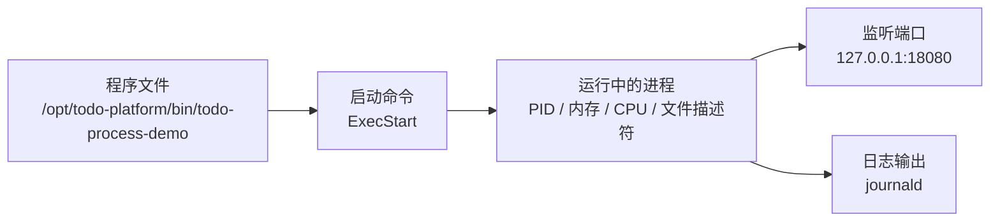
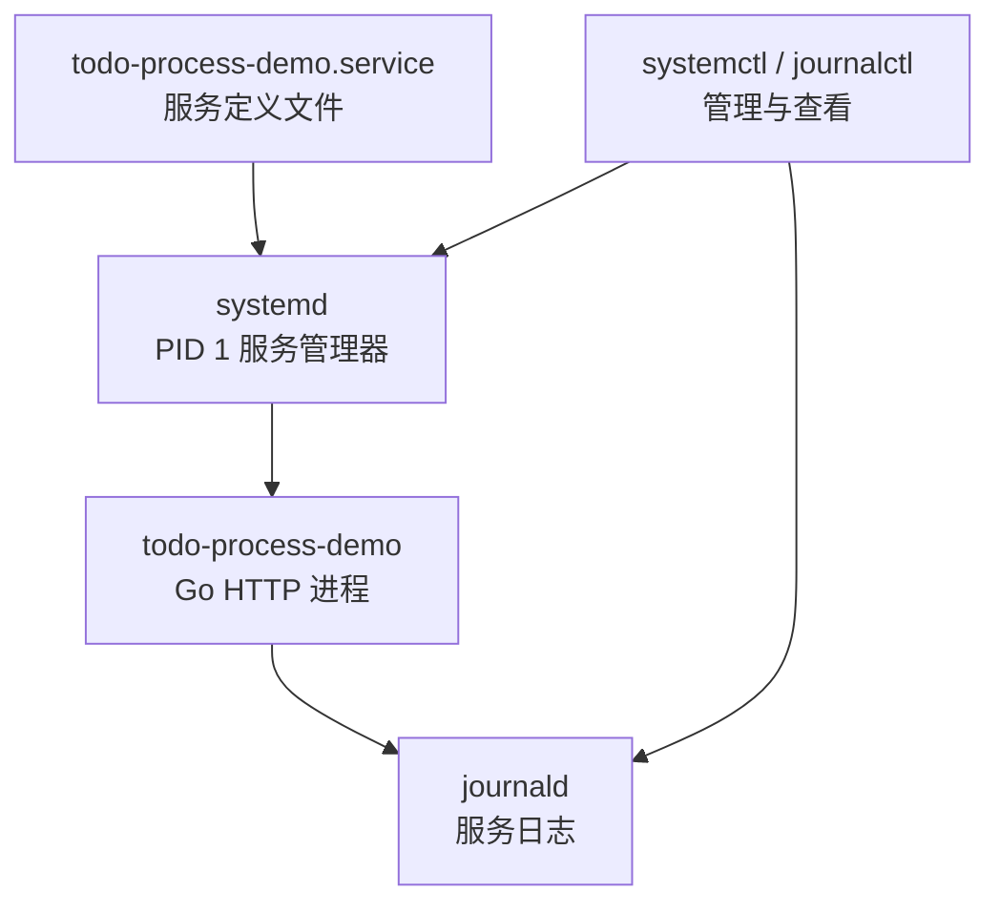
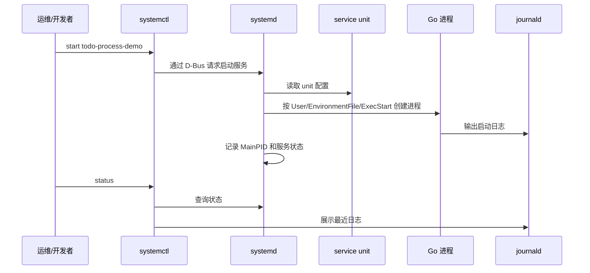

# 第 3 篇：Linux 进程、服务与软件管理

本篇继续沿着 `Cloud Native Todo Platform` 的主线前进：前一篇我们已经能规划 Linux 目录、配置、日志和权限；这一篇开始让程序真正运行起来，并学会用 Linux 的方式管理它。

后端服务、容器进程、Kubernetes Pod、CI Runner，本质上都绕不开一个问题：程序在 Linux 上如何启动、如何停止、如何被托管、如何观察资源占用、如何定位异常。

本篇对应 5 个章节主题：

- 3.1 进程、PID、前台与后台任务
- 3.2 `ps`、`top`、`htop`、`kill` 排查进程
- 3.3 systemd 与服务管理
- 3.4 软件包管理：apt、dnf 与遗留 yum
- 3.5 CPU、内存、磁盘基础排查

本篇特色项目是：**将一个简单 Go HTTP 程序注册为 Linux systemd 服务**。

你会在 `cloud-native-todo-platform` 仓库中编写一个最小 Go HTTP 服务，把它安装到 `/opt/todo-platform/bin`，用 `/etc/todo-platform/process-demo.env` 管理配置，再交给 systemd 托管，最后用进程、服务、日志和资源排查命令完成验收。

## 1. 本章学习目标

学完本篇后，你应该能够理解程序在 Linux 上的运行方式，并具备排查服务进程问题的基本能力。

具体目标如下：

- 能解释进程、PID、PPID、前台任务、后台任务和信号的含义。
- 能使用 `ps`、`pgrep`、`top`、`htop`、`kill` 查看和管理进程。
- 能理解 systemd、unit、service、journalctl 的关系。
- 能使用 `systemctl start`、`stop`、`restart`、`status`、`enable`、`disable` 管理服务。
- 能编写一份基本可用的 systemd service unit。
- 能使用 apt、dnf 安装常见排障工具，并能识别 yum 在遗留系统中的使用场景。
- 能使用 `free`、`df`、`du`、`ss`、`lsof` 等命令定位 CPU、内存、磁盘和端口问题。
- 能把一个 Go HTTP 程序作为 Linux 服务运行，并通过日志和健康检查验证服务状态。
- 能说明 systemd 服务管理能力和后续 Docker、Kubernetes 管理进程之间的联系。

本篇结束时，你至少应该能独立完成以下任务：

```bash
systemctl status todo-process-demo --no-pager
journalctl -u todo-process-demo -n 50 --no-pager
PID="$(systemctl show -p MainPID --value todo-process-demo)"
ps -p "$PID" -o pid,ppid,user,stat,%cpu,%mem,etime,cmd
top -p "$PID"
sudo ss -lntp | grep 18080
curl -fsS http://127.0.0.1:18080/healthz
sudo systemctl restart todo-process-demo
```

这些命令就是 Linux 服务器、传统虚拟机、容器宿主机和 Kubernetes 节点排障的基础工具箱。

## 2. 本章工作场景

在真实公司里，后端工程师不能只会写代码，还要能判断代码运行后发生了什么。

典型工作场景包括：

- 后端开发把 Go API 发布到测试服务器后，需要确认服务是否启动、监听了哪个端口、读取了哪些配置。
- 测试同学反馈接口访问失败时，需要查看 systemd 状态和日志，判断是程序崩溃、端口占用还是配置错误。
- DevOps 需要把应用注册为系统服务，配置开机自启、失败重启、运行用户和日志采集。
- SRE 排查线上故障时，需要快速判断某个进程是否占用过高 CPU、内存是否接近耗尽、磁盘是否被日志写满。
- 安全同学会关注服务是否以 root 运行、systemd unit 是否限制了不必要的权限。
- 后续学习 Docker 和 Kubernetes 时，你会发现容器里的主进程、Pod 的重启策略、健康检查、日志输出都和本篇知识直接相关。

本篇不会把 `ps`、`top`、`systemctl` 当作孤立命令背诵，而是围绕一个实际服务来学习：Todo 平台有一个 Go HTTP 服务，我们如何把它变成一个可启动、可停止、可观察、可排障的 Linux 服务。

## 3. 前置知识

### 必须掌握

学习本篇前，你需要已经完成前两篇内容，并具备以下基础：

- 已经准备好 Go、Git、终端和课程仓库 `cloud-native-todo-platform`。
- 能使用 `cd`、`ls`、`mkdir`、`chmod`、`chown`、`cat`、`grep`、`find` 等基础命令。
- 知道 `/opt`、`/etc`、`/var/log`、`/var/lib` 这些目录的典型用途。
- 能理解“配置、程序、日志、数据分开管理”的价值。

### 建议了解

以下内容不要求熟练，但建议有初步印象：

- HTTP 服务通常会监听一个本地端口，例如 `127.0.0.1:18080`。
- Go 程序可以编译成一个独立二进制文件。
- Linux 中普通用户和 root 用户权限不同。
- 后续 Docker 和 Kubernetes 都会管理进程生命周期。

### 实验系统要求

本篇的核心实验需要 systemd，所以不是所有终端都能完整执行。

=== "Windows + WSL2"

    推荐在 WSL2 Ubuntu 22.04 / 24.04 中完成实验。现代 WSL2 已支持 systemd，如果 `systemctl` 无法使用，需要先确认 WSL 版本并启用 systemd。

    先在 Windows PowerShell 中检查 WSL 版本：

    ```powershell
    wsl --version
    ```

    如果命令不存在或版本太旧，先更新 WSL：

    ```powershell
    wsl --update
    wsl --shutdown
    ```

    在 WSL2 Ubuntu 中检查：

    ```bash
    ps -p 1 -o comm=
    systemctl --version
    ```

    如果 PID 1 不是 `systemd`，在 WSL2 Ubuntu 中编辑 `/etc/wsl.conf`：

    ```bash
    sudo tee /etc/wsl.conf >/dev/null <<'EOF'
    [boot]
    systemd=true
    EOF
    ```

    然后在 Windows PowerShell 中执行：

    ```powershell
    wsl --shutdown
    ```

    重新打开 Ubuntu 后再验证。

=== "Linux"

    推荐使用 Ubuntu 22.04 / 24.04、Debian、Rocky Linux、AlmaLinux、Fedora、CentOS Stream 等带 systemd 的发行版。

    检查：

    ```bash
    ps -p 1 -o comm=
    systemctl --version
    ```

    如果 PID 1 是 `systemd`，即可完成本篇完整实验。

=== "macOS"

    macOS 可以阅读本章、编译 Go 程序、理解进程命令，但不能原生运行 systemd。要完整完成 systemd 实验，请使用 Linux 虚拟机、云服务器、WSL2 Ubuntu，或后续 Docker/Kubernetes 章节中的 Linux 环境。

    本章涉及 `systemctl`、`journalctl` 的步骤不要直接在 macOS Terminal 中执行。

## 4. 核心概念

### 4.1 程序与进程

程序是磁盘上的文件，进程是程序运行起来后的实例。

例如：

```bash
/opt/todo-platform/bin/todo-process-demo
```

这是一个程序文件。当它被 systemd 启动后，Linux 会为它创建进程，分配 PID、内存、文件描述符、环境变量和运行权限。

可以用一个简单关系理解：



同一个程序可以启动多个进程。每个进程都有自己的 PID。

### 4.2 PID、PPID 与进程树

PID 是 Process ID，表示进程编号。PPID 是 Parent Process ID，表示父进程编号。

查看当前 Shell：

```bash
echo $$
ps -p $$ -o pid,ppid,user,stat,cmd
```

查看进程树：

```bash
ps -ef --forest | head -n 30
```

在 systemd 管理的 Linux 系统中，PID 1 通常是 `systemd`。它负责启动系统服务、回收子进程、记录服务状态。

### 4.3 前台任务与后台任务

前台任务会占用当前终端，后台任务不会阻塞当前终端。

示例：

```bash
sleep 300 &
jobs
```

输出类似：

```text
[1]+  Running                 sleep 300 &
```

常用任务控制：

| 命令 | 作用 |
|---|---|
| `command &` | 把命令放到后台运行 |
| `jobs` | 查看当前终端的后台任务 |
| `fg %1` | 把 1 号任务切回前台 |
| `Ctrl+Z` | 暂停当前前台任务 |
| `bg %1` | 让暂停的任务继续在后台运行 |
| `kill %1` | 结束 1 号后台任务 |

后台任务适合临时实验，不适合生产服务。生产服务应该交给 systemd、容器运行时或 Kubernetes 托管。

### 4.4 信号与 kill

Linux 通过信号通知进程执行某些动作。`kill` 不是只能“杀死”进程，它本质上是发送信号。

常见信号：

| 信号 | 数字 | 含义 | 使用场景 |
|---|---:|---|---|
| `SIGTERM` | 15 | 请求进程正常退出 | 默认优雅停止 |
| `SIGKILL` | 9 | 强制结束进程 | 进程无响应时最后手段 |
| `SIGHUP` | 1 | 常用于重新加载配置 | 部分服务支持 reload |
| `SIGINT` | 2 | 中断前台进程 | `Ctrl+C` |

示例：

```bash
kill -TERM 12345
kill -KILL 12345
```

生产环境不要一上来就 `kill -9`。它会绕过程序的清理逻辑，可能导致连接未关闭、临时文件未清理、数据未 flush。

### 4.5 systemd 与 service

systemd 是现代 Linux 中常见的系统和服务管理器。它可以启动服务、停止服务、开机自启、失败重启、记录状态，并把标准输出和标准错误收集到 journald。

核心关系如下：



常见命令：

| 命令 | 作用 |
|---|---|
| `systemctl start name` | 启动服务 |
| `systemctl stop name` | 停止服务 |
| `systemctl restart name` | 重启服务 |
| `systemctl status name` | 查看服务状态 |
| `systemctl enable name` | 设置开机自启 |
| `systemctl disable name` | 取消开机自启 |
| `journalctl -u name` | 查看服务日志 |
| `systemctl daemon-reload` | 重新加载 unit 文件 |

### 4.6 软件包管理：apt、dnf 与遗留 yum

Linux 发行版通常使用软件包管理器安装工具。

=== "Ubuntu / Debian：apt"

    ```bash
    sudo apt update
    sudo apt install -y procps curl htop lsof psmisc
    ```

    - `procps` 提供 `ps`、`top`、`free` 等命令。
    - `curl` 用于访问 HTTP 服务。
    - `htop` 是交互式进程观察工具。
    - `lsof` 可查看进程打开的文件和端口。
    - `psmisc` 提供 `pstree`、`killall` 等工具。

=== "Rocky / Alma / Fedora：dnf"

    ```bash
    sudo dnf install -y procps-ng curl htop lsof psmisc
    ```

    `dnf` 是现代 RPM 系发行版常用包管理器，适用于 Rocky Linux、AlmaLinux、Fedora、CentOS Stream 等系统。

=== "遗留 CentOS 7：yum"

    ```bash
    sudo yum install -y procps-ng curl htop lsof psmisc
    ```

    `yum` 常见于较旧的 CentOS / RHEL 系统。CentOS Linux 7 已经停止维护，不建议作为新项目学习和生产环境首选；如果公司仍有遗留机器，需要理解它的包管理方式，但新系统优先使用 `dnf`。

包管理器解决的是“工具从哪里来、版本如何安装、依赖如何处理”的问题。生产环境中通常会使用公司内部软件源，避免每台服务器直接从公网拉包。

## 5. 原理深入

### 5.1 一次服务启动发生了什么

当你执行：

```bash
sudo systemctl start todo-process-demo
```

系统大致会经历以下过程：



关键点：

- `ExecStart` 决定启动哪个程序。
- `User` 和 `Group` 决定进程以什么身份运行。
- `EnvironmentFile` 决定服务读取哪些环境变量。
- `Restart` 决定进程异常退出后是否自动重启。
- `journalctl` 查看的是服务输出到 stdout/stderr 后被 journald 收集的日志。

### 5.2 为什么不要只用 `nohup` 和后台任务跑服务

你可能见过这样的启动方式：

```bash
nohup ./todo-api > todo-api.log 2>&1 &
```

这种方式能临时让程序在后台运行，但缺少生产服务管理能力：

| 能力 | `nohup &` | systemd |
|---|---|---|
| 开机自启 | 需要额外脚本 | 原生支持 |
| 失败重启 | 不支持 | `Restart=on-failure` |
| 状态查看 | 需要手工查 PID | `systemctl status` |
| 日志查看 | 手工管理文件 | `journalctl -u` |
| 运行用户 | 容易混乱 | `User=` 明确控制 |
| 安全限制 | 基本没有 | 支持多种 sandbox 选项 |

学习 `nohup` 有助于理解后台进程，但正式服务应该使用更可靠的进程管理器。

### 5.3 systemd 与 Kubernetes 的关系

systemd 管理一台 Linux 机器上的服务。Kubernetes 管理集群中的容器化应用。两者场景不同，但很多思想相通：

| systemd | Kubernetes | 共同思想 |
|---|---|---|
| service unit | Pod / Deployment | 声明程序如何运行 |
| `Restart=on-failure` | `restartPolicy`、Deployment 控制器 | 异常后自动恢复 |
| `EnvironmentFile` | ConfigMap / Secret / env | 配置注入 |
| `journalctl` | `kubectl logs` | 查看应用输出 |
| `systemctl status` | `kubectl get/describe` | 查看运行状态 |
| `User=` | `securityContext.runAsUser` | 控制运行身份 |
| `MemoryMax=`、`CPUQuota=` | resources limits | 资源约束 |

所以本篇不是传统运维知识的孤岛，而是后续理解容器和 Kubernetes 的底层铺垫。

## 6. 手把手实验

### 6.1 实验目标

本实验将完成以下任务：

- 编写一个 Go HTTP 进程演示服务。
- 编译生成 Linux 可执行文件。
- 安装程序、配置文件和 systemd unit。
- 用 systemd 启动、停止、重启、查看服务状态。
- 用 `journalctl` 查看服务日志。
- 用 `ps`、`top`、`ss`、`free`、`df` 排查进程和资源。
- 编写一个检查脚本验收本篇实验结果。

本篇不编写 Kubernetes YAML。原因是本篇目标是先理解 Linux 单机上的进程与服务管理；后续进入 Kubernetes 时，再把这些能力迁移到 Pod、Deployment、Probe、资源限制和日志排查中。

### 6.2 实验环境

| 项目 | 要求 |
|---|---|
| 操作系统 | WSL2 Ubuntu 或带 systemd 的 Linux |
| Go | 已安装并能执行 `go version` |
| 权限 | 当前用户可以使用 `sudo` |
| 网络 | 本机能访问 `127.0.0.1:18080` |
| 必需命令 | `systemctl`、`journalctl`、`ps`、`top`、`ss`、`curl`、`free`、`df` |
| 可选命令 | `htop`、`lsof`、`pstree` |

确认 systemd 可用：

```bash
ps -p 1 -o pid,comm,args
systemctl --version
```

预期能看到 PID 1 的命令是 `systemd`，并且 `systemctl --version` 正常输出版本。

安装实验工具：

=== "Ubuntu / Debian：apt"

    ```bash
    sudo apt update
    sudo apt install -y procps curl htop lsof psmisc
    ```

=== "Rocky / Alma / Fedora：dnf"

    ```bash
    sudo dnf install -y procps-ng curl htop lsof psmisc
    ```

=== "遗留 CentOS 7：yum"

    ```bash
    sudo yum install -y procps-ng curl htop lsof psmisc
    ```

    CentOS Linux 7 已经停止维护，本标签只用于遗留环境参考。新学习环境和新项目优先选择 Ubuntu LTS、Rocky Linux、AlmaLinux、Fedora 或 CentOS Stream。

### 6.3 文件目录结构

本实验会在课程仓库中新增这些文件：

```text
cloud-native-todo-platform/
├── api/
│   └── cmd/
│       └── todo-process-demo/
│           └── main.go
├── bin/
│   └── todo-process-demo
├── deployments/
│   └── systemd/
│       └── todo-process-demo.service
└── scripts/
    └── check-process-service.sh
```

同时会在 Linux 系统目录中安装：

```text
/opt/todo-platform/bin/todo-process-demo
/etc/todo-platform/process-demo.env
/etc/systemd/system/todo-process-demo.service
/var/log/todo-platform/
/var/lib/todo-platform/
/run/todo-platform/
```

这些路径承接了第 2 篇的目录设计：程序放 `/opt`，配置放 `/etc`，日志和数据放 `/var`，PID 文件这类运行时状态放 `/run`。

### 6.4 回到课程仓库

```bash
cd ~/workspace/cloud-native-todo-platform
pwd
```

如果你的仓库不在默认路径，请切换到自己的实际仓库根目录。

如果仓库还没有 Go module，先初始化：

```bash
test -f go.mod || go mod init github.com/your-name/cloud-native-todo-platform
```

### 6.5 编写 Go HTTP 服务

创建目录：

```bash
mkdir -p api/cmd/todo-process-demo bin deployments/systemd scripts
```

写入完整代码：

```bash
cat > api/cmd/todo-process-demo/main.go <<'EOF'
package main

import (
	"context"
	"encoding/json"
	"fmt"
	"log"
	"net/http"
	"os"
	"os/signal"
	"runtime"
	"strconv"
	"sync"
	"sync/atomic"
	"syscall"
	"time"
)

var (
	startedAt     = time.Now()
	requestsTotal atomic.Uint64
	memoryMu      sync.Mutex
	memoryHolds   [][]byte
)

func main() {
	addr := getenv("TODO_HTTP_ADDR", "127.0.0.1:18080")
	env := getenv("TODO_ENV", "dev")
	pidFile := getenv("TODO_PID_FILE", "")

	if pidFile != "" {
		if err := writePIDFile(pidFile); err != nil {
			log.Fatalf("write pid file failed: %v", err)
		}
		defer func() {
			if err := os.Remove(pidFile); err != nil && !os.IsNotExist(err) {
				log.Printf("remove pid file failed: %v", err)
			}
		}()
	}

	mux := http.NewServeMux()
	mux.HandleFunc("/", withLog(indexHandler))
	mux.HandleFunc("/healthz", withLog(healthHandler(env)))
	mux.HandleFunc("/readyz", withLog(readyHandler))
	mux.HandleFunc("/work", withLog(workHandler))
	mux.HandleFunc("/memory", withLog(memoryHandler))
	mux.HandleFunc("/metrics-lite", withLog(metricsHandler))

	server := &http.Server{
		Addr:              addr,
		Handler:           mux,
		ReadHeaderTimeout: 5 * time.Second,
	}

	errCh := make(chan error, 1)
	go func() {
		log.Printf("todo-process-demo starting pid=%d env=%s addr=%s", os.Getpid(), env, addr)
		errCh <- server.ListenAndServe()
	}()

	stopCh := make(chan os.Signal, 1)
	signal.Notify(stopCh, syscall.SIGINT, syscall.SIGTERM)

	select {
	case sig := <-stopCh:
		log.Printf("received signal=%s, shutting down", sig)
		ctx, cancel := context.WithTimeout(context.Background(), 5*time.Second)
		defer cancel()
		if err := server.Shutdown(ctx); err != nil {
			log.Printf("graceful shutdown failed: %v", err)
			os.Exit(1)
		}
		log.Println("shutdown complete")
	case err := <-errCh:
		if err != nil && err != http.ErrServerClosed {
			log.Printf("server error: %v", err)
			os.Exit(1)
		}
	}
}

func indexHandler(w http.ResponseWriter, r *http.Request) {
	writeText(w, http.StatusOK, `todo-process-demo

available endpoints:
  GET /healthz
  GET /readyz
  GET /work?ms=500
  GET /memory?mb=32&hold=10
  GET /metrics-lite
`)
}

func healthHandler(env string) http.HandlerFunc {
	return func(w http.ResponseWriter, r *http.Request) {
		hostname, _ := os.Hostname()
		writeJSON(w, http.StatusOK, map[string]any{
			"status":   "ok",
			"service":  "todo-process-demo",
			"env":      env,
			"pid":      os.Getpid(),
			"hostname": hostname,
			"uptime":   time.Since(startedAt).String(),
			"time":     time.Now().Format(time.RFC3339),
		})
	}
}

func readyHandler(w http.ResponseWriter, r *http.Request) {
	writeJSON(w, http.StatusOK, map[string]string{
		"status": "ready",
	})
}

func workHandler(w http.ResponseWriter, r *http.Request) {
	ms := boundedInt(r, "ms", 500, 1, 5000)
	deadline := time.Now().Add(time.Duration(ms) * time.Millisecond)

	var n uint64
	for time.Now().Before(deadline) {
		n++
		if n%100000 == 0 {
			runtime.Gosched()
		}
	}

	writeJSON(w, http.StatusOK, map[string]any{
		"status":     "ok",
		"work_ms":    ms,
		"iterations": n,
	})
}

func memoryHandler(w http.ResponseWriter, r *http.Request) {
	mb := boundedInt(r, "mb", 32, 1, 256)
	hold := boundedInt(r, "hold", 10, 1, 60)

	buf := make([]byte, mb*1024*1024)
	for i := range buf {
		buf[i] = byte(i)
	}

	memoryMu.Lock()
	memoryHolds = append(memoryHolds, buf)
	index := len(memoryHolds) - 1
	memoryMu.Unlock()

	go func() {
		time.Sleep(time.Duration(hold) * time.Second)
		memoryMu.Lock()
		if index >= 0 && index < len(memoryHolds) {
			memoryHolds[index] = nil
		}
		memoryMu.Unlock()
	}()

	writeJSON(w, http.StatusOK, map[string]any{
		"status":       "ok",
		"allocated_mb": mb,
		"hold_seconds": hold,
	})
}

func metricsHandler(w http.ResponseWriter, r *http.Request) {
	uptime := int64(time.Since(startedAt).Seconds())
	body := fmt.Sprintf(`# HELP todo_process_uptime_seconds Process uptime in seconds.
# TYPE todo_process_uptime_seconds gauge
todo_process_uptime_seconds %d
# HELP todo_process_requests_total Total handled HTTP requests.
# TYPE todo_process_requests_total counter
todo_process_requests_total %d
# HELP todo_process_goroutines Current goroutine count.
# TYPE todo_process_goroutines gauge
todo_process_goroutines %d
`, uptime, requestsTotal.Load(), runtime.NumGoroutine())
	writeText(w, http.StatusOK, body)
}

func withLog(next http.HandlerFunc) http.HandlerFunc {
	return func(w http.ResponseWriter, r *http.Request) {
		start := time.Now()
		requestsTotal.Add(1)
		next(w, r)
		log.Printf("method=%s path=%s remote=%s duration=%s", r.Method, r.URL.RequestURI(), r.RemoteAddr, time.Since(start))
	}
}

func boundedInt(r *http.Request, key string, fallback, min, max int) int {
	raw := r.URL.Query().Get(key)
	if raw == "" {
		return fallback
	}
	value, err := strconv.Atoi(raw)
	if err != nil {
		return fallback
	}
	if value < min {
		return min
	}
	if value > max {
		return max
	}
	return value
}

func getenv(key, fallback string) string {
	value := os.Getenv(key)
	if value == "" {
		return fallback
	}
	return value
}

func writePIDFile(path string) error {
	return os.WriteFile(path, []byte(strconv.Itoa(os.Getpid())+"\n"), 0644)
}

func writeJSON(w http.ResponseWriter, status int, data any) {
	w.Header().Set("Content-Type", "application/json")
	w.WriteHeader(status)
	_ = json.NewEncoder(w).Encode(data)
}

func writeText(w http.ResponseWriter, status int, body string) {
	w.Header().Set("Content-Type", "text/plain; charset=utf-8")
	w.WriteHeader(status)
	_, _ = w.Write([]byte(body))
}
EOF
```

这段程序包含几个用于排障练习的接口：

| 接口 | 作用 |
|---|---|
| `/healthz` | 返回进程状态、PID、主机名和运行时间 |
| `/readyz` | 模拟就绪检查 |
| `/work?ms=500` | 模拟 CPU 工作负载 |
| `/memory?mb=32&hold=10` | 临时分配内存，便于观察内存变化 |
| `/metrics-lite` | 输出简化版指标文本 |

### 6.6 本地编译和前台运行

编译：

```bash
go mod tidy
go build -o bin/todo-process-demo ./api/cmd/todo-process-demo
```

前台运行一次：

```bash
TODO_HTTP_ADDR=127.0.0.1:18080 TODO_ENV=dev ./bin/todo-process-demo
```

另开一个终端验证：

```bash
curl -fsS http://127.0.0.1:18080/healthz
curl -fsS http://127.0.0.1:18080/metrics-lite
```

预期 `/healthz` 输出类似：

```json
{"env":"dev","hostname":"ubuntu","pid":12345,"service":"todo-process-demo","status":"ok","time":"2026-05-26T10:00:00+08:00","uptime":"5s"}
```

回到运行服务的终端，按 `Ctrl+C` 停止。你应该能看到程序收到信号并优雅退出的日志。

Checkpoint 1：Go 程序能编译，前台运行后能通过 `curl` 访问。

### 6.7 创建运行用户和系统目录

真实服务不建议长期使用 root 运行。创建一个专用系统用户：

```bash
NOLOGIN_SHELL="$(command -v nologin || echo /usr/sbin/nologin)"
if ! getent group todo >/dev/null 2>&1; then
  sudo groupadd --system todo
fi
if ! id todo >/dev/null 2>&1; then
  sudo useradd --system --gid todo --home-dir /opt/todo-platform --shell "$NOLOGIN_SHELL" todo
fi
```

这里先找 `nologin` 的真实路径，是为了兼容不同发行版。`nologin` 可以防止这个系统用户被当成普通登录用户使用。

创建目录：

```bash
sudo install -d -o root -g root -m 0755 /opt/todo-platform/bin
sudo install -d -o root -g root -m 0755 /etc/todo-platform
sudo install -d -o todo -g todo -m 0755 /var/log/todo-platform
sudo install -d -o todo -g todo -m 0755 /var/lib/todo-platform
```

`/run/todo-platform` 不在这里手工创建，后面由 systemd 的 `RuntimeDirectory=todo-platform` 自动创建。`/run` 用于运行时文件，重启后可以清空，适合放 PID 文件这类临时状态。

安装二进制文件：

```bash
sudo install -o root -g root -m 0755 bin/todo-process-demo /opt/todo-platform/bin/todo-process-demo
```

写入配置文件：

```bash
sudo tee /etc/todo-platform/process-demo.env >/dev/null <<'EOF'
TODO_ENV=dev
TODO_HTTP_ADDR=127.0.0.1:18080
TODO_PID_FILE=/run/todo-platform/todo-process-demo.pid
EOF
```

调整配置权限：

```bash
sudo chown root:todo /etc/todo-platform/process-demo.env
sudo chmod 640 /etc/todo-platform/process-demo.env
ls -l /etc/todo-platform/process-demo.env
```

为什么这样做：

- 程序文件由 root 管理，普通服务用户只能执行，不能随意修改。
- 配置文件允许 `todo` 组读取，但不允许其他用户读取。
- 日志、数据和运行时目录由 `todo` 用户拥有，便于服务写入。

### 6.8 编写 systemd service unit

创建 unit 文件：

```bash
cat > deployments/systemd/todo-process-demo.service <<'EOF'
[Unit]
Description=Todo Platform process demo service
After=network-online.target
Wants=network-online.target

[Service]
Type=simple
User=todo
Group=todo
EnvironmentFile=/etc/todo-platform/process-demo.env
ExecStart=/opt/todo-platform/bin/todo-process-demo
WorkingDirectory=/opt/todo-platform
Restart=on-failure
RestartSec=3s
KillSignal=SIGTERM
TimeoutStopSec=10s
RuntimeDirectory=todo-platform
RuntimeDirectoryMode=0755
MemoryMax=256M
CPUQuota=100%
NoNewPrivileges=true
PrivateTmp=true
ProtectHome=true
ProtectSystem=full
ReadWritePaths=/var/log/todo-platform /var/lib/todo-platform /run/todo-platform

[Install]
WantedBy=multi-user.target
EOF
```

关键字段说明：

| 字段 | 含义 |
|---|---|
| `[Unit]` | 描述服务元信息和依赖关系 |
| `After=network-online.target` | 网络就绪后再启动 |
| `Type=simple` | `ExecStart` 启动的进程就是主进程 |
| `User=todo`、`Group=todo` | 使用专用低权限用户运行 |
| `EnvironmentFile` | 从配置文件注入环境变量 |
| `ExecStart` | 服务启动命令 |
| `Restart=on-failure` | 异常退出时自动重启 |
| `KillSignal=SIGTERM` | 停止服务时发送优雅退出信号 |
| `RuntimeDirectory` | 由 systemd 创建 `/run/todo-platform`，适合 PID 文件等运行时状态 |
| `MemoryMax`、`CPUQuota` | 给服务设置基础资源上限，避免实验服务无限占用资源 |
| `NoNewPrivileges=true` | 禁止进程获取额外权限 |
| `ProtectSystem=full` | 限制对系统目录的写入 |
| `ReadWritePaths` | 明确允许写入的业务目录 |
| `WantedBy=multi-user.target` | 支持开机进入多用户模式时自启 |

安装 unit：

```bash
sudo cp deployments/systemd/todo-process-demo.service /etc/systemd/system/todo-process-demo.service
sudo systemctl daemon-reload
```

`daemon-reload` 很重要。修改或新增 unit 文件后，systemd 不会自动重新读取文件，必须显式 reload。

### 6.9 启动、查看、重启和停止服务

启动并设置开机自启：

```bash
sudo systemctl enable --now todo-process-demo
```

查看状态：

```bash
systemctl status todo-process-demo --no-pager
```

关键观察点：

- `Loaded` 应显示 unit 文件路径。
- `Active` 应显示 `active (running)`。
- `Main PID` 是 Go 服务进程的 PID。
- 最近日志中应能看到 `todo-process-demo starting`。

查看日志：

```bash
journalctl -u todo-process-demo -n 50 --no-pager
```

访问服务：

```bash
curl -fsS http://127.0.0.1:18080/healthz
curl -fsS http://127.0.0.1:18080/metrics-lite
cat /run/todo-platform/todo-process-demo.pid
```

`curl -fsS` 比 `curl -s` 更适合验收：HTTP 错误会让命令失败，同时仍然显示错误信息。`/run/todo-platform/todo-process-demo.pid` 是服务启动后写入的 PID 文件，后面可以用它和 systemd 的 `MainPID` 做交叉验证。

重启服务：

```bash
sudo systemctl restart todo-process-demo
systemctl status todo-process-demo --no-pager
```

停止服务：

```bash
sudo systemctl stop todo-process-demo
systemctl status todo-process-demo --no-pager
```

重新启动，继续后续实验：

```bash
sudo systemctl start todo-process-demo
```

Checkpoint 2：你能用 systemd 完成服务启动、停止、重启、状态查看和日志查看。

### 6.10 验证失败自动重启

`Restart=on-failure` 不能只停留在 unit 文件里，还要真正验证它是否生效。

先记录当前主进程 PID：

```bash
OLD_PID="$(systemctl show -p MainPID --value todo-process-demo)"
echo "$OLD_PID"
```

模拟进程被异常杀死：

```bash
sudo kill -KILL "$OLD_PID"
sleep 5
```

再次查看服务：

```bash
systemctl status todo-process-demo --no-pager
NEW_PID="$(systemctl show -p MainPID --value todo-process-demo)"
echo "$NEW_PID"
cat /run/todo-platform/todo-process-demo.pid
journalctl -u todo-process-demo -n 30 --no-pager
```

判断依据：

- 服务状态应重新回到 `active (running)`。
- `NEW_PID` 应该和 `OLD_PID` 不同，说明 systemd 拉起了新进程。
- journal 日志中能看到旧进程被杀死，以及新进程重新启动的记录。
- PID 文件内容应等于新的 `MainPID`。

这里故意使用 `SIGKILL` 是为了模拟异常崩溃。真实生产环境不要把 `kill -9` 当作常规停止服务的方法，正常停止仍应使用 `systemctl stop` 或 `SIGTERM`。

Checkpoint 3：你能验证 systemd 的失败自动重启能力，而不是只会写 `Restart=on-failure`。

### 6.11 使用 ps 和 pgrep 定位进程

获取服务主进程 PID：

```bash
PID="$(systemctl show -p MainPID --value todo-process-demo)"
echo "$PID"
```

查看进程详情：

```bash
ps -p "$PID" -o pid,ppid,user,group,stat,%cpu,%mem,rss,vsz,etime,cmd
```

字段说明：

| 字段 | 含义 |
|---|---|
| `PID` | 当前进程 ID |
| `PPID` | 父进程 ID |
| `USER` | 运行用户 |
| `STAT` | 进程状态 |
| `%CPU` | CPU 使用比例 |
| `%MEM` | 内存使用比例 |
| `RSS` | 常驻内存，单位 KB |
| `VSZ` | 虚拟内存，单位 KB |
| `ELAPSED` | 进程已运行时间 |
| `CMD` | 启动命令 |

按名称查找：

```bash
pgrep -af todo-process-demo
```

查看进程树：

```bash
pstree -aps "$PID"
```

用 PID 文件交叉验证：

```bash
cat /run/todo-platform/todo-process-demo.pid
test "$(cat /run/todo-platform/todo-process-demo.pid)" = "$PID"
```

Checkpoint 4：你能从 systemd 状态和 PID 文件定位到真实 Linux 进程，并看懂基本字段。

### 6.12 使用 top 和 htop 观察 CPU

模拟一次 CPU 工作：

```bash
curl -fsS "http://127.0.0.1:18080/work?ms=5000" >/dev/null &
```

观察进程：

```bash
top -p "$PID"
```

在 `top` 中常用按键：

| 按键 | 作用 |
|---|---|
| `P` | 按 CPU 排序 |
| `M` | 按内存排序 |
| `c` | 显示完整命令 |
| `q` | 退出 |

如果安装了 `htop`，可以执行：

```bash
htop -p "$PID"
```

`top` 更常见，几乎所有服务器都有；`htop` 更适合交互观察，但生产服务器不一定预装。

### 6.13 观察内存使用

触发临时内存分配：

```bash
curl -fsS "http://127.0.0.1:18080/memory?mb=64&hold=20"
```

查看进程内存：

```bash
ps -p "$PID" -o pid,%mem,rss,vsz,cmd
```

查看系统内存：

```bash
free -h
```

判断思路：

- `RSS` 变大，说明进程常驻内存增长。
- `free -h` 中 `available` 很低，说明系统可用内存紧张。
- 如果某个进程持续增长且不回落，可能存在内存泄漏或缓存未限制。

### 6.14 查看端口占用

确认服务监听端口：

```bash
sudo ss -lntp | grep 18080 || true
```

如果安装了 `lsof`：

```bash
sudo lsof -iTCP:18080 -sTCP:LISTEN
```

输出中应该能看到 `todo-process-demo` 或对应 PID。部分系统上普通用户执行 `ss -lntp` 只能看到监听端口，看不到进程名和 PID，所以定位端口归属时建议使用 `sudo ss -lntp` 或 `sudo lsof`。

端口排查在下一篇 Linux 网络基础中会进一步展开，本篇先掌握“端口由哪个进程监听”。

### 6.15 查看磁盘和日志占用

查看磁盘空间：

```bash
df -h
```

查看目录大小：

```bash
sudo du -sh /var/log/todo-platform /var/lib/todo-platform /opt/todo-platform 2>/dev/null || true
```

查看 journald 占用：

```bash
journalctl --disk-usage
```

生产环境中，服务日志如果不做轮转和保留策略，最终可能写满磁盘。磁盘满会导致服务无法写日志、数据库无法写入、甚至系统无法正常运行。

### 6.16 验证资源限制和安全基线

先查看 systemd 实际加载到的资源限制：

```bash
systemctl show todo-process-demo -p MemoryMax -p CPUQuotaPerSecUSec
```

触发一次 CPU 和内存请求：

```bash
curl -fsS "http://127.0.0.1:18080/work?ms=3000" >/dev/null &
curl -fsS "http://127.0.0.1:18080/memory?mb=64&hold=20"
```

观察进程资源：

```bash
PID="$(systemctl show -p MainPID --value todo-process-demo)"
ps -p "$PID" -o pid,%cpu,%mem,rss,vsz,cmd
```

这里的 `MemoryMax=256M` 和 `CPUQuota=100%` 不是生产推荐值，而是演示 systemd 能限制单个服务的资源上限。真实生产值要根据压测、服务基线和机器容量决定。

检查安全基线：

```bash
systemd-analyze security todo-process-demo
```

如果当前系统没有 `systemd-analyze security` 子命令，可以跳过这一步。这个命令会根据 unit 中的安全选项给出风险评分，帮助你发现服务是否过度暴露系统权限。

Checkpoint 5：你能说明服务的资源限制和安全限制不是装饰字段，而是能被 systemd 读取和检查的运行约束。

### 6.17 编写服务检查脚本

创建脚本：

```bash
cat > scripts/check-process-service.sh <<'EOF'
#!/usr/bin/env bash
set -euo pipefail

SERVICE="${1:-todo-process-demo}"
URL="${2:-http://127.0.0.1:18080/healthz}"
PORT="${3:-18080}"

echo "checking service: ${SERVICE}"

command -v systemctl >/dev/null
command -v journalctl >/dev/null
command -v curl >/dev/null
command -v ps >/dev/null
command -v ss >/dev/null

if ! systemctl is-active --quiet "${SERVICE}"; then
  echo "service is not active: ${SERVICE}" >&2
  systemctl status "${SERVICE}" --no-pager || true
  exit 1
fi

pid="$(systemctl show -p MainPID --value "${SERVICE}")"
if [ -z "${pid}" ] || [ "${pid}" = "0" ]; then
  echo "service has no MainPID" >&2
  exit 1
fi

echo "main pid: ${pid}"
ps -p "${pid}" -o pid,ppid,user,stat,%cpu,%mem,etime,cmd

pid_file="/run/todo-platform/todo-process-demo.pid"
if [ ! -f "${pid_file}" ]; then
  echo "pid file not found: ${pid_file}" >&2
  exit 1
fi

if [ "$(cat "${pid_file}")" != "${pid}" ]; then
  echo "pid file does not match MainPID" >&2
  exit 1
fi

if ! curl -fsS "${URL}" >/dev/null; then
  echo "health check failed: ${URL}" >&2
  exit 1
fi

if ! ss -lnt | grep -q ":${PORT} "; then
  echo "port is not listening: ${PORT}" >&2
  exit 1
fi

echo "recent logs:"
journalctl -u "${SERVICE}" -n 10 --no-pager

echo "process service lab ok"
EOF
```

增加执行权限：

```bash
chmod +x scripts/check-process-service.sh
```

运行：

```bash
./scripts/check-process-service.sh
```

预期输出包含：

```text
checking service: todo-process-demo
main pid: ...
process service lab ok
```

这个脚本体现了真实工作的自动化意识：不要只靠肉眼看服务是否正常，而是用脚本检查服务状态、主进程、PID 文件、健康接口、端口监听和最近日志。

### 6.18 补充 Makefile 入口

第 1 篇已经创建过 `Makefile`。本篇可以继续在同一个文件中补充进程服务相关目标，让常用操作有统一入口。

追加 Makefile 目标：

```bash
cat >> Makefile <<'EOF'

.PHONY: process-build process-install process-status process-logs process-check process-clean

process-build:
	go test ./api/cmd/todo-process-demo
	go build -o bin/todo-process-demo ./api/cmd/todo-process-demo

process-install: process-build
	sudo install -o root -g root -m 0755 bin/todo-process-demo /opt/todo-platform/bin/todo-process-demo
	sudo cp deployments/systemd/todo-process-demo.service /etc/systemd/system/todo-process-demo.service
	sudo systemctl daemon-reload
	sudo systemctl restart todo-process-demo

process-status:
	systemctl status todo-process-demo --no-pager

process-logs:
	journalctl -u todo-process-demo -n 50 --no-pager

process-check:
	./scripts/check-process-service.sh

process-clean:
	sudo systemctl disable --now todo-process-demo || true
	sudo rm -f /etc/systemd/system/todo-process-demo.service
	sudo systemctl daemon-reload
	sudo systemctl reset-failed todo-process-demo || true
EOF
```

执行：

```bash
make process-build
make process-status
make process-check
```

如果你的 `Makefile` 中已经存在同名目标，不要重复追加，直接更新原目标即可。真实团队会把这些命令沉淀到统一入口中，减少新人记忆成本，也方便后续 CI/CD 复用。

### 6.19 统一验证命令

在仓库根目录执行：

```bash
go test ./api/cmd/todo-process-demo
go build -o bin/todo-process-demo ./api/cmd/todo-process-demo
systemctl status todo-process-demo --no-pager
journalctl -u todo-process-demo -n 20 --no-pager
curl -fsS http://127.0.0.1:18080/healthz
curl -fsS http://127.0.0.1:18080/metrics-lite
PID="$(systemctl show -p MainPID --value todo-process-demo)"
ps -p "$PID" -o pid,ppid,user,stat,%cpu,%mem,etime,cmd
test "$(cat /run/todo-platform/todo-process-demo.pid)" = "$PID"
sudo ss -lntp | grep 18080 || true
free -h
df -h
./scripts/check-process-service.sh
make process-check
```

### 6.20 清理步骤

如果你只是练习，想清理本篇安装到系统中的服务：

```bash
sudo systemctl disable --now todo-process-demo || true
sudo rm -f /etc/systemd/system/todo-process-demo.service
sudo systemctl daemon-reload
sudo systemctl reset-failed todo-process-demo || true
sudo rm -f /opt/todo-platform/bin/todo-process-demo
sudo rm -f /etc/todo-platform/process-demo.env
```

如果这些目录只用于本课程实验，也可以清理空目录：

```bash
sudo rmdir /var/lib/todo-platform /var/log/todo-platform 2>/dev/null || true
```

`/run/todo-platform` 由 systemd 的 `RuntimeDirectory` 管理，服务停止后会自动清理。不建议自动删除 `todo` 用户和 `/opt/todo-platform`、`/etc/todo-platform`，因为它们可能被前后章节复用。

## 7. 真实工作案例

某团队开发了 Todo API 的第一个内部测试版本。开发同学把 Go 程序编译后交给测试环境，DevOps 需要把它部署到一台 Linux 测试服务器上。

团队采用的方案是：

- 后端负责提供可执行文件、启动参数、健康检查接口和退出信号处理。
- DevOps 负责 systemd unit、运行用户、目录权限、开机自启和失败重启策略。
- 测试同学通过 HTTP 接口验证功能，通过日志提供请求 ID 和错误现象。
- SRE 负责监控 CPU、内存、磁盘、端口和服务状态，发现异常后按排障流程定位。

一次故障中，测试反馈接口访问失败。排查过程如下：

```bash
systemctl status todo-process-demo --no-pager
journalctl -u todo-process-demo -n 100 --no-pager
sudo ss -lntp | grep 18080 || true
```

发现服务状态是 `failed`，日志中显示配置文件权限不足。进一步检查：

```bash
ls -l /etc/todo-platform/process-demo.env
id todo
```

最终发现配置文件只允许 root 读取，而服务以 `todo` 用户运行。修复方式是：

```bash
sudo chown root:todo /etc/todo-platform/process-demo.env
sudo chmod 640 /etc/todo-platform/process-demo.env
sudo systemctl restart todo-process-demo
```

这个案例说明：服务启动失败不一定是代码 bug，进程用户、配置权限、服务日志和 systemd 状态都要一起看。

## 8. 常见错误

| 错误现象 | 常见原因 | 修复方向 |
|---|---|---|
| `System has not been booted with systemd` | 当前环境没有使用 systemd，例如旧 WSL 或普通容器 | 启用 WSL2 systemd，或换 Linux VM / 云服务器 |
| `Unit todo-process-demo.service not found` | unit 没复制到 `/etc/systemd/system`，或未执行 `daemon-reload` | 复制 unit 后执行 `sudo systemctl daemon-reload` |
| 服务 `failed` | `ExecStart` 路径错、程序没有执行权限、配置读取失败 | 看 `systemctl status` 和 `journalctl -u` |
| `Permission denied` | 服务用户无权读取配置或执行程序 | 检查 `User=`、`ls -l`、`id todo` |
| `Address already in use` | 端口已被其他进程占用 | 用 `sudo ss -lntp` 或 `sudo lsof` 找到占用进程 |
| 修改 service 后不生效 | 忘记执行 `systemctl daemon-reload` | reload 后再 restart |
| `curl` 访问失败 | 服务未启动、监听地址不对、端口不对 | 看 `systemctl status`、`sudo ss -lntp`、配置文件 |
| 进程 CPU 高 | 业务请求量大、死循环、热点代码、压测接口 | 用 `top -p`、日志和请求路径定位 |
| 内存持续增长 | 缓存未限制、内存泄漏、大对象堆积 | 看 `ps RSS`、`free -h`，结合应用日志 |
| 磁盘满 | 日志过多、临时文件未清理、备份堆积 | `df -h`、`du -sh` 定位目录 |
| 直接 `kill -9` 后数据异常 | 强制终止跳过清理逻辑 | 优先 `systemctl stop` 或 `SIGTERM` |

## 9. 排障方法

### 9.1 排查服务无法启动

命令：

```bash
systemctl status todo-process-demo --no-pager
journalctl -u todo-process-demo -n 100 --no-pager
journalctl -xeu todo-process-demo --no-pager
```

判断依据：

- `Active: failed` 表示服务启动失败或运行后退出。
- `status=203/EXEC` 常见于 `ExecStart` 路径错误或文件不可执行。
- 日志中出现 `permission denied`，优先排查用户、目录和文件权限。
- 日志中出现 `address already in use`，说明端口冲突。

修复方向：

```bash
ls -l /opt/todo-platform/bin/todo-process-demo
sudo chmod 755 /opt/todo-platform/bin/todo-process-demo
sudo systemctl daemon-reload
sudo systemctl restart todo-process-demo
```

### 9.2 排查端口被占用

命令：

```bash
sudo ss -lntp | grep 18080 || true
sudo lsof -iTCP:18080 -sTCP:LISTEN
```

判断依据：

- 如果看到另一个进程监听 `18080`，当前服务无法绑定同一地址端口。
- 如果监听地址是 `127.0.0.1:18080`，只允许本机访问。
- 如果监听地址是 `0.0.0.0:18080`，表示所有网卡都监听，暴露面更大。
- 如果普通用户执行 `ss -lntp` 看不到进程名，使用 `sudo` 重新执行。

修复方向：

```bash
sudo systemctl stop todo-process-demo
sudo sed -i 's/TODO_HTTP_ADDR=.*/TODO_HTTP_ADDR=127.0.0.1:18081/' /etc/todo-platform/process-demo.env
sudo systemctl restart todo-process-demo
```

修改端口后要同步调整健康检查脚本或调用方配置。

### 9.3 排查 CPU 占用高

命令：

```bash
PID="$(systemctl show -p MainPID --value todo-process-demo)"
top -p "$PID"
ps -p "$PID" -o pid,stat,%cpu,%mem,etime,cmd
journalctl -u todo-process-demo -n 100 --no-pager
```

判断依据：

- `%CPU` 持续很高，说明进程正在消耗 CPU。
- 如果日志中某个接口频繁出现，例如 `/work`，可能是请求压力导致。
- 如果没有请求但 CPU 仍高，可能存在死循环或后台任务异常。

修复方向：

- 先确认是否有压测或批处理任务。
- 临时降载或停止异常请求来源。
- 收集日志、CPU profile 或更详细诊断信息后再重启。
- 不要在没有证据时反复重启服务掩盖问题。

### 9.4 排查内存占用高

命令：

```bash
PID="$(systemctl show -p MainPID --value todo-process-demo)"
ps -p "$PID" -o pid,%mem,rss,vsz,etime,cmd
free -h
journalctl -u todo-process-demo -n 100 --no-pager
```

判断依据：

- `RSS` 持续增长，说明进程实际占用内存增长。
- `available` 很低，说明系统可用内存紧张。
- 如果触发了内存限制，服务可能被系统杀死或被 systemd 标记失败。

修复方向：

- 判断是否是正常缓存、短期峰值还是持续泄漏。
- 对服务设置合理资源限制，例如 systemd 的 `MemoryMax=`。
- 在 Go 服务中结合 pprof 或指标定位内存热点。
- 后续 Kubernetes 中要设置 `resources.requests` 和 `resources.limits`。

### 9.5 排查磁盘空间不足

命令：

```bash
df -h
sudo du -sh /var/log/* 2>/dev/null | sort -h | tail
journalctl --disk-usage
```

判断依据：

- `Use%` 接近 100% 的文件系统需要立即处理。
- `/var/log` 过大通常和日志轮转策略有关。
- journald 占用过大说明系统日志保留策略需要调整。

修复方向：

- 清理明确可删除的临时文件和旧备份。
- 配置 logrotate 或 journald 保留策略。
- 从根因上减少重复错误日志，而不是只删日志。

### 9.6 排查 service 修改后不生效

命令：

```bash
systemctl cat todo-process-demo
sudo systemctl daemon-reload
sudo systemctl restart todo-process-demo
systemctl status todo-process-demo --no-pager
```

判断依据：

- `systemctl cat` 展示 systemd 实际读取到的 unit 内容。
- 如果文件已修改但 `systemctl cat` 仍是旧内容，可能改错路径。
- 修改 unit 后必须 `daemon-reload`。

修复方向：

- 确认 unit 位于 `/etc/systemd/system/todo-process-demo.service`。
- 修改后执行 `daemon-reload` 和 `restart`。
- 如果只修改环境变量文件，通常只需 `restart`，不一定需要 `daemon-reload`。

### 9.7 排查软件包命令不存在

命令：

```bash
command -v htop || true
command -v lsof || true
cat /etc/os-release
```

判断依据：

- 命令不存在，说明没有安装或 PATH 不包含。
- `/etc/os-release` 可以判断当前发行版和适合的包管理器。

修复方向：

=== "Ubuntu / Debian：apt"

    ```bash
    sudo apt update
    sudo apt install -y htop lsof
    ```

=== "Rocky / Alma / Fedora：dnf"

    ```bash
    sudo dnf install -y htop lsof
    ```

=== "遗留 CentOS 7：yum"

    ```bash
    sudo yum install -y htop lsof
    ```

    只建议在公司遗留 CentOS 7 机器上使用。新环境优先使用 `dnf` 或 `apt` 对应的发行版。

## 10. 生产环境注意事项

Linux 服务管理在生产环境中要关注稳定性、安全性、可观测性和可恢复性。

- 普通业务服务不要以 root 运行，应该使用专用低权限用户。
- `ExecStart` 使用绝对路径，避免依赖不确定的当前目录和 PATH。
- 配置文件权限要收紧，敏感配置不要对所有用户可读。
- 修改 systemd unit 后必须 `daemon-reload`，修改配置后要重启或 reload 服务。
- 优先使用 `systemctl stop` 让服务收到 `SIGTERM` 优雅退出，避免直接 `kill -9`。
- 为服务设置合理的 `Restart` 策略，但不要让崩溃服务无限重启掩盖根因。
- 生产服务需要健康检查、指标、结构化日志和告警，不要只靠人工 `ssh` 上去看。
- 日志要有保留策略，防止 journald 或文件日志写满磁盘。
- 关键服务要限制资源使用，systemd 可用 `MemoryMax=`、`CPUQuota=`，Kubernetes 中使用 resource requests/limits。
- systemd 的安全选项如 `NoNewPrivileges`、`ProtectSystem`、`ProtectHome` 可以降低服务被入侵后的影响范围。
- `systemd-analyze security` 可以帮助检查 unit 安全基线，但它不能替代人工威胁建模和最小权限设计。
- 软件包安装应使用可信源和固定版本策略，生产环境不建议随意从公网复制脚本执行。
- 端口监听地址要谨慎，`127.0.0.1` 只允许本机访问，`0.0.0.0` 会监听所有网卡。
- 生产排障先保留证据，例如状态、日志、PID、资源使用，再执行重启。

当应用迁移到 Kubernetes 后，systemd 不再直接管理业务进程，但这些原则仍然存在：低权限运行、优雅退出、健康检查、日志到 stdout/stderr、资源限制和可观测性，都会体现在 Pod 和 Deployment 配置中。

## 11. 本章小项目

本章小项目：**Todo Go HTTP 服务的 systemd 托管**。

交付物：

- `api/cmd/todo-process-demo/main.go`
- `bin/todo-process-demo`
- `deployments/systemd/todo-process-demo.service`
- `scripts/check-process-service.sh`
- `/opt/todo-platform/bin/todo-process-demo`
- `/etc/todo-platform/process-demo.env`
- `/etc/systemd/system/todo-process-demo.service`
- `/run/todo-platform/todo-process-demo.pid`
- 一个可运行的 `todo-process-demo` systemd 服务

验收命令：

```bash
cd ~/workspace/cloud-native-todo-platform
systemctl status todo-process-demo --no-pager
journalctl -u todo-process-demo -n 20 --no-pager
curl -fsS http://127.0.0.1:18080/healthz
curl -fsS http://127.0.0.1:18080/metrics-lite
PID="$(systemctl show -p MainPID --value todo-process-demo)"
ps -p "$PID" -o pid,ppid,user,stat,%cpu,%mem,etime,cmd
test "$(cat /run/todo-platform/todo-process-demo.pid)" = "$PID"
sudo ss -lntp | grep 18080 || true
./scripts/check-process-service.sh
make process-check
```

能力验收标准：

| 能力项 | 验收方式 |
|---|---|
| 进程理解 | 能说明程序、进程、PID、PPID 的关系 |
| 前后台任务 | 能使用 `command &`、`jobs`、`fg`、`bg`、`kill` 做临时任务管理 |
| 进程查看 | 能用 `ps`、`pgrep` 找到 Todo 服务进程 |
| 资源观察 | 能用 `top`、`free`、`df` 查看 CPU、内存、磁盘，并能解释 `MemoryMax`、`CPUQuota` |
| 端口定位 | 能用 `sudo ss` 或 `sudo lsof` 找到监听 `18080` 的进程 |
| 服务管理 | 能用 `systemctl` 启动、停止、重启、查看服务 |
| 日志查看 | 能用 `journalctl -u` 查看服务日志 |
| unit 编写 | 能解释 `User`、`EnvironmentFile`、`ExecStart`、`Restart`、`RuntimeDirectory` 等字段 |
| 自动化检查 | 能运行 `scripts/check-process-service.sh` 和 `make process-check` 完成验收 |
| 生产意识 | 能说明为什么不用 root、为什么避免 `kill -9`、为什么需要日志保留 |

## 12. 本章练习题

### 基础题

1. 程序和进程有什么区别？
2. PID 和 PPID 分别表示什么？
3. 前台任务和后台任务有什么区别？
4. `kill` 命令为什么不等于“强制杀死”？
5. `SIGTERM` 和 `SIGKILL` 有什么区别？
6. systemd 在 Linux 中解决了什么问题？
7. `systemctl status` 和 `journalctl -u` 分别查看什么？
8. 修改 systemd unit 后为什么要执行 `daemon-reload`？
9. `apt`、`dnf` 和遗留 `yum` 分别常见于哪些发行版？
10. `RSS` 和 `%CPU` 在进程排查中有什么意义？

### 实操题

1. 编译 `todo-process-demo`，确认 `bin/todo-process-demo` 存在。
2. 前台运行服务，并用 `curl` 访问 `/healthz`。
3. 使用 `Ctrl+C` 停止前台服务，观察退出日志。
4. 把服务安装到 `/opt/todo-platform/bin`，并创建 `/etc/todo-platform/process-demo.env`。
5. 安装 systemd unit，执行 `daemon-reload`。
6. 使用 `systemctl enable --now todo-process-demo` 启动服务。
7. 使用 `journalctl -u todo-process-demo -n 50 --no-pager` 查看日志。
8. 使用 `ps` 和 `pgrep` 找到服务进程。
9. 访问 `/work?ms=5000`，用 `top -p` 观察 CPU 变化。
10. 访问 `/memory?mb=64&hold=20`，用 `ps` 和 `free -h` 观察内存变化。
11. 使用 `sudo ss -lntp` 或 `sudo lsof` 找出监听 `18080` 的进程。
12. 使用 `sudo kill -KILL "$PID"` 验证 `Restart=on-failure` 能自动拉起服务。
13. 使用 `systemd-analyze security todo-process-demo` 查看服务安全基线。
14. 运行 `scripts/check-process-service.sh` 和 `make process-check` 完成本篇验收。

### 思考题

1. 为什么生产服务不建议用 `nohup command &` 长期运行？
2. 为什么业务服务应该使用专门的低权限用户，而不是 root？
3. 如果服务不断自动重启，你会如何判断是 systemd 配置问题还是程序自身崩溃？
4. 如果一个服务 CPU 很高，但日志没有错误，你下一步会收集哪些证据？
5. 如果磁盘被日志写满，除了删除日志，还应该如何避免再次发生？
6. systemd 的 `Restart=on-failure` 和 Kubernetes Deployment 的自动拉起有什么相似之处？

## 13. 本章面试题

### 1. Linux 中程序和进程有什么区别？

参考答案：

程序是磁盘上的可执行文件或脚本，进程是程序运行起来后的实例。进程有 PID、运行用户、内存、CPU、文件描述符、环境变量等运行时状态。同一个程序可以启动多个进程。排查线上问题时，我们关注的是运行中的进程，而不仅是程序文件是否存在。

### 2. 如何查看某个服务是否正在运行？

参考答案：

如果服务由 systemd 管理，先用 `systemctl status 服务名` 查看整体状态，再用 `journalctl -u 服务名` 查看日志。然后可以通过 `systemctl show -p MainPID --value 服务名` 获取主进程 PID，用 `ps -p PID` 查看进程详情。如果服务提供 HTTP 接口，还应访问健康检查接口，并用 `sudo ss -lntp` 确认端口监听和进程归属。

### 3. `SIGTERM` 和 `SIGKILL` 有什么区别？

参考答案：

`SIGTERM` 是请求进程正常退出，进程可以捕获这个信号并执行清理逻辑，例如关闭连接、刷盘、释放资源。`SIGKILL` 是强制结束，进程无法捕获或处理。生产环境优先使用 `SIGTERM` 或 `systemctl stop`，只有进程无响应时才考虑 `SIGKILL`。

### 4. systemd service unit 中 `ExecStart`、`User`、`Restart` 分别有什么作用？

参考答案：

`ExecStart` 定义服务启动时执行的命令，通常使用绝对路径。`User` 指定服务以哪个 Linux 用户运行，用于降低权限和隔离风险。`Restart` 定义进程异常退出后的重启策略，例如 `on-failure` 可以在程序崩溃时自动拉起。三者分别控制启动入口、运行身份和故障恢复行为。

### 5. 服务启动失败时你会怎么排查？

参考答案：

先执行 `systemctl status 服务名 --no-pager` 查看 active 状态、退出码和最近日志。再执行 `journalctl -u 服务名 -n 100 --no-pager` 查看更完整日志。然后检查 `ExecStart` 路径是否存在、文件是否可执行、配置文件是否可读、运行用户是否有权限、端口是否被占用。修改 unit 后执行 `daemon-reload`，再重启服务验证。

### 6. 如何定位端口被哪个进程占用？

参考答案：

可以使用 `sudo ss -lntp | grep 端口` 查看监听 TCP 端口和对应进程，也可以使用 `sudo lsof -iTCP:端口 -sTCP:LISTEN`。找到 PID 后，再用 `ps -p PID -o pid,user,cmd` 查看进程身份和启动命令。处理时要先判断这个进程是否应该存在，不能直接杀掉未知生产进程。

### 7. 如何判断一个 Linux 服务 CPU 或内存异常？

参考答案：

先用 `systemctl` 找到服务主 PID，再用 `top -p PID` 观察 CPU 和内存变化，用 `ps -p PID -o pid,%cpu,%mem,rss,vsz,cmd` 获取快照。CPU 高要结合请求量、日志、压测、热点接口判断；内存高要观察 RSS 是否持续增长、系统 `free -h` 是否紧张。必要时结合应用指标、pprof 或更细粒度监控定位。

### 8. systemd 和 Kubernetes 在进程管理上有什么相似点？

参考答案：

systemd 管理单机服务，Kubernetes 管理集群中的容器化应用，但思想相似：都用声明式配置描述进程如何运行，都支持异常恢复，都能注入环境变量，都提供日志和状态查看能力，也都强调运行用户、健康检查和资源限制。理解 systemd 有助于理解 Pod 主进程、Deployment 重启、日志输出和资源治理。

## 14. 本章总结

本篇完成了从“文件在服务器上如何组织”到“程序在服务器上如何运行”的过渡。

你已经理解：

- 程序运行后会变成进程，进程有 PID、PPID、运行用户、CPU、内存等状态。
- 前台和后台任务适合临时操作，生产服务应该交给 systemd 托管。
- `systemctl` 管服务生命周期，`journalctl` 查服务日志。
- systemd unit 可以声明启动命令、运行用户、环境变量、重启策略和安全限制。
- `ps`、`pgrep`、`top`、`htop`、`kill` 是进程排查的基础工具。
- `free`、`df`、`du`、`ss`、`lsof` 可以帮助定位内存、磁盘和端口问题。
- apt、dnf 是现代发行版中安装排障工具的常见入口，yum 主要用于遗留 CentOS / RHEL 环境。

本篇项目成果是一个已经能被 systemd 托管的 Go HTTP 服务 `todo-process-demo`，它为后续网络访问、Shell 自动化、Go Web API、Docker 容器化和 Kubernetes 部署提供了真实服务样本。

## 15. 下一章衔接

下一篇将进入 Linux 网络基础与排障。

本篇已经让 Todo 服务监听了 `127.0.0.1:18080`，并学会用 `ss` 找到端口和进程。下一篇会继续追问：

- 为什么本机能访问，其他机器不一定能访问？
- `127.0.0.1`、`0.0.0.0`、本机 IP 有什么区别？
- 如何用 `curl`、`wget`、`dig`、`nslookup` 排查访问问题？
- 防火墙、DNS、HTTP 状态码和端口监听之间是什么关系？

从下一篇开始，我们会把“服务已经运行”继续推进到“服务能被正确访问和排障”，为后续 Go API、Docker 端口映射、Kubernetes Service 和 Ingress 打基础。
