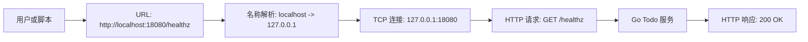
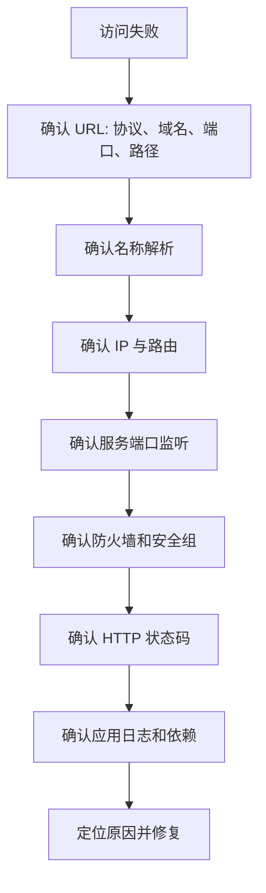
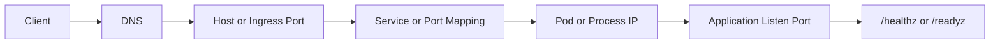
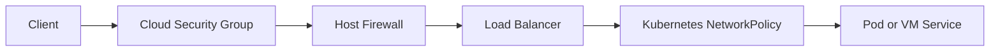

# 第 4 篇：Linux 网络基础与排障

本篇开始进入后端服务和云原生系统最重要的基础之一：网络。

当一个 Go API 在本地能运行，但浏览器访问失败；当容器里服务已经启动，但宿主机访问不到；当 Kubernetes Pod 正常，却无法通过 Service 访问；当线上用户反馈接口超时，排障的第一步往往不是读业务代码，而是确认访问链路中的每一层是否正常。

本篇对应 5 个章节主题：

- 4.1 TCP/IP、端口、DNS、HTTP 基础
- 4.2 `ip`、`ss`、`netstat`、`ping` 使用
- 4.3 `curl`、`wget`、`dig`、`nslookup` 排查访问问题
- 4.4 防火墙、监听地址与端口冲突
- 4.5 tcpdump 抓包入门

本篇特色项目是：**编写并排查一个本地 Todo HTTP 服务访问链路**。

你会在 `cloud-native-todo-platform` 仓库中新增一个 Go HTTP 服务，围绕它练习启动服务、确认端口监听、发起 HTTP 请求、判断 DNS 解析、处理端口冲突、理解监听地址，并用 `tcpdump` 观察真实网络数据包。

## 1. 本章学习目标

学完本篇后，你应该能够从访问链路的角度排查一个后端服务为什么访问失败。

具体目标如下：

- 能说明 TCP/IP、IP 地址、端口、DNS、HTTP 在一次接口访问中的关系。
- 能区分 `127.0.0.1`、`0.0.0.0`、内网 IP、域名和端口的含义。
- 能使用 `ip addr`、`ip route` 查看 Linux 主机网络地址和路由。
- 能使用 `ss`、`netstat` 判断服务是否监听端口。
- 能理解 `ping` 只能验证 ICMP 连通性，不能证明 HTTP 服务可用。
- 能使用 `curl` 和 `wget` 验证 HTTP 状态码、响应头和响应体。
- 能使用 `dig`、`nslookup`、`getent hosts` 排查 DNS 与系统解析问题。
- 能判断端口冲突、监听地址错误、防火墙阻断这三类常见访问失败。
- 能使用 `tcpdump` 在本机回环网卡上抓取 HTTP 请求。
- 能完成 Todo HTTP 服务访问链路小项目，并输出排障记录。

本篇结束时，你至少应该能独立完成以下判断：

```bash
ip -br addr
ip route
ss -lntp
curl -i http://127.0.0.1:18080/healthz
curl -i http://localhost:18080/todos
getent hosts localhost
dig example.com
sudo tcpdump -i lo -nn 'tcp port 18080' -c 10
```

这些命令是后端开发、DevOps、SRE 和 Kubernetes 排障每天都会用到的网络基本功。

## 2. 本章工作场景

网络问题最麻烦的地方在于：错误现象通常很像，但原因可能完全不同。

典型工作场景包括：

- 后端开发启动 Go 服务后，浏览器访问 `http://localhost:8080` 失败，需要判断服务是否监听、端口是否正确、路径是否正确。
- 测试同学反馈接口返回 `Connection refused`，开发需要先确认进程是否存在、端口是否监听，而不是直接怀疑业务逻辑。
- DevOps 把服务放到 Linux 服务器后，服务器本机能访问，其他机器不能访问，需要判断服务是否只监听在 `127.0.0.1`。
- SRE 收到线上告警，接口超时，需要从 DNS、负载均衡、应用端口、防火墙、后端服务逐层排查。
- Docker 场景下，容器内服务监听正常，但宿主机访问失败，需要理解容器端口映射和监听地址。
- Kubernetes 场景下，Pod 正常、Service 异常、Ingress 返回 502，背后依然离不开 DNS、端口、监听地址、HTTP 状态码和网络路径。

本篇围绕一个本地 Todo HTTP 服务来训练。它虽然运行在本机，但排障方法和生产环境是一致的：先确认目标，再确认解析，再确认连通，再确认端口，再确认协议，再确认应用响应。

## 3. 前置知识

### 必须掌握

学习本篇前，你需要已经完成前 3 篇，并具备以下基础：

- 能打开 Linux、macOS Terminal 或 WSL2 Ubuntu 终端。
- 已经安装 Go、Git、curl 等基础工具。
- 能在 `cloud-native-todo-platform` 仓库中创建文件和运行 Go 程序。
- 知道 Linux 文件路径、权限和进程 PID 的基本含义。
- 能使用 `ps`、`kill`、`systemctl` 或前台进程方式观察服务状态。

### 建议了解

以下内容不要求熟练，但建议有初步概念：

- HTTP 是客户端和服务端之间的一种应用层协议。
- 后端服务通常通过 IP 地址和端口对外提供访问入口。
- DNS 的作用是把域名解析成 IP 地址。
- 防火墙可能允许或拒绝某些端口访问。
- Docker 和 Kubernetes 网络最终也要落到端口监听、路由、DNS 和转发规则上。

### 新手补充方向

如果你对网络完全陌生，可以先记住这张最小地图：

| 能力 | 常用工具 | 解决的问题 |
|---|---|---|
| 看地址 | `ip addr`、`ifconfig` | 这台机器有哪些 IP |
| 看路由 | `ip route`、`route` | 请求默认从哪里出去 |
| 看监听 | `ss`、`netstat`、`lsof` | 服务是否真的占用了端口 |
| 测连通 | `ping` | 目标是否响应 ICMP |
| 测 HTTP | `curl`、`wget` | 接口是否返回预期内容 |
| 查 DNS | `dig`、`nslookup`、`getent hosts` | 域名解析到哪里 |
| 看防火墙 | `ufw`、`firewall-cmd`、`iptables`、`nft` | 端口是否被拦截 |
| 抓包 | `tcpdump` | 请求是否真的到达机器 |

不要把这些命令背成孤立清单。它们应该串成一条访问链路。

## 4. 核心概念

### 4.1 一次 HTTP 请求经过哪些层

当你执行：

```bash
curl http://localhost:18080/healthz
```

系统至少会经历这些步骤：



只要其中一层失败，用户看到的都可能是“访问不了”。

常见失败对应关系如下：

| 失败位置 | 常见现象 | 常用排查命令 |
|---|---|---|
| DNS 解析失败 | `Could not resolve host` | `dig`、`nslookup`、`getent hosts` |
| TCP 连接失败 | `Connection refused`、`Connection timed out` | `ss`、`netstat`、`tcpdump` |
| HTTP 路径错误 | `404 Not Found` | `curl -i` |
| 应用异常 | `500 Internal Server Error` | `curl -i`、应用日志 |
| 防火墙阻断 | 本机可访问，远程超时 | `ufw`、`firewall-cmd`、`tcpdump` |

排障时要把“访问失败”拆成更小的问题：域名是否解析，IP 是否可达，端口是否监听，HTTP 是否返回，业务是否正常。

### 4.2 IP 地址与监听地址

IP 地址用于定位网络中的主机或接口。

常见地址含义如下：

| 地址 | 含义 | 常见用途 |
|---|---|---|
| `127.0.0.1` | IPv4 回环地址，只能本机访问 | 本地开发、健康检查 |
| `::1` | IPv6 回环地址，只能本机访问 | IPv6 本地访问 |
| `0.0.0.0` | 监听所有 IPv4 网卡地址 | 服务对外提供访问 |
| `192.168.x.x` | 常见内网地址 | 局域网或虚拟网络 |
| `10.x.x.x` | 常见内网地址 | 云服务器、容器、K8s 集群 |
| 公网 IP | Internet 可路由地址 | 对外服务入口 |

监听地址决定服务接受哪些来源的连接。

如果服务监听：

```text
127.0.0.1:18080
```

通常只有本机能访问。

如果服务监听：

```text
0.0.0.0:18080
```

表示绑定所有 IPv4 网卡。只要防火墙、安全组和网络路由允许，其他机器也可能访问。

!!! warning "不要随意监听 0.0.0.0"
    `0.0.0.0` 很方便，但也更容易把开发服务暴露到局域网或公网。生产环境必须配合认证、TLS、防火墙、安全组和最小暴露原则。

### 4.3 端口是服务入口

一台机器可以运行很多进程。端口用于区分同一个 IP 上的不同服务。

| 服务 | 常见端口 | 协议 |
|---|---:|---|
| HTTP | 80 | TCP |
| HTTPS | 443 | TCP |
| SSH | 22 | TCP |
| PostgreSQL | 5432 | TCP |
| Redis | 6379 | TCP |
| Kubernetes API Server | 6443 | TCP |
| 本篇 Todo Demo | 18080 | TCP |

同一个 IP、同一种协议、同一个端口，通常只能被一个进程监听。如果两个进程都想监听 `127.0.0.1:18080`，第二个进程会失败，并出现类似：

```text
bind: address already in use
```

### 4.4 DNS 是名字到地址的解析

人更容易记住域名，机器需要 IP 地址。DNS 负责把域名解析为 IP。

例如：

```bash
dig example.com
```

可能返回一个或多个 A / AAAA 记录。具体 IP 会随 DNS、地区和时间变化，下面只表示输出形态：

```text
example.com.  300  IN  A  <IP address>
```

但要注意，应用程序的“系统解析”不一定只走 DNS。Linux 可能先查 `/etc/hosts`，再查 DNS。比如 `localhost` 通常来自 `/etc/hosts`，而不是公网 DNS。

Linux 中可以用：

```bash
getent hosts localhost
```

查看系统最终如何解析一个名字。

### 4.5 HTTP 状态码告诉你应用层结果

TCP 连接成功只代表你连上了端口，不代表业务一定正常。HTTP 状态码能告诉你应用层结果。

| 状态码 | 含义 | 排障方向 |
|---|---|---|
| `200` | 请求成功 | 服务正常响应 |
| `301` / `302` | 重定向 | 检查 URL 和网关规则 |
| `400` | 请求格式错误 | 检查参数和请求体 |
| `401` / `403` | 未认证或无权限 | 检查 Token、Cookie、权限 |
| `404` | 路径不存在 | 检查 URL、路由、Ingress path |
| `500` | 服务内部错误 | 看应用日志和依赖状态 |
| `502` | 网关无法访问上游 | 检查后端服务、端口、Service |
| `503` | 服务不可用 | 检查健康检查、容量、依赖 |
| `504` | 网关超时 | 检查慢请求、网络、上游超时 |

本篇用 `curl -i` 同时查看响应头和响应体。

## 5. 原理深入

### 5.1 访问链路排障模型

后端服务访问问题可以按固定顺序排查：



真实排障中不要一上来就猜。先把链路拆开，再逐层排除。

### 5.2 `Connection refused` 与 `Connection timed out`

这两个错误非常常见，但含义不同。

`Connection refused` 通常表示目标主机可达，但目标端口没有进程监听，或者被系统明确拒绝。

示例：

```text
curl: (7) Failed to connect to 127.0.0.1 port 18080: Connection refused
```

优先检查：

```bash
ss -lntp | grep 18080
```

`Connection timed out` 通常表示请求发出去了，但长时间没有响应。原因可能是防火墙丢弃、路由不通、云安全组未放行、目标机器不可达。

示例：

```text
curl: (28) Failed to connect to 10.0.0.10 port 18080 after 10000 ms: Timeout was reached
```

优先检查：

```bash
ping 10.0.0.10
traceroute 10.0.0.10
sudo tcpdump -i any -nn 'host 10.0.0.10 and tcp port 18080'
```

### 5.3 `ping` 不能证明 HTTP 服务正常

`ping` 使用 ICMP，不使用 TCP，也不访问 HTTP 路径。

所以：

- `ping` 成功，不代表 80、443、18080 端口可访问。
- `ping` 失败，也不一定代表 HTTP 不可访问，因为有些服务器禁用了 ICMP。

判断 HTTP 服务是否可用，应使用：

```bash
curl -i http://127.0.0.1:18080/healthz
```

### 5.4 `ss` 比 `netstat` 更适合现代 Linux

`netstat` 来自较老的 `net-tools`，很多新系统默认不再安装。现代 Linux 更推荐使用 `ss`，它来自 `iproute2`，速度更快，也更贴近内核 socket 信息。

常见对照：

| 目的 | 推荐命令 | 兼容命令 |
|---|---|---|
| 查看监听 TCP 端口 | `ss -lntp` | `netstat -lntp` |
| 查看所有 TCP 连接 | `ss -antp` | `netstat -antp` |
| 查看 UDP 监听 | `ss -lnup` | `netstat -lnup` |
| 按端口过滤 | `ss -lntp 'sport = :18080'` | `netstat -lntp | grep 18080` |

### 5.5 WSL2、macOS 与 Linux 的差异

本课程后续主要面向 Linux 服务器、容器和 Kubernetes，但很多学习者会在 Windows 或 macOS 上学习。

=== "Linux / WSL2 Ubuntu"

    Linux 里推荐使用：

    ```bash
    ip addr
    ip route
    ss -lntp
    curl -i http://127.0.0.1:18080/healthz
    getent hosts localhost
    sudo tcpdump -i lo -nn 'tcp port 18080'
    ```

    WSL2 是运行在 Windows 上的 Linux 虚拟化环境。多数情况下，Windows 浏览器可以访问 WSL2 中监听在 `127.0.0.1` 或 `0.0.0.0` 的服务，但公司安全软件、Windows 防火墙或 WSL 网络转发异常时可能失败。

=== "macOS"

    macOS 没有 Linux 的 `ip` 命令，常用替代命令是：

    ```bash
    ifconfig
    route -n get default
    netstat -anv | grep LISTEN
    lsof -nP -iTCP:18080 -sTCP:LISTEN
    curl -i http://127.0.0.1:18080/healthz
    sudo tcpdump -i lo0 -nn 'tcp port 18080'
    ```

    macOS 上安装 `wget`、`dig` 等工具通常依赖 Homebrew。

=== "Windows PowerShell"

    Windows 本机排查可使用：

    ```powershell
    Get-NetIPAddress
    Get-NetRoute
    Get-NetTCPConnection -LocalPort 18080
    Test-NetConnection 127.0.0.1 -Port 18080
    curl.exe -i http://127.0.0.1:18080/healthz
    Resolve-DnsName localhost
    ```

    如果服务运行在 WSL2 中，建议优先在 WSL2 终端内执行 Linux 命令，再用 Windows 浏览器验证访问。

### 5.6 从本机端口映射到 Docker 和 Kubernetes

本篇虽然还没有正式进入 Docker 和 Kubernetes，但你现在学习的端口、监听地址和 HTTP 检查，会直接迁移到后面的容器与集群排障。

| 当前阶段 | 访问入口 | 后续对应概念 | 排障重点 |
|---|---|---|---|
| 本机进程 | `127.0.0.1:18080` | Linux 进程监听端口 | `ss -lntp` 是否有 `LISTEN` |
| Docker 容器 | `localhost:18080 -> container:8080` | `docker run -p 18080:8080` | 宿主机端口映射和容器内监听地址 |
| Kubernetes Pod | `PodIP:8080` | `containerPort` | 容器内进程是否监听正确端口 |
| Kubernetes Service | `ServiceIP:80 -> PodIP:8080` | `port`、`targetPort`、Endpoints | Service selector 和 Endpoints 是否正确 |
| Kubernetes Ingress | `https://todo.example.com` | Ingress rule、Service backend | 域名、路径、证书、上游 Service |

同一个 Todo API 在不同阶段的访问链路会变长，但排障顺序不变：



因此，后面遇到 Docker 端口映射失败、Kubernetes Service 没有 Endpoints、Ingress 返回 502 时，你仍然会回到这几个问题：名字解析到哪里，流量打到哪个 IP，端口有没有监听，请求路径是否正确，应用是否返回健康状态。

## 6. 手把手实验

### 6.1 实验目标

本实验会完成一个可复现的本地网络排障闭环：

1. 在课程项目中创建 Todo HTTP Demo 服务。
2. 让服务监听 `127.0.0.1:18080`。
3. 使用 `curl`、`wget` 验证 HTTP 响应。
4. 使用 `ss`、`netstat`、`lsof` 判断端口监听。
5. 使用 `dig`、`nslookup`、`getent hosts` 排查域名解析。
6. 故意制造端口冲突并定位进程。
7. 对比 `127.0.0.1` 和 `0.0.0.0` 的监听差异。
8. 可选扩展：检查防火墙规则。
9. 可选扩展：使用 `tcpdump` 抓取本机 HTTP 请求。
10. 精确清理实验进程和临时抓包文件。

### 6.2 实验环境

推荐环境：

| 项目 | 要求 |
|---|---|
| 操作系统 | Ubuntu 22.04+、Debian 12+、Fedora、macOS 或 WSL2 Ubuntu |
| Go | 1.22+ |
| Git | 任意较新版本 |
| curl | 必需 |
| wget | 推荐 |
| dig / nslookup | 推荐 |
| tcpdump | 推荐 |

本篇最终验收默认以 **Linux / WSL2 Ubuntu** 为主线环境。macOS 和 Windows 可以完成大部分概念验证，但 `ss`、`getent`、`ip`、回环网卡名称和防火墙命令会有差异。遇到平台差异时，优先使用本篇标签页中的等价命令。

安装工具：

=== "Ubuntu / Debian / WSL2"

    ```bash
    sudo apt update
    sudo apt install -y curl wget dnsutils iproute2 net-tools lsof tcpdump traceroute
    ```

    说明：

    - `dnsutils` 提供 `dig` 和 `nslookup`。
    - `iproute2` 提供 `ip` 和 `ss`。
    - `net-tools` 提供旧命令 `netstat`。
    - `tcpdump` 用于抓包，通常需要 `sudo`。

=== "Fedora / RHEL / CentOS Stream"

    ```bash
    sudo dnf install -y curl wget bind-utils iproute net-tools lsof tcpdump traceroute
    ```

    说明：

    - `bind-utils` 提供 `dig` 和 `nslookup`。
    - 老旧 CentOS 7 可能使用 `yum`，现代 RHEL 系更推荐 `dnf`。

=== "macOS"

    ```bash
    brew install wget bind tcpdump
    ```

    macOS 默认通常已有 `curl`、`netstat`、`lsof` 和 `tcpdump`。如果没有 Homebrew，可以先只完成 `curl`、`netstat`、`lsof` 部分。

=== "Windows PowerShell"

    ```powershell
    winget install GoLang.Go
    ```

    Windows 本机已有 `curl.exe`、`Test-NetConnection`、`Resolve-DnsName`。建议本篇实验主体在 WSL2 Ubuntu 中完成，因为后续 Docker 和 Kubernetes 学习会大量使用 Linux 网络命令。

### 6.3 准备项目目录

进入课程主线项目。如果你已经在第 1 篇创建过仓库，直接进入：

```bash
cd ~/workspace/cloud-native-todo-platform
```

如果还没有这个目录，可以先创建一个本地练习目录：

```bash
mkdir -p ~/workspace/cloud-native-todo-platform
cd ~/workspace/cloud-native-todo-platform
```

确认当前位置：

```bash
pwd
```

预期输出类似：

```text
/home/dev/workspace/cloud-native-todo-platform
```

初始化 Go 模块。如果前面已经执行过，可以跳过：

```bash
if [ ! -f go.mod ]; then
  go mod init example.com/cloud-native-todo-platform
fi
```

这里使用 `example.com/cloud-native-todo-platform` 作为本地教学模块路径。真实项目中，如果你准备把代码推送到 GitHub，可以替换成：

```text
github.com/<你的 GitHub 用户名>/cloud-native-todo-platform
```

如果你直接执行 `go mod init` 时看到下面提示，说明模块已存在，不是错误：

```text
go: /home/dev/workspace/cloud-native-todo-platform/go.mod already exists
```

### 6.4 创建 Todo HTTP Demo 服务

创建目录：

```bash
mkdir -p api/cmd/todo-network-demo
```

写入完整 Go 代码：

```bash
cat > api/cmd/todo-network-demo/main.go <<'EOF'
package main

import (
	"context"
	"encoding/json"
	"log"
	"net"
	"net/http"
	"os"
	"os/signal"
	"strings"
	"syscall"
	"time"
)

type todo struct {
	ID        int    `json:"id"`
	Title     string `json:"title"`
	Completed bool   `json:"completed"`
}

type response map[string]any

func main() {
	addr := getenv("TODO_ADDR", "127.0.0.1:18080")

	mux := http.NewServeMux()
	mux.HandleFunc("/healthz", healthz)
	mux.HandleFunc("/readyz", readyz)
	mux.HandleFunc("/todos", todos)
	mux.HandleFunc("/debug/request", debugRequest)

	server := &http.Server{
		Addr:              addr,
		Handler:           loggingMiddleware(mux),
		ReadHeaderTimeout: 5 * time.Second,
	}

	listener, err := net.Listen("tcp", addr)
	if err != nil {
		log.Fatalf("listen on %s failed: %v", addr, err)
	}

	log.Printf("todo network demo listening on http://%s", listener.Addr().String())
	log.Printf("try: curl -i http://%s/healthz", listener.Addr().String())

	go func() {
		if err := server.Serve(listener); err != nil && err != http.ErrServerClosed {
			log.Fatalf("serve failed: %v", err)
		}
	}()

	stop := make(chan os.Signal, 1)
	signal.Notify(stop, os.Interrupt, syscall.SIGTERM)
	<-stop

	ctx, cancel := context.WithTimeout(context.Background(), 5*time.Second)
	defer cancel()

	log.Println("shutting down todo network demo")
	if err := server.Shutdown(ctx); err != nil {
		log.Fatalf("shutdown failed: %v", err)
	}
}

func healthz(w http.ResponseWriter, r *http.Request) {
	writeJSON(w, http.StatusOK, response{
		"status": "ok",
		"time":   time.Now().Format(time.RFC3339),
	})
}

func readyz(w http.ResponseWriter, r *http.Request) {
	if strings.EqualFold(os.Getenv("TODO_READY"), "false") {
		writeJSON(w, http.StatusServiceUnavailable, response{
			"status": "not_ready",
			"reason": "TODO_READY=false",
		})
		return
	}

	writeJSON(w, http.StatusOK, response{
		"status": "ready",
	})
}

func todos(w http.ResponseWriter, r *http.Request) {
	if r.Method != http.MethodGet {
		writeJSON(w, http.StatusMethodNotAllowed, response{
			"error": "method_not_allowed",
		})
		return
	}

	writeJSON(w, http.StatusOK, response{
		"items": []todo{
			{ID: 1, Title: "learn linux network basics", Completed: true},
			{ID: 2, Title: "debug todo http access path", Completed: false},
			{ID: 3, Title: "prepare for docker and kubernetes networking", Completed: false},
		},
	})
}

func debugRequest(w http.ResponseWriter, r *http.Request) {
	host, port, err := net.SplitHostPort(r.RemoteAddr)
	if err != nil {
		host = r.RemoteAddr
		port = ""
	}

	writeJSON(w, http.StatusOK, response{
		"method":        r.Method,
		"path":          r.URL.Path,
		"host_header":   r.Host,
		"remote_addr":   r.RemoteAddr,
		"remote_host":   host,
		"remote_port":   port,
		"user_agent":    r.UserAgent(),
		"x_forwarded_for": r.Header.Get("X-Forwarded-For"),
	})
}

func writeJSON(w http.ResponseWriter, status int, data any) {
	w.Header().Set("Content-Type", "application/json; charset=utf-8")
	w.WriteHeader(status)
	if err := json.NewEncoder(w).Encode(data); err != nil {
		log.Printf("write response failed: %v", err)
	}
}

func loggingMiddleware(next http.Handler) http.Handler {
	return http.HandlerFunc(func(w http.ResponseWriter, r *http.Request) {
		start := time.Now()
		next.ServeHTTP(w, r)
		log.Printf("%s %s from %s cost=%s", r.Method, r.URL.Path, r.RemoteAddr, time.Since(start))
	})
}

func getenv(key, fallback string) string {
	value := strings.TrimSpace(os.Getenv(key))
	if value == "" {
		return fallback
	}
	return value
}
EOF
```

执行：

```bash
go run ./api/cmd/todo-network-demo
```

预期输出：

```text
todo network demo listening on http://127.0.0.1:18080
try: curl -i http://127.0.0.1:18080/healthz
```

如果这里出现编译错误，要先修复 Go 代码。真实工作中网络排障经常和程序启动问题混在一起。只有程序能编译并成功监听端口后，继续排查 DNS、端口、防火墙和 HTTP 才有意义。

### 6.5 编译服务

停止前台服务：

```text
按 Ctrl+C
```

编译二进制：

```bash
mkdir -p bin
go build -o bin/todo-network-demo ./api/cmd/todo-network-demo
```

运行：

```bash
TODO_ADDR=127.0.0.1:18080 ./bin/todo-network-demo
```

保持这个终端不关闭。后面的访问命令在第二个终端执行。

### 6.6 验证 HTTP 请求

打开第二个终端，进入同一个项目目录：

```bash
cd ~/workspace/cloud-native-todo-platform
```

请求健康检查：

```bash
curl -i http://127.0.0.1:18080/healthz
```

预期输出类似：

```http
HTTP/1.1 200 OK
Content-Type: application/json; charset=utf-8
Date: Tue, 26 May 2026 08:00:00 GMT
Content-Length: 46

{"status":"ok","time":"2026-05-26T08:00:00Z"}
```

解释：

- `HTTP/1.1 200 OK` 表示 HTTP 应用层成功。
- `Content-Type` 表示服务返回 JSON。
- 响应体中的 `status` 是应用自己定义的健康状态。

请求 Todo 列表：

```bash
curl -s http://127.0.0.1:18080/todos
```

预期输出：

```json
{"items":[{"id":1,"title":"learn linux network basics","completed":true},{"id":2,"title":"debug todo http access path","completed":false},{"id":3,"title":"prepare for docker and kubernetes networking","completed":false}]}
```

查看请求调试信息：

```bash
curl -s http://127.0.0.1:18080/debug/request
```

预期输出类似：

```json
{"host_header":"127.0.0.1:18080","method":"GET","path":"/debug/request","remote_addr":"127.0.0.1:53122","remote_host":"127.0.0.1","remote_port":"53122","user_agent":"curl/8.5.0","x_forwarded_for":""}
```

这里的 `remote_port` 是客户端临时端口，不是服务端口。服务端口是 URL 中的 `18080`。

使用 `wget` 验证：

```bash
wget -S -O - http://127.0.0.1:18080/healthz
```

说明：

- `-S` 显示响应头。
- `-O -` 把响应体输出到终端。

### 6.7 查看端口监听

Linux 推荐使用 `ss`：

```bash
ss -lntp 'sport = :18080'
```

预期输出类似：

```text
State  Recv-Q Send-Q Local Address:Port  Peer Address:Port Process
LISTEN 0      4096   127.0.0.1:18080    0.0.0.0:*     users:(("todo-network-demo",pid=12345,fd=3))
```

关键字段解释：

| 字段 | 含义 |
|---|---|
| `LISTEN` | 端口正在监听 |
| `127.0.0.1:18080` | 只监听本机回环地址 |
| `pid=12345` | 占用端口的进程 ID |
| `todo-network-demo` | 占用端口的进程名 |

兼容旧系统可以使用 `netstat`：

```bash
netstat -lntp 2>/dev/null | grep 18080
```

macOS 可以使用：

```bash
lsof -nP -iTCP:18080 -sTCP:LISTEN
```

Windows PowerShell 可以使用：

```powershell
Get-NetTCPConnection -LocalPort 18080
```

### 6.8 查看本机 IP 与路由

Linux 查看简洁地址：

```bash
ip -br addr
```

预期输出类似：

```text
lo               UNKNOWN        127.0.0.1/8 ::1/128
eth0             UP             172.20.10.5/24 fe80::...
```

解释：

- `lo` 是回环网卡，对应 `127.0.0.1`。
- `eth0`、`ens33`、`wlan0` 等通常是实际网卡或虚拟网卡。

查看路由：

```bash
ip route
```

预期输出类似：

```text
default via 172.20.10.1 dev eth0
172.20.10.0/24 dev eth0 proto kernel scope link src 172.20.10.5
```

解释：

- `default via` 表示访问非本地网段时走哪个网关。
- `src` 后面的地址通常是这台机器访问外部网络时使用的源 IP。

### 6.9 排查 DNS 与系统解析

先访问 `localhost`：

```bash
curl -i http://localhost:18080/healthz
```

如果返回 `200 OK`，说明 `localhost` 能被系统解析到本机地址。

Linux 查看系统解析：

```bash
getent hosts localhost
```

预期输出可能包含：

```text
::1             localhost
127.0.0.1       localhost
```

查看 `/etc/hosts`：

```bash
grep localhost /etc/hosts
```

再查询公网 DNS：

```bash
dig example.com
```

只看精简结果：

```bash
dig +short example.com
```

使用 `nslookup`：

```bash
nslookup example.com
```

重要区别：

- `getent hosts` 更接近 Linux 应用程序的系统解析结果，会参考 `/etc/nsswitch.conf`。
- `dig` 主要用于查询 DNS，不等价于应用最终解析路径。
- `/etc/hosts` 中的记录可能让应用解析到和 `dig` 不一样的地址。

### 6.10 制造并排查端口冲突

保持第一个 `todo-network-demo` 正在运行。

在第二个终端再次启动同一个端口：

```bash
TODO_ADDR=127.0.0.1:18080 ./bin/todo-network-demo
```

预期失败：

```text
listen on 127.0.0.1:18080 failed: listen tcp 127.0.0.1:18080: bind: address already in use
```

定位占用者：

```bash
ss -lntp 'sport = :18080'
```

如果权限不足看不到进程名，使用：

```bash
sudo ss -lntp 'sport = :18080'
```

也可以使用：

```bash
lsof -nP -iTCP:18080 -sTCP:LISTEN
```

修复方式有两种。

方式一：停止旧进程。回到第一个终端按 `Ctrl+C`。

方式二：换一个端口：

```bash
TODO_ADDR=127.0.0.1:18081 ./bin/todo-network-demo
```

验证：

```bash
curl -i http://127.0.0.1:18081/healthz
```

### 6.11 对比 127.0.0.1 与 0.0.0.0

先确认 `18080` 没有被旧实验进程占用：

```bash
ss -lntp 'sport = :18080' || true
```

如果还能看到 `todo-network-demo`，优先回到启动它的终端按 `Ctrl+C` 停止。不要直接使用 `pkill -f todo-network-demo` 这类模糊匹配命令，因为它可能误杀其他同名实验进程。

只监听本机，并把进程 PID 记录下来：

```bash
TODO_ADDR=127.0.0.1:18080 ./bin/todo-network-demo > /tmp/todo-network-loopback.log 2>&1 &
DEMO_PID=$!
echo "${DEMO_PID}" > /tmp/todo-network-demo.pid
sleep 1
```

查看监听：

```bash
ss -lntp 'sport = :18080'
```

你会看到：

```text
127.0.0.1:18080
```

精确停止刚才启动的进程：

```bash
DEMO_PID="$(cat /tmp/todo-network-demo.pid)"
if ps -p "${DEMO_PID}" -o args= | grep -q "todo-network-demo"; then
  kill "${DEMO_PID}"
fi
rm -f /tmp/todo-network-demo.pid
```

改为监听所有 IPv4 地址：

```bash
TODO_ADDR=0.0.0.0:18080 ./bin/todo-network-demo > /tmp/todo-network-all.log 2>&1 &
DEMO_PID=$!
echo "${DEMO_PID}" > /tmp/todo-network-demo.pid
sleep 1
```

再次查看：

```bash
ss -lntp 'sport = :18080'
```

你会看到：

```text
0.0.0.0:18080
```

这表示服务绑定到所有 IPv4 网卡。是否能被其他机器访问，还取决于防火墙、云安全组、公司网络策略和路由。

!!! warning "不要在公共网络暴露实验服务"
    本实验服务没有认证、限流、TLS 和安全加固。只能用于本地学习，不要部署到公网服务器对外开放。

完成对比后，精确停止实验进程：

```bash
DEMO_PID="$(cat /tmp/todo-network-demo.pid)"
if ps -p "${DEMO_PID}" -o args= | grep -q "todo-network-demo"; then
  kill "${DEMO_PID}"
fi
rm -f /tmp/todo-network-demo.pid
```

### 6.12 可选扩展：防火墙检查

不同系统的防火墙工具不同。本节是可选扩展，只建议在个人虚拟机、个人云主机或明确授权的实验机上执行。

!!! warning "先确认你有权限修改防火墙"
    不要在公司办公电脑、生产服务器、共享开发机或公网机器上随意开放端口。防火墙规则可能影响整台机器的安全边界。执行开放端口命令前，先确认这是受控实验环境，并准备好清理命令。

=== "Ubuntu / Debian"

    查看 UFW 状态：

    ```bash
    sudo ufw status verbose
    ```

    如果只是本地 `127.0.0.1` 访问，通常不需要开放防火墙端口。

    如果你在受控实验机上测试局域网访问，可以临时允许端口：

    ```bash
    sudo ufw allow 18080/tcp
    sudo ufw status numbered
    ```

    实验结束后删除规则：

    ```bash
    sudo ufw delete allow 18080/tcp
    ```

=== "Fedora / RHEL / CentOS Stream"

    查看 firewalld 状态：

    ```bash
    sudo firewall-cmd --state
    sudo firewall-cmd --list-all
    ```

    如果你在受控实验机上测试局域网访问，可以临时开放端口：

    ```bash
    sudo firewall-cmd --add-port=18080/tcp
    ```

    实验结束后移除：

    ```bash
    sudo firewall-cmd --remove-port=18080/tcp
    ```

=== "macOS"

    macOS 防火墙主要在系统设置中管理。命令行可以查看应用是否监听：

    ```bash
    lsof -nP -iTCP:18080 -sTCP:LISTEN
    ```

    如果浏览器或其他机器访问失败，先确认服务监听地址是否是 `0.0.0.0`，再检查系统防火墙和网络权限提示。

=== "Windows PowerShell"

    查看端口连通性：

    ```powershell
    Test-NetConnection 127.0.0.1 -Port 18080
    ```

    如果访问 WSL2 中的服务失败，先在 WSL2 内确认：

    ```bash
    curl -i http://127.0.0.1:18080/healthz
    ss -lntp 'sport = :18080'
    ```

    再检查 Windows 防火墙、公司安全软件和 WSL 网络转发。

### 6.13 可选扩展：使用 tcpdump 抓包

`tcpdump` 可以证明请求是否真的经过某块网卡，但它也可能捕获请求头、Token、Cookie、请求体等敏感信息。本节只在本机回环网卡上抓本篇 demo 的 HTTP 请求，仍然建议你把它当成敏感操作对待。

!!! warning "抓包前先限定范围"
    抓包时要指定网卡、端口和包数量。本篇使用 `tcp port 18080` 和 `-c` 限制范围。不要在未知环境里执行不带过滤条件的全量抓包。

确保 demo 服务正在运行：

```bash
TODO_ADDR=127.0.0.1:18080 ./bin/todo-network-demo
```

新开一个终端抓包。

=== "Linux / WSL2"

    ```bash
    sudo tcpdump -i lo -nn -A 'tcp port 18080' -c 10
    ```

=== "macOS"

    ```bash
    sudo tcpdump -i lo0 -nn -A 'tcp port 18080' -c 10
    ```

参数解释：

| 参数 | 含义 |
|---|---|
| `-i lo` / `-i lo0` | 指定回环网卡 |
| `-nn` | 不把 IP 和端口反向解析成名字，输出更清楚 |
| `-A` | 以 ASCII 方式显示包内容，便于观察 HTTP 文本 |
| `'tcp port 18080'` | 只抓 18080 端口的 TCP 包 |
| `-c 10` | 抓到 10 个包后退出 |

在另一个终端发起请求：

```bash
curl -i http://127.0.0.1:18080/healthz
```

tcpdump 输出中可能看到：

```text
GET /healthz HTTP/1.1
Host: 127.0.0.1:18080
User-Agent: curl/8.5.0
Accept: */*

HTTP/1.1 200 OK
Content-Type: application/json; charset=utf-8
```

这说明请求确实到达了本机回环网卡，并收到了 HTTP 响应。

如果你想保存抓包文件：

```bash
sudo tcpdump -i lo -nn 'tcp port 18080' -w /tmp/todo-network-demo.pcap -c 20
```

读取抓包文件：

```bash
tcpdump -nn -r /tmp/todo-network-demo.pcap
```

### 6.14 编写 Makefile.network 固化常用命令

为了让后续课程可以复用本篇成果，写一个独立的 `Makefile.network`：

!!! note "Makefile.network 的适用范围"
    下面的 `network-build`、`network-run`、`network-check`、`network-todos` 在 Linux、WSL2 和 macOS 上都比较通用。`network-listen` 和 `network-dns` 默认使用 Linux / WSL2 的 `ss`、`getent`、`dig`。macOS 或 Windows 学员可以使用前文标签页中的 `lsof`、`netstat`、`Get-NetTCPConnection`、`Resolve-DnsName` 等等价命令完成验收。

```bash
cat > Makefile.network <<'EOF'
APP_ADDR ?= 127.0.0.1:18080
APP_PORT ?= 18080

.PHONY: network-build network-run network-check network-todos network-listen network-dns network-clean

network-build:
	mkdir -p bin
	go build -o bin/todo-network-demo ./api/cmd/todo-network-demo

network-run: network-build
	TODO_ADDR=$(APP_ADDR) ./bin/todo-network-demo

network-check:
	curl -i http://$(APP_ADDR)/healthz

network-todos:
	curl -s http://$(APP_ADDR)/todos

network-listen:
	ss -lntp 'sport = :$(APP_PORT)' || true

network-dns:
	getent hosts localhost || true
	dig +short example.com || true

network-clean:
	if [ -f /tmp/todo-network-demo.pid ]; then \
	  DEMO_PID=$$(cat /tmp/todo-network-demo.pid); \
	  if ps -p "$${DEMO_PID}" -o args= | grep -q "todo-network-demo"; then \
	    kill "$${DEMO_PID}"; \
	  fi; \
	  rm -f /tmp/todo-network-demo.pid; \
	fi
	rm -f /tmp/todo-network-demo.pcap /tmp/todo-network-loopback.log /tmp/todo-network-all.log
EOF
```

验证：

```bash
make -f Makefile.network network-build
make -f Makefile.network network-listen
```

启动服务：

```bash
make -f Makefile.network network-run
```

另一个终端验证：

```bash
make -f Makefile.network network-check
make -f Makefile.network network-todos
```

清理可选扩展实验产生的临时文件和 PID 文件：

```bash
make -f Makefile.network network-clean
```

### 6.15 清理步骤

停止前台服务：

```text
按 Ctrl+C
```

确认没有残留进程：

```bash
pgrep -af todo-network-demo || true
```

如确认是本实验进程，可以停止：

```bash
if [ -f /tmp/todo-network-demo.pid ]; then
  DEMO_PID="$(cat /tmp/todo-network-demo.pid)"
  if ps -p "${DEMO_PID}" -o args= | grep -q "todo-network-demo"; then
    kill "${DEMO_PID}"
  fi
  rm -f /tmp/todo-network-demo.pid
fi
```

如果没有 PID 文件，不要直接使用模糊匹配的 `pkill -f`。先用端口定位，再确认 PID 是否属于本实验：

```bash
ss -lntp 'sport = :18080' || true
```

清理抓包文件：

```bash
rm -f /tmp/todo-network-demo.pcap /tmp/todo-network-loopback.log /tmp/todo-network-all.log
```

本篇创建的代码建议保留：

```text
api/cmd/todo-network-demo/main.go
Makefile.network
bin/todo-network-demo
```

其中 `bin/` 一般不提交到 Git，后续可通过 `.gitignore` 忽略。

## 7. 真实工作案例

### 案例一：服务本机能访问，其他机器不能访问

现象：

```bash
curl http://127.0.0.1:18080/healthz
```

在服务器本机成功，但同事从另一台机器访问：

```bash
curl http://10.0.0.12:18080/healthz
```

失败。

常见原因：

- 服务只监听 `127.0.0.1`，没有监听 `0.0.0.0` 或内网 IP。
- 服务器防火墙没有开放端口。
- 云安全组没有放行端口。
- 服务所在机器和访问机器不在同一网络或路由不通。

排查顺序：

```bash
ss -lntp 'sport = :18080'
ip -br addr
sudo ufw status verbose
sudo tcpdump -i any -nn 'tcp port 18080'
```

如果 `ss` 显示 `127.0.0.1:18080`，就算防火墙开放，其他机器也无法通过内网 IP 访问。需要让服务监听 `0.0.0.0:18080`，并配合安全策略。

### 案例二：域名访问失败，但 IP 访问成功

现象：

```bash
curl http://todo.internal.example.com/healthz
```

失败，但：

```bash
curl http://10.0.0.20/healthz
```

成功。

常见原因：

- DNS 记录不存在或写错。
- DNS 缓存未刷新。
- 不同环境使用了不同 DNS 服务器。
- `/etc/hosts` 中存在旧记录。

排查命令：

```bash
getent hosts todo.internal.example.com
dig todo.internal.example.com
nslookup todo.internal.example.com
grep todo.internal.example.com /etc/hosts
```

开发、测试、运维协作方式：

- 开发确认服务端口和健康检查路径。
- 运维确认 DNS 记录、负载均衡和安全组。
- 测试提供失败环境、失败时间和完整请求 URL。

### 案例三：Kubernetes Service 返回 502

虽然本篇还没有进入 Kubernetes，但它的排障逻辑完全延续本篇内容。

Ingress 返回 `502 Bad Gateway` 时，常见路径是：

```text
Client -> DNS -> Ingress -> Service -> Pod IP:containerPort -> 应用进程
```

把本篇命令映射到 Kubernetes 时，可以这样理解：

| 本篇排查点 | Kubernetes 中对应对象 | 常用命令 |
|---|---|---|
| 域名是否解析 | Ingress Host、CoreDNS | `kubectl get ingress`、`kubectl -n kube-system logs deploy/coredns` |
| 入口是否转发 | Ingress Controller | `kubectl describe ingress todo-api` |
| 服务是否有后端 | Service、Endpoints | `kubectl get svc,endpoints todo-api` |
| Pod 是否可接流量 | Pod Ready 状态 | `kubectl get pod -l app=todo-api -o wide` |
| 应用端口是否监听 | 容器内进程 | `kubectl exec deploy/todo-api -- ss -lntp` |
| HTTP 是否正常 | 健康检查路径 | `kubectl port-forward svc/todo-api 18080:80` 后执行 `curl` |

对应排查：

```bash
kubectl get ingress,svc,pod
kubectl describe svc todo-api
kubectl get endpoints todo-api
kubectl logs deploy/todo-api
kubectl exec deploy/todo-api -- ss -lntp
```

你会发现 Kubernetes 网络排障依然离不开端口监听、DNS、HTTP 状态码和应用日志。

## 8. 常见错误

| 错误现象 | 常见原因 | 修复方向 |
|---|---|---|
| `Connection refused` | 进程没启动，端口没监听，监听地址不匹配 | 用 `ss -lntp` 确认端口 |
| `Connection timed out` | 防火墙、安全组、路由或网络阻断 | 查防火墙、路由、抓包 |
| `Could not resolve host` | DNS 解析失败 | 用 `dig`、`nslookup`、`getent hosts` |
| 本机能访问，远程不能访问 | 服务只监听 `127.0.0.1` | 改为监听 `0.0.0.0` 并加安全限制 |
| `address already in use` | 端口被其他进程占用 | 用 `ss`、`lsof` 找 PID |
| `404 Not Found` | URL 路径错误或路由未注册 | 用 `curl -i` 检查路径 |
| `503 Service Unavailable` | 服务未就绪或依赖异常 | 查 `/readyz`、日志和依赖 |
| `tcpdump` 没输出 | 抓错网卡、过滤条件错误、请求没发出 | 换 `-i any` 或确认请求 |
| `ping` 成功但 HTTP 失败 | ICMP 通，不代表 TCP 端口通 | 用 `curl` 和 `ss` |
| `dig` 正常但应用解析异常 | `/etc/hosts` 或系统解析顺序不同 | 用 `getent hosts` 对比 |
| 复制了占位模块路径 | `go.mod` 中仍是示例路径 | 换成自己的模块路径，或仅用于本地实验 |
| 防火墙实验后忘记清理 | 端口持续对外开放 | 删除临时规则并复查防火墙状态 |
| 模糊清理进程 | `pkill -f` 误杀其他同名进程 | 使用 PID 文件或端口定位后再精确停止 |

## 9. 排障方法

### 9.1 五步排障法

遇到访问失败，按下面顺序执行。

第一步，确认 URL 是否正确：

```bash
curl -v http://127.0.0.1:18080/healthz
```

观察重点：

- 请求协议是不是 `http` 或 `https`。
- 主机名是不是正确。
- 端口是不是服务实际监听端口。
- 路径是不是服务真实路由。

第二步，确认名称解析：

```bash
getent hosts localhost
dig +short example.com
nslookup example.com
```

观察重点：

- 是否解析到预期 IP。
- 是否有多个 A 记录。
- 是否被 `/etc/hosts` 覆盖。

第三步，确认服务监听：

```bash
ss -lntp 'sport = :18080'
```

观察重点：

- 是否存在 `LISTEN`。
- 监听地址是 `127.0.0.1` 还是 `0.0.0.0`。
- 占用端口的 PID 是否是预期进程。

第四步，确认网络是否到达：

```bash
sudo tcpdump -i any -nn 'tcp port 18080'
```

观察重点：

- 发起请求时是否有包出现。
- 是否只有请求没有响应。
- 是否抓错了网卡。

第五步，确认应用响应：

```bash
curl -i http://127.0.0.1:18080/healthz
curl -i http://127.0.0.1:18080/readyz
curl -i http://127.0.0.1:18080/todos
```

观察重点：

- HTTP 状态码。
- 响应头。
- 响应体错误信息。
- 服务日志。

### 9.2 常见错误到命令的映射

| curl 错误 | 优先命令 | 判断依据 |
|---|---|---|
| `Could not resolve host` | `getent hosts`、`dig` | 域名是否能解析 |
| `Connection refused` | `ss -lntp` | 端口是否监听 |
| `Connection timed out` | `tcpdump`、防火墙命令 | 包是否到达，是否被丢弃 |
| `Empty reply from server` | 服务日志、`tcpdump` | TCP 连上但应用提前断开 |
| `404` | `curl -i`、路由配置 | 路径是否正确 |
| `500` | 应用日志 | 业务或依赖是否异常 |

### 9.3 一条命令生成排障快照

在 Linux 上可以把常用信息收集到一个文件：

```bash
{
  echo "## time"
  date
  echo
  echo "## ip"
  ip -br addr
  echo
  echo "## route"
  ip route
  echo
  echo "## listen"
  ss -lntp 'sport = :18080' || true
  echo
  echo "## dns"
  getent hosts localhost || true
  dig +short example.com || true
  echo
  echo "## http"
  curl -i --max-time 3 http://127.0.0.1:18080/healthz || true
} | tee network-debug-report.txt
```

这个文件可以附到 Issue、工单或故障复盘中，帮助团队快速理解现场。

提交排障信息时，建议同时补一份人工可读的故障记录：

````markdown
## 故障现象

- 访问 URL：
- 失败时间：
- 报错信息：

## 当前判断

- DNS 解析结果：
- 目标 IP 和端口：
- 端口监听情况：
- HTTP 状态码：
- 是否抓到请求包：

## 已执行命令

```text
curl -v ...
ss -lntp ...
getent hosts ...
```

## 初步结论

- 失败发生在哪一层：
- 下一步修复动作：
````

这类记录比“访问不了”更有价值。团队成员看到它，就能知道问题卡在 DNS、网络、端口、网关还是应用层。

## 10. 生产环境注意事项

生产网络排障不能只关注“能不能通”，还要关注安全性、稳定性和可观测性。

### 10.1 不要暴露不该暴露的端口

开发环境可以临时监听 `0.0.0.0`，生产环境必须明确：

- 哪些端口对公网开放。
- 哪些端口只允许内网访问。
- 哪些端口只允许负载均衡或网关访问。
- 管理端口是否限制来源 IP。

### 10.2 健康检查和就绪检查要分开

建议后端服务至少提供：

| 路径 | 含义 | 用途 |
|---|---|---|
| `/healthz` | 进程是否存活 | 进程存活检查 |
| `/readyz` | 是否可以接流量 | 发布、扩容、K8s readinessProbe |
| `/metrics` | 指标 | Prometheus 抓取 |

本篇 demo 中 `/readyz` 可以通过 `TODO_READY=false` 模拟未就绪：

```bash
TODO_READY=false TODO_ADDR=127.0.0.1:18080 ./bin/todo-network-demo
curl -i http://127.0.0.1:18080/readyz
```

预期返回：

```http
HTTP/1.1 503 Service Unavailable
```

### 10.3 抓包要注意权限和敏感信息

`tcpdump -A` 可能直接显示 HTTP 请求头、Token、Cookie、请求体等敏感信息。

生产环境抓包要注意：

- 获取授权后再抓包。
- 限制抓包范围，例如只抓指定 host、port、时间窗口。
- 优先写入 `.pcap` 文件，避免敏感信息刷屏。
- 抓包文件按敏感数据处理，及时删除或加密保存。
- HTTPS 流量默认看不到明文内容，但仍可能暴露 IP、端口、SNI 等元数据。

### 10.4 防火墙、安全组和 Kubernetes NetworkPolicy 要统一管理

真实系统中网络访问控制可能同时存在多层：



任何一层拒绝流量，最终都可能表现为超时或 502。

生产环境建议：

- 网络规则代码化，例如 Terraform、Ansible、Helm 或 GitOps。
- 每次规则变更都通过 PR 审查。
- 为关键服务保留访问链路图。
- 监控连接错误率、超时率和 HTTP 5xx。

### 10.5 不要只依赖 ping 作为监控

生产监控应该从用户真实路径出发：

- DNS 是否解析正常。
- HTTPS 证书是否有效。
- HTTP 状态码是否符合预期。
- 响应时间是否在阈值内。
- 关键依赖是否就绪。

`ping` 只能作为辅助信号，不能替代应用健康检查。

## 11. 本章小项目

本篇小项目：**Todo HTTP 服务访问链路排障记录**。

### 项目目标

在 `cloud-native-todo-platform` 中保留一个可运行的网络排障 demo，并输出一份排障报告。

### 项目成果

完成后，项目中应包含：

```text
cloud-native-todo-platform/
├── api/
│   └── cmd/
│       └── todo-network-demo/
│           └── main.go
├── bin/
│   └── todo-network-demo
├── Makefile.network
└── network-debug-report.txt
```

其中：

- `main.go` 是 Todo HTTP Demo。
- `bin/todo-network-demo` 是本地编译产物。
- `Makefile.network` 固化网络实验命令。
- `network-debug-report.txt` 是排障快照。

### 验收步骤

以下验收默认在 Linux / WSL2 Ubuntu 中执行。macOS 学员可以用 `lsof`、`netstat` 替代 `ss`，Windows 学员可以用 `Get-NetTCPConnection`、`Resolve-DnsName`、`Test-NetConnection` 完成等价检查。

启动服务：

```bash
make -f Makefile.network network-run
```

另一个终端执行：

```bash
make -f Makefile.network network-check
make -f Makefile.network network-todos
make -f Makefile.network network-listen
make -f Makefile.network network-dns
```

生成排障报告：

```bash
{
  echo "## listen"
  ss -lntp 'sport = :18080' || true
  echo
  echo "## healthz"
  curl -i http://127.0.0.1:18080/healthz || true
  echo
  echo "## readyz"
  curl -i http://127.0.0.1:18080/readyz || true
  echo
  echo "## dns"
  getent hosts localhost || true
} > network-debug-report.txt
```

检查报告：

```bash
cat network-debug-report.txt
```

能力验收标准：

- 能说明服务监听在哪个地址和端口。
- 能通过 HTTP 状态码判断服务是否正常。
- 能说明 `localhost` 如何解析。
- 能制造并定位一次端口冲突。
- 能在 Linux / WSL2 中使用 `tcpdump` 证明请求经过本机网卡，或在 macOS / Windows 中说清对应替代检查方式。

## 12. 本章练习题

### 基础题

1. `127.0.0.1` 和 `0.0.0.0` 有什么区别？
2. 为什么 `ping` 成功不代表 HTTP 服务一定可用？
3. `Connection refused` 和 `Connection timed out` 的含义有什么不同？
4. `ss -lntp` 中的 `LISTEN` 表示什么？
5. `dig` 和 `getent hosts` 的结果为什么可能不同？

### 实操题

1. 将 Todo Demo 改为监听 `127.0.0.1:18081`，并用 `curl` 验证。
2. 保持一个服务占用 `18080`，再次启动同端口服务，记录错误并找出 PID。
3. 使用 `TODO_READY=false` 启动服务，观察 `/readyz` 返回的 HTTP 状态码。
4. 可选：在个人实验机上使用 `tcpdump` 抓取一次 `/todos` 请求，并保存为 `/tmp/todo-network-demo.pcap`。
5. 可选：在个人实验机上备份 `/etc/hosts` 后增加一条本地域名，例如 `todo.local` 指向 `127.0.0.1`，再用 `curl http://todo.local:18080/healthz` 验证。实验结束后必须恢复 `/etc/hosts`。

### 思考题

1. 如果服务在服务器本机访问正常，但从公司网络访问超时，你会按什么顺序排查？
2. 为什么生产环境通常让应用只监听内网地址，再通过网关或负载均衡对外暴露？
3. Kubernetes 中 Pod 正常但 Service 不通时，本篇哪些命令和思路仍然适用？
4. 如果 DNS 解析到了多个 IP，其中一个后端异常，用户会看到什么现象？
5. 抓包文件为什么要按敏感数据处理？

## 13. 本章面试题

### 1. TCP 和 HTTP 是什么关系？

参考答案：

TCP 是传输层协议，负责建立可靠连接、传输字节流、处理重传和顺序。HTTP 是应用层协议，定义请求方法、路径、响应状态码、Header 和 Body。大多数 HTTP/1.1 和 HTTP/2 请求运行在 TCP 之上。排障时 TCP 连接成功只说明端口可达，HTTP 状态码才说明应用层是否正常。

### 2. 如何判断一个 Linux 服务是否监听了端口？

参考答案：

可以使用：

```bash
ss -lntp 'sport = :8080'
```

如果看到 `LISTEN`，说明有进程监听该 TCP 端口。还要关注 Local Address，如果是 `127.0.0.1:8080`，通常只能本机访问；如果是 `0.0.0.0:8080`，表示监听所有 IPv4 网卡。权限不足时可以加 `sudo` 查看进程名和 PID。

### 3. `Connection refused` 和 `Connection timed out` 怎么排查？

参考答案：

`Connection refused` 多数表示目标主机可达，但目标端口没有监听或被系统拒绝，优先用 `ss -lntp` 查端口。`Connection timed out` 表示连接请求长时间没有响应，常见原因是防火墙、安全组、路由或网络 ACL 丢弃，优先查防火墙、路由，并用 `tcpdump` 判断请求是否到达。

### 4. 为什么服务监听 `127.0.0.1` 时远程机器访问不了？

参考答案：

`127.0.0.1` 是回环地址，只在本机内部有效。服务绑定到这个地址时，只接受来自本机的连接。远程机器访问服务器内网 IP 时，目标地址不是 `127.0.0.1`，所以该服务不会接收连接。若要被其他机器访问，需要监听 `0.0.0.0` 或具体内网 IP，并正确配置防火墙和安全策略。

### 5. DNS 排查时为什么不能只看 `dig`？

参考答案：

`dig` 主要查询 DNS 服务器，而应用程序通常使用系统解析流程。系统解析可能先读取 `/etc/hosts`，再查询 DNS，还可能受缓存、NSS 配置、容器 DNS 配置影响。因此排查应用解析问题时，应同时看 `getent hosts`、`/etc/hosts`、`dig` 或 `nslookup` 的结果。

### 6. tcpdump 在生产环境中怎么安全使用？

参考答案：

生产抓包要先获得授权，明确时间窗口和过滤条件，避免全量抓包。应限制 host、port、协议和包数量，必要时写入 `.pcap` 文件后离线分析。抓包可能包含 Token、Cookie、请求体、用户数据等敏感信息，因此文件要加密保存、控制权限，并在问题解决后按规定删除。

### 7. Kubernetes 中 502 通常怎么查？

参考答案：

先确认 Ingress 或网关配置，再查 Service selector 是否匹配 Pod，查看 Endpoints 是否为空，确认 Pod 是否 Ready，最后进入 Pod 或查看日志确认应用是否监听正确端口。核心思路仍然是访问链路：DNS、网关、Service、Pod IP、容器端口、应用进程。

## 14. 本章总结

本篇建立了后端服务网络排障的基础模型。

你学习了：

- TCP/IP、端口、DNS、HTTP 的基本关系。
- `127.0.0.1`、`0.0.0.0`、内网 IP 和域名的区别。
- 如何使用 `ip`、`ss`、`netstat`、`ping` 查看网络状态。
- 如何使用 `curl`、`wget`、`dig`、`nslookup`、`getent hosts` 排查访问问题。
- 如何判断监听地址错误、端口冲突、防火墙阻断和 DNS 异常。
- 如何用 `tcpdump` 观察真实请求包。
- 如何完成 Todo HTTP 服务访问链路小项目。

本篇能力验收标准：

- 能判断服务是否启动。
- 能判断端口是否监听。
- 能判断 DNS 是否正常。
- 能判断 HTTP 请求是否成功。
- 能根据错误现象选择正确排障命令。

这些能力会直接服务于后续 Docker 端口映射、Kubernetes Service、Ingress、CoreDNS、NetworkPolicy 和生产故障排查。

## 15. 下一章衔接

下一篇将进入 Git 基础与团队协作。

从本篇开始，你已经能编写并排查一个本地 HTTP 服务。接下来需要把这些代码、实验记录、排障报告用规范的 Git 流程管理起来，包括分支开发、提交记录、远程推送、Pull Request、冲突解决和团队审查。

后续课程中，每一个 Go 服务、Dockerfile、Kubernetes YAML、Helm Chart 和 Operator Controller 都会通过 Git 进行版本管理。掌握 Git 协作后，你就能把本地实验成果逐步沉淀为可审查、可追溯、可发布的工程资产。
