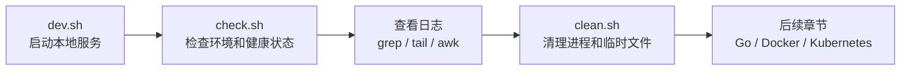
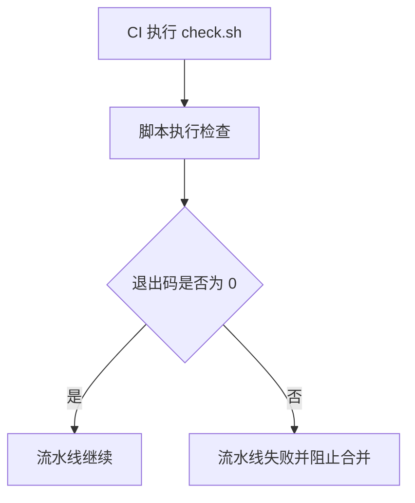

# 第 6 篇：Shell 脚本与自动化基础

前 5 篇已经完成了开发环境、Linux 文件系统、进程服务、网络排障和 Git 团队协作。到这里，`Cloud Native Todo Platform` 已经具备了一个工程项目最基本的运行土壤。

但真实工作中，工程师每天不会手工重复输入一长串命令。启动服务、检查环境、清理临时进程、查看日志、判断健康状态、打包构建、触发部署，这些动作都应该逐步沉淀成脚本。Shell 脚本就是云原生工程中最常见的自动化胶水。

本篇对应 5 个章节主题：

- 6.1 Shell 变量、参数与退出码
- 6.2 条件判断、循环与函数
- 6.3 文件处理、日志处理与管道
- 6.4 编写项目启动和健康检查脚本
- 6.5 Shell 脚本常见安全问题

本篇特色项目是：**为 Todo 平台编写 `dev.sh`、`check.sh`、`clean.sh` 脚本**。

你会在 `cloud-native-todo-platform` 仓库中新增 `scripts/` 目录，用 3 个脚本完成本地开发最小闭环：启动 Todo Demo 服务、检查依赖和健康状态、清理运行中的进程与临时文件。

## 1. 本章学习目标

学完本篇后，你应该能够把重复命令整理成可复用、可检查、可排障的 Shell 脚本。

具体目标如下：

- 能解释 Shell、Bash、脚本文件、解释器之间的关系。
- 能使用变量、环境变量、位置参数和默认值。
- 能理解退出码 `0` 和非 `0` 的含义，并用退出码判断脚本是否成功。
- 能使用 `if`、`case`、`for`、`while` 编写基本控制逻辑。
- 能封装函数，减少重复代码。
- 能使用 `grep`、`awk`、`sed`、`find`、`xargs`、管道处理文件和日志。
- 能理解 `set -euo pipefail` 的作用和使用边界。
- 能编写 `dev.sh` 启动本地服务。
- 能编写 `check.sh` 检查工具、目录、脚本权限和 HTTP 健康状态。
- 能编写 `clean.sh` 清理进程、PID 文件和临时日志。
- 能识别 Shell 脚本中常见安全问题，例如未引用变量、危险 `rm -rf`、`eval`、泄露密钥。

本篇结束时，你至少应该能独立完成以下命令组合：

```bash
chmod +x scripts/*.sh
./scripts/dev.sh
./scripts/check.sh
echo $?
TODO_CLEAN_LOGS=true ./scripts/clean.sh
```

这些能力会在后续 Go 开发、Docker 构建、Kubernetes 部署、CI/CD 流水线和生产排障中反复使用。

## 2. 本章工作场景

Shell 脚本的价值不是“炫技”，而是把可重复流程固化下来，降低人为操作错误。

典型工作场景包括：

- 后端开发每天启动本地 API 服务，不想反复输入 `go run`、端口、日志目录等命令。
- 新同事拉取仓库后，需要一键检查 Go、Git、Docker、kubectl 是否安装。
- 测试同学需要运行健康检查脚本，判断服务是否真的可访问。
- DevOps 需要在 CI 中执行构建、测试、打包、镜像推送和部署脚本。
- SRE 排查线上问题时，用脚本批量收集日志、进程、端口、磁盘和网络信息。
- Kubernetes 运维中，经常用 Shell 包装 `kubectl get`、`kubectl logs`、`kubectl describe`、`helm upgrade` 等命令。
- Operator 开发中，脚本会用于生成代码、运行测试、安装 CRD、部署 Controller。

本篇不把 Shell 当作孤立语法来学，而是围绕 Todo 平台形成一套实际工作流：



## 3. 前置知识

### 必须掌握

学习本篇前，你需要具备以下基础：

- 已经完成第 1 篇环境准备，能使用终端。
- 已经完成 Linux 文件、进程、网络和 Git 基础。
- 已经安装 Git、Go、curl。
- 能进入 `cloud-native-todo-platform` 仓库。
- 知道进程、端口、PID 文件、日志文件的基本含义。

### 建议了解

以下内容不要求非常熟练，但建议有基本概念：

- Go HTTP 服务可以通过 `go run` 启动。
- HTTP 健康检查通常通过 `/healthz` 返回 `200 OK`。
- CI/CD 本质上也是按顺序执行脚本和命令。
- Docker、Kubernetes、Helm 很多自动化操作都会被 Shell 脚本包装。

### 环境差异说明

Shell 脚本在不同系统上差异明显。本篇脚本使用 Bash，不使用 PowerShell。

=== "Linux / WSL2"

    推荐环境。Ubuntu、Debian、Rocky Linux、AlmaLinux、Fedora 等都可以完成本篇实验。

    检查 Bash：

    ```bash
    bash --version
    ```

=== "macOS"

    macOS 可以完成本篇实验，但系统自带 Bash 版本可能较旧。本篇脚本不使用 Bash 4 以上专属语法，因此可以运行。

    检查：

    ```bash
    /bin/bash --version
    ```

=== "Windows"

    推荐使用 WSL2 Ubuntu 完成本篇实验。Git Bash 也可以运行大部分命令，但路径、进程和端口行为可能和 Linux 不完全一致。

    在 PowerShell 中进入 WSL2：

    ```powershell
    wsl
    ```

    然后在 WSL2 中执行本篇 Bash 命令。

## 4. 核心概念

### 4.1 Shell、Bash 与脚本文件

Shell 是用户和操作系统之间的命令解释器。Bash 是 Linux 世界最常见的 Shell 之一。

脚本文件就是把一组命令写到文件里，由解释器按顺序执行。例如：

```bash
#!/usr/bin/env bash
echo "hello shell"
```

第一行叫 shebang，表示用哪个解释器运行脚本：

```bash
#!/usr/bin/env bash
```

推荐使用 `/usr/bin/env bash`，因为它会从 `PATH` 中找到 Bash，跨环境适应性更好。

### 4.2 变量与环境变量

Shell 变量定义时等号两侧不能有空格：

```bash
APP_NAME="todo-platform"
PORT="18080"
echo "$APP_NAME listens on $PORT"
```

读取变量时建议加双引号：

```bash
echo "$APP_NAME"
```

如果变量可能为空，可以使用默认值：

```bash
PORT="${TODO_PORT:-18080}"
```

含义是：如果环境变量 `TODO_PORT` 存在且非空，就使用它；否则使用 `18080`。

运行脚本时传入环境变量：

```bash
TODO_PORT=18081 ./scripts/dev.sh
```

### 4.3 位置参数

位置参数用于接收命令行参数：

| 参数 | 含义 |
|---|---|
| `$0` | 脚本自身名称 |
| `$1` | 第 1 个参数 |
| `$2` | 第 2 个参数 |
| `$#` | 参数个数 |
| `$@` | 所有参数，建议加双引号使用 |

示例：

```bash
#!/usr/bin/env bash
name="${1:-world}"
echo "hello $name"
```

运行：

```bash
bash hello.sh cloud
```

输出：

```text
hello cloud
```

### 4.4 退出码

Shell 中，退出码决定一个命令是否成功。

```bash
true
echo $?

false
echo $?
```

约定：

| 退出码 | 含义 |
|---:|---|
| `0` | 成功 |
| 非 `0` | 失败 |

脚本中主动返回失败：

```bash
exit 1
```

CI/CD 判断脚本是否通过，主要就是看退出码。如果 `check.sh` 返回 `0`，流水线继续；如果返回 `1`，流水线失败。

### 4.5 条件判断

常见判断：

```bash
if [[ -f "go.mod" ]]; then
  echo "go module exists"
else
  echo "go.mod not found"
fi
```

常用文件判断：

| 表达式 | 含义 |
|---|---|
| `-f file` | 普通文件存在 |
| `-d dir` | 目录存在 |
| `-x file` | 文件可执行 |
| `-n "$var"` | 字符串非空 |
| `-z "$var"` | 字符串为空 |

判断命令是否存在：

```bash
if command -v go >/dev/null 2>&1; then
  go version
else
  echo "go not found"
fi
```

### 4.6 循环与函数

循环适合批量处理：

```bash
for cmd in git go curl; do
  if command -v "$cmd" >/dev/null 2>&1; then
    echo "[ok] $cmd"
  else
    echo "[missing] $cmd"
  fi
done
```

函数适合复用逻辑：

```bash
log() {
  printf '[info] %s\n' "$*"
}

die() {
  printf '[error] %s\n' "$*" >&2
  exit 1
}
```

函数本质上是给一组命令命名。`dev.sh`、`check.sh`、`clean.sh` 都会大量使用函数。

### 4.7 文件、日志与管道

管道把前一个命令的输出交给后一个命令：

```bash
cat app.log | grep "ERROR"
```

更常见写法：

```bash
grep "ERROR" app.log
```

常用日志命令：

```bash
tail -n 50 app.log
grep -n "ERROR" app.log
awk '{print $1, $2}' app.log
sed 's/error/ERROR/g' app.log
```

在排障中，脚本经常把 `grep`、`awk`、`sed`、`sort`、`uniq` 组合起来处理日志。

## 5. 原理深入

### 5.1 Shell 脚本如何执行

当你执行：

```bash
./scripts/check.sh
```

系统大致经历：


脚本不是一次性编译成二进制，而是由解释器读取并执行。脚本中的每个外部命令，例如 `go`、`curl`、`grep`，都会再启动对应进程。

### 5.2 为什么要使用 `set -euo pipefail`

很多生产事故来自脚本失败后继续执行。

推荐在 Bash 脚本开头写：

```bash
set -Eeuo pipefail
```

含义：

| 选项 | 作用 |
|---|---|
| `-e` | 命令失败时尽快退出 |
| `-E` | 让 ERR trap 在函数中也生效 |
| `-u` | 使用未定义变量时报错 |
| `-o pipefail` | 管道中任一命令失败，整个管道失败 |

示例：

```bash
set -o pipefail
grep "ERROR" missing.log | wc -l
echo $?
```

如果没有 `pipefail`，`wc -l` 可能成功，导致整个管道看起来成功。生产脚本中这会掩盖真实错误。

`-E` 通常和 `trap ERR` 配合使用，用来在脚本失败时输出更清晰的诊断信息：

```bash
#!/usr/bin/env bash
set -Eeuo pipefail

on_error() {
  local line="$1"
  printf 'script failed at line %s\n' "$line" >&2
}

trap 'on_error "$LINENO"' ERR

prepare() {
  grep "ERROR" missing.log
}

prepare
```

为什么这样做：函数里的命令失败时，`-E` 会让 `ERR` trap 也生效。真实 CI/CD 中，失败日志如果只显示“命令返回 1”，排障成本会很高；加上失败行号和上下文，能更快定位问题。

### 5.3 退出码如何影响 CI/CD

CI/CD 平台不会理解你的中文日志，它主要看命令退出码。



这就是为什么 `check.sh` 必须清晰返回退出码。只打印“失败了”但最后 `exit 0`，对自动化系统来说仍然是成功。

### 5.4 幂等性

幂等性表示同一个脚本执行多次，结果仍然可控。

好的脚本：

```bash
mkdir -p logs
```

重复执行不会失败。

不好的脚本：

```bash
mkdir logs
```

第二次执行可能因为目录已存在而失败。

本篇的 `dev.sh` 会检查服务是否已经运行；`clean.sh` 会检查 PID 是否存在；这些都是幂等性设计。

### 5.5 Shell 脚本与后续课程的关系

后续课程会大量使用脚本：

| 后续阶段 | Shell 脚本用途 |
|---|---|
| Go 开发 | 启动服务、运行测试、生成代码 |
| Docker | 构建镜像、扫描镜像、清理容器 |
| Kubernetes | 部署 YAML、检查 Pod、收集日志 |
| Helm | install、upgrade、rollback |
| CI/CD | 封装流水线步骤 |
| Operator | 安装 CRD、运行 envtest、部署 Controller |

本篇的 3 个脚本是后续自动化能力的第一块积木。

## 6. 手把手实验

本实验会在 `cloud-native-todo-platform` 仓库中创建：

```text
cloud-native-todo-platform/
├── go.mod
├── cmd/
│   └── todo-dev-server/
│       └── main.go
├── scripts/
│   ├── dev.sh
│   ├── check.sh
│   └── clean.sh
└── .todo-platform/
    ├── bin/
    │   └── todo-dev-server
    ├── logs/
    │   └── todo-dev.log
    └── run/
        └── todo-dev.pid
```

其中：

- `go.mod` 是 Go 模块文件；如果仓库里还没有它，`dev.sh` 会为本实验自动生成。
- `cmd/todo-dev-server/main.go` 是脚本自动生成的最小 Go HTTP 服务。
- `scripts/dev.sh` 用于启动本地开发服务。
- `scripts/check.sh` 用于检查依赖、脚本权限和健康状态。
- `scripts/clean.sh` 用于清理开发进程和临时文件。
- `.todo-platform/bin/` 保存本地构建出的二进制文件。
- `.todo-platform/` 是本地运行时目录，不应该提交到 Git。

### 6.1 实验目标

完成后，你应该能够：

- 一条命令启动 Todo Demo 服务。
- 一条命令检查本地开发环境。
- 一条命令清理开发进程和日志。
- 通过退出码判断脚本成功或失败。
- 理解脚本中的变量、函数、条件、循环和安全写法。

### 6.2 实验环境

注意：本实验应该在 `cloud-native-todo-platform` 项目仓库中执行，不是在课程文档仓库中执行。如果你当前目录是 `cloud-native-todo-platform-docs` 或 `docs`，请先切换到真实项目仓库。

检查工具：

```bash
git --version
go version
curl --version
bash --version
```

进入项目仓库：

=== "Linux / macOS / WSL2"

    ```bash
    cd ~/workspace/cloud-native-todo-platform
    ```

=== "Windows PowerShell + WSL2"

    ```powershell
    wsl
    cd ~/workspace/cloud-native-todo-platform
    ```

如果仓库还没有 Git 初始化：

```bash
git init -b main
```

### 6.3 创建脚本目录

```bash
mkdir -p scripts
```

为什么要这样做：项目脚本统一放到 `scripts/`，后续 CI/CD 和文档都可以引用固定路径，避免命令散落在 README、个人笔记或聊天记录里。

### 6.4 热身：编写最小退出码脚本

正式写项目脚本前，先用一个很小的脚本理解参数和退出码。

```bash
cat > scripts/exit-code-demo.sh <<'EOF'
#!/usr/bin/env bash
set -Eeuo pipefail

mode="${1:-ok}"

if [[ "$mode" == "ok" ]]; then
  echo "demo success"
  exit 0
fi

echo "demo failed" >&2
exit 1
EOF

chmod +x scripts/exit-code-demo.sh
```

运行成功场景：

```bash
./scripts/exit-code-demo.sh ok
echo $?
```

预期输出：

```text
demo success
0
```

运行失败场景：

```bash
./scripts/exit-code-demo.sh fail || echo "exit code: $?"
```

预期输出：

```text
demo failed
exit code: 1
```

为什么先做这个热身：后面的 `check.sh` 本质上也是把多个检查项汇总成一个最终退出码，CI/CD 会根据这个退出码决定 PR 能不能继续合并。

### 6.5 编写 `dev.sh`

`dev.sh` 负责生成最小 Go 服务、构建二进制文件并启动它。

```bash
cat > scripts/dev.sh <<'EOF'
#!/usr/bin/env bash
set -Eeuo pipefail

ROOT_DIR="$(cd "$(dirname "${BASH_SOURCE[0]}")/.." && pwd)"
APP_DIR="$ROOT_DIR/cmd/todo-dev-server"
BIN_DIR="$ROOT_DIR/.todo-platform/bin"
RUN_DIR="$ROOT_DIR/.todo-platform/run"
LOG_DIR="$ROOT_DIR/.todo-platform/logs"
BIN_FILE="$BIN_DIR/todo-dev-server"
PID_FILE="$RUN_DIR/todo-dev.pid"
LOG_FILE="$LOG_DIR/todo-dev.log"
HOST="${TODO_HOST:-127.0.0.1}"
PORT="${TODO_PORT:-18080}"
ADDR="$HOST:$PORT"

log() {
  printf '[dev] %s\n' "$*"
}

die() {
  printf '[dev][error] %s\n' "$*" >&2
  exit 1
}

on_error() {
  local line="$1"
  printf '[dev][error] failed at line %s\n' "$line" >&2
}

trap 'on_error "$LINENO"' ERR

need_cmd() {
  command -v "$1" >/dev/null 2>&1 || die "missing command: $1"
}

read_pid() {
  if [[ -f "$PID_FILE" ]]; then
    cat "$PID_FILE"
  fi
}

is_running() {
  local pid
  pid="$(read_pid || true)"
  [[ "$pid" =~ ^[0-9]+$ ]] && kill -0 "$pid" 2>/dev/null
}

write_demo_app() {
  mkdir -p "$APP_DIR"

  if [[ -f "$APP_DIR/main.go" ]]; then
    return
  fi

  cat > "$APP_DIR/main.go" <<'GOEOF'
package main

import (
	"encoding/json"
	"log"
	"net/http"
	"os"
	"time"
)

type Todo struct {
	ID        int       `json:"id"`
	Title     string    `json:"title"`
	Completed bool      `json:"completed"`
	CreatedAt time.Time `json:"created_at"`
}

func main() {
	addr := getenv("TODO_ADDR", "127.0.0.1:18080")

	mux := http.NewServeMux()
	mux.HandleFunc("/healthz", func(w http.ResponseWriter, r *http.Request) {
		w.Header().Set("Content-Type", "application/json")
		_ = json.NewEncoder(w).Encode(map[string]string{
			"status": "ok",
			"service": "todo-dev-server",
		})
	})
	mux.HandleFunc("/todos", func(w http.ResponseWriter, r *http.Request) {
		w.Header().Set("Content-Type", "application/json")
		todos := []Todo{
			{ID: 1, Title: "learn shell scripting", Completed: false, CreatedAt: time.Now()},
			{ID: 2, Title: "prepare go api chapter", Completed: false, CreatedAt: time.Now()},
		}
		_ = json.NewEncoder(w).Encode(todos)
	})

	log.Printf("todo dev server listening on %s", addr)
	if err := http.ListenAndServe(addr, mux); err != nil {
		log.Fatal(err)
	}
}

func getenv(key, fallback string) string {
	value := os.Getenv(key)
	if value == "" {
		return fallback
	}
	return value
}
GOEOF
}

ensure_go_module() {
  if [[ -f "$ROOT_DIR/go.mod" ]]; then
    return
  fi

  log "go.mod not found; creating a temporary module for this lab"
  (
    cd "$ROOT_DIR"
    go mod init cloud-native-todo-platform >/dev/null
  )
}

build_app() {
  ensure_go_module
  mkdir -p "$BIN_DIR"

  log "building todo dev server"
  (
    cd "$ROOT_DIR"
    go build -o "$BIN_FILE" ./cmd/todo-dev-server
  )
}

main() {
  need_cmd go

  mkdir -p "$BIN_DIR" "$RUN_DIR" "$LOG_DIR"

  if is_running; then
    log "todo dev server already running: pid=$(read_pid), url=http://$ADDR"
    exit 0
  fi

  write_demo_app
  build_app

  log "starting todo dev server on http://$ADDR"
  (
    cd "$ROOT_DIR"
    TODO_ADDR="$ADDR" nohup "$BIN_FILE" >"$LOG_FILE" 2>&1 &
    echo "$!" >"$PID_FILE"
  )

  sleep 2

  if ! is_running; then
    tail -n 40 "$LOG_FILE" >&2 || true
    die "todo dev server failed to start"
  fi

  if command -v curl >/dev/null 2>&1; then
    curl -fsS "http://$ADDR/healthz" >/dev/null || die "health check failed"
  fi

  log "started: pid=$(read_pid)"
  log "health: http://$ADDR/healthz"
  log "todos:  http://$ADDR/todos"
  log "log:    $LOG_FILE"
}

main "$@"
EOF
```

关键点解释：

- `set -Eeuo pipefail` 让脚本尽早暴露错误。
- `ROOT_DIR` 通过脚本路径计算项目根目录，避免依赖当前终端所在目录。
- `TODO_HOST` 和 `TODO_PORT` 可以通过环境变量覆盖默认监听地址。
- `PID_FILE` 用于记录服务进程，方便后续清理。
- `LOG_FILE` 保存服务日志，方便排障。
- `write_demo_app` 只有在 Go 文件不存在时才生成，避免覆盖学习者后续代码。
- `trap 'on_error "$LINENO"' ERR` 在脚本失败时输出失败行号，便于定位问题。
- `go build -o "$BIN_FILE"` 先生成二进制文件，再启动二进制文件。这样 `PID_FILE` 记录的是实际服务进程，而不是 `go run` 的包装进程。
- 如果项目还没有 `go.mod`，脚本会生成一个最小模块文件，保证本篇实验可以独立运行。后续第 7 篇会正式整理 Go 模块和业务代码。

### 6.6 编写 `check.sh`

`check.sh` 负责检查开发环境、项目结构和服务健康状态。

```bash
cat > scripts/check.sh <<'EOF'
#!/usr/bin/env bash
set -Eeuo pipefail

ROOT_DIR="$(cd "$(dirname "${BASH_SOURCE[0]}")/.." && pwd)"
HOST="${TODO_HOST:-127.0.0.1}"
PORT="${TODO_PORT:-18080}"
ADDR="$HOST:$PORT"
STATUS=0

info() {
  printf '[check] %s\n' "$*"
}

ok() {
  printf '[check][ok] %s\n' "$*"
}

warn() {
  printf '[check][warn] %s\n' "$*" >&2
}

fail() {
  printf '[check][fail] %s\n' "$*" >&2
  STATUS=1
}

check_cmd() {
  local cmd="$1"
  if command -v "$cmd" >/dev/null 2>&1; then
    ok "$cmd found: $(command -v "$cmd")"
  else
    fail "$cmd not found"
  fi
}

check_file() {
  local file="$1"
  if [[ -f "$ROOT_DIR/$file" ]]; then
    ok "$file exists"
  else
    fail "$file missing"
  fi
}

check_executable() {
  local file="$1"
  if [[ -x "$ROOT_DIR/$file" ]]; then
    ok "$file is executable"
  else
    fail "$file is not executable"
  fi
}

check_git_repo() {
  if git -C "$ROOT_DIR" rev-parse --is-inside-work-tree >/dev/null 2>&1; then
    ok "git repository detected"
  else
    warn "not a git repository yet"
  fi
}

check_health() {
  local url="http://$ADDR/healthz"
  info "checking $url"

  if curl -fsS "$url" >/dev/null; then
    ok "health check passed"
  else
    fail "health check failed; run ./scripts/dev.sh first"
  fi
}

main() {
  info "root: $ROOT_DIR"

  for cmd in bash git go curl; do
    check_cmd "$cmd"
  done

  check_git_repo

  check_file "scripts/dev.sh"
  check_file "scripts/check.sh"
  check_file "scripts/clean.sh"

  check_executable "scripts/dev.sh"
  check_executable "scripts/check.sh"
  check_executable "scripts/clean.sh"

  check_health

  if [[ "$STATUS" -ne 0 ]]; then
    fail "one or more checks failed"
    exit "$STATUS"
  fi

  ok "all checks passed"
}

main "$@"
EOF
```

关键点解释：

- `STATUS=0` 表示当前检查结果成功。
- 每个失败项调用 `fail`，把 `STATUS` 改为 `1`。
- 脚本最后统一 `exit "$STATUS"`，这样 CI/CD 可以根据退出码判断结果。
- `git -C "$ROOT_DIR"` 表示在项目根目录执行 Git 命令，不依赖当前目录。

### 6.7 编写 `clean.sh`

`clean.sh` 负责清理开发服务进程和运行时文件。

```bash
cat > scripts/clean.sh <<'EOF'
#!/usr/bin/env bash
set -Eeuo pipefail

ROOT_DIR="$(cd "$(dirname "${BASH_SOURCE[0]}")/.." && pwd)"
RUNTIME_DIR="$ROOT_DIR/.todo-platform"
RUN_DIR="$RUNTIME_DIR/run"
LOG_DIR="$RUNTIME_DIR/logs"
PID_FILE="$RUN_DIR/todo-dev.pid"

log() {
  printf '[clean] %s\n' "$*"
}

warn() {
  printf '[clean][warn] %s\n' "$*" >&2
}

die() {
  printf '[clean][error] %s\n' "$*" >&2
  exit 1
}

on_error() {
  local line="$1"
  printf '[clean][error] failed at line %s\n' "$line" >&2
}

trap 'on_error "$LINENO"' ERR

read_pid() {
  if [[ -f "$PID_FILE" ]]; then
    cat "$PID_FILE"
  fi
}

safe_rm_dir() {
  local target="$1"

  [[ -n "$target" ]] || die "empty path is not allowed"

  case "$target" in
    "$RUNTIME_DIR"|"$RUNTIME_DIR"/*) ;;
    *) die "refuse to remove path outside runtime directory: $target" ;;
  esac

  rm -rf "$target"
}

stop_process() {
  local pid
  pid="$(read_pid || true)"

  if [[ ! "$pid" =~ ^[0-9]+$ ]]; then
    log "no valid pid file found"
    rm -f "$PID_FILE"
    return
  fi

  if ! kill -0 "$pid" 2>/dev/null; then
    log "process $pid is not running"
    rm -f "$PID_FILE"
    return
  fi

  log "stopping process $pid"
  kill "$pid"

  for _ in 1 2 3 4 5; do
    if ! kill -0 "$pid" 2>/dev/null; then
      log "process $pid stopped"
      rm -f "$PID_FILE"
      return
    fi
    sleep 1
  done

  warn "process $pid did not stop gracefully; sending SIGKILL"
  kill -9 "$pid" 2>/dev/null || true
  rm -f "$PID_FILE"
}

main() {
  stop_process

  if [[ "${TODO_CLEAN_LOGS:-false}" == "true" ]]; then
    log "removing logs: $LOG_DIR"
    safe_rm_dir "$LOG_DIR"
  else
    log "keep logs: $LOG_DIR"
  fi

  if [[ "${TODO_CLEAN_ALL:-false}" == "true" ]]; then
    log "removing runtime directory: $RUNTIME_DIR"
    safe_rm_dir "$RUNTIME_DIR"
  fi

  log "clean completed"
}

main "$@"
EOF
```

关键点解释：

- 先尝试普通 `kill`，给进程优雅退出机会。
- 多次检查进程是否还存在。
- 最后才使用 `kill -9`。
- 默认不删除日志，只有设置 `TODO_CLEAN_LOGS=true` 才清理日志。
- `safe_rm_dir` 会拒绝删除 `.todo-platform` 之外的路径，避免变量错误导致误删。

### 6.8 授予执行权限

```bash
chmod +x scripts/dev.sh scripts/check.sh scripts/clean.sh
```

验证：

```bash
ls -l scripts
```

预期能看到类似：

```text
-rwxr-xr-x  dev.sh
-rwxr-xr-x  check.sh
-rwxr-xr-x  clean.sh
```

### 6.9 运行脚本

启动服务：

```bash
./scripts/dev.sh
```

预期输出：

```text
[dev] starting todo dev server on http://127.0.0.1:18080
[dev] started: pid=<PID>
[dev] health: http://127.0.0.1:18080/healthz
[dev] todos:  http://127.0.0.1:18080/todos
```

检查环境和服务：

```bash
./scripts/check.sh
echo $?
```

预期输出包含：

```text
[check][ok] all checks passed
0
```

访问接口：

```bash
curl -i http://127.0.0.1:18080/healthz
curl -i http://127.0.0.1:18080/todos
```

清理服务：

```bash
./scripts/clean.sh
```

带日志清理：

```bash
TODO_CLEAN_LOGS=true ./scripts/clean.sh
```

### 6.10 修改端口运行

如果 `18080` 被占用：

```bash
TODO_PORT=18081 ./scripts/dev.sh
TODO_PORT=18081 ./scripts/check.sh
./scripts/clean.sh
```

为什么 `dev.sh` 和 `check.sh` 都要带同一个端口：启动服务时监听 `18081`，健康检查也必须访问 `18081`。`clean.sh` 按 PID 文件清理服务进程，不依赖端口，所以不需要 `TODO_PORT`。

### 6.11 查看日志

查看最近日志：

```bash
tail -n 50 .todo-platform/logs/todo-dev.log
```

搜索错误：

```bash
grep -n "error\\|failed\\|panic" .todo-platform/logs/todo-dev.log || true
```

统计日志行数：

```bash
wc -l .todo-platform/logs/todo-dev.log
```

### 6.12 提交脚本

运行检查：

```bash
./scripts/dev.sh
./scripts/check.sh
./scripts/clean.sh
```

查看 Git 状态：

```bash
git status --short
```

建议提交：

```bash
git add scripts/dev.sh scripts/check.sh scripts/clean.sh
git commit -m "chore: add local development scripts" -m "Refs #4"
```

如果你决定把 `cmd/todo-dev-server/main.go` 也作为正式示例提交：

```bash
git add cmd/todo-dev-server/main.go
git commit -m "chore: add todo dev server demo" -m "Refs #4"
```

本课程建议先把脚本作为本篇产出；后续第 7 篇会正式进入 Go 业务代码。

### 6.13 清理步骤

停止服务并删除日志：

```bash
TODO_CLEAN_LOGS=true ./scripts/clean.sh
```

删除全部本地运行时目录：

```bash
TODO_CLEAN_ALL=true ./scripts/clean.sh
```

如果只是在实验，不想保留脚本，建议分步删除并先查看状态：

```bash
pwd
git status --short
rm -rf .todo-platform
rm -rf cmd/todo-dev-server
rm -f scripts/dev.sh scripts/check.sh scripts/clean.sh scripts/exit-code-demo.sh
```

不要在不确定目录时执行删除命令。真实项目中更推荐用 Git 丢弃未提交的实验文件，但这属于 Git 章节内容，本篇只强调安全删除意识。

## 7. 真实工作案例

假设 Todo 平台团队进入 Go API 开发阶段，团队需要一个统一的本地开发入口。

真实流程可能是：

1. 后端开发执行 `./scripts/dev.sh` 启动本地 API。
2. 测试同学执行 `./scripts/check.sh` 确认环境、脚本权限和健康检查。
3. 如果服务异常，开发查看 `.todo-platform/logs/todo-dev.log`。
4. 切换分支或重启服务前，执行 `./scripts/clean.sh` 清理旧进程。
5. CI/CD 中复用 `check.sh` 的部分检查逻辑，确保脚本本身可执行。
6. 后续 Docker 章节把 `dev.sh` 替换为 `docker compose up`。
7. Kubernetes 章节把健康检查逻辑升级为 `kubectl rollout status` 和 `kubectl get pods`。

职责边界如下：

| 角色 | 关注点 |
|---|---|
| 后端开发 | 本地启动、日志、健康检查、脚本可维护性 |
| 测试 | 环境一致性、检查项是否可重复执行 |
| DevOps | 脚本是否可放入 CI/CD，退出码是否正确 |
| SRE | 故障时能否快速定位进程、端口和日志 |
| 安全同学 | 脚本是否泄露密钥，是否存在危险删除和命令注入 |

这就是 Shell 脚本的真实价值：把团队共识固化为可以执行、可以失败、可以排查的自动化入口。

## 8. 常见错误

| 错误 | 现象 | 原因 |
|---|---|---|
| 变量两侧加空格 | `command not found` | Shell 把变量名当命令 |
| 未引用变量 | 文件名有空格时脚本异常 | 没使用 `"$var"` |
| 忘记 `chmod +x` | `Permission denied` | 脚本没有执行权限 |
| 没有 shebang | 不同 Shell 执行结果不同 | 未指定解释器 |
| 忽略退出码 | CI 显示成功但实际失败 | 脚本最后返回了 `0` |
| 管道隐藏失败 | 前面的命令失败但整体成功 | 没有 `set -o pipefail` |
| 使用危险 `rm -rf "$dir"` | 变量为空时误删 | 未校验路径 |
| 滥用 `eval` | 命令注入风险 | 把字符串当命令执行 |
| 在脚本中打印密钥 | CI 日志泄露 Token | 使用 `set -x` 或 echo 敏感变量 |
| 脚本依赖当前目录 | 换目录执行就失败 | 没有计算项目根目录 |

新手最容易忽略的是退出码。脚本打印“检查失败”但最后没有 `exit 1`，对自动化系统来说仍然是成功。

## 9. 排障方法

### 9.1 脚本没有执行权限

现象：

```text
Permission denied
```

排查：

```bash
ls -l scripts/dev.sh
```

如果没有 `x` 权限：

```bash
chmod +x scripts/dev.sh
```

### 9.2 找不到命令

现象：

```text
go: command not found
```

排查：

```bash
command -v go
echo "$PATH"
```

修复方向：

- 安装缺失工具。
- 确认终端加载了正确的环境变量。
- 在 CI 中显式安装工具版本。

### 9.3 端口被占用

现象：

```text
bind: address already in use
```

排查：

```bash
ss -lntp | grep 18080 || true
lsof -iTCP:18080 -sTCP:LISTEN || true
```

修复方向：

```bash
./scripts/clean.sh
```

或换端口：

```bash
TODO_PORT=18081 ./scripts/dev.sh
```

### 9.4 健康检查失败

排查：

```bash
./scripts/check.sh
echo $?
tail -n 80 .todo-platform/logs/todo-dev.log
curl -v http://127.0.0.1:18080/healthz
```

判断依据：

- `echo $?` 是 `0` 表示脚本成功。
- `curl -v` 可以看到连接是否成功、HTTP 状态码是什么。
- 日志中如果有 `address already in use`，说明端口冲突。

### 9.5 脚本在 macOS 和 Linux 表现不同

常见原因：

- `sed -i` 在 macOS 和 Linux 参数不同。
- macOS 自带 Bash 版本较旧。
- 某些 GNU 工具在 macOS 上不存在。

排查：

```bash
bash --version
uname -a
sed --version 2>/dev/null || true
```

修复方向：

- 尽量使用跨平台写法。
- 复杂文本处理交给 Go、Python 或专门工具。
- 在 README 中声明脚本支持的系统。

### 9.6 调试脚本

临时开启调试：

```bash
bash -x scripts/check.sh
```

脚本内部局部调试：

```bash
set -x
# commands
set +x
```

注意：不要在处理密码、Token、Kubeconfig 时开启 `set -x`，否则敏感信息可能进入日志。

## 10. 生产环境注意事项

Shell 脚本进入生产环境后，风险会明显放大。

必须注意：

- 脚本开头使用 `set -Eeuo pipefail`，但要理解它的边界。
- 所有变量引用尽量使用双引号，例如 `"$ROOT_DIR"`。
- 删除文件前必须校验路径，避免空变量导致误删。
- 不要使用 `eval` 执行用户输入。
- 不要在日志中打印密码、Token、Secret、Kubeconfig。
- CI 中不要用 `set -x` 包裹敏感命令。
- 生产脚本要有清晰日志和退出码。
- 关键脚本要经过代码审查和 ShellCheck 检查。
- 脚本应该幂等，重复执行不能造成不可控结果。
- 部署脚本必须有回滚方案。
- 跨平台脚本要明确支持范围，不要假设 macOS、Linux、BusyBox 工具行为完全一致。
- 对 Kubernetes 生产操作，脚本必须显式指定 kube-context、namespace 和目标资源，避免误操作集群。

推荐在 CI 中增加：

```bash
shellcheck scripts/*.sh
```

如果暂时没有安装 ShellCheck，也至少执行：

```bash
bash -n scripts/dev.sh
bash -n scripts/check.sh
bash -n scripts/clean.sh
```

`bash -n` 只检查语法，不执行脚本。

如果团队使用 GitHub Actions，可以新增 `.github/workflows/scripts-check.yml`：

```yaml
name: scripts-check

on:
  pull_request:
  push:
    branches:
      - main

jobs:
  scripts:
    runs-on: ubuntu-latest
    steps:
      - name: Checkout repository
        uses: actions/checkout@v4

      - name: Check Bash syntax
        run: |
          bash -n scripts/dev.sh
          bash -n scripts/check.sh
          bash -n scripts/clean.sh

      - name: Install ShellCheck
        run: |
          sudo apt-get update
          sudo apt-get install -y shellcheck

      - name: Run ShellCheck
        run: |
          shellcheck scripts/*.sh
```

关键字段说明：

| 字段 | 作用 |
|---|---|
| `pull_request` | PR 创建或更新时执行检查 |
| `push.branches` | 推送到 `main` 时执行检查 |
| `runs-on` | 指定运行环境，这里使用 Ubuntu |
| `actions/checkout@v4` | 拉取仓库代码 |
| `bash -n` | 检查脚本语法，不执行脚本 |
| `shellcheck scripts/*.sh` | 使用 ShellCheck 发现常见脚本问题 |

为什么要把脚本检查放进 CI：本地能运行不代表团队所有人都能运行。把语法检查和 ShellCheck 固化到 PR 流程后，脚本质量会变成可持续维护的团队约束。

## 11. 本章小项目

本篇小项目：**为 Todo 平台编写 `dev.sh`、`check.sh`、`clean.sh` 脚本**。

### 项目目标

你需要完成：

- 新增 `scripts/dev.sh`。
- 新增 `scripts/check.sh`。
- 新增 `scripts/clean.sh`。
- 可选新增 `.github/workflows/scripts-check.yml`。
- 能启动本地 Todo Demo 服务。
- 能通过 `/healthz` 健康检查。
- 能清理服务进程和运行时目录。
- 能通过退出码判断脚本执行结果。

### 验收清单

| 验收项 | 命令 | 通过标准 |
|---|---|---|
| 脚本存在 | `ls scripts/*.sh` | 3 个脚本都存在 |
| 脚本可执行 | `ls -l scripts/*.sh` | 文件权限包含 `x` |
| Bash 语法正确 | `bash -n scripts/dev.sh scripts/check.sh scripts/clean.sh` | 返回 `0` |
| 二进制可构建 | `./scripts/dev.sh` | `.todo-platform/bin/todo-dev-server` 存在 |
| 服务可启动 | `./scripts/dev.sh` | 输出健康检查地址 |
| 健康检查通过 | `./scripts/check.sh` | 返回 `0` |
| 接口可访问 | `curl -fsS http://127.0.0.1:18080/healthz` | 返回成功 |
| 服务可清理 | `./scripts/clean.sh` | PID 文件被删除或进程停止 |
| 日志可清理 | `TODO_CLEAN_LOGS=true ./scripts/clean.sh` | 日志目录被删除或为空 |
| CI 可接入 | `bash -n scripts/*.sh` 或 GitHub Actions | PR 能执行脚本检查 |

### 本篇能力验收标准

你完成本篇后，应该能独立通过以下验收：

- 能写出带 shebang 的 Bash 脚本。
- 能正确使用变量、参数、条件、循环和函数。
- 能通过 `exit 0` / `exit 1` 表达成功或失败。
- 能用 `echo $?` 判断脚本执行结果。
- 能编写可重复执行的启动、检查、清理脚本。
- 能用 `go build` 构建本地二进制，并用 PID 文件管理真实服务进程。
- 能处理常见错误，例如命令缺失、权限不足、端口占用、健康检查失败。
- 能说明 Shell 脚本中未引用变量、危险删除、命令注入和密钥泄露的风险。

## 12. 本章练习题

### 基础题

1. Shell 和 Bash 有什么区别？
2. `"$var"` 和 `$var` 有什么区别？
3. `$?` 表示什么？
4. `set -euo pipefail` 分别解决什么问题？
5. 为什么脚本中要使用函数？

### 实操题

1. 给 `dev.sh` 增加 `TODO_HOST` 支持，并验证监听地址变化。
2. 给 `check.sh` 增加 `shellcheck` 可选检查，如果没有安装只输出 warning。
3. 给 `clean.sh` 增加 `--all` 参数，用参数控制是否删除 `.todo-platform`。
4. 编写一个 `scripts/logs.sh`，支持查看最近 50 行日志和搜索错误关键字。
5. 故意占用 `18080` 端口，观察 `dev.sh` 如何失败，并记录排障过程。

### 思考题

1. 为什么 CI/CD 更依赖退出码而不是日志文本？
2. 什么样的脚本才算幂等？
3. 为什么生产脚本中不建议使用 `eval`？
4. Shell 脚本和 Go/Python 程序分别适合解决什么问题？
5. 如果一个脚本要操作 Kubernetes 生产集群，你会增加哪些安全保护？

## 13. 本章面试题

### 13.1 Shell 脚本中的退出码有什么作用？

参考答案：

退出码用于表示命令或脚本是否成功。约定 `0` 表示成功，非 `0` 表示失败。CI/CD、Makefile、Kubernetes hook、部署脚本都会根据退出码决定是否继续执行。一个脚本如果检查失败却返回 `0`，自动化系统会误判为成功。

### 13.2 为什么 Shell 变量建议加双引号？

参考答案：

双引号可以避免空格、换行和通配符导致参数被拆分或展开。例如文件名中有空格时，`rm $file` 可能被拆成多个参数，而 `rm "$file"` 会把它作为一个整体。生产脚本中不引用变量是常见风险。

### 13.3 `set -euo pipefail` 有什么作用？

参考答案：

`set -e` 让命令失败时脚本尽快退出，`set -u` 使用未定义变量时报错，`pipefail` 让管道中任一命令失败都会导致整个管道失败。它能减少错误被吞掉的概率，但不是万能的，复杂条件、允许失败的命令仍需要显式处理。

### 13.4 如何设计一个健康检查脚本？

参考答案：

健康检查脚本应该先检查依赖命令是否存在，再检查服务进程或端口，最后发起真实请求，例如 `curl -fsS /healthz`。脚本需要打印清晰日志，并在失败时返回非 `0`。如果用于 CI/CD，还要避免依赖开发者本机状态。

### 13.5 Shell 脚本中有哪些常见安全问题？

参考答案：

常见问题包括未引用变量、危险 `rm -rf`、使用 `eval`、把用户输入拼接成命令、日志打印密钥、`set -x` 泄露敏感信息、未校验 kube-context 就操作生产集群。解决方式包括变量加引号、校验路径、避免 eval、最小权限、隐藏敏感输出和代码审查。

### 13.6 如何排查脚本在 CI 中失败但本地成功？

参考答案：

先比较环境差异，包括 Shell 版本、PATH、工作目录、文件权限、操作系统和工具版本。然后在 CI 中打印必要的非敏感诊断信息，例如 `pwd`、`ls -l`、`bash --version`、`command -v go`。不要打印密钥。最后确认脚本是否依赖本地缓存、交互输入或未提交文件。

### 13.7 Shell 脚本什么时候不适合继续扩展？

参考答案：

当脚本开始包含复杂数据结构、复杂错误处理、大量字符串解析、并发逻辑或跨平台兼容要求时，应考虑使用 Go、Python 等语言。Shell 适合编排命令和轻量自动化，不适合承载复杂业务逻辑。

### 13.8 为什么部署脚本必须可回滚？

参考答案：

生产部署可能失败，失败后需要快速恢复到上一个稳定版本。脚本如果只支持向前部署，不记录版本、不检查结果、不提供回滚路径，会增加故障恢复时间。后续 Helm、Kubernetes 和 GitOps 章节会继续扩展回滚能力。

## 14. 本章总结

本篇完成了阶段一最后一块基础能力：Shell 自动化。

你学习了：

- Shell、Bash、变量、参数和退出码。
- 条件判断、循环、函数和管道。
- 文件处理、日志处理和健康检查。
- `set -Eeuo pipefail` 的作用。
- 如何编写 `dev.sh`、`check.sh`、`clean.sh`。
- Shell 脚本中的常见安全风险和生产注意事项。

本篇项目成果是 Todo 平台的本地自动化脚本。后续每一阶段都可以在此基础上继续扩展：Go 阶段增加测试脚本，Docker 阶段增加镜像构建脚本，Kubernetes 阶段增加部署和排障脚本。

## 15. 下一章衔接

下一篇将进入 **Go 语言基础**。

阶段一到这里已经完成：环境、Linux 文件、进程服务、网络排障、Git 协作和 Shell 自动化。接下来课程会开始编写真正的 Todo 业务能力。

第 7 篇会从 Go 基础语法开始，逐步实现命令行版 Todo 管理器。你在本篇编写的脚本会继续发挥作用：

- 用 `check.sh` 检查 Go 是否安装。
- 用 `dev.sh` 逐步启动 Go 程序。
- 用 `clean.sh` 清理本地实验产物。

从下一篇开始，课程主线会从“工具链准备”进入“业务代码实现”。
