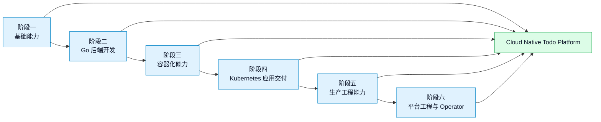

# 第 1 篇：课程导学、YAML 与开发环境准备

本篇是整套课程的入口，属于 **A 类：工具/环境章**。

本篇不急着写业务功能，而是先完成三件事：看清完整学习路线，理解 `Cloud Native Todo Platform` 项目会如何逐步演进，准备后续 Go、Docker、Kubernetes、Helm、CI/CD、Operator 开发都要依赖的统一实验环境。

本篇对应 6 个章节主题：

- 1.1 课程目标、岗位路线与综合项目介绍
- 1.2 YAML 语法基础：缩进、多文档、锚点与别名
- 1.3 Windows / macOS / Linux 学习环境选择
- 1.4 WSL2、Ubuntu、终端与 VS Code 配置
- 1.5 安装 Go、Git、Docker、kubectl、kind、Helm
- 1.6 版本环境锁定与 `check-env.sh` 检查脚本

## 1. 本章学习目标

学完本篇后，你应该能够建立一套可复现的云原生学习工作台，并能说明每个工具为什么会出现在后续课程中。

具体目标如下：

- 能说清本课程 6 个阶段、42 篇内容与 `Cloud Native Todo Platform` 项目主线的关系。
- 能阅读和编写基础 YAML，理解缩进、列表、字典、多文档、锚点和别名。
- 能根据自己的电脑选择 Windows + WSL2、macOS 或 Linux 学习环境。
- 能配置终端、Ubuntu、VS Code Remote WSL 或等价远程开发方式。
- 能安装并验证 `go`、`git`、`docker`、`kubectl`、`kind`、`helm`。
- 能初始化 `cloud-native-todo-platform` 仓库，并编写 `scripts/check-env.sh` 检查工具链版本。

本篇结束时，你至少应该能在自己的主力学习终端中成功执行：

```bash
$ go version
$ git --version
$ docker --version
$ kubectl version --client
$ kind version
$ helm version
```

预期结果不是每个人输出完全相同，而是这些命令都能返回版本信息，且版本符合团队或课程约定。

## 2. 本章工作场景与真实案例

真实团队很少从“直接写业务代码”开始。一个新项目启动时，往往先要解决环境、工具链和仓库结构问题。

典型场景包括：

- 新人加入 Go 后端团队，需要按团队文档安装 Go、Docker、kubectl、Helm，并跑通环境检查脚本。
- DevOps 团队要统一开发机工具版本，避免有人用旧版 `kubectl` 或旧版 Helm 生成不兼容配置。
- 平台团队准备做 Kubernetes Operator，需要先把 Go、Docker、kind、本地集群和仓库目录标准化。
- 代码仓库第一次初始化时，需要提前规划 `api/`、`cli/`、`deployments/`、`scripts/`、`operator/` 等目录边界。
- 面试中被问到“你如何从零搭建一个云原生 Go 项目的开发环境”，需要能讲清系统选择、工具安装、版本锁定和验证方式。

本篇的真实案例是：

> 你加入一个云原生平台团队，团队准备从零建设 `Cloud Native Todo Platform`。你需要在本机完成开发环境准备，初始化项目仓库，写出一个环境检查脚本，让后续同学可以用同样方式验证自己的环境。

如果这一步做得扎实，后面学习 Go、Docker、Kubernetes、Helm 和 Operator 时，问题会少很多。反过来，如果第一天环境混乱，后面经常会出现“教程没错，但我机器跑不起来”的挫败感。

## 3. 核心概念

### 3.1 课程总路线

图 1-1 展示了本课程的主线。



这不是一套“学一个工具换一个工具”的课程，而是一个项目逐步生产化的过程。

项目会这样演进：

| 阶段 | 项目形态 |
|---|---|
| 阶段一 | 初始化仓库、脚本、目录、基础环境 |
| 阶段二 | 从 Todo CLI 演进到生产风格 Go Todo API |
| 阶段三 | 为 Todo API 构建镜像，使用 Compose 编排本地环境 |
| 阶段四 | 把 Todo Platform 部署到 Kubernetes |
| 阶段五 | 接入 CI/CD、GitOps、监控、日志和链路追踪 |
| 阶段六 | 开发 Todo Operator 自动管理整套平台生命周期 |

### 3.2 YAML 是什么

YAML 是一种常见的配置文件格式。Kubernetes YAML、Helm values、GitHub Actions workflow、Argo CD Application 都会大量使用 YAML。

YAML 的核心规则是：**用缩进表达层级，用 `-` 表示列表，用 `key: value` 表示键值对**。

一个最小示例：

```yaml title="docs/examples/basic.yaml"
project:
  name: cloud-native-todo-platform  # ← key-value，项目名称
  stage: foundation                 # ← key-value，当前阶段
tools:
  - go                              # ← 列表项
  - docker
  - kubectl
```

YAML 最容易出错的是缩进。不要混用 Tab 和空格，课程中统一使用 2 个空格缩进。

### 3.3 多文档、锚点与别名

一个 YAML 文件可以用 `---` 分隔多个文档。Kubernetes 中常把多个资源写在同一个文件里。

```yaml title="docs/examples/multi-doc.yaml"
apiVersion: v1
kind: Namespace
metadata:
  name: todo-dev                   # ← 第一个资源：Namespace
---
apiVersion: v1
kind: ConfigMap
metadata:
  name: todo-env
  namespace: todo-dev              # ← 第二个资源：ConfigMap，放入 todo-dev
data:
  TODO_ENV: dev
```

锚点和别名可以复用同一个值或结构。注意：YAML 锚点只在同一个文档内生效，不能跨 `---` 复用。

```yaml title="docs/examples/anchors.yaml"
versions:
  go: &go_version "1.26.x"          # ← 定义锚点
  docker: "29.x"
tools:
  api:
    go: *go_version                 # ← 使用别名
  cli:
    go: *go_version
```

本篇先掌握这些基础即可。后续 Kubernetes、Helm、GitHub Actions、Argo CD 都会继续使用 YAML。

### 3.4 为什么推荐 Linux 用户态环境

云原生技术大量运行在 Linux 之上。即使你使用 Windows 或 macOS，Docker 容器、Kubernetes 节点、CI runner 和生产服务器最终也大多是 Linux。

因此推荐环境如下：

| 本机系统 | 推荐学习环境 | 原因 |
|---|---|---|
| Windows | Windows 11 + WSL2 Ubuntu + Docker Desktop | 最接近 Linux 开发体验，同时保留 Windows 桌面工具 |
| macOS | macOS + Homebrew + Docker Desktop | 命令行友好，但容器实际运行在 Linux 虚拟机中 |
| Linux | Ubuntu 24.04 LTS 或同类发行版 | 最接近服务器和容器运行环境 |

这不是说 Windows 或 macOS 不能学，而是要清楚：后续涉及 Shell、文件权限、Docker、Kubernetes 的内容时，Linux 用户态能减少很多额外差异。

### 3.5 版本环境锁定

版本环境锁定的目的不是追求“永远最新”，而是让团队成员有共同基线。

本课程新版设计采用以下基线：

| 工具 | 课程基线 | 用途 |
|---|---|---|
| Go | 1.26.x | 编写 CLI、API、Controller、Operator |
| Docker | 29.x | 构建镜像、运行容器、本地开发 |
| containerd | 2.3.x LTS | 理解 Kubernetes 节点运行时 |
| Kubernetes / kubectl | 1.36.x | 学习 K8s API、工作负载、网络、安全 |
| kind | 0.31+ | 本地 Kubernetes 集群 |
| Helm | 4.2.x | Kubernetes 应用打包发布 |
| PostgreSQL | 18.x | 后续 Todo API 持久化 |
| Redis | 8.2.x | 后续缓存、限流和异步任务 |

工具版本会随时间变化。真实团队应该在 README、CI、构建镜像、安装脚本里写清版本范围，并定期审查。

## 4. 原理深入

### 4.1 PATH 与命令查找

当你执行 `go version` 时，Shell 会在 `PATH` 环境变量列出的目录中查找名为 `go` 的可执行文件。

检查命令位置：

```bash
$ command -v go
$ command -v docker
$ echo "$PATH"
```

预期输出类似：

```text
/usr/local/go/bin/go
/usr/bin/docker
/usr/local/go/bin:/usr/local/bin:/usr/bin:...
```

如果工具已经安装但命令找不到，通常不是工具坏了，而是没有加入 `PATH`，或者当前终端没有重新加载环境变量。

### 4.2 Docker Desktop、Docker Engine 与 WSL2

Docker CLI 是你输入的命令，Docker daemon 才是真正管理镜像和容器的后台服务。

在 Windows + WSL2 中，推荐关系是：

```text
Windows Terminal
  -> WSL2 Ubuntu
    -> docker CLI
      -> Docker Desktop WSL Integration
        -> Linux VM / Docker daemon
```

这解释了一个常见现象：你在 PowerShell 能执行 `docker --version`，但在 WSL2 Ubuntu 中失败。原因通常是 Docker Desktop 没有启用对应 Ubuntu 发行版的 WSL Integration。

### 4.3 kubectl、kind 与 kubeconfig

`kind` 用 Docker 容器模拟 Kubernetes 节点，适合本地学习和集成测试。`kubectl` 通过 kubeconfig 连接 Kubernetes 集群。

三者关系如下：

```text
kind create cluster
  -> 创建本地 Kubernetes 集群
  -> 写入 kubeconfig context
kubectl
  -> 读取 kubeconfig
  -> 访问当前 context 指向的集群
```

查看当前集群上下文：

```bash
$ kubectl config current-context
$ kubectl config get-contexts
```

生产环境中，执行删除命令前必须确认当前 context。很多事故不是命令不会用，而是对错集群执行了正确命令。

## 5. 手把手实验

### 5.1 实验目标

本实验会完成本篇小项目：**搭建统一实验环境，初始化 `cloud-native-todo-platform` 仓库，并运行 `check-env.sh` 验证工具链**。

最终交付物包括：

- `cloud-native-todo-platform` 本地仓库。
- 基础目录结构：`api/`、`cli/`、`deployments/`、`scripts/`、`docs/`、`operator/`。
- YAML 示例文件：`docs/examples/basic.yaml`、`multi-doc.yaml`、`anchors.yaml`。
- 环境记录文档：`docs/environment.md`。
- 环境检查脚本：`scripts/check-env.sh`。
- `.gitignore` 和初始 `README.md`。
- 至少一次 Git 提交。

预计耗时：首次安装工具需要 1-3 小时；如果工具已安装，完成仓库初始化和脚本验证约 30-45 分钟。

### 5.2 实验环境

建议硬件：

| 项目 | 建议 |
|---|---|
| CPU | 4 核及以上 |
| 内存 | 16GB 及以上 |
| 磁盘 | 至少预留 50GB |
| 编辑器 | VS Code |
| 终端 | Windows Terminal、iTerm2、GNOME Terminal 或同类工具 |

选择你的系统路径：

=== "Windows + WSL2"

    推荐使用 Windows 11 + WSL2 Ubuntu 24.04 + Docker Desktop。

    先确认 WSL 状态：

    ```powershell
    PS> wsl --status
    PS> wsl -l -v
    ```

    预期输出中 Ubuntu 的 `VERSION` 应为 `2`。

    如果还没有 Ubuntu，可以安装：

    ```powershell
    PS> wsl --install -d Ubuntu-24.04
    ```

    安装完成后，进入 Ubuntu，后续 Linux 命令都在 WSL2 Ubuntu 中执行。

=== "macOS"

    推荐使用 Homebrew 安装命令行工具，使用 Docker Desktop 提供 Docker daemon。

    检查芯片架构：

    ```bash
    $ uname -m
    ```

    Apple Silicon 通常输出 `arm64`，Intel Mac 通常输出 `x86_64`。后续构建镜像时要留意平台架构。

=== "Linux"

    推荐 Ubuntu 24.04 LTS 或同类发行版。

    查看系统版本：

    ```bash
    $ cat /etc/os-release
    $ uname -m
    ```

    Linux 环境最接近后续服务器和容器环境，但 Docker 权限、系统包源和内核配置需要自己维护。

### 5.3 安装核心工具

本课程给出默认推荐路径，同时保留企业内网、镜像源和安全策略的替代空间。工具安装不要追求“命令越短越好”，而要追求来源可信、版本可查、结果可验证。

默认参考这些官方入口：

| 工具 | 官方入口 | 本篇验证方式 |
|---|---|---|
| Go | [go.dev/doc/install](https://go.dev/doc/install) | `go version` |
| Git | [git-scm.com/downloads](https://git-scm.com/downloads) | `git --version` |
| Docker | [docs.docker.com/get-docker](https://docs.docker.com/get-docker/) | `docker --version` 和 `docker info` |
| kubectl | [kubernetes.io/docs/tasks/tools](https://kubernetes.io/docs/tasks/tools/) | `kubectl version --client` |
| kind | [kind.sigs.k8s.io/docs/user/quick-start](https://kind.sigs.k8s.io/docs/user/quick-start/) | `kind version` |
| Helm | [helm.sh/docs/intro/install](https://helm.sh/docs/intro/install/) | `helm version` |

安装完成后的最低要求是：命令能在你的主力学习终端里返回版本信息。

=== "Linux / WSL2 Ubuntu"

    先更新系统包索引并安装基础工具：

    ```bash
    $ sudo apt update
    $ sudo apt install -y git curl ca-certificates gnupg lsb-release make
    ```

    Go 推荐使用官方安装包或公司内部制品源。手动安装时要核对 checksum，不要从不明网盘或二进制镜像站下载。

    Docker 可以使用 Docker Engine，也可以在 Windows + WSL2 场景使用 Docker Desktop 的 WSL Integration。WSL2 学员应先在 Docker Desktop 设置中启用当前 Ubuntu 发行版。

    kubectl、kind、Helm 建议按官方文档安装，或使用公司统一脚本安装。安装完成后执行：

    ```bash
    $ go version
    $ git --version
    $ docker --version
    $ kubectl version --client
    $ kind version
    $ helm version
    ```

    再单独确认 Docker daemon 是否可访问：

    ```bash
    $ docker info
    ```

    如果 `docker --version` 成功但 `docker info` 失败，说明 CLI 已安装，但后台 daemon 未启动或 WSL Integration 未配置。

=== "macOS"

    安装 Homebrew 后，可以安装命令行工具：

    ```bash
    $ brew install go git kubectl kind helm
    ```

    Docker 建议安装 Docker Desktop。安装后先启动 Docker Desktop，再执行：

    ```bash
    $ go version
    $ git --version
    $ docker --version
    $ kubectl version --client
    $ kind version
    $ helm version
    $ docker info
    ```

    Apple Silicon 用户要特别留意镜像架构。后续构建镜像时，如果遇到 `no matching manifest` 或运行时架构不一致，需要检查 `linux/arm64` 与 `linux/amd64` 的差异。

=== "Windows PowerShell"

    Windows 推荐用 PowerShell 安装桌面工具，用 WSL2 Ubuntu 执行主要课程命令。

    可以使用 winget 安装 Git、VS Code、Docker Desktop：

    ```powershell
    PS> winget install Git.Git
    PS> winget install Microsoft.VisualStudioCode
    PS> winget install Docker.DockerDesktop
    ```

    Go、kubectl、kind、Helm 可以安装在 Windows，也可以安装在 WSL2 Ubuntu。为了减少差异，课程后续命令默认以 WSL2 Ubuntu 为主。

    进入 WSL2 Ubuntu 后，再按 Linux / WSL2 Ubuntu 的方式安装和验证工具。

### 5.4 企业网络与镜像源准备

如果你在公司网络中学习，可能会遇到代理、证书、镜像仓库和 Docker Hub 限流问题。不要把这些问题误判为 Go、Docker 或 Kubernetes 本身不可用。

常见企业配置包括：

| 场景 | 处理方向 |
|---|---|
| 访问 GitHub 慢或失败 | 使用公司代理，或使用内部 Git 镜像 |
| Go module 下载失败 | 配置公司 `GOPROXY` 或可信公共代理 |
| Docker Hub 拉取失败 | 使用公司镜像仓库、镜像加速器或预拉取镜像 |
| 公司 HTTPS 代理拦截 | 安装公司 CA 证书，并遵守安全规范 |
| 二进制下载受限 | 使用公司制品库统一分发 Go、kubectl、Helm、kind |

Go 代理示例：

```bash
$ go env -w GOPROXY=https://proxy.golang.org,direct
```

如果公司要求使用内部代理，应以公司地址替换上面的公共地址。

### 5.5 初始化项目仓库

创建工作目录：

```bash
$ mkdir -p ~/workspace
$ cd ~/workspace
$ mkdir -p cloud-native-todo-platform
$ cd cloud-native-todo-platform
```

初始化 Git：

```bash
$ git init
```

创建新版项目主线目录：

```bash
$ mkdir -p api/cmd/todo-api
$ mkdir -p api/internal/{config,handler/{http,gin},service,repository,middleware,model}
$ mkdir -p api/migrations api/tests
$ mkdir -p cli scripts docs/examples
$ mkdir -p deployments/{docker-compose,k8s-base,k8s-network,k8s-security,helm/todo-platform,kustomize/base}
$ mkdir -p deployments/kustomize/overlays/{dev,test,prod}
$ mkdir -p observability/{prometheus,grafana/dashboards,loki,otel}
$ mkdir -p operator/{crd,handwritten,kubebuilder,helm}
```

目录用途：

| 目录 | 用途 |
|---|---|
| `api/` | Go Todo API 服务 |
| `cli/` | 第 7 篇 Todo CLI |
| `scripts/` | 环境检查、启动、清理等自动化脚本 |
| `deployments/` | Docker Compose、Kubernetes、Helm、Kustomize 配置 |
| `observability/` | Prometheus、Grafana、Loki、OpenTelemetry |
| `operator/` | CRD、手写 Controller、Kubebuilder Operator |
| `docs/` | 环境记录、排障记录、项目说明 |

### 5.6 编写 YAML 示例

创建基础 YAML：

```yaml title="docs/examples/basic.yaml"
project:
  name: cloud-native-todo-platform  # ← 项目名称
  stage: foundation                 # ← 当前阶段
tools:
  - go                              # ← 后续编写 CLI、API、Operator
  - docker                          # ← 后续构建和运行容器
  - kubectl                         # ← 后续操作 Kubernetes 集群
```

写入文件：

```bash
$ cat > docs/examples/basic.yaml <<'EOF'
project:
  name: cloud-native-todo-platform
  stage: foundation
tools:
  - go
  - docker
  - kubectl
EOF
```

创建 Kubernetes 多文档示例：

```yaml title="docs/examples/multi-doc.yaml"
apiVersion: v1
kind: Namespace
metadata:
  name: todo-dev                    # ← 本地开发命名空间
---
apiVersion: v1
kind: ConfigMap
metadata:
  name: todo-env                    # ← 配置名称
  namespace: todo-dev               # ← 配置所属命名空间
data:
  TODO_ENV: dev                     # ← 应用环境标识
```

写入文件：

```bash
$ cat > docs/examples/multi-doc.yaml <<'EOF'
apiVersion: v1
kind: Namespace
metadata:
  name: todo-dev
---
apiVersion: v1
kind: ConfigMap
metadata:
  name: todo-env
  namespace: todo-dev
data:
  TODO_ENV: dev
EOF
```

创建锚点示例：

```bash
$ cat > docs/examples/anchors.yaml <<'EOF'
versions:
  go: &go_version "1.26.x"
  docker: "29.x"
tools:
  api:
    go: *go_version
  cli:
    go: *go_version
EOF
```

用 kubectl 客户端检查 Kubernetes YAML 语法：

```bash
$ kubectl apply --dry-run=client --validate=false -f docs/examples/multi-doc.yaml
```

预期输出：

```text
namespace/todo-dev created (dry run)
configmap/todo-env created (dry run)
```

这里加上 `--validate=false`，是为了尽量避免 kubectl 在还没有集群时去访问 OpenAPI Schema。它只能做基础客户端检查，不能替代真正的集群验证。后面创建 kind 集群后，还要再执行一次真实 `kubectl apply`。

### 5.7 编写环境记录和 README

创建环境记录：

```bash
$ cat > docs/environment.md <<'EOF'
# 开发环境记录

## 基础信息

- 操作系统：
- CPU 架构：
- 内存：
- 课程仓库路径：

## 工具版本

- Go：
- Git：
- Docker：
- kubectl：
- kind：
- Helm：

## 备注

- Windows 用户记录 WSL2 发行版和 Docker Desktop WSL Integration 状态。
- macOS 用户记录芯片架构和 Docker Desktop 资源配置。
- Linux 用户记录发行版版本和 Docker Engine 安装方式。
EOF
```

创建 README：

```bash
$ cat > README.md <<'EOF'
# Cloud Native Todo Platform

这是《从 Go 后端开发、Docker 容器化、Kubernetes 到 Operator 开发与生产实践》课程的综合项目仓库。

## 当前阶段

- 第 1 篇：课程导学、YAML 与开发环境准备

## 环境检查

请先运行：

./scripts/check-env.sh
EOF
```

创建 `.gitignore`：

```bash
$ cat > .gitignore <<'EOF'
.DS_Store
.idea/
.vscode/
*.log
tmp/
dist/
build/
bin/
coverage.out
.env
.env.*
!.env.example
kubeconfig*
EOF
```

`.env`、kubeconfig、私钥、Token 都不应该提交到 Git。

### 5.8 编写版本锁与 `check-env.sh`

先创建版本锁文件：

```bash title="scripts/versions.env"
GO_REQUIRED_PREFIX=go1.26
DOCKER_REQUIRED_PREFIX="Docker version 29."
KUBECTL_REQUIRED_PREFIX=v1.36
KIND_REQUIRED_PREFIX=kind
HELM_REQUIRED_PREFIX=v4.
```

写入文件：

```bash
$ cat > scripts/versions.env <<'EOF'
GO_REQUIRED_PREFIX=go1.26
DOCKER_REQUIRED_PREFIX="Docker version 29."
KUBECTL_REQUIRED_PREFIX=v1.36
KIND_REQUIRED_PREFIX=kind
HELM_REQUIRED_PREFIX=v4.
EOF
```

这个文件不是为了让所有机器永远固定死，而是让团队知道当前课程基线是什么。脚本发现版本不一致时先给出警告，由你判断是否需要升级。

创建环境检查脚本：

```bash title="scripts/check-env.sh"
#!/usr/bin/env bash
set -Eeuo pipefail

ok() {
  printf '[OK] %s\n' "$1"
}

warn() {
  printf '[WARN] %s\n' "$1"
}

fail() {
  printf '[FAIL] %s\n' "$1"
  exit 1
}

script_dir="$(cd "$(dirname "${BASH_SOURCE[0]}")" && pwd)"
if [[ -f "$script_dir/versions.env" ]]; then
  # shellcheck disable=SC1091
  source "$script_dir/versions.env"
fi

need_cmd() {
  local name="$1"
  if command -v "$name" >/dev/null 2>&1; then
    ok "$name found: $(command -v "$name")"
  else
    fail "$name not found in PATH"
  fi
}

version_output=""

show_and_capture_version() {
  local name="$1"
  shift
  printf '\n==> %s\n' "$name"
  if version_output="$("$@" 2>&1)"; then
    printf '%s\n' "$version_output"
  else
    printf '%s\n' "$version_output"
    fail "$name version check failed"
  fi
}

warn_if_missing_prefix() {
  local name="$1"
  local output="$2"
  local expected="$3"
  if [[ -z "$expected" ]]; then
    return 0
  fi
  if [[ "$output" == *"$expected"* ]]; then
    ok "$name matches expected prefix: $expected"
  else
    warn "$name does not match expected prefix: $expected"
  fi
}

main() {
  need_cmd go
  need_cmd git
  need_cmd docker
  need_cmd kubectl
  need_cmd kind
  need_cmd helm

  show_and_capture_version "Go" go version
  go_version="$version_output"
  show_and_capture_version "Git" git --version
  show_and_capture_version "Docker CLI" docker --version
  docker_version="$version_output"
  show_and_capture_version "kubectl" kubectl version --client
  kubectl_version="$version_output"
  show_and_capture_version "kind" kind version
  kind_version="$version_output"
  show_and_capture_version "Helm" helm version --short
  helm_version="$version_output"

  warn_if_missing_prefix "Go" "$go_version" "${GO_REQUIRED_PREFIX:-}"
  warn_if_missing_prefix "Docker CLI" "$docker_version" "${DOCKER_REQUIRED_PREFIX:-}"
  warn_if_missing_prefix "kubectl" "$kubectl_version" "${KUBECTL_REQUIRED_PREFIX:-}"
  warn_if_missing_prefix "kind" "$kind_version" "${KIND_REQUIRED_PREFIX:-}"
  warn_if_missing_prefix "Helm" "$helm_version" "${HELM_REQUIRED_PREFIX:-}"

  printf '\n==> Docker daemon\n'

  if docker info >/dev/null 2>&1; then
    ok "Docker daemon is reachable"
  else
    warn "Docker CLI exists, but Docker daemon is not reachable"
    warn "Start Docker Desktop or Docker Engine, then run this script again"
  fi

  printf '\nEnvironment check completed.\n'
}

main "$@"
```

写入脚本文件：

```bash
$ cat > scripts/check-env.sh <<'EOF'
#!/usr/bin/env bash
set -Eeuo pipefail

ok() {
  printf '[OK] %s\n' "$1"
}

warn() {
  printf '[WARN] %s\n' "$1"
}

fail() {
  printf '[FAIL] %s\n' "$1"
  exit 1
}

script_dir="$(cd "$(dirname "${BASH_SOURCE[0]}")" && pwd)"
if [[ -f "$script_dir/versions.env" ]]; then
  # shellcheck disable=SC1091
  source "$script_dir/versions.env"
fi

need_cmd() {
  local name="$1"
  if command -v "$name" >/dev/null 2>&1; then
    ok "$name found: $(command -v "$name")"
  else
    fail "$name not found in PATH"
  fi
}

version_output=""

show_and_capture_version() {
  local name="$1"
  shift
  printf '\n==> %s\n' "$name"
  if version_output="$("$@" 2>&1)"; then
    printf '%s\n' "$version_output"
  else
    printf '%s\n' "$version_output"
    fail "$name version check failed"
  fi
}

warn_if_missing_prefix() {
  local name="$1"
  local output="$2"
  local expected="$3"
  if [[ -z "$expected" ]]; then
    return 0
  fi
  if [[ "$output" == *"$expected"* ]]; then
    ok "$name matches expected prefix: $expected"
  else
    warn "$name does not match expected prefix: $expected"
  fi
}

main() {
  need_cmd go
  need_cmd git
  need_cmd docker
  need_cmd kubectl
  need_cmd kind
  need_cmd helm

  show_and_capture_version "Go" go version
  go_version="$version_output"
  show_and_capture_version "Git" git --version
  show_and_capture_version "Docker CLI" docker --version
  docker_version="$version_output"
  show_and_capture_version "kubectl" kubectl version --client
  kubectl_version="$version_output"
  show_and_capture_version "kind" kind version
  kind_version="$version_output"
  show_and_capture_version "Helm" helm version --short
  helm_version="$version_output"

  warn_if_missing_prefix "Go" "$go_version" "${GO_REQUIRED_PREFIX:-}"
  warn_if_missing_prefix "Docker CLI" "$docker_version" "${DOCKER_REQUIRED_PREFIX:-}"
  warn_if_missing_prefix "kubectl" "$kubectl_version" "${KUBECTL_REQUIRED_PREFIX:-}"
  warn_if_missing_prefix "kind" "$kind_version" "${KIND_REQUIRED_PREFIX:-}"
  warn_if_missing_prefix "Helm" "$helm_version" "${HELM_REQUIRED_PREFIX:-}"

  printf '\n==> Docker daemon\n'

  if docker info >/dev/null 2>&1; then
    ok "Docker daemon is reachable"
  else
    warn "Docker CLI exists, but Docker daemon is not reachable"
    warn "Start Docker Desktop or Docker Engine, then run this script again"
  fi

  printf '\nEnvironment check completed.\n'
}

main "$@"
EOF
```

赋予执行权限：

```bash
$ chmod +x scripts/check-env.sh
```

运行检查：

```bash
$ ./scripts/check-env.sh
```

预期输出会包含：

```text
[OK] go found: ...
[OK] git found: ...
[OK] docker found: ...
[OK] kubectl found: ...
[OK] kind found: ...
[OK] helm found: ...

Environment check completed.
```

如果 Docker Desktop 没启动，脚本应该给出 WARN，而不是直接中断。这样的设计能让新手先看完所有工具状态，再集中处理问题。

### 5.9 可选：创建 kind 集群做烟测

如果 Docker daemon 可以访问，可以创建一个本地 Kubernetes 集群：

```bash
$ kind create cluster --name todo-dev
```

查看节点：

```bash
$ kubectl get nodes
```

预期输出：

```text
NAME                     STATUS   ROLES           AGE   VERSION
todo-dev-control-plane   Ready    control-plane   ...   v1.36.x
```

应用前面写的 YAML：

```bash
$ kubectl apply -f docs/examples/multi-doc.yaml
```

验证资源：

```bash
$ kubectl get namespace todo-dev
$ kubectl -n todo-dev get configmap todo-env
```

如果只是临时验证，清理集群：

```bash
$ kind delete cluster --name todo-dev
```

### 5.10 完成首次提交

查看 Git 状态：

```bash
$ git status --short
```

暂存文件：

```bash
$ git add .
```

提交：

```bash
$ git commit -m "初始化课程项目环境"
```

查看提交记录：

```bash
$ git log --oneline -1
```

到这里，本篇实验完成。

## 6. 常见错误与排障

| 现象 | 常见原因 | 排查与修复 |
|---|---|---|
| `go: command not found` | Go 没安装，或没有加入 PATH | 执行 `command -v go`，检查 `/usr/local/go/bin` 是否在 PATH 中 |
| `docker --version` 成功但 `docker info` 失败 | Docker daemon 没启动，或 WSL Integration 未开启 | 启动 Docker Desktop / Docker Engine，再运行 `docker info` |
| WSL2 中无法访问 Docker | Docker Desktop 未启用 WSL Integration | 在 Docker Desktop 设置中启用对应 Ubuntu 发行版 |
| `kubectl` 指向错误集群 | kubeconfig 当前 context 不对 | 执行 `kubectl config current-context` 和 `kubectl config get-contexts` |
| YAML 报 `mapping values are not allowed` | 缩进错误或冒号后缺少空格 | 检查缩进，确认 `key: value` 中冒号后有空格 |
| `Permission denied` 执行脚本失败 | 脚本没有执行权限 | 执行 `chmod +x scripts/check-env.sh` |

几个真实错误输出如下。看到这些输出时，先按现象定位，不要马上重装系统。

Docker daemon 未启动：

```text
Cannot connect to the Docker daemon at unix:///var/run/docker.sock. Is the docker daemon running?
```

处理方式：启动 Docker Desktop 或 Docker Engine，然后执行：

```bash
$ docker info
```

YAML 缩进或冒号错误：

```text
error: error parsing docs/examples/basic.yaml: error converting YAML to JSON: yaml: line 3: mapping values are not allowed in this context
```

处理方式：检查报错行附近是否混用了 Tab、缩进层级是否一致、冒号后是否缺少空格。

kubectl 当前没有可用集群：

```text
The connection to the server localhost:8080 was refused - did you specify the right host or port?
```

处理方式：如果只是做客户端 YAML 检查，使用 `--dry-run=client --validate=false`；如果要真实验证资源，先创建 kind 集群：

```bash
$ kind create cluster --name todo-dev
$ kubectl get nodes
```

建议排障顺序：

1. 先确认命令是否存在：`command -v <tool>`。
2. 再确认版本是否能输出：`<tool> version`。
3. 再确认后台服务是否运行：`docker info`、`kubectl get nodes`。
4. 最后检查配置文件：PATH、kubeconfig、Docker Desktop WSL Integration。

不要一上来重装所有工具。重装之前，先保存错误输出和你的环境记录。

## 7. 生产环境注意事项

本篇是开发环境准备，但很多习惯会直接影响生产安全和稳定性。

- 工具安装来源要可信。Go、Docker、kubectl、kind、Helm 应优先来自官方文档、系统包管理器、Homebrew 或公司内部镜像源。
- 能校验 checksum 时要校验，尤其是 kubectl、Helm、kind 这类会接触集群权限或发布流程的工具。
- 企业环境应优先使用公司内部制品库、Go module proxy、容器镜像仓库和受控代理，避免每台开发机直接从公网下载不可追踪的二进制。
- 如果公司使用 HTTPS 代理或私有 CA，应按安全团队要求安装证书，不要用关闭 TLS 校验的方式“临时解决”下载问题。
- Docker Hub、GitHub Container Registry 等公共服务可能存在限流或网络波动，团队应准备镜像缓存或内部 registry。
- kubeconfig、私钥、Token、`.env` 文件不能提交到 Git 仓库。
- Docker 权限很高，Linux 上把用户加入 `docker` 组前要理解安全影响。
- 不要把生产集群 kubeconfig 和本地 kind 集群混着使用。执行删除、替换、升级类命令前先看 `kubectl config current-context`。
- 团队项目应锁定版本范围，并通过脚本或 CI 检查，而不是依赖口头约定。
- kind 适合本地学习和集成测试，不代表生产 Kubernetes 高可用架构。

## 8. 本章小项目

本章小项目：**统一实验环境与 `cloud-native-todo-platform` 仓库初始化**。

交付物：

- 一套可运行的本地学习环境。
- 已安装并能验证版本的 `go`、`git`、`docker`、`kubectl`、`kind`、`helm`。
- 一个课程主线仓库 `cloud-native-todo-platform`。
- 基础 YAML 示例文件。
- 一个环境记录文件 `docs/environment.md`。
- 一个环境检查脚本 `scripts/check-env.sh`。
- 至少一次 Git 提交。

验收命令：

```bash
$ cd ~/workspace/cloud-native-todo-platform
$ ./scripts/check-env.sh
$ kubectl apply --dry-run=client --validate=false -f docs/examples/multi-doc.yaml
$ git log --oneline -1
```

能力验收标准：

| 能力项 | 验收方式 |
|---|---|
| 环境选择 | 能说明自己为什么选择 WSL2、macOS 或 Linux |
| YAML 基础 | 能解释缩进、列表、多文档、锚点和别名 |
| 工具安装 | 6 个核心工具都能输出版本 |
| Docker | `docker info` 能成功或能解释为什么 daemon 暂不可用 |
| kubectl / kind | 能说明 kubectl、kubeconfig、kind 的关系 |
| 仓库规范 | 能解释每个一级目录的用途 |
| 自动化意识 | 能通过 `scripts/check-env.sh` 做环境自检 |
| Git 基础 | 仓库有初始化提交和清晰提交信息 |

## 9. 本章练习题

### 基础题

1. YAML 中缩进为什么不能随意混用 Tab 和空格？
2. `kubectl` 和 `kind` 分别解决什么问题？
3. 为什么 Windows 学员推荐使用 WSL2 Ubuntu 作为主力学习终端？
4. 为什么 `.env` 和 kubeconfig 不应该提交到 Git？

### 实操题

1. 在你的机器上运行 `scripts/check-env.sh`，把关键版本记录到 `docs/environment.md`。
2. 修改 `docs/examples/basic.yaml`，增加 `helm` 和 `kind` 两个工具项。
3. 执行 `kubectl apply --dry-run=client --validate=false -f docs/examples/multi-doc.yaml`，观察输出。
4. 创建分支 `feature/env-notes`，补充环境记录并提交一次 Git 记录。

### 思考题

1. 如果团队里有人使用 Go 1.22，有人使用 Go 1.26，可能会带来哪些问题？
2. 如果你要给新同事写一份环境安装文档，你会如何安排顺序，才能减少新手卡住的概率？

## 10. 本章面试题

### 1. 你如何从零搭建一个云原生 Go 项目的开发环境？

参考答案：

先确认操作系统和主力终端，Windows 推荐 WSL2 Ubuntu，macOS 和 Linux 使用本机终端。然后安装 Go、Git、Docker、kubectl、kind、Helm，确认每个工具能输出版本。接着初始化项目仓库，规划 `api/`、`cli/`、`deployments/`、`scripts/`、`operator/` 等目录。最后编写 `check-env.sh` 做自动化环境检查，并把版本记录到 README 或环境文档中。

### 2. 为什么 Kubernetes 学习要重视 YAML？

参考答案：

Kubernetes 资源大多通过 YAML 描述，例如 Deployment、Service、ConfigMap、Secret、Ingress、CRD。YAML 的缩进、列表、字典、多文档会直接影响资源是否能被正确解析。学会 YAML 不是为了背语法，而是为了能读懂、编写和排查声明式配置。

### 3. `kubectl`、`kind` 和 kubeconfig 的关系是什么？

参考答案：

`kind` 用 Docker 容器创建本地 Kubernetes 集群。`kubectl` 是 Kubernetes 客户端。kubeconfig 保存集群地址、用户凭据和当前 context。创建 kind 集群后，kind 会把连接信息写入 kubeconfig，kubectl 根据当前 context 访问对应集群。

### 4. 为什么要做版本环境锁定？

参考答案：

版本环境锁定可以减少团队成员之间的环境漂移。Go、Docker、kubectl、Helm、Kubernetes 的版本差异可能导致构建结果、YAML 字段、命令行为和 API 兼容性不同。真实团队通常会在 README、CI、脚本和镜像中明确版本范围，并定期审查升级。

## 11. 本章总结

本篇完成了整套课程的第一块地基：你看到了 6 个阶段、42 篇内容如何围绕 `Cloud Native Todo Platform` 逐步展开；掌握了 YAML 的最小可用语法；理解了 Windows + WSL2、macOS、Linux 三类学习环境的差异；完成了 Go、Git、Docker、kubectl、kind、Helm 工具链验证；初始化了项目仓库并编写了 `scripts/check-env.sh`。

这些内容看起来基础，却会贯穿后续所有章节。后面写 Go、构建 Docker 镜像、部署 Kubernetes、编写 Helm Chart、开发 Operator，都依赖本篇建立的工具链、目录规范和自动化检查意识。

## 12. 下一章衔接

下一篇进入 **Linux 文件系统与命令基础**。

本篇已经创建了 `cloud-native-todo-platform` 仓库。下一篇会继续在这个仓库中练习目录、文件、权限、文本查看、搜索、压缩、软链接和环境变量，为后续 Go 项目结构、日志目录、配置目录和数据目录打基础。
