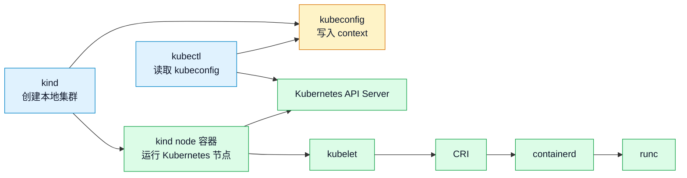

# 第 1 篇：课程导学与开发环境准备

本篇是整套课程的入口，属于 **A 类：工具/环境章**。

本篇不要求任何前置课程知识。你只需要准备一台满足硬件要求的电脑，跟着本篇完成课程起点环境。

本篇不急着写业务功能，而是先完成这几件事：看清完整学习路线，理解 `Cloud Native Todo Platform` 项目会如何逐步演进，准备后续 Go、Docker、Kubernetes、Helm、CI/CD、Operator 开发都要依赖的统一实验环境，并掌握后续声明式配置都会用到的 YAML 基础语法。

本篇对应 6 个章节主题：

- 1.1 课程目标、岗位路线与综合项目介绍
- 1.2 YAML 语法基础：缩进、多文档、锚点与别名
- 1.3 Ubuntu Server 24.04 统一学习环境
- 1.4 Bash/Zsh、PATH、kind 与 kubeconfig
- 1.5 安装 Go、Git、Docker、kubectl、kind、Helm
- 1.6 版本环境锁定与 `check-env.sh` 检查脚本

## 1. 本章学习目标

学完本篇后，你应该能够建立一套可复现的云原生学习工作台，并能说明每个工具为什么会出现在后续课程中。

### 1.1 知识目标

- 能说清本课程 6 个阶段、42 篇内容与 `Cloud Native Todo Platform` 项目主线的关系。
- 能解释 YAML 缩进、列表、字典、多文档、锚点和别名的语法规则。
- 能说明为什么本课程统一基于 Ubuntu 24.04 LTS，并能验证当前系统版本。
- 能说明 `go`、`git`、`docker`、`kubectl`、`kind`、`helm` 在后续课程中的作用。

### 1.2 技能目标

- 能独立安装并验证 `go`、`git`、`docker`、`kubectl`、`kind`、`helm` 六个核心工具。
- 能初始化 `cloud-native-todo-platform` 仓库，并创建规范的课程项目目录结构。
- 能阅读和编写基础 Kubernetes YAML 资源文件。
- 能编写并运行 `scripts/check-env.sh` 脚本，检查工具链版本是否符合课程基线。

## 2. 本章工作场景与真实案例

### 2.1 技术痛点

真实团队很少从“直接写业务代码”开始。一个新项目启动时，往往先要解决环境、工具链和仓库结构问题。

如果这一步没有做好，后面会反复遇到这些问题：

- 新人加入 Go 后端团队，需要按团队文档安装 Go、Docker、kubectl、Helm，并跑通环境检查脚本。
- DevOps 团队要统一开发机工具版本，避免有人用旧版 `kubectl` 或旧版 Helm 生成不兼容配置。
- 平台团队准备做 Kubernetes Operator，需要先把 Go、Docker、kind、本地集群和仓库目录标准化。

### 2.2 团队协作场景

项目仓库第一次初始化时，不只是创建几个目录，而是提前把不同角色的协作边界摆清楚。

- 代码仓库第一次初始化时，需要提前规划 `api/`、`cli/`、`deployments/`、`scripts/`、`operator/` 等目录边界。
- 面试中被问到“你如何从零搭建一个云原生 Go 项目的开发环境”，需要能讲清系统选择、工具安装、版本锁定和验证方式。

后续 Go 后端、平台工程、DevOps、SRE 都会围绕同一个仓库工作。目录边界清楚，脚本可复用，环境版本可检查，协作成本就会低很多。

### 2.3 Todo 平台模拟案例

> 你加入一个云原生平台团队，团队准备用 Todo 平台作为内部培训样例。你的第一项任务不是写业务代码，而是在 Ubuntu Server 上准备统一终端、工具链、Docker、kubectl、kind 和 Helm，并留下可复查的环境验证记录。

这个案例用来说明为什么课程一开始要统一环境、版本、YAML 和基础命令：只有机器状态清楚，后面的本地开发、容器实验和 Kubernetes 实验才有稳定前提。
## 3. 核心概念

### 3.1 YAML 是什么

YAML 是一种常见的配置文件格式。Kubernetes YAML、Helm values、GitHub Actions workflow、Argo CD Application 都会大量使用 YAML。

YAML 的核心规则是：**用缩进表达层级，用 `-` 表示列表，用 `key: value` 表示键值对**。

一个最小示例：

```yaml title="docs/examples/basic.yaml"
project:
  name: cloud-native-todo-platform  # ← key-value，项目名称
  stage: foundation                 # ← key-value，当前阶段
tools:
  - go                              # ← 列表项
  - docker
  - kubectl
```

YAML 最容易出错的是缩进。不要混用 Tab 和空格，课程中统一使用 2 个空格缩进。

### 3.2 多文档、锚点与别名

一个 YAML 文件可以用 `---` 分隔多个文档。Kubernetes 中常把多个资源写在同一个文件里。

```yaml title="docs/examples/multi-doc.yaml"
apiVersion: v1
kind: Namespace
metadata:
  name: todo-dev                   # ← 第一个资源：Namespace
---
apiVersion: v1
kind: ConfigMap
metadata:
  name: todo-env
  namespace: todo-dev              # ← 第二个资源：ConfigMap，放入 todo-dev
data:
  TODO_ENV: dev
```

锚点和别名可以复用同一个值或结构。注意：YAML 锚点只在同一个文档内生效，不能跨 `---` 复用。

```yaml title="docs/examples/anchors.yaml"
versions:
  go: &go_version "1.26.x"          # ← 定义锚点
  docker: "29.x"
tools:
  api:
    go: *go_version                 # ← 使用别名
  cli:
    go: *go_version
```

本篇先掌握这些基础即可。后续 Kubernetes、Helm、GitHub Actions、Argo CD 都会继续使用 YAML。

### 3.3 YAML 常见错误

写 YAML 时，先记住这几条：

- 同一层级必须使用相同缩进。
- 冒号后面通常要有空格，例如 `name: todo-dev`。
- 字符串可以不加引号，但包含 `:`、`#`、`{}` 等特殊字符时建议加引号。
- 列表项 `-` 后面要有空格，例如 `- go`。
- 锚点和别名只在同一个 YAML 文档内生效，不能跨 `---` 复用。

如果 `kubectl apply --dry-run=client` 报 YAML 解析错误，优先检查缩进、冒号、列表项和文档分隔符。

## 4. 原理深入

### 4.1 PATH 与命令查找

当你执行 `go version` 时，Shell 会在 `PATH` 环境变量列出的目录中查找名为 `go` 的可执行文件。

检查命令位置：

```bash linenums="0"
command -v go
command -v docker
echo "$PATH"
```

预期输出类似：

```text linenums="0"
/usr/local/go/bin/go
/usr/bin/docker
/usr/local/go/bin:/usr/local/bin:/usr/bin:...
```

如果工具已经安装但命令找不到，通常不是工具坏了，而是没有加入 `PATH`，或者当前终端没有重新加载环境变量。

### 4.2 kubectl、kind 与 kubeconfig

`kind` 并不是让 Kubernetes 继续用 Docker Engine 直接运行 Pod。更准确地说，`kind` 会把每个本地 Kubernetes 节点做成一个外层容器，这个外层节点容器可以由 Docker 或 Podman 承载；节点容器内部运行 kubelet、containerd 等组件，Pod 容器仍由 kubelet 通过 CRI 调用 containerd 创建。

`kubectl` 则通过 kubeconfig 连接 Kubernetes 集群。它不关心底层节点是物理机、虚拟机，还是 kind 创建出来的本地节点容器。

三者关系如下：



查看当前集群上下文：

```bash linenums="0"
kubectl config current-context
kubectl config get-contexts
```

生产环境中，执行删除命令前必须确认当前 context。很多事故不是命令不会用，而是对错集群执行了正确命令。

## 5. 手把手实验

预计耗时：首次安装工具需要 1-3 小时；如果工具已安装，完成仓库初始化和脚本验证约 30-45 分钟。

### 5.1 实验目标

本实验会完成：**搭建统一实验环境，初始化 `cloud-native-todo-platform` 仓库，并运行 `check-env.sh` 验证工具链**。

本课程默认使用 **Ubuntu Server 24.04 LTS**，命令在 Bash 或 Zsh 中执行。不要使用 Windows PowerShell、CMD 或普通 `sh` 直接运行本篇命令；后续章节会大量依赖 Bash/Zsh、apt、systemd 和 Linux 权限模型。

最终交付物包括：

- `cloud-native-todo-platform` 本地仓库。
- 基础目录结构：`api/`、`cli/`、`deployments/`、`scripts/`、`docs/`、`operator/`。
- YAML 示例文件：`docs/examples/basic.yaml`、`multi-doc.yaml`、`anchors.yaml`。
- 环境记录文档：`docs/environment.md`。
- 环境检查脚本：`scripts/check-env.sh`。
- `.gitignore` 和初始 `README.md`。
- 至少一次 Git 提交。

### 5.2 实验环境

建议先确认服务器资源和终端环境：

| 项目 | 建议 |
|---|---|
| 操作系统 | Ubuntu Server 24.04 LTS |
| 终端 | Bash 或 Zsh |
| CPU | 4 核及以上 |
| 内存 | 16GB 及以上 |
| 磁盘 | 至少预留 50GB |
| 编辑器 | VS Code |

执行以下命令检查当前环境：

| 命令 | 含义 |
|---|---|
| `cat /etc/os-release` | 查看 Linux 发行版、版本号和代号，确认是否为 Ubuntu 24.04。 |
| `uname -m` | 查看 CPU 架构，例如 `x86_64` 表示 64 位 x86 架构。 |
| `nproc` | 查看当前系统可用的逻辑 CPU 数量。 |
| `lscpu \| sed -n '1,12p'` | 查看 CPU 基本信息，并只截取前 12 行，避免输出过长。 |
| `free -h` | 查看内存和 Swap 使用情况，`-h` 表示使用人类可读单位。 |
| `df -h /` | 查看根分区 `/` 的磁盘容量、已用空间和剩余空间。 |
| `echo "$SHELL"` | 查看当前默认登录 Shell，例如 Bash 或 Zsh。 |
| `bash --version` | 查看 Bash 版本，后续脚本会大量使用 Bash 语法。 |
| `zsh --version || true` | 如果已安装 Zsh，则查看 Zsh 版本；如果未安装，也不中断整组检查命令。 |

```bash linenums="0"
cat /etc/os-release
uname -m
nproc
lscpu | sed -n '1,12p'
free -h
df -h /
echo "$SHELL"
bash --version
zsh --version || true
```

示例环境记录如下：

```text linenums="0"
$ cat /etc/os-release
PRETTY_NAME="Ubuntu 24.04.4 LTS"
VERSION_ID="24.04"
VERSION="24.04.4 LTS (Noble Numbat)"
VERSION_CODENAME=noble
ID=ubuntu

$ uname -m
x86_64

$ nproc
6

$ lscpu | sed -n '1,12p'
Architecture:                            x86_64
CPU op-mode(s):                          32-bit, 64-bit
Address sizes:                           40 bits physical, 48 bits virtual
Byte Order:                              Little Endian
CPU(s):                                  6
On-line CPU(s) list:                     0-5
Vendor ID:                               GenuineIntel
Model name:                              Intel Core Processor (Haswell, no TSX, IBRS)
CPU family:                              6

$ free -h
               total        used        free      shared  buff/cache   available
Mem:            23Gi       613Mi        21Gi       1.1Mi       1.6Gi        22Gi
Swap:             0B          0B          0B

$ df -h /
Filesystem      Size  Used Avail Use% Mounted on
/dev/vda1       193G  3.1G  190G   2% /

$ echo "$SHELL"
/usr/bin/zsh

$ bash --version
GNU bash, version 5.2.21(1)-release (x86_64-pc-linux-gnu)

$ zsh --version || true
zsh 5.9 (x86_64-ubuntu-linux-gnu)
```

`/etc/os-release` 中应包含 `VERSION_ID="24.04"`。如果不是 Ubuntu Server 24.04，请先切换到课程指定环境后再继续，避免后续包源、systemd、Docker 和 Kubernetes 命令出现不必要差异。输出和示例不必完全一致，但 CPU、内存和磁盘应满足上面的建议值；如果没有安装 Zsh，可以继续使用 Bash，不影响本篇实验。

### 5.3 安装核心工具

本课程默认在 Ubuntu Server 24.04 上安装工具。安装不要追求“命令越短越好”，而要追求来源可信、版本可查、结果可验证。国内网络环境下，优先使用可信镜像源、公司制品库或公司代理；不要从不明网盘下载二进制文件。

安装完成后的最低要求是：命令能在你的主力学习终端里返回版本信息。

先安装基础包：

```bash linenums="0"
sudo apt update
sudo apt install -y curl ca-certificates gnupg lsb-release make tar gzip tree
sudo apt install -y git
```

如果国内访问 Ubuntu 官方源较慢，可以把 Ubuntu 24.04 的 apt 源切换到可信镜像源。以下示例使用清华源，执行前会备份原文件：

```bash linenums="0"
sudo cp /etc/apt/sources.list.d/ubuntu.sources /etc/apt/sources.list.d/ubuntu.sources.bak
sudo sed -i \
  -e 's|http://archive.ubuntu.com/ubuntu/|https://mirrors.tuna.tsinghua.edu.cn/ubuntu/|g' \
  -e 's|http://security.ubuntu.com/ubuntu/|https://mirrors.tuna.tsinghua.edu.cn/ubuntu/|g' \
  /etc/apt/sources.list.d/ubuntu.sources
sudo apt update
```

安装 Go：

```bash linenums="0"
GO_VERSION=1.26.0
GO_ARCH=amd64
curl -fLO "https://golang.google.cn/dl/go${GO_VERSION}.linux-${GO_ARCH}.tar.gz"
sudo rm -rf /usr/local/go
sudo tar -C /usr/local -xzf "go${GO_VERSION}.linux-${GO_ARCH}.tar.gz"
grep -qxF 'export PATH=/usr/local/go/bin:$PATH' ~/.bashrc || printf '\nexport PATH=/usr/local/go/bin:$PATH\n' >> ~/.bashrc
export PATH=/usr/local/go/bin:$PATH
go env -w GOPROXY=https://goproxy.cn,direct
go version
go env GOPROXY
```

安装 Docker Engine：

```bash linenums="0"
sudo install -m 0755 -d /etc/apt/keyrings
curl -fsSL https://download.docker.com/linux/ubuntu/gpg \
  | sudo gpg --dearmor -o /etc/apt/keyrings/docker.gpg
sudo chmod a+r /etc/apt/keyrings/docker.gpg
. /etc/os-release
echo "deb [arch=$(dpkg --print-architecture) signed-by=/etc/apt/keyrings/docker.gpg] https://download.docker.com/linux/ubuntu ${VERSION_CODENAME} stable" \
  | sudo tee /etc/apt/sources.list.d/docker.list >/dev/null
sudo apt update
sudo apt install -y docker-ce docker-ce-cli containerd.io docker-buildx-plugin docker-compose-plugin
sudo usermod -aG docker "$USER"
```

`usermod -aG docker "$USER"` 后需要重新登录终端，或者临时执行 `newgrp docker`。确认 Docker daemon：

```bash linenums="0"
docker --version
docker compose version
docker info
```

如果国内访问 Docker 官方 apt 仓库较慢，可以把上面 `docker.list` 中的 `https://download.docker.com/linux/ubuntu` 替换为可信镜像源，例如 `https://mirrors.tuna.tsinghua.edu.cn/docker-ce/linux/ubuntu`。如果拉取容器镜像较慢，应优先使用公司内部 registry 或课程提供的预拉取镜像，避免依赖不明公共加速器。

安装 kubectl：

```bash linenums="0"
sudo install -m 0755 -d /etc/apt/keyrings
curl -fsSL https://pkgs.k8s.io/core:/stable:/v1.36/deb/Release.key \
  | sudo gpg --dearmor -o /etc/apt/keyrings/kubernetes-apt-keyring.gpg
echo 'deb [signed-by=/etc/apt/keyrings/kubernetes-apt-keyring.gpg] https://pkgs.k8s.io/core:/stable:/v1.36/deb/ /' \
  | sudo tee /etc/apt/sources.list.d/kubernetes.list >/dev/null
sudo apt update
sudo apt install -y kubectl
kubectl version --client
```

安装 kind：

```bash linenums="0"
KIND_VERSION=v0.31.0
curl -fLo kind "https://github.com/kubernetes-sigs/kind/releases/download/${KIND_VERSION}/kind-linux-amd64"
chmod +x kind
sudo mv kind /usr/local/bin/kind
kind version
```

安装 Helm：

```bash linenums="0"
HELM_VERSION=v4.2.0
curl -fLO "https://get.helm.sh/helm-${HELM_VERSION}-linux-amd64.tar.gz"
tar -zxf "helm-${HELM_VERSION}-linux-amd64.tar.gz"
sudo install linux-amd64/helm /usr/local/bin/helm
rm -rf linux-amd64 "helm-${HELM_VERSION}-linux-amd64.tar.gz"
helm version
```

如果国内网络访问 GitHub Release、`pkgs.k8s.io` 或 `get.helm.sh` 不稳定，推荐做法是：由课程、团队或公司提前把 kubectl、kind、Helm 二进制缓存到可信制品库，学员仍按相同版本号安装和验证。不要把来源不明的安装脚本直接 pipe 给 Shell 执行。

最后统一验证：

```bash linenums="0"
go version
git --version
docker --version
docker info
kubectl version --client
kind version
helm version
```

示例验证记录如下：

```text linenums="0"
验证日期：2026-06-01

$ go version
go version go1.26.3 linux/amd64

$ git --version
git version 2.43.0

$ docker --version
Docker version 29.5.2, build 79eb04c

$ docker info
Client:
 Version: 29.5.2
 Plugins:
  buildx: v0.34.1
  compose: v5.1.4

Server:
 Server Version: 29.5.2
 Storage Driver: overlayfs
 Cgroup Driver: systemd
 Cgroup Version: 2
 Runtimes: io.containerd.runc.v2 runc
 Default Runtime: runc
 containerd version: 193637f7ee8ae5f5aa5248f49e7baa3e6164966e
 runc version: v1.3.5-0-g488fc13e
 Kernel Version: 6.8.0-124-generic
 Operating System: Ubuntu 24.04.4 LTS
 OSType: linux
 Architecture: x86_64
 CPUs: 6
 Total Memory: 23.47GiB

$ kubectl version --client
Client Version: v1.36.1
Kustomize Version: v5.8.1

$ kind version
kind v0.31.0 go1.25.5 linux/amd64

$ helm version
version.BuildInfo{Version:"v4.2.0", GitCommit:"06468084e85c244c712834933d25ea232a4c2093", GitTreeState:"clean", GoVersion:"go1.26.3", KubeClientVersion:"v1.36"}
```

### 5.4 初始化项目仓库

创建工作目录：

```bash linenums="0"
mkdir -p ~/workspace
cd ~/workspace
mkdir -p cloud-native-todo-platform
cd cloud-native-todo-platform
```

初始化 Git：

```bash linenums="0"
git init
```

创建新版项目主线目录：

下面的命令使用了花括号展开，请在 Ubuntu Server 24.04 的 Bash 或 Zsh 中执行；如果不确定当前 Shell 行为，优先使用 Bash，不要切换到 `sh`。

```bash linenums="0"
mkdir -p api/cmd/todo-api
mkdir -p api/internal/{config,handler/{http,gin},service,repository,middleware,model}
mkdir -p api/migrations api/tests
mkdir -p cli scripts docs/examples
mkdir -p deployments/{docker-compose,k8s-base,k8s-network,k8s-security,helm/todo-platform,kustomize/base}
mkdir -p deployments/kustomize/overlays/{dev,test,prod}
mkdir -p observability/{prometheus,grafana/dashboards,loki,otel}
mkdir -p operator/{crd,handwritten,kubebuilder,helm}
```

目录用途：

| 目录 | 用途 |
|---|---|
| `api/` | Go Todo API 服务 |
| `cli/` | 第 7 篇 Todo CLI |
| `scripts/` | 环境检查、启动、清理等自动化脚本 |
| `deployments/` | Docker Compose、Kubernetes、Helm、Kustomize 配置 |
| `observability/` | Prometheus、Grafana、Loki、OpenTelemetry |
| `operator/` | CRD、手写 Controller、Kubebuilder Operator |
| `docs/` | 环境记录、排障记录、项目说明 |

这些目录有些在阶段一暂时不会写入业务代码，例如 `observability/` 和 `operator/`。这里先建好骨架，是为了让后续每一篇都在同一个项目主线中演进，而不是每章重新开一个孤立目录。

### 5.5 查看文件目录结构

执行 `tree` 查看当前仓库骨架：

```bash linenums="0"
tree -L 4 .
```

预期输出类似：

```text linenums="0"
.
├── api
│   ├── cmd
│   │   └── todo-api
│   ├── internal
│   │   ├── config
│   │   ├── handler
│   │   │   ├── gin
│   │   │   └── http
│   │   ├── middleware
│   │   ├── model
│   │   ├── repository
│   │   └── service
│   ├── migrations
│   └── tests
├── cli
├── deployments
│   ├── docker-compose
│   ├── helm
│   │   └── todo-platform
│   ├── k8s-base
│   ├── k8s-network
│   ├── k8s-security
│   └── kustomize
│       ├── base
│       └── overlays
│         ├── dev
│         ├── prod
│         └── test
├── docs
│   └── examples
├── observability
│   ├── grafana
│   │   └── dashboards
│   ├── loki
│   ├── otel
│   └── prometheus
├── operator
│   ├── crd
│   ├── handwritten
│   ├── helm
│   └── kubebuilder
└── scripts
```

这一步对应实验七步中的“文件目录结构”。不要跳过它，因为后续课程会持续复用这些目录。

### 5.6 编写 YAML 示例

创建基础 YAML：

```yaml title="docs/examples/basic.yaml"
project:
  name: cloud-native-todo-platform  # ← 项目名称
  stage: foundation                 # ← 当前阶段
tools:
  - go                              # ← 后续编写 CLI、API、Operator
  - docker                          # ← 后续构建和运行容器
  - kubectl                         # ← 后续操作 Kubernetes 集群
```

创建 Kubernetes 多文档示例：

```yaml title="docs/examples/multi-doc.yaml"
apiVersion: v1
kind: Namespace
metadata:
  name: todo-dev                    # ← 本地开发命名空间
---
apiVersion: v1
kind: ConfigMap
metadata:
  name: todo-env                    # ← 配置名称
  namespace: todo-dev               # ← 配置所属命名空间
data:
  TODO_ENV: dev                     # ← 应用环境标识
```

创建锚点示例：

```yaml title="docs/examples/anchors.yaml"
versions:
  go: &go_version "1.26.x"
  docker: "29.x"
tools:
  api:
    go: *go_version
  cli:
    go: *go_version
```

用 kubectl 客户端检查 Kubernetes YAML 语法。注意：`kubectl apply --dry-run=client --validate=false` 仍可能访问 API discovery；如果当前机器没有可用 kubeconfig，它可能连接 `localhost:8080` 并失败。执行前先确认已有 Kubernetes context，或者创建一个临时 kind 集群：

```bash
kubectl config current-context
```

如果没有可用 context，本地实验可以先创建课程临时集群：

```bash
kind create cluster --name todo-dev --image registry.cn-guangzhou.aliyuncs.com/yleoer/node:v1.35.0
```

然后执行 dry-run：

```bash linenums="0"
kubectl apply --dry-run=client --validate=false -f docs/examples/multi-doc.yaml
```

预期输出：

```text linenums="0"
namespace/todo-dev created (dry run)
configmap/todo-env created (dry run)
```

这里加上 `--validate=false`，只是为了跳过 kubectl 的 OpenAPI Schema 字段校验，避免因为本地没有可用集群而在 schema 下载阶段直接失败。

但需要注意：`--validate=false` 并不等于离线模式。即使配合 `--dry-run=client`，`kubectl apply` 在资源识别、GVK/GVR 映射、API discovery 等阶段仍可能访问当前 kubeconfig 指向的 API Server。

因此，这条命令只能在已有 kubeconfig/context 的前提下做基础客户端 dry-run，它不能替代真正的离线 YAML 校验工具，也不能替代集群侧验证。

### 5.7 编写环境记录和 README

创建环境记录：

将下面内容写入 `docs/environment.md`：

```markdown title="docs/environment.md"
# 开发环境记录

## 基础信息

- 操作系统：
- CPU 架构：
- 内存：
- 课程仓库路径：

## 工具版本

- Go：
- Git：
- Docker：
- kubectl：
- kind：
- Helm：

## 备注

- 记录 Ubuntu 版本、CPU 架构、Docker Engine 安装方式和是否使用国内镜像源。
```

创建 README：

将下面内容写入 `README.md`：

```markdown title="README.md"
# Cloud Native Todo Platform

这是《从 Go 后端开发、Docker 容器化、Kubernetes 到 Operator 开发与生产实践》课程的综合项目仓库。

## 当前阶段

- 第 1 篇：课程导学与开发环境准备

## 环境检查

请先运行：

./scripts/check-env.sh
```

创建 `.gitignore`：

将下面内容追加到 `.gitignore`（如果已有相同内容，不需要重复添加）：

```text title=".gitignore"
.DS_Store
.idea/
.vscode/
*.log
tmp/
dist/
build/
bin/
coverage.out
.env
.env.*
!.env.example
kubeconfig*
```

`.env`、kubeconfig、私钥、Token 都不应该提交到 Git。

### 5.8 编写版本锁与 `check-env.sh`

先创建版本锁文件：

```bash title="scripts/versions.conf"
GO_REQUIRED_PREFIX=go1.26
GO_PROXY_REQUIRED=https://goproxy.cn,direct
DOCKER_REQUIRED_PREFIX="Docker version 29."
KUBECTL_REQUIRED_PREFIX=v1.36
KIND_REQUIRED_PREFIX=kind
HELM_REQUIRED_PREFIX=v4.
KIND_NODE_IMAGE=registry.cn-guangzhou.aliyuncs.com/yleoer/node:v1.35.0@sha256:986401fce0e567a9860075ba9df8c8459bd99a35f79024d8a682773fb40f0753
```

这个文件不是为了让所有机器永远固定死，而是让团队知道当前课程基线是什么。脚本发现版本不一致时先给出警告，由你判断是否需要升级。这里使用 `.conf` 后缀，是为了避免新手把它和存放密钥的 `.env` 文件混淆。

`KIND_NODE_IMAGE` 使用 kind v0.31 官方发布中已经预构建的节点镜像，并锁定 digest，保证同学之间创建出来的本地集群版本一致。课程主线的 Kubernetes / kubectl 基线仍是 1.36.x；如果 kind 后续官方发布 1.36.x 节点镜像，只需要更新这一行并重新创建本地集群。

校验这个 digest 的方法如下：

```bash linenums="0"
docker pull registry.cn-guangzhou.aliyuncs.com/yleoer/node:v1.35.0
docker inspect registry.cn-guangzhou.aliyuncs.com/yleoer/node:v1.35.0 --format '{{.RepoDigests}}'
```

预期输出应包含：

```text linenums="0"
[registry.cn-guangzhou.aliyuncs.com/yleoer/node@sha256:986401fce0e567a9860075ba9df8c8459bd99a35f79024d8a682773fb40f0753]
```

kind v0.31 官方发布的预构建节点镜像中没有 1.36.x 节点镜像，因此本篇先锁定 `v1.35.0` 作为 kind 烟测集群。后续如果 kind 官方发布 `kindest/node:v1.36.x`，再把 `KIND_NODE_IMAGE` 和 5.9 的预期节点版本一起升级。

创建环境检查脚本：

```bash title="scripts/check-env.sh"
#!/usr/bin/env bash
set -Eeuo pipefail

ok() {
  printf '[OK] %s\n' "$1"
}

warn() {
  printf '[WARN] %s\n' "$1"
}

fail() {
  printf '[FAIL] %s\n' "$1"
  exit 1
}

script_dir="$(cd "$(dirname "${BASH_SOURCE[0]}")" && pwd)"
if [[ -f "$script_dir/versions.conf" ]]; then
  # shellcheck disable=SC1091
  source "$script_dir/versions.conf"
fi

need_cmd() {
  local name="$1"
  if command -v "$name" >/dev/null 2>&1; then
    ok "$name found: $(command -v "$name")"
  else
    fail "$name not found in PATH"
  fi
}

version_output=""

show_and_capture_version() {
  local name="$1"
  shift
  printf '\n==> %s\n' "$name"
  if version_output="$("$@" 2>&1)"; then
    printf '%s\n' "$version_output"
  else
    printf '%s\n' "$version_output"
    fail "$name version check failed"
  fi
}

warn_if_missing_prefix() {
  local name="$1"
  local output="$2"
  local expected="$3"
  if [[ -z "$expected" ]]; then
    return 0
  fi
  if [[ "$output" == *"$expected"* ]]; then
    ok "$name matches expected prefix: $expected"
  else
    warn "$name does not match expected prefix: $expected"
  fi
}

main() {
  need_cmd go
  need_cmd git
  need_cmd docker
  need_cmd kubectl
  need_cmd kind
  need_cmd helm

  show_and_capture_version "Go" go version
  go_version="$version_output"
  show_and_capture_version "Go proxy" go env GOPROXY
  go_proxy="$version_output"
  show_and_capture_version "Git" git --version
  show_and_capture_version "Docker CLI" docker --version
  docker_version="$version_output"
  show_and_capture_version "kubectl" kubectl version --client
  kubectl_version="$version_output"
  show_and_capture_version "kind" kind version
  kind_version="$version_output"
  show_and_capture_version "Helm" helm version --template '{{.Version}}'
  helm_version="$version_output"

  warn_if_missing_prefix "Go" "$go_version" "${GO_REQUIRED_PREFIX:-}"
  warn_if_missing_prefix "Go proxy" "$go_proxy" "${GO_PROXY_REQUIRED:-}"
  warn_if_missing_prefix "Docker CLI" "$docker_version" "${DOCKER_REQUIRED_PREFIX:-}"
  warn_if_missing_prefix "kubectl" "$kubectl_version" "${KUBECTL_REQUIRED_PREFIX:-}"
  warn_if_missing_prefix "kind" "$kind_version" "${KIND_REQUIRED_PREFIX:-}"
  warn_if_missing_prefix "Helm" "$helm_version" "${HELM_REQUIRED_PREFIX:-}"

  printf '\n==> Docker daemon\n'

  if docker info >/dev/null 2>&1; then
    ok "Docker daemon is reachable"
  else
    warn "Docker CLI exists, but Docker daemon is not reachable"
    warn "Start Docker Engine, then run this script again"
  fi

  printf '\nEnvironment check completed.\n'
}

main "$@"
```

把上面的完整脚本保存为 `scripts/check-env.sh`。

Helm 版本检查使用 `helm version --template '{{.Version}}'`，是为了只取 `v4.2.x` 这样的语义版本，避免默认输出中的 Git commit、GoVersion 等字段影响脚本判断。

如果复制脚本后执行异常，先确认文件使用 LF 换行。若执行脚本时出现 `$'\r': command not found`，可以运行：

```bash linenums="0"
sed -i 's/\r$//' scripts/check-env.sh
```

赋予执行权限：

```bash linenums="0"
chmod +x scripts/check-env.sh
```

运行检查：

```bash linenums="0"
./scripts/check-env.sh
```

预期输出会包含：

```text linenums="0"
[OK] Go matches expected prefix: go1.26
[OK] Go proxy matches expected prefix: https://goproxy.cn,direct
[OK] Docker CLI matches expected prefix: Docker version 29.
[OK] kubectl matches expected prefix: v1.36
[OK] kind matches expected prefix: kind
[OK] Helm matches expected prefix: v4.

==> Docker daemon
[OK] Docker daemon is reachable

Environment check completed.
```

如果 Docker Engine 没启动，脚本应该给出 WARN，而不是直接中断。这样的设计能让新手先看完所有工具状态，再集中处理问题。

### 5.9 可选：创建 kind 集群做烟测

如果 Docker daemon 可以访问，可以创建一个本地 Kubernetes 集群。创建前先读取版本锁文件，让 kind 使用固定节点镜像：

```bash linenums="0"
source scripts/versions.conf
kind create cluster --name todo-dev --image "$KIND_NODE_IMAGE"
```

这里显式指定 `--image`，是为了避免 kind 默认节点镜像随着 kind 版本变化而漂移。真实团队做本地集成测试时，也应该把节点镜像写进脚本或 CI 配置，而不是依赖默认值。

查看节点：

```bash linenums="0"
kubectl get nodes
```

预期输出：

```text linenums="0"
NAME                     STATUS   ROLES           AGE   VERSION
todo-dev-control-plane   Ready    control-plane   ...   v1.35.0
```

这里看到的节点版本来自 `KIND_NODE_IMAGE`。如果后续你把 `KIND_NODE_IMAGE` 更新为官方可用的 1.36.x 节点镜像，预期输出也应随之变为 `v1.36.x`。

`kubectl` 与 Kubernetes API Server 通常遵循一个小版本以内的版本偏差兼容原则。课程使用 `kubectl` 1.36.x 操作 kind v1.35.0 烟测集群是可接受的；进入后续正式 Kubernetes 章节时，会再把集群版本与课程主线基线对齐。

应用前面写的 YAML：

```bash linenums="0"
kubectl apply -f docs/examples/multi-doc.yaml
```

验证资源：

```bash linenums="0"
kubectl get namespace todo-dev
kubectl -n todo-dev get configmap todo-env
```

### 5.10 完成首次提交

查看 Git 状态：

```bash linenums="0"
git status --short
```

暂存文件：

```bash linenums="0"
git add .
```

提交：

```bash linenums="0"
git commit -m "初始化课程项目环境"
```

查看提交记录：

```bash linenums="0"
git log --oneline -1
```

### 5.11 验证方法

本篇实验完成后，集中执行下面的验证命令：

```bash linenums="0"
cd ~/workspace/cloud-native-todo-platform
./scripts/check-env.sh
kubectl apply --dry-run=client --validate=false -f docs/examples/multi-doc.yaml
test -f docs/environment.md
test -f scripts/versions.conf
test -x scripts/check-env.sh
git log --oneline -1
```

预期结果：

```text linenums="0"
[OK] go found: ...
[OK] git found: ...
[OK] docker found: ...
[OK] kubectl found: ...
[OK] kind found: ...
[OK] helm found: ...
namespace/todo-dev created (dry run)
configmap/todo-env created (dry run)
<一行 Git 提交记录>
```

判断标准：

- 六个核心工具都能在主力学习终端中找到并输出版本。
- `scripts/check-env.sh` 能运行；Docker daemon 未启动时只给 WARN，不应直接失败。
- `kubectl apply --dry-run=client --validate=false` 能解析多文档 YAML。
- `docs/environment.md`、`scripts/versions.conf`、`scripts/check-env.sh` 都存在。
- `git log --oneline -1` 能看到首次提交。

### 5.12 清理步骤

如果你在 5.9 创建了 kind 集群，实验结束后可以删除它：

```bash linenums="0"
kind delete cluster --name todo-dev
```

确认上下文已经清理：

```bash linenums="0"
kubectl config get-contexts
```


## 6. 常见错误与排障

先用下面的表格快速定位问题，再看后面的闭环排障步骤。

| 错误 | 典型现象 | 优先排查方向 |
|---|---|---|
| 错误 1 | `go: command not found` | PATH 与安装目录 |
| 错误 2 | `docker --version` 成功但 `docker info` 失败 | Docker daemon 与用户权限 |
| 错误 3 | `mapping values are not allowed` | YAML 缩进、冒号、Tab |
| 错误 4 | `localhost:8080 was refused` | kubeconfig 与 kind 集群 |
| 错误 5 | `Permission denied` | 脚本执行权限 |

### 错误 1：`go: command not found`

**现象：**

```text linenums="0"
bash: go: command not found
```

**原因：** Go 没有安装，或者 Go 已安装但 `go` 可执行文件所在目录没有加入 `PATH`。

**排查：**

```bash linenums="0"
command -v go
echo "$PATH"
ls /usr/local/go/bin/go
```

**修复：** 如果 `command -v go` 没有输出，先按官方方式安装 Go；如果 `/usr/local/go/bin/go` 存在但找不到命令，把 `/usr/local/go/bin` 加入 Shell 配置文件，然后重新打开终端。

**预防：** 安装工具后立即运行 `go version`，并把版本写入 `docs/environment.md`。团队环境文档中要写清安装路径和验证命令。

### 错误 2：Docker daemon 未启动或当前用户无权限

**现象：**

```text linenums="0"
Cannot connect to the Docker daemon at unix:///var/run/docker.sock. Is the docker daemon running?
```

**原因：** Docker CLI 已安装，但后台 Docker daemon 没启动；或者当前用户不在 `docker` 组中，无法访问 `/var/run/docker.sock`。

**排查：**

```bash linenums="0"
docker --version
docker info
```

**修复：** 启动 Docker Engine，并确认当前用户有权限访问 Docker daemon：

```bash linenums="0"
sudo systemctl enable --now docker
sudo usermod -aG docker "$USER"
newgrp docker
docker info
```

**预防：** 每次进入实验前先运行 `./scripts/check-env.sh`。脚本会把 Docker CLI 和 Docker daemon 分开检查，避免把“命令存在”和“服务可用”混为一谈。

### 错误 3：YAML 缩进或冒号错误

**现象：**

```text linenums="0"
error: error parsing docs/examples/basic.yaml: error converting YAML to JSON: yaml: line 3: mapping values are not allowed in this context
```

**原因：** 报错行附近通常混用了 Tab 和空格、缩进层级不一致，或者写成了 `key:value` 这种冒号后没有空格的形式。

**排查：**

```bash linenums="0"
sed -n '1,80p' docs/examples/basic.yaml
kubectl apply --dry-run=client --validate=false -f docs/examples/multi-doc.yaml
```

**修复：** 统一使用 2 个空格缩进；列表项前使用 `- `；键值对写成 `key: value`。如果编辑器能显示不可见字符，打开 Tab 和空格显示功能。

**预防：** VS Code 安装 YAML 插件，项目内统一 2 空格缩进。复制 YAML 后先用 `kubectl apply --dry-run=client --validate=false` 做客户端解析检查，再提交 Git。

### 错误 4：kubectl 当前没有可用集群或 context 不对

**现象：**

```text linenums="0"
The connection to the server localhost:8080 was refused - did you specify the right host or port?
```

**原因：** 当前 kubeconfig 没有可用 context，或者 `kubectl` 指向了不存在的集群。还有一种常见情况是：你只想检查 YAML，却执行了需要连接集群的命令。

**排查：**

```bash linenums="0"
kubectl config current-context
kubectl config get-contexts
kind get clusters
```

**修复：** 如果只是做客户端 YAML 检查，使用 `--dry-run=client --validate=false`；如果要真实验证资源，先创建 kind 集群：

```bash linenums="0"
source scripts/versions.conf
kind create cluster --name todo-dev --image "$KIND_NODE_IMAGE"
kubectl get nodes
```

**预防：** 操作集群前先执行 `kubectl config current-context`。生产环境中尤其不要把生产 kubeconfig 和本地 kind context 混用。

### 错误 5：执行脚本时 `Permission denied`

**现象：**

```text linenums="0"
bash: ./scripts/check-env.sh: Permission denied
```

**原因：** 文件内容已经写好，但没有执行权限。

**排查：**

```bash linenums="0"
ls -l scripts/check-env.sh
```

**修复：**

```bash linenums="0"
chmod +x scripts/check-env.sh
./scripts/check-env.sh
```

**预防：** 创建脚本后立即执行 `chmod +x`，并在 Git 提交前运行一次脚本。后续章节会逐步把脚本执行纳入 Makefile 或 CI。

### 排障通用流程

1. 先确认命令是否存在：`command -v <tool>`。
2. 再确认版本是否能输出：`<tool> version`。
3. 再确认后台服务是否运行：`docker info`、`kubectl get nodes`。
4. 最后检查配置文件和后台服务：PATH、kubeconfig、Docker Engine、用户组权限。

不要一上来重装所有工具。重装之前，先保存错误输出和你的环境记录。

## 7. 生产环境注意事项

本篇是开发环境准备，但很多习惯会直接影响生产安全和稳定性。

- 工具安装来源要可信。Go、Docker、kubectl、kind、Helm 应优先来自官方文档、Ubuntu apt 仓库、官方二进制或公司内部镜像源。
- 能校验 checksum 时要校验，尤其是 kubectl、Helm、kind 这类会接触集群权限或发布流程的工具。
- 企业环境应优先使用公司内部制品库、Go module proxy、容器镜像仓库和受控代理，避免每台开发机直接从公网下载不可追踪的二进制。
- 如果公司使用 HTTPS 代理或私有 CA，应按安全团队要求安装证书，不要用关闭 TLS 校验的方式“临时解决”下载问题。
- Docker Hub、GitHub Container Registry 等公共服务可能存在限流或网络波动，团队应准备镜像缓存或内部 registry。
- kubeconfig、私钥、Token、`.env` 文件不能提交到 Git 仓库。
- Docker 权限很高。Linux 上把用户加入 `docker` 组基本等同于授予该用户 root 级别的主机控制能力，加入前要理解安全影响，并遵守公司最小权限策略。
- 不要把生产集群 kubeconfig 和本地 kind 集群混着使用。执行删除、替换、升级类命令前先看 `kubectl config current-context`。
- 团队项目应锁定版本范围，并通过脚本或 CI 检查，而不是依赖口头约定。
- kind 适合本地学习和集成测试，不代表生产 Kubernetes 高可用架构。

## 8. 练习题与面试题

本章练习题和面试题已拆分到独立页面，完成正文学习后再进入题库练习与复盘。

[查看本章练习题与面试题](../../questions/stage-01-foundation/01-course-guide-env.md)

## 9. 本章总结

本篇完成了整套课程的第一块地基。你看到了 6 个阶段、42 篇内容如何围绕 `Cloud Native Todo Platform` 逐步展开；掌握了 YAML 的最小可用语法；明确了课程统一基于 Ubuntu 24.04；知道了 PATH、Docker daemon、kubeconfig 这些基础机制为什么会影响后续实验。

项目成果上，你已经初始化了 `cloud-native-todo-platform` 仓库，创建了后续阶段会持续复用的目录结构，写入了基础 YAML 示例、环境记录、版本锁文件和 `scripts/check-env.sh`。这些文件不是一次性练习材料，而是后续 Go CLI、Go API、Docker、Kubernetes、Helm 和 Operator 章节的共同起点。

能力价值上，本篇训练的是工程化学习的第一种习惯：不要只靠“我机器上能跑”，而要用可记录、可检查、可复现的方式管理环境。这个习惯会直接影响真实团队协作、CI/CD 稳定性、生产排障效率，也会成为面试中展示项目经验时很有分量的基础能力。

## 10. 下一章衔接

下一篇进入 **Linux 文件系统与命令基础**。

本篇已经创建了 `cloud-native-todo-platform` 仓库。下一篇会继续在这个仓库中练习目录、文件、权限、文本查看、搜索、压缩、软链接和环境变量，为后续 Go 项目结构、日志目录、配置目录和数据目录打基础。
