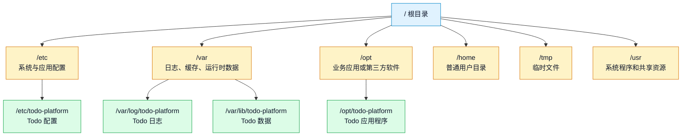
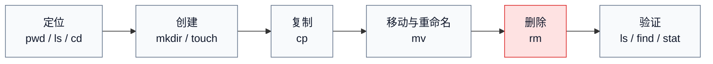
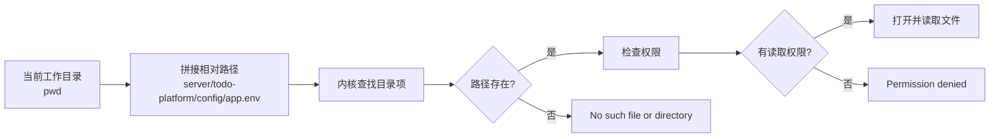
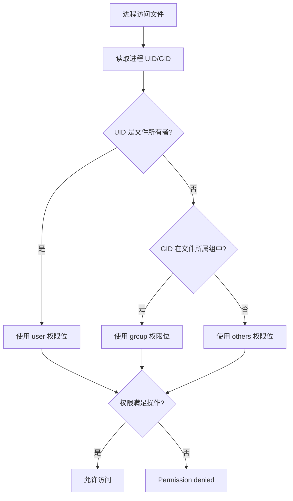
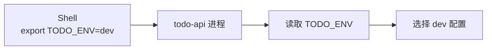

# 第 2 篇：Linux 文件系统与命令基础 [A]

第 1 篇已经完成课程仓库、工具链和基础 YAML 准备。从本篇开始，我们把注意力放到后端开发和云原生排障每天都会碰到的 Linux 基础能力：目录、文件、权限、文本处理、压缩、软链接和环境变量。

Go 服务运行在 Linux 之上，无论是物理服务器、虚拟机、Docker 容器还是 Kubernetes Pod。配置读不到、日志写不进去、脚本找不到文件、挂载目录权限异常、Pod 启动失败，很多时候不是框架问题，而是路径、权限和文件操作没有处理清楚。

本篇对应 5 个章节主题：

- 2.1 Linux 目录结构与路径规则
- 2.2 文件与目录操作命令
- 2.3 用户、用户组与文件权限
- 2.4 文本查看、搜索与处理命令
- 2.5 压缩、解压、软链接与环境变量

本篇特色项目是：**搭建 Todo 平台服务器目录结构，创建日志、配置、数据目录并设置权限**。

你会在 `cloud-native-todo-platform` 仓库中创建一个安全的本地模拟目录 `server/todo-platform`。它对应真实服务器上的 `/opt/todo-platform`、`/etc/todo-platform`、`/var/log/todo-platform`、`/var/lib/todo-platform` 等目录，但不要求你真的写系统目录，因此适合 WSL2、macOS 和 Linux 新手反复练习。

## 1. 本章学习目标

学完本篇后，你应该能独立完成 Linux 服务器上最常见的文件、目录、权限和文本处理任务，并能把这些能力迁移到后续 Go、Docker、Kubernetes 和排障场景中。

### 1.1 知识目标

- 能解释 Linux 文件系统从 `/` 开始的树形结构，以及 `/etc`、`/var`、`/opt`、`/home`、`/tmp` 等目录的典型职责。
- 能区分绝对路径、相对路径、当前目录、上级目录、用户主目录和软链接路径。
- 能解释用户、用户组、所有者、权限位、可执行权限和最小权限原则。
- 能说明日志、配置、数据、发布版本为什么应该分目录管理。
- 能描述环境变量如何影响程序运行，以及它和配置文件的边界。

### 1.2 技能目标

- 能熟练使用 `pwd`、`ls`、`cd`、`mkdir`、`touch`、`cp`、`mv`、`rm` 完成目录和文件操作。
- 能使用 `cat`、`less`、`head`、`tail`、`grep`、`find` 查看、搜索和定位文本内容。
- 能使用 `chmod`、`chown`、`id`、`stat` 检查和调整文件权限。
- 能使用 `tar` 完成目录压缩、备份和解压。
- 能使用 `ln -s` 创建软链接，并解释它在版本发布和回滚中的作用。
- 能为 Todo 平台创建服务器目录结构，并运行脚本验证目录、文件、权限和软链接是否正确。

本篇结束时，你至少应该能独立完成下面这组任务：

```bash
$ pwd
$ ls -lah
$ mkdir -p server/todo-platform/{config,logs,data,tmp,releases}
$ cp server/todo-platform/config/app.env server/todo-platform/config/app.env.bak
$ grep "ERROR" server/todo-platform/logs/todo-api.log
$ find server/todo-platform -name "*.env"
$ chmod 640 server/todo-platform/config/app.env
$ stat server/todo-platform/config/app.env
$ tar -czf server/todo-platform-backup.tar.gz server/todo-platform
$ ln -sfn releases/2026-05-27-001 server/todo-platform/current
```

这些命令看起来朴素，却是后端开发、DevOps、SRE 和 Kubernetes 排障每天都会用到的基本功。

## 2. 本章工作场景与真实案例

### 2.1 技术痛点

真实工作中，很多故障表面看起来像应用问题，根因却是 Linux 文件系统基础：

- Go 服务启动时报 `open config/app.env: no such file or directory`，原因是启动目录和配置路径不一致。
- 应用日志没有落盘，原因是进程用户没有写入日志目录的权限。
- 发布脚本回滚失败，原因是版本目录和 `current` 软链接没有设计清楚。
- CI 中脚本能在开发机跑，到了 Linux runner 失败，原因是路径大小写、换行符或执行权限不同。
- Kubernetes 挂载 ConfigMap、Secret、PVC 后应用读不到文件，原因是路径覆盖、文件权限或用户 ID 不匹配。

如果不会定位路径、检查权限、搜索日志和安全删除文件，后续 Docker、Kubernetes、Helm、CI/CD 的排障都会很吃力。

### 2.2 团队协作场景

一个生产风格后端项目通常会有明确的目录职责：

- 后端开发负责说明应用需要哪些配置文件、日志目录和数据目录。
- DevOps 负责把目录结构写进部署脚本、镜像、Compose 或 Kubernetes YAML。
- 测试同学负责记录复现问题时需要收集哪些日志和配置。
- SRE 负责在线上排查权限、磁盘、日志、备份和回滚问题。
- 安全团队会关注配置权限、密钥文件是否过宽、日志中是否泄露敏感信息。

本篇不是让你背命令清单，而是让你围绕 Todo 平台服务器目录结构，练习真实团队都能看懂、能审查、能复用的文件组织方式。

### 2.3 课程项目关联

本篇产出会被后续多章复用：

- 第 3 篇会继续使用日志目录和脚本思路，学习进程、服务和 systemd。
- 第 6 篇会把目录检查扩展成更完整的 Shell 自动化脚本。
- 第 9 到第 14 篇会在 Go 后端项目中继续使用配置、日志、数据目录。
- 第 15 到第 19 篇会把这些目录映射到 Docker 镜像、数据卷和容器运行时中。
- 第 20 篇以后会在 Kubernetes 的 ConfigMap、Secret、PVC、SecurityContext 中继续使用路径和权限知识。

本篇真实案例是：

> 团队准备把 Todo 平台从“课程仓库”逐步演进为可部署服务。你需要先在仓库中创建一套模拟服务器目录结构，包含配置、日志、数据、临时目录、发布版本目录和当前版本软链接，并用脚本验证目录权限是否符合要求。

## 3. 核心概念

### 3.1 Linux 目录结构与路径规则

Linux 文件系统是一棵从 `/` 开始的树。所有目录、文件、设备、挂载点都在这棵树里。



常见目录含义如下：

| 目录 | 常见用途 | Todo 平台类比 |
|---|---|---|
| `/` | 根目录，所有路径的起点 | 整台服务器的文件系统入口 |
| `/home` | 普通用户的主目录 | 开发者自己的工作区 |
| `/etc` | 配置文件 | `app.env`、日志配置 |
| `/var` | 经常变化的数据 | 日志、PID 文件、运行时数据 |
| `/var/log` | 日志文件 | `todo-api.log`、`error.log` |
| `/var/lib` | 应用持久化数据 | 上传文件、缓存数据、SQLite 测试数据 |
| `/opt` | 业务或第三方应用 | Todo API 可执行文件和发布版本 |
| `/tmp` | 临时文件 | 临时测试文件，不保存重要数据 |
| `/usr/bin` | 常用可执行命令 | `ls`、`grep`、`find` 等命令所在位置 |

真实生产环境中，不建议把程序、配置、日志和数据都塞进一个目录。分开管理后，权限、备份、清理和排障边界会更清楚。

### 3.2 绝对路径与相对路径

路径是定位文件和目录的方式。

绝对路径从 `/` 开始：

```text
/home/dev/workspace/cloud-native-todo-platform
/etc/todo-platform/app.env
/var/log/todo-platform/todo-api.log
```

相对路径从当前目录开始：

```text
docs/environment.md
../cloud-native-todo-platform
./scripts/check-env.sh
```

几个特殊路径符号要记牢：

| 符号 | 含义 | 示例 |
|---|---|---|
| `/` | 根目录 | `cd /` |
| `.` | 当前目录 | `./scripts/check-env.sh` |
| `..` | 上一级目录 | `cd ..` |
| `~` | 当前用户主目录 | `cd ~/workspace` |
| `-` | 上一次所在目录 | `cd -` |

操作文件前，先确认当前位置：

```bash
$ pwd
```

示例输出：

```text
/home/dev/workspace/cloud-native-todo-platform
```

任何删除、移动、压缩操作前，都应该先确认自己在正确目录。这个习惯比多背十个命令更重要。

### 3.3 文件与目录操作命令

Linux 常用文件操作可以分成五类：



常用命令说明：

| 命令 | 作用 | 示例 |
|---|---|---|
| `pwd` | 显示当前目录 | `pwd` |
| `ls` | 查看目录内容 | `ls -lah` |
| `cd` | 切换目录 | `cd ~/workspace` |
| `mkdir` | 创建目录 | `mkdir -p logs/api` |
| `touch` | 创建空文件或更新时间 | `touch logs/todo-api.log` |
| `cp` | 复制文件或目录 | `cp app.env app.env.bak` |
| `mv` | 移动或重命名 | `mv old.log todo-api.log` |
| `rm` | 删除文件或目录 | `rm old.log` |

`rm` 是高风险命令。学习阶段也要建立习惯：先 `pwd` 和 `ls`，再删除；删除目录时明确路径，避免在错误目录执行递归删除。

### 3.4 用户、用户组与文件权限

Linux 文件权限围绕三个角色展开：

- 所有者 user：文件属于哪个用户。
- 所属组 group：文件属于哪个用户组。
- 其他人 others：既不是所有者，也不在所属组中的用户。

每类角色有三种权限：

| 权限 | 含义 | 对文件 | 对目录 |
|---|---|---|---|
| `r` | read 读取 | 读取文件内容 | 列出目录内容 |
| `w` | write 写入 | 修改文件内容 | 创建、删除、重命名目录中的文件 |
| `x` | execute 执行 | 执行脚本或二进制 | 进入目录、访问目录内路径 |

查看权限：

```bash
$ ls -l server/todo-platform/config/app.env
```

示例输出：

```text
-rw-r----- 1 dev dev 128 May 27 10:00 app.env
```

第一段 `-rw-r-----` 可以这样读：

| 位置 | 含义 |
|---|---|
| `-` | 普通文件，目录会显示为 `d` |
| `rw-` | 所有者可读可写 |
| `r--` | 所属组可读 |
| `---` | 其他人无权限 |

数字权限常见写法：

| 数字 | 权限 | 常见用途 |
|---|---|---|
| `600` | 所有者读写 | 私钥、敏感配置 |
| `640` | 所有者读写，组可读 | 应用配置 |
| `700` | 所有者完全控制 | 私有目录 |
| `750` | 所有者完全控制，组可读可进入 | 服务目录 |
| `755` | 所有人可读可执行，只有所有者可写 | 普通脚本、发布目录 |
| `777` | 所有人可读写执行 | 生产环境应避免 |

### 3.5 文本查看、搜索与处理

服务器排障时，日志和配置往往比代码更先被打开。常见文本命令如下：

| 场景 | 命令 | 示例 |
|---|---|---|
| 查看小文件 | `cat` | `cat config/app.env` |
| 分页查看大文件 | `less` | `less logs/todo-api.log` |
| 看前几行 | `head` | `head -n 20 logs/todo-api.log` |
| 看最后几行 | `tail` | `tail -n 50 logs/todo-api.log` |
| 实时跟踪日志 | `tail -f` | `tail -f logs/todo-api.log` |
| 搜索关键字 | `grep` | `grep "ERROR" logs/todo-api.log` |
| 忽略大小写 | `grep -i` | `grep -i "timeout" logs/todo-api.log` |
| 显示行号 | `grep -n` | `grep -n "request_id" logs/todo-api.log` |
| 查找文件 | `find` | `find . -name "*.env"` |

一个常见排障路径是：

```bash
$ tail -n 100 server/todo-platform/logs/todo-api.log
$ grep -n "ERROR" server/todo-platform/logs/todo-api.log
$ find server/todo-platform \( -name "*.env" -o -name "*.log" \) -print
```

后续学习 Docker 和 Kubernetes 时，虽然日志可能来自 `docker logs` 或 `kubectl logs`，但定位思路依然是文本查看、关键字搜索和上下文分析。

### 3.6 压缩、软链接与环境变量

`tar` 常用于打包、备份、迁移目录：

```bash
$ tar -czf todo-server-backup.tar.gz server/todo-platform
$ tar -tzf todo-server-backup.tar.gz | head
$ tar -xzf todo-server-backup.tar.gz -C /tmp
```

常用参数：

| 参数 | 含义 |
|---|---|
| `-c` | create，创建归档 |
| `-z` | 使用 gzip 压缩 |
| `-x` | extract，解压 |
| `-t` | list，列出归档内容 |
| `-f` | 指定归档文件名 |

软链接像一个可替换的入口：

```text
server/todo-platform/current -> releases/2026-05-27-001
```

发布新版本时，可以创建新的 `releases/<版本>` 目录，再把 `current` 指向新版本。回滚时只要把 `current` 指回旧版本。这种方式比覆盖原目录更可控。

`readlink` 命令可以查看软链接指向的目标路径：

```bash
$ readlink server/todo-platform/current
```

环境变量是传递运行参数的一种方式：

```bash
$ export TODO_ENV=dev
$ printenv TODO_ENV
```

环境变量适合放运行环境、端口、配置路径等参数。敏感信息不要随意写入命令历史和日志，生产环境应使用受控的 Secret 管理方式。

## 4. 原理深入

### 4.1 Shell 如何解析路径

当你执行下面命令时：

```bash
$ cat server/todo-platform/config/app.env
```

Shell 和系统会按当前目录解析相对路径：



这解释了两个最常见错误：路径不存在和权限不足。排障时不要急着改代码，先确认 `pwd`、`ls`、`stat` 三件事。

### 4.2 权限判断流程

Linux 判断权限时，会先看当前进程用户是谁，再判断它与文件所有者、所属组的关系。



对目录来说，`x` 权限非常关键。没有目录执行权限，即使文件本身可读，也可能无法进入目录或访问目录中的文件。

### 4.3 软链接发布为什么适合回滚

假设有两个发布版本：

```text
releases/
├── 2026-05-27-001/
└── 2026-05-27-002/
current -> releases/2026-05-27-001
```

发布新版本时：

```bash
$ ln -sfn releases/2026-05-27-002 server/todo-platform/current
```

如果新版本异常，回滚只需要：

```bash
$ ln -sfn releases/2026-05-27-001 server/todo-platform/current
```

软链接切换本身很快，发布脚本也容易审查。后续学习 CI/CD 和 Kubernetes 滚动发布时，这种“保留旧版本、快速切换入口”的思想还会反复出现。

### 4.4 环境变量如何传给程序

环境变量属于进程运行环境的一部分。父进程设置环境变量后，启动子进程时会把环境变量传递给它。



这也是为什么你在一个终端里 `export TODO_ENV=dev`，另一个终端里不一定能看到。环境变量不是全局数据库，它跟进程树有关。

## 5. 手把手实验

### 5.1 实验目标

本实验会完成本篇小项目：**在课程仓库中搭建 Todo 平台服务器目录结构，写入配置、日志、数据目录，设置基础权限，并用脚本验证目录是否符合约定**。

最终交付物包括：

- `server/todo-platform/` 本地模拟服务器目录。
- `server/todo-platform/config/app.env` 配置文件。
- `server/todo-platform/config/app.env.backup` 配置备份文件。
- `server/todo-platform/logs/todo-api.log` 示例日志。
- `server/todo-platform/data/` 数据目录。
- `server/todo-platform/releases/2026-05-27-001/` 发布版本目录。
- `server/todo-platform/current` 当前版本软链接。
- `scripts/check-server-layout.sh` 目录和权限检查脚本。
- `server/todo-platform-backup.tar.gz` 备份包。

说明：本篇是 Linux 文件系统与命令基础，不编写 Kubernetes YAML。YAML 已在第 1 篇建立基础，后续 Kubernetes 配置、挂载和权限会在第 20 篇以后系统展开。

### 5.2 实验环境

建议在第 1 篇创建的仓库中执行：

```bash
$ cd ~/workspace/cloud-native-todo-platform
```

推荐环境：

| 项目 | 要求 |
|---|---|
| 操作系统 | WSL2 Ubuntu 24.04、Linux 或 macOS |
| Shell | Bash 5.x 或 zsh |
| Git | 已初始化课程仓库 |
| 核心命令 | `pwd`、`ls`、`mkdir`、`cp`、`mv`、`rm`、`chmod`、`chown`、`id`、`stat`、`cat`、`less`、`grep`、`find`、`tar`、`ln` |

平台说明：

=== "Windows + WSL2"

    在 WSL2 Ubuntu 终端中执行本章所有 Linux 命令。课程仓库必须放在 WSL2 的 Linux 文件系统中，例如 `~/workspace/cloud-native-todo-platform`。不要放在 `/mnt/c/...`、`/mnt/d/...` 这类 Windows 挂载盘下，否则 `chmod`、`stat`、软链接和脚本换行符都可能表现异常，导致权限实验输出和预期不一致。

    执行实验前可以用 `pwd` 自检：如果路径以 `/mnt/` 开头，建议先把仓库移动到 `~/workspace` 后再继续。

=== "macOS"

    macOS 可以完成本实验。`stat` 输出格式和 GNU/Linux 有差异，本篇脚本已经兼容常见 macOS 写法。

=== "Linux"

    在本机 Linux Shell 中执行即可。课程示例以 Ubuntu 24.04 为基准，其他发行版可以完成主要实验。

### 5.3 文件目录结构

实验完成后的目标结构如下：

```text
cloud-native-todo-platform/
├── scripts/
│   └── check-server-layout.sh
└── server/
    ├── todo-platform/
    │   ├── config/
    │   │   ├── app.env
    │   │   └── app.env.backup
    │   ├── current -> releases/2026-05-27-001
    │   ├── data/
    │   │   └── .keep
    │   ├── logs/
    │   │   └── todo-api.log
    │   ├── releases/
    │   │   └── 2026-05-27-001/
    │   │       └── README.md
    │   └── tmp/
    └── todo-platform-backup.tar.gz
```

创建完成后用 `tree` 验证：

```bash
$ tree -a -L 4 server scripts
```

如果没有 `tree`，可以用：

```bash
$ find server scripts -maxdepth 4 -print
```

### 5.4 完整配置和脚本

配置文件 `server/todo-platform/config/app.env`：

```text title="server/todo-platform/config/app.env"
TODO_ENV=dev
TODO_HTTP_ADDR=127.0.0.1:8080
TODO_CONFIG_DIR=server/todo-platform/config
TODO_LOG_DIR=server/todo-platform/logs
TODO_DATA_DIR=server/todo-platform/data
```

示例日志 `server/todo-platform/logs/todo-api.log`：

```text title="server/todo-platform/logs/todo-api.log"
2026-05-27T09:00:00+08:00 INFO todo-api started env=dev addr=127.0.0.1:8080
2026-05-27T09:00:05+08:00 INFO request_id=req-001 method=GET path=/healthz status=200
2026-05-27T09:00:10+08:00 ERROR request_id=req-002 method=GET path=/todos status=500 error="database not configured"
```

检查脚本 `scripts/check-server-layout.sh`：

```bash title="scripts/check-server-layout.sh"
#!/usr/bin/env bash
set -Eeuo pipefail

ROOT_DIR="$(cd "$(dirname "${BASH_SOURCE[0]}")/.." && pwd)"
BASE_DIR="$ROOT_DIR/server/todo-platform"
FAILURES=0

ok() {
  printf '[OK] %s\n' "$1"
}

warn() {
  printf '[WARN] %s\n' "$1"
}

fail() {
  printf '[FAIL] %s\n' "$1"
  FAILURES=$((FAILURES + 1))
}

file_mode() {
  local path="$1"
  local mode
  if mode="$(stat -c '%a' "$path" 2>/dev/null)"; then
    :
  else
    mode="$(stat -f '%Lp' "$path")"
  fi
  # macOS may return modes like 0750; normalize before comparing.
  printf '%s\n' "$mode" | sed 's/^0*//; s/^$/0/'
}

require_dir() {
  local path="$1"
  if [[ -d "$path" ]]; then
    ok "directory exists: ${path#$ROOT_DIR/}"
  else
    fail "directory missing: ${path#$ROOT_DIR/}"
  fi
}

require_file() {
  local path="$1"
  if [[ -f "$path" ]]; then
    ok "file exists: ${path#$ROOT_DIR/}"
  else
    fail "file missing: ${path#$ROOT_DIR/}"
  fi
}

require_mode() {
  local path="$1"
  local expected="$2"
  if [[ ! -e "$path" ]]; then
    fail "cannot check mode, path missing: ${path#$ROOT_DIR/}"
    return
  fi

  local actual
  actual="$(file_mode "$path")"
  if [[ "$actual" == "$expected" ]]; then
    ok "mode ${expected}: ${path#$ROOT_DIR/}"
  else
    fail "mode expected ${expected}, got ${actual}: ${path#$ROOT_DIR/}"
  fi
}

require_symlink_target() {
  local path="$1"
  local expected="$2"
  if [[ ! -L "$path" ]]; then
    fail "symlink missing: ${path#$ROOT_DIR/}"
    return
  fi

  local actual
  actual="$(readlink "$path")"
  if [[ "$actual" == "$expected" ]]; then
    ok "symlink target ${expected}: ${path#$ROOT_DIR/}"
  else
    fail "symlink target expected ${expected}, got ${actual}: ${path#$ROOT_DIR/}"
  fi
}

main() {
  require_dir "$BASE_DIR"
  require_dir "$BASE_DIR/config"
  require_dir "$BASE_DIR/logs"
  require_dir "$BASE_DIR/data"
  require_dir "$BASE_DIR/tmp"
  require_dir "$BASE_DIR/releases/2026-05-27-001"

  require_file "$BASE_DIR/config/app.env"
  require_file "$BASE_DIR/config/app.env.backup"
  require_file "$BASE_DIR/logs/todo-api.log"
  require_file "$BASE_DIR/data/.keep"
  require_file "$BASE_DIR/releases/2026-05-27-001/README.md"

  require_mode "$BASE_DIR/config" "750"
  require_mode "$BASE_DIR/logs" "750"
  require_mode "$BASE_DIR/data" "750"
  require_mode "$BASE_DIR/releases" "750"
  require_mode "$BASE_DIR/config/app.env" "640"
  require_mode "$BASE_DIR/config/app.env.backup" "640"
  require_mode "$BASE_DIR/logs/todo-api.log" "640"
  require_mode "$BASE_DIR/tmp" "700"
  require_symlink_target "$BASE_DIR/current" "releases/2026-05-27-001"

  if grep -q 'TODO_ENV=dev' "$BASE_DIR/config/app.env"; then
    ok "app.env contains TODO_ENV=dev"
  else
    fail "app.env does not contain TODO_ENV=dev"
  fi

  if grep -q 'ERROR' "$BASE_DIR/logs/todo-api.log"; then
    ok "sample log contains ERROR line for grep practice"
  else
    warn "sample log does not contain ERROR line"
  fi

  if [[ "$FAILURES" -gt 0 ]]; then
    printf '\nServer layout check failed: %s issue(s).\n' "$FAILURES"
    exit 1
  fi

  printf '\nServer layout check completed.\n'
}

main "$@"
```

### 5.5 执行命令

先确认你在课程仓库根目录：

```bash
$ pwd
$ ls
```

预期能看到 `README.md`、`docs/`、`scripts/` 等目录或文件。

创建目录：

```bash
$ mkdir -p server/todo-platform/{config,logs,data,tmp,releases/2026-05-27-001}
$ mkdir -p scripts
```

写入配置文件：

```bash
$ cat > server/todo-platform/config/app.env <<'EOF'
TODO_ENV=dev
TODO_HTTP_ADDR=127.0.0.1:8080
TODO_CONFIG_DIR=server/todo-platform/config
TODO_LOG_DIR=server/todo-platform/logs
TODO_DATA_DIR=server/todo-platform/data
EOF
```

写入示例日志：

```bash
$ cat > server/todo-platform/logs/todo-api.log <<'EOF'
2026-05-27T09:00:00+08:00 INFO todo-api started env=dev addr=127.0.0.1:8080
2026-05-27T09:00:05+08:00 INFO request_id=req-001 method=GET path=/healthz status=200
2026-05-27T09:00:10+08:00 ERROR request_id=req-002 method=GET path=/todos status=500 error="database not configured"
EOF
```

写入版本说明和数据目录占位文件：

```bash
$ cat > server/todo-platform/releases/2026-05-27-001/README.md <<'EOF'
# Todo Platform Release 2026-05-27-001

This directory simulates an application release package.
EOF
$ touch server/todo-platform/data/.keep
```

创建当前版本软链接：

```bash
$ ln -sfn releases/2026-05-27-001 server/todo-platform/current
```

设置权限：

```bash
$ chmod 750 server/todo-platform/{config,logs,data,releases}
$ chmod 700 server/todo-platform/tmp
$ chmod 640 server/todo-platform/config/app.env
$ chmod 640 server/todo-platform/logs/todo-api.log
```

练习复制、重命名和删除。这里先复制配置文件，再把备份文件重命名为更清晰的 `.backup` 后缀：

```bash
$ cp server/todo-platform/config/app.env server/todo-platform/config/app.env.bak
$ mv server/todo-platform/config/app.env.bak server/todo-platform/config/app.env.backup
$ chmod 640 server/todo-platform/config/app.env.backup
```

练习查看用户、用户组和权限。`id` 让你知道当前终端用户是谁，`stat` 用来确认文件权限和所有者：

```bash
$ id
$ stat server/todo-platform/config/app.env
$ ls -ld server/todo-platform/{config,logs,data,tmp,releases}
```

`chown` 用来修改文件所有者，真实服务器通常由管理员或部署脚本执行。本实验目录已经属于当前用户，默认不需要执行 `chown`。如果你曾经误用 `sudo` 创建了 root 拥有的实验文件，可以用下面命令把目录恢复给当前用户：

```bash
# 可选，仅当实验目录的所有者异常时执行
$ sudo chown -R "$(id -un):$(id -gn)" server/todo-platform
```

练习安全删除。先创建一个明确的临时文件，再删除它；不要对不确定的路径执行 `rm -rf`：

```bash
$ touch server/todo-platform/tmp/delete-me.txt
$ ls -l server/todo-platform/tmp/delete-me.txt
$ rm server/todo-platform/tmp/delete-me.txt
```

写入检查脚本：

将 5.4 中的完整脚本保存为 `scripts/check-server-layout.sh`。推荐用 VS Code 新建文件后粘贴脚本内容；如果必须在终端中粘贴，可以执行 `cat > scripts/check-server-layout.sh <<'EOF'`，粘贴 5.4 的完整脚本，最后单独输入一行 `EOF` 结束。如果你使用 Windows + WSL2，确认右下角换行符为 `LF`。

保存后赋予执行权限：

```bash
$ chmod +x scripts/check-server-layout.sh
```

练习查看和搜索：

```bash
$ cat server/todo-platform/config/app.env
$ less server/todo-platform/logs/todo-api.log
$ tail -n 2 server/todo-platform/logs/todo-api.log
$ grep -n "ERROR" server/todo-platform/logs/todo-api.log
$ find server/todo-platform \( -name "*.env" -o -name "*.log" \) -print
$ ls -l server/todo-platform/current
```

使用 `less` 查看日志时，按 `q` 退出。

创建备份包：

```bash
$ tar -czf server/todo-platform-backup.tar.gz server/todo-platform
$ tar -tzf server/todo-platform-backup.tar.gz | head
```

运行检查脚本：

```bash
$ ./scripts/check-server-layout.sh
```

### 5.6 预期输出

查看软链接时，预期类似：

```text
current -> releases/2026-05-27-001
```

搜索错误日志时，预期类似：

```text
3:2026-05-27T09:00:10+08:00 ERROR request_id=req-002 method=GET path=/todos status=500 error="database not configured"
```

检查脚本预期输出：

```text
[OK] directory exists: server/todo-platform
[OK] directory exists: server/todo-platform/config
[OK] directory exists: server/todo-platform/logs
[OK] directory exists: server/todo-platform/data
[OK] directory exists: server/todo-platform/tmp
[OK] directory exists: server/todo-platform/releases/2026-05-27-001
[OK] file exists: server/todo-platform/config/app.env
[OK] file exists: server/todo-platform/config/app.env.backup
[OK] file exists: server/todo-platform/logs/todo-api.log
[OK] file exists: server/todo-platform/data/.keep
[OK] file exists: server/todo-platform/releases/2026-05-27-001/README.md
[OK] mode 750: server/todo-platform/config
[OK] mode 750: server/todo-platform/logs
[OK] mode 750: server/todo-platform/data
[OK] mode 750: server/todo-platform/releases
[OK] mode 640: server/todo-platform/config/app.env
[OK] mode 640: server/todo-platform/config/app.env.backup
[OK] mode 640: server/todo-platform/logs/todo-api.log
[OK] mode 700: server/todo-platform/tmp
[OK] symlink target releases/2026-05-27-001: server/todo-platform/current
[OK] app.env contains TODO_ENV=dev
[OK] sample log contains ERROR line for grep practice

Server layout check completed.
```

### 5.7 验证方法

集中执行下面命令：

```bash
$ test -d server/todo-platform/config
$ test -d server/todo-platform/logs
$ test -d server/todo-platform/data
$ test -L server/todo-platform/current
$ test -f server/todo-platform/config/app.env
$ test -f server/todo-platform/config/app.env.backup
$ test -f server/todo-platform/logs/todo-api.log
$ test -f server/todo-platform/data/.keep
$ test -x scripts/check-server-layout.sh
$ readlink server/todo-platform/current
$ find server/todo-platform \( -name "*.env" -o -name "*.log" \) -print
$ ./scripts/check-server-layout.sh
$ tar -tzf server/todo-platform-backup.tar.gz | head
```

判断标准：

- 配置、日志、数据、临时目录和发布版本目录都存在。
- `current` 是软链接，并指向 `releases/2026-05-27-001`。
- `config`、`logs`、`data`、`releases` 目录权限为 `750`。
- `app.env` 和 `todo-api.log` 权限为 `640`。
- `app.env.backup` 由 `cp` 和 `mv` 练习生成，权限为 `640`。
- `tmp` 目录权限为 `700`。
- 检查脚本输出 `Server layout check completed.`。
- 备份包能列出内容。

### 5.8 清理步骤

如果你只想清理备份包：

```bash
$ rm -f server/todo-platform-backup.tar.gz
```

如果你想重做整个实验，请先确认当前位置：

```bash
$ pwd
$ ls server
```

确认你在 `cloud-native-todo-platform` 仓库后，再删除实验目录：

```bash
$ rm -rf server/todo-platform
$ rm -f server/todo-platform-backup.tar.gz
$ rm -f scripts/check-server-layout.sh
```

如果准备继续学习第 3 篇，不建议清理 `server/todo-platform`，因为后续会继续使用日志、配置和脚本思路。

预计耗时：60 分钟（动手操作约 40 分钟）。

## 6. 常见错误与排障

### 错误 1：`No such file or directory`

- **现象**：

  ```text
  cat: server/todo-platform/config/app.env: No such file or directory
  ```

- **原因**：当前目录不对，或者前面的 `mkdir`、`cat > app.env` 没有执行成功。

- **排查**：

  ```bash
  $ pwd
  $ ls -lah
  $ find . -path "*app.env" -print
  ```

  `pwd` 用来确认你是否在课程仓库根目录；`find` 用来确认文件是否被写到了别的位置。

- **修复**：回到仓库根目录，再重新创建目录和配置文件。

  ```bash
  $ cd ~/workspace/cloud-native-todo-platform
  $ mkdir -p server/todo-platform/config
  ```

- **预防**：每次执行批量文件操作前，先运行 `pwd` 和 `ls`。

### 错误 2：`Permission denied`

- **现象**：

  ```text
  bash: ./scripts/check-server-layout.sh: Permission denied
  ```

- **原因**：脚本没有执行权限，或者目录缺少进入权限。

- **排查**：

  ```bash
  $ ls -l scripts/check-server-layout.sh
  $ stat scripts/check-server-layout.sh
  ```

  如果权限中没有 `x`，脚本不能直接执行。

- **修复**：

  ```bash
  $ chmod +x scripts/check-server-layout.sh
  $ ./scripts/check-server-layout.sh
  ```

- **预防**：创建脚本后立即执行 `chmod +x`，并把检查命令写进后续自动化脚本。

### 错误 3：`grep` 没有输出

- **现象**：

  ```bash
  $ grep -n "ERROR" server/todo-platform/logs/todo-api.log
  ```

  命令没有任何输出。

- **原因**：文件中没有匹配关键字，或者大小写不一致。`grep` 没有匹配时退出码为 1，不一定代表命令坏了。

- **排查**：

  ```bash
  $ wc -l server/todo-platform/logs/todo-api.log
  $ cat server/todo-platform/logs/todo-api.log
  $ grep -ni "error" server/todo-platform/logs/todo-api.log
  ```

- **修复**：确认日志内容正确，必要时使用 `grep -i` 忽略大小写。

- **预防**：排障时先确认文件是否有内容，再搜索关键字。

### 错误 4：软链接失效

- **现象**：

  ```text
  ls: cannot access 'server/todo-platform/current': No such file or directory
  ```

  或者 `current` 存在，但指向的版本目录不存在。

- **原因**：创建软链接时目标路径写错，或者目标版本目录被删除。

- **排查**：

  ```bash
  $ ls -l server/todo-platform/current
  $ readlink server/todo-platform/current
  $ ls -lah server/todo-platform/releases
  ```

- **修复**：

  ```bash
  $ mkdir -p server/todo-platform/releases/2026-05-27-001
  $ ln -sfn releases/2026-05-27-001 server/todo-platform/current
  ```

- **预防**：发布脚本里先检查目标版本目录存在，再切换 `current`。

### 错误 5：WSL2 文件换行或挂载盘权限异常

- **现象**：

  ```text
  ./scripts/check-server-layout.sh: line 2: $'\r': command not found
  ```

  或者权限检查一直失败：

  ```text
  [FAIL] mode expected 750, got 777: server/todo-platform/config
  [FAIL] mode expected 640, got 777: server/todo-platform/config/app.env
  ```

- **原因**：前一种现象通常是脚本使用了 Windows CRLF 换行符，Linux Bash 期望 LF 换行。后一种现象通常是课程仓库位于 `/mnt/c`、`/mnt/d` 这类 Windows 挂载盘，WSL2 访问 Windows 文件系统时可能不按 Linux 原生方式保存 Unix 权限位。

- **排查**：

  ```bash
  $ pwd
  $ file scripts/check-server-layout.sh
  $ ls -ld server/todo-platform/config
  $ stat server/todo-platform/config/app.env
  ```

  如果 `file` 输出包含 `CRLF line terminators`，说明换行符不符合 Linux 脚本习惯。如果 `pwd` 以 `/mnt/` 开头，并且 `chmod 640` 后仍显示 `777`，基本可以确认是 Windows 挂载盘权限语义导致的。

- **修复**：

  ```bash
  $ sed -i 's/\r$//' scripts/check-server-layout.sh
  $ chmod +x scripts/check-server-layout.sh
  ```

  如果是 `/mnt/c`、`/mnt/d` 挂载盘权限问题，把仓库放到 WSL2 Linux 文件系统中重新执行实验：

  ```bash
  $ mkdir -p ~/workspace
  $ cp -a /mnt/c/Users/<你的用户名>/cloud-native-todo-platform ~/workspace/
  $ cd ~/workspace/cloud-native-todo-platform
  ```

  如果你已经用 Git 管理仓库，也可以在 WSL2 中重新 `git clone` 到 `~/workspace`。

- **预防**：涉及 `chmod`、软链接、Shell 脚本和 Linux 权限的实验，都优先在 WSL2 的 `~/workspace`、`/home/<user>/...` 这类 Linux 原生路径下执行。

## 7. 生产环境注意事项

1. **不要在生产环境滥用 `777`。**
   `chmod 777` 看似能快速解决权限问题，实际是把读、写、执行权限交给所有用户。配置、密钥、日志、数据目录都应遵守最小权限原则。服务需要什么权限，就只给什么权限。

2. **配置、日志、数据和程序要分离。**
   程序发布目录适合只读，配置目录适合受控变更，日志目录需要可写和轮转，数据目录需要备份策略。如果全部放在一个目录，备份、清理、权限审计和故障定位都会变得混乱。

3. **删除和覆盖操作必须可审查。**
   生产脚本中不要写模糊的 `rm -rf *`。删除前应打印目标路径，必要时要求显式确认。发布时优先使用新版本目录加软链接切换，而不是直接覆盖旧版本。

4. **日志文件需要轮转和敏感信息治理。**
   日志目录如果不做轮转，可能把磁盘打满；日志中如果写入 Token、密码、身份证号等敏感信息，会变成安全风险。后续生产化章节会继续引入结构化日志和日志采集。

5. **环境变量适合运行参数，不适合无边界地堆配置。**
   环境变量很方便，但也容易被进程列表、调试输出或日志泄露。生产环境中的密码、证书和 Token 应使用 Secret 管理，并控制谁能读取。

## 8. 本章小项目

本章小项目：**Todo 平台服务器目录结构初始化**。

交付物：

- `server/todo-platform/config/app.env`
- `server/todo-platform/config/app.env.backup`
- `server/todo-platform/logs/todo-api.log`
- `server/todo-platform/data/.keep`
- `server/todo-platform/tmp/`
- `server/todo-platform/releases/2026-05-27-001/README.md`
- `server/todo-platform/current` 软链接
- `server/todo-platform-backup.tar.gz`
- `scripts/check-server-layout.sh`

验收命令：

```bash
$ cd ~/workspace/cloud-native-todo-platform
$ ./scripts/check-server-layout.sh
$ grep -n "ERROR" server/todo-platform/logs/todo-api.log
$ find server/todo-platform \( -name "*.env" -o -name "*.log" \) -print
$ ls -l server/todo-platform/current
$ tar -tzf server/todo-platform-backup.tar.gz | head
```

能力验收标准：

| 能力项 | 验收方式 |
|---|---|
| 路径理解 | 能说明 `server/todo-platform/config/app.env` 是相对路径还是绝对路径 |
| 文件操作 | 能用 `cp`、`mv`、`rm` 创建备份、重命名和安全删除实验文件 |
| 权限理解 | 能解释 `640`、`700`、`750` 的含义，并能用 `id`、`stat` 查看所有者和权限 |
| 文本搜索 | 能用 `grep -n` 找到错误日志 |
| 文件查找 | 能用 `find` 找到 `.env` 和 `.log` 文件 |
| 软链接 | 能解释 `current -> releases/2026-05-27-001` |
| 备份恢复 | 能用 `tar -tzf` 检查备份包内容 |
| 自动化检查 | 能运行 `scripts/check-server-layout.sh` 并读懂输出 |

## 9. 本章练习题

### 基础题

1. 绝对路径和相对路径有什么区别？分别举一个 Todo 平台中的例子。
2. `/etc`、`/var/log`、`/var/lib`、`/opt` 通常分别放什么内容？
3. `chmod 640 config/app.env` 中的 `640` 分别代表什么权限？
4. 为什么目录需要 `x` 权限才能进入？

### 实操题

1. 把 `server/todo-platform/config/app.env` 复制为 `app.env.bak`，再用 `ls -l` 验证。
2. 在 `todo-api.log` 中追加一行 `WARN` 日志，并用 `grep -n "WARN"` 找到它。
3. 使用 `less server/todo-platform/logs/todo-api.log` 查看日志，并练习按 `q` 退出。
4. 使用 `find server/todo-platform \( -name "*.env" -o -name "*.log" \) -print` 查找配置和日志文件。
5. 新建 `server/todo-platform/releases/2026-05-27-002`，把 `current` 切到新版本，再切回旧版本。
6. 解压 `server/todo-platform-backup.tar.gz` 到 `/tmp/todo-restore`，确认内容完整后删除 `/tmp/todo-restore`。

### 思考题

1. 为什么生产环境中不建议把配置、日志、数据和程序都放在同一个目录？
2. 如果 Kubernetes Pod 挂载了一个目录后应用配置文件消失了，你会如何用本篇知识排查？

## 10. 本章面试题

### 1. Linux 中绝对路径和相对路径的区别是什么？

参考答案：

一句话结论：绝对路径从 `/` 开始，不依赖当前目录；相对路径从当前目录开始，会受到 `pwd` 的影响。

展开解释：例如 `/etc/todo-platform/app.env` 是绝对路径，无论你在哪个目录都指向同一个位置；`server/todo-platform/config/app.env` 是相对路径，只有在课程仓库根目录下才指向预期文件。脚本中如果使用相对路径，必须先确定执行目录，或者在脚本里计算项目根目录。

深入追问：脚本如何避免相对路径出错？可以回答：使用 `$(cd "$(dirname "${BASH_SOURCE[0]}")/.." && pwd)` 计算脚本所在仓库根目录，再基于这个根目录拼接路径。

### 2. `chmod 755` 和 `chmod 640` 分别适合什么场景？

参考答案：

一句话结论：`755` 适合普通可执行脚本或目录，`640` 适合不希望所有人读取的配置文件。

展开解释：`755` 表示所有者可读写执行，组和其他人可读可执行；常用于脚本、发布目录或需要被进入的普通目录。`640` 表示所有者可读写，组可读，其他人无权限；常用于应用配置。敏感配置还可以更严格，例如 `600`。

深入追问：为什么不直接用 `777`？可以回答：`777` 会让所有用户读写执行，扩大误操作和安全攻击面，生产环境应遵守最小权限原则。

### 3. 软链接在发布和回滚中有什么价值？

参考答案：

一句话结论：软链接可以让固定入口指向不同版本目录，从而简化发布和回滚。

展开解释：例如 `current -> releases/2026-05-27-001`。发布新版本时创建新的 release 目录，再把 `current` 指向新版本；回滚时把 `current` 指回旧版本。这样可以保留历史版本，也方便脚本使用固定路径启动服务。

深入追问：软链接有哪些风险？可以回答：目标目录不存在会造成断链；相对链接和绝对链接要统一；切换前应检查目标版本目录完整。

### 4. 线上服务无法读取配置文件，你会怎么排查？

参考答案：

一句话结论：先确认路径是否存在，再确认进程用户是否有权限，最后确认配置内容和启动参数是否正确。

展开解释：可以依次执行 `pwd`、`ls -l`、`stat config/app.env`、`id`、`grep` 等命令。路径不存在时检查工作目录和配置路径；权限不足时检查所有者、所属组和权限位；内容错误时检查配置文件是否是预期版本。

深入追问：如果在 Kubernetes 中发生类似问题呢？可以回答：还要检查 ConfigMap/Secret/PVC 的挂载路径、volumeMount 是否覆盖了原目录、SecurityContext 中的 `runAsUser` 和 `fsGroup` 是否与文件权限匹配。

## 11. 本章总结

本篇系统训练了 Linux 文件系统与命令基础。你理解了目录树、路径规则、文件操作、权限位、文本查看、搜索、压缩、软链接和环境变量这些核心概念，也知道它们为什么会影响后端服务、容器和 Kubernetes 工作负载。

项目成果上，你为 `Cloud Native Todo Platform` 创建了 `server/todo-platform` 模拟服务器目录，包含配置、日志、数据、临时目录、发布版本目录、当前版本软链接和备份包，并编写了 `scripts/check-server-layout.sh` 做自动化验收。这些产出会在后续 Linux 进程、Shell 自动化、Go 服务、Docker 和 Kubernetes 章节继续演进。

能力价值上，本篇训练的是“能在服务器上稳稳操作”的基本功。真正的工程能力不是记住某个命令，而是知道操作前如何确认路径，出错后如何查看证据，修改权限时如何控制风险，发布目录如何支持回滚。这些习惯会直接影响你未来排查线上问题的速度和安全边界。

## 12. 下一章衔接

下一篇进入 **Linux 进程、服务与软件管理**。

本篇已经准备好了 Todo 平台的配置、日志、数据和发布目录。下一篇会在这些目录基础上学习进程、PID、前台/后台任务、软件安装、systemd 服务管理和日志查看，理解一个程序在 Linux 上如何真正运行起来。
