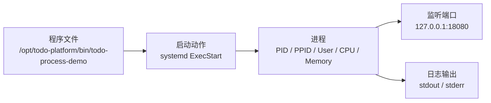
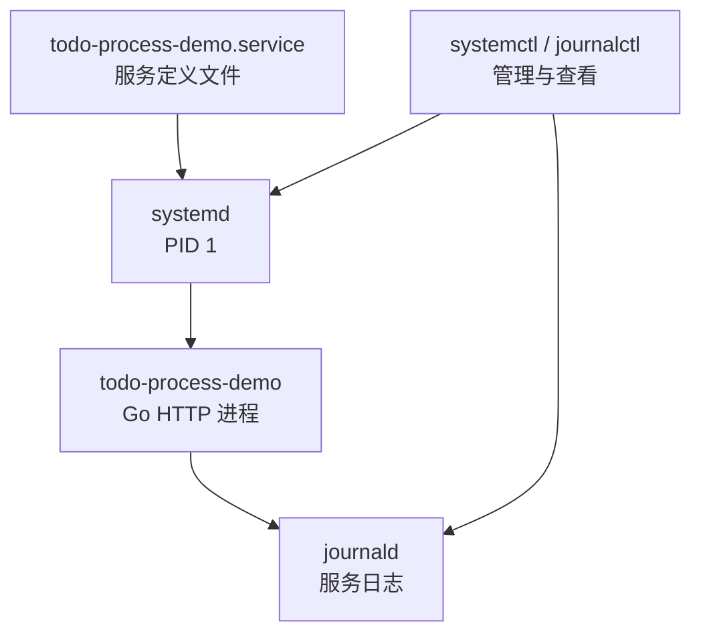
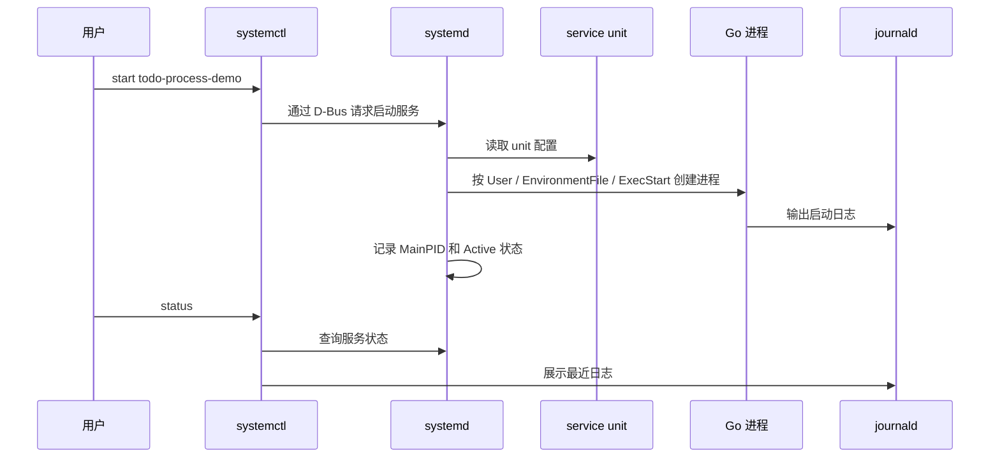

# 第 3 篇：Linux 进程、服务与软件管理

第 2 篇已经完成 Todo 平台的目录、配置、日志、数据目录和权限设计。本篇继续向前走一步：让一个程序真正运行起来，并学会用 Linux 的方式管理它。

Go 服务运行在 Linux 之上，无论它将来是在虚拟机、Docker 容器还是 Kubernetes Pod 中。服务能不能启动、监听了哪个端口、为什么异常退出、CPU 和内存是否异常，这些问题都离不开进程、服务管理和资源排查能力。

本篇对应 5 个章节主题：

- 3.1 进程、PID、前台与后台任务
- 3.2 `ps`、`top`、`htop`、`kill` 排查进程
- 3.3 systemd 与服务管理
- 3.4 软件包管理：`apt`、`yum`、`dnf`
- 3.5 CPU、内存、磁盘基础排查

本篇特色项目是：**将一个简单 Go HTTP 程序注册为 Linux systemd 服务**。

你会在 `cloud-native-todo-platform` 仓库中编写一个最小 HTTP 服务 `todo-process-demo`，把它安装到 `/opt/todo-platform/bin`，用 `/etc/todo-platform/process-demo.env` 管理运行参数，再交给 systemd 托管。完成后，你可以用 `systemctl status todo-process-demo`、`journalctl -u todo-process-demo`、`ps`、`ss`、`top`、`free`、`df` 完成服务状态和资源排查。

## 1. 本章学习目标

学完本篇后，你应该能解释一个程序在 Linux 上如何变成进程，能把一个 Go 服务注册为 systemd 服务，并能用常见命令定位服务启动、端口、CPU、内存和磁盘问题。

### 1.1 知识目标

- 能解释程序、进程、PID、PPID、前台任务、后台任务和信号的关系。
- 能描述 `ps`、`top`、`htop`、`kill`、`pgrep` 等命令分别解决什么排障问题。
- 能解释 systemd、service unit、`systemctl`、`journalctl` 的职责边界。
- 能对比 `apt`、`dnf`、遗留 `yum` 在不同 Linux 发行版中的使用场景。
- 能说明 CPU、内存、磁盘、端口资源异常为什么会影响后端服务稳定性。

### 1.2 技能目标

- 能使用 `ps`、`pgrep`、`top`、`kill` 查看和管理服务进程。
- 能编写并安装一份基础 systemd service unit。
- 能使用 `systemctl start|stop|restart|status` 和 `journalctl -u` 管理服务生命周期和日志。
- 能使用 `ss`、`free`、`df`、`du` 定位端口监听、内存紧张和磁盘空间问题。
- 能将 `todo-process-demo` 作为 systemd 服务运行，并用检查脚本完成验收。

你至少应该能独立完成下面这组任务：

```bash linenums="0"
systemctl status todo-process-demo --no-pager
journalctl -u todo-process-demo -n 30 --no-pager
PID="$(systemctl show -p MainPID --value todo-process-demo)"
ps -p "$PID" -o pid,ppid,user,stat,%cpu,%mem,etime,cmd
sudo ss -lntp | grep 18080
curl -fsS http://127.0.0.1:18080/healthz
sudo systemctl restart todo-process-demo
```

这些命令是 Linux 服务器、容器宿主机、CI Runner 和 Kubernetes Node 排障时经常会用到的基础工具箱。

## 2. 本章工作场景与真实案例

### 2.1 技术痛点

真实公司里，后端工程师不能只会写代码，还要知道代码运行后发生了什么。常见问题包括：

- Go 服务发到测试机后接口访问失败，原因可能是进程没有启动、端口没有监听，或监听在错误地址。
- 测试同学反馈服务偶发 500，开发需要查看服务日志、进程 PID 和资源状态，而不是只看代码。
- DevOps 配置了开机自启，但服务重启后立刻退出，原因可能是 `ExecStart` 路径错误、配置文件权限不足或端口冲突。
- SRE 收到 CPU 或内存告警，需要快速确认是请求量升高、死循环、内存泄漏还是日志把磁盘写满。
- 后续在 Kubernetes 中看到 `CrashLoopBackOff`、`OOMKilled`、端口探针失败，本质上仍然要理解进程、信号、日志和资源限制。

如果跳过本篇，后续学习 Docker 和 Kubernetes 时会容易把一切都归因于“平台问题”，却看不懂最底层的进程证据。

### 2.2 团队协作场景

一个服务从代码变成可运行进程，通常需要多人协作：

- 后端开发负责提供可执行文件、启动参数、健康检查接口、优雅关闭逻辑。
- DevOps 负责 systemd unit、运行用户、目录权限、开机自启、失败重启策略。
- 测试同学负责用 HTTP 接口和日志验证功能，并记录故障复现步骤。
- SRE 负责监控进程状态、CPU、内存、磁盘、端口和服务日志。
- 安全团队会关注服务是否以 root 运行、配置文件是否过宽、systemd unit 是否有基础安全限制。

本篇不是背命令清单，而是围绕一个真实服务生命周期来学习：如何让 Todo 平台的一个 Go HTTP 服务可启动、可停止、可观察、可排障。

### 2.3 Todo 平台模拟案例

> Todo 平台有一个最小 Go HTTP 服务，需要在 Ubuntu Server 上长期运行。你需要把它作为 Linux 进程启动，观察 PID、端口、日志、CPU 和内存，再用 systemd 托管它的启动、停止、重启和状态查看。

这个案例关注服务生命周期：程序不只是“能跑起来”，还要能被系统管理、被日志追踪、被资源命令定位问题。
## 3. 核心概念

### 3.1 程序、进程、PID 与 PPID

程序是磁盘上的文件，进程是程序运行起来后的实例。一个 Go 二进制文件本身只是文件；当它被启动后，Linux 会为它分配 PID、内存、文件描述符、环境变量、运行用户和 CPU 调度状态。



查看当前 Shell 的 PID：

```bash linenums="0"
echo $$
ps -p $$ -o pid,ppid,user,stat,cmd
```

`PID` 是 Process ID，表示当前进程编号；`PPID` 是 Parent Process ID，表示父进程编号。在 systemd 管理的 Linux 系统中，PID 1 通常是 `systemd`，它负责启动和管理系统服务。

### 3.2 前台任务、后台任务与信号

前台任务会占用当前终端；后台任务不会阻塞当前终端。临时实验时可以把命令放到后台运行：

```bash linenums="0"
sleep 300 &
jobs
```

预期输出类似：

```text linenums="0"
[1]+  Running                 sleep 300 &
```

常用任务控制：

| 命令 | 作用 |
|---|---|
| `command &` | 把命令放到后台运行 |
| `jobs` | 查看当前终端的后台任务 |
| `fg %1` | 把 1 号任务切回前台 |
| `Ctrl+Z` | 暂停当前前台任务 |
| `bg %1` | 让暂停任务继续在后台运行 |
| `kill %1` | 给 1 号后台任务发送终止信号 |

`kill` 的本质是给进程发送信号，不是只有“强杀”一种含义。

| 信号 | 数字 | 含义 | 常见场景 |
|---|---:|---|---|
| `SIGTERM` | 15 | 请求进程正常退出 | 默认优雅停止 |
| `SIGKILL` | 9 | 强制结束进程 | 进程无响应时最后手段 |
| `SIGHUP` | 1 | 常用于重新加载配置 | 部分服务支持 reload |
| `SIGINT` | 2 | 中断前台进程 | `Ctrl+C` |

生产环境不要一上来就 `kill -9`。它会绕过程序清理逻辑，可能导致连接未关闭、临时文件未删除、数据没有 flush。

### 3.3 进程排查命令：`ps`、`top`、`htop`、`pgrep`

`ps` 用于查看某一刻的进程快照：

```bash linenums="0"
ps -ef | grep todo-process-demo
ps -p "$PID" -o pid,ppid,user,stat,%cpu,%mem,rss,etime,cmd
```

`pgrep` 用于按进程名查找 PID：

```bash linenums="0"
pgrep -af todo-process-demo
```

`top` 用于动态观察 CPU 和内存：

```bash linenums="0"
top -p "$PID"
```

`htop` 是更友好的交互式工具，适合人工排查，但很多最小化服务器默认不安装。脚本中优先使用 `ps`、`top`、`pgrep` 这类更基础的命令。

### 3.4 systemd、service unit 与日志

systemd 是现代 Linux 中常见的系统和服务管理器。它可以根据 unit 文件启动服务、停止服务、配置开机自启、失败重启、运行用户和资源限制，并把服务输出收集到 journald。



常用命令：

| 命令 | 作用 |
|---|---|
| `systemctl start name` | 启动服务 |
| `systemctl stop name` | 停止服务 |
| `systemctl restart name` | 重启服务 |
| `systemctl status name` | 查看服务状态 |
| `systemctl enable name` | 设置开机自启 |
| `systemctl disable name` | 取消开机自启 |
| `journalctl -u name` | 查看服务日志 |
| `systemctl daemon-reload` | 重新加载 unit 文件 |

systemd 适合管理单机服务；Kubernetes 适合管理集群中的容器化服务。两者层级不同，但都在解决“进程如何被声明、启动、观察、恢复”的问题。

### 3.5 软件包管理：`apt`、`dnf` 与遗留 `yum`

Linux 发行版通常通过软件包管理器安装工具和依赖：

=== "Ubuntu / Debian：apt"

    ```bash linenums="0"
    sudo apt update
    sudo apt install -y procps curl htop lsof psmisc
    ```

=== "Rocky / Alma / Fedora：dnf"

    ```bash linenums="0"
    sudo dnf install -y procps-ng curl htop lsof psmisc
    ```

=== "遗留 CentOS 7：yum"

    ```bash linenums="0"
    sudo yum install -y procps-ng curl htop lsof psmisc
    ```

`procps` 或 `procps-ng` 提供 `ps`、`top`、`free` 等命令；`curl` 用于访问 HTTP 服务；`lsof` 和 `ss` 常用于端口排查；`psmisc` 提供 `pstree`、`killall` 等工具。

CentOS Linux 7 已经停止维护，不建议作为新学习环境和新生产环境首选。公司遗留环境中可能仍有 `yum`，但新系统优先使用 `dnf` 或发行版对应的现代包管理器。

### 3.6 CPU、内存、磁盘和端口排查

服务异常不一定是代码逻辑问题，也可能是资源问题：

| 资源 | 常用命令 | 关注点 |
|---|---|---|
| CPU | `top`、`ps -o %cpu` | 是否持续高占用，是否有热点接口 |
| 内存 | `free -h`、`ps -o rss,vsz,%mem` | RSS 是否持续增长，available 是否过低 |
| 磁盘 | `df -h`、`du -sh` | 文件系统是否满，日志目录是否异常膨胀 |
| 端口 | `ss -lntp`、`lsof -i` | 是否监听，是否被其他进程占用 |

例如查看监听端口：

```bash linenums="0"
sudo ss -lntp | grep 18080
```

`ss -lnt` 只看监听端口，通常普通用户也能执行；`ss -lntp` 会额外显示进程名和 PID，在很多系统上需要 `sudo` 才能看全。因此脚本里只做端口存在性检查，人工排障时再用 `sudo ss -lntp` 确认进程归属。

查看磁盘空间：

```bash linenums="0"
df -h
sudo du -sh /var/log/* 2>/dev/null | sort -h | tail
```

这些命令会在后续 Kubernetes 排障中继续出现，只是对象会从 Linux 进程扩展为容器、Pod 和 Node。

## 4. 原理深入

### 4.1 一次 systemd 启动发生了什么

当你执行：

```bash linenums="0"
sudo systemctl start todo-process-demo
```

系统大致经历下面的过程：



关键字段对应关系：

- `ExecStart` 决定启动哪个程序。
- `User` 和 `Group` 决定进程以什么身份运行。
- `EnvironmentFile` 决定服务读取哪些环境变量。
- `Restart` 决定异常退出后是否自动重启。
- `RuntimeDirectory` 决定 `/run` 下的运行时目录如何创建和清理。

### 4.2 为什么不要长期用 `nohup` 和后台任务跑服务

临时后台运行可以这样做：

```bash linenums="0"
nohup ./todo-api > todo-api.log 2>&1 &
```

这适合临时验证，不适合长期生产服务。

| 能力 | `nohup &` | systemd |
|---|---|---|
| 开机自启 | 需要额外脚本 | 原生支持 |
| 失败重启 | 不支持 | `Restart=on-failure` |
| 状态查看 | 手工查 PID | `systemctl status` |
| 日志查看 | 手工管理文件 | `journalctl -u` |
| 运行用户 | 容易混乱 | `User=` 明确控制 |
| 安全限制 | 基本没有 | 支持 sandbox 选项 |

学习后台任务有助于理解进程，但正式服务应该交给更可靠的进程管理器。

### 4.3 systemd 与 Kubernetes 的关系

systemd 管理单机服务，Kubernetes 管理集群应用。它们不是同一个层次，但思想相通：

| systemd | Kubernetes | 共同思想 |
|---|---|---|
| service unit | Pod / Deployment | 声明程序如何运行 |
| `Restart=on-failure` | `restartPolicy` / Deployment 控制器 | 异常后自动恢复 |
| `EnvironmentFile` | ConfigMap / Secret / env | 配置注入 |
| `journalctl` | `kubectl logs` | 查看应用输出 |
| `systemctl status` | `kubectl get` / `describe` | 查看运行状态 |
| `User=` | `securityContext.runAsUser` | 控制运行身份 |
| `MemoryMax=` / `CPUQuota=` | `resources.limits` | 资源约束 |

所以本篇并不是传统运维知识的孤岛，而是后续理解容器主进程、Pod 重启、日志输出、探针和资源限制的底层铺垫。

## 5. 手把手实验

预计耗时：75 分钟（动手操作约 50 分钟）。

### 5.1 实验目标

本实验会编写一个最小 Go HTTP 服务，把它安装为 `todo-process-demo` systemd 服务，并完成启动、日志、进程、端口、资源和清理验证。

说明：本篇不编写 Kubernetes YAML。这里的 systemd unit 是 INI 风格的 Linux 服务配置；等进入 Kubernetes 阶段后，我们会把服务启动、健康检查、重启策略、运行用户和资源限制迁移到 Pod 与 Deployment YAML 中。

### 5.2 实验环境

建议在第 1 篇创建的仓库中执行：

```bash linenums="0"
cd ~/workspace/cloud-native-todo-platform
```

推荐环境：

| 项目 | 要求 |
|---|---|
| 操作系统 | Ubuntu 24.04 LTS |
| Go | Go 1.26.x，能在当前 Ubuntu 终端中执行 `go version` |
| systemd | PID 1 为 `systemd` |
| 权限 | 当前用户可以使用 `sudo` |
| 必需命令 | `go`、`systemctl`、`journalctl`、`ps`、`top`、`ss`、`curl`、`free`、`df` |
| 可选命令 | `htop`、`lsof`、`pstree` |

确认 systemd 可用：

```bash linenums="0"
ps -p 1 -o pid,comm,args
systemctl --version
```

预期输出类似：

```text linenums="0"
    PID COMMAND         COMMAND
      1 systemd         /sbin/init
systemd 255 (255.4-1ubuntu8.12)
```

确认 Go 在当前 Ubuntu 环境中可用：

```bash linenums="0"
go version
```

预期输出类似：

```text linenums="0"
go version go1.26.2 linux/amd64
```

注意：systemd 启动的是 Ubuntu 环境里的二进制文件，Go 编译和服务安装都应在同一台 Ubuntu 24.04 机器上完成。不要在容器、精简环境或没有 systemd 的临时 shell 中做本篇实验。

安装排障工具：

=== "Ubuntu / Debian"

    ```bash linenums="0"
    sudo apt update
    sudo apt install -y procps curl htop lsof psmisc
    ```

=== "Rocky / Alma / Fedora"

    ```bash linenums="0"
    sudo dnf install -y procps-ng curl htop lsof psmisc
    ```

=== "遗留 CentOS 7"

    ```bash linenums="0"
    sudo yum install -y procps-ng curl htop lsof psmisc
    ```

### 5.3 文件目录结构

本实验会在课程仓库中创建：

```text linenums="0"
cloud-native-todo-platform/
├── api/
│   └── cmd/
│       └── todo-process-demo/
│           └── main.go
├── bin/
│   └── todo-process-demo
├── deployments/
│   └── systemd/
│       └── todo-process-demo.service
└── scripts/
    └── check-process-service.sh
```

同时会安装到 Linux 系统目录：

```text linenums="0"
/opt/todo-platform/bin/todo-process-demo
/etc/todo-platform/process-demo.env
/etc/systemd/system/todo-process-demo.service
/var/lib/todo-platform/
/var/log/todo-platform/
/run/todo-platform/todo-process-demo.pid
```

这些路径承接第 2 篇的目录设计：程序放 `/opt`，配置放 `/etc`，数据放 `/var/lib`，日志放 `/var/log`，运行时状态放 `/run`。

### 5.4 完整代码和配置

Go HTTP 服务 `api/cmd/todo-process-demo/main.go`：

```go title="api/cmd/todo-process-demo/main.go"
package main

import (
	"context"
	"encoding/json"
	"fmt"
	"log"
	"net/http"
	"os"
	"os/signal"
	"runtime"
	"strconv"
	"sync"
	"sync/atomic"
	"syscall"
	"time"
)

var (
	startedAt     = time.Now()
	requestsTotal atomic.Uint64
	memoryMu      sync.Mutex
	memoryHolds   [][]byte
)

func main() {
	addr := getenv("TODO_HTTP_ADDR", "127.0.0.1:18080")
	env := getenv("TODO_ENV", "dev")
	pidFile := getenv("TODO_PID_FILE", "")

	if pidFile != "" {
		if err := os.WriteFile(pidFile, []byte(fmt.Sprintf("%d\n", os.Getpid())), 0644); err != nil {
			log.Fatalf("write pid file failed: %v", err)
		}
		defer func() {
			if err := os.Remove(pidFile); err != nil && !os.IsNotExist(err) {
				log.Printf("remove pid file failed: %v", err)
			}
		}()
	}

	mux := http.NewServeMux()
	mux.HandleFunc("/", withLog(indexHandler))
	mux.HandleFunc("/healthz", withLog(healthHandler(env)))
	mux.HandleFunc("/work", withLog(workHandler))
	mux.HandleFunc("/memory", withLog(memoryHandler))
	mux.HandleFunc("/metrics-lite", withLog(metricsHandler))

	server := &http.Server{
		Addr:              addr,
		Handler:           mux,
		ReadHeaderTimeout: 5 * time.Second,
	}

	errCh := make(chan error, 1)
	go func() {
		log.Printf("todo-process-demo starting pid=%d env=%s addr=%s", os.Getpid(), env, addr)
		errCh <- server.ListenAndServe()
	}()

	stopCh := make(chan os.Signal, 1)
	signal.Notify(stopCh, syscall.SIGINT, syscall.SIGTERM)

	select {
	case sig := <-stopCh:
		log.Printf("received signal=%s, shutting down", sig)
		ctx, cancel := context.WithTimeout(context.Background(), 5*time.Second)
		defer cancel()
		if err := server.Shutdown(ctx); err != nil {
			log.Printf("graceful shutdown failed: %v", err)
			os.Exit(1)
		}
		log.Println("shutdown complete")
	case err := <-errCh:
		if err != nil && err != http.ErrServerClosed {
			log.Printf("server error: %v", err)
			os.Exit(1)
		}
	}
}

func indexHandler(w http.ResponseWriter, _ *http.Request) {
	writeText(w, http.StatusOK, "todo-process-demo\n\nGET /healthz\nGET /work?ms=500\nGET /memory?mb=16&hold=true\nGET /memory?clear=true\nGET /metrics-lite\n")
}

func healthHandler(env string) http.HandlerFunc {
	return func(w http.ResponseWriter, _ *http.Request) {
		hostname, _ := os.Hostname()
		writeJSON(w, http.StatusOK, map[string]any{
			"status":   "ok",
			"service":  "todo-process-demo",
			"env":      env,
			"pid":      os.Getpid(),
			"hostname": hostname,
			"uptime":   time.Since(startedAt).String(),
			"time":     time.Now().Format(time.RFC3339),
		})
	}
}

func workHandler(w http.ResponseWriter, r *http.Request) {
	ms := parseInt(r.URL.Query().Get("ms"), 300)
	if ms < 1 {
		ms = 1
	}
	if ms > 5000 {
		ms = 5000
	}

	deadline := time.Now().Add(time.Duration(ms) * time.Millisecond)
	var n uint64
	for time.Now().Before(deadline) {
		n++
	}

	writeJSON(w, http.StatusOK, map[string]any{
		"worked_ms": ms,
		"loops":     n,
	})
}

func memoryHandler(w http.ResponseWriter, r *http.Request) {
	if r.URL.Query().Get("clear") == "true" {
		memoryMu.Lock()
		memoryHolds = nil
		memoryMu.Unlock()
		runtime.GC()
		writeJSON(w, http.StatusOK, map[string]any{"cleared": true})
		return
	}

	mb := parseInt(r.URL.Query().Get("mb"), 8)
	if mb < 1 {
		mb = 1
	}
	if mb > 64 {
		mb = 64
	}

	buf := make([]byte, mb*1024*1024)
	for i := range buf {
		buf[i] = byte(i)
	}

	held := r.URL.Query().Get("hold") == "true"
	if held {
		memoryMu.Lock()
		memoryHolds = append(memoryHolds, buf)
		memoryMu.Unlock()
	}

	writeJSON(w, http.StatusOK, map[string]any{
		"allocated_mb": mb,
		"held":         held,
	})
}

func metricsHandler(w http.ResponseWriter, _ *http.Request) {
	uptime := int64(time.Since(startedAt).Seconds())
	writeText(w, http.StatusOK, fmt.Sprintf("todo_process_requests_total %d\ntodo_process_uptime_seconds %d\n", requestsTotal.Load(), uptime))
}

func withLog(next http.HandlerFunc) http.HandlerFunc {
	return func(w http.ResponseWriter, r *http.Request) {
		start := time.Now()
		requestsTotal.Add(1)
		next(w, r)
		log.Printf("method=%s path=%s remote=%s duration=%s", r.Method, r.URL.Path, r.RemoteAddr, time.Since(start))
	}
}

func getenv(key, fallback string) string {
	value := os.Getenv(key)
	if value == "" {
		return fallback
	}
	return value
}

func parseInt(value string, fallback int) int {
	if value == "" {
		return fallback
	}
	n, err := strconv.Atoi(value)
	if err != nil {
		return fallback
	}
	return n
}

func writeJSON(w http.ResponseWriter, status int, v any) {
	w.Header().Set("Content-Type", "application/json")
	w.WriteHeader(status)
	if err := json.NewEncoder(w).Encode(v); err != nil {
		log.Printf("write json failed: %v", err)
	}
}

func writeText(w http.ResponseWriter, status int, body string) {
	w.Header().Set("Content-Type", "text/plain; charset=utf-8")
	w.WriteHeader(status)
	if _, err := w.Write([]byte(body)); err != nil {
		log.Printf("write text failed: %v", err)
	}
}
```

环境变量文件 `/etc/todo-platform/process-demo.env`：

```text title="/etc/todo-platform/process-demo.env"
TODO_ENV=dev
TODO_HTTP_ADDR=127.0.0.1:18080
TODO_PID_FILE=/run/todo-platform/todo-process-demo.pid
```

systemd unit `deployments/systemd/todo-process-demo.service`：

```ini title="deployments/systemd/todo-process-demo.service"
[Unit]
Description=Todo Process Demo Service
After=network-online.target
Wants=network-online.target

[Service]
Type=simple
User=todo
Group=todo
EnvironmentFile=/etc/todo-platform/process-demo.env
ExecStart=/opt/todo-platform/bin/todo-process-demo
Restart=on-failure
RestartSec=2s
WorkingDirectory=/var/lib/todo-platform
RuntimeDirectory=todo-platform
RuntimeDirectoryMode=0750
KillSignal=SIGTERM
TimeoutStopSec=10
MemoryMax=256M
CPUQuota=80%
NoNewPrivileges=true
PrivateTmp=true
ProtectSystem=full
ProtectHome=true
ReadWritePaths=/var/lib/todo-platform /var/log/todo-platform /run/todo-platform

[Install]
WantedBy=multi-user.target
```

关键字段说明：

| 字段 | 作用 |
|---|---|
| `User` / `Group` | 让服务以低权限 `todo` 用户运行 |
| `EnvironmentFile` | 从配置文件注入运行参数 |
| `ExecStart` | 指定服务启动的二进制文件 |
| `Restart=on-failure` | 进程异常退出后自动重启 |
| `RuntimeDirectory` | 由 systemd 创建 `/run/todo-platform` |
| `MemoryMax` / `CPUQuota` | 对服务设置基础资源限制 |
| `NoNewPrivileges` | 禁止服务进程获得新权限 |
| `ProtectSystem` / `ProtectHome` | 降低服务误写系统目录和用户目录的风险 |

严格来说，`RuntimeDirectory=todo-platform` 创建的 `/run/todo-platform` 会自动给服务进程可写权限，本篇把它也写进 `ReadWritePaths` 是为了让初学者更直观看到哪些目录属于服务运行时写入范围。

检查脚本 `scripts/check-process-service.sh`：

```bash title="scripts/check-process-service.sh"
#!/usr/bin/env bash
set -Eeuo pipefail

SERVICE="${1:-todo-process-demo}"
URL="${TODO_DEMO_URL:-http://127.0.0.1:${TODO_DEMO_PORT:-18080}}"
PORT="${TODO_DEMO_PORT:-}"
FAILURES=0

ok() {
  printf '[OK] %s\n' "$1"
}

fail() {
  printf '[FAIL] %s\n' "$1"
  FAILURES=$((FAILURES + 1))
}

parse_port() {
  local value="${1#http://}"
  value="${value#https://}"
  value="${value%%/*}"
  if [[ "$value" == *:* ]]; then
    printf '%s\n' "${value##*:}"
  elif [[ "$1" == https://* ]]; then
    printf '443\n'
  else
    printf '80\n'
  fi
}

require_command() {
  if command -v "$1" >/dev/null 2>&1; then
    ok "command exists: $1"
  else
    fail "command missing: $1"
  fi
}

require_file() {
  if [[ -f "$1" ]]; then
    ok "file exists: $1"
  else
    fail "file missing: $1"
  fi
}

main() {
  if [[ -z "$PORT" ]]; then
    PORT="$(parse_port "$URL")"
  fi

  require_command systemctl
  require_command journalctl
  require_command curl
  require_command ps
  require_command ss

  require_file /opt/todo-platform/bin/todo-process-demo
  require_file /etc/todo-platform/process-demo.env
  require_file /etc/systemd/system/todo-process-demo.service

  if systemctl is-active --quiet "$SERVICE"; then
    ok "service active: $SERVICE"
  else
    fail "service is not active: $SERVICE"
  fi

  local pid
  pid="$(systemctl show -p MainPID --value "$SERVICE")"
  if [[ "$pid" =~ ^[0-9]+$ && "$pid" -gt 0 ]]; then
    ok "MainPID is valid: $pid"
    if ps -p "$pid" -o pid,ppid,user,stat,%cpu,%mem,etime,cmd >/dev/null; then
      ok "process exists for MainPID: $pid"
    else
      fail "process not found for MainPID: $pid"
    fi
  else
    fail "MainPID is invalid: $pid"
  fi

  if [[ -f /run/todo-platform/todo-process-demo.pid ]]; then
    local file_pid
    file_pid="$(cat /run/todo-platform/todo-process-demo.pid)"
    if [[ "$file_pid" == "$pid" ]]; then
      ok "pid file matches MainPID"
    else
      fail "pid file mismatch: file=$file_pid systemd=$pid"
    fi
  else
    fail "pid file missing: /run/todo-platform/todo-process-demo.pid"
  fi

  if curl --noproxy 127.0.0.1,localhost -fsS "$URL/healthz" >/dev/null; then
    ok "health endpoint ok: $URL/healthz"
  else
    fail "health endpoint failed: $URL/healthz"
  fi

  # Do not use -p here: showing process names often requires sudo.
  if ss -lnt | grep -q ":${PORT} "; then
    ok "port listening: $PORT"
  else
    fail "port not listening: $PORT"
  fi

  if journalctl -u "$SERVICE" --since "1 hour ago" --no-pager | grep -q 'todo-process-demo'; then
    ok "journal contains recent service log"
  else
    fail "recent service log not found in journal"
  fi

  if [[ "$FAILURES" -gt 0 ]]; then
    printf '\nProcess service check failed: %s issue(s).\n' "$FAILURES"
    exit 1
  fi

  printf '\nProcess service check completed.\n'
}

main "$@"
```

### 5.5 执行命令

先确认你在课程仓库根目录：

```bash linenums="0"
pwd
ls
```

预期能看到 `README.md`、`docs/` 等文件或目录。

如果仓库还没有 Go module，先初始化：

```bash linenums="0"
test -f go.mod || go mod init github.com/your-name/cloud-native-todo-platform
```

请把 `your-name` 替换为你的 GitHub 用户名或组织名；如果只是本地实验，保留这个示例模块名也不影响本篇编译。

创建实验目录：

```bash linenums="0"
mkdir -p api/cmd/todo-process-demo bin deployments/systemd scripts
```

将 5.4 中的 Go 代码保存为 `api/cmd/todo-process-demo/main.go`，再格式化并编译：

```bash linenums="0"
gofmt -w api/cmd/todo-process-demo/main.go
go mod tidy
go build -o bin/todo-process-demo ./api/cmd/todo-process-demo
```

先以前台方式运行一次，确认程序本身没问题：

```bash linenums="0"
TODO_HTTP_ADDR=127.0.0.1:18080 TODO_ENV=dev ./bin/todo-process-demo
```

另开一个终端访问健康检查：

```bash linenums="0"
curl -fsS http://127.0.0.1:18080/healthz
```

确认前台服务能访问后，在运行服务的终端按 `Ctrl+C` 停止。这样做是为了先排除 Go 程序本身的问题，再进入 systemd 安装步骤。

创建低权限用户和系统目录：

```bash linenums="0"
sudo groupadd --system todo 2>/dev/null || true
sudo useradd --system --gid todo --home /var/lib/todo-platform --shell /usr/sbin/nologin todo 2>/dev/null || true
sudo mkdir -p /opt/todo-platform/bin /etc/todo-platform /var/lib/todo-platform /var/log/todo-platform
sudo chown -R todo:todo /var/lib/todo-platform /var/log/todo-platform
sudo chmod 750 /var/lib/todo-platform /var/log/todo-platform
```

安装二进制文件：

```bash linenums="0"
sudo install -o root -g root -m 0755 bin/todo-process-demo /opt/todo-platform/bin/todo-process-demo
```

写入配置文件：

使用管理员权限将下面内容写入 `/etc/todo-platform/process-demo.env`：

```text title="/etc/todo-platform/process-demo.env"
TODO_ENV=dev
TODO_HTTP_ADDR=127.0.0.1:18080
TODO_PID_FILE=/run/todo-platform/todo-process-demo.pid
```

继续执行：

```bash linenums="0"
sudo chown root:todo /etc/todo-platform/process-demo.env
sudo chmod 640 /etc/todo-platform/process-demo.env
```

配置文件内容需要原样保存，不要把文件里的 `$VARIABLE` 误写成当前终端变量的展开结果。

将 5.4 中的 unit 内容保存为 `deployments/systemd/todo-process-demo.service`，再安装到 systemd：

```bash linenums="0"
sudo cp deployments/systemd/todo-process-demo.service /etc/systemd/system/todo-process-demo.service
systemd-analyze verify /etc/systemd/system/todo-process-demo.service
echo $?
sudo systemctl daemon-reload
```

`systemd-analyze verify` 用来提前检查 unit 语法。判断标准以退出码为准：`echo $?` 输出 `0` 表示语法检查通过；如果有错误，它会打印具体配置问题。如果提示 `Command ... is not executable`，优先检查二进制文件是否已经安装到 `/opt/todo-platform/bin/todo-process-demo`。

启动服务并设置开机自启：

```bash linenums="0"
sudo systemctl enable --now todo-process-demo
```

查看服务状态：

```bash linenums="0"
systemctl status todo-process-demo --no-pager
```

查看服务日志：

```bash linenums="0"
journalctl -u todo-process-demo -n 30 --no-pager
```

查看主进程和端口：

```bash linenums="0"
PID="$(systemctl show -p MainPID --value todo-process-demo)"
ps -p "$PID" -o pid,ppid,user,stat,%cpu,%mem,rss,etime,cmd
sudo ss -lntp | grep 18080
```

访问接口并制造一点 CPU 和内存观察数据：

```bash linenums="0"
curl -fsS http://127.0.0.1:18080/healthz
curl -fsS "http://127.0.0.1:18080/work?ms=1000"
curl -fsS "http://127.0.0.1:18080/memory?mb=16&hold=true"
curl -fsS "http://127.0.0.1:18080/memory?clear=true"
ps -p "$PID" -o pid,%cpu,%mem,rss,vsz,cmd
free -h
df -h
```

`/memory?mb=16&hold=true` 会让进程短暂持有一块内存，便于观察 RSS 变化；随后访问 `/memory?clear=true` 是为了释放这块实验内存，避免影响后续观察。

`/work?ms=1000` 使用忙循环制造短暂 CPU 占用，只用于教学观察；真实生产代码不要用忙循环模拟等待，应该使用正常业务逻辑、定时器或队列任务。

将 5.4 中的检查脚本保存为 `scripts/check-process-service.sh`，再赋予执行权限：

```bash linenums="0"
chmod +x scripts/check-process-service.sh
./scripts/check-process-service.sh
```

如果你临时把端口改成了 `18081`，可以这样检查：

```bash linenums="0"
TODO_DEMO_PORT=18081 TODO_DEMO_URL=http://127.0.0.1:18081 ./scripts/check-process-service.sh
```

测试重启和停止：

```bash linenums="0"
sudo systemctl restart todo-process-demo
systemctl status todo-process-demo --no-pager
sudo systemctl stop todo-process-demo
systemctl status todo-process-demo --no-pager
sudo systemctl start todo-process-demo
```

### 5.6 预期输出

健康检查输出类似：

```json linenums="0"
{"env":"dev","hostname":"ubuntu","pid":12345,"service":"todo-process-demo","status":"ok","time":"2026-05-27T13:00:00+08:00","uptime":"8.2s"}
```

服务状态中应看到：

```text linenums="0"
Active: active (running)
Main PID: 12345 (todo-process-de)
```

端口监听输出类似：

```text linenums="0"
LISTEN 0 4096 127.0.0.1:18080 0.0.0.0:* users:(("todo-process-demo",pid=12345,fd=3))
```

检查脚本预期输出类似：

```text linenums="0"
[OK] command exists: systemctl
[OK] command exists: journalctl
[OK] command exists: curl
[OK] command exists: ps
[OK] command exists: ss
[OK] file exists: /opt/todo-platform/bin/todo-process-demo
[OK] file exists: /etc/todo-platform/process-demo.env
[OK] file exists: /etc/systemd/system/todo-process-demo.service
[OK] service active: todo-process-demo
[OK] MainPID is valid: 12345
[OK] pid file matches MainPID
[OK] health endpoint ok: http://127.0.0.1:18080/healthz
[OK] port listening: 18080
[OK] journal contains recent service log

Process service check completed.
```

### 5.7 验证方法

集中执行下面命令：

```bash linenums="0"
go build -o bin/todo-process-demo ./api/cmd/todo-process-demo
systemctl is-active todo-process-demo
systemctl status todo-process-demo --no-pager
journalctl -u todo-process-demo -n 20 --no-pager
curl -fsS http://127.0.0.1:18080/healthz
PID="$(systemctl show -p MainPID --value todo-process-demo)"
ps -p "$PID" -o pid,ppid,user,stat,%cpu,%mem,rss,etime,cmd
test "$(cat /run/todo-platform/todo-process-demo.pid)" = "$PID"
sudo ss -lntp | grep 18080
./scripts/check-process-service.sh
```

这里的 `go build` 只验证源码还能编译，并不会自动更新 systemd 正在运行的 `/opt/todo-platform/bin/todo-process-demo`。如果你修改代码后希望服务运行新版本，需要重新执行 `sudo install -o root -g root -m 0755 bin/todo-process-demo /opt/todo-platform/bin/todo-process-demo`，再执行 `sudo systemctl restart todo-process-demo`。

判断标准：

- `go build` 能成功生成 `bin/todo-process-demo`。
- `systemctl is-active todo-process-demo` 输出 `active`。
- `curl /healthz` 返回 JSON，且 `status` 为 `ok`。
- `ps` 能看到服务以 `todo` 用户运行。
- `/run/todo-platform/todo-process-demo.pid` 和 systemd `MainPID` 一致。
- `ss` 能看到 `127.0.0.1:18080` 正在监听。
- 检查脚本输出 `Process service check completed.`。

### 5.8 清理步骤

如果你只是临时停止服务：

```bash linenums="0"
sudo systemctl stop todo-process-demo
```

如果要完全清理本篇实验安装到系统中的内容：

```bash linenums="0"
sudo systemctl disable --now todo-process-demo || true
sudo rm -f /etc/systemd/system/todo-process-demo.service
sudo systemctl daemon-reload
sudo systemctl reset-failed todo-process-demo || true
sudo rm -f /opt/todo-platform/bin/todo-process-demo
sudo rm -f /etc/todo-platform/process-demo.env
```

如果这些目录只用于本课程实验，也可以清理空目录：

```bash linenums="0"
sudo rmdir /var/lib/todo-platform /var/log/todo-platform 2>/dev/null || true
```

`/run/todo-platform` 由 systemd 的 `RuntimeDirectory` 管理，服务停止后会自动清理。不建议自动删除 `todo` 用户和 `/opt/todo-platform`、`/etc/todo-platform` 目录，因为它们可能被后续章节复用。

## 6. 常见错误与排障

### 错误 1：`System has not been booted with systemd`

- **现象**：

  ```text linenums="0"
  System has not been booted with systemd as init system (PID 1). Can't operate.
  Failed to connect to bus: Host is down
  ```

- **原因**：当前环境不是以 systemd 作为 PID 1 启动，例如普通容器、精简环境或错误的实验机器。

- **排查**：

  ```bash linenums="0"
  ps -p 1 -o pid,comm,args
  systemctl --version
  ```

  如果 PID 1 不是 `systemd`，本篇 systemd 实验无法完整执行。

- **修复**：切换到课程指定的 Ubuntu 24.04 环境，并确认 `ps -p 1 -o comm=` 输出 `systemd`。

- **预防**：开始实验前先检查 PID 1，不要等到安装 unit 后才发现环境不支持。

### 错误 2：`Unit todo-process-demo.service not found`

- **现象**：

  ```text linenums="0"
  Unit todo-process-demo.service could not be found.
  ```

- **原因**：unit 没有复制到 `/etc/systemd/system/`，或者复制后没有执行 `systemctl daemon-reload`。

- **排查**：

  ```bash linenums="0"
  ls -l /etc/systemd/system/todo-process-demo.service
  systemctl cat todo-process-demo
  ```

  `systemctl cat` 可以确认 systemd 实际读到的 unit 内容。

- **修复**：

  ```bash linenums="0"
  sudo cp deployments/systemd/todo-process-demo.service /etc/systemd/system/todo-process-demo.service
  sudo systemctl daemon-reload
  sudo systemctl start todo-process-demo
  ```

- **预防**：每次新增或修改 unit 文件后，都执行 `daemon-reload` 再启动或重启服务。

### 错误 3：服务启动失败并出现 `status=203/EXEC`

- **现象**：

  ```text linenums="0"
  todo-process-demo.service: Failed at step EXEC spawning /opt/todo-platform/bin/todo-process-demo: No such file or directory
  Main process exited, code=exited, status=203/EXEC
  ```

- **原因**：`ExecStart` 指向的文件不存在、路径写错，或者文件没有执行权限。

- **排查**：

  ```bash linenums="0"
  systemctl status todo-process-demo --no-pager
  journalctl -u todo-process-demo -n 50 --no-pager
  ls -l /opt/todo-platform/bin/todo-process-demo
  ```

  如果文件不存在或权限中没有 `x`，systemd 无法执行它。

- **修复**：

  ```bash linenums="0"
  sudo install -o root -g root -m 0755 bin/todo-process-demo /opt/todo-platform/bin/todo-process-demo
  sudo systemctl restart todo-process-demo
  ```

- **预防**：unit 中的 `ExecStart` 使用绝对路径，并在启动前检查目标文件存在且可执行。

### 错误 4：服务日志出现 `permission denied`

- **现象**：

  ```text linenums="0"
  write pid file failed: open /run/todo-platform/todo-process-demo.pid: permission denied
  ```

  或者：

  ```text linenums="0"
  Failed to load environment files: Permission denied
  ```

- **原因**：服务以 `todo` 用户运行，但运行时目录、配置文件或数据目录权限不允许它读写。

- **排查**：

  ```bash linenums="0"
  id todo
  ls -l /etc/todo-platform/process-demo.env
  ls -ld /run/todo-platform /var/lib/todo-platform /var/log/todo-platform
  journalctl -u todo-process-demo -n 50 --no-pager
  ```

- **修复**：

  ```bash linenums="0"
  sudo chown root:todo /etc/todo-platform/process-demo.env
  sudo chmod 640 /etc/todo-platform/process-demo.env
  sudo chown -R todo:todo /var/lib/todo-platform /var/log/todo-platform
  sudo systemctl restart todo-process-demo
  ```

- **预防**：服务使用低权限用户时，要同时设计配置文件读取权限、数据目录写入权限和运行时目录权限。

### 错误 5：`bind: address already in use`

- **现象**：

  ```text linenums="0"
  server error: listen tcp 127.0.0.1:18080: bind: address already in use
  ```

- **原因**：`18080` 端口已经被其他进程监听，当前服务无法绑定同一个地址和端口。

- **排查**：

  ```bash linenums="0"
  sudo ss -lntp | grep 18080 || true
  sudo lsof -iTCP:18080 -sTCP:LISTEN
  ```

  找到 PID 后，再用 `ps -p <PID> -o pid,user,cmd` 判断它属于哪个服务。

- **修复**：停止冲突服务，或者修改 `/etc/todo-platform/process-demo.env` 中的端口。

  ```bash linenums="0"
  sudo sed -i 's/TODO_HTTP_ADDR=.*/TODO_HTTP_ADDR=127.0.0.1:18081/' /etc/todo-platform/process-demo.env
  sudo systemctl restart todo-process-demo
  ```

- **预防**：部署前检查端口规划；同一台机器上多个服务不要随意复用端口。

## 7. 生产环境注意事项

1. **业务服务不要以 root 运行。**
   root 运行看起来省事，但一旦应用漏洞被利用，攻击者会直接获得过高权限。生产环境应创建专用低权限用户，例如本篇的 `todo` 用户，并配合目录权限、`NoNewPrivileges` 和 systemd sandbox 选项收缩影响范围。

2. **服务管理要保留证据，再执行恢复动作。**
   线上故障发生时，不要第一反应就是重启。应先收集 `systemctl status`、`journalctl`、PID、端口监听、CPU、内存、磁盘等证据。否则服务重启后，关键现场可能消失，后续无法判断是配置问题、端口冲突、资源耗尽还是程序崩溃。

3. **失败重启策略不能替代根因分析。**
   `Restart=on-failure` 能提高可用性，但如果服务因为配置错误持续崩溃，自动重启只会形成重启风暴。生产服务应结合告警、限速重启、健康检查和日志分析，明确什么时候自动恢复，什么时候需要人工介入。

4. **资源限制要和业务容量一起设计。**
   systemd 的 `MemoryMax`、`CPUQuota` 可以限制单机服务资源，Kubernetes 中对应 `resources.requests` 和 `resources.limits`。限制过松会影响整机稳定性，限制过紧会造成误杀或性能抖动，需要结合压测、监控和容量评估逐步调整。

5. **软件包来源要可信且可追溯。**
   生产环境不要随意从公网复制脚本执行，也不要在关键机器上临时安装来历不明的工具。常见做法是使用公司内部软件源、固定版本、审计安装记录，并在镜像或基础环境中预置必要排障工具。

## 8. 练习题与面试题

本章练习题和面试题已拆分到独立页面，完成正文学习后再进入题库练习与复盘。

[查看本章练习题与面试题](../../questions/stage-01-foundation/03-linux-process.md)

## 9. 本章总结

本篇完成了从“文件如何组织”到“程序如何运行”的过渡。你学习了程序、进程、PID、PPID、前台后台任务、信号、systemd、service unit、软件包管理，以及 CPU、内存、磁盘和端口排查命令。它们看起来是 Linux 基础，实际是后端服务和云原生排障的底座。

项目成果上，你编写了 `todo-process-demo` Go HTTP 服务，将它安装到 `/opt/todo-platform/bin`，通过 `/etc/todo-platform/process-demo.env` 注入配置，并用 systemd 托管为 `todo-process-demo.service`。你还编写了 `scripts/check-process-service.sh`，可以自动验收服务状态、PID、健康检查、端口和日志。

能力价值上，你现在可以在 Linux 测试机上独立启动、停止、观察和排查一个后端服务。后续学习 Docker、Kubernetes、Probe、资源限制、日志和服务暴露时，本篇的进程、信号、端口和资源证据会反复出现。

## 10. 下一章衔接

下一篇进入 **Linux 网络基础与排障**。本篇已经让 `todo-process-demo` 监听 `127.0.0.1:18080`，并学会用 `ss` 找到端口和进程；下一篇会继续追问为什么本机能访问、其他机器不一定能访问，以及如何用 `curl`、`dig`、`tcpdump` 排查 HTTP 访问链路。
