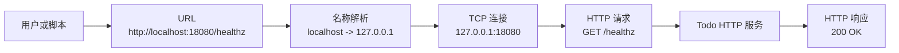
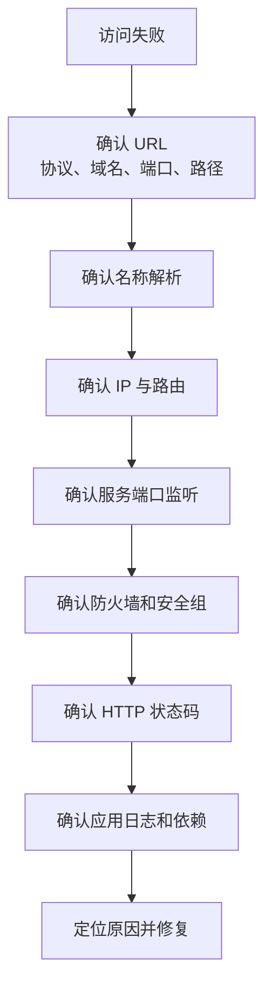
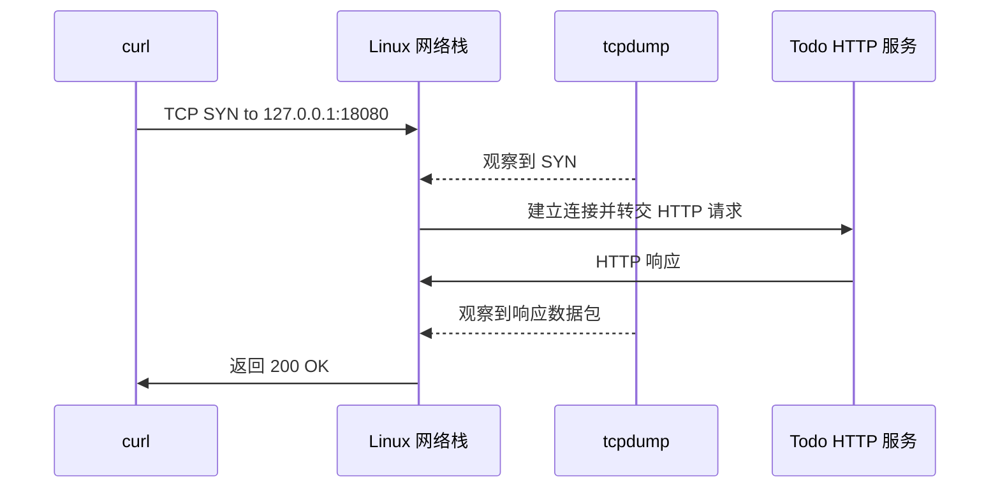

# 第 4 篇：Linux 网络基础与排障

第 3 篇已经把 `todo-process-demo` 作为 Linux 服务运行起来。本篇继续追问一个更贴近真实工作的主题：服务运行了，为什么用户还是访问不到？

后端服务、Docker 端口映射、Kubernetes Service、Ingress、Gateway API，本质上都离不开同一条访问链路：客户端把域名解析成 IP，连接目标端口，发送 HTTP 请求，服务端返回状态码和响应体。链路中的任何一层出错，现象都可能只是“访问失败”。

本篇对应 6 个章节主题：

- 4.1 TCP/IP、端口、DNS 基础
- 4.2 HTTP 协议结构化讲解（请求/响应/方法/状态码/Header/Body）
- 4.3 `ip`、`ss`、`netstat`、`ping` 使用
- 4.4 `curl`、`wget`、`dig`、`nslookup` 排查访问问题
- 4.5 防火墙、监听地址与端口冲突
- 4.6 tcpdump 抓包入门

本篇特色项目是：**编写并排查一个本地 Todo HTTP 服务访问链路，用 `curl` 构造请求、用 `tcpdump` 观察数据包**。

你会在 `cloud-native-todo-platform` 仓库中创建 `todo-network-demo`，让它监听 `127.0.0.1:18080`，再用 `curl`、`ss`、`dig`、`getent`、`tcpdump` 等工具逐层验证：名字是否解析、端口是否监听、HTTP 是否成功、请求是否真的经过网卡。

## 1. 本章学习目标

学完本篇后，你应该能从访问链路角度排查一个后端服务为什么访问失败，并能把这套思路迁移到后续 Docker、Kubernetes Service、Ingress 和生产故障排查中。

### 1.1 知识目标

- 能解释 TCP/IP、IP 地址、端口、DNS、HTTP 在一次服务访问中的关系。
- 能区分 `127.0.0.1`、`0.0.0.0`、内网 IP、公网 IP、域名和端口的含义。
- 能描述 HTTP 请求行、Header、Body、状态码和响应体分别承载什么信息。
- 能解释 `Connection refused`、`Connection timed out`、`Could not resolve host` 的差异。
- 能说明 `ping`、`curl`、`ss`、`dig`、`tcpdump` 各自适合排查哪一层问题。

### 1.2 技能目标

- 能使用 `ip addr`、`ip route` 查看 Linux 主机网络地址和路由。
- 能使用 `ss`、`netstat`、`lsof` 判断服务是否监听端口。
- 能使用 `curl`、`wget` 验证 HTTP 状态码、响应头和响应体。
- 能使用 `dig`、`nslookup`、`getent hosts` 排查 DNS 与系统解析问题。
- 能使用 `tcpdump` 抓取本机 HTTP 请求，并解释抓包输出中的源地址、目标地址和端口。
- 能完成 Todo HTTP 服务访问链路小项目，并输出一份排障报告。

本篇结束时，你至少应该能独立完成下面这组任务：

```bash
ip -br addr
ip route
ss -lntp
curl -i http://127.0.0.1:18080/healthz
curl -i http://localhost:18080/todos
getent hosts localhost
dig example.com
sudo tcpdump -i lo -nn 'tcp port 18080' -c 6
```

这些命令是后端开发、DevOps、SRE 和 Kubernetes 排障每天都会用到的网络基本功。

## 2. 本章工作场景与真实案例

### 2.1 技术痛点

网络问题最麻烦的地方在于：错误现象看起来很像，根因却可能完全不同。

- 浏览器访问失败，可能是服务没启动、端口错了、路径错了，或者浏览器走了代理。
- `curl` 返回 `Connection refused`，通常是目标端口没有进程监听。
- `curl` 返回 `Connection timed out`，可能是防火墙、安全组、路由或网络 ACL 丢包。
- 域名访问失败，但 IP 访问成功，可能是 DNS 记录、`/etc/hosts` 或系统解析顺序问题。
- Docker 容器里服务正常，宿主机访问失败，可能是端口映射或监听地址错误。
- Kubernetes 中 Pod 正常，但 Service 或 Ingress 失败，本质上仍然要检查 DNS、端口、Endpoints、HTTP 状态码和应用日志。

如果不会把“访问不了”拆成 DNS、路由、监听、协议、应用五层问题，排障时就会反复猜测。

### 2.2 团队协作场景

真实团队中的网络问题通常需要多角色协作：

- 后端开发负责说明服务监听地址、端口、健康检查路径、HTTP 状态码和错误响应。
- DevOps 负责服务器防火墙、Docker 端口映射、Kubernetes Service / Ingress 配置。
- 测试同学负责提供失败 URL、请求方法、请求参数、失败时间和复现环境。
- SRE 负责从 DNS、负载均衡、网关、主机、Pod、应用日志逐层定位。
- 安全团队负责审查公网暴露端口、TLS、认证、访问来源和抓包数据的敏感信息。

本篇训练的不是“记住几个命令”，而是建立一套能和团队沟通的排障语言：请求从哪里来，解析到哪里，连到哪个端口，返回了什么状态码，包有没有到达服务端。

### 2.3 课程项目关联

本篇产出会被后续多章复用：

- 第 6 篇会把网络检查命令沉淀为 Shell 自动化脚本。
- 第 9 到第 14 篇会在 Todo API 中继续使用 `/healthz`、`/readyz`、HTTP 状态码和 `curl` 验证。
- 第 15 到第 17 篇会把本机端口监听扩展到 Docker 端口映射和 Compose 服务访问。
- 第 20 到第 25 篇会把访问链路扩展到 Kubernetes Pod、Service、Ingress、Gateway API、CoreDNS 和 NetworkPolicy。
- 第 33 篇生产排障会继续使用本篇的 DNS、端口、HTTP、抓包和排障记录方法。

本篇真实案例是：

> 团队把 Todo 服务启动在本地 Linux 环境中，健康检查路径是 `/healthz`，Todo 查询路径是 `/todos`。你需要验证这个服务是否监听正确端口，HTTP 是否成功，DNS 是否按预期解析，并用抓包证明请求确实经过本机回环网卡。

## 3. 核心概念

### 3.1 一次 HTTP 请求经过哪些层

当你执行：

```bash
curl http://localhost:18080/healthz
```

系统至少会经历这些步骤：



只要其中一层失败，用户看到的都可能是“访问不了”。排障时要把这个大问题拆小：域名是否解析、IP 是否可达、端口是否监听、HTTP 是否返回、业务是否正常。

### 3.2 IP 地址与监听地址

IP 地址用于定位网络中的主机或接口。

| 地址 | 含义 | 常见用途 |
|---|---|---|
| `127.0.0.1` | IPv4 回环地址，只能本机访问 | 本地开发、健康检查 |
| `::1` | IPv6 回环地址，只能本机访问 | IPv6 本地访问 |
| `0.0.0.0` | 监听本机所有 IPv4 地址（所有网络接口） | 服务对外提供访问 |
| `192.168.x.x` | 常见内网地址 | 局域网或虚拟网络 |
| `10.x.x.x` | 常见内网地址 | 云服务器、容器、Kubernetes 集群 |
| 公网 IP | Internet 可路由地址 | 对外服务入口 |

监听地址决定服务接受哪些来源的连接。如果服务监听 `127.0.0.1:18080`，通常只有本机能访问。如果服务监听 `0.0.0.0:18080`，表示监听本机所有 IPv4 地址（所有网络接口）；只要防火墙、安全组和路由允许，其他机器也可能访问。

不要随意监听 `0.0.0.0`。它很方便，但也更容易把开发服务暴露到局域网或公网。生产环境必须配合认证、TLS、防火墙、安全组和最小暴露原则。

### 3.3 端口是服务入口

一台机器可以运行很多进程。端口用于区分同一个 IP 上的不同服务。

| 服务 | 常见端口 | 协议 |
|---|---:|---|
| HTTP | 80 | TCP |
| HTTPS | 443 | TCP |
| SSH | 22 | TCP |
| PostgreSQL | 5432 | TCP |
| Redis | 6379 | TCP |
| Kubernetes API Server | 6443 | TCP |
| 本篇 Todo Demo | 18080 | TCP |

同一个 IP、同一种协议、同一个端口，通常只能被一个进程监听。如果两个进程都想监听 `127.0.0.1:18080`，第二个进程会失败，并出现类似：

```text
listen tcp 127.0.0.1:18080: bind: address already in use
```

### 3.4 DNS 是名字到地址的解析

人更容易记住域名，机器需要 IP 地址。DNS 负责把域名解析为 IP。

```bash
dig example.com
```

输出可能包含一个或多个 A / AAAA 记录。具体 IP 会随 DNS、地区和时间变化，下面只表示输出形态：

```text
example.com.  300  IN  A  <IP address>
```

但应用程序的“系统解析”不一定只走 DNS。Linux 可能先查 `/etc/hosts`，再查 DNS。比如 `localhost` 通常来自 `/etc/hosts`，而不是公网 DNS。

Linux 中可以用：

```bash
getent hosts localhost
```

查看系统最终如何解析一个名字。

### 3.5 HTTP 请求与响应

HTTP 请求由方法、路径、Header 和可选 Body 组成。响应由状态码、Header 和 Body 组成。

```text
GET /healthz HTTP/1.1
Host: 127.0.0.1:18080
User-Agent: curl/8.x
```

常见状态码：

| 状态码 | 含义 | 排障方向 |
|---|---|---|
| `200` | 请求成功 | 服务正常响应 |
| `301` / `302` | 重定向 | 检查 URL 和网关规则 |
| `400` | 请求格式错误 | 检查参数和请求体 |
| `401` / `403` | 未认证或无权限 | 检查 Token、Cookie、权限 |
| `404` | 路径不存在 | 检查 URL、路由、Ingress path |
| `500` | 服务内部错误 | 看应用日志和依赖状态 |
| `502` | 网关无法访问上游 | 检查后端服务、端口、Service |
| `503` | 服务不可用 | 检查就绪状态、容量、依赖 |
| `504` | 网关超时 | 检查慢请求、网络、上游超时 |

TCP 连接成功只代表你连上了端口，不代表业务一定正常。HTTP 状态码才是应用层结果。

### 3.6 网络排查工具地图

| 能力 | 常用工具 | 解决的问题 |
|---|---|---|
| 看地址 | `ip addr`、`ifconfig` | 这台机器有哪些 IP |
| 看路由 | `ip route`、`route` | 请求默认从哪里出去 |
| 看监听 | `ss`、`netstat`、`lsof` | 服务是否真的占用了端口 |
| 测连通 | `ping` | 目标是否响应 ICMP |
| 测 HTTP | `curl`、`wget` | 接口是否返回预期内容 |
| 查 DNS | `dig`、`nslookup`、`getent hosts` | 域名解析到哪里 |
| 看防火墙 | `ufw`、`firewall-cmd`、`iptables`、`nft` | 端口是否被拦截 |
| 抓包 | `tcpdump` | 请求是否真的到达机器 |

不要把这些命令背成孤立清单。它们应该串成一条访问链路。

## 4. 原理深入

### 4.1 访问链路排障模型

后端服务访问问题可以按固定顺序排查：



真实排障中不要一上来就猜。先把链路拆开，再逐层排除。

### 4.2 `Connection refused` 与 `Connection timed out`

`Connection refused` 通常表示目标主机可达，但目标端口没有进程监听，或者被系统明确拒绝。

```text
curl: (7) Failed to connect to 127.0.0.1 port 18080: Connection refused
```

优先检查：

```bash
ss -lntp | grep 18080
```

`Connection timed out` 通常表示请求发出去了，但长时间没有响应。原因可能是防火墙丢弃、路由不通、云安全组未放行、目标机器不可达。

```text
curl: (28) Failed to connect to 10.0.0.10 port 18080 after 10000 ms: Timeout was reached
```

优先检查：

```bash
ping 10.0.0.10
sudo tcpdump -i any -nn 'host 10.0.0.10 and tcp port 18080'
```

### 4.3 `ping` 不能证明 HTTP 服务正常

`ping` 使用 ICMP，不使用 TCP，也不访问 HTTP 路径。

- `ping` 成功，不代表 80、443、18080 端口可访问。
- `ping` 失败，也不一定代表 HTTP 不可访问，因为有些服务器禁用了 ICMP。

判断 HTTP 服务是否可用，应使用：

```bash
curl -i http://127.0.0.1:18080/healthz
```

### 4.4 `ss` 比 `netstat` 更适合现代 Linux

`netstat` 来自较老的 `net-tools`，很多新系统默认不再安装。现代 Linux 更推荐使用 `ss`，它来自 `iproute2`，速度更快，也更贴近内核 socket 信息。

| 目的 | 推荐命令 | 兼容命令 |
|---|---|---|
| 查看监听 TCP 端口 | `ss -lntp` | `netstat -lntp` |
| 查看所有 TCP 连接 | `ss -antp` | `netstat -antp` |
| 查看 UDP 监听 | `ss -lnup` | `netstat -lnup` |
| 按端口过滤 | `ss -lntp 'sport = :18080'` | `netstat -lntp | grep 18080` |

普通用户通常可以用 `ss -lnt` 查看监听端口；如果要显示进程名和 PID，往往需要 `sudo ss -lntp`。

### 4.5 防火墙、监听地址与端口冲突

防火墙负责决定哪些流量可以进入或离开主机。云环境里还会叠加安全组、NACL、负载均衡规则；Kubernetes 阶段还会遇到 NetworkPolicy。排障时不要只看应用日志，也要确认流量有没有被中间规则拦截。

在本机实验中，最常见的问题不是复杂防火墙，而是监听地址和端口冲突：

| 现象 | 常见原因 | 优先检查 |
|---|---|---|
| 本机访问成功，远程访问失败 | 服务只监听 `127.0.0.1` | `ss -lntp 'sport = :18080'` |
| 第二个服务启动失败 | 端口已被占用 | `sudo ss -lntp 'sport = :18080'` |
| 访问一直超时 | 防火墙、安全组或路由丢包 | `ip route`、防火墙规则、`tcpdump` |
| 访问立刻被拒绝 | 目标端口没有监听 | `ss -lnt`、服务日志 |

开发环境为了安全，默认优先监听 `127.0.0.1`。只有明确需要远程访问时，才考虑监听 `0.0.0.0` 或具体内网 IP，并同步检查认证、TLS、防火墙和安全组。

端口冲突可以用固定顺序处理：先确认端口被谁占用，再判断是否属于本实验，最后决定停止旧进程还是换端口。

```bash
sudo ss -lntp 'sport = :18080'
ps -fp <PID>
```

不要看到端口冲突就直接 `kill -9`。先确认进程用途，优先用正常退出、`systemctl stop` 或 `Ctrl+C` 停止服务。

### 4.6 tcpdump 如何帮助定位问题

`tcpdump` 可以从网卡层面观察数据包。它回答的问题是：“请求有没有到达这台机器，响应有没有发出去。”



Linux 本机回环请求通常抓 `lo` 网卡：

```bash
sudo tcpdump -i lo -nn 'tcp port 18080' -c 6
```

如果不知道包会经过哪张网卡，可以先用 `-i any`：

```bash
sudo tcpdump -i any -nn 'tcp port 18080' -c 6
```

### 4.7 从本机网络映射到 Docker 和 Kubernetes

本篇虽然还没有正式进入 Docker 和 Kubernetes，但端口、监听地址和 HTTP 检查会直接迁移到后面的容器与集群排障。

| 当前阶段 | 访问入口 | 后续对应概念 | 排障重点 |
|---|---|---|---|
| 本机进程 | `127.0.0.1:18080` | Linux 进程监听端口 | `ss -lntp` 是否有 `LISTEN` |
| Docker 容器 | `localhost:18080 -> container:8080` | `docker run -p 18080:8080` | 宿主机端口映射和容器内监听地址 |
| Kubernetes Pod | `PodIP:8080` | `containerPort` | 容器内进程是否监听正确端口 |
| Kubernetes Service | `ServiceIP:80 -> PodIP:8080` | `port`、`targetPort`、Endpoints | Service selector 和 Endpoints 是否正确 |
| Kubernetes Ingress | `https://todo.example.com` | Ingress rule、Service backend | 域名、路径、证书、上游 Service |

同一个 Todo API 在不同阶段的访问链路会变长，但排障顺序不变。

进入 Docker 阶段后要特别注意：如果容器内进程只监听容器自己的 `127.0.0.1`，即使宿主机写了 `-p 18080:8080`，外部也可能无法访问。容器内服务通常应监听 `0.0.0.0:8080` 或具体容器网卡地址，再由宿主机端口映射转发流量。

## 5. 手把手实验

### 5.1 实验目标

本实验会创建一个本地 Todo HTTP Demo 服务，并完成端口监听、HTTP 访问、DNS 解析、端口冲突和 tcpdump 抓包验证。

说明：本篇不编写 Kubernetes YAML。这里训练的是 Linux 网络与 HTTP 排障能力；后续 Kubernetes 阶段会把这些能力迁移到 Service、Ingress、Gateway API、CoreDNS 和 NetworkPolicy。

第 3 篇已经演示过 systemd 后台托管服务。本篇为了方便观察前台日志、制造端口冲突和配合三终端抓包，故意直接以前台进程运行服务。

### 5.2 实验环境

建议在第 1 篇创建的仓库中执行：

```bash
cd ~/workspace/cloud-native-todo-platform
```

主实验环境统一使用 Ubuntu 24.04。后文命令以 Ubuntu 24.04 的 GNU/Linux 工具链为准。

| 项目 | 要求 |
|---|---|
| 操作系统 | Ubuntu 24.04 LTS |
| Go | Go 1.26.x |
| Shell | Bash 5.x |
| 必需命令 | `go`、`curl`、`ss`、`ip`、`getent` |
| 推荐命令 | `wget`、`dig`、`nslookup`、`lsof`、`tcpdump` |

安装网络排障工具：

```bash
sudo apt update
sudo apt install -y curl wget dnsutils iproute2 net-tools lsof tcpdump traceroute
```

确认 Go 在当前终端可用：

```bash
go version
```

预期输出类似：

```text
go version go1.26.2 linux/amd64
```

### 5.3 文件目录结构

本实验会创建：

```text
cloud-native-todo-platform/
├── api/
│   └── cmd/
│       └── todo-network-demo/
│           └── main.go
├── bin/
│   └── todo-network-demo
├── scripts/
│   └── check-network-demo.sh
├── Makefile.network
└── network-debug-report.txt
```

`network-debug-report.txt` 是实验过程中生成的排障报告，不一定需要提交到 Git。

### 5.4 完整代码和配置

Go HTTP 服务 `api/cmd/todo-network-demo/main.go`：

本篇的日志中间件会包装整个 `mux`，而不是像第 3 篇那样逐个包装 handler。这样即使请求匹配不到业务路由并返回 `404`，也能被统一记录。

```go title="api/cmd/todo-network-demo/main.go"
package main

import (
	"context"
	"encoding/json"
	"log"
	"net"
	"net/http"
	"os"
	"os/signal"
	"sort"
	"strings"
	"syscall"
	"time"
)

type todo struct {
	ID        int    `json:"id"`
	Title     string `json:"title"`
	Completed bool   `json:"completed"`
}

var todos = []todo{
	{ID: 1, Title: "Learn Linux networking", Completed: false},
	{ID: 2, Title: "Trace HTTP requests with curl", Completed: false},
	{ID: 3, Title: "Capture packets with tcpdump", Completed: false},
}

func main() {
	addr := getenv("TODO_ADDR", "127.0.0.1:18080")
	ready := strings.EqualFold(getenv("TODO_READY", "true"), "true")

	mux := http.NewServeMux()
	mux.HandleFunc("/", indexHandler)
	mux.HandleFunc("/healthz", healthzHandler)
	mux.HandleFunc("/readyz", readyzHandler(ready))
	mux.HandleFunc("/todos", todosHandler)
	mux.HandleFunc("/debug/request", debugRequestHandler)

	server := &http.Server{
		Addr:              addr,
		Handler:           accessLog(mux),
		ReadHeaderTimeout: 5 * time.Second,
	}

	listener, err := net.Listen("tcp", addr)
	if err != nil {
		log.Fatalf("listen failed addr=%s error=%v", addr, err)
	}

	errCh := make(chan error, 1)
	go func() {
		log.Printf("todo-network-demo listening addr=%s ready=%v pid=%d", addr, ready, os.Getpid())
		errCh <- server.Serve(listener)
	}()

	stopCh := make(chan os.Signal, 1)
	signal.Notify(stopCh, syscall.SIGINT, syscall.SIGTERM)

	select {
	case sig := <-stopCh:
		log.Printf("received signal=%s, shutting down", sig)
		ctx, cancel := context.WithTimeout(context.Background(), 5*time.Second)
		defer cancel()
		if err := server.Shutdown(ctx); err != nil {
			log.Printf("shutdown failed: %v", err)
			os.Exit(1)
		}
		log.Println("shutdown complete")
	case err := <-errCh:
		if err != nil && err != http.ErrServerClosed {
			log.Printf("server failed: %v", err)
			os.Exit(1)
		}
	}
}

func indexHandler(w http.ResponseWriter, r *http.Request) {
	if r.URL.Path != "/" {
		writeJSON(w, http.StatusNotFound, map[string]any{
			"error": "not found",
			"path":  r.URL.Path,
		})
		return
	}

	writeJSON(w, http.StatusOK, map[string]any{
		"service":   "todo-network-demo",
		"endpoints": []string{"/healthz", "/readyz", "/todos", "/debug/request"},
	})
}

func healthzHandler(w http.ResponseWriter, _ *http.Request) {
	writeJSON(w, http.StatusOK, map[string]any{
		"status":  "ok",
		"service": "todo-network-demo",
		"time":    time.Now().Format(time.RFC3339),
	})
}

func readyzHandler(ready bool) http.HandlerFunc {
	return func(w http.ResponseWriter, _ *http.Request) {
		if !ready {
			writeJSON(w, http.StatusServiceUnavailable, map[string]any{
				"status": "not-ready",
				"reason": "TODO_READY=false",
			})
			return
		}
		writeJSON(w, http.StatusOK, map[string]any{"status": "ready"})
	}
}

func todosHandler(w http.ResponseWriter, r *http.Request) {
	switch r.Method {
	case http.MethodGet:
		writeJSON(w, http.StatusOK, map[string]any{"items": todos})
	case http.MethodPost:
		writeJSON(w, http.StatusCreated, map[string]any{"message": "created in demo only"})
	default:
		w.Header().Set("Allow", "GET, POST")
		writeJSON(w, http.StatusMethodNotAllowed, map[string]any{"error": "method not allowed"})
	}
}

func debugRequestHandler(w http.ResponseWriter, r *http.Request) {
	headers := make(map[string]string)
	keys := make([]string, 0, len(r.Header))
	for key := range r.Header {
		keys = append(keys, key)
	}
	sort.Strings(keys)
	for _, key := range keys {
		headers[key] = strings.Join(r.Header.Values(key), ",")
	}

	writeJSON(w, http.StatusOK, map[string]any{
		"method":      r.Method,
		"path":        r.URL.Path,
		"query":       r.URL.RawQuery,
		"host":        r.Host,
		"remote_addr": r.RemoteAddr,
		"headers":     headers,
	})
}

func accessLog(next http.Handler) http.Handler {
	return http.HandlerFunc(func(w http.ResponseWriter, r *http.Request) {
		start := time.Now()
		next.ServeHTTP(w, r)
		log.Printf("method=%s path=%s remote=%s duration=%s", r.Method, r.URL.Path, r.RemoteAddr, time.Since(start))
	})
}

func getenv(key, fallback string) string {
	value := os.Getenv(key)
	if value == "" {
		return fallback
	}
	return value
}

func writeJSON(w http.ResponseWriter, status int, v any) {
	w.Header().Set("Content-Type", "application/json")
	w.WriteHeader(status)
	if err := json.NewEncoder(w).Encode(v); err != nil {
		log.Printf("write response failed: %v", err)
	}
}
```

检查脚本 `scripts/check-network-demo.sh`：

```bash title="scripts/check-network-demo.sh"
#!/usr/bin/env bash
set -Eeuo pipefail

URL="${TODO_NETWORK_URL:-http://127.0.0.1:18080}"
PORT="${TODO_NETWORK_PORT:-18080}"
FAILURES=0

ok() {
  printf '[OK] %s\n' "$1"
}

fail() {
  printf '[FAIL] %s\n' "$1"
  FAILURES=$((FAILURES + 1))
}

require_command() {
  if command -v "$1" >/dev/null 2>&1; then
    ok "command exists: $1"
  else
    fail "command missing: $1"
  fi
}

main() {
  require_command curl
  require_command ss
  require_command ip
  require_command getent

  if curl -fsS "$URL/healthz" >/dev/null; then
    ok "health endpoint ok: $URL/healthz"
  else
    fail "health endpoint failed: $URL/healthz"
  fi

  if curl -fsS "$URL/todos" >/dev/null; then
    ok "todos endpoint ok: $URL/todos"
  else
    fail "todos endpoint failed: $URL/todos"
  fi

  # Do not use -p here: showing process names often requires sudo.
  if ss -lnt | grep -q ":${PORT} "; then
    ok "port listening: $PORT"
  else
    fail "port not listening: $PORT"
  fi

  if getent hosts localhost >/dev/null; then
    ok "localhost can be resolved by system resolver"
  else
    fail "localhost cannot be resolved by system resolver"
  fi

  if ip route >/dev/null; then
    ok "ip route command works"
  else
    fail "ip route command failed"
  fi

  if [[ "$FAILURES" -gt 0 ]]; then
    printf '\nNetwork demo check failed: %s issue(s).\n' "$FAILURES"
    exit 1
  fi

  printf '\nNetwork demo check completed.\n'
}

main "$@"
```

Makefile `Makefile.network`：

```makefile title="Makefile.network"
TODO_ADDR ?= 127.0.0.1:18080

.PHONY: network-build network-run network-check network-listen network-dns network-report network-clean

network-build:
	gofmt -w api/cmd/todo-network-demo/main.go
	go build -o bin/todo-network-demo ./api/cmd/todo-network-demo

network-run: network-build
	TODO_ADDR=$(TODO_ADDR) ./bin/todo-network-demo

network-check:
	./scripts/check-network-demo.sh

network-listen:
	ss -lnt 'sport = :18080' || true
	sudo ss -lntp 'sport = :18080' || true

network-dns:
	getent hosts localhost || true
	dig +short example.com || true
	nslookup localhost || true

network-report:
	{ \
	  echo "## time"; date; echo; \
	  echo "## ip"; ip -br addr; echo; \
	  echo "## route"; ip route; echo; \
	  echo "## listen"; ss -lntp 'sport = :18080' || true; echo; \
	  echo "## dns"; getent hosts localhost || true; dig +short example.com || true; echo; \
	  echo "## http"; curl -i --max-time 3 http://127.0.0.1:18080/healthz || true; \
	} | tee network-debug-report.txt

network-clean:
	rm -f /tmp/todo-network-demo.pcap network-debug-report.txt
```

`network-run` 会在前台运行服务并阻塞当前终端，适合单独调试。三终端抓包实验中，直接执行 `./bin/todo-network-demo` 更容易看清每个终端的角色。

### 5.5 执行命令

先确认你在课程仓库根目录：

```bash
pwd
ls
```

预期能看到 `README.md`、`docs/` 等文件或目录。

如果仓库还没有 Go module，先初始化：

```bash
test -f go.mod || go mod init github.com/your-name/cloud-native-todo-platform
```

请把 `your-name` 替换为你的 GitHub 用户名或组织名；如果只是本地实验，保留这个示例模块名也不影响本篇编译。

创建目录：

```bash
mkdir -p api/cmd/todo-network-demo bin scripts
```

将 5.4 中的 Go 代码、检查脚本和 Makefile 分别保存到对应文件，然后赋予脚本执行权限：

```bash
chmod +x scripts/check-network-demo.sh
```

格式化并编译服务：

```bash
gofmt -w api/cmd/todo-network-demo/main.go
go mod tidy
go build -o bin/todo-network-demo ./api/cmd/todo-network-demo
```

在第一个终端启动服务：

```bash
TODO_ADDR=127.0.0.1:18080 ./bin/todo-network-demo
```

保持第一个终端运行，不要关闭。另开第二个终端执行访问检查：

```bash
curl -i http://127.0.0.1:18080/healthz
curl -i http://127.0.0.1:18080/readyz
curl -i http://localhost:18080/todos
curl -i -H 'X-Request-ID: demo-001' 'http://127.0.0.1:18080/debug/request?from=course'
curl -i http://127.0.0.1:18080/not-found
```

默认 `TODO_READY=true`，所以 `/readyz` 会返回 `200`。后面的练习会让你用 `TODO_READY=false` 启动服务，观察就绪检查变成 `503`。

查看地址、路由和监听端口：

```bash
ip -br addr
ip route
ss -lnt 'sport = :18080'
sudo ss -lntp 'sport = :18080'
```

`ss -lnt` 不显示进程名，通常不需要 root；`sudo ss -lntp` 会显示进程名和 PID，更适合人工排障。

检查 DNS 和系统解析：

```bash
getent hosts localhost
dig +short example.com
nslookup localhost
```

如果课堂网络无法访问公网 DNS，可以先完成 `getent hosts localhost` 和 `nslookup localhost`。`example.com` 用来观察真实 DNS 查询，不影响本地 Todo 服务实验主线。

运行检查脚本：

```bash
./scripts/check-network-demo.sh
```

制造端口冲突。保持第一个终端中的服务运行，不要关闭；然后另开终端再次启动同端口服务：

```bash
TODO_ADDR=127.0.0.1:18080 ./bin/todo-network-demo
```

预期第二个进程会失败，提示 `address already in use` 或 `bind: address already in use`。这说明端口已经被第一个服务占用。

观察 `127.0.0.1` 与 `0.0.0.0` 的差异。先按 `Ctrl+C` 停止第一个终端中的服务，再监听所有 IPv4 网卡：

```bash
TODO_ADDR=0.0.0.0:18080 ./bin/todo-network-demo
```

另一个终端查看监听地址：

```bash
ss -lnt 'sport = :18080'
```

完成观察后按 `Ctrl+C` 停止服务，再用 `127.0.0.1` 重新启动，以便后续实验保持一致。

使用 `tcpdump` 抓取本机 HTTP 请求。第一个终端运行服务后，在第二个终端启动抓包：

```bash
sudo tcpdump -i lo -nn 'tcp port 18080' -c 6
```

第三个终端发起请求：

```bash
curl -i http://127.0.0.1:18080/healthz
```

如果你的环境中 `lo` 抓不到包，可以改用：

```bash
sudo tcpdump -i any -nn 'tcp port 18080' -c 6
```

生成排障报告：

```bash
make -f Makefile.network network-report
```

### 5.6 预期输出

健康检查预期类似：

```http
HTTP/1.1 200 OK
Content-Type: application/json
Date: Wed, 27 May 2026 06:00:00 GMT
Content-Length: <length>

{"service":"todo-network-demo","status":"ok","time":"2026-05-27T14:00:00+08:00"}
```

上面的第一行是状态行，中间几行是响应头，空行之后是响应体。使用 `curl -i` 的目的就是把这三部分一起显示出来。

就绪检查预期类似：

```http
HTTP/1.1 200 OK
Content-Type: application/json

{"status":"ready"}
```

Todo 列表预期类似：

```json
{"items":[{"id":1,"title":"Learn Linux networking","completed":false},{"id":2,"title":"Trace HTTP requests with curl","completed":false},{"id":3,"title":"Capture packets with tcpdump","completed":false}]}
```

未知路径预期类似：

```http
HTTP/1.1 404 Not Found
Content-Type: application/json

{"error":"not found","path":"/not-found"}
```

端口监听预期类似：

```text
LISTEN 0 4096 127.0.0.1:18080 0.0.0.0:*
```

端口冲突预期类似：

```text
listen failed addr=127.0.0.1:18080 error=listen tcp 127.0.0.1:18080: bind: address already in use
```

tcpdump 预期能看到类似：

```text
IP 127.0.0.1.54321 > 127.0.0.1.18080: Flags [S], seq ...
IP 127.0.0.1.18080 > 127.0.0.1.54321: Flags [S.], seq ...
```

检查脚本预期输出：

```text
[OK] command exists: curl
[OK] command exists: ss
[OK] command exists: ip
[OK] command exists: getent
[OK] health endpoint ok: http://127.0.0.1:18080/healthz
[OK] todos endpoint ok: http://127.0.0.1:18080/todos
[OK] port listening: 18080
[OK] localhost can be resolved by system resolver
[OK] ip route command works

Network demo check completed.
```

### 5.7 验证方法

验证前请确认服务正在另一个终端中运行：

```bash
TODO_ADDR=127.0.0.1:18080 ./bin/todo-network-demo
```

然后在当前终端集中执行下面命令。以下命令假设服务已经在另一个终端中运行；`go build` 只验证代码可编译，不影响已经运行的服务进程。

```bash
go build -o bin/todo-network-demo ./api/cmd/todo-network-demo
curl -fsS http://127.0.0.1:18080/healthz
curl -fsS http://127.0.0.1:18080/readyz
curl -fsS http://127.0.0.1:18080/todos
test "$(curl -s -o /dev/null -w '%{http_code}' http://127.0.0.1:18080/not-found)" = "404"
ss -lnt 'sport = :18080'
getent hosts localhost
./scripts/check-network-demo.sh
make -f Makefile.network network-report
test -f network-debug-report.txt
```

判断标准：

- `go build` 能成功生成 `bin/todo-network-demo`。
- `/healthz` 返回 `status=ok`。
- `/readyz` 在默认配置下返回 `status=ready`。
- `/todos` 返回 3 条示例 Todo。
- `/not-found` 返回 HTTP `404`。
- `ss` 能看到 `127.0.0.1:18080` 或 `0.0.0.0:18080` 处于 `LISTEN`。
- `getent hosts localhost` 能解析到回环地址。
- 检查脚本输出 `Network demo check completed.`。
- `network-debug-report.txt` 包含 listen、healthz、dns 等排障信息。

### 5.8 清理步骤

停止服务：

```text
在运行服务的终端按 Ctrl+C
```

确认没有残留进程：

```bash
pgrep -af todo-network-demo || true
```

如果还有残留进程，先确认 PID 属于本实验，再停止：

```bash
ps -fp <PID>
kill <PID>
```

不要直接使用模糊的 `pkill -f todo`，避免误杀后续章节或其他项目中的 Todo 服务。

清理临时文件：

```bash
rm -f /tmp/todo-network-demo.pcap network-debug-report.txt
```

本篇创建的源码建议保留：

```text
api/cmd/todo-network-demo/main.go
scripts/check-network-demo.sh
Makefile.network
```

`bin/todo-network-demo` 是编译产物，可以按需删除：

```bash
rm -f bin/todo-network-demo
```

预计耗时：75 分钟（动手操作约 50 分钟）。

## 6. 常见错误与排障

### 错误 1：`Connection refused`

- **现象**：

  ```text
  curl: (7) Failed to connect to 127.0.0.1 port 18080: Connection refused
  ```

- **原因**：目标主机可达，但目标端口没有进程监听，或者服务刚刚退出。

- **排查**：

  ```bash
  ss -lnt 'sport = :18080'
  pgrep -af todo-network-demo || true
  ```

  如果没有 `LISTEN`，说明端口没有服务在监听。

- **修复**：

  ```bash
  TODO_ADDR=127.0.0.1:18080 ./bin/todo-network-demo
  ```

- **预防**：访问前先用 `ss` 或检查脚本确认端口监听状态。

### 错误 2：`Connection timed out`

- **现象**：

  ```text
  curl: (28) Failed to connect to 10.0.0.10 port 18080 after 10000 ms: Timeout was reached
  ```

- **原因**：请求包可能被防火墙、安全组、路由或网络 ACL 丢弃。

- **排查**：

  ```bash
  ip route
  ping -c 3 10.0.0.10
  sudo tcpdump -i any -nn 'host 10.0.0.10 and tcp port 18080'
  ```

  如果抓不到包，可能请求没有发到当前机器；如果只有请求没有响应，可能被服务端或中间网络丢弃。

- **修复**：检查防火墙、安全组、路由、服务监听地址和目标机器状态。

- **预防**：生产变更中维护清晰的访问链路图和端口放行规则。

### 错误 3：`Could not resolve host`

- **现象**：

  ```text
  curl: (6) Could not resolve host: todo.local
  ```

- **原因**：域名没有 DNS 记录，或者系统解析配置不正确。

- **排查**：

  ```bash
  getent hosts todo.local
  dig todo.local
  nslookup todo.local
  grep todo.local /etc/hosts || true
  ```

  `dig` 查 DNS，`getent hosts` 更接近应用程序看到的系统解析结果。

- **修复**：补充正确 DNS 记录，或在个人实验环境中临时添加 `/etc/hosts`。生产环境不要随意依赖手工 hosts。

- **预防**：上线前确认域名记录、TTL、解析环境和变更窗口。

### 错误 4：本机能访问，远程不能访问

- **现象**：

  ```text
  # 服务器本机成功
  curl http://127.0.0.1:18080/healthz

  # 其他机器失败
  curl http://10.0.0.12:18080/healthz
  ```

- **原因**：服务只监听 `127.0.0.1`，或者防火墙、安全组没有放行。

- **排查**：

  ```bash
  ss -lntp 'sport = :18080'
  ip -br addr
  sudo tcpdump -i any -nn 'tcp port 18080'
  ```

  如果监听地址是 `127.0.0.1:18080`，远程机器无法通过内网 IP 访问。

- **修复**：确认安全策略后，改为监听 `0.0.0.0:18080` 或具体内网 IP，并配置防火墙和安全组。

- **预防**：开发环境默认只监听本机；需要远程访问时必须经过明确授权和安全配置。

### 错误 5：`tcpdump` 没有输出

- **现象**：

  ```text
  sudo tcpdump -i lo -nn 'tcp port 18080' -c 6
  # 长时间没有任何包
  ```

- **原因**：抓错网卡、过滤条件不匹配、请求没有发出，或服务运行在不同网络命名空间。

- **排查**：

  ```bash
  ip -br addr
  sudo tcpdump -i any -nn 'tcp port 18080' -c 6
  curl -i http://127.0.0.1:18080/healthz
  ```

  `-i any` 可以先粗略确认是否有包，再缩小到具体网卡。

- **修复**：改用正确网卡，调整过滤条件，确认请求确实发出。

- **预防**：抓包前先明确目标 IP、端口、协议和请求路径。

## 7. 生产环境注意事项

1. **不要暴露不该暴露的端口。**
   开发环境可以临时监听 `0.0.0.0`，生产环境必须明确哪些端口对公网开放、哪些只允许内网访问、哪些只允许网关或负载均衡访问。管理端口、调试端点和内部 API 不应直接暴露到公网。

2. **健康检查和就绪检查要分开。**
   `/healthz` 表示进程还活着，`/readyz` 表示服务可以接流量。Kubernetes 中两者会分别对应 livenessProbe 和 readinessProbe。如果把两者混在一起，发布、扩容、依赖故障时会出现错误流量调度。

3. **抓包要注意权限和敏感信息。**
   `tcpdump -A` 可能显示 HTTP Header、Cookie、Token、请求体等敏感信息。生产抓包要先获得授权，限制 host、port、时间窗口和包数量，抓包文件按敏感数据管理，并在问题解决后按规定删除。

4. **防火墙、安全组和 NetworkPolicy 要统一管理。**
   真实访问链路可能经过云安全组、主机防火墙、负载均衡、Ingress、Kubernetes NetworkPolicy 等多层规则。任何一层拒绝流量，都可能表现为超时或 502。建议用 Terraform、Ansible、Helm、GitOps 管理规则变更。

5. **不要只依赖 ping 作为监控。**
   `ping` 只说明 ICMP 层面的响应，不能代表 DNS、TLS、HTTP 状态码、业务依赖和响应时间都正常。生产监控应从用户真实路径出发，检查域名、证书、HTTP 状态码、延迟和关键业务接口。

## 8. 本章小项目

本章小项目：**Todo HTTP 服务访问链路排障记录**。

交付物：

- `api/cmd/todo-network-demo/main.go`
- `scripts/check-network-demo.sh`
- `Makefile.network`
- `bin/todo-network-demo`
- `network-debug-report.txt`
- 一次 `tcpdump` 抓包观察记录，可以是终端输出，也可以保存为 `/tmp/todo-network-demo.pcap`

验收命令分三个终端执行。终端一启动服务并保持运行：

```bash
make -f Makefile.network network-build
TODO_ADDR=127.0.0.1:18080 ./bin/todo-network-demo
```

终端二启动抓包并等待请求：

```bash
sudo tcpdump -i lo -nn 'tcp port 18080' -c 6
```

如果 `lo` 抓不到包，可以改为：

```bash
sudo tcpdump -i any -nn 'tcp port 18080' -c 6
```

终端三执行 HTTP 检查和报告生成：

```bash
curl -i http://127.0.0.1:18080/healthz
./scripts/check-network-demo.sh
make -f Makefile.network network-report
cat network-debug-report.txt
```

当终端三发起 `/healthz` 请求后，终端二应能看到 `127.0.0.1.<client-port> > 127.0.0.1.18080` 或类似方向的数据包。看到这个输出，说明请求确实经过了本机网络栈。

能力验收标准：

| 能力项 | 验收方式 |
|---|---|
| 地址理解 | 能解释 `127.0.0.1` 和 `0.0.0.0` 的区别 |
| 端口定位 | 能用 `ss` 找到 `18080` 监听 |
| HTTP 验证 | 能用 `curl -i` 查看状态码、Header、Body |
| DNS 排查 | 能用 `getent hosts`、`dig`、`nslookup` 对比解析结果 |
| 端口冲突 | 能制造并解释 `address already in use` |
| 抓包观察 | 能用 `tcpdump` 看到本机 HTTP 请求经过回环网卡 |
| 排障记录 | 能生成并解释 `network-debug-report.txt` |

## 9. 本章练习题

### 基础题

1. `127.0.0.1` 和 `0.0.0.0` 有什么区别？
2. 为什么 `ping` 成功不代表 HTTP 服务一定可用？
3. `Connection refused` 和 `Connection timed out` 的含义有什么不同？
4. `ss -lntp` 中的 `LISTEN` 表示什么？
5. `dig` 和 `getent hosts` 的结果为什么可能不同？

### 实操题

1. 将 Todo Demo 改为监听 `127.0.0.1:18081`，并用 `curl` 验证。当 `ss -lnt 'sport = :18081'` 能看到 `LISTEN`，说明操作成功。
2. 保持一个服务占用 `18080`，再次启动同端口服务，记录错误并找出 PID。当你能解释 `address already in use` 来自哪个进程时，说明操作成功。
3. 使用 `TODO_READY=false` 启动服务，观察 `/readyz` 返回的 HTTP 状态码。当 `curl -i` 显示 `503 Service Unavailable`，说明操作成功。

### 思考题

1. 如果服务在服务器本机访问正常，但从公司网络访问超时，你会按什么顺序排查？
2. Kubernetes 中 Pod 正常但 Service 不通时，本篇哪些命令和思路仍然适用？

## 10. 本章面试题

### 1. TCP 和 HTTP 是什么关系？

**一句话结论**：TCP 负责可靠传输字节流，HTTP 定义应用层请求和响应格式。

**展开解释**：大多数 HTTP/1.1 和 HTTP/2 请求运行在 TCP 之上。TCP 连接成功只说明目标 IP 和端口可达，不代表业务正常；HTTP 状态码、响应头和响应体才能说明应用层结果。

**深入追问**：排障时如果 TCP 连接失败，优先看 DNS、路由、端口监听、防火墙；如果 TCP 成功但 HTTP 返回 500，再看应用日志和依赖状态。

### 2. 如何判断一个 Linux 服务是否监听了端口？

**一句话结论**：用 `ss -lntp` 或 `lsof` 查看目标端口是否处于 `LISTEN`。

**展开解释**：例如 `sudo ss -lntp 'sport = :18080'`。如果看到 `LISTEN`，说明有进程监听该 TCP 端口。还要关注监听地址：`127.0.0.1` 只接受本机访问，`0.0.0.0` 表示监听所有 IPv4 网卡。

**深入追问**：在 Kubernetes 中，对应要进入 Pod 或容器中检查应用是否监听 `containerPort`，再看 Service 的 `targetPort` 是否映射正确。

### 3. `Connection refused` 和 `Connection timed out` 怎么排查？

**一句话结论**：`refused` 优先查端口监听，`timed out` 优先查网络路径和防火墙。

**展开解释**：`Connection refused` 通常表示目标主机可达但端口没有监听；`Connection timed out` 常见于包被防火墙、安全组、路由或 ACL 丢弃。前者用 `ss`、`lsof` 查端口，后者用 `ip route`、防火墙命令和 `tcpdump` 查包是否到达。

**深入追问**：在云环境中还要检查安全组、NACL、负载均衡后端健康状态；在 Kubernetes 中还要检查 NetworkPolicy、Service Endpoints 和 Ingress Controller 日志。

### 4. DNS 排查时为什么不能只看 `dig`？

**一句话结论**：`dig` 查询 DNS 服务器，应用程序通常走系统解析流程，两者可能不一致。

**展开解释**：系统解析可能先读取 `/etc/hosts`，再查询 DNS，还可能受 NSS、缓存、容器 DNS 配置影响。因此排查应用解析问题时，应同时看 `getent hosts`、`/etc/hosts`、`dig` 或 `nslookup`。

**深入追问**：在 Kubernetes 中还要检查 CoreDNS、Pod 的 `/etc/resolv.conf`、Service 名称、Namespace 和 DNS search domain。

### 5. tcpdump 在生产环境中怎么安全使用？

**一句话结论**：抓包前要授权，抓包时要限制范围，抓包文件要按敏感数据处理。

**展开解释**：生产抓包应限制 host、port、协议、包数量和时间窗口，避免全量抓包。HTTP 明文包可能包含 Token、Cookie、用户数据；即使 HTTPS 看不到正文，也可能暴露 IP、端口、SNI 等元数据。

**深入追问**：抓包通常用于证明请求是否到达、响应是否发出、握手是否完成。它不能替代应用日志、指标和链路追踪，最好与这些证据一起使用。

## 11. 本章总结

本篇建立了后端服务网络排障的基础模型。你学习了 TCP/IP、端口、DNS、HTTP 的关系，理解了 `127.0.0.1`、`0.0.0.0`、内网 IP 和域名的区别，也掌握了 `ip`、`ss`、`curl`、`dig`、`getent`、`tcpdump` 这些工具分别适合排查哪一层问题。

项目成果上，你编写了 `todo-network-demo`，用它验证健康检查、Todo 查询、请求调试、就绪状态、端口监听、DNS 解析和抓包观察，并生成了 `network-debug-report.txt`。这份报告是后续工单、Issue 和故障复盘的雏形。

能力价值上，你现在可以把“访问不了”拆解成 DNS、路由、端口、HTTP、应用日志等可验证问题。后续学习 Docker 端口映射、Kubernetes Service、Ingress、CoreDNS、NetworkPolicy 和生产故障排查时，本篇方法会反复复用。

## 12. 下一章衔接

下一篇进入 **第 5 篇：Git 基础与团队协作**。本篇已经产生了 Go 服务源码、检查脚本、Makefile 和排障报告；下一篇会学习如何用 Git 管理这些实验成果，让每次修改都有提交记录、分支、审查和可追溯的历史。
