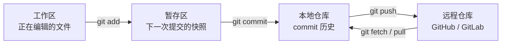
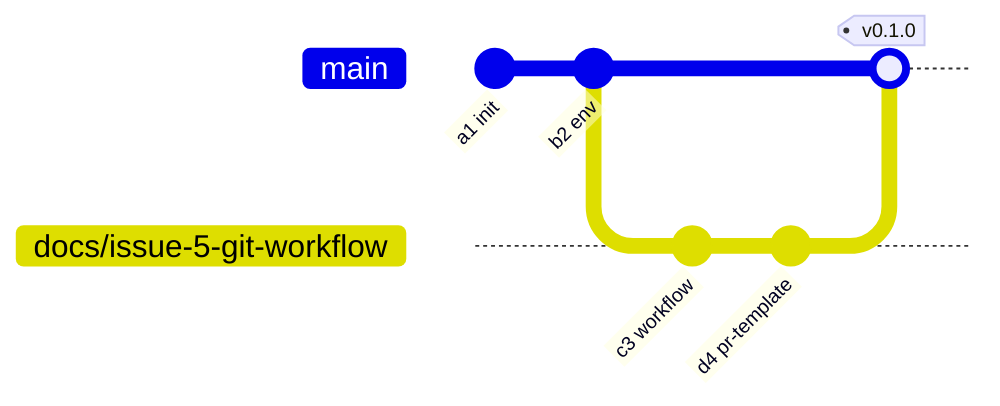
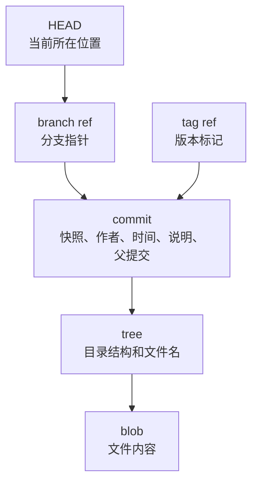
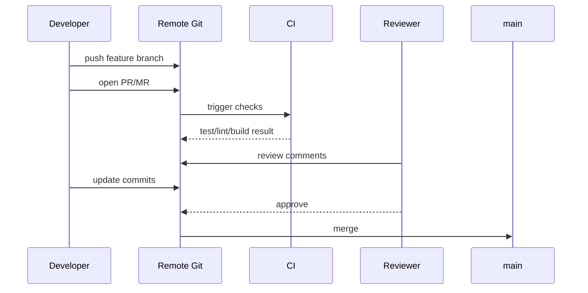

# 第 5 篇：Git 基础与团队协作

前 4 篇已经完成了课程环境、Linux 文件系统、进程服务和网络排障基础。到这里，`Cloud Native Todo Platform` 不应该只是你电脑上的一个目录，而应该成为一个可以被多人协作、可追溯、可审查、可发布的工程仓库。

在企业开发中，Git 不只是“保存代码”的工具。一次需求通常从 Issue 开始，经过分支开发、提交、推送、Pull Request 或 Merge Request、自动化检查、代码审查、合并、打标签和发布，最后进入测试环境、预发环境或生产环境。

本篇对应 4 个章节主题：

- 5.1 Git 仓库、提交与历史记录
- 5.2 分支、合并、rebase 与冲突解决
- 5.3 GitHub / GitLab 远程仓库与 Pull Request 工作流
- 5.4 tag、stash 与版本发布

本篇特色项目是：**为课程项目建立 Git 分支模型和提交规范，完成一次完整的 PR 工作流演练**。

你会先在临时仓库中练习提交、分支、冲突、stash、rebase、tag 和本地远程推送；再回到 `cloud-native-todo-platform` 仓库中新增 Git 协作规范文件，让后续 Go、Docker、Kubernetes、Helm 和 Operator 代码都能按统一流程协作。

## 1. 本章学习目标

学完本篇后，你应该能独立完成一次企业级分支开发流程，并能解释每一步为什么存在：为什么不能直接在 `main` 上开发，为什么 PR/MR 要写清验证方法，为什么公共分支不能随便 rebase，为什么 tag 是发布追溯的关键。

### 1.1 知识目标

- 能解释工作区、暂存区、本地仓库和远程仓库之间的关系。
- 能描述提交历史、分支指针、`HEAD`、tag 与远程跟踪分支的作用。
- 能对比 `merge`、`rebase`、squash merge 的历史形态和适用场景。
- 能解释冲突产生的原因，以及冲突标记 `<<<<<<<`、`=======`、`>>>>>>>` 的含义。
- 能说明 Pull Request / Merge Request 如何连接代码审查、自动化测试和团队协作。

### 1.2 技能目标

- 能使用 `git status`、`git add`、`git commit`、`git log`、`git diff` 管理本地变更。
- 能创建符合团队规范的功能分支，完成提交并推送到远程仓库。
- 能制造并解决一次文本冲突，能判断解决结果是否正确。
- 能使用 `git fetch`、`git pull --ff-only`、`git push -u` 与远程仓库协作。
- 能使用 `git stash` 保存临时修改，使用 `git tag` 标记发布版本。
- 能为课程项目新增 `.gitignore`、`.gitattributes`、`.gitmessage`、PR 模板和 Git 工作流文档。

本篇结束时，你至少应该能独立完成下面这组任务：

```bash
git status --short --branch
git switch -c docs/issue-5-git-workflow
git add .gitattributes .gitignore .gitmessage .github/pull_request_template.md docs/contributing/git-workflow.md
git commit -m "docs: define git collaboration workflow"
git push -u origin docs/issue-5-git-workflow
git tag -a v0.1.0 -m "release: v0.1.0"
```

这些能力会贯穿后续每一篇：Go 代码、Dockerfile、Kubernetes YAML、Helm Chart 和 Operator Controller 都必须通过 Git 进入团队协作链路。

## 2. 本章工作场景与真实案例

### 2.1 技术痛点

如果没有规范的 Git 流程，项目会很快失控：

- 开发直接在 `main` 上改代码，提交混在一起，出了问题很难回滚。
- 提交信息都是 `update`、`fix`、`test`，几周后没人知道当时为什么改。
- 多个人同时改同一个配置文件，合并时出现冲突，却不知道保留哪一段。
- 本地代码能运行，但 PR 没写验证方法，Reviewer 只能靠猜。
- 生产环境出了事故，SRE 想追溯某个镜像对应哪次提交，却找不到 tag 和发布记录。
- `.env`、Token、Kubeconfig 被误提交到远程仓库，即使删除文件，敏感信息仍可能留在历史里。

Git 流程的价值不是让命令变复杂，而是让每次变更都能回答 5 个问题：为什么改、改了什么、谁审过、怎么验证、如何回滚。

### 2.2 团队协作场景

真实团队中的 Git 协作通常涉及多个角色：

- 产品或技术负责人创建 Issue，说明需求背景、验收条件和优先级。
- 后端开发从最新 `main` 创建功能分支，完成代码和测试后提交 PR/MR。
- Reviewer 负责检查代码质量、设计合理性、测试覆盖、兼容性和风险。
- CI 系统在 PR/MR 上运行 `go test`、lint、构建镜像、扫描密钥和检查 YAML。
- DevOps 或 SRE 关注部署配置、回滚方案、tag、release note 和生产风险。
- 安全团队关注敏感信息、权限边界、审计记录和关键目录审批规则。

本篇训练的不是孤立命令，而是一条真实工作流：从 Issue 创建分支，用清晰提交表达变更，通过 PR/MR 接受审查，合并后用 tag 和历史记录支撑发布追溯。

### 2.3 课程项目关联

本篇产出会被后续多章复用：

- 第 6 篇会把 `dev.sh`、`check.sh`、`clean.sh` 等脚本纳入 Git 管理。
- 第 8 到第 14 篇会持续提交 Go API 代码、测试、配置和日志组件。
- 第 15 到第 19 篇会通过 PR/MR 审查 Dockerfile、Compose 和镜像构建脚本。
- 第 20 到第 33 篇会通过 Git 管理 Kubernetes YAML、Helm Chart、监控和排障记录。
- 第 34 到第 41 篇会通过分支和 PR/MR 管理 CRD、Controller、Operator 和发布版本。

本篇真实案例是：

> 团队准备让 `cloud-native-todo-platform` 进入多人协作阶段。你需要建立分支命名规则、提交信息规范、PR/MR 模板、忽略规则和换行规则，并完成一次从分支开发到 PR/MR 合并的完整演练。

## 3. 核心概念

### 3.1 仓库、工作区、暂存区和提交

Git 仓库保存项目历史；工作区是你正在编辑的文件；暂存区是下一次提交的准备清单；提交是一次可追溯的项目快照。



最小工作流如下：

```bash
git status --short
git add docs/contributing/git-workflow.md
git diff --staged
git commit -m "docs: define git workflow"
```

在课程项目中，每一次新增 Go 文件、Dockerfile、Kubernetes YAML 或 Operator 代码，都应该先进入暂存区，再形成清晰提交。

### 3.2 提交历史、HEAD 和 tag

Git 的历史是一串 commit。每个 commit 都有唯一哈希、作者、时间、提交说明和父提交。



常见引用含义：

| 名称 | 含义 | 示例 |
|---|---|---|
| `HEAD` | 当前所在提交或分支 | `HEAD -> docs/issue-5-git-workflow` |
| `main` | 主分支指针 | 指向已合并、可构建的历史 |
| `origin/main` | 远程主分支的本地记录 | `git fetch` 后更新 |
| `v0.1.0` | 发布标签 | 标记一次可追溯发布 |

tag 不只是“好看的版本号”。后续镜像 tag、Helm Chart 版本和 Operator 发布都应该能追溯到某个 Git tag。

### 3.3 分支是轻量级指针

分支是指向 commit 的名字。创建分支并不会复制整个项目，它只是创建一个新的指针。

```bash
git switch -c docs/issue-5-git-workflow
```

推荐分支命名：

| 类型 | 命名示例 | 用途 |
|---|---|---|
| 主分支 | `main` | 受保护，只保存已审查、可构建的代码 |
| 功能分支 | `feature/issue-21-todo-api` | 普通功能开发 |
| 修复分支 | `fix/issue-18-health-check` | 缺陷修复 |
| 文档分支 | `docs/issue-5-git-workflow` | 文档、规范、README |
| 热修复分支 | `hotfix/issue-35-prod-timeout` | 紧急生产修复 |
| 发布分支 | `release/v0.2` | 发布前稳定和修补 |

如果团队已经统一使用 `codex/issue-<id>-<topic>` 或其他前缀，也可以继续使用。关键不是前缀本身，而是分支名能表达 Issue、目的和范围。

### 3.4 merge、rebase 与冲突

`merge` 把另一个分支的变更合并到当前分支，通常保留分叉历史。`rebase` 把当前分支的提交重新应用到新的基线之后，通常让历史更线性。

| 操作 | 历史形态 | 适合场景 | 风险 |
|---|---|---|---|
| `merge` | 保留分叉和合并节点 | 合并团队 PR/MR | 历史可能更复杂 |
| `rebase` | 改写当前分支提交位置 | 个人分支同步最新 `main` | 不适合公共分支 |
| squash merge | 多个提交压成一个 | PR/MR 变更较碎时 | 丢失中间提交细节 |

冲突发生时，文件里会出现类似标记。下面示例前面故意留了一个空格，避免被 Git 检查误判为真实冲突：

```text
 <<<<<<< HEAD
 review=required
 =======
 review=required-by-two-people
 >>>>>>> feature/issue-5-git-workflow
```

解决冲突不是机械选择“当前”或“传入”，而是理解两边意图，写出第三份正确结果。

### 3.5 stash、远程仓库和 PR/MR

`stash` 用于临时保存未完成的工作区修改：

```bash
git stash push -m "wip: update git workflow"
git stash list
git stash pop
```

远程仓库用于团队共享和审查。Pull Request / Merge Request 是把分支变更合并到目标分支的请求，也是团队质量门禁。

| 平台 | 合并请求名称 | 常见门禁 |
|---|---|---|
| GitHub | Pull Request | Review、Actions、Rulesets、CODEOWNERS |
| GitLab | Merge Request | Approval、Pipelines、Protected branches |

在企业项目中，`main` 分支通常禁止直接 push。所有变更都应通过 PR/MR、自动化检查和至少一次 Review。

## 4. 原理深入

### 4.1 Git 如何保存内容

Git 保存的是内容快照，而不是简单记录“第几行改了什么”。它用对象来组织历史：



这解释了为什么 Git 很适合排查：只要历史没有被破坏，你就可以用 `git show` 看某次提交，用 `git blame` 追踪某行来源，用 tag 找到某次发布。

### 4.2 fetch、pull 和 push 的真实含义

远程协作中最容易混淆的是 `fetch`、`pull` 和 `push`：

| 命令 | 做了什么 | 是否改变当前工作分支 |
|---|---|---|
| `git fetch origin` | 下载远程最新对象和引用 | 不直接改变 |
| `git pull --ff-only` | fetch 后尝试快进当前分支 | 可能改变 |
| `git push` | 把本地提交上传到远程 | 改变远程 |

建议先看清历史关系：

```bash
git fetch origin
git log --oneline --graph --decorate --all -n 20
```

如果 `git pull --ff-only` 失败，说明本地和远程已经分叉。此时不要盲目 `git pull`，应该先判断是 merge、rebase，还是需要重新开分支。

### 4.3 冲突为什么会发生

冲突不是 Git 坏了，而是 Git 发现自动合并不安全。

常见冲突场景：

- 两个分支修改同一个文件的同一行。
- 一个分支删除文件，另一个分支修改文件。
- 两个人同时调整 YAML 缩进或列表顺序。
- `.gitattributes` 不统一，换行符导致整文件 diff。

判断冲突时建议问 4 个问题：

1. 两边分别想解决什么问题？
2. 哪些内容必须同时保留？
3. 合并后是否仍然能运行测试？
4. 是否需要找另一位作者确认业务意图？

### 4.4 提交规范为什么重要

提交信息是未来排障和审计时最便宜的上下文。

推荐格式：

```text
<type>(<scope>): <summary>
```

常见类型：

| 类型 | 含义 | 示例 |
|---|---|---|
| `feat` | 新功能 | `feat(api): add todo create endpoint` |
| `fix` | 修复缺陷 | `fix(auth): reject expired token` |
| `docs` | 文档 | `docs: define git workflow` |
| `test` | 测试 | `test(api): cover todo validation` |
| `refactor` | 重构 | `refactor(service): simplify todo status update` |
| `chore` | 工具维护 | `chore: update gitignore` |
| `ci` | CI/CD | `ci: run go test on pull request` |

提交应该小而完整。一次提交最好只表达一个意图：新增 PR 模板、修复健康检查、补充测试，不要把无关改动混在一起。

### 4.5 PR/MR 是质量门禁

PR/MR 的核心价值不是按钮，而是把变更变成可以审查的对象。



一个合格 PR/MR 至少应该包含：变更背景、核心改动、验证方法、风险、回滚方案和关联 Issue。

## 5. 手把手实验

### 5.1 实验目标

本实验会先在临时仓库中练习 Git 协作关键动作，再回到课程项目中落地 Git 分支模型、提交规范和 PR/MR 模板，并完成一次可推送、可审查的分支开发流程。

说明：本篇不编写 Kubernetes YAML。这里训练的是版本管理和团队协作能力，后续所有代码、脚本、镜像配置和 Kubernetes 资源都会通过这套流程进入仓库。

### 5.2 实验环境

建议在课程指定的 Ubuntu 24.04 终端中执行。

| 项目 | 要求 |
|---|---|
| Git | 2.30+ |
| Shell | Bash 5.x |
| 课程仓库 | 已完成前 4 篇的 `cloud-native-todo-platform` |
| 远程平台 | GitHub 或 GitLab 账号 |
| 可选工具 | `tree`、`gh`、`glab` |

确认 Git 版本：

```bash
git --version
```

配置作者信息。请替换成你自己的名字和邮箱：

```bash
git config --global user.name "Your Name"
git config --global user.email "you@example.com"
git config --global init.defaultBranch main
```

为什么要配置：每个 commit 都会记录作者信息。`init.defaultBranch main` 避免不同机器默认分支名不一致。

Git 配置有作用范围，实验中不要随意把团队策略写成全局设置：

| 配置范围 | 命令形式 | 影响范围 |
|---|---|---|
| local | `git config --local key value` | 当前仓库，适合实验和项目级规范 |
| global | `git config --global key value` | 当前用户的所有仓库，适合作者信息 |
| system | `git config --system key value` | 整台机器，通常由管理员维护 |

后文会在课程项目仓库中使用 `git config --local pull.ff only`，让当前项目的 `pull` 只能快进，避免无意中产生混乱的 merge commit。如果团队已经统一约定，也可以把它配置为全局策略。

### 5.3 文件目录结构

本实验会使用一个临时练习仓库和一个课程项目仓库。

临时仓库结构：

```text
/tmp/git-collaboration-lab/
├── workflow.txt
├── rebase.txt
└── main.txt

/tmp/git-collaboration-remote.git/
└── <bare git repository>
```

课程项目会新增：

```text
cloud-native-todo-platform/
├── .gitattributes
├── .gitignore
├── .gitmessage
├── .github/
│   └── pull_request_template.md
└── docs/
    └── contributing/
        └── git-workflow.md
```

如果没有安装 `tree`，可以用下面的命令查看类似结构：

```bash
find . -maxdepth 3 -print
```

### 5.4 完整代码和配置

`.gitattributes`：

```text title=".gitattributes"
* text=auto

*.go text eol=lf
*.mod text eol=lf
*.sum text eol=lf
*.sh text eol=lf
*.md text eol=lf
*.yaml text eol=lf
*.yml text eol=lf
*.json text eol=lf
*.toml text eol=lf

*.bat text eol=crlf
*.cmd text eol=crlf

*.png binary
*.jpg binary
*.jpeg binary
*.gif binary
*.ico binary
*.pdf binary
```

如果这是一个已经存在很久的仓库，新增 `.gitattributes` 后不要立刻大范围重写文件。确认团队同意统一换行后，再使用 `git add --renormalize .` 让既有文件按规则重新入库。

`.gitignore`：

```text title=".gitignore"
# Build outputs
bin/
dist/
build/
coverage.out

# Logs and temporary files
*.log
tmp/
.tmp/

# Local environment files
.env
.env.*
!.env.example

# OS and editor files
.DS_Store
Thumbs.db
.idea/
.vscode/

# Kubernetes and cloud credentials
*.kubeconfig
*.pem
*.key
```

`bin/` 规则会忽略前几篇以及后续章节生成的编译产物；二进制文件不应进入版本管理，从本章起正式纳入忽略规则。`.gitignore` 中忽略 `.vscode/` 是为了避免个人编辑器设置污染团队仓库。如果团队希望共享推荐插件，可以改成忽略 `.vscode/*`，再通过 `!.vscode/extensions.json` 放开特定文件。

`.gitmessage`：

```text title=".gitmessage"
<type>(<scope>): <summary>

Why:
- TODO

What:
- TODO

Verification:
- TODO

Refs #

# type: feat, fix, docs, test, refactor, chore, ci
# summary: use imperative mood, keep it short
# example: docs(git): define branch workflow
```

`.github/pull_request_template.md`：

```markdown title=".github/pull_request_template.md"
## Summary

- TODO

## Verification

- [ ] `git status --short --branch`
- [ ] `git diff --check`
- [ ] `go test ./...` (if Go code changed)
- [ ] Documentation preview or screenshot (if docs changed)

## Risk

- TODO

## Rollback

- Revert this PR if needed.

Closes #
```

`docs/contributing/git-workflow.md`：

````markdown title="docs/contributing/git-workflow.md"
# Git Workflow

This project uses short-lived branches and Pull Requests / Merge Requests.

## Branches

- `main`: protected branch. Only reviewed and verified changes can be merged.
- `feature/issue-<id>-<topic>`: user-facing feature development.
- `fix/issue-<id>-<topic>`: bug fixes.
- `docs/issue-<id>-<topic>`: documentation updates.
- `hotfix/issue-<id>-<topic>`: urgent production fixes.
- `release/v<major>.<minor>`: release stabilization branch when needed.

## Commit Message

Use this format:

```text
<type>(<scope>): <summary>
```

Common types:

- `feat`: user-facing feature
- `fix`: bug fix
- `docs`: documentation
- `test`: tests
- `refactor`: behavior-preserving code change
- `chore`: tooling or maintenance
- `ci`: CI/CD changes

Examples:

```text
docs(git): define branch workflow
fix(api): return 404 for missing todo
test(api): cover todo validation
```

## Pull Request / Merge Request Rules

- Never push directly to `main`.
- Link every PR/MR to an Issue when possible.
- Keep each PR/MR focused on one topic.
- Explain why the change is needed, what changed, how it was verified, and what risk remains.
- At least one reviewer should approve before merge.
- CI checks must pass before merge.

## Merge Strategy

- Prefer squash merge for small feature branches with noisy intermediate commits.
- Prefer merge commit when preserving branch context matters.
- Use rebase only on personal branches, not on shared protected branches.

## Release Tags

- Use annotated tags for releases, for example `v0.1.0`.
- Do not delete or move a release tag after it has been published.
- Release notes should include the tag, commit SHA, image tag, and deployment artifact version.
````

占位符说明：`.gitmessage` 和 PR/MR 模板中的 `<type>`、`<summary>`、`Refs #`、`Closes #` 都需要在真实提交或 PR/MR 中替换成具体内容。模板的作用是提醒你补齐背景、变更、验证和风险，不是让占位符原样进入团队历史。

### 5.5 执行命令

先在临时仓库中练习危险操作，避免破坏课程项目历史。

创建临时仓库：

```bash
rm -rf /tmp/git-collaboration-lab /tmp/git-collaboration-remote.git
mkdir -p /tmp/git-collaboration-lab
cd /tmp/git-collaboration-lab
git init -b main
git config user.name "Course Learner"
git config user.email "learner@example.com"
```

创建初始提交：

```bash
printf "workflow=main\nreview=required\n" > workflow.txt
git add workflow.txt
git commit -m "docs: initialize workflow note"
```

制造并解决一次冲突：

```bash
git switch -c docs/issue-5-pr-workflow
printf "workflow=feature\nreview=required\n" > workflow.txt
git commit -am "docs: update workflow from feature branch"
git switch main
printf "workflow=main-hotfix\nreview=required\n" > workflow.txt
git commit -am "docs: update workflow from main branch"
git merge docs/issue-5-pr-workflow
```

预期 `git merge` 会提示冲突。解决冲突：

```bash
cat > workflow.txt <<'EOF'
workflow=main-and-feature
review=required
EOF
git add workflow.txt
git commit -m "docs: resolve workflow conflict"
```

练习 stash：

真实场景中，stash 最常用于临时保存未完成修改，以便切换到其他分支处理紧急任务；本实验先演示最小闭环。

```bash
printf "temporary=wip\n" >> workflow.txt
git stash push -m "wip: temporary workflow note"
git stash list
git stash pop
git restore workflow.txt
```

练习 rebase：

```bash
git switch -c docs/issue-5-rebase-demo
printf "rebase=feature\n" > rebase.txt
git add rebase.txt
git commit -m "docs: add rebase demo file"
git switch main
printf "main=advanced\n" > main.txt
git add main.txt
git commit -m "docs: advance main branch"
git switch docs/issue-5-rebase-demo
git rebase main
```

由于 `rebase.txt` 和 `main.txt` 是不同文件，本次 rebase 不会冲突。如果两个分支修改了同一文件的同一行，rebase 期间同样需要解决冲突，处理思路与 merge 冲突一致。

把 rebase 后的功能分支合回 `main`，并创建 tag：

```bash
git switch main
git merge --ff-only docs/issue-5-rebase-demo
git tag -a v0.1.0 -m "release: v0.1.0"
```

创建本地裸仓库模拟远程，并推送分支和 tag：

```bash
git init --bare -b main /tmp/git-collaboration-remote.git
git remote add origin /tmp/git-collaboration-remote.git
git push -u origin main
git push origin v0.1.0
git ls-remote --heads --tags origin
```

回到课程项目仓库，创建工作分支。下面路径按第 1 篇的建议写法展示，请按你的实际路径调整。如果你还没有远程仓库，执行下面代码块时跳过 `git pull --ff-only origin main` 这一行，但仍然要确保当前工作区干净。

```bash
cd ~/workspace/cloud-native-todo-platform
git config --local pull.ff only
git status --short --branch
git switch main
git pull --ff-only origin main
git switch -c docs/issue-5-git-workflow
```

`git config --local pull.ff only` 只影响当前课程项目。

创建目录并写入 5.4 中的文件：

```bash
mkdir -p .github docs/contributing
```

把 5.4 中的 `.gitattributes`、`.gitignore`、`.gitmessage`、`.github/pull_request_template.md` 和 `docs/contributing/git-workflow.md` 保存到对应路径。

让 Git 使用提交模板：

```bash
git config commit.template .gitmessage
```

执行不带 `-m` 的 `git commit` 时，Git 会打开编辑器并载入 `.gitmessage` 模板。下面为了让实验命令可复制、输出更稳定，仍然使用 `git commit -m` 直接提交。

检查差异并提交：

```bash
git status --short --branch
git diff -- .gitattributes .gitignore .gitmessage .github/pull_request_template.md docs/contributing/git-workflow.md
git add .gitattributes .gitignore .gitmessage .github/pull_request_template.md docs/contributing/git-workflow.md
git diff --staged
git commit -m "docs: define git collaboration workflow"
```

推送分支：

```bash
git push -u origin docs/issue-5-git-workflow
```

如果你的远程分支已经存在，并且你只是追加提交，使用：

```bash
git push
```

如果你在个人分支上 rebase 过，并确认远程分支没有被别人更新，才可以使用：

```bash
git push --force-with-lease
```

不要对 `main`、`release/*`、`hotfix/*` 使用普通开发者强推。

创建 PR/MR：

前面的 `/tmp/git-collaboration-remote.git` 只能模拟远程 push、tag 和跟踪分支，不能模拟代码审查页面。这里分成两条路径：

- 如果你有 GitHub 或 GitLab 仓库，按下表创建真实 PR/MR。
- 如果暂时没有远程平台账号，本章最低验收可以先完成本地裸仓库推送，并把 PR/MR 标题、描述和验证方法写入学习笔记；后续接入远程平台后再补做真实 PR/MR。

| 平台 | 操作 |
|---|---|
| GitHub | 打开仓库，点击 `Compare & pull request`，base 选择 `main`，compare 选择 `docs/issue-5-git-workflow` |
| GitLab | 打开仓库，进入 `Merge requests`，点击 `New merge request`，source 选择 `docs/issue-5-git-workflow`，target 选择 `main` |

PR/MR 标题建议：

```text
docs: define git collaboration workflow
```

PR/MR 描述建议：

```markdown
## Summary

- Add Git branch workflow documentation.
- Add commit message template and PR/MR template.
- Add `.gitignore` and `.gitattributes` for safer collaboration.

## Verification

- [x] `git status --short --branch`
- [x] `git diff --check`
- [x] `git log --oneline --graph --decorate --all -n 20`

## Risk

- Documentation and repository metadata only.

Closes #5
```

合并后删除远程分支，并同步本地 `main`：

```bash
git switch main
git pull --ff-only origin main
git branch -d docs/issue-5-git-workflow
```

### 5.6 预期输出

初始化临时仓库后，分支状态类似：

```text
## main
```

制造冲突时预期类似：

```text
Auto-merging workflow.txt
CONFLICT (content): Merge conflict in workflow.txt
Automatic merge failed; fix conflicts and then commit the result.
```

`git status --short` 在冲突期间类似：

```text
UU workflow.txt
```

解决冲突并提交后，历史类似：

```text
*   a1b2c3d (HEAD -> main) docs: resolve workflow conflict
|\
| * b2c3d4e (docs/issue-5-pr-workflow) docs: update workflow from feature branch
* | c3d4e5f docs: update workflow from main branch
|/
* d4e5f6a docs: initialize workflow note
```

stash 输出类似：

```text
stash@{0}: On main: wip: temporary workflow note
```

推送本地远程后，`git ls-remote --heads --tags origin` 预期类似：

```text
<commit-sha>	refs/heads/main
<tag-sha>	refs/tags/v0.1.0
<commit-sha>	refs/tags/v0.1.0^{}
```

课程项目提交后，`git status --short --branch` 预期类似：

```text
## docs/issue-5-git-workflow
```

### 5.7 验证方法

在临时仓库中验证：

```bash
cd /tmp/git-collaboration-lab
git log --oneline --graph --decorate --all -n 20
git tag --list
git ls-remote --heads --tags origin
```

判断标准：

- 历史中能看到冲突解决提交 `docs: resolve workflow conflict`。
- `git tag --list` 能看到 `v0.1.0`。
- `git ls-remote` 能看到远程 `main` 和 `v0.1.0`。

在课程项目中验证：

```bash
cd ~/workspace/cloud-native-todo-platform
test -f .gitattributes
test -f .gitignore
test -f .gitmessage
test -f .github/pull_request_template.md
test -f docs/contributing/git-workflow.md
git status --short --branch
git show --check --stat --oneline HEAD
git config --show-origin --get pull.ff
```

判断标准：

- 5 个协作规范文件都存在。
- 当前分支不是 `main`，或者本地 `main` 已经包含合并后的提交。
- 最新提交信息能看出变更目的，例如 `docs: define git collaboration workflow`。
- `git show --check` 没有报告空白字符错误。
- 有远程平台时，能看到对应 PR/MR，且描述包含 Summary、Verification 和 Risk。
- 无远程平台时，至少完成本地裸仓库推送，并在学习笔记中写清 PR/MR 标题、Summary、Verification 和 Risk。

### 5.8 清理步骤

临时练习仓库可以删除：

```bash
rm -rf /tmp/git-collaboration-lab /tmp/git-collaboration-remote.git
```

课程项目中的协作规范文件建议保留，后续章节会继续复用：

```text
.gitattributes
.gitignore
.gitmessage
.github/pull_request_template.md
docs/contributing/git-workflow.md
```

如果你只是本地演练，不想保留未合并分支，可以在确认没有未提交修改后删除：

```bash
git switch main
git branch -D docs/issue-5-git-workflow
```

如果远程分支也只是练习分支，可以删除：

```bash
git push origin --delete docs/issue-5-git-workflow
```

预计耗时：90 分钟（动手操作约 60 分钟）。

## 6. 常见错误与排障

### 错误 1：提交时报 `Author identity unknown`

- **现象**：

  ```text
  Author identity unknown
  fatal: unable to auto-detect email address
  ```

- **原因**：Git 不知道当前提交作者是谁，通常是新机器没有配置 `user.name` 和 `user.email`。

- **排查**：

  ```bash
  git config --global user.name
  git config --global user.email
  ```

  如果没有输出，说明全局作者信息未配置。

- **修复**：

  ```bash
  git config --global user.name "Your Name"
  git config --global user.email "you@example.com"
  ```

- **预防**：新开发环境初始化时，把 Git 用户信息加入环境检查清单。

### 错误 2：不小心在 `main` 上开发

- **现象**：

  ```text
  ## main
   M docs/contributing/git-workflow.md
  ```

- **原因**：忘记创建功能分支，直接在受保护主分支上修改文件。

- **排查**：

  ```bash
  git status --short --branch
  git branch --show-current
  ```

  如果当前分支是 `main` 且已有修改，就需要先转移到新分支。

- **修复**：

  ```bash
  git switch -c docs/issue-5-git-workflow
  ```

  未提交修改会跟随工作区进入新分支。

- **预防**：开始任何任务前先执行 `git status --short --branch`，确认当前分支。

### 错误 3：冲突标记被提交

- **现象**：

  ```text
  error: Committing is not possible because you have unmerged files.
  ```

  或者文件里仍然能看到：

  ```text
   <<<<<<< HEAD
   =======
   >>>>>>> feature/demo
  ```

- **原因**：冲突没有真正解决，或者解决后忘记删除冲突标记。

- **排查**：

  ```bash
  git status --short
  git diff --check
  git grep -n -E '<<<<<<<|=======|>>>>>>>' -- ':!docs/chapters/stage-01-foundation/05-git-basics.md' || true
  ```

  `git grep` 如果命中冲突标记，说明文件还不能提交。这里排除了本篇教程文件，是因为教程正文中包含用于讲解的冲突标记示例。

- **修复**：打开冲突文件，理解两边改动意图，删除冲突标记，保存正确结果，然后执行：

  ```bash
  git add <file>
  git commit
  ```

- **预防**：解决冲突后必须运行 `git diff --check` 和 `git status`。

### 错误 4：push 被拒绝

- **现象**：

  ```text
  ! [rejected] main -> main (fetch first)
  error: failed to push some refs
  ```

- **原因**：远程分支有你本地没有的提交。Git 拒绝覆盖远程历史。

- **排查**：

  ```bash
  git fetch origin
  git log --oneline --graph --decorate --all -n 20
  ```

  看清楚本地分支和远程分支各自多了哪些提交。

- **修复**：

  ```bash
  git pull --ff-only origin main
  ```

  如果不能快进，需要先理解分叉原因，再选择 merge 或 rebase。个人分支 rebase 后更新远程时使用：

  ```bash
  git push --force-with-lease
  ```

- **预防**：推送前先 `git fetch`，公共分支禁止强推。

### 错误 5：误提交敏感信息

- **现象**：

  ```text
  + DATABASE_PASSWORD=prod-password
  + KUBECONFIG=/home/user/.kube/prod
  ```

  PR/MR diff 中出现密码、Token、私钥、Kubeconfig 或云账号凭据。

- **原因**：缺少 `.gitignore`、secret scanning 或提交前审查；也可能把本地 `.env` 当成示例配置提交。

- **排查**：

```bash
git grep -n -E 'PASSWORD|TOKEN|SECRET|BEGIN .*PRIVATE KEY' || true
git log --all -- .env
```

- **修复**：不要只删除文件再提交。应立即视为密钥泄露：撤销或轮换密钥，通知负责人，必要时清理 Git 历史，并检查访问日志。

- **预防**：维护 `.gitignore`，启用 secret scanning，PR/MR 审查中检查敏感信息。

## 7. 生产环境注意事项

1. **保护 `main`、`release/*` 和 tag。**
   生产系统的发布链路通常从受保护分支或 tag 开始。`main` 应禁止直接 push，要求 PR/MR、Review 和 CI 通过后才能合并。发布 tag 应避免删除或重打，因为镜像、Helm Chart、部署记录和审计报告可能都依赖它。一旦 tag 被移动，线上版本追溯会变得不可信。

2. **不要把密钥交给 Git 历史。**
   `.env`、私钥、Kubeconfig、数据库密码、云账号 AK/SK 和生产 Token 都不应进入仓库。即使后续删除，历史中仍可能保留。生产团队应启用 secret scanning、最小权限访问和密钥轮换流程，并把示例配置写成 `.env.example`，只保留无敏感值的字段名。

3. **统一合并策略和 rebase 规则。**
   团队必须明确什么时候 squash、什么时候 merge commit、什么时候允许 rebase。个人短生命周期分支可以 rebase 整理历史；公共分支、发布分支和已被多人基于开发的分支不应改写历史。需要强推时优先使用 `--force-with-lease`，并且只用于个人分支。

4. **让 PR/MR 承担质量门禁职责。**
   PR/MR 不只是合并按钮，应包含背景、变更、验证、风险和回滚方式。关键目录如 `.github/workflows/`、`deployments/`、`charts/`、`operator/` 可以配置 CODEOWNERS，让平台、SRE 或安全负责人参与审查。CI 应在 PR/MR 上执行测试、格式检查和敏感信息扫描。

5. **发布必须能从运行版本追溯回源码。**
   后续 Docker 镜像、Helm Chart 和 Operator 版本都应包含 Git commit SHA 或 release tag。线上问题发生时，团队需要从运行中的镜像 tag 反查源码提交、PR/MR、发布说明和回滚目标。不要用不可追溯的 `latest` 作为生产发布依据。

## 8. 本章小项目

本章小项目：**为 `cloud-native-todo-platform` 建立 Git 分支模型和 PR/MR 工作流**。

交付物：

- `.gitattributes`
- `.gitignore`
- `.gitmessage`
- `.github/pull_request_template.md`
- `docs/contributing/git-workflow.md`
- 一个功能或文档分支，例如 `docs/issue-5-git-workflow`
- 一个包含 Summary、Verification、Risk 的 PR/MR
- 一个本地或远程 tag，例如 `v0.1.0`

验收命令：

```bash
git status --short --branch
ls .gitattributes .gitignore .gitmessage .github/pull_request_template.md docs/contributing/git-workflow.md
git log --oneline -n 5
git show --check --stat --oneline HEAD
git branch -vv
```

能力验收标准：

| 能力项 | 验收方式 |
|---|---|
| 分支开发 | 当前变更来自非 `main` 分支，或已通过 PR/MR 合并回 `main` |
| 提交规范 | `git log --oneline -n 5` 能看出提交目的 |
| 冲突解决 | 临时仓库中能展示一次冲突和解决提交 |
| 远程协作 | 分支已推送，`git branch -vv` 显示跟踪远程 |
| PR/MR 描述 | 真实 PR/MR 或学习笔记中包含 Summary、Verification、Risk |
| 版本标记 | 能创建并解释 `v0.1.0` tag 的作用 |
| 安全规则 | `.gitignore` 覆盖 `.env`、密钥和构建产物 |

## 9. 本章练习题

### 基础题

1. 工作区、暂存区、本地仓库和远程仓库分别保存什么？
2. 为什么 `git fetch` 比直接 `git pull` 更适合排查分支分叉？
3. `merge` 和 `rebase` 的历史形态有什么区别？
4. 为什么不建议直接在 `main` 分支开发？
5. tag 和 branch 都是引用，它们的使用场景有什么不同？

### 实操题

1. 在临时仓库中创建两个分支，分别修改同一行文本，手动制造并解决一次冲突。当 `git log --oneline --graph --decorate --all` 能看到合并提交时，说明操作成功。
2. 创建一个功能分支，完成两次提交，然后用 `git rebase main` 同步最新主干。当 `git log --oneline --graph` 中功能分支提交位于最新 `main` 之后，说明操作成功。
3. 使用 `git stash` 保存未完成修改，切换分支后再恢复。当 `git stash list` 先出现记录、`git stash pop` 后记录消失且修改回到工作区时，说明操作成功。

### 思考题

1. 团队应该选择 squash merge、merge commit 还是 rebase merge？不同选择对排障、回滚和审计有什么影响？
2. 如果同事把生产 Token 提交到了远程仓库，只在下一次提交中删除文件够不够？你会怎么处理？

## 10. 本章面试题

### 1. Git 的工作区、暂存区和本地仓库有什么区别？

**一句话结论**：工作区是当前文件，暂存区是下一次提交的准备快照，本地仓库保存已经形成的提交历史。

**展开解释**：`git add` 把工作区修改放入暂存区，`git commit` 把暂存区内容生成提交。这个设计允许开发者把一组文件拆成多个清晰提交，而不是把所有修改一次性塞进历史。

**深入追问**：排查“为什么文件没进 commit”时，优先看 `git status` 和 `git diff --staged`。如果文件只在工作区修改但没有 staged，就不会进入下一次提交。

### 2. `git merge` 和 `git rebase` 有什么区别？

**一句话结论**：`merge` 保留分叉历史，`rebase` 改写当前分支提交位置，让历史更线性。

**展开解释**：团队合并 PR/MR 时常用 merge 或 squash；个人功能分支同步最新主干时可以 rebase。rebase 会生成新的提交哈希，因此不适合已经被多人依赖的公共分支。

**深入追问**：如果个人分支 rebase 后已经推送过远程，需要用 `git push --force-with-lease` 更新远程分支。不要用 `--force` 覆盖别人可能已经推送的提交。

### 3. 发生冲突后你会怎么处理？

**一句话结论**：先用 `git status` 找冲突文件，再理解两边意图，编辑成正确结果，最后 `git add` 标记已解决。

**展开解释**：冲突标记中的 `HEAD` 通常代表当前分支一侧，另一侧代表被合并或 rebase 的提交。解决后要删除所有冲突标记，运行 `git diff --check` 检查，再继续 merge commit 或 `git rebase --continue`。

**深入追问**：冲突解决不是纯技术动作。如果涉及业务行为、配置策略或安全规则，应找对应作者确认，不要机械选择“保留当前”。

### 4. 为什么企业团队通常禁止直接 push 到 `main`？

**一句话结论**：因为 `main` 通常代表可构建、可发布的主线，直接 push 会绕过审查、测试和审计。

**展开解释**：PR/MR 可以触发 CI、收集 Review、记录讨论、关联 Issue，并提供回滚上下文。直接 push 到 `main` 会让错误更快进入主线，也让团队难以知道变更背景。

**深入追问**：成熟团队会使用 branch protection、CODEOWNERS、required checks、required approvals 和 signed commits 等机制保护关键分支。

### 5. `git pull` 为什么可能带来问题？

**一句话结论**：`git pull` 等于 fetch 加合并或变基，默认行为可能在你没看清历史时产生额外 merge commit。

**展开解释**：如果本地和远程分支已经分叉，直接 pull 可能制造混乱历史。更稳妥的方式是先 `git fetch origin`，再用 `git log --graph --all` 看清关系，然后选择 `pull --ff-only`、merge 或 rebase。

**深入追问**：项目内可以用 `git config --local pull.ff only` 固定当前仓库策略；团队也可以在开发规范中建议成员配置 `git config --global pull.ff only`，让不能快进的 pull 直接失败，迫使开发者先理解分叉原因。

### 6. 不小心提交了密钥怎么办？

**一句话结论**：立即视为密钥泄露，删除文件远远不够，必须轮换密钥并评估历史清理。

**展开解释**：Git 历史会保留旧提交中的内容。即使你后续删除密钥，已经推送到远程仓库的历史仍可能被别人拉取或缓存。正确流程是撤销或轮换密钥、通知负责人、清理历史、检查访问日志，并补充 `.gitignore` 和 secret scanning。

**深入追问**：如果密钥已经进入公开仓库，应假设它已经泄露。清理历史不能替代密钥轮换。

### 7. 如何让一次发布从 Git tag 追溯到镜像和 Helm Chart？

**一句话结论**：发布时使用不可变 tag，并把 Git SHA 写入镜像标签、镜像标签元数据、Chart 版本或 release note。

**展开解释**：CI 可以在 `v1.2.3` tag 上构建镜像，把镜像打上 `v1.2.3` 和 commit SHA 标签，同时生成 Helm Chart 版本。线上问题发生时，可以从运行镜像反查源码提交、PR/MR 和回滚目标。

**深入追问**：生产环境不要依赖 `latest`。最好记录镜像 digest，因为 tag 可能被误移动，而 digest 指向不可变内容。

## 11. 本章总结

本篇建立了企业级 Git 协作的基础模型。你学习了工作区、暂存区、本地仓库、远程仓库、提交历史、分支、`HEAD`、tag、merge、rebase、stash 和 PR/MR 的关系，也理解了冲突、非快进推送和敏感信息泄露这些常见问题如何发生。

项目成果上，你为 `cloud-native-todo-platform` 增加了 `.gitattributes`、`.gitignore`、`.gitmessage`、PR/MR 模板和 Git 工作流文档，并通过临时仓库练习了冲突解决、rebase、stash、tag 和远程推送。它们会成为后续 Go、Docker、Kubernetes、Helm 和 Operator 章节的协作基础。

能力价值上，你现在可以完成一次从分支开发到 PR/MR 合并的闭环，能写清楚变更背景、验证方法和风险，也能在排障或发布时从 Git 历史追溯变更来源。

## 12. 下一章衔接

下一篇进入 **第 6 篇：Shell 脚本与自动化基础**。本篇建立的 Git 分支模型、提交规范和 PR/MR 模板，会直接用于管理下一篇的 `dev.sh`、`check.sh`、`clean.sh` 等脚本。

如果跳过本篇，后续脚本、Go 代码、Dockerfile 和 Kubernetes YAML 虽然能写出来，但很难做到可审查、可回滚、可追溯。掌握 Git 协作后，后续每一次实验产出都可以沉淀成团队可接受的工程资产。
