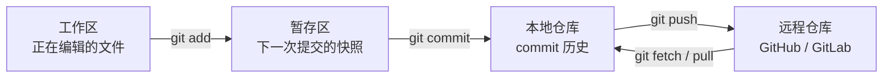
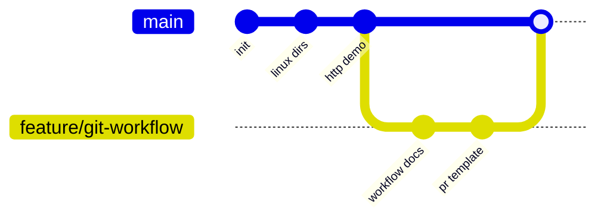
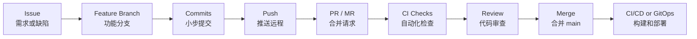
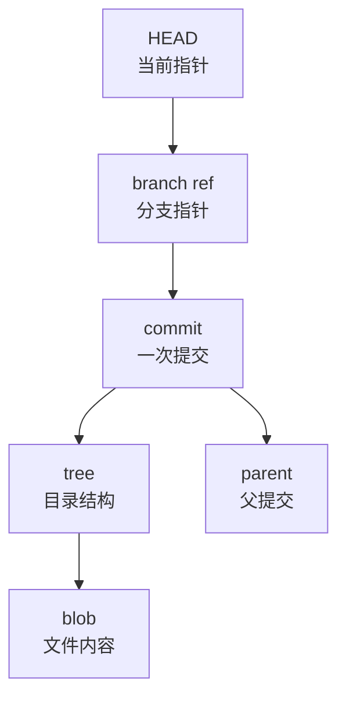

# 第 5 篇：Git 基础与团队协作

前 4 篇已经完成了课程环境、Linux 文件、进程服务和网络排障基础。到这里，`Cloud Native Todo Platform` 已经不再只是一个本地目录，而应该变成一个可以被多人协作、可追溯、可审查、可发布的工程仓库。

在真实公司里，Git 不是“把代码存起来”的工具，而是团队交付系统的入口。一次需求从 Issue 开始，经过分支开发、提交、推送、Pull Request 或 Merge Request、自动化检查、代码审查、合并、打标签和发布，最终进入测试环境、预发环境和生产环境。

本篇对应 5 个章节主题：

- 5.1 Git 仓库、提交与历史记录
- 5.2 分支、合并与冲突解决
- 5.3 rebase、stash、tag 与版本发布
- 5.4 GitHub / GitLab 远程仓库协作
- 5.5 Pull Request / Merge Request 工作流

本篇特色项目是：**为课程项目建立 Git 分支模型和提交规范**。

你会为 `cloud-native-todo-platform` 仓库建立一套适合后续 Go、Docker、Kubernetes、Operator 开发的 Git 协作规则，包括分支命名、提交信息、PR/MR 检查项、冲突处理和版本标签策略。

## 1. 本章学习目标

学完本篇后，你应该能够独立完成一次符合企业协作要求的 Git 开发流程。

具体目标如下：

- 能解释工作区、暂存区、本地仓库、远程仓库之间的关系。
- 能使用 `git init`、`git clone`、`git status`、`git add`、`git commit` 管理代码变更。
- 能使用 `git log`、`git diff`、`git show`、`git blame` 查看历史和定位变更来源。
- 能创建、切换、合并和删除分支，并理解分支本质是提交指针。
- 能识别并解决文本冲突，知道冲突标记的含义。
- 能正确使用 `git fetch`、`git pull --ff-only`、`git push -u` 与远程仓库协作。
- 能理解 `merge` 和 `rebase` 的区别，并知道什么时候不应该改写公共历史。
- 能使用 `git stash` 临时保存未完成工作。
- 能使用 `git tag` 标记版本，并理解语义化版本在发布中的作用。
- 能按照 Issue -> 分支 -> Commit -> PR/MR -> Review -> Merge 的流程完成团队协作。
- 能为课程项目沉淀分支模型、提交规范、忽略规则、换行规则和 PR/MR 模板。

本篇结束时，你至少应该能独立完成以下命令组合：

```bash
git status --short --branch
git switch -c feature/issue-3-git-workflow
git add .gitattributes .gitignore .gitmessage .github/pull_request_template.md docs/contributing/git-workflow.md
git commit -m "docs: define git workflow"
git fetch origin
git rebase origin/main
git push -u origin feature/issue-3-git-workflow
git log --oneline --graph --decorate --all -n 20
git tag -a v0.1.0 -m "release: v0.1.0"
```

这些命令会贯穿后续 Go API、Dockerfile、Kubernetes YAML、Helm Chart、CI/CD 和 Operator 开发全过程。

## 2. 本章工作场景

在企业项目中，Git 协作能力直接影响交付质量。

典型工作场景包括：

- 后端开发收到一个 Todo API 需求，需要从最新 `main` 创建功能分支，完成代码后提交 PR。
- 两名开发同时修改同一个配置文件，合并时出现冲突，需要判断保留哪部分内容。
- DevOps 修改 Dockerfile 或 Kubernetes YAML，需要通过 MR 让后端、测试和平台同学共同审查。
- 线上出现紧急问题，需要从 `main` 或发布标签创建 hotfix 分支，并在修复后打补丁版本标签。
- SRE 排查事故时，需要用 `git blame` 和 `git show` 找到某行配置是谁、在什么背景下修改的。
- 团队要求 `main` 分支不能直接推送，所有变更必须经过 PR/MR、自动化测试和至少一次 Review。
- CI/CD 和 GitOps 流程会监听 Git 仓库，代码合并、标签创建或配置变更会触发构建、部署或同步。

本篇训练的不是孤立命令，而是一条真实工作流：先创建 Issue，再创建分支，再提交小而清晰的 Commit，再推送远程分支，再创建 PR/MR，最后通过审查和自动化检查后合并。

## 3. 前置知识

### 必须掌握

学习本篇前，你需要具备以下基础：

- 已经安装 Git，并能在终端执行 `git --version`。
- 已经初始化或克隆 `cloud-native-todo-platform` 仓库。
- 能使用 Linux、macOS Terminal、Windows PowerShell、Git Bash 或 WSL2 进入项目目录。
- 能使用基础文件命令创建目录、编辑文本文件、查看文件内容。
- 理解前几篇中“代码、配置、文档、脚本都应该进入仓库管理”的思想。

### 建议了解

以下内容不要求熟练，但建议有初步概念：

- GitHub 和 GitLab 都是基于 Git 的代码托管平台。
- Pull Request 和 Merge Request 都表示“请求把一个分支合并到目标分支”。
- CI/CD 通常由 push、PR/MR 或 tag 触发。
- 生产环境不应该依赖开发者本机状态，而应该依赖 Git 中可追溯的版本。

### 环境差异说明

Git 命令本身跨平台一致，但路径、换行符和文件创建命令在不同系统中略有差异。

=== "Windows PowerShell"

    推荐安装 Git for Windows，并优先使用 PowerShell 或 Git Bash。PowerShell 创建文件时建议显式指定 UTF-8：

    ```powershell
    git --version
    git config --global user.name "Your Name"
    git config --global user.email "you@example.com"
    git config --global core.autocrlf true
    git config --global init.defaultBranch main
    ```

    `core.autocrlf true` 会在检出时把 LF 转为 CRLF，在提交时转回 LF，适合多数 Windows 开发场景。

=== "macOS"

    可以使用系统 Git，也可以通过 Homebrew 安装新版 Git：

    ```bash
    git --version
    git config --global user.name "Your Name"
    git config --global user.email "you@example.com"
    git config --global core.autocrlf input
    git config --global init.defaultBranch main
    ```

    `core.autocrlf input` 会在提交时规范为 LF，但检出时不强制转为 CRLF。

=== "Linux / WSL2"

    Linux 和 WSL2 通常使用 LF 换行：

    ```bash
    git --version
    git config --global user.name "Your Name"
    git config --global user.email "you@example.com"
    git config --global core.autocrlf input
    git config --global init.defaultBranch main
    ```

    如果在 WSL2 中开发，建议把项目放在 Linux 文件系统下，例如 `~/workspace`，不要放在 `/mnt/c` 下频繁进行大量 Git 操作。

## 4. 核心概念

### 4.1 Git 仓库、工作区、暂存区和提交

一个 Git 仓库至少包含 4 个重要区域：



工作区是你正在编辑的文件。暂存区是下一次提交的准备清单。本地仓库保存提交历史。远程仓库用于团队共享。

常用命令如下：

| 命令 | 作用 | 典型场景 |
|---|---|---|
| `git status` | 查看当前状态 | 每次提交前先看 |
| `git add <file>` | 把文件加入暂存区 | 准备提交部分文件 |
| `git diff` | 查看未暂存修改 | 检查工作区改了什么 |
| `git diff --staged` | 查看已暂存修改 | 检查下一次提交内容 |
| `git commit` | 生成一次提交 | 保存一个完整变更点 |
| `git log` | 查看提交历史 | 理解项目演进 |
| `git show <commit>` | 查看某次提交详情 | 排查某次变更 |

一次好的提交应该像一个可以独立解释的小故事：为什么改、改了什么、影响哪里。不要把“格式化全仓代码”和“修复接口 Bug”放在同一个提交里。

### 4.2 提交历史是项目的时间线

Git 的每次提交都是一个快照。提交之间通过父子关系形成历史。



查看历史：

```bash
git log --oneline --graph --decorate --all -n 20
```

输出示例：

```text
*   a1b2c3d (HEAD -> main) Merge pull request #3 from feature/git-workflow
|\
| * e5f6a7b docs: add pull request checklist
| * c8d9e0f docs: define git workflow
|/
* 1122334 docs: add local todo network demo
* 8899abc docs: add process demo service
```

其中：

- `HEAD` 表示当前所在提交。
- `main` 表示 `main` 分支指向的提交。
- `feature/git-workflow` 表示功能分支指向的提交。
- 图中的分叉和合并表示团队开发的真实历史。

### 4.3 分支是提交指针

分支不是代码的完整复制，而是指向某个提交的名字。

创建分支：

```bash
git switch -c feature/issue-3-git-workflow
```

查看分支：

```bash
git branch -vv
```

推荐的课程项目分支模型：

| 分支类型 | 示例 | 用途 |
|---|---|---|
| `main` | `main` | 受保护主分支，只存放已审查、可构建的代码 |
| 功能分支 | `feature/issue-21-todo-api` | 开发普通功能 |
| 文档分支 | `docs/issue-3-git-workflow` | 修改课程文档、README、设计文档 |
| 修复分支 | `fix/issue-18-health-check` | 修复缺陷 |
| 热修复分支 | `hotfix/issue-35-prod-timeout` | 紧急修复线上问题 |
| 发布标签 | `v0.1.0` | 标记某个可发布版本 |

如果团队已经统一使用 `codex/issue-<id>-<topic>`，也可以继续使用。关键不是前缀本身，而是分支名要能看出 Issue、目的和范围。

### 4.4 merge 与冲突

`merge` 会把一个分支的变更合并到当前分支。

```bash
git switch main
git merge feature/issue-3-git-workflow
```

如果两个分支修改了同一个文件的同一段内容，Git 无法自动判断应该保留哪一边，就会产生冲突。

冲突文件中会出现类似标记：

```text
 <<<<<<< HEAD
 main 分支中的内容
 =======
 feature 分支中的内容
 >>>>>>> feature/issue-3-git-workflow
```

上面为了避免被 Git 检查误判为真实冲突，示例前面保留了一个空格。真实冲突文件中，这些标记通常会顶格出现。

解决冲突的步骤：

1. 执行 `git status` 找到冲突文件。
2. 打开文件，理解两边改动意图。
3. 删除 `<<<<<<<`、`=======`、`>>>>>>>` 标记。
4. 保留正确内容，必要时把两边内容合并。
5. 执行 `git add <file>` 标记冲突已解决。
6. 执行 `git commit` 完成合并提交。

不要机械地选择“保留当前”或“保留传入”。企业项目中，冲突解决本质上是一次小型代码审查，需要理解业务意图。

### 4.5 rebase、stash、tag

`rebase` 的作用是把当前分支的提交重新放到另一个基线之后。

常见用途是在提交 PR/MR 前，让功能分支基于最新 `main`：

```bash
git fetch origin
git rebase origin/main
```

`merge` 和 `rebase` 的区别：

| 方式 | 历史形态 | 常见用途 |
|---|---|---|
| `merge` | 保留分叉和合并节点 | 合并 PR/MR，保留团队协作历史 |
| `rebase` | 让历史更线性 | 自己的功能分支同步最新主干 |

!!! warning "不要随意改写公共历史"
    已经被多人基于开发的分支，不要随便 `rebase` 后强推。个人功能分支可以在 PR/MR 合并前整理历史，但公共分支、发布分支和 `main` 应保持稳定。

`stash` 用于临时保存未完成工作：

```bash
git stash push -m "wip: update git workflow"
git stash list
git stash pop
```

`tag` 用于标记版本：

```bash
git tag -a v0.1.0 -m "release: v0.1.0"
git push origin v0.1.0
```

后续 CI/CD 可以监听 `v*` 标签来触发发布流程。

### 4.6 GitHub / GitLab 远程协作

GitHub 和 GitLab 的核心协作模型类似：



常见术语对照：

| 能力 | GitHub | GitLab |
|---|---|---|
| 需求或缺陷 | Issue | Issue |
| 合并请求 | Pull Request | Merge Request |
| 自动化流水线 | GitHub Actions | GitLab CI/CD |
| 分支保护 | Branch protection / Rulesets | Protected branches |
| 代码审查 | Review | Approval / Discussion |
| 仓库派生 | Fork | Fork |

企业团队通常会要求：

- `main` 分支禁止直接 push。
- 所有变更必须关联 Issue。
- PR/MR 必须有清晰标题、描述、测试结果和影响范围。
- 至少一名同事 Review 通过。
- CI 检查通过后才能合并。
- 合并后删除临时分支。

## 5. 原理深入

### 5.1 Git 如何保存内容

Git 不是按“文件差异”简单保存项目，而是用对象数据库保存内容。

你不需要一开始记住所有底层命令，但要理解以下关系：



- `blob` 保存文件内容。
- `tree` 保存目录结构和文件名。
- `commit` 保存一次快照、作者、时间、提交说明和父提交。
- `branch` 是指向某个 commit 的引用。
- `HEAD` 指向当前分支或当前提交。

这解释了为什么 Git 分支很轻量：创建分支通常只是创建一个新的指针。

### 5.2 `fetch`、`pull`、`push` 的真实含义

远程协作中最容易混淆的是 `fetch`、`pull`、`push`。

| 命令 | 作用 | 是否改变当前工作分支 |
|---|---|---|
| `git fetch origin` | 从远程下载最新引用和对象 | 不直接改变当前分支 |
| `git pull --ff-only` | fetch 后尝试快进当前分支 | 可能改变当前分支 |
| `git push` | 把本地提交推送到远程 | 改变远程分支 |

推荐习惯：

```bash
git fetch origin
git status --short --branch
git log --oneline --graph --decorate --all -n 20
```

先看清本地和远程的关系，再决定是否合并、rebase 或推送。

`git pull` 默认可能产生 merge commit。团队如果希望历史清晰，可以使用：

```bash
git pull --ff-only origin main
```

如果不能快进，Git 会拒绝操作，这时你需要先理解本地和远程各自多了哪些提交。

### 5.3 冲突为什么会发生

冲突不是错误，而是 Git 发现“自动合并不安全”。

例如：

- `main` 修改了 `README.md` 的同一行。
- `feature` 也修改了 `README.md` 的同一行。
- Git 不知道哪一边才是最终意图。

Git 可以自动合并不同文件、同一文件不同位置的变更，但不能替你做业务判断。

判断冲突时建议问 4 个问题：

- 两边分别想解决什么问题？
- 是否可以同时保留两边内容？
- 是否需要重新组织段落或配置结构？
- 解决后是否需要补充测试或文档？

### 5.4 提交规范为什么重要

提交信息不仅给人看，也会被自动化系统使用。

推荐采用接近 Conventional Commits 的格式：

```text
<type>(optional-scope): <summary>

<body>

Refs #<issue-id>
```

常用类型：

| 类型 | 含义 | 示例 |
|---|---|---|
| `feat` | 新功能 | `feat(api): add todo create endpoint` |
| `fix` | 修复缺陷 | `fix(auth): reject expired token` |
| `docs` | 文档 | `docs: define git workflow` |
| `test` | 测试 | `test(api): cover todo validation` |
| `refactor` | 重构 | `refactor(service): simplify todo status update` |
| `chore` | 构建、工具、维护 | `chore: update golangci config` |
| `ci` | CI/CD | `ci: run go test on pull request` |

后续发布系统可以根据提交类型生成 changelog，或决定语义化版本升级范围。

### 5.5 PR/MR 为什么是质量门禁

PR/MR 的价值不只是“把代码合进去”，而是提供合并前的质量门禁。

一份好的 PR/MR 应该回答：

- 背景是什么，关联哪个 Issue？
- 本次改了哪些文件和行为？
- 怎么验证，验证结果是什么？
- 是否影响配置、部署、数据库、权限、接口兼容性？
- 是否需要回滚方案？

这和后续 Kubernetes、CI/CD、GitOps 的关系非常紧密。GitOps 中，Git 仓库就是期望状态来源。一个错误的 YAML 合并到主分支，可能触发 Argo CD 自动同步到集群。所以 Git 协作流程本身就是生产安全的一部分。

本篇不会编写 Kubernetes YAML，但会建立后续审查 YAML、Helm values、RBAC、Secret 和 GitOps 配置的协作规则。也就是说，本篇的产出不是业务功能，而是后续所有业务功能进入仓库前必须经过的门禁。

## 6. 手把手实验

本实验拆成 3 个闭环，顺序不能颠倒：

1. 在临时仓库里练习 Git 基础、冲突、stash、rebase、tag 和本地远程推送。
2. 在 `cloud-native-todo-platform` 项目仓库中落地企业协作规范文件。
3. 在 GitHub 或 GitLab 上创建 PR/MR，并配置分支保护。

这样设计的原因是：冲突、rebase、强推、tag 都有破坏项目历史的可能。新手先在临时仓库练熟，再把规范文件提交到真实项目，风险最低。

### 6.1 实验目标

完成后你应该得到：

- 一个临时练习仓库 `git-collaboration-lab`。
- 一次可复现的冲突解决记录。
- 一次 stash 保存和恢复记录。
- 一次 rebase 练习记录。
- 一个本地裸仓库模拟远程仓库。
- 一个版本标签 `v0.1.0`。
- `cloud-native-todo-platform` 项目中的 5 个协作规范文件。
- 一个可提交到 GitHub / GitLab 的 PR/MR。

### 6.2 实验环境

检查 Git：

```bash
git --version
```

建议 Git 版本不低于 2.30。较老版本可能不支持 `git switch`，可以用 `git checkout` 替代：

```bash
git checkout -b feature/issue-3-git-workflow
git checkout main
```

配置身份：

```bash
git config --global user.name "Your Name"
git config --global user.email "you@example.com"
git config --global init.defaultBranch main
```

为什么要配置：每个 commit 都会记录作者信息。团队排查问题、生成 changelog、追踪事故时都依赖这些信息。`init.defaultBranch main` 可以避免不同机器默认创建 `master` 或 `main` 不一致。

本实验默认你已经有课程项目仓库：

```text
cloud-native-todo-platform/
```

如果还没有，请回到第 1 篇完成仓库初始化。

### 6.3 临时仓库目录结构

临时练习仓库用于大胆练习，不进入正式项目：

```text
workspace/
├── git-collaboration-lab/
│   └── workflow.txt
└── git-collaboration-remote.git/
```

`git-collaboration-lab` 是普通仓库，模拟开发者本地工作区。`git-collaboration-remote.git` 是裸仓库，模拟 GitHub / GitLab 远程仓库。

### 6.4 创建临时仓库

=== "Linux / macOS / WSL2"

    ```bash
    mkdir -p ~/workspace/git-collaboration-lab
    cd ~/workspace/git-collaboration-lab
    git init -b main
    git config user.name "Git Lab User"
    git config user.email "git-lab@example.com"
    echo "merge strategy: keep main stable" > workflow.txt
    git add workflow.txt
    git commit -m "docs: add workflow baseline"
    git status --short --branch
    ```

=== "Windows PowerShell"

    ```powershell
    New-Item -ItemType Directory -Force $HOME\workspace\git-collaboration-lab | Out-Null
    Set-Location $HOME\workspace\git-collaboration-lab
    git init -b main
    git config user.name "Git Lab User"
    git config user.email "git-lab@example.com"
    "merge strategy: keep main stable" | Set-Content -Encoding UTF8 workflow.txt
    git add workflow.txt
    git commit -m "docs: add workflow baseline"
    git status --short --branch
    ```

如果你的 Git 版本不支持 `git init -b main`，使用：

```bash
git init
git branch -M main
```

预期输出：

```text
## main
```

### 6.5 练习分支与冲突解决

创建功能分支并修改同一行：

=== "Linux / macOS / WSL2"

    ```bash
    git switch -c feature/update-workflow
    echo "merge strategy: use pull request review" > workflow.txt
    git commit -am "docs: update feature workflow"

    git switch main
    echo "merge strategy: require ci before merge" > workflow.txt
    git commit -am "docs: update main workflow"

    git merge feature/update-workflow
    ```

=== "Windows PowerShell"

    ```powershell
    git switch -c feature/update-workflow
    "merge strategy: use pull request review" | Set-Content -Encoding UTF8 workflow.txt
    git commit -am "docs: update feature workflow"

    git switch main
    "merge strategy: require ci before merge" | Set-Content -Encoding UTF8 workflow.txt
    git commit -am "docs: update main workflow"

    git merge feature/update-workflow
    ```

预期会看到冲突：

```text
CONFLICT (content): Merge conflict in workflow.txt
Automatic merge failed; fix conflicts and then commit the result.
```

查看冲突：

```bash
git status
cat workflow.txt
```

文件内容类似：

```text
 <<<<<<< HEAD
 merge strategy: require ci before merge
 =======
 merge strategy: use pull request review
 >>>>>>> feature/update-workflow
```

上面示例前保留了一个空格，避免被 Git 检查误判为真实冲突。真实冲突文件中，这些标记通常会顶格出现。

手动改成最终内容：

=== "Linux / macOS / WSL2"

    ```bash
    cat > workflow.txt <<'EOF'
    merge strategy: require pull request review and ci before merge
    EOF

    git add workflow.txt
    git commit -m "docs: resolve workflow merge conflict"
    git log --oneline --graph --decorate --all
    ```

=== "Windows PowerShell"

    ```powershell
    "merge strategy: require pull request review and ci before merge" | Set-Content -Encoding UTF8 workflow.txt

    git add workflow.txt
    git commit -m "docs: resolve workflow merge conflict"
    git log --oneline --graph --decorate --all
    ```

为什么这样做：冲突解决不是“选左边或右边”，而是理解两边业务意图后生成第三份正确结果。

### 6.6 练习 stash

```bash
echo "temporary note" >> workflow.txt
git status --short
git stash push -m "wip: temporary workflow note"
git status --short
git stash list
git stash pop
```

预期现象：

- `git stash push` 后，工作区变干净。
- `git stash list` 能看到一条 `wip: temporary workflow note`。
- `git stash pop` 后，临时修改回到工作区。

如果不想保留临时修改：

```bash
git restore workflow.txt
```

为什么这样做：真实工作中经常遇到“当前改到一半，但需要临时切到另一个分支修 Bug”。`stash` 可以让工作区先恢复干净。

### 6.7 练习 rebase

在临时仓库中创建一个新分支：

```bash
git switch main
git switch -c feature/rebase-demo
echo "rebase demo line" >> workflow.txt
git commit -am "docs: add rebase demo line"
```

模拟 `main` 又前进了一次：

```bash
git switch main
echo "main new line" >> main-note.txt
git add main-note.txt
git commit -m "docs: add main note"
```

把功能分支变基到最新 `main`：

```bash
git switch feature/rebase-demo
git rebase main
git log --oneline --graph --decorate --all
```

如果 rebase 过程中出现冲突：

```bash
git status
# 修复文件后
git add <conflict-file>
git rebase --continue
```

如果判断方向错了，可以中止：

```bash
git rebase --abort
```

为什么这样做：个人功能分支在提交 PR/MR 前同步最新 `main`，可以减少合并时的意外冲突。但不要对公共分支随意 rebase。

### 6.8 练习 tag 与本地远程推送

创建一个本地裸仓库模拟远程：

=== "Linux / macOS / WSL2"

    ```bash
    cd ~/workspace
    git init --bare git-collaboration-remote.git
    cd git-collaboration-lab
    git remote add origin ../git-collaboration-remote.git
    git push -u origin main
    git tag -a v0.1.0 -m "release: v0.1.0"
    git push origin v0.1.0
    ```

=== "Windows PowerShell"

    ```powershell
    Set-Location $HOME\workspace
    git init --bare git-collaboration-remote.git
    Set-Location $HOME\workspace\git-collaboration-lab
    git remote add origin ..\git-collaboration-remote.git
    git push -u origin main
    git tag -a v0.1.0 -m "release: v0.1.0"
    git push origin v0.1.0
    ```

验证：

```bash
git remote -v
git ls-remote --heads origin
git ls-remote --tags origin
```

预期能看到远程 `main` 和 `v0.1.0`。

为什么这样做：CI/CD 常用 tag 触发正式发布。后续 Todo API 镜像、Helm Chart 和 Operator 版本都应该能追溯到某个 Git tag。

### 6.9 课程项目目录结构

接下来进入真实课程项目。第 5 篇会在 `cloud-native-todo-platform` 中新增 5 个文件：

```text
cloud-native-todo-platform/
├── .gitattributes
├── .gitignore
├── .gitmessage
├── .github/
│   └── pull_request_template.md
└── docs/
    └── contributing/
        └── git-workflow.md
```

这些文件分别解决：

| 文件 | 作用 |
|---|---|
| `.gitattributes` | 统一换行符和跨平台文件处理 |
| `.gitignore` | 防止临时文件、密钥、构建产物进入仓库 |
| `.gitmessage` | 提醒开发者写清楚提交背景、内容和验证 |
| `.github/pull_request_template.md` | 统一 PR 描述和检查项 |
| `docs/contributing/git-workflow.md` | 记录团队分支模型、提交规范和合并规则 |

### 6.10 在项目仓库中创建分支

=== "Linux / macOS / WSL2"

    ```bash
    cd ~/workspace/cloud-native-todo-platform
    git status --short --branch
    ```

=== "Windows PowerShell"

    ```powershell
    Set-Location $HOME\workspace\cloud-native-todo-platform
    git status --short --branch
    ```

根据仓库状态选择路径：

=== "已有 origin/main"

    ```bash
    git fetch origin
    git switch main
    git pull --ff-only origin main
    git switch -c docs/issue-3-git-workflow
    ```

=== "只有本地仓库"

    ```bash
    git switch main
    git switch -c docs/issue-3-git-workflow
    ```

=== "当前默认分支是 master"

    ```bash
    git branch -M main
    git switch -c docs/issue-3-git-workflow
    ```

预期输出类似：

```text
Switched to a new branch 'docs/issue-3-git-workflow'
```

### 6.11 编写协作规范文件

=== "Linux / macOS / WSL2"

    ````bash
    mkdir -p docs/contributing .github

    cat > docs/contributing/git-workflow.md <<'EOF'
    # Git Workflow

    ## Branch Model

    - `main`: protected branch. Only reviewed and verified changes can be merged.
    - `feature/issue-<id>-<topic>`: feature development.
    - `fix/issue-<id>-<topic>`: bug fixes.
    - `docs/issue-<id>-<topic>`: documentation updates.
    - `hotfix/issue-<id>-<topic>`: urgent production fixes.
    - `release/v<major>.<minor>`: release stabilization branch when needed.

    ## Commit Message

    Use this format:

    ```text
    <type>(optional-scope): <summary>

    Why:
    What:
    Verification:

    Refs #<issue-id>
    ```

    Common types:

    - `feat`: user-facing feature
    - `fix`: bug fix
    - `docs`: documentation
    - `test`: tests
    - `refactor`: behavior-preserving code change
    - `chore`: tooling or maintenance
    - `ci`: CI/CD changes

    ## Merge Rules

    - Never push directly to `main`.
    - Every change must link an Issue.
    - Every PR/MR must include verification results.
    - CI must pass before merge.
    - At least one reviewer must approve production-impacting changes.
    - Changes to Kubernetes YAML, Helm values, RBAC, Secret, database migration, or CI/CD require extra review.
    EOF

    cat > .gitmessage <<'EOF'
    <type>(optional-scope): <summary>

    Why:

    What:

    Verification:

    Refs #
    EOF

    cat > .gitattributes <<'EOF'
    * text=auto
    *.go text eol=lf
    *.sh text eol=lf
    *.yaml text eol=lf
    *.yml text eol=lf
    *.md text eol=lf
    *.ps1 text eol=crlf
    EOF

    cat > .gitignore <<'EOF'
    # Local environment
    .env
    .env.*
    !.env.example

    # Build outputs
    bin/
    dist/
    build/
    coverage.out

    # Logs and temporary files
    *.log
    tmp/
    .cache/

    # IDE and OS files
    .idea/
    .vscode/
    .DS_Store

    # Sensitive Kubernetes files
    kubeconfig
    *.kubeconfig
    EOF

    cat > .github/pull_request_template.md <<'EOF'
    ## Summary

    Closes #

    ## Changes

    - Describe the main changes before submitting this PR.

    ## Verification

    - [ ] `git status --short --branch`
    - [ ] Local tests passed

    ## Risk

    - [ ] No deployment impact
    - [ ] No database migration
    - [ ] No Kubernetes / Helm / RBAC / Secret change
    - [ ] Rollback plan is clear
    EOF

    git config commit.template .gitmessage
    ````

=== "Windows PowerShell"

    ````powershell
    New-Item -ItemType Directory -Force docs\contributing | Out-Null
    New-Item -ItemType Directory -Force .github | Out-Null

    @'
    # Git Workflow

    ## Branch Model

    - `main`: protected branch. Only reviewed and verified changes can be merged.
    - `feature/issue-<id>-<topic>`: feature development.
    - `fix/issue-<id>-<topic>`: bug fixes.
    - `docs/issue-<id>-<topic>`: documentation updates.
    - `hotfix/issue-<id>-<topic>`: urgent production fixes.
    - `release/v<major>.<minor>`: release stabilization branch when needed.

    ## Commit Message

    Use this format:

    ```text
    <type>(optional-scope): <summary>

    Why:
    What:
    Verification:

    Refs #<issue-id>
    ```

    Common types:

    - `feat`: user-facing feature
    - `fix`: bug fix
    - `docs`: documentation
    - `test`: tests
    - `refactor`: behavior-preserving code change
    - `chore`: tooling or maintenance
    - `ci`: CI/CD changes

    ## Merge Rules

    - Never push directly to `main`.
    - Every change must link an Issue.
    - Every PR/MR must include verification results.
    - CI must pass before merge.
    - At least one reviewer must approve production-impacting changes.
    - Changes to Kubernetes YAML, Helm values, RBAC, Secret, database migration, or CI/CD require extra review.
    '@ | Set-Content -Encoding UTF8 docs\contributing\git-workflow.md

    @'
    <type>(optional-scope): <summary>

    Why:

    What:

    Verification:

    Refs #
    '@ | Set-Content -Encoding UTF8 .gitmessage

    @'
    * text=auto
    *.go text eol=lf
    *.sh text eol=lf
    *.yaml text eol=lf
    *.yml text eol=lf
    *.md text eol=lf
    *.ps1 text eol=crlf
    '@ | Set-Content -Encoding UTF8 .gitattributes

    @'
    # Local environment
    .env
    .env.*
    !.env.example

    # Build outputs
    bin/
    dist/
    build/
    coverage.out

    # Logs and temporary files
    *.log
    tmp/
    .cache/

    # IDE and OS files
    .idea/
    .vscode/
    .DS_Store

    # Sensitive Kubernetes files
    kubeconfig
    *.kubeconfig
    '@ | Set-Content -Encoding UTF8 .gitignore

    @'
    ## Summary

    Closes #

    ## Changes

    - Describe the main changes before submitting this PR.

    ## Verification

    - [ ] `git status --short --branch`
    - [ ] Local tests passed

    ## Risk

    - [ ] No deployment impact
    - [ ] No database migration
    - [ ] No Kubernetes / Helm / RBAC / Secret change
    - [ ] Rollback plan is clear
    '@ | Set-Content -Encoding UTF8 .github\pull_request_template.md

    git config commit.template .gitmessage
    ````

为什么这样做：

- `.gitignore` 防止密钥和构建产物进入仓库。
- `.gitattributes` 统一跨平台换行，减少无意义 diff。
- `.gitmessage` 和 PR 模板让每次变更都包含背景、验证和风险说明。
- `git-workflow.md` 把团队规则写进仓库，避免只靠口头约定。

!!! note "模板占位符必须替换"
    `.gitmessage` 和 `.github/pull_request_template.md` 中的 `<type>`、`<summary>`、`Refs #`、`Closes #` 都是占位符。真实提交或 PR 创建前必须替换成具体内容，例如 `docs(git): add branch workflow` 和 `Closes #3`。模板的作用是提醒你补齐背景、变更、验证和风险，不是让占位文本原样进入团队仓库历史。

### 6.12 查看差异并提交

```bash
git status --short
git diff
git add .gitattributes .gitignore .gitmessage .github/pull_request_template.md docs/contributing/git-workflow.md
git diff --staged
git commit -m "docs: define git workflow" -m "Refs #3"
```

预期输出类似：

```text
[docs/issue-3-git-workflow 1a2b3c4] docs: define git workflow
 5 files changed, 100 insertions(+)
 create mode 100644 .gitattributes
 create mode 100644 .github/pull_request_template.md
 create mode 100644 .gitignore
 create mode 100644 .gitmessage
 create mode 100644 docs/contributing/git-workflow.md
```

验证：

```bash
git log --oneline --decorate -n 3
git show --stat HEAD
```

### 6.13 连接远程仓库并推送

根据你的实际情况选择：

=== "无远程仓库"

    先在 GitHub 或 GitLab 创建空仓库，然后复制仓库地址。下面以 SSH 地址为例：

    ```bash
    git remote add origin git@github.com:<your-name>/cloud-native-todo-platform.git
    git push -u origin docs/issue-3-git-workflow
    ```

=== "已有 GitHub 仓库"

    ```bash
    git remote -v
    git fetch origin
    git push -u origin docs/issue-3-git-workflow
    ```

=== "已有 GitLab 仓库"

    ```bash
    git remote -v
    git fetch origin
    git push -u origin docs/issue-3-git-workflow
    ```

如果远程分支已存在且你只是更新自己的功能分支：

```bash
git push
```

如果个人分支 rebase 后需要更新远程：

```bash
git push --force-with-lease
```

不要对 `main`、`release/*`、`hotfix/*` 使用普通开发者强推。

### 6.14 创建 PR/MR

真实平台上的 PR/MR 需要使用 GitHub 或 GitLab。

=== "GitHub"

    1. 打开仓库页面。
    2. 点击 `Compare & pull request`。
    3. 确认 base 是 `main`，compare 是 `docs/issue-3-git-workflow`。
    4. 标题填写 `docs: define git workflow`。
    5. 描述中填写 `Closes #3`、变更点、验证结果和风险说明。
    6. 等待 GitHub Actions、Review 和 conversation resolution。
    7. 合并后删除远程分支。

=== "GitLab"

    1. 打开项目页面。
    2. 进入 `Merge requests`，点击 `New merge request`。
    3. Source branch 选择 `docs/issue-3-git-workflow`。
    4. Target branch 选择 `main`。
    5. 标题填写 `docs: define git workflow`。
    6. 描述中填写 `Closes #3`、变更点、验证结果和风险说明。
    7. 等待 GitLab Pipeline、Approval 和 discussion resolution。
    8. 合并后删除源分支。

推荐描述：

```markdown
## Summary

Closes #3

- Define Git branch model for Cloud Native Todo Platform.
- Add commit message template.
- Add `.gitignore`, `.gitattributes`, and PR template.
- Document merge rules and production-impact review points.

## Verification

- [x] `git status --short --branch`
- [x] `git log --oneline --graph --decorate --all -n 20`

## Risk

- Documentation and repository governance only.
- No runtime behavior changes.
```

### 6.15 配置分支保护

=== "GitHub Rulesets"

    推荐路径：

    ```text
    Settings -> Rules -> Rulesets -> New ruleset -> New branch ruleset
    ```

    关键配置：

    - Target branch 包含 `main`。
    - Enforcement status 设置为 `Active`。
    - 启用 `Require a pull request before merging`。
    - 启用 `Require approvals`，建议至少 1 人。
    - 启用 `Dismiss stale pull request approvals when new commits are pushed`。
    - 启用 `Require conversation resolution before merging`。
    - 如果已有 CI，启用 `Require status checks to pass`。
    - 禁止 force push。
    - 禁止删除分支。

=== "GitLab Protected branches"

    推荐路径：

    ```text
    Settings -> Repository -> Protected branches
    ```

    关键配置：

    - Branch 选择 `main`。
    - Allowed to merge 设置为 Maintainers 或指定角色。
    - Allowed to push 设置为 No one 或 Maintainers。
    - 启用 MR approval rules。
    - 如果已有 Pipeline，要求 pipeline 成功后才能合并。
    - 对生产部署相关仓库，启用 Code Owners approval。

分支保护不是形式主义。后续 Kubernetes YAML、Helm values、RBAC、Secret、GitOps 配置都可能影响真实集群，必须通过 PR/MR 门禁进入主干。

### 6.16 清理步骤

如果只想保留课程项目中的 Git 规范，不保留临时实验仓库：

=== "Linux / macOS / WSL2"

    ```bash
    rm -rf ~/workspace/git-collaboration-lab
    rm -rf ~/workspace/git-collaboration-remote.git
    ```

=== "Windows PowerShell"

    ```powershell
    Remove-Item -Recurse -Force $HOME\workspace\git-collaboration-lab
    Remove-Item -Recurse -Force $HOME\workspace\git-collaboration-remote.git
    ```

如果课程项目中的分支已经通过 PR/MR 合并，可以删除本地分支：

```bash
git switch main
git pull --ff-only origin main
git branch -d docs/issue-3-git-workflow
```

不要在未合并前删除仍然需要的功能分支。

## 7. 真实工作案例

假设 Todo 平台团队要新增“Todo 任务优先级”功能。

真实协作流程可能是：

1. 产品或技术负责人创建 Issue：支持 `low`、`medium`、`high` 三种优先级。
2. 后端开发创建分支：`feature/issue-21-todo-priority`。
3. 开发修改 Go API、数据库迁移和接口测试。
4. 开发提交多次小提交：

   ```text
   feat(api): add todo priority field
   test(api): cover todo priority validation
   docs(api): document priority examples
   ```

5. 开发推送分支并创建 PR。
6. CI 自动执行 `go test ./...`、代码检查和构建。
7. Reviewer 关注接口兼容性、数据库迁移风险、默认值和回滚方案。
8. 通过后合并到 `main`。
9. CI/CD 构建镜像，后续通过环境分支、Helm values 或 GitOps 配置发布到测试环境。

职责边界如下：

| 角色 | 关注点 |
|---|---|
| 后端开发 | 代码正确性、测试、接口兼容性、提交清晰 |
| 测试 | 验收条件、边界场景、回归范围 |
| DevOps | CI/CD、构建、部署配置、权限 |
| SRE | 发布风险、回滚、监控告警、故障影响 |
| Reviewer | 设计合理性、可维护性、安全和生产风险 |

Git 流程让这些角色围绕同一个 PR/MR 协作，避免口头同步丢失上下文。

## 8. 常见错误

| 错误 | 现象 | 原因 |
|---|---|---|
| 直接在 `main` 上开发 | PR 难以拆分，容易误推 | 没有先创建功能分支 |
| 提交信息只有 `update` | 后续无法理解变更背景 | 没有提交规范 |
| 一次提交包含太多主题 | Review 困难，回滚困难 | 没有小步提交 |
| 忘记 `git add` | commit 后发现文件没进去 | 没理解暂存区 |
| 把密钥提交进仓库 | 可能造成严重安全事故 | 没有 `.gitignore` 和 secret scan |
| 冲突标记被提交 | 文件中出现 `<<<<<<<` | 解决冲突后没有检查 |
| `git pull` 产生混乱合并 | 历史出现大量无意义 merge | 不清楚本地和远程分叉 |
| 强推覆盖别人提交 | 同事代码丢失或 PR 异常 | 在公共分支使用了危险 force push |
| 本地分支跟踪错误远程 | push 到了错误分支 | 没检查 `git branch -vv` |
| 换行符反复变化 | 大量无意义 diff | Windows、Linux 换行配置不一致 |

特别注意：不要把 `.env`、私钥、云厂商 AK/SK、数据库密码、Kubeconfig、生产 Token 提交到 Git。即使后续删除，历史中仍可能保留，需要按安全流程轮换密钥。

## 9. 排障方法

### 9.1 不知道当前在哪个分支

```bash
git status --short --branch
git branch -vv
```

判断依据：

- `## main...origin/main` 表示当前在 `main`，并跟踪远程 `origin/main`。
- `## feature/x` 表示当前在功能分支。
- `ahead 1` 表示本地比远程多 1 个提交。
- `behind 1` 表示本地落后远程 1 个提交。

修复方向：

```bash
git fetch origin
git log --oneline --graph --decorate --all -n 20
```

先看清历史，再决定 pull、rebase 或 push。

### 9.2 commit 后发现少提交了文件

如果还没有 push，可以补到上一条提交：

```bash
git add missing-file.go
git commit --amend
```

如果已经 push 到公共分支，优先新增一个修复提交，不要随意改写历史：

```bash
git add missing-file.go
git commit -m "fix: include missing file"
git push
```

### 9.3 push 被拒绝

错误类似：

```text
! [rejected] main -> main (fetch first)
```

原因通常是远程有你本地没有的提交。

排查：

```bash
git fetch origin
git log --oneline --graph --decorate --all -n 20
```

如果是自己的功能分支，可以：

```bash
git rebase origin/main
git push
```

如果 rebase 后需要更新远程个人分支：

```bash
git push --force-with-lease
```

`--force-with-lease` 会在远程分支没有被别人更新时才强推，比 `--force` 更安全。

### 9.4 merge 或 rebase 冲突

查看冲突文件：

```bash
git status
git diff
```

解决后：

```bash
git add <file>
```

如果是 merge：

```bash
git commit
```

如果是 rebase：

```bash
git rebase --continue
```

如果判断不清，先中止：

```bash
git merge --abort
git rebase --abort
```

### 9.5 误删了分支或提交

Git 通常可以通过 reflog 找回最近操作：

```bash
git reflog --date=local
```

找到目标提交后新建分支：

```bash
git switch -c recover/lost-work <commit-sha>
```

`reflog` 是本地记录，不等于远程备份。重要代码应及时 push 到远程功能分支。

### 9.6 文件权限或换行导致大量 diff

查看配置：

```bash
git config --get core.autocrlf
git config --get core.filemode
```

Linux 项目中如果不希望文件权限变化产生 diff：

```bash
git config core.filemode false
```

跨平台项目建议添加 `.gitattributes`，统一文本文件换行：

```text
* text=auto
*.sh text eol=lf
*.go text eol=lf
*.md text eol=lf
*.ps1 text eol=crlf
```

### 9.7 不知道该用 restore、reset 还是 revert

这三个命令很容易混淆：

| 命令 | 常见用途 | 是否适合公共历史 |
|---|---|---|
| `git restore <file>` | 丢弃工作区某个文件的未提交修改 | 安全 |
| `git reset --soft HEAD~1` | 撤销本地最后一次提交，但保留修改 | 只适合未 push 的个人提交 |
| `git revert <commit>` | 生成一个反向提交来撤销历史提交 | 适合公共分支 |

如果错误提交已经合并到 `main`，优先使用：

```bash
git revert <commit-sha>
git push
```

不要在公共分支上用 `git reset --hard` 回退历史。它会改写分支指针，可能让同事本地仓库和远程历史分叉，严重时会覆盖已经发布的变更。

### 9.8 误提交敏感信息

如果把 `.env`、Token、私钥、Kubeconfig 或云账号凭据提交到了远程仓库，不要只删除文件再提交。

正确处理顺序：

1. 立即通知团队负责人或安全负责人。
2. 在对应系统中撤销或轮换泄露凭据。
3. 检查凭据使用日志，判断是否被访问。
4. 从 Git 历史中清理敏感内容。
5. 增加 `.gitignore`、secret scanning 和 PR 审查规则。

即使后续从 Git 历史中清理，已经暴露过的密钥也不能继续使用。

## 10. 生产环境注意事项

Git 协作在生产环境中的风险不比代码本身小。

必须注意：

- `main`、`release/*`、`hotfix/*` 分支必须开启保护规则，禁止直接 push。
- 合并前必须通过自动化测试、构建、安全扫描和必要 Review。
- 涉及数据库迁移、Kubernetes YAML、Helm values、RBAC、Secret、Ingress 的 PR/MR 必须重点审查回滚风险。
- 不要提交密钥、证书、Kubeconfig、云账号凭据和生产 `.env`。
- 大文件、二进制制品、镜像包不应该直接放入 Git，必要时使用制品仓库或 Git LFS。
- 发布版本必须使用 tag，并能从 tag 找到对应源码、镜像、Chart 和部署配置。
- 合并策略要团队统一，避免一部分人 squash、一部分人 merge、一部分人 rebase 导致历史难以追踪。
- hotfix 必须同时回合到主干，避免生产修复只存在于临时分支。
- GitOps 项目中，任何合并到目标分支的配置都可能被自动同步到集群，PR/MR 审查必须包含部署影响。
- 删除分支前确认 PR/MR 已合并或明确废弃，避免丢失未交付工作。
- 生产仓库建议启用 signed commits 或 verified commits，至少在发布分支和安全敏感仓库中要求提交来源可验证。
- 对 `deployments/`、`.github/workflows/`、`deployments/helm/`、`operator/` 等关键目录配置 CODEOWNERS，让平台、SRE 或安全负责人参与审查。
- tag 也应有保护策略，避免随意删除或覆盖已经发布的 `v1.2.3`。
- release note 应能从 Git tag、commit、镜像 tag、Helm Chart 版本之间建立追溯关系。
- 对大型制品、数据库备份、容器镜像 tar 包使用制品仓库，不要直接提交到 Git。

对于中高级岗位，面试官通常会关注你是否理解“Git 流程如何支撑交付质量”，而不仅是会不会背 `git add` 和 `git commit`。

## 11. 本章小项目

本篇小项目：**为 `cloud-native-todo-platform` 建立 Git 分支模型和提交规范**。

### 项目目标

你需要完成：

- 新增 `docs/contributing/git-workflow.md`。
- 新增 `.gitmessage`。
- 新增 `.gitignore`。
- 新增 `.gitattributes`。
- 新增 `.github/pull_request_template.md`。
- 使用 `docs/issue-3-git-workflow` 或团队约定分支完成提交。
- 推送远程分支。
- 创建 PR/MR，并在描述中关联 Issue。
- 为 `main` 配置 GitHub Rulesets 或 GitLab Protected branches。

### 验收清单

| 验收项 | 命令或检查方式 | 通过标准 |
|---|---|---|
| 当前不在 `main` 开发 | `git status --short --branch` | 显示功能或文档分支 |
| 规范文件存在 | `ls .gitattributes .gitignore .gitmessage .github/pull_request_template.md docs/contributing/git-workflow.md` | 5 个文件都存在 |
| 提交信息清晰 | `git log --oneline -n 5` | 能看出变更目的 |
| 分支已推送 | `git branch -vv` | 当前分支跟踪远程分支 |
| PR/MR 描述完整 | 平台页面检查 | 包含背景、修改点、验证、关联 Issue |
| 主分支受保护 | GitHub / GitLab 设置页面 | 禁止直接 push，要求 PR/MR 和检查 |
| 合并后同步本地 | `git pull --ff-only origin main` | 本地 `main` 是最新 |

### 本篇能力验收标准

你完成本篇后，应该能独立通过以下验收：

- 能从最新 `main` 创建符合命名规范的功能分支。
- 能完成一次小步提交，并写出清晰提交信息。
- 能制造并解决一次文本冲突。
- 能说明 `merge`、`rebase`、`stash`、`tag` 的典型使用场景。
- 能把分支推送到 GitHub 或 GitLab。
- 能创建 PR/MR，并写清背景、修改点、验证结果和风险。
- 能为 `main` 配置最基本的分支保护。
- 能解释为什么密钥、构建产物和本地环境文件不能进入 Git。

### 推荐最终 PR/MR 描述

```markdown
## Summary

Closes #3

- Define the Git branch model for Cloud Native Todo Platform.
- Add commit message template.
- Add `.gitignore`, `.gitattributes`, and PR/MR template.
- Document branch protection and production-impact review rules.

## Verification

- [x] `git status --short --branch`
- [x] `git log --oneline --graph --decorate --all -n 20`

## Risk

- Documentation-only change.
- No runtime behavior changes.
```

## 12. 本章练习题

### 基础题

1. 工作区、暂存区、本地仓库和远程仓库分别是什么？
2. `git fetch` 和 `git pull` 有什么区别？
3. 为什么不建议直接在 `main` 分支开发？
4. `HEAD` 在 Git 中表示什么？
5. `merge` 和 `rebase` 的历史形态有什么区别？

### 实操题

1. 在临时仓库中创建两个分支，分别修改同一行文本，手动制造并解决一次冲突。
2. 创建一个功能分支，完成两次提交，然后用 `git log --oneline --graph --decorate --all` 查看历史。
3. 使用 `git stash` 保存未完成修改，切换分支后再恢复。
4. 创建一个本地裸仓库作为远程仓库，把本地 `main` 和一个 tag 推送过去。
5. 为 `cloud-native-todo-platform` 写一份 PR/MR 描述，包含验证命令和风险说明。

### 思考题

1. 团队应该选择 squash merge、merge commit 还是 rebase merge？不同选择对排障和回滚有什么影响？
2. 为什么 GitOps 场景下，Git 分支保护和 PR/MR 审查会影响生产稳定性？
3. 如果线上 hotfix 已经合并发布，为什么还要把修复同步回主干？
4. 如何设计提交粒度，才能让代码审查和版本回滚都更容易？
5. 如果一个 PR 同时修改 Go 代码、数据库迁移、Kubernetes YAML 和 Helm Chart，你会如何组织 Review？

## 13. 本章面试题

### 13.1 Git 的工作区、暂存区和本地仓库有什么区别？

参考答案：

工作区是当前文件系统中的实际文件；暂存区是下一次提交的快照准备区；本地仓库保存提交历史。`git add` 把工作区修改放入暂存区，`git commit` 把暂存区内容生成提交。这个设计允许开发者把一批修改拆成多个清晰提交。

### 13.2 `git merge` 和 `git rebase` 有什么区别？

参考答案：

`merge` 会保留分支分叉历史，并生成合并提交；`rebase` 会把当前分支的提交重新应用到新的基线之后，让历史更线性。团队合并 PR/MR 时常用 merge 或 squash，个人功能分支同步主干时可以用 rebase。已经被多人依赖的公共分支不应随意 rebase 后强推。

### 13.3 冲突发生后你会怎么处理？

参考答案：

先用 `git status` 查看冲突文件，再打开文件理解两边改动意图，删除冲突标记并合并正确内容。解决后用 `git diff` 检查结果，再 `git add` 标记已解决。merge 场景执行 `git commit`，rebase 场景执行 `git rebase --continue`。如果方向错误，可以 `git merge --abort` 或 `git rebase --abort`。

### 13.4 `git pull` 为什么可能带来问题？

参考答案：

`git pull` 等于 fetch 加合并或变基，默认配置不同可能产生不期望的 merge commit。团队协作中建议先 `git fetch` 查看远程变化，再选择 `git pull --ff-only`、`merge` 或 `rebase`。这样能避免在不了解历史关系时制造混乱提交。

### 13.5 如何设计一个适合企业团队的分支模型？

参考答案：

主分支 `main` 必须受保护，只允许通过 PR/MR 合并。普通需求使用短生命周期功能分支，例如 `feature/issue-<id>-<topic>`；缺陷使用 `fix/*`；紧急修复使用 `hotfix/*`；发布使用 tag 标记。所有分支应关联 Issue，合并前必须通过 CI 和 Review。

### 13.6 PR/MR 中应该写什么？

参考答案：

应该包含背景和关联 Issue、主要修改点、验证方式和结果、影响范围、风险和回滚说明。涉及数据库、部署、权限、网络、安全配置时必须明确说明。PR/MR 是团队理解变更和控制质量的入口，不只是合并按钮。

### 13.7 如果不小心提交了密钥怎么办？

参考答案：

第一步不是只删除文件，而是立即视为密钥泄露。应撤销或轮换密钥，通知相关负责人，然后从历史中清理敏感信息，并检查访问日志。后续要补充 `.gitignore`、secret scanning、权限控制和审查规则。已经进入远程仓库的密钥不能再被认为安全。

### 13.8 `--force-with-lease` 和 `--force` 有什么区别？

参考答案：

`--force` 会直接覆盖远程分支，可能覆盖别人的提交。`--force-with-lease` 会检查远程分支是否仍然是本地认为的状态，只有没有被别人更新时才允许强推。个人功能分支在 rebase 后更新远程时可以使用 `--force-with-lease`，公共分支不应使用。

### 13.9 GitOps 场景下误合并了错误配置，应该如何回滚？

参考答案：

先判断错误是否已经被 GitOps 工具同步到集群。如果已经同步，应优先通过 Git 提交修复或 revert 目标配置，让 Git 中的期望状态回到正确版本，再观察 Argo CD 等工具同步结果。不要直接在集群里手工修改资源作为长期修复，因为 GitOps 会继续以 Git 为准。紧急止血可以临时暂停自动同步，但事后必须把 Git 历史、PR 审查和回滚记录补齐。

### 13.10 如何让一次发布从 Git tag 追溯到镜像和 Helm Chart？

参考答案：

发布时使用不可变 tag，例如 `v1.2.3`。CI 根据这个 tag 构建镜像，并把镜像标签、镜像 digest、Helm Chart 版本、Git commit SHA 写入 release note 或制品元数据。部署时 Helm values 或 GitOps 配置引用明确的镜像版本，避免使用 `latest`。这样线上问题发生时，可以从运行中的镜像反查源码提交、变更 PR、发布记录和回滚目标。

## 14. 本章总结

本篇完成了从个人提交到团队协作的 Git 能力建设。

你学习了：

- Git 的工作区、暂存区、本地仓库和远程仓库。
- 提交历史、分支指针、HEAD、merge 和 rebase 的关系。
- 如何解决冲突，如何用 stash 保存临时工作。
- 如何用 tag 标记版本发布点。
- GitHub / GitLab 中 Issue、PR/MR、CI、Review 和分支保护的协作关系。
- 如何为 `cloud-native-todo-platform` 建立分支模型、提交规范、忽略规则、换行规则和 PR/MR 检查项。

本篇能力价值在于：你开始具备企业团队开发的基本协作能力。后续每一篇课程产出的 Go 代码、Dockerfile、Kubernetes YAML、Helm Chart、CI/CD 配置和 Operator 代码，都应该通过这套 Git 流程进入主分支。

## 15. 下一章衔接

下一篇将进入 **Shell 脚本与自动化基础**。

Git 解决的是“变更如何被管理和协作”，Shell 脚本解决的是“重复操作如何被自动执行”。有了本篇的分支和提交规范后，下一篇会把常用开发命令沉淀成脚本，例如：

- `scripts/dev.sh`：启动本地开发服务。
- `scripts/check.sh`：检查 Go、Git、Docker、kubectl 等工具。
- `scripts/clean.sh`：清理临时文件和实验资源。

这些脚本也会通过 Git 分支、提交和 PR/MR 进入仓库，为后续 Go 后端开发、Docker 构建、Kubernetes 部署和 CI/CD 自动化打基础。
