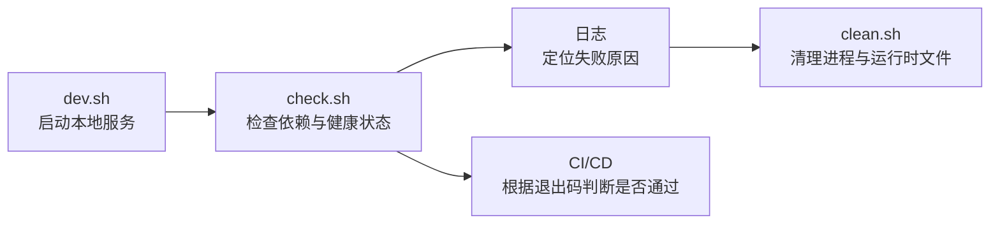
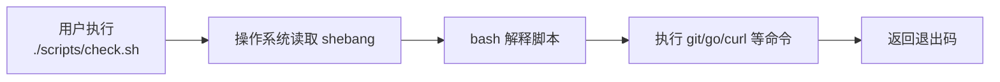

# 第 6 篇：Shell 脚本与自动化基础

前 5 篇已经完成了开发环境、Linux 文件系统、进程服务、网络排障和 Git 团队协作。到这里，`Cloud Native Todo Platform` 已经不只是一个能运行的 Demo，而是一个需要被反复启动、检查、清理和提交的工程项目。

真实工作中，工程师不会每天手工重复输入长串命令。启动服务、检查依赖、判断健康状态、清理旧进程、查看日志、在 CI 中拦截错误，这些动作都应该逐步沉淀成脚本。Shell 脚本就是云原生工程里最常见的自动化胶水。

本篇对应 4 个章节主题：

- 6.1 Shell 变量、参数、退出码与条件判断
- 6.2 循环、函数、文件处理与管道
- 6.3 编写项目启动、健康检查和清理脚本
- 6.4 Shell 脚本常见问题与环境变量管理

本篇特色项目是：**为 Todo 平台编写 `dev.sh`、`check.sh`、`clean.sh` 脚本，实现一键启动、检查和清理**。

你会在课程项目中新增 `scripts/` 目录，用 3 个脚本建立本地开发最小闭环：`dev.sh` 启动 Todo 开发服务，`check.sh` 检查工具、文件和 HTTP 健康状态，`clean.sh` 清理进程与运行时文件。这个脚本入口会被后续 Go、Docker、Kubernetes、CI/CD 和 Operator 章节持续复用。

## 1. 本章学习目标

学完本篇后，你应该能把重复命令整理成可复用、可检查、可排障的 Shell 脚本，并能说明每个脚本失败时为什么要返回非 `0` 退出码。

### 1.1 知识目标

- 能解释 Shell、Bash、脚本文件和 shebang 的关系。
- 能说明变量、环境变量、位置参数、默认值和 `.env` 文件的用途。
- 能解释退出码 `0` 与非 `0` 在本地脚本和 CI/CD 中的意义。
- 能描述 `if`、`case`、`for`、函数、管道和文件测试表达式的常见用法。
- 能解释 `set -Eeuo pipefail` 能减少哪些隐性错误，以及它不是万能保险。

### 1.2 技能目标

- 能编写带 shebang、严格模式、函数和清晰日志的 Bash 脚本。
- 能使用环境变量和 `.env.example` 管理本地开发参数。
- 能编写 `dev.sh` 启动本地 Todo 服务，并用 PID 文件记录进程。
- 能编写 `check.sh` 检查依赖命令、脚本权限、Git 状态和 HTTP 健康状态。
- 能编写 `clean.sh` 安全清理服务进程、日志和本地运行时目录。
- 能通过 `bash -n`、ShellCheck 和退出码判断脚本是否适合进入 PR。

本篇结束时，你至少应该能独立完成下面这组命令：

```bash
./scripts/dev.sh
./scripts/check.sh
curl -fsS http://127.0.0.1:18080/healthz
./scripts/clean.sh
TODO_PORT=18081 ./scripts/dev.sh
TODO_PORT=18081 ./scripts/check.sh
TODO_CLEAN_LOGS=true ./scripts/clean.sh
```

这些命令会成为后续章节的本地开发入口。后面写 Go API、Dockerfile、Compose、Kubernetes YAML 和 Operator 控制器时，都需要同样的自动化意识。

## 2. 本章工作场景与真实案例

### 2.1 技术痛点

没有脚本时，项目协作会出现很多低级但高频的问题：

- 新同学不知道启动服务要先创建哪些目录、设置哪些环境变量。
- 每个人手工输入的命令略有不同，排查问题时无法复现。
- 旧进程占用端口，新服务启动失败，但终端里只看到一串零散错误。
- CI 中某个检查已经失败，脚本却因为最后一条命令成功而返回 `0`。
- 清理脚本没有校验路径，变量为空时可能删除错误目录。
- `.env` 被误提交到仓库，数据库密码、Token 或 kubeconfig 路径进入远程历史。

Shell 脚本的价值不是把命令藏起来，而是把团队共识变成可执行、可失败、可审查的工程入口。

### 2.2 真实协作场景

在企业项目中，Shell 脚本通常承担这些职责：

- 后端开发执行 `./scripts/dev.sh` 一键启动本地 API。
- 测试同学执行 `./scripts/check.sh` 判断依赖、脚本权限和服务健康状态是否正确。
- Reviewer 在 PR/MR 中查看脚本是否有正确退出码、是否会误删文件、是否会泄露密钥。
- CI/CD 在 PR 上执行 `bash -n scripts/*.sh` 和 `shellcheck scripts/*.sh`。
- SRE 或平台团队把脚本模式演进为 Docker Compose、Kubernetes Job、Helm hook 或 GitHub Actions。



### 2.3 课程项目关联

本篇产出会被后续章节直接复用：

- 第 7 篇会在脚本基础上进入 Go CLI 开发。
- 第 8 到第 14 篇会用 `dev.sh` 和 `check.sh` 支撑本地 Go API 开发。
- 第 15 到第 19 篇会把本地启动逻辑逐步演进到 Docker 和 Docker Compose。
- 第 20 到第 33 篇会把健康检查、日志和清理思路迁移到 Kubernetes、Helm 和生产排障。
- 第 34 到第 41 篇会在 Operator 开发中继续依赖脚本完成代码生成、测试和本地调试。

本篇真实案例是：

> Todo 平台团队希望把“启动服务、检查健康状态、清理旧进程”从口头说明变成固定脚本。你需要编写 `dev.sh`、`check.sh`、`clean.sh`，让任何成员都能在同样的入口上完成本地开发闭环。

## 3. 核心概念

### 3.1 Shell、Bash 与 shebang

Shell 是用户和操作系统之间的命令解释器。Bash 是 Linux 世界最常见的 Shell 之一。脚本文件本质上是一组按顺序执行的命令。

脚本第一行通常是 shebang：

```bash
#!/usr/bin/env bash
```

推荐使用 `/usr/bin/env bash`，因为它会从 `PATH` 中寻找 Bash，适合课程统一的 Ubuntu 24.04 环境，也便于后续在 CI Runner 中复用。

### 3.2 变量、环境变量和默认值

Shell 变量定义时，等号两侧不能有空格：

```bash
name="todo"
printf '%s\n' "$name"
```

环境变量可以传给子进程。下面命令只对本次脚本执行生效：

```bash
TODO_PORT=18081 ./scripts/dev.sh
```

脚本里常用默认值写法：

```bash
PORT="${TODO_PORT:-18080}"
```

含义是：如果环境变量 `TODO_PORT` 存在且非空，就使用它；否则使用 `18080`。

`.env` 文件用于保存本地开发参数，例如端口、日志级别和临时开关。真实项目中通常提交 `.env.example`，但不提交 `.env`。

### 3.3 位置参数与 `case`

位置参数用于读取脚本参数：

| 参数 | 含义 |
|---|---|
| `$0` | 脚本自身名称 |
| `$1` | 第 1 个参数 |
| `$2` | 第 2 个参数 |
| `$#` | 参数个数 |
| `"$@"` | 所有参数，推荐带双引号使用 |

不加引号的 `$@` 会受单词拆分影响。如果参数里包含空格，例如 `--title "learn shell"`，`$@` 可能被拆成更多参数；`"$@"` 会保留每个原始参数的边界。

处理多个参数时，`case` 比一串 `if` 更清晰：

```bash
case "$1" in
  --logs) clean_logs=true ;;
  --all) clean_all=true ;;
  -h|--help) usage ;;
  *) echo "unknown option: $1" >&2; exit 1 ;;
esac
```

本篇的 `clean.sh` 会用参数控制是否清理日志和全部运行时目录。

### 3.4 退出码

Shell 中，退出码决定命令是否成功：

```bash
true
echo $?
0

false
echo $?
1
```

约定如下：

| 退出码 | 含义 |
|---|---|
| `0` | 成功 |
| 非 `0` | 失败 |

CI/CD 判断脚本是否通过，主要看退出码。如果 `check.sh` 发现健康检查失败但最后 `exit 0`，流水线会误以为一切正常。

### 3.5 条件、循环和函数

文件检查常用表达式如下：

| 表达式 | 含义 |
|---|---|
| `-f file` | 普通文件存在 |
| `-d dir` | 目录存在 |
| `-x file` | 文件存在且可执行 |
| `-n "$var"` | 字符串非空 |
| `-z "$var"` | 字符串为空 |

循环常用于批量检查命令或文件：

```bash
for cmd in bash git go curl; do
  command -v "$cmd" >/dev/null || echo "missing: $cmd"
done
```

函数用于把重复逻辑命名：

```bash
log() {
  printf '[check] %s\n' "$*"
}
```

好的脚本会把“日志输出、失败退出、依赖检查、安全删除”封装成函数，而不是到处复制粘贴。

### 3.6 管道、文件和日志处理

管道把前一个命令的输出交给后一个命令：

```bash
tail -n 50 .todo-platform/logs/todo-dev.log | grep -i error
```

日志排查中常见组合如下：

```bash
grep -R "address already in use" .todo-platform/logs
find .todo-platform -type f -maxdepth 3 -print
awk '{print $1}' access.log | sort | uniq -c | sort -nr
```

管道很强大，也很容易隐藏错误。本篇会使用 `set -o pipefail`，让管道中任一命令失败都能被脚本感知。

## 4. 原理深入

### 4.1 脚本如何被执行

执行脚本时，操作系统会读取 shebang，找到解释器，然后由解释器逐行执行命令。



脚本不是编译后的二进制文件。它每调用一次外部命令，例如 `go`、`curl`、`grep`，通常都会启动一个新进程。这也是为什么脚本适合编排命令，不适合承载复杂业务逻辑。

### 4.2 `set -Eeuo pipefail` 的边界

生产脚本常见开头如下：

```bash
set -Eeuo pipefail
```

| 选项 | 作用 |
|---|---|
| `-e` | 命令失败时尽快退出 |
| `-E` | 让 `ERR` trap 在函数中也生效 |
| `-u` | 使用未定义变量时报错 |
| `-o pipefail` | 管道中任一命令失败，整个管道失败 |

没有 `pipefail` 时，下面这种命令可能看起来成功：

```bash
grep "ERROR" missing.log | wc -l
```

如果最后的 `wc -l` 成功，整条管道可能返回成功，前面的 `grep` 失败被掩盖。`pipefail` 可以降低这种风险。

但严格模式不是万能的。允许失败的命令要显式处理：

```bash
if ! curl -fsS "$url" >/dev/null; then
  echo "health check failed" >&2
  exit 1
fi
```

### 4.3 `.env` 的收益与风险

`.env` 可以让开发者不用每次输入端口和开关：

```text
TODO_HOST=127.0.0.1
TODO_PORT=18080
TODO_REQUIRE_SHELLCHECK=false
```

但 `.env` 也容易带来两个风险：

- 把真实密码、Token、kubeconfig 路径提交到 Git。
- 使用 `source .env` 时，如果 `.env` 不是可信文件，里面的命令可能被执行。

本篇只解析简单的 `KEY=VALUE` 行，并且提交 `.env.example` 而不是 `.env`。后续涉及真实密钥时，应使用 Secret Manager、Kubernetes Secret 或 CI/CD 平台的加密变量。

本篇的 `.env` 解析器刻意保持简单，只支持普通 `KEY=VALUE` 和双引号包裹的值，不支持 `export KEY=value`、变量插值、命令替换或多行值。这样做是为了避免把 `.env` 当成脚本执行。

### 4.4 幂等性与安全清理

幂等性是指同一操作执行多次，结果仍然可预期。

```bash
mkdir -p .todo-platform/logs
mkdir -p .todo-platform/logs
```

第二次执行不会报错，这就是幂等。

清理脚本更需要防御式设计。下面这种命令很危险：

```bash
rm -rf "$target"
```

如果 `target` 为空、拼错或指向错误目录，可能造成严重事故。更安全的做法是先确认路径非空，并限制只能删除项目运行时目录。

### 4.5 Shell 与后续云原生工具的关系

Shell 不会替代 Docker、Kubernetes、Helm 或 Operator，但它会出现在所有阶段：

| 阶段 | Shell 用途 |
|---|---|
| Go 开发 | 启动服务、执行测试、生成代码 |
| Docker | 构建镜像、运行 Compose、清理容器 |
| Kubernetes | 包装 `kubectl get/logs/describe/rollout` |
| CI/CD | 串联检查、构建、扫描和发布步骤 |
| Operator | 执行 codegen、envtest、本地调试 |

因此，本篇不是“学几个 Shell 语法”，而是为后续工程化动作建立可复用入口。

## 5. 手把手实验

### 5.1 实验目标

本实验会在 `cloud-native-todo-platform` 仓库中创建一套本地自动化脚本：

- `.env.example`：声明可配置环境变量。
- `scripts/dev.sh`：生成最小 Go HTTP 服务，构建二进制并后台启动。
- `scripts/check.sh`：检查工具、文件、权限、Git 状态和 `/healthz`。
- `scripts/clean.sh`：清理进程、日志和运行时目录。
- `.github/workflows/scripts-check.yml`：可选 CI 检查脚本语法和 ShellCheck。

完成后，你可以用一组固定命令启动、检查和清理本地 Todo 服务。

预计耗时：45 到 70 分钟。

### 5.2 实验环境

本实验应在 `cloud-native-todo-platform` 项目仓库中执行，不是在课程文档仓库中执行。如果当前目录是 `cloud-native-todo-platform-docs` 或 `docs`，请先切换到真实项目仓库。

| 项目 | 要求 |
|---|---|
| 系统 | Ubuntu 24.04 LTS |
| Shell | Bash 5.x |
| Git | 已完成第 5 篇 Git 工作流 |
| Go | 1.26.x，与课程环境锁定版本一致 |
| curl | 用于 HTTP 健康检查 |
| 可选 | ShellCheck，用于脚本静态检查 |

确认工具版本：

```bash
bash --version | head -n 1
git --version
go version
curl --version | head -n 1
```

如果要在本地启用 ShellCheck：

```bash
sudo apt update
sudo apt install -y shellcheck
```

进入项目仓库：

```bash
cd ~/workspace/cloud-native-todo-platform
```

### 5.3 文件目录结构

实验完成后的结构如下：

```text
cloud-native-todo-platform/
├── .env.example
├── .gitignore
├── .github/
│   └── workflows/
│       └── scripts-check.yml
├── cmd/
│   └── todo-dev-server/
│       └── main.go
├── scripts/
│   ├── dev.sh
│   ├── check.sh
│   └── clean.sh
└── .todo-platform/
    ├── bin/
    │   └── todo-dev-server
    ├── logs/
    │   └── todo-dev.log
    └── run/
        └── todo-dev.pid
```

说明：

- `cmd/todo-dev-server/main.go` 是本篇脚本自动生成的最小 Go HTTP 服务。
- `.todo-platform/` 是本地运行时目录，不应该提交到 Git。
- `.env.example` 可以提交，`.env` 不应该提交。
- `.github/workflows/scripts-check.yml` 是可选 CI 文件，如果暂时不用 GitHub Actions，可以先不提交。

### 5.4 完整代码和配置

`.env.example`：

```text title=".env.example"
TODO_HOST=127.0.0.1
TODO_PORT=18080
TODO_REQUIRE_SHELLCHECK=false
```

`scripts/dev.sh`：

```bash title="scripts/dev.sh"
#!/usr/bin/env bash
set -Eeuo pipefail

ROOT_DIR="$(cd "$(dirname "${BASH_SOURCE[0]}")/.." && pwd)"
ENV_FILE="$ROOT_DIR/.env"
APP_DIR="$ROOT_DIR/cmd/todo-dev-server"
BIN_DIR="$ROOT_DIR/.todo-platform/bin"
RUN_DIR="$ROOT_DIR/.todo-platform/run"
LOG_DIR="$ROOT_DIR/.todo-platform/logs"
BIN_FILE="$BIN_DIR/todo-dev-server"
PID_FILE="$RUN_DIR/todo-dev.pid"
ADDR_FILE="$RUN_DIR/todo-dev.addr"
LOG_FILE="$LOG_DIR/todo-dev.log"

log() {
  printf '[dev] %s\n' "$*"
}

die() {
  printf '[dev][error] %s\n' "$*" >&2
  exit 1
}

on_error() {
  local line="$1"
  printf '[dev][error] failed at line %s\n' "$line" >&2
}

trap 'on_error "$LINENO"' ERR

need_cmd() {
  command -v "$1" >/dev/null 2>&1 || die "missing command: $1"
}

load_env() {
  [[ -f "$ENV_FILE" ]] || return 0

  while IFS='=' read -r key value || [[ -n "$key" ]]; do
    key="${key%$'\r'}"
    value="${value%$'\r'}"
    [[ -n "$key" ]] || continue
    [[ "$key" == \#* ]] && continue
    [[ "$key" =~ ^[A-Za-z_][A-Za-z0-9_]*$ ]] || continue

    value="${value#\"}"
    value="${value%\"}"

    if [[ -z "${!key:-}" ]]; then
      export "$key=$value"
    fi
  done < "$ENV_FILE"
}

read_pid() {
  if [[ -f "$PID_FILE" ]]; then
    cat "$PID_FILE"
  fi
}

read_addr() {
  if [[ -f "$ADDR_FILE" ]]; then
    cat "$ADDR_FILE"
  fi
}

is_running() {
  local pid
  pid="$(read_pid || true)"
  [[ "$pid" =~ ^[0-9]+$ ]] && kill -0 "$pid" 2>/dev/null
}

validate_port() {
  local port="$1"
  local port_num
  [[ "$port" =~ ^[0-9]+$ ]] || die "invalid TODO_PORT: $port"
  port_num=$((10#$port))
  (( port_num >= 1 && port_num <= 65535 )) || die "TODO_PORT out of range: $port"
}

write_demo_app() {
  mkdir -p "$APP_DIR"

  if [[ -f "$APP_DIR/main.go" ]]; then
    return
  fi

  cat > "$APP_DIR/main.go" <<'GOEOF'
package main

import (
	"encoding/json"
	"log"
	"net/http"
	"os"
	"time"
)

type Todo struct {
	ID        int       `json:"id"`
	Title     string    `json:"title"`
	Completed bool      `json:"completed"`
	CreatedAt time.Time `json:"created_at"`
}

func main() {
	addr := getenv("TODO_ADDR", "127.0.0.1:18080")

	mux := http.NewServeMux()
	mux.HandleFunc("/healthz", func(w http.ResponseWriter, r *http.Request) {
		w.Header().Set("Content-Type", "application/json")
		_ = json.NewEncoder(w).Encode(map[string]string{
			"status":  "ok",
			"service": "todo-dev-server",
		})
	})
	mux.HandleFunc("/todos", func(w http.ResponseWriter, r *http.Request) {
		w.Header().Set("Content-Type", "application/json")
		todos := []Todo{
			{ID: 1, Title: "learn shell scripting", Completed: false, CreatedAt: time.Now()},
			{ID: 2, Title: "prepare go api chapter", Completed: false, CreatedAt: time.Now()},
		}
		_ = json.NewEncoder(w).Encode(todos)
	})

	log.Printf("todo dev server listening on %s", addr)

	server := &http.Server{
		Addr:              addr,
		Handler:           mux,
		ReadHeaderTimeout: 5 * time.Second,
	}
	if err := server.ListenAndServe(); err != nil {
		log.Fatal(err)
	}
}

func getenv(key, fallback string) string {
	value := os.Getenv(key)
	if value == "" {
		return fallback
	}
	return value
}
GOEOF
}

ensure_go_module() {
  if [[ -f "$ROOT_DIR/go.mod" ]]; then
    return
  fi

  log "go.mod not found; creating a temporary module for this lab"
  (
    cd "$ROOT_DIR"
    go mod init cloud-native-todo-platform >/dev/null
  )
}

build_app() {
  ensure_go_module
  mkdir -p "$BIN_DIR"

  log "building todo dev server"
  (
    cd "$ROOT_DIR"
    go build -o "$BIN_FILE" ./cmd/todo-dev-server
  )
}

main() {
  load_env

  local host="${TODO_HOST:-127.0.0.1}"
  local port="${TODO_PORT:-18080}"
  validate_port "$port"
  local addr="$host:$port"

  need_cmd go
  need_cmd curl

  mkdir -p "$BIN_DIR" "$RUN_DIR" "$LOG_DIR"

  if is_running; then
    local running_addr
    running_addr="$(read_addr || true)"
    running_addr="${running_addr:-http://$addr}"

    if [[ "$running_addr" != "http://$addr" ]]; then
      die "todo dev server already running at $running_addr; run ./scripts/clean.sh --all before changing address to http://$addr"
    fi

    log "todo dev server already running: pid=$(read_pid), url=$running_addr"
    exit 0
  fi

  write_demo_app
  build_app

  log "starting todo dev server on http://$addr"
  (
    cd "$ROOT_DIR"
    TODO_ADDR="$addr" nohup "$BIN_FILE" >"$LOG_FILE" 2>&1 &
    echo "$!" >"$PID_FILE"
    printf 'http://%s\n' "$addr" >"$ADDR_FILE"
  )

  sleep 2

  if ! is_running; then
    tail -n 40 "$LOG_FILE" >&2 || true
    die "todo dev server failed to start"
  fi

  curl -fsS "http://$addr/healthz" >/dev/null || die "health check failed"

  log "started: pid=$(read_pid)"
  log "health: http://$addr/healthz"
  log "todos:  http://$addr/todos"
  log "log:    $LOG_FILE"
}

main "$@"
```

`dev.sh` 会把进程号写入 `todo-dev.pid`，把真实访问地址写入 `todo-dev.addr`。如果服务已经运行，再用不同端口启动，脚本会提示先清理旧进程，避免输出一个并不存在的“新端口已运行”。

这里使用 `nohup ... &` 是为了本地开发便利，让服务能在后台保持运行。生产环境不应长期依赖这种方式管理服务，应使用第 3 篇介绍的 systemd，或在后续章节中交给容器和 Kubernetes 管理。

`scripts/check.sh`：

```bash title="scripts/check.sh"
#!/usr/bin/env bash
set -Eeuo pipefail

ROOT_DIR="$(cd "$(dirname "${BASH_SOURCE[0]}")/.." && pwd)"
ENV_FILE="$ROOT_DIR/.env"
STATUS=0

info() {
  printf '[check] %s\n' "$*"
}

ok() {
  printf '[check][ok] %s\n' "$*"
}

warn() {
  printf '[check][warn] %s\n' "$*" >&2
}

fail() {
  printf '[check][fail] %s\n' "$*" >&2
  STATUS=1
}

load_env() {
  [[ -f "$ENV_FILE" ]] || return 0

  while IFS='=' read -r key value || [[ -n "$key" ]]; do
    key="${key%$'\r'}"
    value="${value%$'\r'}"
    [[ -n "$key" ]] || continue
    [[ "$key" == \#* ]] && continue
    [[ "$key" =~ ^[A-Za-z_][A-Za-z0-9_]*$ ]] || continue

    value="${value#\"}"
    value="${value%\"}"

    if [[ -z "${!key:-}" ]]; then
      export "$key=$value"
    fi
  done < "$ENV_FILE"
}

check_cmd() {
  local cmd="$1"
  if command -v "$cmd" >/dev/null 2>&1; then
    ok "$cmd found: $(command -v "$cmd")"
  else
    fail "$cmd not found"
  fi
}

check_file() {
  local file="$1"
  if [[ -f "$ROOT_DIR/$file" ]]; then
    ok "$file exists"
  else
    fail "$file missing"
  fi
}

check_executable() {
  local file="$1"
  if [[ -x "$ROOT_DIR/$file" ]]; then
    ok "$file is executable"
  else
    fail "$file is not executable"
  fi
}

check_git_repo() {
  if git -C "$ROOT_DIR" rev-parse --is-inside-work-tree >/dev/null 2>&1; then
    ok "git repository detected"
  else
    warn "not a git repository yet"
  fi
}

check_gitignore() {
  if [[ -f "$ROOT_DIR/.gitignore" ]] && grep -qxF ".todo-platform/" "$ROOT_DIR/.gitignore"; then
    ok ".todo-platform/ is ignored"
  else
    fail ".todo-platform/ is not ignored by .gitignore"
  fi
}

check_syntax() {
  local file
  for file in scripts/dev.sh scripts/check.sh scripts/clean.sh; do
    if bash -n "$ROOT_DIR/$file"; then
      ok "$file syntax ok"
    else
      fail "$file syntax error"
    fi
  done
}

check_shellcheck() {
  if command -v shellcheck >/dev/null 2>&1; then
    shellcheck "$ROOT_DIR"/scripts/*.sh || fail "shellcheck reported issues"
    return
  fi

  if [[ "${TODO_REQUIRE_SHELLCHECK:-false}" == "true" ]]; then
    fail "shellcheck is required but not installed"
  else
    warn "shellcheck not installed; skipped"
  fi
}

validate_port() {
  local port="$1"
  local port_num
  if [[ ! "$port" =~ ^[0-9]+$ ]]; then
    fail "invalid TODO_PORT: $port"
    return 1
  fi

  port_num=$((10#$port))
  if (( port_num < 1 || port_num > 65535 )); then
    fail "TODO_PORT out of range: $port"
    return 1
  fi
}

check_health() {
  local host="${TODO_HOST:-127.0.0.1}"
  local port="${TODO_PORT:-18080}"
  local url="http://$host:$port/healthz"

  validate_port "$port" || return

  info "checking $url"

  if curl -fsS "$url" >/dev/null; then
    ok "health check passed"
  else
    fail "health check failed; run ./scripts/dev.sh first"
  fi
}

main() {
  load_env

  info "root: $ROOT_DIR"

  for cmd in bash git go curl grep; do
    check_cmd "$cmd"
  done

  check_git_repo
  check_file ".env.example"
  check_file "scripts/dev.sh"
  check_file "scripts/check.sh"
  check_file "scripts/clean.sh"
  check_executable "scripts/dev.sh"
  check_executable "scripts/check.sh"
  check_executable "scripts/clean.sh"
  check_gitignore
  check_syntax
  check_shellcheck
  check_health

  if [[ "$STATUS" -ne 0 ]]; then
    fail "one or more checks failed"
    exit "$STATUS"
  fi

  ok "all checks passed"
}

main "$@"
```

`check.sh` 会在发起 HTTP 请求前校验 `TODO_PORT`。如果 `.env` 中写成 `TODO_PORT=abc`，脚本会报告端口配置错误，而不是笼统地说健康检查失败。

`check_syntax` 显式列出 3 个脚本，而不是直接使用 `scripts/*.sh`，是为了避免误检查临时脚本或非 Bash 文件。如果后续新增 `logs.sh`、`build.sh` 等脚本，记得把它们加入这个列表和 CI 检查。

`scripts/clean.sh`：

```bash title="scripts/clean.sh"
#!/usr/bin/env bash
set -Eeuo pipefail

ROOT_DIR="$(cd "$(dirname "${BASH_SOURCE[0]}")/.." && pwd)"
RUNTIME_DIR="$ROOT_DIR/.todo-platform"
RUN_DIR="$RUNTIME_DIR/run"
LOG_DIR="$RUNTIME_DIR/logs"
BIN_FILE="$RUNTIME_DIR/bin/todo-dev-server"
PID_FILE="$RUN_DIR/todo-dev.pid"
ADDR_FILE="$RUN_DIR/todo-dev.addr"
CLEAN_LOGS="${TODO_CLEAN_LOGS:-false}"
CLEAN_ALL="${TODO_CLEAN_ALL:-false}"

log() {
  printf '[clean] %s\n' "$*"
}

warn() {
  printf '[clean][warn] %s\n' "$*" >&2
}

die() {
  printf '[clean][error] %s\n' "$*" >&2
  exit 1
}

on_error() {
  local line="$1"
  printf '[clean][error] failed at line %s\n' "$line" >&2
}

trap 'on_error "$LINENO"' ERR

usage() {
  cat <<'USAGE'
Usage: ./scripts/clean.sh [--logs] [--all]

Options:
  --logs   remove log files under .todo-platform/logs
  --all    remove the whole .todo-platform runtime directory
  -h, --help
USAGE
}

parse_args() {
  while [[ $# -gt 0 ]]; do
    case "$1" in
      --logs)
        CLEAN_LOGS=true
        ;;
      --all)
        CLEAN_LOGS=true
        CLEAN_ALL=true
        ;;
      -h|--help)
        usage
        exit 0
        ;;
      *)
        die "unknown option: $1"
        ;;
    esac
    shift
  done
}

read_pid() {
  if [[ -f "$PID_FILE" ]]; then
    cat "$PID_FILE"
  fi
}

clear_run_files() {
  rm -f "$PID_FILE" "$ADDR_FILE"
}

safe_rm_dir() {
  local target="$1"

  [[ -n "$target" ]] || die "empty path is not allowed"

  case "$target" in
    "$RUNTIME_DIR"|"$RUNTIME_DIR"/*) ;;
    *) die "refuse to remove path outside runtime directory: $target" ;;
  esac

  rm -rf "$target"
}

process_matches() {
  local pid="$1"

  if [[ -r "/proc/$pid/cmdline" ]]; then
    tr '\0' ' ' < "/proc/$pid/cmdline" | grep -F -- "$BIN_FILE" >/dev/null
    return
  fi

  return 0
}

stop_process() {
  local pid
  pid="$(read_pid || true)"

  if [[ ! "$pid" =~ ^[0-9]+$ ]]; then
    log "no valid pid file found"
    clear_run_files
    return
  fi

  if ! kill -0 "$pid" 2>/dev/null; then
    log "process $pid is not running"
    clear_run_files
    return
  fi

  if ! process_matches "$pid"; then
    warn "pid $pid does not look like todo-dev-server; removing stale run files only"
    clear_run_files
    return
  fi

  log "stopping process $pid"
  kill "$pid"

  for _ in 1 2 3 4 5; do
    if ! kill -0 "$pid" 2>/dev/null; then
      log "process $pid stopped"
      clear_run_files
      return
    fi
    sleep 1
  done

  warn "process $pid did not stop gracefully; sending SIGKILL"
  kill -9 "$pid" 2>/dev/null || true
  clear_run_files
}

main() {
  parse_args "$@"
  stop_process

  if [[ "$CLEAN_LOGS" == "true" ]]; then
    log "removing logs: $LOG_DIR"
    safe_rm_dir "$LOG_DIR"
  else
    log "keep logs: $LOG_DIR"
  fi

  if [[ "$CLEAN_ALL" == "true" ]]; then
    log "removing runtime directory: $RUNTIME_DIR"
    safe_rm_dir "$RUNTIME_DIR"
  fi

  log "clean completed"
}

main "$@"
```

`clean.sh` 在 Ubuntu 24.04 中会通过 `/proc/$pid/cmdline` 校验 PID 是否像本篇启动的 `todo-dev-server`。这可以降低 PID 文件过旧、PID 被系统复用时误杀其他进程的风险。

可选 CI 文件 `.github/workflows/scripts-check.yml`：

```yaml title=".github/workflows/scripts-check.yml"
name: scripts-check

on:
  pull_request:
    paths:
      - "scripts/**"
      - ".github/workflows/scripts-check.yml"
  push:
    branches:
      - main
    paths:
      - "scripts/**"
      - ".github/workflows/scripts-check.yml"

jobs:
  shell:
    runs-on: ubuntu-latest
    steps:
      - name: Checkout
        uses: actions/checkout@v4

      - name: Check Bash syntax
        run: |
          bash -n scripts/dev.sh
          bash -n scripts/check.sh
          bash -n scripts/clean.sh

      - name: Install ShellCheck
        run: sudo apt-get update && sudo apt-get install -y shellcheck

      - name: Run ShellCheck
        run: shellcheck scripts/*.sh
```

关键字段说明：

| 字段 | 作用 |
|---|---|
| `pull_request` | PR 创建或更新时执行检查 |
| `push.branches` | 推送到 `main` 时执行检查 |
| `paths` | 只在脚本或工作流变化时触发 |
| `runs-on` | 使用 Ubuntu Runner |
| `bash -n` | 只检查 Bash 语法，不执行脚本 |
| `shellcheck` | 发现未引用变量、危险写法等常见问题 |

### 5.5 执行命令

从项目根目录开始：

```bash
pwd
git status --short --branch
mkdir -p scripts .github/workflows
```

创建 `.env.example`，并确保本地运行时目录和 `.env` 不进入 Git：

```bash
printf 'TODO_HOST=127.0.0.1\nTODO_PORT=18080\nTODO_REQUIRE_SHELLCHECK=false\n' > .env.example
touch .gitignore
grep -qxF '.todo-platform/' .gitignore || printf '%s\n' '.todo-platform/' >> .gitignore
grep -qxF '.env' .gitignore || printf '%s\n' '.env' >> .gitignore
```

把 5.4 中的 `dev.sh`、`check.sh`、`clean.sh` 保存到 `scripts/` 目录；如果使用 GitHub Actions，把 `scripts-check.yml` 保存到 `.github/workflows/`。

授予执行权限：

```bash
chmod +x scripts/dev.sh scripts/check.sh scripts/clean.sh
ls -l scripts/*.sh
```

先检查语法：

```bash
bash -n scripts/dev.sh
bash -n scripts/check.sh
bash -n scripts/clean.sh
```

启动服务：

```bash
./scripts/dev.sh
```

检查服务：

```bash
./scripts/check.sh
curl -fsS http://127.0.0.1:18080/healthz
curl -fsS http://127.0.0.1:18080/todos
```

测试 `.env` 和环境变量覆盖：

```bash
printf 'TODO_HOST=127.0.0.1\nTODO_PORT=18081\nTODO_REQUIRE_SHELLCHECK=false\n' > .env
./scripts/clean.sh --all
./scripts/dev.sh
./scripts/check.sh
```

命令行环境变量优先级高于 `.env`：

```bash
./scripts/clean.sh --all
TODO_PORT=18082 ./scripts/dev.sh
TODO_PORT=18082 ./scripts/check.sh
```

清理运行时文件：

```bash
./scripts/clean.sh --logs
./scripts/clean.sh --all
```

提交前检查：

```bash
git status --short
git diff -- .gitignore .env.example scripts .github/workflows/scripts-check.yml
git add .gitignore .env.example scripts/dev.sh scripts/check.sh scripts/clean.sh
```

如果你决定启用 GitHub Actions，再额外添加：

```bash
git add .github/workflows/scripts-check.yml
```

提交示例：

```bash
git commit -m "chore: add shell automation scripts"
```

### 5.6 预期输出

`./scripts/dev.sh` 输出类似：

```text
[dev] building todo dev server
[dev] starting todo dev server on http://127.0.0.1:18080
[dev] started: pid=12345
[dev] health: http://127.0.0.1:18080/healthz
[dev] todos:  http://127.0.0.1:18080/todos
[dev] log:    /home/user/workspace/cloud-native-todo-platform/.todo-platform/logs/todo-dev.log
```

`./scripts/check.sh` 输出类似：

```text
[check] root: /home/user/workspace/cloud-native-todo-platform
[check][ok] bash found: /usr/bin/bash
[check][ok] git found: /usr/bin/git
[check][ok] go found: /usr/local/go/bin/go
[check][ok] curl found: /usr/bin/curl
[check][ok] grep found: /usr/bin/grep
[check][ok] git repository detected
[check][ok] .env.example exists
[check][ok] scripts/dev.sh exists
[check][ok] scripts/check.sh exists
[check][ok] scripts/clean.sh exists
[check][ok] scripts/dev.sh is executable
[check][ok] scripts/check.sh is executable
[check][ok] scripts/clean.sh is executable
[check][ok] .todo-platform/ is ignored
[check][ok] scripts/dev.sh syntax ok
[check][ok] scripts/check.sh syntax ok
[check][ok] scripts/clean.sh syntax ok
[check][warn] shellcheck not installed; skipped
[check][ok] health check passed
[check][ok] all checks passed
```

`curl -fsS http://127.0.0.1:18080/healthz` 输出类似：

```json
{"service":"todo-dev-server","status":"ok"}
```

`./scripts/clean.sh --all` 输出类似：

```text
[clean] stopping process 12345
[clean] process 12345 stopped
[clean] removing logs: /home/user/workspace/cloud-native-todo-platform/.todo-platform/logs
[clean] removing runtime directory: /home/user/workspace/cloud-native-todo-platform/.todo-platform
[clean] clean completed
```

### 5.7 验证方法

从项目根目录执行：

```bash
test -f .env.example
test -x scripts/dev.sh
test -x scripts/check.sh
test -x scripts/clean.sh
grep -qxF '.todo-platform/' .gitignore
grep -qxF '.env' .gitignore
bash -n scripts/dev.sh scripts/check.sh scripts/clean.sh
./scripts/dev.sh
./scripts/check.sh
curl -fsS http://127.0.0.1:18080/healthz
./scripts/clean.sh --all
```

判断标准：

- 3 个脚本都存在且可执行。
- `.env.example` 存在，`.env` 和 `.todo-platform/` 已进入 `.gitignore`。
- `bash -n` 返回 `0`。
- `./scripts/dev.sh` 能启动服务并生成 PID 文件。
- `./scripts/check.sh` 返回 `0`，健康检查通过。
- `curl /healthz` 返回 JSON。
- `./scripts/clean.sh --all` 能停止进程并清理 `.todo-platform/`。

### 5.8 清理步骤

只清理运行时文件：

```bash
./scripts/clean.sh --all
```

保留脚本但删除本地 `.env`：

```bash
rm -f .env
```

如果你要完全重做本章实验，并且确认当前目录是课程项目根目录：

```bash
pwd
git status --short
rm -rf .todo-platform
rm -f .env
```

如果脚本文件已经提交到 Git，优先用 Git 管理回退，而不是手工删除：

```bash
git status --short
git restore --staged scripts .env.example .github/workflows/scripts-check.yml
```

不要在 `/`、`$HOME`、`/tmp` 或不确定目录中复制粘贴 `rm -rf`。真实生产脚本必须像本篇 `safe_rm_dir` 一样限制可删除路径。

## 6. 常见错误与排障

### 错误 1：脚本执行时报 `Permission denied`

- **现象**：

  ```text
  bash: ./scripts/dev.sh: Permission denied
  ```

- **原因**：脚本没有执行权限，或者文件位于不支持 Linux 执行权限的挂载目录。

- **排查**：

  ```bash
  ls -l scripts/dev.sh
  ```

  如果权限里没有 `x`，例如 `-rw-r--r--`，说明当前用户不能直接执行脚本。

- **修复**：

  ```bash
  chmod +x scripts/dev.sh scripts/check.sh scripts/clean.sh
  ```

- **预防**：脚本创建后立即 `chmod +x`，并在 `check.sh` 中检查 `-x` 权限。提交前用 `git diff --summary` 确认文件模式变化被记录。

### 错误 2：变量写法导致 `command not found`

- **现象**：

  ```text
  TODO_PORT: command not found
  ```

- **原因**：Shell 变量赋值时等号两侧有空格，例如 `TODO_PORT = 18080`。Shell 会把 `TODO_PORT` 当成命令执行。

- **排查**：

  ```bash
  bash -n scripts/dev.sh
  grep -n ' = ' scripts/*.sh
  ```

  `bash -n` 可以检查语法，但有些变量赋值错误只有运行时才暴露。

- **修复**：

  ```bash
  TODO_PORT=18080
  ```

- **预防**：变量赋值不加空格，引用变量时使用 `"$TODO_PORT"`。提交前运行 ShellCheck，它会提示很多变量相关问题。

### 错误 3：健康检查失败

- **现象**：

  ```text
  [check][fail] health check failed; run ./scripts/dev.sh first
  ```

  或者：

  ```text
  [check][fail] invalid TODO_PORT: abc
  ```

- **原因**：服务没有启动、端口不一致、旧进程占用端口，或者 `.env` 中配置了不同的 `TODO_PORT`。如果端口不是数字，`check.sh` 会在请求前直接失败。

- **排查**：

   ```bash
   ./scripts/dev.sh
   ./scripts/check.sh
   curl -v http://127.0.0.1:18080/healthz
   tail -n 50 .todo-platform/logs/todo-dev.log
   cat .env 2>/dev/null || true
   cat .todo-platform/run/todo-dev.addr 2>/dev/null || true
   ```

  `curl -v` 可以看出连接失败、HTTP 状态码异常，还是返回内容异常。日志中如果出现 `address already in use`，说明端口冲突。`todo-dev.addr` 可以确认当前进程真实监听地址。

- **修复**：

  ```bash
  ./scripts/clean.sh --all
  ./scripts/dev.sh
  ./scripts/check.sh
  ```

  如果使用了自定义端口，启动和检查必须使用同一个端口：

  ```bash
  TODO_PORT=18081 ./scripts/dev.sh
  TODO_PORT=18081 ./scripts/check.sh
  ```

- **预防**：把端口写入 `.env`，或者在团队文档中约定默认端口。不要让 `dev.sh` 和 `check.sh` 各自使用不同配置来源。

### 错误 4：脚本依赖了当前 Ubuntu 环境外的命令

- **现象**：

```text
./scripts/check.sh: line 42: jq: command not found
```

或者：

```text
date: invalid date 'next monday'
```

- **原因**：脚本使用了未在实验环境中声明的外部命令，或者依赖了不同发行版/不同工具版本才支持的参数。

- **排查**：

```bash
cat /etc/os-release
bash --version | head -n 1
command -v jq || true
date --version | head -n 1
```

  如果 `command -v` 没有输出，说明脚本依赖没有安装；如果参数在当前 Ubuntu 工具版本中不可用，就要改成更基础的写法。

- **修复**：把必要依赖写进实验环境表和安装步骤；能不用额外命令时，优先使用 Bash、curl、grep、sed、awk 等 Ubuntu 默认常见工具。

- **预防**：关键脚本在 Ubuntu 24.04 和 Ubuntu GitHub Actions Runner 中验证。新增外部命令时，同步更新 `check.sh`、README 和 CI 安装步骤。

### 错误 5：清理脚本误删或泄露敏感信息

- **现象**：

  ```text
  rm: cannot remove '/important/path': Permission denied
  ```

  或者 CI 日志中出现：

  ```text
  TODO_TOKEN=real-token
  ```

- **原因**：清理路径没有限制，变量为空或拼错时仍执行 `rm -rf`；调试时开启 `set -x` 或打印 `.env`，导致 Token、密码或 kubeconfig 路径进入日志。

- **排查**：

  ```bash
  grep -n 'rm -rf' scripts/*.sh
  grep -n 'set -x\|TOKEN\|PASSWORD\|SECRET' scripts/*.sh .env.example
  git grep -n -E 'TOKEN|PASSWORD|SECRET|BEGIN .*PRIVATE KEY' || true
  ```

  看到 `rm -rf "$var"` 时，要继续检查变量是否有路径白名单保护。看到敏感字段时，要确认是否只是示例名，还是实际密钥。

- **修复**：给删除函数增加路径限制；真实密钥立刻轮换，不要只从 Git 历史中删除。CI 中不要打印 `.env`，不要对敏感步骤使用 `set -x`。

- **预防**：提交 `.env.example`，忽略 `.env`；启用 secret scanning；清理脚本只允许删除项目运行时目录；危险操作必须经过 PR Review。

## 7. 生产环境注意事项

1. **脚本必须有清晰边界。**
   Shell 适合编排命令，不适合承载复杂业务逻辑。脚本一旦开始包含复杂数据结构、并发控制、复杂字符串解析或跨平台兼容矩阵，就应该考虑迁移到 Go、Python 或专门工具。生产脚本应保持入口清晰、参数有限、错误输出明确。

2. **退出码是自动化契约。**
   CI/CD、Makefile、Kubernetes hook 和部署平台通常不会理解日志含义，它们主要依赖退出码判断是否继续执行。生产脚本不能“打印失败但返回 0”，也不能吞掉关键命令失败。允许失败的命令要显式写成 `if ! command; then ... fi`。

3. **删除操作必须防御式设计。**
   所有 `rm -rf` 都应先校验变量非空、路径在白名单内、目标目录符合预期。生产脚本不要从用户输入直接拼接删除路径，不要在不确定目录下执行递归删除。依赖 PID 文件清理进程时，还要考虑 PID 复用风险，尽量校验进程命令行、可执行文件路径或启动时写入的身份信息。清理逻辑最好支持 dry-run 或至少打印即将删除的路径。

4. **环境变量和密钥要分层管理。**
   本地可以用 `.env`，但生产环境不应依赖开发者机器上的 `.env`。CI/CD 应使用平台加密变量，Kubernetes 应使用 Secret 或外部 Secret 管理系统。脚本日志不要打印密码、Token、证书、kubeconfig 内容或完整连接串。

5. **脚本也需要代码审查和静态检查。**
   Shell 脚本经常拥有很高权限，质量要求不应低于 Go 代码。关键脚本应经过 PR/MR Review，执行 `bash -n`、ShellCheck 和最小化集成测试。涉及部署、回滚和清理的脚本，还要在预发环境演练后再进入生产流程。

## 8. 本章小项目

本章小项目：**为 `cloud-native-todo-platform` 建立本地 Shell 自动化入口**。

交付物：

- `.env.example`
- 更新后的 `.gitignore`
- `scripts/dev.sh`
- `scripts/check.sh`
- `scripts/clean.sh`
- 可选 `.github/workflows/scripts-check.yml`
- 由脚本生成的 `cmd/todo-dev-server/main.go`

验收命令：

```bash
test -f .env.example
test -x scripts/dev.sh
test -x scripts/check.sh
test -x scripts/clean.sh
bash -n scripts/dev.sh scripts/check.sh scripts/clean.sh
./scripts/dev.sh
./scripts/check.sh
curl -fsS http://127.0.0.1:18080/healthz
./scripts/clean.sh --all
```

能力验收标准：

| 能力项 | 验收方式 |
|---|---|
| 脚本结构 | 3 个脚本都有 shebang、严格模式、函数和清晰日志 |
| 启动能力 | `dev.sh` 能构建并启动 Todo HTTP 服务 |
| 检查能力 | `check.sh` 能检查依赖、权限、语法和健康状态 |
| 清理能力 | `clean.sh --all` 能停止进程并删除运行时目录 |
| 环境变量 | `.env.example` 存在，`TODO_PORT` 能改变监听端口 |
| 退出码 | 成功返回 `0`，失败返回非 `0` |
| 安全性 | `.env` 和 `.todo-platform/` 不进入 Git，删除路径受限制，清理进程前有身份校验思路 |

## 9. 本章练习题

### 基础题

1. Shell 和 Bash 有什么区别？
2. 为什么变量赋值不能写成 `PORT = 18080`？
3. `"$@"` 和 `$@` 有什么区别？
4. `exit 0` 和 `exit 1` 在 CI/CD 中分别意味着什么？

### 实操题

1. 给 `check.sh` 增加 `--no-health` 参数，只检查依赖和文件，不访问 HTTP 服务。
2. 给 `dev.sh` 增加 `TODO_LOG_LEVEL` 环境变量，并把值传给 Go 服务。
3. 编写 `scripts/logs.sh`，支持 `--tail 50` 查看最近 50 行日志。
4. 故意占用 `18080` 端口，记录 `dev.sh` 的失败输出和排查步骤。
5. 安装 ShellCheck，修复它对 3 个脚本给出的告警。
6. 把 `.github/workflows/scripts-check.yml` 加入分支，创建 PR/MR 并观察检查结果。

### 思考题

1. 为什么 Shell 脚本适合“编排命令”，但不适合承载复杂业务逻辑？
2. 为什么 `.env.example` 可以提交，而 `.env` 不应该提交？
3. 如果 `clean.sh` 要操作 Kubernetes 命名空间，应该增加哪些防误操作保护？

## 10. 本章面试题

### 1. Shell 脚本中的退出码有什么作用？

**一句话结论**：退出码是脚本和自动化系统之间的成功或失败契约。

**展开解释**：约定 `0` 表示成功，非 `0` 表示失败。CI/CD、Makefile、部署脚本和 Kubernetes hook 都会根据退出码决定是否继续执行。脚本如果发现错误但最后返回 `0`，自动化系统会误判为成功。

**深入追问**：如果某一步允许失败，不应该依赖 `set -e`，而应显式使用 `if ! command; then ... fi` 记录原因并决定是否退出。

### 2. 为什么 Shell 变量建议加双引号？

**一句话结论**：双引号可以避免空格、换行和通配符导致参数被拆分或展开。

**展开解释**：例如文件名包含空格时，`rm $file` 可能被拆成多个参数，而 `rm "$file"` 会把它作为一个整体。未引用变量是 Shell 脚本中最常见的生产风险之一。

**深入追问**：即使变量来自可信来源，也建议默认加双引号；只有明确需要单词拆分或通配符展开时才例外。

### 3. `set -Eeuo pipefail` 解决什么问题？

**一句话结论**：它让脚本更早暴露失败、未定义变量和管道中的隐藏错误。

**展开解释**：`-e` 让命令失败时退出，`-E` 让函数中的错误也触发 `ERR` trap，`-u` 使用未定义变量时报错，`pipefail` 让管道中任一命令失败都导致整体失败。这些选项能减少错误被吞掉的概率。

**深入追问**：严格模式不是万能的。条件判断、允许失败的命令、后台进程和复杂管道仍需要显式处理，否则可能出现误退出或漏报。

### 4. 如何设计一个健康检查脚本？

**一句话结论**：先检查依赖和配置，再发起真实请求，最后用退出码表达结果。

**展开解释**：健康检查脚本应检查必要命令是否存在、脚本权限是否正确、目标地址是否一致，然后用 `curl -fsS /healthz` 验证服务。失败时要输出可排查的信息，例如 URL、日志路径和下一步建议。

**深入追问**：用于 CI 的健康检查不应依赖开发者本机状态；用于 Kubernetes 的 readinessProbe 还应检查服务依赖是否可用。

### 5. Shell 脚本有哪些常见安全问题？

**一句话结论**：主要风险是未引用变量、危险删除、命令注入和密钥泄露。

**展开解释**：未引用变量会导致路径拆分；`rm -rf "$dir"` 如果缺少白名单可能误删；`eval` 或拼接用户输入可能造成命令注入；`set -x` 和 `echo "$TOKEN"` 可能把密钥写入 CI 日志。

**深入追问**：生产脚本应使用路径白名单、最小权限、secret scanning、ShellCheck 和 PR Review。涉及 kube-context、namespace 或生产集群时，还应增加显式确认和环境保护。

## 11. 本章总结

本篇建立了课程项目的 Shell 自动化基础。你学习了 Shell、Bash、shebang、变量、环境变量、位置参数、条件判断、循环、函数、管道、退出码和 `set -Eeuo pipefail`，也理解了 `.env` 管理、幂等性和安全删除的边界。

项目成果上，你为 `cloud-native-todo-platform` 增加了 `.env.example`、`dev.sh`、`check.sh`、`clean.sh`，并用脚本生成了最小 Go HTTP 服务。现在项目已经具备一键启动、健康检查和清理运行时文件的本地闭环。

能力价值上，你已经不只是会输入命令，而是能把团队共识沉淀成可复用、可审查、可进入 CI 的自动化入口。后续 Go、Docker、Kubernetes 和 Operator 章节都会建立在这个能力之上。

## 12. 下一章衔接

下一篇进入 **第 7 篇：Go 语言基础与命令行程序**。本篇的 `dev.sh` 先生成了一个最小 Go HTTP 服务；下一篇会开始正式编写 Go 代码，用命令行方式管理 Todo 数据。

从第 7 篇开始，你会继续复用本篇脚本能力：用 `check.sh` 检查 Go 工具链，用 `dev.sh` 逐步启动本地程序，用 `clean.sh` 清理实验产物。Shell 自动化会从现在开始成为整个课程项目的固定底座。
