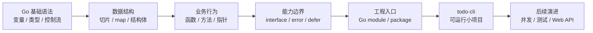
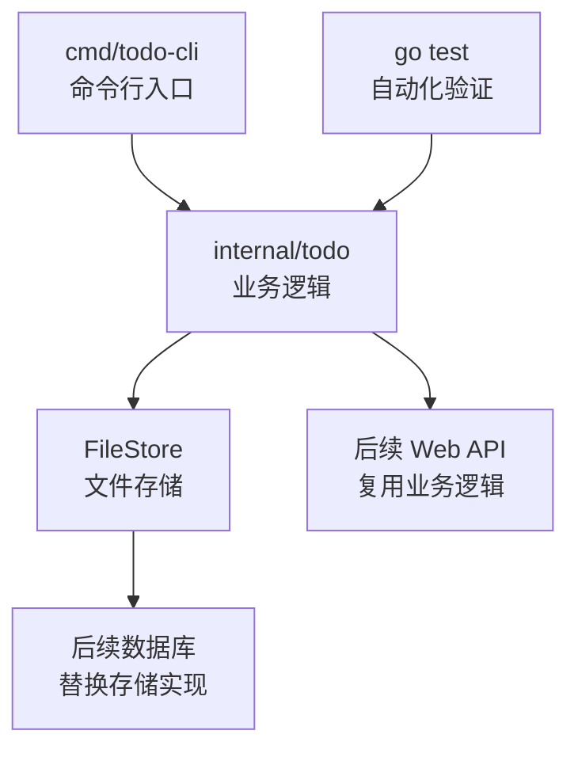

# 第 7 篇：Go 语言基础

阶段一已经完成了 Linux、Git、网络排障和 Shell 自动化。现在课程进入阶段二：Go 后端开发。

在后续课程中，`Cloud Native Todo Platform` 会从一个本地实验项目逐步演进为 Go Web API、数据库服务、Docker 镜像、Kubernetes 应用和 Operator 管理对象。Go 是这条主线的核心语言。本篇不追求一次讲完所有 Go 细节，而是先建立后端开发最常用、最关键的一组基础能力。

本篇对应 5 个章节主题：

- 7.1 Go 程序结构、变量、常量与类型
- 7.2 条件、循环、数组、切片与 map
- 7.3 函数、指针、结构体与方法
- 7.4 interface、error 与 defer
- 7.5 Go module 与包管理基础

本篇特色项目是：**开发命令行版 Todo 管理器 `todo-cli`**。

你会在 `cloud-native-todo-platform` 仓库中创建一个 Go module，编写一个可运行、可测试、可持续演进的 CLI 程序，支持 Todo 的新增、列表、修改、完成和删除。这个 CLI 会在后续章节继续演进：第 8 篇会引入并发，第 9 篇会强化测试和工程化，第 10 篇会改造为 Web API。

## 1. 本章学习目标

学完本篇后，你应该能够用 Go 编写结构清晰的小型命令行程序，并理解这些语法为什么是后端服务开发的基础。

具体目标如下：

- 能解释一个 Go 程序由 `package`、`import`、函数和文件组成。
- 能使用变量、常量、基础类型、零值和类型转换。
- 能使用 `if`、`switch`、`for` 编写分支和循环逻辑。
- 能使用数组、切片和 map 表达列表、集合和键值关系。
- 能定义函数，理解参数、返回值、多返回值和命名返回值。
- 能理解指针为什么用于修改原对象，什么时候应该避免过度使用指针。
- 能定义结构体和方法，用它们表达业务对象和行为。
- 能使用 `interface` 抽象能力边界，而不是为了抽象而抽象。
- 能使用 `error`、`errors.Is`、`fmt.Errorf("%w")` 处理错误链路。
- 能使用 `defer` 释放资源或收尾，但知道它不是万能清理工具。
- 能创建 Go module，理解 module path、package path、`go.mod` 和 `go.sum`。
- 能完成 `todo-cli` 的增删改查逻辑，并用 `go test ./...` 验证。

本篇结束时，你至少应该能独立完成以下命令组合：

```bash
go mod init cloud-native-todo-platform
go fmt ./...
go test ./...
go run ./cmd/todo-cli add "学习 Go 基础语法"
go run ./cmd/todo-cli list
go run ./cmd/todo-cli done 1
go run ./cmd/todo-cli update 1 "学习 Go module 与包管理"
go run ./cmd/todo-cli delete 1
```

这些能力会直接支撑后续 Go 并发、Web API、数据库访问、Docker 镜像构建、Kubernetes 探针和 Operator Controller 开发。

## 2. 本章工作场景

真实公司里，Go 不只是“写语法练习”的语言。它常用于后端 API、微服务、命令行工具、云原生控制器、基础设施自动化和平台工程系统。

典型工作场景包括：

- 后端开发需要实现 Todo API 的业务逻辑，例如创建任务、更新任务、标记完成、分页查询。
- DevOps 需要写一个 CLI 工具批量检查服务配置、生成部署文件或触发发布流程。
- SRE 需要编写巡检工具，读取文件、调用 HTTP 接口、输出诊断结果。
- 平台工程师需要开发 Kubernetes Controller，用结构体表达 CRD 资源，用 interface 抽象客户端，用 error 处理重试。
- 测试同学需要运行 `go test ./...`，确认业务逻辑没有在重构中被破坏。
- 团队需要通过 Go module 管理依赖版本，确保本地、CI 和生产构建一致。

本篇的学习路径如下：



本篇不会把 Go 学成零散语法表，而是围绕一个真实的 `todo-cli` 小项目，把语法放回工程场景中理解。

## 3. 前置知识

### 必须掌握

学习本篇前，你需要具备以下基础：

- 已经完成第 1 篇开发环境准备，并能在终端执行命令。
- 已经安装 Go，并能执行 `go version`。
- 已经完成 Git 基础，能在仓库中创建分支、提交代码和查看变更。
- 已经完成 Shell 基础，能理解环境变量、退出码和命令执行上下文。
- 能使用 `cd` 进入 `cloud-native-todo-platform` 项目目录。

### 建议了解

以下内容不要求熟练，但建议有基本概念：

- JSON 是常见的数据交换格式。
- CLI 程序通过命令行参数接收用户输入。
- 后端服务常把“业务对象”和“存储逻辑”拆开。
- 单元测试用于验证函数和业务逻辑是否符合预期。

### 环境差异说明

Go 语言本身跨平台一致，但路径、环境变量和命令行语法在不同系统中有差异。

=== "Linux / WSL2"

    推荐环境。后续 Docker、Kubernetes、Operator 实验也更接近生产环境。

    ```bash
    go version
    git --version
    pwd
    ```

    如果使用 WSL2，建议把项目放在 Linux 文件系统中，例如：

    ```bash
    mkdir -p ~/workspace
    cd ~/workspace
    ```

=== "macOS"

    macOS 可以直接完成本篇实验。

    ```bash
    go version
    git --version
    pwd
    ```

    如果通过 Homebrew 安装 Go，确认当前终端能找到 Go：

    ```bash
    which go
    ```

=== "Windows PowerShell"

    Windows 可以完成本篇实验。后续涉及 Linux、Docker 和 Kubernetes 时，更推荐使用 WSL2。

    ```powershell
    go version
    git --version
    Get-Location
    ```

    PowerShell 中环境变量写法和 Bash 不同，本篇实验会用标签页分别给出。

## 4. 核心概念

### 4.1 Go 程序结构

一个可执行 Go 程序通常从 `package main` 开始，并包含 `main` 函数。

```go
package main

import "fmt"

func main() {
	fmt.Println("hello go")
}
```

几个关键点：

- `package main` 表示当前包会编译成可执行程序。
- `import "fmt"` 表示引入标准库 `fmt`。
- `func main()` 是程序入口。
- Go 代码格式由 `gofmt` 或 `go fmt` 统一，不依赖团队手工约定。

在项目中，我们不会把所有代码都塞进 `main.go`。常见做法是：

```text
cmd/todo-cli/        # 可执行程序入口
internal/todo/       # 业务逻辑包
```

`cmd/` 用来放入口程序，`internal/` 用来放只允许本 module 内部使用的业务包。这种结构在企业 Go 项目中非常常见，也适合后续演进为 Web API 和 Kubernetes Controller。

### 4.2 变量、常量与类型

Go 是静态类型语言。变量在编译期就有明确类型。

```go
var title string = "学习 Go"
var done bool
count := 3
```

说明：

- `var title string = "学习 Go"` 显式声明类型。
- `var done bool` 没有赋值时使用零值，`bool` 的零值是 `false`。
- `count := 3` 是短变量声明，只能在函数内部使用。

常量用 `const`：

```go
const defaultDataFile = "todos.json"
```

Go 常见基础类型如下：

| 类型 | 典型用途 | 零值 |
|---|---|---|
| `string` | 标题、名称、路径 | `""` |
| `bool` | 是否完成、是否启用 | `false` |
| `int` | ID、数量、索引 | `0` |
| `float64` | 金额、比例、指标值 | `0` |
| `time.Time` | 创建时间、更新时间 | 零时间 |

零值是 Go 的重要设计。它让结构体在未显式初始化时仍然处于可预测状态。比如 `Todo` 的 `ID` 默认是 `0`，可以用来判断它是否还没有被持久化。

### 4.3 条件、循环、数组、切片与 map

Go 的条件判断不需要小括号：

```go
if title == "" {
	return errors.New("title is empty")
}
```

`switch` 适合命令分发：

```go
switch command {
case "add":
	// 新增 Todo
case "list":
	// 列出 Todo
default:
	return fmt.Errorf("unknown command %q", command)
}
```

Go 只有一种循环关键字：`for`。

```go
for _, item := range items {
	fmt.Println(item.Title)
}
```

数组长度固定，切片长度可变。日常后端开发中更常用切片。

```go
items := []string{"learn go", "write cli"}
items = append(items, "run tests")
```

map 用于键值关系：

```go
labels := map[string]string{
	"app": "todo-cli",
	"env": "dev",
}
```

在 Todo 项目中，切片适合表示 Todo 列表，map 适合后续表示标签、索引、配置项或 HTTP 请求参数。

### 4.4 函数、指针、结构体与方法

函数用于封装一段可复用逻辑：

```go
func nextID(items []Item) int {
	maxID := 0
	for _, item := range items {
		if item.ID > maxID {
			maxID = item.ID
		}
	}
	return maxID + 1
}
```

结构体用于表达业务对象：

```go
type Item struct {
	ID    int
	Title string
	Done  bool
}
```

方法把行为绑定到类型：

```go
func (i *Item) MarkDone() {
	i.Done = true
}
```

这里使用 `*Item` 指针接收者，是因为 `MarkDone` 需要修改原对象。如果使用值接收者，方法拿到的是副本，修改不会影响原来的 `Item`。

一个简单判断原则：

- 只读取对象状态，可以优先用值接收者。
- 需要修改对象状态，使用指针接收者。
- 对象较大或包含锁、连接等资源时，通常使用指针接收者。

### 4.5 interface、error 与 defer

`interface` 表达的是“一个类型具备什么能力”。例如：

```go
type Repository interface {
	List() ([]Item, error)
	Add(title string) (Item, error)
}
```

任何类型只要实现了这些方法，就自动满足这个 interface。Go 不需要显式写 `implements`。

`error` 是 Go 中最重要的错误处理方式。Go 不鼓励把错误藏起来，而是要求调用者显式处理：

```go
item, err := store.Add("学习 Go")
if err != nil {
	return err
}
fmt.Println(item.ID)
```

为了保留错误上下文，推荐使用错误包装：

```go
return fmt.Errorf("read todo file: %w", err)
```

调用方可以用 `errors.Is` 判断底层错误：

```go
if errors.Is(err, ErrNotFound) {
	fmt.Println("todo not found")
}
```

`defer` 用于延迟执行，常见于关闭文件、释放锁、恢复临时状态：

```go
file, err := os.Open("todos.json")
if err != nil {
	return err
}
defer file.Close()
```

注意：`defer` 会在当前函数返回前执行，不是“后台任务”，也不能替代错误处理。生产代码里，关闭文件、提交事务、释放锁等 `defer` 操作仍然需要考虑错误和顺序。

### 4.6 Go module 与包管理

Go module 是 Go 的依赖和版本管理机制。一个 module 由 `go.mod` 描述：

```go
module cloud-native-todo-platform

go 1.26
```

这里的 `go 1.26` 是课程当前验证环境示例，不是语法本身的硬性要求。你在本机执行 `go mod init` 时，Go 工具链会按本机版本写入对应的 `go` 行。团队项目中应在课程文档、CI 镜像和开发环境中统一 Go 主版本，避免“本机能编译，CI 不能编译”的问题。

关键概念：

- `module` 是当前项目的模块路径。
- `go` 表示这个 module 使用的 Go 语言版本线。
- `require` 用于记录外部依赖。
- `go.sum` 用于记录依赖校验信息，保证构建可复现。

本篇示例只使用 Go 标准库，所以暂时不会产生外部依赖。后续引入 Web 框架、数据库驱动和 Kubernetes SDK 时，Go module 会变得非常关键。

## 5. 原理深入

### 5.1 从源码到可执行程序

运行：

```bash
go run ./cmd/todo-cli
```

背后发生了几件事：


如果执行：

```bash
go build ./cmd/todo-cli
```

Go 会生成一个可执行文件。`go run` 更适合开发调试，`go build` 更接近构建发布。

### 5.2 package 如何组织代码

Go 以目录作为 package 的组织单位。一般来说，一个目录中的 `.go` 文件应该属于同一个 package。

本篇项目中：

```text
cmd/todo-cli/main.go       -> package main
internal/todo/*.go         -> package todo
```

`main.go` 负责解析命令行参数和输出结果，`internal/todo` 负责业务逻辑和文件存储。这样拆分有几个好处：

- CLI 入口变薄，后续更容易新增 Web API 入口。
- 业务逻辑可以被测试，不依赖终端交互。
- 后续可以把文件存储替换成数据库存储。
- `internal` 能防止其他 module 直接导入内部包，保护边界。

### 5.3 值、指针和内存语义

Go 默认按值传递。把结构体传给函数时，函数拿到的是副本。

```go
func rename(item Item) {
	item.Title = "new title"
}
```

这段代码不会修改外部的 `item`。如果要修改原对象，需要传指针：

```go
func rename(item *Item) {
	item.Title = "new title"
}
```

这也是为什么 `MarkDone` 使用 `*Item` 方法接收者。对新手来说，指针最重要的不是“地址”这个词，而是理解：**我修改的是副本，还是原来的对象**。

### 5.4 interface 是行为契约

在 Go 中，interface 不应该一开始就设计得很大。一个常见原则是：在使用方定义小 interface。

例如后续 Web API 处理器只需要新增和查询 Todo，就可以定义：

```go
type TodoService interface {
	Add(title string) (Item, error)
	List() ([]Item, error)
}
```

这样测试时可以用假的实现替代真实存储，生产中可以用数据库实现替代文件实现。interface 的价值不是“看起来高级”，而是降低调用方和具体实现的耦合。

也要注意，不是所有地方都应该提前定义 interface。如果一个类型只有一个实现，而且调用方暂时不需要替换它，过早抽象会增加阅读成本。本篇保留 `Repository`，是为了让你提前看到“文件存储将来可以替换成数据库存储”的边界；但在真实项目中，interface 应该随着测试、替换实现或跨层依赖的需要自然出现。

### 5.5 error 链路决定可排障性

生产问题里，最怕的错误信息是：

```text
open failed
```

它没有告诉你打开什么失败、在哪个业务动作失败、底层原因是什么。

更好的错误信息应该携带上下文：

```go
return fmt.Errorf("read todo file %s: %w", s.Path, err)
```

这样排障时能看到：

```text
read todo file /home/user/.todo-cli/todos.json: permission denied
```

Go 的错误处理虽然看起来啰嗦，但它把故障上下文留在了代码路径上。这对后端服务、Kubernetes Controller 和 Operator 重试逻辑都非常重要。

## 6. 手把手实验

### 6.1 实验目标

本实验会开发一个命令行版 Todo 管理器 `todo-cli`，支持：

- `add <title>`：新增 Todo。
- `list`：列出 Todo。
- `done <id>`：标记 Todo 为完成。
- `update <id> <title>`：修改 Todo 标题。
- `delete <id>`：删除 Todo。
- `path`：显示数据文件路径。

数据会保存到 JSON 文件中。默认路径是用户家目录下的 `.todo-cli/todos.json`，也可以通过环境变量 `TODO_CLI_DATA` 指定。

本篇聚焦 Go 语言基础和命令行程序，不涉及 Kubernetes YAML。YAML 会在 Docker、Kubernetes、Helm 和 Operator 阶段系统展开，本篇只需要把 Go 业务逻辑写清楚、跑起来、测起来。

### 6.2 实验环境

确认已经进入课程项目仓库：

=== "Linux / macOS / WSL2"

    ```bash
    cd ~/workspace/cloud-native-todo-platform
    go version
    git status --short --branch
    ```

=== "Windows PowerShell"

    ```powershell
    cd D:\workspace\cloud-native-todo-platform
    go version
    git status --short --branch
    ```

如果你还没有项目仓库，可以先创建一个练习目录：

=== "Linux / macOS / WSL2"

    ```bash
    mkdir -p ~/workspace/cloud-native-todo-platform
    cd ~/workspace/cloud-native-todo-platform
    git init
    ```

=== "Windows PowerShell"

    ```powershell
    New-Item -ItemType Directory -Force D:\workspace\cloud-native-todo-platform
    cd D:\workspace\cloud-native-todo-platform
    git init
    ```

### 6.3 创建目录结构

创建本篇项目目录：

=== "Linux / macOS / WSL2"

    ```bash
    mkdir -p cmd/todo-cli internal/todo
    ```

=== "Windows PowerShell"

    ```powershell
    New-Item -ItemType Directory -Force cmd\todo-cli, internal\todo
    ```

最终目录结构如下：

```text
cloud-native-todo-platform/
├── go.mod
├── cmd/
│   └── todo-cli/
│       └── main.go
└── internal/
    └── todo/
        ├── defer_demo_test.go
        ├── item.go
        ├── store.go
        └── store_test.go
```

### 6.4 初始化 Go module

如果仓库还没有 `go.mod`，执行：

```bash
go mod init cloud-native-todo-platform
```

预期输出类似：

```text
go: creating new go.mod: module cloud-native-todo-platform
```

`go.mod` 内容如下：

```go title="go.mod"
module cloud-native-todo-platform

go 1.26
```

`go` 后面的版本会由你本机安装的 Go 工具链写入。上面用 `go 1.26` 作为课程环境示例；如果你的输出是其他已安装版本，以本机生成结果为准。

这里使用 `cloud-native-todo-platform` 作为本地 module path，便于学习者直接复制运行。真实公司项目中通常会使用完整仓库路径，例如：

```text
github.com/example-org/cloud-native-todo-platform
```

如果你改成完整仓库路径，代码里的 import 路径也要同步修改。

### 6.5 编写业务对象

创建 `internal/todo/item.go`：

```go title="internal/todo/item.go"
package todo

import (
	"errors"
	"strings"
	"time"
)

type Status string

const (
	StatusPending Status = "pending"
	StatusDone    Status = "done"
)

var (
	ErrEmptyTitle = errors.New("todo title is empty")
	ErrNotFound   = errors.New("todo item not found")
)

type Item struct {
	ID        int       `json:"id"`
	Title     string    `json:"title"`
	Status    Status    `json:"status"`
	CreatedAt time.Time `json:"created_at"`
	UpdatedAt time.Time `json:"updated_at"`
}

func NewItem(id int, title string, now time.Time) (Item, error) {
	title = strings.TrimSpace(title)
	if title == "" {
		return Item{}, ErrEmptyTitle
	}

	return Item{
		ID:        id,
		Title:     title,
		Status:    StatusPending,
		CreatedAt: now,
		UpdatedAt: now,
	}, nil
}

func (i Item) Done() bool {
	return i.Status == StatusDone
}

func (i *Item) MarkDone(now time.Time) {
	i.Status = StatusDone
	i.UpdatedAt = now
}

func (i *Item) Rename(title string, now time.Time) error {
	title = strings.TrimSpace(title)
	if title == "" {
		return ErrEmptyTitle
	}

	i.Title = title
	i.UpdatedAt = now
	return nil
}
```

这段代码覆盖了本篇多个核心语法：

- `type Status string` 定义业务类型，让状态不只是普通字符串。
- `const` 定义允许的状态值。
- `var` 定义可复用错误，方便后续用 `errors.Is` 判断。
- `Item` 结构体表达 Todo 业务对象。
- `json` tag 决定保存为 JSON 时的字段名。
- `NewItem` 返回 `(Item, error)`，体现 Go 常见多返回值。
- `MarkDone` 和 `Rename` 使用指针接收者，因为它们会修改原对象。

### 6.6 编写文件存储

创建 `internal/todo/store.go`：

```go title="internal/todo/store.go"
package todo

import (
	"encoding/json"
	"errors"
	"fmt"
	"os"
	"path/filepath"
	"time"
)

type Repository interface {
	List() ([]Item, error)
	Add(title string) (Item, error)
	Done(id int) (Item, error)
	Update(id int, title string) (Item, error)
	Delete(id int) error
}

type FileStore struct {
	Path string
	Now  func() time.Time
}

var _ Repository = (*FileStore)(nil)

func NewFileStore(path string) *FileStore {
	return &FileStore{
		Path: path,
		Now:  time.Now,
	}
}

func (s *FileStore) List() ([]Item, error) {
	return s.load()
}

func (s *FileStore) Add(title string) (Item, error) {
	items, err := s.load()
	if err != nil {
		return Item{}, err
	}

	item, err := NewItem(nextID(items), title, s.now())
	if err != nil {
		return Item{}, err
	}

	items = append(items, item)
	if err := s.save(items); err != nil {
		return Item{}, err
	}

	return item, nil
}

func (s *FileStore) Done(id int) (Item, error) {
	items, err := s.load()
	if err != nil {
		return Item{}, err
	}

	for i := range items {
		if items[i].ID == id {
			items[i].MarkDone(s.now())
			if err := s.save(items); err != nil {
				return Item{}, err
			}
			return items[i], nil
		}
	}

	return Item{}, fmt.Errorf("%w: id=%d", ErrNotFound, id)
}

func (s *FileStore) Update(id int, title string) (Item, error) {
	items, err := s.load()
	if err != nil {
		return Item{}, err
	}

	for i := range items {
		if items[i].ID == id {
			if err := items[i].Rename(title, s.now()); err != nil {
				return Item{}, err
			}
			if err := s.save(items); err != nil {
				return Item{}, err
			}
			return items[i], nil
		}
	}

	return Item{}, fmt.Errorf("%w: id=%d", ErrNotFound, id)
}

func (s *FileStore) Delete(id int) error {
	items, err := s.load()
	if err != nil {
		return err
	}

	next := items[:0]
	deleted := false
	for _, item := range items {
		if item.ID == id {
			deleted = true
			continue
		}
		next = append(next, item)
	}

	if !deleted {
		return fmt.Errorf("%w: id=%d", ErrNotFound, id)
	}

	return s.save(next)
}

func (s *FileStore) load() ([]Item, error) {
	data, err := os.ReadFile(s.Path)
	if errors.Is(err, os.ErrNotExist) {
		return []Item{}, nil
	}
	if err != nil {
		return nil, fmt.Errorf("read todo file %s: %w", s.Path, err)
	}
	if len(data) == 0 {
		return []Item{}, nil
	}

	var items []Item
	if err := json.Unmarshal(data, &items); err != nil {
		return nil, fmt.Errorf("parse todo file %s: %w", s.Path, err)
	}

	return items, nil
}

func (s *FileStore) save(items []Item) error {
	if err := os.MkdirAll(filepath.Dir(s.Path), 0755); err != nil {
		return fmt.Errorf("create todo data directory: %w", err)
	}

	data, err := json.MarshalIndent(items, "", "  ")
	if err != nil {
		return fmt.Errorf("encode todo items: %w", err)
	}
	data = append(data, '\n')

	if err := os.WriteFile(s.Path, data, 0600); err != nil {
		return fmt.Errorf("write todo file %s: %w", s.Path, err)
	}

	return nil
}

func (s *FileStore) now() time.Time {
	if s.Now != nil {
		return s.Now()
	}
	return time.Now()
}

func nextID(items []Item) int {
	maxID := 0
	for _, item := range items {
		if item.ID > maxID {
			maxID = item.ID
		}
	}
	return maxID + 1
}
```

这段代码的设计重点：

- `Repository` 是一个小 interface，描述 Todo 存储需要提供的能力。
- `FileStore` 是文件存储实现，后续可以替换成数据库实现。
- `var _ Repository = (*FileStore)(nil)` 用于在编译期确认 `FileStore` 实现了 `Repository`。
- `load` 中把文件不存在当作空列表处理，符合第一次运行的用户预期。
- `save` 使用 `json.MarshalIndent`，让数据文件更容易阅读和排查。
- `fmt.Errorf("%w")` 保留底层错误，便于调用方用 `errors.Is` 判断。
- `Now func() time.Time` 让测试可以固定时间，避免测试结果不稳定。

### 6.7 编写 CLI 入口

创建 `cmd/todo-cli/main.go`：

```go title="cmd/todo-cli/main.go"
package main

import (
	"errors"
	"fmt"
	"os"
	"path/filepath"
	"strconv"
	"strings"

	"cloud-native-todo-platform/internal/todo"
)

const appName = "todo-cli"

func main() {
	if err := run(os.Args[1:]); err != nil {
		fmt.Fprintf(os.Stderr, "error: %v\n", err)
		os.Exit(1)
	}
}

func run(args []string) error {
	if len(args) == 0 {
		printUsage()
		return nil
	}

	store := todo.NewFileStore(dataPath())

	switch args[0] {
	case "add":
		if len(args) < 2 {
			return errors.New("usage: todo-cli add <title>")
		}
		item, err := store.Add(strings.Join(args[1:], " "))
		if err != nil {
			return err
		}
		fmt.Printf("added #%d: %s\n", item.ID, item.Title)

	case "list":
		items, err := store.List()
		if err != nil {
			return err
		}
		printItems(items)

	case "done":
		if len(args) != 2 {
			return errors.New("usage: todo-cli done <id>")
		}
		id, err := parseID(args[1])
		if err != nil {
			return err
		}
		item, err := store.Done(id)
		if err != nil {
			return err
		}
		fmt.Printf("done #%d: %s\n", item.ID, item.Title)

	case "update":
		if len(args) < 3 {
			return errors.New("usage: todo-cli update <id> <title>")
		}
		id, err := parseID(args[1])
		if err != nil {
			return err
		}
		item, err := store.Update(id, strings.Join(args[2:], " "))
		if err != nil {
			return err
		}
		fmt.Printf("updated #%d: %s\n", item.ID, item.Title)

	case "delete":
		if len(args) != 2 {
			return errors.New("usage: todo-cli delete <id>")
		}
		id, err := parseID(args[1])
		if err != nil {
			return err
		}
		if err := store.Delete(id); err != nil {
			return err
		}
		fmt.Printf("deleted #%d\n", id)

	case "path":
		fmt.Println(dataPath())

	case "help", "-h", "--help":
		printUsage()

	default:
		return fmt.Errorf("unknown command %q", args[0])
	}

	return nil
}

func parseID(raw string) (int, error) {
	id, err := strconv.Atoi(raw)
	if err != nil {
		return 0, fmt.Errorf("invalid id %q: %w", raw, err)
	}
	if id <= 0 {
		return 0, fmt.Errorf("invalid id %d: must be greater than 0", id)
	}
	return id, nil
}

func dataPath() string {
	if path := strings.TrimSpace(os.Getenv("TODO_CLI_DATA")); path != "" {
		return path
	}

	home, err := os.UserHomeDir()
	if err != nil {
		return filepath.Join(".todo-cli", "todos.json")
	}

	return filepath.Join(home, ".todo-cli", "todos.json")
}

func printItems(items []todo.Item) {
	if len(items) == 0 {
		fmt.Println("No todo items.")
		return
	}

	for _, item := range items {
		mark := " "
		if item.Done() {
			mark = "x"
		}
		fmt.Printf("%d. [%s] %s (%s)\n", item.ID, mark, item.Title, item.Status)
	}
}

func printUsage() {
	fmt.Printf(`%s manages local todo items.

Usage:
  %s add <title>
  %s list
  %s done <id>
  %s update <id> <title>
  %s delete <id>
  %s path

Environment:
  TODO_CLI_DATA  custom JSON data file path
`, appName, appName, appName, appName, appName, appName, appName)
}
```

这段入口代码体现了 CLI 程序的常见结构：

- `main` 只负责调用 `run` 和设置退出码。
- `run` 接收 `args []string`，便于后续测试命令分发。
- `switch` 根据子命令分发业务逻辑。
- `parseID` 把字符串参数转换为 `int`，并做输入校验。
- `dataPath` 通过环境变量支持自定义数据文件位置。
- `printItems` 只负责输出展示，不参与存储逻辑。

本篇手写 `os.Args` 解析命令，是为了让你看清楚 CLI 程序最基本的参数处理过程。真实团队开发复杂 CLI 时，可以考虑标准库 `flag`，或 Cobra、urfave/cli 等成熟框架。框架能提供子命令、帮助信息、参数校验和自动补全，但在 Go 基础阶段过早引入框架，反而会遮住函数、切片、错误处理和 package 组织这些核心能力。

### 6.8 编写单元测试

创建 `internal/todo/store_test.go`：

```go title="internal/todo/store_test.go"
package todo

import (
	"errors"
	"path/filepath"
	"testing"
	"time"
)

func TestFileStoreLifecycle(t *testing.T) {
	path := filepath.Join(t.TempDir(), "todos.json")
	store := NewFileStore(path)
	store.Now = fixedNow

	item, err := store.Add("  learn Go basics  ")
	if err != nil {
		t.Fatalf("add item: %v", err)
	}
	if item.ID != 1 {
		t.Fatalf("item id = %d, want 1", item.ID)
	}
	if item.Title != "learn Go basics" {
		t.Fatalf("item title = %q", item.Title)
	}
	if item.Status != StatusPending {
		t.Fatalf("item status = %q, want %q", item.Status, StatusPending)
	}

	items, err := store.List()
	if err != nil {
		t.Fatalf("list items: %v", err)
	}
	if len(items) != 1 {
		t.Fatalf("len(items) = %d, want 1", len(items))
	}

	updated, err := store.Update(1, "learn Go module")
	if err != nil {
		t.Fatalf("update item: %v", err)
	}
	if updated.Title != "learn Go module" {
		t.Fatalf("updated title = %q", updated.Title)
	}

	done, err := store.Done(1)
	if err != nil {
		t.Fatalf("done item: %v", err)
	}
	if !done.Done() {
		t.Fatalf("done item status = %q", done.Status)
	}

	if err := store.Delete(1); err != nil {
		t.Fatalf("delete item: %v", err)
	}

	items, err = store.List()
	if err != nil {
		t.Fatalf("list after delete: %v", err)
	}
	if len(items) != 0 {
		t.Fatalf("len(items) after delete = %d, want 0", len(items))
	}
}

func TestNewItemRejectsEmptyTitle(t *testing.T) {
	_, err := NewItem(1, "   ", fixedNow())
	if !errors.Is(err, ErrEmptyTitle) {
		t.Fatalf("error = %v, want ErrEmptyTitle", err)
	}
}

func TestFileStoreReturnsNotFound(t *testing.T) {
	path := filepath.Join(t.TempDir(), "todos.json")
	store := NewFileStore(path)

	_, err := store.Done(42)
	if !errors.Is(err, ErrNotFound) {
		t.Fatalf("error = %v, want ErrNotFound", err)
	}
}

func fixedNow() time.Time {
	return time.Date(2026, 5, 26, 10, 0, 0, 0, time.UTC)
}
```

测试代码的意义：

- `t.TempDir()` 为每次测试创建临时目录，测试结束自动清理。
- `fixedNow` 固定时间，避免测试因为当前时间变化而不稳定。
- `errors.Is` 验证错误链路，而不是比较错误字符串。
- 生命周期测试覆盖新增、查询、更新、完成和删除。

### 6.9 增加 defer 实战测试

前面已经讲过 `defer`，这里再补一个最小可执行测试，让它不只停留在概念层面。

创建 `internal/todo/defer_demo_test.go`：

```go title="internal/todo/defer_demo_test.go"
package todo

import (
	"io"
	"os"
	"path/filepath"
	"testing"
)

func TestReadFileWithDefer(t *testing.T) {
	path := filepath.Join(t.TempDir(), "defer-demo.txt")
	if err := os.WriteFile(path, []byte("learn defer\n"), 0600); err != nil {
		t.Fatalf("write demo file: %v", err)
	}

	data, err := readFileWithDefer(path)
	if err != nil {
		t.Fatalf("read file with defer: %v", err)
	}
	if string(data) != "learn defer\n" {
		t.Fatalf("data = %q", string(data))
	}
}

func readFileWithDefer(path string) ([]byte, error) {
	file, err := os.Open(path)
	if err != nil {
		return nil, err
	}
	defer file.Close()

	return io.ReadAll(file)
}
```

这个测试故意很小，只验证一件事：打开文件后，用 `defer file.Close()` 保证函数返回前释放文件句柄。

生产代码中要注意两点：

- 读文件时，关闭失败通常不是主要错误；写文件、刷盘、提交事务时，关闭或提交失败也可能影响数据完整性。
- `defer` 只保证当前函数返回前执行，不会让慢操作变成异步，也不会自动处理错误。

### 6.10 格式化、测试与运行

先格式化代码：

```bash
go fmt ./...
```

为什么要执行：Go 项目不靠团队争论缩进风格，统一交给 `go fmt`。

运行测试：

```bash
go test ./...
```

预期输出类似：

```text
?   	cloud-native-todo-platform/cmd/todo-cli	[no test files]
ok  	cloud-native-todo-platform/internal/todo	0.003s
```

运行 CLI。为了不污染真实用户目录，并避免历史数据影响 `id=1`、`id=2` 的示例结果，本实验建议先把数据文件放在项目目录下，并清理旧实验数据：

=== "Linux / macOS / WSL2"

    ```bash
    export TODO_CLI_DATA="$(pwd)/.todo-cli/todos.json"
    rm -rf .todo-cli

    go run ./cmd/todo-cli add "学习 Go 程序结构"
    go run ./cmd/todo-cli add "完成 todo-cli 实验"
    go run ./cmd/todo-cli list
    go run ./cmd/todo-cli done 1
    go run ./cmd/todo-cli update 2 "完成 Go module 实验"
    go run ./cmd/todo-cli list
    go run ./cmd/todo-cli delete 1
    go run ./cmd/todo-cli list
    ```

=== "Windows PowerShell"

    ```powershell
    $env:TODO_CLI_DATA = "$PWD\.todo-cli\todos.json"
    Remove-Item -Recurse -Force .todo-cli -ErrorAction SilentlyContinue

    go run ./cmd/todo-cli add "学习 Go 程序结构"
    go run ./cmd/todo-cli add "完成 todo-cli 实验"
    go run ./cmd/todo-cli list
    go run ./cmd/todo-cli done 1
    go run ./cmd/todo-cli update 2 "完成 Go module 实验"
    go run ./cmd/todo-cli list
    go run ./cmd/todo-cli delete 1
    go run ./cmd/todo-cli list
    ```

预期输出类似：

```text
added #1: 学习 Go 程序结构
added #2: 完成 todo-cli 实验
1. [ ] 学习 Go 程序结构 (pending)
2. [ ] 完成 todo-cli 实验 (pending)
done #1: 学习 Go 程序结构
updated #2: 完成 Go module 实验
1. [x] 学习 Go 程序结构 (done)
2. [ ] 完成 Go module 实验 (pending)
deleted #1
2. [ ] 完成 Go module 实验 (pending)
```

查看数据文件：

=== "Linux / macOS / WSL2"

    ```bash
    cat .todo-cli/todos.json
    ```

=== "Windows PowerShell"

    ```powershell
    Get-Content .todo-cli\todos.json
    ```

预期可以看到 JSON 数据：

```json
[
  {
    "id": 2,
    "title": "完成 Go module 实验",
    "status": "pending",
    "created_at": "2026-05-26T10:00:00Z",
    "updated_at": "2026-05-26T10:00:00Z"
  }
]
```

实际时间会是你运行命令时的当前时间。测试中的时间是固定的，运行程序时使用真实时间。

### 6.11 构建可执行文件

`go run` 适合开发调试。如果要得到可执行文件，使用 `go build`：

=== "Linux / macOS / WSL2"

    ```bash
    mkdir -p bin
    go build -o bin/todo-cli ./cmd/todo-cli
    ./bin/todo-cli list
    ```

=== "Windows PowerShell"

    ```powershell
    New-Item -ItemType Directory -Force bin
    go build -o bin\todo-cli.exe .\cmd\todo-cli
    .\bin\todo-cli.exe list
    ```

构建成功说明：

- `main` 包可以正常编译。
- import 路径正确。
- `internal/todo` 包没有语法或类型错误。
- 这个 CLI 已经可以作为后续阶段的项目资产。

### 6.12 清理步骤

清理实验数据和构建产物：

=== "Linux / macOS / WSL2"

    ```bash
    rm -rf .todo-cli bin
    unset TODO_CLI_DATA
    ```

=== "Windows PowerShell"

    ```powershell
    Remove-Item -Recurse -Force .todo-cli, bin
    Remove-Item Env:TODO_CLI_DATA -ErrorAction SilentlyContinue
    ```

如果你已经把代码提交到 Git，不要删除源码目录。清理步骤只删除临时数据和构建产物。

## 7. 真实工作案例

一家团队准备把 Todo 平台从脚本 Demo 演进为后端服务。团队通常会按以下职责协作：

- 后端开发负责用 Go 实现业务模型、存储接口、HTTP API 和测试。
- 测试工程师负责根据需求编写用例，验证新增、修改、完成、删除等业务路径。
- DevOps 负责把 Go 程序纳入 CI，执行 `go test ./...` 和 `go build ./...`。
- SRE 关注程序日志、错误信息、配置路径和运行时可观测性。
- 平台工程师后续会把业务对象映射为 Kubernetes 资源，开发 Controller 自动化管理。

本篇的 `todo-cli` 虽然很小，但它已经具备真实工程的影子：



后续第 10 篇开发 Web API 时，不需要重写 Todo 业务规则，只需要在 HTTP Handler 中调用同一组业务能力。这个思路就是企业开发中常说的“把业务逻辑从入口层拆出来”。

## 8. 常见错误

| 错误现象 | 常见原因 | 修复方向 |
|---|---|---|
| `go: go.mod file not found` | 没有在 module 根目录执行命令 | 回到项目根目录，执行 `go mod init cloud-native-todo-platform` |
| `package cloud-native-todo-platform/internal/todo is not in std` | module path 和 import path 不一致，或不在 module 根目录 | 检查 `go.mod` 的 `module` 值和 `main.go` 的 import 路径 |
| `undefined: todo.NewFileStore` | 文件没有保存、包名不一致、函数名大小写错误 | 检查 `internal/todo/store.go` 是否为 `package todo`，函数名是否导出 |
| `imported and not used` | 引入了包但没有使用 | 删除未使用 import，或补齐使用逻辑 |
| `declared and not used` | 声明变量但没有使用 | 删除变量，或真正使用它 |
| `invalid id "abc"` | `done`、`update`、`delete` 需要数字 ID | 使用 `go run ./cmd/todo-cli list` 查看 ID |
| `permission denied` | 数据文件所在目录不可写 | 调整 `TODO_CLI_DATA` 到可写目录，或修复目录权限 |
| JSON 文件解析失败 | 手工修改 JSON 后格式错误 | 用编辑器修复 JSON，或备份后删除数据文件重新生成 |
| Windows 下环境变量不生效 | 使用了 Bash 的 `export` 写法 | PowerShell 使用 `$env:TODO_CLI_DATA = "..."` |
| 测试偶发失败 | 测试依赖当前时间、当前目录或共享文件 | 使用 `t.TempDir()` 和固定时间函数 |

Go 新手经常会被“未使用变量”和“未使用 import”卡住。它们不是编译器挑剔，而是 Go 强制保持代码干净，避免无效依赖和隐藏问题。

## 9. 排障方法

### 9.1 确认当前位置

```bash
pwd
ls
```

Windows PowerShell：

```powershell
Get-Location
Get-ChildItem
```

判断依据：

- 当前目录应该能看到 `go.mod`。
- 应该存在 `cmd/` 和 `internal/` 目录。

如果不在项目根目录，先 `cd` 到 `cloud-native-todo-platform`。

### 9.2 检查 module path

```bash
go env GOMOD
cat go.mod
```

Windows PowerShell：

```powershell
go env GOMOD
Get-Content go.mod
```

判断依据：

- `go env GOMOD` 应该输出当前项目的 `go.mod` 路径。
- `go.mod` 中应包含 `module cloud-native-todo-platform`。
- `cmd/todo-cli/main.go` 中 import 应该是 `cloud-native-todo-platform/internal/todo`。

如果 module path 改成了 GitHub 地址，import 路径也必须同步。

### 9.3 检查 Go 代码格式和编译

```bash
go fmt ./...
go list ./...
go test ./...
go build ./cmd/todo-cli
```

判断依据：

- `go fmt` 通常没有输出，表示格式化完成。
- `go list` 能列出 `cloud-native-todo-platform/cmd/todo-cli` 和 `cloud-native-todo-platform/internal/todo`，说明 package 路径和 import 关系正确。
- `go test` 输出 `ok` 表示测试通过。
- `go build` 没有输出且退出码为 `0` 表示构建成功。

查看退出码：

=== "Linux / macOS / WSL2"

    ```bash
    echo $?
    ```

=== "Windows PowerShell"

    ```powershell
    $LASTEXITCODE
    ```

如果只想排查某一个测试，可以使用 `-run` 和 `-v`：

```bash
go test ./internal/todo -run TestFileStoreLifecycle -v
```

判断依据：

- `-run TestFileStoreLifecycle` 只运行名称匹配的测试，适合定位某个失败用例。
- `-v` 会输出每个测试名称和执行结果，适合学习阶段观察测试流程。
- 如果指定测试能通过，但 `go test ./...` 失败，说明问题可能在其他 package 或其他测试用例中。

### 9.4 检查数据文件路径

```bash
go run ./cmd/todo-cli path
```

如果输出路径不可写，可以临时改到项目目录：

=== "Linux / macOS / WSL2"

    ```bash
    export TODO_CLI_DATA="$(pwd)/.todo-cli/todos.json"
    go run ./cmd/todo-cli add "验证数据路径"
    ```

=== "Windows PowerShell"

    ```powershell
    $env:TODO_CLI_DATA = "$PWD\.todo-cli\todos.json"
    go run ./cmd/todo-cli add "验证数据路径"
    ```

判断依据：

- 如果命令成功，说明之前的问题大概率是默认家目录权限或路径问题。
- 如果仍然失败，继续检查错误信息中的具体路径和底层原因。

### 9.5 检查 JSON 数据是否损坏

=== "Linux / macOS / WSL2"

    ```bash
    cat .todo-cli/todos.json
    go run ./cmd/todo-cli list
    ```

=== "Windows PowerShell"

    ```powershell
    Get-Content .todo-cli\todos.json
    go run ./cmd/todo-cli list
    ```

如果看到类似错误：

```text
parse todo file ...: invalid character
```

说明 JSON 文件格式不合法。修复方式：

- 如果数据重要，先复制备份，再修复 JSON 格式。
- 如果只是实验数据，可以删除 `.todo-cli/todos.json` 后重新运行。

## 10. 生产环境注意事项

本篇项目是学习用 CLI，但它已经触及生产 Go 工程的基本原则。

### 10.1 错误信息必须可排障

生产环境不要只返回 `failed`、`error`、`invalid` 这类无上下文错误。至少要说明：

- 当前执行什么动作。
- 操作的资源是什么。
- 底层错误是什么。

推荐：

```go
return fmt.Errorf("write todo file %s: %w", s.Path, err)
```

### 10.2 不要把敏感数据写入普通文件

本篇 Todo 数据不是敏感信息。真实生产中，如果文件里包含 token、密码、密钥或个人信息，需要考虑：

- 文件权限是否限制为当前用户可读写。
- 是否需要加密。
- 是否应该交给 Secret 管理系统。
- 日志里是否泄露敏感字段。

后续 Kubernetes 章节会进一步学习 Secret、RBAC 和配置管理。

### 10.3 文件存储有并发写入和非原子写入风险

本篇 `FileStore` 没有实现文件锁。如果多个 `todo-cli` 进程同时写同一个 JSON 文件，可能出现覆盖或数据损坏。

另外，当前 `save` 使用 `os.WriteFile` 直接覆盖目标文件。对学习项目来说足够简单，但生产环境要考虑进程崩溃、磁盘写满、系统断电等情况。如果写入过程中断，目标文件可能只写入了一部分，最终导致 JSON 损坏。

更稳妥的生产思路是：

- 先写入同目录临时文件。
- 写入成功后执行必要的 flush 或 close 检查。
- 再用原子 rename 替换旧文件。
- 多进程写入时增加文件锁或改用数据库。

生产系统通常会使用数据库或带事务能力的存储来解决：

- PostgreSQL 负责事务和并发控制。
- Redis 可用于缓存和轻量状态。
- Kubernetes API Server 通过资源版本控制对象更新。

本篇选择文件存储，是为了聚焦 Go 基础语法和最小可运行项目。

### 10.4 module path 要稳定

真实团队中，Go module path 一旦发布给其他服务依赖，就不要随意改变。常见做法是使用仓库地址：

```text
github.com/company/cloud-native-todo-platform
```

如果 module path 变更，所有 import 路径、CI、构建脚本和依赖方都可能受影响。

### 10.5 测试要进入 CI

不要只在本机运行测试。后续仓库应在 Pull Request 中自动执行：

```bash
go test ./...
go build ./...
```

这样可以在合并前发现语法错误、测试失败、依赖问题和跨平台问题。

### 10.6 CLI 退出码要明确

命令行工具在 CI/CD 中经常被脚本调用。约定是：

- 成功返回退出码 `0`。
- 失败返回非 `0`。
- 错误信息输出到 `stderr`。

本篇 `main` 中使用：

```go
fmt.Fprintf(os.Stderr, "error: %v\n", err)
os.Exit(1)
```

这使得脚本、流水线和调用方可以可靠判断命令是否成功。

## 11. 本章小项目

本章小项目是：**开发命令行版 Todo 管理器 `todo-cli`**。

### 项目目标

完成一个标准库实现的小型 CLI 工具，具备以下能力：

- 使用 Go module 管理项目。
- 使用 `cmd/` 和 `internal/` 组织代码。
- 使用结构体表达 Todo 对象。
- 使用方法封装 Todo 行为。
- 使用 interface 描述存储能力。
- 使用 error 处理输入、文件和业务错误。
- 使用 JSON 文件持久化 Todo 数据。
- 使用单元测试覆盖核心业务逻辑。

### 验收命令

=== "Linux / macOS / WSL2"

    ```bash
    export TODO_CLI_DATA="$(pwd)/.todo-cli/acceptance.json"
    rm -f "$TODO_CLI_DATA"

    go fmt ./...
    go list ./...
    go test ./...
    go build ./cmd/todo-cli
    go run ./cmd/todo-cli add "验收 todo-cli"
    go run ./cmd/todo-cli list
    go run ./cmd/todo-cli done 1
    go run ./cmd/todo-cli update 1 "验收 Go CLI 项目"
    go run ./cmd/todo-cli delete 1
    ```

=== "Windows PowerShell"

    ```powershell
    $env:TODO_CLI_DATA = "$PWD\.todo-cli\acceptance.json"
    Remove-Item $env:TODO_CLI_DATA -ErrorAction SilentlyContinue

    go fmt ./...
    go list ./...
    go test ./...
    go build ./cmd/todo-cli
    go run ./cmd/todo-cli add "验收 todo-cli"
    go run ./cmd/todo-cli list
    go run ./cmd/todo-cli done 1
    go run ./cmd/todo-cli update 1 "验收 Go CLI 项目"
    go run ./cmd/todo-cli delete 1
    ```

这里单独使用 `.todo-cli/acceptance.json`，是为了让验收不依赖你平时练习产生的 Todo 数据。只要从空文件开始，`id=1` 的示例就稳定可复现。

### 能力验收标准

你可以用下面清单自检：

- 能解释 `package main` 和普通业务 package 的区别。
- 能解释 `cmd/todo-cli` 和 `internal/todo` 为什么要拆开。
- 能解释 `Item` 结构体中每个字段的作用。
- 能解释为什么 `MarkDone` 使用指针接收者。
- 能解释 `Repository` interface 的作用。
- 能解释 `ErrNotFound` 为什么要作为变量复用。
- 能解释 `go test ./...` 为什么比只运行程序更可靠。
- 能在空数据文件、错误 ID、无效 JSON、权限不足时定位问题。
- 能完成 Todo 的新增、查询、更新、完成和删除。

### 作品集说明

完成本篇后，你的作品集可以新增一条：

```text
使用 Go 标准库开发 todo-cli 命令行工具，具备 JSON 持久化、错误处理、单元测试和基础工程目录结构。
```

也可以在项目 README 中记录更完整的作品说明：

````markdown
## todo-cli

本项目使用 Go 标准库实现命令行版 Todo 管理器，支持新增、列表、完成、修改和删除 Todo。

### 技术点

- Go module 管理项目
- `cmd/` + `internal/` 工程目录
- 结构体、方法、指针接收者
- interface 抽象存储边界
- error 包装与 `errors.Is`
- JSON 文件持久化
- `go test ./...` 单元测试

### 验证

```bash
go fmt ./...
go test ./...
go build ./cmd/todo-cli
```
````

这比“学过 Go 语法”更有说服力，因为它能展示你已经把语法落到了一个可运行项目里。

## 12. 本章练习题

### 基础题

1. `package main` 和 `package todo` 有什么区别？
2. Go 变量的零值是什么意思？`string`、`bool`、`int` 的零值分别是什么？
3. 切片和数组有什么区别？为什么本篇 Todo 列表使用切片？
4. `map[string]string` 适合表达什么数据？
5. 为什么 Go 函数经常返回 `(value, error)`？
6. `errors.Is` 和直接比较错误字符串有什么区别？
7. `defer` 在什么时候执行？
8. `go.mod` 的 `module` 行有什么作用？

### 实操题

1. 给 `todo-cli` 增加 `clear` 命令，删除所有 Todo。
2. 给 `todo-cli list` 增加 `--done` 和 `--pending` 过滤能力。
3. 给 `Item` 增加 `Priority string` 字段，支持 `low`、`medium`、`high`。
4. 新增测试用例，验证空标题、非法 ID、删除不存在 ID 都会返回错误。
5. 执行 `go build -o bin/todo-cli ./cmd/todo-cli`，并用构建后的可执行文件完成一次完整增删改查。

### 思考题

1. 如果未来把 JSON 文件换成 PostgreSQL，哪些代码应该变化，哪些代码不应该变化？
2. `Repository` interface 是应该定义在业务包里，还是定义在调用方？为什么？
3. 如果两个进程同时修改同一个 JSON 文件，可能发生什么问题？
4. CLI 工具为什么要把错误输出到 `stderr`，而不是普通 `stdout`？
5. 什么时候应该使用指针接收者？什么时候值接收者更合适？

## 13. 本章面试题

### 1. Go 程序的入口是什么？

参考答案：

Go 可执行程序的入口是 `package main` 中的 `func main()`。普通 package 没有 `main` 入口，主要用于被其他包导入复用。在工程中，通常把入口放在 `cmd/<app>/main.go`，把业务逻辑放在 `internal/` 或其他业务包中。

### 2. Go 的零值有什么意义？

参考答案：

零值是变量未显式初始化时的默认值，例如 `int` 是 `0`，`bool` 是 `false`，`string` 是空字符串。零值让很多类型在创建后就处于可用或可预测状态。生产代码中要理解零值含义，避免把“没有设置”和“设置为零”混淆，例如超时时间、数量限制、业务 ID 等。

### 3. 切片和数组有什么区别？

参考答案：

数组长度固定，长度是类型的一部分。切片是对底层数组的动态视图，包含指针、长度和容量，支持 `append`。业务开发中列表大小通常不固定，所以更常用切片。使用切片时要注意共享底层数组可能带来的副作用。

### 4. Go 为什么显式返回 error，而不是默认使用异常？

参考答案：

Go 鼓励调用方显式处理错误，让错误路径清晰可见。这样代码虽然更直接，但也更利于生产排障。错误处理时应保留上下文，用 `fmt.Errorf("%w")` 包装底层错误，并用 `errors.Is` 或 `errors.As` 做可靠判断，而不是依赖字符串比较。

### 5. 什么情况下使用指针接收者？

参考答案：

当方法需要修改原对象、对象较大、对象包含锁或资源句柄时，通常使用指针接收者。例如 `MarkDone` 要修改 Todo 状态，所以使用 `*Item`。如果方法只读取对象且对象较小，值接收者也可以。团队内应保持同一类型方法接收者风格尽量一致，避免语义混乱。

### 6. interface 在 Go 中如何实现？

参考答案：

Go 的 interface 是隐式实现的。一个类型只要拥有 interface 要求的方法集合，就自动实现该 interface，不需要写 `implements`。推荐定义小 interface，用于表达调用方真正需要的能力，避免一开始设计过大的抽象。

### 7. `defer` 常见用途和注意事项是什么？

参考答案：

`defer` 常用于关闭文件、释放锁、回滚临时状态等收尾动作。它会在当前函数返回前执行，多个 defer 按后进先出的顺序执行。注意不要滥用 defer 掩盖错误，生产中关闭文件、提交事务、释放锁等动作仍要考虑错误处理和执行顺序。

### 8. `go run`、`go build`、`go test` 有什么区别？

参考答案：

`go run` 会临时编译并运行程序，适合开发调试。`go build` 编译生成可执行文件，适合构建发布。`go test` 编译并运行测试文件，适合验证业务逻辑和回归问题。企业 CI 中通常至少执行 `go test ./...` 和 `go build ./...`。

### 9. Go module 解决什么问题？

参考答案：

Go module 用于管理项目模块路径、Go 版本线和依赖版本。`go.mod` 描述直接依赖，`go.sum` 记录依赖校验信息，保证构建可复现。真实项目中 module path 应尽量稳定，通常使用仓库路径，避免后续 import 路径大规模变更。

### 10. 如何让 CLI 程序适合 CI/CD 调用？

参考答案：

CLI 程序应该有清晰的参数、稳定的输出、明确的退出码和可排障的错误信息。成功返回 `0`，失败返回非 `0`，错误输出到 `stderr`。配置应支持环境变量或参数注入，避免把本机路径、密钥、临时状态写死在代码中。

## 14. 本章总结

本篇完成了阶段二 Go 后端开发的第一步。

你已经学习并实践了：

- Go 程序结构、变量、常量、类型和零值。
- 条件、循环、切片和 map。
- 函数、指针、结构体和方法。
- interface、error 和 defer。
- Go module、package 和基础工程目录。
- 一个完整可运行的 `todo-cli` 项目。

本篇的关键不是“背下语法”，而是理解 Go 如何表达业务对象、业务行为、错误边界和工程结构。`todo-cli` 是后续 Todo 平台的第一块 Go 代码资产，它会继续演进为并发任务、可测试服务、Web API、数据库服务和云原生应用。

## 15. 下一章衔接

下一篇将进入 Go 并发编程。

本篇的 `todo-cli` 目前是单进程、顺序执行、文件存储的程序。真实后端服务会面对更多并发场景：

- 多个请求同时创建 Todo。
- 后台任务异步处理 Todo 事件。
- 服务需要设置超时和取消。
- 数据同步、日志处理、批量导入需要 worker。
- Kubernetes Controller 会通过队列和 worker 并发处理资源事件。

因此，下一篇会在本篇 Go 基础之上学习 goroutine、channel、context、sync、并发安全和常见并发错误，为后续 Web API 和 Operator Controller 打基础。
