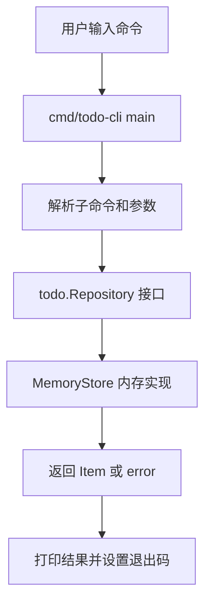

# 第 7 篇：Go 语言基础 [C]

阶段一已经完成 Ubuntu 24.04 环境、Linux 基础、Git 协作和 Shell 自动化。从本篇开始，课程进入 **阶段二：Go 后端开发**。

本篇属于 **C 类：实践/开发章**。你不会只看语法表，而是会把 Go 基础语法放进一个能运行的项目里：命令行版 Todo 管理器 `todo-cli`。它使用内存存储，支持新增、列表、完成、修改和删除 Todo，是后续 Todo API、工程化测试、数据库持久化和容器化的第一块 Go 代码资产。

本篇对应 5 个章节主题：

- 7.1 Go 程序结构、变量、常量与类型
- 7.2 条件、循环、数组、切片与 map
- 7.3 函数、指针、结构体与方法
- 7.4 interface、error 与 defer
- 7.5 Go module 与包管理：`replace`、`vendor`、`indirect` 依赖

## 1. 本章学习目标

学完本篇后，你应该能用 Go 编写结构清晰的小型命令行程序，并能解释这些基础语法如何支撑后续 Web API、数据库访问和 Kubernetes Controller 开发。

### 1.1 知识目标

- 能解释 Go 程序由 `package`、`import`、函数、文件和 module 组成。
- 能描述变量、常量、零值、类型转换、数组、切片和 map 的使用边界。
- 能解释函数、指针、结构体和方法如何表达业务对象与业务行为。
- 能说明 `interface`、`error`、`defer` 在工程代码中的职责。
- 能描述 `go.mod`、module path、package path、`replace`、`vendor` 和 `indirect` 依赖的作用。

### 1.2 技能目标

- 能在 `cloud-native-todo-platform` 中创建 `cmd/todo-cli` 和 `internal/todo` 两个 Go package。
- 能实现一个内存版 `todo-cli`，支持 `add`、`list`、`done`、`update`、`delete`。
- 能使用 `go fmt`、`go test`、`go run`、`go build` 完成基础开发闭环。
- 能根据 Go 编译错误定位 package 名、导出标识符、参数数量和类型错误。

本篇结束时，你至少应该能成功执行：

```bash
cd ~/workspace/cloud-native-todo-platform
go test ./...
go run ./cmd/todo-cli add "学习 Go 基础" add "完成 todo-cli" list done 1 update 2 "完成 Go module" list delete 1 list
go build -o bin/todo-cli ./cmd/todo-cli
./bin/todo-cli add "构建后的 CLI 可运行" list
```

## 2. 本章工作场景与真实案例

### 2.1 技术痛点

真实后端开发不会停留在“会写一个 hello world”。团队需要你能把业务对象、业务规则、错误处理和工程目录组织起来。比如 Todo 平台中，“新增任务”“完成任务”“删除任务”看似简单，但它们已经涉及输入校验、ID 分配、状态变化、错误返回和输出格式。

如果 Go 基础不扎实，后续会连续卡住：写 HTTP Handler 时不知道如何组织结构体，接数据库时不知道如何处理错误，写测试时不知道怎么替换依赖，开发 Controller 时不知道 interface 应该定义在哪里。本篇先用一个小 CLI 把这些能力串起来。

### 2.2 团队协作场景

在真实团队中，CLI 工具常用于本地调试、数据修复、发布辅助和运维巡检。后端开发负责编写业务逻辑，DevOps 可能把 CLI 放进脚本或 CI，测试同学用它准备数据，SRE 用它快速验证服务行为。一个 CLI 如果参数、退出码和错误输出不稳定，就很难被脚本可靠调用。

本篇的 `todo-cli` 不追求功能复杂，而是训练最基本的协作边界：入口程序放在 `cmd/todo-cli`，业务对象和内存仓库放在 `internal/todo`，命令行解析只负责把用户输入转换为业务调用，业务包不依赖终端输出。

### 2.3 课程项目关联

`todo-cli` 是 `Cloud Native Todo Platform` 的第一个 Go 业务程序。它的内存存储只适合本篇学习；后续第 8 篇会在此基础上补工程化结构和测试，第 9 篇开始把 Todo 能力迁移到 HTTP API，第 12 篇会引入 PostgreSQL 持久化。你在本篇写下的 `Item`、`Repository`、错误处理和 package 边界，会反复出现在后续章节中。

## 3. 核心概念

### 3.1 Go 程序结构

一个可执行 Go 程序通常从 `package main` 和 `main` 函数开始：

```go
package main

import "fmt"

func main() {
	fmt.Println("hello go")
}
```

几个关键点：

- `package main` 表示这个包可以编译成可执行程序。
- `import "fmt"` 引入 Go 标准库中的格式化输出包。
- `func main()` 是程序入口。
- Go 使用 `go fmt` 统一格式；它底层调用 `gofmt`，团队不需要争论缩进风格。

在课程项目中，我们采用更接近真实项目的拆分：

```text
cmd/todo-cli/        # 命令行入口，负责解析参数和输出
internal/todo/       # Todo 业务包，负责对象、规则和存储
```

`cmd/` 放可执行程序入口，`internal/` 放本 module 内部使用的业务包。后续 Web API、后台任务和测试都会复用这种组织方式。

### 3.2 变量、常量与类型

Go 是静态类型语言，变量在编译期就有明确类型：

```go
var title string = "学习 Go"
var done bool
count := 3
```

- `var title string = "学习 Go"` 显式声明类型。
- `var done bool` 没有赋值时使用零值，`bool` 的零值是 `false`。
- `count := 3` 是短变量声明，只能在函数内部使用。

常量用 `const`，适合表达不会变化的命令名、默认值和状态：

```go
const commandAdd = "add"
```

本篇常用类型如下：

| 类型 | 用途 | 零值 |
|---|---|---|
| `string` | Todo 标题、命令名 | `""` |
| `bool` | 是否完成 | `false` |
| `int` | Todo ID、索引 | `0` |
| `[]Item` | Todo 列表 | `nil` |
| `map[int]Item` | 按 ID 保存 Todo | `nil` |
| `time.Time` | 创建和更新时间 | 零时间 |

零值是 Go 的重要设计。一个 `Item` 即使没有手动填充所有字段，也处于可预测状态；但业务代码仍应主动校验标题不能为空、ID 必须存在。

### 3.3 条件、循环、数组、切片与 map

Go 的条件语句不需要小括号：

```go
if title == "" {
	return errors.New("title is required")
}
```

`switch` 很适合处理 CLI 子命令：

```go
switch command {
case "add":
	// 新增 Todo
case "list":
	// 列出 Todo
default:
	return fmt.Errorf("unknown command %q", command)
}
```

数组长度固定，切片长度可变。业务列表更常用切片：

```go
items := []string{"学习 Go", "编写 CLI"}
items = append(items, "运行 go build")
```

map 适合按 key 快速查找。本篇的内存仓库用 `map[int]Item` 按 ID 保存 Todo：

```go
items := map[int]string{
	1: "学习 Go",
	2: "完成 CLI",
}
```

遍历 map 时顺序不稳定，所以本篇会在 `List` 方法中把 Todo 拷贝到切片里，再按 ID 排序。这个细节很重要：命令行输出如果每次顺序不同，脚本和测试都会变得不稳定。

### 3.4 函数、指针、结构体与方法

函数用于表达动作：

```go
func normalizeTitle(title string) (string, error) {
	title = strings.TrimSpace(title)
	if title == "" {
		return "", errors.New("title is required")
	}
	return title, nil
}
```

结构体用于表达业务对象：

```go
type Item struct {
	ID        int
	Title     string
	Done      bool
	CreatedAt time.Time
	UpdatedAt time.Time
}
```

方法把行为绑定到类型上：

```go
func (i Item) Status() string {
	if i.Done {
		return "done"
	}
	return "pending"
}
```

指针用于修改原对象，或避免复制较大的对象。本篇的 `MemoryStore` 方法使用指针接收者，因为新增、修改和删除 Todo 都会改变仓库内部的 `map` 和 `nextID`。

```go
func (s *MemoryStore) Add(title string) (Item, error) {
	// 修改 s.items 和 s.nextID
}
```

指针不是越多越好。像 `Item.Status()` 只读取字段，不修改对象，用值接收者更简单。

### 3.5 interface、error 与 defer

`interface` 描述“调用方需要什么能力”。本篇定义一个最小 `Repository`：

```go
type Repository interface {
	Add(title string) (Item, error)
	List() []Item
	Done(id int) (Item, error)
	Update(id int, title string) (Item, error)
	Delete(id int) error
}
```

现在它的实现是 `MemoryStore`。未来可以替换成文件、PostgreSQL 或 Redis，而 CLI 入口不需要关心底层怎么存。

这里的 `List() []Item` 是本篇为了新手学习刻意保留的简化接口：内存读取不会失败，所以暂时不返回 `error`。后续进入文件存储、数据库和 HTTP 请求链路后，Repository 会继续演进为带 `error`、`context.Context` 和过滤条件的形式。先把“能力边界”学清楚，再逐步增加生产复杂度，学习曲线会更稳。

Go 用 `error` 表达可预期失败，例如标题为空、ID 不存在、ID 不是数字。错误要带上下文，方便排障：

```go
return Item{}, fmt.Errorf("%w: id=%d", ErrNotFound, id)
```

`%w` 会保留错误链，后续可以用 `errors.Is(err, ErrNotFound)` 判断根因。

`defer` 用于函数返回前执行收尾动作，常见于关闭文件、释放锁、恢复临时状态。本篇内存 CLI 不需要打开文件，但你应该理解它的典型用法：

```go
file, err := os.Open("todos.txt")
if err != nil {
	return err
}
defer file.Close()
```

`defer` 不是“出了错自动修复”。它只是保证当前函数结束前执行某个动作，具体动作是否成功仍然要按场景处理。

### 3.6 Go module 与包管理

`go.mod` 是 Go 项目的依赖和 module 声明文件：

```go
module cloud-native-todo-platform

go 1.26
```

几个概念要分清：

- module path：`cloud-native-todo-platform`，表示当前项目的根路径。
- package path：`cloud-native-todo-platform/internal/todo`，表示某个包的导入路径。
- `go.sum`：记录依赖校验信息，有第三方依赖时出现。
- `indirect`：当前 module 没直接 import，但被其他依赖间接需要。
- `replace`：把某个 module 临时替换到本地路径或另一个版本，常用于本地联调。
- `vendor`：把依赖复制到项目 `vendor/` 目录，常用于网络受限或强审计环境。

本篇只使用标准库，不会产生第三方依赖；但你会先建立 module 结构，为后续 Gin、PostgreSQL、Redis 等依赖管理打基础。

为了先建立概念，下面给出一个只读示例，不需要在本篇实验中执行：

```go
module cloud-native-todo-platform

go 1.26

require (
	github.com/example/teamlib v1.2.3
	github.com/example/dependency v0.0.0 // indirect
)

replace github.com/example/teamlib => ../teamlib
```

- `require` 记录当前项目依赖的 module 版本。
- 示例中的 `example` 路径和版本号仅用于说明语法，真实项目以 `go get` 或 `go mod tidy` 解析结果为准。
- `// indirect` 表示这个依赖不是当前代码直接 import 的，而是被其他依赖间接拉入。
- `replace` 常用于本地联调，例如后续你同时修改平台公共库和 Todo 服务。
- `go mod vendor` 会把依赖复制到 `vendor/`，适合网络受限或强审计环境；普通项目默认不需要一开始就 vendor。

## 4. 原理深入

### 4.1 `todo-cli` 的调用链

下图展示本篇 CLI 的运行流程。



命令行入口只做三件事：解析输入、调用业务包、打印结果。业务包不读取 `os.Args`，也不直接打印终端输出。这样的拆分让代码更容易测试，也让后续从 CLI 迁移到 HTTP API 更自然。

### 4.2 内存存储的生命周期

本篇使用内存存储，所有 Todo 都保存在当前进程的 `map[int]Item` 中。进程退出后，数据会消失。这是有意设计，不是缺陷：第 7 篇的目标是 Go 语法和对象建模，不提前引入文件、数据库和并发控制。

这版 `MemoryStore` 没有加锁，只适合本篇的单进程、顺序 CLI 实验，不适合直接放进并发 HTTP 服务。后续学习并发和生产化服务时，会再引入 `sync.Mutex`、数据库事务和请求级 `context`。

因此，完整增删改查要在同一个进程中完成。本篇支持两种方式：

- 在一条命令里串联多个子命令。
- 不带参数启动交互模式，逐行输入命令。

第 8 篇以后会继续演进工程结构和测试，第 12 篇会把数据持久化到 PostgreSQL。你现在需要记住的是：存储方式会变，但 `Repository` 表达的业务能力边界可以延续。

### 4.3 错误与退出码

CLI 程序经常被 Shell 脚本或 CI 调用。它应该遵守一个基本约定：成功时退出码为 `0`，失败时退出码非 `0`，错误写到标准错误。

本篇 `main` 函数会这样处理：

```go
if err := run(os.Args[1:], os.Stdin, os.Stdout, os.Stderr); err != nil {
	fmt.Fprintf(os.Stderr, "error: %v\n", err)
	os.Exit(1)
}
```

这段代码背后有三个工程习惯：

- 业务函数返回 `error`，入口统一决定怎么展示。
- 普通结果写到 `stdout`，错误写到 `stderr`。
- 失败时显式 `os.Exit(1)`，方便脚本判断。

## 5. 手把手实验

### 5.1 实验目标

本实验会在 `cloud-native-todo-platform` 中实现内存版 `todo-cli`，完成 Go module 初始化、业务包编写、命令行入口编写、运行验证和构建。

最终功能：

- `add <title>`：新增 Todo。
- `list`：列出 Todo。
- `done <id>`：标记 Todo 完成。
- `update <id> <title>`：修改标题。
- `delete <id>`：删除 Todo。
- `help`：查看帮助。

### 5.2 实验环境

| 项目 | 要求 |
|---|---|
| 操作系统 | Ubuntu 24.04 LTS |
| Go | 1.26.x |
| Git | 已完成阶段一 Git 工作流 |
| Shell | Bash 5.x |
| 项目目录 | `~/workspace/cloud-native-todo-platform` |

确认 Go 版本：

```bash
go version
go env GOPROXY
```

预期输出类似：

```text
go version go1.26.2 linux/amd64
https://goproxy.cn,direct
```

进入项目仓库：

```bash
cd ~/workspace/cloud-native-todo-platform
```

### 5.3 文件目录结构

创建本篇需要的目录：

```bash
mkdir -p cmd/todo-cli internal/todo bin
```

查看结构：

```bash
tree -L 3 cmd internal
```

预期输出：

```text
cmd
└── todo-cli
internal
└── todo
```

本篇完成后会形成：

```text
cloud-native-todo-platform/
├── cmd/
│   └── todo-cli/
│       └── main.go
├── internal/
│   └── todo/
│       ├── item.go
│       └── memory_store.go
├── bin/
└── go.mod
```

### 5.4 完整代码

如果仓库还没有 `go.mod`，先初始化 module：

```bash
test -f go.mod || go mod init cloud-native-todo-platform
```

`go.mod` 内容应类似：

```go title="go.mod"
module cloud-native-todo-platform

go 1.26
```

创建 `internal/todo/item.go`：

```go title="internal/todo/item.go"
package todo

import (
	"errors"
	"fmt"
	"strings"
	"time"
)

// ErrNotFound marks a missing Todo item.
var ErrNotFound = errors.New("todo not found")

// Item is the domain object managed by todo-cli.
type Item struct {
	ID        int
	Title     string
	Done      bool
	CreatedAt time.Time
	UpdatedAt time.Time
}

// Status returns the human-readable state of the item.
func (i Item) Status() string {
	if i.Done {
		return "done"
	}
	return "pending"
}

// NormalizeTitle trims and validates a Todo title.
func NormalizeTitle(title string) (string, error) {
	title = strings.TrimSpace(title)
	if title == "" {
		return "", errors.New("title is required")
	}
	return title, nil
}

// FormatItem converts an Item to one stable CLI output line.
func FormatItem(item Item) string {
	mark := " "
	if item.Done {
		mark = "x"
	}
	return fmt.Sprintf("%d. [%s] %s (%s)", item.ID, mark, item.Title, item.Status())
}
```

创建 `internal/todo/memory_store.go`：

```go title="internal/todo/memory_store.go"
package todo

import (
	"fmt"
	"sort"
	"time"
)

// Repository describes the storage behavior needed by the CLI.
type Repository interface {
	Add(title string) (Item, error)
	List() []Item
	Done(id int) (Item, error)
	Update(id int, title string) (Item, error)
	Delete(id int) error
}

// MemoryStore stores Todo items in the current process memory.
type MemoryStore struct {
	nextID int
	items  map[int]Item
	now    func() time.Time
}

var _ Repository = (*MemoryStore)(nil)

// NewMemoryStore creates an empty in-memory Todo repository.
func NewMemoryStore() *MemoryStore {
	return &MemoryStore{
		nextID: 1,
		items:  make(map[int]Item),
		now:    time.Now,
	}
}

// Add validates and stores a new Todo item.
func (s *MemoryStore) Add(title string) (Item, error) {
	title, err := NormalizeTitle(title)
	if err != nil {
		return Item{}, err
	}

	now := s.now()
	item := Item{
		ID:        s.nextID,
		Title:     title,
		CreatedAt: now,
		UpdatedAt: now,
	}

	s.items[item.ID] = item
	s.nextID++
	return item, nil
}

// List returns all Todo items sorted by ID.
func (s *MemoryStore) List() []Item {
	items := make([]Item, 0, len(s.items))
	for _, item := range s.items {
		items = append(items, item)
	}
	sort.Slice(items, func(i, j int) bool {
		return items[i].ID < items[j].ID
	})
	return items
}

// Done marks an item as completed.
func (s *MemoryStore) Done(id int) (Item, error) {
	item, ok := s.items[id]
	if !ok {
		return Item{}, fmt.Errorf("%w: id=%d", ErrNotFound, id)
	}
	item.Done = true
	item.UpdatedAt = s.now()
	s.items[id] = item
	return item, nil
}

// Update changes the title of an existing item.
func (s *MemoryStore) Update(id int, title string) (Item, error) {
	title, err := NormalizeTitle(title)
	if err != nil {
		return Item{}, err
	}

	item, ok := s.items[id]
	if !ok {
		return Item{}, fmt.Errorf("%w: id=%d", ErrNotFound, id)
	}
	item.Title = title
	item.UpdatedAt = s.now()
	s.items[id] = item
	return item, nil
}

// Delete removes an item by ID.
func (s *MemoryStore) Delete(id int) error {
	if _, ok := s.items[id]; !ok {
		return fmt.Errorf("%w: id=%d", ErrNotFound, id)
	}
	delete(s.items, id)
	return nil
}
```

这里有两个容易被忽略的工程细节：

- `now func() time.Time` 默认指向 `time.Now`，以后写测试时可以替换成固定时间，避免测试结果依赖真实时钟。这是 Go 项目里常见的轻量依赖注入。
- `var _ Repository = (*MemoryStore)(nil)` 是编译期接口断言。如果 `*MemoryStore` 不再满足 `Repository`，编译会立刻失败；它不产生运行时对象，是零成本的安全网。

创建 `cmd/todo-cli/main.go`：

```go title="cmd/todo-cli/main.go"
package main

import (
	"bufio"
	"errors"
	"fmt"
	"io"
	"os"
	"strconv"
	"strings"

	"cloud-native-todo-platform/internal/todo"
)

const appName = "todo-cli"

type runner struct {
	repo   todo.Repository
	out    io.Writer
	errOut io.Writer
}

func main() {
	if err := run(os.Args[1:], os.Stdin, os.Stdout, os.Stderr); err != nil {
		fmt.Fprintf(os.Stderr, "error: %v\n", err)
		os.Exit(1)
	}
}

func run(args []string, in io.Reader, out, errOut io.Writer) error {
	r := runner{
		repo:   todo.NewMemoryStore(),
		out:    out,
		errOut: errOut,
	}

	if len(args) > 0 {
		return r.runArgs(args)
	}
	return r.runInteractive(in)
}

func (r runner) runInteractive(in io.Reader) error {
	fmt.Fprintf(r.out, "%s memory mode. Type help or exit.\n", appName)

	scanner := bufio.NewScanner(in)
	for {
		fmt.Fprint(r.out, "> ")
		if !scanner.Scan() {
			break
		}

		line := strings.TrimSpace(scanner.Text())
		if line == "" {
			continue
		}
		if line == "exit" || line == "quit" {
			return nil
		}

		args := parseInteractiveLine(line)
		if err := r.runArgs(args); err != nil {
			fmt.Fprintf(r.errOut, "error: %v\n", err)
		}
	}

	if err := scanner.Err(); err != nil {
		return fmt.Errorf("read stdin: %w", err)
	}
	return nil
}

func parseInteractiveLine(line string) []string {
	fields := strings.Fields(line)
	if len(fields) == 0 {
		return nil
	}

	switch fields[0] {
	case "add":
		title := strings.TrimSpace(strings.TrimPrefix(line, "add"))
		return []string{"add", title}
	case "update":
		if len(fields) < 3 {
			return fields
		}
		prefix := fields[0] + " " + fields[1]
		title := strings.TrimSpace(strings.TrimPrefix(line, prefix))
		return []string{"update", fields[1], title}
	default:
		return fields
	}
}

func (r runner) runArgs(args []string) error {
	for len(args) > 0 {
		command := args[0]
		args = args[1:]

		switch command {
		case "help", "-h", "--help":
			r.printHelp()
		case "add":
			if len(args) < 1 {
				return errors.New("usage: todo-cli add <title>")
			}
			item, err := r.repo.Add(args[0])
			if err != nil {
				return err
			}
			fmt.Fprintf(r.out, "added #%d: %s\n", item.ID, item.Title)
			args = args[1:]
		case "list":
			r.printList()
		case "done":
			if len(args) < 1 {
				return errors.New("usage: todo-cli done <id>")
			}
			id, err := parseID(args[0])
			if err != nil {
				return err
			}
			item, err := r.repo.Done(id)
			if err != nil {
				return fmt.Errorf("mark done: %w", err)
			}
			fmt.Fprintf(r.out, "done #%d: %s\n", item.ID, item.Title)
			args = args[1:]
		case "update":
			if len(args) < 2 {
				return errors.New("usage: todo-cli update <id> <title>")
			}
			id, err := parseID(args[0])
			if err != nil {
				return err
			}
			item, err := r.repo.Update(id, args[1])
			if err != nil {
				return fmt.Errorf("update: %w", err)
			}
			fmt.Fprintf(r.out, "updated #%d: %s\n", item.ID, item.Title)
			args = args[2:]
		case "delete":
			if len(args) < 1 {
				return errors.New("usage: todo-cli delete <id>")
			}
			id, err := parseID(args[0])
			if err != nil {
				return err
			}
			if err := r.repo.Delete(id); err != nil {
				return fmt.Errorf("delete: %w", err)
			}
			fmt.Fprintf(r.out, "deleted #%d\n", id)
			args = args[1:]
		default:
			return fmt.Errorf("unknown command %q", command)
		}
	}

	return nil
}

func parseID(raw string) (int, error) {
	id, err := strconv.Atoi(raw)
	if err != nil || id <= 0 {
		return 0, fmt.Errorf("invalid id %q", raw)
	}
	return id, nil
}

func (r runner) printList() {
	items := r.repo.List()
	if len(items) == 0 {
		fmt.Fprintln(r.out, "no todos")
		return
	}

	for _, item := range items {
		fmt.Fprintln(r.out, todo.FormatItem(item))
	}
}

func (r runner) printHelp() {
	fmt.Fprint(r.out, `todo-cli commands:
  add <title>          add a Todo
  list                 list Todos
  done <id>            mark a Todo as done
  update <id> <title>  update a Todo title
  delete <id>          delete a Todo
  help                 show help
  exit                 leave interactive mode

Examples:
  todo-cli add "learn Go" list
  todo-cli
`)
}
```

### 5.5 执行命令

格式化 Go 代码：

```bash
go fmt ./cmd/todo-cli ./internal/todo
```

列出 package，确认 module 和 import 路径正确：

```bash
go list ./...
```

运行编译级检查：

```bash
go test ./...
```

使用一条命令完成完整内存生命周期：

```bash
go run ./cmd/todo-cli add "学习 Go 程序结构" add "完成 todo-cli 实验" list done 1 update 2 "完成 Go module 实验" list delete 1 list
```

这条链式命令在 Shell 眼中只是一条普通命令加一串参数；带引号的标题会作为一个完整参数传给 Go 程序，不带引号的空格会触发 Shell 单词拆分。链式命令是本篇为了演示“同一个进程内的内存状态”而设计的教学用法。真实 CLI 更常见的是一次执行一个子命令，并通过文件、SQLite、PostgreSQL 或远程 API 保存状态；本篇先不引入持久化，是为了把注意力放在 Go 基础语法和业务边界上。

也可以直接运行 `go run ./cmd/todo-cli` 进入交互模式，然后逐行输入命令，输入 `exit` 退出。下面用 `<<'EOF'` heredoc 把多行输入一次性传给交互模式，这个语法在阶段一第 3 篇已经介绍过：

```bash
go run ./cmd/todo-cli <<'EOF'
add 学习结构体和方法
add 练习 interface 和 error
list
done 1
update 2 练习 Go module
list
delete 1
list
exit
EOF
```

构建可执行文件：

```bash
go build -o bin/todo-cli ./cmd/todo-cli
```

运行构建产物：

```bash
./bin/todo-cli add "构建后的 CLI 可运行" list
```

### 5.6 预期输出

`go list ./...` 应包含：

```text
cloud-native-todo-platform/cmd/todo-cli
cloud-native-todo-platform/internal/todo
```

`go test ./...` 在本篇可能显示没有测试文件，这是正常的。本篇把 `go test` 作为编译级验证使用；第 8 篇会系统补充单元测试、表驱动测试和覆盖率：

```text
?   	cloud-native-todo-platform/cmd/todo-cli	[no test files]
?   	cloud-native-todo-platform/internal/todo	[no test files]
```

完整生命周期命令的输出应类似：

```text
added #1: 学习 Go 程序结构
added #2: 完成 todo-cli 实验
1. [ ] 学习 Go 程序结构 (pending)
2. [ ] 完成 todo-cli 实验 (pending)
done #1: 学习 Go 程序结构
updated #2: 完成 Go module 实验
1. [x] 学习 Go 程序结构 (done)
2. [ ] 完成 Go module 实验 (pending)
deleted #1
2. [ ] 完成 Go module 实验 (pending)
```

交互模式会先输出提示：

```text
todo-cli memory mode. Type help or exit.
>
```

### 5.7 验证方法

验证代码格式。执行前先确认文件已经保存；`go fmt` 会直接格式化目标 package：

```bash
go fmt ./cmd/todo-cli ./internal/todo
git diff --check
```

验证包路径和编译：

```bash
go list ./...
go test ./...
go build -o bin/todo-cli ./cmd/todo-cli
```

验证业务行为：

```bash
./bin/todo-cli add "验收 todo-cli" list done 1 list delete 1 list
```

判断标准：

- `go list ./...` 能列出 `cmd/todo-cli` 和 `internal/todo`。
- `go test ./...` 能成功退出。
- `go build` 能生成 `bin/todo-cli`。
- `add` 后能看到 `added #1`。
- `done 1` 后列表中能看到 `[x]`。
- `delete 1` 后列表显示 `no todos`。

### 5.8 清理步骤

如果只是删除构建产物：

```bash
rm -f bin/todo-cli
```

如果要重做本篇实验，先确认当前分支中的代码已经提交或不再需要，再删除本篇新增文件：

```bash
rm -rf cmd/todo-cli internal/todo bin/todo-cli
```

本篇使用内存存储，不会产生 `.todo-cli` 数据目录或 JSON 文件。

预计耗时：70 分钟（动手操作约 45 分钟）。

## 6. 常见错误与排障

### 错误 1：`go: cannot find main module`

- **现象**：

  ```text
  go: cannot find main module, but found .git/config in /home/user/workspace/cloud-native-todo-platform
  ```

- **原因**：当前仓库没有 `go.mod`，或者你不在 module 根目录中执行命令。

- **排查**：

  ```bash
  pwd
  ls -l go.mod
  go env GOMOD
  ```

  如果 `go.mod` 不存在，或者 `go env GOMOD` 输出 `/dev/null`，说明 Go 没有识别到当前 module。

- **修复**：

  ```bash
  cd ~/workspace/cloud-native-todo-platform
  test -f go.mod || go mod init cloud-native-todo-platform
  ```

- **预防**：所有 Go 命令都在项目根目录执行；新增 module 后把 `go.mod` 提交到 Git。

### 错误 2：`package cloud-native-todo-platform/internal/todo is not in std`

- **现象**：

  ```text
  package cloud-native-todo-platform/internal/todo is not in std
  ```

- **原因**：`go.mod` 中的 `module` 值和 `main.go` 里的 import 路径不一致，或者你在 module 外部执行了 `go run`。

- **排查**：

  ```bash
  sed -n '1,20p' go.mod
  grep -n 'cloud-native-todo-platform/internal/todo' cmd/todo-cli/main.go
  go list ./...
  ```

  `go.mod` 第一行应为 `module cloud-native-todo-platform`。

- **修复**：统一 module path 和 import path。课程中使用：

  ```go
  module cloud-native-todo-platform
  ```

  ```go
  import "cloud-native-todo-platform/internal/todo"
  ```

- **预防**：初始化 module 后不要随意改名；如果团队使用 GitHub module path，应一次性统一所有 import。

### 错误 3：`usage: todo-cli add <title>`

- **现象**：

  ```text
  error: usage: todo-cli add <title>
  exit status 1
  ```

- **原因**：`add` 命令缺少标题，或者标题中有空格但没有用引号包起来。

- **排查**：

  ```bash
  go run ./cmd/todo-cli add
  go run ./cmd/todo-cli add 学习 Go
  ```

  第二条命令会把 `学习` 和 `Go` 当成两个参数；本篇的链式命令模式要求带空格的标题使用引号。

- **修复**：

  ```bash
  go run ./cmd/todo-cli add "学习 Go"
  ```

  或使用交互模式，交互模式中的标题可以直接包含空格：

  ```bash
  go run ./cmd/todo-cli
  ```

- **预防**：写 CLI 文档时明确参数格式；脚本中给带空格的参数加引号。

### 错误 4：`invalid id "abc"` 或 `todo not found`

- **现象**：

  ```text
  error: invalid id "abc"
  ```

  或者：

  ```text
  error: mark done: todo not found: id=9
  ```

- **原因**：`done`、`update`、`delete` 的 ID 必须是正整数，而且该 ID 必须存在于当前进程的内存仓库中。

- **排查**：

  ```bash
  go run ./cmd/todo-cli add "学习 Go" list done abc
  go run ./cmd/todo-cli add "学习 Go" list done 9
  ```

  第一条会暴露 ID 格式错误；第二条会暴露 ID 不存在。

- **修复**：先执行 `list` 查看当前进程里的 ID，再操作存在的 ID。

  ```bash
  go run ./cmd/todo-cli add "学习 Go" list done 1 list
  ```

- **预防**：外部输入永远要校验；不要相信用户传入的字符串一定能转换成业务 ID。

### 错误 5：分开执行 `go run` 后数据消失

- **现象**：

  ```bash
  go run ./cmd/todo-cli add "学习 Go"
  go run ./cmd/todo-cli list
  ```

  第二条输出：

  ```text
  no todos
  ```

- **原因**：本篇使用内存存储。每次 `go run` 都会启动一个新进程，新进程里的 `MemoryStore` 是空的。

- **排查**：

  ```bash
  go run ./cmd/todo-cli add "学习 Go" list
  ```

  如果同一条命令里可以看到 Todo，说明程序正常，数据只是没有跨进程持久化。

- **修复**：本篇使用链式命令或交互模式完成完整生命周期。链式命令只是内存版教学手段，不代表生产 CLI 的推荐交互方式。持久化会在后续章节引入，不要在第 7 篇提前把文件或数据库逻辑塞进 CLI。

- **预防**：明确区分内存状态和持久化状态。内存适合学习对象建模和算法流程，持久化适合跨进程、跨重启保存数据。

## 7. 生产环境注意事项

1. **CLI 的参数、输出和退出码必须稳定。**
   真实团队的 CLI 往往会被 Shell、CI 或发布系统调用。输出格式随意变化，会让脚本解析失败；失败时仍返回退出码 `0`，会让流水线误判成功。本篇虽然只是教学 CLI，但已经按 `stdout` 输出结果、`stderr` 输出错误、失败时 `os.Exit(1)` 的习惯设计。

2. **内存存储不能承载生产数据。**
   内存存储简单、快、适合学习，但进程退出后数据会丢失，也无法处理多进程并发写入。生产环境需要文件锁、数据库事务、备份恢复和权限控制。本篇刻意不做持久化，是为了让你先掌握 Go 语言基础；不要把内存版 CLI 当成可上线工具。

3. **业务包不要依赖终端和操作系统细节。**
   `internal/todo` 不读取 `os.Args`，不打印终端输出，也不调用 `os.Exit`。这样它将来可以被 HTTP Handler、后台任务、测试或 Controller 复用。生产项目中，业务逻辑和传输层混在一起会增加重构成本，也会让测试变得困难。

4. **依赖管理要可追踪。**
   本篇只用标准库，所以没有 `go.sum`。后续引入第三方库时，应把 `go.mod` 和 `go.sum` 一起提交。企业环境中还要关注依赖许可证、漏洞扫描、私有 module 认证和 `GOPROXY` 来源，不能在生产构建中临时拉取不可追踪依赖。

5. **错误信息要帮助定位，但不要泄露敏感信息。**
   本篇的错误会告诉你 `id=9` 不存在，这有助于调试。生产系统中，错误信息同样要有上下文，但不能输出密钥、Token、数据库连接串或用户隐私数据。CLI 工具尤其容易被放进 CI 日志，输出内容要经过安全审查。

## 8. 本章小项目

本章小项目：**内存版 Todo CLI v0.1**。

交付物：

- `go.mod`
- `cmd/todo-cli/main.go`
- `internal/todo/item.go`
- `internal/todo/memory_store.go`
- `bin/todo-cli` 构建产物（可本地生成，不提交）

验收命令：

```bash
cd ~/workspace/cloud-native-todo-platform
go fmt ./cmd/todo-cli ./internal/todo
go test ./...
go build -o bin/todo-cli ./cmd/todo-cli
./bin/todo-cli add "验收 todo-cli" add "检查内存存储" list done 1 update 2 "检查 Go module" list delete 1 list
```

能力验收标准：

| 能力项 | 验收方式 |
|---|---|
| Go module | `go list ./...` 能列出本篇两个 package |
| 结构体与方法 | 能解释 `Item` 和 `Status()` 的职责 |
| 切片与 map | 能解释为什么 `MemoryStore` 用 map 保存、用切片排序输出 |
| interface | 能解释 `Repository` 为什么能隔离存储实现 |
| error | 能解释 `ErrNotFound` 和 `%w` 的作用 |
| CLI | 能用一条命令完成 add/list/done/update/delete |

## 9. 本章练习题

### 基础题

1. `package main` 和普通业务包有什么区别？
2. 为什么 `MemoryStore.Add` 使用指针接收者，而 `Item.Status` 可以使用值接收者？
3. 切片和 map 分别适合表达什么数据？本篇为什么两个都用到了？
4. `Repository` interface 的作用是什么？如果只有一个实现，为什么仍然可以保留这个边界？
5. 为什么本篇分开执行两次 `go run` 后数据不会保留？

### 实操题

1. 给 `todo-cli` 增加 `count` 命令，输出当前 Todo 总数。当 `go run ./cmd/todo-cli add "a" add "b" count` 输出 `2` 时，说明操作成功。
2. 给 `list` 输出增加完成数量统计，例如最后一行输出 `summary: 1 done, 2 pending`。当完成一个 Todo 后统计数字变化正确，说明操作成功。
3. 修改 `parseID`，让 ID 为 `0` 或负数时报错信息包含 `id must be positive`。当 `go run ./cmd/todo-cli done 0` 返回该错误时，说明操作成功。

### 思考题

1. 如果团队准备让 `todo-cli` 的数据跨进程保留，你会选择 JSON 文件、SQLite 还是 PostgreSQL？请说明你会如何权衡复杂度和可靠性。
2. 如果后续 HTTP API 和 CLI 都要复用 Todo 业务逻辑，你会把输入校验放在 `cmd/todo-cli`、HTTP Handler，还是 `internal/todo`？为什么？

## 10. 本章面试题

### 1. Go 的 package、module 和 import path 是什么关系？

**一句话结论**：module 是项目级依赖边界，package 是代码组织单元，import path 是其他代码引用某个 package 的路径。

**展开解释**：`go.mod` 中的 `module cloud-native-todo-platform` 定义了当前项目根路径；`internal/todo` 是一个 package；在 `cmd/todo-cli/main.go` 中通过 `import "cloud-native-todo-platform/internal/todo"` 引入它。module path 和目录路径拼起来，形成包的 import path。理解这层关系后，遇到 `package ... is not in std` 这类错误时，就能回到 `go.mod` 和 import 路径检查。

**深入追问**：如果是公开 GitHub module，module path 通常会写成 `github.com/<org>/<repo>`。如果改 module path，所有内部 import 都要同步更新。企业私有仓库还要配合 `GOPRIVATE` 和私有代理。

### 2. Go 中什么时候使用指针接收者？

**一句话结论**：当方法需要修改原对象，或对象较大不希望复制时，使用指针接收者。

**展开解释**：本篇 `MemoryStore.Add`、`Done`、`Update`、`Delete` 都要修改 `items` 或 `nextID`，所以使用 `*MemoryStore`。而 `Item.Status()` 只读取字段，不修改对象，用值接收者更简单。指针接收者不是高级写法，也不是默认选择，它应该服务于语义。

**深入追问**：如果同一个类型既有指针接收者又有值接收者，要注意方法集。接口匹配时，`T` 和 `*T` 的方法集不同。真实项目里通常会保持同一类型的方法接收者风格一致，减少误解。

### 3. interface 应该定义在哪里？

**一句话结论**：interface 通常定义在调用方需要的能力边界上，而不是机械地为每个实现都提前定义接口。

**展开解释**：本篇 `Repository` 描述 CLI 和后续服务层需要的 Todo 存储能力：新增、列表、完成、修改、删除。现在实现是 `MemoryStore`，未来可以替换成文件或数据库。如果调用方只依赖 `Repository`，替换实现时改动就更小。但如果一个接口只有一个实现、也没有测试或替换需求，过早抽象会增加阅读成本。

**深入追问**：Go 的接口是隐式实现，不需要 `implements` 关键字。本篇的 `var _ Repository = (*MemoryStore)(nil)` 是编译期断言，用来确认 `MemoryStore` 满足接口，常见于重要边界。

### 4. Go 为什么显式返回 `error`，而不是默认使用异常？

**一句话结论**：Go 倾向把可预期失败作为普通返回值处理，让调用方明确决定如何恢复、包装或终止。

**展开解释**：CLI 中标题为空、ID 不存在、ID 不是数字，都是可预期失败。函数返回 `error` 后，入口层可以统一打印错误并返回非零退出码。`fmt.Errorf("%w")` 可以包装上下文，同时保留原始错误，便于 `errors.Is` 判断根因。

**深入追问**：Go 也有 `panic`，但它更适合不可恢复的程序错误，例如违反内部不变量。业务输入错误、网络失败、数据库超时都应该优先用 `error` 返回。

### 5. 内存存储、文件存储和数据库存储有什么差异？

**一句话结论**：内存存储最简单但进程退出即丢失；文件存储可持久化但并发和查询能力有限；数据库适合生产数据的一致性、查询和事务需求。

**展开解释**：本篇选择内存存储，是为了聚焦 Go 语言基础。文件存储会引入路径、权限、JSON 编解码、并发写入、文件锁和原子替换；数据库会引入连接池、事务、迁移和 SQL。学习顺序上，先用内存理解对象和行为，再逐步引入持久化复杂度，学习曲线更平滑。

**深入追问**：如果后续要把 `MemoryStore` 换成 PostgreSQL，只要新的实现满足 `Repository` 接口，上层 CLI 或服务层就可以尽量少改。这正是接口边界的价值。

## 11. 本章总结

本篇完成了阶段二的第一步：用 Go 写出一个能运行的业务小程序。你学习了 Go 程序结构、变量和类型、控制流、切片与 map、函数、指针、结构体、方法、interface、error、defer 和 Go module。项目成果上，你创建了 `cmd/todo-cli` 和 `internal/todo`，实现了内存版 Todo CLI v0.1，能在一个进程内完成增删改查。能力价值上，你已经不只是能写零散语法，而是能把业务对象、业务行为、错误边界和工程目录组织成可继续演进的 Go 代码。

## 12. 下一章衔接

<<<<<<< HEAD
`go run` 会临时编译并运行程序，适合开发调试。`go build` 编译生成可执行文件，适合构建发布。`go test` 编译并运行测试文件，适合验证业务逻辑和回归问题。企业 CI 中通常至少执行 `go test ./...` 和 `go build ./...`。

### 9. Go module 解决什么问题？

参考答案：

Go module 用于管理项目模块路径、Go 版本线和依赖版本。`go.mod` 描述直接依赖，`go.sum` 记录依赖校验信息，保证构建可复现。真实项目中 module path 应尽量稳定，通常使用仓库路径，避免后续 import 路径大规模变更。

### 10. 如何让 CLI 程序适合 CI/CD 调用？

参考答案：

CLI 程序应该有清晰的参数、稳定的输出、明确的退出码和可排障的错误信息。成功返回 `0`，失败返回非 `0`，错误输出到 `stderr`。配置应支持环境变量或参数注入，避免把本机路径、密钥、临时状态写死在代码中。

## 14. 本章总结

本篇完成了阶段二 Go 后端开发的第一步。

你已经学习并实践了：

- Go 程序结构、变量、常量、类型和零值。
- 条件、循环、切片和 map。
- 函数、指针、结构体和方法。
- interface、error 和 defer。
- Go module、package 和基础工程目录。
- 一个完整可运行的 `todo-cli` 项目。

本篇的关键不是“背下语法”，而是理解 Go 如何表达业务对象、业务行为、错误边界和工程结构。`todo-cli` 是后续 Todo 平台的第一块 Go 代码资产，它会继续演进为可测试服务、Web API、并发任务、数据库服务和云原生应用。

## 15. 下一章衔接

下一篇将进入 Go 工程化与测试。

本篇的 `todo-cli` 已经能表达基本业务对象和命令行行为，但还缺少真实后端项目需要的目录边界、配置入口、结构化日志、服务层抽象和测试体系。下一篇会把本篇的 Go module 整理成 Todo API 工程骨架，为后续 `net/http` 服务、数据库持久化、容器化和 Kubernetes 部署打基础。如果跳过工程化直接写 HTTP，后续很容易把路由、配置、业务逻辑和测试全部挤在 `main.go` 里。
=======
下一篇进入 **Go 工程化与测试**。本篇的 `Item`、`Repository`、`MemoryStore` 和 `cmd/todo-cli` 会成为后续工程化改造的起点：你会学习如何给业务逻辑补测试、如何整理配置和日志、如何让小程序逐步具备生产级后端项目的骨架。
>>>>>>> origin/main
