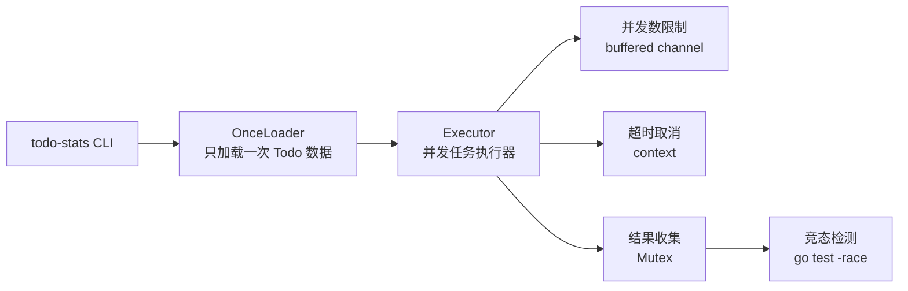
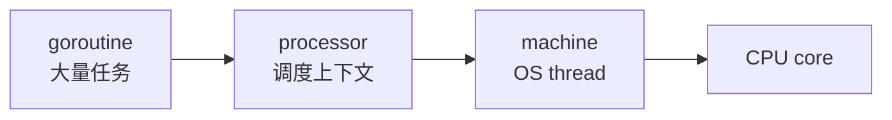
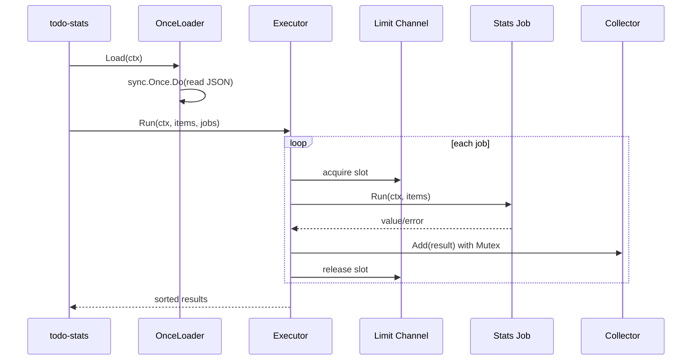

# 第 8 篇：Go 进阶与并发编程

第 7 篇已经完成了 Go 基础语法和命令行版 `todo-cli`。到这里，你已经能用结构体、方法、interface、error 和 Go module 写出一个可运行的小程序。

但真实后端服务不会只顺序执行一件事。一个 Todo 平台可能同时处理多个 HTTP 请求、并发查询数据库、异步统计任务、批量发送通知、等待外部接口返回、在超时时主动取消请求。Go 的并发模型正是后端服务、云原生控制器和 Operator 开发绕不开的基础能力。

本篇对应 5 个章节主题：

- 8.1 goroutine 与并发执行
- 8.2 channel 通信模型
- 8.3 context 超时、取消与请求链路控制
- 8.4 sync、Mutex、WaitGroup 与 Once
- 8.5 并发安全、竞态检测与限流思想

本篇特色项目是：**开发并发 Todo 统计任务执行器，支持超时取消和并发数控制**。

你会在上一篇 `cloud-native-todo-platform` Go module 中新增 `todo-stats` 命令。它会读取 `todo-cli` 保存的 JSON 数据，并并发执行多个统计任务，例如总数、已完成数量、未完成数量、长标题数量和模拟慢任务。这个项目会训练你用 goroutine 执行任务、用 channel 控制并发、用 context 管理超时、用 `sync.WaitGroup` 等待任务、用 `sync.Mutex` 保护共享结果、用 `sync.Once` 避免重复加载数据，并用 `go test -race` 检查数据竞争。

## 1. 本章学习目标

学完本篇后，你应该能把 Go 并发能力用于真实后端任务，而不是只会写简单示例。

具体目标如下：

- 能解释 goroutine 是什么，为什么它比操作系统线程更轻量。
- 能使用 `go` 关键字并发执行函数。
- 能使用 channel 在 goroutine 之间传递结果、错误和控制信号。
- 能区分无缓冲 channel、有缓冲 channel、关闭 channel 的使用场景。
- 能使用 `context.WithTimeout` 和 `context.WithCancel` 控制请求生命周期。
- 能使用 `sync.WaitGroup` 等待多个 goroutine 完成。
- 能使用 `sync.Mutex` 保护共享数据，避免 data race。
- 能使用 `sync.Once` 实现只执行一次的初始化逻辑。
- 能使用有缓冲 channel 实现简单并发数限制。
- 能在 Linux、macOS、WSL2 或 CI 中用 `go test -race ./...` 检测数据竞争。
- 能识别 goroutine 泄漏、channel 死锁、忘记 cancel、错误闭包变量等常见问题。
- 能完成一个可运行的并发 Todo 统计任务执行器。

本篇结束时，你至少应该能独立完成以下命令组合：

```bash
go run ./cmd/todo-cli add "学习 Go 并发"
go run ./cmd/todo-stats -concurrency 2 -timeout 2s
go run ./cmd/todo-stats -concurrency 1 -timeout 100ms -slow 500ms
go test ./...
go test -race ./...
```

如果你使用 Windows 原生 PowerShell，`go test -race` 可能需要额外配置 cgo 和 C 编译器。本篇会在实验部分把普通测试和 race 检测分开说明，避免把工具链问题误判成代码问题。

这些能力会直接支撑后续 Go 工程化测试、Web API 请求超时、数据库连接池、后台任务、限流保护、Kubernetes Controller worker 和 Operator reconcile 队列。

## 2. 本章工作场景

Go 并发不是为了“同时打印几行日志”，而是为了解决真实系统中的吞吐、等待、资源控制和取消问题。

典型工作场景包括：

- 后端 API 同时处理多个用户请求，每个请求都有自己的超时时间和取消信号。
- 一个接口需要同时查询 Todo、用户、权限和统计数据，多个慢操作可以并发执行。
- 后台任务需要批量扫描 Todo 数据，但不能无限制启动 goroutine 打爆数据库。
- DevOps 工具需要并发检查多个服务或集群资源，同时限制并发数避免触发限流。
- SRE 巡检程序需要在超时后停止所有子任务，防止巡检命令一直挂住。
- Kubernetes Controller 会从 workqueue 中取事件，用多个 worker 并发执行 reconcile。
- Operator 开发中，每个 reconcile 都应该响应 context 取消，避免控制器关闭时 goroutine 泄漏。

本篇项目把这些场景缩小到一个可复现实验：



你要训练的不是某个单独 API，而是一套并发工作流：**启动任务、限制资源、等待完成、处理取消、收集结果、验证安全**。

## 3. 前置知识

### 必须掌握

学习本篇前，你需要具备以下基础：

- 已完成第 7 篇 Go 语言基础。
- 能理解 `package main`、普通 package、函数、结构体、方法和 interface。
- 能运行 `go run`、`go test`、`go build`。
- 已经创建过 `todo-cli`，并知道数据保存在 JSON 文件中。
- 能理解命令行参数、环境变量和退出码。

### 建议了解

以下内容不要求非常熟练，但建议有基本概念：

- HTTP 请求通常有超时时间。
- 数据库和外部接口不是越并发越好，需要连接数和 QPS 限制。
- 后台任务失败时不能只看最后一条错误，要收集每个任务的结果。
- Kubernetes Controller 的 worker 本质也是并发任务执行模型。

### 环境差异说明

Go 并发语法跨平台一致，但命令行参数、环境变量和文件路径仍然存在差异。

=== "Linux / WSL2"

    推荐环境。后续 Docker、Kubernetes 和 Operator 实验也更接近生产环境。

    ```bash
    go version
    go env GOMOD
    ```

=== "macOS"

    可以直接完成本篇实验。

    ```bash
    go version
    go env GOMOD
    ```

=== "Windows PowerShell"

    Windows 可以完成本篇实验。注意 PowerShell 中环境变量和路径写法不同。

    ```powershell
    go version
    go env GOMOD
    ```

## 4. 核心概念

### 4.1 goroutine

goroutine 是 Go 管理的轻量级并发执行单元。启动 goroutine 只需要在函数调用前加 `go`：

```go
go func() {
	fmt.Println("run in another goroutine")
}()
```

这行代码的意思是：当前 goroutine 不等待函数执行完，而是让 Go runtime 调度另一个 goroutine 去执行它。

新手最容易误解的一点是：**并发不等于一定更快**。如果任务很小，启动 goroutine、调度和同步本身也有成本。并发真正适合的是 I/O 等待、外部请求、批量任务、独立计算等可以重叠执行的场景。

### 4.2 channel

channel 是 goroutine 之间通信的管道。

```go
ch := make(chan string)

go func() {
	ch <- "done"
}()

msg := <-ch
fmt.Println(msg)
```

无缓冲 channel 会让发送方和接收方同步等待。有缓冲 channel 可以暂存一定数量的数据：

```go
sem := make(chan struct{}, 3)
```

这个 `sem` 可以作为并发数限制器：每个任务开始前写入一个空结构体，结束后取出一个空结构体。如果缓冲区满了，新任务就会等待。

### 4.3 context

`context.Context` 用于传递取消、超时和请求范围内的控制信号。

```go
ctx, cancel := context.WithTimeout(context.Background(), 2*time.Second)
defer cancel()
```

常见规则：

- 函数第一个参数通常是 `ctx context.Context`。
- 不要把 `context.Context` 存进结构体长期持有。
- 创建了 `WithCancel`、`WithTimeout` 或 `WithDeadline` 后，应该调用 `cancel`。
- goroutine 内部要监听 `ctx.Done()`，否则取消信号不会自动停止你的代码。

### 4.4 sync.WaitGroup、Mutex 与 Once

`sync.WaitGroup` 用于等待一组 goroutine 完成：

```go
var wg sync.WaitGroup

wg.Add(1)
go func() {
	defer wg.Done()
	// do work
}()

wg.Wait()
```

`sync.Mutex` 用于保护共享数据：

```go
var mu sync.Mutex
mu.Lock()
results = append(results, result)
mu.Unlock()
```

如果多个 goroutine 同时读写同一份数据，并且没有同步保护，就可能出现数据竞争。

`sync.Once` 用于保证某段初始化逻辑只执行一次：

```go
var once sync.Once
once.Do(func() {
	// init once
})
```

本篇项目中，`OnceLoader` 会用 `sync.Once` 保证 Todo JSON 文件只加载一次。

要注意，`sync.Once` 不会因为函数返回错误就自动重试。第一次执行如果因为超时、文件权限或临时 IO 问题失败，后续调用也会直接复用第一次保存下来的错误。它适合“进程生命周期内只初始化一次”的稳定资源，例如读取固定配置、初始化日志组件；如果初始化需要失败重试，就要额外设计重试、重置或 `singleflight` 等机制。

### 4.5 并发安全与竞态检测

数据竞争指多个 goroutine 同时访问同一变量，至少一个是写操作，并且没有同步手段。

Go 提供 race detector：

```bash
go test -race ./...
```

它会在测试运行时检测数据竞争。它不是静态扫描，而是运行时检测，所以测试覆盖越好，越容易发现问题。

在 Windows 原生环境中，race detector 通常需要启用 cgo，并且本机要有可用的 C 编译器。如果你看到 `go: -race requires cgo` 或找不到 `gcc`，优先在 WSL2、Linux、macOS 或 CI 环境中执行这一步。本篇代码本身不依赖 cgo，只有 `-race` 检测工具链需要额外环境。

### 4.6 限流思想

限流不是 Go 独有概念，但 Go 很适合实现简单限流。最小模型是有缓冲 channel：

```go
limit := make(chan struct{}, 5)

limit <- struct{}{}
defer func() { <-limit }()
```

这表示最多允许 5 个任务同时进入关键区域。真实后端系统中，限流可能用于：

- 限制并发请求数。
- 限制数据库查询并发。
- 限制外部 API 调用速度。
- 限制 Controller worker 数。

本篇先用并发数控制训练资源保护思维，后续 Web API 和 Kubernetes Controller 会继续扩展。

## 5. 原理深入

### 5.1 Go runtime 如何调度 goroutine

Go runtime 会把大量 goroutine 调度到较少数量的操作系统线程上执行。你可以把它理解为：



这就是常说的 G-P-M 调度模型。学习阶段不需要死记每个内部细节，但要理解几个结论：

- goroutine 很轻量，但不是免费。
- 阻塞 I/O、定时器、系统调用都需要 runtime 参与调度。
- CPU 密集任务过多也会互相抢占 CPU。
- 并发数要受业务资源约束，而不是盲目“开越多越好”。

### 5.2 channel 的阻塞语义

channel 的阻塞语义是 Go 并发模型的核心。

无缓冲 channel：

```go
ch := make(chan int)
ch <- 1
```

如果没有另一个 goroutine 接收，发送操作会一直阻塞。

有缓冲 channel：

```go
ch := make(chan int, 2)
ch <- 1
ch <- 2
```

前两次发送可以立即完成，第三次发送会等到缓冲区有空位。

因此，有缓冲 channel 可以表达“容量”和“背压”。本篇的并发数限制就是利用这个性质。

### 5.3 context 取消不会强行杀死 goroutine

`context` 只是传递信号，不会像操作系统一样强制杀掉 goroutine。

下面这段代码不会响应取消：

```go
func badJob(ctx context.Context) {
	for {
		// 忽略 ctx.Done()
	}
}
```

正确做法是在循环、等待和耗时操作中检查 `ctx.Done()`：

```go
func goodJob(ctx context.Context) error {
	for {
		select {
		case <-ctx.Done():
			return ctx.Err()
		default:
			// do small work
		}
	}
}
```

这对后端请求、数据库查询、外部 API 调用和 Kubernetes Controller 都非常重要。你不能只创建 context，还要让业务代码尊重它。

### 5.4 WaitGroup 和 Add 的顺序

`WaitGroup` 的常见规则是：先 `Add`，再启动 goroutine，在 goroutine 中 `defer Done`。

推荐：

```go
wg.Add(1)
go func() {
	defer wg.Done()
	work()
}()
```

不推荐在 goroutine 里面再 `Add`，因为主 goroutine 可能已经执行到 `Wait`，造成计数时序问题。

### 5.5 Mutex 保护的是临界区

`Mutex` 不保护变量名，它保护的是一段临界区。

```go
mu.Lock()
results = append(results, result)
mu.Unlock()
```

只有所有读写共享变量的地方都遵守同一把锁，保护才有效。如果某些地方加锁、某些地方不加锁，仍然会有数据竞争。

### 5.6 本篇任务执行器的运行流程

本篇 `Executor` 的核心流程如下：



这套流程和真实后端 worker、批处理任务、Controller reconcile 队列非常接近。

## 6. 手把手实验

### 6.1 实验目标

本实验会新增一个 `todo-stats` 命令，用于并发统计 Todo 数据。

它支持：

- 读取第 7 篇 `todo-cli` 产生的 JSON 文件。
- 并发执行多个统计任务。
- 用 `-concurrency` 控制最大并发数。
- 用 `-timeout` 控制整体超时时间。
- 用 `-slow` 模拟慢任务，观察取消效果。
- 用 `go test -race` 检查数据竞争。

本篇不涉及 YAML。并发控制先在 Go 进程内完成；后续 Kubernetes 章节会学习资源限额、HPA、Controller worker 等更大范围的并发与资源控制。

### 6.2 实验环境

确认在课程项目根目录：

=== "Linux / macOS / WSL2"

    ```bash
    cd ~/workspace/cloud-native-todo-platform
    go env GOMOD
    git status --short --branch
    ```

=== "Windows PowerShell"

    ```powershell
    cd D:\workspace\cloud-native-todo-platform
    go env GOMOD
    git status --short --branch
    ```

如果你还没有第 7 篇的项目文件，可以先按第 7 篇完成 `go.mod`、`cmd/todo-cli` 和 `internal/todo`。本篇新增代码会放在同一个 module 中。

### 6.3 文件目录结构

创建目录：

=== "Linux / macOS / WSL2"

    ```bash
    mkdir -p cmd/todo-stats internal/stats
    ```

=== "Windows PowerShell"

    ```powershell
    New-Item -ItemType Directory -Force cmd\todo-stats, internal\stats
    ```

最终新增结构如下：

```text
cloud-native-todo-platform/
├── cmd/
│   ├── todo-cli/
│   └── todo-stats/
│       └── main.go
└── internal/
    ├── todo/
    └── stats/
        ├── executor.go
        ├── executor_test.go
        └── stats.go
```

### 6.4 编写统计模型和任务

创建 `internal/stats/stats.go`：

```go title="internal/stats/stats.go"
package stats

import (
	"context"
	"encoding/json"
	"errors"
	"fmt"
	"os"
	"strings"
	"sync"
	"time"
)

const (
	StatusPending = "pending"
	StatusDone    = "done"
)

type TodoItem struct {
	ID        int       `json:"id"`
	Title     string    `json:"title"`
	Status    string    `json:"status"`
	CreatedAt time.Time `json:"created_at"`
	UpdatedAt time.Time `json:"updated_at"`
}

type Job struct {
	Name string
	Run  func(context.Context, []TodoItem) (int, error)
}

type OnceLoader struct {
	path  string
	once  sync.Once
	items []TodoItem
	err   error
}

func NewOnceLoader(path string) *OnceLoader {
	return &OnceLoader{path: path}
}

func (l *OnceLoader) Load(ctx context.Context) ([]TodoItem, error) {
	l.once.Do(func() {
		l.items, l.err = LoadFromFile(ctx, l.path)
	})
	return l.items, l.err
}

func LoadFromFile(ctx context.Context, path string) ([]TodoItem, error) {
	if strings.TrimSpace(path) == "" {
		return nil, errors.New("todo data path is empty")
	}

	select {
	case <-ctx.Done():
		return nil, ctx.Err()
	default:
	}

	data, err := os.ReadFile(path)
	if errors.Is(err, os.ErrNotExist) {
		return []TodoItem{}, nil
	}
	if err != nil {
		return nil, fmt.Errorf("read todo data %s: %w", path, err)
	}
	if len(data) == 0 {
		return []TodoItem{}, nil
	}

	var items []TodoItem
	if err := json.Unmarshal(data, &items); err != nil {
		return nil, fmt.Errorf("parse todo data %s: %w", path, err)
	}

	select {
	case <-ctx.Done():
		return nil, ctx.Err()
	default:
		return items, nil
	}
}

func DefaultJobs() []Job {
	return []Job{
		{
			Name: "total",
			Run: func(ctx context.Context, items []TodoItem) (int, error) {
				return countBy(ctx, items, func(TodoItem) bool { return true })
			},
		},
		{
			Name: "done",
			Run: func(ctx context.Context, items []TodoItem) (int, error) {
				return countBy(ctx, items, func(item TodoItem) bool {
					return item.Status == StatusDone
				})
			},
		},
		{
			Name: "pending",
			Run: func(ctx context.Context, items []TodoItem) (int, error) {
				return countBy(ctx, items, func(item TodoItem) bool {
					return item.Status == StatusPending
				})
			},
		},
		{
			Name: "long_title",
			Run: func(ctx context.Context, items []TodoItem) (int, error) {
				return countBy(ctx, items, func(item TodoItem) bool {
					return len([]rune(item.Title)) >= 12
				})
			},
		},
	}
}

func SlowJob(name string, delay time.Duration) Job {
	return Job{
		Name: name,
		Run: func(ctx context.Context, items []TodoItem) (int, error) {
			timer := time.NewTimer(delay)
			defer timer.Stop()

			select {
			case <-ctx.Done():
				return 0, ctx.Err()
			case <-timer.C:
				return len(items), nil
			}
		},
	}
}

func countBy(ctx context.Context, items []TodoItem, match func(TodoItem) bool) (int, error) {
	count := 0
	for _, item := range items {
		select {
		case <-ctx.Done():
			return 0, ctx.Err()
		default:
		}

		if match(item) {
			count++
		}
	}
	return count, nil
}
```

这段代码体现了几个关键点：

- `TodoItem` 复用第 7 篇 JSON 文件格式，不需要重复实现 Todo CLI。
- `Job` 用函数表达一个统计任务。
- `OnceLoader` 使用 `sync.Once` 保证同一个 loader 只加载一次文件。
- `LoadFromFile` 在读取前后检查 `ctx.Done()`。
- `DefaultJobs` 返回多个可并发执行的统计任务。
- `SlowJob` 用于模拟慢任务和验证超时取消。

这里的 `TodoItem` 是为了让本篇聚焦并发模型，直接按第 7 篇 JSON 文件格式定义了一个轻量 DTO，没有反向依赖 `internal/todo.Item`。真实项目中，如果多个包长期共享同一份 Todo 数据结构，应把领域模型或传输 DTO 收敛到清晰的共享包或 API 契约里，否则字段名、时间格式、状态枚举变更时容易出现 schema drift。

`OnceLoader` 还有一个生产边界：它会缓存第一次加载得到的结果，也会缓存第一次加载得到的错误。如果第一次调用时 context 已超时或文件临时不可读，后续 `Load` 不会再次读取文件。因此，本篇写法适合演示“只加载一次”的语义；生产中需要重试的初始化逻辑，不应该裸用 `sync.Once` 兜住所有失败。

### 6.5 编写并发执行器

创建 `internal/stats/executor.go`：

```go title="internal/stats/executor.go"
package stats

import (
	"context"
	"errors"
	"sort"
	"sync"
	"time"
)

type Executor struct {
	Concurrency int
}

type JobResult struct {
	Index    int
	Name     string
	Value    int
	Duration time.Duration
	Err      error
}

type resultCollector struct {
	mu      sync.Mutex
	results []JobResult
}

func (c *resultCollector) Add(result JobResult) {
	c.mu.Lock()
	defer c.mu.Unlock()
	c.results = append(c.results, result)
}

func (c *resultCollector) Items() []JobResult {
	c.mu.Lock()
	defer c.mu.Unlock()

	out := make([]JobResult, len(c.results))
	copy(out, c.results)
	return out
}

func (e Executor) Run(ctx context.Context, items []TodoItem, jobs []Job) ([]JobResult, error) {
	if e.Concurrency <= 0 {
		return nil, errors.New("concurrency must be greater than 0")
	}
	if len(jobs) == 0 {
		return []JobResult{}, nil
	}

	limit := make(chan struct{}, e.Concurrency)
	collector := &resultCollector{}

	var wg sync.WaitGroup
	for i, job := range jobs {
		i, job := i, job

		select {
		case limit <- struct{}{}:
		case <-ctx.Done():
			collector.Add(JobResult{Index: i, Name: job.Name, Err: ctx.Err()})
			continue
		}

		wg.Add(1)
		go func() {
			defer wg.Done()
			defer func() { <-limit }()

			start := time.Now()
			value, err := job.Run(ctx, items)
			collector.Add(JobResult{
				Index:    i,
				Name:     job.Name,
				Value:    value,
				Duration: time.Since(start),
				Err:      err,
			})
		}()
	}

	wg.Wait()
	results := collector.Items()
	sort.Slice(results, func(i, j int) bool {
		return results[i].Index < results[j].Index
	})

	return results, nil
}
```

这段执行器代码是本篇的核心：

- `limit := make(chan struct{}, e.Concurrency)` 用有缓冲 channel 控制并发数。
- `WaitGroup` 等待所有 goroutine 完成。
- `resultCollector` 用 `Mutex` 保护共享结果切片。
- 每个任务先获取并发槽位，再启动 goroutine，结束时释放槽位。
- `select` 同时等待“拿到槽位”或“上下文已取消”，避免超时后继续排队启动新任务。
- 最后按 `Index` 排序，让输出顺序稳定，便于测试和阅读。

这是一种教学友好的 semaphore 模型：有缓冲 channel 的容量就是最大并发数，代码短，适合先理解资源保护。真实生产中，如果任务数量很多、需要持续消费队列、需要失败重试或需要更清晰的生命周期管理，通常会改成 worker pool、队列消费者，或使用 `errgroup.Group` 配合 `SetLimit`。

注意：`context` 不能强行杀死正在执行的任务。任务函数必须像 `SlowJob` 和 `countBy` 一样主动检查 `ctx.Done()`。

### 6.6 编写 CLI 入口

创建 `cmd/todo-stats/main.go`：

```go title="cmd/todo-stats/main.go"
package main

import (
	"context"
	"errors"
	"flag"
	"fmt"
	"os"
	"path/filepath"
	"strings"
	"time"

	"cloud-native-todo-platform/internal/stats"
)

func main() {
	if err := run(os.Args[1:]); err != nil {
		fmt.Fprintf(os.Stderr, "error: %v\n", err)
		os.Exit(1)
	}
}

func run(args []string) error {
	flags := flag.NewFlagSet("todo-stats", flag.ContinueOnError)
	dataPath := flags.String("data", defaultDataPath(), "todo JSON data file")
	concurrency := flags.Int("concurrency", 2, "maximum concurrent jobs")
	timeout := flags.Duration("timeout", 2*time.Second, "overall timeout")
	slow := flags.Duration("slow", 0, "add a simulated slow job")

	if err := flags.Parse(args); err != nil {
		return err
	}

	ctx, cancel := context.WithTimeout(context.Background(), *timeout)
	defer cancel()

	loader := stats.NewOnceLoader(*dataPath)
	items, err := loader.Load(ctx)
	if err != nil {
		return err
	}

	jobs := stats.DefaultJobs()
	if *slow > 0 {
		jobs = append(jobs, stats.SlowJob("slow_check", *slow))
	}

	executor := stats.Executor{Concurrency: *concurrency}
	results, err := executor.Run(ctx, items, jobs)
	if err != nil {
		return err
	}

	failed := false
	for _, result := range results {
		if result.Err != nil {
			failed = true
			fmt.Printf("%s: error=%v\n", result.Name, result.Err)
			continue
		}
		fmt.Printf("%s=%d duration=%s\n", result.Name, result.Value, result.Duration.Round(time.Millisecond))
	}

	if failed {
		return errors.New("one or more stats jobs failed")
	}
	return nil
}

func defaultDataPath() string {
	if path := strings.TrimSpace(os.Getenv("TODO_STATS_DATA")); path != "" {
		return path
	}
	if path := strings.TrimSpace(os.Getenv("TODO_CLI_DATA")); path != "" {
		return path
	}

	home, err := os.UserHomeDir()
	if err != nil {
		return filepath.Join(".todo-cli", "todos.json")
	}
	return filepath.Join(home, ".todo-cli", "todos.json")
}
```

这段 CLI 入口有几个重要设计：

- 使用标准库 `flag` 解析参数，这是比手写 `os.Args` 更适合多参数命令的方式。
- `-concurrency` 控制并发数。
- `-timeout` 控制整体任务超时。
- `-slow` 用于制造慢任务，方便观察 context 取消。
- 默认优先读取 `TODO_STATS_DATA`，其次兼容第 7 篇的 `TODO_CLI_DATA`。
- 任何任务失败都会让进程返回非 0 退出码，方便 CI/CD 和脚本判断。

### 6.7 编写并发测试

创建 `internal/stats/executor_test.go`：

```go title="internal/stats/executor_test.go"
package stats

import (
	"context"
	"encoding/json"
	"errors"
	"os"
	"path/filepath"
	"sync/atomic"
	"testing"
	"time"
)

func TestDefaultJobs(t *testing.T) {
	items := []TodoItem{
		{ID: 1, Title: "learn goroutine", Status: StatusDone},
		{ID: 2, Title: "learn channel", Status: StatusPending},
		{ID: 3, Title: "short", Status: StatusPending},
	}

	results, err := Executor{Concurrency: 2}.Run(context.Background(), items, DefaultJobs())
	if err != nil {
		t.Fatalf("run jobs: %v", err)
	}

	values := map[string]int{}
	for _, result := range results {
		if result.Err != nil {
			t.Fatalf("job %s error: %v", result.Name, result.Err)
		}
		values[result.Name] = result.Value
	}

	if values["total"] != 3 {
		t.Fatalf("total = %d, want 3", values["total"])
	}
	if values["done"] != 1 {
		t.Fatalf("done = %d, want 1", values["done"])
	}
	if values["pending"] != 2 {
		t.Fatalf("pending = %d, want 2", values["pending"])
	}
	if values["long_title"] != 2 {
		t.Fatalf("long_title = %d, want 2", values["long_title"])
	}
}

func TestExecutorLimitsConcurrency(t *testing.T) {
	var running int32
	var maxRunning int32

	jobs := make([]Job, 6)
	for i := range jobs {
		jobs[i] = Job{
			Name: "limited",
			Run: func(ctx context.Context, items []TodoItem) (int, error) {
				now := atomic.AddInt32(&running, 1)
				for {
					old := atomic.LoadInt32(&maxRunning)
					if now <= old || atomic.CompareAndSwapInt32(&maxRunning, old, now) {
						break
					}
				}

				timer := time.NewTimer(20 * time.Millisecond)
				defer timer.Stop()
				select {
				case <-ctx.Done():
					atomic.AddInt32(&running, -1)
					return 0, ctx.Err()
				case <-timer.C:
					atomic.AddInt32(&running, -1)
					return len(items), nil
				}
			},
		}
	}

	_, err := Executor{Concurrency: 2}.Run(context.Background(), []TodoItem{{ID: 1}}, jobs)
	if err != nil {
		t.Fatalf("run jobs: %v", err)
	}
	if maxRunning > 2 {
		t.Fatalf("max running = %d, want <= 2", maxRunning)
	}
}

func TestExecutorCancelsSlowJob(t *testing.T) {
	ctx, cancel := context.WithTimeout(context.Background(), 10*time.Millisecond)
	defer cancel()

	results, err := Executor{Concurrency: 1}.Run(ctx, []TodoItem{{ID: 1}}, []Job{
		SlowJob("slow_check", 100*time.Millisecond),
	})
	if err != nil {
		t.Fatalf("run jobs: %v", err)
	}
	if len(results) != 1 {
		t.Fatalf("len(results) = %d, want 1", len(results))
	}
	if !errors.Is(results[0].Err, context.DeadlineExceeded) {
		t.Fatalf("error = %v, want context deadline exceeded", results[0].Err)
	}
}

func TestOnceLoaderLoadsOnlyOnce(t *testing.T) {
	path := filepath.Join(t.TempDir(), "todos.json")
	writeItems(t, path, []TodoItem{{ID: 1, Title: "first", Status: StatusPending}})

	loader := NewOnceLoader(path)
	items, err := loader.Load(context.Background())
	if err != nil {
		t.Fatalf("first load: %v", err)
	}
	if len(items) != 1 {
		t.Fatalf("len(first items) = %d, want 1", len(items))
	}

	writeItems(t, path, []TodoItem{
		{ID: 1, Title: "first", Status: StatusPending},
		{ID: 2, Title: "second", Status: StatusDone},
	})

	items, err = loader.Load(context.Background())
	if err != nil {
		t.Fatalf("second load: %v", err)
	}
	if len(items) != 1 {
		t.Fatalf("len(second items) = %d, want cached 1", len(items))
	}
}

func writeItems(t *testing.T, path string, items []TodoItem) {
	t.Helper()

	data, err := json.Marshal(items)
	if err != nil {
		t.Fatalf("marshal items: %v", err)
	}
	if err := os.WriteFile(path, data, 0600); err != nil {
		t.Fatalf("write items: %v", err)
	}
}
```

这些测试分别验证：

- 默认统计任务结果是否正确。
- 并发数是否真的被限制在 `2`。
- 超时 context 是否能取消慢任务。
- `sync.Once` 是否保证 loader 只加载一次文件。

`TestExecutorLimitsConcurrency` 使用 `sync/atomic` 记录并发中的任务数量，这是为了避免测试本身引入数据竞争。

### 6.8 准备 Todo 数据

如果你已经完成第 7 篇，可以直接用 `todo-cli` 创建数据：

=== "Linux / macOS / WSL2"

    ```bash
    export TODO_CLI_DATA="$(pwd)/.todo-cli/todos.json"
    rm -rf .todo-cli

    go run ./cmd/todo-cli add "学习 goroutine 与 channel"
    go run ./cmd/todo-cli add "练习 context 超时取消"
    go run ./cmd/todo-cli done 1
    go run ./cmd/todo-cli list
    ```

=== "Windows PowerShell"

    ```powershell
    $env:TODO_CLI_DATA = "$PWD\.todo-cli\todos.json"
    Remove-Item -Recurse -Force .todo-cli -ErrorAction SilentlyContinue

    go run ./cmd/todo-cli add "学习 goroutine 与 channel"
    go run ./cmd/todo-cli add "练习 context 超时取消"
    go run ./cmd/todo-cli done 1
    go run ./cmd/todo-cli list
    ```

预期输出类似：

```text
added #1: 学习 goroutine 与 channel
added #2: 练习 context 超时取消
done #1: 学习 goroutine 与 channel
1. [x] 学习 goroutine 与 channel (done)
2. [ ] 练习 context 超时取消 (pending)
```

### 6.9 运行统计执行器

先格式化和测试：

```bash
go fmt ./...
go test ./...
```

运行统计命令：

=== "Linux / macOS / WSL2"

    ```bash
    export TODO_CLI_DATA="$(pwd)/.todo-cli/todos.json"
    go run ./cmd/todo-stats -concurrency 2 -timeout 2s
    ```

=== "Windows PowerShell"

    ```powershell
    $env:TODO_CLI_DATA = "$PWD\.todo-cli\todos.json"
    go run ./cmd/todo-stats -concurrency 2 -timeout 2s
    ```

预期输出类似：

```text
total=2 duration=0s
done=1 duration=0s
pending=1 duration=0s
long_title=2 duration=0s
```

`duration` 的具体值会因机器而异。重要的是统计值正确，命令退出码为 `0`。

### 6.10 验证超时取消

运行一个慢任务，并把整体超时时间设置得很短：

=== "Linux / macOS / WSL2"

    ```bash
    go run ./cmd/todo-stats -concurrency 1 -timeout 100ms -slow 500ms
    echo $?
    ```

=== "Windows PowerShell"

    ```powershell
    go run ./cmd/todo-stats -concurrency 1 -timeout 100ms -slow 500ms
    $LASTEXITCODE
    ```

预期输出类似：

```text
total=2 duration=0s
done=1 duration=0s
pending=1 duration=0s
long_title=2 duration=0s
slow_check: error=context deadline exceeded
error: one or more stats jobs failed
```

上面的普通统计结果写到 stdout，最后的 `error:` 写到 stderr。不同终端或 CI 对 stdout/stderr 的合并顺序可能略有差异，所以不要用完整行顺序做唯一判断；关键是能看到 `slow_check: error=context deadline exceeded`，并且退出码是非 `0`。

退出码应该是非 `0`。这说明：

- `context.WithTimeout` 到期后触发取消。
- `SlowJob` 监听了 `ctx.Done()`。
- CLI 能把任务失败转换为进程失败。

### 6.11 验证竞态检测

=== "Linux / macOS / WSL2 / CI"

    ```bash
    go test -race ./...
    ```

=== "Windows PowerShell"

    Windows 原生环境不把 race 检测作为本篇必跑命令。Go race detector 依赖 cgo，常见本机环境还需要 C 编译器。

    如果你已经配置好 `CGO_ENABLED=1` 和 C 编译器，可以执行：

    ```powershell
    go test -race ./...
    ```

    如果看到下面错误，推荐切换到 WSL2 Ubuntu 或 Linux CI 执行：

    ```text
    go: -race requires cgo; enable cgo by setting CGO_ENABLED=1
    ```

预期输出类似：

```text
?   	cloud-native-todo-platform/cmd/todo-cli	[no test files]
?   	cloud-native-todo-platform/cmd/todo-stats	[no test files]
ok  	cloud-native-todo-platform/internal/stats	1.234s
ok  	cloud-native-todo-platform/internal/todo	1.234s
```

如果有数据竞争，race detector 会输出 `WARNING: DATA RACE`，并标明读写发生的 goroutine 和代码行。

为什么这一步重要：很多并发 bug 在普通测试中不一定稳定复现，但 `-race` 能在测试运行过程中发现未同步的共享变量访问。

### 6.12 清理步骤

清理本篇临时数据和构建产物：

=== "Linux / macOS / WSL2"

    ```bash
    rm -rf .todo-cli bin
    unset TODO_CLI_DATA
    unset TODO_STATS_DATA
    ```

=== "Windows PowerShell"

    ```powershell
    Remove-Item -Recurse -Force .todo-cli, bin -ErrorAction SilentlyContinue
    Remove-Item Env:TODO_CLI_DATA -ErrorAction SilentlyContinue
    Remove-Item Env:TODO_STATS_DATA -ErrorAction SilentlyContinue
    ```

不要删除 `cmd/todo-stats` 和 `internal/stats`，它们是本篇项目成果，会被后续工程化和测试章节继续使用。

## 7. 真实工作案例

某公司 Todo 平台上线后，需要在管理后台展示任务统计：总任务数、已完成任务数、未完成任务数、长时间未更新任务数、异常任务数。后端团队最初把所有统计顺序执行，接口偶尔超过 3 秒。

优化方案通常不是“无限开 goroutine”，而是分层处理：

- 后端开发把独立统计任务拆成多个 job。
- 每个请求带上 `context.Context`，用户取消请求或网关超时时，后端统计任务也要停止。
- 对数据库查询设置并发上限，避免同时打满连接池。
- 对结果收集使用 channel 或锁，避免数据竞争。
- 测试工程师增加 `go test -race` 和超时取消测试。
- SRE 关注慢查询、超时率、任务队列长度和 goroutine 数量。
- 平台工程师后续把这套 worker 模型迁移到 Kubernetes Controller 中，用固定 worker 数处理资源事件。

本篇 `todo-stats` 是这个真实场景的缩小版：统计任务很小，但模型完整，能迁移到更复杂的 API 和 Controller 中。

## 8. 常见错误

| 错误现象 | 常见原因 | 修复方向 |
|---|---|---|
| 程序直接退出，没有看到 goroutine 输出 | 主 goroutine 结束太快，没有等待子 goroutine | 使用 `sync.WaitGroup` 或 channel 等待 |
| `fatal error: all goroutines are asleep - deadlock` | channel 发送或接收没有对应另一端 | 检查无缓冲 channel 的发送接收顺序 |
| 超时后任务仍然继续执行 | 任务函数没有监听 `ctx.Done()` | 在循环、等待、慢操作中加入 `select` |
| goroutine 数量越来越多 | goroutine 被阻塞或没有退出条件 | 增加取消信号、关闭 channel、限制并发 |
| `WARNING: DATA RACE` | 多个 goroutine 同时读写共享变量 | 使用 Mutex、channel、atomic 或避免共享 |
| 并发数设置很大后系统更慢 | 数据库、CPU、外部接口被打满 | 根据资源瓶颈设置合理并发上限 |
| `concurrency must be greater than 0` | `-concurrency` 设置为 0 或负数 | 设置为 1 或更大 |
| `context deadline exceeded` | 超时时间太短或任务太慢 | 调整 `-timeout`，同时排查慢任务原因 |
| `go: -race requires cgo` | Windows 原生环境未启用 cgo 或缺少 C 编译器 | 在 WSL2 / Linux CI 中执行 race 检测，或补齐本机 C 编译器 |
| 测试偶发失败 | 测试依赖时间、调度顺序或共享状态 | 使用 `t.TempDir()`、固定数据和同步机制 |

并发错误最麻烦的地方是“不稳定”。一次通过不代表没有问题，所以本篇要求同时使用普通测试、race 测试和超时测试。

## 9. 排障方法

### 9.1 查看 goroutine 是否泄漏

学习阶段可以在测试中关注 goroutine 数量：

```go
before := runtime.NumGoroutine()
// run task
after := runtime.NumGoroutine()
```

生产中更常用 pprof 观察 goroutine：

```bash
go tool pprof http://127.0.0.1:6060/debug/pprof/goroutine
```

本篇还不会启动 pprof HTTP 服务，第 13 篇 Go 后端生产化会系统展开。

最常见的泄漏之一，是 goroutine 永远阻塞在 channel 发送上：

```go
func badSend(out chan<- int) {
	go func() {
		out <- 1
	}()
}
```

如果没有任何接收者，这个 goroutine 就不会退出。更稳妥的写法是让 goroutine 也接受 context 取消：

```go
func goodSend(ctx context.Context, out chan<- int) {
	go func() {
		select {
		case out <- 1:
		case <-ctx.Done():
			return
		}
	}()
}
```

这就是本篇反复强调 `ctx.Done()` 的原因：它不是装饰参数，而是 goroutine 生命周期的退出信号。

### 9.2 检查数据竞争

```bash
go test -race ./...
```

判断依据：

- 没有 `WARNING: DATA RACE`，说明测试覆盖到的并发路径暂未发现数据竞争。
- 如果出现 `WARNING: DATA RACE`，重点看报告中的 `Read` 和 `Previous write` 两段栈。
- 修复方向通常是加锁、改用 channel 汇总、使用 atomic 或取消共享变量。

### 9.3 定位某个并发测试

```bash
go test ./internal/stats -run TestExecutorCancelsSlowJob -v
```

判断依据：

- `-run` 只运行匹配的测试，便于缩小范围。
- `-v` 会输出测试名称和耗时。
- 如果单测通过但全量测试失败，可能存在共享状态、执行顺序或资源竞争问题。

### 9.4 检查超时是否生效

```bash
go run ./cmd/todo-stats -concurrency 1 -timeout 100ms -slow 500ms
```

判断依据：

- 应该出现 `context deadline exceeded`。
- 进程退出码应该非 `0`。
- 如果命令卡住，说明慢任务没有监听 `ctx.Done()`。

### 9.5 检查并发数限制是否生效

运行测试：

```bash
go test ./internal/stats -run TestExecutorLimitsConcurrency -v
```

判断依据：

- 测试通过说明同时运行中的任务数没有超过限制。
- 如果失败，检查是否所有任务都先获取 `limit` 槽位再开始执行。
- 检查任务结束时是否 `defer` 释放槽位。

### 9.6 检查 Todo 数据路径

```bash
go run ./cmd/todo-stats -data .todo-cli/todos.json
```

Windows PowerShell：

```powershell
go run ./cmd/todo-stats -data .todo-cli\todos.json
```

判断依据：

- 如果 `-data` 指定后成功，说明默认环境变量或家目录路径不符合预期。
- 如果 JSON 解析失败，回到第 7 篇排查数据文件格式。

## 10. 生产环境注意事项

### 10.1 不要无限制启动 goroutine

goroutine 很轻量，但不是无限资源。每个 goroutine 都需要栈、调度和可能的外部资源。生产中应根据资源瓶颈设置并发上限，例如：

- 数据库连接池大小。
- 外部 API QPS 限制。
- CPU 核数和任务类型。
- Kubernetes Controller worker 数。

### 10.2 context 必须贯穿调用链

如果入口创建了 context，但下游函数不接收或不检查它，超时取消就会失效。

推荐函数签名：

```go
func QueryTodoStats(ctx context.Context, userID string) (Stats, error)
```

不要把 context 存进全局变量或长期结构体中。它应该跟随一次请求、一次任务或一次 reconcile 生命周期传递。

### 10.3 加锁要小心粒度

锁太大，会让并发退化成串行。锁太小或漏锁，会出现数据竞争。

本篇 `resultCollector` 只在 append 和 copy 结果时加锁，任务执行本身不持有锁，这就是比较合理的粒度。

### 10.4 竞态检测要进入 CI

建议在 PR 或夜间任务中执行：

```bash
go test -race ./...
```

`-race` 会增加运行时间和资源消耗，不一定每次本地开发都跑，但涉及并发逻辑的 PR 必须至少跑一次。

如果本机是 Windows 且没有 C 编译器，可以把 race 检测放到 Linux CI 或 WSL2 中执行；如果坚持在 Windows 原生环境执行，需要确认 `CGO_ENABLED=1` 并安装可用的 C 编译器。不要因为本机工具链麻烦就跳过并发代码审查。

### 10.5 超时不是越短越好

超时太短会导致正常请求被误杀，超时太长会拖垮资源。生产中要结合：

- P95 / P99 延迟。
- 上游网关超时时间。
- 下游数据库和外部 API 的 SLA。
- 重试策略和幂等性。

### 10.6 Operator 中的并发控制更敏感

Kubernetes Controller / Operator 通常有 worker 并发数。并发数过小，资源处理慢；并发数过大，可能打爆 API Server 或下游系统。

后续 Operator 章节会继续学习：

- workqueue。
- rate limiting queue。
- reconcile 超时。
- leader election。
- controller-runtime 的并发参数。

### 10.7 任务失败策略要提前约定

本篇 `todo-stats` 会尽量收集所有任务结果，然后只要有一个任务失败，就让 CLI 返回非 0。这样适合统计类工具：即使慢任务超时，其他统计结果仍然有排障价值。

生产系统要按业务语义选择失败策略：

- 如果任务彼此独立，可以继续收集全部结果，再统一返回部分失败。
- 如果任何一个任务失败都会让整体结果失去意义，应该 fail fast，并取消剩余任务。
- 如果任务调用外部系统成本很高，失败后还要考虑重试、退避和幂等性。

也就是说，并发控制不仅是“同时跑几个”，还包括“失败后其他任务是否继续跑”。

## 11. 本章小项目

本章小项目是：**并发 Todo 统计任务执行器 `todo-stats`**。

### 项目目标

完成一个可测试、可取消、可控并发数的统计任务执行器：

- 使用 goroutine 并发执行统计任务。
- 使用有缓冲 channel 控制并发数。
- 使用 context 支持超时取消。
- 使用 WaitGroup 等待任务完成。
- 使用 Mutex 保护共享结果。
- 使用 Once 缓存 Todo 数据加载。
- 使用 race detector 验证并发安全。

### 验收命令

=== "Linux / macOS / WSL2"

    ```bash
    export TODO_CLI_DATA="$(pwd)/.todo-cli/todos.json"
    rm -rf .todo-cli

    go run ./cmd/todo-cli add "学习 goroutine 与 channel"
    go run ./cmd/todo-cli add "练习 context 超时取消"
    go run ./cmd/todo-cli done 1

    go fmt ./...
    go test ./...
    go test -race ./...
    go run ./cmd/todo-stats -concurrency 2 -timeout 2s
    go run ./cmd/todo-stats -concurrency 1 -timeout 100ms -slow 500ms
    ```

=== "Windows PowerShell"

    ```powershell
    $env:TODO_CLI_DATA = "$PWD\.todo-cli\todos.json"
    Remove-Item -Recurse -Force .todo-cli -ErrorAction SilentlyContinue

    go run ./cmd/todo-cli add "学习 goroutine 与 channel"
    go run ./cmd/todo-cli add "练习 context 超时取消"
    go run ./cmd/todo-cli done 1

    go fmt ./...
    go test ./...
    go run ./cmd/todo-stats -concurrency 2 -timeout 2s
    go run ./cmd/todo-stats -concurrency 1 -timeout 100ms -slow 500ms
    ```

Windows 原生环境中，`go test -race ./...` 不作为必跑验收项。请在 WSL2 Ubuntu、Linux/macOS 或 CI 中补跑 race 检测；如果已经配置好 cgo 和 C 编译器，也可以在 Windows PowerShell 中自行执行。

第二个 `todo-stats` 命令预期会因为 `slow_check` 超时而返回非 0，这是本篇刻意验证的取消行为，不是实验失败。

### 能力验收标准

你可以用下面清单自检：

- 能解释 goroutine 和普通函数调用的区别。
- 能解释 channel 为什么会阻塞。
- 能解释 `context.WithTimeout` 为什么要 `defer cancel()`。
- 能解释 `WaitGroup` 的 `Add`、`Done`、`Wait` 顺序。
- 能解释为什么共享结果切片需要 Mutex。
- 能解释 `sync.Once` 在 loader 中的作用。
- 能解释有缓冲 channel 如何限制并发数。
- 能使用 `go test -race ./...` 检查数据竞争。
- 能故意制造慢任务，并观察 `context deadline exceeded`。

### 作品集说明

完成本篇后，你的作品集可以新增一条：

```text
使用 Go 开发并发 Todo 统计任务执行器，支持 goroutine 并发执行、context 超时取消、并发数控制、race detector 验证和稳定单元测试。
```

这比“了解 Go 并发”更有说服力，因为它展示了你不仅会启动 goroutine，还能控制资源、处理取消、避免数据竞争。

## 12. 本章练习题

### 基础题

1. goroutine 和线程是什么关系？
2. 无缓冲 channel 和有缓冲 channel 的区别是什么？
3. `context.WithTimeout` 和 `context.WithCancel` 分别适合什么场景？
4. `WaitGroup` 为什么通常要先 `Add` 再启动 goroutine？
5. 什么是数据竞争？
6. `Mutex` 和 channel 都能做同步，它们的使用边界有什么不同？
7. `sync.Once` 适合解决什么问题？
8. 为什么限流是高并发系统的基础能力？

### 实操题

1. 给 `todo-stats` 增加 `recent` 统计任务，统计最近 24 小时创建的 Todo。
2. 给 `todo-stats` 增加 `-repeat` 参数，让统计任务重复执行多轮。
3. 故意删除 `resultCollector` 中的锁，运行 `go test -race ./...` 观察结果。
4. 把 `-concurrency` 分别设置为 `1`、`2`、`4`，观察测试和运行耗时变化。
5. 给 `SlowJob` 增加不同任务名，模拟多个外部 API 调用。

### 思考题

1. 如果统计任务需要访问数据库，并发数应该如何确定？
2. 如果某个任务失败，是否应该取消其他任务？为什么？
3. Web API 中，请求超时和后端任务超时应该如何配合？
4. Kubernetes Controller worker 数设置过大会产生什么风险？
5. 为什么 `context` 只能传递取消信号，不能强制杀死 goroutine？

## 13. 本章面试题

### 1. goroutine 是什么？

参考答案：

goroutine 是 Go runtime 管理的轻量级并发执行单元。它不是操作系统线程本身，而是由 Go runtime 调度到 OS thread 上执行。goroutine 启动成本较低，适合处理大量并发任务，但并不意味着可以无限制创建，仍然要考虑内存、调度、下游资源和退出条件。

### 2. channel 的作用是什么？

参考答案：

channel 用于 goroutine 之间通信和同步。无缓冲 channel 会让发送和接收同步等待，有缓冲 channel 可以容纳一定数量的数据，也常用于并发数限制和背压控制。使用 channel 时要特别注意关闭时机、发送接收匹配和死锁风险。

### 3. context 解决什么问题？

参考答案：

context 用于传递取消、超时、截止时间和请求范围内的值。后端服务中，它通常从 HTTP 请求入口传入数据库、外部 API、后台任务等下游调用。`context` 不会强行杀死 goroutine，业务代码必须主动监听 `ctx.Done()` 并返回。

### 4. WaitGroup 使用时有哪些注意点？

参考答案：

常见写法是启动 goroutine 前调用 `Add`，goroutine 内部 `defer Done`，主 goroutine 调用 `Wait`。不要在 goroutine 内部再 `Add`，避免和 `Wait` 发生时序问题。`Done` 调用次数必须和 `Add` 计数匹配，否则可能 panic 或永久等待。

### 5. 什么是 data race，如何排查？

参考答案：

data race 是多个 goroutine 同时访问同一内存位置，至少一个是写操作，并且没有同步保护。Go 可以用 `go test -race ./...` 检测运行时数据竞争。修复方式包括加锁、通过 channel 串行化访问、使用 atomic 或避免共享可变状态。

### 6. Mutex 和 channel 如何选择？

参考答案：

如果只是保护一小段共享内存读写，`Mutex` 简洁直接。如果核心问题是 goroutine 间传递任务、结果或控制信号，channel 更合适。两者不是互斥关系，真实项目中经常同时使用。关键是让同步边界清晰，不要为了“用 channel”而绕复杂。

### 7. 如何限制 goroutine 并发数？

参考答案：

常见做法包括 worker pool、有缓冲 channel 作为 semaphore、errgroup 配合 SetLimit 等。本篇使用有缓冲 channel：任务开始前写入一个 token，结束后释放 token。缓冲区容量就是最大并发数。

### 8. Go 并发中常见泄漏有哪些？

参考答案：

常见泄漏包括 goroutine 永久阻塞在 channel 收发、没有监听 context 取消、ticker 或 timer 没停止、后台循环没有退出条件、下游调用没有超时。排查时可以结合日志、pprof goroutine、运行时指标和超时测试。

### 9. 为什么高并发系统需要限流？

参考答案：

因为系统瓶颈通常在数据库、缓存、外部 API、CPU、内存或锁竞争上。无限并发会把等待变成堆积，最终导致雪崩。限流通过控制进入系统或进入关键资源的并发数量，让系统保持可预测的延迟和稳定性。

### 10. Kubernetes Controller 的 worker 和 Go 并发有什么关系？

参考答案：

Controller 通常用多个 worker 从队列中取资源事件，并发执行 reconcile。worker 数本质上就是并发度控制。worker 过少处理慢，过多可能打爆 API Server 或下游系统。Operator 开发中要结合队列限速、context、重试和幂等 reconcile 设计并发模型。

## 14. 本章总结

本篇完成了 Go 后端开发中非常关键的一步：从顺序程序进入可控并发程序。

你已经学习并实践了：

- goroutine 并发执行。
- channel 通信和并发数限制。
- context 超时和取消。
- WaitGroup 等待任务完成。
- Mutex 保护共享结果。
- Once 保证只加载一次数据。
- race detector 检测数据竞争。
- 一个完整可运行的 `todo-stats` 并发统计执行器。

本篇能力价值在于：你开始具备后端高并发开发的基本判断力。并发不是“开更多 goroutine”，而是要能控制生命周期、资源、错误和共享状态。

## 15. 下一章衔接

下一篇将进入 Go 工程化与测试。

本篇已经有 `todo-cli` 和 `todo-stats` 两个命令，也有 `internal/todo` 和 `internal/stats` 两个业务包。接下来，项目需要更正规的工程化能力：

- 更清晰的包边界。
- 更完整的单元测试和表格驱动测试。
- mock、测试夹具和覆盖率。
- Makefile 或脚本统一入口。
- GitHub Actions 中执行 `go test`、`go test -race` 和 `go build`。

也就是说，第 9 篇会把本篇并发代码纳入更稳定的工程质量体系，为后续 Web API 和生产化服务打基础。
