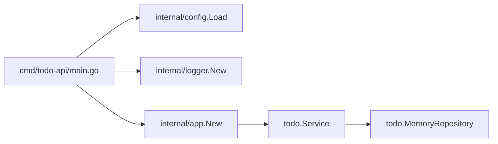
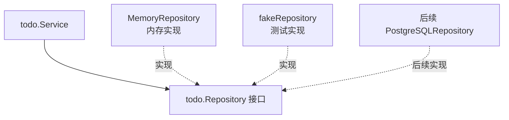

# 第 8 篇：Go 工程化与测试

第 7 篇已经完成了命令行版 `todo-cli`，你已经能用 Go 语言写出一个可运行的小程序。但真实团队里的后端项目不能只停留在“功能能跑”。代码需要有清晰的目录边界、稳定的配置入口、可检索的结构化日志、可追踪的错误上下文，以及能在本地和 CI 中重复执行的测试。

本篇对应新版课程计划中的第 8 篇，类型为 **C 类：实践/开发章**。本篇特色项目是：**搭建 Todo API 工程骨架，并编写首个单元测试**。它会成为后续 `net/http` 标准库 API、Gin 重构、数据库、Redis、Docker 和 Kubernetes 章节的共同地基。

## 1. 本章学习目标

### 1.1 知识目标

- 能解释 Go 后端项目中 `cmd/`、`internal/`、`test/` 等目录的职责边界。
- 能描述配置、日志、错误处理和测试在生产项目中的作用。
- 能对比单元测试、集成测试、覆盖率和 Benchmark 的适用场景。

### 1.2 技能目标

- 能独立搭建一个可运行的 Todo API 工程骨架，包含启动入口、配置包、日志包和领域服务包。
- 能编写表驱动单元测试，并用手写 fake 隔离外部依赖。
- 能执行 `go test ./...`、`go test ./... -cover` 和 Benchmark，判断工程健康状态。
- 能把本章产出的工程骨架作为第 9 篇 `net/http` 标准库 HTTP 服务的基础。

### 1.3 前置条件

开始本篇前，请确认你已经完成第 7 篇的 `todo-cli`，项目根目录中已有 `go.mod`，并且能在 `go.mod` 所在目录执行 `go run`、`go test`、`go list -m` 等 Go 命令。工具版本建议为 Go 1.21 或更高版本（课程统一使用 Go 1.26.x）和 Git 2.40 或更高版本。

## 2. 本章工作场景与真实案例

### 2.1 技术痛点

很多新手项目一开始只有一个 `main.go`，配置写死在代码里，日志只是 `fmt.Println`，错误只返回一句 `failed`，测试依赖真实文件或真实网络。这样的代码在个人练习中还能运行，一旦进入团队协作就会暴露问题：新人不知道业务代码放哪里，测试环境和生产环境配置混在一起，线上日志无法按字段检索，接口出错后没有上下文，CI 无法稳定判断本次提交是否破坏核心逻辑。

Go 工程化的目标不是把目录拆得很复杂，而是让“入口、配置、业务、依赖、测试”各自有清晰边界。边界清楚以后，后续接入 HTTP、数据库、缓存、容器镜像和 Kubernetes 部署时，改动才不会互相牵连。

### 2.2 团队协作场景

后端开发负责维护 `internal/todo` 里的业务规则和测试，测试工程师关注 `go test ./...`、覆盖率和集成测试结果，运维或平台工程师关注启动参数、日志格式和健康检查。代码评审时，Reviewer 不只看功能是否能跑，还会看配置是否可覆盖、日志是否有上下文、错误是否能定位、测试是否能在无外部依赖的环境中稳定通过。

如果线上出现 Todo 创建失败，开发会先根据结构化日志里的 `component`、`operation`、`error` 字段定位代码路径；测试会补充失败用例；平台工程师会确认配置和启动命令是否正确。工程化让这些角色能围绕同一套项目结构协作，而不是靠口头约定猜测。

### 2.3 Todo 平台模拟案例

> Todo 平台的命令行练习需要演进为后端服务工程骨架。你需要建立 `cmd/todo-api` 启动入口、`internal/config` 配置包、`internal/logger` 日志包、`internal/todo` 领域服务和对应测试。

这个案例关注工程组织能力：目录结构要服务于依赖边界、可测试性和后续维护，而不是为了复杂而复杂。
## 3. 核心概念

### 3.1 Go 项目目录结构

**是什么**：Go 项目目录结构是代码职责的组织方式。它决定入口程序、业务包、内部实现和测试文件分别放在哪里。

**为什么需要它**：没有目录边界时，入口代码会混进业务逻辑，测试很难隔离依赖，后续接入 HTTP、数据库、Redis 时会不断改同一个文件。目录结构不是形式主义，它是在提前给项目留出可演进空间。

**在项目中怎么用**：本课程采用下面的最小工程骨架：

```text linenums="0"
cloud-native-todo-platform/
├── go.mod
├── go.sum
├── cmd/
│   └── todo-api/
│       └── main.go
├── internal/
│   ├── app/
│   │   └── app.go
│   ├── config/
│   │   └── config.go
│   ├── logger/
│   │   └── logger.go
│   └── todo/
│       ├── model.go
│       ├── repository.go
│       ├── service.go
│       └── service_test.go
└── test/
    └── integration/
        └── app_test.go
```

`cmd/todo-api` 只负责进程启动；`internal/config` 负责读取配置；`internal/logger` 负责创建日志实例；`internal/todo` 负责 Todo 领域逻辑；`test/integration` 放跨包协作测试。`internal/` 是 Go 的特殊目录，外部 module 不能直接 import 它，适合放不希望暴露给外部项目的业务实现。

`go.mod` 是 module 定义文件，记录 module path 和 Go 版本；`go.sum` 会在引入第三方依赖后出现，用来记录依赖校验信息。本章只使用标准库，`go.sum` 可能暂时不存在，这是正常现象。

### 3.2 配置管理

**是什么**：配置管理是把端口、运行环境、日志级别等运行参数从代码中分离出来。

**为什么需要它**：开发、测试、生产环境往往使用不同端口、不同日志级别和不同外部依赖。把这些值写死在代码里，会导致每次切环境都要改代码，CI 也无法用环境变量覆盖配置。

**在项目中怎么用**：本章先使用环境变量实现最小配置加载。

```go linenums="0"
cfg := config.Load()
fmt.Println(cfg.Port)
```

配置包会提供默认值，例如 `TODO_API_PORT` 未设置时默认使用 `8080`。本章先只管理服务启动所需的最小配置，数据存储仍使用内存仓储；后续数据库和 Kubernetes 章节会继续把配置来源扩展为配置文件、Kubernetes `ConfigMap`、`Secret` 或 Helm values。

### 3.3 结构化日志

**是什么**：结构化日志是用键值对输出日志，而不是只输出一整段人类可读文本。

**为什么需要它**：生产环境中的日志通常会进入 Loki、ELK 或云厂商日志平台。键值对日志可以按 `level`、`component`、`operation`、`todo_id` 等字段检索，比单纯字符串更容易排障。

**在项目中怎么用**：

```go linenums="0"
log.Info("todo created", "component", "todo", "todo_id", item.ID)
```

本章使用 Go 标准库 `log/slog`。它不引入第三方依赖，适合教学阶段建立结构化日志意识。后续如果替换为 `zap`、`zerolog` 或公司内部日志库，只要封装边界清晰，业务代码不需要大面积重写。

### 3.4 错误处理规范

**是什么**：Go 推荐显式返回 `error`，并用 `%w` 包装底层错误，让调用方既能看到上下文，也能用 `errors.Is` 或 `errors.As` 判断错误类型。

**为什么需要它**：如果只返回 `failed`，排障时不知道是参数错误、文件错误还是数据库错误。如果每一层都丢失上下文，日志中只会剩下模糊的失败信息。

**在项目中怎么用**：

```go linenums="0"
if err != nil {
	return Todo{}, fmt.Errorf("save todo: %w", err)
}
```

这条错误信息既说明当前操作是 `save todo`，又保留了底层仓储错误。后续 HTTP Handler 可以根据错误类型返回不同状态码。

### 3.5 测试、覆盖率与 Benchmark

**是什么**：测试是用代码验证代码行为。单元测试关注一个函数或一个服务的边界，集成测试关注多个包协作，覆盖率显示哪些代码路径被测试执行过，Benchmark 用于测量某段代码的性能。

**为什么需要它**：没有测试，重构项目结构时只能靠人工点击验证。没有覆盖率，团队不知道核心逻辑是否缺测。没有 Benchmark，就很难在优化前后判断性能变化。

**在项目中怎么用**：

```bash linenums="0"
go test ./...
go test ./... -cover
go test ./internal/todo -bench BenchmarkServiceStats -benchmem
```

这三条命令分别验证正确性、观察测试覆盖范围和测量统计逻辑性能。本章会把它们作为工程质量闭环的一部分。

## 4. 原理深入

### 4.1 从启动入口到业务服务的数据流

本章的程序暂时不启动 HTTP Server，但已经具备真实服务的启动链路。



启动入口先读取配置，再创建日志，然后组装应用依赖。业务逻辑不会直接读取环境变量，也不会自己创建全局日志实例。这样做的好处是：测试可以绕过真实环境变量，直接构造配置和 fake 仓储；后续 HTTP Handler 也可以复用同一个 `todo.Service`。

### 4.2 依赖倒置让测试更稳定

Todo 服务不直接依赖某个具体数据库，而是依赖一个仓储（`Repository`）接口。内存仓储、fake 仓储、PostgreSQL 仓储都可以实现这个接口。



这种设计让单元测试不需要启动数据库，也不需要写临时文件。测试只需要提供一个 fake 仓储，就能验证标题校验、默认状态、错误包装和统计逻辑。

### 4.3 表驱动测试为什么适合 Go

表驱动测试把输入、预期输出和预期错误组织成一组测试用例。它适合验证同一个函数在多种边界条件下的行为，例如标题为空、标题过长、标题合法。

执行流程是：准备测试表，循环每个 case，用 `t.Run` 创建子测试，调用目标函数，比较结果。这样新增边界条件只需要加一行 case，不需要复制整段测试逻辑。

### 4.4 集成测试的边界

本章的集成测试不会连接真实 HTTP、数据库或 Redis，而是验证配置、应用组装、内存仓储和 Todo 服务能否协同工作。它比单元测试覆盖范围更大，但仍然保持轻量。后续数据库章节会引入真正依赖 PostgreSQL 的集成测试，那时需要 Docker Compose 或测试容器来提供外部依赖。

### 4.5 覆盖率和 Benchmark 不能替代业务判断

覆盖率高不代表测试质量一定高。如果测试只执行代码却不校验结果，覆盖率数字也会很好看。Benchmark 也不是越快越好，它必须和真实业务路径匹配。本章要求你把覆盖率和 Benchmark 当作辅助信号：覆盖率帮助发现缺测区域，Benchmark 帮助发现性能变化，但最终仍要看测试是否覆盖关键业务规则。

## 5. 手把手实验

预计耗时：90-120 分钟（动手操作约 60 分钟）。

### 5.1 实验目标

在课程项目中搭建 Todo API 工程骨架，完成配置、日志、应用组装、Todo 服务、单元测试、集成测试、覆盖率和 Benchmark，并确保 `go test ./...` 通过。

本章不涉及 YAML。配置先通过 Go 代码和环境变量表达；Kubernetes `ConfigMap`、`Secret`、Deployment YAML 会在后续 Kubernetes 阶段完整展开。

### 5.2 实验环境

| 工具 | 建议版本 | 用途 |
|---|---|---|
| Go | 1.26.x | 编译、测试和运行 Todo API 骨架 |
| Git | 2.40+ | 管理课程项目代码 |
| 终端 | Bash / Zsh / PowerShell | 执行实验命令 |

检查 Go 版本：

```bash linenums="0"
go version
```

预期输出类似。最后的 `linux/amd64`、`darwin/arm64` 或 `windows/amd64` 会随你的操作系统和 CPU 架构变化：

```text linenums="0"
go version go1.26.0 linux/amd64
```

如果你使用的是 Go 1.21 到 1.25，本章代码也可以运行，因为 `log/slog` 从 Go 1.21 开始提供。课程统一版本以 Go 1.26.x 为准。

### 5.3 从第 7 篇迁移到工程骨架

本章沿用第 7 篇创建的 Go module。先确认当前 module path：

```bash linenums="0"
go list -m
```

如果你完全按第 7 篇执行，预期输出是：

```text linenums="0"
cloud-native-todo-platform
```

本章代码统一使用这个 module path，例如：

```go linenums="0"
import "cloud-native-todo-platform/internal/todo"
```

如果你的 `go list -m` 输出不是 `cloud-native-todo-platform`，不要直接复制 import path。你需要把本章所有 `cloud-native-todo-platform/...` 替换为你的实际 module path。

从第 7 篇迁移时，按下面步骤处理已有代码：

1. 保留 `cmd/todo-cli`，它仍然是 Todo 项目的命令行入口。
2. 如果第 7 篇已经有 `internal/todo`，先提交或备份当前代码，再按本章代码替换 `internal/todo` 中的模型、仓储接口和服务层。
3. 如果第 7 篇的 `todo-cli` 依赖旧的 `internal/todo` API，先让 `todo-cli` 保持原状；本章重点验证新工程骨架，不要求同步重构 CLI。
4. 完成本章后运行 `go test ./...`。如果 `todo-cli` 因旧 API 变化编译失败，可以临时把 CLI 迁移到新的 `todo.Service`，也可以在后续章节统一重构。

本章暂时不会改造 `todo-cli` 调用新的 `todo.Service`。这样做是为了让新手先把后端工程骨架搭起来，避免在同一章同时处理 CLI 重构、服务层抽象和测试迁移。后续章节会继续收敛代码复用边界。

### 5.4 文件目录结构

在项目根目录创建目录：

=== "Linux / macOS / WSL2"

    ```bash linenums="0"
    mkdir -p cmd/todo-api internal/app internal/config internal/logger internal/todo test/integration
    ```

=== "Windows PowerShell"

    ```powershell linenums="0"
    New-Item -ItemType Directory -Force cmd\todo-api, internal\app, internal\config, internal\logger, internal\todo, test\integration
    ```

如果目录已经存在，上面的命令不会破坏已有目录。若你从第 7 篇继续且 `go.mod` 已存在，请跳过 `go mod init`；如果你是单独练习本篇，才需要初始化 module。课程推荐沿用第 7 篇的 module path：

```bash linenums="0"
go mod init cloud-native-todo-platform
```

最终结构如下：

```text linenums="0"
cloud-native-todo-platform/
├── go.mod
├── go.sum
├── cmd/
│   └── todo-api/
│       └── main.go
├── internal/
│   ├── app/
│   │   └── app.go
│   ├── config/
│   │   └── config.go
│   ├── logger/
│   │   └── logger.go
│   └── todo/
│       ├── model.go
│       ├── repository.go
│       ├── service.go
│       └── service_test.go
└── test/
    └── integration/
        └── app_test.go
```

`go.sum` 只有在引入第三方依赖后才会出现。本章代码全部来自标准库，因此没有 `go.sum` 也不影响实验。下面代码中的 import path 使用 `cloud-native-todo-platform`。如果你的 `go.mod` module 名称不同，请用 `go list -m` 查看当前 module，并把代码中的 import path 替换为你的实际 module 名。

### 5.5 执行命令

先按下面内容创建或更新实验文件；保存完成后，再继续执行后续命令。

创建 `internal/config/config.go`：

```go title="internal/config/config.go"
package config

import (
	"os"
	"strconv"
)

// Config contains runtime settings for the Todo API process.
type Config struct {
	Env      string
	Port     int
	LogLevel string
}

// Load reads configuration from environment variables and applies defaults.
func Load() Config {
	return Config{
		Env:      getString("TODO_API_ENV", "dev"),
		Port:     getInt("TODO_API_PORT", 8080),
		LogLevel: getString("TODO_API_LOG_LEVEL", "info"),
	}
}

func getString(key string, fallback string) string {
	value := os.Getenv(key)
	if value == "" {
		return fallback
	}
	return value
}

func getInt(key string, fallback int) int {
	value := os.Getenv(key)
	if value == "" {
		return fallback
	}
	parsed, err := strconv.Atoi(value)
	if err != nil {
		return fallback
	}
	return parsed
}
```

这里为了让实验流程保持简单，非法整数会回退到默认值。生产项目通常应该记录配置解析警告，或者对关键配置直接启动失败，避免拼写错误被静默吞掉。

创建 `internal/logger/logger.go`：

```go title="internal/logger/logger.go"
package logger

import (
	"log/slog"
	"os"
)

// New creates a JSON structured logger.
func New(level string) *slog.Logger {
	handlerOptions := &slog.HandlerOptions{
		Level: parseLevel(level),
	}
	return slog.New(slog.NewJSONHandler(os.Stdout, handlerOptions))
}

func parseLevel(level string) slog.Level {
	switch level {
	case "debug":
		return slog.LevelDebug
	case "warn":
		return slog.LevelWarn
	case "error":
		return slog.LevelError
	default:
		return slog.LevelInfo
	}
}
```

日志级别同样采用教学阶段的宽松策略：未知值回退到 `info`。真实生产服务更适合在启动阶段显式提示非法配置。

创建 `internal/todo/model.go`：

```go title="internal/todo/model.go"
package todo

import "time"

// Status describes the lifecycle state of a Todo item.
type Status string

const (
	// StatusPending means the Todo item has not been completed.
	StatusPending Status = "pending"
	// StatusDone means the Todo item has been completed.
	StatusDone Status = "done"
)

// Todo is the core domain model used by the Todo platform.
type Todo struct {
	ID        int64
	Title     string
	Status    Status
	CreatedAt time.Time
	UpdatedAt time.Time
}

// Stats summarizes Todo items by status.
type Stats struct {
	Total   int
	Pending int
	Done    int
}
```

创建 `internal/todo/repository.go`：

```go title="internal/todo/repository.go"
package todo

import (
	"context"
	"sync"
)

// Repository defines persistence behavior required by Service.
type Repository interface {
	Save(context.Context, Todo) (Todo, error)
	List(context.Context) ([]Todo, error)
}

// MemoryRepository stores Todo items in memory for early course chapters.
type MemoryRepository struct {
	mu     sync.Mutex
	nextID int64
	items  []Todo
}

// NewMemoryRepository creates an empty in-memory Todo repository.
func NewMemoryRepository() *MemoryRepository {
	return &MemoryRepository{nextID: 1}
}

// Save stores a Todo item and assigns an ID when needed.
func (r *MemoryRepository) Save(ctx context.Context, item Todo) (Todo, error) {
	select {
	case <-ctx.Done():
		return Todo{}, ctx.Err()
	default:
	}

	r.mu.Lock()
	defer r.mu.Unlock()

	if item.ID == 0 {
		item.ID = r.nextID
		r.nextID++
	}
	r.items = append(r.items, item)
	return item, nil
}

// List returns a copy of all Todo items.
func (r *MemoryRepository) List(ctx context.Context) ([]Todo, error) {
	select {
	case <-ctx.Done():
		return nil, ctx.Err()
	default:
	}

	r.mu.Lock()
	defer r.mu.Unlock()

	copied := make([]Todo, len(r.items))
	copy(copied, r.items)
	return copied, nil
}
```

创建 `internal/todo/service.go`：

```go title="internal/todo/service.go"
package todo

import (
	"context"
	"errors"
	"fmt"
	"strings"
	"time"
)

var (
	// ErrEmptyTitle indicates that a Todo title is blank.
	ErrEmptyTitle = errors.New("todo title is empty")
	// ErrTitleTooLong indicates that a Todo title exceeds the allowed length.
	ErrTitleTooLong = errors.New("todo title is too long")
)

const maxTitleLength = 120

// Service implements Todo business rules.
type Service struct {
	repo Repository
	now  func() time.Time
}

// NewService creates a Todo service with production defaults.
func NewService(repo Repository) *Service {
	return &Service{
		repo: repo,
		now:  time.Now,
	}
}

// WithClock replaces the clock function, which is useful in tests.
func (s *Service) WithClock(now func() time.Time) {
	s.now = now
}

// Create validates input and stores a new Todo item.
func (s *Service) Create(ctx context.Context, title string) (Todo, error) {
	trimmed := strings.TrimSpace(title)
	if trimmed == "" {
		return Todo{}, ErrEmptyTitle
	}
	if len([]rune(trimmed)) > maxTitleLength {
		return Todo{}, ErrTitleTooLong
	}

	timestamp := s.now().UTC()
	item := Todo{
		Title:     trimmed,
		Status:    StatusPending,
		CreatedAt: timestamp,
		UpdatedAt: timestamp,
	}

	saved, err := s.repo.Save(ctx, item)
	if err != nil {
		return Todo{}, fmt.Errorf("save todo: %w", err)
	}
	return saved, nil
}

// List returns all Todo items.
func (s *Service) List(ctx context.Context) ([]Todo, error) {
	items, err := s.repo.List(ctx)
	if err != nil {
		return nil, fmt.Errorf("list todos: %w", err)
	}
	return items, nil
}

// Stats returns aggregate counters for Todo items.
func (s *Service) Stats(ctx context.Context) (Stats, error) {
	items, err := s.List(ctx)
	if err != nil {
		return Stats{}, err
	}

	stats := Stats{Total: len(items)}
	for _, item := range items {
		switch item.Status {
		case StatusDone:
			stats.Done++
		default:
			// Treat every non-done status as pending until new statuses are introduced.
			stats.Pending++
		}
	}
	return stats, nil
}
```

创建 `internal/app/app.go`：

```go title="internal/app/app.go"
package app

import (
	"context"
	"log/slog"

	"cloud-native-todo-platform/internal/config"
	"cloud-native-todo-platform/internal/todo"
)

// App holds application dependencies assembled at process startup.
type App struct {
	Config config.Config
	Logger *slog.Logger
	Todos  *todo.Service
}

// New assembles the Todo API application.
func New(cfg config.Config, logger *slog.Logger) *App {
	repo := todo.NewMemoryRepository()
	service := todo.NewService(repo)
	return &App{
		Config: cfg,
		Logger: logger,
		Todos:  service,
	}
}

// Health verifies that the application dependencies are ready.
func (a *App) Health(ctx context.Context) error {
	_, err := a.Todos.List(ctx)
	return err
}
```

创建 `cmd/todo-api/main.go`：

```go title="cmd/todo-api/main.go"
package main

import (
	"context"
	"fmt"
	"os"

	"cloud-native-todo-platform/internal/app"
	"cloud-native-todo-platform/internal/config"
	"cloud-native-todo-platform/internal/logger"
)

func main() {
	ctx := context.Background()
	cfg := config.Load()
	log := logger.New(cfg.LogLevel)
	application := app.New(cfg, log)

	if err := application.Health(ctx); err != nil {
		log.Error("application health check failed", "error", err)
		os.Exit(1)
	}

	log.Info(
		"todo api skeleton started",
		"env", cfg.Env,
		"port", cfg.Port,
	)
	fmt.Printf("todo api skeleton checked; future listener addr :%d\n", cfg.Port)
}
```

创建 `internal/todo/service_test.go`：

```go title="internal/todo/service_test.go"
package todo

import (
	"context"
	"errors"
	"strings"
	"testing"
	"time"
)

type fakeRepository struct {
	items   []Todo
	saveErr error
	listErr error
}

func (r *fakeRepository) Save(ctx context.Context, item Todo) (Todo, error) {
	if r.saveErr != nil {
		return Todo{}, r.saveErr
	}
	item.ID = int64(len(r.items) + 1)
	r.items = append(r.items, item)
	return item, nil
}

func (r *fakeRepository) List(ctx context.Context) ([]Todo, error) {
	if r.listErr != nil {
		return nil, r.listErr
	}
	copied := make([]Todo, len(r.items))
	copy(copied, r.items)
	return copied, nil
}

func TestServiceCreate(t *testing.T) {
	fixedTime := time.Date(2026, 5, 27, 10, 0, 0, 0, time.UTC)

	tests := []struct {
		name    string
		title   string
		wantErr error
	}{
		{name: "valid title", title: "write first unit test"},
		{name: "trim title", title: "  ship todo api  "},
		{name: "empty title", title: "   ", wantErr: ErrEmptyTitle},
		{name: "too long title", title: strings.Repeat("长", 121), wantErr: ErrTitleTooLong},
	}

	for _, tt := range tests {
		t.Run(tt.name, func(t *testing.T) {
			repo := &fakeRepository{}
			service := NewService(repo)
			service.WithClock(func() time.Time { return fixedTime })

			got, err := service.Create(context.Background(), tt.title)
			if tt.wantErr != nil {
				if !errors.Is(err, tt.wantErr) {
					t.Fatalf("Create() error = %v, want %v", err, tt.wantErr)
				}
				return
			}
			if err != nil {
				t.Fatalf("Create() unexpected error = %v", err)
			}
			if got.ID == 0 {
				t.Fatal("Create() did not assign ID")
			}
			if got.Status != StatusPending {
				t.Fatalf("Create() status = %s, want %s", got.Status, StatusPending)
			}
			if got.CreatedAt != fixedTime {
				t.Fatalf("Create() CreatedAt = %v, want %v", got.CreatedAt, fixedTime)
			}
		})
	}
}

func TestServiceStats(t *testing.T) {
	repo := &fakeRepository{
		items: []Todo{
			{ID: 1, Title: "a", Status: StatusPending},
			{ID: 2, Title: "b", Status: StatusDone},
			{ID: 3, Title: "c", Status: StatusPending},
		},
	}
	service := NewService(repo)

	got, err := service.Stats(context.Background())
	if err != nil {
		t.Fatalf("Stats() unexpected error = %v", err)
	}
	if got.Total != 3 || got.Pending != 2 || got.Done != 1 {
		t.Fatalf("Stats() = %+v, want total=3 pending=2 done=1", got)
	}
}

func TestServiceCreateWrapsRepositoryError(t *testing.T) {
	repoErr := errors.New("disk is full")
	service := NewService(&fakeRepository{saveErr: repoErr})

	_, err := service.Create(context.Background(), "write error test")
	if !errors.Is(err, repoErr) {
		t.Fatalf("Create() error = %v, want wrapped %v", err, repoErr)
	}
}

func BenchmarkServiceStats(b *testing.B) {
	repo := &fakeRepository{}
	for i := 0; i < 1000; i++ {
		status := StatusPending
		if i%3 == 0 {
			status = StatusDone
		}
		repo.items = append(repo.items, Todo{ID: int64(i + 1), Title: "benchmark", Status: status})
	}
	service := NewService(repo)

	b.ReportAllocs()
	for i := 0; i < b.N; i++ {
		if _, err := service.Stats(context.Background()); err != nil {
			b.Fatal(err)
		}
	}
}
```

创建 `test/integration/app_test.go`：

```go title="test/integration/app_test.go"
package integration

import (
	"context"
	"io"
	"log/slog"
	"testing"

	"cloud-native-todo-platform/internal/app"
	"cloud-native-todo-platform/internal/config"
)

func TestAppCreatesTodo(t *testing.T) {
	cfg := config.Config{
		Env:      "test",
		Port:     18080,
		LogLevel: "error",
	}
	logger := slog.New(slog.NewTextHandler(io.Discard, nil))
	application := app.New(cfg, logger)

	if err := application.Health(context.Background()); err != nil {
		t.Fatalf("Health() unexpected error = %v", err)
	}

	created, err := application.Todos.Create(context.Background(), "integration test todo")
	if err != nil {
		t.Fatalf("Create() unexpected error = %v", err)
	}
	if created.ID == 0 {
		t.Fatal("Create() did not assign ID")
	}

	items, err := application.Todos.List(context.Background())
	if err != nil {
		t.Fatalf("List() unexpected error = %v", err)
	}
	if len(items) != 1 {
		t.Fatalf("List() length = %d, want 1", len(items))
	}
}
```


以下命令均在项目根目录执行，也就是 `go.mod` 所在目录。

先格式化全部 Go 代码，避免格式问题进入提交：

```bash linenums="0"
go fmt ./...
```

预期输出通常为空，表示格式化成功。

执行静态检查，提前发现不可达代码、格式化字符串错误等问题：

```bash linenums="0"
go vet ./...
```

预期输出通常为空。如果 `go vet` 输出问题，先按提示修正，再继续执行测试。

执行所有测试：

```bash linenums="0"
go test ./...
```

预期输出类似：

```text linenums="0"
?   	cloud-native-todo-platform/cmd/todo-api	[no test files]
?   	cloud-native-todo-platform/internal/app	[no test files]
?   	cloud-native-todo-platform/internal/config	[no test files]
?   	cloud-native-todo-platform/internal/logger	[no test files]
ok  	cloud-native-todo-platform/internal/todo	0.003s
ok  	cloud-native-todo-platform/test/integration	0.004s
```

查看覆盖率：

```bash linenums="0"
go test ./... -cover
```

预期输出类似：

```text linenums="0"
ok  	cloud-native-todo-platform/internal/todo	0.003s	coverage: 55.8% of statements
ok  	cloud-native-todo-platform/test/integration	0.004s	coverage: 29.4% of statements
```

覆盖率数字会随着 Go 版本、代码细节和测试范围变化，不要求和示例完全一致。学习阶段更重要的是确认核心业务规则被测试覆盖，而不是追求某个固定百分比。

生成覆盖率文件并查看函数级覆盖率：

```bash linenums="0"
go test ./... -coverprofile coverage.out
go tool cover -func coverage.out
```

预期输出会列出每个函数的覆盖率，最后一行是 `total:`。如果某个核心函数覆盖率为 `0.0%`，说明测试没有执行到该路径。本书统一使用空格分隔参数，便于保持命令风格一致。

运行 Benchmark：

```bash linenums="0"
go test ./internal/todo -bench BenchmarkServiceStats -benchmem
```

预期输出类似：

```text linenums="0"
BenchmarkServiceStats-8   	  100000	     12345 ns/op	   24576 B/op	       1 allocs/op
PASS
ok  	cloud-native-todo-platform/internal/todo	1.456s
```

启动 Todo API 工程骨架：

```bash linenums="0"
go run ./cmd/todo-api
```

预期输出类似：

```text linenums="0"
{"time":"2026-05-27T10:00:00.000000000Z","level":"INFO","msg":"todo api skeleton started","env":"dev","port":8080}
todo api skeleton checked; future listener addr :8080
```

当前阶段还没有启动 HTTP Server，所以程序完成健康检查和日志输出后会立即退出。第 9 篇加入 `net/http` 后，进程才会持续监听端口。

### 5.6 验证方法

当你看到以下结果时，说明本章实验成功：

- `go fmt ./...` 执行完成，没有格式错误。
- `go vet ./...` 执行完成，没有静态检查报错。
- `go list -m` 输出和代码中的 import path 前缀一致。
- `go test ./...` 中 `internal/todo` 和 `test/integration` 都显示 `ok`。
- `go test ./... -cover` 能看到 `internal/todo` 的覆盖率，且核心业务函数不是 `0.0%`。
- `go tool cover -func coverage.out` 能输出函数级覆盖率。
- Benchmark 输出包含 `ns/op`、`B/op` 和 `allocs/op`。
- `go run ./cmd/todo-api` 输出 JSON 格式结构化日志和 `todo api skeleton checked`。

### 5.7 清理步骤

本章没有启动后台服务，也没有创建外部资源。若你设置了环境变量，可以按需清理。

=== "Linux / macOS / WSL2"

    ```bash linenums="0"
    unset TODO_API_ENV
    unset TODO_API_PORT
    unset TODO_API_LOG_LEVEL
    rm -f coverage.out
    ```

=== "Windows PowerShell"

    ```powershell linenums="0"
    Remove-Item Env:TODO_API_ENV -ErrorAction SilentlyContinue
    Remove-Item Env:TODO_API_PORT -ErrorAction SilentlyContinue
    Remove-Item Env:TODO_API_LOG_LEVEL -ErrorAction SilentlyContinue
    Remove-Item coverage.out -ErrorAction SilentlyContinue
    ```

这些命令只清理当前终端会话中的环境变量；关闭终端后，本来在当前会话里设置的环境变量也会失效。

不要删除本章新增的 `cmd/todo-api`、`internal/config`、`internal/logger` 和 `internal/app`。`internal/todo` 如果来自第 7 篇，请保留并按本章内容更新，它会被后续章节继续使用。

## 6. 常见错误与排障

### 错误 1：import path 和 go.mod 不一致

- **现象**：

  ```text linenums="0"
  package cloud-native-todo-platform/internal/config is not in std
  ```

- **原因**：代码里的 import path 和 `go.mod` 中的 module 名称不一致，Go 无法把它识别为当前项目内部包。
- **排查**：查看当前 module 名称。

  ```bash linenums="0"
  go list -m
  ```

  输出如果不是 `cloud-native-todo-platform`，就需要同步替换代码里的 import path。

- **修复**：把 `cmd/todo-api/main.go`、`internal/app/app.go`、`test/integration/app_test.go` 中的 module 前缀替换为 `go list -m` 输出的值。
- **预防**：初始化项目后先确认 `go.mod`，再复制跨包 import 代码。

### 错误 2：测试文件 package 名称写错

- **现象**：

  ```text linenums="0"
  found packages todo (model.go) and todos (service_test.go) in internal/todo
  ```

- **原因**：同一个目录下的 Go 文件必须属于同一个 package，除非测试文件使用 `todo_test` 这种外部测试包命名。这里把 `service_test.go` 误写成了 `package todos`。
- **排查**：检查当前目录的 package 声明。

  ```bash linenums="0"
  rg "^package " internal/todo
  ```

  如果输出中同时出现 `package todo` 和 `package todos`，说明包名不一致。

- **修复**：把 `service_test.go` 的第一行改为 `package todo`。
- **预防**：新建测试文件时优先复制同目录已有文件的 package 声明。

### 错误 3：表驱动测试没有 return，导致继续检查空结果

- **现象**：

  ```text linenums="0"
  --- FAIL: TestServiceCreate/empty_title
      service_test.go:50: Create() did not assign ID
  ```

- **原因**：测试已经匹配到预期错误，但没有 `return`，继续执行成功分支的断言，导致误判。
- **排查**：查看测试中处理 `wantErr` 的分支。

  ```bash linenums="0"
  go test ./internal/todo -run TestServiceCreate -v
  ```

  子测试名会显示是哪一个 case 失败。

- **修复**：在确认预期错误后立即 `return`，避免继续执行成功路径断言。
- **预防**：表驱动测试中把错误分支和成功分支写清楚，不要让两条路径混在一起。

### 错误 4：结构化日志没有输出字段

- **现象**：

  ```text linenums="0"
  {"time":"...","level":"INFO","msg":"todo api skeleton started"}
  ```

- **原因**：调用 `log.Info` 时只传了消息，没有追加键值对，日志平台无法按字段检索。
- **排查**：检查日志调用是否是成对的 key/value。

  ```bash linenums="0"
  rg "log\\.Info|log\\.Error" cmd internal
  ```

- **修复**：把关键上下文字段加到日志调用中，例如 `"env", cfg.Env, "port", cfg.Port`。
- **预防**：评审日志时关注是否包含 `component`、`operation`、业务 ID 和错误上下文。

### 错误 5：覆盖率文件不存在

- **现象**：

  ```text linenums="0"
  cover: open coverage.out: The system cannot find the file specified.
  ```

- **原因**：直接执行了 `go tool cover -func coverage.out`，但之前没有先执行 `go test ./... -coverprofile coverage.out` 生成覆盖率文件。
- **排查**：确认当前目录是否存在覆盖率文件。

  ```bash linenums="0"
  ls coverage.out
  ```

  Windows PowerShell 使用：

  ```powershell linenums="0"
  Get-ChildItem coverage.out
  ```

- **修复**：先生成覆盖率文件，再查看函数级覆盖率。

  ```bash linenums="0"
  go test ./... -coverprofile coverage.out
  go tool cover -func coverage.out
  ```

- **预防**：把覆盖率命令写进统一验证脚本或 CI workflow，避免手工漏步骤。

## 7. 生产环境注意事项

1. **配置必须可覆盖且默认值明确**：生产环境不能依赖开发机上的隐式配置。端口、日志级别、数据库地址、缓存地址等参数都应该有清晰来源，并能通过环境变量、配置文件或 Kubernetes `ConfigMap` 覆盖。默认值适合本地开发，但生产部署必须显式声明关键配置，避免因为环境差异导致服务启动在错误端口或连接错误依赖。

2. **日志要服务于检索和告警**：生产日志不是写给本地终端看的，而是写给日志平台、告警规则和排障流程看的。日志字段要稳定，错误日志要包含操作名和错误对象，避免只输出自然语言。不要在日志中打印密码、token、身份证号等敏感信息，后续接入 Loki 和 OpenTelemetry 时也会继续复用这个原则。

3. **测试要隔离外部依赖**：单元测试应该尽量不依赖真实数据库、真实网络和真实文件路径。外部依赖越多，测试越慢、越脆弱，也越难在 CI 中稳定运行。本章先使用 fake 仓储验证业务规则，后续数据库章节再用专门的集成测试验证 PostgreSQL 行为。

4. **覆盖率不能替代关键路径审查**：覆盖率数字能发现明显缺测，但不能证明业务逻辑正确。生产项目更应该关注核心规则是否有测试，例如参数校验、错误包装、状态转换、权限判断和回滚逻辑。不要为了追求覆盖率而写没有断言的测试。

5. **Benchmark 要和真实瓶颈关联**：Benchmark 适合比较同一段逻辑在不同实现下的性能变化，但不能凭一个微基准就决定整体架构。后续接入数据库和 Redis 后，真正的瓶颈可能来自 I/O、连接池、锁竞争或网络延迟。本章 Benchmark 的价值是建立测量习惯，而不是提前做复杂优化。

## 8. 练习题与面试题

本章练习题和面试题已拆分到独立页面，完成正文学习后再进入题库练习与复盘。

[查看本章练习题与面试题](../../questions/stage-02-go-backend/08-go-engineering-testing.md)

## 9. 本章总结

本章把 Todo 项目从“能运行的小程序”推进到“可持续演进的后端工程骨架”。你学习了 Go 项目目录边界、配置加载、结构化日志、错误包装、仓储接口、服务层、表驱动测试、集成测试、覆盖率和 Benchmark。本章产出了 `cmd/todo-api`、`internal/config`、`internal/logger`、`internal/app` 和 `internal/todo`，并通过 `go test ./...` 验证。学完本章后，你已经能承担真实团队中“搭建 Go 服务骨架、拆分业务包、补齐基础测试、建立本地验证命令”的工作任务。

## 10. 下一章衔接

下一章会在本章的工程骨架上加入 `net/http` 标准库 HTTP 服务。`cmd/todo-api` 会从“启动后打印日志”演进为真正监听端口的 API 进程，`internal/todo.Service` 会被 Handler 调用，配置、日志和测试命令也会继续复用。如果跳过本章直接写 HTTP，很容易把路由、业务规则、配置和日志全部塞进 `main.go`，后续接入 Gin、数据库和容器化时会很难维护。
