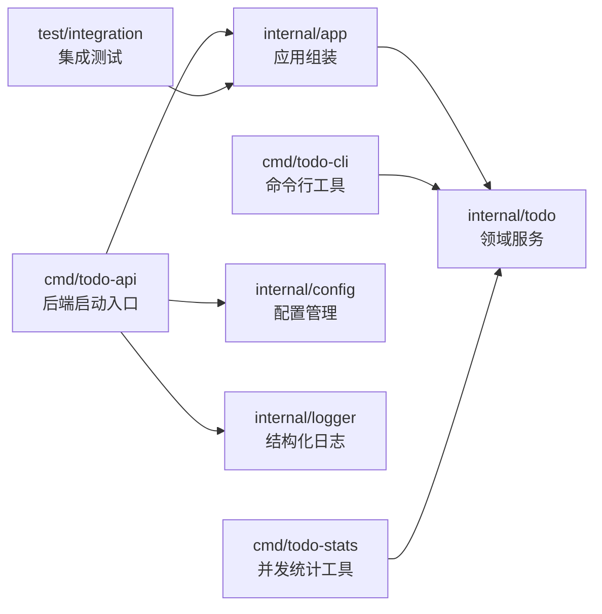
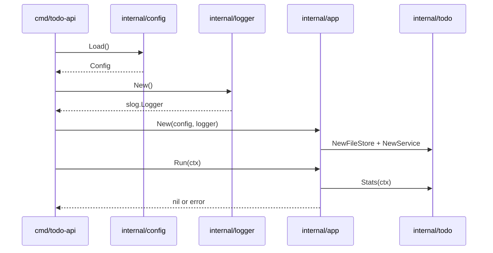
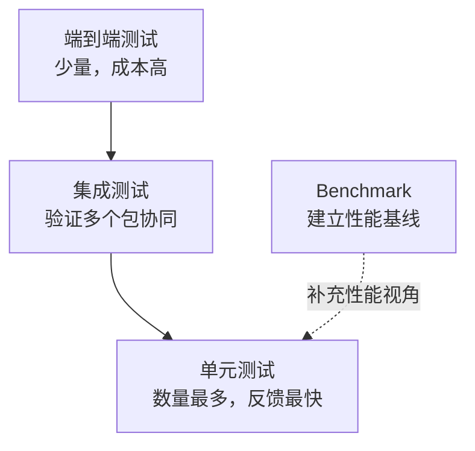

# 第 9 篇：Go net/http 标准库与 HTTP 服务

> 本篇正在按新版课程计划从旧稿迁移为 `net/http` 标准库 HTTP 服务章节。第 8 篇已经完成 Go 工程化与测试，提供了 `cmd/todo-api`、配置、日志、应用组装和 `internal/todo.Service`，本篇将以这些产物为基础，把 Todo 能力暴露为 HTTP API。

第 8 篇已经把 Todo 平台整理成了可测试的 Go 后端工程骨架。到这里，项目已经有了启动入口、配置加载、结构化日志、服务层和基础测试，但还没有通过 HTTP 对外提供能力。

真实公司里的 Go 项目不会只有几个 `.go` 文件。它通常需要清晰的目录边界、配置加载、结构化日志、错误处理规范、单元测试、集成测试、覆盖率、Benchmark 和统一验证命令。本篇要做的事情，就是把前两篇的代码组织成更接近企业项目的样子，为第 10 篇 Web API 开发打地基。

本篇特色项目是：**搭建 Todo 平台后端工程骨架**。

你会在 `cloud-native-todo-platform` module 中新增 `todo-api` 启动入口、配置包、日志包、应用组装层、Todo 服务层、mock 单元测试、集成测试和 Benchmark。它暂时还不会启动 HTTP 服务；第 10 篇会在这个骨架上继续增加 Web API。

## 1. 本章学习目标

学完本篇后，你应该能把一个 Go 小程序整理成可持续演进的后端项目。

具体目标如下：

- 能设计常见 Go 后端项目目录结构，理解 `cmd/`、`internal/`、`test/` 的边界。
- 能用环境变量和配置对象管理运行参数。
- 能使用 `log/slog` 输出结构化日志。
- 能用 `%w` 包装错误，并保留可排查上下文。
- 能编写表驱动测试和手写 mock。
- 能编写基础集成测试，验证多个包协同工作。
- 能生成测试覆盖率报告。
- 能编写和运行 Benchmark。
- 能用统一命令验证格式化、测试、覆盖率和构建。

本篇结束时，你至少应该能独立完成下面命令组合：

```bash
go fmt ./...
go test ./...
go test ./... -cover
go test ./internal/todo -run TestServiceCreate -v
go test ./internal/todo -bench BenchmarkServiceStats -benchmem
go run ./cmd/todo-api
```

这些能力会直接支撑后续 Web API、数据库访问、Redis 缓存、Docker 镜像构建、CI/CD 和 Kubernetes 部署。

## 2. 本章工作场景

在真实团队中，工程化能力决定项目能不能长期维护。

假设你加入一个后端团队，接手 Todo 平台。功能代码已经能跑，但团队还会问你：

- 开发、测试、生产环境的配置从哪里来？
- 日志能不能被日志平台检索？
- 错误里有没有足够上下文？
- 单元测试能不能不依赖真实文件、真实数据库、真实网络？
- 集成测试能不能验证完整启动流程？
- 覆盖率是否能发现核心逻辑缺测？
- 性能热点能不能通过 Benchmark 复现？
- 新人拉仓库后能不能一条命令验证项目健康？

这些问题不是“高级装饰”，而是生产项目每天都会遇到的基本要求。

本篇会把 Todo 项目演进成下面结构：



你会发现，工程化并不是把目录拆得很复杂，而是让每个包有清晰职责，让测试和后续扩展更容易。

## 3. 前置知识

学习本篇前，建议已经完成：

- 第 7 篇：Go 语言基础，尤其是 `go.mod`、`cmd/todo-cli`、`internal/todo`、interface 和 error。
- 第 8 篇：Go 工程化与测试，已经具备 `cmd/todo-api`、`internal/config`、`internal/logger`、`internal/app` 和 `internal/todo.Service`。
- 阶段一 Git 与 Shell 基础，能够在项目根目录执行命令、查看文件结构和提交变更。

必须掌握：

- Go 1.21 或更高版本。本篇使用标准库 `log/slog`，它从 Go 1.21 开始提供。
- Go module 的基本概念。
- package 和 import path。
- interface 的基本使用。
- `error` 返回值和 `fmt.Errorf("%w")`。
- 基础单元测试写法。

建议了解：

- 环境变量的作用。
- JSON 日志为什么更适合日志采集系统。
- CI 中为什么要跑格式化、测试和构建。

如果你对测试还不熟，不要紧。本篇会从表驱动测试、手写 mock 和集成测试一步步展开。

本篇建议按下面顺序学习，不要一口气把所有概念混在一起：

1. 先看目录结构，理解入口层、配置层、服务层和测试层的边界。
2. 再做配置和日志，让程序具备可配置、可观测的启动能力。
3. 然后增加 Todo 服务层，把业务逻辑从入口程序中拆出来。
4. 接着写单元测试、mock 和集成测试，验证代码边界是否清晰。
5. 最后执行覆盖率、Benchmark 和统一验证命令，形成工程质量闭环。

## 4. 核心概念

### 4.1 项目目录结构

Go 没有强制要求你使用某一种目录结构，但企业项目通常会遵循一些约定。

本课程采用下面结构：

```text
cloud-native-todo-platform/
├── cmd/
│   ├── todo-cli/
│   ├── todo-stats/
│   └── todo-api/
├── internal/
│   ├── app/
│   ├── config/
│   ├── logger/
│   ├── stats/
│   └── todo/
├── test/
│   └── integration/
├── configs/
│   └── local.json
├── scripts/
│   └── verify.ps1
├── go.mod
└── Makefile
```

关键约定：

- `cmd/<app>/main.go` 放可执行程序入口。
- `internal/` 放只允许本 module 内部使用的业务代码。
- `internal/config` 负责配置加载和校验。
- `internal/logger` 负责日志初始化。
- `internal/app` 负责把配置、日志、存储、服务组装起来。
- `internal/todo` 放 Todo 领域对象、存储和服务逻辑。
- `test/integration` 放跨包集成测试。
- `configs/` 放本地示例配置文件，不放生产密钥。
- `scripts/` 放跨平台辅助脚本，例如 Windows PowerShell 验证脚本。

这种结构的价值是：入口层、配置层、基础设施层、领域层、测试层有明确边界。后续第 10 篇增加 HTTP handler 时，不需要把所有逻辑塞进 `main.go`。

### 4.2 配置管理

配置是“同一份程序在不同环境中变化的参数”，例如：

- 数据文件路径。
- HTTP 监听地址。
- 日志级别。
- 运行环境：local、test、prod。
- 优雅退出超时时间。

配置不应该散落在业务代码里，否则会出现“本机能跑、测试环境不能跑、生产环境不敢改”的问题。

本篇采用简单可靠的方式：

- 默认值写在 `internal/config`。
- 可选配置文件覆盖默认值。
- 环境变量覆盖配置文件。
- `Validate` 统一校验配置是否合法。

例如：

```bash
TODO_CONFIG_FILE=configs/local.json TODO_ENV=prod TODO_LOG_LEVEL=info go run ./cmd/todo-api
```

### 4.3 结构化日志

普通日志常见写法是：

```text
server started at :8080
```

结构化日志会把字段拆开：

```json
{"time":"2026-05-26T10:00:00Z","level":"INFO","msg":"app started","addr":":8080","env":"prod"}
```

它的好处是：

- 日志平台可以按字段检索，例如 `level=ERROR`、`request_id=xxx`。
- 日志更适合机器处理。
- 排障时可以把错误、配置、耗时、资源 ID 放在同一条日志里。

Go 标准库从 Go 1.21 开始提供 `log/slog`，本篇优先使用标准库，避免新手被第三方日志库配置卡住。

### 4.4 错误处理规范

Go 项目中常见错误处理原则：

- 业务函数返回 `error`，不要直接 `panic`。
- 边界层打印错误，底层函数只返回错误。
- 用 `%w` 包装错误，保留原始错误。
- 错误信息要带上下文，例如文件路径、配置名、业务 ID。
- 可预期错误用变量或类型表达，便于 `errors.Is` 或 `errors.As` 判断。

示例：

```go
return fmt.Errorf("load config TODO_SHUTDOWN_TIMEOUT: %w", err)
```

比下面写法更容易排查：

```go
return err
```

### 4.5 表驱动测试

表驱动测试是 Go 中非常常见的测试组织方式。它把多个输入输出场景放在一张表里，用同一段测试逻辑循环执行。

示例：

```go
tests := []struct {
	name    string
	title   string
	wantErr bool
}{
	{name: "valid title", title: "learn testing"},
	{name: "empty title", title: "  ", wantErr: true},
}
```

好处是：

- 新增测试场景成本低。
- 测试结构清晰。
- 适合边界条件和错误分支。

### 4.6 Mock

Mock 是测试替身。它让你在测试服务层时，不依赖真实文件、数据库或网络。

本篇先使用手写 mock：

```go
type fakeRepository struct {
	addFunc func(title string) (todo.Item, error)
}
```

手写 mock 的好处是直观、依赖少。后续项目变大后，可以再考虑 `gomock`、`mockery` 等工具生成 mock。

### 4.7 集成测试、覆盖率和 Benchmark

单元测试关注一个函数或一个包。集成测试关注多个包放在一起能否工作。

覆盖率用于回答：测试执行到了多少代码路径。

Benchmark 用于回答：某段代码大概有多快、分配多少内存。

常用命令：

```bash
go test ./...
go test ./... -cover
go test ./internal/todo -bench BenchmarkServiceStats -benchmem
```

覆盖率不是越高越好，Benchmark 也不是越快越好。关键是它们能帮助你发现风险，并为后续优化提供基线。

## 5. 原理深入

### 5.1 后端程序启动流程

一个后端服务通常按下面顺序启动：



这个流程把职责分开：

- `main` 负责进程边界：加载配置、初始化日志、处理退出信号。
- `config` 负责配置默认值、配置文件、环境变量和校验。
- `logger` 负责日志格式。
- `app` 负责依赖组装。
- `todo` 负责业务逻辑。

这样做的好处是测试更容易。你可以单独测试配置加载，也可以用临时目录测试整个应用启动。

### 5.2 配置加载优先级

本篇采用四层优先级：

```text
代码默认值 < 配置文件 < 环境变量 < 测试中显式构造 Config
```

在环境变量内部，`TODO_API_DATA_PATH` 是后端服务专用配置，优先级高于为了兼容第 7 篇 CLI 数据而保留的 `TODO_CLI_DATA`。

为什么配置文件和环境变量都要支持？

因为本地开发时，配置文件适合保存一组稳定参数；容器和 Kubernetes 中，环境变量、ConfigMap、Secret、Deployment 又是常见配置注入方式。后续进入 Docker 和 Kubernetes 后，本篇配置模型会自然迁移到 ConfigMap 和 Secret。

本篇只实现一个标准库 JSON 配置文件，不引入 Viper 等第三方配置框架。这样既能讲清配置文件，又不会让新手被复杂框架遮住核心边界。

### 5.3 日志边界

日志不应该到处乱打。

推荐边界：

- 入口层记录启动、退出、配置摘要。
- 服务层记录关键业务动作。
- 底层函数返回错误，不重复打印同一个错误。
- 测试中可以用 `bytes.Buffer` 捕获日志。

重复打印错误会让排障变乱。例如同一个错误在 repo、service、handler、main 打四次，日志平台会出现四条相似错误，反而看不清真正入口。

### 5.4 测试金字塔

后端项目常见测试结构：



本篇重点放在单元测试、集成测试和 Benchmark。端到端测试会在后续 Docker、Kubernetes 和 CI/CD 阶段逐步补上。

### 5.5 Mock 的边界

Mock 不是越多越好。

适合 mock 的场景：

- 外部 API。
- 数据库。
- 文件系统。
- 时间。
- 随机数。
- 消息队列。

不适合 mock 的场景：

- 简单纯函数。
- 你真正想验证的业务规则。
- 为了让测试通过而伪造过多内部行为。

本篇用手写 mock 测试 Todo 服务层，因为服务层需要验证“调用 repo 前后的业务判断”，不需要真实文件系统参与。

## 6. 手把手实验

### 6.1 实验目标

本实验会搭建 Todo 平台后端工程骨架：

- 新增 `cmd/todo-api` 后端启动入口。
- 新增 `internal/config` 配置包。
- 新增 `internal/logger` 结构化日志包。
- 新增 `internal/app` 应用组装包。
- 新增 `internal/todo/service.go` 服务层。
- 新增表驱动单元测试和手写 mock。
- 新增集成测试。
- 新增 Benchmark。
- 新增本地配置文件 `configs/local.json`。
- 新增 Windows 验证脚本 `scripts/verify.ps1`。
- 新增 `Makefile` 统一验证入口。

本篇暂不启动 HTTP 服务。第 10 篇会在 `todo-api` 中接入 `net/http`，把 Todo 能力暴露为 Web API。

本篇不涉及 Kubernetes YAML。Go 工程化先在进程内完成；后续 CI/CD、Docker 和 Kubernetes 章节会继续补充 GitHub Actions、Dockerfile、Deployment、ConfigMap 和 Secret。

### 6.2 实验环境

请在第 7、8 篇的同一个 module 根目录执行命令。

=== "Linux / macOS / WSL2"

    ```bash
    cd ~/workspace/cloud-native-todo-platform
    go env GOMOD
    go version
    ```

=== "Windows PowerShell"

    ```powershell
    cd D:\workspace\cloud-native-todo-platform
    go env GOMOD
    go version
    ```

预期 `go env GOMOD` 输出类似：

```text
/path/to/cloud-native-todo-platform/go.mod
```

如果输出为空，说明你没有站在 Go module 根目录。请回到包含 `go.mod` 的目录。

`go version` 需要是 Go 1.21 或更高版本，因为本篇使用标准库 `log/slog`。如果版本低于 1.21，请先升级 Go，再继续实验。

### 6.3 创建目录

=== "Linux / macOS / WSL2"

    ```bash
    mkdir -p cmd/todo-api internal/app internal/config internal/logger test/integration configs scripts
    ```

=== "Windows PowerShell"

    ```powershell
    New-Item -ItemType Directory -Force cmd\todo-api, internal\app, internal\config, internal\logger, test\integration, configs, scripts
    ```

目录结构会变成：

```text
cloud-native-todo-platform/
├── cmd/
│   ├── todo-api/
│   ├── todo-cli/
│   └── todo-stats/
├── internal/
│   ├── app/
│   ├── config/
│   ├── logger/
│   ├── stats/
│   └── todo/
├── test/
│   └── integration/
├── configs/
└── scripts/
```

### 6.4 编写配置包

创建 `internal/config/config.go`：

```go title="internal/config/config.go"
package config

import (
	"encoding/json"
	"errors"
	"fmt"
	"os"
	"path/filepath"
	"strconv"
	"strings"
	"time"
)

const (
	defaultAppName         = "todo-api"
	defaultEnv             = "local"
	defaultHTTPAddr        = ":8080"
	defaultLogLevel        = "info"
	defaultShutdownTimeout = 5 * time.Second
)

type Config struct {
	AppName         string
	Env             string
	HTTPAddr        string
	DataPath        string
	LogLevel        string
	ShutdownTimeout time.Duration
	EnableDebug     bool
}

type fileConfig struct {
	AppName         string `json:"app_name"`
	Env             string `json:"env"`
	HTTPAddr        string `json:"http_addr"`
	DataPath        string `json:"data_path"`
	LogLevel        string `json:"log_level"`
	ShutdownTimeout string `json:"shutdown_timeout"`
	EnableDebug     *bool  `json:"enable_debug"`
}

func Load() (Config, error) {
	cfg := defaultConfig()

	if path := strings.TrimSpace(os.Getenv("TODO_CONFIG_FILE")); path != "" {
		if err := applyConfigFile(&cfg, path); err != nil {
			return Config{}, err
		}
	}

	if err := applyEnv(&cfg); err != nil {
		return Config{}, err
	}

	if err := cfg.Validate(); err != nil {
		return Config{}, err
	}
	return cfg, nil
}

func defaultConfig() Config {
	return Config{
		AppName:         defaultAppName,
		Env:             defaultEnv,
		HTTPAddr:        defaultHTTPAddr,
		DataPath:        defaultDataPath(),
		LogLevel:        defaultLogLevel,
		ShutdownTimeout: defaultShutdownTimeout,
	}
}

func applyConfigFile(cfg *Config, path string) error {
	data, err := os.ReadFile(path)
	if err != nil {
		return fmt.Errorf("read config file %s: %w", path, err)
	}

	var file fileConfig
	if err := json.Unmarshal(data, &file); err != nil {
		return fmt.Errorf("parse config file %s: %w", path, err)
	}

	if value := strings.TrimSpace(file.AppName); value != "" {
		cfg.AppName = value
	}
	if value := strings.TrimSpace(file.Env); value != "" {
		cfg.Env = value
	}
	if value := strings.TrimSpace(file.HTTPAddr); value != "" {
		cfg.HTTPAddr = value
	}
	if value := strings.TrimSpace(file.DataPath); value != "" {
		cfg.DataPath = value
	}
	if value := strings.TrimSpace(file.LogLevel); value != "" {
		cfg.LogLevel = value
	}
	if value := strings.TrimSpace(file.ShutdownTimeout); value != "" {
		duration, err := time.ParseDuration(value)
		if err != nil {
			return fmt.Errorf("parse config file shutdown_timeout: %w", err)
		}
		cfg.ShutdownTimeout = duration
	}
	if file.EnableDebug != nil {
		cfg.EnableDebug = *file.EnableDebug
	}

	return nil
}

func applyEnv(cfg *Config) error {
	if value := strings.TrimSpace(os.Getenv("TODO_APP_NAME")); value != "" {
		cfg.AppName = value
	}
	if value := strings.TrimSpace(os.Getenv("TODO_ENV")); value != "" {
		cfg.Env = value
	}
	if value := strings.TrimSpace(os.Getenv("TODO_HTTP_ADDR")); value != "" {
		cfg.HTTPAddr = value
	}
	if value := strings.TrimSpace(os.Getenv("TODO_LOG_LEVEL")); value != "" {
		cfg.LogLevel = value
	}
	if path := strings.TrimSpace(os.Getenv("TODO_CLI_DATA")); path != "" {
		cfg.DataPath = path
	}
	if path := strings.TrimSpace(os.Getenv("TODO_API_DATA_PATH")); path != "" {
		cfg.DataPath = path
	}
	if value := strings.TrimSpace(os.Getenv("TODO_SHUTDOWN_TIMEOUT")); value != "" {
		duration, err := time.ParseDuration(value)
		if err != nil {
			return fmt.Errorf("parse TODO_SHUTDOWN_TIMEOUT: %w", err)
		}
		cfg.ShutdownTimeout = duration
	}
	if value := strings.TrimSpace(os.Getenv("TODO_ENABLE_DEBUG")); value != "" {
		enabled, err := strconv.ParseBool(value)
		if err != nil {
			return fmt.Errorf("parse TODO_ENABLE_DEBUG: %w", err)
		}
		cfg.EnableDebug = enabled
	}

	return nil
}

func (c Config) Validate() error {
	if strings.TrimSpace(c.AppName) == "" {
		return errors.New("app name is required")
	}
	if strings.TrimSpace(c.Env) == "" {
		return errors.New("env is required")
	}
	if strings.TrimSpace(c.HTTPAddr) == "" {
		return errors.New("http addr is required")
	}
	if strings.TrimSpace(c.DataPath) == "" {
		return errors.New("data path is required")
	}
	if c.ShutdownTimeout <= 0 {
		return errors.New("shutdown timeout must be greater than 0")
	}
	switch strings.ToLower(strings.TrimSpace(c.LogLevel)) {
	case "debug", "info", "warn", "error":
		return nil
	default:
		return fmt.Errorf("unsupported log level %q", c.LogLevel)
	}
}

func defaultDataPath() string {
	home, err := os.UserHomeDir()
	if err != nil {
		return filepath.Join(".todo-cli", "todos.json")
	}
	return filepath.Join(home, ".todo-cli", "todos.json")
}
```

设计说明：

- `Config` 集中保存运行参数，后续 HTTP 服务、数据库、Redis 都会继续扩展这个结构。
- `Load` 先加载默认值，再按需加载 `TODO_CONFIG_FILE` 指向的 JSON 配置文件，最后用环境变量覆盖。
- `Validate` 统一做配置校验，避免错误配置进入业务层。
- `TODO_CONFIG_FILE` 指向本地配置文件，适合开发环境保存一组稳定参数。
- `TODO_CLI_DATA` 用于兼容第 7 篇 CLI 数据，方便本地复用同一份 Todo JSON。
- `TODO_API_DATA_PATH` 是后端服务自己的数据路径，优先级高于兼容用的 `TODO_CLI_DATA`。
- `TODO_SHUTDOWN_TIMEOUT` 使用 `time.ParseDuration`，支持 `5s`、`1m` 这类写法。

创建本地示例配置文件 `configs/local.json`：

```json title="configs/local.json"
{
  "app_name": "todo-api",
  "env": "local",
  "http_addr": ":8080",
  "data_path": ".todo-cli/todos.json",
  "log_level": "debug",
  "shutdown_timeout": "5s",
  "enable_debug": true
}
```

这个文件只放本地开发参数，不要放密码、Token、数据库连接密钥。后续 Kubernetes 章节会把普通配置放进 ConfigMap，把敏感配置放进 Secret。

### 6.5 编写配置测试

创建 `internal/config/config_test.go`：

```go title="internal/config/config_test.go"
package config

import (
	"encoding/json"
	"os"
	"path/filepath"
	"testing"
	"time"
)

func TestLoadFromEnv(t *testing.T) {
	dataPath := filepath.Join(t.TempDir(), "todos.json")
	t.Setenv("TODO_APP_NAME", "todo-platform")
	t.Setenv("TODO_ENV", "test")
	t.Setenv("TODO_HTTP_ADDR", "127.0.0.1:18080")
	t.Setenv("TODO_API_DATA_PATH", dataPath)
	t.Setenv("TODO_LOG_LEVEL", "debug")
	t.Setenv("TODO_SHUTDOWN_TIMEOUT", "3s")
	t.Setenv("TODO_ENABLE_DEBUG", "true")

	cfg, err := Load()
	if err != nil {
		t.Fatalf("load config: %v", err)
	}

	if cfg.AppName != "todo-platform" {
		t.Fatalf("AppName = %q", cfg.AppName)
	}
	if cfg.Env != "test" {
		t.Fatalf("Env = %q", cfg.Env)
	}
	if cfg.HTTPAddr != "127.0.0.1:18080" {
		t.Fatalf("HTTPAddr = %q", cfg.HTTPAddr)
	}
	if cfg.DataPath != dataPath {
		t.Fatalf("DataPath = %q", cfg.DataPath)
	}
	if cfg.LogLevel != "debug" {
		t.Fatalf("LogLevel = %q", cfg.LogLevel)
	}
	if cfg.ShutdownTimeout != 3*time.Second {
		t.Fatalf("ShutdownTimeout = %s", cfg.ShutdownTimeout)
	}
	if !cfg.EnableDebug {
		t.Fatal("EnableDebug = false, want true")
	}
}

func TestLoadFromConfigFile(t *testing.T) {
	dir := t.TempDir()
	configPath := filepath.Join(dir, "local.json")
	dataPath := filepath.Join(dir, "todos.json")
	writeConfig(t, configPath, map[string]any{
		"app_name":         "todo-api-file",
		"env":              "file",
		"http_addr":        "127.0.0.1:19090",
		"data_path":        dataPath,
		"log_level":        "warn",
		"shutdown_timeout": "4s",
		"enable_debug":     true,
	})
	t.Setenv("TODO_CONFIG_FILE", configPath)

	cfg, err := Load()
	if err != nil {
		t.Fatalf("load config: %v", err)
	}

	if cfg.AppName != "todo-api-file" {
		t.Fatalf("AppName = %q", cfg.AppName)
	}
	if cfg.Env != "file" {
		t.Fatalf("Env = %q", cfg.Env)
	}
	if cfg.HTTPAddr != "127.0.0.1:19090" {
		t.Fatalf("HTTPAddr = %q", cfg.HTTPAddr)
	}
	if cfg.DataPath != dataPath {
		t.Fatalf("DataPath = %q", cfg.DataPath)
	}
	if cfg.LogLevel != "warn" {
		t.Fatalf("LogLevel = %q", cfg.LogLevel)
	}
	if cfg.ShutdownTimeout != 4*time.Second {
		t.Fatalf("ShutdownTimeout = %s", cfg.ShutdownTimeout)
	}
	if !cfg.EnableDebug {
		t.Fatal("EnableDebug = false, want true")
	}
}

func TestLoadEnvOverridesConfigFile(t *testing.T) {
	dir := t.TempDir()
	configPath := filepath.Join(dir, "local.json")
	envDataPath := filepath.Join(dir, "env-todos.json")
	writeConfig(t, configPath, map[string]any{
		"data_path": dataPathForTest(dir, "file-todos.json"),
		"log_level": "info",
	})
	t.Setenv("TODO_CONFIG_FILE", configPath)
	t.Setenv("TODO_API_DATA_PATH", envDataPath)
	t.Setenv("TODO_LOG_LEVEL", "error")

	cfg, err := Load()
	if err != nil {
		t.Fatalf("load config: %v", err)
	}

	if cfg.DataPath != envDataPath {
		t.Fatalf("DataPath = %q", cfg.DataPath)
	}
	if cfg.LogLevel != "error" {
		t.Fatalf("LogLevel = %q", cfg.LogLevel)
	}
}

func TestValidateRejectsInvalidLogLevel(t *testing.T) {
	cfg := Config{
		AppName:         "todo-api",
		Env:             "test",
		HTTPAddr:        ":8080",
		DataPath:        "todos.json",
		LogLevel:        "trace",
		ShutdownTimeout: time.Second,
	}

	if err := cfg.Validate(); err == nil {
		t.Fatal("expected invalid log level error")
	}
}

func TestLoadRejectsInvalidDuration(t *testing.T) {
	t.Setenv("TODO_SHUTDOWN_TIMEOUT", "soon")

	if _, err := Load(); err == nil {
		t.Fatal("expected invalid duration error")
	}
}

func writeConfig(t *testing.T, path string, values map[string]any) {
	t.Helper()

	data, err := json.MarshalIndent(values, "", "  ")
	if err != nil {
		t.Fatalf("marshal config: %v", err)
	}
	if err := os.WriteFile(path, data, 0600); err != nil {
		t.Fatalf("write config: %v", err)
	}
}

func dataPathForTest(dir, name string) string {
	return filepath.Join(dir, name)
}
```

这组测试覆盖：

- 环境变量能覆盖默认配置。
- 配置文件能覆盖默认配置。
- 环境变量优先级高于配置文件。
- 非法日志级别会被拒绝。
- 非法超时时间会返回明确错误。

### 6.6 编写日志包

创建 `internal/logger/logger.go`：

```go title="internal/logger/logger.go"
package logger

import (
	"io"
	"log/slog"
	"strings"
)

func New(w io.Writer, level string, env string) *slog.Logger {
	opts := &slog.HandlerOptions{
		Level: ParseLevel(level),
	}

	if isLocal(env) {
		return slog.New(slog.NewTextHandler(w, opts))
	}
	return slog.New(slog.NewJSONHandler(w, opts))
}

func ParseLevel(level string) slog.Level {
	switch strings.ToLower(strings.TrimSpace(level)) {
	case "debug":
		return slog.LevelDebug
	case "warn", "warning":
		return slog.LevelWarn
	case "error":
		return slog.LevelError
	default:
		return slog.LevelInfo
	}
}

func isLocal(env string) bool {
	switch strings.ToLower(strings.TrimSpace(env)) {
	case "", "local", "dev", "development", "test":
		return true
	default:
		return false
	}
}
```

设计说明：

- 本地和测试环境使用 text handler，方便人阅读。
- 非本地环境使用 JSON handler，方便日志系统采集。
- `ParseLevel` 把字符串转换为 `slog.Level`，避免业务代码关心日志库细节。

创建 `internal/logger/logger_test.go`：

```go title="internal/logger/logger_test.go"
package logger

import (
	"bytes"
	"log/slog"
	"strings"
	"testing"
)

func TestParseLevel(t *testing.T) {
	tests := []struct {
		name  string
		level string
		want  slog.Level
	}{
		{name: "debug", level: "debug", want: slog.LevelDebug},
		{name: "warn", level: "warn", want: slog.LevelWarn},
		{name: "error", level: "error", want: slog.LevelError},
		{name: "default info", level: "", want: slog.LevelInfo},
	}

	for _, tt := range tests {
		t.Run(tt.name, func(t *testing.T) {
			if got := ParseLevel(tt.level); got != tt.want {
				t.Fatalf("ParseLevel(%q) = %v, want %v", tt.level, got, tt.want)
			}
		})
	}
}

func TestNewLocalLoggerWritesText(t *testing.T) {
	var buf bytes.Buffer
	log := New(&buf, "debug", "local")

	log.Info("app started", "env", "local")

	out := buf.String()
	if !strings.Contains(out, "app started") {
		t.Fatalf("log output = %q", out)
	}
	if !strings.Contains(out, "env=local") {
		t.Fatalf("log output = %q", out)
	}
}

func TestNewProdLoggerWritesJSON(t *testing.T) {
	var buf bytes.Buffer
	log := New(&buf, "info", "prod")

	log.Info("app started", "env", "prod")

	out := buf.String()
	if !strings.Contains(out, `"msg":"app started"`) {
		t.Fatalf("log output = %q", out)
	}
	if !strings.Contains(out, `"env":"prod"`) {
		t.Fatalf("log output = %q", out)
	}
}
```

### 6.7 编写 Todo 服务层

第 7 篇已经有 `Repository` 和 `FileStore`。本篇在它们之上增加服务层。

创建 `internal/todo/service.go`：

```go title="internal/todo/service.go"
package todo

import (
	"context"
	"fmt"
	"log/slog"
	"strings"
)

type Service struct {
	repo   Repository
	logger *slog.Logger
}

type CreateRequest struct {
	Title string
}

type ListRequest struct {
	Status Status
}

type Stats struct {
	Total   int
	Done    int
	Pending int
}

func NewService(repo Repository, logger *slog.Logger) *Service {
	if logger == nil {
		logger = slog.Default()
	}
	return &Service{
		repo:   repo,
		logger: logger,
	}
}

func (s *Service) Create(ctx context.Context, req CreateRequest) (Item, error) {
	if err := checkContext(ctx); err != nil {
		return Item{}, err
	}

	title := strings.TrimSpace(req.Title)
	if title == "" {
		return Item{}, ErrEmptyTitle
	}

	item, err := s.repo.Add(title)
	if err != nil {
		return Item{}, fmt.Errorf("create todo: %w", err)
	}

	s.logger.Info("todo created", "id", item.ID, "title", item.Title)
	return item, nil
}

func (s *Service) List(ctx context.Context, req ListRequest) ([]Item, error) {
	if err := checkContext(ctx); err != nil {
		return nil, err
	}

	items, err := s.repo.List()
	if err != nil {
		return nil, fmt.Errorf("list todos: %w", err)
	}

	if req.Status == "" {
		return items, nil
	}

	filtered := make([]Item, 0, len(items))
	for _, item := range items {
		if item.Status == req.Status {
			filtered = append(filtered, item)
		}
	}

	return filtered, nil
}

func (s *Service) Stats(ctx context.Context) (Stats, error) {
	items, err := s.List(ctx, ListRequest{})
	if err != nil {
		return Stats{}, err
	}

	stats := Stats{Total: len(items)}
	for _, item := range items {
		switch item.Status {
		case StatusDone:
			stats.Done++
		default:
			stats.Pending++
		}
	}

	return stats, nil
}

func checkContext(ctx context.Context) error {
	if ctx == nil {
		return nil
	}

	select {
	case <-ctx.Done():
		return ctx.Err()
	default:
		return nil
	}
}
```

设计说明：

- `Service` 是业务服务层，调用 `Repository` 完成存储操作。
- `Create` 在调用 repo 前先做标题清理和校验。
- `List` 支持按状态过滤，为后续 Web API 查询参数做准备。
- `Stats` 给第 8 篇统计能力和后续健康检查提供基础。
- `checkContext` 让服务层具备取消感知能力。
- 服务层只包装错误，不直接决定进程退出。

### 6.8 编写服务层单元测试与手写 mock

创建 `internal/todo/service_test.go`：

```go title="internal/todo/service_test.go"
package todo

import (
	"bytes"
	"context"
	"errors"
	"log/slog"
	"testing"
	"time"
)

type fakeRepository struct {
	items      []Item
	addFunc    func(title string) (Item, error)
	listFunc   func() ([]Item, error)
	doneFunc   func(id int) (Item, error)
	updateFunc func(id int, title string) (Item, error)
	deleteFunc func(id int) error
}

func (f *fakeRepository) List() ([]Item, error) {
	if f.listFunc != nil {
		return f.listFunc()
	}
	return f.items, nil
}

func (f *fakeRepository) Add(title string) (Item, error) {
	if f.addFunc != nil {
		return f.addFunc(title)
	}
	item := Item{
		ID:        len(f.items) + 1,
		Title:     title,
		Status:    StatusPending,
		CreatedAt: time.Unix(100, 0),
		UpdatedAt: time.Unix(100, 0),
	}
	f.items = append(f.items, item)
	return item, nil
}

func (f *fakeRepository) Done(id int) (Item, error) {
	if f.doneFunc != nil {
		return f.doneFunc(id)
	}
	return Item{}, ErrNotFound
}

func (f *fakeRepository) Update(id int, title string) (Item, error) {
	if f.updateFunc != nil {
		return f.updateFunc(id, title)
	}
	return Item{}, ErrNotFound
}

func (f *fakeRepository) Delete(id int) error {
	if f.deleteFunc != nil {
		return f.deleteFunc(id)
	}
	return ErrNotFound
}

func TestServiceCreate(t *testing.T) {
	tests := []struct {
		name    string
		title   string
		wantErr error
	}{
		{name: "valid title", title: " learn engineering "},
		{name: "empty title", title: "   ", wantErr: ErrEmptyTitle},
	}

	for _, tt := range tests {
		t.Run(tt.name, func(t *testing.T) {
			var logs bytes.Buffer
			service := NewService(&fakeRepository{}, slog.New(slog.NewTextHandler(&logs, nil)))

			item, err := service.Create(context.Background(), CreateRequest{Title: tt.title})
			if tt.wantErr != nil {
				if !errors.Is(err, tt.wantErr) {
					t.Fatalf("error = %v, want %v", err, tt.wantErr)
				}
				return
			}
			if err != nil {
				t.Fatalf("create todo: %v", err)
			}
			if item.Title != "learn engineering" {
				t.Fatalf("Title = %q", item.Title)
			}
			if !bytes.Contains(logs.Bytes(), []byte("todo created")) {
				t.Fatalf("expected create log, got %q", logs.String())
			}
		})
	}
}

func TestServiceCreateWrapsRepositoryError(t *testing.T) {
	repoErr := errors.New("disk is readonly")
	service := NewService(&fakeRepository{
		addFunc: func(title string) (Item, error) {
			return Item{}, repoErr
		},
	}, slog.New(slog.NewTextHandler(&bytes.Buffer{}, nil)))

	_, err := service.Create(context.Background(), CreateRequest{Title: "write tests"})
	if !errors.Is(err, repoErr) {
		t.Fatalf("error = %v, want wrapping %v", err, repoErr)
	}
}

func TestServiceListFiltersByStatus(t *testing.T) {
	service := NewService(&fakeRepository{
		items: []Item{
			{ID: 1, Title: "done task", Status: StatusDone},
			{ID: 2, Title: "pending task", Status: StatusPending},
		},
	}, slog.New(slog.NewTextHandler(&bytes.Buffer{}, nil)))

	items, err := service.List(context.Background(), ListRequest{Status: StatusDone})
	if err != nil {
		t.Fatalf("list todos: %v", err)
	}
	if len(items) != 1 {
		t.Fatalf("len(items) = %d, want 1", len(items))
	}
	if items[0].Status != StatusDone {
		t.Fatalf("Status = %s", items[0].Status)
	}
}

func TestServiceStats(t *testing.T) {
	service := NewService(&fakeRepository{
		items: []Item{
			{ID: 1, Title: "done task", Status: StatusDone},
			{ID: 2, Title: "pending task", Status: StatusPending},
			{ID: 3, Title: "another pending task", Status: StatusPending},
		},
	}, slog.New(slog.NewTextHandler(&bytes.Buffer{}, nil)))

	stats, err := service.Stats(context.Background())
	if err != nil {
		t.Fatalf("stats: %v", err)
	}
	if stats.Total != 3 || stats.Done != 1 || stats.Pending != 2 {
		t.Fatalf("stats = %+v", stats)
	}
}

func TestServiceRespectsCanceledContext(t *testing.T) {
	ctx, cancel := context.WithCancel(context.Background())
	cancel()

	service := NewService(&fakeRepository{}, slog.New(slog.NewTextHandler(&bytes.Buffer{}, nil)))
	_, err := service.Create(ctx, CreateRequest{Title: "should not create"})
	if !errors.Is(err, context.Canceled) {
		t.Fatalf("error = %v, want context.Canceled", err)
	}
}

func BenchmarkServiceStats(b *testing.B) {
	items := make([]Item, 0, 1000)
	for i := 0; i < 1000; i++ {
		status := StatusPending
		if i%3 == 0 {
			status = StatusDone
		}
		items = append(items, Item{ID: i + 1, Title: "benchmark todo", Status: status})
	}

	service := NewService(&fakeRepository{items: items}, slog.New(slog.NewTextHandler(&bytes.Buffer{}, nil)))

	b.ResetTimer()
	for i := 0; i < b.N; i++ {
		if _, err := service.Stats(context.Background()); err != nil {
			b.Fatal(err)
		}
	}
}
```

这段测试体现了几种真实工作中常见技巧：

- 使用表驱动测试覆盖正常输入和空标题。
- 使用 `fakeRepository` 作为手写 mock，不依赖真实文件。
- 使用 `errors.Is` 验证错误包装后仍能识别根因。
- 使用 `bytes.Buffer` 捕获日志输出。
- 使用取消后的 context 验证服务层能提前返回。
- 使用 Benchmark 建立统计逻辑性能基线。

### 6.9 编写应用组装层

创建 `internal/app/app.go`：

```go title="internal/app/app.go"
package app

import (
	"context"
	"fmt"
	"log/slog"

	"cloud-native-todo-platform/internal/config"
	"cloud-native-todo-platform/internal/todo"
)

type App struct {
	Config config.Config
	Logger *slog.Logger
	Todos  *todo.Service
}

func New(cfg config.Config, logger *slog.Logger) *App {
	store := todo.NewFileStore(cfg.DataPath)
	return &App{
		Config: cfg,
		Logger: logger,
		Todos:  todo.NewService(store, logger),
	}
}

func (a *App) Run(ctx context.Context) error {
	if a.Logger == nil {
		a.Logger = slog.Default()
	}

	stats, err := a.Todos.Stats(ctx)
	if err != nil {
		return fmt.Errorf("load todo stats during app startup: %w", err)
	}

	a.Logger.Info(
		"todo platform backend skeleton started",
		"app", a.Config.AppName,
		"env", a.Config.Env,
		"http_addr", a.Config.HTTPAddr,
		"data_path", a.Config.DataPath,
		"todo_total", stats.Total,
		"todo_done", stats.Done,
		"todo_pending", stats.Pending,
	)

	return nil
}
```

`internal/app` 的职责是组装，而不是写业务规则：

- 它把 `Config`、`Logger`、`FileStore`、`Service` 接起来。
- 它在启动时做一次轻量级自检：读取 Todo 统计。
- 它输出一条结构化启动日志。

第 10 篇会继续在 `App` 中加入 HTTP server。

### 6.10 编写后端启动入口

创建 `cmd/todo-api/main.go`：

```go title="cmd/todo-api/main.go"
package main

import (
	"context"
	"fmt"
	"io"
	"os"
	"os/signal"
	"syscall"

	"cloud-native-todo-platform/internal/app"
	"cloud-native-todo-platform/internal/config"
	"cloud-native-todo-platform/internal/logger"
)

func main() {
	if err := run(context.Background(), os.Stdout); err != nil {
		fmt.Fprintf(os.Stderr, "error: %v\n", err)
		os.Exit(1)
	}
}

func run(parent context.Context, stdout io.Writer) error {
	cfg, err := config.Load()
	if err != nil {
		return err
	}

	log := logger.New(stdout, cfg.LogLevel, cfg.Env)

	ctx, stop := signal.NotifyContext(parent, os.Interrupt, syscall.SIGTERM)
	defer stop()

	return app.New(cfg, log).Run(ctx)
}
```

入口层要保持薄：

- `main` 负责退出码。
- `run` 负责加载配置、初始化日志、处理退出信号和启动应用。
- 业务逻辑不写在 `main.go`，否则后续测试和复用都会变困难。

这里同时监听 `os.Interrupt` 和 `syscall.SIGTERM`。本地按 `Ctrl+C` 通常触发 `os.Interrupt`；容器和 Kubernetes 终止 Pod 时通常发送 `SIGTERM`。第 13 篇生产化章节会在这个基础上继续加入 HTTP server 优雅退出。

### 6.11 编写应用集成测试

创建 `test/integration/app_test.go`：

```go title="test/integration/app_test.go"
package integration_test

import (
	"bytes"
	"context"
	"path/filepath"
	"strings"
	"testing"
	"time"

	"cloud-native-todo-platform/internal/app"
	"cloud-native-todo-platform/internal/config"
	"cloud-native-todo-platform/internal/logger"
	"cloud-native-todo-platform/internal/todo"
)

func TestAppRun(t *testing.T) {
	var logs bytes.Buffer
	cfg := config.Config{
		AppName:         "todo-api",
		Env:             "test",
		HTTPAddr:        "127.0.0.1:18080",
		DataPath:        filepath.Join(t.TempDir(), "todos.json"),
		LogLevel:        "debug",
		ShutdownTimeout: time.Second,
	}

	todoApp := app.New(cfg, logger.New(&logs, cfg.LogLevel, cfg.Env))

	if _, err := todoApp.Todos.Create(context.Background(), todo.CreateRequest{Title: "write integration test"}); err != nil {
		t.Fatalf("create todo: %v", err)
	}
	if err := todoApp.Run(context.Background()); err != nil {
		t.Fatalf("run app: %v", err)
	}

	out := logs.String()
	if !strings.Contains(out, "todo platform backend skeleton started") {
		t.Fatalf("logs = %q", out)
	}
	if !strings.Contains(out, "todo_total=1") {
		t.Fatalf("logs = %q", out)
	}
}
```

这个集成测试验证了：

- `config.Config`、`logger.New`、`app.New` 能组合工作。
- `todo.Service` 能通过真实 `FileStore` 写入临时文件。
- `App.Run` 能读取统计并输出启动日志。
- 测试不污染用户真实家目录，因为使用了 `t.TempDir()`。

这里特别注意 `Create` 的调用形式：

```go
todoApp.Todos.Create(context.Background(), todo.CreateRequest{Title: "write integration test"})
```

而不是：

```go
todoApp.Todos.Create(context.Background(), "write integration test")
```

后一种写法会编译失败，因为服务层接收的是明确的请求对象。真实项目中，使用 request struct 可以让后续参数扩展更稳定，例如继续增加 `Priority`、`DueDate`、`OwnerID`。

### 6.12 编写 Makefile

创建 `Makefile`：

```makefile title="Makefile"
.PHONY: fmt test cover bench build verify

fmt:
	go fmt ./...

test:
	go test ./...

cover:
	go test ./... -cover

bench:
	go test ./internal/todo -bench BenchmarkServiceStats -benchmem

build:
	go build ./cmd/todo-cli
	go build ./cmd/todo-stats
	go build ./cmd/todo-api

verify: fmt test cover build
```

Makefile 的价值不是“只有 Linux 能用”，而是给团队一个统一入口。Windows 用户如果没有 `make`，可以直接执行后面验收命令中的 Go 命令。

为了让 Windows 用户也有统一入口，可以创建 `scripts/verify.ps1`：

```powershell title="scripts/verify.ps1"
$ErrorActionPreference = "Stop"

go fmt ./...
go test ./...
go test ./... -cover
go build ./cmd/todo-cli
go build ./cmd/todo-stats
go build ./cmd/todo-api
```

执行方式：

```powershell
.\scripts\verify.ps1
```

这不是必须依赖的工具，而是团队协作中的约定入口。后续进入 CI/CD 后，GitHub Actions 可以调用 `make verify`，Windows 本地开发可以调用 `scripts/verify.ps1`。

### 6.13 执行验证

=== "Linux / macOS / WSL2"

    ```bash
    export TODO_CONFIG_FILE=configs/local.json
    export TODO_CLI_DATA="$(pwd)/.todo-cli/todos.json"
    export TODO_ENV=local
    export TODO_LOG_LEVEL=debug
    rm -rf .todo-cli

    go run ./cmd/todo-cli add "完成 Go 工程化实验"
    go run ./cmd/todo-api

    go fmt ./...
    go test ./...
    go test ./... -cover
    go test ./internal/todo -run TestServiceCreate -v
    go test ./internal/todo -bench BenchmarkServiceStats -benchmem
    go build ./cmd/todo-api
    ```

=== "Windows PowerShell"

    ```powershell
    $env:TODO_CONFIG_FILE = "configs\local.json"
    $env:TODO_CLI_DATA = "$PWD\.todo-cli\todos.json"
    $env:TODO_ENV = "local"
    $env:TODO_LOG_LEVEL = "debug"
    Remove-Item -Recurse -Force .todo-cli -ErrorAction SilentlyContinue

    go run ./cmd/todo-cli add "完成 Go 工程化实验"
    go run ./cmd/todo-api

    go fmt ./...
    go test ./...
    go test ./... -cover
    go test ./internal/todo -run TestServiceCreate -v
    go test ./internal/todo -bench BenchmarkServiceStats -benchmem
    go build ./cmd/todo-api
    ```

`go run ./cmd/todo-api` 预期输出类似：

```text
time=2026-05-26T10:00:00.000+08:00 level=INFO msg="todo platform backend skeleton started" app=todo-api env=local http_addr=:8080 data_path=... todo_total=1 todo_done=0 todo_pending=1
```

`go test ./...` 预期输出类似：

```text
?   	cloud-native-todo-platform/cmd/todo-api	[no test files]
?   	cloud-native-todo-platform/cmd/todo-cli	[no test files]
?   	cloud-native-todo-platform/cmd/todo-stats	[no test files]
?   	cloud-native-todo-platform/internal/app	[no test files]
ok  	cloud-native-todo-platform/internal/config	0.003s
ok  	cloud-native-todo-platform/internal/logger	0.003s
ok  	cloud-native-todo-platform/internal/stats	0.003s
ok  	cloud-native-todo-platform/internal/todo	0.003s
ok  	cloud-native-todo-platform/test/integration	0.003s
```

Benchmark 输出类似：

```text
BenchmarkServiceStats-8   	  393650	      2814 ns/op	       0 B/op	       0 allocs/op
```

具体数字和机器性能有关，不需要和示例完全一致。重点是 benchmark 能运行，并能输出 `ns/op`、`B/op`、`allocs/op`。

### 6.14 清理步骤

=== "Linux / macOS / WSL2"

    ```bash
    rm -rf .todo-cli bin
    unset TODO_CONFIG_FILE
    unset TODO_CLI_DATA
    unset TODO_ENV
    unset TODO_LOG_LEVEL
    ```

=== "Windows PowerShell"

    ```powershell
    Remove-Item -Recurse -Force .todo-cli, bin -ErrorAction SilentlyContinue
    Remove-Item Env:TODO_CONFIG_FILE -ErrorAction SilentlyContinue
    Remove-Item Env:TODO_CLI_DATA -ErrorAction SilentlyContinue
    Remove-Item Env:TODO_ENV -ErrorAction SilentlyContinue
    Remove-Item Env:TODO_LOG_LEVEL -ErrorAction SilentlyContinue
    ```

不要删除本篇新增的源码文件，它们是第 10 篇 Web API 的基础。

## 7. 真实工作案例

某公司要把一个内部 Todo 服务从“脚本工具”改造成“团队共享后端服务”。第一阶段不是马上写接口，而是先整理工程骨架。

典型职责分工：

- 后端开发负责目录结构、配置对象、日志初始化、服务层、单元测试和集成测试。
- 测试工程师负责补充边界条件、错误路径和集成测试场景。
- DevOps 工程师负责把 `go test ./...`、覆盖率、构建命令加入 CI。
- SRE 关注日志字段是否便于采集、错误是否有足够上下文、启动失败是否能快速定位。
- 架构师关注包边界是否清晰，后续数据库、HTTP handler、缓存、消息队列能否自然接入。

本篇工程骨架对应真实场景中的“服务初始化层”。它不直接创造新业务功能，但决定后续功能能不能稳定增长。

## 8. 常见错误

| 错误现象 | 常见原因 | 修复方向 |
|---|---|---|
| `go: go.mod file not found` | 没有在 module 根目录执行命令 | 回到包含 `go.mod` 的目录 |
| `package ... is not in std` | import path 和 `go.mod` module path 不一致 | 检查 `module cloud-native-todo-platform` 和 import 路径 |
| `unsupported log level "trace"` | 配置值不在允许范围内 | 使用 `debug`、`info`、`warn`、`error` |
| `read config file configs/local.json` | `TODO_CONFIG_FILE` 指向的配置文件不存在或路径不对 | 检查当前目录和配置文件路径 |
| `parse config file ...` | JSON 格式错误或字段类型不符合预期 | 用编辑器格式化 JSON，检查逗号、引号和布尔值 |
| `undefined: slog` 或找不到 `log/slog` | Go 版本低于 1.21 | 升级 Go 到 1.21 或更高版本 |
| 测试污染真实 Todo 数据 | 测试没有使用 `t.TempDir()` 或自定义数据路径 | 测试中使用临时目录 |
| 单元测试很慢 | 单元测试依赖真实网络、数据库或睡眠 | 用 mock 隔离外部依赖 |
| 覆盖率很高但 bug 仍然很多 | 测试只覆盖 happy path | 增加错误路径和边界条件 |
| 日志里看不到关键字段 | 使用纯文本拼接或字段缺失 | 用结构化日志字段记录 ID、路径、环境、耗时 |
| `cannot use "xxx" as todo.CreateRequest` | 调用服务层时把请求对象写成了裸字符串 | 使用 `todo.CreateRequest{Title: "xxx"}` |
| Benchmark 每次差异很大 | 机器负载不同或测试数据太小 | 增大样本、关闭无关程序，关注趋势而非单次数值 |
| `make` 命令不可用 | Windows 默认没有安装 make | 直接执行对应 `go fmt`、`go test`、`go build` 命令 |

工程化错误的特点是：代码能跑，但项目会越来越难维护。越早建立规范，后续重构成本越低。

## 9. 排障方法

### 9.1 检查当前 module

```bash
go env GOMOD
go list ./...
```

判断依据：

- `go env GOMOD` 应该指向当前项目的 `go.mod`。
- `go list ./...` 应该列出 `cmd/todo-api`、`internal/config`、`internal/logger`、`internal/app`、`internal/todo` 等包。
- 如果 `go list` 失败，优先检查 package 名称、文件路径和 import path。

### 9.2 检查配置加载

=== "Linux / macOS / WSL2"

    ```bash
    TODO_CONFIG_FILE=configs/local.json go run ./cmd/todo-api
    TODO_LOG_LEVEL=trace go run ./cmd/todo-api
    ```

=== "Windows PowerShell"

    ```powershell
    $env:TODO_CONFIG_FILE = "configs\local.json"
    go run ./cmd/todo-api
    $env:TODO_LOG_LEVEL = "trace"
    go run ./cmd/todo-api
    Remove-Item Env:TODO_CONFIG_FILE -ErrorAction SilentlyContinue
    Remove-Item Env:TODO_LOG_LEVEL -ErrorAction SilentlyContinue
    ```

第一条命令用于验证配置文件能被读取。第二条命令故意设置非法日志级别，用于验证环境变量覆盖和配置校验是否生效。

预期会看到：

```text
error: unsupported log level "trace"
```

这说明配置校验生效。如果没有报错，检查 `Config.Validate` 是否被 `Load` 调用。

### 9.3 定位失败测试

```bash
go test ./internal/todo -run TestServiceCreate -v
```

判断依据：

- `-run` 只执行匹配的测试，适合缩小范围。
- `-v` 会显示子测试名称。
- 如果某个表驱动子测试失败，先看 `t.Run` 输出的 case 名称。

### 9.4 查看覆盖率

```bash
go test ./... -cover
```

如果需要生成 HTML 报告：

```bash
go test ./... -coverprofile=coverage.out
go tool cover -html=coverage.out
```

判断依据：

- 覆盖率低的包不一定有问题，但 `internal/todo`、`internal/config`、`internal/logger` 这类核心包应该重点关注。
- 新项目可以先把核心业务包覆盖率稳定在 70% 以上，再逐步补齐错误路径和边界条件。
- 覆盖率高也不代表质量高，要检查错误路径、边界条件和真实业务断言。
- `coverage.out` 是临时产物，不应该提交到 Git。

### 9.5 排查日志格式

=== "本地环境"

    ```bash
    TODO_ENV=local go run ./cmd/todo-api
    ```

    预期是 text 日志，便于人阅读。

=== "生产环境模拟"

    ```bash
    TODO_ENV=prod go run ./cmd/todo-api
    ```

    预期是 JSON 日志，便于日志系统采集。

如果日志格式不符合预期，检查 `logger.New` 中 `isLocal` 的判断。

### 9.6 分析 Benchmark

```bash
go test ./internal/todo -bench BenchmarkServiceStats -benchmem -count=3
```

判断依据：

- `ns/op` 表示每次操作耗时。
- `B/op` 表示每次操作分配内存。
- `allocs/op` 表示每次操作分配次数。
- `-count=3` 可以减少单次波动造成的误判。

Benchmark 不是为了追求极限数字，而是为后续优化建立基线。

## 10. 生产环境注意事项

### 10.1 配置要可审计、可回滚

生产配置不能靠口头约定。建议：

- 所有配置都有默认值和校验。
- 配置文件适合保存普通参数，不要保存密钥。
- 关键配置在启动日志中输出摘要，但不要输出密钥。
- 配置变更走 PR 或变更流程。
- 配置错误要让服务启动失败，而不是带病运行。

### 10.2 日志不要泄漏敏感信息

结构化日志很方便，但也容易把敏感字段打出去。

不要记录：

- 密码。
- Token。
- Cookie。
- Secret。
- 用户隐私数据。

可以记录：

- 请求 ID。
- 资源 ID。
- 错误类型。
- 耗时。
- 环境。
- 版本。

### 10.3 错误处理要保留上下文

生产排障时，单独一个 `permission denied` 很难定位问题。更好的错误是：

```text
read todo file /data/todos.json: permission denied
```

错误上下文应该包含：

- 正在执行的动作。
- 关键资源路径或 ID。
- 原始错误。

这就是本篇使用 `fmt.Errorf("xxx: %w", err)` 的原因。

### 10.4 测试要区分层次

生产项目不能只靠集成测试，也不能只靠单元测试。

建议：

- 单元测试覆盖业务规则和错误分支。
- 集成测试覆盖关键启动流程和真实依赖组合。
- Benchmark 覆盖容易退化的热点逻辑。
- CI 中至少运行 `go test ./...` 和 `go build ./...`。
- 涉及并发逻辑的变更补跑 `go test -race ./...`。

覆盖率门槛应该服务于风险控制，而不是变成数字游戏。对本课程项目来说，`internal/todo`、`internal/config`、`internal/logger` 这类核心包应该优先补足测试；`cmd/` 入口包可以在后续通过集成测试和端到端测试覆盖。

### 10.5 Mock 不要掩盖真实问题

Mock 可以隔离外部依赖，但过度 mock 会让测试失真。

建议：

- 服务层单元测试可以 mock repo。
- 存储实现要用真实文件或测试数据库验证。
- Handler 层可以使用 `httptest`，不要 mock 掉整个 HTTP 行为。
- 对关键路径保留少量集成测试。

### 10.6 Benchmark 结果要谨慎解读

Benchmark 受 CPU、系统负载、Go 版本、测试数据影响。生产中不要只凭一次本地 benchmark 做结论。

更可靠的方式：

- 多次运行取趋势。
- 固定测试数据规模。
- 与历史提交对比。
- 和真实压测、线上指标结合。

### 10.7 终止信号与 Kubernetes 优雅退出

本篇 `todo-api` 已经监听 `os.Interrupt` 和 `syscall.SIGTERM`。这对后续容器化很重要：Kubernetes 删除 Pod 或滚动更新时，通常先向容器发送 `SIGTERM`，等待宽限期结束后才会强制终止。

当前 `todo-api` 还没有真正启动 HTTP server，所以收到信号后只需要让 context 取消。第 13 篇生产化章节会继续补充：

- HTTP server `Shutdown(ctx)`。
- Kubernetes `terminationGracePeriodSeconds`。
- readiness 探针摘流。
- 正在处理请求的优雅收尾。
- 后台任务和 goroutine 的退出控制。

## 11. 本章小项目

本章小项目是：**Todo 平台后端工程骨架**。

项目成果：

- `cmd/todo-api/main.go`：后端服务启动入口。
- `internal/config/config.go`：配置加载与校验。
- `internal/logger/logger.go`：结构化日志初始化。
- `internal/todo/service.go`：Todo 服务层。
- `internal/app/app.go`：应用组装层。
- `internal/todo/service_test.go`：表驱动测试、mock、Benchmark。
- `test/integration/app_test.go`：应用集成测试。
- `configs/local.json`：本地开发配置文件。
- `Makefile`：统一验证入口。
- `scripts/verify.ps1`：Windows PowerShell 验证入口。

### 验收命令

=== "Linux / macOS / WSL2"

    ```bash
    export TODO_CONFIG_FILE=configs/local.json
    export TODO_CLI_DATA="$(pwd)/.todo-cli/todos.json"
    rm -rf .todo-cli

    go run ./cmd/todo-cli add "验收 Go 工程骨架"
    go run ./cmd/todo-api

    go fmt ./...
    go test ./...
    go test ./... -cover
    go test ./internal/todo -bench BenchmarkServiceStats -benchmem
    go build ./cmd/todo-api
    ```

=== "Windows PowerShell"

    ```powershell
    $env:TODO_CONFIG_FILE = "configs\local.json"
    $env:TODO_CLI_DATA = "$PWD\.todo-cli\todos.json"
    Remove-Item -Recurse -Force .todo-cli -ErrorAction SilentlyContinue

    go run ./cmd/todo-cli add "验收 Go 工程骨架"
    go run ./cmd/todo-api

    go fmt ./...
    go test ./...
    go test ./... -cover
    go test ./internal/todo -bench BenchmarkServiceStats -benchmem
    go build ./cmd/todo-api
    ```

### 能力验收标准

你可以用下面清单自检：

- 能解释 `cmd/`、`internal/`、`test/integration` 的职责。
- 能解释配置为什么要集中加载和校验。
- 能使用 `TODO_CONFIG_FILE` 加载本地配置文件。
- 能使用环境变量覆盖默认配置。
- 能解释 text 日志和 JSON 日志的适用场景。
- 能用 `%w` 包装错误并用 `errors.Is` 验证。
- 能编写表驱动测试。
- 能手写 mock 隔离外部依赖。
- 能编写基础集成测试。
- 能查看覆盖率。
- 能运行 Benchmark 并解释 `ns/op`、`B/op`、`allocs/op`。

### 作品集说明

完成本篇后，你的作品集可以新增一条：

```text
搭建 Go 后端工程骨架，包含配置管理、结构化日志、应用启动层、服务层、单元测试、集成测试、覆盖率和 Benchmark。
```

这比“会写 Go 语法”更接近真实后端岗位要求。

## 12. 本章练习题

### 基础题

1. `cmd/` 目录通常放什么？
2. `internal/` 目录有什么特殊限制？
3. 为什么配置要集中加载和校验？
4. 结构化日志相比普通字符串日志有什么优势？
5. `%w` 在 `fmt.Errorf` 中的作用是什么？
6. 表驱动测试适合解决什么问题？
7. Mock 和真实依赖测试分别适合什么场景？
8. 覆盖率高是否一定代表测试质量高？

### 实操题

1. 给 `Config` 增加 `TODO_READ_TIMEOUT` 配置，并编写测试。
2. 给 `Service.List` 增加标题关键字过滤。
3. 给 `logger.New` 增加 `TODO_LOG_FORMAT=text|json` 的控制能力。
4. 给 `App.Run` 增加启动耗时日志字段。
5. 给 `BenchmarkServiceStats` 分别测试 100、1000、10000 条 Todo 的性能。

### 思考题

1. 如果配置来自环境变量和配置文件，两者冲突时应该谁优先？
2. 什么时候应该使用手写 mock，什么时候应该使用 mock 生成工具？
3. 集成测试是否应该访问真实数据库？为什么？
4. 如果 CI 时间有限，哪些测试必须每次 PR 都跑？
5. 结构化日志字段应该如何命名，才能方便日志平台检索？

## 13. 本章面试题

### 1. Go 项目中 `cmd/` 和 `internal/` 的作用是什么？

参考答案：

`cmd/` 通常放可执行程序入口，例如 `cmd/todo-api/main.go`。它负责进程启动、配置加载、日志初始化和调用应用层，不应该堆业务逻辑。

`internal/` 放只允许当前 module 内部导入的代码。Go 编译器会限制外部 module 导入 `internal` 下的包。它适合放业务逻辑、配置、基础设施、应用组装等内部实现。

### 2. 为什么不建议把所有逻辑写在 `main.go`？

参考答案：

`main.go` 是进程入口，直接依赖 `os.Args`、环境变量、标准输出、退出码。如果把业务逻辑写在里面，测试会困难，复用也困难。更好的方式是让 `main` 保持薄，把配置、日志、业务服务、应用组装拆到内部包中。

### 3. 配置管理要注意什么？

参考答案：

配置应该有默认值、配置文件、环境变量覆盖、合法性校验和清晰错误信息。常见优先级是默认值低于配置文件，配置文件低于环境变量。生产环境不要在日志中输出密钥。配置错误应该在启动时尽早失败，而不是进入运行期才暴露。容器和 Kubernetes 场景中，环境变量、ConfigMap、Secret 是常见配置来源。

### 4. 结构化日志有什么价值？

参考答案：

结构化日志把信息拆成字段，例如 `level`、`msg`、`request_id`、`user_id`、`duration`。它比普通字符串更适合日志系统采集、检索、聚合和告警。生产排障中，结构化日志能帮助快速定位某个请求、资源或错误类型。

### 5. Go 中如何保留错误上下文？

参考答案：

常用 `fmt.Errorf("read config %s: %w", path, err)` 包装错误。这样既增加了动作、路径等上下文，又保留原始错误，调用方可以继续用 `errors.Is` 或 `errors.As` 判断根因。不要在每一层都打印错误，通常在边界层统一记录。

### 6. 什么是表驱动测试？

参考答案：

表驱动测试把多个测试场景放在一个结构体切片中，每个 case 包含输入、期望输出和期望错误，然后用同一段测试逻辑循环执行。它适合覆盖多种边界条件，结构清晰，新增 case 成本低，是 Go 项目中非常常见的测试方式。

### 7. Mock 的优缺点是什么？

参考答案：

Mock 可以隔离外部依赖，让单元测试更快、更稳定，也能模拟错误场景。缺点是 mock 过多会让测试脱离真实行为，甚至出现“测试都通过但真实系统失败”。通常服务层适合 mock repo，存储层和关键启动流程需要真实依赖或集成测试补充。

### 8. 单元测试和集成测试有什么区别？

参考答案：

单元测试关注单个函数、方法或包，反馈快，依赖少。集成测试关注多个包或多个组件组合后的行为，能发现组装、配置、真实依赖之间的问题。生产项目通常两者都需要：单元测试覆盖规则，集成测试覆盖关键链路。

### 9. 覆盖率应该如何使用？

参考答案：

覆盖率能帮助发现哪些代码没有被测试执行，但不能直接代表测试质量。高覆盖率可能只覆盖 happy path，低覆盖率也可能集中在不重要的代码。更合理的做法是关注核心业务、错误路径、边界条件和覆盖率趋势。

### 10. Benchmark 结果怎么看？

参考答案：

Benchmark 输出中的 `ns/op` 表示每次操作耗时，`B/op` 表示每次操作内存分配字节数，`allocs/op` 表示每次操作分配次数。结果受机器和环境影响，应该多次运行、关注趋势，并和真实压测或线上指标结合。

## 14. 本章总结

本篇把 Todo 项目从“能运行的小程序”推进到了“可持续演进的后端工程骨架”。

你已经完成：

- Go 后端目录结构设计。
- 配置加载和校验。
- 结构化日志初始化。
- 服务层抽象。
- 应用组装层。
- 后端启动入口。
- 表驱动测试。
- 手写 mock。
- 集成测试。
- 覆盖率和 Benchmark 验证。

本篇能力价值在于：你开始具备真实团队开发中的工程判断力。写业务代码只是第一步，能让代码可测试、可配置、可观测、可构建、可演进，才是后端工程师走向中高级的关键。

## 15. 下一章衔接

下一篇将进入 Go Web API 开发。

本篇已经准备好了：

- `cmd/todo-api` 启动入口。
- `internal/config` 配置对象。
- `internal/logger` 日志初始化。
- `internal/app` 应用组装层。
- `internal/todo.Service` 业务服务层。
- 单元测试和集成测试基础。

第 10 篇会在这个骨架上继续增加：

- `net/http` 服务。
- 路由设计。
- JSON 请求和响应。
- Handler 层测试。
- RESTful Todo API。
- 请求日志和错误响应。

也就是说，第 9 篇解决“项目怎么组织、怎么验证”，第 10 篇解决“如何对外提供 HTTP 服务”。这两篇合在一起，才是生产级 Go 后端服务的起点。
