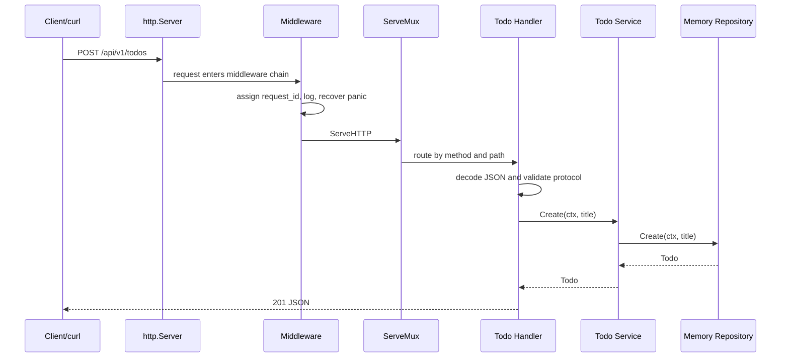

# 第 9 篇：Go net/http 标准库与 HTTP 服务

第 7 篇已经完成内存版 `todo-cli`；按照阶段二新计划，第 8 篇负责 Go 项目工程化、测试和验证入口。从本篇开始，Todo 能力要从“命令行里调用”升级为“通过 HTTP API 被其他系统调用”。

本篇属于 **C 类：实践/开发章**。你会使用 Go 标准库 `net/http` 实现 Todo API v1，不引入 Gin、Chi 或其他 Web 框架。这样做不是为了拒绝框架，而是为了先看清 HTTP 服务的底层模型：`Handler` 如何接收请求，`ServeMux` 如何分发路由，`ResponseWriter` 如何写状态码和响应体，中间件如何层层包装请求链路。

本篇对应 4 个章节主题：

- 9.1 Handler 接口、ServeMux 与请求多路复用
- 9.2 Request 解析：URL 参数、Header、Body
- 9.3 JSON 序列化、请求绑定与基础参数校验
- 9.4 中间件模式：请求日志、恢复 panic、链路追踪

本篇特色项目是：**Todo API v1（net/http 标准库版）**。

完成后，你将拥有一个可运行的 HTTP 服务，支持：

- `GET /healthz`
- `GET /readyz`
- `GET /api/v1/todos`
- `POST /api/v1/todos`
- `GET /api/v1/todos/{id}`
- `PUT /api/v1/todos/{id}`
- `PATCH /api/v1/todos/{id}/done`
- `DELETE /api/v1/todos/{id}`

## 1. 本章学习目标

学完本篇后，你应该能使用 Go 标准库独立开发一个小型 HTTP API 服务，并能解释它为什么这样组织。

### 1.1 知识目标

- 能解释 `http.Handler`、`http.HandlerFunc` 和 `http.ServeMux` 的关系。
- 能说明 HTTP Method、Path、Query、Header、Body 和 Status Code 在 API 中的职责。
- 能解释 `ResponseWriter` 为什么必须先写 Header 再写 Body。
- 能说明 JSON 请求绑定、响应编码和输入校验的基本流程。
- 能解释标准库中间件为什么本质上是 `func(http.Handler) http.Handler`。
- 能对比标准库 `net/http` 与后续 Gin 框架的边界：框架主要简化路由、绑定、中间件和错误处理。

### 1.2 技能目标

- 能用 `net/http` 和 `ServeMux` 实现 Todo CRUD API。
- 能使用 `r.PathValue`、`r.URL.Query()`、`r.Header` 和 `json.Decoder` 解析请求。
- 能返回稳定的 JSON 响应和错误码。
- 能编写请求日志、panic 恢复和 request ID 中间件。
- 能设置 `ReadHeaderTimeout`、`ReadTimeout`、`WriteTimeout` 和优雅关闭。
- 能使用 `curl` 和 `go test ./...` 验证 API 行为。

你至少应该能成功执行：

```bash linenums="0"
cd ~/workspace/cloud-native-todo-platform
go fmt ./api/...
go test ./api/...
go build -o bin/todo-api ./api/cmd/todo-api
TODO_API_ADDR=127.0.0.1:18080 ./bin/todo-api
```

另开一个终端验证：

```bash linenums="0"
curl -s http://127.0.0.1:18080/healthz
curl -s -X POST http://127.0.0.1:18080/api/v1/todos -H 'Content-Type: application/json' -d '{"title":"learn net/http"}'
curl -s http://127.0.0.1:18080/api/v1/todos
```

## 2. 本章工作场景与真实案例

### 2.1 技术痛点

命令行工具适合本地操作，但真实业务系统通常需要被前端、移动端、自动化脚本、其他微服务或 Kubernetes 探针访问。HTTP API 是这些调用方之间最常见的协作契约。

如果只会写函数，不理解 HTTP 边界，后续会在这些地方出问题：

- 前端不知道创建 Todo 应该调用哪个路径。
- 测试不知道接口失败时应该看状态码还是响应体。
- SRE 看到 `500` 却不知道服务端日志里如何关联请求。
- Kubernetes 探针不知道服务是“进程还活着”还是“业务依赖可用”。
- 后续使用 Gin 时只会照抄框架写法，无法判断框架到底帮你省掉了什么。

本篇先用标准库把 HTTP 模型拆开看清楚，再进入第 10 篇 Gin 重构，学习曲线会更稳。

### 2.2 团队协作场景

在真实团队中，HTTP API 是多人协作的中心：

- 后端开发负责实现 Handler、业务服务、错误码和测试。
- 前端和测试根据 API 契约调用接口，不应该依赖服务端内部结构。
- DevOps 和 SRE 依赖 `/healthz`、`/readyz`、日志和退出行为接入部署平台。
- 架构师会审查路径设计、状态码、超时、请求体大小限制和可观测性。
- 平台团队后续会把这个 API 放进容器、Kubernetes Deployment、Service、Ingress 和 Operator 管理流程。

本篇的 `Todo API v1` 会刻意保持标准库实现，让每一个 HTTP 细节都能被看见：请求如何进入、参数如何解析、错误如何映射、响应如何返回、中间件如何串起来。

### 2.3 Todo 平台模拟案例

> Todo 平台需要从命令行能力变成 HTTP API。你需要使用标准库 `net/http` 暴露健康检查、待办事项增删改查、JSON 编解码、错误响应和优雅关闭。

这个案例要求你理解 HTTP 服务的最小生产骨架：路由、请求上下文、响应格式、超时控制和退出流程都必须明确。
## 3. 核心概念

### 3.1 Handler 与 HandlerFunc

Go 标准库把 HTTP 处理能力抽象成一个接口：

```go linenums="0"
type Handler interface {
	ServeHTTP(ResponseWriter, *Request)
}
```

只要一个类型实现了 `ServeHTTP` 方法，它就是一个 HTTP Handler。

为了让普通函数也能当 Handler 使用，标准库提供了 `http.HandlerFunc`：

```go linenums="0"
func healthz(w http.ResponseWriter, r *http.Request) {
	w.WriteHeader(http.StatusOK)
	w.Write([]byte("ok"))
}
```

`http.HandlerFunc(healthz)` 会把函数适配成 `Handler`。本篇多数路由使用 `mux.HandleFunc` 注册，本质上就是这个适配过程。

### 3.2 ServeMux 与路由分发

`ServeMux` 是标准库的请求多路复用器。它根据 Method 和 Path 把请求分发到对应 Handler。

Go 1.22 之后，标准库 `ServeMux` 支持更清晰的路由模式：

```go linenums="0"
mux := http.NewServeMux()
mux.HandleFunc("GET /healthz", healthz)
mux.HandleFunc("GET /api/v1/todos/{id}", getTodo)
```

在 Handler 中可以读取路径变量：

```go linenums="0"
id := r.PathValue("id")
```

课程统一使用 Go 1.26.x，因此本篇可以直接使用这种标准库路由能力，不需要额外引入第三方路由库。

### 3.3 Request 与 ResponseWriter

`*http.Request` 表示客户端请求，常用字段包括：

| 内容 | 读取方式 | 示例 |
|---|---|---|
| Method | `r.Method` | `GET` |
| Path | `r.URL.Path` | `/api/v1/todos/1` |
| Query | `r.URL.Query().Get("status")` | `pending` |
| Header | `r.Header.Get("Content-Type")` | `application/json` |
| Body | `json.NewDecoder(r.Body)` | `{"title":"learn"}` |

`http.ResponseWriter` 用于写响应。一个重要规则是：**先写状态码，再写响应体**。

```go linenums="0"
w.Header().Set("Content-Type", "application/json")
w.WriteHeader(http.StatusCreated)
json.NewEncoder(w).Encode(payload)
```

如果你先调用 `Write` 或 `json.Encoder.Encode`，标准库会自动写出 `200 OK`。这就是为什么统一响应函数很重要：它能减少“明明想返回 201，结果变成 200”的错误。

### 3.4 JSON 请求和响应

HTTP API 常用 JSON 作为请求和响应格式。创建 Todo 的请求体可以设计为：

```json linenums="0"
{"title":"learn net/http"}
```

响应可以设计为：

```json linenums="0"
{"data":{"id":1,"title":"learn net/http","status":"pending"}}
```

错误响应也要稳定：

```json linenums="0"
{"error":{"code":"invalid_title","message":"title is required"}}
```

稳定的响应结构让前端、测试和自动化脚本不需要猜测服务端会返回什么。

### 3.5 中间件

标准库中间件通常长这样：

```go linenums="0"
func middleware(next http.Handler) http.Handler {
	return http.HandlerFunc(func(w http.ResponseWriter, r *http.Request) {
		// 请求前逻辑
		next.ServeHTTP(w, r)
		// 请求后逻辑
	})
}
```

它的本质是“包装一个 Handler，返回一个新的 Handler”。本篇会实现 3 个中间件：

- request ID：给每个请求一个可追踪 ID。
- access log：记录方法、路径、状态码、耗时。
- recover panic：避免 panic 直接打崩进程，并返回 `500`。

### 3.6 健康检查与就绪检查

`/healthz` 表示进程是否活着，常用于 liveness probe。

`/readyz` 表示服务是否准备好处理请求，常用于 readiness probe。本篇还是内存存储，所以 readiness 只做轻量检查；后续接入 PostgreSQL 后，`/readyz` 会检查数据库连接。

| 路径 | 含义 | 当前实现 |
|---|---|---|
| `/healthz` | 进程存活 | 返回 `{"status":"ok"}` |
| `/readyz` | 服务就绪 | 调用服务层 List，确认存储可访问 |

## 4. 原理深入

### 4.1 请求链路

下图展示 Todo API v1 的请求处理流程：



这一链路里，每层只做自己的事：

- `http.Server` 负责监听端口、接收连接、管理超时。
- 中间件负责通用横切能力。
- `ServeMux` 负责路由分发。
- Handler 负责 HTTP 协议转换。
- Service 负责业务规则。
- Repository 负责数据读写。

### 4.2 为什么 Handler 不直接操作 map

新手写 API 时，很容易在 Handler 里直接写全局变量：

```go linenums="0"
var todos = map[int]Todo{}
```

这会让代码很快失控：

- Handler 同时承担协议解析、业务规则和存储逻辑。
- 测试只能通过 HTTP 绕很远的路验证业务规则。
- 后续换 PostgreSQL 时要改很多 Handler。
- 并发请求直接读写 map 会产生数据竞争。

本篇把业务规则放到 `service`，把内存读写放到 `repository`，Handler 只做 HTTP 适配。这样第 10 篇换成 Gin、第 12 篇换成 PostgreSQL 时，上层 API 契约可以尽量稳定。

### 4.3 状态码如何映射业务错误

HTTP 状态码不是随便选的，它是 API 契约的一部分。

| 场景 | 状态码 | 错误码 |
|---|---:|---|
| 创建成功 | `201 Created` | 无 |
| 查询成功 | `200 OK` | 无 |
| 删除成功 | `204 No Content` | 无 |
| JSON 格式错误 | `400 Bad Request` | `bad_json` |
| 缺少或错误的 Content-Type | `415 Unsupported Media Type` | `unsupported_media_type` |
| 标题为空 | `400 Bad Request` | `invalid_title` |
| ID 非法 | `400 Bad Request` | `invalid_id` |
| Todo 不存在 | `404 Not Found` | `not_found` |
| 服务内部错误 | `500 Internal Server Error` | `internal_error` |

Handler 的职责是把 Go 错误映射成 HTTP 响应。不要把底层错误字符串原样返回给客户端，否则既不稳定，也可能泄露内部信息。

### 4.4 超时和优雅关闭

生产 HTTP 服务不能只写：

```go linenums="0"
http.ListenAndServe(addr, handler)
```

更稳妥的方式是显式创建 `http.Server`：

```go linenums="0"
server := &http.Server{
	Addr:              addr,
	Handler:           handler,
	ReadHeaderTimeout: 5 * time.Second,
	ReadTimeout:       10 * time.Second,
	WriteTimeout:      10 * time.Second,
	IdleTimeout:       60 * time.Second,
}
```

这些超时能减少慢请求、慢 Header 和连接占用带来的风险。进程收到 `SIGTERM` 时，应调用 `server.Shutdown(ctx)`，让服务停止接收新请求，并等待正在处理的请求完成。这会直接支撑后续 Kubernetes 滚动更新。

## 5. 手把手实验

预计耗时：90 分钟（动手操作约 60 分钟）。

### 5.1 实验目标

本实验会在 `cloud-native-todo-platform` 中实现 `Todo API v1`，使用 Go 标准库 `net/http` 提供内存版 Todo CRUD、健康检查、中间件、Handler 测试和优雅关闭。

最终 API：

| Method | Path | 说明 |
|---|---|---|
| `GET` | `/healthz` | 存活检查 |
| `GET` | `/readyz` | 就绪检查 |
| `GET` | `/api/v1/todos` | 列出 Todo，支持 `?status=pending/done` |
| `POST` | `/api/v1/todos` | 创建 Todo |
| `GET` | `/api/v1/todos/{id}` | 查询单个 Todo |
| `PUT` | `/api/v1/todos/{id}` | 更新标题 |
| `PATCH` | `/api/v1/todos/{id}/done` | 标记完成 |
| `DELETE` | `/api/v1/todos/{id}` | 删除 Todo |

### 5.2 实验环境

| 项目 | 要求 |
|---|---|
| 操作系统 | Ubuntu 24.04 LTS |
| Go | 1.26.x |
| Shell | Bash 5.x |
| 工具 | `curl`、`git` |
| 前置成果 | 已完成第 7 篇 `go.mod` 初始化 |

进入项目根目录：

```bash linenums="0"
cd ~/workspace/cloud-native-todo-platform
test -f go.mod || go mod init cloud-native-todo-platform
```

### 5.3 文件目录结构

创建本篇目录：

```bash linenums="0"
mkdir -p api/cmd/todo-api api/internal/handler/http api/internal/model api/internal/repository api/internal/service bin
```

本篇完成后的目录结构：

```text linenums="0"
cloud-native-todo-platform/
├── api/
│   ├── cmd/
│   │   └── todo-api/
│   │       └── main.go
│   └── internal/
│       ├── handler/
│       │   └── http/
│       │       ├── handler.go
│       │       ├── middleware.go
│       │       ├── response.go
│       │       └── handler_test.go
│       ├── model/
│       │   └── todo.go
│       ├── repository/
│       │   └── memory.go
│       └── service/
│           └── todo_service.go
├── bin/
├── go.mod
└── ...
```

### 5.4 完整代码

确认 `go.mod`：

```go title="go.mod"
module cloud-native-todo-platform

go 1.26
```

创建 `api/internal/model/todo.go`：

```go title="api/internal/model/todo.go"
package model

import "time"

// Status describes the current state of a Todo item.
type Status string

const (
	StatusPending Status = "pending"
	StatusDone    Status = "done"
)

// Todo is the API domain object returned to clients.
type Todo struct {
	ID        int       `json:"id"`
	Title     string    `json:"title"`
	Status    Status    `json:"status"`
	CreatedAt time.Time `json:"created_at"`
	UpdatedAt time.Time `json:"updated_at"`
}

func (s Status) IsValidFilter() bool {
	return s == "" || s == StatusPending || s == StatusDone
}
```

创建 `api/internal/repository/memory.go`：

```go title="api/internal/repository/memory.go"
package repository

import (
	"context"
	"errors"
	"fmt"
	"sort"
	"sync"
	"time"

	"cloud-native-todo-platform/api/internal/model"
)

var ErrNotFound = errors.New("todo not found")

// MemoryRepository stores Todo items in process memory.
// Access to items is protected by sync.RWMutex.
// It is safe for concurrent HTTP requests, but data is lost after process exit.
type MemoryRepository struct {
	mu     sync.RWMutex
	nextID int
	items  map[int]model.Todo
	now    func() time.Time
}

func NewMemoryRepository() *MemoryRepository {
	return &MemoryRepository{
		nextID: 1,
		items:  make(map[int]model.Todo),
		now:    time.Now,
	}
}

func (r *MemoryRepository) Create(ctx context.Context, title string) (model.Todo, error) {
	if err := ctx.Err(); err != nil {
		return model.Todo{}, err
	}

	r.mu.Lock()
	defer r.mu.Unlock()

	now := r.now().UTC()
	item := model.Todo{
		ID:        r.nextID,
		Title:     title,
		Status:    model.StatusPending,
		CreatedAt: now,
		UpdatedAt: now,
	}
	r.items[item.ID] = item
	r.nextID++
	return item, nil
}

func (r *MemoryRepository) List(ctx context.Context, status model.Status) ([]model.Todo, error) {
	if err := ctx.Err(); err != nil {
		return nil, err
	}

	r.mu.RLock()
	defer r.mu.RUnlock()

	items := make([]model.Todo, 0, len(r.items))
	for _, item := range r.items {
		if status != "" && item.Status != status {
			continue
		}
		items = append(items, item)
	}
	sort.Slice(items, func(i, j int) bool {
		return items[i].ID < items[j].ID
	})
	return items, nil
}

func (r *MemoryRepository) Get(ctx context.Context, id int) (model.Todo, error) {
	if err := ctx.Err(); err != nil {
		return model.Todo{}, err
	}

	r.mu.RLock()
	defer r.mu.RUnlock()

	item, ok := r.items[id]
	if !ok {
		return model.Todo{}, fmt.Errorf("%w: id=%d", ErrNotFound, id)
	}
	return item, nil
}

func (r *MemoryRepository) Update(ctx context.Context, id int, title string) (model.Todo, error) {
	if err := ctx.Err(); err != nil {
		return model.Todo{}, err
	}

	r.mu.Lock()
	defer r.mu.Unlock()

	item, ok := r.items[id]
	if !ok {
		return model.Todo{}, fmt.Errorf("%w: id=%d", ErrNotFound, id)
	}
	item.Title = title
	item.UpdatedAt = r.now().UTC()
	r.items[id] = item
	return item, nil
}

func (r *MemoryRepository) MarkDone(ctx context.Context, id int) (model.Todo, error) {
	if err := ctx.Err(); err != nil {
		return model.Todo{}, err
	}

	r.mu.Lock()
	defer r.mu.Unlock()

	item, ok := r.items[id]
	if !ok {
		return model.Todo{}, fmt.Errorf("%w: id=%d", ErrNotFound, id)
	}
	item.Status = model.StatusDone
	item.UpdatedAt = r.now().UTC()
	r.items[id] = item
	return item, nil
}

func (r *MemoryRepository) Delete(ctx context.Context, id int) error {
	if err := ctx.Err(); err != nil {
		return err
	}

	r.mu.Lock()
	defer r.mu.Unlock()

	if _, ok := r.items[id]; !ok {
		return fmt.Errorf("%w: id=%d", ErrNotFound, id)
	}
	delete(r.items, id)
	return nil
}
```

`MemoryRepository` 使用 `sync.RWMutex`，是因为 HTTP server 会并发处理请求。第 7 篇的 CLI 内存仓库是顺序执行，本篇进入 HTTP 服务后必须补上并发安全。

创建 `api/internal/service/todo_service.go`：

```go title="api/internal/service/todo_service.go"
package service

import (
	"context"
	"errors"
	"strings"

	"cloud-native-todo-platform/api/internal/model"
)

var (
	ErrInvalidTitle  = errors.New("todo title is required")
	ErrInvalidStatus = errors.New("todo status is invalid")
)

type Repository interface {
	Create(ctx context.Context, title string) (model.Todo, error)
	List(ctx context.Context, status model.Status) ([]model.Todo, error)
	Get(ctx context.Context, id int) (model.Todo, error)
	Update(ctx context.Context, id int, title string) (model.Todo, error)
	MarkDone(ctx context.Context, id int) (model.Todo, error)
	Delete(ctx context.Context, id int) error
}

type Service struct {
	repo Repository
}

func New(repo Repository) *Service {
	return &Service{repo: repo}
}

func (s *Service) Create(ctx context.Context, title string) (model.Todo, error) {
	title, err := normalizeTitle(title)
	if err != nil {
		return model.Todo{}, err
	}
	return s.repo.Create(ctx, title)
}

func (s *Service) List(ctx context.Context, status model.Status) ([]model.Todo, error) {
	if !status.IsValidFilter() {
		return nil, ErrInvalidStatus
	}
	return s.repo.List(ctx, status)
}

func (s *Service) Get(ctx context.Context, id int) (model.Todo, error) {
	return s.repo.Get(ctx, id)
}

func (s *Service) Update(ctx context.Context, id int, title string) (model.Todo, error) {
	title, err := normalizeTitle(title)
	if err != nil {
		return model.Todo{}, err
	}
	return s.repo.Update(ctx, id, title)
}

func (s *Service) MarkDone(ctx context.Context, id int) (model.Todo, error) {
	return s.repo.MarkDone(ctx, id)
}

func (s *Service) Delete(ctx context.Context, id int) error {
	return s.repo.Delete(ctx, id)
}

func ParseStatus(raw string) (model.Status, error) {
	status := model.Status(strings.TrimSpace(raw))
	if !status.IsValidFilter() {
		return "", ErrInvalidStatus
	}
	return status, nil
}

func normalizeTitle(title string) (string, error) {
	title = strings.TrimSpace(title)
	if title == "" {
		return "", ErrInvalidTitle
	}
	return title, nil
}
```

创建 `api/internal/handler/http/response.go`：

```go title="api/internal/handler/http/response.go"
package httpapi

import (
	"encoding/json"
	"net/http"
)

type envelope struct {
	Data  any       `json:"data,omitempty"`
	Error *apiError `json:"error,omitempty"`
}

type apiError struct {
	Code    string `json:"code"`
	Message string `json:"message"`
}

func respondJSON(w http.ResponseWriter, status int, data any) {
	w.Header().Set("Content-Type", "application/json")
	w.WriteHeader(status)
	_ = json.NewEncoder(w).Encode(envelope{Data: data})
}

func respondError(w http.ResponseWriter, status int, code, message string) {
	w.Header().Set("Content-Type", "application/json")
	w.WriteHeader(status)
	_ = json.NewEncoder(w).Encode(envelope{
		Error: &apiError{
			Code:    code,
			Message: message,
		},
	})
}

func respondNoContent(w http.ResponseWriter) {
	w.WriteHeader(http.StatusNoContent)
}
```

创建 `api/internal/handler/http/middleware.go`：

```go title="api/internal/handler/http/middleware.go"
package httpapi

import (
	"context"
	"log/slog"
	"net/http"
	"runtime/debug"
	"strconv"
	"sync/atomic"
	"time"
)

type contextKey string

const requestIDKey contextKey = "request_id"

var requestSeq uint64

func withRequestID(next http.Handler) http.Handler {
	return http.HandlerFunc(func(w http.ResponseWriter, r *http.Request) {
		requestID := r.Header.Get("X-Request-ID")
		if requestID == "" {
			requestID = "req-" + strconv.FormatUint(atomic.AddUint64(&requestSeq, 1), 10)
		}

		w.Header().Set("X-Request-ID", requestID)
		ctx := context.WithValue(r.Context(), requestIDKey, requestID)
		next.ServeHTTP(w, r.WithContext(ctx))
	})
}

func withRecovery(logger *slog.Logger, next http.Handler) http.Handler {
	return http.HandlerFunc(func(w http.ResponseWriter, r *http.Request) {
		defer func() {
			if recovered := recover(); recovered != nil {
				logger.Error("panic recovered",
					"request_id", requestIDFrom(r),
					"method", r.Method,
					"path", r.URL.Path,
					"panic", recovered,
					"stack", string(debug.Stack()),
				)
				respondError(w, http.StatusInternalServerError, "internal_error", "internal server error")
			}
		}()

		next.ServeHTTP(w, r)
	})
}

func withAccessLog(logger *slog.Logger, next http.Handler) http.Handler {
	return http.HandlerFunc(func(w http.ResponseWriter, r *http.Request) {
		startedAt := time.Now()
		recorder := &statusRecorder{ResponseWriter: w, status: http.StatusOK}

		next.ServeHTTP(recorder, r)

		logger.Info("http request",
			"request_id", requestIDFrom(r),
			"method", r.Method,
			"path", r.URL.Path,
			"status", recorder.status,
			"bytes", recorder.bytes,
			"duration_ms", time.Since(startedAt).Milliseconds(),
		)
	})
}

type statusRecorder struct {
	http.ResponseWriter
	status int
	bytes  int
}

func (r *statusRecorder) WriteHeader(status int) {
	r.status = status
	r.ResponseWriter.WriteHeader(status)
}

func (r *statusRecorder) Write(data []byte) (int, error) {
	n, err := r.ResponseWriter.Write(data)
	r.bytes += n
	return n, err
}

func requestIDFrom(r *http.Request) string {
	requestID, _ := r.Context().Value(requestIDKey).(string)
	return requestID
}
```

这个 `statusRecorder` 适合本篇 JSON API，用来记录状态码和响应字节数。生产中如果要支持流式响应、WebSocket 或其他高级能力，包装 `ResponseWriter` 时还要谨慎处理 `http.Flusher`、`http.Hijacker` 等接口，避免中间件掩盖底层能力。

创建 `api/internal/handler/http/handler.go`：

```go title="api/internal/handler/http/handler.go"
package httpapi

import (
	"context"
	"encoding/json"
	"errors"
	"fmt"
	"io"
	"log/slog"
	"mime"
	"net/http"
	"strconv"

	"cloud-native-todo-platform/api/internal/model"
	"cloud-native-todo-platform/api/internal/repository"
	"cloud-native-todo-platform/api/internal/service"
)

const maxBodyBytes = 1 << 20

type todoService interface {
	Create(ctx context.Context, title string) (model.Todo, error)
	List(ctx context.Context, status model.Status) ([]model.Todo, error)
	Get(ctx context.Context, id int) (model.Todo, error)
	Update(ctx context.Context, id int, title string) (model.Todo, error)
	MarkDone(ctx context.Context, id int) (model.Todo, error)
	Delete(ctx context.Context, id int) error
}

type Handler struct {
	service todoService
	logger  *slog.Logger
}

func NewRouter(service todoService, logger *slog.Logger) http.Handler {
	if logger == nil {
		logger = slog.Default()
	}

	h := &Handler{
		service: service,
		logger:  logger,
	}

	mux := http.NewServeMux()
	mux.HandleFunc("GET /healthz", h.healthz)
	mux.HandleFunc("GET /readyz", h.readyz)
	mux.HandleFunc("GET /api/v1/todos", h.listTodos)
	mux.HandleFunc("POST /api/v1/todos", h.createTodo)
	mux.HandleFunc("GET /api/v1/todos/{id}", h.getTodo)
	mux.HandleFunc("PUT /api/v1/todos/{id}", h.updateTodo)
	mux.HandleFunc("PATCH /api/v1/todos/{id}/done", h.markDone)
	mux.HandleFunc("DELETE /api/v1/todos/{id}", h.deleteTodo)

	var handler http.Handler = mux
	handler = withRecovery(logger, handler)
	handler = withAccessLog(logger, handler)
	handler = withRequestID(handler)
	return handler
}

func (h *Handler) healthz(w http.ResponseWriter, r *http.Request) {
	respondJSON(w, http.StatusOK, map[string]string{"status": "ok"})
}

func (h *Handler) readyz(w http.ResponseWriter, r *http.Request) {
	if _, err := h.service.List(r.Context(), ""); err != nil {
		h.handleError(w, err)
		return
	}
	respondJSON(w, http.StatusOK, map[string]string{"status": "ready"})
}

func (h *Handler) listTodos(w http.ResponseWriter, r *http.Request) {
	status, err := service.ParseStatus(r.URL.Query().Get("status"))
	if err != nil {
		h.handleError(w, err)
		return
	}

	items, err := h.service.List(r.Context(), status)
	if err != nil {
		h.handleError(w, err)
		return
	}
	respondJSON(w, http.StatusOK, items)
}

func (h *Handler) createTodo(w http.ResponseWriter, r *http.Request) {
	var req todoRequest
	if ok := decodeJSON(w, r, &req); !ok {
		return
	}

	item, err := h.service.Create(r.Context(), req.Title)
	if err != nil {
		h.handleError(w, err)
		return
	}
	respondJSON(w, http.StatusCreated, item)
}

func (h *Handler) getTodo(w http.ResponseWriter, r *http.Request) {
	id, ok := parseID(w, r)
	if !ok {
		return
	}

	item, err := h.service.Get(r.Context(), id)
	if err != nil {
		h.handleError(w, err)
		return
	}
	respondJSON(w, http.StatusOK, item)
}

func (h *Handler) updateTodo(w http.ResponseWriter, r *http.Request) {
	id, ok := parseID(w, r)
	if !ok {
		return
	}

	var req todoRequest
	if ok := decodeJSON(w, r, &req); !ok {
		return
	}

	item, err := h.service.Update(r.Context(), id, req.Title)
	if err != nil {
		h.handleError(w, err)
		return
	}
	respondJSON(w, http.StatusOK, item)
}

func (h *Handler) markDone(w http.ResponseWriter, r *http.Request) {
	id, ok := parseID(w, r)
	if !ok {
		return
	}

	item, err := h.service.MarkDone(r.Context(), id)
	if err != nil {
		h.handleError(w, err)
		return
	}
	respondJSON(w, http.StatusOK, item)
}

func (h *Handler) deleteTodo(w http.ResponseWriter, r *http.Request) {
	id, ok := parseID(w, r)
	if !ok {
		return
	}

	if err := h.service.Delete(r.Context(), id); err != nil {
		h.handleError(w, err)
		return
	}
	respondNoContent(w)
}

type todoRequest struct {
	Title string `json:"title"`
}

func decodeJSON(w http.ResponseWriter, r *http.Request, dst any) bool {
	mediaType, _, err := mime.ParseMediaType(r.Header.Get("Content-Type"))
	if err != nil || mediaType != "application/json" {
		respondError(w, http.StatusUnsupportedMediaType, "unsupported_media_type", "Content-Type must be application/json")
		return false
	}

	r.Body = http.MaxBytesReader(w, r.Body, maxBodyBytes)
	defer r.Body.Close()

	decoder := json.NewDecoder(r.Body)
	decoder.DisallowUnknownFields()

	if err := decoder.Decode(dst); err != nil {
		respondError(w, http.StatusBadRequest, "bad_json", fmt.Sprintf("request body is invalid: %v", err))
		return false
	}

	var extra struct{}
	if err := decoder.Decode(&extra); err != io.EOF {
		respondError(w, http.StatusBadRequest, "bad_json", "request body must contain a single JSON object")
		return false
	}

	return true
}

func parseID(w http.ResponseWriter, r *http.Request) (int, bool) {
	raw := r.PathValue("id")
	id, err := strconv.Atoi(raw)
	if err != nil || id <= 0 {
		respondError(w, http.StatusBadRequest, "invalid_id", "id must be a positive integer")
		return 0, false
	}
	return id, true
}

func (h *Handler) handleError(w http.ResponseWriter, err error) {
	switch {
	case errors.Is(err, service.ErrInvalidTitle):
		respondError(w, http.StatusBadRequest, "invalid_title", "title is required")
	case errors.Is(err, service.ErrInvalidStatus):
		respondError(w, http.StatusBadRequest, "invalid_status", "status must be pending or done")
	case errors.Is(err, repository.ErrNotFound):
		respondError(w, http.StatusNotFound, "not_found", "todo not found")
	case errors.Is(err, context.Canceled):
		respondError(w, http.StatusRequestTimeout, "request_canceled", "request was canceled")
	default:
		h.logger.Error("request failed", "error", err)
		respondError(w, http.StatusInternalServerError, "internal_error", "internal server error")
	}
}
```

`todoService` 接口定义在 Handler 所在的包中，只声明 Handler 真正需要的方法。这是 Go 中常见的“接口在使用方定义”模式：Handler 不依赖整个 `service.Service` 结构体，只依赖它需要的几个能力。不过这里为了教学清晰，错误映射仍然直接引用了 `service` 和 `repository` 包中的哨兵错误，没有做过度抽象。

创建 `api/cmd/todo-api/main.go`：

```go title="api/cmd/todo-api/main.go"
package main

import (
	"context"
	"errors"
	"fmt"
	"log/slog"
	"net/http"
	"os"
	"os/signal"
	"syscall"
	"time"

	httpapi "cloud-native-todo-platform/api/internal/handler/http"
	"cloud-native-todo-platform/api/internal/repository"
	"cloud-native-todo-platform/api/internal/service"
)

type config struct {
	Addr            string
	ShutdownTimeout time.Duration
}

func main() {
	logger := slog.New(slog.NewJSONHandler(os.Stdout, &slog.HandlerOptions{Level: slog.LevelInfo}))

	if err := run(context.Background(), os.Args[1:], logger); err != nil {
		logger.Error("todo api stopped", "error", err)
		os.Exit(1)
	}
}

func run(ctx context.Context, args []string, logger *slog.Logger) error {
	cfg := loadConfig()

	if len(args) > 0 {
		switch args[0] {
		case "config-check":
			fmt.Printf("addr=%s shutdown_timeout=%s\n", cfg.Addr, cfg.ShutdownTimeout)
			return nil
		case "routes":
			fmt.Println("GET /healthz")
			fmt.Println("GET /readyz")
			fmt.Println("GET /api/v1/todos")
			fmt.Println("POST /api/v1/todos")
			fmt.Println("GET /api/v1/todos/{id}")
			fmt.Println("PUT /api/v1/todos/{id}")
			fmt.Println("PATCH /api/v1/todos/{id}/done")
			fmt.Println("DELETE /api/v1/todos/{id}")
			return nil
		default:
			return fmt.Errorf("unknown command %q", args[0])
		}
	}

	repo := repository.NewMemoryRepository()
	todoService := service.New(repo)
	handler := httpapi.NewRouter(todoService, logger)

	server := &http.Server{
		Addr:              cfg.Addr,
		Handler:           handler,
		ReadHeaderTimeout: 5 * time.Second,
		ReadTimeout:       10 * time.Second,
		WriteTimeout:      10 * time.Second,
		IdleTimeout:       60 * time.Second,
	}

	ctx, stop := signal.NotifyContext(ctx, os.Interrupt, syscall.SIGTERM)
	defer stop()

	errCh := make(chan error, 1)
	go func() {
		logger.Info("todo api listening", "addr", cfg.Addr)
		if err := server.ListenAndServe(); err != nil && !errors.Is(err, http.ErrServerClosed) {
			errCh <- err
			return
		}
		errCh <- nil
	}()

	select {
	case <-ctx.Done():
		logger.Info("shutdown signal received")
	case err := <-errCh:
		return err
	}

	shutdownCtx, cancel := context.WithTimeout(context.Background(), cfg.ShutdownTimeout)
	defer cancel()

	if err := server.Shutdown(shutdownCtx); err != nil {
		return fmt.Errorf("shutdown server: %w", err)
	}
	logger.Info("todo api stopped")
	return nil
}

func loadConfig() config {
	return config{
		Addr:            getenv("TODO_API_ADDR", "127.0.0.1:18080"),
		ShutdownTimeout: 5 * time.Second,
	}
}

func getenv(key, fallback string) string {
	value := os.Getenv(key)
	if value == "" {
		return fallback
	}
	return value
}
```

创建 `api/internal/handler/http/handler_test.go`：

```go title="api/internal/handler/http/handler_test.go"
package httpapi

import (
	"encoding/json"
	"io"
	"log/slog"
	"net/http"
	"net/http/httptest"
	"strings"
	"testing"

	"cloud-native-todo-platform/api/internal/repository"
	"cloud-native-todo-platform/api/internal/service"
)

func TestTodoLifecycle(t *testing.T) {
	logger := slog.New(slog.NewTextHandler(io.Discard, nil))
	todoService := service.New(repository.NewMemoryRepository())
	server := httptest.NewServer(NewRouter(todoService, logger))
	defer server.Close()

	status, body := request(t, server, http.MethodGet, "/healthz", "")
	if status != http.StatusOK {
		t.Fatalf("GET /healthz status = %d body = %s", status, body)
	}

	status, body = request(t, server, http.MethodPost, "/api/v1/todos", `{"title":"learn net/http"}`)
	if status != http.StatusCreated {
		t.Fatalf("POST /api/v1/todos status = %d body = %s", status, body)
	}

	var created struct {
		Data struct {
			ID int `json:"id"`
		} `json:"data"`
	}
	if err := json.Unmarshal([]byte(body), &created); err != nil {
		t.Fatalf("decode create response: %v", err)
	}

	status, body = request(t, server, http.MethodGet, "/api/v1/todos", "")
	if status != http.StatusOK || !strings.Contains(body, "learn net/http") {
		t.Fatalf("GET /api/v1/todos status = %d body = %s", status, body)
	}

	status, body = request(t, server, http.MethodPatch, "/api/v1/todos/1/done", "")
	if status != http.StatusOK || !strings.Contains(body, `"status":"done"`) {
		t.Fatalf("PATCH done status = %d body = %s", status, body)
	}

	status, body = request(t, server, http.MethodPut, "/api/v1/todos/1", `{"title":"learn standard library"}`)
	if status != http.StatusOK || !strings.Contains(body, "learn standard library") {
		t.Fatalf("PUT /api/v1/todos/1 status = %d body = %s", status, body)
	}

	status, body = request(t, server, http.MethodDelete, "/api/v1/todos/1", "")
	if status != http.StatusNoContent {
		t.Fatalf("DELETE /api/v1/todos/1 status = %d body = %s", status, body)
	}

	status, body = request(t, server, http.MethodGet, "/api/v1/todos/1", "")
	if status != http.StatusNotFound || !strings.Contains(body, "not_found") {
		t.Fatalf("GET deleted todo status = %d body = %s", status, body)
	}
}

func TestCreateRejectsInvalidJSON(t *testing.T) {
	logger := slog.New(slog.NewTextHandler(io.Discard, nil))
	todoService := service.New(repository.NewMemoryRepository())
	server := httptest.NewServer(NewRouter(todoService, logger))
	defer server.Close()

	status, body := request(t, server, http.MethodPost, "/api/v1/todos", `{"title":`)
	if status != http.StatusBadRequest || !strings.Contains(body, "bad_json") {
		t.Fatalf("POST invalid JSON status = %d body = %s", status, body)
	}
}

func TestRejectsUnsupportedMediaType(t *testing.T) {
	logger := slog.New(slog.NewTextHandler(io.Discard, nil))
	todoService := service.New(repository.NewMemoryRepository())
	server := httptest.NewServer(NewRouter(todoService, logger))
	defer server.Close()

	req, err := http.NewRequest(http.MethodPost, server.URL+"/api/v1/todos", strings.NewReader(`{"title":"learn"}`))
	if err != nil {
		t.Fatalf("new request: %v", err)
	}
	req.Header.Set("Content-Type", "application/jsonp")

	resp, err := server.Client().Do(req)
	if err != nil {
		t.Fatalf("do request: %v", err)
	}
	defer resp.Body.Close()

	data, err := io.ReadAll(resp.Body)
	if err != nil {
		t.Fatalf("read response: %v", err)
	}
	body := string(data)
	if resp.StatusCode != http.StatusUnsupportedMediaType || !strings.Contains(body, "unsupported_media_type") {
		t.Fatalf("POST unsupported media type status = %d body = %s", resp.StatusCode, body)
	}
}

func TestRejectsInvalidStatusAndID(t *testing.T) {
	logger := slog.New(slog.NewTextHandler(io.Discard, nil))
	todoService := service.New(repository.NewMemoryRepository())
	server := httptest.NewServer(NewRouter(todoService, logger))
	defer server.Close()

	status, body := request(t, server, http.MethodGet, "/api/v1/todos?status=archived", "")
	if status != http.StatusBadRequest || !strings.Contains(body, "invalid_status") {
		t.Fatalf("GET invalid status = %d body = %s", status, body)
	}

	status, body = request(t, server, http.MethodGet, "/api/v1/todos/abc", "")
	if status != http.StatusBadRequest || !strings.Contains(body, "invalid_id") {
		t.Fatalf("GET invalid id = %d body = %s", status, body)
	}
}

func TestRequestIDHeader(t *testing.T) {
	logger := slog.New(slog.NewTextHandler(io.Discard, nil))
	todoService := service.New(repository.NewMemoryRepository())
	server := httptest.NewServer(NewRouter(todoService, logger))
	defer server.Close()

	req, err := http.NewRequest(http.MethodGet, server.URL+"/healthz", nil)
	if err != nil {
		t.Fatalf("new request: %v", err)
	}
	req.Header.Set("X-Request-ID", "test-request-id")

	resp, err := server.Client().Do(req)
	if err != nil {
		t.Fatalf("do request: %v", err)
	}
	defer resp.Body.Close()

	if got := resp.Header.Get("X-Request-ID"); got != "test-request-id" {
		t.Fatalf("X-Request-ID = %q", got)
	}
}

func request(t *testing.T, server *httptest.Server, method, path, body string) (int, string) {
	t.Helper()

	var reader io.Reader
	if body != "" {
		reader = strings.NewReader(body)
	}

	req, err := http.NewRequest(method, server.URL+path, reader)
	if err != nil {
		t.Fatalf("new request: %v", err)
	}
	if body != "" {
		req.Header.Set("Content-Type", "application/json")
	}

	resp, err := server.Client().Do(req)
	if err != nil {
		t.Fatalf("do request: %v", err)
	}
	defer resp.Body.Close()

	data, err := io.ReadAll(resp.Body)
	if err != nil {
		t.Fatalf("read response: %v", err)
	}
	return resp.StatusCode, string(data)
}
```

### 5.5 执行命令

确认已经保存以上 8 个 Go 源文件，再继续执行下面的命令。

格式化代码：

```bash linenums="0"
go fmt ./api/...
```

运行测试：

```bash linenums="0"
go test ./api/...
```

构建服务：

```bash linenums="0"
go build -o bin/todo-api ./api/cmd/todo-api
```

查看配置：

```bash linenums="0"
TODO_API_ADDR=127.0.0.1:18080 ./bin/todo-api config-check
```

查看路由：

```bash linenums="0"
./bin/todo-api routes
```

启动服务：

```bash linenums="0"
TODO_API_ADDR=127.0.0.1:18080 ./bin/todo-api
```

环境变量 `TODO_API_ADDR` 控制监听地址。本篇代码的默认值也是 `127.0.0.1:18080`，这里显式设置是为了让命令意图更清楚；如果你改用其他端口，后续 `curl` 命令也要同步修改。

另开一个终端验证 API：

```bash linenums="0"
curl -s http://127.0.0.1:18080/healthz
curl -s http://127.0.0.1:18080/readyz
curl -s -X POST http://127.0.0.1:18080/api/v1/todos -H 'Content-Type: application/json' -d '{"title":"learn net/http"}'
curl -s http://127.0.0.1:18080/api/v1/todos
curl -s -X PATCH http://127.0.0.1:18080/api/v1/todos/1/done
curl -s -X PUT http://127.0.0.1:18080/api/v1/todos/1 -H 'Content-Type: application/json' -d '{"title":"learn ServeMux"}'
curl -s http://127.0.0.1:18080/api/v1/todos/1
curl -s -X DELETE -i http://127.0.0.1:18080/api/v1/todos/1
```

停止服务时，在服务终端按 `Ctrl+C`。程序会执行 `server.Shutdown`，日志中能看到停止过程。

### 5.6 预期输出

`go test ./api/...` 应类似：

```text linenums="0"
?   	cloud-native-todo-platform/api/cmd/todo-api	[no test files]
?   	cloud-native-todo-platform/api/internal/model	[no test files]
?   	cloud-native-todo-platform/api/internal/repository	[no test files]
?   	cloud-native-todo-platform/api/internal/service	[no test files]
ok  	cloud-native-todo-platform/api/internal/handler/http	0.0s
```

`./bin/todo-api routes` 应输出：

```text linenums="0"
GET /healthz
GET /readyz
GET /api/v1/todos
POST /api/v1/todos
GET /api/v1/todos/{id}
PUT /api/v1/todos/{id}
PATCH /api/v1/todos/{id}/done
DELETE /api/v1/todos/{id}
```

创建 Todo 的响应类似：

```json linenums="0"
{"data":{"id":1,"title":"learn net/http","status":"pending","created_at":"2026-05-27T10:00:00Z","updated_at":"2026-05-27T10:00:00Z"}}
```

删除 Todo 的响应状态是 `204 No Content`，没有响应体：

```text linenums="0"
HTTP/1.1 204 No Content
X-Request-Id: req-8
Date: Wed, 27 May 2026 10:00:00 GMT
```

按 `Ctrl+C` 停止服务时，日志会看到类似输出：

```json linenums="0"
{"time":"2026-05-27T10:00:00Z","level":"INFO","msg":"shutdown signal received"}
{"time":"2026-05-27T10:00:00Z","level":"INFO","msg":"todo api stopped"}
```

### 5.7 验证方法

验证格式、测试和构建：

```bash linenums="0"
go fmt ./api/...
go test ./api/...
go build -o bin/todo-api ./api/cmd/todo-api
git diff --check
```

验证服务端口：

```bash linenums="0"
ss -lntp | grep 18080
```

验证 HTTP 状态码：

```bash linenums="0"
curl -s -o /tmp/healthz.out -w '%{http_code}\n' http://127.0.0.1:18080/healthz
curl -s -o /tmp/notfound.out -w '%{http_code}\n' http://127.0.0.1:18080/api/v1/todos/999
```

判断标准：

- `go test ./api/...` 通过。
- `go build` 能生成 `bin/todo-api`。
- `/healthz` 返回 `200`。
- 创建 Todo 返回 `201`。
- 查询不存在 Todo 返回 `404` 和 `not_found`。
- 错误 JSON 返回 `400` 和 `bad_json`。
- 服务停止时没有 panic。

### 5.8 清理步骤

删除构建产物：

```bash linenums="0"
rm -f bin/todo-api
```

如果服务还在运行，先查看并停止：

```bash linenums="0"
ss -lntp | grep 18080
```

在服务终端按 `Ctrl+C`。如果确实需要按 PID 停止，先确认进程命令行是 `todo-api`，再执行 `kill`。

本篇使用内存存储，不会产生数据库、JSON 数据文件或 YAML 资源。Kubernetes YAML 会在后续部署阶段出现；本篇只聚焦 Go HTTP 服务本身。

## 6. 常见错误与排障

### 错误 1：`address already in use`

- **现象**：

  ```text linenums="0"
  listen tcp 127.0.0.1:18080: bind: address already in use
  ```

- **原因**：端口 `18080` 已经被另一个进程占用，可能是上一次 `todo-api` 没有停止。

- **排查**：

  ```bash linenums="0"
  ss -lntp | grep 18080
  ```

  如果看到 `LISTEN`，说明端口正在被某个进程占用。输出里的 `pid=...` 可以帮助你确认进程。

- **修复**：换一个端口启动：

  ```bash linenums="0"
  TODO_API_ADDR=127.0.0.1:18081 ./bin/todo-api
  ```

  或者确认占用进程确实是旧的 `todo-api` 后，再停止它。

- **预防**：本地实验统一使用 `TODO_API_ADDR` 显式指定端口；结束实验时用 `Ctrl+C` 正常关闭服务。

### 错误 2：`404 page not found`

- **现象**：

  ```text linenums="0"
  404 page not found
  ```

- **原因**：请求路径没有匹配到 `ServeMux` 注册的路由。例如把 `/api/v1/todos/1` 写成 `/api/v1/todo/1`。

- **排查**：

  ```bash linenums="0"
  ./bin/todo-api routes
  curl -i http://127.0.0.1:18080/api/v1/todo/1
  ```

  对照 `routes` 输出，检查 Method 和 Path 是否完全匹配。

- **修复**：使用正确路径：

  ```bash linenums="0"
  curl -i http://127.0.0.1:18080/api/v1/todos/1
  ```

- **预防**：写 API 文档时同时列出 Method 和 Path；测试用例覆盖所有公开路由。

### 错误 3：`unsupported_media_type`

- **现象**：

  ```json linenums="0"
  {"error":{"code":"unsupported_media_type","message":"Content-Type must be application/json"}}
  ```

- **原因**：创建或更新 Todo 时没有设置 `Content-Type: application/json`。

- **排查**：

  ```bash linenums="0"
  curl -i -X POST http://127.0.0.1:18080/api/v1/todos -d '{"title":"learn"}'
  ```

  响应状态码应为 `415 Unsupported Media Type`。

- **修复**：

  ```bash linenums="0"
  curl -i -X POST http://127.0.0.1:18080/api/v1/todos -H 'Content-Type: application/json' -d '{"title":"learn"}'
  ```

- **预防**：所有带 JSON 请求体的示例都写清楚 Header；客户端 SDK 统一封装请求。

### 错误 4：`bad_json`

- **现象**：

  ```json linenums="0"
  {"error":{"code":"bad_json","message":"request body is invalid: unexpected EOF"}}
  ```

- **原因**：JSON 格式错误、字段名错误、请求体超过限制，或一个请求体里拼了多个 JSON 对象。

- **排查**：

  ```bash linenums="0"
  curl -i -X POST http://127.0.0.1:18080/api/v1/todos -H 'Content-Type: application/json' -d '{"title":'
  ```

  如果返回 `400` 和 `bad_json`，说明请求体没有通过 JSON 解码。

- **修复**：使用合法 JSON：

  ```bash linenums="0"
  curl -i -X POST http://127.0.0.1:18080/api/v1/todos -H 'Content-Type: application/json' -d '{"title":"learn JSON"}'
  ```

- **预防**：测试覆盖非法 JSON、未知字段、空标题和超大请求体；生产 API 文档给出请求示例。

### 错误 5：`not_found`

- **现象**：

  ```json linenums="0"
  {"error":{"code":"not_found","message":"todo not found"}}
  ```

- **原因**：请求的 Todo ID 不存在，或者服务重启后内存数据已清空。

- **排查**：

  ```bash linenums="0"
  curl -s http://127.0.0.1:18080/api/v1/todos
  curl -i http://127.0.0.1:18080/api/v1/todos/999
  ```

  先列表确认当前进程里有哪些 ID，再查询具体 ID。

- **修复**：使用存在的 ID，或者重新创建 Todo。

- **预防**：记住本篇使用内存存储，服务重启会丢失数据。第 12 篇接入 PostgreSQL 后才会实现可靠持久化。

## 7. 生产环境注意事项

1. **必须设置 HTTP 超时。**
   生产服务不能裸用 `http.ListenAndServe`。`ReadHeaderTimeout` 可以缓解慢 Header 攻击，`ReadTimeout` 和 `WriteTimeout` 可以避免慢客户端长期占用连接，`IdleTimeout` 可以控制 keep-alive 连接资源。本篇显式创建 `http.Server`，就是为了从一开始建立正确习惯。

2. **不要把底层错误直接返回给客户端。**
   文件路径、数据库 SQL、内部地址、调用栈和密钥都可能出现在底层错误里。对外应该返回稳定的错误码和简洁消息；详细错误写入服务端日志，并用 request ID 关联请求。这样既保护内部信息，也让 API 契约更稳定。

3. **请求体大小要有限制。**
   本篇使用 `http.MaxBytesReader` 把 JSON 请求体限制为 1 MiB。真实生产环境中，这个值应结合业务场景、网关限制、客户端约定和监控告警一起设计，不能无限制读取 Body。

4. **内存存储只适合学习。**
   虽然本篇的 `MemoryRepository` 已经用锁保证并发安全，但数据仍然会在进程退出后消失，多副本部署时每个实例也各有一份数据。生产 Todo API 应使用数据库，并设计迁移、备份、恢复和连接池。

5. **优雅关闭是 Kubernetes 部署前置能力。**
   Kubernetes 滚动更新和缩容会发送 `SIGTERM`。如果进程直接退出，正在处理的请求会中断。本篇用 `server.Shutdown` 等待请求结束，是后续 Deployment、readiness probe 和滚动更新实验的基础。

6. **中间件要理解能力边界。**
   本篇的 panic recover 可以防止普通 Handler panic 直接终止进程，但如果响应已经写出一部分，再尝试改写成 `500` JSON 就不一定可靠。`ResponseWriter` 包装也不是完全透明的，涉及流式响应、WebSocket 或 HTTP/2 特性时，需要确认包装器是否保留底层接口能力。

## 8. 练习题与面试题

本章练习题和面试题已拆分到独立页面，完成正文学习后再进入题库练习与复盘。

[查看本章练习题与面试题](../../questions/stage-02-go-backend/09-go-net-http.md)

## 9. 本章总结

本篇完成了 Todo 平台从 Go 业务代码到 HTTP API 的关键升级。你学习了 `http.Handler`、`HandlerFunc`、`ServeMux`、`Request`、`ResponseWriter`、JSON 编解码、中间件、健康检查、HTTP 超时和优雅关闭。

项目成果上，你新增了 `api/cmd/todo-api` 和 `api/internal/...`，实现了标准库版 Todo API v1。它仍然使用内存存储，但已经具备 HTTP 服务的核心形态：稳定路由、清晰状态码、统一 JSON 响应、基础中间件、Handler 测试和可验证启动命令。

能力价值上，你不只是会调用框架，而是理解 Go HTTP 服务的底层模型。这会让你在第 10 篇学习 Gin 时知道框架到底帮你省掉了什么，也能在排查生产问题时回到标准库模型定位问题。

## 10. 下一章衔接

下一篇进入 **Go Web API 开发：Gin 框架**。

本篇用标准库手写了路由、请求绑定、错误响应和中间件。第 10 篇会用 Gin 重构 Todo API v2，重点观察：

- Gin 如何简化路由组和路径参数。
- Gin 如何处理 JSON 绑定和校验。
- Gin 中间件与标准库中间件有什么不同。
- 如何生成 OpenAPI 文档。
- 哪些能力应该留在 Service 层，而不是绑定到框架里。

也就是说，第 9 篇解决“HTTP 服务底层模型是什么”，第 10 篇解决“如何用框架更高效地开发同一类 API”。先标准库、后框架，是为了让你既能写业务，也能解释原理。
