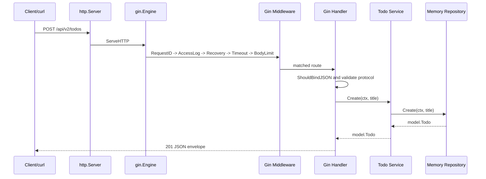

# 第 10 篇：Go Web API 开发——Gin 框架

第 9 篇已经用 `net/http` 标准库实现了 Todo API v1。你已经看过 HTTP 请求怎样进入 `http.Server`，`ServeMux` 怎样分发路由，Handler 怎样解析 JSON，ResponseWriter 怎样写状态码和响应体。

本篇属于 **C 类：实践/开发章**。我们会在同一个项目里新增 `api/internal/handler/gin`，用 Gin 重构 Todo API v2。这样做不是为了把标准库版本推翻，而是为了对比框架到底帮你省掉了什么：路由组、路径参数、JSON 绑定、参数校验、中间件编排和 API 文档入口。

本篇对应 5 个章节主题：

- 10.1 Gin 与 `net/http` 的关系：框架省掉了什么
- 10.2 路由组、中间件与请求绑定
- 10.3 RESTful API 设计与统一响应格式
- 10.4 参数校验、错误码与异常处理
- 10.5 健康检查、优雅关闭与 OpenAPI 文档生成

本篇特色项目是：**Todo API v2（Gin 框架版）**。

完成后，你将拥有一个可运行、可测试、可维护的 Gin Web API 服务，支持：

- `GET /healthz`
- `GET /readyz`
- `GET /openapi.yaml`
- `GET /api/v2/todos`
- `POST /api/v2/todos`
- `GET /api/v2/todos/:id`
- `PUT /api/v2/todos/:id`
- `PATCH /api/v2/todos/:id/done`
- `DELETE /api/v2/todos/:id`

## 1. 本章学习目标

学完本篇后，你应该能独立开发一个 Gin RESTful API 服务，并能解释它与第 9 篇标准库版本的关系。

### 1.1 知识目标

- 能解释 Gin 为什么仍然运行在 `net/http` 之上。
- 能对比 `http.Handler` 与 `gin.HandlerFunc` 的差异。
- 能说明 Gin 路由组、中间件、`Context`、JSON 绑定和参数校验的职责。
- 能解释统一响应、错误码和 OpenAPI 文档为什么是团队协作契约。
- 能说明 Gin 默认能力和生产环境必补能力之间的边界。

### 1.2 技能目标

- 能用 Gin 实现 Todo API v2 的 CRUD 接口。
- 能使用 `c.Param`、`c.Query`、`ShouldBindJSON` 和 binding tag 解析并校验请求。
- 能编写 request ID、访问日志、panic 恢复、请求超时和请求体大小限制中间件。
- 能生成并暴露 `openapi.yaml`，让前端、测试和调用方对齐接口契约。
- 能继续使用 `http.Server` 设置超时和优雅关闭。
- 能用 `curl`、`go test ./api/...` 和 `go build` 验证 Gin API 行为。

你至少应该能成功执行：

```bash linenums="0"
cd ~/workspace/cloud-native-todo-platform
go get github.com/gin-gonic/gin@v1.12.0
go mod tidy
go fmt ./api/...
go test ./api/...
go build -o bin/todo-api ./api/cmd/todo-api
TODO_API_ADDR=127.0.0.1:18080 ./bin/todo-api
```

另开一个终端验证：

```bash linenums="0"
curl -s http://127.0.0.1:18080/healthz
curl -s -X POST http://127.0.0.1:18080/api/v2/todos -H 'Content-Type: application/json' -d '{"title":"learn Gin"}'
curl -s http://127.0.0.1:18080/api/v2/todos
curl -s http://127.0.0.1:18080/openapi.yaml | head
```

## 2. 本章工作场景与真实案例

### 2.1 技术痛点

标准库版本让你看清了 HTTP 服务的底层模型，但企业项目通常不会让每个团队都重复手写路由分组、路径参数解析、JSON 绑定、校验错误转换和中间件链。重复代码越多，团队越容易出现风格分裂：同一个错误有的接口返回 `400`，有的返回 `500`；有的接口校验未知字段，有的接口静默忽略；有的路由有 request ID，有的路由没有。

Gin 解决的不是“不会写 HTTP”的问题，而是“把常见 Web API 结构收敛成统一写法”的问题。你仍然要理解 HTTP、状态码、超时和优雅关闭，但可以把更多注意力放在业务路径、请求契约和错误语义上。

### 2.2 团队协作场景

真实团队中，Gin API 通常会被多个角色共同使用：

- 后端开发实现 Handler、Service、Repository 和 Handler 测试。
- 前端开发根据 OpenAPI 文档确认路径、字段、错误码和示例响应。
- 测试工程师用 API 文档生成接口测试或手写自动化用例。
- SRE 通过 `/healthz`、`/readyz`、结构化日志和 request ID 定位线上问题。
- 架构师审查路由版本、统一响应、超时、请求体大小限制和中间件顺序。

本篇会保持第 9 篇的 `model`、`repository`、`service` 分层，只替换 HTTP 入口层。这样你能清楚看到框架应该停留在哪一层：Gin 属于 Handler 层，它不应该渗透进业务服务层和存储层。

### 2.3 Todo 平台模拟案例

> Todo API 的标准库版本已经能工作，但团队希望引入更完整的 Web 框架能力。你需要使用 Gin 组织路由分组、中间件、参数校验、统一错误返回和 OpenAPI 描述。

这个案例关注 API 设计的可维护性：当接口数量变多时，路由、鉴权、日志、错误模型和文档必须保持一致。
## 3. 核心概念

### 3.1 Gin 与 net/http 的关系

Gin 不是另一个 HTTP 协议实现。它最终仍然作为 `http.Server.Handler` 被标准库调用。

最小结构可以这样理解：

```go linenums="0"
router := gin.New()
server := &http.Server{
	Addr:    "127.0.0.1:18080",
	Handler: router,
}
server.ListenAndServe()
```

`gin.Engine` 实现了标准库的 `ServeHTTP` 方法，所以它可以放进 `http.Server`。这也是为什么第 9 篇学过的超时、优雅关闭、端口监听、`curl` 验证仍然适用。

### 3.2 gin.Context

在标准库 Handler 中，你直接接触 `http.ResponseWriter` 和 `*http.Request`。Gin 把常用操作收进 `*gin.Context`：

| 操作 | 标准库写法 | Gin 写法 |
|---|---|---|
| 路径参数 | `r.PathValue("id")` | `c.Param("id")` |
| 查询参数 | `r.URL.Query().Get("status")` | `c.Query("status")` |
| JSON 响应 | `json.NewEncoder(w).Encode(...)` | `c.JSON(status, payload)` |
| 状态码 | `w.WriteHeader(status)` | `c.Status(status)` |
| JSON 绑定 | `json.NewDecoder(r.Body).Decode(&req)` | `c.ShouldBindJSON(&req)` |

`gin.Context` 不是 Go 标准库的 `context.Context`。当你要把请求生命周期传给 service 或 repository 时，仍然使用：

```go linenums="0"
ctx := c.Request.Context()
```

### 3.3 路由组

路由组用来表达一组接口的共同前缀和共同中间件。Todo API v2 使用 `/api/v2` 作为版本前缀：

```go linenums="0"
api := router.Group("/api/v2")
api.GET("/todos", h.listTodos)
api.POST("/todos", h.createTodo)
api.GET("/todos/:id", h.getTodo)
```

这比到处手写 `/api/v2/...` 更清晰，也方便后续给某一组路由单独加认证、限流或审计中间件。

### 3.4 请求绑定与参数校验

Gin 的 `ShouldBindJSON` 可以把 JSON 请求体绑定到结构体，并根据 tag 做基础校验：

```go linenums="0"
type todoRequest struct {
	Title string `json:"title" binding:"required,min=1,max=120"`
}
```

这行 tag 的含义是：

- `json:"title"`：JSON 字段名是 `title`。
- `required`：字段必须存在且非零值。
- `min=1`：字符串长度至少为 1。
- `max=120`：字符串长度最多为 120。

框架校验只能解决协议层输入问题。真正的业务规则仍然放在 service 层。本篇仍然保留 `service.ErrInvalidTitle`，避免 Handler 成为业务规则的唯一来源。

### 3.5 统一响应与错误码

统一响应不是为了“包一层看起来高级”，而是为了让调用方稳定解析。

成功响应：

```json linenums="0"
{"data":{"id":1,"title":"learn Gin","status":"pending"}}
```

错误响应：

```json linenums="0"
{"error":{"code":"invalid_title","message":"title must be between 1 and 120 characters"}}
```

前端可以根据 `error.code` 做国际化或提示；测试可以断言错误码；日志可以统计某类错误是否突然升高。

### 3.6 OpenAPI 文档

OpenAPI 是描述 HTTP API 契约的标准格式。它能说明路径、方法、参数、请求体、响应和数据结构。团队有了 OpenAPI 文档，前端、测试、后端和平台侧就不必靠口头约定同步接口。

本篇会把 OpenAPI 文档嵌入服务，并通过两个方式使用：

- `go run ./api/cmd/todo-api openapi > api/openapi.yaml` 生成文档文件。
- `GET /openapi.yaml` 在运行时暴露文档内容。

## 4. 原理深入

### 4.1 请求链路

图 10-1 展示 Gin 版 Todo API v2 的请求处理流程：



第 9 篇中路由匹配、路径参数读取和 JSON 编码都由我们自己写。Gin 版把这些重复动作封装到了 `gin.Engine` 和 `gin.Context` 中，但业务调用链没有变：Handler 仍然只负责 HTTP 边界，Service 仍然负责业务规则，Repository 仍然负责数据存取。

### 4.2 中间件顺序

本篇中间件顺序是：

```text linenums="0"
RequestID -> AccessLog -> Recovery -> Timeout -> BodyLimit -> Router Handler
```

这个顺序有实际含义：

- `RequestID` 放最外层，后续日志和错误都能带同一个 ID。
- `AccessLog` 包在外层，能记录正常响应和 panic 恢复后的响应。
- `Recovery` 包住业务 Handler，避免 panic 直接终止请求链路。
- `Timeout` 给下游 service 和 repository 一个有期限的 `context.Context`。
- `BodyLimit` 在 JSON 绑定前限制请求体大小，避免大请求占满内存。

注意：如果 Handler 在 panic 前已经写出了响应头，后续 `Recovery` 不能再把状态码改成 `500`。这也是生产代码应尽量“先完成业务操作，最后统一写响应”的原因。

### 4.3 Handler 层接口边界

本篇在 Gin Handler 包里定义 `todoService` 接口：

```go linenums="0"
type todoService interface {
	List(ctx context.Context, status model.Status) ([]model.Todo, error)
	Get(ctx context.Context, id int) (model.Todo, error)
	Create(ctx context.Context, title string) (model.Todo, error)
	Update(ctx context.Context, id int, title string) (model.Todo, error)
	MarkDone(ctx context.Context, id int) (model.Todo, error)
	Delete(ctx context.Context, id int) error
}
```

这是 Go 中常见的“接口定义在使用方”模式。Handler 不依赖整个 `service.TodoService` 具体类型，只声明自己真正需要的方法。测试时也可以替换成假服务。

同时，错误映射仍然直接引用 `service.ErrInvalidTitle` 和 `repository.ErrNotFound`。这是教学项目里的务实折中：我们保留清晰的错误来源，不额外引入复杂的错误翻译层。大型项目可以把错误码收敛到单独的 API error 包。本篇还比第 9 篇多处理了 `context.DeadlineExceeded`，当请求超时时会返回 `504 Gateway Timeout`，这和 Gin 版新增的请求超时中间件配套。

### 4.4 API 版本

本篇使用 `/api/v2`，不是因为业务字段发生了巨大变化，而是为了在课程中清楚区分两套实现：

- `/api/v1`：第 9 篇标准库版本。
- `/api/v2`：第 10 篇 Gin 框架版本。

真实生产环境里，API 版本不是随便升级的。只有当响应结构、字段语义、兼容性或行为约定发生破坏性变化时，才应该发布新的主版本路径。

## 5. 手把手实验

预计耗时：15 分钟阅读，45 分钟动手实验。

### 5.1 实验目标

把第 9 篇标准库 Todo API 重构为 Gin Todo API v2，并生成 OpenAPI 文档。

### 5.2 实验环境

| 工具 | 版本 | 用途 |
|---|---|---|
| Ubuntu | 24.04 LTS | 统一实验环境 |
| Go | 1.26.x | 编译和测试 API |
| Gin | 1.12.0 | Web API 框架 |
| curl | Ubuntu 24.04 默认版本 | 验证 HTTP 接口 |

进入课程项目根目录：

```bash linenums="0"
cd ~/workspace/cloud-native-todo-platform
```

确认 Go module 已存在：

```bash linenums="0"
test -f go.mod
```

如果这条命令没有输出，说明文件存在。若提示 `No such file or directory`，请先完成第 7 篇到第 9 篇的 Go 项目初始化。

### 5.3 文件目录结构

创建本篇需要的目录：

```bash linenums="0"
mkdir -p api/cmd/todo-api api/internal/handler/gin api/internal/model api/internal/repository api/internal/service bin
```

本篇完成后的核心结构如下：

```text linenums="0"
cloud-native-todo-platform/
├── api/
│   ├── cmd/
│   │   └── todo-api/
│   │       └── main.go
│   └── internal/
│       ├── handler/
│       │   └── gin/
│       │       ├── config.go
│       │       ├── handler.go
│       │       ├── handler_test.go
│       │       ├── middleware.go
│       │       ├── openapi.go
│       │       ├── openapi.yaml
│       │       └── response.go
│       ├── model/
│       │   └── todo.go
│       ├── repository/
│       │   └── memory.go
│       └── service/
│           └── todo_service.go
├── bin/
└── go.mod
```

第 9 篇已经创建过 `model`、`repository` 和 `service`。本篇为了保证教程可独立复制执行，会把这些文件再次完整列出。你可以直接覆盖同名文件。

### 5.4 执行命令

先按下面内容创建或更新实验文件；保存完成后，再继续执行后续命令。

先用 `go get` 加入 Gin 依赖。这样不会覆盖第 9 篇或后续章节已经写入 `go.mod` 的其他依赖：

```bash linenums="0"
go get github.com/gin-gonic/gin@v1.12.0
```

执行后，确认 `go.mod` 至少包含下面内容：

```go title="go.mod"
module cloud-native-todo-platform

go 1.26

require github.com/gin-gonic/gin v1.12.0
```

创建 `api/internal/model/todo.go`：

```go title="api/internal/model/todo.go"
package model

import "time"

// Status describes whether a Todo is still pending or already done.
type Status string

const (
	StatusPending Status = "pending"
	StatusDone    Status = "done"
)

// Todo is the API-facing task resource.
type Todo struct {
	ID        int       `json:"id"`
	Title     string    `json:"title"`
	Status    Status    `json:"status"`
	CreatedAt time.Time `json:"created_at"`
	UpdatedAt time.Time `json:"updated_at"`
}

// ValidStatus reports whether status is accepted by the Todo API.
func ValidStatus(status Status) bool {
	switch status {
	case "", StatusPending, StatusDone:
		return true
	default:
		return false
	}
}
```

创建 `api/internal/repository/memory.go`：

```go title="api/internal/repository/memory.go"
package repository

import (
	"context"
	"errors"
	"fmt"
	"sort"
	"sync"
	"time"

	"cloud-native-todo-platform/api/internal/model"
)

// ErrNotFound is returned when a Todo ID does not exist.
var ErrNotFound = errors.New("todo not found")

// MemoryRepository stores Todos in memory. It is safe for concurrent HTTP requests.
type MemoryRepository struct {
	mu     sync.RWMutex
	nextID int
	items  map[int]model.Todo
	now    func() time.Time
}

// NewMemoryRepository creates an empty in-memory repository.
func NewMemoryRepository() *MemoryRepository {
	return &MemoryRepository{
		nextID: 1,
		items:  make(map[int]model.Todo),
		now:    time.Now,
	}
}

// List returns Todos filtered by status. An empty status means no filter.
func (r *MemoryRepository) List(ctx context.Context, status model.Status) ([]model.Todo, error) {
	if err := ctx.Err(); err != nil {
		return nil, err
	}

	r.mu.RLock()
	defer r.mu.RUnlock()

	items := make([]model.Todo, 0, len(r.items))
	for _, item := range r.items {
		if status == "" || item.Status == status {
			items = append(items, item)
		}
	}
	sort.Slice(items, func(i, j int) bool {
		return items[i].ID < items[j].ID
	})
	return items, nil
}

// Get returns a Todo by ID.
func (r *MemoryRepository) Get(ctx context.Context, id int) (model.Todo, error) {
	if err := ctx.Err(); err != nil {
		return model.Todo{}, err
	}

	r.mu.RLock()
	defer r.mu.RUnlock()

	item, ok := r.items[id]
	if !ok {
		return model.Todo{}, fmt.Errorf("%w: id=%d", ErrNotFound, id)
	}
	return item, nil
}

// Create inserts a new pending Todo.
func (r *MemoryRepository) Create(ctx context.Context, title string) (model.Todo, error) {
	if err := ctx.Err(); err != nil {
		return model.Todo{}, err
	}

	r.mu.Lock()
	defer r.mu.Unlock()

	now := r.now().UTC()
	item := model.Todo{
		ID:        r.nextID,
		Title:     title,
		Status:    model.StatusPending,
		CreatedAt: now,
		UpdatedAt: now,
	}
	r.items[item.ID] = item
	r.nextID++
	return item, nil
}

// Update changes a Todo title.
func (r *MemoryRepository) Update(ctx context.Context, id int, title string) (model.Todo, error) {
	if err := ctx.Err(); err != nil {
		return model.Todo{}, err
	}

	r.mu.Lock()
	defer r.mu.Unlock()

	item, ok := r.items[id]
	if !ok {
		return model.Todo{}, fmt.Errorf("%w: id=%d", ErrNotFound, id)
	}
	item.Title = title
	item.UpdatedAt = r.now().UTC()
	r.items[id] = item
	return item, nil
}

// MarkDone marks a Todo as done.
func (r *MemoryRepository) MarkDone(ctx context.Context, id int) (model.Todo, error) {
	if err := ctx.Err(); err != nil {
		return model.Todo{}, err
	}

	r.mu.Lock()
	defer r.mu.Unlock()

	item, ok := r.items[id]
	if !ok {
		return model.Todo{}, fmt.Errorf("%w: id=%d", ErrNotFound, id)
	}
	item.Status = model.StatusDone
	item.UpdatedAt = r.now().UTC()
	r.items[id] = item
	return item, nil
}

// Delete removes a Todo by ID.
func (r *MemoryRepository) Delete(ctx context.Context, id int) error {
	if err := ctx.Err(); err != nil {
		return err
	}

	r.mu.Lock()
	defer r.mu.Unlock()

	if _, ok := r.items[id]; !ok {
		return fmt.Errorf("%w: id=%d", ErrNotFound, id)
	}
	delete(r.items, id)
	return nil
}
```

创建 `api/internal/service/todo_service.go`：

```go title="api/internal/service/todo_service.go"
package service

import (
	"context"
	"errors"
	"strings"

	"cloud-native-todo-platform/api/internal/model"
)

// ErrInvalidTitle is returned when a Todo title is empty or too long.
var ErrInvalidTitle = errors.New("invalid todo title")

// ErrInvalidStatus is returned when a list filter contains an unknown status.
var ErrInvalidStatus = errors.New("invalid todo status")

// Repository is the storage behavior required by TodoService.
type Repository interface {
	List(ctx context.Context, status model.Status) ([]model.Todo, error)
	Get(ctx context.Context, id int) (model.Todo, error)
	Create(ctx context.Context, title string) (model.Todo, error)
	Update(ctx context.Context, id int, title string) (model.Todo, error)
	MarkDone(ctx context.Context, id int) (model.Todo, error)
	Delete(ctx context.Context, id int) error
}

// TodoService contains Todo business rules.
type TodoService struct {
	repo Repository
}

// NewTodoService creates a TodoService.
func NewTodoService(repo Repository) *TodoService {
	return &TodoService{repo: repo}
}

// New keeps compatibility with the net/http handler from chapter 9.
func New(repo Repository) *TodoService {
	return NewTodoService(repo)
}

// List returns Todos filtered by status.
func (s *TodoService) List(ctx context.Context, status model.Status) ([]model.Todo, error) {
	if !model.ValidStatus(status) {
		return nil, ErrInvalidStatus
	}
	return s.repo.List(ctx, status)
}

// Get returns one Todo.
func (s *TodoService) Get(ctx context.Context, id int) (model.Todo, error) {
	return s.repo.Get(ctx, id)
}

// Create validates and creates a Todo.
func (s *TodoService) Create(ctx context.Context, title string) (model.Todo, error) {
	title, err := normalizeTitle(title)
	if err != nil {
		return model.Todo{}, err
	}
	return s.repo.Create(ctx, title)
}

// Update validates and updates a Todo title.
func (s *TodoService) Update(ctx context.Context, id int, title string) (model.Todo, error) {
	title, err := normalizeTitle(title)
	if err != nil {
		return model.Todo{}, err
	}
	return s.repo.Update(ctx, id, title)
}

// MarkDone marks a Todo as done.
func (s *TodoService) MarkDone(ctx context.Context, id int) (model.Todo, error) {
	return s.repo.MarkDone(ctx, id)
}

// Delete removes a Todo.
func (s *TodoService) Delete(ctx context.Context, id int) error {
	return s.repo.Delete(ctx, id)
}

// ParseStatus normalizes the status query parameter used by HTTP handlers.
func ParseStatus(raw string) (model.Status, error) {
	status := model.Status(strings.TrimSpace(raw))
	if !model.ValidStatus(status) {
		return "", ErrInvalidStatus
	}
	return status, nil
}

func normalizeTitle(title string) (string, error) {
	title = strings.TrimSpace(title)
	if title == "" || len([]rune(title)) > 120 {
		return "", ErrInvalidTitle
	}
	return title, nil
}
```

创建 `api/internal/handler/gin/response.go`：

```go title="api/internal/handler/gin/response.go"
package ginapi

import (
	"net/http"

	"github.com/gin-gonic/gin"
)

// Envelope is the stable JSON response wrapper used by the API.
type Envelope struct {
	Data  any        `json:"data,omitempty"`
	Error *ErrorBody `json:"error,omitempty"`
}

// ErrorBody describes an API error in a machine-readable way.
type ErrorBody struct {
	Code    string `json:"code"`
	Message string `json:"message"`
}

func writeJSON(c *gin.Context, status int, data any) {
	c.JSON(status, Envelope{Data: data})
}

func writeError(c *gin.Context, status int, code, message string) {
	c.JSON(status, Envelope{Error: &ErrorBody{Code: code, Message: message}})
}

func noContent(c *gin.Context) {
	c.Status(http.StatusNoContent)
}
```

创建 `api/internal/handler/gin/config.go`：

```go title="api/internal/handler/gin/config.go"
package ginapi

import "time"

const defaultRequestTimeout = 5 * time.Second
```

创建 `api/internal/handler/gin/middleware.go`：

```go title="api/internal/handler/gin/middleware.go"
package ginapi

import (
	"context"
	"log/slog"
	"net/http"
	"strconv"
	"sync/atomic"
	"time"

	"github.com/gin-gonic/gin"
)

type requestIDKey struct{}

var requestSeq uint64

// RequestID attaches a request ID to the response header and request context.
func RequestID() gin.HandlerFunc {
	return func(c *gin.Context) {
		id := c.GetHeader("X-Request-ID")
		if id == "" {
			id = strconv.FormatUint(atomic.AddUint64(&requestSeq, 1), 10)
		}
		c.Header("X-Request-ID", id)
		ctx := context.WithValue(c.Request.Context(), requestIDKey{}, id)
		c.Request = c.Request.WithContext(ctx)
		c.Next()
	}
}

// AccessLog writes one structured log line for each request.
func AccessLog(logger *slog.Logger) gin.HandlerFunc {
	return func(c *gin.Context) {
		started := time.Now()
		c.Next()
		logger.Info("http request",
			"method", c.Request.Method,
			"path", c.Request.URL.Path,
			"status", c.Writer.Status(),
			"bytes", c.Writer.Size(),
			"duration_ms", time.Since(started).Milliseconds(),
			"request_id", c.Writer.Header().Get("X-Request-ID"),
		)
	}
}

// Recovery converts panics into JSON 500 responses.
func Recovery(logger *slog.Logger) gin.HandlerFunc {
	return func(c *gin.Context) {
		defer func() {
			if recovered := recover(); recovered != nil {
				logger.Error("panic recovered",
					"panic", recovered,
					"method", c.Request.Method,
					"path", c.Request.URL.Path,
					"request_id", c.Writer.Header().Get("X-Request-ID"),
				)
				if !c.Writer.Written() {
					writeError(c, http.StatusInternalServerError, "internal_error", "internal server error")
				}
				c.Abort()
			}
		}()
		c.Next()
	}
}

// Timeout gives each request a bounded context lifetime.
func Timeout(timeout time.Duration) gin.HandlerFunc {
	return func(c *gin.Context) {
		ctx, cancel := context.WithTimeout(c.Request.Context(), timeout)
		defer cancel()
		c.Request = c.Request.WithContext(ctx)
		c.Next()
	}
}

// BodyLimit caps request body size before JSON binding reads it.
func BodyLimit(limit int64) gin.HandlerFunc {
	return func(c *gin.Context) {
		c.Request.Body = http.MaxBytesReader(c.Writer, c.Request.Body, limit)
		c.Next()
	}
}
```

创建 `api/internal/handler/gin/openapi.yaml`：

```yaml title="api/internal/handler/gin/openapi.yaml"
openapi: 3.1.0
info:
  title: Cloud Native Todo API
  version: 2.0.0
  description: Gin-based Todo API v2 used by the cloud-native course.
servers:
  - url: http://127.0.0.1:18080
paths:
  /healthz:
    get:
      summary: Liveness check
      responses:
        "200":
          description: Process is alive
          content:
            application/json:
              schema:
                $ref: "#/components/schemas/HealthEnvelope"
  /readyz:
    get:
      summary: Readiness check
      responses:
        "200":
          description: Service is ready
          content:
            application/json:
              schema:
                $ref: "#/components/schemas/HealthEnvelope"
        "503":
          $ref: "#/components/responses/ErrorResponse"
  /openapi.yaml:
    get:
      summary: OpenAPI document
      responses:
        "200":
          description: OpenAPI YAML document
          content:
            application/yaml:
              schema:
                type: string
  /api/v2/todos:
    get:
      summary: List Todos
      parameters:
        - name: status
          in: query
          required: false
          schema:
            type: string
            enum: [pending, done]
      responses:
        "200":
          description: Todo list
          content:
            application/json:
              schema:
                $ref: "#/components/schemas/TodoListEnvelope"
        "400":
          $ref: "#/components/responses/ErrorResponse"
    post:
      summary: Create a Todo
      requestBody:
        required: true
        content:
          application/json:
            schema:
              $ref: "#/components/schemas/TodoInput"
      responses:
        "201":
          description: Todo created
          content:
            application/json:
              schema:
                $ref: "#/components/schemas/TodoEnvelope"
        "400":
          $ref: "#/components/responses/ErrorResponse"
        "415":
          $ref: "#/components/responses/ErrorResponse"
  /api/v2/todos/{id}:
    get:
      summary: Get one Todo
      parameters:
        - $ref: "#/components/parameters/TodoID"
      responses:
        "200":
          description: Todo found
          content:
            application/json:
              schema:
                $ref: "#/components/schemas/TodoEnvelope"
        "400":
          $ref: "#/components/responses/ErrorResponse"
        "404":
          $ref: "#/components/responses/ErrorResponse"
    put:
      summary: Update a Todo title
      parameters:
        - $ref: "#/components/parameters/TodoID"
      requestBody:
        required: true
        content:
          application/json:
            schema:
              $ref: "#/components/schemas/TodoInput"
      responses:
        "200":
          description: Todo updated
          content:
            application/json:
              schema:
                $ref: "#/components/schemas/TodoEnvelope"
        "400":
          $ref: "#/components/responses/ErrorResponse"
        "404":
          $ref: "#/components/responses/ErrorResponse"
        "415":
          $ref: "#/components/responses/ErrorResponse"
    delete:
      summary: Delete a Todo
      parameters:
        - $ref: "#/components/parameters/TodoID"
      responses:
        "204":
          description: Todo deleted
        "404":
          $ref: "#/components/responses/ErrorResponse"
  /api/v2/todos/{id}/done:
    patch:
      summary: Mark a Todo as done
      parameters:
        - $ref: "#/components/parameters/TodoID"
      responses:
        "200":
          description: Todo marked done
          content:
            application/json:
              schema:
                $ref: "#/components/schemas/TodoEnvelope"
        "400":
          $ref: "#/components/responses/ErrorResponse"
        "404":
          $ref: "#/components/responses/ErrorResponse"
components:
  responses:
    ErrorResponse:
      description: API error response
      content:
        application/json:
          schema:
            $ref: "#/components/schemas/ErrorEnvelope"
  parameters:
    TodoID:
      name: id
      in: path
      required: true
      schema:
        type: integer
        minimum: 1
  schemas:
    Todo:
      type: object
      required: [id, title, status, created_at, updated_at]
      properties:
        id:
          type: integer
        title:
          type: string
        status:
          type: string
          enum: [pending, done]
        created_at:
          type: string
          format: date-time
        updated_at:
          type: string
          format: date-time
    TodoEnvelope:
      type: object
      required: [data]
      properties:
        data:
          $ref: "#/components/schemas/Todo"
    TodoListEnvelope:
      type: object
      required: [data]
      properties:
        data:
          type: object
          required: [items]
          properties:
            items:
              type: array
              items:
                $ref: "#/components/schemas/Todo"
    HealthEnvelope:
      type: object
      required: [data]
      properties:
        data:
          type: object
          required: [status]
          properties:
            status:
              type: string
    TodoInput:
      type: object
      required: [title]
      additionalProperties: false
      properties:
        title:
          type: string
          minLength: 1
          maxLength: 120
    ErrorEnvelope:
      type: object
      required: [error]
      properties:
        error:
          type: object
          required: [code, message]
          properties:
            code:
              type: string
            message:
              type: string
```

创建 `api/internal/handler/gin/openapi.go`：

```go title="api/internal/handler/gin/openapi.go"
package ginapi

import _ "embed"

//go:embed openapi.yaml
var openAPISpec string

// OpenAPISpec returns the Todo API v2 OpenAPI document.
func OpenAPISpec() string {
	return openAPISpec
}
```

这里有两个 OpenAPI 文件路径：`api/internal/handler/gin/openapi.yaml` 是嵌入到 Go 服务里的源文档，`api/openapi.yaml` 是通过命令导出的协作产物。源文档跟随代码一起编译，导出文件方便前端、测试和接口平台使用。

因为这份 YAML 会通过 `//go:embed` 嵌入二进制，并通过 `GET /openapi.yaml` 对外暴露，所以文件内部不写中文教学注释。字段含义在正文中解释，交付给调用方的 API 文档保持干净。

创建 `api/internal/handler/gin/handler.go`：

```go title="api/internal/handler/gin/handler.go"
package ginapi

import (
	"context"
	"errors"
	"log/slog"
	"mime"
	"net/http"
	"strconv"

	"cloud-native-todo-platform/api/internal/model"
	"cloud-native-todo-platform/api/internal/repository"
	"cloud-native-todo-platform/api/internal/service"

	"github.com/gin-gonic/gin"
	"github.com/gin-gonic/gin/binding"
)

const maxBodyBytes = 1 << 20

type todoService interface {
	List(ctx context.Context, status model.Status) ([]model.Todo, error)
	Get(ctx context.Context, id int) (model.Todo, error)
	Create(ctx context.Context, title string) (model.Todo, error)
	Update(ctx context.Context, id int, title string) (model.Todo, error)
	MarkDone(ctx context.Context, id int) (model.Todo, error)
	Delete(ctx context.Context, id int) error
}

// Handler wires Gin HTTP requests to the Todo service.
type Handler struct {
	service todoService
}

// NewRouter creates the Gin engine for Todo API v2.
func NewRouter(service todoService, logger *slog.Logger) *gin.Engine {
	gin.SetMode(gin.ReleaseMode)
	binding.EnableDecoderDisallowUnknownFields = true
	binding.EnableDecoderUseNumber = true

	router := gin.New()
	h := &Handler{service: service}

	router.Use(RequestID(), AccessLog(logger), Recovery(logger), Timeout(defaultRequestTimeout), BodyLimit(maxBodyBytes))
	router.GET("/healthz", h.healthz)
	router.GET("/readyz", h.readyz)
	router.GET("/openapi.yaml", h.openapi)

	api := router.Group("/api/v2")
	api.GET("/todos", h.listTodos)
	api.POST("/todos", h.createTodo)
	api.GET("/todos/:id", h.getTodo)
	api.PUT("/todos/:id", h.updateTodo)
	api.PATCH("/todos/:id/done", h.markDone)
	api.DELETE("/todos/:id", h.deleteTodo)

	return router
}

func (h *Handler) healthz(c *gin.Context) {
	writeJSON(c, http.StatusOK, gin.H{"status": "ok"})
}

func (h *Handler) readyz(c *gin.Context) {
	if _, err := h.service.List(c.Request.Context(), ""); err != nil {
		writeError(c, http.StatusServiceUnavailable, "not_ready", "service is not ready")
		return
	}
	writeJSON(c, http.StatusOK, gin.H{"status": "ready"})
}

func (h *Handler) openapi(c *gin.Context) {
	c.Data(http.StatusOK, "application/yaml; charset=utf-8", []byte(OpenAPISpec()))
}

func (h *Handler) listTodos(c *gin.Context) {
	status := model.Status(c.Query("status"))
	items, err := h.service.List(c.Request.Context(), status)
	if err != nil {
		h.handleError(c, err)
		return
	}
	writeJSON(c, http.StatusOK, gin.H{"items": items})
}

func (h *Handler) createTodo(c *gin.Context) {
	if !requireJSON(c) {
		return
	}

	var req todoRequest
	if err := c.ShouldBindJSON(&req); err != nil {
		writeError(c, http.StatusBadRequest, "invalid_request", "request body must contain a valid title")
		return
	}

	item, err := h.service.Create(c.Request.Context(), req.Title)
	if err != nil {
		h.handleError(c, err)
		return
	}
	writeJSON(c, http.StatusCreated, item)
}

func (h *Handler) getTodo(c *gin.Context) {
	id, ok := parseID(c)
	if !ok {
		return
	}

	item, err := h.service.Get(c.Request.Context(), id)
	if err != nil {
		h.handleError(c, err)
		return
	}
	writeJSON(c, http.StatusOK, item)
}

func (h *Handler) updateTodo(c *gin.Context) {
	if !requireJSON(c) {
		return
	}
	id, ok := parseID(c)
	if !ok {
		return
	}

	var req todoRequest
	if err := c.ShouldBindJSON(&req); err != nil {
		writeError(c, http.StatusBadRequest, "invalid_request", "request body must contain a valid title")
		return
	}

	item, err := h.service.Update(c.Request.Context(), id, req.Title)
	if err != nil {
		h.handleError(c, err)
		return
	}
	writeJSON(c, http.StatusOK, item)
}

func (h *Handler) markDone(c *gin.Context) {
	id, ok := parseID(c)
	if !ok {
		return
	}

	item, err := h.service.MarkDone(c.Request.Context(), id)
	if err != nil {
		h.handleError(c, err)
		return
	}
	writeJSON(c, http.StatusOK, item)
}

func (h *Handler) deleteTodo(c *gin.Context) {
	id, ok := parseID(c)
	if !ok {
		return
	}

	if err := h.service.Delete(c.Request.Context(), id); err != nil {
		h.handleError(c, err)
		return
	}
	noContent(c)
}

func (h *Handler) handleError(c *gin.Context, err error) {
	switch {
	case errors.Is(err, service.ErrInvalidTitle):
		writeError(c, http.StatusBadRequest, "invalid_title", "title must be between 1 and 120 characters")
	case errors.Is(err, service.ErrInvalidStatus):
		writeError(c, http.StatusBadRequest, "invalid_status", "status must be pending or done")
	case errors.Is(err, repository.ErrNotFound):
		writeError(c, http.StatusNotFound, "not_found", "todo was not found")
	case errors.Is(err, context.Canceled):
		writeError(c, http.StatusRequestTimeout, "request_canceled", "request was canceled")
	case errors.Is(err, context.DeadlineExceeded):
		writeError(c, http.StatusGatewayTimeout, "request_timeout", "request timed out")
	default:
		writeError(c, http.StatusInternalServerError, "internal_error", "internal server error")
	}
}

type todoRequest struct {
	Title string `json:"title" binding:"required,min=1,max=120"`
}

func parseID(c *gin.Context) (int, bool) {
	id, err := strconv.Atoi(c.Param("id"))
	if err != nil || id <= 0 {
		writeError(c, http.StatusBadRequest, "invalid_id", "id must be a positive integer")
		return 0, false
	}
	return id, true
}

func requireJSON(c *gin.Context) bool {
	mediaType, _, err := mime.ParseMediaType(c.GetHeader("Content-Type"))
	if err != nil || mediaType != "application/json" {
		writeError(c, http.StatusUnsupportedMediaType, "unsupported_media_type", "Content-Type must be application/json")
		return false
	}
	return true
}
```

创建 `api/internal/handler/gin/handler_test.go`：

```go title="api/internal/handler/gin/handler_test.go"
package ginapi_test

import (
	"bytes"
	"encoding/json"
	"io"
	"log/slog"
	"net/http"
	"net/http/httptest"
	"strings"
	"testing"

	ginapi "cloud-native-todo-platform/api/internal/handler/gin"
	"cloud-native-todo-platform/api/internal/repository"
	"cloud-native-todo-platform/api/internal/service"
)

func TestTodoLifecycle(t *testing.T) {
	server := newTestServer()
	defer server.Close()

	createdStatus, createdBody := request(t, server, http.MethodPost, "/api/v2/todos", `{"title":"learn Gin"}`, "application/json")
	if createdStatus != http.StatusCreated {
		t.Fatalf("create status = %d, body = %s", createdStatus, createdBody)
	}

	var created struct {
		Data struct {
			ID     int    `json:"id"`
			Title  string `json:"title"`
			Status string `json:"status"`
		} `json:"data"`
	}
	if err := json.Unmarshal([]byte(createdBody), &created); err != nil {
		t.Fatalf("decode created response: %v", err)
	}
	if created.Data.ID != 1 || created.Data.Status != "pending" {
		t.Fatalf("unexpected created todo: %+v", created.Data)
	}

	status, body := request(t, server, http.MethodPatch, "/api/v2/todos/1/done", "", "")
	if status != http.StatusOK || !strings.Contains(body, `"status":"done"`) {
		t.Fatalf("mark done status = %d, body = %s", status, body)
	}

	status, body = request(t, server, http.MethodGet, "/api/v2/todos?status=done", "", "")
	if status != http.StatusOK || !strings.Contains(body, `"items"`) {
		t.Fatalf("list status = %d, body = %s", status, body)
	}

	status, body = request(t, server, http.MethodDelete, "/api/v2/todos/1", "", "")
	if status != http.StatusNoContent || body != "" {
		t.Fatalf("delete status = %d, body = %s", status, body)
	}
}

func TestRejectsUnsupportedMediaType(t *testing.T) {
	server := newTestServer()
	defer server.Close()

	status, body := request(t, server, http.MethodPost, "/api/v2/todos", `{"title":"bad"}`, "text/plain")
	if status != http.StatusUnsupportedMediaType {
		t.Fatalf("status = %d, body = %s", status, body)
	}
	if !strings.Contains(body, "unsupported_media_type") {
		t.Fatalf("body = %s", body)
	}
}

func TestRejectsUnknownJSONFields(t *testing.T) {
	server := newTestServer()
	defer server.Close()

	status, body := request(t, server, http.MethodPost, "/api/v2/todos", `{"title":"ok","extra":true}`, "application/json")
	if status != http.StatusBadRequest {
		t.Fatalf("status = %d, body = %s", status, body)
	}
}

func TestOpenAPIAndRequestID(t *testing.T) {
	server := newTestServer()
	defer server.Close()

	req, err := http.NewRequest(http.MethodGet, server.URL+"/openapi.yaml", nil)
	if err != nil {
		t.Fatalf("new request: %v", err)
	}
	resp, err := server.Client().Do(req)
	if err != nil {
		t.Fatalf("do request: %v", err)
	}
	defer resp.Body.Close()

	body, err := io.ReadAll(resp.Body)
	if err != nil {
		t.Fatalf("read body: %v", err)
	}
	if resp.StatusCode != http.StatusOK || !bytes.Contains(body, []byte("openapi: 3.1.0")) {
		t.Fatalf("status = %d, body = %s", resp.StatusCode, string(body))
	}
	if resp.Header.Get("X-Request-ID") == "" {
		t.Fatal("missing X-Request-ID")
	}
}

func TestInvalidIDReturnsBadRequest(t *testing.T) {
	server := newTestServer()
	defer server.Close()

	status, body := request(t, server, http.MethodGet, "/api/v2/todos/not-a-number", "", "")
	if status != http.StatusBadRequest {
		t.Fatalf("status = %d, body = %s", status, body)
	}
}

func newTestServer() *httptest.Server {
	repo := repository.NewMemoryRepository()
	svc := service.NewTodoService(repo)
	logger := slog.New(slog.NewTextHandler(io.Discard, nil))
	return httptest.NewServer(ginapi.NewRouter(svc, logger))
}

func request(t *testing.T, server *httptest.Server, method, path, body, contentType string) (int, string) {
	t.Helper()

	var reader io.Reader
	if body != "" {
		reader = strings.NewReader(body)
	}
	req, err := http.NewRequest(method, server.URL+path, reader)
	if err != nil {
		t.Fatalf("new request: %v", err)
	}
	if contentType != "" {
		req.Header.Set("Content-Type", contentType)
	}

	resp, err := server.Client().Do(req)
	if err != nil {
		t.Fatalf("do request: %v", err)
	}
	defer resp.Body.Close()

	data, err := io.ReadAll(resp.Body)
	if err != nil {
		t.Fatalf("read body: %v", err)
	}
	return resp.StatusCode, string(data)
}
```

创建 `api/cmd/todo-api/main.go`。本篇会覆盖第 9 篇的同名入口文件：原来的 `config-check` 和 `routes` 子命令会被简化为 `openapi` 子命令，重点转向 Gin API v2 和 OpenAPI 文档。如果你想保留第 9 篇入口用于对比，可以先用 Git 提交或分支保存。

```go title="api/cmd/todo-api/main.go"
package main

import (
	"context"
	"errors"
	"fmt"
	"log/slog"
	"net/http"
	"os"
	"os/signal"
	"syscall"
	"time"

	ginapi "cloud-native-todo-platform/api/internal/handler/gin"
	"cloud-native-todo-platform/api/internal/repository"
	"cloud-native-todo-platform/api/internal/service"
)

type config struct {
	addr string
}

func main() {
	logger := slog.New(slog.NewJSONHandler(os.Stdout, &slog.HandlerOptions{Level: slog.LevelInfo}))

	if len(os.Args) > 1 && os.Args[1] == "openapi" {
		fmt.Print(ginapi.OpenAPISpec())
		return
	}

	cfg := loadConfig()
	repo := repository.NewMemoryRepository()
	svc := service.NewTodoService(repo)
	router := ginapi.NewRouter(svc, logger)

	server := &http.Server{
		Addr:              cfg.addr,
		Handler:           router,
		ReadHeaderTimeout: 5 * time.Second,
		ReadTimeout:       10 * time.Second,
		WriteTimeout:      10 * time.Second,
		IdleTimeout:       60 * time.Second,
	}

	ctx, stop := signal.NotifyContext(context.Background(), os.Interrupt, syscall.SIGTERM)
	defer stop()

	go func() {
		logger.Info("todo api starting", "addr", cfg.addr)
		if err := server.ListenAndServe(); err != nil && !errors.Is(err, http.ErrServerClosed) {
			logger.Error("todo api failed", "error", err)
			os.Exit(1)
		}
	}()

	<-ctx.Done()
	logger.Info("shutdown signal received")

	shutdownCtx, cancel := context.WithTimeout(context.Background(), 10*time.Second)
	defer cancel()
	if err := server.Shutdown(shutdownCtx); err != nil {
		logger.Error("graceful shutdown failed", "error", err)
		os.Exit(1)
	}
	logger.Info("todo api stopped")
}

func loadConfig() config {
	addr := os.Getenv("TODO_API_ADDR")
	if addr == "" {
		addr = "127.0.0.1:18080"
	}
	return config{addr: addr}
}
```


先拉取 Gin 依赖并整理 `go.sum`：

```bash linenums="0"
go get github.com/gin-gonic/gin@v1.12.0
go mod tidy
```

格式化本篇代码：

```bash linenums="0"
go fmt ./api/...
```

运行测试：

```bash linenums="0"
go test ./api/...
```

这条命令会同时编译第 9 篇留下的 `api/internal/handler/http` 和本篇新增的 `api/internal/handler/gin`。本篇在 service 层保留了 `New` 和 `ParseStatus`，目的就是让两套 Handler 可以在同一个项目中共存并通过测试。

构建二进制：

```bash linenums="0"
go build -o bin/todo-api ./api/cmd/todo-api
```

生成 OpenAPI 文档文件：

```bash linenums="0"
go run ./api/cmd/todo-api openapi > api/openapi.yaml
```

`api/internal/handler/gin/openapi.yaml` 是服务内嵌使用的源文档；`api/openapi.yaml` 是导出的团队协作文档。两者内容来自同一份 OpenAPI 契约。

启动服务。`TODO_API_ADDR` 控制监听地址，默认就是 `127.0.0.1:18080`：

```bash linenums="0"
TODO_API_ADDR=127.0.0.1:18080 ./bin/todo-api
```

另开一个终端，检查健康状态：

```bash linenums="0"
curl -s http://127.0.0.1:18080/healthz
```

创建 Todo：

```bash linenums="0"
curl -s -X POST http://127.0.0.1:18080/api/v2/todos -H 'Content-Type: application/json' -d '{"title":"学习 Gin 路由组"}'
```

查询 Todo 列表：

```bash linenums="0"
curl -s http://127.0.0.1:18080/api/v2/todos
```

标记完成：

```bash linenums="0"
curl -s -X PATCH http://127.0.0.1:18080/api/v2/todos/1/done
```

查看 OpenAPI 文档：

```bash linenums="0"
curl -s http://127.0.0.1:18080/openapi.yaml | head
```

停止服务时，在服务运行的终端按 `Ctrl+C`。程序会执行 `server.Shutdown`，日志中能看到：

```text linenums="0"
{"time":"...","level":"INFO","msg":"shutdown signal received"}
{"time":"...","level":"INFO","msg":"todo api stopped"}
```

### 5.5 预期输出

测试通过时，你会看到类似输出：

```text linenums="0"
?   	cloud-native-todo-platform/api/cmd/todo-api	[no test files]
ok  	cloud-native-todo-platform/api/internal/handler/gin	0.18s
?   	cloud-native-todo-platform/api/internal/model	[no test files]
?   	cloud-native-todo-platform/api/internal/repository	[no test files]
?   	cloud-native-todo-platform/api/internal/service	[no test files]
```

创建 Todo 的响应类似：

```json linenums="0"
{"data":{"id":1,"title":"学习 Gin 路由组","status":"pending","created_at":"2026-05-27T10:00:00Z","updated_at":"2026-05-27T10:00:00Z"}}
```

查询 Todo 列表的响应会多一层 `items` 字段，因为 `writeJSON` 会先包一层 `data`，而 `listTodos` 传入的是 `gin.H{"items": items}`：

```json linenums="0"
{"data":{"items":[{"id":1,"title":"学习 Gin 路由组","status":"pending","created_at":"2026-05-27T10:00:00Z","updated_at":"2026-05-27T10:00:00Z"}]}}
```

OpenAPI 文档开头类似：

```text linenums="0"
openapi: 3.1.0
info:
  title: Cloud Native Todo API
  version: 2.0.0
```

### 5.6 验证方法

验证格式、测试、构建和文档生成：

```bash linenums="0"
go fmt ./api/...
go test ./api/...
go build -o bin/todo-api ./api/cmd/todo-api
go run ./api/cmd/todo-api openapi > /tmp/todo-openapi.yaml
test -s /tmp/todo-openapi.yaml
```

验证服务端口监听。先启动服务，再执行：

```bash linenums="0"
ss -ltnp | grep 18080
```

预期能看到 `127.0.0.1:18080` 处于 `LISTEN` 状态。

验证错误响应：

```bash linenums="0"
curl -i -s -X POST http://127.0.0.1:18080/api/v2/todos -H 'Content-Type: text/plain' -d '{"title":"bad"}'
```

预期状态码是 `415 Unsupported Media Type`，响应体包含：

```json linenums="0"
{"error":{"code":"unsupported_media_type","message":"Content-Type must be application/json"}}
```

### 5.7 清理步骤

如果服务还在运行，先按 `Ctrl+C` 停止。

删除构建产物和临时文档：

```bash linenums="0"
rm -f bin/todo-api /tmp/todo-openapi.yaml
```

如果你已经生成了 `api/openapi.yaml`，可以保留它作为接口契约，也可以在最终提交前根据团队约定决定是否纳入版本控制。

## 6. 常见错误与排障

### 错误 1：`go mod tidy` 拉不到 Gin

- **现象**：

  ```text linenums="0"
  go: github.com/gin-gonic/gin@v1.12.0: Get "https://proxy.golang.org/...": i/o timeout
  ```

- **原因**：Go module 代理访问不稳定，或者环境没有配置国内可访问的代理。
- **排查**：查看当前代理设置：

  ```bash linenums="0"
  go env GOPROXY
  ```

  如果输出不是 `https://goproxy.cn,direct`，国内网络下可能会拉取失败。

- **修复**：设置 Go module 代理后重试：

  ```bash linenums="0"
  go env -w GOPROXY=https://goproxy.cn,direct
  go mod tidy
  ```

- **预防**：阶段一第 1 篇已经统一配置 GOPROXY；每次换新机器时先执行环境检查脚本。

### 错误 2：POST 返回 415

- **现象**：

  ```text linenums="0"
  HTTP/1.1 415 Unsupported Media Type
  {"error":{"code":"unsupported_media_type","message":"Content-Type must be application/json"}}
  ```

- **原因**：创建或更新 Todo 时没有设置 `Content-Type: application/json`。
- **排查**：用 `curl -v` 查看请求头：

  ```bash linenums="0"
  curl -v -X POST http://127.0.0.1:18080/api/v2/todos -d '{"title":"demo"}'
  ```

  如果请求头没有 `Content-Type: application/json`，服务会拒绝请求。

- **修复**：补上 Header：

  ```bash linenums="0"
  curl -s -X POST http://127.0.0.1:18080/api/v2/todos -H 'Content-Type: application/json' -d '{"title":"demo"}'
  ```

- **预防**：所有有 JSON 请求体的示例都显式写 `-H 'Content-Type: application/json'`。

### 错误 3：路径仍然请求 `/api/v1`

- **现象**：

  ```text linenums="0"
  404 page not found
  ```

- **原因**：第 9 篇标准库版本使用 `/api/v1`，本篇 Gin 版本使用 `/api/v2`。如果沿用旧 curl 命令，就会请求不到路由。
- **排查**：检查请求路径：

  ```bash linenums="0"
  curl -i -s http://127.0.0.1:18080/api/v1/todos
  ```

  如果返回 `404`，再请求 `/api/v2/todos` 对比。

- **修复**：把路径前缀改为 `/api/v2`。
- **预防**：API 版本升级后，文档、测试和前端配置要一起修改。

### 错误 4：`go test ./api/...` 编译第 9 篇 HTTP Handler 失败

- **现象**：

  ```text linenums="0"
  api/internal/handler/http/handler.go:75:25: undefined: service.ParseStatus
  api/internal/handler/http/handler_test.go:18:25: undefined: service.New
  ```

  具体行号可能因你本地代码版本不同而变化，关键是 `undefined: service.ParseStatus` 和 `undefined: service.New`。

- **原因**：第 9 篇的标准库 Handler 仍然保留在 `api/internal/handler/http`，它依赖 `service.New` 和 `service.ParseStatus`。如果第 10 篇重写 service 层时只保留 `NewTodoService`，旧 Handler 就会编译失败。
- **排查**：确认 service 文件中是否保留兼容函数：

  ```bash linenums="0"
  grep -n "func New(" api/internal/service/todo_service.go
  grep -n "func ParseStatus" api/internal/service/todo_service.go
  ```

  两条命令都应该能输出对应函数所在行。

- **修复**：补回 `New` 和 `ParseStatus`，然后重新测试：

  ```bash linenums="0"
  go test ./api/...
  ```

- **预防**：框架重构时不要只验证新包。保留旧实现用于对比时，必须执行 `go test ./api/...`，确保新旧 Handler 能在同一项目中共存。

### 错误 5：端口已经被占用

- **现象**：

  ```text linenums="0"
  listen tcp 127.0.0.1:18080: bind: address already in use
  ```

- **原因**：上一次服务还在运行，或者另一个程序占用了 18080。
- **排查**：

  ```bash linenums="0"
  ss -ltnp | grep 18080
  ```

  输出中的 `pid` 或进程名可以帮助你定位是谁占用端口。

- **修复**：停止旧服务，或者换一个端口启动：

  ```bash linenums="0"
  TODO_API_ADDR=127.0.0.1:18081 ./bin/todo-api
  ```

- **预防**：实验结束后用 `Ctrl+C` 正常停止服务，避免后台残留。

## 7. 生产环境注意事项

1. **不要把 Gin 当成生产能力的全部**。Gin 帮你组织路由、绑定请求和编排中间件，但它不会自动完成认证、授权、限流、审计、指标、链路追踪、配置分层和安全 Header。生产环境必须把这些能力作为明确需求设计，而不是等上线后再补。

2. **请求体大小、超时和错误响应要统一治理**。本篇用 `http.MaxBytesReader` 限制请求体，用 `http.Server` 设置读写超时，用统一错误信封返回错误码。真实服务还应结合网关、Ingress 和应用层配置一起设定边界，避免慢请求、大请求或异常客户端拖垮服务。

3. **OpenAPI 文档要跟代码一起维护**。文档过期比没有文档更危险，因为调用方会相信错误契约。本篇把 OpenAPI 文档嵌进代码包，并通过测试验证可以读取。生产项目可以进一步接入文档生成、契约测试或 CI 校验，确保路由和文档一致。

4. **内存存储只适合教学和本地实验**。本篇 `MemoryRepository` 已经用 `sync.RWMutex` 保护并发访问，但进程重启后数据仍然丢失，也无法多副本共享。第 12 篇会引入 PostgreSQL，让 Todo 数据具备持久化和跨实例访问能力。

5. **优雅关闭要和部署平台配合**。应用调用 `server.Shutdown` 只解决进程内停止接收新请求的问题。进入 Kubernetes 后，还要配合 readiness probe、terminationGracePeriodSeconds、preStop hook 和负载均衡摘流，才能降低滚动更新期间的请求失败率。

## 8. 练习题与面试题

本章练习题和面试题已拆分到独立页面，完成正文学习后再进入题库练习与复盘。

[查看本章练习题与面试题](../../questions/stage-02-go-backend/10-go-web-api.md)

## 9. 本章总结

本篇你完成了 Todo API v2 的 Gin 重构。知识上，你理解了 Gin 与 `net/http` 的关系，掌握了 `gin.Context`、路由组、JSON 绑定、中间件、统一响应、错误码和 OpenAPI 文档。项目成果上，你新增了 `api/internal/handler/gin`，并让 `todo-api` 具备 Gin 路由、结构化日志、请求 ID、panic 恢复、请求超时、请求体限制和文档生成能力。

能力价值上，你现在不仅能“用框架写接口”，还能解释框架背后的 HTTP 模型，知道哪些能力属于 Gin，哪些能力仍然属于标准库和工程治理。这是从初级 API 开发走向可维护后端服务的关键一步。

## 10. 下一章衔接

第 11 篇会继续基于这个 Todo API 服务讲 Go 并发：请求并发、后台统计任务、`context` 取消、压测和竞态检测都会围绕本篇的 Gin API 展开。如果跳过本篇，后续看到并发请求进入 Handler、Service 和 Repository 时，会缺少清晰的 Web API 边界感。
