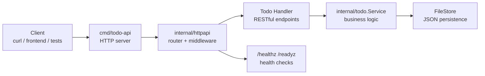
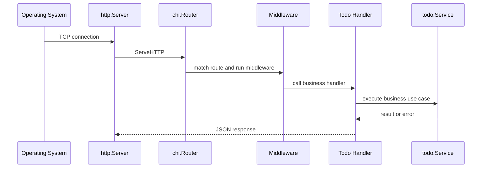
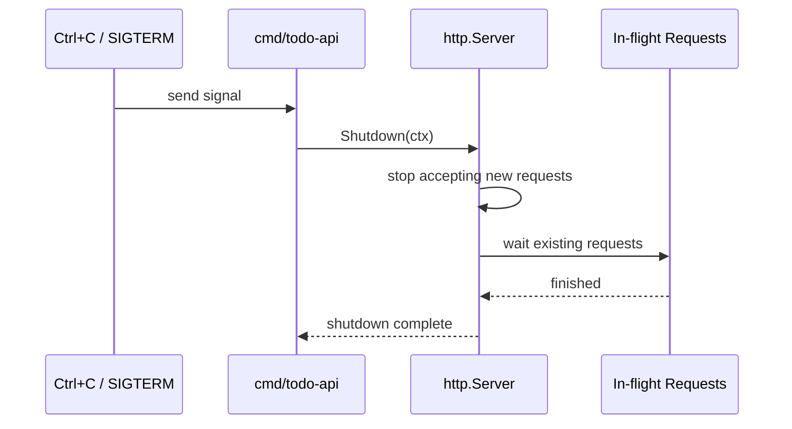

# 第 10 篇：Go Web API 开发

第 9 篇已经把 Todo 平台整理成了 Go 后端工程骨架：有 `cmd/todo-api` 启动入口，有 `internal/config` 配置管理，有 `internal/logger` 结构化日志，也有 `internal/todo.Service` 业务服务层。

但到目前为止，`todo-api` 还只是一个能启动并打印统计信息的后端骨架。真实后端服务必须能通过 HTTP 对外提供能力，让前端、移动端、自动化脚本、其他微服务都能通过统一接口访问 Todo 数据。

本篇特色项目是：**开发 Todo Platform API v1，支持 Todo CRUD**。

你会在上一篇工程骨架上新增 `internal/httpapi` 包，使用 `chi` 构建 RESTful API，提供统一 JSON 响应、请求绑定、参数校验、错误码、健康检查、API 文档和优雅关闭。完成后，`todo-api` 会从“后端启动骨架”升级为“可运行、可测试、可维护的 Web API 服务”。

本篇对应 5 个章节主题：

- 10.1 HTTP 协议与 Web 服务基础
- 10.2 Gin / Chi 路由、中间件与请求绑定
- 10.3 RESTful API 设计与统一响应格式
- 10.4 参数校验、错误码与异常处理
- 10.5 健康检查、优雅关闭与 API 文档

## 1. 本章学习目标

学完本篇后，你应该能独立开发一个中小型 Go RESTful API 服务。

具体目标如下：

- 能解释 HTTP 方法、路径、状态码、Header、Body 的作用。
- 能理解 Web 框架解决了什么问题，以及 Gin 和 Chi 的常见差异。
- 能使用 Chi 定义路由、路由组和中间件。
- 能用标准库 `encoding/json` 完成请求绑定和响应编码。
- 能设计 RESTful Todo API 路径和语义。
- 能实现统一响应格式和统一错误响应。
- 能完成 Todo 的新增、查询、更新、完成、删除接口。
- 能通过查询参数过滤 Todo 状态。
- 能实现 `/healthz` 和 `/readyz` 健康检查接口。
- 能用 `httptest` 编写 Handler 测试。
- 能让 HTTP server 支持 `SIGTERM` 优雅关闭。
- 能写出最小可用 API 文档，方便前端和测试协作。

本篇结束时，你至少应该能独立完成下面命令组合：

```bash
go mod tidy
go fmt ./...
go test ./...
go build ./cmd/todo-api
go run ./cmd/todo-api
curl -s http://127.0.0.1:8080/healthz
curl -s -X POST http://127.0.0.1:8080/api/v1/todos -H 'Content-Type: application/json' -d '{"title":"learn Go Web API"}'
curl -s http://127.0.0.1:8080/api/v1/todos
```

这些能力会直接支撑后续数据库持久化、Redis 缓存、Docker 镜像、Kubernetes Deployment、Service、Ingress、探针和 Operator 管理能力。

## 2. 本章工作场景

真实公司里的后端服务通常不是给人手动运行命令用的，而是通过 HTTP API 被其他系统调用。

常见工作场景包括：

- 前端页面调用 `POST /api/v1/todos` 创建 Todo。
- 移动端调用 `GET /api/v1/todos?status=pending` 展示未完成任务。
- 测试工程师根据 API 文档编写接口测试。
- 网关、负载均衡或 Kubernetes 探针调用 `/healthz` 和 `/readyz` 判断服务是否可用。
- SRE 通过请求日志、状态码和错误码定位接口失败原因。
- 后端团队通过统一响应格式降低前后端联调成本。
- 平台团队把 API 服务容器化后部署到 Kubernetes，并依赖优雅关闭减少滚动更新时的请求中断。

本篇会把第 9 篇工程骨架演进为下面结构：



学习本篇时要记住一条主线：Web API 不是把函数暴露出去就结束了。它还要考虑协议语义、错误表达、输入校验、日志、测试、关闭流程和后续部署形态。

## 3. 前置知识

学习本篇前，建议已经完成：

- 第 7 篇：Go 语言基础，理解结构体、方法、interface、error 和 Go module。
- 第 8 篇：Go 并发编程，理解 `context`、超时取消和 goroutine 生命周期。
- 第 9 篇：Go 工程化与测试，已经具备 `cmd/todo-api`、`internal/config`、`internal/logger`、`internal/app` 和 `internal/todo.Service`。
- 阶段一 Linux 网络基础，理解端口、监听地址、`curl`、`ss` 或 `netstat`。

必须掌握：

- Go 1.21 或更高版本。
- 能在 Go module 根目录运行 `go test ./...`。
- 能理解 JSON 基本格式。
- 能使用 `curl` 发送 GET、POST、PUT、DELETE 请求。
- 能区分 HTTP 2xx、4xx、5xx 状态码的大致含义。

建议了解：

- 前后端为什么需要 API 文档。
- Kubernetes 为什么需要健康检查。
- 网关和负载均衡为什么依赖状态码判断请求结果。

本篇会引入一个外部依赖：

```text
github.com/go-chi/chi/v5 v5.3.0
```

选择 Chi 作为主线，是因为它贴近 Go 标准库 `net/http`，学习成本低，适合从原理过渡到工程实践。Gin 也会讲到，但本篇不同时实现 Gin 和 Chi 两套代码，避免学习者在框架差异中分心。

## 4. 核心概念

### 4.1 HTTP 请求与响应

HTTP 是客户端和服务端交换数据的协议。一次请求通常包含：

- Method：动作，例如 `GET`、`POST`、`PUT`、`DELETE`。
- Path：资源路径，例如 `/api/v1/todos/1`。
- Query：查询参数，例如 `?status=pending`。
- Header：元信息，例如 `Content-Type: application/json`。
- Body：请求体，例如 JSON 数据。

一次响应通常包含：

- Status Code：状态码，例如 `200`、`201`、`400`、`404`、`500`。
- Header：响应元信息。
- Body：响应数据，常见格式是 JSON。

Todo API 的典型交互如下：

```text
POST /api/v1/todos
Content-Type: application/json

{"title":"learn Go Web API"}
```

服务端返回：

```json
{
  "data": {
    "id": 1,
    "title": "learn Go Web API",
    "status": "pending"
  }
}
```

### 4.2 RESTful API

RESTful API 的核心思想是：用 URL 表达资源，用 HTTP 方法表达动作。

本篇 Todo API 设计如下：

| 方法 | 路径 | 含义 |
|---|---|---|
| `GET` | `/healthz` | 进程存活检查 |
| `GET` | `/readyz` | 服务就绪检查 |
| `GET` | `/api/v1/todos` | 查询 Todo 列表 |
| `POST` | `/api/v1/todos` | 创建 Todo |
| `GET` | `/api/v1/todos/{id}` | 查询单个 Todo |
| `PUT` | `/api/v1/todos/{id}` | 更新 Todo 标题 |
| `POST` | `/api/v1/todos/{id}/done` | 标记 Todo 完成 |
| `DELETE` | `/api/v1/todos/{id}` | 删除 Todo |

注意 `done` 这里使用 `POST /todos/{id}/done`，是为了表达一个业务动作。也可以设计成 `PATCH /todos/{id}` 更新状态，但本篇先选择更容易理解和测试的动作接口。

### 4.3 Gin 与 Chi

Gin 和 Chi 都是 Go 生态中常见的 Web 框架。

| 对比项 | Gin | Chi |
|---|---|---|
| 风格 | 功能完整，内置绑定、渲染、中间件较多 | 轻量，贴近 `net/http` |
| Handler 形态 | `func(*gin.Context)` | 标准 `http.Handler` / `http.HandlerFunc` |
| 学习重点 | 框架能力和开发效率 | HTTP 原理和组合方式 |
| 适合场景 | 快速开发业务 API | 想保留标准库风格、便于测试和组合 |

本篇使用 Chi，原因是：

- 它直接兼容标准库 `http.Handler`。
- `httptest` 测试非常自然。
- 中间件就是标准 HTTP 中间件。
- 后续接入 Kubernetes 探针、pprof、metrics 时更容易理解底层机制。

企业项目中选择 Gin 或 Chi 都可以，关键不在“哪个框架更高级”，而在团队是否能保持清晰路由、统一错误、稳定测试和可观测性。

### 4.4 中间件

中间件是在请求进入业务 Handler 前后执行的一段逻辑。

常见中间件包括：

- 请求日志。
- panic 恢复。
- Request ID。
- 超时控制。
- CORS。
- 认证鉴权。
- 指标采集。

简化后的中间件形态如下：

```go
func middleware(next http.Handler) http.Handler {
	return http.HandlerFunc(func(w http.ResponseWriter, r *http.Request) {
		// 请求前逻辑
		next.ServeHTTP(w, r)
		// 请求后逻辑
	})
}
```

本篇会实现请求日志中间件，记录方法、路径、状态码和耗时。

### 4.5 请求绑定与参数校验

请求绑定是把 JSON 请求体解析成 Go 结构体：

```go
type createTodoRequest struct {
	Title string `json:"title"`
}
```

参数校验是判断请求是否符合业务要求：

- `title` 不能为空。
- `id` 必须是正整数。
- `status` 只能是 `pending`、`done` 或空。
- JSON 格式必须合法。
- JSON 请求必须声明 `Content-Type: application/json`。
- 请求体大小必须有上限，避免超大 body 占用内存。

校验失败应该返回 4xx，而不是 500。因为这是客户端请求不合法，不是服务端崩了。

### 4.6 统一响应格式

统一响应格式可以降低前端、测试和调用方的理解成本。

本篇成功响应格式：

```json
{
  "data": {}
}
```

错误响应格式：

```json
{
  "error": {
    "code": "invalid_request",
    "message": "request body is invalid"
  }
}
```

这里的 `code` 面向程序判断，`message` 面向人阅读。生产项目中还可以增加 `request_id`、`details`、`trace_id` 等字段。

## 5. 原理深入

### 5.1 HTTP Server 运行流程

Go HTTP 服务的核心流程如下：



`http.Server` 负责监听端口和处理连接，Router 负责把不同路径分发给不同 Handler，Handler 负责协议转换，Service 负责业务逻辑。

不要把业务规则写在 Handler 里。Handler 应该主要做三件事：

- 解析请求。
- 调用服务层。
- 写出响应。

### 5.2 Handler 与 Service 的边界

Handler 层关心 HTTP：

- URL 参数。
- Query 参数。
- JSON 请求体。
- 状态码。
- Header。
- 响应格式。

Service 层关心业务：

- Todo 标题不能为空。
- Todo 是否存在。
- Todo 状态如何统计。
- 存储失败如何包装错误。

如果把这两个层次混在一起，后续会出现两个问题：

- Web API 难测试，因为必须通过 HTTP 才能验证业务。
- 业务逻辑难复用，因为 CLI、后台任务、Operator controller 都不应该依赖 HTTP。

### 5.3 状态码设计

状态码不是随便选的。

| 状态码 | 使用场景 |
|---|---|
| `200 OK` | 查询、更新、完成等成功返回 |
| `201 Created` | 创建资源成功 |
| `204 No Content` | 删除成功且不返回 body |
| `400 Bad Request` | JSON 错误、参数非法 |
| `413 Payload Too Large` | 请求体超过服务端允许大小 |
| `415 Unsupported Media Type` | 请求体类型不是 `application/json` |
| `404 Not Found` | Todo 不存在 |
| `405 Method Not Allowed` | 路径存在但方法不允许 |
| `500 Internal Server Error` | 服务端内部错误 |

清晰状态码能让调用方快速判断问题属于客户端还是服务端，也方便网关和监控按状态码统计错误率。

### 5.4 优雅关闭

服务关闭时，如果直接退出进程，正在处理的请求可能被中断。

优雅关闭流程如下：



在 Kubernetes 中，滚动更新或删除 Pod 时通常会发送 `SIGTERM`。服务应该停止接收新请求，并在宽限期内完成已有请求。

### 5.5 健康检查与就绪检查

健康检查通常分两类：

- `/healthz`：进程是否活着。
- `/readyz`：服务是否准备好接收流量。

本篇先用文件存储，所以 `/readyz` 会尝试读取 Todo 统计，验证服务层和数据路径可用。后续接入数据库后，`/readyz` 会继续扩展为数据库连接、缓存连接、依赖服务状态检查。

### 5.6 API 文档的最小闭环

API 文档不是一定要一开始就上 Swagger 或 OpenAPI。最小可用文档至少要说明：

- 方法和路径。
- 请求参数。
- 请求示例。
- 响应示例。
- 错误码。

本篇会新增 `docs/api/todo-api-v1.md` 作为项目内 API 文档。后续 CI/CD 或平台化阶段，可以再演进到 OpenAPI 规范和自动生成文档。

## 6. 手把手实验

### 6.1 实验目标

本实验会把第 9 篇的 `todo-api` 改造成真正的 HTTP API 服务。

你会完成：

- 引入 `github.com/go-chi/chi/v5`。
- 新增 `internal/httpapi` 包。
- 实现路由、中间件、统一响应和错误处理。
- 实现 Todo CRUD API。
- 实现 `/healthz` 和 `/readyz`。
- 修改 `internal/app`，让应用启动 HTTP server。
- 修改 `cmd/todo-api`，支持优雅关闭。
- 编写 Handler 单元测试。
- 新增 API 文档 `docs/api/todo-api-v1.md`。

本篇不涉及 Kubernetes YAML。HTTP 服务会先在本地进程中跑通；后续 Docker 和 Kubernetes 章节会继续补充 Dockerfile、Deployment、Service、Ingress、ConfigMap、Secret、探针和滚动更新。

### 6.2 实验环境

请在第 9 篇同一个 Go module 根目录执行命令。

=== "Linux / macOS / WSL2"

    ```bash
    cd ~/workspace/cloud-native-todo-platform
    go env GOMOD
    go version
    ```

=== "Windows PowerShell"

    ```powershell
    cd D:\workspace\cloud-native-todo-platform
    go env GOMOD
    go version
    ```

预期 `go env GOMOD` 指向当前项目的 `go.mod`。如果输出为空，说明你没有站在 module 根目录。

### 6.3 安装 Chi

执行：

```bash
go get github.com/go-chi/chi/v5@v5.3.0
```

执行后，`go.mod` 会增加类似内容：

```go title="go.mod"
module cloud-native-todo-platform

go 1.21

require github.com/go-chi/chi/v5 v5.3.0
```

如果你的本地 Go 版本较新，`go` 行可能是 `1.22`、`1.23` 或更高。这没有问题。课程要求 Go 1.21+，是因为第 9 篇开始使用标准库 `log/slog`。

### 6.4 创建目录

=== "Linux / macOS / WSL2"

    ```bash
    mkdir -p internal/httpapi docs/api
    ```

=== "Windows PowerShell"

    ```powershell
    New-Item -ItemType Directory -Force internal\httpapi, docs\api
    ```

新增结构如下：

```text
cloud-native-todo-platform/
├── cmd/
│   └── todo-api/
├── docs/
│   └── api/
│       └── todo-api-v1.md
├── internal/
│   ├── app/
│   ├── config/
│   ├── httpapi/
│   └── todo/
```

### 6.5 补充 Todo 服务层 CRUD 能力

第 9 篇的服务层只有 `Create`、`List` 和 `Stats`。Web API 需要查询单个、更新、完成和删除能力。

修改 `internal/todo/service.go`：

```go title="internal/todo/service.go"
package todo

import (
	"context"
	"fmt"
	"log/slog"
	"strings"
)

type Service struct {
	repo   Repository
	logger *slog.Logger
}

type CreateRequest struct {
	Title string
}

type UpdateRequest struct {
	Title string
}

type ListRequest struct {
	Status Status
}

type Stats struct {
	Total   int `json:"total"`
	Done    int `json:"done"`
	Pending int `json:"pending"`
}

func NewService(repo Repository, logger *slog.Logger) *Service {
	if logger == nil {
		logger = slog.Default()
	}
	return &Service{
		repo:   repo,
		logger: logger,
	}
}

func (s *Service) Create(ctx context.Context, req CreateRequest) (Item, error) {
	if err := checkContext(ctx); err != nil {
		return Item{}, err
	}

	title := strings.TrimSpace(req.Title)
	if title == "" {
		return Item{}, ErrEmptyTitle
	}

	item, err := s.repo.Add(title)
	if err != nil {
		return Item{}, fmt.Errorf("create todo: %w", err)
	}

	s.logger.Info("todo created", "id", item.ID, "title", item.Title)
	return item, nil
}

func (s *Service) List(ctx context.Context, req ListRequest) ([]Item, error) {
	if err := checkContext(ctx); err != nil {
		return nil, err
	}

	items, err := s.repo.List()
	if err != nil {
		return nil, fmt.Errorf("list todos: %w", err)
	}

	if req.Status == "" {
		return items, nil
	}

	filtered := make([]Item, 0, len(items))
	for _, item := range items {
		if item.Status == req.Status {
			filtered = append(filtered, item)
		}
	}

	return filtered, nil
}

func (s *Service) Get(ctx context.Context, id int) (Item, error) {
	if err := checkContext(ctx); err != nil {
		return Item{}, err
	}
	if id <= 0 {
		return Item{}, ErrNotFound
	}

	items, err := s.repo.List()
	if err != nil {
		return Item{}, fmt.Errorf("get todo %d: %w", id, err)
	}

	for _, item := range items {
		if item.ID == id {
			return item, nil
		}
	}
	return Item{}, ErrNotFound
}

func (s *Service) Update(ctx context.Context, id int, req UpdateRequest) (Item, error) {
	if err := checkContext(ctx); err != nil {
		return Item{}, err
	}

	title := strings.TrimSpace(req.Title)
	if title == "" {
		return Item{}, ErrEmptyTitle
	}

	item, err := s.repo.Update(id, title)
	if err != nil {
		return Item{}, fmt.Errorf("update todo %d: %w", id, err)
	}

	s.logger.Info("todo updated", "id", item.ID)
	return item, nil
}

func (s *Service) Done(ctx context.Context, id int) (Item, error) {
	if err := checkContext(ctx); err != nil {
		return Item{}, err
	}

	item, err := s.repo.Done(id)
	if err != nil {
		return Item{}, fmt.Errorf("mark todo %d done: %w", id, err)
	}

	s.logger.Info("todo marked done", "id", item.ID)
	return item, nil
}

func (s *Service) Delete(ctx context.Context, id int) error {
	if err := checkContext(ctx); err != nil {
		return err
	}

	if err := s.repo.Delete(id); err != nil {
		return fmt.Errorf("delete todo %d: %w", id, err)
	}

	s.logger.Info("todo deleted", "id", id)
	return nil
}

func (s *Service) Stats(ctx context.Context) (Stats, error) {
	items, err := s.List(ctx, ListRequest{})
	if err != nil {
		return Stats{}, err
	}

	stats := Stats{Total: len(items)}
	for _, item := range items {
		switch item.Status {
		case StatusDone:
			stats.Done++
		default:
			stats.Pending++
		}
	}

	return stats, nil
}

func checkContext(ctx context.Context) error {
	if ctx == nil {
		return nil
	}

	select {
	case <-ctx.Done():
		return ctx.Err()
	default:
		return nil
	}
}
```

关键变化：

- `UpdateRequest` 用于更新标题。
- `Stats` 增加 JSON tag，方便健康检查返回。
- `Get` 通过 `repo.List` 查找单个 Todo。
- `Update`、`Done`、`Delete` 调用第 7 篇已有 `Repository` 方法。
- Handler 不直接操作 `FileStore`，所有业务动作都通过 `Service`。

### 6.6 编写 HTTP API 类型

创建 `internal/httpapi/types.go`：

```go title="internal/httpapi/types.go"
package httpapi

import "cloud-native-todo-platform/internal/todo"

type response struct {
	Data any `json:"data,omitempty"`
}

type errorResponse struct {
	Error apiError `json:"error"`
}

type apiError struct {
	Code    string `json:"code"`
	Message string `json:"message"`
}

type createTodoRequest struct {
	Title string `json:"title"`
}

type updateTodoRequest struct {
	Title string `json:"title"`
}

type todoResponse struct {
	ID        int         `json:"id"`
	Title     string      `json:"title"`
	Status    todo.Status `json:"status"`
	CreatedAt string      `json:"created_at"`
	UpdatedAt string      `json:"updated_at"`
}

type listTodosResponse struct {
	Items []todoResponse `json:"items"`
}

type healthResponse struct {
	Status string `json:"status"`
}

type readinessResponse struct {
	Status string     `json:"status"`
	Stats  todo.Stats `json:"stats"`
}

func newTodoResponse(item todo.Item) todoResponse {
	return todoResponse{
		ID:        item.ID,
		Title:     item.Title,
		Status:    item.Status,
		CreatedAt: item.CreatedAt.Format("2006-01-02T15:04:05Z07:00"),
		UpdatedAt: item.UpdatedAt.Format("2006-01-02T15:04:05Z07:00"),
	}
}
```

这里没有直接把 `todo.Item` 原样返回给外部调用方，而是定义了 API 响应模型。这样做的好处是：内部领域对象以后可以变化，外部 API 契约仍然保持稳定。

### 6.7 编写响应和错误处理

创建 `internal/httpapi/respond.go`：

```go title="internal/httpapi/respond.go"
package httpapi

import (
	"encoding/json"
	"errors"
	"log/slog"
	"net/http"

	"cloud-native-todo-platform/internal/todo"
)

const (
	errorCodeInvalidRequest       = "invalid_request"
	errorCodeUnsupportedMediaType = "unsupported_media_type"
	errorCodeRequestTooLarge      = "request_body_too_large"
	errorCodeNotFound             = "not_found"
	errorCodeInternal             = "internal_error"
)

func writeJSON(w http.ResponseWriter, status int, payload any) {
	w.Header().Set("Content-Type", "application/json; charset=utf-8")
	w.WriteHeader(status)
	if payload == nil {
		return
	}
	if err := json.NewEncoder(w).Encode(payload); err != nil {
		slog.Default().Error("encode json response", "error", err)
	}
}

func writeData(w http.ResponseWriter, status int, data any) {
	writeJSON(w, status, response{Data: data})
}

func writeError(w http.ResponseWriter, status int, code string, message string) {
	writeJSON(w, status, errorResponse{
		Error: apiError{
			Code:    code,
			Message: message,
		},
	})
}

func writeServiceError(w http.ResponseWriter, err error) {
	switch {
	case errors.Is(err, todo.ErrEmptyTitle):
		writeError(w, http.StatusBadRequest, errorCodeInvalidRequest, "title is required")
	case errors.Is(err, todo.ErrNotFound):
		writeError(w, http.StatusNotFound, errorCodeNotFound, "todo not found")
	default:
		writeError(w, http.StatusInternalServerError, errorCodeInternal, "internal server error")
	}
}
```

这里把错误映射集中在一个地方，避免每个 Handler 各自决定状态码和错误格式。`writeJSON` 也会记录响应编码错误，虽然当前返回结构体几乎不会触发这个问题，但公共工具函数应该养成不静默吞错的习惯。

### 6.8 编写中间件

创建 `internal/httpapi/middleware.go`：

```go title="internal/httpapi/middleware.go"
package httpapi

import (
	"log/slog"
	"net/http"
	"time"
)

type statusRecorder struct {
	http.ResponseWriter
	status int
}

func (r *statusRecorder) WriteHeader(status int) {
	r.status = status
	r.ResponseWriter.WriteHeader(status)
}

func requestLogger(logger *slog.Logger) func(http.Handler) http.Handler {
	if logger == nil {
		logger = slog.Default()
	}

	return func(next http.Handler) http.Handler {
		return http.HandlerFunc(func(w http.ResponseWriter, r *http.Request) {
			start := time.Now()
			recorder := &statusRecorder{
				ResponseWriter: w,
				status:         http.StatusOK,
			}

			next.ServeHTTP(recorder, r)

			logger.Info(
				"http request",
				"method", r.Method,
				"path", r.URL.Path,
				"status", recorder.status,
				"duration_ms", time.Since(start).Milliseconds(),
			)
		})
	}
}
```

生产项目中请求日志通常还会记录 `request_id`、`remote_addr`、`user_agent`、`trace_id`。本篇先保留最小字段，避免一开始就把可观测体系讲得过重。

### 6.9 编写路由

创建 `internal/httpapi/router.go`：

```go title="internal/httpapi/router.go"
package httpapi

import (
	"log/slog"
	"net/http"
	"time"

	"github.com/go-chi/chi/v5"
	"github.com/go-chi/chi/v5/middleware"

	"cloud-native-todo-platform/internal/todo"
)

type Server struct {
	todos  *todo.Service
	logger *slog.Logger
}

func NewRouter(todos *todo.Service, logger *slog.Logger) http.Handler {
	server := &Server{
		todos:  todos,
		logger: logger,
	}

	r := chi.NewRouter()
	r.Use(middleware.Recoverer)
	r.Use(middleware.Timeout(10 * time.Second))
	r.Use(requestLogger(logger))

	r.Get("/healthz", server.healthz)
	r.Get("/readyz", server.readyz)

	r.Route("/api/v1", func(r chi.Router) {
		r.Get("/todos", server.listTodos)
		r.Post("/todos", server.createTodo)
		r.Get("/todos/{id}", server.getTodo)
		r.Put("/todos/{id}", server.updateTodo)
		r.Post("/todos/{id}/done", server.doneTodo)
		r.Delete("/todos/{id}", server.deleteTodo)
	})

	r.NotFound(func(w http.ResponseWriter, r *http.Request) {
		writeError(w, http.StatusNotFound, errorCodeNotFound, "route not found")
	})

	r.MethodNotAllowed(func(w http.ResponseWriter, r *http.Request) {
		writeError(w, http.StatusMethodNotAllowed, errorCodeInvalidRequest, "method not allowed")
	})

	return r
}
```

路由设计说明：

- 健康检查放在根路径，方便 Kubernetes 探针和负载均衡访问。
- 业务接口放在 `/api/v1` 下，为未来 v2 版本预留空间。
- `middleware.Recoverer` 防止 panic 直接打崩进程。
- `middleware.Timeout` 给单个请求设置上限。
- 自定义 `requestLogger` 记录请求日志。

### 6.10 编写 Todo Handler

创建 `internal/httpapi/handlers.go`：

```go title="internal/httpapi/handlers.go"
package httpapi

import (
	"encoding/json"
	"errors"
	"io"
	"mime"
	"net/http"
	"strconv"
	"strings"

	"github.com/go-chi/chi/v5"

	"cloud-native-todo-platform/internal/todo"
)

const maxRequestBodyBytes = 1 << 20

func (s *Server) healthz(w http.ResponseWriter, r *http.Request) {
	writeData(w, http.StatusOK, healthResponse{Status: "ok"})
}

func (s *Server) readyz(w http.ResponseWriter, r *http.Request) {
	stats, err := s.todos.Stats(r.Context())
	if err != nil {
		writeServiceError(w, err)
		return
	}
	writeData(w, http.StatusOK, readinessResponse{Status: "ready", Stats: stats})
}

func (s *Server) listTodos(w http.ResponseWriter, r *http.Request) {
	status, ok := parseStatus(w, r)
	if !ok {
		return
	}

	items, err := s.todos.List(r.Context(), todo.ListRequest{Status: status})
	if err != nil {
		writeServiceError(w, err)
		return
	}

	result := make([]todoResponse, 0, len(items))
	for _, item := range items {
		result = append(result, newTodoResponse(item))
	}

	writeData(w, http.StatusOK, listTodosResponse{Items: result})
}

func (s *Server) createTodo(w http.ResponseWriter, r *http.Request) {
	var req createTodoRequest
	if !decodeJSON(w, r, &req) {
		return
	}

	item, err := s.todos.Create(r.Context(), todo.CreateRequest{Title: req.Title})
	if err != nil {
		writeServiceError(w, err)
		return
	}

	writeData(w, http.StatusCreated, newTodoResponse(item))
}

func (s *Server) getTodo(w http.ResponseWriter, r *http.Request) {
	id, ok := parseID(w, r)
	if !ok {
		return
	}

	item, err := s.todos.Get(r.Context(), id)
	if err != nil {
		writeServiceError(w, err)
		return
	}

	writeData(w, http.StatusOK, newTodoResponse(item))
}

func (s *Server) updateTodo(w http.ResponseWriter, r *http.Request) {
	id, ok := parseID(w, r)
	if !ok {
		return
	}

	var req updateTodoRequest
	if !decodeJSON(w, r, &req) {
		return
	}

	item, err := s.todos.Update(r.Context(), id, todo.UpdateRequest{Title: req.Title})
	if err != nil {
		writeServiceError(w, err)
		return
	}

	writeData(w, http.StatusOK, newTodoResponse(item))
}

func (s *Server) doneTodo(w http.ResponseWriter, r *http.Request) {
	id, ok := parseID(w, r)
	if !ok {
		return
	}

	item, err := s.todos.Done(r.Context(), id)
	if err != nil {
		writeServiceError(w, err)
		return
	}

	writeData(w, http.StatusOK, newTodoResponse(item))
}

func (s *Server) deleteTodo(w http.ResponseWriter, r *http.Request) {
	id, ok := parseID(w, r)
	if !ok {
		return
	}

	if err := s.todos.Delete(r.Context(), id); err != nil {
		writeServiceError(w, err)
		return
	}

	writeJSON(w, http.StatusNoContent, nil)
}

func decodeJSON(w http.ResponseWriter, r *http.Request, dst any) bool {
	defer r.Body.Close()

	mediaType, _, err := mime.ParseMediaType(r.Header.Get("Content-Type"))
	if err != nil || !strings.EqualFold(mediaType, "application/json") {
		writeError(w, http.StatusUnsupportedMediaType, errorCodeUnsupportedMediaType, "content type must be application/json")
		return false
	}

	r.Body = http.MaxBytesReader(w, r.Body, maxRequestBodyBytes)
	decoder := json.NewDecoder(r.Body)
	decoder.DisallowUnknownFields()

	if err := decoder.Decode(dst); err != nil {
		var maxBytesErr *http.MaxBytesError
		if errors.As(err, &maxBytesErr) {
			writeError(w, http.StatusRequestEntityTooLarge, errorCodeRequestTooLarge, "request body is too large")
			return false
		}
		writeError(w, http.StatusBadRequest, errorCodeInvalidRequest, "request body is invalid")
		return false
	}

	if err := decoder.Decode(&struct{}{}); err == nil {
		writeError(w, http.StatusBadRequest, errorCodeInvalidRequest, "request body must contain only one JSON object")
		return false
	} else if !errors.Is(err, io.EOF) {
		writeError(w, http.StatusBadRequest, errorCodeInvalidRequest, "request body is invalid")
		return false
	}

	return true
}

func parseID(w http.ResponseWriter, r *http.Request) (int, bool) {
	raw := chi.URLParam(r, "id")
	id, err := strconv.Atoi(raw)
	if err != nil || id <= 0 {
		writeError(w, http.StatusBadRequest, errorCodeInvalidRequest, "id must be a positive integer")
		return 0, false
	}
	return id, true
}

func parseStatus(w http.ResponseWriter, r *http.Request) (todo.Status, bool) {
	raw := strings.TrimSpace(r.URL.Query().Get("status"))
	if raw == "" {
		return "", true
	}

	status := todo.Status(raw)
	switch status {
	case todo.StatusPending, todo.StatusDone:
		return status, true
	default:
		writeError(w, http.StatusBadRequest, errorCodeInvalidRequest, "status must be pending or done")
		return "", false
	}
}
```

### 6.11 编写 Handler 测试

创建 `internal/httpapi/router_test.go`：

```go title="internal/httpapi/router_test.go"
package httpapi

import (
	"bytes"
	"encoding/json"
	"log/slog"
	"net/http"
	"net/http/httptest"
	"strings"
	"testing"
	"time"

	"cloud-native-todo-platform/internal/todo"
)

func newTestRouter(t *testing.T) http.Handler {
	t.Helper()

	store := todo.NewFileStore(t.TempDir() + "/todos.json")
	store.Now = func() time.Time {
		return time.Date(2026, 5, 26, 10, 0, 0, 0, time.UTC)
	}
	logger := slog.New(slog.NewTextHandler(&bytes.Buffer{}, nil))
	service := todo.NewService(store, logger)
	return NewRouter(service, logger)
}

func TestHealthz(t *testing.T) {
	router := newTestRouter(t)

	req := httptest.NewRequest(http.MethodGet, "/healthz", nil)
	rec := httptest.NewRecorder()
	router.ServeHTTP(rec, req)

	if rec.Code != http.StatusOK {
		t.Fatalf("status = %d, want %d", rec.Code, http.StatusOK)
	}
	if !strings.Contains(rec.Body.String(), `"status":"ok"`) {
		t.Fatalf("body = %s", rec.Body.String())
	}
}

func TestTodoCRUD(t *testing.T) {
	router := newTestRouter(t)

	createBody := strings.NewReader(`{"title":"learn Go Web API"}`)
	createReq := httptest.NewRequest(http.MethodPost, "/api/v1/todos", createBody)
	createReq.Header.Set("Content-Type", "application/json")
	createRec := httptest.NewRecorder()
	router.ServeHTTP(createRec, createReq)

	if createRec.Code != http.StatusCreated {
		t.Fatalf("create status = %d, body = %s", createRec.Code, createRec.Body.String())
	}

	var created response
	if err := json.Unmarshal(createRec.Body.Bytes(), &created); err != nil {
		t.Fatalf("decode create response: %v", err)
	}

	listReq := httptest.NewRequest(http.MethodGet, "/api/v1/todos", nil)
	listRec := httptest.NewRecorder()
	router.ServeHTTP(listRec, listReq)
	if listRec.Code != http.StatusOK {
		t.Fatalf("list status = %d, body = %s", listRec.Code, listRec.Body.String())
	}
	if !strings.Contains(listRec.Body.String(), "learn Go Web API") {
		t.Fatalf("list body = %s", listRec.Body.String())
	}

	updateReq := httptest.NewRequest(http.MethodPut, "/api/v1/todos/1", strings.NewReader(`{"title":"learn RESTful API"}`))
	updateReq.Header.Set("Content-Type", "application/json")
	updateRec := httptest.NewRecorder()
	router.ServeHTTP(updateRec, updateReq)
	if updateRec.Code != http.StatusOK {
		t.Fatalf("update status = %d, body = %s", updateRec.Code, updateRec.Body.String())
	}

	doneReq := httptest.NewRequest(http.MethodPost, "/api/v1/todos/1/done", nil)
	doneRec := httptest.NewRecorder()
	router.ServeHTTP(doneRec, doneReq)
	if doneRec.Code != http.StatusOK {
		t.Fatalf("done status = %d, body = %s", doneRec.Code, doneRec.Body.String())
	}

	filterReq := httptest.NewRequest(http.MethodGet, "/api/v1/todos?status=done", nil)
	filterRec := httptest.NewRecorder()
	router.ServeHTTP(filterRec, filterReq)
	if filterRec.Code != http.StatusOK {
		t.Fatalf("filter status = %d, body = %s", filterRec.Code, filterRec.Body.String())
	}
	if !strings.Contains(filterRec.Body.String(), `"status":"done"`) {
		t.Fatalf("filter body = %s", filterRec.Body.String())
	}

	deleteReq := httptest.NewRequest(http.MethodDelete, "/api/v1/todos/1", nil)
	deleteRec := httptest.NewRecorder()
	router.ServeHTTP(deleteRec, deleteReq)
	if deleteRec.Code != http.StatusNoContent {
		t.Fatalf("delete status = %d, body = %s", deleteRec.Code, deleteRec.Body.String())
	}
}

func TestCreateTodoValidationError(t *testing.T) {
	router := newTestRouter(t)

	req := httptest.NewRequest(http.MethodPost, "/api/v1/todos", strings.NewReader(`{"title":"   "}`))
	req.Header.Set("Content-Type", "application/json")
	rec := httptest.NewRecorder()
	router.ServeHTTP(rec, req)

	if rec.Code != http.StatusBadRequest {
		t.Fatalf("status = %d, body = %s", rec.Code, rec.Body.String())
	}
	if !strings.Contains(rec.Body.String(), errorCodeInvalidRequest) {
		t.Fatalf("body = %s", rec.Body.String())
	}
}

func TestCreateTodoRejectsUnsupportedContentType(t *testing.T) {
	router := newTestRouter(t)

	req := httptest.NewRequest(http.MethodPost, "/api/v1/todos", strings.NewReader(`{"title":"learn Go"}`))
	req.Header.Set("Content-Type", "text/plain")
	rec := httptest.NewRecorder()
	router.ServeHTTP(rec, req)

	if rec.Code != http.StatusUnsupportedMediaType {
		t.Fatalf("status = %d, body = %s", rec.Code, rec.Body.String())
	}
	if !strings.Contains(rec.Body.String(), errorCodeUnsupportedMediaType) {
		t.Fatalf("body = %s", rec.Body.String())
	}
}

func TestCreateTodoRejectsUnknownField(t *testing.T) {
	router := newTestRouter(t)

	req := httptest.NewRequest(http.MethodPost, "/api/v1/todos", strings.NewReader(`{"title":"learn Go","extra":true}`))
	req.Header.Set("Content-Type", "application/json")
	rec := httptest.NewRecorder()
	router.ServeHTTP(rec, req)

	if rec.Code != http.StatusBadRequest {
		t.Fatalf("status = %d, body = %s", rec.Code, rec.Body.String())
	}
}

func TestCreateTodoRejectsMultipleJSONObjects(t *testing.T) {
	router := newTestRouter(t)

	req := httptest.NewRequest(http.MethodPost, "/api/v1/todos", strings.NewReader(`{"title":"one"}{"title":"two"}`))
	req.Header.Set("Content-Type", "application/json")
	rec := httptest.NewRecorder()
	router.ServeHTTP(rec, req)

	if rec.Code != http.StatusBadRequest {
		t.Fatalf("status = %d, body = %s", rec.Code, rec.Body.String())
	}
}

func TestCreateTodoRejectsTooLargeBody(t *testing.T) {
	router := newTestRouter(t)

	body := `{"title":"` + strings.Repeat("a", maxRequestBodyBytes) + `"}`
	req := httptest.NewRequest(http.MethodPost, "/api/v1/todos", strings.NewReader(body))
	req.Header.Set("Content-Type", "application/json")
	rec := httptest.NewRecorder()
	router.ServeHTTP(rec, req)

	if rec.Code != http.StatusRequestEntityTooLarge {
		t.Fatalf("status = %d, body = %s", rec.Code, rec.Body.String())
	}
	if !strings.Contains(rec.Body.String(), errorCodeRequestTooLarge) {
		t.Fatalf("body = %s", rec.Body.String())
	}
}

func TestGetTodoNotFound(t *testing.T) {
	router := newTestRouter(t)

	req := httptest.NewRequest(http.MethodGet, "/api/v1/todos/404", nil)
	rec := httptest.NewRecorder()
	router.ServeHTTP(rec, req)

	if rec.Code != http.StatusNotFound {
		t.Fatalf("status = %d, body = %s", rec.Code, rec.Body.String())
	}
}

func TestInvalidTodoID(t *testing.T) {
	router := newTestRouter(t)

	req := httptest.NewRequest(http.MethodGet, "/api/v1/todos/not-a-number", nil)
	rec := httptest.NewRecorder()
	router.ServeHTTP(rec, req)

	if rec.Code != http.StatusBadRequest {
		t.Fatalf("status = %d, body = %s", rec.Code, rec.Body.String())
	}
}

func TestDeleteTodoNotFound(t *testing.T) {
	router := newTestRouter(t)

	req := httptest.NewRequest(http.MethodDelete, "/api/v1/todos/404", nil)
	rec := httptest.NewRecorder()
	router.ServeHTTP(rec, req)

	if rec.Code != http.StatusNotFound {
		t.Fatalf("status = %d, body = %s", rec.Code, rec.Body.String())
	}
}

func TestInvalidStatusFilter(t *testing.T) {
	router := newTestRouter(t)

	req := httptest.NewRequest(http.MethodGet, "/api/v1/todos?status=archived", nil)
	rec := httptest.NewRecorder()
	router.ServeHTTP(rec, req)

	if rec.Code != http.StatusBadRequest {
		t.Fatalf("status = %d, body = %s", rec.Code, rec.Body.String())
	}
}

func TestRouteNotFound(t *testing.T) {
	router := newTestRouter(t)

	req := httptest.NewRequest(http.MethodGet, "/api/v1/missing", nil)
	rec := httptest.NewRecorder()
	router.ServeHTTP(rec, req)

	if rec.Code != http.StatusNotFound {
		t.Fatalf("status = %d, body = %s", rec.Code, rec.Body.String())
	}
}

func TestMethodNotAllowed(t *testing.T) {
	router := newTestRouter(t)

	req := httptest.NewRequest(http.MethodPatch, "/api/v1/todos/1", nil)
	rec := httptest.NewRecorder()
	router.ServeHTTP(rec, req)

	if rec.Code != http.StatusMethodNotAllowed {
		t.Fatalf("status = %d, body = %s", rec.Code, rec.Body.String())
	}
}
```

`httptest` 的价值是：不需要真的监听端口，也能完整验证路由、请求体、状态码和响应 JSON。本篇不仅测试成功路径，也测试错误路径，因为真实工作中的 API 质量往往取决于异常输入能否被稳定、可预期地处理。

### 6.12 改造应用组装层

修改 `internal/app/app.go`：

```go title="internal/app/app.go"
package app

import (
	"context"
	"errors"
	"fmt"
	"log/slog"
	"net"
	"net/http"
	"time"

	"cloud-native-todo-platform/internal/config"
	"cloud-native-todo-platform/internal/httpapi"
	"cloud-native-todo-platform/internal/todo"
)

type App struct {
	Config config.Config
	Logger *slog.Logger
	Todos  *todo.Service
}

func New(cfg config.Config, logger *slog.Logger) *App {
	store := todo.NewFileStore(cfg.DataPath)
	return &App{
		Config: cfg,
		Logger: logger,
		Todos:  todo.NewService(store, logger),
	}
}

func (a *App) Run(ctx context.Context) error {
	if a.Logger == nil {
		a.Logger = slog.Default()
	}

	stats, err := a.Todos.Stats(ctx)
	if err != nil {
		return fmt.Errorf("load todo stats during app startup: %w", err)
	}

	handler := httpapi.NewRouter(a.Todos, a.Logger)
	server := &http.Server{
		Addr:              a.Config.HTTPAddr,
		Handler:           handler,
		ReadHeaderTimeout: 5 * time.Second,
	}

	listener, err := net.Listen("tcp", a.Config.HTTPAddr)
	if err != nil {
		return fmt.Errorf("listen http addr %s: %w", a.Config.HTTPAddr, err)
	}

	errCh := make(chan error, 1)
	go func() {
		a.Logger.Info(
			"todo api server started",
			"app", a.Config.AppName,
			"env", a.Config.Env,
			"http_addr", listener.Addr().String(),
			"data_path", a.Config.DataPath,
			"todo_total", stats.Total,
			"todo_done", stats.Done,
			"todo_pending", stats.Pending,
		)

		if err := server.Serve(listener); err != nil && !errors.Is(err, http.ErrServerClosed) {
			errCh <- err
			return
		}
		errCh <- nil
	}()

	select {
	case <-ctx.Done():
		shutdownCtx, cancel := context.WithTimeout(context.Background(), a.Config.ShutdownTimeout)
		defer cancel()

		a.Logger.Info("todo api server shutting down", "timeout", a.Config.ShutdownTimeout.String())
		if err := server.Shutdown(shutdownCtx); err != nil {
			return fmt.Errorf("shutdown http server: %w", err)
		}
		return <-errCh
	case err := <-errCh:
		if err != nil {
			return fmt.Errorf("run http server: %w", err)
		}
		return nil
	}
}
```

关键点：

- `httpapi.NewRouter` 负责生成 HTTP 路由。
- `http.Server` 负责监听端口。
- `net.Listen` 先占用监听地址，避免端口被占用时误打印“启动成功”日志。
- `ReadHeaderTimeout` 用于降低慢请求拖住连接的风险。
- `server.Serve` 放在 goroutine 中运行，让主流程可以等待退出信号。
- 收到 `ctx.Done()` 后执行 `server.Shutdown`，而不是直接退出进程。

### 6.13 更新应用集成测试

第 9 篇的 `App.Run` 只做启动自检并立即返回。第 10 篇引入 HTTP server 后，`App.Run` 会持续运行，直到 context 被取消。因此需要同步更新 `test/integration/app_test.go`：

```go title="test/integration/app_test.go"
package integration_test

import (
	"bytes"
	"context"
	"path/filepath"
	"strings"
	"sync"
	"testing"
	"time"

	"cloud-native-todo-platform/internal/app"
	"cloud-native-todo-platform/internal/config"
	"cloud-native-todo-platform/internal/logger"
	"cloud-native-todo-platform/internal/todo"
)

type safeBuffer struct {
	mu  sync.Mutex
	buf bytes.Buffer
}

func (b *safeBuffer) Write(p []byte) (int, error) {
	b.mu.Lock()
	defer b.mu.Unlock()
	return b.buf.Write(p)
}

func (b *safeBuffer) String() string {
	b.mu.Lock()
	defer b.mu.Unlock()
	return b.buf.String()
}

func TestAppRunStartsAndStopsHTTPServer(t *testing.T) {
	var logs safeBuffer
	cfg := config.Config{
		AppName:         "todo-api",
		Env:             "test",
		HTTPAddr:        "127.0.0.1:0",
		DataPath:        filepath.Join(t.TempDir(), "todos.json"),
		LogLevel:        "debug",
		ShutdownTimeout: time.Second,
	}

	todoApp := app.New(cfg, logger.New(&logs, cfg.LogLevel, cfg.Env))
	if _, err := todoApp.Todos.Create(context.Background(), todo.CreateRequest{Title: "write integration test"}); err != nil {
		t.Fatalf("create todo: %v", err)
	}

	ctx, cancel := context.WithCancel(context.Background())
	errCh := make(chan error, 1)
	go func() {
		errCh <- todoApp.Run(ctx)
	}()

	deadline := time.After(time.Second)
	for !strings.Contains(logs.String(), "todo api server started") {
		select {
		case <-deadline:
			cancel()
			t.Fatalf("server did not start, logs = %q", logs.String())
		default:
			time.Sleep(10 * time.Millisecond)
		}
	}

	cancel()

	select {
	case err := <-errCh:
		if err != nil {
			t.Fatalf("run app: %v", err)
		}
	case <-time.After(2 * time.Second):
		t.Fatal("server did not shut down")
	}

	out := logs.String()
	if !strings.Contains(out, "todo_total=1") {
		t.Fatalf("logs = %q", out)
	}
	if !strings.Contains(out, "todo api server shutting down") {
		t.Fatalf("logs = %q", out)
	}
}
```

这里使用 `127.0.0.1:0`，表示由操作系统自动分配一个空闲端口。集成测试只验证应用能启动和关闭，不依赖固定端口，避免和本机已有进程冲突。

### 6.14 保持启动入口清晰

第 9 篇的 `cmd/todo-api/main.go` 已经监听了 `os.Interrupt` 和 `syscall.SIGTERM`。本篇可以继续使用同一个文件：

```go title="cmd/todo-api/main.go"
package main

import (
	"context"
	"fmt"
	"io"
	"os"
	"os/signal"
	"syscall"

	"cloud-native-todo-platform/internal/app"
	"cloud-native-todo-platform/internal/config"
	"cloud-native-todo-platform/internal/logger"
)

func main() {
	if err := run(context.Background(), os.Stdout); err != nil {
		fmt.Fprintf(os.Stderr, "error: %v\n", err)
		os.Exit(1)
	}
}

func run(parent context.Context, stdout io.Writer) error {
	cfg, err := config.Load()
	if err != nil {
		return err
	}

	log := logger.New(stdout, cfg.LogLevel, cfg.Env)

	ctx, stop := signal.NotifyContext(parent, os.Interrupt, syscall.SIGTERM)
	defer stop()

	return app.New(cfg, log).Run(ctx)
}
```

`main.go` 没有因为加入 HTTP API 而膨胀，这说明第 9 篇的工程骨架起到了作用。

### 6.15 更新验证脚本

修改 `Makefile`：

```makefile title="Makefile"
.PHONY: fmt test cover bench build verify

fmt:
	go fmt ./...

test:
	go test ./...

cover:
	go test ./... -cover

bench:
	go test ./internal/todo -bench BenchmarkServiceStats -benchmem

build:
	go build ./cmd/todo-cli
	go build ./cmd/todo-stats
	go build ./cmd/todo-api

verify: fmt test cover build
```

修改 `scripts/verify.ps1`：

```powershell title="scripts/verify.ps1"
$ErrorActionPreference = "Stop"

go fmt ./...
go test ./...
go test ./... -cover
go build ./cmd/todo-cli
go build ./cmd/todo-stats
go build ./cmd/todo-api
```

### 6.16 编写 API 文档

创建 `docs/api/todo-api-v1.md`：

````markdown title="docs/api/todo-api-v1.md"
# Todo Platform API v1

Base URL:

```text
http://127.0.0.1:8080
```

## Common Response

Successful responses use `data`:

```json
{
  "data": {}
}
```

Error responses use `error`:

```json
{
  "error": {
    "code": "invalid_request",
    "message": "request body is invalid"
  }
}
```

## Status Codes

| Status | Meaning |
|---|---|
| `200 OK` | Request succeeded. |
| `201 Created` | Todo was created. |
| `204 No Content` | Todo was deleted. |
| `400 Bad Request` | Query, path parameter, or JSON body is invalid. |
| `404 Not Found` | Todo or route was not found. |
| `405 Method Not Allowed` | Route exists, but HTTP method is not allowed. |
| `413 Payload Too Large` | Request body is larger than 1 MiB. |
| `415 Unsupported Media Type` | JSON request does not use `Content-Type: application/json`. |
| `500 Internal Server Error` | Server failed unexpectedly. |

## Health

```http
GET /healthz
```

Response:

```json
{
  "data": {
    "status": "ok"
  }
}
```

## Readiness

```http
GET /readyz
```

Response:

```json
{
  "data": {
    "status": "ready",
    "stats": {
      "total": 1,
      "pending": 1,
      "done": 0
    }
  }
}
```

## List Todos

```http
GET /api/v1/todos?status=pending
```

`status` is optional. Allowed values are `pending` and `done`.

Response:

```json
{
  "data": {
    "items": [
      {
        "id": 1,
        "title": "learn Go Web API",
        "status": "pending",
        "created_at": "2026-05-26T10:00:00Z",
        "updated_at": "2026-05-26T10:00:00Z"
      }
    ]
  }
}
```

## Create Todo

```http
POST /api/v1/todos
Content-Type: application/json

{"title":"learn Go Web API"}
```

Request fields:

| Field | Type | Required | Description |
|---|---|---|---|
| `title` | string | yes | Todo title. It cannot be empty after trimming spaces. |

Response:

```json
{
  "data": {
    "id": 1,
    "title": "learn Go Web API",
    "status": "pending",
    "created_at": "2026-05-26T10:00:00Z",
    "updated_at": "2026-05-26T10:00:00Z"
  }
}
```

## Get Todo

```http
GET /api/v1/todos/1
```

Response:

```json
{
  "data": {
    "id": 1,
    "title": "learn Go Web API",
    "status": "pending",
    "created_at": "2026-05-26T10:00:00Z",
    "updated_at": "2026-05-26T10:00:00Z"
  }
}
```

## Update Todo

```http
PUT /api/v1/todos/1
Content-Type: application/json

{"title":"learn RESTful API"}
```

Request fields are the same as `Create Todo`.

Response:

```json
{
  "data": {
    "id": 1,
    "title": "learn RESTful API",
    "status": "pending",
    "created_at": "2026-05-26T10:00:00Z",
    "updated_at": "2026-05-26T10:05:00Z"
  }
}
```

## Mark Todo Done

```http
POST /api/v1/todos/1/done
```

Response:

```json
{
  "data": {
    "id": 1,
    "title": "learn RESTful API",
    "status": "done",
    "created_at": "2026-05-26T10:00:00Z",
    "updated_at": "2026-05-26T10:06:00Z"
  }
}
```

## Delete Todo

```http
DELETE /api/v1/todos/1
```

Successful deletion returns `204 No Content`.

## Error Examples

```json
{
  "error": {
    "code": "invalid_request",
    "message": "title is required"
  }
}
```

```json
{
  "error": {
    "code": "unsupported_media_type",
    "message": "content type must be application/json"
  }
}
```

```json
{
  "error": {
    "code": "request_body_too_large",
    "message": "request body is too large"
  }
}
```
````

这个文档不是课程站点文档，而是 Todo 项目里的 API 契约文档。真实团队里，后端、前端、测试和产品经常围绕这类文档对齐接口。现在它不仅列出路径，也说明了请求字段、状态码、成功响应和错误响应，足够支撑第一轮联调。

### 6.17 执行验证

先运行自动化验证：

=== "Linux / macOS / WSL2"

    ```bash
    export TODO_CONFIG_FILE=configs/local.json
    export TODO_CLI_DATA="$(pwd)/.todo-cli/todos.json"
    rm -rf .todo-cli

    go mod tidy
    go fmt ./...
    go test ./...
    go test ./... -cover
    go build ./cmd/todo-api
    ```

=== "Windows PowerShell"

    ```powershell
    $env:TODO_CONFIG_FILE = "configs\local.json"
    $env:TODO_CLI_DATA = "$PWD\.todo-cli\todos.json"
    Remove-Item -Recurse -Force .todo-cli -ErrorAction SilentlyContinue

    go mod tidy
    go fmt ./...
    go test ./...
    go test ./... -cover
    go build ./cmd/todo-api
    ```

再启动服务：

=== "Linux / macOS / WSL2"

    ```bash
    TODO_CONFIG_FILE=configs/local.json TODO_CLI_DATA="$(pwd)/.todo-cli/todos.json" go run ./cmd/todo-api
    ```

=== "Windows PowerShell"

    ```powershell
    $env:TODO_CONFIG_FILE = "configs\local.json"
    $env:TODO_CLI_DATA = "$PWD\.todo-cli\todos.json"
    go run ./cmd/todo-api
    ```

另开一个终端验证 API：

```bash
curl -s http://127.0.0.1:8080/healthz
curl -s http://127.0.0.1:8080/readyz
curl -s -X POST http://127.0.0.1:8080/api/v1/todos -H 'Content-Type: application/json' -d '{"title":"learn Go Web API"}'
curl -s http://127.0.0.1:8080/api/v1/todos
curl -s http://127.0.0.1:8080/api/v1/todos/1
curl -s -X PUT http://127.0.0.1:8080/api/v1/todos/1 -H 'Content-Type: application/json' -d '{"title":"learn RESTful API"}'
curl -s -X POST http://127.0.0.1:8080/api/v1/todos/1/done
curl -i -X DELETE http://127.0.0.1:8080/api/v1/todos/1
```

Windows PowerShell 如果使用 `curl` 别名遇到参数问题，可以改用 `curl.exe`。PowerShell 中可以用单引号包裹 JSON，避免手动转义双引号：

```powershell
curl.exe -s http://127.0.0.1:8080/healthz
curl.exe -s -X POST http://127.0.0.1:8080/api/v1/todos -H "Content-Type: application/json" -d '{"title":"learn Go Web API"}'
```

预期输出示例：

```json
{"data":{"status":"ok"}}
```

创建 Todo 的响应示例：

```json
{"data":{"id":1,"title":"learn Go Web API","status":"pending","created_at":"2026-05-26T10:00:00Z","updated_at":"2026-05-26T10:00:00Z"}}
```

### 6.18 清理步骤

=== "Linux / macOS / WSL2"

    ```bash
    rm -rf .todo-cli bin
    unset TODO_CONFIG_FILE
    unset TODO_CLI_DATA
    ```

=== "Windows PowerShell"

    ```powershell
    Remove-Item -Recurse -Force .todo-cli, bin -ErrorAction SilentlyContinue
    Remove-Item Env:TODO_CONFIG_FILE -ErrorAction SilentlyContinue
    Remove-Item Env:TODO_CLI_DATA -ErrorAction SilentlyContinue
    ```

不要删除本篇新增的源码文件，它们会在第 11 篇接入数据库时继续复用。

## 7. 真实工作案例

某团队要把内部 Todo 工具提供给 Web 前端使用。第一个版本上线前，团队不仅要实现 CRUD，还要约定接口规范。

典型协作方式：

- 后端开发定义 API 路径、状态码、错误码和响应格式。
- 前端开发根据 API 文档联调页面。
- 测试工程师根据 API 文档编写接口测试用例。
- DevOps 工程师准备容器镜像、端口暴露和部署配置。
- SRE 关注请求日志、健康检查、优雅关闭和错误率指标。
- 架构师关注 API 版本策略、服务边界和后续鉴权方案。

本篇实现的 `/api/v1/todos` 就是一个可演进的最小后端 API。它还没有数据库、认证、限流和 OpenAPI，但已经具备一个生产服务的基本轮廓：路由、输入校验、统一响应、测试、健康检查、优雅关闭。

## 8. 常见错误

| 错误现象 | 常见原因 | 修复方向 |
|---|---|---|
| `go: no required module provides package github.com/go-chi/chi/v5` | 没有执行 `go get` 或 `go mod tidy` | 执行 `go get github.com/go-chi/chi/v5@v5.3.0` |
| `listen tcp :8080: bind: address already in use` | 8080 端口被占用 | 换 `TODO_HTTP_ADDR=:8081` 或关闭占用进程 |
| `404 page not found` | 路径写错，少了 `/api/v1` 或多了尾部路径 | 对照 API 文档检查路径 |
| `405 method not allowed` | 路径正确但 HTTP 方法错误 | 检查是 `GET`、`POST`、`PUT` 还是 `DELETE` |
| `unsupported_media_type` | 创建或更新 Todo 时没有声明 JSON 请求类型 | 添加 `Content-Type: application/json` |
| `request body is invalid` | JSON 格式错误、字段名错误或多传未知字段 | 检查引号、逗号和字段名 |
| `request_body_too_large` | 请求体超过 1 MiB | 缩小请求体，或在生产配置中评估合理上限 |
| `title is required` | 标题为空字符串或全是空格 | 传入非空 `title` |
| `todo not found` | ID 不存在或已经删除 | 先调用列表接口确认 ID |
| PowerShell 中 `curl` 参数异常 | PowerShell 的 `curl` 可能是 `Invoke-WebRequest` 别名 | 使用 `curl.exe` |
| 服务启动后命令行卡住 | HTTP server 正在前台运行，这是正常现象 | 另开终端发请求，或按 `Ctrl+C` 停止 |
| 测试读写了真实数据文件 | Handler 测试没有使用 `t.TempDir()` | 测试中使用临时文件路径 |
| 删除接口返回空 body 被误认为失败 | `204 No Content` 按规范不返回响应体 | 用 `curl -i` 查看状态码 |

## 9. 排障方法

### 9.1 检查端口监听

=== "Linux / macOS / WSL2"

    ```bash
    ss -lntp | grep 8080
    ```

=== "Windows PowerShell"

    ```powershell
    netstat -ano | findstr :8080
    ```

判断依据：

- 如果看到 `LISTEN`，说明服务已经监听端口。
- 如果没有输出，说明服务没有启动成功或监听了其他端口。
- 如果端口被其他进程占用，启动会失败并提示 `address already in use`。

### 9.2 检查健康检查

```bash
curl -i http://127.0.0.1:8080/healthz
```

判断依据：

- `HTTP/1.1 200 OK` 表示进程可访问。
- 响应 body 应包含 `{"data":{"status":"ok"}}`。
- 如果连接失败，先检查服务是否启动、端口是否正确、防火墙是否阻断。

### 9.3 检查请求方法和路径

```bash
curl -i http://127.0.0.1:8080/api/v1/todos
curl -i -X POST http://127.0.0.1:8080/api/v1/todos
curl -i -X POST http://127.0.0.1:8080/api/v1/todos -H 'Content-Type: application/json'
```

判断依据：

- `GET /api/v1/todos` 应该返回 `200`。
- 没有 `Content-Type` 的 `POST /api/v1/todos` 应该返回 `415`。
- 有 `Content-Type` 但没有 body 的 `POST /api/v1/todos` 应该返回 `400`。
- 如果返回 `404`，路径没匹配。
- 如果返回 `405`，路径匹配了但方法不对。

### 9.4 检查 JSON 请求体

```bash
curl -i -X POST http://127.0.0.1:8080/api/v1/todos \
  -H 'Content-Type: application/json' \
  -d '{"title":"debug json"}'
```

判断依据：

- `201 Created` 表示创建成功。
- `400 Bad Request` 且错误码是 `invalid_request`，说明请求体格式或字段不符合要求。
- `415 Unsupported Media Type` 说明缺少或写错了 `Content-Type: application/json`。
- `413 Payload Too Large` 说明请求体超过了本篇设置的 1 MiB 上限。
- 如果在 Windows PowerShell 中执行失败，优先改用 `curl.exe` 并注意引号转义。

### 9.5 检查服务端日志

服务启动终端会输出类似日志：

```text
level=INFO msg="http request" method=POST path=/api/v1/todos status=201 duration_ms=1
```

判断依据：

- `method` 和 `path` 能确认请求是否到达服务。
- `status` 能快速区分成功、客户端错误和服务端错误。
- `duration_ms` 能帮助发现慢请求。

### 9.6 定位 Handler 测试

```bash
go test ./internal/httpapi -run TestTodoCRUD -v
```

判断依据：

- 如果 Handler 测试通过，而真实 `curl` 失败，多半是启动配置、端口、数据路径或请求命令问题。
- 如果 Handler 测试失败，优先看状态码和响应 body。
- `httptest` 不经过真实网络，适合快速定位路由和 Handler 逻辑。

### 9.7 检查优雅关闭

启动服务后按 `Ctrl+C`：

```text
level=INFO msg="todo api server shutting down" timeout=5s
```

判断依据：

- 看到 shutting down 日志，说明信号被捕获。
- 如果直接退出且没有日志，检查 `signal.NotifyContext` 是否仍在 `cmd/todo-api/main.go`。
- 如果退出很慢，检查是否有长请求、后台 goroutine 或 shutdown timeout 设置过大。

## 10. 生产环境注意事项

### 10.1 不要把框架当成架构

Gin、Chi、Echo 都只是 HTTP 层工具。真正决定项目可维护性的，是清晰边界：

- Handler 只做协议转换。
- Service 承载业务规则。
- Repository 负责数据访问。
- Config 负责配置加载。
- Logger 负责可观测输出。

框架可以替换，但这些边界应该稳定。

### 10.2 输入必须校验

生产环境不要相信客户端输入。至少要校验：

- JSON 是否合法。
- 字段是否允许。
- 必填字段是否存在。
- ID 是否为正整数。
- 枚举值是否合法。
- 请求体大小是否有限制。

本篇已经用 `http.MaxBytesReader` 把 JSON 请求体限制在 1 MiB 以内，并用 `415` 明确拒绝非 JSON 请求。真实生产环境中，这个上限应该结合业务场景、网关限制、客户端 SDK 和监控告警一起设计，不能随意放大。

### 10.3 错误响应不要泄漏内部细节

服务端日志可以记录底层错误，但 API 响应不要把文件路径、数据库错误、堆栈、密钥等暴露给客户端。

推荐做法：

- 客户端看到稳定错误码和简洁消息。
- 服务端日志保留详细上下文。
- 请求链路使用 `request_id` 或 `trace_id` 关联。

### 10.4 健康检查要区分存活和就绪

不要把所有检查都塞进 `/healthz`。

- `/healthz` 用于判断进程是否活着，通常轻量。
- `/readyz` 用于判断是否可以接流量，可以检查数据路径、数据库、缓存等依赖。

在 Kubernetes 中，liveness probe 失败可能导致容器重启，readiness probe 失败通常只是从 Service Endpoints 摘流。两者语义不同，配置错误会造成生产事故。

本篇的 `/readyz` 会读取 Todo 统计。如果文件路径不可读，它会返回 `500`，含义是服务暂时不应该接收流量。后续接入数据库后，`/readyz` 会继续扩展为数据库连接、缓存连接和外部依赖检查。

### 10.5 优雅关闭要和网关、Kubernetes 配合

优雅关闭不是只写 `server.Shutdown` 就结束。生产环境还要考虑：

- 网关是否停止转发新流量。
- Kubernetes readiness 是否先摘流。
- `terminationGracePeriodSeconds` 是否大于服务关闭时间。
- 长请求是否支持 context 取消。
- 后台任务是否能退出。

本篇先完成 Go 进程内的优雅关闭，第 13 篇和 Kubernetes 阶段会继续补齐部署侧配置。

### 10.6 API 版本要提前规划

路径中的 `/api/v1` 是版本边界。不要轻易破坏已有版本的字段语义。

常见策略：

- 向后兼容地新增字段。
- 避免随意删除字段。
- 重大不兼容变更使用 `/api/v2`。
- 为废弃字段提供迁移期。

### 10.7 文件存储不是生产 API 的最终方案

本篇仍然使用 JSON 文件存储，是为了复用前面课程成果并聚焦 Web API。生产 API 通常应该使用数据库：

- 并发写入需要事务。
- 查询需要索引。
- 数据需要备份和恢复。
- 多实例部署不能共享本地文件。

第 11 篇会把 Todo 数据接入数据库，解决这些生产化问题。

### 10.8 当前 API 还不能直接暴露公网

本篇重点是 Web API 基础能力，所以暂不实现认证、鉴权、CORS、限流、审计日志和 OpenAPI 自动化文档。真实公网 API 至少还要补齐：

- 认证机制，例如 Session、JWT 或企业身份平台。
- 权限模型，例如不同用户只能访问自己的 Todo。
- 限流和防刷，避免恶意请求打满服务。
- CORS 白名单，而不是允许任意来源。
- OpenAPI 契约和自动化兼容性检查。
- 网关、WAF、TLS 和访问日志。

## 11. 本章小项目

本章小项目是：**Todo Platform API v1**。

项目成果：

- `internal/httpapi/router.go`：HTTP 路由和中间件注册。
- `internal/httpapi/handlers.go`：Todo CRUD、健康检查和就绪检查。
- `internal/httpapi/respond.go`：统一 JSON 响应和错误响应。
- `internal/httpapi/types.go`：API 请求和响应模型。
- `internal/httpapi/middleware.go`：请求日志中间件。
- `internal/httpapi/router_test.go`：Handler 测试。
- `internal/todo/service.go`：补齐 `Get`、`Update`、`Done`、`Delete` 服务方法。
- `internal/app/app.go`：启动 HTTP server 并支持优雅关闭。
- `docs/api/todo-api-v1.md`：API 契约文档。

### 验收命令

=== "Linux / macOS / WSL2"

    ```bash
    export TODO_CONFIG_FILE=configs/local.json
    export TODO_CLI_DATA="$(pwd)/.todo-cli/todos.json"
    rm -rf .todo-cli

    go mod tidy
    go fmt ./...
    go test ./...
    go test ./... -cover
    go build ./cmd/todo-api
    ```

=== "Windows PowerShell"

    ```powershell
    $env:TODO_CONFIG_FILE = "configs\local.json"
    $env:TODO_CLI_DATA = "$PWD\.todo-cli\todos.json"
    Remove-Item -Recurse -Force .todo-cli -ErrorAction SilentlyContinue

    go mod tidy
    go fmt ./...
    go test ./...
    go test ./... -cover
    go build ./cmd/todo-api
    ```

API 验收：

```bash
curl -s http://127.0.0.1:8080/healthz
curl -s -X POST http://127.0.0.1:8080/api/v1/todos -H 'Content-Type: application/json' -d '{"title":"accept Todo API"}'
curl -s http://127.0.0.1:8080/api/v1/todos
curl -s -X POST http://127.0.0.1:8080/api/v1/todos/1/done
curl -i -X DELETE http://127.0.0.1:8080/api/v1/todos/1
```

### 能力验收标准

你可以用下面清单自检：

- 能解释 HTTP Method、Path、Query、Header、Body 的作用。
- 能解释 Gin 和 Chi 的差异，并说明本篇为什么选择 Chi。
- 能设计 Todo RESTful API 路径。
- 能实现 JSON 请求绑定和响应编码。
- 能处理非法 JSON、非法 `Content-Type`、超大请求体、非法 ID、非法 status、空标题和不存在资源。
- 能区分 `400`、`404`、`413`、`415`、`500` 的使用场景。
- 能用 `httptest` 编写 Handler 测试。
- 能实现 `/healthz` 和 `/readyz`。
- 能解释 `server.Shutdown` 的作用。
- 能使用 `curl` 完成 Todo CRUD 验收。
- 能写出 API 契约文档。

### 作品集说明

完成本篇后，你的作品集可以新增一条：

```text
使用 Go + Chi 开发 Todo Platform RESTful API v1，支持 Todo CRUD、统一 JSON 响应、错误码、健康检查、Handler 测试和 HTTP server 优雅关闭。
```

这比“会写 Go Web 框架”更有说服力，因为它展示了完整 API 服务闭环。

## 12. 本章练习题

### 基础题

1. `GET`、`POST`、`PUT`、`DELETE` 分别适合什么场景？
2. 为什么创建资源成功通常返回 `201 Created`？
3. `400`、`404`、`500` 的区别是什么？
4. 为什么 Handler 不应该直接写大量业务逻辑？
5. 中间件解决什么问题？
6. `/healthz` 和 `/readyz` 有什么区别？
7. 为什么 API 响应需要统一格式？
8. 为什么要使用 `/api/v1` 这样的版本路径？

### 实操题

1. 给 `GET /api/v1/todos` 增加 `keyword` 查询参数，支持按标题模糊过滤。
2. 给创建 Todo 接口增加标题最大长度限制，例如 100 个字符。
3. 给请求日志增加 `remote_addr` 字段。
4. 给错误响应增加 `request_id` 字段。
5. 使用 `httptest` 增加一个测试，验证未知字段会返回 `400`。
6. 给 `docs/api/todo-api-v1.md` 增加所有接口的完整响应示例。

### 思考题

1. `PATCH /api/v1/todos/{id}` 和 `POST /api/v1/todos/{id}/done` 哪种设计更适合标记完成？为什么？
2. 如果前端希望删除后返回被删除对象，你还会使用 `204 No Content` 吗？
3. 健康检查是否应该访问数据库？访问失败时应该重启进程还是摘除流量？
4. 什么时候应该选择 Gin，什么时候应该选择 Chi？
5. 如果 API 已经发布给外部客户，如何处理不兼容变更？

## 13. 本章面试题

### 1. RESTful API 是什么？

参考答案：

RESTful API 用 URL 表达资源，用 HTTP 方法表达对资源的操作。例如 `GET /todos` 查询列表，`POST /todos` 创建资源，`PUT /todos/{id}` 更新资源，`DELETE /todos/{id}` 删除资源。它的价值是语义清晰、状态码标准、易于前后端和服务间协作。

### 2. Gin 和 Chi 有什么区别？

参考答案：

Gin 是功能更完整的 Web 框架，内置上下文、绑定、渲染和大量生态中间件，适合快速开发业务 API。Chi 更轻量，贴近标准库 `net/http`，Handler 和中间件都保持标准接口，适合希望保留标准库组合能力、重视测试和底层可理解性的项目。选择哪个取决于团队习惯、项目复杂度和长期维护方式。

### 3. Handler 层和 Service 层应该如何分工？

参考答案：

Handler 层负责 HTTP 协议转换，包括解析路径参数、查询参数、请求体、写状态码和 JSON 响应。Service 层负责业务规则，例如 Todo 标题校验、状态变更、错误包装和调用存储接口。这样可以让业务逻辑脱离 HTTP，方便 CLI、后台任务、测试和未来其他入口复用。

### 4. 如何设计统一错误响应？

参考答案：

统一错误响应通常包含稳定的错误码和可读消息，例如 `{"error":{"code":"invalid_request","message":"title is required"}}`。错误码给程序判断，消息给人阅读。服务端内部错误细节应该记录到日志，不应该直接暴露给客户端。常见错误要映射到合适状态码，例如参数错误返回 400，资源不存在返回 404，未预期错误返回 500。

### 5. 为什么需要健康检查？

参考答案：

健康检查用于让负载均衡、网关或 Kubernetes 判断服务是否可用。`/healthz` 通常表示进程是否存活，`/readyz` 表示服务是否准备好接收流量。两者语义不同：liveness 失败可能触发重启，readiness 失败通常用于摘除流量。

### 6. HTTP server 优雅关闭的流程是什么？

参考答案：

进程收到 `SIGTERM` 或 `Ctrl+C` 后，调用 `server.Shutdown(ctx)`。HTTP server 会停止接收新连接，等待正在处理的请求完成，直到请求结束或 shutdown context 超时。这样可以减少滚动更新、发布和缩容时的请求中断。

### 7. `httptest` 有什么价值？

参考答案：

`httptest` 可以在不真实监听端口的情况下测试 HTTP Handler。它能构造请求、记录响应，并验证状态码、Header 和 Body。它比端到端测试更快、更稳定，适合覆盖路由、参数校验、错误响应和 Handler 逻辑。

### 8. 为什么生产 API 不应该直接返回底层错误？

参考答案：

底层错误可能包含文件路径、数据库结构、SQL、内部服务地址甚至敏感信息。直接返回会带来安全风险，也会让 API 契约不稳定。更好的方式是对客户端返回稳定错误码和简洁消息，同时在服务端日志中记录详细上下文，必要时通过 request ID 关联。

### 9. 如何处理 API 版本升级？

参考答案：

对已发布 API 应尽量保持向后兼容。新增字段通常是安全的，删除字段、改变字段含义或改变错误码可能破坏调用方。重大不兼容变更可以通过 `/api/v2`、灰度发布、废弃公告和迁移期处理。版本管理本质上是契约管理。

### 10. Web API 服务上线前至少要检查哪些内容？

参考答案：

至少要检查接口功能、参数校验、错误码、状态码、日志、健康检查、优雅关闭、配置、超时、测试覆盖、端口监听、安全响应和 API 文档。进入 Kubernetes 后，还要检查 readiness/liveness probe、资源限制、滚动更新、Service/Ingress 和可观测指标。

## 14. 本章总结

本篇把 Todo 平台从 Go 后端工程骨架推进到了可访问的 RESTful API 服务。

你已经完成：

- HTTP 协议基础理解。
- Gin / Chi 框架选型理解。
- Chi 路由和中间件。
- Todo API v1 路由设计。
- JSON 请求绑定和响应编码。
- 统一响应格式和错误响应。
- Todo CRUD Handler。
- 健康检查和就绪检查。
- Handler 测试。
- HTTP server 优雅关闭。
- API 契约文档。

本篇能力价值在于：你不再只是写 Go 函数，而是能把业务能力以稳定、可测试、可排障的 HTTP API 形式交付给其他系统使用。这是 Go 后端开发岗位的核心能力之一。

## 15. 下一章衔接

下一篇将进入数据库与持久化开发。

本篇的 Todo API 仍然使用第 7 篇延续下来的 JSON 文件存储。它适合学习和本地实验，但不适合生产 API：

- 多实例部署时，每个实例都有自己的本地文件。
- 并发写入容易产生数据竞争和文件损坏。
- 查询无法使用索引。
- 数据备份、恢复、迁移都不方便。

第 11 篇会把 Todo 数据从文件存储迁移到数据库，学习：

- 数据库表设计。
- Go 数据库访问。
- Repository 实现替换。
- 数据迁移。
- 集成测试。
- 事务和连接池基础。

也就是说，第 10 篇解决“如何对外提供 HTTP API”，第 11 篇解决“API 背后的数据如何可靠持久化”。这两篇合起来，才是企业级 Go 后端服务的基本形态。
