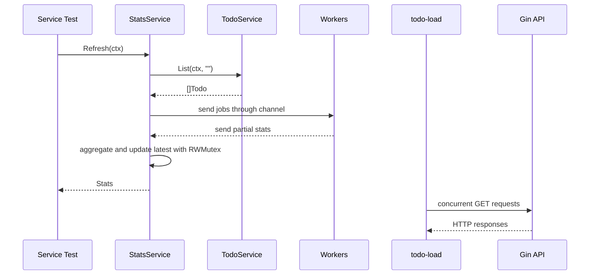

# 第 11 篇：Go 并发编程

第 10 篇已经把 Todo API v2 重构为 Gin 框架版本。到这里，服务已经能处理 HTTP 请求、返回 JSON、生成 OpenAPI 文档，也有中间件负责 request ID、日志、panic 恢复、请求超时和请求体大小限制。

本篇进入 Go 后端绕不开的一块能力：**并发编程**。我们不会把 goroutine（Go 协程）、channel（通道）、context.Context（上下文对象）当成孤立语法点来背，而是放进 HTTP 服务场景里理解：一个服务为什么天然会并发？请求取消后后台任务为什么也要停？多个 goroutine 共享状态时为什么会有竞态？怎样用 worker pool（工作池）控制并发数量？

本篇属于 **C 类：实践/开发章**。你会在第 10 篇 Gin API 的基础上新增并发 Todo 统计任务执行器，并编写一个并发压测命令，最终用 `go test -race` 验证统计逻辑没有数据竞争。

本篇对应 6 个章节主题：

- 11.1 goroutine 与并发执行：HTTP Server 的每请求一个 goroutine
- 11.2 channel 通信模型（无缓冲/有缓冲/select 多路复用）
- 11.3 context 超时、取消与 HTTP 请求链路传递
- 11.4 sync 包：Mutex、RWMutex、WaitGroup
- 11.5 并发安全与竞态检测（`go test -race`）
- 11.6 HTTP Server 中的并发模式实战（优雅关闭、worker pool）

本篇特色项目是：**并发 Todo 统计任务执行器 + API 并发压测命令**。

## 1. 本章学习目标

学完本篇后，你应该能把 Go 并发能力放进真实后端服务里使用，而不是只会写一个 `go func()` 示例。

### 1.1 知识目标

- 能解释 goroutine 与操作系统线程的关系，以及 HTTP Server 为什么天然并发。
- 能说明 channel、`select`、`context.Context`、`sync.WaitGroup`、`sync.Mutex`、`sync.RWMutex` 的职责边界。
- 能解释 worker pool 为什么能控制并发数量。
- 能说明数据竞争、竞态条件和 goroutine 泄漏的区别。
- 能解释 `go test -race` 能发现什么、不能发现什么。

### 1.2 技能目标

- 能编写支持超时取消的并发统计任务。
- 能使用 channel 分发任务并收集结果。
- 能使用 `sync.RWMutex` 保护共享统计快照。
- 能编写并发单元测试，并用 `go test -race` 验证无数据竞争。
- 能编写一个简单的 API 并发压测命令，观察成功率、耗时和吞吐。

本篇结束时，你至少应该能成功执行：

```bash
cd ~/workspace/cloud-native-todo-platform
go fmt ./api/...
go test -race ./api/...
go build -o bin/todo-load ./api/cmd/todo-load
TODO_API_ADDR=127.0.0.1:18080 ./bin/todo-api
./bin/todo-load -addr http://127.0.0.1:18080 -path /api/v2/todos -requests 50 -concurrency 5
```

## 2. 本章工作场景与真实案例

### 2.1 技术痛点

后端服务不是一个请求处理完才处理下一个请求。Go 的 `http.Server` 会为每个连接和请求安排 goroutine；Gin 虽然封装了路由和上下文，但底层仍然运行在 `net/http` 上。这意味着你的 Handler、Service、Repository 会被多个请求同时调用。

如果不理解并发，常见问题会很隐蔽：

- 多个请求同时更新内存 map，程序偶发 panic。
- 请求已经超时，后台 goroutine 仍在继续跑，浪费资源。
- 为每个任务无限创建 goroutine，流量一高就把内存打满。
- 统计任务读写共享变量没有加锁，测试偶尔失败，线上数据偶尔不准。
- 压测只看平均耗时，不看失败率和并发数，误判服务能力。

本篇用一个并发统计任务把这些问题串起来：统计 Todo 总数、待办数和完成数，同时支持 context 取消、worker pool 并发控制和竞态检测。

### 2.2 团队协作场景

真实团队里，并发问题通常不是一个人能单独发现的：

- 后端开发负责让 Service 在并发请求下行为稳定。
- 测试工程师会用压测和 `go test -race` 暴露竞态。
- SRE 会通过 CPU、内存、goroutine 数量、延迟和错误率判断服务是否被并发拖垮。
- 架构师会审查是否有无界 goroutine、是否正确传递 context、是否有并发安全边界。

并发代码要能被别人读懂。比起“为了快开很多 goroutine”，更重要的是明确：任务从哪里来、并发数怎么控制、取消信号怎么传递、结果怎么汇总、共享状态由谁保护。

### 2.3 课程项目关联

本篇会新增：

```text
cloud-native-todo-platform/
├── api/
│   ├── cmd/
│   │   └── todo-load/
│   │       └── main.go
│   └── internal/
│       └── service/
│           ├── stats_service.go
│           └── stats_service_test.go
```

`stats_service.go` 会复用第 10 篇的 Todo Service，只依赖一个小接口读取 Todo 列表。`todo-load` 是一个轻量压测命令，用来对运行中的 Todo API 发起并发请求。第 12 篇接入 PostgreSQL 后，这个并发统计和压测命令可以继续用来验证数据库访问是否稳定。

## 3. 核心概念

### 3.1 goroutine

goroutine（Go 协程）是 Go 管理的轻量并发执行单元。启动 goroutine 很简单：

```go
go func() {
	// work
}()
```

简单不代表可以随便用。每个 goroutine 都会占用调度、栈空间和运行时资源。如果请求来了就无限开 goroutine，服务最终会因为内存、CPU 或下游连接耗尽而崩。

HTTP Server 本身已经并发处理请求，所以 Handler 内部再开 goroutine 时，要有明确理由：任务可并行、能被取消、并发数可控、错误能回收。

### 3.2 channel

channel（通道）是 goroutine 之间传递数据的管道。worker pool（工作池）常用两个 channel：

```go
jobs := make(chan model.Todo)
partials := make(chan Stats)
```

`jobs` 用来分发 Todo 给 worker，`partials` 用来收集每个 worker 的局部统计结果。channel 的价值不是“看起来很 Go”，而是让任务所有权在 goroutine 之间清楚流动。

### 3.3 select

`select` 可以同时等待多个 channel。配合 `ctx.Done()`，可以让 goroutine 在请求取消或超时时尽快退出：

```go
select {
case jobs <- item:
case <-ctx.Done():
	return
}
```

如果没有这类退出分支，生产环境里很容易出现 goroutine 泄漏：请求已经结束，但后台 goroutine 还卡在发送或接收上。

### 3.4 context

`context.Context`（上下文对象）用来传递请求生命周期、超时和取消信号。第 10 篇 Gin Handler 调用 service 时已经使用：

```go
ctx := c.Request.Context()
```

本篇统计任务会继续沿用这个原则：从 Handler 或测试传入的 `ctx` 必须一路传到查询、worker 和汇总逻辑。只要 `ctx` 取消，统计任务就应该尽快停止。

### 3.5 sync 包

`sync` 包（synchronization，同步包）解决共享状态协作问题：

| 类型 | 用途 | 本篇用法 |
|---|---|---|
| `sync.WaitGroup` | 等待一组 goroutine 结束 | 等待所有 worker 完成 |
| `sync.Mutex` | 保护读写共享变量 | 适合写多读少场景 |
| `sync.RWMutex` | 多读单写锁 | 保护最新统计快照 |

本篇的统计快照会被 `Refresh` 写入，也会被 `Latest` 读取，所以用 `sync.RWMutex` 表达“读多写少”的意图。

### 3.6 竞态检测

data race（数据竞争）是多个 goroutine 同时访问同一块内存，并且至少一个是写操作，且没有同步保护。它和 race condition（竞态条件）不是一回事：后者可能是业务时序错误，即使没有内存数据竞争也会发生。Go 自带 race detector（竞态检测器）：

```bash
go test -race ./api/...
```

它能在测试运行时发现数据竞争，但不能证明所有并发路径永远安全。你仍然需要设计清晰的锁边界、取消路径和测试场景。

## 4. 原理深入

### 4.1 HTTP 服务中的并发链路

图 11-1 展示本篇并发统计和压测命令的运行流程。本篇先把并发统计放在 Service 层和测试中练扎实，不新增 HTTP 统计接口；这样可以把注意力集中在 goroutine 生命周期、channel 关闭、context 取消和共享状态保护上。



这里的关键不是“并发一定更快”，而是“并发过程可控”。任务数量有限、worker 数有限、取消信号可传递、共享快照有锁保护，才是后端服务能长期运行的前提。

### 4.2 worker pool 为什么需要上限

假设有 10000 个 Todo，如果为每个 Todo 启动一个 goroutine，短时间内会产生 10000 个并发执行单元。即使每个任务很轻，调度和内存开销也不可忽视。

worker pool 的思路是：任务可以很多，但同时工作的 goroutine 数量固定。

```text
Todos -> jobs channel -> worker 1
                       -> worker 2
                       -> worker 3
                       -> partial results -> aggregate
```

这个模型在数据库查询、HTTP 调用、文件处理、批量任务中很常见。真实生产环境还会结合限流、连接池和队列长度一起控制。

### 4.3 context 取消如何传递

本篇代码有 3 个需要关注取消的位置：

- 查询 Todo 列表前检查 `ctx.Err()`。
- producer 往 `jobs` 发送任务时监听 `ctx.Done()`。
- worker 从 `jobs` 接收任务时也监听 `ctx.Done()`。

只在最外层检查一次 context 不够。并发程序中任何可能阻塞的位置，都应该思考取消信号是否能让它退出。

当 worker 收到 `ctx.Done()` 后会直接返回，不再发送局部统计结果。这个选择是刻意的：调用方已经取消请求，部分统计结果不再有业务价值，尽快退出比凑齐一个不完整结果更重要。

### 4.4 锁的边界

本篇不在每个 worker 里抢同一把锁累加全局变量，而是让每个 worker 先维护局部统计，最后由主 goroutine 汇总。这样可以减少锁竞争。

只有 `latest` 快照是共享状态，需要用 `sync.RWMutex` 保护：

```go
s.mu.Lock()
s.latest = stats
s.mu.Unlock()
```

读路径使用 `RLock`：

```go
s.mu.RLock()
defer s.mu.RUnlock()
return s.latest
```

这个边界很清楚：worker 不共享写全局变量，Service 对外共享的只有最新快照。

## 5. 手把手实验

### 5.1 实验目标

新增一个并发 Todo 统计服务和一个并发压测命令，并用 `go test -race ./api/...` 验证没有数据竞争。

### 5.2 实验环境

| 工具 | 版本 | 用途 |
|---|---|---|
| Ubuntu | 24.04 LTS | 统一实验环境 |
| Go | 1.26.x | 编译、测试和运行 |
| build-essential | Ubuntu 软件包 | 为 `go test -race` 提供 cgo / gcc 工具链 |
| curl | Ubuntu 24.04 默认版本 | 验证 API |
| Todo API | 第 10 篇 Gin 版本 | 提供被压测服务 |

进入课程项目根目录：

```bash
cd ~/workspace/cloud-native-todo-platform
```

确认第 10 篇文件已存在：

```bash
test -f api/cmd/todo-api/main.go
test -f api/internal/handler/gin/handler.go
```

如果你的 Ubuntu 环境还没有 C 编译器，先安装 race detector 需要的工具链：

```bash
sudo apt update
sudo apt install -y build-essential
```

### 5.3 文件目录结构

创建本篇新增目录：

```bash
mkdir -p api/cmd/todo-load api/internal/service
```

本篇新增文件如下：

```text
cloud-native-todo-platform/
└── api/
    ├── cmd/
    │   └── todo-load/
    │       └── main.go
    └── internal/
        └── service/
            ├── stats_service.go
            └── stats_service_test.go
```

### 5.4 完整代码

创建 `api/internal/service/stats_service.go`：

```go title="api/internal/service/stats_service.go"
package service

import (
	"context"
	"errors"
	"runtime"
	"sync"
	"time"

	"cloud-native-todo-platform/api/internal/model"
)

// ErrInvalidWorkerCount is returned when worker count is outside the safe range.
var ErrInvalidWorkerCount = errors.New("invalid worker count")

// TodoLister is the read behavior required by StatsService.
type TodoLister interface {
	List(ctx context.Context, status model.Status) ([]model.Todo, error)
}

// Stats is a snapshot of Todo status counts.
type Stats struct {
	Total       int       `json:"total"`
	Pending     int       `json:"pending"`
	Done        int       `json:"done"`
	GeneratedAt time.Time `json:"generated_at"`
}

// StatsService refreshes Todo statistics with bounded concurrency.
type StatsService struct {
	lister  TodoLister
	workers int
	now     func() time.Time

	mu     sync.RWMutex
	latest Stats
}

// NewStatsService creates a StatsService.
func NewStatsService(lister TodoLister, workers int) (*StatsService, error) {
	if workers == 0 {
		workers = runtime.GOMAXPROCS(0)
	}
	if workers < 0 || workers > 128 {
		return nil, ErrInvalidWorkerCount
	}
	return &StatsService{
		lister:  lister,
		workers: workers,
		now:     time.Now,
	}, nil
}

// Latest returns the most recently generated stats snapshot.
func (s *StatsService) Latest() Stats {
	s.mu.RLock()
	defer s.mu.RUnlock()
	return s.latest
}

// Refresh recalculates Todo statistics. It stops early when ctx is canceled.
func (s *StatsService) Refresh(ctx context.Context) (Stats, error) {
	items, err := s.lister.List(ctx, "")
	if err != nil {
		return Stats{}, err
	}
	if err := ctx.Err(); err != nil {
		return Stats{}, err
	}
	if len(items) == 0 {
		stats := Stats{GeneratedAt: s.now().UTC()}
		s.store(stats)
		return stats, nil
	}

	workerCount := s.workers
	if workerCount > len(items) {
		workerCount = len(items)
	}

	jobs := make(chan model.Todo)
	partials := make(chan Stats, workerCount)

	var wg sync.WaitGroup
	for i := 0; i < workerCount; i++ {
		wg.Add(1)
		go func() {
			defer wg.Done()

			var local Stats
			for {
				select {
				case <-ctx.Done():
					return
				case item, ok := <-jobs:
					if !ok {
						partials <- local
						return
					}
					local.Total++
					switch item.Status {
					case model.StatusDone:
						local.Done++
					default:
						local.Pending++
					}
				}
			}
		}()
	}

	go func() {
		defer close(jobs)
		for _, item := range items {
			select {
			case <-ctx.Done():
				return
			case jobs <- item:
			}
		}
	}()

	go func() {
		wg.Wait()
		close(partials)
	}()

	stats := Stats{GeneratedAt: s.now().UTC()}
	for partial := range partials {
		stats.Total += partial.Total
		stats.Pending += partial.Pending
		stats.Done += partial.Done
	}
	if err := ctx.Err(); err != nil {
		return Stats{}, err
	}

	s.store(stats)
	return stats, nil
}

func (s *StatsService) store(stats Stats) {
	s.mu.Lock()
	defer s.mu.Unlock()
	s.latest = stats
}
```

这段代码包含几个并发设计点：

- `workers` 控制同时运行的 worker 数量，避免无界 goroutine。
- `jobs` channel 负责分发 Todo。
- 每个 worker 先计算局部 `Stats`，最后由主 goroutine 汇总，减少共享写。
- 空 Todo 列表会直接写入零值快照，不启动不必要的 worker。
- `Latest` 和 `store` 用 `sync.RWMutex` 保护最新快照。
- producer 和 worker 都监听 `ctx.Done()`，避免请求取消后继续阻塞。

创建 `api/internal/service/stats_service_test.go`：

```go title="api/internal/service/stats_service_test.go"
package service

import (
	"context"
	"errors"
	"sync"
	"testing"
	"time"

	"cloud-native-todo-platform/api/internal/model"
	"cloud-native-todo-platform/api/internal/repository"
)

func TestStatsServiceRefreshCountsTodos(t *testing.T) {
	ctx := context.Background()
	repo := repository.NewMemoryRepository()
	todoService := NewTodoService(repo)

	first, err := todoService.Create(ctx, "write concurrency chapter")
	if err != nil {
		t.Fatalf("create first todo: %v", err)
	}
	if _, err := todoService.Create(ctx, "review worker pool"); err != nil {
		t.Fatalf("create second todo: %v", err)
	}
	if _, err := todoService.MarkDone(ctx, first.ID); err != nil {
		t.Fatalf("mark first done: %v", err)
	}

	statsService, err := NewStatsService(todoService, 2)
	if err != nil {
		t.Fatalf("new stats service: %v", err)
	}
	statsService.now = func() time.Time {
		return time.Date(2026, 5, 28, 10, 0, 0, 0, time.UTC)
	}

	got, err := statsService.Refresh(ctx)
	if err != nil {
		t.Fatalf("refresh stats: %v", err)
	}
	if got.Total != 2 || got.Pending != 1 || got.Done != 1 {
		t.Fatalf("unexpected stats: %+v", got)
	}
	if latest := statsService.Latest(); latest != got {
		t.Fatalf("latest = %+v, want %+v", latest, got)
	}
}

func TestStatsServiceConcurrentRefreshIsRaceFree(t *testing.T) {
	ctx := context.Background()
	repo := repository.NewMemoryRepository()
	todoService := NewTodoService(repo)

	for i := 0; i < 50; i++ {
		item, err := todoService.Create(ctx, "todo")
		if err != nil {
			t.Fatalf("create todo %d: %v", i, err)
		}
		if i%3 == 0 {
			if _, err := todoService.MarkDone(ctx, item.ID); err != nil {
				t.Fatalf("mark done %d: %v", i, err)
			}
		}
	}

	statsService, err := NewStatsService(todoService, 4)
	if err != nil {
		t.Fatalf("new stats service: %v", err)
	}

	var wg sync.WaitGroup
	for i := 0; i < 10; i++ {
		wg.Add(1)
		go func() {
			defer wg.Done()
			if _, err := statsService.Refresh(ctx); err != nil {
				t.Errorf("refresh stats: %v", err)
			}
			_ = statsService.Latest()
		}()
	}
	wg.Wait()
}

func TestStatsServiceRefreshHonorsContextCancel(t *testing.T) {
	statsService, err := NewStatsService(cancelingLister{}, 1)
	if err != nil {
		t.Fatalf("new stats service: %v", err)
	}

	ctx, cancel := context.WithCancel(context.Background())
	cancel()

	_, err = statsService.Refresh(ctx)
	if !errors.Is(err, context.Canceled) {
		t.Fatalf("err = %v, want context.Canceled", err)
	}
}

func TestStatsServiceRejectsInvalidWorkerCount(t *testing.T) {
	_, err := NewStatsService(cancelingLister{}, -1)
	if !errors.Is(err, ErrInvalidWorkerCount) {
		t.Fatalf("err = %v, want ErrInvalidWorkerCount", err)
	}
}

type cancelingLister struct{}

func (cancelingLister) List(ctx context.Context, _ model.Status) ([]model.Todo, error) {
	return nil, ctx.Err()
}
```

这个测试文件重点覆盖 4 件事：

- 统计结果是否正确。
- 多个 goroutine 同时刷新和读取快照时是否安全。
- context 取消是否被正确返回。
- worker 数量非法时是否被拒绝。

创建 `api/cmd/todo-load/main.go`：

```go title="api/cmd/todo-load/main.go"
package main

import (
	"context"
	"flag"
	"fmt"
	"io"
	"net/http"
	"os"
	"sync"
	"sync/atomic"
	"time"
)

type config struct {
	addr        string
	path        string
	requests    int
	concurrency int
	timeout     time.Duration
}

func main() {
	cfg := parseConfig()
	if err := run(context.Background(), cfg); err != nil {
		fmt.Fprintln(os.Stderr, err)
		os.Exit(1)
	}
}

func parseConfig() config {
	var cfg config
	flag.StringVar(&cfg.addr, "addr", "http://127.0.0.1:18080", "Todo API base address")
	flag.StringVar(&cfg.path, "path", "/healthz", "request path")
	flag.IntVar(&cfg.requests, "requests", 100, "total request count")
	flag.IntVar(&cfg.concurrency, "concurrency", 10, "concurrent worker count")
	flag.DurationVar(&cfg.timeout, "timeout", 5*time.Second, "request timeout")
	flag.Parse()
	return cfg
}

func run(ctx context.Context, cfg config) error {
	if cfg.requests <= 0 {
		return fmt.Errorf("requests must be positive")
	}
	if cfg.concurrency <= 0 {
		return fmt.Errorf("concurrency must be positive")
	}

	client := &http.Client{Timeout: cfg.timeout}
	jobs := make(chan int)

	var okCount atomic.Int64
	var failCount atomic.Int64
	started := time.Now()

	var wg sync.WaitGroup
	for i := 0; i < cfg.concurrency; i++ {
		wg.Add(1)
		go func() {
			defer wg.Done()
			for range jobs {
				if err := doRequest(ctx, client, cfg.addr+cfg.path); err != nil {
					failCount.Add(1)
					continue
				}
				okCount.Add(1)
			}
		}()
	}

	for i := 0; i < cfg.requests; i++ {
		jobs <- i
	}
	close(jobs)
	wg.Wait()

	elapsed := time.Since(started)
	total := okCount.Load() + failCount.Load()
	rps := float64(total) / elapsed.Seconds()
	fmt.Printf("requests=%d concurrency=%d ok=%d failed=%d elapsed=%s rps=%.2f\n",
		total,
		cfg.concurrency,
		okCount.Load(),
		failCount.Load(),
		elapsed.Round(time.Millisecond),
		rps,
	)
	return nil
}

func doRequest(ctx context.Context, client *http.Client, url string) error {
	req, err := http.NewRequestWithContext(ctx, http.MethodGet, url, nil)
	if err != nil {
		return err
	}
	resp, err := client.Do(req)
	if err != nil {
		return err
	}
	defer resp.Body.Close()

	_, _ = io.Copy(io.Discard, resp.Body)
	if resp.StatusCode < 200 || resp.StatusCode >= 300 {
		return fmt.Errorf("unexpected status: %d", resp.StatusCode)
	}
	return nil
}
```

这个压测命令不是替代专业工具。它的价值是让你亲手看见：固定请求数、固定并发数、固定超时下，服务的成功数、失败数和吞吐如何变化。

### 5.5 执行命令

格式化代码：

```bash
go fmt ./api/...
```

运行普通测试：

```bash
go test ./api/...
```

运行竞态检测：

```bash
go test -race ./api/...
```

构建压测命令：

```bash
go build -o bin/todo-load ./api/cmd/todo-load
```

启动第 10 篇 Todo API。另开一个终端执行：

```bash
TODO_API_ADDR=127.0.0.1:18080 ./bin/todo-api
```

回到当前终端，先压测健康检查接口：

```bash
./bin/todo-load -addr http://127.0.0.1:18080 -path /healthz -requests 50 -concurrency 5
```

再压测 Todo 列表接口：

```bash
./bin/todo-load -addr http://127.0.0.1:18080 -path /api/v2/todos -requests 50 -concurrency 5
```

### 5.6 预期输出

`go test -race ./api/...` 通过时，输出类似：

```text
?   	cloud-native-todo-platform/api/cmd/todo-api	[no test files]
?   	cloud-native-todo-platform/api/cmd/todo-load	[no test files]
ok  	cloud-native-todo-platform/api/internal/handler/gin	1.24s
ok  	cloud-native-todo-platform/api/internal/handler/http	1.18s
?   	cloud-native-todo-platform/api/internal/model	[no test files]
ok  	cloud-native-todo-platform/api/internal/service	1.31s
```

压测命令输出类似：

```text
requests=50 concurrency=5 ok=50 failed=0 elapsed=42ms rps=1190.48
```

数字会随机器性能变化。判断重点是：

- `failed=0` 表示请求都成功。
- `concurrency=5` 表示同时有 5 个 worker 发请求。
- `rps` 只是本地粗略吞吐，不代表生产容量。

### 5.7 验证方法

验证并发统计服务无竞态：

```bash
go test -race ./api/internal/service
```

验证整个 API 项目仍然可构建：

```bash
go test -race ./api/...
go build -o bin/todo-api ./api/cmd/todo-api
go build -o bin/todo-load ./api/cmd/todo-load
```

验证压测命令参数检查：

```bash
./bin/todo-load -requests 0
```

预期输出类似：

```text
requests must be positive
```

### 5.8 清理步骤

如果 Todo API 仍在运行，先在服务终端按 `Ctrl+C` 停止。

删除本篇构建产物：

```bash
rm -f bin/todo-load
```

预计耗时：15 分钟阅读，45 分钟动手实验。

## 6. 常见错误与排障

### 错误 1：`go test -race` 报 data race

- **现象**：

  ```text
  WARNING: DATA RACE
  Write at 0x00...
  Previous read at 0x00...
  ```

- **原因**：多个 goroutine 同时读写共享变量，没有使用锁、channel 或原子操作保护。
- **排查**：根据 race detector 输出中的文件名和行号定位共享变量。

  ```bash
  go test -race ./api/internal/service
  ```

  输出里 `Write` 和 `Previous read` 通常会指向两个并发访问位置。

- **修复**：给共享状态加 `sync.Mutex` / `sync.RWMutex`，或改成每个 goroutine 维护局部状态，最后统一汇总。
- **预防**：并发代码必须有 race 测试；不要让多个 worker 直接写同一个 map 或 struct。

### 错误 2：`go test -race` 提示 cgo 或 gcc 不可用

- **现象**：

  ```text
  go: -race requires cgo; enable cgo by setting CGO_ENABLED=1
  cgo: C compiler "gcc" not found
  ```

- **原因**：race detector 需要 cgo 和 C 编译器。精简 Ubuntu、容器或新装环境可能没有安装 gcc。
- **排查**：

  ```bash
  go env CGO_ENABLED
  gcc --version
  ```

- **修复**：

  ```bash
  sudo apt update
  sudo apt install -y build-essential
  CGO_ENABLED=1 go test -race ./api/internal/service
  ```

- **预防**：把 `build-essential` 放进实验环境准备清单；CI 中也要使用支持 cgo 的 Go 构建镜像。

### 错误 3：goroutine 未正确退出，导致测试卡住或取消无效

- **现象**：

  ```text
  panic: test timed out after 30s
  ```

  或者请求超时后，CPU 仍然持续升高，日志显示后台任务还在跑。

- **原因**：某个 goroutine 卡在 channel 发送或接收上，通常是没有关闭 channel，或者 producer / worker 没有在阻塞点监听 `ctx.Done()`。
- **排查**：给测试加超时，观察卡在哪一步，并确认 producer 和 worker 都包含取消分支：

  ```bash
  go test ./api/internal/service -run TestStatsService -count=1 -timeout=5s
  grep -n "ctx.Done" api/internal/service/stats_service.go
  ```

- **修复**：确保 producer 完成后 `close(jobs)`，所有 worker 退出后 `close(partials)`，并在 channel 发送、接收和长耗时循环中加入 `select`，让取消信号能打断等待。
- **预防**：每个 channel 都要能回答“谁发送、谁关闭、谁接收”；凡是可能阻塞的并发代码，都要考虑 context 取消路径。

### 错误 4：压测命令全部失败

- **现象**：

  ```text
  requests=50 concurrency=5 ok=0 failed=50 elapsed=... rps=...
  ```

- **原因**：Todo API 没启动、端口不对、路径不对，或返回了非 2xx 状态码。
- **排查**：

  ```bash
  curl -i -s http://127.0.0.1:18080/healthz
  ```

  如果 curl 也失败，先修服务启动问题；如果 curl 成功，再检查 `todo-load` 的 `-addr` 和 `-path`。

- **修复**：启动服务并确认端口：

  ```bash
  TODO_API_ADDR=127.0.0.1:18080 ./bin/todo-api
  ```

- **预防**：压测前先用单个 `curl` 验证目标接口。

### 错误 5：worker 数量过大导致机器变慢

- **现象**：压测或统计时 CPU 飙高，本地终端明显卡顿。
- **原因**：并发数设置过大，超过本机 CPU、内存或服务处理能力。
- **排查**：

  ```bash
  ./bin/todo-load -addr http://127.0.0.1:18080 -path /healthz -requests 1000 -concurrency 200
  ```

  如果失败数升高、耗时变长，说明并发数已经超过当前服务或机器承载能力。

- **修复**：降低 `-concurrency`，逐步增加观察变化。
- **预防**：压测要阶梯式增加并发；不要一开始就把并发数拉到很高。

## 7. 生产环境注意事项

1. **goroutine 必须有退出条件**。生产服务里的 goroutine 不能只负责启动，还要能被取消、能处理错误、能在服务关闭时退出。请求级任务应使用 `r.Context()` 或 `c.Request.Context()`，后台任务应有独立生命周期管理，避免上线一段时间后 goroutine 数量持续增长。

2. **worker pool 要有边界**。并发不是越多越好。数据库连接池、Redis 连接池、HTTP client 连接池、CPU 核数和下游限流都会限制真实吞吐。生产中通常要同时控制 worker 数、队列长度、请求超时和重试策略。

3. **共享状态要少而清晰**。能用局部变量汇总，就不要让多个 goroutine 抢同一把锁写全局变量。必须共享时，用 `sync.Mutex`、`sync.RWMutex`、`atomic` 或 channel 明确同步方式，并通过 `go test -race` 覆盖核心路径。

4. **压测结果不能只看 RPS**。还要看错误率、P95/P99 延迟、CPU、内存、连接数、goroutine 数量和下游依赖指标。本篇 `todo-load` 只是教学工具，只覆盖固定并发的 GET 请求；生产压测应使用 wrk、k6、vegeta 等专业工具，并支持中断处理、认证头、请求体、分位延迟和隔离环境。

5. **context 不是万能取消器**。context 只是一种信号传递机制；下游代码必须主动监听它。数据库查询、HTTP 请求、channel 发送接收、循环任务都要显式使用带 context 的 API 或 `select` 分支。

## 8. 本章小项目

本章小项目是 **并发 Todo 统计任务执行器 + API 并发压测命令**。项目目标是在 Todo API v2 的基础上补齐并发处理能力：用 worker pool 统计 Todo 状态，用 `context` 支持取消，用 `sync.RWMutex` 保护最新快照，用 `go test -race` 验证无数据竞争，并用 `todo-load` 对 API 发起并发请求。

交付物包括：

- `api/internal/service/stats_service.go`
- `api/internal/service/stats_service_test.go`
- `api/cmd/todo-load/main.go`
- `bin/todo-load` 构建产物

能力验收标准：

- 能执行 `go test -race ./api/...` 且全部通过。
- 能解释 worker pool 的任务分发和结果汇总流程。
- 能说明 `ctx.Done()` 在 producer 和 worker 中分别解决什么问题。
- 能运行 `todo-load` 并解释 `requests`、`concurrency`、`ok`、`failed`、`rps` 的含义。
- 能指出代码中哪些共享状态由 `sync.RWMutex` 保护。

## 9. 本章练习题

### 9.1 基础题

1. goroutine 和线程有什么关系？为什么说 goroutine 不是越多越好？
2. `sync.Mutex` 和 `sync.RWMutex` 的区别是什么？
3. channel 由谁关闭？为什么接收方通常不应该关闭 channel？
4. `context.Canceled` 和 `context.DeadlineExceeded` 分别表示什么？
5. `go test -race` 能发现什么类型的问题？

### 9.2 实操题

1. 给 `Stats` 增加 `CompletionRate` 字段，表示已完成 Todo 占总数的比例。验收标准：空列表时为 `0`，有数据时计算正确，`go test -race ./api/internal/service` 通过。
2. 给 `todo-load` 增加 `-method` 参数，支持压测 `GET` 和 `POST`。验收标准：`-method GET` 行为保持不变，非法 method 返回错误；如果选择 `POST`，需要同步处理请求体和 `Content-Type`。
3. 给 `StatsService` 增加 Benchmark。可以参考单元测试中的数据准备方式，编写 `BenchmarkStatsServiceRefresh`，在循环中调用 `Refresh(context.Background())`。验收标准：能执行 `go test ./api/internal/service -bench . -benchmem`，并解释 `ns/op` 和 `allocs/op`。

### 9.3 思考题

1. 如果统计任务未来要读取 PostgreSQL，你会把并发数设置为多少？它和数据库连接池有什么关系？
2. 如果压测时 RPS 升高但错误率也升高，你会先看哪些指标和日志？

## 10. 本章面试题

### 面试题 1：Go HTTP Server 如何处理并发请求？

**一句话结论**：Go 的 `net/http` 会为连接和请求安排 goroutine，因此同一个 Handler 可能被多个请求同时调用。

**展开解释**：Gin 运行在 `net/http` 之上，所以 Gin Handler 也处在并发请求环境中。Handler 内部访问 service、repository 或共享变量时必须考虑并发安全。内存 map 要加锁，数据库连接要走连接池，后台任务要支持取消。

**深入追问**：HTTP Server 的并发不等于业务逻辑自动安全。只读无共享状态通常安全；写共享内存、缓存、统计快照、全局变量时必须有同步机制。

### 面试题 2：什么时候使用 channel，什么时候使用 Mutex？

**一句话结论**：channel 更适合传递任务和结果，Mutex 更适合保护共享状态。

**展开解释**：如果你的问题是“把 Todo 分发给多个 worker 处理”，channel 很自然；如果问题是“保护 latest stats 这个共享字段”，Mutex 或 RWMutex 更直接。不要为了使用 channel 而绕开简单清晰的锁。

**深入追问**：Go 并发不是“只能用 channel”。真实项目里 channel、Mutex、atomic、context、WaitGroup 经常组合使用。选择标准是可读性、正确性和边界清晰。

### 面试题 3：如何避免 goroutine 泄漏？

**一句话结论**：每个 goroutine 都要有明确退出条件，并且阻塞点要能响应取消或关闭。

**展开解释**：常见泄漏来自 channel 永远没人关闭、发送方没人接收、接收方等不到数据、请求取消后后台任务还在跑。解决方式包括：用 context 传递取消信号，明确 channel 关闭责任，用 WaitGroup 等待退出，给外部请求设置超时。

**深入追问**：排查时可以观察 goroutine 数量、pprof goroutine dump、日志中的请求 ID 和任务生命周期。第 14 篇会进一步讲 pprof。

### 面试题 4：`go test -race` 的价值和局限是什么？

**一句话结论**：race detector 能发现测试运行路径上的数据竞争，但不能证明所有并发路径永远正确。

**展开解释**：它会在运行时监控内存访问，发现未同步的并发读写。价值很高，尤其适合 CI 中跑核心包测试。但如果测试没有覆盖某条并发路径，race detector 就看不到那里的问题。

**深入追问**：数据竞争不等于所有竞态条件。例如两个请求都通过了“库存大于 0”的判断，最后超卖，这可能没有内存数据竞争，却是业务竞态，需要事务、锁或幂等设计解决。

### 面试题 5：worker pool 如何设计才适合生产？

**一句话结论**：生产级 worker pool 要控制 worker 数、队列长度、超时、错误处理和关闭流程。

**展开解释**：只固定 worker 数还不够。任务队列不能无限增长，任务执行要支持 context，错误要能被观测，服务关闭时要停止接收新任务并等待已有任务结束。下游是数据库或 HTTP 服务时，还要和连接池、限流、重试策略配合。

**深入追问**：如果 worker 处理速度低于任务进入速度，就会积压。此时要么扩容处理能力，要么限流、降级、丢弃低优先级任务，不能让队列无限占用内存。

## 11. 本章总结

本篇你把 Go 并发能力放进了 Todo API 的真实后端场景：理解了 HTTP Server 的并发请求模型，使用 worker pool、channel、context、WaitGroup 和 RWMutex 实现并发统计任务，并用 `go test -race` 验证无数据竞争。你还编写了 `todo-load` 命令，能用固定请求数和并发数对 API 做基础压测。

项目成果上，Todo Platform 现在不只是能处理 HTTP 请求，还具备了可验证的并发任务能力和基础压测工具。StatsService 展示了一个常见后端模式：先用有限 worker 并行处理任务，再由主 goroutine 汇总结果，最后只用一把锁保护对外共享的快照。这个模式比“哪里慢就开 goroutine”更可靠，也更容易测试。

能力价值上，你已经能开始判断并发代码是否可控、是否会泄漏、是否有竞态、是否能在真实服务里长期运行。进入第 12 篇后，这些能力会直接迁移到 PostgreSQL 连接池、查询超时、事务边界和并发请求排障中。

## 12. 下一章衔接

第 12 篇会把 Todo API 的内存存储替换为 PostgreSQL。数据库访问同样会面对并发请求、连接池、事务和超时问题；如果不理解本篇的 context、worker pool 和竞态检测，后续很容易把数据库并发问题误判为“SQL 慢”或“框架问题”。
