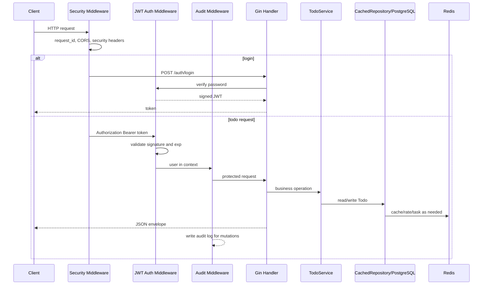

# 第 14 篇：Go 后端生产化能力

第 13 篇已经把 Todo API v4 接入 Redis，让服务具备缓存、限流和简单异步任务能力。到这里，Todo Platform 已经有了业务 API、PostgreSQL、Redis 和后台 worker，但它还不像一个可以交给团队长期运行的后端服务：谁能访问接口、日志能否追踪一次请求、配置是否能区分 dev/test/prod、线上出问题时能否快速确认健康状态和 goroutine 情况，这些都还需要补齐。

本篇把 Todo API 升级为 **Todo API v5 生产风格 API 服务**。生产化不是“代码变复杂”，而是把认证、安全、配置、日志、启动命令和排障入口做成明确、可验证、可运维的能力。

本篇属于 **C 类：实践/开发章**。本篇特色项目是：**将 Todo 平台升级为 Todo API v5，补齐 JWT 鉴权、审计日志、配置分层、安全中间件、运维命令和 pprof 排障入口**。

本篇对应 7 个章节主题：

- 14.1 JWT 鉴权与用户登录
- 14.2 中间件链路、请求 ID 与审计日志
- 14.3 参数校验、安全响应与敏感信息保护
- 14.4 配置分层：dev、test、prod
- 14.5 CORS、Rate Limiting 与安全 Header
- 14.6 服务启动、优雅关闭与运维命令设计
- 14.7 Go pprof 性能分析入门（CPU profile、heap profile、goroutine profile）

## 1. 本章学习目标

学完本篇后，你应该能把“功能能跑”的 Go API，整理成“能安全启动、能区分环境、能认证用户、能追踪请求、能排查运行状态”的生产风格服务。

### 1.1 知识目标

- 能说明 JWT（JSON Web Token）的结构、签名和过期时间。
- 能区分认证、授权、审计日志和访问日志。
- 能解释请求 ID 在日志追踪和跨组件排障中的作用。
- 能说明安全响应为什么不能暴露内部错误、密码和 Token。
- 能理解 dev/test/prod 配置分层和 Secret 边界。
- 能说明 CORS（Cross-Origin Resource Sharing）、安全 Header、Rate Limiting 和 pprof 的生产风险。

### 1.2 技能目标

- 能为 Todo API 增加 `/api/v2/auth/login` 登录接口。
- 能使用 HMAC-SHA256（Hash-based Message Authentication Code with SHA-256）签发并校验 JWT。
- 能用中间件保护 Todo CRUD 接口，并保留健康检查和登录接口公开访问。
- 能输出包含 `request_id`、`user`、`method`、`path`、`status` 的结构化日志和审计日志。
- 能通过 `configs/base.json`、`configs/dev.json`、`configs/test.json`、`configs/prod.json` 和环境变量加载配置。
- 能使用 `serve`、`config-check`、`hash-password`、`migrate` 等运维命令。
- 能启用 pprof 并用 `go tool pprof` 抓取 goroutine、heap 或 CPU profile。

本篇结束时，你至少应该能成功执行：

```bash linenums="0"
cd ~/workspace/cloud-native-todo-platform
go get golang.org/x/crypto@v0.52.0
go mod tidy
go test ./api/...
HASH=$(go run ./api/cmd/todo-api hash-password "change-me-123")
TODO_JWT_SECRET=0123456789abcdef0123456789abcdef TODO_AUTH_USERS="admin=$HASH" go run ./api/cmd/todo-api serve
```

另开终端登录并访问受保护接口：

```bash linenums="0"
TOKEN=$(curl -s -H 'Content-Type: application/json' -d '{"username":"admin","password":"change-me-123"}' http://127.0.0.1:18080/api/v2/auth/login | sed -n 's/.*"token":"\([^"]*\)".*/\1/p')
curl -i -H "Authorization: Bearer $TOKEN" http://127.0.0.1:18080/api/v2/todos
```

## 2. 本章工作场景与真实案例

### 2.1 技术痛点

生产化问题通常不会在功能 demo 阶段暴露，而是在多人协作、上线运行和事故排查时集中出现：

- 没有认证，任何人都能创建、删除 Todo。
- 没有请求 ID，日志里只能看到零散行，无法还原一次请求经过了哪些中间件和业务逻辑。
- 配置散落在 `os.Getenv` 调用中，dev/test/prod 环境差异靠口头约定维护。
- 错误响应直接暴露底层错误，可能泄露数据库、Redis、Token 或配置细节。
- pprof 默认打开在公网地址，排障入口反而变成安全风险。

本篇会把这些问题落到 Todo API：登录成功才能拿到 JWT；Todo CRUD 需要 Bearer Token；访问日志记录请求级字段；审计日志记录写操作；配置由文件和环境变量共同加载；pprof 只绑定本地回环地址。

### 2.2 团队协作场景

真实团队里的生产化能力不是后端一个人的事情：

- 后端开发实现登录、JWT 校验、中间件链路、安全响应和运维命令。
- 测试工程师验证无 Token 401、错误 Token 401、过期 Token 401、登录成功、审计日志和配置覆盖。
- SRE 关注健康检查、优雅关闭、pprof、日志字段、配置来源和启动失败原因。
- 安全工程师关注密码哈希、JWT Secret、CORS、Header、Token 泄露和敏感日志。
- 架构师关注生产能力是否能延续到 Docker、Kubernetes、ConfigMap、Secret 和 Ingress。

### 2.3 课程项目关联

本篇会新增或修改：

```text linenums="0"
cloud-native-todo-platform/
├── configs/
│   ├── base.json
│   ├── dev.json
│   ├── test.json
│   └── prod.json
└── api/
    ├── cmd/
    │   └── todo-api/
    │       └── main.go
    └── internal/
        ├── auth/
        │   ├── jwt.go
        │   ├── jwt_test.go
        │   ├── password.go
        │   └── user_store.go
        ├── config/
        │   ├── config.go
        │   └── config_test.go
        └── handler/
            └── gin/
                ├── auth.go
                ├── handler.go
                ├── middleware.go
                ├── openapi.go
                └── response.go
```

第 13 篇的 PostgreSQL、Redis、限流和 worker 能力仍然保留。本篇新增的生产化能力主要包在入口配置和 Gin middleware 里：公开接口负责健康检查、OpenAPI 和登录；受保护接口负责 Todo CRUD；运维命令负责配置检查、密码哈希、迁移和服务启动。

## 3. 核心概念

### 3.1 JWT 鉴权与用户登录

JWT 是一种带签名的 Token 格式，常见结构是：

```text linenums="0"
header.payload.signature
```

- header 描述算法，例如 `HS256`。
- payload 保存声明，例如 `sub` 用户名、`exp` 过期时间、`iat` 签发时间。
- signature 用服务端 Secret 对前两段签名，防止客户端篡改内容。

登录接口只在用户名和密码正确时签发 JWT。后续请求带上：

```text linenums="0"
Authorization: Bearer <token>
```

认证中间件校验签名和过期时间，通过后把用户名写入请求上下文。Todo API v5 只做“登录后可访问”的最小认证，不做角色授权。更细的 RBAC（Role-Based Access Control，基于角色的访问控制）会在后续 Kubernetes 和平台化章节继续展开。

### 3.2 请求 ID、访问日志与审计日志

请求 ID 是每次请求的唯一标识。客户端可以传 `X-Request-ID`，服务端也可以自动生成。访问日志记录“请求发生了什么”：方法、路径、状态码、耗时、用户、请求 ID。

审计日志记录“谁对重要资源做了什么”：用户、动作、资源、结果、请求 ID。Todo API 里，创建、更新、标记完成和删除 Todo 都属于写操作，应该打审计日志。

两者区别是：访问日志面向运行排障，审计日志面向安全追踪和合规复盘。

### 3.3 参数校验、安全响应与敏感信息保护

生产 API 的错误响应要稳定、可读、但不能泄露内部实现。比如数据库连接失败不应该返回 DSN，JWT 校验失败不应该说明“签名错了还是过期了”，登录失败不应该告诉攻击者“用户名存在但密码错”。

本篇继续使用统一响应信封：

```json linenums="0"
{"error":{"code":"unauthorized","message":"authentication required"}}
```

日志也要脱敏：不要记录明文密码、JWT 原文、Authorization Header、数据库密码、Redis 密码和完整 Secret。必要时只记录用户名、Token ID 或错误类型。

### 3.4 配置分层：dev、test、prod

配置分层的目标是把代码和环境差异拆开：

```text linenums="0"
base.json  通用默认值
dev.json   本地开发覆盖
test.json  测试环境覆盖
prod.json  生产环境覆盖
环境变量    最后覆盖，适合 CI/CD、容器和 Secret 注入
```

本篇用 JSON 文件表达分层配置，再用 `TODO_*` 环境变量覆盖关键项。非敏感配置可以放配置文件；JWT Secret、用户密码哈希、数据库密码、Redis 密码属于 Secret，生产环境应该由 Secret 管理系统或 Kubernetes Secret 注入。

### 3.5 CORS、Rate Limiting 与安全 Header

CORS 决定浏览器页面能否跨域调用 API。后端服务不应该默认允许所有来源访问带认证的接口。本篇在配置里显式声明允许来源。

安全 Header 是浏览器侧防护的第一层，例如：

- `X-Content-Type-Options: nosniff`
- `X-Frame-Options: DENY`
- `Referrer-Policy: no-referrer`
- `Content-Security-Policy: default-src 'none'; frame-ancestors 'none'`

Rate Limiting 已在第 13 篇用 Redis 实现，本篇重点是把它纳入生产中间件链路。限流仍然作为 `net/http` middleware 包在 Gin 路由外层，在请求进入 Gin Handler 之前生效；Gin 内部继续负责请求 ID、安全 Header、CORS、认证、审计和业务 Handler。

### 3.6 服务启动、优雅关闭与运维命令

生产服务入口不应该只有“启动 HTTP 服务”一种行为。常见命令包括：

```text linenums="0"
todo-api serve
todo-api config-check
todo-api hash-password <password>
todo-api migrate
```

- `serve` 启动 API 服务。
- `config-check` 在 CI 或部署前检查配置是否完整。
- `hash-password` 为本地实验或初始化管理员生成密码哈希。
- `migrate` 执行数据库迁移。

优雅关闭是收到 SIGINT/SIGTERM 后停止接收新请求，给正在处理的请求一段时间完成，再关闭数据库、Redis 等依赖。第 13 篇已经有基础优雅关闭，本篇会把它整理进命令化入口。

### 3.7 Go pprof 性能分析入门

pprof 是 Go 内置性能分析工具，常用 profile 包括：

- CPU profile：看 CPU 时间花在哪里。
- heap profile：看内存分配在哪里。
- goroutine profile：看 goroutine 是否堆积或泄漏。

pprof 不能随便暴露公网。本篇只在配置启用时启动一个单独的 pprof server，默认绑定 `127.0.0.1:18081`，用于本地或安全隧道排障。

## 4. 原理深入

### 4.1 Todo API v5 请求链路

图 14-1 Todo API v5 生产化请求链路：



登录只负责签发 Token；业务请求才需要认证。健康检查、OpenAPI 和 pprof 不应该混在同一套鉴权逻辑里：健康检查用于平台探活，OpenAPI 用于本地开发，pprof 绑定单独本地端口。

### 4.2 中间件顺序为什么重要

中间件顺序决定请求先经过哪道门：

```text linenums="0"
RequestID -> AccessLog -> Recovery -> Timeout -> BodyLimit -> SecurityHeaders -> CORS -> Auth -> Audit -> Handler
```

请求 ID 要尽早创建，因为后续日志都要带它。Recovery 要包住后面的业务代码，避免 panic 打垮进程。BodyLimit 要在 JSON 解析前生效。Auth 要在业务 Handler 前生效。Audit 要知道用户和请求结果，因此放在认证后、业务前后都要参与。

### 4.3 配置加载顺序

配置加载遵循“默认值 → base → env 文件 → 环境变量 → 校验”的顺序：

1. 先创建安全的本地默认值。
2. 读取 `configs/base.json`。
3. 按 `TODO_ENV` 读取 `configs/dev.json`、`configs/test.json` 或 `configs/prod.json`。
4. 用环境变量覆盖关键字段。
5. 校验生产环境必须显式设置 JWT Secret 和用户密码哈希。

这样做的好处是：本地启动足够简单，CI/CD 和容器部署又能用环境变量或 Secret 覆盖敏感配置。

### 4.4 JWT Secret 与密码哈希边界

JWT Secret 用来签名 Token，泄露后攻击者可以伪造 Token。生产环境必须使用足够长、随机、可轮换的 Secret。本篇要求至少 32 字节。

用户密码不能明文保存，也不应该用普通 SHA256。普通哈希太快，适合攻击者批量撞库。本篇用 bcrypt（一种面向密码存储的慢哈希算法）保存密码哈希，并提供 `hash-password` 命令生成哈希。bcrypt 成本参数越高越慢，安全性越好，但登录延迟也越高；本地教学使用默认成本即可。

本篇手写一个最小 JWT 实现，是为了让你看清 header、payload、signature、`alg` 校验和过期时间校验之间的关系。真实生产项目通常应优先使用维护良好的 JWT 库，并配合 `kid`、密钥轮换、Token 撤销策略和更完整的安全测试。

### 4.5 pprof 的安全边界

pprof 能暴露函数名、goroutine 栈、内存对象和运行状态，里面可能包含路径、参数、业务形态甚至敏感信息。生产中应该把 pprof 放在内网、localhost、临时端口或受保护的调试入口后面。

本篇默认不启动 pprof。只有设置 `TODO_PPROF_ENABLED=true` 时才启动，并默认绑定 `127.0.0.1:18081`。`net/http/pprof` 会把调试路由注册到 `http.DefaultServeMux`，因此生产项目要避免把业务路由和默认 mux 混在一起暴露。

## 5. 手把手实验

### 5.1 实验目标

本篇要完成 7 件事：

- 新增配置分层文件 `configs/base.json`、`configs/dev.json`、`configs/test.json`、`configs/prod.json`。
- 新增 `api/internal/config` 统一加载配置。
- 新增 `api/internal/auth` 实现 bcrypt 密码哈希和 JWT 签发校验。
- 更新 Gin Handler，增加登录接口、认证中间件、安全 Header、CORS 和审计日志。
- 更新 `api/cmd/todo-api/main.go`，支持 `serve`、`config-check`、`hash-password`、`migrate` 命令。
- 保留第 13 篇 PostgreSQL、Redis、限流和 worker 能力。
- 可选启用 pprof 并抓取基础 profile。

### 5.2 实验环境

| 工具 | 版本 | 用途 |
|---|---|---|
| Ubuntu | 24.04 LTS | 统一实验环境 |
| Go | 1.26.x | 编译、测试和运行 |
| Docker Engine | 29.x | 运行 PostgreSQL 和 Redis 容器 |
| Docker Compose | v2 | 启动本地依赖 |
| PostgreSQL | 18 | 权威数据源 |
| Redis | 8.2 | 缓存、限流和队列 |
| curl | Ubuntu 24.04 默认版本 | 验证 API |

进入课程项目根目录：

```bash linenums="0"
cd ~/workspace/cloud-native-todo-platform
```

确认第 13 篇文件已存在：

```bash linenums="0"
test -f api/internal/repository/cached.go
test -f api/internal/ratelimit/redis_limiter.go
test -f api/internal/tasks/redis_queue.go
```

### 5.3 文件目录结构

创建本篇新增目录：

```bash linenums="0"
mkdir -p configs api/internal/auth api/internal/config
```

本篇新增或覆盖文件如下：

```text linenums="0"
cloud-native-todo-platform/
├── configs/
│   ├── base.json
│   ├── dev.json
│   ├── test.json
│   └── prod.json
└── api/
    ├── cmd/
    │   └── todo-api/
    │       └── main.go
    └── internal/
        ├── auth/
        │   ├── jwt.go
        │   ├── jwt_test.go
        │   ├── password.go
        │   └── user_store.go
        ├── config/
        │   ├── config.go
        │   └── config_test.go
        └── handler/
            └── gin/
                ├── auth.go
                ├── handler.go
                ├── middleware.go
                ├── openapi.go
                └── response.go
```

### 5.4 完整代码

创建 `configs/base.json`：

```json title="configs/base.json"
{
  "server": {
    "addr": "127.0.0.1:18080",
    "read_timeout": "10s",
    "write_timeout": "10s",
    "shutdown_timeout": "10s"
  },
  "auth": {
    "token_ttl": "2h"
  },
  "cors": {
    "allowed_origins": ["http://127.0.0.1:3000", "http://localhost:3000"]
  },
  "redis": {
    "cache_ttl": "30s",
    "rate_limit_per_minute": 60
  },
  "pprof": {
    "enabled": false,
    "addr": "127.0.0.1:18081"
  }
}
```

创建 `configs/dev.json`：

```json title="configs/dev.json"
{
  "log_level": "debug",
  "server": {
    "addr": "127.0.0.1:18080"
  }
}
```

创建 `configs/test.json`：

```json title="configs/test.json"
{
  "log_level": "warn",
  "server": {
    "addr": "127.0.0.1:18082"
  },
  "auth": {
    "token_ttl": "15m"
  }
}
```

创建 `configs/prod.json`：

```json title="configs/prod.json"
{
  "log_level": "info",
  "server": {
    "addr": ":8080"
  },
  "cors": {
    "allowed_origins": []
  },
  "pprof": {
    "enabled": false,
    "addr": "127.0.0.1:18081"
  }
}
```

创建 `api/internal/config/config.go`：

```go title="api/internal/config/config.go"
package config

import (
	"encoding/json"
	"errors"
	"fmt"
	"os"
	"path/filepath"
	"strconv"
	"strings"
	"time"
)

// Config contains runtime settings for Todo API v5.
type Config struct {
	Env      string       `json:"env"`
	LogLevel string       `json:"log_level"`
	Server   ServerConfig `json:"server"`
	Auth     AuthConfig   `json:"auth"`
	CORS     CORSConfig   `json:"cors"`
	Database DBConfig     `json:"database"`
	Redis    RedisConfig  `json:"redis"`
	Pprof    PprofConfig  `json:"pprof"`
}

type ServerConfig struct {
	Addr            string        `json:"addr"`
	ReadTimeout     time.Duration `json:"read_timeout"`
	WriteTimeout    time.Duration `json:"write_timeout"`
	ShutdownTimeout time.Duration `json:"shutdown_timeout"`
}

type AuthConfig struct {
	JWTSecret string        `json:"jwt_secret"`
	TokenTTL  time.Duration `json:"token_ttl"`
	Users     []UserConfig  `json:"users"`
}

type UserConfig struct {
	Username     string `json:"username"`
	PasswordHash string `json:"password_hash"`
}

type CORSConfig struct {
	AllowedOrigins []string `json:"allowed_origins"`
}

type DBConfig struct {
	DSN string `json:"dsn"`
}

type RedisConfig struct {
	Addr               string        `json:"addr"`
	Password           string        `json:"password"`
	DB                 int           `json:"db"`
	CacheTTL           time.Duration `json:"cache_ttl"`
	RateLimitPerMinute int64         `json:"rate_limit_per_minute"`
}

type PprofConfig struct {
	Enabled bool   `json:"enabled"`
	Addr    string `json:"addr"`
}

type rawConfig struct {
	Env      *string          `json:"env"`
	LogLevel *string          `json:"log_level"`
	Server   *rawServerConfig `json:"server"`
	Auth     *rawAuthConfig   `json:"auth"`
	CORS     *CORSConfig      `json:"cors"`
	Database *DBConfig        `json:"database"`
	Redis    *rawRedisConfig  `json:"redis"`
	Pprof    *PprofConfig     `json:"pprof"`
}

type rawServerConfig struct {
	Addr            *string `json:"addr"`
	ReadTimeout     *string `json:"read_timeout"`
	WriteTimeout    *string `json:"write_timeout"`
	ShutdownTimeout *string `json:"shutdown_timeout"`
}

type rawAuthConfig struct {
	JWTSecret *string       `json:"jwt_secret"`
	TokenTTL  *string       `json:"token_ttl"`
	Users     *[]UserConfig `json:"users"`
}

type rawRedisConfig struct {
	Addr               *string `json:"addr"`
	Password           *string `json:"password"`
	DB                 *int    `json:"db"`
	CacheTTL           *string `json:"cache_ttl"`
	RateLimitPerMinute *int64  `json:"rate_limit_per_minute"`
}

// Load reads base config, environment config, environment variables, then validates.
func Load(configDir, env string) (Config, error) {
	if configDir == "" {
		configDir = "configs"
	}
	if env == "" {
		env = getenv("TODO_ENV", "dev")
	}

	cfg := defaults()
	cfg.Env = env

	if err := mergeFile(&cfg, filepath.Join(configDir, "base.json")); err != nil && !errors.Is(err, os.ErrNotExist) {
		return Config{}, err
	}
	if err := mergeFile(&cfg, filepath.Join(configDir, env+".json")); err != nil && !errors.Is(err, os.ErrNotExist) {
		return Config{}, err
	}
	applyEnv(&cfg)
	if err := validate(cfg); err != nil {
		return Config{}, err
	}
	return cfg, nil
}

func defaults() Config {
	return Config{
		Env:      "dev",
		LogLevel: "info",
		Server: ServerConfig{
			Addr:            "127.0.0.1:18080",
			ReadTimeout:     10 * time.Second,
			WriteTimeout:    10 * time.Second,
			ShutdownTimeout: 10 * time.Second,
		},
		Auth: AuthConfig{TokenTTL: 2 * time.Hour},
		CORS: CORSConfig{AllowedOrigins: []string{"http://127.0.0.1:3000", "http://localhost:3000"}},
		Redis: RedisConfig{
			CacheTTL:           30 * time.Second,
			RateLimitPerMinute: 60,
		},
		Pprof: PprofConfig{Addr: "127.0.0.1:18081"},
	}
}

func mergeFile(cfg *Config, path string) error {
	data, err := os.ReadFile(path)
	if err != nil {
		return err
	}
	var raw rawConfig
	if err := json.Unmarshal(data, &raw); err != nil {
		return fmt.Errorf("parse config %s: %w", path, err)
	}
	return mergeRaw(cfg, raw)
}

func mergeRaw(cfg *Config, raw rawConfig) error {
	if raw.Env != nil {
		cfg.Env = *raw.Env
	}
	if raw.LogLevel != nil {
		cfg.LogLevel = *raw.LogLevel
	}
	if raw.Server != nil {
		if raw.Server.Addr != nil {
			cfg.Server.Addr = *raw.Server.Addr
		}
		if raw.Server.ReadTimeout != nil {
			value, err := time.ParseDuration(*raw.Server.ReadTimeout)
			if err != nil {
				return fmt.Errorf("parse server.read_timeout: %w", err)
			}
			cfg.Server.ReadTimeout = value
		}
		if raw.Server.WriteTimeout != nil {
			value, err := time.ParseDuration(*raw.Server.WriteTimeout)
			if err != nil {
				return fmt.Errorf("parse server.write_timeout: %w", err)
			}
			cfg.Server.WriteTimeout = value
		}
		if raw.Server.ShutdownTimeout != nil {
			value, err := time.ParseDuration(*raw.Server.ShutdownTimeout)
			if err != nil {
				return fmt.Errorf("parse server.shutdown_timeout: %w", err)
			}
			cfg.Server.ShutdownTimeout = value
		}
	}
	if raw.Auth != nil {
		if raw.Auth.JWTSecret != nil {
			cfg.Auth.JWTSecret = *raw.Auth.JWTSecret
		}
		if raw.Auth.TokenTTL != nil {
			value, err := time.ParseDuration(*raw.Auth.TokenTTL)
			if err != nil {
				return fmt.Errorf("parse auth.token_ttl: %w", err)
			}
			cfg.Auth.TokenTTL = value
		}
		if raw.Auth.Users != nil {
			cfg.Auth.Users = *raw.Auth.Users
		}
	}
	if raw.CORS != nil {
		cfg.CORS = *raw.CORS
	}
	if raw.Database != nil {
		cfg.Database = *raw.Database
	}
	if raw.Redis != nil {
		if raw.Redis.Addr != nil {
			cfg.Redis.Addr = *raw.Redis.Addr
		}
		if raw.Redis.Password != nil {
			cfg.Redis.Password = *raw.Redis.Password
		}
		if raw.Redis.DB != nil {
			cfg.Redis.DB = *raw.Redis.DB
		}
		if raw.Redis.CacheTTL != nil {
			value, err := time.ParseDuration(*raw.Redis.CacheTTL)
			if err != nil {
				return fmt.Errorf("parse redis.cache_ttl: %w", err)
			}
			cfg.Redis.CacheTTL = value
		}
		if raw.Redis.RateLimitPerMinute != nil {
			cfg.Redis.RateLimitPerMinute = *raw.Redis.RateLimitPerMinute
		}
	}
	if raw.Pprof != nil {
		cfg.Pprof = *raw.Pprof
	}
	return nil
}

func applyEnv(cfg *Config) {
	cfg.Env = getenv("TODO_ENV", cfg.Env)
	cfg.LogLevel = getenv("TODO_LOG_LEVEL", cfg.LogLevel)
	cfg.Server.Addr = getenv("TODO_API_ADDR", cfg.Server.Addr)
	cfg.Database.DSN = getenv("TODO_DATABASE_DSN", cfg.Database.DSN)
	cfg.Auth.JWTSecret = getenv("TODO_JWT_SECRET", cfg.Auth.JWTSecret)
	if raw := strings.TrimSpace(os.Getenv("TODO_AUTH_USERS")); raw != "" {
		cfg.Auth.Users = parseUsers(raw)
	}
	if raw := strings.TrimSpace(os.Getenv("TODO_CORS_ALLOWED_ORIGINS")); raw != "" {
		cfg.CORS.AllowedOrigins = parseCSV(raw)
	}
	cfg.Redis.Addr = getenv("TODO_REDIS_ADDR", cfg.Redis.Addr)
	cfg.Redis.Password = getenv("TODO_REDIS_PASSWORD", cfg.Redis.Password)
	if raw := strings.TrimSpace(os.Getenv("TODO_REDIS_DB")); raw != "" {
		if value, err := strconv.Atoi(raw); err == nil {
			cfg.Redis.DB = value
		}
	}
	if raw := strings.TrimSpace(os.Getenv("TODO_CACHE_TTL")); raw != "" {
		if value, err := time.ParseDuration(raw); err == nil {
			cfg.Redis.CacheTTL = value
		}
	}
	if raw := strings.TrimSpace(os.Getenv("TODO_RATE_LIMIT_PER_MINUTE")); raw != "" {
		if value, err := strconv.ParseInt(raw, 10, 64); err == nil {
			cfg.Redis.RateLimitPerMinute = value
		}
	}
	if raw := strings.TrimSpace(os.Getenv("TODO_PPROF_ENABLED")); raw != "" {
		cfg.Pprof.Enabled = raw == "true" || raw == "1"
	}
	cfg.Pprof.Addr = getenv("TODO_PPROF_ADDR", cfg.Pprof.Addr)
}

func parseUsers(raw string) []UserConfig {
	pairs := strings.Split(raw, ",")
	users := make([]UserConfig, 0, len(pairs))
	for _, pair := range pairs {
		name, hash, ok := strings.Cut(strings.TrimSpace(pair), "=")
		if ok && strings.TrimSpace(name) != "" && strings.TrimSpace(hash) != "" {
			users = append(users, UserConfig{Username: strings.TrimSpace(name), PasswordHash: strings.TrimSpace(hash)})
		}
	}
	return users
}

func parseCSV(raw string) []string {
	parts := strings.Split(raw, ",")
	values := make([]string, 0, len(parts))
	for _, part := range parts {
		if value := strings.TrimSpace(part); value != "" {
			values = append(values, value)
		}
	}
	return values
}

func validate(cfg Config) error {
	if cfg.Server.Addr == "" {
		return errors.New("server address is required")
	}
	if cfg.Auth.TokenTTL <= 0 {
		return errors.New("auth token ttl must be positive")
	}
	if len(cfg.Auth.JWTSecret) < 32 {
		return errors.New("TODO_JWT_SECRET must be at least 32 bytes")
	}
	if len(cfg.Auth.Users) == 0 {
		return errors.New("at least one auth user is required")
	}
	for _, user := range cfg.Auth.Users {
		if user.Username == "" || user.PasswordHash == "" {
			return errors.New("auth users must include username and password hash")
		}
	}
	if cfg.Redis.Addr != "" {
		if cfg.Redis.CacheTTL <= 0 {
			return errors.New("redis cache ttl must be positive")
		}
		if cfg.Redis.RateLimitPerMinute <= 0 {
			return errors.New("redis rate limit must be positive")
		}
	}
	return nil
}

func getenv(name, fallback string) string {
	if value := strings.TrimSpace(os.Getenv(name)); value != "" {
		return value
	}
	return fallback
}
```

创建 `api/internal/config/config_test.go`，覆盖配置分层和环境变量覆盖：

```go title="api/internal/config/config_test.go"
package config

import (
	"os"
	"path/filepath"
	"testing"
)

func TestLoadUsesEnvOverrides(t *testing.T) {
	dir := t.TempDir()
	writeFile(t, filepath.Join(dir, "base.json"), `{
	  "server": {"addr": "127.0.0.1:18080"},
	  "auth": {"token_ttl": "2h"},
	  "redis": {"cache_ttl": "30s", "rate_limit_per_minute": 60}
	}`)
	writeFile(t, filepath.Join(dir, "dev.json"), `{"log_level": "debug"}`)

	t.Setenv("TODO_ENV", "dev")
	t.Setenv("TODO_JWT_SECRET", "0123456789abcdef0123456789abcdef")
	t.Setenv("TODO_AUTH_USERS", "admin=$2a$10$abcdefghijklmnopqrstuvabcdefghijklmnopqrstuvabcdefghijkl")
	t.Setenv("TODO_CORS_ALLOWED_ORIGINS", "http://127.0.0.1:3000,http://localhost:3000")

	cfg, err := Load(dir, "")
	if err != nil {
		t.Fatalf("load config: %v", err)
	}
	if cfg.Env != "dev" || cfg.LogLevel != "debug" {
		t.Fatalf("unexpected env/log level: %+v", cfg)
	}
	if len(cfg.Auth.Users) != 1 || cfg.Auth.Users[0].Username != "admin" {
		t.Fatalf("unexpected users: %+v", cfg.Auth.Users)
	}
	if len(cfg.CORS.AllowedOrigins) != 2 {
		t.Fatalf("unexpected cors origins: %+v", cfg.CORS.AllowedOrigins)
	}
}

func TestLoadRejectsShortJWTSecret(t *testing.T) {
	dir := t.TempDir()
	writeFile(t, filepath.Join(dir, "base.json"), `{}`)

	t.Setenv("TODO_JWT_SECRET", "short")
	t.Setenv("TODO_AUTH_USERS", "admin=hash")

	if _, err := Load(dir, "dev"); err == nil {
		t.Fatal("expected short jwt secret to fail")
	}
}

func writeFile(t *testing.T, path, content string) {
	t.Helper()
	if err := os.WriteFile(path, []byte(content), 0o600); err != nil {
		t.Fatalf("write file %s: %v", path, err)
	}
}
```

创建 `api/internal/auth/password.go`：

```go title="api/internal/auth/password.go"
package auth

import "golang.org/x/crypto/bcrypt"

// HashPassword returns a bcrypt hash for a plaintext password.
func HashPassword(password string) (string, error) {
	hash, err := bcrypt.GenerateFromPassword([]byte(password), bcrypt.DefaultCost)
	if err != nil {
		return "", err
	}
	return string(hash), nil
}

// CheckPassword verifies a plaintext password against a bcrypt hash.
func CheckPassword(password, hash string) bool {
	return bcrypt.CompareHashAndPassword([]byte(hash), []byte(password)) == nil
}
```

创建 `api/internal/auth/user_store.go`：

```go title="api/internal/auth/user_store.go"
package auth

import "errors"

var ErrInvalidCredentials = errors.New("invalid credentials")

// UserStore verifies local username/password credentials.
type UserStore struct {
	passwordHashes map[string]string
}

// NewUserStore creates a static in-memory user store from username to password hash.
func NewUserStore(users map[string]string) *UserStore {
	copyMap := make(map[string]string, len(users))
	for username, hash := range users {
		copyMap[username] = hash
	}
	return &UserStore{passwordHashes: copyMap}
}

// Authenticate returns nil only when username and password are valid.
func (s *UserStore) Authenticate(username, password string) error {
	hash, ok := s.passwordHashes[username]
	if !ok || !CheckPassword(password, hash) {
		return ErrInvalidCredentials
	}
	return nil
}
```

创建 `api/internal/auth/jwt.go`：

```go title="api/internal/auth/jwt.go"
package auth

import (
	"context"
	"crypto/hmac"
	"crypto/sha256"
	"encoding/base64"
	"encoding/json"
	"errors"
	"fmt"
	"io"
	"strconv"
	"strings"
	"time"
)

type contextKey struct{}

var (
	ErrInvalidToken = errors.New("invalid token")
	ErrExpiredToken = errors.New("expired token")
)

// Claims contains the authenticated subject and timestamps.
type Claims struct {
	Subject   string
	IssuedAt  time.Time
	ExpiresAt time.Time
}

// TokenManager signs and verifies HMAC-SHA256 JWTs.
type TokenManager struct {
	secret []byte
	now    func() time.Time
}

// NewTokenManager creates a JWT manager.
func NewTokenManager(secret string) *TokenManager {
	return &TokenManager{secret: []byte(secret), now: time.Now}
}

// Sign creates a JWT for subject.
func (m *TokenManager) Sign(subject string, ttl time.Duration) (string, error) {
	now := m.now().UTC()
	header := map[string]string{"alg": "HS256", "typ": "JWT"}
	payload := map[string]any{
		"sub": subject,
		"iat": now.Unix(),
		"exp": now.Add(ttl).Unix(),
	}
	headerPart, err := encodeJSON(header)
	if err != nil {
		return "", err
	}
	payloadPart, err := encodeJSON(payload)
	if err != nil {
		return "", err
	}
	unsigned := headerPart + "." + payloadPart
	signature := sign(unsigned, m.secret)
	return unsigned + "." + signature, nil
}

// Verify validates token signature and expiration.
func (m *TokenManager) Verify(token string) (Claims, error) {
	parts := strings.Split(token, ".")
	if len(parts) != 3 {
		return Claims{}, ErrInvalidToken
	}
	header, err := decodeHeader(parts[0])
	if err != nil {
		return Claims{}, ErrInvalidToken
	}
	if header["alg"] != "HS256" || header["typ"] != "JWT" {
		return Claims{}, ErrInvalidToken
	}
	unsigned := parts[0] + "." + parts[1]
	expected := sign(unsigned, m.secret)
	if !hmac.Equal([]byte(expected), []byte(parts[2])) {
		return Claims{}, ErrInvalidToken
	}
	payload, err := decodePayload(parts[1])
	if err != nil {
		return Claims{}, ErrInvalidToken
	}
	subject, _ := payload["sub"].(string)
	issuedAt, ok := unixClaim(payload["iat"])
	if !ok || subject == "" {
		return Claims{}, ErrInvalidToken
	}
	expiresAt, ok := unixClaim(payload["exp"])
	if !ok {
		return Claims{}, ErrInvalidToken
	}
	if !m.now().Before(expiresAt) {
		return Claims{}, ErrExpiredToken
	}
	return Claims{Subject: subject, IssuedAt: issuedAt, ExpiresAt: expiresAt}, nil
}

// WithClaims stores claims in context.
func WithClaims(ctx context.Context, claims Claims) context.Context {
	return context.WithValue(ctx, contextKey{}, claims)
}

// ClaimsFromContext reads claims from context.
func ClaimsFromContext(ctx context.Context) (Claims, bool) {
	claims, ok := ctx.Value(contextKey{}).(Claims)
	return claims, ok
}

func encodeJSON(value any) (string, error) {
	data, err := json.Marshal(value)
	if err != nil {
		return "", err
	}
	return base64.RawURLEncoding.EncodeToString(data), nil
}

func decodeHeader(part string) (map[string]string, error) {
	data, err := base64.RawURLEncoding.DecodeString(part)
	if err != nil {
		return nil, err
	}
	var header map[string]string
	if err := json.Unmarshal(data, &header); err != nil {
		return nil, err
	}
	return header, nil
}

func decodePayload(part string) (map[string]any, error) {
	data, err := base64.RawURLEncoding.DecodeString(part)
	if err != nil {
		return nil, err
	}
	decoder := json.NewDecoder(strings.NewReader(string(data)))
	decoder.UseNumber()
	var payload map[string]any
	if err := decoder.Decode(&payload); err != nil {
		return nil, err
	}
	if decoder.Decode(&struct{}{}) != io.EOF {
		return nil, ErrInvalidToken
	}
	return payload, nil
}

func sign(unsigned string, secret []byte) string {
	mac := hmac.New(sha256.New, secret)
	mac.Write([]byte(unsigned))
	return base64.RawURLEncoding.EncodeToString(mac.Sum(nil))
}

func unixClaim(value any) (time.Time, bool) {
	switch typed := value.(type) {
	case float64:
		return time.Unix(int64(typed), 0).UTC(), true
	case json.Number:
		seconds, err := typed.Int64()
		return time.Unix(seconds, 0).UTC(), err == nil
	case string:
		seconds, err := strconv.ParseInt(typed, 10, 64)
		return time.Unix(seconds, 0).UTC(), err == nil
	default:
		return time.Time{}, false
	}
}

func bearerToken(header string) (string, bool) {
	prefix := "Bearer "
	if !strings.HasPrefix(header, prefix) {
		return "", false
	}
	token := strings.TrimSpace(strings.TrimPrefix(header, prefix))
	return token, token != ""
}

// ParseBearer extracts a Bearer token from Authorization header.
func ParseBearer(header string) (string, error) {
	if token, ok := bearerToken(header); ok {
		return token, nil
	}
	return "", fmt.Errorf("%w: missing bearer token", ErrInvalidToken)
}
```

创建 `api/internal/auth/jwt_test.go`：

```go title="api/internal/auth/jwt_test.go"
package auth

import (
	"encoding/base64"
	"encoding/json"
	"errors"
	"strings"
	"testing"
	"time"
)

func TestTokenManagerSignAndVerify(t *testing.T) {
	manager := NewTokenManager("0123456789abcdef0123456789abcdef")
	manager.now = func() time.Time { return time.Unix(1000, 0).UTC() }

	token, err := manager.Sign("admin", time.Hour)
	if err != nil {
		t.Fatalf("sign token: %v", err)
	}
	claims, err := manager.Verify(token)
	if err != nil {
		t.Fatalf("verify token: %v", err)
	}
	if claims.Subject != "admin" || claims.ExpiresAt.Unix() != 4600 {
		t.Fatalf("unexpected claims: %+v", claims)
	}
}

func TestTokenManagerRejectsExpiredToken(t *testing.T) {
	manager := NewTokenManager("0123456789abcdef0123456789abcdef")
	manager.now = func() time.Time { return time.Unix(1000, 0).UTC() }
	token, err := manager.Sign("admin", time.Second)
	if err != nil {
		t.Fatalf("sign token: %v", err)
	}

	manager.now = func() time.Time { return time.Unix(1002, 0).UTC() }
	if _, err := manager.Verify(token); !errors.Is(err, ErrExpiredToken) {
		t.Fatalf("err = %v, want expired token", err)
	}
}

func TestTokenManagerRejectsUnexpectedHeader(t *testing.T) {
	manager := NewTokenManager("0123456789abcdef0123456789abcdef")
	token, err := manager.Sign("admin", time.Hour)
	if err != nil {
		t.Fatalf("sign token: %v", err)
	}
	parts := strings.Split(token, ".")
	if len(parts) != 3 {
		t.Fatalf("unexpected token: %s", token)
	}
	header, err := json.Marshal(map[string]string{"alg": "none", "typ": "JWT"})
	if err != nil {
		t.Fatalf("marshal header: %v", err)
	}
	parts[0] = base64.RawURLEncoding.EncodeToString(header)
	tampered := strings.Join(parts, ".")

	if _, err := manager.Verify(tampered); !errors.Is(err, ErrInvalidToken) {
		t.Fatalf("err = %v, want invalid token", err)
	}
}
```

创建 `api/internal/auth/service.go`：

```go title="api/internal/auth/service.go"
package auth

import (
	"context"
	"fmt"
	"time"
)

// Service handles login and token verification.
type Service struct {
	users  *UserStore
	tokens *TokenManager
	ttl    time.Duration
}

// NewService creates an auth service.
func NewService(users *UserStore, tokens *TokenManager, ttl time.Duration) *Service {
	return &Service{users: users, tokens: tokens, ttl: ttl}
}

// Login verifies credentials and returns a signed JWT.
func (s *Service) Login(ctx context.Context, username, password string) (string, error) {
	_ = ctx
	if err := s.users.Authenticate(username, password); err != nil {
		return "", err
	}
	token, err := s.tokens.Sign(username, s.ttl)
	if err != nil {
		return "", fmt.Errorf("sign jwt: %w", err)
	}
	return token, nil
}

// Verify returns JWT claims when token is valid.
func (s *Service) Verify(ctx context.Context, token string) (Claims, error) {
	_ = ctx
	claims, err := s.tokens.Verify(token)
	if err != nil {
		return Claims{}, err
	}
	return claims, nil
}
```

更新 `api/internal/handler/gin/response.go`：

```go title="api/internal/handler/gin/response.go"
package ginapi

import (
	"net/http"

	"github.com/gin-gonic/gin"
)

// Envelope is the stable JSON response wrapper used by the API.
type Envelope struct {
	Data  any        `json:"data,omitempty"`
	Error *ErrorBody `json:"error,omitempty"`
}

// ErrorBody describes an API error in a machine-readable way.
type ErrorBody struct {
	Code    string `json:"code"`
	Message string `json:"message"`
}

func writeJSON(c *gin.Context, status int, data any) {
	c.JSON(status, Envelope{Data: data})
}

func writeError(c *gin.Context, status int, code, message string) {
	c.JSON(status, Envelope{Error: &ErrorBody{Code: code, Message: message}})
}

// writeSafeError is the boundary for user-facing errors. Production projects
// can add redaction, error-code mapping, or locale handling here.
func writeSafeError(c *gin.Context, status int, code, message string) {
	writeError(c, status, code, message)
}

func noContent(c *gin.Context) {
	c.Status(http.StatusNoContent)
}
```

创建 `api/internal/handler/gin/auth.go`：

```go title="api/internal/handler/gin/auth.go"
package ginapi

import (
	"context"

	"cloud-native-todo-platform/api/internal/auth"
)

type authService interface {
	Login(ctx context.Context, username, password string) (string, error)
	Verify(ctx context.Context, token string) (auth.Claims, error)
}
```

更新 `api/internal/handler/gin/middleware.go`：

```go title="api/internal/handler/gin/middleware.go"
package ginapi

import (
	"context"
	"log/slog"
	"net/http"
	"strconv"
	"strings"
	"sync/atomic"
	"time"

	"cloud-native-todo-platform/api/internal/auth"

	"github.com/gin-gonic/gin"
)

type requestIDKey struct{}

var requestSeq uint64

// RequestID attaches a request ID to the response header and request context.
// Sequential IDs are easy to read in teaching; production systems should use
// random IDs such as UUID v4 or trace IDs to avoid predictable request IDs.
func RequestID() gin.HandlerFunc {
	return func(c *gin.Context) {
		id := c.GetHeader("X-Request-ID")
		if id == "" {
			id = strconv.FormatUint(atomic.AddUint64(&requestSeq, 1), 10)
		}
		c.Header("X-Request-ID", id)
		ctx := context.WithValue(c.Request.Context(), requestIDKey{}, id)
		c.Request = c.Request.WithContext(ctx)
		c.Next()
	}
}

// AccessLog writes one structured log line for each request.
func AccessLog(logger *slog.Logger) gin.HandlerFunc {
	return func(c *gin.Context) {
		started := time.Now()
		c.Next()
		username := ""
		if claims, ok := auth.ClaimsFromContext(c.Request.Context()); ok {
			username = claims.Subject
		}
		logger.Info("http request",
			"method", c.Request.Method,
			"path", c.Request.URL.Path,
			"status", c.Writer.Status(),
			"bytes", c.Writer.Size(),
			"duration_ms", time.Since(started).Milliseconds(),
			"request_id", c.Writer.Header().Get("X-Request-ID"),
			"user", username,
		)
	}
}

// Recovery converts panics into JSON 500 responses.
func Recovery(logger *slog.Logger) gin.HandlerFunc {
	return func(c *gin.Context) {
		defer func() {
			if recovered := recover(); recovered != nil {
				logger.Error("panic recovered",
					"panic", recovered,
					"method", c.Request.Method,
					"path", c.Request.URL.Path,
					"request_id", c.Writer.Header().Get("X-Request-ID"),
				)
				if !c.Writer.Written() {
					writeSafeError(c, http.StatusInternalServerError, "internal_error", "internal server error")
				}
				c.Abort()
			}
		}()
		c.Next()
	}
}

// Timeout gives each request a bounded context lifetime.
func Timeout(timeout time.Duration) gin.HandlerFunc {
	return func(c *gin.Context) {
		ctx, cancel := context.WithTimeout(c.Request.Context(), timeout)
		defer cancel()
		c.Request = c.Request.WithContext(ctx)
		c.Next()
	}
}

// BodyLimit caps request body size before JSON binding reads it.
func BodyLimit(limit int64) gin.HandlerFunc {
	return func(c *gin.Context) {
		c.Request.Body = http.MaxBytesReader(c.Writer, c.Request.Body, limit)
		c.Next()
	}
}

// SecurityHeaders adds browser-facing safety headers.
func SecurityHeaders() gin.HandlerFunc {
	return func(c *gin.Context) {
		c.Header("X-Content-Type-Options", "nosniff")
		c.Header("X-Frame-Options", "DENY")
		c.Header("Referrer-Policy", "no-referrer")
		c.Header("Content-Security-Policy", "default-src 'none'; frame-ancestors 'none'")
		c.Next()
	}
}

// CORS allows configured browser origins.
func CORS(allowedOrigins []string) gin.HandlerFunc {
	allowed := make(map[string]struct{}, len(allowedOrigins))
	for _, origin := range allowedOrigins {
		allowed[origin] = struct{}{}
	}
	return func(c *gin.Context) {
		origin := c.GetHeader("Origin")
		if _, ok := allowed[origin]; ok {
			c.Header("Access-Control-Allow-Origin", origin)
			c.Header("Vary", "Origin")
			c.Header("Access-Control-Allow-Headers", "Authorization, Content-Type, X-Request-ID")
			c.Header("Access-Control-Allow-Methods", "GET, POST, PUT, PATCH, DELETE, OPTIONS")
		}
		if c.Request.Method == http.MethodOptions {
			c.Status(http.StatusNoContent)
			c.Abort()
			return
		}
		c.Next()
	}
}

// AuthRequired protects routes with JWT Bearer authentication.
func AuthRequired(authSvc authService) gin.HandlerFunc {
	return func(c *gin.Context) {
		token, err := auth.ParseBearer(c.GetHeader("Authorization"))
		if err != nil {
			writeSafeError(c, http.StatusUnauthorized, "unauthorized", "authentication required")
			c.Abort()
			return
		}
		claims, err := authSvc.Verify(c.Request.Context(), token)
		if err != nil {
			writeSafeError(c, http.StatusUnauthorized, "unauthorized", "authentication required")
			c.Abort()
			return
		}
		c.Request = c.Request.WithContext(auth.WithClaims(c.Request.Context(), claims))
		c.Next()
	}
}

// AuditLog records mutating requests after handlers finish.
func AuditLog(logger *slog.Logger) gin.HandlerFunc {
	return func(c *gin.Context) {
		c.Next()
		if !isMutation(c.Request.Method) {
			return
		}
		username := ""
		if claims, ok := auth.ClaimsFromContext(c.Request.Context()); ok {
			username = claims.Subject
		}
		logger.Info("audit event",
			"user", username,
			"method", c.Request.Method,
			"path", c.Request.URL.Path,
			"status", c.Writer.Status(),
			"request_id", c.Writer.Header().Get("X-Request-ID"),
		)
	}
}

func isMutation(method string) bool {
	switch strings.ToUpper(method) {
	case http.MethodPost, http.MethodPut, http.MethodPatch, http.MethodDelete:
		return true
	default:
		return false
	}
}
```

更新 `api/internal/handler/gin/handler.go`。这是第 10 篇以来 `NewRouter` 的首次签名变更：新增 `Options` 参数，用于传入 CORS 允许来源和 Auth 服务。`defaultRequestTimeout` 仍然复用第 10 篇创建的 `api/internal/handler/gin/config.go`。

```go title="api/internal/handler/gin/handler.go"
package ginapi

import (
	"context"
	"errors"
	"log/slog"
	"mime"
	"net/http"
	"strconv"

	"cloud-native-todo-platform/api/internal/model"
	"cloud-native-todo-platform/api/internal/repository"
	"cloud-native-todo-platform/api/internal/service"

	"github.com/gin-gonic/gin"
	"github.com/gin-gonic/gin/binding"
)

const maxBodyBytes = 1 << 20

type todoService interface {
	List(ctx context.Context, status model.Status) ([]model.Todo, error)
	Get(ctx context.Context, id int) (model.Todo, error)
	Create(ctx context.Context, title string) (model.Todo, error)
	Update(ctx context.Context, id int, title string) (model.Todo, error)
	MarkDone(ctx context.Context, id int) (model.Todo, error)
	Delete(ctx context.Context, id int) error
}

type Options struct {
	AllowedOrigins []string
	Auth           authService
}

// Handler wires Gin HTTP requests to the Todo service.
type Handler struct {
	service todoService
	auth    authService
}

// NewRouter creates the Gin engine for Todo API v5.
func NewRouter(service todoService, logger *slog.Logger, opts Options) *gin.Engine {
	gin.SetMode(gin.ReleaseMode)
	binding.EnableDecoderDisallowUnknownFields = true
	binding.EnableDecoderUseNumber = true

	router := gin.New()
	h := &Handler{service: service, auth: opts.Auth}

	router.Use(RequestID(), AccessLog(logger), Recovery(logger), Timeout(defaultRequestTimeout), BodyLimit(maxBodyBytes), SecurityHeaders(), CORS(opts.AllowedOrigins))
	router.GET("/healthz", h.healthz)
	router.GET("/readyz", h.readyz)
	router.GET("/openapi.yaml", h.openapi)
	router.POST("/api/v2/auth/login", h.login)

	api := router.Group("/api/v2")
	api.Use(AuthRequired(opts.Auth), AuditLog(logger))
	api.GET("/todos", h.listTodos)
	api.POST("/todos", h.createTodo)
	api.GET("/todos/:id", h.getTodo)
	api.PUT("/todos/:id", h.updateTodo)
	api.PATCH("/todos/:id/done", h.markDone)
	api.DELETE("/todos/:id", h.deleteTodo)

	return router
}

func (h *Handler) healthz(c *gin.Context) {
	writeJSON(c, http.StatusOK, gin.H{"status": "ok"})
}

func (h *Handler) readyz(c *gin.Context) {
	if _, err := h.service.List(c.Request.Context(), ""); err != nil {
		writeSafeError(c, http.StatusServiceUnavailable, "not_ready", "service is not ready")
		return
	}
	writeJSON(c, http.StatusOK, gin.H{"status": "ready"})
}

func (h *Handler) openapi(c *gin.Context) {
	c.Data(http.StatusOK, "application/yaml; charset=utf-8", []byte(OpenAPISpec()))
}

func (h *Handler) login(c *gin.Context) {
	if !requireJSON(c) {
		return
	}
	var req loginRequest
	if err := c.ShouldBindJSON(&req); err != nil {
		writeSafeError(c, http.StatusBadRequest, "invalid_request", "username and password are required")
		return
	}
	token, err := h.auth.Login(c.Request.Context(), req.Username, req.Password)
	if err != nil {
		writeSafeError(c, http.StatusUnauthorized, "unauthorized", "invalid username or password")
		return
	}
	writeJSON(c, http.StatusOK, gin.H{"token": token, "token_type": "Bearer"})
}

func (h *Handler) listTodos(c *gin.Context) {
	status := model.Status(c.Query("status"))
	items, err := h.service.List(c.Request.Context(), status)
	if err != nil {
		h.handleError(c, err)
		return
	}
	writeJSON(c, http.StatusOK, gin.H{"items": items})
}

func (h *Handler) createTodo(c *gin.Context) {
	if !requireJSON(c) {
		return
	}

	var req todoRequest
	if err := c.ShouldBindJSON(&req); err != nil {
		writeSafeError(c, http.StatusBadRequest, "invalid_request", "request body must contain a valid title")
		return
	}

	item, err := h.service.Create(c.Request.Context(), req.Title)
	if err != nil {
		h.handleError(c, err)
		return
	}
	writeJSON(c, http.StatusCreated, item)
}

func (h *Handler) getTodo(c *gin.Context) {
	id, ok := parseID(c)
	if !ok {
		return
	}

	item, err := h.service.Get(c.Request.Context(), id)
	if err != nil {
		h.handleError(c, err)
		return
	}
	writeJSON(c, http.StatusOK, item)
}

func (h *Handler) updateTodo(c *gin.Context) {
	if !requireJSON(c) {
		return
	}
	id, ok := parseID(c)
	if !ok {
		return
	}

	var req todoRequest
	if err := c.ShouldBindJSON(&req); err != nil {
		writeSafeError(c, http.StatusBadRequest, "invalid_request", "request body must contain a valid title")
		return
	}

	item, err := h.service.Update(c.Request.Context(), id, req.Title)
	if err != nil {
		h.handleError(c, err)
		return
	}
	writeJSON(c, http.StatusOK, item)
}

func (h *Handler) markDone(c *gin.Context) {
	id, ok := parseID(c)
	if !ok {
		return
	}

	item, err := h.service.MarkDone(c.Request.Context(), id)
	if err != nil {
		h.handleError(c, err)
		return
	}
	writeJSON(c, http.StatusOK, item)
}

func (h *Handler) deleteTodo(c *gin.Context) {
	id, ok := parseID(c)
	if !ok {
		return
	}

	if err := h.service.Delete(c.Request.Context(), id); err != nil {
		h.handleError(c, err)
		return
	}
	noContent(c)
}

func (h *Handler) handleError(c *gin.Context, err error) {
	switch {
	case errors.Is(err, service.ErrInvalidTitle):
		writeSafeError(c, http.StatusBadRequest, "invalid_title", "title must be between 1 and 120 characters")
	case errors.Is(err, service.ErrInvalidStatus):
		writeSafeError(c, http.StatusBadRequest, "invalid_status", "status must be pending or done")
	case errors.Is(err, repository.ErrNotFound):
		writeSafeError(c, http.StatusNotFound, "not_found", "todo was not found")
	case errors.Is(err, context.Canceled):
		writeSafeError(c, http.StatusRequestTimeout, "request_canceled", "request was canceled")
	case errors.Is(err, context.DeadlineExceeded):
		writeSafeError(c, http.StatusGatewayTimeout, "request_timeout", "request timed out")
	default:
		writeSafeError(c, http.StatusInternalServerError, "internal_error", "internal server error")
	}
}

type loginRequest struct {
	Username string `json:"username" binding:"required,min=1,max=80"`
	Password string `json:"password" binding:"required,min=8,max=200"`
}

type todoRequest struct {
	Title string `json:"title" binding:"required,min=1,max=120"`
}

func parseID(c *gin.Context) (int, bool) {
	id, err := strconv.Atoi(c.Param("id"))
	if err != nil || id <= 0 {
		writeSafeError(c, http.StatusBadRequest, "invalid_id", "id must be a positive integer")
		return 0, false
	}
	return id, true
}

func requireJSON(c *gin.Context) bool {
	mediaType, _, err := mime.ParseMediaType(c.GetHeader("Content-Type"))
	if err != nil || mediaType != "application/json" {
		writeSafeError(c, http.StatusUnsupportedMediaType, "unsupported_media_type", "Content-Type must be application/json")
		return false
	}
	return true
}
```

更新 `api/internal/handler/gin/openapi.go`，把登录接口和 Bearer Token 要求写进 API 契约：

```go title="api/internal/handler/gin/openapi.go"
package ginapi

// OpenAPISpec returns the API contract served by /openapi.yaml.
func OpenAPISpec() string {
	return `openapi: 3.1.0
info:
  title: Todo API
  version: v5
paths:
  /healthz:
    get:
      summary: Liveness probe
      responses:
        "200":
          description: Service process is alive
  /readyz:
    get:
      summary: Readiness probe
      responses:
        "200":
          description: Service dependencies are ready
        "503":
          description: Service is not ready
  /api/v2/auth/login:
    post:
      summary: Login and receive a JWT
      requestBody:
        required: true
        content:
          application/json:
            schema:
              type: object
              required: [username, password]
              properties:
                username:
                  type: string
                password:
                  type: string
                  format: password
      responses:
        "200":
          description: Login succeeded
        "400":
          description: Invalid request
        "401":
          description: Invalid username or password
  /api/v2/todos:
    get:
      summary: List todos
      security:
        - bearerAuth: []
      responses:
        "200":
          description: Todo list
        "401":
          description: Missing or invalid token
    post:
      summary: Create todo
      security:
        - bearerAuth: []
      responses:
        "201":
          description: Todo created
        "400":
          description: Invalid request
        "401":
          description: Missing or invalid token
  /api/v2/todos/{id}:
    get:
      summary: Get todo
      security:
        - bearerAuth: []
      parameters:
        - name: id
          in: path
          required: true
          schema:
            type: integer
      responses:
        "200":
          description: Todo detail
        "401":
          description: Missing or invalid token
        "404":
          description: Todo not found
    put:
      summary: Update todo title
      security:
        - bearerAuth: []
      parameters:
        - name: id
          in: path
          required: true
          schema:
            type: integer
      responses:
        "200":
          description: Todo updated
        "400":
          description: Invalid request
        "401":
          description: Missing or invalid token
        "404":
          description: Todo not found
    delete:
      summary: Delete todo
      security:
        - bearerAuth: []
      parameters:
        - name: id
          in: path
          required: true
          schema:
            type: integer
      responses:
        "204":
          description: Todo deleted
        "401":
          description: Missing or invalid token
        "404":
          description: Todo not found
  /api/v2/todos/{id}/done:
    patch:
      summary: Mark todo as done
      security:
        - bearerAuth: []
      parameters:
        - name: id
          in: path
          required: true
          schema:
            type: integer
      responses:
        "200":
          description: Todo marked as done
        "401":
          description: Missing or invalid token
        "404":
          description: Todo not found
components:
  securitySchemes:
    bearerAuth:
      type: http
      scheme: bearer
      bearerFormat: JWT
`
}
```

更新 `api/internal/handler/gin/handler_test.go`，让测试覆盖登录和受保护 Todo 接口：

```go title="api/internal/handler/gin/handler_test.go"
package ginapi_test

import (
	"bytes"
	"encoding/json"
	"io"
	"log/slog"
	"net/http"
	"net/http/httptest"
	"strings"
	"testing"
	"time"

	"cloud-native-todo-platform/api/internal/auth"
	ginapi "cloud-native-todo-platform/api/internal/handler/gin"
	"cloud-native-todo-platform/api/internal/repository"
	"cloud-native-todo-platform/api/internal/service"
)

func TestTodoLifecycleRequiresAuth(t *testing.T) {
	server := newTestServer(t)
	defer server.Close()

	status, body := request(t, server, http.MethodGet, "/api/v2/todos", "", "", "")
	if status != http.StatusUnauthorized || !strings.Contains(body, "unauthorized") {
		t.Fatalf("unauthenticated status = %d, body = %s", status, body)
	}

	token := login(t, server)

	createdStatus, createdBody := request(t, server, http.MethodPost, "/api/v2/todos", `{"title":"learn Gin"}`, "application/json", token)
	if createdStatus != http.StatusCreated {
		t.Fatalf("create status = %d, body = %s", createdStatus, createdBody)
	}

	var created struct {
		Data struct {
			ID     int    `json:"id"`
			Title  string `json:"title"`
			Status string `json:"status"`
		} `json:"data"`
	}
	if err := json.Unmarshal([]byte(createdBody), &created); err != nil {
		t.Fatalf("decode created response: %v", err)
	}
	if created.Data.ID != 1 || created.Data.Status != "pending" {
		t.Fatalf("unexpected created todo: %+v", created.Data)
	}

	status, body = request(t, server, http.MethodPatch, "/api/v2/todos/1/done", "", "", token)
	if status != http.StatusOK || !strings.Contains(body, `"status":"done"`) {
		t.Fatalf("mark done status = %d, body = %s", status, body)
	}

	status, body = request(t, server, http.MethodGet, "/api/v2/todos?status=done", "", "", token)
	if status != http.StatusOK || !strings.Contains(body, `"items"`) {
		t.Fatalf("list status = %d, body = %s", status, body)
	}

	status, body = request(t, server, http.MethodDelete, "/api/v2/todos/1", "", "", token)
	if status != http.StatusNoContent || body != "" {
		t.Fatalf("delete status = %d, body = %s", status, body)
	}
}

func TestLoginRejectsWrongPassword(t *testing.T) {
	server := newTestServer(t)
	defer server.Close()

	status, body := request(t, server, http.MethodPost, "/api/v2/auth/login", `{"username":"admin","password":"wrong-password"}`, "application/json", "")
	if status != http.StatusUnauthorized || !strings.Contains(body, "unauthorized") {
		t.Fatalf("status = %d, body = %s", status, body)
	}
}

func TestRejectsUnsupportedMediaType(t *testing.T) {
	server := newTestServer(t)
	defer server.Close()
	token := login(t, server)

	status, body := request(t, server, http.MethodPost, "/api/v2/todos", `{"title":"bad"}`, "text/plain", token)
	if status != http.StatusUnsupportedMediaType {
		t.Fatalf("status = %d, body = %s", status, body)
	}
	if !strings.Contains(body, "unsupported_media_type") {
		t.Fatalf("body = %s", body)
	}
}

func TestRejectsUnknownJSONFields(t *testing.T) {
	server := newTestServer(t)
	defer server.Close()
	token := login(t, server)

	status, body := request(t, server, http.MethodPost, "/api/v2/todos", `{"title":"ok","extra":true}`, "application/json", token)
	if status != http.StatusBadRequest {
		t.Fatalf("status = %d, body = %s", status, body)
	}
}

func TestOpenAPIAndRequestID(t *testing.T) {
	server := newTestServer(t)
	defer server.Close()

	req, err := http.NewRequest(http.MethodGet, server.URL+"/openapi.yaml", nil)
	if err != nil {
		t.Fatalf("new request: %v", err)
	}
	resp, err := server.Client().Do(req)
	if err != nil {
		t.Fatalf("do request: %v", err)
	}
	defer resp.Body.Close()

	body, err := io.ReadAll(resp.Body)
	if err != nil {
		t.Fatalf("read body: %v", err)
	}
	if resp.StatusCode != http.StatusOK || !bytes.Contains(body, []byte("openapi: 3.1.0")) {
		t.Fatalf("status = %d, body = %s", resp.StatusCode, string(body))
	}
	if !bytes.Contains(body, []byte("/api/v2/auth/login")) || !bytes.Contains(body, []byte("bearerAuth")) {
		t.Fatalf("openapi spec does not describe auth endpoints: %s", string(body))
	}
	if resp.Header.Get("X-Request-ID") == "" {
		t.Fatal("missing X-Request-ID")
	}
}

func TestInvalidIDReturnsBadRequest(t *testing.T) {
	server := newTestServer(t)
	defer server.Close()
	token := login(t, server)

	status, body := request(t, server, http.MethodGet, "/api/v2/todos/not-a-number", "", "", token)
	if status != http.StatusBadRequest {
		t.Fatalf("status = %d, body = %s", status, body)
	}
}

func newTestServer(t *testing.T) *httptest.Server {
	t.Helper()

	repo := repository.NewMemoryRepository()
	svc := service.NewTodoService(repo)
	logger := slog.New(slog.NewTextHandler(io.Discard, nil))
	hash, err := auth.HashPassword("change-me-123")
	if err != nil {
		t.Fatalf("hash password: %v", err)
	}
	userStore := auth.NewUserStore(map[string]string{"admin": hash})
	tokenManager := auth.NewTokenManager("0123456789abcdef0123456789abcdef")
	authSvc := auth.NewService(userStore, tokenManager, time.Hour)
	return httptest.NewServer(ginapi.NewRouter(svc, logger, ginapi.Options{Auth: authSvc}))
}

func login(t *testing.T, server *httptest.Server) string {
	t.Helper()

	status, body := request(t, server, http.MethodPost, "/api/v2/auth/login", `{"username":"admin","password":"change-me-123"}`, "application/json", "")
	if status != http.StatusOK {
		t.Fatalf("login status = %d, body = %s", status, body)
	}
	var resp struct {
		Data struct {
			Token string `json:"token"`
		} `json:"data"`
	}
	if err := json.Unmarshal([]byte(body), &resp); err != nil {
		t.Fatalf("decode login response: %v", err)
	}
	if resp.Data.Token == "" {
		t.Fatal("empty token")
	}
	return resp.Data.Token
}

func request(t *testing.T, server *httptest.Server, method, path, body, contentType, token string) (int, string) {
	t.Helper()

	var reader io.Reader
	if body != "" {
		reader = strings.NewReader(body)
	}
	req, err := http.NewRequest(method, server.URL+path, reader)
	if err != nil {
		t.Fatalf("new request: %v", err)
	}
	if contentType != "" {
		req.Header.Set("Content-Type", contentType)
	}
	if token != "" {
		req.Header.Set("Authorization", "Bearer "+token)
	}

	resp, err := server.Client().Do(req)
	if err != nil {
		t.Fatalf("do request: %v", err)
	}
	defer resp.Body.Close()

	data, err := io.ReadAll(resp.Body)
	if err != nil {
		t.Fatalf("read body: %v", err)
	}
	return resp.StatusCode, string(data)
}
```

更新 `api/cmd/todo-api/main.go`：

```go title="api/cmd/todo-api/main.go"
package main

import (
	"context"
	"database/sql"
	"errors"
	"fmt"
	"log/slog"
	"net/http"
	_ "net/http/pprof"
	"os"
	"os/signal"
	"strings"
	"syscall"
	"time"

	"cloud-native-todo-platform/api/internal/auth"
	"cloud-native-todo-platform/api/internal/cache"
	appconfig "cloud-native-todo-platform/api/internal/config"
	"cloud-native-todo-platform/api/internal/database"
	ginapi "cloud-native-todo-platform/api/internal/handler/gin"
	"cloud-native-todo-platform/api/internal/middleware"
	"cloud-native-todo-platform/api/internal/ratelimit"
	"cloud-native-todo-platform/api/internal/repository"
	"cloud-native-todo-platform/api/internal/service"
	"cloud-native-todo-platform/api/internal/tasks"

	_ "github.com/jackc/pgx/v5/stdlib"
	"github.com/redis/go-redis/v9"
)

func main() {
	if err := run(os.Args[1:]); err != nil {
		fmt.Fprintln(os.Stderr, err)
		os.Exit(1)
	}
}

func run(args []string) error {
	command := "serve"
	if len(args) > 0 {
		command = args[0]
	}

	switch command {
	case "serve":
		cfg, logger, err := loadRuntime()
		if err != nil {
			return err
		}
		return serve(cfg, logger)
	case "config-check":
		cfg, logger, err := loadRuntime()
		if err != nil {
			return err
		}
		logger.Info("configuration ok", "env", cfg.Env, "addr", cfg.Server.Addr)
		return nil
	case "hash-password":
		if len(args) != 2 {
			return errors.New("usage: todo-api hash-password <password>")
		}
		hash, err := auth.HashPassword(args[1])
		if err != nil {
			return err
		}
		fmt.Println(hash)
		return nil
	case "migrate":
		cfg, _, err := loadRuntime()
		if err != nil {
			return err
		}
		return migrate(cfg)
	case "openapi":
		fmt.Print(ginapi.OpenAPISpec())
		return nil
	default:
		return fmt.Errorf("unknown command %q", command)
	}
}

func loadRuntime() (appconfig.Config, *slog.Logger, error) {
	cfg, err := appconfig.Load(os.Getenv("TODO_CONFIG_DIR"), os.Getenv("TODO_ENV"))
	if err != nil {
		return appconfig.Config{}, nil, err
	}
	logger := slog.New(slog.NewJSONHandler(os.Stdout, &slog.HandlerOptions{Level: slogLevel(cfg.LogLevel)}))
	return cfg, logger, nil
}

func serve(cfg appconfig.Config, logger *slog.Logger) error {
	ctx, stop := signal.NotifyContext(context.Background(), os.Interrupt, syscall.SIGTERM)
	defer stop()

	baseRepo, cleanupRepo, err := buildBaseRepository(ctx, cfg, logger)
	if err != nil {
		return fmt.Errorf("repository setup failed: %w", err)
	}
	defer cleanupRepo()

	repo, redisClient, queue, cleanupRedis, err := buildRedisFeatures(ctx, cfg, logger, baseRepo)
	if err != nil {
		return fmt.Errorf("redis setup failed: %w", err)
	}
	defer cleanupRedis()

	todoSvc := service.NewTodoService(repo)
	if queue != nil {
		statsService, err := service.NewStatsService(todoSvc, 0)
		if err != nil {
			return fmt.Errorf("stats service setup failed: %w", err)
		}
		go queue.RunStatsWorker(ctx, statsService)
	}
	authSvc := buildAuthService(cfg)

	router := ginapi.NewRouter(todoSvc, logger, ginapi.Options{AllowedOrigins: cfg.CORS.AllowedOrigins, Auth: authSvc})
	handler := http.Handler(router)
	if redisClient != nil {
		limiter := ratelimit.NewFixedWindowLimiter(redisClient, "todo:ratelimit", cfg.Redis.RateLimitPerMinute, time.Minute)
		handler = middleware.RateLimit(limiter, logger, handler)
		logger.Info("redis rate limit enabled", "limit_per_minute", cfg.Redis.RateLimitPerMinute)
	}

	server := &http.Server{
		Addr:              cfg.Server.Addr,
		Handler:           handler,
		ReadHeaderTimeout: 5 * time.Second,
		ReadTimeout:       cfg.Server.ReadTimeout,
		WriteTimeout:      cfg.Server.WriteTimeout,
		IdleTimeout:       60 * time.Second,
	}

	if cfg.Pprof.Enabled {
		startPprof(ctx, cfg, logger)
	}

	go func() {
		logger.Info("todo api starting", "addr", cfg.Server.Addr, "env", cfg.Env)
		if err := server.ListenAndServe(); err != nil && !errors.Is(err, http.ErrServerClosed) {
			logger.Error("todo api failed", "error", err)
			stop()
		}
	}()

	<-ctx.Done()
	logger.Info("shutdown signal received")

	shutdownCtx, cancel := context.WithTimeout(context.Background(), cfg.Server.ShutdownTimeout)
	defer cancel()
	if err := server.Shutdown(shutdownCtx); err != nil {
		return fmt.Errorf("graceful shutdown failed: %w", err)
	}
	logger.Info("todo api stopped")
	return nil
}

func buildAuthService(cfg appconfig.Config) *auth.Service {
	users := make(map[string]string, len(cfg.Auth.Users))
	for _, user := range cfg.Auth.Users {
		users[user.Username] = user.PasswordHash
	}
	return auth.NewService(auth.NewUserStore(users), auth.NewTokenManager(cfg.Auth.JWTSecret), cfg.Auth.TokenTTL)
}

func buildBaseRepository(ctx context.Context, cfg appconfig.Config, logger *slog.Logger) (service.Repository, func(), error) {
	if cfg.Database.DSN == "" {
		logger.Info("using memory repository")
		return repository.NewMemoryRepository(), func() {}, nil
	}

	db, err := database.Open(ctx, database.Config{DSN: cfg.Database.DSN})
	if err != nil {
		return nil, nil, err
	}
	logger.Info("using postgres repository")
	cleanup := func() {
		if err := db.Close(); err != nil {
			logger.Error("close database failed", "error", err)
		}
	}
	return repository.NewPostgresRepository(db), cleanup, nil
}

func buildRedisFeatures(ctx context.Context, cfg appconfig.Config, logger *slog.Logger, baseRepo service.Repository) (service.Repository, *redis.Client, *tasks.RedisQueue, func(), error) {
	if cfg.Redis.Addr == "" {
		logger.Info("redis disabled")
		return baseRepo, nil, nil, func() {}, nil
	}

	client, err := cache.Open(ctx, cache.Config{Addr: cfg.Redis.Addr, Password: cfg.Redis.Password, DB: cfg.Redis.DB})
	if err != nil {
		return nil, nil, nil, nil, err
	}

	queue := tasks.NewRedisQueue(client, "todo:tasks", logger)
	cachedRepo := repository.NewCachedRepository(baseRepo, client, cfg.Redis.CacheTTL, logger, queue)
	cleanup := func() {
		if err := client.Close(); err != nil {
			logger.Error("close redis failed", "error", err)
		}
	}
	logger.Info("redis cache enabled", "addr", cfg.Redis.Addr, "ttl", cfg.Redis.CacheTTL.String())
	return cachedRepo, client, queue, cleanup, nil
}

func migrate(cfg appconfig.Config) error {
	if cfg.Database.DSN == "" {
		return errors.New("TODO_DATABASE_DSN is required for migrate")
	}
	db, err := sql.Open("pgx", cfg.Database.DSN)
	if err != nil {
		return err
	}
	defer db.Close()
	ctx, cancel := context.WithTimeout(context.Background(), 10*time.Second)
	defer cancel()
	if err := db.PingContext(ctx); err != nil {
		return fmt.Errorf("connect database: %w", err)
	}
	content, err := os.ReadFile("api/migrations/000001_create_todos.up.sql")
	if err != nil {
		return err
	}
	if _, err := db.ExecContext(ctx, string(content)); err != nil {
		return err
	}
	fmt.Println("migration applied")
	return nil
}

func startPprof(ctx context.Context, cfg appconfig.Config, logger *slog.Logger) {
	server := &http.Server{Addr: cfg.Pprof.Addr, Handler: http.DefaultServeMux, ReadHeaderTimeout: 5 * time.Second}
	go func() {
		logger.Info("pprof starting", "addr", cfg.Pprof.Addr)
		if err := server.ListenAndServe(); err != nil && !errors.Is(err, http.ErrServerClosed) {
			logger.Error("pprof failed", "error", err)
		}
	}()
	go func() {
		<-ctx.Done()
		shutdownCtx, cancel := context.WithTimeout(context.Background(), 3*time.Second)
		defer cancel()
		_ = server.Shutdown(shutdownCtx)
	}()
}

func slogLevel(level string) slog.Level {
	switch strings.ToLower(level) {
	case "debug":
		return slog.LevelDebug
	case "warn":
		return slog.LevelWarn
	case "error":
		return slog.LevelError
	default:
		return slog.LevelInfo
	}
}
```

这版入口有几个重要变化：

- 默认命令是 `serve`，兼容直接运行 `./bin/todo-api`。
- `config-check` 只检查配置，不启动服务，适合 CI/CD。
- `hash-password` 只输出哈希，不记录明文密码。
- `migrate` 复用第 12 篇迁移文件。本篇的 `migrate` 是教学简化版，只执行 up 迁移文件，不记录迁移版本；生产项目应使用 `golang-migrate`、`goose` 等工具管理版本、回滚和幂等执行。
- pprof 使用独立端口，并默认关闭。

### 5.5 执行命令

本篇代码量比前几章更大，建议按三段完成：先运行内存模式，确认认证、配置和中间件链路可用；再按需启动 PostgreSQL 与 Redis，验证持久化、缓存和限流仍然保留；最后单独启用 pprof，抓取 goroutine、heap 和 CPU profile。这样即使某个外部依赖暂时不可用，也能先完成生产化主线。

拉取生产化依赖并整理依赖：

```bash linenums="0"
go get golang.org/x/crypto@v0.52.0
go mod tidy
```

生成本地管理员密码哈希：

```bash linenums="0"
HASH=$(go run ./api/cmd/todo-api hash-password "change-me-123")
echo "$HASH"
```

bcrypt 哈希里包含 `$`，Linux、macOS、WSL2 和 PowerShell 都建议用引号保存环境变量，避免 shell 把 `$2a`、`$10` 等片段当成变量展开。

设置本地实验配置：

```bash linenums="0"
export TODO_ENV=dev
export TODO_CONFIG_DIR=configs
export TODO_JWT_SECRET=0123456789abcdef0123456789abcdef
export TODO_AUTH_USERS="admin=$HASH"
```

这里的 `TODO_JWT_SECRET` 是本地实验固定值，方便复制验证；生产环境必须使用随机 Secret，并通过部署系统或密钥管理系统注入。

如果你使用 PowerShell：

```powershell linenums="0"
$hash = go run ./api/cmd/todo-api hash-password "change-me-123"
$env:TODO_ENV = 'dev'
$env:TODO_CONFIG_DIR = 'configs'
$env:TODO_JWT_SECRET = '0123456789abcdef0123456789abcdef'
$env:TODO_AUTH_USERS = "admin=$hash"
```

检查配置：

```bash linenums="0"
go run ./api/cmd/todo-api config-check
```

格式化、测试和构建：

```bash linenums="0"
go fmt ./api/...
go test ./api/...
go build -o bin/todo-api ./api/cmd/todo-api
```

如果你希望启用完整的 PostgreSQL + Redis 环境，先启动容器；如果不设置 `TODO_DATABASE_DSN` 和 `TODO_REDIS_ADDR`，API 会回退到内存模式，仍然可以完成认证和中间件实验：

```bash linenums="0"
docker compose up -d postgres redis
```

启动 Todo API v5：

```bash linenums="0"
./bin/todo-api serve
```

另开终端，先验证无 Token 会被拒绝：

```bash linenums="0"
curl -i http://127.0.0.1:18080/api/v2/todos
```

登录获取 JWT：

```bash linenums="0"
TOKEN=$(curl -s -H 'Content-Type: application/json' \
  -d '{"username":"admin","password":"change-me-123"}' \
  http://127.0.0.1:18080/api/v2/auth/login | sed -n 's/.*"token":"\([^"]*\)".*/\1/p')

echo "$TOKEN"
```

带 Token 创建 Todo：

```bash linenums="0"
curl -i -H "Authorization: Bearer $TOKEN" \
  -H 'Content-Type: application/json' \
  -d '{"title":"production style todo api"}' \
  http://127.0.0.1:18080/api/v2/todos
```

启用 pprof：

```bash linenums="0"
TODO_PPROF_ENABLED=true ./bin/todo-api serve
```

另开终端分别抓取 goroutine、heap 和 CPU profile：

```bash linenums="0"
go tool pprof -top http://127.0.0.1:18081/debug/pprof/goroutine
go tool pprof -top http://127.0.0.1:18081/debug/pprof/heap
go tool pprof -top "http://127.0.0.1:18081/debug/pprof/profile?seconds=5"
```

### 5.6 预期输出

无 Token 请求应返回：

```text linenums="0"
HTTP/1.1 401 Unauthorized
```

响应体类似：

```json linenums="0"
{"error":{"code":"unauthorized","message":"authentication required"}}
```

登录成功响应类似：

```json linenums="0"
{"data":{"token":"<jwt>","token_type":"Bearer"}}
```

访问日志类似：

```json linenums="0"
{"level":"INFO","msg":"http request","method":"POST","path":"/api/v2/todos","status":201,"request_id":"3","user":"admin"}
```

审计日志类似：

```json linenums="0"
{"level":"INFO","msg":"audit event","user":"admin","method":"POST","path":"/api/v2/todos","status":201,"request_id":"3"}
```

pprof 输出中应能看到 goroutine、heap 或 CPU profile 对应的函数和采样数量。

### 5.7 验证方法

验证配置检查：

```bash linenums="0"
go run ./api/cmd/todo-api config-check
```

验证 JWT Secret 太短会失败：

```bash linenums="0"
TODO_JWT_SECRET=short go run ./api/cmd/todo-api config-check
```

验证无 Token 拒绝：

```bash linenums="0"
curl -i http://127.0.0.1:18080/api/v2/todos
```

验证错误密码拒绝：

```bash linenums="0"
curl -i -H 'Content-Type: application/json' \
  -d '{"username":"admin","password":"wrong-password"}' \
  http://127.0.0.1:18080/api/v2/auth/login
```

验证 OpenAPI 已声明登录接口和 Bearer Token：

```bash linenums="0"
curl -s http://127.0.0.1:18080/openapi.yaml | grep -E 'auth/login|bearerAuth|401'
```

验证安全 Header：

```bash linenums="0"
curl -i http://127.0.0.1:18080/healthz
```

关注 `X-Content-Type-Options`、`X-Frame-Options`、`Referrer-Policy`。

验证 pprof：

```bash linenums="0"
curl -s http://127.0.0.1:18081/debug/pprof/ | head
```

### 5.8 清理步骤

停止 API 后，清理当前终端里的敏感环境变量：

```bash linenums="0"
unset TODO_JWT_SECRET TODO_AUTH_USERS TODO_ENV TODO_CONFIG_DIR TODO_CORS_ALLOWED_ORIGINS TODO_PPROF_ENABLED
```

PowerShell：

```powershell linenums="0"
Remove-Item Env:TODO_JWT_SECRET -ErrorAction SilentlyContinue
Remove-Item Env:TODO_AUTH_USERS -ErrorAction SilentlyContinue
Remove-Item Env:TODO_ENV -ErrorAction SilentlyContinue
Remove-Item Env:TODO_CONFIG_DIR -ErrorAction SilentlyContinue
Remove-Item Env:TODO_CORS_ALLOWED_ORIGINS -ErrorAction SilentlyContinue
Remove-Item Env:TODO_PPROF_ENABLED -ErrorAction SilentlyContinue
```

预计耗时：30 分钟阅读，90 分钟动手实验。

## 6. 常见错误与排障

### 错误 1：启动时报 JWT Secret 太短

- **现象**：`TODO_JWT_SECRET must be at least 32 bytes`。
- **原因**：JWT Secret 太短，生产环境容易被暴力猜测。
- **排查**：

  ```bash linenums="0"
  echo "$TODO_JWT_SECRET"
  ```

- **修复**：设置至少 32 字节的随机 Secret。本地实验可用 `0123456789abcdef0123456789abcdef`。
- **预防**：生产 Secret 由密钥管理系统或 Kubernetes Secret 注入，不写进镜像和 Git。

### 错误 2：登录一直 401

- **现象**：`/api/v2/auth/login` 返回 `401 Unauthorized`。
- **原因**：密码哈希不是由 `hash-password` 生成，或 `TODO_AUTH_USERS` 没有正确设置。
- **排查**：

  ```bash linenums="0"
  echo "$TODO_AUTH_USERS"
  go run ./api/cmd/todo-api hash-password "change-me-123"
  ```

- **修复**：重新生成哈希并更新 `TODO_AUTH_USERS="admin=$HASH"`。
- **预防**：哈希中包含 `$`，脚本中要正确引用，避免 shell 展开。

### 错误 3：带 Token 仍然 401

- **现象**：登录成功后访问 Todo 接口仍然 401。
- **原因**：`Authorization` Header 缺少 `Bearer ` 前缀、Token 复制不完整、服务重启后 JWT Secret 变了。
- **排查**：

  ```bash linenums="0"
  echo "$TOKEN"
  curl -i -H "Authorization: Bearer $TOKEN" http://127.0.0.1:18080/api/v2/todos
  ```

- **修复**：重新登录获取 Token，确认服务使用同一个 `TODO_JWT_SECRET`。
- **预防**：生产 Secret 轮换要有灰度策略，避免所有旧 Token 立即失效。

### 错误 4：CORS 预检失败

- **现象**：浏览器报 CORS 错误，但 curl 能访问。
- **原因**：请求来源不在 `cors.allowed_origins` 中，或浏览器发出 OPTIONS 预检请求。
- **排查**：

  ```bash linenums="0"
  curl -i -X OPTIONS http://127.0.0.1:18080/api/v2/todos \
    -H 'Origin: http://127.0.0.1:3000' \
    -H 'Access-Control-Request-Method: POST'
  ```

- **修复**：把前端地址加入配置文件或环境配置。
- **预防**：带认证的接口不要用 `*` 放开所有 Origin。

### 错误 5：pprof 无法访问

- **现象**：访问 `http://127.0.0.1:18081/debug/pprof/` 失败。
- **原因**：没有设置 `TODO_PPROF_ENABLED=true`，或端口被占用。
- **排查**：

  ```bash linenums="0"
  echo "$TODO_PPROF_ENABLED"
  curl -i http://127.0.0.1:18081/debug/pprof/
  ```

- **修复**：启用 pprof，或设置 `TODO_PPROF_ADDR=127.0.0.1:18082` 使用新端口。
- **预防**：pprof 默认关闭，生产只在受控网络内临时开启。

## 7. 生产环境注意事项

1. **JWT Secret 和用户密码哈希都属于敏感数据**。Secret 泄露会导致 Token 可伪造；密码哈希虽然不是明文，也可能被离线破解。二者都不应提交到 Git。

2. **认证失败响应要模糊，日志要脱敏**。登录失败不要区分“用户不存在”和“密码错误”；日志不要记录明文密码、JWT 原文、Authorization Header 或完整 Secret。

3. **配置必须有来源边界**。dev/test/prod 可以共享默认值，但生产数据库、Redis、JWT Secret、用户密码哈希必须由部署系统显式注入。

4. **pprof 不能裸露公网**。pprof 适合排障，但可能暴露运行细节和敏感信息。生产环境应绑定 localhost、内网或受认证保护的入口，并确认 `http.DefaultServeMux` 没有混入业务路由。

5. **生产化能力需要持续演进**。本篇只实现最小 JWT、日志、配置和安全 Header。真实系统还需要 HTTPS、Secret 轮换、Token 撤销、指标、链路追踪、集中日志和更细粒度授权。

## 8. 本章小项目

本章小项目是 **Todo API v5 生产风格 API 服务**。项目目标是在 Todo API v4 的 PostgreSQL + Redis 基础上，增加认证、安全、配置、日志、运维命令和 pprof 排障入口。

交付物包括：

- `configs/base.json`
- `configs/dev.json`
- `configs/test.json`
- `configs/prod.json`
- `api/internal/config/config.go`
- `api/internal/config/config_test.go`
- `api/internal/auth/jwt.go`
- `api/internal/auth/jwt_test.go`
- `api/internal/auth/password.go`
- `api/internal/auth/user_store.go`
- `api/internal/auth/service.go`
- 更新后的 `api/internal/handler/gin/response.go`
- 更新后的 `api/internal/handler/gin/middleware.go`
- 更新后的 `api/internal/handler/gin/handler.go`
- 更新后的 `api/internal/handler/gin/openapi.go`
- 更新后的 `api/internal/handler/gin/handler_test.go`
- 更新后的 `api/cmd/todo-api/main.go`

能力验收标准：

- 能执行 `config-check` 并解释配置加载顺序。
- 能用 `hash-password` 生成 bcrypt 密码哈希。
- 能登录并获取 JWT。
- 能证明无 Token 访问 Todo CRUD 返回 401。
- 能证明 `/openapi.yaml` 声明登录接口、`bearerAuth` 和受保护接口的 401 响应。
- 能在访问日志和审计日志中看到 `request_id` 和 `user`。
- 能验证安全 Header 和 CORS 行为。
- 能启用 pprof 并抓取一个 profile。

## 9. 练习题与面试题

本章练习题和面试题已拆分到独立页面，完成正文学习后再进入题库练习与复盘。

[查看本章练习题与面试题](../../questions/stage-02-go-backend/14-go-production.md)

## 10. 本章总结

本篇把 Todo API 从“具备数据库、缓存和限流能力”推进到“具备生产运行边界”的 Todo API v5。你实现了 JWT 登录与认证中间件，补齐了请求 ID、访问日志、审计日志、安全 Header、CORS、配置分层、运维命令和 pprof 排障入口。

项目成果上，Todo API v5 已经支持 `serve`、`config-check`、`hash-password`、`migrate` 命令；Todo CRUD 默认需要 Bearer Token；生产敏感配置从环境变量注入；pprof 默认关闭并绑定本地地址。

能力价值上，你已经能把 Go API 的功能实现和生产运行需求连起来。下一阶段进入 Docker 和容器化时，这些配置、日志、健康检查和关闭逻辑会直接影响镜像构建、容器启动、Compose 编排和 Kubernetes 部署。

## 11. 下一章衔接

第 15 篇会进入 Docker 基础与镜像构建。Todo API v5 的配置、健康检查、启动命令和优雅关闭会成为容器化的基础：镜像里运行哪个命令、容器如何注入环境变量、健康检查打哪个端点、日志如何输出到 stdout，都会复用本篇成果。

学完本篇后，阶段二的 Todo API 已经具备后端工程作品集所需的主要能力：HTTP API、并发统计、PostgreSQL、Redis、JWT、配置分层、结构化日志、审计日志和基础排障入口。接下来我们会把它装进容器，开始进入云原生运行环境。
