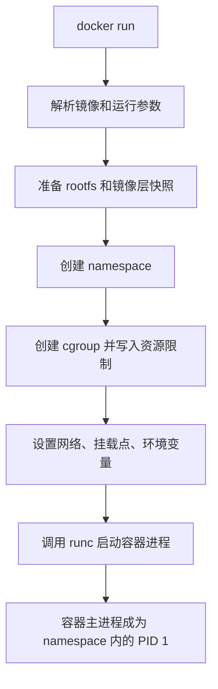
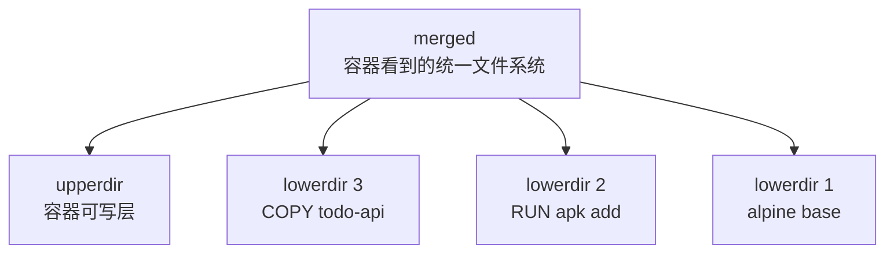

# 第 17 篇：容器运行原理

第 14 篇我们学会了用 Docker 运行 Todo API、PostgreSQL 和 Redis。第 15 篇把 Todo API 构建成了可发布镜像。第 16 篇用 Docker Compose 把多服务本地环境编排起来。

到这里，很多同学会自然产生一个问题：**容器到底是什么？**

容器不是一台轻量虚拟机。容器里的进程仍然运行在宿主机 Linux 内核之上，只是被 Linux 的 namespace、cgroups、联合文件系统等机制隔离和限制起来。理解这一点后，你再看 Docker、containerd、runc、Kubernetes Pod、资源限制、镜像层、容器逃逸和生产安全，就不会只停留在命令表面。

本篇特色项目是：**用 Linux 命令模拟容器隔离与资源限制**。

## 1. 本章学习目标

学完本篇后，你应该能够：

- 说明容器和虚拟机的本质区别。
- 理解容器进程仍然是宿主机上的普通 Linux 进程。
- 能解释 PID、UTS、Mount、Network、IPC、User namespace 的基本作用。
- 能使用 `unshare` 观察进程、主机名、挂载和网络隔离。
- 能解释 cgroups 如何限制 CPU、内存和 IO 等资源。
- 能用 cgroup v2 手动限制一个实验进程的资源。
- 能解释 UnionFS / OverlayFS 和 Docker 镜像分层的关系。
- 能使用 `chroot`、namespace、cgroups 和 rootfs 手动模拟一个简化容器。
- 能观察第 16 篇 Todo Compose 环境中 API 容器的 PID、namespace、cgroup 和挂载信息。
- 能把本篇原理对应回 Docker 命令、Compose 配置和后续 Kubernetes Pod。

本篇完成后，你会得到一个实验目录：

```text
container-lab/
├── rootfs/                 # 从 alpine 镜像导出的最小 rootfs
├── image-layers/           # 模拟镜像只读层
├── upper/                  # 模拟容器可写层
├── work/                   # overlayfs 工作目录
├── merged/                 # overlayfs 合并视图
└── mini-container.sh       # 手动模拟容器的脚本
```

你会亲手验证：

```text
容器 = 受隔离的进程 + 受限制的资源 + 分层文件系统 + 运行配置
```

## 2. 本章工作场景

真实公司里，容器原理不是只给底层工程师看的知识。后端开发、DevOps、SRE、Kubernetes 平台工程师都会遇到这些问题：

- 容器里 `ps` 只看到少量进程，但宿主机却能看到容器进程。
- 容器内 `hostname` 和宿主机不一样。
- 容器内访问 `127.0.0.1` 时访问的是自己，不是宿主机，也不是其他容器。
- 容器内写入文件后，删除容器文件就没了。
- 容器设置了 `--memory` 后进程被 OOM kill。
- 容器设置了 `--cpus` 后吞吐量下降。
- Dockerfile 中每条指令都形成镜像层，镜像体积越来越大。
- Kubernetes 中 Pod 设置 `resources.limits.memory` 后，应用没有输出错误就退出。
- 安全团队要求禁止 privileged、限制 capabilities、启用非 root 用户和只读根文件系统。

如果只会 `docker run`，这些现象会像一堆孤立问题。理解底层机制后，它们会串成一条清晰链路：

```text
Docker CLI / Compose
    -> containerd / runc
    -> Linux namespace
    -> Linux cgroups
    -> OverlayFS / rootfs
    -> 宿主机内核上的进程
```

本章模拟一个典型任务：

> 团队准备进入 Kubernetes 阶段。你需要向同事解释容器为什么不是虚拟机，为什么容器能隔离进程、网络和文件系统，为什么资源限制会影响应用行为，以及镜像分层为什么会影响交付和排障。

这就是本篇要解决的问题。

## 3. 前置知识

必须掌握：

- 第 2 篇 Linux 文件、目录、权限和软链接。
- 第 3 篇 Linux 进程、PID、前台后台任务和资源排查。
- 第 4 篇 Linux 网络、端口和 DNS 基础。
- 第 14 篇 Docker 镜像、容器、网络、数据卷。
- 第 15 篇 Dockerfile 与镜像分层。
- 第 16 篇 Docker Compose 多容器编排。

建议了解：

- `sudo`、`mount`、`ps`、`top`、`ip`、`findmnt` 基础用法。
- `/proc`、`/sys` 是 Linux 内核暴露运行状态的虚拟文件系统。
- Docker Desktop 在 Windows / macOS 上实际运行在 Linux 虚拟机或 WSL2 后端中。

本篇实验环境要求：

| 工具 | 要求 | 说明 |
|---|---|---|
| Linux | Ubuntu 22.04 / 24.04、Debian 或同类发行版 | 最推荐 |
| WSL2 Ubuntu | Windows 推荐 | 需要启用 WSL2，不是传统 WSL1 |
| macOS | 需要 Linux VM | macOS 内核不是 Linux，不能直接运行 namespace / cgroup 实验 |
| Docker | 可选但推荐 | 用来导出 Alpine rootfs 并观察真实容器 |
| util-linux | 必需 | 提供 `unshare`、`lsns`、`findmnt` |
| iproute2 | 必需 | 提供 `ip` |
| Python 3 | 推荐 | 用于内存限制实验 |

!!! warning "本篇实验会使用 sudo"
    namespace、mount、chroot、cgroup 相关命令需要管理员权限。请只在个人学习机、虚拟机或 WSL2 Ubuntu 中执行，不要在生产服务器、共享跳板机或公司核心环境中练习。

!!! note "关于 Alpine 版本"
    本篇使用 `alpine:3.23` 作为固定教学版本，是为了使用仍处于支持周期内的稳定分支，并让命令输出和前后章节保持稳定。真实项目应定期评估基础镜像版本，结合漏洞扫描、兼容性测试和团队基线决定何时升级到后续稳定版本。

!!! tip "本篇学习策略"
    第 14-16 篇是阶段三主线能力，必须完整完成；本篇属于底层原理训练。没有 Linux 管理员权限时，不要强行在公司机器上执行 `sudo`、`mount`、`unshare`、cgroup 写入等命令。你可以先完成 Docker 容器观察、镜像分层观察和原理复盘，把手动 namespace / cgroup 实验安排到 WSL2 Ubuntu、虚拟机或个人学习机中完成。

### 环境选择

=== "Linux / WSL2 Ubuntu"

    推荐直接完成本篇全部实验。执行前先确认：

    ```bash
    uname -a
    command -v unshare
    command -v lsns
    command -v findmnt
    stat -fc %T /sys/fs/cgroup
    ```

    如果 `stat` 输出 `cgroup2fs`，说明系统使用 cgroup v2，本篇 cgroup 手动实验可以继续。

=== "macOS"

    macOS 不能直接运行 Linux namespace、cgroup、OverlayFS 实验。建议使用以下方式之一：

    - 使用 Multipass、UTM、VirtualBox、VMware Fusion 安装 Ubuntu。
    - 使用远程 Linux 学习机。
    - 只阅读原理部分，在 Linux 环境中补做实验。

=== "Windows PowerShell"

    不建议在 PowerShell 中直接执行本篇 Linux 命令。推荐：

    ```powershell
    wsl -l -v
    wsl -d Ubuntu
    ```

    进入 WSL2 Ubuntu 后，按 Linux 命令继续实验。Docker Desktop 适合运行 Docker 容器，但本篇手动 namespace / cgroup 实验更适合在 WSL2 Ubuntu shell 中执行。

## 4. 核心概念

### 4.1 容器不是虚拟机

虚拟机通过 Hypervisor 虚拟出完整硬件，再运行一个完整操作系统。容器不虚拟硬件，也不启动一个新的内核。

```text
虚拟机：
应用 -> Guest OS -> 虚拟硬件 -> Hypervisor -> Host OS / 硬件

容器：
应用进程 -> Linux namespace / cgroups / rootfs -> 宿主机 Linux 内核
```

所以容器通常有这些特点：

- 启动快，因为本质上是启动进程。
- 镜像小，因为不需要完整 Guest OS。
- 共享宿主机内核，因此内核漏洞和内核能力会影响容器安全边界。
- 运行 Linux 容器需要 Linux 内核。Windows / macOS 上的 Linux 容器通常运行在 Linux VM 或 WSL2 中。

Docker 让容器用起来像一个小系统，但它的底层仍然是进程隔离和资源控制。

### 4.2 容器进程模型

启动一个容器后，容器内通常会看到自己的 1 号进程：

```bash
docker run --rm alpine:3.23 sh -c 'ps -o pid,ppid,comm'
```

预期类似：

```text
PID   PPID  COMMAND
1     0     sh
7     1     ps
```

但在宿主机上，这个 `sh` 仍然有一个宿主机 PID。容器中的 PID 是 PID namespace 里的视角，宿主机 PID 是全局视角。

这解释了一个重要事实：容器的主进程退出，容器就退出。容器不是传统虚拟机，不应该依赖多个后台守护进程维持运行。

### 4.3 Namespace

namespace 负责“看起来像独立环境”。常见 namespace 包括：

| namespace | 隔离内容 | 容器中的体现 |
|---|---|---|
| PID | 进程编号和进程树 | 容器内有自己的 PID 1 |
| UTS | 主机名和域名 | 容器内 hostname 可不同 |
| Mount | 挂载点视图 | 容器内看到自己的 rootfs |
| Network | 网卡、路由、防火墙规则 | 容器有自己的网络栈 |
| IPC | System V IPC、POSIX message queue | 进程间通信隔离 |
| User | 用户和用户组 ID 映射 | 容器内 root 可映射到宿主机非 root |
| Cgroup | cgroup 层级视图 | 进程只能看到部分资源控制信息 |

namespace 的作用是隔离“能看见什么”。它不直接限制 CPU 或内存用量。

### 4.4 Cgroups

cgroups 是 control groups 的缩写，用来限制、统计和隔离资源使用。

它能控制：

- CPU 使用比例。
- 内存上限。
- IO 权重或限制。
- 进程数量。
- 设备访问。

Docker 中这些参数背后都离不开 cgroups：

```bash
docker run --memory=128m --cpus=0.5 nginx
```

Kubernetes 中这些字段最终也会落到节点上的 cgroups：

```yaml
resources:
  requests:
    cpu: "100m"
    memory: "128Mi"
  limits:
    cpu: "500m"
    memory: "256Mi"
```

本篇不会编写 Kubernetes YAML，只先理解资源限制背后的 Linux 机制。

### 4.5 Rootfs、chroot 与容器文件系统

容器内看到的 `/` 不是宿主机的 `/`，而是容器 rootfs。

rootfs 可以理解为容器进程看到的根文件系统：

```text
/
├── bin
├── etc
├── lib
├── proc
└── usr
```

`chroot` 可以把一个进程的根目录切换到某个目录。它不是完整容器隔离，但能帮助你理解容器为什么能看到自己的 `/etc/os-release`、`/bin/sh` 和应用文件。

### 4.6 UnionFS 与 OverlayFS

UnionFS 不是特指某一个文件系统实现，而是一类“把多个目录叠成一个统一视图”的文件系统思想。Docker 在 Linux 上常见的存储驱动是 `overlay2`，底层使用 OverlayFS。

镜像分层可以理解为：

```text
merged  合并视图：容器看到的文件系统
upper   可写层：容器运行时写入或修改的文件
lower   只读层：镜像层 3
lower   只读层：镜像层 2
lower   只读层：镜像层 1
```

当容器修改只读层里的文件时，OverlayFS 会发生 copy-up：先把文件复制到可写层，再在可写层修改。只读镜像层不会被改变。

这解释了：

- 为什么删除容器后，容器可写层会消失。
- 为什么数据应该放到 volume，而不是容器可写层。
- 为什么 Dockerfile 层数和文件复制方式会影响镜像体积。
- 为什么同一个基础镜像层可以被多个镜像复用。

### 4.7 容器运行时

Docker 不会自己直接调用所有内核能力。现代容器链路大致是：

```text
docker CLI
  -> Docker Engine
  -> containerd
  -> runc
  -> Linux kernel
```

其中：

- Docker Engine 提供用户常用命令和 API。
- containerd 管理镜像、快照、容器生命周期。
- runc 按 OCI Runtime Specification 创建容器进程。
- Linux kernel 提供 namespace、cgroups、mount、capabilities 等能力。

下一篇会系统讲 OCI、containerd、runc 和 CRI。本篇先把 Linux 层的基础机制摸清楚。

## 5. 原理深入

### 5.1 docker run 背后发生了什么

执行：

```bash
docker run --rm -m 128m --cpus=0.5 --name demo alpine:3.23 sh
```

底层大致会发生：



从内核角度看，最终出现的是一个普通进程，只是它被放进了特定 namespace 和 cgroup，并使用了特定 rootfs。

### 5.2 Namespace 负责隔离视图

假设宿主机上有很多进程：

```text
宿主机 PID namespace
├── PID 1 systemd
├── PID 821 dockerd
├── PID 1030 containerd
├── PID 2201 postgres
└── PID 2305 todo-api
```

容器内可能只看到：

```text
容器 PID namespace
├── PID 1 todo-api
└── PID 12 ps
```

这不是因为其他宿主机进程不存在，而是容器进程所在的 PID namespace 看不到它们。

Network namespace 也是同理。容器内的 `lo`、`eth0`、路由表、iptables 规则属于容器自己的网络视图。容器访问 `127.0.0.1` 时访问的是自己的回环地址。

### 5.3 Cgroups 负责资源边界

namespace 让进程“看不到别人”，cgroups 让进程“不能无限用资源”。

以 cgroup v2 为例：

```text
/sys/fs/cgroup/
├── cgroup.controllers
├── cpu.max
├── memory.max
└── todo-lab/
    ├── cgroup.procs
    ├── cpu.max
    ├── memory.max
    └── memory.events
```

关键文件：

| 文件 | 作用 |
|---|---|
| `cgroup.procs` | 当前 cgroup 中的进程 PID |
| `cpu.max` | CPU 配额和周期 |
| `memory.max` | 内存上限 |
| `memory.current` | 当前内存使用 |
| `memory.events` | OOM、超过高水位等事件统计 |

例如：

```text
cpu.max = 50000 100000
```

表示每 100000 微秒周期内，最多使用 50000 微秒 CPU 时间，也就是约 0.5 个 CPU。

### 5.4 镜像层如何变成容器文件系统

Dockerfile 中每个会改变文件系统的步骤，通常会形成一个镜像层：

```dockerfile
FROM alpine:3.23
RUN apk add --no-cache ca-certificates
COPY todo-api /app/todo-api
```

运行时，容器会基于这些只读层加一个可写层：



如果应用把日志写到容器内部 `/app/logs/app.log`，这通常进入容器可写层。删除容器后就丢失。生产中更推荐：

- 日志输出到 stdout / stderr。
- 数据写入外部数据库、对象存储或 volume。
- 配置通过环境变量、配置文件挂载或 Secret 注入。

### 5.5 User namespace 与 root 的误解

很多容器内显示用户是 root：

```bash
docker run --rm alpine:3.23 id
```

输出可能是：

```text
uid=0(root) gid=0(root)
```

如果没有启用 user namespace 映射，这个 root 在宿主机内核看来也可能拥有较高权限，只是被 capabilities、seccomp、AppArmor / SELinux、mount 和 namespace 限制了一部分。

生产环境不要把“容器内 root”当成安全默认值。更好的做法是：

- 镜像使用非 root 用户运行。
- 不使用 `--privileged`。
- 删除不必要 Linux capabilities。
- 使用只读根文件系统。
- 避免挂载宿主机敏感路径。
- 在 Kubernetes 中设置 `runAsNonRoot`、`allowPrivilegeEscalation: false` 等安全上下文。

### 5.6 容器隔离不是绝对安全边界

容器隔离依赖共享内核。只要共享内核，就需要认真对待：

- 内核漏洞。
- 过高的 capabilities。
- `privileged` 容器。
- 宿主机目录挂载。
- Docker socket 挂载。
- 不可信镜像。
- 运行时逃逸漏洞。

这就是为什么生产环境不仅要“能跑容器”，还要有镜像扫描、最小权限、运行时安全策略、节点隔离和审计。

## 6. 手把手实验

### 6.1 实验目标

本实验会完成：

- 创建安全的本地实验目录。
- 对实验环境做自检，判断哪些步骤必做、哪些步骤可选。
- 观察第 16 篇 Todo Compose 环境中 API 容器的底层信息。
- 观察真实 Docker 容器的进程、cgroup 和文件系统信息。
- 使用 `unshare` 分别体验 PID、UTS、Mount、Network namespace。
- 使用 Docker 导出 Alpine rootfs。
- 使用 `chroot` 进入 rootfs。
- 使用 cgroup v2 限制一个实验进程的内存和 CPU。
- 使用 OverlayFS 模拟镜像层和容器可写层。
- 编写 `mini-container.sh`，手动模拟一个简化容器。
- 验证和清理所有实验资源。

建议按三条路线学习：

| 路线 | 适合人群 | 必做内容 |
|---|---|---|
| 基础观察路线 | 第一次接触容器原理的新手 | 环境自检、Todo 容器观察、Docker 资源限制观察 |
| 手动模拟路线 | 想理解 namespace、rootfs、cgroup 的学习者 | `unshare`、`chroot`、cgroup v2、`mini-container.sh` |
| 进阶扩展路线 | 想深入镜像层和排障的学习者 | OverlayFS、`nsenter`、cgroup 指标和生产安全映射 |

如果你的系统不支持某个底层实验，不代表课程失败。真实工作中也经常遇到不同发行版、WSL2、Docker Desktop、云主机安全策略带来的差异。本篇的关键是理解机制和掌握排查方法。

### 6.2 实验环境准备

本篇建议在 Linux / WSL2 Ubuntu 中执行：

```bash
uname -a
id
docker version
command -v docker
command -v unshare
command -v lsns
command -v findmnt
command -v ip
command -v python3
unshare --help | head
lsns | head
stat -fc %T /sys/fs/cgroup
test -f /sys/fs/cgroup/cgroup.controllers && cat /sys/fs/cgroup/cgroup.controllers || true
```

判断方式：

| 检查项 | 预期 | 不满足时怎么办 |
|---|---|---|
| `docker version` | 能看到 Client 和 Server | 启动 Docker Desktop 或 Docker Engine |
| `command -v unshare` | 输出命令路径 | 安装 `util-linux` |
| `command -v ip` | 输出命令路径 | 安装 `iproute2` 或 `iproute` |
| `stat -fc %T /sys/fs/cgroup` | 推荐输出 `cgroup2fs` | 不能手动做 cgroup v2 实验时，使用 6.12 Docker 替代实验 |
| `cgroup.controllers` | 包含 `cpu`、`memory` 更好 | 如果缺失 controller，跳过手动 cgroup，保留 Docker 观察实验 |
| `python3` | 输出命令路径 | 不做 Python 内存限制实验，或安装 Python 3 |

安装必要工具：

=== "Ubuntu / Debian"

    ```bash
    sudo apt update
    sudo apt install -y util-linux iproute2 procps python3
    ```

=== "Fedora / RHEL 系"

    ```bash
    sudo dnf install -y util-linux iproute procps-ng python3
    ```

=== "macOS / Windows"

    请进入 Ubuntu VM 或 WSL2 Ubuntu 后执行 Linux 命令。macOS Terminal 和 Windows PowerShell 不能直接完成本篇实验。

### 6.3 创建实验目录

```bash
export LAB="$HOME/container-lab"
mkdir -p "$LAB"
cd "$LAB"
pwd
```

预期输出路径类似：

```text
/home/your-user/container-lab
```

为什么要使用单独目录？因为后面会创建 rootfs、OverlayFS 目录和脚本。把所有内容限定在 `~/container-lab` 可以降低误操作风险。

### 6.4 观察 Todo API 容器和真实容器

如果你已经完成第 16 篇，可以先从 Todo Compose 环境观察真实项目容器。请进入 Todo Platform 应用仓库根目录，也就是包含 `compose.yaml` 的目录：

```bash
docker compose up -d
docker compose ps
```

找到 API 容器 ID：

```bash
TODO_API_CONTAINER="$(docker compose ps -q api)"
echo "$TODO_API_CONTAINER"
```

查看 API 容器在宿主机上的主进程 PID：

```bash
TODO_API_PID="$(docker inspect "$TODO_API_CONTAINER" --format '{{.State.Pid}}')"
echo "$TODO_API_PID"
ps -o pid,ppid,comm -p "$TODO_API_PID"
```

查看 namespace：

```bash
sudo ls -l /proc/"$TODO_API_PID"/ns
```

查看 cgroup 和挂载信息：

```bash
cat /proc/"$TODO_API_PID"/cgroup
docker inspect "$TODO_API_CONTAINER" --format '{{json .Mounts}}'
docker inspect "$TODO_API_CONTAINER" --format 'Memory={{.HostConfig.Memory}} NanoCpus={{.HostConfig.NanoCpus}}'
```

这些命令能把第 16 篇的 Compose 服务和本篇底层机制连起来：

- `api` service 最终是宿主机上的一个进程。
- API 进程拥有自己的 namespace 视图。
- Compose 中配置的 volume 会体现在容器挂载信息中。
- 如果 Compose 或 Docker 设置了资源限制，最终会进入 cgroup。

如果你暂时没有 Todo Platform 应用仓库，也可以使用下面的独立 demo 容器继续实验。

先运行一个短生命周期容器：

```bash
docker run --rm alpine:3.23 sh -c 'echo "hostname=$(hostname)"; ps -o pid,ppid,comm; cat /proc/1/cgroup'
```

你会看到容器内自己的主机名、进程列表和 cgroup 信息。

再启动一个长运行容器：

```bash
docker run -d --name internals-demo alpine:3.23 sleep 1d
docker inspect internals-demo --format 'State.Pid={{.State.Pid}}'
```

输出中的 `State.Pid` 是容器主进程在宿主机上的 PID。把它保存为变量：

```bash
HOST_PID="$(docker inspect internals-demo --format '{{.State.Pid}}')"
echo "$HOST_PID"
```

查看该进程的 namespace：

```bash
sudo ls -l /proc/"$HOST_PID"/ns
```

你会看到类似：

```text
cgroup -> cgroup:[402653xxxx]
ipc -> ipc:[402653xxxx]
mnt -> mnt:[402653xxxx]
net -> net:[402653xxxx]
pid -> pid:[402653xxxx]
uts -> uts:[402653xxxx]
```

这些就是容器隔离视图的内核对象。

查看容器内外 PID 视角：

```bash
docker exec internals-demo ps -o pid,ppid,comm
ps -o pid,ppid,comm -p "$HOST_PID"
```

重点观察：

- 容器内 `sleep` 可能是 PID 1。
- 宿主机上同一个进程有另一个 PID。
- 这说明容器 PID 是 namespace 内视角，不是宿主机全局 PID。

清理：

```bash
docker rm -f internals-demo
```

### 6.5 使用 UTS namespace 隔离主机名

执行：

```bash
hostname
sudo unshare --uts --fork bash
```

进入新 shell 后：

```bash
hostname todo-uts
hostname
exit
```

回到原 shell 后：

```bash
hostname
```

预期现象：

- 新 namespace 里 hostname 可以改成 `todo-uts`。
- 退出后宿主机 hostname 没有变化。

这就是容器可以拥有独立主机名的基础。

### 6.6 使用 PID namespace 隔离进程编号

执行：

```bash
sudo unshare --pid --fork --mount-proc bash
```

进入新 shell 后：

```bash
echo "inside pid namespace"
ps -ef
echo "my pid is $$"
exit
```

预期现象：

- 新 shell 在 namespace 中通常是 PID 1。
- `ps -ef` 只能看到 namespace 内进程。
- 退出 PID 1 后，这个 namespace 里的进程也会结束。

这解释了为什么容器主进程退出后容器会停止。

### 6.7 使用 Network namespace 隔离网络

执行：

```bash
sudo unshare --net --fork bash
```

进入新 shell 后：

```bash
ip addr
ip route
ping -c 1 127.0.0.1
exit
```

你可能会看到只有 `lo` 回环网卡，并且没有默认路由。某些系统中 `lo` 默认还是 down 状态，这时 `ping 127.0.0.1` 也可能失败。

这说明 Network namespace 隔离的是网络设备、IP、路由和相关网络栈。Docker 会在此基础上创建 veth pair、bridge、NAT 和 DNS，让容器可以访问外部网络和其他容器。

### 6.8 使用 Mount namespace 隔离挂载点

先准备目录：

```bash
mkdir -p "$LAB/mnt"
```

进入新的 mount namespace：

```bash
sudo env LAB="$LAB" unshare --mount --propagation private --fork bash
```

在新 shell 中执行：

```bash
mount -t tmpfs tmpfs "$LAB/mnt"
echo "hello from mount namespace" > "$LAB/mnt/message.txt"
findmnt "$LAB/mnt"
cat "$LAB/mnt/message.txt"
exit
```

回到原 shell 后：

```bash
findmnt "$LAB/mnt" || echo "not mounted outside"
ls -la "$LAB/mnt"
```

预期现象：

- 新 namespace 中能看到 tmpfs 挂载。
- 退出后宿主机原 namespace 看不到这个挂载。
- 这说明容器可以有自己的挂载视图。

如果你仍然看到了挂载，说明系统挂载传播策略和实验环境不符合预期。可以执行：

```bash
sudo umount "$LAB/mnt" 2>/dev/null || true
```

### 6.9 导出 Alpine rootfs

使用 Docker 导出一个最小 rootfs：

```bash
cd "$LAB"
mkdir -p rootfs
docker pull alpine:3.23
CID="$(docker create alpine:3.23)"
docker export "$CID" | tar -C rootfs -xf -
docker rm "$CID"
```

查看 rootfs：

```bash
ls rootfs
cat rootfs/etc/os-release
```

这个 `rootfs` 就是后面简化容器要看到的根文件系统。

### 6.10 使用 chroot 切换根目录

进入 rootfs：

```bash
sudo chroot "$LAB/rootfs" /bin/sh
```

在 chroot 中执行：

```sh
cat /etc/os-release
pwd
ls /
hostname
exit
```

你会看到 Alpine 的 `/etc/os-release`，说明进程看到的 `/` 已经变成了 `rootfs`。

但要注意：`chroot` 不是容器。它没有自动隔离 PID、网络、主机名、cgroup，也不是安全边界。它只是帮助我们理解容器 rootfs。

### 6.11 使用 cgroup v2 限制资源

先确认系统是 cgroup v2：

```bash
stat -fc %T /sys/fs/cgroup
cat /sys/fs/cgroup/cgroup.controllers
```

如果输出不是 `cgroup2fs`，说明本节命令可能不适用。你可以跳到 6.12，用 Docker 的 `--memory` 和 `--cpus` 观察资源限制效果。

再检查本篇要用到的控制文件是否存在：

```bash
test -f /sys/fs/cgroup/cgroup.controllers && cat /sys/fs/cgroup/cgroup.controllers
test -w /sys/fs/cgroup || echo "需要 sudo 写入 cgroup"
```

如果当前系统没有暴露 `cpu` 或 `memory` controller，或者公司学习机限制了手动创建 cgroup，请不要硬改系统配置，直接使用下一节 Docker 资源限制实验。真实工作中通常通过 Docker、containerd 或 Kubernetes 管理 cgroup，而不是手写 `/sys/fs/cgroup`。

创建实验 cgroup：

```bash
CG=/sys/fs/cgroup/todo-lab
sudo mkdir -p "$CG"
echo "50000 100000" | sudo tee "$CG/cpu.max"
echo "67108864" | sudo tee "$CG/memory.max"
cat "$CG/cpu.max"
cat "$CG/memory.max"
```

含义：

- `cpu.max = 50000 100000`：最多使用约 0.5 个 CPU。
- `memory.max = 67108864`：最多使用 64 MiB 内存。cgroup v2 标准写法使用字节数，避免 `64M` 在部分内核上写入失败。

启动一个受限制的 Python 进程：

```bash
sudo sh -c '
echo $$ > /sys/fs/cgroup/todo-lab/cgroup.procs
python3 - << "PY"
import time

buf = []
step = 10 * 1024 * 1024

while True:
    buf.append(bytearray(step))
    print(f"allocated {len(buf) * 10} MiB", flush=True)
    time.sleep(0.2)
PY
'
```

预期现象：

- Python 进程会逐步分配内存。
- 超过限制后，进程可能被 OOM kill，终端看到 `Killed`。
- 不同发行版输出略有差异。

查看事件：

```bash
cat "$CG/memory.events"
```

重点看：

| 字段 | 含义 |
|---|---|
| `oom` | 发生过 OOM 判断 |
| `oom_kill` | 发生过 OOM kill |
| `max` | 达到过 `memory.max` 限制 |

清理 cgroup：

```bash
sudo rmdir "$CG"
```

如果提示目录非空，先确认没有进程还在里面：

```bash
cat "$CG/cgroup.procs"
```

如果 `echo $$ > /sys/fs/cgroup/todo-lab/cgroup.procs` 报错，常见原因是当前环境由 systemd、Docker Desktop 或云主机安全策略托管 cgroup，不允许手动迁移进程。此时不要继续改宿主机 cgroup 层级，使用下一节 Docker 替代实验即可。

### 6.12 使用 Docker 观察资源限制

如果你的系统不适合手动写 cgroup，可以用 Docker 命令观察相同思想：

```bash
docker run --rm --memory=64m --cpus=0.5 alpine:3.23 sh -c 'cat /proc/self/cgroup; echo ok'
```

查看 Docker 容器资源参数：

```bash
docker run -d --name limit-demo --memory=64m --cpus=0.5 alpine:3.23 sleep 1d
docker inspect limit-demo --format 'Memory={{.HostConfig.Memory}} NanoCpus={{.HostConfig.NanoCpus}}'
docker rm -f limit-demo
```

预期：

- `Memory` 会显示字节数。
- `NanoCpus` 会显示 CPU 配额，例如 0.5 CPU 通常是 `500000000`。

这说明 Docker 的资源限制最终会转成运行时和内核能理解的配置。

### 6.13 使用 OverlayFS 模拟镜像层

准备目录：

```bash
cd "$LAB"
mkdir -p image-layers/layer1 image-layers/layer2 upper work merged
echo "base app file" > image-layers/layer1/app.txt
echo "base config" > image-layers/layer1/config.txt
echo "layer2 readme" > image-layers/layer2/readme.txt
df -T "$LAB"
```

`df -T "$LAB"` 用来确认实验目录所在文件系统。OverlayFS 要求 `upperdir` 和 `workdir` 位于同一个文件系统。部分 WSL2、网络文件系统或特殊挂载目录可能不支持 overlay，这种情况下请换到 Linux VM 的普通本地目录，或跳过本节挂载实验。

挂载 overlay：

```bash
sudo mount -t overlay overlay \
  -o lowerdir="$LAB/image-layers/layer2:$LAB/image-layers/layer1",upperdir="$LAB/upper",workdir="$LAB/work" \
  "$LAB/merged"
```

查看合并视图：

```bash
ls "$LAB/merged"
cat "$LAB/merged/app.txt"
cat "$LAB/merged/readme.txt"
```

修改合并视图中的文件：

```bash
echo "changed in container writable layer" | sudo tee "$LAB/merged/app.txt"
cat "$LAB/merged/app.txt"
cat "$LAB/image-layers/layer1/app.txt"
cat "$LAB/upper/app.txt"
```

重点观察：

- `merged/app.txt` 显示修改后的内容。
- `image-layers/layer1/app.txt` 仍然是原始内容。
- `upper/app.txt` 保存了修改后的内容。

这就是容器可写层的基本效果。

卸载：

```bash
sudo umount "$LAB/merged"
```

如果挂载失败，常见原因是：

- 当前文件系统不支持 OverlayFS。
- WSL2 或虚拟化环境限制了 overlay 挂载。
- `upperdir` 和 `workdir` 不在同一文件系统。

这种情况下可以跳过本节挂载实验，但要理解 Docker `overlay2` 的分层思想。

### 6.14 编写简化容器脚本

创建脚本：

```bash
cat > "$LAB/mini-container.sh" <<'EOF'
#!/usr/bin/env bash
set -euo pipefail

LAB="${LAB:-$HOME/container-lab}"
ROOTFS="$LAB/rootfs"
CGROUP="${CGROUP:-/sys/fs/cgroup/todo-mini}"

if [[ "${EUID}" -ne 0 ]]; then
  echo "please run with sudo"
  exit 1
fi

if [[ ! -x "$ROOTFS/bin/sh" ]]; then
  echo "rootfs is missing: $ROOTFS"
  exit 1
fi

if [[ -f /sys/fs/cgroup/cgroup.controllers ]]; then
  mkdir -p "$CGROUP"
  echo "100000 100000" > "$CGROUP/cpu.max"
  echo "134217728" > "$CGROUP/memory.max"
  echo $$ > "$CGROUP/cgroup.procs"
fi

hostname todo-mini
mkdir -p "$ROOTFS/proc"
mount -t proc proc "$ROOTFS/proc"

cleanup() {
  umount -l "$ROOTFS/proc" 2>/dev/null || true
}
trap cleanup EXIT

chroot "$ROOTFS" /bin/sh -c '
echo "inside mini container"
echo "hostname: $(hostname)"
echo "pid: $$"
echo
echo "[processes]"
ps
echo
echo "[cgroup]"
cat /proc/1/cgroup
echo
echo "type exit to leave"
/bin/sh
'
EOF

chmod +x "$LAB/mini-container.sh"
```

这个脚本做了几件事：

| 步骤 | 作用 |
|---|---|
| 检查 root 权限 | namespace、mount、chroot、cgroup 需要权限 |
| 检查 rootfs | 确保 Alpine rootfs 已准备好 |
| 创建 cgroup | 设置 CPU 和内存限制 |
| 设置 hostname | 演示 UTS namespace |
| 挂载 `/proc` | 让 chroot 内可以看到自己的进程信息 |
| 注册 `trap cleanup` | 退出时卸载 rootfs 内的 `/proc` |
| 执行 `chroot` | 切换根文件系统 |
| 启动 `/bin/sh` | 模拟容器内交互 shell |

注意，脚本本身不创建 namespace。namespace 由下一步的 `unshare` 创建，这样你能清楚看到每个机制负责什么。

### 6.15 手动启动简化容器

执行：

```bash
sudo env LAB="$LAB" unshare --fork --pid --uts --mount --propagation private "$LAB/mini-container.sh"
```

进入后执行：

```sh
hostname
ps
cat /etc/os-release
cat /proc/1/cgroup
exit
```

你应该能观察到：

- hostname 是 `todo-mini`。
- 进程视图很小，当前 shell 在 PID namespace 内。
- `/etc/os-release` 来自 Alpine rootfs。
- 进程被放入 `todo-mini` cgroup。
- 退出 shell 后，简化容器结束。

清理 cgroup：

```bash
sudo rmdir /sys/fs/cgroup/todo-mini 2>/dev/null || true
```

这个简化容器还不完整。它没有：

- 完整网络配置。
- 用户 namespace 映射。
- capabilities 限制。
- seccomp、AppArmor、SELinux。
- 镜像拉取和解包。
- 日志管理。
- OCI 配置文件。
- 生命周期管理。

但它足够说明：容器不是魔法，而是 Linux 内核能力组合。

### 6.16 对照 Docker 的等价能力

| 手动实验 | Docker / Kubernetes 中的对应能力 |
|---|---|
| `unshare --pid` | 容器 PID namespace |
| `unshare --uts` | 容器 hostname |
| `unshare --net` | 容器 Network namespace、Pod 网络 |
| `unshare --mount` | 容器 mount namespace |
| `chroot rootfs` | 容器 rootfs |
| cgroup v2 `memory.max` | Docker `--memory`、Kubernetes memory limit |
| cgroup v2 `cpu.max` | Docker `--cpus`、Kubernetes CPU limit |
| OverlayFS lower / upper / merged | Docker `overlay2` 镜像层和容器可写层 |

后续 Kubernetes 中 Pod 的本质也是一组共享部分 namespace、受 cgroups 限制、使用镜像 rootfs 启动的容器进程。

### 6.17 使用 nsenter 观察容器 namespace

`nsenter` 可以从宿主机进入某个进程所在的 namespace。它常用于底层排障，例如容器没有 shell、网络不通、或者你需要从宿主机视角进入容器网络 namespace 查看路由。

启动一个 demo 容器：

```bash
docker run -d --name nsenter-demo alpine:3.23 sleep 1d
DEMO_PID="$(docker inspect nsenter-demo --format '{{.State.Pid}}')"
echo "$DEMO_PID"
```

进入它的 UTS 和 PID namespace 查看视图：

```bash
sudo nsenter --target "$DEMO_PID" --uts hostname
sudo nsenter --target "$DEMO_PID" --pid --mount ps -o pid,ppid,comm
```

进入它的 Network namespace 查看网卡：

```bash
sudo nsenter --target "$DEMO_PID" --net ip addr
```

清理：

```bash
docker rm -f nsenter-demo
```

`nsenter` 是很强的工具。生产环境使用时必须受权限控制和审计，因为它可以绕过很多容器内工具缺失带来的限制，直接从宿主机进入目标 namespace。

### 6.18 清理实验资源

先卸载可能残留的挂载：

```bash
sudo umount "$LAB/merged" 2>/dev/null || true
sudo umount "$LAB/rootfs/proc" 2>/dev/null || true
```

删除实验 cgroup：

```bash
sudo rmdir /sys/fs/cgroup/todo-lab 2>/dev/null || true
sudo rmdir /sys/fs/cgroup/todo-mini 2>/dev/null || true
```

确认实验目录路径：

```bash
echo "$LAB"
```

只在路径确认为 `~/container-lab` 后执行清理：

```bash
case "$LAB" in
  "$HOME/container-lab")
    sudo rm -rf "$LAB"
    ;;
  *)
    echo "refuse to remove unexpected path: $LAB"
    ;;
esac
```

这里故意加路径判断，是为了避免变量为空或路径错误时误删其他目录。生产脚本也应该有这种防护意识。

### 6.19 实验验收

完成本篇后，你应该能独立执行或解释以下流程。下面命令不包含占位符，可以复制执行：

```bash
export LAB="$HOME/container-lab"
mkdir -p "$LAB"

docker run -d --name internals-demo alpine:3.23 sleep 1d
HOST_PID="$(docker inspect internals-demo --format '{{.State.Pid}}')"
echo "$HOST_PID"
sudo ls -l /proc/"$HOST_PID"/ns
cat /proc/"$HOST_PID"/cgroup
docker rm -f internals-demo

stat -fc %T /sys/fs/cgroup
test -f /sys/fs/cgroup/cgroup.controllers && cat /sys/fs/cgroup/cgroup.controllers || true

docker run --rm --memory=64m --cpus=0.5 alpine:3.23 sh -c 'cat /proc/self/cgroup; echo ok'
```

如果你已经完成 rootfs、OverlayFS 和 `mini-container.sh` 实验，还应能执行：

```bash
test -x "$LAB/rootfs/bin/sh" && sudo chroot "$LAB/rootfs" /bin/sh -c 'cat /etc/os-release'
test -x "$LAB/mini-container.sh" && sudo env LAB="$LAB" unshare --fork --pid --uts --mount --propagation private "$LAB/mini-container.sh"
```

OverlayFS 验收命令如下。如果挂载失败，请根据错误信息判断是否属于文件系统或虚拟化环境限制：

```bash
cd "$LAB"
mkdir -p image-layers/layer1 image-layers/layer2 upper work merged
echo "base app file" > image-layers/layer1/app.txt
echo "layer2 readme" > image-layers/layer2/readme.txt
sudo mount -t overlay overlay \
  -o lowerdir="$LAB/image-layers/layer2:$LAB/image-layers/layer1",upperdir="$LAB/upper",workdir="$LAB/work" \
  "$LAB/merged"
ls "$LAB/merged"
sudo umount "$LAB/merged"
```

验收标准：

- 能说明容器进程为什么在容器内外有不同 PID。
- 能解释 hostname 隔离来自 UTS namespace。
- 能解释容器网络为什么有自己的 `lo`、`eth0` 和路由表。
- 能解释 cgroup v2 中 `cpu.max`、`memory.max`、`memory.events` 的含义。
- 能解释 OverlayFS 的 lower、upper、work、merged。
- 能使用 rootfs + namespace + cgroup 手动模拟简化容器。

## 7. 真实工作案例

某团队把 Todo API 部署到 Kubernetes 后，发现一个现象：服务在高峰期偶尔退出，但应用日志中没有 panic，也没有业务错误。

排障过程：

1. SRE 查看 Pod 状态，发现退出原因是 `OOMKilled`。
2. 查看 Deployment，发现 `resources.limits.memory` 设置为 `256Mi`。
3. 后端开发查看应用指标，发现某个批量统计接口会一次性加载大量 Todo 数据。
4. 平台工程师解释：Kubernetes memory limit 会落到节点 cgroup，进程超过限制后可能被内核 OOM kill。
5. 团队最终同时做了三件事：
   - 优化接口，改成分页统计。
   - 增加内存指标和压测。
   - 根据真实使用量调整 request 和 limit。

如果团队不理解 cgroups，很容易误判成“Go 程序自己崩了”或“Kubernetes 不稳定”。理解底层后，排查路径会清晰很多。

在本地开发阶段，也会遇到类似问题。比如第 16 篇 Todo Compose 环境中，API 容器启动失败，后端开发先看 `docker compose logs api`，DevOps 再用下面的命令确认它到底有没有主进程、是否进入了预期 namespace、是否挂载了配置和迁移目录：

```bash
TODO_API_CONTAINER="$(docker compose ps -q api)"
TODO_API_PID="$(docker inspect "$TODO_API_CONTAINER" --format '{{.State.Pid}}')"
ps -o pid,ppid,comm -p "$TODO_API_PID"
sudo ls -l /proc/"$TODO_API_PID"/ns
docker inspect "$TODO_API_CONTAINER" --format '{{json .Mounts}}'
```

这类观察能帮助团队把问题从“Compose 不好用”拆成更具体的方向：应用进程是否存在、启动命令是否正确、挂载是否正确、依赖服务是否正常、资源限制是否过紧。

另一个真实场景是镜像体积优化。某个 Go 服务镜像超过 1GB，原因是 Dockerfile 中先 `COPY . .`，再构建，导致测试数据、临时文件和构建缓存进入镜像层。团队通过 `.dockerignore`、多阶段构建和镜像层分析，把镜像缩小到几十 MB。这个过程背后就是镜像层和 UnionFS 思想。

职责边界通常是：

| 角色 | 关注点 |
|---|---|
| 后端开发 | 容器主进程、日志、内存使用、镜像内容 |
| DevOps | Dockerfile、镜像层、运行参数、Compose / CI |
| SRE | cgroup 指标、OOM、CPU throttling、节点资源 |
| 安全工程师 | root 权限、capabilities、seccomp、逃逸风险 |
| 平台工程师 | containerd、runc、CRI、Kubernetes 资源模型 |
| 架构师 | 容器边界、服务拆分、资源容量和交付规范 |

## 8. 常见错误

| 错误现象 | 常见原因 | 修复方向 |
|---|---|---|
| 把容器当成完整虚拟机 | 误以为容器有独立内核 | 理解容器共享宿主机 Linux 内核 |
| 容器主进程退出后容器停止 | 容器生命周期绑定主进程 | 让应用以前台主进程运行 |
| 容器内 `127.0.0.1` 访问不到数据库 | Network namespace 隔离 | 容器间使用 service 名或容器名访问 |
| 宿主机能看到容器进程 | 容器进程仍是宿主机进程 | 用 `/proc/<pid>/ns` 观察 namespace |
| `unshare` 报权限不足 | 当前用户缺少权限或系统禁用用户 namespace | 使用学习 VM / WSL2，必要时用 `sudo` |
| Mount 实验影响宿主机 | 挂载传播设置不当 | 使用 `--propagation private`，实验后 `umount` |
| 手动 cgroup 写入失败 | 系统不是 cgroup v2 或权限不足 | 使用 Docker 资源限制实验替代 |
| 写入 `memory.max` 报 `Invalid argument` | 使用了当前内核不接受的单位格式 | 使用字节数，例如 `67108864` |
| Python 内存实验被 `Killed` | 触发 cgroup 内存限制 | 这是预期结果，查看 `memory.events` |
| OverlayFS 挂载失败 | 文件系统或 WSL2 环境限制 | 换 Linux VM，或只阅读原理 |
| `nsenter` 失败 | 没有 sudo 权限，或目标容器已退出 | 先确认 `docker inspect` 中 `State.Pid` 非 0，再用 sudo |
| chroot 后命令缺失 | rootfs 太小 | Alpine 只包含 busybox 工具，按需安装或换 rootfs |
| 删除容器后数据丢失 | 数据写在容器可写层 | 使用 volume 或外部存储 |
| 镜像体积异常大 | 文件进入了早期镜像层 | 检查 `.dockerignore` 和 Dockerfile 层顺序 |
| 容器内 root 被误认为绝对安全 | 没理解 user namespace 和 capabilities | 使用非 root、限制权限、避免 privileged |
| Kubernetes Pod OOM 无应用日志 | 进程被内核 OOM kill | 查看 Pod 事件、cgroup 指标和内存曲线 |

## 9. 排障方法

### 9.1 判断容器主进程

下面用 `CONTAINER` 代表你要排查的容器名或容器 ID。排查 Todo Compose 环境时，可以先执行：

```bash
CONTAINER="$(docker compose ps -q api)"
```

如果是普通 Docker 容器，可以手动指定：

```bash
CONTAINER=internals-demo
```

```bash
docker inspect "$CONTAINER" --format 'Pid={{.State.Pid}} Status={{.State.Status}} ExitCode={{.State.ExitCode}}'
```

重点看：

- `Pid` 为 `0` 通常表示容器不在运行。
- `ExitCode` 非 0 表示主进程异常退出。
- 如果容器不断重启，先看主进程日志和退出码。

### 9.2 查看 namespace

```bash
HOST_PID="$(docker inspect "$CONTAINER" --format '{{.State.Pid}}')"
sudo ls -l /proc/"$HOST_PID"/ns
```

如果两个进程某个 namespace 链接编号相同，说明它们共享这个 namespace。Kubernetes Pod 内多个容器通常共享 Network namespace，因此它们可以通过 `localhost` 互相访问端口。

### 9.3 查看 cgroup 信息

在容器内：

```bash
cat /proc/self/cgroup
```

在宿主机上：

```bash
HOST_PID="$(docker inspect "$CONTAINER" --format '{{.State.Pid}}')"
cat /proc/"$HOST_PID"/cgroup
```

cgroup v2 环境中，还可以查看：

```bash
CGROUP_PATH="$(cat /proc/"$HOST_PID"/cgroup | awk -F: 'NR==1 {print $3}')"
sudo cat "/sys/fs/cgroup${CGROUP_PATH}/memory.current" 2>/dev/null || true
sudo cat "/sys/fs/cgroup${CGROUP_PATH}/memory.events" 2>/dev/null || true
sudo cat "/sys/fs/cgroup${CGROUP_PATH}/cpu.stat" 2>/dev/null || true
```

重点看：

- `memory.events` 中 `oom_kill` 是否增加。
- `cpu.stat` 中 throttling 相关指标是否持续增加。
- Kubernetes 中对应现象通常表现为 Pod `OOMKilled` 或 CPU throttling。

### 9.4 查看容器资源配置

```bash
docker inspect "$CONTAINER" --format 'Memory={{.HostConfig.Memory}} NanoCpus={{.HostConfig.NanoCpus}} PidsLimit={{.HostConfig.PidsLimit}}'
```

如果 `Memory=0`，说明 Docker 没有设置内存上限。生产环境不建议长期无限制运行关键服务，否则单个进程可能耗尽节点资源。

### 9.5 排查 OOMKilled

Docker 场景：

```bash
docker inspect "$CONTAINER" --format 'OOMKilled={{.State.OOMKilled}} ExitCode={{.State.ExitCode}}'
docker logs --tail 100 "$CONTAINER"
```

Kubernetes 场景后续会使用：

```bash
kubectl describe pod <pod-name>
kubectl logs <pod-name> --previous
```

判断方式：

- `OOMKilled=true` 或 Pod 事件中出现 `OOMKilled`，说明超过内存限制。
- 应用日志可能没有错误，因为进程是被内核直接杀掉。
- 修复方向包括优化内存使用、分页处理、增加监控、合理设置 request / limit。

### 9.6 排查 CPU throttling

Docker 层先看资源限制：

```bash
docker inspect "$CONTAINER" --format 'NanoCpus={{.HostConfig.NanoCpus}} CpuQuota={{.HostConfig.CpuQuota}} CpuPeriod={{.HostConfig.CpuPeriod}}'
```

cgroup v2 中看：

```bash
HOST_PID="$(docker inspect "$CONTAINER" --format '{{.State.Pid}}')"
CGROUP_PATH="$(cat /proc/"$HOST_PID"/cgroup | awk -F: 'NR==1 {print $3}')"
sudo cat "/sys/fs/cgroup${CGROUP_PATH}/cpu.stat" 2>/dev/null || true
```

如果 `nr_throttled`、`throttled_usec` 持续增加，说明进程被 CPU 限制压住。修复方向包括：

- 优化热点代码。
- 调整并发度。
- 增加 CPU limit。
- 区分 CPU request 和 limit 的调度含义。

### 9.7 排查容器文件丢失

查看容器挂载：

```bash
docker inspect "$CONTAINER" --format '{{json .Mounts}}'
```

如果数据没有挂载 volume，而是写入容器内部路径，删除容器后就会丢失。数据库、上传文件、运行时数据都不应该依赖容器可写层。

### 9.8 排查镜像层过大

```bash
IMAGE=alpine:3.23
docker history "$IMAGE"
docker image inspect "$IMAGE" --format '{{.Size}}'
```

重点看：

- 哪一层体积异常大。
- 是否把 `.git`、测试数据、日志、临时文件复制进镜像。
- 是否在同一层中创建又删除大文件。删除只影响后续层，不能抹掉前面层已经记录的内容。

修复方向：

- 使用 `.dockerignore`。
- 调整 Dockerfile 指令顺序。
- 使用多阶段构建。
- 在同一个 `RUN` 中完成安装和清理。

## 10. 生产环境注意事项

### 10.1 不要把容器当成安全沙箱

容器隔离强于普通进程，但弱于完整虚拟机的硬件虚拟化隔离。生产环境要降低逃逸和横向移动风险：

- 不运行不可信镜像。
- 不使用 `--privileged`。
- 不挂载 Docker socket。
- 不挂载宿主机根目录。
- 限制 capabilities。
- 开启 seccomp、AppArmor 或 SELinux。
- 使用非 root 用户。

### 10.2 资源限制必须结合观测

只设置 limit，不监控资源使用，很容易出现“服务偶发被杀”的问题。生产环境至少要监控：

- 容器内存使用量。
- OOM kill 次数。
- CPU throttling。
- 进程数量。
- 文件描述符。
- 磁盘和 IO 延迟。

Kubernetes 阶段会用 Prometheus 和 kubelet / cAdvisor 指标继续展开。

### 10.3 不要滥用 privileged

`--privileged` 会给容器大量宿主机能力，很多隔离会被削弱。除非你非常清楚用途，例如特定底层代理、设备插件、系统级工具，否则不要使用。

Docker 中更推荐从最小权限开始，再按需增加能力：

```bash
docker run --rm \
  --cap-drop=ALL \
  --security-opt no-new-privileges \
  --read-only \
  alpine:3.23 echo "locked down"
```

这些参数的含义是：

| 参数 | 作用 |
|---|---|
| `--cap-drop=ALL` | 删除默认 Linux capabilities，再按需增加 |
| `--security-opt no-new-privileges` | 禁止进程通过 setuid 等方式获得新权限 |
| `--read-only` | 让容器根文件系统只读，减少运行时篡改 |

在 Kubernetes 中同样要谨慎。下面是安全上下文片段示例，后续 Kubernetes 安全章节会写成完整工作负载：

```yaml
securityContext:
  runAsNonRoot: true
  allowPrivilegeEscalation: false
  readOnlyRootFilesystem: true
  capabilities:
    drop:
      - ALL
```

如果业务确实需要 `privileged: true`，必须有明确审批、隔离节点、审计和替代方案评估。

### 10.4 谨慎挂载宿主机路径

挂载宿主机路径很方便，也很危险：

```bash
docker run -v /:/host ...
docker run -v /var/run/docker.sock:/var/run/docker.sock ...
```

这些挂载可能让容器影响宿主机，甚至获得控制其他容器的能力。生产中优先使用受控 volume、ConfigMap、Secret、PVC 或对象存储。

### 10.5 镜像层中不要留下敏感信息

即使后续层删除了文件，前面的镜像层仍可能包含敏感内容。不要在 Dockerfile 中写：

```dockerfile
RUN echo "password=..." > /app/.env
RUN rm /app/.env
```

正确做法是运行时注入敏感信息：

- Docker / Compose 环境变量或 secret。
- Kubernetes Secret。
- 云厂商 Secret Manager。
- CI/CD 密钥管理。

### 10.6 容器 PID 1 要正确处理信号

容器主进程通常是 namespace 内 PID 1。PID 1 在 Linux 中对信号和子进程回收有特殊行为。生产服务需要：

- 正确处理 `SIGTERM`。
- 优雅关闭 HTTP 服务和数据库连接。
- 回收子进程。
- 避免 shell 包裹导致信号无法传给应用。

Go 服务后续部署到 Kubernetes 时，滚动发布、优雅下线和探针都会依赖这些能力。

### 10.7 Rootless 和 user namespace 是增强项

Rootless Docker、user namespace remap 可以降低容器内 root 对宿主机的影响，但也会带来挂载、网络、端口和权限差异。生产环境是否启用要结合：

- 团队运维能力。
- 基础设施兼容性。
- 安全合规要求。
- 调试和监控工具支持。

不要只因为“更安全”就盲目开启，也不要因为“麻烦”就长期忽视。

### 10.8 本地实验命令不能照搬生产

本篇使用 `sudo`、`unshare`、`chroot`、手动写 cgroup，是为了学习。生产环境不应该让业务发布流程直接操作这些底层文件。真实生产应通过：

- 容器运行时。
- Kubernetes。
- CI/CD。
- 基础设施即代码。
- 受控权限和审计。

底层原理帮助你理解和排障，不代表日常发布要手写这些命令。

## 11. 本章小项目

本章小项目是：**用 Linux 命令模拟容器隔离与资源限制**。

项目成果：

- 观察第 16 篇 Todo Compose 环境中 API 容器的 PID、namespace、cgroup 和挂载信息。
- 使用 Docker 观察真实容器 PID、namespace 和 cgroup。
- 使用 `unshare` 创建 UTS、PID、Network、Mount namespace。
- 使用 Docker 导出 Alpine rootfs。
- 使用 `chroot` 切换容器根文件系统。
- 使用 cgroup v2 限制 CPU 和内存。
- 使用 OverlayFS 模拟镜像只读层和容器可写层。
- 编写 `mini-container.sh` 手动启动简化容器。

### 验收命令

```bash
export LAB="$HOME/container-lab"
mkdir -p "$LAB"

docker run -d --name internals-demo alpine:3.23 sleep 1d
HOST_PID="$(docker inspect internals-demo --format '{{.State.Pid}}')"
sudo ls -l /proc/"$HOST_PID"/ns
cat /proc/"$HOST_PID"/cgroup
docker rm -f internals-demo

stat -fc %T /sys/fs/cgroup
test -f /sys/fs/cgroup/cgroup.controllers && cat /sys/fs/cgroup/cgroup.controllers || true
docker run --rm --memory=64m --cpus=0.5 alpine:3.23 sh -c 'cat /proc/self/cgroup; echo ok'
```

如果你已经完成 rootfs 和简化容器脚本，还要能执行：

```bash
test -x "$LAB/rootfs/bin/sh" && sudo chroot "$LAB/rootfs" /bin/sh -c 'cat /etc/os-release'
test -x "$LAB/mini-container.sh" && sudo env LAB="$LAB" unshare --fork --pid --uts --mount --propagation private "$LAB/mini-container.sh"
```

### 能力验收标准

- 能解释容器不是虚拟机，而是宿主机上的隔离进程。
- 能说明 namespace 和 cgroups 分别解决什么问题。
- 能说出 PID、UTS、Mount、Network namespace 的作用。
- 能解释容器内 PID 1 和宿主机 PID 的关系。
- 能解释 `--memory`、`--cpus` 与 cgroup 的关系。
- 能解释镜像层、容器可写层和 volume 的区别。
- 能观察 Todo API 容器的宿主机 PID、namespace、cgroup 和挂载信息。
- 能手动运行一个简化容器，并指出它和 Docker 容器相比缺少什么。
- 能把本篇内容映射到 Kubernetes Pod、资源限制和容器运行时。

## 12. 本章练习题

### 基础题

1. 为什么说容器不是虚拟机？
2. namespace 和 cgroups 的职责有什么区别？
3. PID namespace 为什么会让容器内进程看到自己的 PID 1？
4. 容器内访问 `127.0.0.1` 为什么不是访问宿主机？
5. OverlayFS 中 lowerdir、upperdir、merged 分别表示什么？

### 实操题

1. 使用 `docker inspect` 找到一个运行中容器的宿主机 PID，并查看 `/proc/<pid>/ns`。
2. 使用 `unshare --uts` 修改新 namespace 中的 hostname，退出后验证宿主机 hostname 没有变化。
3. 使用 `unshare --pid --fork --mount-proc` 观察新的 PID 1。
4. 把 cgroup `memory.max` 改成 `33554432`，观察 Python 内存实验现象。
5. 修改 OverlayFS 合并目录中的文件，验证 lowerdir 未被改变。
6. 在第 16 篇 Compose 环境中，找到 Todo API 容器的宿主机 PID，并查看它的 namespace、cgroup 和挂载信息。

### 思考题

1. 为什么生产容器不建议默认以 root 用户运行？
2. 如果 Kubernetes Pod 被 OOMKilled，但应用没有日志，你会如何解释？
3. 镜像层中写入又删除密钥，为什么仍然有风险？
4. `--privileged` 为什么会削弱容器隔离？
5. Docker Compose 和 Kubernetes 为什么都需要理解容器运行原理？

## 13. 本章面试题

### 1. 容器和虚拟机有什么区别？

参考答案：

虚拟机通过 Hypervisor 虚拟硬件并运行完整 Guest OS，每台虚拟机有自己的内核。容器不虚拟硬件，也不运行独立内核，容器进程共享宿主机 Linux 内核，通过 namespace 隔离视图，通过 cgroups 限制资源，通过 rootfs 和联合文件系统提供文件系统环境。因此容器启动更快、镜像更小，但隔离边界依赖共享内核和运行时安全配置。

### 2. namespace 和 cgroups 分别解决什么问题？

参考答案：

namespace 解决“进程能看到什么”的问题，例如进程列表、主机名、网络设备、挂载点。cgroups 解决“进程能用多少资源”的问题，例如 CPU、内存、IO、进程数量。一个容器通常同时使用多个 namespace 和一个或多个 cgroup，共同形成隔离和资源边界。

### 3. 为什么容器内有 PID 1？

参考答案：

容器进程运行在自己的 PID namespace 中。这个 namespace 内的第一个进程会被编号为 PID 1。它可能在宿主机上对应另一个全局 PID。容器生命周期通常绑定这个 PID 1，主进程退出后容器就结束。PID 1 还需要正确处理信号和子进程回收。

### 4. Docker 的 `--memory` 和 Kubernetes memory limit 背后是什么？

参考答案：

它们最终都会通过容器运行时配置 Linux cgroups。cgroup 中的 `memory.max` 或同类控制项限制进程组可使用的内存。如果进程超过限制，内核可能触发 OOM kill。应用不一定有机会输出错误日志，因此排查时要查看容器状态、Pod 事件、cgroup 指标和监控曲线。

### 5. UnionFS / OverlayFS 与镜像分层有什么关系？

参考答案：

镜像由多层只读层组成，容器启动时在这些只读层之上叠加一个可写层。OverlayFS 可以把多个 lowerdir 和一个 upperdir 合并成 merged 视图。容器读取文件时看到合并视图，修改只读层文件时会 copy-up 到可写层。删除容器后可写层消失，只读镜像层仍可被其他容器复用。

### 6. 为什么不建议在生产中使用 privileged 容器？

参考答案：

privileged 会授予容器大量宿主机能力，削弱 namespace、capabilities、设备访问等隔离，可能让容器影响宿主机或其他容器。生产中应遵循最小权限原则，只授予必要 capabilities，避免挂载敏感路径，并配合 seccomp、AppArmor / SELinux、非 root 用户和审计。

### 7. 容器内 root 是否等于宿主机 root？

参考答案：

不一定。如果没有启用 user namespace 映射，容器内 root 在宿主机内核层面仍可能具有较高权限，只是被 capabilities、namespace、seccomp 等机制限制。如果启用了 user namespace，容器内 root 可以映射为宿主机非 root UID。生产中不应依赖默认 root，而应使用非 root 用户和最小权限。

### 8. 如何排查容器 OOM？

参考答案：

先查看容器或 Pod 的退出原因，Docker 可用 `docker inspect` 看 `OOMKilled`，Kubernetes 可用 `kubectl describe pod` 看事件。然后查看应用日志、上一轮日志、内存监控和 cgroup `memory.events`。如果确认是内存限制导致，需要分析内存热点、请求峰值、数据加载方式、GC 行为，并调整资源 request / limit 或优化代码。

### 9. `nsenter` 在容器排障中有什么作用？

参考答案：

`nsenter` 可以让管理员从宿主机进入目标进程所在的 namespace，例如进入容器的 Network namespace 查看网卡、路由和监听端口，或者进入 PID namespace 观察进程树。它适合容器镜像没有 shell、容器内工具不足、需要从宿主机做底层排障的场景。因为权限很高，生产环境使用必须受控和审计。

### 10. 如何从安全角度收敛容器权限？

参考答案：

原则是最小权限。Docker 中可以使用 `--cap-drop=ALL`、`--security-opt no-new-privileges`、`--read-only`、非 root 用户和受控挂载。Kubernetes 中可以使用 `runAsNonRoot`、`allowPrivilegeEscalation: false`、`readOnlyRootFilesystem: true`、drop capabilities、seccomp、AppArmor / SELinux 等机制。不要默认使用 privileged，也不要挂载 Docker socket 或宿主机根目录。

## 14. 本章总结

本篇把 Docker 使用能力推进到了容器底层原理：

- 容器不是虚拟机，而是共享宿主机内核的隔离进程。
- namespace 负责隔离进程、主机名、网络、挂载点等视图。
- cgroups 负责限制和统计 CPU、内存、IO 等资源。
- rootfs 和 `chroot` 帮助进程看到自己的根文件系统。
- OverlayFS / UnionFS 思想支撑镜像分层和容器可写层。
- 手动 `unshare`、`chroot`、cgroup、OverlayFS 可以模拟简化容器。
- 生产容器安全需要最小权限、非 root、资源限制、监控和运行时安全策略。

本篇能力的价值在于：你不再只是会启动容器，而是能解释容器为什么这样运行、为什么这样失败、为什么这样优化，以及为什么 Kubernetes 中的很多概念会长成现在的样子。

## 15. 下一章衔接

下一篇会进入 **OCI、containerd、runc 与 CRI**。

本篇从 Linux 内核能力解释了容器的底层组成。下一篇会继续把这些能力和真实容器运行时链路连接起来：

- OCI Image Specification 描述镜像格式。
- OCI Runtime Specification 描述容器运行配置。
- runc 根据 OCI 配置创建容器进程。
- containerd 管理镜像、快照和容器生命周期。
- Kubernetes 通过 CRI 和容器运行时交互。

理解本篇后，再学习 containerd、runc 和 Kubernetes CRI，就能把“Docker 命令”“Linux 内核能力”和“Kubernetes 节点运行时”连成一条完整链路。
