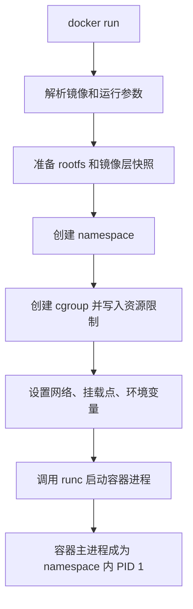
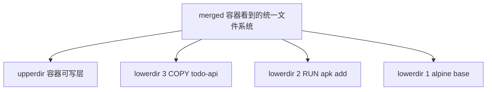

# 第 18 篇：容器运行原理 [B]

第 15 篇我们用 `docker run` 手动启动容器，第 16 篇把 Todo API 构建成镜像，第 17 篇用 Docker Compose 启动了 API、PostgreSQL、Redis 和 Traefik。到这里，你已经会“使用容器”。本篇开始回答更底层的问题：**容器到底是什么？**

容器不是一台轻量虚拟机。容器里的进程仍然运行在宿主机 Linux 内核之上，只是被 Linux namespace、cgroups、rootfs、UnionFS / OverlayFS 等机制隔离、限制和包装起来。理解这一点后，你再看 Docker、containerd、runc、Kubernetes Pod、资源限制、镜像分层、容器逃逸和生产安全，就不会只停留在命令表面。

本篇特色项目是：**用 Linux 命令手动模拟容器隔离与资源限制**。

## 1. 本章学习目标

### 1.1 知识目标

- 能解释容器和虚拟机的本质区别。
- 能描述容器进程模型，说明容器主进程为什么会成为容器内 PID 1。
- 能解释 PID、UTS、Mount、Network、IPC、User namespace 分别隔离什么。
- 能解释 cgroups 如何限制和统计 CPU、内存、IO、进程数量等资源。
- 能说明 rootfs、chroot、UnionFS、OverlayFS 与镜像分层之间的关系。

### 1.2 技能目标

- 能使用 `docker inspect`、`/proc/<pid>/ns`、`/proc/<pid>/cgroup` 观察真实容器。
- 能使用 `unshare` 创建 UTS、PID、Network、Mount namespace 并观察隔离效果。
- 能使用 Docker 导出 Alpine rootfs，并用 `chroot` 验证进程看到的根文件系统。
- 能在 cgroup v2 环境中手动创建实验 cgroup，并用 Docker 参数对照资源限制效果。
- 能编写 `mini-container.sh`，组合 namespace、rootfs、cgroup，模拟一个简化容器。

### 1.3 前置条件

开始本篇前，请确认你已经完成：

- 第 15 篇：理解容器、镜像、网络、数据卷和端口映射。
- 第 16 篇：已经构建出 `todo-api:v0.1.0` 镜像。
- 第 17 篇：能够用 Compose 启动 Todo Platform 本地环境。
- 第 2-4 篇：理解 Linux 文件系统、进程、网络和常用命令。

本篇底层实验建议在 Linux / WSL2 Ubuntu / Linux 虚拟机中执行。macOS 原生 shell 和 Windows PowerShell 不能直接完成 Linux namespace、cgroup、OverlayFS 实验。

!!! warning "本篇会使用 sudo"
    `unshare`、`mount`、`chroot`、cgroup 写入等命令需要管理员权限。请只在个人学习机、虚拟机或 WSL2 Ubuntu 中执行，不要在生产服务器、公司共享跳板机或核心环境中练习。

!!! note "关于 cgroup v2 与 cgcreate"
    课程计划中提到 `cgcreate`，它来自 cgroup-tools，在一些 cgroup v1 环境中常见。现代发行版大多默认使用 cgroup v2，本篇主线使用 `/sys/fs/cgroup` 直接观察和写入 cgroup v2 文件，并在实验中给出 `cgcreate` 的可选对照。

## 2. 本章工作场景与真实案例

### 2.1 技术痛点

真实团队中，容器原理不是“底层工程师专属知识”。后端、SRE、平台工程师都会遇到这些现象：

- 容器里 `ps` 只看到少量进程，但宿主机能看到容器进程。
- 容器内 `hostname` 和宿主机不一样。
- 容器内访问 `127.0.0.1` 时访问的是自己，不是宿主机，也不是其他容器。
- 容器删除后，写在容器可写层里的文件消失了。
- 容器设置 `--memory` 后，Go 服务没有明显错误日志就被杀掉。
- Kubernetes Pod 设置 memory limit 后出现 `OOMKilled`。
- Dockerfile 每条指令都会影响镜像层，镜像体积不断膨胀。
- 安全团队要求禁止 privileged、限制 capabilities、启用非 root 用户和只读根文件系统。

如果只会 `docker run`，这些问题像一堆孤立报错。理解底层后，它们会串成一条链路：

```text
Docker CLI / Compose
  -> containerd / runc
  -> Linux namespace
  -> Linux cgroups
  -> rootfs / OverlayFS
  -> 宿主机内核上的普通进程
```

### 2.2 团队协作场景

在企业环境中，不同角色会从不同角度使用本篇知识：

- 后端开发需要理解容器 PID 1、信号处理、内存限制和日志输出方式，避免应用在容器中表现异常。
- SRE 需要根据 OOM、CPU throttling、cgroup 指标和节点资源曲线定位生产故障。
- 平台工程师需要解释 Kubernetes `resources`、`securityContext`、rootfs、volume 和镜像层背后的运行机制。
- 安全工程师需要评估 privileged、Docker socket、hostPath、root 用户、capabilities、seccomp 和 AppArmor / SELinux 风险。
- 面试和技术评审中，架构师常会追问“容器是不是虚拟机”“Kubernetes limit 背后是什么”“容器内 root 是否等于宿主机 root”。

本篇会用实验把这些抽象概念落到可观察的文件、进程和命令输出上。

### 2.3 课程项目关联

第 17 篇已经启动了 Todo Platform 本地环境。本篇会基于这个环境观察 `api` 容器的宿主机 PID、namespace、cgroup 和挂载信息。也就是说：

```text
第 17 篇：Compose 编排出 api / postgres / redis / traefik
第 18 篇：拆开 api 容器，观察它为什么像一个隔离环境
第 19 篇：继续往下，看 Docker 如何通过 containerd / runc / CRI 启动容器
```

完成本篇后，你不仅知道 Todo API 容器能跑，还能解释它是如何被 Linux 内核隔离、限制和挂载出来的。

## 3. 核心概念

### 3.1 容器与虚拟机的本质区别

虚拟机通过 Hypervisor 虚拟硬件，并在虚拟硬件上运行完整 Guest OS。容器不虚拟硬件，也不启动独立内核。容器进程共享宿主机 Linux 内核。

```text
虚拟机：
应用 -> Guest OS -> 虚拟硬件 -> Hypervisor -> Host OS / 硬件

容器：
应用进程 -> namespace / cgroups / rootfs -> 宿主机 Linux 内核
```

这带来几个结果：

- 容器启动快，因为本质上是启动进程。
- 容器镜像相对小，因为不包含完整 Guest OS 内核。
- Linux 容器依赖 Linux 内核，macOS / Windows 上通常通过 Linux VM 或 WSL2 运行。
- 容器安全边界依赖共享内核和运行时配置，不能等同于虚拟机隔离。

### 3.2 容器进程模型

启动一个容器后，容器内通常会看到自己的 1 号进程：

```bash
docker run --rm alpine:3.23 sh -c 'ps -o pid,ppid,comm'
```

预期类似：

```text
PID   PPID  COMMAND
1     0     sh
7     1     ps
```

但在宿主机上，这个 `sh` 仍然有一个宿主机 PID。容器中的 PID 是 PID namespace 内视角，宿主机 PID 是全局视角。

这解释了一个重要事实：容器主进程退出，容器就退出。容器不是传统虚拟机，不应该依赖多个后台守护进程维持运行。

### 3.3 Linux namespace

namespace 负责“看起来像独立环境”。它隔离的是进程能看到的视图。

表 18-1 常见 Linux namespace：

| namespace | 隔离内容 | 容器中的体现 |
|---|---|---|
| PID | 进程编号和进程树 | 容器内有自己的 PID 1 |
| UTS | 主机名和域名 | 容器内 hostname 可不同 |
| Mount | 挂载点视图 | 容器内看到自己的 rootfs |
| Network | 网卡、IP、路由、防火墙规则 | 容器有自己的网络栈 |
| IPC | System V IPC、POSIX message queue | 进程间通信隔离 |
| User | 用户和用户组 ID 映射 | 容器内 root 可映射到宿主机非 root |
| Cgroup | cgroup 层级视图 | 进程只能看到部分资源控制信息 |

namespace 不直接限制资源。它回答的是“能看见什么”。

### 3.4 Cgroups

cgroups 是 control groups 的缩写，用来限制、统计和隔离资源使用。它回答的是“能用多少资源”。

它能控制：

- CPU 配额和权重。
- 内存上限和 OOM 行为。
- IO 权重或限制。
- 进程数量。
- 设备访问。

Docker 中这些参数背后都离不开 cgroups：

```bash
docker run --rm --memory=128m --cpus=0.5 alpine:3.23 sh -c 'cat /proc/self/cgroup'
```

Kubernetes 中这些字段最终也会落到节点上的 cgroups：

```yaml
resources:
  requests:
    cpu: "100m"
    memory: "128Mi"
  limits:
    cpu: "500m"
    memory: "256Mi"
```

本篇不会编写 Kubernetes YAML，只先理解资源限制背后的 Linux 机制。

### 3.5 Rootfs 与 chroot

容器内看到的 `/` 不是宿主机的 `/`，而是容器 rootfs。rootfs 可以理解为容器进程看到的根文件系统：

```text
/
├── bin
├── etc
├── lib
├── proc
└── usr
```

`chroot` 可以把一个进程的根目录切换到某个目录。它不是完整容器隔离，但能帮助你理解容器为什么能看到自己的 `/etc/os-release`、`/bin/sh` 和应用文件。

### 3.6 UnionFS 与 OverlayFS

UnionFS 不是特指某一个文件系统实现，而是一类“把多个目录叠成一个统一视图”的文件系统思想。Docker 在 Linux 上常见的存储驱动是 `overlay2`，底层使用 OverlayFS。

镜像分层可以理解为：

```text
merged  合并视图：容器看到的文件系统
upper   可写层：容器运行时写入或修改的文件
lower   只读层：镜像层 3
lower   只读层：镜像层 2
lower   只读层：镜像层 1
```

当容器修改只读层里的文件时，OverlayFS 会发生 copy-up：先把文件复制到可写层，再在可写层修改。只读镜像层不会被改变。

这解释了：

- 为什么删除容器后，容器可写层会消失。
- 为什么业务数据应该放到数据库、对象存储或 volume。
- 为什么 Dockerfile 层数和文件复制方式会影响镜像体积。
- 为什么同一个基础镜像层可以被多个镜像复用。

### 3.7 容器运行时

现代 Docker 链路大致是：

```text
docker CLI
  -> Docker Engine
  -> containerd
  -> runc
  -> Linux kernel
```

其中：

- Docker Engine 提供用户常用命令和 API。
- containerd 管理镜像、快照、容器生命周期。
- runc 按 OCI Runtime Specification 创建容器进程。
- Linux kernel 提供 namespace、cgroups、mount、capabilities 等能力。

第 19 篇会系统讲 OCI、containerd、runc 和 CRI。本篇先把 Linux 层机制摸清楚。

## 4. 原理深入

### 4.1 `docker run` 背后发生了什么

执行：

```bash
docker run --rm -m 128m --cpus=0.5 --name demo alpine:3.23 sh
```

底层大致会发生：

图 18-1 `docker run` 到容器进程的简化流程：



从内核角度看，最终出现的是一个普通进程，只是它被放进了特定 namespace 和 cgroup，并使用了特定 rootfs。

### 4.2 Namespace 负责隔离视图

假设宿主机上有很多进程：

```text
宿主机 PID namespace
├── PID 1 systemd
├── PID 821 dockerd
├── PID 1030 containerd
├── PID 2201 postgres
└── PID 2305 todo-api
```

容器内可能只看到：

```text
容器 PID namespace
├── PID 1 todo-api
└── PID 12 ps
```

这不是因为宿主机进程不存在，而是容器进程所在的 PID namespace 看不到它们。

Network namespace 也是同理。容器内的 `lo`、`eth0`、路由表和 iptables 规则属于容器自己的网络视图。容器访问 `127.0.0.1` 时访问的是自己的回环地址。

### 4.3 Cgroups 负责资源边界

namespace 让进程“看不到别人”，cgroups 让进程“不能无限用资源”。

以 cgroup v2 为例：

```text
/sys/fs/cgroup/
├── cgroup.controllers
├── cpu.max
├── memory.max
└── todo-lab/
    ├── cgroup.procs
    ├── cpu.max
    ├── memory.max
    └── memory.events
```

表 18-2 cgroup v2 常见文件：

| 文件 | 作用 |
|---|---|
| `cgroup.procs` | 当前 cgroup 中的进程 PID |
| `cpu.max` | CPU 配额和周期 |
| `memory.max` | 内存上限 |
| `memory.current` | 当前内存使用 |
| `memory.events` | OOM、超过高水位等事件统计 |

例如：

```text
cpu.max = 50000 100000
```

表示每 100000 微秒周期内最多使用 50000 微秒 CPU 时间，也就是约 0.5 个 CPU。

### 4.4 镜像层如何变成容器文件系统

Dockerfile 中每个会改变文件系统的步骤通常会形成一个镜像层：

```dockerfile
FROM alpine:3.23
RUN apk add --no-cache ca-certificates
COPY todo-api /app/todo-api
```

运行时，容器会基于这些只读层加一个可写层：

图 18-2 OverlayFS 合并视图：



如果应用把日志写到容器内部 `/app/logs/app.log`，这通常进入容器可写层。删除容器后就丢失。生产中更推荐日志输出到 stdout / stderr，数据写入外部数据库、对象存储或 volume。

### 4.5 User namespace 与 root 的误解

很多容器内显示用户是 root：

```bash
docker run --rm alpine:3.23 id
```

输出可能是：

```text
uid=0(root) gid=0(root)
```

如果没有启用 user namespace 映射，这个 root 在宿主机内核看来也可能拥有较高权限，只是被 capabilities、seccomp、AppArmor / SELinux、mount 和 namespace 限制了一部分。

生产环境不要把“容器内 root”当成安全默认值。更好的做法是使用非 root 用户运行、删除不必要 capabilities、不使用 `--privileged`、使用只读根文件系统，并在 Kubernetes 中设置 `runAsNonRoot`、`allowPrivilegeEscalation: false` 等安全上下文。

### 4.6 容器隔离不是绝对安全边界

容器隔离依赖共享内核。只要共享内核，就需要认真对待：

- 内核漏洞。
- 过高的 capabilities。
- `privileged` 容器。
- 宿主机目录挂载。
- Docker socket 挂载。
- 不可信镜像。
- 运行时逃逸漏洞。

这就是为什么生产环境不仅要“能跑容器”，还要有镜像扫描、最小权限、运行时安全策略、节点隔离和审计。

## 5. 手把手实验

### 5.1 实验目标

在 Linux / WSL2 Ubuntu / Linux 虚拟机中创建 `~/container-lab`，观察真实容器的 PID、namespace、cgroup 和挂载信息，并用 `unshare`、`chroot`、cgroup v2、OverlayFS 和 `nsenter` 手动模拟一个简化容器。

### 5.2 实验环境

表 18-3 实验工具与版本：

| 工具 | 建议版本 | 用途 |
|---|---|---|
| Linux | Ubuntu 24.04 / 22.04 或同类发行版 | 执行 namespace / cgroup / OverlayFS 实验 |
| WSL2 Ubuntu | Windows 推荐 | 可完成大部分实验 |
| Docker | 29.x | 导出 rootfs、观察真实容器 |
| Alpine 镜像 | `alpine:3.23` | 轻量 rootfs 和 demo 容器 |
| util-linux | 发行版当前版本 | 提供 `unshare`、`lsns`、`findmnt`、`nsenter` |
| iproute2 | 发行版当前版本 | 提供 `ip` |
| Python 3 | 3.x | 内存限制实验 |
| cgroup-tools | 可选 | 提供 `cgcreate`、`cgexec`，用于 cgroup v1 对照 |

环境自检：

```bash
uname -a
id
docker version
command -v docker
command -v unshare
command -v nsenter
command -v lsns
command -v findmnt
command -v ip
command -v python3
stat -fc %T /sys/fs/cgroup
test -f /sys/fs/cgroup/cgroup.controllers && cat /sys/fs/cgroup/cgroup.controllers || true
```

判断方式：

| 检查项 | 预期 | 不满足时怎么办 |
|---|---|---|
| `docker version` | 能看到 Client 和 Server | 启动 Docker Desktop 或 Docker Engine |
| `command -v unshare` | 输出命令路径 | 安装 `util-linux` |
| `command -v ip` | 输出命令路径 | 安装 `iproute2` |
| `stat -fc %T /sys/fs/cgroup` | 推荐输出 `cgroup2fs` | 不能手动做 cgroup v2 实验时，使用 Docker 资源限制替代实验 |
| `cgroup.controllers` | 包含 `cpu`、`memory` 更好 | 缺失 controller 时跳过手动 cgroup，保留 Docker 观察实验 |
| `python3` | 输出命令路径 | 不做 Python 内存限制实验，或安装 Python 3 |

安装必要工具：

=== "Ubuntu / Debian"

    ```bash
    sudo apt update
    sudo apt install -y util-linux iproute2 procps python3
    ```

=== "Fedora / RHEL 系"

    ```bash
    sudo dnf install -y util-linux iproute procps-ng python3
    ```

=== "macOS / Windows"

    请进入 Ubuntu VM 或 WSL2 Ubuntu 后执行 Linux 命令。macOS Terminal 和 Windows PowerShell 不能直接完成本篇底层实验。

### 5.3 文件目录结构

本篇实验目录如下：

```text
container-lab/
├── rootfs/                 # 从 alpine:3.23 导出的 rootfs
├── image-layers/
│   ├── base/               # 模拟镜像只读层
│   └── app/                # 模拟应用只读层
├── upper/                  # 模拟容器可写层
├── work/                   # OverlayFS 工作目录
├── merged/                 # OverlayFS 合并视图
├── mnt/                    # Mount namespace 实验目录
├── allocate-memory.py      # 内存限制实验脚本
└── mini-container.sh       # 手动模拟容器脚本
```

创建目录：

```bash
export LAB="$HOME/container-lab"
mkdir -p "$LAB"
cd "$LAB"
pwd
```

预期输出：

```text
/home/your-user/container-lab
```

使用单独目录是为了把 rootfs、OverlayFS 目录和脚本限制在一个可清理范围内，降低误操作风险。

### 5.4 完整代码或配置

创建内存实验脚本：

```bash
cat > "$LAB/allocate-memory.py" <<'PY'
import time

chunks = []

for i in range(128):
    chunks.append(bytearray(1024 * 1024))
    print(f"allocated {i + 1} MiB", flush=True)
    time.sleep(0.05)
PY
```

创建简化容器脚本：

```bash
cat > "$LAB/mini-container.sh" <<'EOF'
#!/usr/bin/env bash
set -euo pipefail

LAB="${LAB:-$HOME/container-lab}"
ROOTFS="$LAB/rootfs"
CGROUP="${CGROUP:-/sys/fs/cgroup/todo-mini}"

if [[ "$(id -u)" -ne 0 ]]; then
  echo "mini-container.sh must run as root"
  exit 1
fi

if [[ ! -x "$ROOTFS/bin/sh" ]]; then
  echo "rootfs is missing or invalid: $ROOTFS"
  exit 1
fi

mkdir -p "$ROOTFS/proc"

if [[ -f /sys/fs/cgroup/cgroup.controllers ]]; then
  mkdir -p "$CGROUP"
  echo 67108864 > "$CGROUP/memory.max" 2>/dev/null || true
  echo "50000 100000" > "$CGROUP/cpu.max" 2>/dev/null || true
  echo $$ > "$CGROUP/cgroup.procs" 2>/dev/null || true
fi

cleanup() {
  umount "$ROOTFS/proc" 2>/dev/null || true
}
trap cleanup EXIT

hostname todo-mini 2>/dev/null || true
mount -t proc proc "$ROOTFS/proc"

chroot "$ROOTFS" /bin/sh -c '
echo "[inside mini container]"
echo "hostname=$(hostname)"
echo "[os-release]"
cat /etc/os-release
echo "[processes]"
ps -o pid,ppid,comm
echo "[cgroup]"
cat /proc/1/cgroup
'
EOF

chmod +x "$LAB/mini-container.sh"
```

脚本关键设计：

- `ROOTFS` 指向从 Alpine 导出的根文件系统。
- `CGROUP` 默认使用 `/sys/fs/cgroup/todo-mini`。
- `mount -t proc` 让 chroot 后的进程可以看到自己的 `/proc`。
- `trap cleanup EXIT` 保证退出时卸载 rootfs 内的 `/proc`。
- namespace 由启动命令中的 `unshare` 创建，脚本本身只负责 rootfs、cgroup 和 chroot。

### 5.5 执行命令

#### 5.5.1 观察 Todo API 容器

如果你已经完成第 17 篇，请先进入 Cloud Native Todo Platform 应用仓库根目录，也就是包含 `deployments/docker-compose/compose.yaml` 的目录。然后进入 Compose 目录启动本地环境：

```bash
test -f deployments/docker-compose/compose.yaml
cd deployments/docker-compose
docker compose --env-file .env up -d
docker compose --env-file .env ps
```

获取 API 容器 ID 和宿主机 PID：

```bash
TODO_API_CONTAINER="$(docker compose --env-file .env ps -q api)"
TODO_API_PID="$(docker inspect "$TODO_API_CONTAINER" --format '{{.State.Pid}}')"
echo "$TODO_API_CONTAINER"
echo "$TODO_API_PID"
ps -o pid,ppid,comm -p "$TODO_API_PID"
```

查看 namespace、cgroup 和挂载：

```bash
sudo ls -l /proc/"$TODO_API_PID"/ns
cat /proc/"$TODO_API_PID"/cgroup
docker inspect "$TODO_API_CONTAINER" --format '{{json .Mounts}}'
docker inspect "$TODO_API_CONTAINER" --format 'Memory={{.HostConfig.Memory}} NanoCpus={{.HostConfig.NanoCpus}}'
```

如果你没有应用仓库，也可以启动独立 demo 容器：

```bash
docker run -d --name internals-demo alpine:3.23 sleep 1d
HOST_PID="$(docker inspect internals-demo --format '{{.State.Pid}}')"
echo "$HOST_PID"
sudo ls -l /proc/"$HOST_PID"/ns
cat /proc/"$HOST_PID"/cgroup
docker exec internals-demo ps -o pid,ppid,comm
ps -o pid,ppid,comm -p "$HOST_PID"
```

清理 demo 容器：

```bash
docker rm -f internals-demo
```

#### 5.5.2 使用 UTS namespace 隔离主机名

查看当前主机名：

```bash
hostname
```

进入新的 UTS namespace：

```bash
sudo unshare --uts --fork bash
```

在新 shell 中执行：

```bash
hostname todo-uts
hostname
exit
```

回到原 shell 后验证：

```bash
hostname
```

预期现象：新 namespace 中 hostname 可以修改，退出后宿主机 hostname 不变。

#### 5.5.3 使用 PID namespace 隔离进程编号

进入新的 PID namespace，并挂载新的 `/proc`：

```bash
sudo unshare --pid --fork --mount-proc bash
```

在新 shell 中执行：

```bash
echo "inside pid namespace"
ps -ef
echo "my pid is $$"
exit
```

预期现象：新 shell 在 namespace 中通常是 PID 1，`ps -ef` 只能看到 namespace 内进程。

#### 5.5.4 使用 Network namespace 隔离网络

进入新的 Network namespace：

```bash
sudo unshare --net --fork bash
```

在新 shell 中执行：

```bash
ip addr
ip route
ip link set lo up
ping -c 1 127.0.0.1
exit
```

预期现象：你可能只看到 `lo` 回环网卡，没有默认路由。Docker 会在类似基础上创建 veth pair、bridge、NAT 和 DNS。

#### 5.5.5 使用 Mount namespace 隔离挂载点

准备目录：

```bash
mkdir -p "$LAB/mnt"
```

进入新的 Mount namespace：

```bash
sudo env LAB="$LAB" unshare --mount --propagation private --fork bash
```

在新 shell 中执行：

```bash
mount -t tmpfs tmpfs "$LAB/mnt"
echo "hello from mount namespace" > "$LAB/mnt/message.txt"
findmnt "$LAB/mnt"
cat "$LAB/mnt/message.txt"
exit
```

回到原 shell 后验证：

```bash
findmnt "$LAB/mnt" || echo "not mounted outside"
ls -la "$LAB/mnt"
```

如果仍看到挂载，说明实验环境的挂载传播策略不符合预期，执行清理：

```bash
sudo umount "$LAB/mnt" 2>/dev/null || true
```

#### 5.5.6 导出 Alpine rootfs 并使用 chroot

导出 rootfs：

```bash
cd "$LAB"
sudo rm -rf rootfs
mkdir -p rootfs
docker pull alpine:3.23
CID="$(docker create alpine:3.23)"
docker export "$CID" | sudo tar -C rootfs -xf -
docker rm "$CID"
```

查看 rootfs：

```bash
ls rootfs
cat rootfs/etc/os-release
```

使用 `chroot`：

```bash
sudo chroot "$LAB/rootfs" /bin/sh
```

在 chroot 中执行：

```bash
cat /etc/os-release
pwd
ls /
exit
```

注意：`chroot` 不是容器。它没有自动隔离 PID、网络、主机名、cgroup，只是切换根文件系统视图。

#### 5.5.7 使用 cgroup v2 限制资源

先确认 cgroup v2：

```bash
stat -fc %T /sys/fs/cgroup
test -f /sys/fs/cgroup/cgroup.controllers && cat /sys/fs/cgroup/cgroup.controllers || true
```

如果不是 `cgroup2fs`，或者当前系统不允许手动写 `/sys/fs/cgroup`，跳到 5.5.8 使用 Docker 替代实验。

创建实验 cgroup：

```bash
CG=/sys/fs/cgroup/todo-lab
sudo mkdir -p "$CG"
echo 67108864 | sudo tee "$CG/memory.max"
echo "50000 100000" | sudo tee "$CG/cpu.max"
```

运行内存分配实验：

```bash
env CG="$CG" LAB="$LAB" bash -c 'echo $$ | sudo tee "$CG/cgroup.procs" >/dev/null; python3 "$LAB/allocate-memory.py"'
```

观察事件：

```bash
sudo cat "$CG/memory.events"
sudo cat "$CG/cpu.stat"
```

如果 Python 进程被 `Killed`，这通常是触发内存限制的预期结果。

可选：如果你的实验机是 cgroup v1 且安装了 cgroup-tools，可以用 `cgcreate` 做对照：

```bash
command -v cgcreate || echo "cgroup-tools is not installed"
sudo cgcreate -g memory,cpu:/todo-lab-v1
sudo cgset -r memory.limit_in_bytes=67108864 todo-lab-v1
sudo cgexec -g memory,cpu:todo-lab-v1 python3 "$LAB/allocate-memory.py"
```

如果这些命令不可用，不影响本篇主线。现代生产环境通常由 Docker、containerd、systemd 或 Kubernetes 管理 cgroup。

#### 5.5.8 使用 Docker 对照资源限制

Docker 参数能观察同样思想：

```bash
docker run --rm --memory=64m --cpus=0.5 alpine:3.23 sh -c 'cat /proc/self/cgroup; echo ok'
```

查看容器资源配置：

```bash
docker run -d --name limit-demo --memory=64m --cpus=0.5 alpine:3.23 sleep 1d
docker inspect limit-demo --format 'Memory={{.HostConfig.Memory}} NanoCpus={{.HostConfig.NanoCpus}}'
docker rm -f limit-demo
```

这里的 `--memory` 和 `--cpus` 会被运行时转成 cgroup 资源限制。

#### 5.5.9 使用 OverlayFS 模拟镜像层

准备模拟目录：

```bash
cd "$LAB"
sudo umount merged 2>/dev/null || true
rm -rf image-layers upper work merged
mkdir -p image-layers/base image-layers/app upper work merged
echo "base layer" > image-layers/base/layer.txt
echo "app layer" > image-layers/app/app.txt
```

确认文件系统类型：

```bash
df -T "$LAB"
```

挂载 overlay：

```bash
sudo mount -t overlay overlay \
  -o lowerdir="$LAB/image-layers/app:$LAB/image-layers/base",upperdir="$LAB/upper",workdir="$LAB/work" \
  "$LAB/merged"
```

观察合并视图：

```bash
ls "$LAB/merged"
cat "$LAB/merged/layer.txt"
cat "$LAB/merged/app.txt"
```

修改合并视图中的文件：

```bash
echo "changed in container writable layer" | sudo tee "$LAB/merged/app.txt"
cat "$LAB/image-layers/app/app.txt"
cat "$LAB/upper/app.txt"
```

你会看到只读层没有变化，修改进入了 `upper/`。这就是容器可写层的直觉模型。

卸载：

```bash
sudo umount "$LAB/merged"
```

#### 5.5.10 手动启动简化容器

确保 rootfs 和脚本存在：

```bash
test -x "$LAB/rootfs/bin/sh"
test -x "$LAB/mini-container.sh"
```

使用 `unshare` 创建 PID、UTS、Mount namespace，再执行脚本：

```bash
sudo env LAB="$LAB" unshare --fork --pid --uts --mount --propagation private "$LAB/mini-container.sh"
```

预期现象：

- hostname 显示为 `todo-mini`。
- `/etc/os-release` 来自 Alpine rootfs。
- `ps` 只看到简化容器内进程。
- `/proc/1/cgroup` 能看到 cgroup 信息。

#### 5.5.11 使用 nsenter 进入容器 namespace

启动 demo 容器：

```bash
docker run -d --name nsenter-demo alpine:3.23 sleep 1d
DEMO_PID="$(docker inspect nsenter-demo --format '{{.State.Pid}}')"
echo "$DEMO_PID"
```

从宿主机进入目标 namespace：

```bash
sudo nsenter --target "$DEMO_PID" --uts hostname
sudo nsenter --target "$DEMO_PID" --pid --mount ps -o pid,ppid,comm
sudo nsenter --target "$DEMO_PID" --net ip addr
```

清理：

```bash
docker rm -f nsenter-demo
```

`nsenter` 是强工具。生产环境使用必须受权限控制和审计，因为它可以从宿主机进入目标进程所在 namespace。

### 5.6 预期输出

查看容器 namespace 时应看到类似：

```text
pid -> pid:[402653xxxx]
net -> net:[402653xxxx]
mnt -> mnt:[402653xxxx]
uts -> uts:[402653xxxx]
ipc -> ipc:[402653xxxx]
```

PID namespace 实验中，`ps -ef` 应只显示新 namespace 内进程：

```text
UID          PID    PPID  C STIME TTY          TIME CMD
root           1       0  0 ...   pts/0    00:00:00 bash
root           8       1  0 ...   pts/0    00:00:00 ps
```

`chroot` 后应看到 Alpine 信息：

```text
NAME="Alpine Linux"
ID=alpine
VERSION_ID=3.23.0
```

cgroup 内存实验触发限制时可能输出：

```text
allocated 61 MiB
allocated 62 MiB
Killed
```

OverlayFS 修改后，`upper/app.txt` 应显示新内容，而 `image-layers/app/app.txt` 保持原始内容。

简化容器运行时应看到：

```text
[inside mini container]
hostname=todo-mini
[os-release]
NAME="Alpine Linux"
...
[processes]
PID   PPID  COMMAND
1     0     sh
...
```

### 5.7 验证方法

最小验证：

```bash
docker run --rm alpine:3.23 sh -c 'ps -o pid,ppid,comm; cat /proc/1/cgroup'
sudo unshare --uts --fork bash -c 'hostname todo-uts; hostname'
sudo unshare --pid --fork --mount-proc bash -c 'ps -o pid,ppid,comm'
test -x "$LAB/rootfs/bin/sh"
sudo chroot "$LAB/rootfs" /bin/sh -c 'cat /etc/os-release'
docker run --rm --memory=64m --cpus=0.5 alpine:3.23 sh -c 'cat /proc/self/cgroup; echo ok'
```

进阶验证：

```bash
stat -fc %T /sys/fs/cgroup
test -f /sys/fs/cgroup/cgroup.controllers && cat /sys/fs/cgroup/cgroup.controllers || true
test -x "$LAB/mini-container.sh"
sudo env LAB="$LAB" unshare --fork --pid --uts --mount --propagation private "$LAB/mini-container.sh"
```

验收标准：

- 能指出一个容器主进程在宿主机上的 PID。
- 能查看 `/proc/<pid>/ns` 并解释至少 4 类 namespace。
- 能解释 `--memory`、`--cpus` 与 cgroup 的关系。
- 能说明 rootfs 和 `chroot` 的作用与局限。
- 能解释 OverlayFS lower / upper / merged 三层含义。
- 能运行 `mini-container.sh` 并说明它组合了哪些机制。

### 5.8 清理步骤

回到实验目录：

```bash
cd "$LAB"
```

卸载挂载：

```bash
sudo umount "$LAB/merged" 2>/dev/null || true
sudo umount "$LAB/rootfs/proc" 2>/dev/null || true
sudo umount "$LAB/mnt" 2>/dev/null || true
```

删除实验 cgroup：

```bash
sudo rmdir /sys/fs/cgroup/todo-lab 2>/dev/null || true
sudo rmdir /sys/fs/cgroup/todo-mini 2>/dev/null || true
```

删除 demo 容器：

```bash
docker rm -f internals-demo nsenter-demo limit-demo 2>/dev/null || true
```

删除实验目录：

```bash
cd "$HOME"
if [ "${LAB:-}" = "$HOME/container-lab" ]; then
  sudo rm -rf "$LAB"
else
  echo "LAB is not $HOME/container-lab, skip removal"
fi
```

再次确认没有残留挂载：

```bash
findmnt | grep container-lab || echo "no container-lab mounts"
```

预计耗时：150 分钟（基础观察约 45 分钟，手动模拟约 75 分钟，排障和记录约 30 分钟）。

## 6. 常见错误与排障

### 错误 1：`unshare` 报 `Operation not permitted`

- **现象**：

  ```text
  unshare: unshare failed: Operation not permitted
  ```

- **原因**：当前用户缺少权限，系统禁用了某些 namespace，或者你在 macOS / Windows PowerShell / 受限容器内执行实验。
- **排查**：

  ```bash
  uname -a
  id
  command -v unshare
  sysctl kernel.unprivileged_userns_clone 2>/dev/null || true
  ```

  如果不是 Linux 环境，或策略禁用了 namespace，手动实验会失败。

- **修复**：进入 Linux VM / WSL2 Ubuntu，必要时使用 `sudo unshare ...`。
- **预防**：本篇底层实验只在个人 Linux 学习环境执行，不在生产机和共享跳板机执行。

### 错误 2：手动 cgroup 写入失败

- **现象**：

  ```text
  tee: /sys/fs/cgroup/todo-lab/memory.max: Permission denied
  ```

  或：

  ```text
  mkdir: cannot create directory '/sys/fs/cgroup/todo-lab': Read-only file system
  ```

- **原因**：系统不是 cgroup v2，cgroup 由 systemd 或 Docker Desktop 托管，当前环境不允许手动创建 cgroup。
- **排查**：

  ```bash
  stat -fc %T /sys/fs/cgroup
  mount | grep cgroup
  test -f /sys/fs/cgroup/cgroup.controllers && cat /sys/fs/cgroup/cgroup.controllers || true
  ```

- **修复**：跳过手动 cgroup，使用 Docker 替代实验：

  ```bash
  docker run --rm --memory=64m --cpus=0.5 alpine:3.23 sh -c 'cat /proc/self/cgroup; echo ok'
  ```

- **预防**：真实工作中通常通过 Docker、containerd、systemd 或 Kubernetes 管理 cgroup，不手写生产节点的 `/sys/fs/cgroup`。

### 错误 3：OverlayFS 挂载失败

- **现象**：

  ```text
  mount: wrong fs type, bad option, bad superblock on overlay
  ```

  或：

  ```text
  workdir and upperdir must reside under the same mount
  ```

- **原因**：当前文件系统不支持 overlay，`upperdir` 和 `workdir` 不在同一个文件系统，或 WSL2 / 网络文件系统有限制。
- **排查**：

  ```bash
  df -T "$LAB"
  findmnt "$LAB"
  ls -ld "$LAB/upper" "$LAB/work" "$LAB/merged"
  ```

- **修复**：换到 Linux VM 的本地磁盘目录，例如 `$HOME/container-lab`；确认 `upper`、`work`、`merged` 都在同一文件系统。
- **预防**：OverlayFS 实验不要放在网络盘、特殊挂载目录或不支持 overlay 的文件系统中。

### 错误 4：`chroot` 后命令缺失或无法执行

- **现象**：

  ```text
  chroot: failed to run command '/bin/sh': No such file or directory
  ```

- **原因**：rootfs 没有正确导出，`/bin/sh` 不存在，或 rootfs 文件权限损坏。
- **排查**：

  ```bash
  ls -l "$LAB/rootfs/bin/sh"
  file "$LAB/rootfs/bin/sh"
  cat "$LAB/rootfs/etc/os-release"
  ```

- **修复**：重新导出 rootfs：

  ```bash
  sudo rm -rf "$LAB/rootfs"
  mkdir -p "$LAB/rootfs"
  CID="$(docker create alpine:3.23)"
  docker export "$CID" | sudo tar -C "$LAB/rootfs" -xf -
  docker rm "$CID"
  ```

- **预防**：不要手工拼凑 rootfs；用 `docker export` 得到完整文件系统。

### 错误 5：`nsenter` 失败或目标 PID 为 0

- **现象**：

  ```text
  nsenter: cannot open /proc/0/ns/uts: No such file or directory
  ```

- **原因**：目标容器已经退出，`docker inspect` 得到的 `State.Pid` 是 0，或者你没有 sudo 权限。
- **排查**：

  ```bash
  docker ps -a --filter name=nsenter-demo
  docker inspect nsenter-demo --format 'Status={{.State.Status}} Pid={{.State.Pid}}'
  ```

- **修复**：重新启动容器并获取 PID：

  ```bash
  docker rm -f nsenter-demo 2>/dev/null || true
  docker run -d --name nsenter-demo alpine:3.23 sleep 1d
  DEMO_PID="$(docker inspect nsenter-demo --format '{{.State.Pid}}')"
  sudo nsenter --target "$DEMO_PID" --uts hostname
  ```

- **预防**：执行 `nsenter` 前先确认目标容器仍在运行，且 `State.Pid` 不是 0。

## 7. 生产环境注意事项

1. **不要把容器当成绝对安全沙箱。** 容器隔离强于普通进程，但弱于完整虚拟机的硬件虚拟化隔离。生产环境需要组合非 root 用户、最小 capabilities、seccomp、AppArmor / SELinux、只读根文件系统、镜像扫描和节点隔离，不能只因为“用了容器”就信任不可信代码。

2. **资源限制必须结合观测。** 只设置 memory limit 和 CPU limit，而不监控 `memory.events`、CPU throttling、GC、延迟和错误率，很容易出现“服务偶发被杀但日志不明显”的问题。生产环境应把资源配置、应用指标、节点指标和告警放在一起看。

3. **不要滥用 privileged、hostPath 和 Docker socket。** 这些配置会显著削弱 namespace、mount 和 capabilities 带来的隔离。需要宿主机能力时，应先问是否能用更窄的 capability、更小范围的挂载或专门的节点池解决。

4. **镜像层中不要留下敏感信息。** Dockerfile 中写入再删除的密钥仍可能存在于历史层中。构建密钥应使用 BuildKit secret、CI 密钥注入或外部制品管理，不要把 `.env`、Token、私钥复制进镜像层。

5. **容器 PID 1 要正确处理信号。** 容器主进程是 PID 1 时，信号和子进程回收行为会影响优雅退出。Go 服务要正确处理 SIGTERM，必要时使用合适的 init 进程或确保应用能回收子进程，避免发布、扩缩容和节点排空时出现脏退出。

## 8. 本章小项目

本章小项目：**完成 Todo Platform 容器运行原理观察记录**。

### 8.1 项目产出

完成后，你应该得到：

- `~/container-lab/mini-container.sh`
- 从 `alpine:3.23` 导出的 `rootfs/`
- OverlayFS 模拟目录：`image-layers/`、`upper/`、`work/`、`merged/`
- 一份 `docs/docker/chapter-18-runtime-internals-record.md` 记录

记录模板：

```markdown
# Chapter 18 Runtime Internals Record

## 环境信息

- OS：
- Docker 版本：
- cgroup 类型：
- 是否支持 OverlayFS：

## Todo API 容器观察

- 容器 ID：
- 宿主机 PID：
- namespace 输出摘要：
- cgroup 输出摘要：
- 挂载输出摘要：

## 手动实验结果

- UTS namespace：
- PID namespace：
- Network namespace：
- Mount namespace：
- chroot：
- cgroup v2：
- OverlayFS：
- mini-container.sh：

## 排障记录

- 问题：
- 现象：
- 根因：
- 修复：
```

### 8.2 验收标准

最小验收：

- 能通过 `docker inspect` 找到容器宿主机 PID。
- 能查看 `/proc/<pid>/ns` 和 `/proc/<pid>/cgroup`。
- 能用 `unshare --uts` 验证 hostname 隔离。
- 能用 `unshare --pid --mount-proc` 验证 PID 隔离。
- 能用 Docker `--memory`、`--cpus` 观察资源限制配置。

进阶验收：

- 能导出 Alpine rootfs 并 `chroot` 进入。
- 能完成 OverlayFS lower / upper / merged 实验。
- 能运行 `mini-container.sh`。
- 能解释 `mini-container.sh` 不是完整容器运行时，还缺少哪些能力。

## 9. 本章练习题

### 基础题

1. 容器和虚拟机最大的区别是什么？为什么容器启动通常更快？
2. namespace 和 cgroups 分别解决什么问题？
3. 为什么容器内看到 PID 1，而宿主机上同一个进程有另一个 PID？
4. rootfs、chroot、OverlayFS 三者分别解决什么问题？
5. 为什么生产环境不建议把业务数据写入容器可写层？

### 实操题

1. 使用 `unshare --uts` 修改新 namespace 中的 hostname，退出后验证宿主机 hostname 没有变化。当原 shell 中 `hostname` 仍为原值时，说明成功。
2. 使用 `docker run --rm --memory=64m --cpus=0.5 alpine:3.23 ...` 观察 `/proc/self/cgroup`，再用 `docker inspect` 查看 `HostConfig.Memory` 和 `HostConfig.NanoCpus`。当两处都能看到资源限制信息时，说明成功。
3. 修改 OverlayFS 合并视图中的 `app.txt`，确认只读层文件未变化、`upper/app.txt` 出现修改后的内容。当 lower 不变、upper 改变时，说明你理解了 copy-up。

### 思考题

1. 如果 Go 服务在 Kubernetes 中被 `OOMKilled`，但应用日志没有错误，你会从哪些层面排查？
2. 如果安全团队要求禁止 privileged 和 Docker socket 挂载，你会如何向业务团队解释这些配置的风险？

## 10. 本章面试题

### 面试题 1：容器和虚拟机有什么区别？

**一句话结论**：虚拟机有独立 Guest OS 和内核，容器共享宿主机 Linux 内核，只是通过 namespace、cgroups 和 rootfs 等机制隔离进程。

**展开解释**：虚拟机通过 Hypervisor 虚拟硬件，在上面运行完整操作系统。容器不虚拟硬件，也不启动新内核，容器进程仍然是宿主机上的普通 Linux 进程。容器启动快、镜像小，但隔离边界依赖共享内核和运行时安全配置。

**深入追问**：如果面试官问安全边界，要说明容器不是强沙箱，生产环境还需要非 root、capabilities 收敛、seccomp、AppArmor / SELinux、镜像扫描、节点隔离和最小权限。

### 面试题 2：namespace 和 cgroups 分别解决什么问题？

**一句话结论**：namespace 解决“进程能看到什么”，cgroups 解决“进程能用多少资源”。

**展开解释**：PID namespace 让容器内有自己的进程树，Network namespace 让容器有自己的网卡和路由，Mount namespace 让容器看到自己的挂载点。cgroups 则限制 CPU、内存、IO、进程数量等资源，并提供统计信息。

**深入追问**：如果面试官问 Kubernetes limit 背后是什么，要说明 Pod 或容器的资源限制最终会由容器运行时写入节点上的 cgroup。

### 面试题 3：为什么容器主进程退出后容器会停止？

**一句话结论**：容器本质上围绕一个主进程运行，主进程通常是容器 namespace 内的 PID 1，PID 1 退出意味着容器生命周期结束。

**展开解释**：容器不是虚拟机，没有传统 init 系统维持整台机器状态。Docker 和运行时跟踪容器主进程，主进程退出后，容器就进入 exited 状态。这也是为什么容器镜像的 `ENTRYPOINT` / `CMD` 要直接运行前台服务。

**深入追问**：PID 1 还涉及信号处理和子进程回收。生产 Go 服务应正确处理 SIGTERM，保证滚动发布和节点排空时能优雅退出。

### 面试题 4：Docker `--memory` 和 Kubernetes memory limit 背后是什么？

**一句话结论**：它们最终都会落到 Linux cgroups 的内存控制上，限制进程组可使用的内存。

**展开解释**：在 cgroup v2 中，可以通过 `memory.max` 设置内存上限，通过 `memory.current` 查看当前使用，通过 `memory.events` 查看 OOM 等事件。超过限制时，内核可能直接 kill 进程，应用不一定有机会输出错误。

**深入追问**：排查 OOM 不能只看应用日志，还要看容器退出状态、Pod 事件、节点内存、应用指标、GC 指标和 cgroup 事件。

### 面试题 5：UnionFS / OverlayFS 与镜像分层有什么关系？

**一句话结论**：镜像层通常是只读层，容器运行时在其上叠加可写层，OverlayFS 把它们合并成容器看到的统一文件系统。

**展开解释**：lowerdir 表示只读镜像层，upperdir 表示容器可写层，merged 表示容器看到的视图。修改只读层文件时会 copy-up 到可写层，删除容器后可写层消失，但镜像层不变。

**深入追问**：这解释了为什么日志和业务数据不应长期写在容器层，也解释了 Dockerfile 中复制大文件、删除密钥、频繁改动依赖层会影响镜像体积和安全。

### 面试题 6：`nsenter` 在容器排障中有什么作用？

**一句话结论**：`nsenter` 可以从宿主机进入目标进程所在的 namespace，用于底层网络、进程和挂载排障。

**展开解释**：当容器镜像没有 shell 或缺少网络工具时，管理员可以通过宿主机找到容器主进程 PID，再用 `nsenter --target <pid> --net` 进入它的 Network namespace 查看网卡、路由和监听端口。

**深入追问**：`nsenter` 权限很高，生产环境使用必须受控和审计。Kubernetes 中更常用受控的 debug container、节点排障流程和审计系统。

## 11. 本章总结

本篇把容器从“Docker 命令”拆回到 Linux 内核机制：namespace 负责隔离视图，cgroups 负责限制和统计资源，rootfs 与 OverlayFS 提供容器看到的文件系统，容器主进程本质上仍然是宿主机上的普通进程。

项目成果上，你完成了 `container-lab` 实验，能观察 Todo API 容器的 PID、namespace、cgroup 和挂载信息，也能用 `unshare`、`chroot`、cgroup v2 和 OverlayFS 手动模拟简化容器。

能力价值上，你已经能解释 OOMKilled、CPU throttling、容器内 PID 1、容器可写层丢失、privileged 风险和镜像分层等真实工作问题，为后续学习 containerd、runc、CRI 和 Kubernetes 运行时打下基础。

## 12. 下一章衔接

第 19 篇会继续向下拆解 Docker 背后的运行时链路：OCI image-spec / runtime-spec、runc、containerd、shim、CRI 和 kubelet。没有本篇的 namespace、cgroup、rootfs 和 OverlayFS 基础，下一篇看到 `runc spec`、`config.json`、containerd snapshot 和 CRI sandbox 时会很难建立对应关系。
