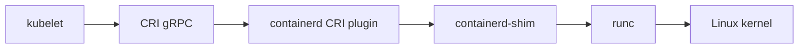
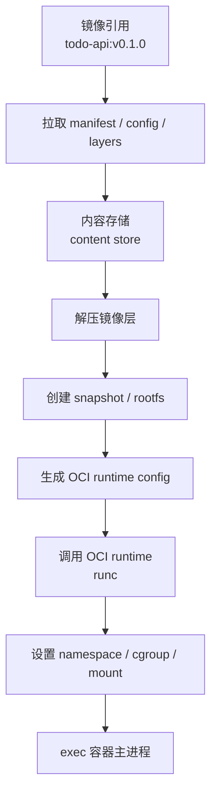
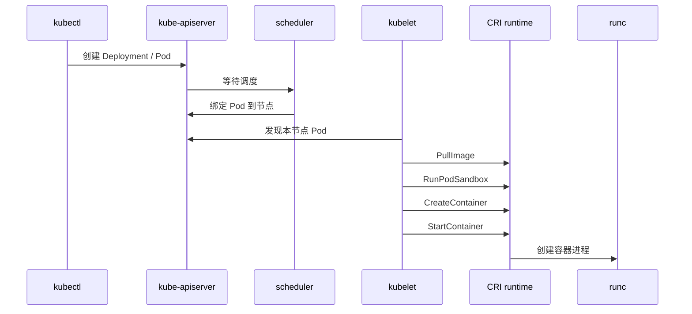

# 第 18 篇：OCI、containerd、runc 与 CRI

第 17 篇我们从 Linux 内核角度理解了容器：容器本质上是被 namespace 隔离、被 cgroups 限制、使用 rootfs 和分层文件系统运行的进程。

这一篇继续往上走一层：**Docker、containerd、runc 和 Kubernetes 到底怎么串起来？**

很多同学刚学 Kubernetes 时会有几个困惑：

- Kubernetes 节点上还需要 Docker 吗？
- Docker 和 containerd 是什么关系？
- `runc` 是不是容器运行时？
- `nerdctl`、`ctr`、`crictl`、`docker` 都能看容器，它们有什么区别？
- 为什么在 Kubernetes 节点上执行 `docker ps` 看不到 Pod 容器？
- kubelet 是怎么让容器运行时启动 Pod 的？

本篇特色项目是：**使用 `nerdctl` 和 `crictl` 观察 Todo 平台容器运行状态**。

为了避免一开始就依赖完整数据库和 Redis，本篇会先构建一个轻量的 `todo-runtime-probe` 镜像。它代表 Todo 平台中的运行时探针服务，用来观察镜像、容器、containerd、CRI 和 Kubernetes 节点运行时关系。随后会把同样的观察方法应用到第 15 篇构建的 `todo-api:v0.1.0` 镜像上，让本篇实验既适合新手入门，也不脱离 Todo 平台主线。

## 1. 本章学习目标

学完本篇后，你应该能够：

- 说明 OCI Image Specification、Runtime Specification、Distribution Specification 分别解决什么问题。
- 能解释镜像 manifest、config、layers、image index 的关系。
- 能解释 OCI runtime bundle 中 `config.json` 和 `rootfs` 的作用。
- 能说明 `runc` 在容器启动链路中的位置。
- 能解释 containerd 的镜像、快照、容器、task、shim、namespace 模型。
- 能说明 kubelet、CRI、containerd、runc、Linux kernel 之间的调用关系。
- 能区分 Docker、containerd、nerdctl、ctr、crictl 的使用边界。
- 能用 `nerdctl` 观察 containerd 中的镜像和容器。
- 能用 `crictl` 在 kind 节点中观察 Pod sandbox、容器、镜像、日志和状态。
- 能把 `todo-api:v0.1.0` 加载到 kind 节点，并从 CRI 视角观察一次性运行结果。
- 能排查运行时 socket、镜像未加载、Pod sandbox 创建失败、容器 CrashLoop、containerd 服务异常等问题。
- 能说明现代 Kubernetes 为什么不依赖 Docker Engine 作为节点运行时。

本篇完成后，你会得到一个实验目录：

```text
runtime-lab/
├── Dockerfile
├── www/
│   ├── healthz
│   └── index.html
├── k8s/
│   ├── todo-runtime-probe.yaml
│   └── todo-api-runtime-check.yaml
└── image-archive/
    └── todo-runtime-probe.tar
```

你会亲手观察这条链路：

```text
kubectl apply
  -> kube-apiserver
  -> kubelet
  -> CRI
  -> containerd
  -> containerd-shim
  -> runc
  -> Linux kernel
```

## 2. 本章工作场景

真实公司中，容器运行时问题经常出现在 Kubernetes 节点、镜像发布、生产排障和平台建设中。

典型场景包括：

- 新版本 Kubernetes 升级后，节点报 `container runtime is not ready`。
- Pod 一直 `ImagePullBackOff`，但应用团队说镜像已经推送到仓库。
- Pod `CrashLoopBackOff`，需要在节点上查看 CRI 层日志和容器退出码。
- 安全团队要求确认生产集群已经不依赖 Docker Engine 和 dockershim。
- 平台团队要配置 containerd 镜像加速、私有仓库认证、sandbox image。
- SRE 需要确认容器 OOM、CPU throttling、shim 进程、cgroup 路径和 kubelet 事件之间的关系。
- 开发同学在本机用 Docker 能跑，进入 Kubernetes 后发现节点运行时用的是 containerd，命令和排障方式都变了。

如果只会 `docker ps`，进入 Kubernetes 节点后会很不适应。现代 Kubernetes 通过 CRI 和容器运行时交互。生产集群常见运行时是 containerd 或 CRI-O，而不是让 kubelet 直接调用 Docker CLI。

本章模拟一个典型任务：

> 团队准备进入 Kubernetes 阶段。你需要说明 Docker、containerd、runc、CRI、Kubernetes 的关系，并能在本地 kind 集群中使用 `crictl` 观察 Todo 运行时探针容器的状态。

这项能力会直接支撑第 19 篇 Kubernetes 架构与集群搭建。

## 3. 前置知识

必须掌握：

- 第 14 篇 Docker 镜像、容器、网络、数据卷基础。
- 第 15 篇 Dockerfile、多阶段构建和镜像标签。
- 第 16 篇 Docker Compose 多容器编排。
- 第 17 篇 namespace、cgroups、rootfs、OverlayFS 和容器进程模型。

建议了解：

- 第 1 篇安装的 `kubectl`、`kind` 基础命令。
- Linux `systemctl`、`journalctl`、`ps`、`ss` 的基础用法。
- YAML 基本缩进规则。
- HTTP 健康检查接口的作用。

本篇实验需要：

| 工具 | 要求 | 说明 |
|---|---|---|
| Docker | Docker Desktop 或 Docker Engine | 用来构建探针镜像和运行 kind 节点 |
| kind | 建议可用 | 用来创建本地 Kubernetes 集群 |
| kubectl | 建议可用 | 用来部署探针工作负载 |
| crictl | kind 节点中通常自带 | 用来观察 CRI 层容器 |
| nerdctl | Linux 环境推荐安装 | 用来观察 containerd 原生容器 |
| runc | 可选 | 用来理解 OCI runtime 位置 |
| curl | 必需 | 验证探针服务 |

!!! warning "本篇包含节点运行时观察命令"
    `crictl`、`ctr`、`nerdctl`、`runc` 都比普通应用命令更接近节点底层。请只在本地学习机、WSL2、虚拟机或 kind 节点中执行。不要在生产节点上随意删除镜像、停止容器、修改 containerd 配置或手动清理运行时目录。

### 环境选择

=== "Linux / WSL2 Ubuntu"

    推荐完成本篇全部实验。先确认工具：

    ```bash
    docker version
    kind version
    kubectl version --client
    command -v curl
    command -v nerdctl || true
    command -v runc || true
    ```

    如果没有 `nerdctl`，可以先完成 Docker、kind、crictl 主线实验，再按 6.6 的说明补装。

=== "macOS"

    macOS 可以使用 Docker Desktop 和 kind 完成 Docker、kind、crictl 主线实验。`nerdctl`、containerd systemd 服务、runc 低层实验更适合在 Linux VM 中完成。

=== "Windows PowerShell"

    推荐使用 Docker Desktop + WSL2 后端。PowerShell 可以完成 Docker、kind、kubectl 主线实验；涉及 Linux 节点内部观察时，命令会通过 `docker exec` 进入 kind 节点执行。

## 4. 核心概念

### 4.1 OCI 是什么

OCI 是 Open Container Initiative 的缩写。它不是某个具体命令，而是一组容器标准。

常见三类规范：

| 规范 | 解决的问题 | 你会在哪里遇到 |
|---|---|---|
| OCI Image Specification | 镜像如何描述、打包、分层 | Docker 镜像、containerd 镜像、镜像仓库 |
| OCI Runtime Specification | 容器如何从 bundle 启动 | `runc`、`crun`、Kata Containers |
| OCI Distribution Specification | 镜像如何在仓库中分发 | Docker Hub、GHCR、Harbor、云厂商镜像仓库 |

有了 OCI，镜像和运行时之间就有了共同语言。你可以用 Docker 构建镜像，用 containerd 拉取镜像，用 runc 启动容器。工具可以不同，但遵循的核心格式和运行约定是统一的。

### 4.2 OCI 镜像格式

一个容器镜像不是一个神秘黑盒。它通常包含：

| 组成 | 作用 |
|---|---|
| manifest | 描述这个镜像使用哪个 config，包含哪些 layer |
| config | 描述镜像默认命令、环境变量、工作目录、架构、rootfs diff IDs |
| layers | 文件系统层，通常是压缩 tar |
| image index | 多平台索引，例如同时包含 `linux/amd64` 和 `linux/arm64` |

可以把镜像理解成：

```text
镜像引用 todo-api:v0.1.0
  -> image index 可选，多架构入口
  -> manifest 单个平台的镜像描述
  -> config 默认命令、环境变量、rootfs 元数据
  -> layer 1
  -> layer 2
  -> layer 3
```

第 15 篇讲过 Dockerfile 的每个文件系统变更步骤通常会形成镜像层。本篇把这个认识和 OCI 镜像格式连接起来。

### 4.3 OCI runtime bundle

OCI Runtime Specification 关注的是“如何运行一个已经准备好的容器文件系统”。

一个 runtime bundle 常见结构：

```text
bundle/
├── config.json
└── rootfs/
    ├── bin/
    ├── etc/
    └── ...
```

其中：

| 文件或目录 | 作用 |
|---|---|
| `rootfs/` | 容器进程看到的根文件系统 |
| `config.json` | 运行配置，包含命令、环境变量、挂载、namespace、cgroup、capabilities 等 |

第 17 篇用 `chroot`、namespace 和 cgroups 模拟过容器。OCI runtime bundle 就是把这些低层配置整理成标准格式，再交给 OCI runtime 执行。

### 4.4 runc

`runc` 是一个常见的 OCI runtime。它负责根据 OCI runtime bundle 调用 Linux 内核能力，创建真正的容器进程。

可以把它的位置理解为：

```text
containerd
  -> containerd-shim
  -> runc
  -> clone / unshare / mount / cgroup / exec
  -> 容器主进程
```

`runc` 不负责：

- 从镜像仓库拉取镜像。
- 构建镜像。
- 管理镜像仓库认证。
- 提供 Docker API。
- 调度 Pod。

它更靠近“把一个 bundle 运行成容器进程”的底层环节。

### 4.5 containerd

containerd 是容器运行时的核心组件之一。它比 Docker Engine 更低层，但比 runc 更高层。

containerd 负责：

- 拉取和管理镜像。
- 管理镜像解压后的快照。
- 创建容器对象。
- 启动和管理运行中的 task。
- 管理 containerd-shim。
- 暴露 CRI 插件给 Kubernetes kubelet。

containerd 中有几个概念需要区分：

| 概念 | 含义 |
|---|---|
| image | 镜像元数据和内容引用 |
| snapshot | 镜像层解压后的文件系统快照 |
| container | 容器配置对象，还不一定在运行 |
| task | 真正运行中的容器进程 |
| namespace | containerd 内部隔离资源的逻辑命名空间，例如 `default`、`moby`、`k8s.io` |
| shim | 位于 containerd 和容器进程之间的小进程，负责保持容器生命周期、stdio、退出状态等 |

!!! note "containerd namespace 和 Linux namespace 不是一回事"
    containerd namespace 是 containerd 内部资源分组，例如 Kubernetes 通常使用 `k8s.io`。Linux namespace 是内核隔离机制，例如 PID、Network、Mount namespace。它们名字相同，但层级完全不同。

### 4.6 CRI

CRI 是 Container Runtime Interface。它是 Kubernetes kubelet 和容器运行时之间的接口。

有了 CRI，kubelet 不需要关心底层运行时到底是 containerd、CRI-O，还是其他实现。kubelet 通过一组 gRPC 接口请求运行时完成：

- 拉取镜像。
- 创建 Pod sandbox。
- 创建容器。
- 启动容器。
- 停止容器。
- 获取容器日志。
- 查询容器状态。
- 查询运行时状态。

简化链路：



Kubernetes 1.24 起移除了 dockershim。现代 Kubernetes 节点需要使用符合 CRI 的运行时。Docker Engine 仍然可以用于开发、构建和本地运行容器，但生产 Kubernetes 节点上的 kubelet 通常直接对接 containerd 或 CRI-O。

### 4.7 Pod sandbox

CRI 中有一个非常重要的概念：Pod sandbox。

Kubernetes 的 Pod 不是一个普通单容器。Pod 内多个容器会共享部分 namespace，尤其是 Network namespace。CRI 会先创建一个 Pod sandbox，再在这个 sandbox 中启动业务容器。

简化理解：

```text
Pod
├── pause / sandbox 容器
│   └── 持有 Pod 的网络命名空间
├── app 容器
└── sidecar 容器
```

在 `crictl pods` 中看到的是 Pod sandbox；在 `crictl ps` 中看到的是具体业务容器。

### 4.8 Docker、containerd、runc、Kubernetes 的关系

常见链路可以这样看：

```mermaid
flowchart TB
    subgraph DockerDev["开发机 Docker 使用链路"]
      DockerCLI["docker CLI"] --> DockerEngine["Docker Engine"]
      DockerEngine --> DockerContainerd["containerd"]
      DockerContainerd --> DockerRunc["runc"]
      DockerRunc --> Kernel1["Linux kernel"]
    end

    subgraph K8sNode["Kubernetes 节点运行链路"]
      Kubectl["kubectl"] --> APIServer["kube-apiserver"]
      APIServer --> Kubelet["kubelet"]
      Kubelet --> CRI["CRI"]
      CRI --> K8sContainerd["containerd"]
      K8sContainerd --> Shim["containerd-shim"]
      Shim --> K8sRunc["runc"]
      K8sRunc --> Kernel2["Linux kernel"]
    end
```



对学习者来说，最重要的是不要把 Docker 等同于容器本身。Docker 是很好用的开发入口，但 Kubernetes 节点运行容器时，核心关系是 kubelet 通过 CRI 调用容器运行时。

### 4.9 nerdctl、ctr、crictl、docker 的区别

| 工具 | 面向对象 | 典型用途 | 是否推荐日常使用 |
|---|---|---|---|
| `docker` | Docker Engine | 开发、构建、运行、Compose | 本地开发推荐 |
| `nerdctl` | containerd | 用 Docker 风格命令操作 containerd | 学习 containerd、部分生产调试可用 |
| `ctr` | containerd 原生命令 | 低层调试 containerd | 不适合新手日常使用 |
| `crictl` | CRI 运行时 | Kubernetes 节点排障 | 节点排障推荐 |
| `kubectl` | Kubernetes API | 声明式管理集群资源 | Kubernetes 日常使用推荐 |

简单记忆：

```text
开发应用：docker
观察 containerd：nerdctl
底层 containerd 调试：ctr
排查 Kubernetes 节点运行时：crictl
管理 Kubernetes 资源：kubectl
```

## 5. 原理深入

### 5.1 从镜像到进程的完整链路

一个镜像变成容器进程，通常会经历这些步骤：



Docker、containerd、CRI-O 在具体实现上不同，但大体都绕不开这些步骤。

### 5.2 containerd 中 container 和 task 的区别

containerd 里 `container` 和 `task` 是两个不同概念。

`container` 更像配置对象，包含镜像、运行配置、快照引用等。创建 container 不代表进程已经运行。

`task` 才是运行中的进程实体。启动 task 后，才会真正出现容器主进程和 shim 进程。

这和 Docker CLI 的直觉略有不同。Docker 中你执行 `docker run`，它把 create 和 start 包装到一起了。containerd 把这些步骤拆得更清楚。

### 5.3 shim 为什么存在

containerd 启动容器时，不是让容器进程直接挂在 containerd 主进程下面，而是通过 containerd-shim 管理。

shim 的价值：

- 保存容器进程的 stdio。
- 记录容器退出状态。
- 让容器进程不强依赖 containerd daemon 的生命周期。
- 支持 containerd 重启后重新连接已有容器。
- 管理 runc 启动后的运行期状态。

生产排障中看到很多 `containerd-shim-runc-v2` 进程是正常现象。不要随意 kill shim，除非你明确知道影响范围。

### 5.4 kubelet 通过 CRI 调用运行时

当你执行：

```bash
kubectl apply -f todo-runtime-probe.yaml
```

大致流程是：



`kubectl` 不会直接连 containerd；kube-apiserver 也不会直接启动容器。真正负责节点容器生命周期的是 kubelet 和节点上的 CRI 运行时。

### 5.5 为什么 Kubernetes 不再依赖 dockershim

早期 Kubernetes 支持通过 dockershim 适配 Docker Engine。后来 Kubernetes 已经有了标准 CRI，维护 dockershim 会增加额外复杂度。Kubernetes 1.24 起移除了内置 dockershim。

这并不代表 Docker 不能用了。准确说：

- 本地开发仍然可以使用 Docker Desktop / Docker Engine。
- 镜像仍然可以用 Dockerfile 构建。
- 镜像仓库仍然可以存 Docker 或 OCI 兼容镜像。
- Kubernetes 节点运行 Pod 时，不再需要 kubelet 通过内置 dockershim 调 Docker Engine。
- 生产节点通常使用 containerd 或 CRI-O 这类 CRI 兼容运行时。

所以“Docker 被 Kubernetes 弃用”这个说法不准确。被移除的是 Kubernetes 内置的 dockershim，不是 Dockerfile、Docker 镜像或 Docker 本地开发工作流。

### 5.6 为什么 `docker ps` 看不到 Kubernetes Pod

在 containerd 节点上，Kubernetes Pod 容器由 containerd 的 CRI 插件管理，通常放在 containerd namespace `k8s.io` 中。Docker CLI 面向 Docker Engine，它不知道 kubelet 通过 CRI 创建的容器。

因此 Kubernetes 节点排障应该优先用：

```bash
kubectl get pod
kubectl describe pod
kubectl logs
crictl pods
crictl ps -a
crictl inspect
crictl logs
```

`docker ps` 适合查看 Docker Engine 管理的容器，例如 kind 节点本身在你的开发机上就是 Docker 容器。但进入 kind 节点内部后，Pod 容器是由节点内的 containerd 管理。

### 5.7 RuntimeClass 和更高级的运行时

Kubernetes 还支持 RuntimeClass，用于为不同 Pod 选择不同运行时处理器。例如：

- 默认 `runc`：普通 Linux 容器。
- gVisor：更强的用户态内核隔离。
- Kata Containers：基于轻量虚拟机增强隔离。

本篇不展开 RuntimeClass 实验，只建立概念。后续生产安全和平台工程章节会再次遇到它。

## 6. 手把手实验

### 6.1 实验目标

本实验会完成：

- 创建 `todo-runtime-probe` 探针镜像。
- 查看镜像配置、层信息和归档内容。
- 可选使用 `runc` 运行一个低层 OCI bundle。
- 可选使用 `nerdctl` 把探针镜像导入 containerd 并运行。
- 使用 kind 创建本地 Kubernetes 集群。
- 把探针镜像加载到 kind 节点。
- 部署探针 Deployment 和 Service。
- 使用 `kubectl` 验证工作负载。
- 进入 kind 节点，用 `crictl` 观察 Pod sandbox、容器、镜像、日志和状态。
- 用 `ctr` 观察 containerd namespace 和 shim 进程。
- 把第 15 篇构建的 `todo-api:v0.1.0` 加载到 kind 节点，并用 Job 做一次性运行时观察。
- 清理所有实验资源。

实验路线建议：

| 路线 | 适合人群 | 必做内容 |
|---|---|---|
| 基础路线 | 第一次接触运行时的新手 | 构建镜像、kind 部署、`kubectl` 和 `crictl` 观察 |
| 进阶路线 | 想理解 containerd 的学习者 | 安装 `nerdctl`，观察 containerd 镜像和容器 |
| 底层路线 | 想理解 OCI runtime 的学习者 | 可选 `runc` bundle 实验 |

如果某个底层工具安装不方便，可以先跳过。重点是理解链路和掌握 Kubernetes 节点排障入口。

### 6.2 创建实验目录

=== "Linux / macOS / WSL2"

    ```bash
    export LAB="$HOME/runtime-lab"
    mkdir -p "$LAB/www" "$LAB/k8s" "$LAB/image-archive"
    cd "$LAB"
    pwd
    ```

=== "Windows PowerShell"

    ```powershell
    $env:LAB = "$HOME\runtime-lab"
    New-Item -ItemType Directory -Force "$env:LAB\www", "$env:LAB\k8s", "$env:LAB\image-archive" | Out-Null
    Set-Location $env:LAB
    Get-Location
    ```

为什么要单独建目录？本篇会生成镜像、YAML、归档文件和临时集群。把内容集中在 `runtime-lab` 中，便于清理和复盘。

### 6.3 编写探针镜像

创建健康检查文件：

=== "Linux / macOS / WSL2"

    ```bash
    cat > www/healthz <<'EOF'
    ok
    EOF

    cat > www/index.html <<'EOF'
    <!doctype html>
    <html>
      <head>
        <meta charset="utf-8">
        <title>Todo Runtime Probe</title>
      </head>
      <body>
        <h1>Todo Runtime Probe</h1>
        <p>This tiny service is used to inspect OCI, containerd and CRI.</p>
      </body>
    </html>
    EOF
    ```

=== "Windows PowerShell"

    ```powershell
    @"
    ok
    "@ | Set-Content -Encoding UTF8 www\healthz

    @"
    <!doctype html>
    <html>
      <head>
        <meta charset="utf-8">
        <title>Todo Runtime Probe</title>
      </head>
      <body>
        <h1>Todo Runtime Probe</h1>
        <p>This tiny service is used to inspect OCI, containerd and CRI.</p>
      </body>
    </html>
    "@ | Set-Content -Encoding UTF8 www\index.html
    ```

创建 Dockerfile：

```dockerfile title="Dockerfile"
FROM busybox:1.36

LABEL org.opencontainers.image.title="todo-runtime-probe"
LABEL org.opencontainers.image.description="A tiny Todo Platform runtime probe for OCI, containerd and CRI labs"
LABEL org.opencontainers.image.version="v0.1.0"

WORKDIR /www
COPY www/ /www/

EXPOSE 8080
HEALTHCHECK --interval=10s --timeout=2s --retries=3 CMD wget -qO- http://127.0.0.1:8080/healthz || exit 1

CMD ["httpd", "-f", "-p", "8080", "-h", "/www"]
```

关键字段解释：

| 字段 | 作用 |
|---|---|
| `FROM busybox:1.36` | 使用很小的基础镜像，便于快速构建和加载 |
| `LABEL org.opencontainers.image.*` | 使用 OCI 推荐标签表达镜像元数据 |
| `COPY www/ /www/` | 把探针页面复制到镜像中 |
| `EXPOSE 8080` | 声明容器内服务端口 |
| `HEALTHCHECK` | 给 Docker 场景提供健康检查 |
| `CMD` | 用 BusyBox `httpd` 前台运行 HTTP 服务 |

构建镜像：

```bash
docker build -t todo-runtime-probe:v0.1.0 .
docker image ls todo-runtime-probe
```

本地运行验证：

=== "Linux / macOS / WSL2"

    ```bash
    docker rm -f todo-runtime-probe 2>/dev/null || true
    docker run -d --name todo-runtime-probe -p 127.0.0.1:18080:8080 todo-runtime-probe:v0.1.0
    curl -i http://127.0.0.1:18080/healthz
    docker logs todo-runtime-probe
    docker rm -f todo-runtime-probe
    ```

=== "Windows PowerShell"

    ```powershell
    docker rm -f todo-runtime-probe 2>$null
    docker run -d --name todo-runtime-probe -p 127.0.0.1:18080:8080 todo-runtime-probe:v0.1.0
    curl.exe -i http://127.0.0.1:18080/healthz
    docker logs todo-runtime-probe
    docker rm -f todo-runtime-probe
    ```

预期 `/healthz` 返回 `ok`。这个探针服务很小，但它是一个完整镜像，可以进入 Docker、containerd 和 Kubernetes 运行时链路。

### 6.4 观察镜像结构

查看镜像配置：

```bash
docker image inspect todo-runtime-probe:v0.1.0
```

重点看：

- `Config.Cmd` 是否是 `httpd -f -p 8080 -h /www`。
- `Config.ExposedPorts` 是否包含 `8080/tcp`。
- `Config.Labels` 是否包含 `org.opencontainers.image.*`。
- `RootFS.Layers` 有多少层。

查看镜像历史：

```bash
docker history todo-runtime-probe:v0.1.0
```

导出镜像归档：

=== "Linux / macOS / WSL2"

    ```bash
    docker save todo-runtime-probe:v0.1.0 -o image-archive/todo-runtime-probe.tar
    mkdir -p image-archive/unpacked
    tar -xf image-archive/todo-runtime-probe.tar -C image-archive/unpacked
    find image-archive/unpacked -maxdepth 2 -type f | sort | head -20
    ```

=== "Windows PowerShell"

    ```powershell
    docker save todo-runtime-probe:v0.1.0 -o image-archive\todo-runtime-probe.tar
    New-Item -ItemType Directory -Force image-archive\unpacked | Out-Null
    tar -xf image-archive\todo-runtime-probe.tar -C image-archive\unpacked
    Get-ChildItem image-archive\unpacked -Recurse -File | Select-Object -First 20
    ```

Docker archive 和 OCI image layout 不是完全相同的目录格式，但都能帮助你观察镜像由 manifest、config 和 layer 组成。学习重点是理解：镜像不是一个单文件，而是一组内容寻址的配置和文件系统层。

### 6.5 可选：使用 runc 观察 OCI runtime

如果你的 Linux 环境有 `runc`，可以做这个底层实验。macOS 和 Windows PowerShell 请跳过，或进入 Linux VM / WSL2。

确认：

```bash
runc --version
```

创建 rootfs：

```bash
mkdir -p "$LAB/runc-bundle/rootfs"
CID="$(docker create busybox:1.36)"
docker export "$CID" | tar -C "$LAB/runc-bundle/rootfs" -xf -
docker rm "$CID"
```

生成并修改 OCI runtime 配置：

```bash
cd "$LAB/runc-bundle"
runc spec

python3 - <<'PY'
import json
from pathlib import Path

path = Path("config.json")
cfg = json.loads(path.read_text())
cfg["process"]["terminal"] = False
cfg["process"]["args"] = ["sh", "-c", "echo hello-from-runc; id; hostname; sleep 3"]
path.write_text(json.dumps(cfg, indent=2))
PY
```

运行：

```bash
sudo runc run todo-runc-demo
sudo runc delete todo-runc-demo 2>/dev/null || true
```

你应该能看到 `hello-from-runc`、用户 ID 和 hostname 输出。

这个实验说明：`runc` 不需要 Dockerfile、Compose 或 Kubernetes。只要有符合 OCI Runtime Specification 的 `config.json` 和 `rootfs`，它就能创建容器进程。真实生产中一般不会手写这一步，而是由 containerd 生成配置并调用 runc。

### 6.6 可选：安装并使用 nerdctl

`nerdctl` 是面向 containerd 的 Docker 风格 CLI。它不是 Kubernetes 排障必需工具，但非常适合学习 containerd。

这里有一个容易踩坑的点：`nerdctl` 只是 CLI，端口映射、容器网络、BuildKit 等能力还依赖 CNI 插件、BuildKit 等配套组件。只安装单个 `nerdctl` 二进制后，`nerdctl images`、`nerdctl load` 这类命令通常可用，但 `nerdctl run -p` 可能因为缺少 CNI 插件而失败。新手学习时更推荐安装 `nerdctl-full` 包。

!!! warning "只在学习环境安装"
    安装或重启 containerd 可能影响当前机器上依赖 containerd 的服务。请在个人学习机、VM 或 WSL2 中执行。公司生产节点不要随意安装或升级。

Ubuntu / Debian 推荐示例：

```bash
sudo apt update
sudo apt install -y containerd curl tar
sudo systemctl enable --now containerd

# 示例版本。执行前请到 nerdctl release 页面确认是否已有更新稳定版本。
NERDCTL_VERSION=v2.3.1
NERDCTL_ARCH=linux-amd64
NERDCTL_TARBALL="nerdctl-full-${NERDCTL_VERSION#v}-${NERDCTL_ARCH}.tar.gz"
curl -L "https://github.com/containerd/nerdctl/releases/download/${NERDCTL_VERSION}/${NERDCTL_TARBALL}" \
  -o "/tmp/${NERDCTL_TARBALL}"
curl -L "https://github.com/containerd/nerdctl/releases/download/${NERDCTL_VERSION}/SHA256SUMS" \
  -o /tmp/nerdctl-SHA256SUMS
(cd /tmp && grep " ${NERDCTL_TARBALL}$" nerdctl-SHA256SUMS | sha256sum -c -)
sudo tar -C /usr/local -xzf "/tmp/${NERDCTL_TARBALL}"
nerdctl --version
```

上面同时下载 `SHA256SUMS`，是为了让你对照压缩包哈希值。课程里没有要求你手工验证签名链路，但企业环境不应该裸下载二进制后直接执行。更稳妥的方式是使用发行版包管理器、公司内部制品仓库、固定版本和校验流程。

如果你的系统架构不是 `amd64`，请到 nerdctl release 页面选择对应架构，例如 `linux-arm64`。如果你只想观察镜像和 containerd 对象，不需要端口映射，也可以只解压轻量 `nerdctl-<version>-linux-<arch>.tar.gz` 中的 `nerdctl` 二进制。

把 Docker 镜像导入 containerd：

```bash
cd "$LAB"
docker save todo-runtime-probe:v0.1.0 -o image-archive/todo-runtime-probe.tar
sudo nerdctl load -i image-archive/todo-runtime-probe.tar
sudo nerdctl images | grep todo-runtime-probe
```

运行探针容器：

```bash
sudo nerdctl rm -f todo-runtime-probe 2>/dev/null || true
sudo nerdctl run -d --name todo-runtime-probe -p 127.0.0.1:18080:8080 todo-runtime-probe:v0.1.0
sudo nerdctl ps
curl -i http://127.0.0.1:18080/healthz
sudo nerdctl logs todo-runtime-probe
```

如果这里报 CNI、bridge、portmap 相关错误，说明 `nerdctl` 找不到完整网络插件。请确认你安装的是 `nerdctl-full` 包，或者先跳过 `nerdctl run -p`，只做 `nerdctl load`、`nerdctl images` 和后面的 kind / `crictl` 主线实验。

观察 containerd 底层信息：

```bash
sudo ctr namespaces ls
sudo ctr -n default images ls | grep todo-runtime-probe
sudo ctr -n default containers ls | grep todo-runtime-probe
sudo ctr -n default tasks ls | grep todo-runtime-probe
ps -ef | grep containerd-shim | grep -v grep || true
```

清理：

```bash
sudo nerdctl rm -f todo-runtime-probe
```

如果 `sudo nerdctl ps` 为空，但你能看到 Docker 容器，这是正常的。Docker Engine 和 nerdctl 可能使用不同 daemon 或不同 containerd namespace。不要用“一个工具看不到”直接判断容器不存在，要先确认工具连接的是哪个运行时和哪个 namespace。

### 6.7 创建 kind 集群

本篇用 kind 创建一个本地 Kubernetes 节点。kind 节点本身是 Docker 容器，节点内部运行 containerd。这样我们可以安全地在节点里使用 `crictl`。

创建集群：

```bash
kind create cluster --name todo-runtime
kubectl cluster-info --context kind-todo-runtime
kubectl get nodes
```

如果集群已存在：

```bash
kind get clusters
```

可以直接复用，也可以删除后重建：

```bash
kind delete cluster --name todo-runtime
kind create cluster --name todo-runtime
```

确认 kind 节点容器：

=== "Linux / macOS / WSL2"

    ```bash
    docker ps --filter name=todo-runtime-control-plane
    ```

=== "Windows PowerShell"

    ```powershell
    docker ps --filter name=todo-runtime-control-plane
    ```

### 6.8 把镜像加载到 kind 节点

kind 节点内部的 containerd 不会自动看到宿主机 Docker 镜像。需要显式加载：

```bash
kind load docker-image todo-runtime-probe:v0.1.0 --name todo-runtime
```

这一步非常关键。如果忘记加载，本地自定义镜像部署到 kind 后可能出现 `ImagePullBackOff`。

进入节点确认镜像：

=== "Linux / macOS / WSL2"

    ```bash
    NODE=todo-runtime-control-plane
    docker exec "$NODE" crictl --runtime-endpoint unix:///run/containerd/containerd.sock images | grep todo-runtime-probe
    ```

=== "Windows PowerShell"

    ```powershell
    $NODE = "todo-runtime-control-plane"
    docker exec $NODE crictl --runtime-endpoint unix:///run/containerd/containerd.sock images | Select-String "todo-runtime-probe"
    ```

如果 `crictl` 不在节点中，可以先用 `ctr` 验证：

```bash
docker exec todo-runtime-control-plane ctr -n k8s.io images ls | grep todo-runtime-probe
```

### 6.9 编写 Kubernetes YAML

创建 `k8s/todo-runtime-probe.yaml`：

```yaml title="k8s/todo-runtime-probe.yaml"
apiVersion: v1
kind: Namespace
metadata:
  name: todo-runtime-lab
---
apiVersion: apps/v1
kind: Deployment
metadata:
  name: todo-runtime-probe
  namespace: todo-runtime-lab
  labels:
    app: todo-runtime-probe
spec:
  replicas: 1
  selector:
    matchLabels:
      app: todo-runtime-probe
  template:
    metadata:
      labels:
        app: todo-runtime-probe
    spec:
      containers:
        - name: probe
          image: todo-runtime-probe:v0.1.0
          imagePullPolicy: IfNotPresent
          ports:
            - name: http
              containerPort: 8080
          readinessProbe:
            httpGet:
              path: /healthz
              port: http
            initialDelaySeconds: 2
            periodSeconds: 5
          livenessProbe:
            httpGet:
              path: /healthz
              port: http
            initialDelaySeconds: 5
            periodSeconds: 10
          resources:
            requests:
              cpu: 10m
              memory: 16Mi
            limits:
              cpu: 100m
              memory: 64Mi
---
apiVersion: v1
kind: Service
metadata:
  name: todo-runtime-probe
  namespace: todo-runtime-lab
spec:
  type: ClusterIP
  selector:
    app: todo-runtime-probe
  ports:
    - name: http
      port: 80
      targetPort: http
```

关键字段解释：

| 字段 | 作用 |
|---|---|
| `Namespace` | 把本篇实验资源隔离到 `todo-runtime-lab` |
| `Deployment` | 管理一个探针 Pod，后续 Kubernetes 工作负载章节会深入 |
| `replicas: 1` | 只运行一个副本，便于观察 |
| `imagePullPolicy: IfNotPresent` | kind 节点已有本地镜像时不强制拉取 |
| `readinessProbe` | 判断容器是否准备好接流量 |
| `livenessProbe` | 判断容器是否需要重启 |
| `resources` | 给容器设置基础 request / limit |
| `Service` | 给 Pod 提供集群内稳定访问入口 |

### 6.10 部署并验证

部署：

```bash
kubectl apply -f k8s/todo-runtime-probe.yaml
kubectl -n todo-runtime-lab get all
kubectl -n todo-runtime-lab wait --for=condition=available deployment/todo-runtime-probe --timeout=120s
```

查看 Pod：

```bash
kubectl -n todo-runtime-lab get pod -o wide
kubectl -n todo-runtime-lab describe pod -l app=todo-runtime-probe
```

访问服务：

```bash
kubectl -n todo-runtime-lab port-forward svc/todo-runtime-probe 18080:80
```

另开一个终端执行：

```bash
curl -i http://127.0.0.1:18080/healthz
```

预期输出包含：

```text
HTTP/1.1 200 OK
ok
```

按 `Ctrl+C` 停止 `port-forward`。

### 6.11 使用 crictl 观察 Pod sandbox 和容器

进入 kind 节点前，先确认节点容器名：

=== "Linux / macOS / WSL2"

    ```bash
    NODE=todo-runtime-control-plane
    docker exec "$NODE" hostname
    ```

=== "Windows PowerShell"

    ```powershell
    $NODE = "todo-runtime-control-plane"
    docker exec $NODE hostname
    ```

查看运行时信息：

=== "Linux / macOS / WSL2"

    ```bash
    docker exec "$NODE" crictl --runtime-endpoint unix:///run/containerd/containerd.sock info
    ```

=== "Windows PowerShell"

    ```powershell
    docker exec $NODE crictl --runtime-endpoint unix:///run/containerd/containerd.sock info
    ```

查看 Pod sandbox：

=== "Linux / macOS / WSL2"

    ```bash
    docker exec "$NODE" crictl --runtime-endpoint unix:///run/containerd/containerd.sock pods --namespace todo-runtime-lab
    POD_ID="$(docker exec "$NODE" crictl --runtime-endpoint unix:///run/containerd/containerd.sock pods --namespace todo-runtime-lab -q | head -n 1)"
    echo "$POD_ID"
    ```

=== "Windows PowerShell"

    ```powershell
    docker exec $NODE crictl --runtime-endpoint unix:///run/containerd/containerd.sock pods --namespace todo-runtime-lab
    $POD_ID = docker exec $NODE crictl --runtime-endpoint unix:///run/containerd/containerd.sock pods --namespace todo-runtime-lab -q | Select-Object -First 1
    $POD_ID
    ```

查看容器：

=== "Linux / macOS / WSL2"

    ```bash
    docker exec "$NODE" crictl --runtime-endpoint unix:///run/containerd/containerd.sock ps -a --pod "$POD_ID"
    CONTAINER_ID="$(docker exec "$NODE" crictl --runtime-endpoint unix:///run/containerd/containerd.sock ps -a --pod "$POD_ID" -q | head -n 1)"
    echo "$CONTAINER_ID"
    ```

=== "Windows PowerShell"

    ```powershell
    docker exec $NODE crictl --runtime-endpoint unix:///run/containerd/containerd.sock ps -a --pod $POD_ID
    $CONTAINER_ID = docker exec $NODE crictl --runtime-endpoint unix:///run/containerd/containerd.sock ps -a --pod $POD_ID -q | Select-Object -First 1
    $CONTAINER_ID
    ```

`crictl pods` 预期会看到类似输出：

```text
POD ID              CREATED             STATE     NAME                   NAMESPACE          ATTEMPT
3f4a1c2b9d8e7       30 seconds ago      Ready     todo-runtime-probe     todo-runtime-lab   0
```

`crictl ps -a --pod "$POD_ID"` 预期会看到类似输出：

```text
CONTAINER           IMAGE               CREATED             STATE     NAME     ATTEMPT     POD ID
9a8b7c6d5e4f3       2b1c0d...           29 seconds ago      Running   probe    0           3f4a1c...
```

判断方式：

- `crictl pods` 的 `STATE` 为 `Ready`，说明 Pod sandbox 已创建成功。
- `crictl ps` 的 `STATE` 为 `Running`，说明业务容器已经在 sandbox 中运行。
- `NAME` 为 `probe`，对应 YAML 中 `containers[].name`。

查看容器详情和日志：

=== "Linux / macOS / WSL2"

    ```bash
    docker exec "$NODE" crictl --runtime-endpoint unix:///run/containerd/containerd.sock inspect "$CONTAINER_ID" | head -80
    docker exec "$NODE" crictl --runtime-endpoint unix:///run/containerd/containerd.sock logs "$CONTAINER_ID"
    docker exec "$NODE" crictl --runtime-endpoint unix:///run/containerd/containerd.sock stats
    ```

=== "Windows PowerShell"

    ```powershell
    docker exec $NODE crictl --runtime-endpoint unix:///run/containerd/containerd.sock inspect $CONTAINER_ID
    docker exec $NODE crictl --runtime-endpoint unix:///run/containerd/containerd.sock logs $CONTAINER_ID
    docker exec $NODE crictl --runtime-endpoint unix:///run/containerd/containerd.sock stats
    ```

你应该能看到：

- Pod sandbox ID。
- 业务容器 ID。
- 镜像名称 `todo-runtime-probe:v0.1.0`。
- 容器状态 `CONTAINER_RUNNING`。
- 资源统计。

`crictl stats` 预期会看到 CPU、内存等资源统计。不同版本显示格式略有差异，但至少应该能看到容器 ID、CPU 使用、内存使用字段。如果没有输出，先确认容器仍在运行。

这里的 `crictl pods` 和 `crictl ps` 是 Kubernetes 节点排障的重要入口。以后遇到 kubelet、containerd 或 Pod 状态异常时，它能帮助你绕开部分 Kubernetes API 层，从节点运行时角度观察真实状态。

### 6.12 使用 ctr 观察 containerd namespace 和 shim

在 kind 节点里，Kubernetes 使用 containerd namespace `k8s.io`：

=== "Linux / macOS / WSL2"

    ```bash
    docker exec "$NODE" ctr namespaces ls
    docker exec "$NODE" ctr -n k8s.io containers ls | grep todo-runtime-probe
    docker exec "$NODE" ctr -n k8s.io tasks ls | grep todo-runtime-probe
    ```

=== "Windows PowerShell"

    ```powershell
    docker exec $NODE ctr namespaces ls
    docker exec $NODE ctr -n k8s.io containers ls
    docker exec $NODE ctr -n k8s.io tasks ls
    ```

`ctr -n k8s.io tasks ls` 预期能看到运行中的 task。它和 `crictl ps` 看到的是同一个容器运行事实，只是观察层级不同：`crictl` 站在 CRI 视角，`ctr` 站在 containerd 视角。

观察 shim：

=== "Linux / macOS / WSL2"

    ```bash
    docker exec "$NODE" ps -ef | grep containerd-shim | grep -v grep || true
    docker exec "$NODE" ls /run/containerd/io.containerd.runtime.v2.task/k8s.io | head
    ```

=== "Windows PowerShell"

    ```powershell
    docker exec $NODE ps -ef | Select-String "containerd-shim"
    docker exec $NODE ls /run/containerd/io.containerd.runtime.v2.task/k8s.io
    ```

对比关系：

| 观察入口 | 看到什么 |
|---|---|
| `kubectl get pod` | Kubernetes API 中的 Pod 状态 |
| `crictl pods` | CRI 层 Pod sandbox |
| `crictl ps` | CRI 层容器 |
| `ctr -n k8s.io containers ls` | containerd 容器对象 |
| `ctr -n k8s.io tasks ls` | containerd 运行中 task |
| `ps -ef | grep containerd-shim` | 节点上的 shim 进程 |

这几个视角看的是同一条运行链路的不同层次。

### 6.13 观察真实 Todo API 镜像

前面的 `todo-runtime-probe` 镜像很小，适合新手观察运行时链路。但本篇特色项目还要回到 Todo 平台本身。这里使用第 15 篇构建出的 `todo-api:v0.1.0` 做一次性运行时观察。

先确认宿主机 Docker 中有 Todo API 镜像。请在 Todo Platform 应用仓库根目录执行：

```bash
docker image ls todo-api
```

如果没有看到 `todo-api:v0.1.0`，回到第 15 篇执行：

```bash
docker build -t todo-api:v0.1.0 .
```

把 Todo API 镜像加载到 kind 节点：

```bash
kind load docker-image todo-api:v0.1.0 --name todo-runtime
docker exec "$NODE" crictl --runtime-endpoint unix:///run/containerd/containerd.sock images | grep todo-api
```

创建 `k8s/todo-api-runtime-check.yaml`：

```yaml title="k8s/todo-api-runtime-check.yaml"
apiVersion: batch/v1
kind: Job
metadata:
  name: todo-api-runtime-check
  namespace: todo-runtime-lab
spec:
  backoffLimit: 0
  template:
    metadata:
      labels:
        app: todo-api-runtime-check
    spec:
      restartPolicy: Never
      containers:
        - name: todo-api
          image: todo-api:v0.1.0
          imagePullPolicy: IfNotPresent
          command:
            - /app/todo-api
          args:
            - hash-password
            - runtime-check-123
          resources:
            requests:
              cpu: 10m
              memory: 32Mi
            limits:
              cpu: 100m
              memory: 128Mi
```

关键字段解释：

| 字段 | 作用 |
|---|---|
| `kind: Job` | 运行一次性检查任务，成功后退出 |
| `backoffLimit: 0` | 失败后不反复重试，方便观察真实错误 |
| `restartPolicy: Never` | Job 容器退出后不在同一个 Pod 内重启 |
| `command` / `args` | 执行 Todo API 的 `hash-password` 命令，不依赖数据库或 Redis |
| `imagePullPolicy: IfNotPresent` | 使用已经加载到 kind 节点的本地镜像 |
| `resources` | 让 CRI / cgroup 层可以看到资源边界 |

应用 Job：

```bash
kubectl apply -f k8s/todo-api-runtime-check.yaml
kubectl -n todo-runtime-lab wait --for=condition=complete job/todo-api-runtime-check --timeout=120s
kubectl -n todo-runtime-lab logs job/todo-api-runtime-check
```

预期 Job 成功完成，日志中能看到一段密码哈希，通常以 `$argon2id$` 开头。这里选择 `hash-password`，是因为它能验证真实 Todo API 镜像被节点运行时启动并执行成功，同时不依赖 PostgreSQL、Redis 或完整配置文件。

如果 Job 失败，先执行：

```bash
kubectl -n todo-runtime-lab describe job todo-api-runtime-check
kubectl -n todo-runtime-lab get pod -l app=todo-api-runtime-check
kubectl -n todo-runtime-lab logs -l app=todo-api-runtime-check
```

从 CRI 视角观察这个 Job 容器：

```bash
TODO_JOB_POD_NAME="$(kubectl -n todo-runtime-lab get pod -l app=todo-api-runtime-check -o jsonpath='{.items[0].metadata.name}')"
TODO_JOB_POD_ID="$(docker exec "$NODE" crictl --runtime-endpoint unix:///run/containerd/containerd.sock pods --namespace todo-runtime-lab --name "$TODO_JOB_POD_NAME" -q | head -n 1)"
docker exec "$NODE" crictl --runtime-endpoint unix:///run/containerd/containerd.sock ps -a --pod "$TODO_JOB_POD_ID"
docker exec "$NODE" crictl --runtime-endpoint unix:///run/containerd/containerd.sock images | grep todo-api
```

这里你会看到 Todo API 容器大概率已经是 `Exited` 状态，这是符合预期的。它不是服务崩溃，而是 Job 执行 `hash-password` 后正常退出。判断容器是否成功，重点看 Kubernetes Job 是否 `Complete`，以及 `crictl ps -a` 或 `crictl inspect` 中容器退出码是否为 0。

这一小节的价值在于：同一套运行时观察方法不仅能看探针镜像，也能看真实 Todo API 镜像。后续第 19 篇把 Todo API 部署成长期运行的 Deployment 时，你会继续使用这些命令定位 Pod、容器、镜像和运行时状态。

### 6.14 故意制造 ImagePullBackOff

这个小实验帮助你理解“镜像加载到哪里”。

修改 Deployment 镜像为一个不存在的标签：

```bash
kubectl -n todo-runtime-lab set image deployment/todo-runtime-probe probe=todo-runtime-probe:v9.9.9
kubectl -n todo-runtime-lab get pod
kubectl -n todo-runtime-lab describe pod -l app=todo-runtime-probe
```

你会看到类似 `ErrImagePull` 或 `ImagePullBackOff` 的事件。原因是 kind 节点的 containerd 没有这个镜像标签，本地 Docker 有镜像也没用，除非重新加载到 kind 节点。

恢复：

```bash
kubectl -n todo-runtime-lab set image deployment/todo-runtime-probe probe=todo-runtime-probe:v0.1.0
kubectl -n todo-runtime-lab rollout status deployment/todo-runtime-probe
```

生产中遇到 `ImagePullBackOff`，不要只问“开发机能不能 `docker pull`”。要确认节点运行时能否访问仓库、认证是否正确、镜像 tag 或 digest 是否存在、架构是否匹配。

### 6.15 清理实验资源

删除 Kubernetes 资源：

```bash
kubectl delete -f k8s/todo-api-runtime-check.yaml --ignore-not-found
kubectl delete -f k8s/todo-runtime-probe.yaml
```

删除 kind 集群：

```bash
kind delete cluster --name todo-runtime
```

删除本地镜像和实验目录：

=== "Linux / macOS / WSL2"

    ```bash
    docker image rm todo-runtime-probe:v0.1.0
    rm -rf "$LAB"
    ```

=== "Windows PowerShell"

    ```powershell
    docker image rm todo-runtime-probe:v0.1.0
    Remove-Item -Recurse -Force $env:LAB
    ```

如果你安装了 `nerdctl` 并导入了镜像，可以额外清理：

```bash
sudo nerdctl image rm todo-runtime-probe:v0.1.0 || true
```

不要在不确认用途的情况下执行 `docker system prune -a`、`nerdctl system prune` 或手动删除 containerd 数据目录。这些命令可能影响其他项目镜像和容器。

## 7. 真实工作案例

某公司把 Kubernetes 集群从旧版本升级到新版本，同时把节点运行时从 Docker Engine + dockershim 迁移到 containerd。升级后，部分业务 Pod 出现 `ImagePullBackOff` 和 `CrashLoopBackOff`。

排查过程分层进行：

| 层级 | 排查动作 |
|---|---|
| Kubernetes API | `kubectl get pod`、`kubectl describe pod`、`kubectl logs` |
| kubelet | 查看节点 kubelet 日志，确认 runtime endpoint |
| CRI | `crictl info`、`crictl images`、`crictl ps -a`、`crictl inspect` |
| containerd | 检查 containerd 配置、registry mirror、namespace `k8s.io` |
| 镜像仓库 | 检查镜像 tag、digest、认证、架构 |
| 应用 | 检查启动命令、配置、退出码、探针 |

最终发现两个问题：

- 私有仓库认证只配置在 Docker daemon 中，没有同步到 containerd。
- 部分镜像只有 `linux/amd64`，但新节点是 `linux/arm64`。

职责边界通常是：

| 角色 | 关注点 |
|---|---|
| 后端开发 | 镜像是否构建正确，应用启动命令和日志 |
| DevOps | 镜像仓库、CI 推送、tag / digest、节点运行时配置 |
| SRE | 节点状态、kubelet、containerd、CRI、资源和告警 |
| 平台工程师 | 运行时版本、RuntimeClass、安全策略、集群升级 |
| 架构师 | 标准化镜像发布、运行时选型和多架构策略 |

本篇实验就是这个工作场景的缩小版。

## 8. 常见错误

| 错误现象 | 常见原因 | 修复方向 |
|---|---|---|
| 以为 Kubernetes 节点必须安装 Docker Engine | 混淆 Docker 开发工具和 CRI 运行时 | 理解 kubelet 通过 CRI 对接 containerd / CRI-O |
| `docker ps` 看不到 Pod 容器 | Pod 由 containerd CRI 管理，不归 Docker Engine 管 | 使用 `crictl ps` 或 `kubectl get pod` |
| `nerdctl ps` 看不到容器 | 连接的 containerd namespace 不对 | 检查 `--namespace k8s.io`、`default`、`moby` |
| `ctr containers ls` 看不到 Kubernetes 容器 | 忘记加 `-n k8s.io` | 使用 `ctr -n k8s.io containers ls` |
| `crictl` 报连接失败 | 默认 runtime endpoint 不对 | 指定 `--runtime-endpoint unix:///run/containerd/containerd.sock` |
| kind 中 Pod `ImagePullBackOff` | 本地 Docker 镜像没有加载到 kind 节点 | 执行 `kind load docker-image ...` |
| `ImagePullBackOff` 仍然存在 | 镜像 tag 错、仓库认证失败或架构不匹配 | 查看 `describe pod` 事件和节点 `crictl images` |
| Pod `CrashLoopBackOff` | 容器进程启动后退出 | 查看 `kubectl logs --previous` 和 `crictl inspect` 退出码 |
| `nerdctl run -p` 失败 | 只安装了轻量 `nerdctl`，缺少 CNI / portmap 插件 | 安装 `nerdctl-full`，或跳过端口映射实验 |
| 把 `ctr` 当成日常管理工具 | `ctr` 是 containerd 低层调试工具，交互不友好 | 日常用 `kubectl`、节点排障用 `crictl` |
| 手动删除 containerd 目录 | 误以为清缓存无风险 | 使用受控命令清理，生产先评估影响 |
| 修改 containerd 配置后 kubelet 异常 | 配置格式错误或 CRI 插件不可用 | 检查 containerd 日志和 kubelet runtime 状态 |
| containerd 和 kubelet cgroup driver 不一致 | kubeadm 环境配置不一致 | 统一使用 systemd cgroup driver |
| 生产节点随意执行 `nerdctl rm` | 绕过 Kubernetes 控制面破坏期望状态 | 生产优先通过 Kubernetes API 操作 |
| 误解 Pod sandbox | 把 pause 容器当成业务容器 | 用 `crictl pods` 看 sandbox，用 `crictl ps` 看业务容器 |

## 9. 排障方法

### 9.1 先从 Kubernetes API 看状态

```bash
kubectl get nodes
kubectl -n todo-runtime-lab get pod -o wide
kubectl -n todo-runtime-lab describe pod -l app=todo-runtime-probe
kubectl -n todo-runtime-lab logs -l app=todo-runtime-probe
```

重点看：

- Pod 是否调度到节点。
- 事件里是否有 `Failed to pull image`。
- 容器状态是 `Running`、`Waiting` 还是 `Terminated`。
- 探针是否失败。

### 9.2 检查节点运行时是否 ready

```bash
kubectl describe node todo-runtime-control-plane
```

重点看 Conditions：

- `Ready=True` 表示节点整体可用。
- `KubeletReady` 或事件中如果出现 runtime 相关错误，要进入节点继续查。

在真实节点上通常查看 kubelet 日志：

```bash
journalctl -u kubelet -n 200 --no-pager
```

kind 节点里可以用：

```bash
docker logs todo-runtime-control-plane --tail 200
```

### 9.3 检查 CRI endpoint

在节点中执行：

```bash
crictl --runtime-endpoint unix:///run/containerd/containerd.sock info
```

如果是在宿主机上通过 kind 节点容器执行：

```bash
docker exec todo-runtime-control-plane crictl --runtime-endpoint unix:///run/containerd/containerd.sock info
```

如果 endpoint 错误，常见报错是连接失败或 socket 不存在。修复方向：

- 确认 containerd 是否运行。
- 确认 socket 路径。
- 检查 `/etc/crictl.yaml`。
- 检查 kubelet 的 `containerRuntimeEndpoint`。

### 9.4 排查镜像问题

查看 Pod 事件：

```bash
kubectl -n todo-runtime-lab describe pod -l app=todo-runtime-probe
```

查看节点镜像：

```bash
docker exec todo-runtime-control-plane crictl --runtime-endpoint unix:///run/containerd/containerd.sock images | grep todo-runtime-probe
```

常见判断：

- 节点没有镜像：kind 环境执行 `kind load docker-image`。
- 私有仓库认证失败：检查 imagePullSecret 或 containerd registry 配置。
- 架构不匹配：检查镜像是否支持当前节点架构。
- tag 写错：使用明确 tag 或 digest。

### 9.5 排查容器退出

```bash
kubectl -n todo-runtime-lab get pod
kubectl -n todo-runtime-lab logs -l app=todo-runtime-probe --previous
```

节点层：

```bash
NODE=todo-runtime-control-plane
POD_ID="$(docker exec "$NODE" crictl --runtime-endpoint unix:///run/containerd/containerd.sock pods --namespace todo-runtime-lab -q | head -n 1)"
CONTAINER_ID="$(docker exec "$NODE" crictl --runtime-endpoint unix:///run/containerd/containerd.sock ps -a --pod "$POD_ID" -q | head -n 1)"
docker exec "$NODE" crictl --runtime-endpoint unix:///run/containerd/containerd.sock inspect "$CONTAINER_ID"
```

重点看：

- `exitCode`。
- `reason`。
- `startedAt` 和 `finishedAt`。
- 日志路径。
- 镜像和启动命令。

### 9.6 排查 containerd 服务

Linux 节点上：

```bash
systemctl status containerd
journalctl -u containerd -n 200 --no-pager
```

kind 节点中：

```bash
docker exec todo-runtime-control-plane ps -ef | grep containerd
docker exec todo-runtime-control-plane ctr version
docker exec todo-runtime-control-plane ctr plugins ls | grep cri
```

如果 CRI 插件不可用，kubelet 可能无法创建 Pod。生产中修改 containerd 配置后，要谨慎重启，并确认 kubelet 重新连接运行时。

### 9.7 排查 cgroup 和资源问题

Kubernetes 层：

```bash
kubectl -n todo-runtime-lab describe pod -l app=todo-runtime-probe
```

如果集群已经安装 metrics-server，还可以执行：

```bash
kubectl top pod -n todo-runtime-lab
```

kind 默认不安装 metrics-server，所以本篇不把 `kubectl top` 作为必需命令。默认用下面的 CRI 层命令观察资源统计。

CRI 层：

```bash
docker exec todo-runtime-control-plane crictl --runtime-endpoint unix:///run/containerd/containerd.sock stats
```

如果出现 OOM：

- Pod 状态可能显示 `OOMKilled`。
- 应用日志不一定有错误。
- 节点 `crictl inspect` 和 Kubernetes 事件能看到退出原因。
- 后续 Prometheus / cAdvisor 指标能进一步观察内存曲线。

### 9.8 排查工具视角不一致

如果不同工具看到的结果不一致，按这个顺序确认：

1. 当前工具连接的是 Docker Engine、containerd 还是 CRI。
2. containerd namespace 是 `default`、`moby` 还是 `k8s.io`。
3. 命令是在宿主机执行，还是在 kind 节点内执行。
4. 镜像是在宿主机 Docker 中，还是在节点 containerd 中。
5. 容器由 Docker 启动，还是由 kubelet 通过 CRI 启动。

这个判断在生产里非常重要。很多“我明明看到镜像了”的问题，最后都是因为看错了运行时或 namespace。

## 10. 生产环境注意事项

### 10.1 选择受 Kubernetes 支持的 CRI 运行时

生产 Kubernetes 节点应使用符合 CRI 的运行时，例如 containerd 或 CRI-O。不要依赖已经移除的内置 dockershim。升级 Kubernetes 前必须检查运行时版本和 CRI API 兼容性。

### 10.2 containerd 配置要纳入基础设施管理

containerd 的配置会影响：

- sandbox image。
- registry mirror。
- 私有仓库认证。
- snapshotter。
- runtime。
- cgroup driver。
- 日志路径。

这些配置不要靠手工临时修改。应纳入 Ansible、Terraform、镜像构建、节点初始化脚本或集群管理平台。

### 10.3 私有镜像仓库配置不能只配 Docker

很多迁移事故来自“Docker 能拉，containerd 拉不了”。生产 Kubernetes 节点需要确保 containerd 能访问镜像仓库。常见方案：

- 使用 Kubernetes `imagePullSecrets`。
- 配置 containerd registry mirror。
- 配置企业内部 Harbor 或云厂商镜像仓库。
- 使用镜像 digest 固定发布内容。

### 10.4 不要绕过 Kubernetes 控制面管理 Pod 容器

在 Kubernetes 节点上直接用 `crictl stop`、`crictl rm`、`ctr task kill`、`nerdctl rm` 操作业务容器，会绕过 Kubernetes 控制面。kubelet 可能马上重建容器，也可能造成状态混乱。

生产操作优先通过：

```bash
kubectl rollout restart
kubectl delete pod
kubectl drain
kubectl cordon
```

节点级工具更多用于观察和紧急排障，不是日常发布入口。

### 10.5 关注 shim、日志和磁盘

containerd 运行大量容器时，要监控：

- containerd 进程。
- shim 进程数量。
- 镜像和快照磁盘占用。
- Pod 日志目录。
- inode 使用量。
- containerd 事件和错误日志。

节点磁盘压力会导致镜像拉取失败、容器创建失败、Pod 被驱逐。后续 Kubernetes 生产排障会继续训练这些场景。

### 10.6 统一 cgroup driver

kubelet 和 containerd 的 cgroup driver 应保持一致。现代 Linux + systemd 环境通常推荐使用 systemd cgroup driver。否则可能出现资源统计、限制和节点稳定性问题。

### 10.7 镜像发布要支持多架构和可追踪

如果团队同时有 amd64、arm64 节点，镜像要支持多架构 manifest list / image index。生产发布还应记录：

- git commit。
- 镜像 tag。
- 镜像 digest。
- 构建时间。
- SBOM。
- 漏洞扫描结果。

仅靠 `latest` 无法满足审计和回滚要求。

### 10.8 运行时安全需要分层设计

containerd 和 runc 只是运行容器的基础。生产还需要：

- 非 root 镜像。
- seccomp、AppArmor 或 SELinux。
- 只读根文件系统。
- capabilities 最小化。
- RuntimeClass 隔离高风险工作负载。
- 镜像签名和准入控制。
- 节点补丁和运行时漏洞修复。

容器运行时不是绝对安全边界。安全必须从镜像、配置、节点、网络、权限和审计一起设计。

## 11. 本章小项目

本章小项目是：**使用 `nerdctl` 和 `crictl` 观察 Todo 平台容器运行状态**。

项目成果：

- `todo-runtime-probe:v0.1.0`：轻量 Todo 运行时探针镜像。
- `todo-api:v0.1.0`：第 15 篇构建的真实 Todo API 镜像。
- Docker 本地验证：确认镜像能正常运行。
- 可选 nerdctl 验证：把镜像导入 containerd 并运行，理解 CNI 对端口映射的影响。
- kind 集群：模拟 Kubernetes 节点运行时。
- `todo-runtime-lab` Namespace：隔离实验资源。
- Deployment 和 Service：运行探针服务。
- Job：一次性运行 Todo API `hash-password`，验证真实应用镜像能被 CRI 启动。
- `crictl` 观察记录：Pod sandbox、容器、镜像、日志、stats。
- `ctr` 观察记录：containerd namespace、container、task、shim。

### 验收命令

```bash
docker image inspect todo-runtime-probe:v0.1.0
docker image inspect todo-api:v0.1.0
kind get clusters
kubectl -n todo-runtime-lab get deploy,svc,pod
kubectl -n todo-runtime-lab wait --for=condition=available deployment/todo-runtime-probe --timeout=120s
kubectl -n todo-runtime-lab get job todo-api-runtime-check
kubectl -n todo-runtime-lab logs job/todo-api-runtime-check

NODE=todo-runtime-control-plane
docker exec "$NODE" crictl --runtime-endpoint unix:///run/containerd/containerd.sock pods --namespace todo-runtime-lab
docker exec "$NODE" crictl --runtime-endpoint unix:///run/containerd/containerd.sock ps -a
docker exec "$NODE" crictl --runtime-endpoint unix:///run/containerd/containerd.sock images | grep todo-runtime-probe
docker exec "$NODE" crictl --runtime-endpoint unix:///run/containerd/containerd.sock images | grep todo-api
docker exec "$NODE" ctr namespaces ls
docker exec "$NODE" ctr -n k8s.io tasks ls
```

如果完成 nerdctl 进阶实验，还应能执行：

```bash
sudo nerdctl images | grep todo-runtime-probe
sudo nerdctl run --rm -p 127.0.0.1:18080:8080 todo-runtime-probe:v0.1.0
```

### 能力验收标准

- 能说明 OCI 镜像由 manifest、config、layers 等组成。
- 能解释 OCI runtime bundle 中 `config.json` 和 `rootfs` 的作用。
- 能说明 runc、containerd、containerd-shim 的职责边界。
- 能说明 kubelet 如何通过 CRI 调用 containerd。
- 能区分 Docker、containerd、nerdctl、ctr、crictl、kubectl。
- 能使用 `crictl pods` 区分 Pod sandbox 和业务容器。
- 能解释为什么 kind 节点需要 `kind load docker-image`。
- 能用 Job 方式验证真实 Todo API 镜像可以被 Kubernetes 节点运行时启动。
- 能排查 `ImagePullBackOff`、`CrashLoopBackOff` 和 CRI endpoint 错误。
- 能说明 `nerdctl run -p` 和 CNI 插件之间的关系。
- 能说明现代 Kubernetes 不再需要内置 dockershim 的原因。

## 12. 本章练习题

### 基础题

1. OCI Image Specification 和 OCI Runtime Specification 分别解决什么问题？
2. 镜像 manifest、config、layers 分别保存什么信息？
3. `runc` 和 containerd 的职责有什么区别？
4. containerd 中 container 和 task 有什么区别？
5. CRI 为什么能让 kubelet 支持不同容器运行时？

### 实操题

1. 使用 `docker image inspect` 找到 `todo-runtime-probe:v0.1.0` 的 `Cmd`、`Labels` 和 `RootFS.Layers`。
2. 使用 `kind load docker-image` 把镜像加载到 kind 节点，并用 `crictl images` 验证。
3. 使用 `crictl pods` 找到 `todo-runtime-lab` 命名空间中的 Pod sandbox。
4. 使用 `crictl inspect` 查看业务容器的镜像、状态和退出码。
5. 故意把镜像 tag 改错，观察 `ImagePullBackOff` 事件，再恢复。
6. 使用 `ctr -n k8s.io tasks ls` 对比 `crictl ps` 的输出。
7. 把 `todo-api:v0.1.0` 加载到 kind 节点，运行 `todo-api-runtime-check` Job，并用 `crictl ps -a` 查看退出状态。

### 思考题

1. 为什么说“Docker 被 Kubernetes 废弃”是不准确的？
2. 为什么在 Kubernetes 节点上不建议直接用 `ctr` 删除业务容器？
3. 如果开发机 Docker 能拉取镜像，但 Kubernetes 节点拉取失败，可能有哪些原因？
4. 为什么 Pod 需要 sandbox 容器？
5. RuntimeClass 适合解决什么类型的问题？

## 13. 本章面试题

### 1. Docker、containerd、runc 的关系是什么？

参考答案：

Docker Engine 是面向开发者的容器平台，提供 Docker API、镜像构建、本地容器运行和 Compose 等能力。Docker Engine 底层会使用 containerd 管理镜像、快照和容器生命周期，再由 runc 这类 OCI runtime 创建真正的容器进程。containerd 比 Docker Engine 更底层，runc 比 containerd 更底层。

### 2. Kubernetes 为什么需要 CRI？

参考答案：

CRI 是 kubelet 和容器运行时之间的标准接口。它让 kubelet 不需要绑定某个具体运行时实现，只要运行时支持 CRI，kubelet 就可以通过统一 gRPC 接口执行拉取镜像、创建 Pod sandbox、创建容器、启动容器、查询状态和读取日志等操作。这降低了 Kubernetes 和运行时之间的耦合。

### 3. Kubernetes 1.24 移除 dockershim 代表 Docker 不能用了吗？

参考答案：

不是。移除的是 Kubernetes 内置 dockershim，也就是 kubelet 直接适配 Docker Engine 的那层代码。Docker 仍然可以用于本地开发、构建镜像和推送镜像。现代 Kubernetes 节点通常使用 containerd 或 CRI-O 这类 CRI 运行时来运行 Pod。

### 4. `crictl` 和 `ctr` 有什么区别？

参考答案：

`crictl` 面向 CRI，用来从 kubelet 同一视角排查 Kubernetes 节点运行时，适合看 Pod sandbox、容器、镜像、日志和 stats。`ctr` 是 containerd 的低层客户端，直接操作 containerd 对象，语义更底层，不适合日常 Kubernetes 运维。排查 Kubernetes 节点时通常优先用 `kubectl` 和 `crictl`。

### 5. 什么是 Pod sandbox？

参考答案：

Pod sandbox 是 CRI 中表示 Pod 运行环境的对象，通常由 pause 容器持有 Pod 的共享 namespace，尤其是网络 namespace。业务容器会加入这个 sandbox。`crictl pods` 看到的是 sandbox，`crictl ps` 看到的是具体容器。

### 6. 为什么 `docker ps` 看不到 Kubernetes Pod？

参考答案：

现代 Kubernetes 节点上的 Pod 通常由 kubelet 通过 CRI 调用 containerd 或 CRI-O 创建，不归 Docker Engine 管理。Docker CLI 只能看到 Docker Engine 管理的容器。排查 Pod 应使用 `kubectl`、`crictl`，必要时使用 `ctr -n k8s.io`。

### 7. containerd-shim 有什么作用？

参考答案：

containerd-shim 位于 containerd 和容器进程之间，负责保存 stdio、记录退出状态、管理容器生命周期，并让容器不强依赖 containerd 主进程持续运行。containerd 重启后可以通过 shim 重新连接已有容器。

### 8. 如何排查 ImagePullBackOff？

参考答案：

先用 `kubectl describe pod` 查看事件，确认是镜像不存在、认证失败、网络失败、tag 错误还是架构不匹配。然后在节点上用 `crictl images` 确认镜像是否存在，用 `crictl pull` 或 containerd 日志进一步验证。kind 本地环境还要确认是否执行了 `kind load docker-image`。生产环境要检查 imagePullSecret、containerd registry 配置和镜像 digest。

### 9. `nerdctl` 适合什么场景？

参考答案：

`nerdctl` 是面向 containerd 的 Docker 风格 CLI，适合学习 containerd、在不使用 Docker Engine 的环境中运行容器、调试 containerd 镜像和容器。它比 `ctr` 更接近日常 Docker 使用体验。但 Kubernetes 生产节点的业务工作负载仍应优先通过 Kubernetes API 管理，不应长期绕过 kubelet 操作。

### 10. 生产 Kubernetes 运行时需要关注哪些配置？

参考答案：

需要关注 containerd 或 CRI-O 版本、CRI API 兼容性、runtime endpoint、registry mirror、私有仓库认证、sandbox image、cgroup driver、snapshotter、日志路径、磁盘清理策略、安全配置、RuntimeClass 和运行时监控。升级前要做兼容性验证和回滚方案。

## 14. 本章总结

本篇把 Docker 阶段推到了 Kubernetes 运行时入口：

- OCI 提供镜像格式、运行时和分发标准。
- 镜像由 manifest、config、layers 和可选 image index 组成。
- runc 根据 OCI runtime bundle 创建容器进程。
- containerd 管理镜像、快照、容器对象、task 和 shim。
- kubelet 通过 CRI 调用 containerd 或 CRI-O 运行 Pod。
- Pod sandbox 是 Kubernetes Pod 运行模型中的关键概念。
- Docker 仍然适合开发和镜像构建，但现代 Kubernetes 节点通常不再依赖内置 dockershim。
- `nerdctl` 适合观察 containerd，`crictl` 适合排查 Kubernetes 节点运行时。
- kind 实验帮助你安全地观察 kubelet、CRI、containerd、runc 之间的关系。

学完本篇后，你已经具备从 Docker 进入 Kubernetes 的关键桥梁能力。你不只是知道“Pod 里有容器”，而是能说清楚 kubelet 如何通过运行时接口让容器真正跑在节点上。

## 15. 下一章衔接

下一篇会进入 **Kubernetes 架构与集群搭建**。

本篇已经把容器运行时链路讲清楚。下一篇会继续向上看 Kubernetes 整体架构：

- kube-apiserver 如何作为集群入口。
- scheduler 如何为 Pod 选择节点。
- controller-manager 如何维护期望状态。
- etcd 如何保存集群数据。
- kubelet 如何在节点上管理 Pod。
- kube-proxy 和网络插件如何支撑服务访问。
- kind / minikube 如何搭建本地实验集群。

理解本篇后，再学习 Kubernetes 架构时，你会知道：控制面不是直接运行容器，真正把 Pod 落到节点上的，是 kubelet、CRI 和容器运行时这一整条链路。
