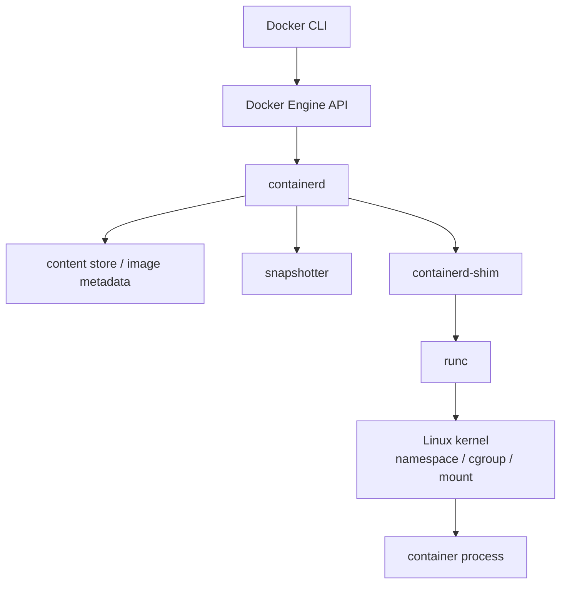
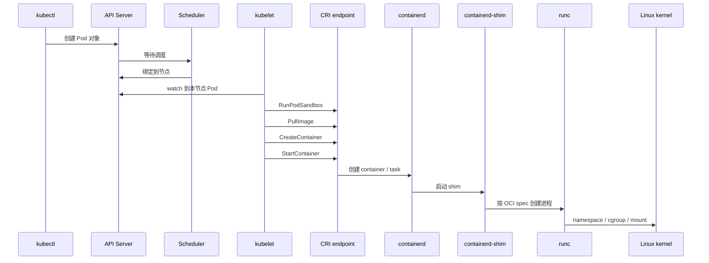

# 第 19 篇：OCI、containerd、runc 与 CRI [B]

第 18 篇把容器拆成了 namespace、cgroup、rootfs 和 OverlayFS。本篇继续往下追问：当你执行 `docker run`，或者 Kubernetes 创建一个 Pod 时，谁负责拉镜像，谁负责管理镜像层，谁负责调用 Linux 内核能力，谁又负责把 Kubernetes 的 Pod 语义翻译成容器运行时命令？

答案不是一个工具，而是一条分层链路：

```text
Docker CLI / kubectl
  -> Docker Engine / kubelet
  -> containerd
  -> containerd-shim
  -> runc
  -> Linux kernel
```

本篇特色项目是：**使用 `crictl`、`ctr` 和可选 `nerdctl` 观察 Todo 平台镜像与 Pod 的运行时状态，对比 Docker、containerd 和 Kubernetes 看到的同一件事**。

## 1. 本章学习目标

### 1.1 知识目标

- 能解释 OCI（Open Container Initiative，开放容器标准组织）的 image-spec、runtime-spec 和 distribution-spec 分别解决什么问题。
- 能描述镜像 manifest、config、layer、digest 与 OCI runtime bundle 的关系。
- 能解释 `runc`、containerd、containerd-shim、CRI（Container Runtime Interface，容器运行时接口）和 kubelet 的职责边界。
- 能对比 Docker、nerdctl、ctr、crictl、CRI-O 的使用场景和抽象层级。
- 能说明 Kubernetes 为什么不直接调用 Docker CLI，而是通过 CRI 调用容器运行时。

### 1.2 技能目标

- 能创建 kind 集群，并进入 kind 节点用 `crictl` 查看 PodSandbox、容器、镜像和日志。
- 能使用 `ctr -n k8s.io` 查看 containerd namespace、container、task、snapshot 等底层对象。
- 能把 Kubernetes Pod 与 containerd 中的容器 ID、task PID、OCI spec 关联起来。
- 能使用 `kind load docker-image` 把第 16 篇构建的 `todo-api:v0.1.0` 镜像导入 kind 节点 containerd。
- 能根据 `ImagePullBackOff`、`crictl` 连接失败、containerd namespace 选错等现象定位运行时问题。

### 1.3 前置条件

开始本篇前，请确认你已经完成：

- 第 15 篇：能用 Docker CLI 运行容器、查看日志、端口和网络。
- 第 16 篇：已经构建过 `todo-api:v0.1.0` 镜像，理解镜像层、标签和 OCI Label。
- 第 17 篇：理解 Docker Compose 如何把 Todo API、PostgreSQL、Redis 和 Traefik 编排起来。
- 第 18 篇：理解 namespace、cgroup、rootfs、OverlayFS 与容器进程模型。
- 第 1 篇：已经安装 Docker、kubectl、kind，并理解 kind 节点容器内部运行 containerd。

本篇实验会创建一个本地 kind 集群。命令以 Linux / macOS / WSL2 Bash 为主；Windows 用户建议在 WSL2 Ubuntu 中执行，或把 Bash 变量写法改成 PowerShell 变量写法。

!!! warning "不要在生产节点上练习删除类运行时命令"
    `crictl`、`ctr` 和 `nerdctl` 都可以直接影响容器运行时状态。生产环境中可以用它们做只读排查，但不要绕过 kubelet 手动删除 Pod 容器、镜像或 containerd 快照，除非你正在执行经过审批的故障处理流程。

!!! note "关于 kind 版本"
    课程蓝图锁定 Kubernetes 1.36.x。本仓库第 1 篇当前用于 smoke test 的 kind 节点镜像示例是 `kindest/node:v1.35.0`。如果你的环境已有可用的 1.36.x kind 节点镜像，可以通过 `KIND_NODE_IMAGE` 环境变量覆盖。本篇实验关注 CRI、containerd 和 runc 观察链路，不依赖 1.36 专属 API。

## 2. 本章工作场景与真实案例

### 2.1 技术痛点

团队刚进入 Kubernetes 时，经常会遇到这些困惑：

- `kubectl get pod` 看到 Pod 在运行，但宿主机 `docker ps` 看不到业务容器。
- Pod 出现 `ImagePullBackOff`，但开发只会 `docker pull`，不知道节点 containerd 中发生了什么。
- SRE 进入节点执行 `ctr containers ls` 发现为空，以为运行时坏了，其实是忘了 `-n k8s.io`。
- 安全团队要求说明“镜像 digest、OCI Label、SBOM、签名和运行时 spec”之间的关系。
- 平台团队升级 Kubernetes 后，节点报 `container runtime is not running`，根因是运行时不支持当前 CRI API。
- 面试中被问到“Docker、containerd、runc、CRI-O、kubelet 是什么关系”，只回答“都是容器工具”会显得非常薄。

这些问题的共同点是：你不能只停在 Docker CLI 层。要能把用户命令、Kubernetes API、CRI 调用、containerd 对象和 OCI spec 串起来。

### 2.2 团队协作场景

在企业环境中，本篇知识会被不同角色以不同方式使用：

- 后端开发通常使用 Docker 或 Compose 开发，但需要理解镜像最终会被 containerd 拉取和解包，不能依赖本机 Docker 的特殊行为。
- SRE 负责节点排障，会使用 `kubectl describe`、`crictl ps`、`crictl logs`、`ctr -n k8s.io tasks ls` 判断问题在 Kubernetes 层还是运行时层。
- 平台工程师负责节点镜像、containerd 配置、RuntimeClass、镜像加速、私有仓库认证和运行时升级。
- 安全工程师关注 OCI 镜像来源、digest 固定、运行时 socket 权限、seccomp、AppArmor / SELinux、rootless 和沙箱运行时。
- 架构师需要在技术评审中解释为什么 Kubernetes 通过 CRI 调运行时，而不是把 Docker 当成固定依赖。

### 2.3 课程项目关联

第 16 篇产出了 `todo-api:v0.1.0` 镜像，第 17 篇用 Docker Compose 在开发机上运行它，第 18 篇解释了这个容器的 Linux 底层机制。本篇会把它放到 Kubernetes 运行时视角下观察：

```text
第 16 篇：构建 todo-api:v0.1.0 镜像
第 17 篇：用 Docker Compose 运行 Todo Platform
第 18 篇：拆开容器进程、namespace、cgroup 和 rootfs
第 19 篇：进入 kind 节点，用 CRI 和 containerd 观察运行时对象
第 20 篇：正式学习 Kubernetes 架构、API Server、kubelet 和 kubectl
```

本篇不会完整部署 Todo Platform 到 Kubernetes，那是第 20 篇以后的主线。本篇先用一个轻量 `runtime-probe` Pod 打通观察链路，并提供把 `todo-api:v0.1.0` 镜像导入 kind 节点的进阶步骤。

## 3. 核心概念

### 3.1 OCI：容器生态的共同语言

OCI 是 Open Container Initiative 的缩写。它不是一个运行容器的程序，而是一组规范，目的是让镜像、运行时和仓库之间有共同格式。

表 19-1 OCI 关键规范：

| 规范 | 主要回答的问题 | 典型对象 |
|---|---|---|
| image-spec | 一个容器镜像应该如何描述内容 | manifest、config、layer、image index |
| runtime-spec | 一个容器进程应该如何被启动 | OCI bundle、`config.json`、rootfs |
| distribution-spec | 镜像如何在 registry 中拉取和推送 | registry API、blob、manifest |

最小理解可以是：

```text
image-spec：镜像是什么
runtime-spec：怎么把 rootfs 和 config.json 变成进程
distribution-spec：镜像怎么在仓库中传输
```

这就是为什么 Docker 构建的镜像可以被 containerd 拉取，containerd 准备出的容器可以交给 runc 启动，Kubernetes 又可以通过 CRI 使用 containerd 或 CRI-O。

### 3.2 OCI 镜像：manifest、config、layer 和 digest

OCI 镜像不是一个单独 tar 包，而是一组可寻址对象。核心结构如下：

```text
image index
└── manifest
    ├── config
    └── layers[]
```

一个简化的 manifest 长这样：

```json
{
  "schemaVersion": 2,
  "mediaType": "application/vnd.oci.image.manifest.v1+json",
  "config": {
    "mediaType": "application/vnd.oci.image.config.v1+json",
    "digest": "sha256:111111...",
    "size": 7023
  },
  "layers": [
    {
      "mediaType": "application/vnd.oci.image.layer.v1.tar+gzip",
      "digest": "sha256:222222...",
      "size": 32654
    }
  ]
}
```

关键字段含义：

- `manifest` 描述某个平台的一份镜像由哪个 config 和哪些 layer 组成。
- `config` 保存默认环境变量、入口命令、工作目录、用户、rootfs diff IDs 和 OCI Labels。
- `layers` 是压缩后的文件系统差异层。
- `digest` 是内容摘要，内容不变 digest 才不变，比 tag 更适合生产环境审计和回滚。
- `image index` 用于多架构镜像，例如同一个 `alpine:3.23` 标签可以指向 amd64、arm64 等不同平台的 manifest。

第 16 篇中你执行过：

```bash
docker image inspect todo-api:v0.1.0 --format '{{json .Config.Labels}}'
docker image inspect todo-api:v0.1.0 --format '{{.Id}}'
```

这些信息最终都会被容器运行时转化为拉取、解包和启动容器所需的元数据。

### 3.3 OCI runtime bundle：rootfs 加 config.json

OCI runtime-spec 关注的是“如何启动容器进程”。它不负责拉镜像，也不负责解析 registry。它需要一个 bundle：

```text
bundle/
├── config.json
└── rootfs/
    ├── bin/
    ├── etc/
    └── ...
```

`config.json` 是运行时配置文件，里面描述要启动什么进程、挂载哪些目录、使用哪些 namespace、cgroup 如何设置。一个极简示意如下：

```json
{
  "ociVersion": "1.2.0",
  "process": {
    "terminal": false,
    "args": ["/bin/sh", "-c", "echo hello from oci"],
    "cwd": "/"
  },
  "root": {
    "path": "rootfs",
    "readonly": true
  },
  "mounts": [
    {
      "destination": "/proc",
      "type": "proc",
      "source": "proc"
    }
  ],
  "linux": {
    "namespaces": [
      { "type": "pid" },
      { "type": "mount" },
      { "type": "uts" },
      { "type": "ipc" }
    ]
  }
}
```

`ociVersion` 示例用于说明字段位置和语义。真实环境中请以当前 `runc spec` 或运行时生成的 `config.json` 为准，不要为了手写示例而强行固定旧版本号。

你在第 18 篇写的 `mini-container.sh`，本质上是在手工模拟 runtime-spec 中的一部分：设置 namespace、挂载 `/proc`、切换 rootfs、写入 cgroup。真正的运行时会把这些动作做得更完整、更安全、更可审计。

### 3.4 runc：低层 OCI runtime

`runc` 是一个 OCI runtime。它的职责是读取 OCI bundle，创建和管理容器进程。

它擅长：

- 根据 `config.json` 设置 namespace、cgroup、capabilities、seccomp、mount。
- 创建容器进程。
- 查询容器状态。
- 停止和删除容器。

它不负责：

- 从 registry 拉镜像。
- 管理镜像层缓存。
- 给容器配置 CNI 网络。
- 维护 Kubernetes Pod 状态。
- 提供 Docker 风格的用户体验。

所以你很少在日常开发中直接调用 `runc`，但几乎每次启动 Linux 容器时，它都可能在链路最底层出现。

### 3.5 containerd：容器运行时守护进程

containerd 是长驻守护进程，负责管理容器生命周期。它位于 Docker Engine / kubelet 和 runc 之间。

它负责：

- 拉取和推送镜像。
- 存储内容对象和镜像元数据。
- 管理 snapshotter，把镜像层展开成可挂载快照。
- 创建 container 对象和 task 进程。
- 启动 containerd-shim，让容器进程不直接依赖 containerd 主进程。
- 暴露 CRI 插件，让 kubelet 能通过 CRI 调用它。

containerd 里有几个重要对象：

| 对象 | 含义 | 类比 |
|---|---|---|
| content | 按 digest 存储的 blob | 镜像层、config、manifest 原始内容 |
| image | 镜像名到 target digest 的引用 | `alpine:3.23` 指向某个 manifest |
| snapshot | 解包后的文件系统快照 | OverlayFS 层视图 |
| container | 容器元数据和 OCI spec | “准备启动的容器定义” |
| task | 正在运行的进程 | “真正跑起来的容器进程” |
| namespace | containerd 内部隔离域 | `default`、`k8s.io` |

最容易踩的坑是 namespace。Kubernetes 管理的容器通常在 containerd 的 `k8s.io` namespace 中，所以你需要写：

```bash
ctr -n k8s.io containers ls
```

如果只写 `ctr containers ls`，默认查的是 `default` namespace，很可能什么都看不到。

### 3.6 CRI：kubelet 和运行时之间的接口

CRI 是 Kubernetes 定义的 gRPC 接口。kubelet 不直接调用 `docker run` 或 `ctr run`，而是通过 CRI 与运行时通信。

CRI 主要分两类服务：

| CRI 服务 | 职责 | 常见动作 |
|---|---|---|
| RuntimeService | 管理 PodSandbox 和容器生命周期 | RunPodSandbox、CreateContainer、StartContainer、StopContainer |
| ImageService | 管理镜像 | PullImage、ListImages、ImageStatus、RemoveImage |

Pod 在 CRI 中会先有一个 PodSandbox。你可以把它理解为“Pod 的基础隔离环境”。不同运行时实现可以不同：普通 Linux 容器运行时通常用 pause 容器和 namespace；安全沙箱运行时可能用轻量虚拟机。

简化流程：

```text
kubelet 收到 Pod
  -> CRI RunPodSandbox
  -> CNI 配置 Pod 网络
  -> CRI PullImage
  -> CRI CreateContainer
  -> CRI StartContainer
```

`crictl` 是 CRI 的调试客户端。它不是 Docker 替代品，也不是应用开发者日常工具；它主要用于节点排障和运行时验证。

### 3.7 Docker、nerdctl、ctr、crictl 和 CRI-O

这些工具名字相近，但抽象层级不同。

表 19-2 容器运行时工具对比：

| 工具 / 组件 | 面向谁 | 连接到哪里 | 适合做什么 |
|---|---|---|---|
| Docker CLI | 开发者 | Docker Engine | 本地构建、运行、Compose 开发体验 |
| nerdctl | containerd 用户 | containerd | 用接近 Docker 的体验操作 containerd |
| ctr | containerd 开发和排障 | containerd | 查看底层对象，不追求易用 |
| crictl | Kubernetes 节点排障 | CRI endpoint | 查看 PodSandbox、容器、镜像、日志 |
| CRI-O | Kubernetes 运行时实现 | kubelet 通过 CRI 调用 | 专注 Kubernetes + OCI 的运行时 |
| runc | 低层 runtime | OCI bundle | 真正创建 Linux 容器进程 |

一个常见误解是“Docker 被 Kubernetes 抛弃了，所以 Docker 镜像不能用了”。这不对。Kubernetes 不再依赖 Docker Engine 作为节点运行时，并不影响 OCI 镜像格式。Docker 构建出的标准镜像仍然可以被 containerd、CRI-O 和 Kubernetes 使用。

## 4. 原理深入

### 4.1 从 `docker run` 到 Linux 进程

执行：

```bash
docker run --rm alpine:3.23 sh -c 'echo hello'
```

底层大致会经过：

图 19-1 从 `docker run` 到 Linux 进程：



Docker 提供的是开发者体验：`docker build`、`docker run`、`docker logs`、`docker compose`。containerd 提供的是运行时能力：镜像内容、快照、容器、task、shim。runc 提供的是最底层的 OCI 执行能力。

### 4.2 从 `kubectl apply` 到容器进程

执行：

```bash
kubectl apply -f runtime-probe.yaml
```

底层链路更长：

图 19-2 从 `kubectl apply` 到容器进程：



这里有两个边界很重要：

- `kubectl` 只和 Kubernetes API Server 交互，不直接接触 containerd。
- kubelet 通过 CRI 调运行时，不依赖 Docker CLI。

### 4.3 PodSandbox 为什么先于业务容器

Kubernetes 的 Pod 不是单个容器。Pod 是共享网络、部分命名空间和调度生命周期的一组容器。为了表达“Pod 的基础环境”，CRI 引入了 PodSandbox。

普通 Linux 容器运行时中，你经常会看到一个 pause 容器。它的作用是持有 Pod 的网络 namespace 等基础资源，让业务容器加入这个环境。

```text
Pod runtime-probe
├── PodSandbox / pause
└── container main
```

当你执行：

```bash
crictl pods
crictl ps
```

前者看到的是 PodSandbox，后者看到的是业务容器。排障时要分清：网络没有起来、CNI 失败，常常卡在 Sandbox；镜像拉取失败、命令退出，常常出现在业务容器。

### 4.4 containerd-shim 为什么存在

containerd 不直接成为每个容器进程的父进程，而是通过 containerd-shim 管理容器进程。

这样做有几个好处：

- containerd 重启时，已有容器不必全部退出。
- 每个容器的 stdin、stdout、stderr 和退出状态可以由 shim 接管。
- shim 可以管理 runc 启动后的容器生命周期。
- containerd 主进程不用长期持有所有容器进程细节。

在节点上查看进程树时，你可能看到：

```text
containerd
└── containerd-shim-runc-v2
    └── runtime-probe 容器进程
```

这解释了为什么“containerd 重启不一定等于所有容器立刻死亡”，也解释了为什么线上排障时要看 shim 进程和容器 task。

### 4.5 `crictl`、`ctr` 和 `kubectl` 看到的是同一对象的不同切面

同一个 Pod，可以从三层观察：

| 层级 | 命令 | 看到什么 |
|---|---|---|
| Kubernetes API | `kubectl get pod` | 声明式对象、调度状态、事件、条件 |
| CRI | `crictl pods`、`crictl ps` | PodSandbox、容器、镜像、日志 |
| containerd | `ctr -n k8s.io containers ls`、`tasks ls` | container、task、snapshot、OCI spec |

这三层不是互相替代，而是排障时逐层下钻：

```text
kubectl describe pod
  -> 事件显示镜像拉取失败
crictl images / crictl pull
  -> 确认 CRI 层是否能拉镜像
ctr -n k8s.io content ls / snapshots ls
  -> 确认 containerd 内容和快照状态
```

### 4.6 Docker 与 Kubernetes 运行时关系的演进

早期 Kubernetes 直接集成 Docker Engine，后来通过 dockershim 适配 Docker。随着 CRI 稳定，Kubernetes 移除了内置 dockershim。现在生产 Kubernetes 节点通常直接使用 containerd 或 CRI-O。

这并不意味着 Docker 没用了：

- 开发机仍然可以用 Docker 构建、运行和调试镜像。
- Docker 构建出的 OCI 兼容镜像仍然可以被 Kubernetes 使用。
- kind 仍然可以用 Docker 承载“外层节点容器”。
- Pod 内部业务容器由 kind 节点里的 containerd 管理，而不是由宿主机 Docker 直接管理。

一个准确说法是：**Docker 仍然是很好的开发体验工具；Kubernetes 节点运行时通常是 CRI 兼容运行时，例如 containerd 或 CRI-O。**

## 5. 手把手实验

### 5.1 实验目标

本实验会创建一个 kind 集群，部署 `runtime-probe` Pod，然后分别用 `kubectl`、`crictl`、`ctr` 和可选 `nerdctl` 观察它，最后把第 16 篇的 `todo-api:v0.1.0` 镜像导入 kind 节点 containerd。

完成后你应该能回答：

- Kubernetes 中一个 Pod 在 CRI 层对应什么？
- 业务容器在 containerd 中的 container 和 task 如何找到？
- 为什么 `docker ps` 看不到 kind 节点内部的 Pod 容器？
- Docker 构建的 Todo API 镜像如何进入 Kubernetes 节点运行时？

### 5.2 实验环境

表 19-3 工具与版本：

| 工具 | 推荐版本 | 用途 |
|---|---|---|
| Docker Engine | 29.x | 承载 kind 节点容器，构建 / 保存本地镜像 |
| kubectl | 1.36.x | 访问 kind 集群 |
| kind | 0.31+ | 创建本地 Kubernetes 节点 |
| kind node image | 课程锁定版本，当前示例为 `kindest/node:v1.35.0` | 节点内置 kubelet、containerd、crictl、ctr |
| containerd | 课程基线为 2.3.x LTS；kind 节点以自检输出为准 | 节点容器内部运行时 |
| crictl | 与节点 Kubernetes / CRI 版本匹配 | CRI 调试 |
| nerdctl | 2.3.x，可选 | 用 Docker 风格命令操作 containerd |
| Alpine | `alpine:3.23` | 轻量探针容器 |

这里要区分“课程基线”和“实验节点实际版本”：课程蓝图把 containerd 锁定为 2.3.x LTS，但 kind 节点镜像会内置自己的 containerd、runc 和 crictl 版本。实验是否可执行以节点内自检结果为准，生产版本规划再按课程基线或团队基线统一升级。

环境自检：

```bash
docker version
kubectl version --client
kind version
docker info --format '{{.ServerVersion}}'
command -v tree || echo "tree not installed; use find runtime-lab -maxdepth 2 -print instead"
```

可选检查 `nerdctl`：

```bash
command -v nerdctl && nerdctl version || echo "nerdctl not installed; optional section can be skipped"
```

判断方式：

| 检查项 | 预期 | 不满足时怎么办 |
|---|---|---|
| `docker version` | Client 和 Server 都可用 | 启动 Docker Desktop 或 Docker Engine |
| `kubectl version --client` | 输出客户端版本 | 回到第 1 篇安装 kubectl |
| `kind version` | 输出 kind 版本 | 回到第 1 篇安装 kind |
| `command -v tree` | 输出命令路径 | 安装 `tree`，或用 `find` 替代目录展示 |
| `nerdctl version` | 可选输出版本 | 不影响主线实验，只跳过 5.5.8 |

### 5.3 文件目录结构

在任意学习目录创建实验文件：

```bash
mkdir -p runtime-lab/k8s runtime-lab/notes
tree runtime-lab
```

如果你的环境没有安装 `tree`，可以用下面的命令替代：

```bash
find runtime-lab -maxdepth 2 -print
```

预期目录：

```text
runtime-lab
├── k8s
└── notes
```

### 5.4 完整代码或配置

创建 `runtime-probe` Pod：

```bash
cat > runtime-lab/k8s/runtime-probe.yaml <<'YAML'
apiVersion: v1
kind: Namespace
metadata:
  name: todo-runtime
  labels:
    app.kubernetes.io/part-of: todo-platform
    course.chapter: "19"
---
apiVersion: v1
kind: Pod
metadata:
  name: runtime-probe
  namespace: todo-runtime
  labels:
    app: runtime-probe
    app.kubernetes.io/part-of: todo-platform
    course.chapter: "19"
spec:
  restartPolicy: Always
  containers:
    - name: main
      image: alpine:3.23
      imagePullPolicy: IfNotPresent
      command:
        - sh
        - -c
      args:
        - |
          echo "runtime-probe started"
          while true; do
            date
            sleep 30
          done
      env:
        - name: TODO_RUNTIME_LAYER
          value: "kubernetes-cri-containerd"
      resources:
        requests:
          cpu: "10m"
          memory: "16Mi"
        limits:
          cpu: "100m"
          memory: "64Mi"
YAML
```

关键字段说明：

- `Namespace` 使用 `todo-runtime`，避免和后续 Kubernetes 章节资源混在 `default` 中。
- `image: alpine:3.23` 复用阶段三版本基线，镜像小，适合观察运行时。
- `imagePullPolicy: IfNotPresent` 让节点已有镜像时不重复拉取。
- `command` 和 `args` 让容器持续运行，便于 `crictl` 和 `ctr` 观察。
- `resources` 会被 kubelet 转换为运行时层的 cgroup 配置，承接第 18 篇。

创建观察记录模板：

```bash
cat > runtime-lab/notes/runtime-observation.md <<'MD'
# 第 19 篇运行时观察记录

## 1. 集群与节点

- kind 集群名：
- kind 节点容器名：
- Kubernetes 版本：
- containerd 版本：
- runc 版本：

## 2. Kubernetes 层

- `kubectl get pod -n todo-runtime -o wide` 结果：
- Pod IP：
- Node：

## 3. CRI 层

- PodSandbox ID：
- Container ID：
- Image ID：
- `crictl logs` 关键输出：

## 4. containerd 层

- containerd namespace：
- container ID：
- task PID：
- snapshot key：

## 5. Docker / nerdctl / crictl 对比

- Docker 能看到什么：
- crictl 能看到什么：
- ctr 能看到什么：
- nerdctl 可选观察结果：

## 6. 结论

用 5-8 句话说明 Docker、containerd、runc、CRI、kubelet 的关系。
MD
```

### 5.5 执行命令

#### 5.5.1 创建 kind 集群

设置实验变量：

```bash
KIND_CLUSTER=todo-runtime
KIND_NODE_IMAGE="${KIND_NODE_IMAGE:-kindest/node:v1.35.0@sha256:452d707d4862f52530247495d180205e029056831160e22870e37e3f6c1ac31f}"
```

后续命令依赖这两个变量。如果你中途重新打开终端，请先重新执行本节的变量设置。

如果课程版本锁已经提供了更新的 `KIND_NODE_IMAGE`，这里会优先使用环境变量中的值。创建集群：

```bash
kind get clusters | grep -qx "$KIND_CLUSTER" || kind create cluster --name "$KIND_CLUSTER" --image "$KIND_NODE_IMAGE"
```

确认 kubectl 指向这个集群：

```bash
kubectl config current-context
kubectl cluster-info --context "kind-$KIND_CLUSTER"
kubectl get nodes -o wide
```

#### 5.5.2 部署 runtime-probe Pod

应用 YAML：

```bash
kubectl apply -f runtime-lab/k8s/runtime-probe.yaml
```

等待 Pod Ready：

```bash
kubectl -n todo-runtime wait --for=condition=Ready pod/runtime-probe --timeout=120s
```

查看 Kubernetes 层状态：

```bash
kubectl -n todo-runtime get pod runtime-probe -o wide
kubectl -n todo-runtime describe pod runtime-probe
kubectl -n todo-runtime logs runtime-probe --tail=5
```

这一步回答的是 Kubernetes 层问题：Pod 是否被调度、镜像是否拉取成功、容器是否 Ready。

#### 5.5.3 找到 kind 节点容器

kind 的节点本身是一个 Docker 容器。找到它：

```bash
echo "KIND_CLUSTER=${KIND_CLUSTER:?not set, run section 5.5.1 first}"
NODE="$(docker ps --filter "name=${KIND_CLUSTER}-control-plane" --format '{{.Names}}' | head -n 1)"
echo "$NODE"
```

进入节点检查运行时工具：

```bash
docker exec "$NODE" crictl version
docker exec "$NODE" ctr version
docker exec "$NODE" runc --version || true
docker exec "$NODE" containerd --version || true
docker exec "$NODE" ctr plugins ls | grep -E 'cri|snapshot' || true
```

这里的 `docker exec` 进入的是外层 kind 节点容器；`crictl` 和 `ctr` 操作的是节点容器内部的 containerd。记录这些输出时，不要机械追求和课程蓝图的 containerd 2.3.x 完全一致；kind 节点镜像内置版本能正常提供 CRI、snapshotter 和 runc 调用链即可。本篇关心的是运行时观察方法，生产版本升级会在集群节点规划中统一处理。

工具层级可以这样记：

| 工具 | 观察层级 | 典型命令 | 本篇定位 |
|---|---|---|---|
| `kubectl` | Kubernetes API | `kubectl describe pod` | 看声明式对象、事件和 Pod 状态 |
| `crictl` | CRI | `crictl pods`、`crictl ps`、`crictl logs` | 看 kubelet 交给运行时后的 PodSandbox 和容器 |
| `ctr` | containerd | `ctr -n k8s.io tasks ls` | 看 containerd 的 image、container、task、snapshot |
| `runc` | OCI runtime | `runc --version`、`runc spec` | 理解底层执行器，本篇不把它作为主线操作入口 |
| `nerdctl` | containerd 用户体验 | `nerdctl run`、`nerdctl ps` | 可选对照 Docker 风格命令，不替代 `crictl` 排查 Kubernetes Pod |

本篇不手动执行 `runc run`，原因是手写 OCI bundle、网络、挂载和 cgroup 配置会把实验重点从“理解 Kubernetes 运行时链路”转移到“手工组装低层容器”。你只需要通过 `runc --version` 确认底层执行器存在，再通过后面的 `ctr -n k8s.io containers info "$CONTAINER_ID"` 观察运行时生成的 OCI spec 关键字段即可。真正手工运行 runc 更适合放到专门的运行时源码或安全沙箱课程中。

#### 5.5.4 用 crictl 观察 CRI 层

查看 PodSandbox：

```bash
docker exec "$NODE" crictl pods --namespace todo-runtime
```

提取 PodSandbox ID：

```bash
POD_ID="$(docker exec "$NODE" crictl pods --namespace todo-runtime --name runtime-probe -q | head -n 1)"
echo "$POD_ID"
```

查看 PodSandbox 详情：

```bash
docker exec "$NODE" crictl inspectp "$POD_ID" | grep -E '"name"|"namespace"|"state"|"podSandboxId"|"runtimeHandler"' | head -n 20
```

如果上面的 `grep` 没有输出，先执行 `docker exec "$NODE" crictl inspectp "$POD_ID"` 查看完整 JSON 结构，再根据你当前 crictl 版本中的字段名调整过滤条件。

查看这个 PodSandbox 下的业务容器：

```bash
docker exec "$NODE" crictl ps --pod "$POD_ID"
```

提取容器 ID：

```bash
CONTAINER_ID="$(docker exec "$NODE" crictl ps --pod "$POD_ID" -q | head -n 1)"
echo "$CONTAINER_ID"
```

查看容器详情、日志和进程：

```bash
docker exec "$NODE" crictl inspect "$CONTAINER_ID" | grep -E '"name"|"state"|"pid"|"imageRef"|"runtimeType"' | head -n 30
docker exec "$NODE" crictl logs "$CONTAINER_ID" | tail -n 10
docker exec "$NODE" crictl exec "$CONTAINER_ID" ps -o pid,ppid,comm
```

这一步回答的是 CRI 层问题：kubelet 交给运行时的 PodSandbox 和业务容器是否存在，容器进程是否已经运行。

#### 5.5.5 用 ctr 观察 containerd 层

查看 containerd namespace：

```bash
docker exec "$NODE" ctr namespaces ls
```

Kubernetes 管理的对象在 `k8s.io` namespace 中。查看 container 对象：

```bash
docker exec "$NODE" ctr -n k8s.io containers ls | grep "$CONTAINER_ID"
```

如果这里没有输出，先不要急着判断 containerd 异常。CRI 返回的容器 ID 可能是 containerd 完整 ID 的前缀，不同运行时版本里的展示格式也可能略有差异。可以先列出相关 container，再根据 Pod 名、容器名或镜像反向确认：

```bash
docker exec "$NODE" ctr -n k8s.io containers ls | grep -E 'runtime-probe|alpine|main'
```

查看 task，也就是真正运行中的进程：

```bash
docker exec "$NODE" ctr -n k8s.io tasks ls | grep "$CONTAINER_ID"
```

查看 OCI spec 关键字段：

```bash
docker exec "$NODE" ctr -n k8s.io containers info "$CONTAINER_ID" | grep -E '"ociVersion"|"args"|"env"|"namespaces"|"cgroupsPath"|"readonly"' | head -n 40
```

查看镜像和 snapshot：

```bash
docker exec "$NODE" ctr -n k8s.io images ls | grep alpine
docker exec "$NODE" ctr -n k8s.io snapshots ls | head -n 20
```

这一步回答的是 containerd 层问题：镜像是否在 containerd 中，容器元数据是否存在，task 是否已经由 shim/runc 启动。

#### 5.5.6 对比 Docker 视角

宿主机 Docker 能看到 kind 节点容器：

```bash
docker ps --filter "name=${KIND_CLUSTER}-control-plane"
```

但它通常看不到 `runtime-probe` 业务容器，因为业务容器在 kind 节点内部的 containerd 中：

```bash
docker ps --filter "name=runtime-probe"
```

继续用 CRI 观察才是正确入口：

```bash
docker exec "$NODE" crictl pods --namespace todo-runtime --name runtime-probe
docker exec "$NODE" crictl ps --pod "$POD_ID"
```

这个对比非常关键：kind 是“Docker 承载 Kubernetes 节点”，不是“宿主机 Docker 直接运行 Pod 容器”。

#### 5.5.7 导入 Todo API 镜像到 kind 节点

如果你已经完成第 16 篇，先确认本地有 `todo-api:v0.1.0`：

```bash
docker image inspect todo-api:v0.1.0 --format '{{.Id}} {{.Config.Entrypoint}} {{.Config.Cmd}}'
```

把镜像加载到 kind 节点：

```bash
kind load docker-image todo-api:v0.1.0 --name "$KIND_CLUSTER"
```

在 CRI 层查看镜像：

```bash
docker exec "$NODE" crictl images | grep todo-api
```

在 containerd 层查看镜像：

```bash
docker exec "$NODE" ctr -n k8s.io images ls | grep todo-api
```

如果你还没有构建 Todo API 镜像，可以跳过本节，不影响本篇主线。第 20 篇以后会正式把 Todo API 部署到 Kubernetes。

#### 5.5.8 可选：用 nerdctl 对照 Docker 风格命令

本篇主线用 `crictl` 和 `ctr` 观察 kind 节点内部的 Kubernetes 运行时。`nerdctl` 是 containerd 的 Docker 兼容风格 CLI，适合帮助你把熟悉的 Docker 命令迁移到 containerd 语境中，但它不是 Kubernetes 节点排障的首选入口。

表 19-4 Docker、nerdctl、crictl、ctr 常见命令对照：

| 目标 | Docker | nerdctl | crictl | ctr |
|---|---|---|---|---|
| 查看运行中容器 | `docker ps` | `nerdctl ps` | `crictl ps` | `ctr -n k8s.io tasks ls` |
| 查看镜像 | `docker images` | `nerdctl images` | `crictl images` | `ctr -n k8s.io images ls` |
| 查看日志 | `docker logs <id>` | `nerdctl logs <id>` | `crictl logs <id>` | 通常不直接用 `ctr` 看日志 |
| 启动容器 | `docker run ...` | `nerdctl run ...` | 不用于手工启动业务容器 | `ctr run ...`，偏底层调试 |
| Kubernetes 节点排障 | 不适合 kind 节点内部 Pod | 可选辅助 | 推荐入口 | 底层补充观察 |

如果本机已经安装 `nerdctl` 并且能访问本机 containerd，可以做一个不依赖 CNI 的最小实验：

```bash
if command -v nerdctl >/dev/null 2>&1; then
  sudo nerdctl --net=none run -d --name runtime-nerdctl-demo alpine:3.23 sleep 300
  sudo nerdctl ps
  sudo nerdctl inspect runtime-nerdctl-demo | grep -E '"Name"|"Image"|"Runtime"|"SnapshotKey"' | head -n 20
  sudo nerdctl rm -f runtime-nerdctl-demo
else
  echo "nerdctl not installed; skip optional nerdctl comparison"
fi
```

如果这里失败，不代表 Kubernetes 运行时有问题。很多开发机没有配置本机 containerd 的 CNI、rootless 或权限。本篇主线以 kind 节点内置的 `crictl` 和 `ctr` 为准。

#### 5.5.9 填写观察记录

打开记录模板，把关键结果填进去：

```bash
cat runtime-lab/notes/runtime-observation.md
```

建议至少记录：

- `kubectl get pod -o wide` 的 Pod IP 和节点。
- `crictl pods` 的 PodSandbox ID。
- `crictl ps` 的 Container ID。
- `ctr -n k8s.io tasks ls` 中的 task PID。
- `crictl images` 或 `ctr -n k8s.io images ls` 中的 `todo-api:v0.1.0` 结果。

### 5.6 预期输出

`kubectl get pod` 应看到 Pod 运行：

```text
NAME            READY   STATUS    RESTARTS   AGE   IP           NODE
runtime-probe   1/1     Running   0          30s   10.244.0.5   todo-runtime-control-plane
```

`crictl pods` 应看到 PodSandbox：

```text
POD ID              CREATED          STATE   NAME            NAMESPACE      ATTEMPT
7b5c...             1 minute ago     Ready   runtime-probe   todo-runtime   0
```

`crictl ps` 应看到业务容器：

```text
CONTAINER           IMAGE               CREATED          STATE    NAME   ATTEMPT   POD ID
e83a...             alpine:3.23         1 minute ago     Running  main   0         7b5c...
```

`ctr -n k8s.io tasks ls` 应能看到同一个容器 ID 的 task：

```text
TASK        PID      STATUS
e83a...     12345    RUNNING
```

导入 Todo API 镜像后，`crictl images` 应出现类似结果：

```text
IMAGE               TAG       IMAGE ID        SIZE
todo-api            v0.1.0    sha256:...      ...
```

### 5.7 验证方法

基础验证：

```bash
NODE="$(docker ps --filter "name=${KIND_CLUSTER}-control-plane" --format '{{.Names}}' | head -n 1)"
POD_ID="$(docker exec "$NODE" crictl pods --namespace todo-runtime --name runtime-probe -q | head -n 1)"
CONTAINER_ID="$(docker exec "$NODE" crictl ps --pod "$POD_ID" -q | head -n 1)"
kubectl -n todo-runtime get pod runtime-probe
docker exec "$NODE" crictl pods --namespace todo-runtime --name runtime-probe
docker exec "$NODE" crictl ps --pod "$POD_ID"
docker exec "$NODE" ctr namespaces ls
docker exec "$NODE" ctr -n k8s.io tasks ls | grep "$CONTAINER_ID"
```

如果中途 Pod 被删除、重建或重新调度过，旧的 `POD_ID` 和 `CONTAINER_ID` 会失效。验证前先重新执行上面三行变量获取命令。

判断标准：

- `runtime-probe` 是 `Running`。
- `crictl pods` 能看到 `todo-runtime/runtime-probe`。
- `crictl ps` 能看到容器名 `main`。
- `ctr namespaces ls` 包含 `k8s.io`。
- `ctr -n k8s.io tasks ls` 能找到 `CONTAINER_ID`。

进阶验证：

```bash
docker exec "$NODE" crictl inspect "$CONTAINER_ID" | grep -E '"pid"|"imageRef"'
docker exec "$NODE" ctr -n k8s.io containers info "$CONTAINER_ID" | grep -E '"ociVersion"|"cgroupsPath"'
docker exec "$NODE" crictl images | grep -E 'alpine|todo-api'
```

能力验收：

- 能画出 `kubectl -> kubelet -> CRI -> containerd -> shim -> runc -> kernel` 链路。
- 能解释 PodSandbox 和业务容器的区别。
- 能说明为什么 `ctr containers ls` 为空时要加 `-n k8s.io`。
- 能说明 `docker ps` 看不到 kind 内部 Pod 容器的原因。
- 能把本地 Docker 镜像加载进 kind 节点 containerd。
- 能说清楚 `crictl` 和 `ctr` 分别适合排查哪一层。

### 5.8 清理步骤

删除实验 Pod 和命名空间：

```bash
kubectl delete -f runtime-lab/k8s/runtime-probe.yaml --ignore-not-found
```

删除 kind 集群：

```bash
kind delete cluster --name "$KIND_CLUSTER"
```

可选删除实验目录：

```bash
rm -rf runtime-lab
```

确认没有残留 kind 节点：

```bash
docker ps --filter "name=${KIND_CLUSTER}"
kind get clusters
```

预计耗时：120 分钟（动手操作约 80 分钟，记录和复盘约 40 分钟）。

## 6. 常见错误与排障

### 错误 1：kind 集群创建失败，提示 Docker 连接不上

- **现象**：

  ```text
  ERROR: failed to create cluster: failed to get docker info
  Cannot connect to the Docker daemon at unix:///var/run/docker.sock
  ```

- **原因**：Docker Engine / Docker Desktop 没有启动，或者当前用户没有访问 Docker daemon 的权限。

- **排查**：

  ```bash
  docker version
  docker info
  id
  ```

  如果 `docker version` 只有 Client，没有 Server，说明 daemon 不可用。如果 Linux 上当前用户不在 `docker` 组，可能需要使用 `sudo docker` 或配置用户组。

- **修复**：

  ```bash
  sudo systemctl start docker
  docker info
  kind create cluster --name todo-runtime --image "$KIND_NODE_IMAGE"
  ```

  Docker Desktop 用户需要先确认界面中 Docker Engine 已经运行。

- **预防**：每次创建 kind 集群前先执行 `docker info`。CI 中要显式启动 Docker 服务，并记录 Docker、kind 和节点镜像版本。

### 错误 2：Pod 出现 `ImagePullBackOff`

- **现象**：

  ```text
  NAME            READY   STATUS             RESTARTS   AGE
  runtime-probe   0/1     ImagePullBackOff   0          2m
  ```

- **原因**：节点无法拉取 `alpine:3.23`，常见原因是网络不可达、镜像标签写错、公司代理未配置、registry 限流。

- **排查**：

  ```bash
  kubectl -n todo-runtime describe pod runtime-probe
  docker exec "$NODE" crictl images | grep alpine || true
  docker exec "$NODE" crictl pull alpine:3.23
  ```

  `describe pod` 的 Events 会显示具体拉取错误。`crictl pull` 可以绕开 Kubernetes 事件，直接验证 CRI 层能否拉镜像。

- **修复**：确认标签正确；配置 Docker / containerd 镜像代理；或者提前在宿主机拉取镜像后导入 kind：

  ```bash
  docker pull alpine:3.23
  kind load docker-image alpine:3.23 --name todo-runtime
  kubectl -n todo-runtime delete pod runtime-probe
  kubectl apply -f runtime-lab/k8s/runtime-probe.yaml
  ```

- **预防**：课程、团队或 CI 应固定镜像标签，并准备可信 registry 缓存。生产环境优先使用 digest 或内部镜像仓库。

### 错误 3：`ctr containers ls` 为空

- **现象**：

  ```text
  docker exec "$NODE" ctr containers ls
  CONTAINER    IMAGE    RUNTIME
  ```

- **原因**：`ctr` 默认查询 containerd 的 `default` namespace，而 Kubernetes 使用 `k8s.io` namespace。

- **排查**：

  ```bash
  docker exec "$NODE" ctr namespaces ls
  docker exec "$NODE" ctr -n k8s.io containers ls
  docker exec "$NODE" crictl pods --namespace todo-runtime --name runtime-probe
  ```

  如果 `k8s.io` 中能看到容器，说明运行时正常，只是查询 namespace 错了。

- **修复**：

  ```bash
  docker exec "$NODE" ctr -n k8s.io containers ls
  docker exec "$NODE" ctr -n k8s.io tasks ls
  docker exec "$NODE" ctr -n k8s.io images ls
  ```

- **预防**：凡是观察 Kubernetes 管理的 containerd 对象，都先写 `ctr -n k8s.io ...`。

### 错误 4：`crictl` 无法连接运行时

- **现象**：

  ```text
  FATA[0000] connect: connection refused
  ```

  或：

  ```text
  WARN[0000] runtime connect using default endpoints
  ```

- **原因**：在宿主机执行 `crictl` 时，它找不到 CRI socket；或者节点上的 containerd / CRI 插件未正常运行。本篇主线是在 kind 节点容器内执行 `crictl`，不是直接在宿主机执行。

- **排查**：

  ```bash
  docker exec "$NODE" crictl info
  docker exec "$NODE" ls -l /run/containerd/containerd.sock
  docker exec "$NODE" ctr version
  docker exec "$NODE" ps -ef | grep '[c]ontainerd'
  docker exec "$NODE" ctr plugins ls | grep -E 'cri|snapshot' || true
  ```

  在 kind 节点内，`/run/containerd/containerd.sock` 应该存在，`crictl info` 应能返回运行时信息，进程列表中应能看到 containerd。kind 节点容器不一定适合用常规 systemd 服务状态命令判断运行时状态，所以优先使用 `crictl`、`ctr` 和进程列表。

- **修复**：使用本篇命令形式进入 kind 节点执行：

  ```bash
  docker exec "$NODE" crictl ps
  ```

  如果必须在宿主机执行，需要安装 `crictl` 并配置 `/etc/crictl.yaml` 指向正确 socket，但这不属于本篇主线。

- **预防**：区分“宿主机 Docker 环境”和“kind 节点内部 Kubernetes 运行时环境”。排查 Pod 运行时时，优先进入节点执行 `crictl`。

### 错误 5：`docker ps` 看不到 Pod 容器

- **现象**：

  ```bash
  docker ps --filter name=runtime-probe
  ```

  输出为空，但：

  ```bash
  kubectl -n todo-runtime get pod runtime-probe
  ```

  显示 Pod 正在运行。

- **原因**：kind 的宿主机 Docker 只负责运行外层节点容器，Pod 的业务容器由节点容器内部的 containerd 管理。宿主机 Docker 不是这些 Pod 容器的直接运行时。

- **排查**：

  ```bash
  docker ps --filter "name=todo-runtime-control-plane"
  docker exec "$NODE" crictl pods --namespace todo-runtime --name runtime-probe
  docker exec "$NODE" crictl ps --pod "$POD_ID"
  docker exec "$NODE" ctr -n k8s.io tasks ls | grep "$CONTAINER_ID"
  ```

- **修复**：用正确工具观察正确层级：

  ```bash
  kubectl -n todo-runtime get pod
  docker exec "$NODE" crictl ps
  docker exec "$NODE" ctr -n k8s.io tasks ls
  ```

- **预防**：记住 kind 是嵌套模型：宿主机 Docker 运行 kind node，kind node 内部 containerd 运行 Pod。

## 7. 生产环境注意事项

1. **不要绕过 kubelet 管理生产 Pod 容器。** 生产节点上可以用 `crictl ps`、`crictl logs`、`ctr -n k8s.io tasks ls` 做只读观察，但不要随意执行 `crictl rm`、`ctr tasks kill`、`ctr snapshots rm`。这些操作会绕过 Kubernetes 控制面，造成 kubelet 状态、运行时状态和业务预期不一致。真正需要强制清理时，应先记录事件、确认影响范围，并纳入故障处理流程。

   常用只读排障命令可以包括：`crictl ps`、`crictl pods`、`crictl images`、`crictl logs <id>`、`crictl inspect <id>`、`ctr -n k8s.io containers ls`、`ctr -n k8s.io tasks ls`、`ctr -n k8s.io images ls`。高风险命令包括 `crictl rm`、`crictl rmp`、`ctr tasks kill`、`ctr containers rm`、`ctr snapshots rm` 和直接删除运行时目录。生产上执行高风险命令前必须确认 kubelet 状态、业务影响和回滚方案。

2. **运行时版本必须和 Kubernetes CRI 要求匹配。** Kubernetes v1.26 以后要求运行时支持 CRI v1。升级 Kubernetes 前，要检查 containerd / CRI-O 版本、配置文件、systemd unit 和 kubelet `--container-runtime-endpoint`。节点升级不是只替换 kubelet 二进制，还要验证 runtime API、CNI、镜像仓库认证、日志路径和 cgroup 驱动。

3. **运行时 socket 等同高权限入口。** `/run/containerd/containerd.sock`、`/var/run/docker.sock`、CRI socket 都能间接控制容器、镜像和挂载。不要把这些 socket 挂进普通业务 Pod，也不要给普通用户随意访问权限。CI/CD 如果需要构建镜像，应优先使用隔离构建器、rootless BuildKit、受控 runner 或专用构建节点。

4. **生产镜像引用应优先固定 digest。** tag 适合人类阅读，但 tag 可以被覆盖。生产发布、回滚和审计更应该记录 digest、构建 commit、SBOM、扫描报告和签名状态。containerd 和 Kubernetes 最终拉取的是内容对象，digest 能帮助你确认“当前节点运行的到底是哪一份内容”。

5. **运行时排障要结合可观测性和垃圾回收策略。** containerd 管理镜像层、快照、日志和 task。如果节点磁盘被镜像层或容器日志打满，Pod 可能出现 Evicted、ImageGCFailed 或启动失败。生产环境要监控节点磁盘、imagefs、container filesystem、runtime 错误日志，并设置合理的镜像清理、日志轮转和节点维护流程。

## 8. 本章小项目

### 8.1 项目目标

完成一个“Todo 运行时观察报告”。你需要创建 kind 集群，部署 `runtime-probe` Pod，用 `kubectl`、`crictl`、`ctr` 观察同一个容器，并把 `todo-api:v0.1.0` 镜像导入 kind 节点。

### 8.2 项目交付物

项目完成后应保留：

- `runtime-lab/k8s/runtime-probe.yaml`
- `runtime-lab/notes/runtime-observation.md`
- `kubectl get pod -n todo-runtime -o wide` 结果
- `crictl pods`、`crictl ps`、`crictl images` 关键结果
- `ctr -n k8s.io containers ls`、`tasks ls` 关键结果
- Docker / crictl / ctr / nerdctl 命令对比表

### 8.3 最小验收标准

- kind 集群能创建成功。
- `runtime-probe` Pod 处于 `Running`。
- 能进入 kind 节点执行 `crictl version`。
- 能用 `crictl pods` 找到 PodSandbox。
- 能用 `crictl ps` 找到业务容器。
- 能用 `ctr -n k8s.io tasks ls` 找到同一个容器的 task。
- 能解释宿主机 `docker ps` 与节点内 `crictl ps` 输出不同的原因。

### 8.4 进阶验收标准

- 能导入 `todo-api:v0.1.0` 到 kind 节点。
- 能在 `crictl images` 中找到 Todo API 镜像。
- 能在 `ctr -n k8s.io images ls` 中找到 Todo API 镜像。
- 能从 `ctr containers info` 中找到 OCI spec 相关字段。
- 能记录 task PID，并说明它是节点上的普通 Linux 进程。
- 能完成可选 `nerdctl` 对照实验，或说明本机为什么不适合运行它。
- 能写出 5-8 句话总结 Docker、containerd、runc、CRI 和 kubelet 的关系。

## 9. 本章练习题

### 9.1 基础题

1. 用一句话分别解释 OCI image-spec、runtime-spec 和 distribution-spec。
2. 为什么 Kubernetes 不应该依赖 Docker CLI 来启动 Pod？
3. `crictl ps` 和 `ctr -n k8s.io tasks ls` 分别看的是哪一层？
4. 为什么 `ctr containers ls` 可能为空，而 `ctr -n k8s.io containers ls` 能看到容器？
5. PodSandbox 和业务容器有什么区别？

### 9.2 实操题

1. 把 `runtime-probe.yaml` 中的镜像改成一个不存在的标签，例如 `alpine:not-exist`，观察 `kubectl describe pod` 和 `crictl pull` 的错误。记录后恢复为 `alpine:3.23`。
2. 删除 `CONTAINER_ID` 变量后重新通过 `crictl pods --name runtime-probe -q` 找回 `POD_ID`，再用 `crictl ps --pod "$POD_ID" -q` 找回容器 ID，并用 `ctr -n k8s.io tasks ls` 验证同一个 task。
3. 如果本地存在 `todo-api:v0.1.0`，执行 `kind load docker-image`，并分别用 `crictl images` 和 `ctr -n k8s.io images ls` 验证。

### 9.3 思考题

1. 生产节点上为什么不建议直接用 `ctr` 删除 Kubernetes 管理的 container 或 snapshot？如果节点磁盘满了，应该如何设计更安全的处置流程？
2. 如果一个团队同时使用 Docker Desktop、kind、containerd、CRI-O 和云厂商托管 Kubernetes，如何制定统一的镜像标签、digest、签名和运行时版本策略？

## 10. 本章面试题

### 1. Docker、containerd、runc 和 kubelet 的关系是什么？

**一句话结论**：Docker 和 kubelet 都可以处在上层入口，containerd 负责运行时生命周期管理，runc 按 OCI runtime-spec 创建底层容器进程。

**展开解释**：Docker 面向开发者，提供构建、运行、日志、网络和 Compose 等体验；Kubernetes 节点上由 kubelet 管理 Pod，kubelet 通过 CRI 调用 containerd；containerd 拉取镜像、管理快照和 task，再通过 shim 调用 runc；runc 最终设置 namespace、cgroup、mount 等 Linux 能力。

**追问方向**：如果面试官问“Docker 被 Kubernetes 移除了吗”，要回答：Kubernetes 移除的是内置 dockershim 依赖，不是 OCI 镜像格式，也不是开发机 Docker 工具。

### 2. OCI image-spec 和 runtime-spec 有什么区别？

**一句话结论**：image-spec 描述镜像内容如何组织，runtime-spec 描述如何把 rootfs 和 `config.json` 启动成容器进程。

**展开解释**：image-spec 关注 manifest、config、layer、digest 和多架构 image index；runtime-spec 关注 OCI bundle、进程参数、rootfs、mount、namespace、cgroup、capabilities、seccomp 等运行配置。containerd 可以把镜像拉取和解包成 snapshot，再生成运行时需要的 OCI spec 交给 runc。

**追问方向**：可以继续说明 digest 为什么比 tag 更适合生产发布，以及第 16 篇 OCI Label 如何进入镜像 config。

### 3. `crictl` 和 `ctr` 有什么区别？

**一句话结论**：`crictl` 面向 CRI，用 Kubernetes 运行时语义看 Pod 和容器；`ctr` 面向 containerd，用底层对象语义看 container、task、image 和 snapshot。

**展开解释**：排查 Kubernetes 节点时，`crictl pods`、`crictl ps`、`crictl logs` 更贴近 kubelet 看到的状态；`ctr -n k8s.io containers ls`、`tasks ls` 更贴近 containerd 内部状态。`ctr` 不追求用户友好，也不等同 Docker CLI。

**追问方向**：如果 `ctr containers ls` 为空，要先检查 containerd namespace，Kubernetes 通常使用 `k8s.io`。

### 4. PodSandbox 是什么，为什么需要它？

**一句话结论**：PodSandbox 是 CRI 中表示 Pod 基础隔离环境的对象，通常先于业务容器创建。

**展开解释**：Pod 不是一个普通容器，而是一组共享网络和生命周期的容器。运行时需要先创建 Pod 的基础环境，例如 pause 容器持有网络 namespace，然后业务容器再加入这个环境。网络初始化、CNI 配置失败时，问题往往出现在 PodSandbox 阶段。

**追问方向**：可以讨论普通 Linux 容器运行时和沙箱运行时对 PodSandbox 的不同实现，例如轻量虚拟机运行时可能把 Sandbox 做成更强隔离边界。

### 5. 为什么生产发布建议使用镜像 digest？

**一句话结论**：digest 绑定内容，tag 只是可变引用；生产用 digest 更利于审计、回滚和供应链安全。

**展开解释**：同一个 tag 可能被重新推送，导致不同节点在不同时间拉到不同内容。digest 是镜像内容摘要，只要内容变化 digest 就变化。结合 SBOM、签名、漏洞扫描和 OCI Label，可以建立“源码 commit -> 镜像 digest -> 部署版本 -> 节点实际运行内容”的追踪链路。

**追问方向**：可以进一步讨论如何在 Kubernetes YAML、Helm values、GitOps 和 CI/CD 中记录 digest，并处理紧急漏洞修复和回滚。

## 11. 本章总结

本章把阶段三 Docker 学习收束到容器运行时生态。你已经看到：Docker 是开发体验入口，containerd 是主流运行时守护进程，runc 是 OCI 低层执行器，CRI 是 kubelet 与运行时之间的标准接口。

概念上，你理解了 OCI image-spec、runtime-spec、manifest、config、layer、digest、runtime bundle、PodSandbox、containerd namespace、container、task、snapshot 和 shim。实践上，你创建了 kind 集群，部署了 `runtime-probe` Pod，并用 `kubectl`、`crictl`、`ctr` 从三层观察同一个容器。本篇主线是 CRI 和 containerd 观察，`nerdctl` 用作 Docker 风格命令的可选对照工具。

项目成果上，你完成了 `runtime-lab`，并能把第 16 篇的 `todo-api:v0.1.0` 镜像导入 kind 节点 containerd。这为第 20 篇正式进入 Kubernetes 架构打好了运行时基础。

## 12. 下一章衔接

第 20 篇开始进入阶段四 Kubernetes 应用交付。你会系统学习 Kubernetes 架构、API Server、etcd、Scheduler、Controller Manager、kubelet、kube-proxy、container runtime、kind 集群和 kubectl 基础操作。

本篇的价值会马上显现：当第 20 篇讲 kubelet 时，你已经知道它不是“神秘地启动容器”，而是通过 CRI 调用 containerd；当你看到 Pod 状态、事件、镜像拉取和容器日志时，也能继续向下追到 `crictl` 和 `ctr` 层。阶段三到这里完成了从“会用 Docker”到“理解 Kubernetes 节点运行时”的过渡。

阶段三（第 15-19 篇）到这里全部完成：Ch15 手工运行容器，Ch16 构建镜像，Ch17 Compose 编排，Ch18 拆解容器底层原理，Ch19 理解 OCI / CRI 运行时生态。你已经从“会用 Docker”走到了“理解 Kubernetes 节点内部发生了什么”。
