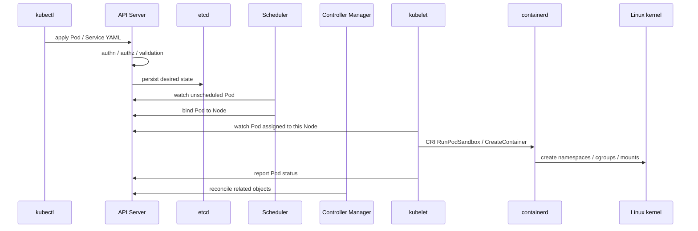
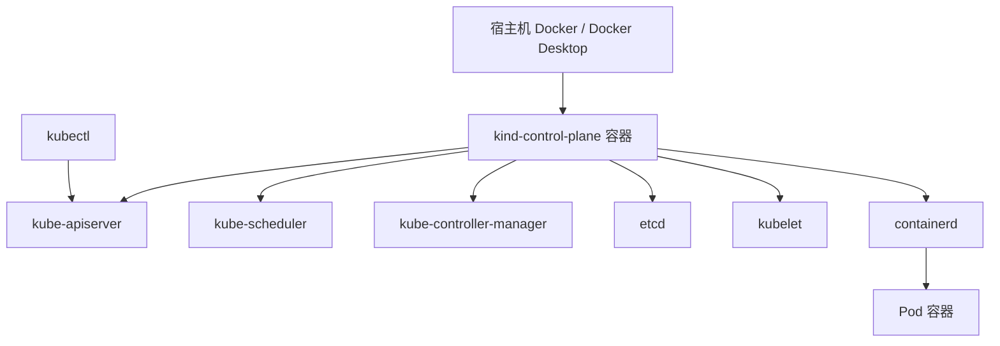

# 第 20 篇：Kubernetes 架构与集群搭建

第 19 篇已经把 Docker、containerd、runc 和 CRI 的关系拆开了。本篇开始进入阶段四 Kubernetes 应用交付：你仍然会用 Docker 承载 kind 节点，但 Pod 容器会由节点内部的 kubelet 通过 CRI 调 containerd 管理。也就是说，操作入口从 `docker run` 变成 `kubectl apply`，底层仍然接续阶段三学过的运行时链路。

先不急着部署 Todo API 的完整生产形态，本篇先回答三个基础问题：

- Kubernetes 到底在管理什么？
- 一个本地 kind 集群由哪些组件组成？
- `kubectl apply` 为什么能把一段 YAML 变成集群里的对象？

本篇特色项目是：**创建一个本地 kind 集群，部署一个 `todo-k8s-smoke` 测试应用，并把第 16 篇构建的 `todo-api:v0.1.0` 镜像导入集群作为阶段四后续部署的准备。**

## 1. 本章学习目标

### 1.1 知识目标

- 能解释 Kubernetes 解决的核心问题：声明式 API、期望状态、自动调谐和集群资源抽象。
- 能描述控制面组件 API Server、etcd、Scheduler、Controller Manager 的职责边界。
- 能描述 Node 组件 kubelet、kube-proxy、容器运行时与 Pod 之间的关系。
- 能对比命令式操作和声明式 YAML 管理方式的差异。
- 能说明 kind 节点为什么本质上是 Docker 容器，以及它和第 19 篇 containerd 观察实验的关系。

### 1.2 技能目标

- 能使用 kind 创建、查看和删除本地 Kubernetes 集群。
- 能使用 `kubectl config`、`kubectl cluster-info`、`kubectl get nodes` 检查 kubeconfig 与集群连通性。
- 能编写最小可运行的 Namespace、Pod 和 Service YAML，并用 `kubectl apply` 部署。
- 能使用 `kubectl get`、`describe`、`logs`、`exec`、`port-forward` 完成基础观察和验证。
- 能使用 `kind load docker-image` 把本地 `todo-api:v0.1.0` 镜像导入 kind 节点。

### 1.3 前置条件

开始本篇前，请确认你已经完成：

- 第 15-17 篇：能构建并运行 `todo-api:v0.1.0`，理解 Docker 网络、镜像、Compose 和端口映射。
- 第 18 篇：理解 namespace、cgroup、rootfs 和容器进程模型。
- 第 19 篇：理解 kubelet 通过 CRI 调 containerd，知道 kind 节点内部运行自己的 containerd。
- 第 1 篇：已经安装 Docker、kubectl 和 kind。

本篇命令以 Linux / macOS / WSL2 Bash 为主。Windows 用户建议在 WSL2 Ubuntu 中执行整篇实验，避免 Bash 变量、管道和重定向写法在 PowerShell 中产生额外差异；如果必须使用 PowerShell，需要把 Bash 变量写法改为 PowerShell 变量。

!!! note "关于 Kubernetes 与 kind 版本"
    课程蓝图锁定 Kubernetes 1.36.x，但 kind v0.31.0 官方发布说明中预构建并推荐的默认节点镜像仍是 `registry.cn-guangzhou.aliyuncs.com/yleoer/node:v1.35.0`。本篇实验不依赖 1.36 专属 API，因此主线优先使用 kind 官方当前稳定节点镜像，保证读者能复现。镜像 digest 可能随镜像同步方式变化；若使用课程镜像仓库，请以本机 `docker image inspect registry.cn-guangzhou.aliyuncs.com/yleoer/node:v1.35.0 --format '{{json .RepoDigests}}'` 输出为准。出版前如果 kind 官方 release 已提供 1.36.x 预构建节点镜像及 digest，应统一替换；如果你本地已经有可用的 1.36.x kind 节点镜像，也可以通过 `KIND_NODE_IMAGE` 环境变量覆盖。

## 2. 本章工作场景与真实案例

### 2.1 技术痛点

当团队从 Docker Compose 迁移到 Kubernetes 时，常见痛点不是“不会写 YAML”，而是缺少集群视角：

- 开发只知道 `docker compose up`，不知道在 Kubernetes 中谁负责调度、拉镜像、重启和暴露服务。
- 测试看到 Pod 是 `Pending` 或 `ImagePullBackOff`，只会重试，不知道应该看事件、节点、镜像和 kubelet。
- 运维要解释为什么同一份镜像在某台节点启动失败，需要从 API 对象追到节点运行时。
- 平台团队需要为多个环境提供一致的集群入口、Namespace、准入策略和基础观测方式。

Kubernetes 的价值在于：团队把“我要运行什么”描述成期望状态，控制面持续把真实状态调谐到期望状态。你不再手工维护每个容器，而是管理对象和策略。

### 2.2 团队协作场景

在企业环境中，Kubernetes 基础能力会被不同角色共同使用：

- 后端开发负责编写 Deployment、Service、ConfigMap 等应用 YAML，并通过 `kubectl` 在开发集群验证。
- 测试工程师使用 Namespace 隔离测试环境，通过 `kubectl get events`、`logs` 和 `describe` 定位部署问题。
- SRE 负责集群节点、运行时、网络、监控和故障处理，不会让业务团队直接操作控制面核心组件。
- 平台工程师维护集群基线、kubeconfig 分发、镜像仓库、准入策略、Ingress Controller 和多环境模板。
- 安全工程师审查 kubeconfig 权限、Namespace 隔离、镜像来源、RBAC 和生产操作审计。

### 2.3 课程项目关联

阶段三已经完成 Todo Platform 的容器化交付包：

```text linenums="0"
todo-api:v0.1.0
deployments/docker-compose/compose.yaml
runtime-lab/
```

本篇不会马上把完整 Todo API、PostgreSQL、Redis 全部迁进 Kubernetes。我们先搭建本地集群，部署一个最小 smoke 应用，学会控制面、节点、kubeconfig 和 `kubectl` 基本操作。第 21 篇会正式把 `todo-api:v0.1.0` 变成 Deployment，并继续加入探针、资源限制、滚动更新和回滚。

阶段四一共 9 篇，会沿着一条从“能部署”到“能交付”的路线推进：第 20 篇搭集群，第 21-24 篇完成工作负载、入口、配置和 PostgreSQL 持久化，第 25-26 篇把网络隔离和安全基线补齐，第 27-28 篇再用 Helm 与 Kustomize 收束成可安装、可升级、可多环境发布的交付物。读完这一阶段，你应该能把 Todo Platform 作为一个完整的 Kubernetes 作品集展示出来。

## 3. 核心概念

### 3.1 Kubernetes 是什么

Kubernetes 是一个容器编排平台。它不只是“更复杂的 Docker Compose”，而是把应用、网络、配置、存储、安全和扩缩容都抽象成 API 对象。

最小示例：

```yaml linenums="0"
apiVersion: v1
kind: Pod
metadata:
  name: hello-kubernetes
spec:
  containers:
    - name: app
      image: registry.cn-guangzhou.aliyuncs.com/yleoer/alpine:3.23
      command: ["sh", "-c", "while true; do echo hello; sleep 30; done"]
```

这段 YAML 的意思不是“立刻执行一条 shell 命令”，而是向 Kubernetes API Server 提交一个期望状态：集群里应该有一个名为 `hello-kubernetes` 的 Pod，里面运行一个 Alpine 容器。

### 3.2 声明式 API 与期望状态

命令式操作关注“做什么动作”，例如：

```bash linenums="0"
docker run -d --name todo-api todo-api:v0.1.0
```

声明式操作关注“最终应该是什么状态”，例如：

```bash linenums="0"
kubectl apply -f pod.yaml
```

Kubernetes 会保存这份期望状态，并由控制器不断检查真实状态。如果 Pod 被删除、节点异常或镜像拉取失败，控制器和 kubelet 会继续尝试把真实状态拉回期望状态。

### 3.3 控制面组件

表 20-1 Kubernetes 控制面组件：

| 组件 | 核心职责 | 新手理解 |
|---|---|---|
| API Server | Kubernetes API 入口，负责认证、鉴权、校验和对象读写 | 所有 `kubectl` 请求先到这里 |
| etcd | 强一致 key-value 存储，保存集群对象状态 | 集群“数据库” |
| Scheduler | 为尚未绑定节点的 Pod 选择 Node | 决定 Pod 去哪台机器 |
| Controller Manager | 运行各种控制器，持续调谐对象状态 | 让真实状态追上期望状态 |

你平时用 `kubectl` 不会直接操作 etcd，也不应该绕过 API Server 修改集群状态。

### 3.4 Node 组件

表 20-2 Kubernetes Node 组件：

| 组件 | 核心职责 | 和阶段三的关系 |
|---|---|---|
| kubelet | 节点代理，接收 PodSpec，通过 CRI 调运行时 | 第 19 篇的 CRI 链路从这里开始 |
| container runtime | 拉镜像、创建容器、管理容器生命周期 | kind 节点中通常是 containerd |
| kube-proxy | 维护 Service 转发规则 | 第 22 / 25 篇深入 |
| CNI 插件 | 配置 Pod 网络 | 第 25 篇深入 |

本篇只建立整体认知。你需要先知道这些组件各管一段，不需要马上掌握所有细节。

### 3.5 Pod、Service 与 Namespace

Pod 是 Kubernetes 中最小的调度单元。一个 Pod 里可以有一个或多个容器，它们共享网络命名空间和部分生命周期。

Namespace 用于在同一个集群中划分对象边界。本篇使用 `todo-k8s-lab`，避免实验资源混在 `default` 中。

Service 为 Pod 提供稳定访问入口。Pod 会重建，IP 可能变化；Service 用标签选择器找到匹配的 Pod，并提供稳定的虚拟 IP 或转发入口。

### 3.6 kubeconfig 与 context

kubeconfig 是 `kubectl` 连接集群的配置文件，通常位于：

```text linenums="0"
~/.kube/config
```

它包含三类信息：

- cluster：API Server 地址和证书信息。
- user：客户端证书、token 或 exec 登录方式。
- context：把 cluster、user、namespace 组合成一个当前操作环境。

切换 context 时，你切换的是 `kubectl` 当前要操作的集群和身份。生产环境中误用 context 是高危事故源。

## 4. 原理深入

### 4.1 从 kubectl apply 到 Pod 运行

图 20-1 `kubectl apply` 到 Pod 运行流程：



这里的关键点是：`kubectl` 只是提交对象，真正启动容器的是节点上的 kubelet 和运行时。

### 4.2 kind 集群为什么适合学习

kind 的全称是 Kubernetes in Docker。它把一个或多个 Kubernetes 节点包装成 Docker 容器：

图 20-2 kind 本地集群结构：



所以在 kind 中有两层容器：

- 外层：宿主机 Docker 运行 kind 节点容器。
- 内层：kind 节点里的 containerd 运行 Kubernetes Pod。

这正是第 19 篇“宿主机 `docker ps` 看不到 Pod 业务容器”的原因。

### 4.3 对象、事件和状态

Kubernetes 排障不能只看对象列表。一个 Pod 的完整线索通常来自三类信息：

```text linenums="0"
对象当前状态：kubectl get pod
对象详细信息：kubectl describe pod
容器输出日志：kubectl logs
```

`describe` 中的 Events 特别重要。镜像拉取失败、调度失败、探针失败、挂载失败，都会以事件形式出现。后续章节的排障会反复使用这一点。

## 5. 手把手实验

### 5.1 实验目标

创建一个本地 kind 集群，部署 `todo-k8s-smoke` 测试应用，验证 `kubectl`、kubeconfig、Pod、Service、日志和端口转发，并把 `todo-api:v0.1.0` 镜像导入 kind 节点。

### 5.2 实验环境

表 20-3 实验工具与版本：

| 工具 | 推荐版本 | 用途 |
|---|---|---|
| Docker Engine / Docker Desktop | 29.x 或当前稳定版 | 承载 kind 节点容器 |
| kubectl | v1.35.x 或与 API Server 相差不超过 1 个小版本 | 操作 Kubernetes API |
| kind | 0.31+ | 创建本地 Kubernetes 集群 |
| kind node image | 默认 `registry.cn-guangzhou.aliyuncs.com/yleoer/node:v1.35.0`，可用 `KIND_NODE_IMAGE` 覆盖 | 节点内置控制面、kubelet、containerd |
| Alpine BusyBox `nc` | `registry.cn-guangzhou.aliyuncs.com/yleoer/alpine:3.23` | smoke Pod 的临时 HTTP 响应进程 |
| Todo API 镜像 | `todo-api:v0.1.0` | 后续章节部署对象 |

检查工具：

```bash linenums="0"
docker version
kubectl version --client
kind version
docker image inspect todo-api:v0.1.0
```

如果 `todo-api:v0.1.0` 不存在，回到应用仓库根目录构建：

```bash linenums="0"
docker build -f api/Dockerfile -t todo-api:v0.1.0 .
```

### 5.3 文件目录结构

在任意学习目录创建实验目录：

```bash linenums="0"
mkdir -p k8s-lab/manifests k8s-lab/notes
tree k8s-lab
```

如果没有 `tree`，使用：

```bash linenums="0"
find k8s-lab -maxdepth 2 -print
```

预期结构：

```text linenums="0"
k8s-lab
├── manifests
└── notes
```

### 5.4 完整代码或配置

创建 kind 集群配置：

```bash linenums="0"
cat > k8s-lab/kind-config.yaml <<'YAML'
kind: Cluster
apiVersion: kind.x-k8s.io/v1alpha4
nodes:
  - role: control-plane
    image: registry.cn-guangzhou.aliyuncs.com/yleoer/node:v1.35.0@sha256:452d707d4862f52530247495d180205e029056831160e22870e37e3f6c1ac31f # ← kind v0.31.0 默认节点镜像
YAML
```

!!! note "为什么先固定节点镜像"
    kind 配置文件不会自动展开环境变量。为了让主线实验可复制，本篇先把节点镜像写成固定值。出版前或团队内部实验如果需要切到 Kubernetes 1.36.x 节点镜像，可以按 5.5 的可选步骤生成覆盖配置。

创建 Namespace、Pod 和 Service：

```bash linenums="0"
cat > k8s-lab/manifests/smoke.yaml <<'YAML'
apiVersion: v1
kind: Namespace
metadata:
  name: todo-k8s-lab # ← 本篇实验资源都放在独立 Namespace
---
apiVersion: v1
kind: Pod
metadata:
  name: todo-k8s-smoke
  namespace: todo-k8s-lab
  labels:
    app: todo-k8s-smoke # ← Service 会用这个标签选择 Pod
spec:
  containers:
    - name: web
      image: registry.cn-guangzhou.aliyuncs.com/yleoer/alpine:3.23 # ← 小镜像，适合 smoke test
      imagePullPolicy: IfNotPresent # ← kind 节点已有镜像时不重复拉取
      command:
        - sh
        - -c
        - |
          echo "smoke server starting"
          while true; do
            # 这是教学用的最小 HTTP 响应，不是生产 Web 服务器。
            printf 'HTTP/1.1 200 OK\r\nContent-Type: text/plain\r\n\r\nhello from kubernetes\n' | nc -l -p 8080
            echo "served one request"
          done
      ports:
        - name: http
          containerPort: 8080 # ← 容器内监听端口
---
apiVersion: v1
kind: Service
metadata:
  name: todo-k8s-smoke
  namespace: todo-k8s-lab
spec:
  type: ClusterIP # ← 只在集群内提供稳定访问入口
  selector:
    app: todo-k8s-smoke # ← 匹配 Pod label
  ports:
    - name: http
      port: 80 # ← Service 端口
      targetPort: http # ← 转发到 Pod 中名为 http 的 containerPort
YAML
```

创建观察记录模板：

```bash linenums="0"
cat > k8s-lab/notes/chapter-20-k8s-cluster-record.md <<'MD'
# Chapter 20 Kubernetes Cluster Record

## 基础信息

- Docker 版本：
- kubectl 版本：
- kind 版本：
- kind 节点镜像：
- 当前 context：

## 集群状态

- `kubectl cluster-info`：
- `kubectl get nodes -o wide`：
- `kubectl get pods -A` 摘要：

## smoke 应用

- Namespace：
- Pod 状态：
- Service：
- port-forward 访问结果：
- Pod 日志摘要：

## Todo API 镜像导入

- `kind load docker-image todo-api:v0.1.0`：
- 节点内镜像检查结果：

## 排障记录

- 遇到的问题：
- 根因：
- 修复方式：
MD
```

### 5.5 执行命令

设置变量：

```bash linenums="0"
KIND_CLUSTER=todo-k8s
```

如果你中途重新打开终端，请重新执行上面的变量设置。

可选：如果你已经确认有可用的 Kubernetes 1.36.x kind 节点镜像，可以生成覆盖配置。没有特殊需求时跳过这一步，直接使用 `k8s-lab/kind-config.yaml`。

```bash linenums="0"
KIND_NODE_IMAGE="${KIND_NODE_IMAGE:-registry.cn-guangzhou.aliyuncs.com/yleoer/node:v1.35.0@sha256:452d707d4862f52530247495d180205e029056831160e22870e37e3f6c1ac31f}"
sed "s#registry.cn-guangzhou.aliyuncs.com/yleoer/node:v1.35.0@sha256:452d707d4862f52530247495d180205e029056831160e22870e37e3f6c1ac31f#$KIND_NODE_IMAGE#g" \
  k8s-lab/kind-config.yaml > k8s-lab/kind-config.rendered.yaml
KIND_CONFIG=k8s-lab/kind-config.rendered.yaml
```

如果没有执行上面的覆盖步骤，使用默认配置：

```bash linenums="0"
KIND_CONFIG="${KIND_CONFIG:-k8s-lab/kind-config.yaml}"
```

创建集群：

```bash linenums="0"
kind create cluster --name "$KIND_CLUSTER" --config "$KIND_CONFIG"
```

确认 `kubectl` 当前 context：

```bash linenums="0"
kubectl config current-context
kubectl cluster-info --context "kind-$KIND_CLUSTER"
kubectl get nodes -o wide
```

部署 smoke 应用：

```bash linenums="0"
kubectl apply -f k8s-lab/manifests/smoke.yaml
kubectl -n todo-k8s-lab wait --for=condition=Ready pod/todo-k8s-smoke --timeout=120s
```

查看对象：

```bash linenums="0"
kubectl -n todo-k8s-lab get pod,svc -o wide
kubectl -n todo-k8s-lab describe pod todo-k8s-smoke
kubectl -n todo-k8s-lab logs todo-k8s-smoke --tail=10
kubectl -n todo-k8s-lab exec todo-k8s-smoke -- cat /etc/os-release
```

`logs` 用来观察容器主进程输出，`exec` 则是在 Pod 已经运行后进入容器执行一次只读检查。生产排障中，优先使用 `logs`、`describe`、`get events` 这类低侵入命令；`exec` 适合临时确认文件、环境变量、DNS 和网络连通性。

使用端口转发从宿主机访问 Service：

```bash linenums="0"
kubectl -n todo-k8s-lab port-forward service/todo-k8s-smoke 18081:80
```

在另一个终端访问：

```bash linenums="0"
curl -i http://127.0.0.1:18081
```

停止端口转发时，在第一个终端按 `Ctrl+C`。

把 Todo API 镜像导入 kind 节点：

```bash linenums="0"
kind load docker-image todo-api:v0.1.0 --name "$KIND_CLUSTER"
```

进入 kind 节点确认镜像：

```bash linenums="0"
NODE="$(docker ps --filter "name=${KIND_CLUSTER}-control-plane" --format '{{.Names}}' | head -n 1)"
echo "$NODE"
docker exec "$NODE" crictl images | grep todo-api
```

### 5.6 预期输出

创建集群成功后能看到类似输出：

```text linenums="0"
Creating cluster "todo-k8s" ...
 ✓ Ensuring node image ...
 ✓ Preparing nodes ...
 ✓ Writing configuration ...
 ✓ Starting control-plane ...
 ✓ Installing CNI ...
 ✓ Installing StorageClass ...
Set kubectl context to "kind-todo-k8s"
```

节点状态：

```text linenums="0"
NAME                     STATUS   ROLES           AGE   VERSION
todo-k8s-control-plane   Ready    control-plane   60s   v1.35.0
```

smoke 应用状态：

```text linenums="0"
NAME                 READY   STATUS    RESTARTS   AGE   IP           NODE
pod/todo-k8s-smoke   1/1     Running   0          20s   10.244.0.5   todo-k8s-control-plane

NAME                     TYPE        CLUSTER-IP      EXTERNAL-IP   PORT(S)   AGE
service/todo-k8s-smoke   ClusterIP   10.96.xxx.xxx   <none>        80/TCP    20s
```

访问结果：

```text linenums="0"
HTTP/1.1 200 OK
Content-Type: text/plain

hello from kubernetes
```

### 5.7 验证方法

执行以下命令：

```bash linenums="0"
NODE="$(docker ps --filter "name=${KIND_CLUSTER}-control-plane" --format '{{.Names}}' | head -n 1)"
kubectl config current-context
kubectl get nodes
kubectl -n todo-k8s-lab get pod todo-k8s-smoke
kubectl -n todo-k8s-lab get service todo-k8s-smoke
kubectl -n todo-k8s-lab exec todo-k8s-smoke -- cat /etc/os-release
docker exec "$NODE" crictl images | grep todo-api
```

判断标准：

- 当前 context 是 `kind-todo-k8s`。
- 节点状态是 `Ready`。
- `todo-k8s-smoke` Pod 状态是 `Running` 且 `READY` 为 `1/1`。
- `todo-k8s-smoke` Service 存在，类型是 `ClusterIP`。
- `kubectl exec` 能进入 smoke Pod 并输出 Alpine 系统信息。
- 通过 `port-forward` 访问 `http://127.0.0.1:18081` 能看到 `hello from kubernetes`。
- kind 节点内能看到 `todo-api:v0.1.0` 镜像。

### 5.8 清理步骤

删除实验应用：

```bash linenums="0"
kubectl delete -f k8s-lab/manifests/smoke.yaml --ignore-not-found
```

删除 kind 集群：

```bash linenums="0"
kind delete cluster --name "$KIND_CLUSTER"
```

确认集群已删除：

```bash linenums="0"
kind get clusters
docker ps --filter "name=${KIND_CLUSTER}"
```

可选删除本地实验目录：

```bash linenums="0"
rm -rf k8s-lab
```

预计耗时：75 分钟（动手操作约 50 分钟）。

## 6. 常见错误与排障

### 错误 1：`kind create cluster` 连接不上 Docker

- **现象**：

  ```text linenums="0"
  ERROR: failed to create cluster: failed to get docker info
  Cannot connect to the Docker daemon
  ```

- **原因**：Docker Engine / Docker Desktop 没有启动，或当前用户没有访问 Docker daemon 的权限。
- **排查**：

  ```bash linenums="0"
  docker version
  docker info
  docker context ls
  ```

  如果只有 Client 没有 Server，说明 Docker daemon 不可用。如果 context 指向远程或错误环境，kind 也会创建失败。

- **修复**：启动 Docker Desktop；Linux 上启动 Docker 服务；确认当前终端能执行 `docker info`。
- **预防**：每次创建 kind 集群前先执行 `docker info`，CI 中也要显式启动 Docker 服务。

### 错误 2：`kubectl` 指向了错误集群

- **现象**：

  ```text linenums="0"
  The connection to the server localhost:8080 was refused
  ```

  或者 `kubectl get nodes` 显示的不是刚创建的 kind 节点。

- **原因**：kubeconfig 当前 context 不对，或者集群创建失败后 kubeconfig 没写入。
- **排查**：

  ```bash linenums="0"
  kubectl config get-contexts
  kubectl config current-context
  kind get clusters
  ```

  `CURRENT` 标记应指向 `kind-todo-k8s`。

- **修复**：

  ```bash linenums="0"
  kubectl config use-context kind-todo-k8s
  kubectl cluster-info --context kind-todo-k8s
  ```

- **预防**：生产环境和本地 kind 使用不同命名规范；执行删除或变更命令前先确认 context。

### 错误 3：Pod 一直 `ImagePullBackOff`

- **现象**：

  ```text linenums="0"
  NAME             READY   STATUS             RESTARTS   AGE
  todo-k8s-smoke   0/1     ImagePullBackOff   0          1m
  ```

- **原因**：节点无法拉取镜像，镜像标签不存在，或网络无法访问 registry。
- **排查**：

  ```bash linenums="0"
  kubectl -n todo-k8s-lab describe pod todo-k8s-smoke
  kubectl -n todo-k8s-lab get events --sort-by=.lastTimestamp
  ```

  重点看 Events 中是否有 `Failed to pull image`、`not found`、`timeout`、`Too Many Requests`。

- **修复**：确认镜像标签正确；配置镜像代理；或提前拉取并导入 kind：

  ```bash linenums="0"
  docker pull registry.cn-guangzhou.aliyuncs.com/yleoer/alpine:3.23
  kind load docker-image registry.cn-guangzhou.aliyuncs.com/yleoer/alpine:3.23 --name todo-k8s
  kubectl -n todo-k8s-lab delete pod todo-k8s-smoke
  kubectl apply -f k8s-lab/manifests/smoke.yaml
  ```

- **预防**：课程和 CI 中固定镜像标签；公司环境使用内部镜像仓库缓存。

### 错误 4：`port-forward` 端口被占用

- **现象**：

  ```text linenums="0"
  unable to listen on any of the requested ports: [{18081 80}]
  bind: address already in use
  ```

- **原因**：宿主机已有进程或另一个 `kubectl port-forward` 占用了 `18081`。
- **排查**：

  ```bash linenums="0"
  lsof -i :18081 || true
  ps aux | grep port-forward
  ```

  Windows PowerShell 可以使用：

  ```powershell linenums="0"
  netstat -ano | Select-String 18081
  ```

- **修复**：停止占用端口的进程，或换一个宿主机端口：

  ```bash linenums="0"
  kubectl -n todo-k8s-lab port-forward service/todo-k8s-smoke 18082:80
  curl -i http://127.0.0.1:18082
  ```

- **预防**：课程实验端口写入记录，结束后用 `Ctrl+C` 停止端口转发。

### 错误 5：`kind load docker-image` 后 Pod 仍然拉不到镜像

- **现象**：已经执行 `kind load docker-image todo-api:v0.1.0`，后续 Pod 仍然报 `ImagePullBackOff`。
- **原因**：导入到了错误的 kind 集群；Pod YAML 中镜像名或 tag 和导入的不一致；或者 `imagePullPolicy: Always` 强制去远程拉取。
- **排查**：

  ```bash linenums="0"
  kind get clusters
  docker exec "$NODE" crictl images | grep todo-api
  kubectl -n <namespace> describe pod <pod-name>
  ```

  如果 `crictl images` 能看到 `todo-api:v0.1.0`，但 Pod 仍去远程拉取，重点看 YAML 中 `image` 和 `imagePullPolicy`。

- **修复**：确认集群名，重新导入镜像，并在本地实验中使用 `imagePullPolicy: IfNotPresent`。
- **预防**：每次加载镜像都显式写 `--name "$KIND_CLUSTER"`；镜像 tag 统一使用阶段三产物 `todo-api:v0.1.0`。

### 错误 6：Pod 是 `Running`，但 `curl` 访问失败

- **现象**：`kubectl get pod` 显示 `Running`，但 `curl -i http://127.0.0.1:18081` 连接失败、超时，或没有返回 `hello from kubernetes`。
- **原因**：`port-forward` 没有保持运行；Service selector 没有匹配 Pod label；容器里的临时 `nc` 进程没有正常监听；或者访问了错误的宿主机端口。
- **排查**：

  ```bash linenums="0"
  kubectl -n todo-k8s-lab get pod --show-labels
  kubectl -n todo-k8s-lab get service todo-k8s-smoke -o wide
  kubectl -n todo-k8s-lab get endpoints todo-k8s-smoke
  kubectl -n todo-k8s-lab logs todo-k8s-smoke --tail=20
  kubectl -n todo-k8s-lab describe pod todo-k8s-smoke
  ```

  `endpoints` 为空时，优先检查 Service 的 `selector` 和 Pod 的 `labels` 是否一致。`logs` 看不到 `smoke server starting` 时，优先检查容器命令是否启动失败。

- **修复**：恢复 `app: todo-k8s-smoke` 标签；重新执行 `kubectl -n todo-k8s-lab port-forward service/todo-k8s-smoke 18081:80`；如果 Pod 命令失败，修正 YAML 后重新 `kubectl apply`。
- **预防**：不要只用 `Running` 判断业务可用；至少同时检查 Service、Endpoints、日志和一次真实请求。

## 7. 生产环境注意事项

1. **不要把 kind 当成生产集群。** kind 是学习、CI 和本地验证工具，节点运行在 Docker 容器里，网络、存储、负载均衡和高可用模型都不等同生产 Kubernetes。生产集群需要专门的节点规划、控制面高可用、升级策略、备份恢复和安全基线。

2. **kubeconfig 等同集群入口凭证。** kubeconfig 里可能包含证书、token 或云厂商登录配置。不要把它提交到 Git，也不要把生产 kubeconfig 发到群聊。团队应按角色发放最小权限，使用审计日志追踪谁在什么时间操作了哪些资源。

3. **生产变更应优先走声明式和审查流程。** 本篇用 `kubectl apply` 训练声明式管理思维。真实团队应把 YAML、Helm Chart 或 Kustomize 放进 Git，通过 CI、Review、策略校验和 GitOps 发布，而不是长期依赖个人在终端手工修改生产对象。

4. **节点与运行时版本需要统一规划。** Kubernetes、containerd、CNI、CSI、Ingress Controller 和操作系统内核之间有兼容矩阵。升级集群不能只升级 `kubectl`，也不能只换节点镜像；要先验证控制面、节点、运行时、网络和存储插件的兼容性。

5. **调试命令要区分只读和破坏性。** `kubectl get`、`describe`、`logs` 属于常规只读排查；`kubectl exec` 虽然常用于临时诊断，但可能进入真实业务容器，应避免执行修改文件、安装软件、清理数据这类改变状态的操作；`delete`、`scale`、`rollout undo`、`cordon`、`drain` 会改变集群状态。生产执行前必须确认 context、Namespace、影响范围和回滚路径。

6. **本篇 Service 只解决集群内访问和本地调试。** `ClusterIP` 是集群内部稳定入口，`port-forward` 是开发者从本机临时访问 Pod 或 Service 的调试手段。生产对外入口通常由 Ingress、Gateway API、Service Mesh 或云厂商负载均衡承载，后续章节会继续展开。

7. **裸 Pod 只适合学习和临时诊断。** 本篇直接创建 Pod，是为了让你看清最小调度单元和 Service 选择器。生产应用通常交给 Deployment、StatefulSet、DaemonSet 或 Job 管理；它们负责副本数、重建、滚动更新、回滚和生命周期策略。第 21 篇会把 `todo-api:v0.1.0` 迁移到 Deployment。

## 8. 本章小项目

本章小项目是 **Todo Kubernetes 本地集群启动包**。

项目产出：

- `k8s-lab/kind-config.yaml`
- `k8s-lab/manifests/smoke.yaml`
- `k8s-lab/notes/chapter-20-k8s-cluster-record.md`
- 一个名为 `todo-k8s` 的 kind 集群
- 已导入 kind 节点的 `todo-api:v0.1.0` 镜像

主线验收：

- `kubectl cluster-info --context kind-todo-k8s` 正常。
- `kubectl get nodes` 显示节点 `Ready`。
- `kubectl -n todo-k8s-lab get pod todo-k8s-smoke` 显示 `Running`。
- `kubectl -n todo-k8s-lab exec todo-k8s-smoke -- cat /etc/os-release` 能输出 Alpine 系统信息。
- `curl -i http://127.0.0.1:18081` 返回 `hello from kubernetes`。
- `docker exec "$NODE" crictl images | grep todo-api` 能找到 `todo-api:v0.1.0`。

进阶验收：

- 能解释控制面和 Node 组件的职责。
- 能说明 `kubectl apply` 后对象如何进入 etcd、被调度、再由 kubelet 创建容器。
- 能说明为什么 kind 不是生产集群。

## 9. 练习题与面试题

本章练习题和面试题已拆分到独立页面，完成正文学习后再进入题库练习与复盘。

[查看本章练习题与面试题](../../questions/stage-04-kubernetes/20-k8s-architecture.md)

## 10. 本章总结

本章建立了 Kubernetes 的第一层全局视角：控制面通过 API Server、etcd、Scheduler 和 Controller Manager 保存并调谐期望状态；节点通过 kubelet、containerd、kube-proxy 和网络插件真正运行 Pod。你学习了声明式 API、kubeconfig、context、Pod、Service 和 Namespace 的基本概念。

项目成果上，你创建了 `todo-k8s` kind 集群，部署了 `todo-k8s-smoke` 测试应用，验证了 `kubectl get`、`describe`、`logs`、`exec`、`port-forward` 和 `kind load docker-image`。这说明你的本地环境已经具备阶段四后续实验的基础。

能力价值上，你已经能搭建本地 Kubernetes 实验集群，能解释 `kubectl apply` 后发生了什么，也能用基础命令判断问题在 kubeconfig、API 对象、Pod、Service 还是镜像层。

## 11. 下一章衔接

第 21 篇会把第 16 篇构建并在本篇导入 kind 的 `todo-api:v0.1.0` 正式部署成 Kubernetes Deployment。你会继续学习 Pod 生命周期、ReplicaSet、滚动更新、回滚、探针和资源限制，理解为什么生产环境不直接管理裸 Pod；第 22 篇会继续展开 Service 的 NodePort、LoadBalancer、Ingress 等对外访问方式。如果跳过本篇，后续遇到 context、Namespace、Service、Pod 状态和 `kubectl describe` 时会很容易迷路。
