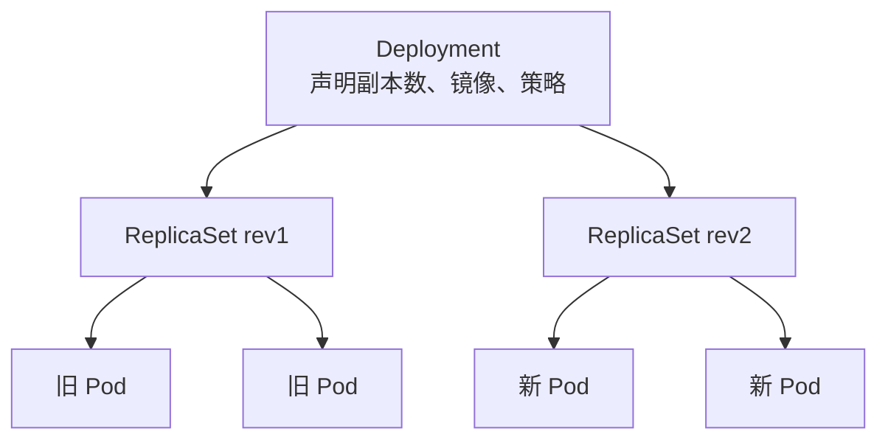
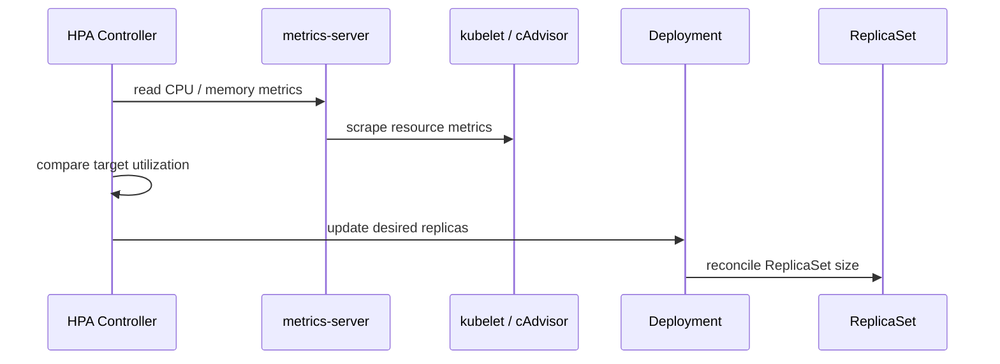
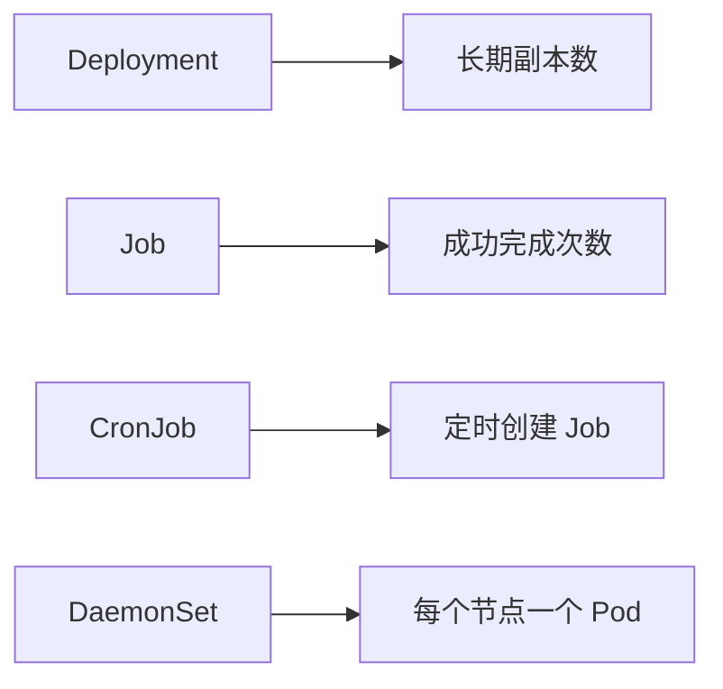

# 第 21 篇：Kubernetes 核心工作负载

第 20 篇已经创建了本地 kind 集群，并把 `todo-api:v0.1.0` 镜像导入到节点。现在我们从“能创建 Pod”进入“能运行业务服务”：用 Deployment 管理 Todo API，用 Probe 表达健康状态，用 Resource Request / Limit 给调度器和 HPA 提供依据，再用滚动更新和回滚处理发布风险。

本篇特色项目是：**把 `todo-api:v0.1.0` 部署为 Kubernetes Deployment，配置 Service、探针、资源限制、HPA，并完成一次滚动更新和一次失败回滚演练。**

## 1. 本章学习目标

### 1.1 知识目标

- 能解释 Pod 生命周期、Pod phase、Container state、Condition 和 Events 的区别。
- 能说明 Deployment、ReplicaSet 和 Pod 的控制关系。
- 能解释 RollingUpdate、`maxSurge`、`maxUnavailable` 对发布过程的影响。
- 能区分 `startupProbe`、`readinessProbe` 和 `livenessProbe` 的职责。
- 能说明 Resource Request / Limit 与调度、QoS、HPA 的关系。
- 能说清 Job、CronJob、DaemonSet 的适用场景。

### 1.2 技能目标

- 能编写 Todo API 的 Deployment、Service、Secret、HPA YAML。
- 能用 `kubectl apply`、`rollout status`、`rollout history`、`rollout undo` 管理发布。
- 能用 `kubectl get pods`、`describe`、`logs`、`get events` 排查工作负载问题。
- 能配置 HTTP Probe，让 Kubernetes 判断服务是否启动、存活和可接流量。
- 能创建 Job、CronJob、DaemonSet 示例，并解释它们和 Deployment 的差异。
- 能在 metrics-server 可用时观察 HPA 依据 CPU 指标扩缩容。

### 1.3 前置条件

开始本篇前，请确认你已经完成：

- 第 16 篇：本地已经构建过 `todo-api:v0.1.0` 镜像。
- 第 17 篇：理解 Todo API 的环境变量、`/healthz`、`/readyz` 和 `config-check`。
- 第 20 篇：本地 kind 集群 `todo-k8s` 可用，并理解 Namespace、Pod、Service 和 `kubectl describe`。

本篇命令以 Linux / macOS / WSL2 Bash 为主。Windows 用户建议在 WSL2 Ubuntu 中完成实验；本章大量使用 `cat <<'YAML'` heredoc 生成文件，不能直接粘贴到 PowerShell 中执行。如果坚持使用 PowerShell，请手动创建文件并复制 YAML 内容，或改写为 PowerShell here-string。

第 17 篇的 Compose 环境同时运行 PostgreSQL、Redis、迁移任务、API 和 Traefik。Kubernetes 阶段会逐步拆解这些能力：本篇聚焦工作负载；第 22 篇处理入口流量；第 23 篇迁移 ConfigMap / Secret；第 24 篇再迁移 PostgreSQL 与持久化存储。

!!! note "为什么本篇先用内存模式运行 Todo API"
    第 12 篇已经把 Todo API 做成“有 `TODO_DATABASE_DSN` 时使用 PostgreSQL，没有 `TODO_DATABASE_DSN` 时使用内存 Repository”。本章 Deployment 会故意不设置 `TODO_DATABASE_DSN`，让 API 先以无外部依赖的内存模式启动。这样学习曲线更平滑，也能把 Deployment、Probe、HPA、Job、CronJob 和 DaemonSet 讲清楚。

## 2. 本章工作场景与真实案例

### 2.1 技术痛点

团队第一次把后端服务搬上 Kubernetes 时，经常遇到这些问题：

- 只会 `kubectl run`，不知道为什么生产服务应该用 Deployment。
- Pod 显示 `Running`，但流量仍然失败，不知道 readinessProbe 和 Service Endpoints 的关系。
- 更新镜像后部分请求失败，不理解滚动更新过程。
- Pod 被 OOMKilled 或调度不上节点，不知道该看 requests、limits 和 Events。
- HPA 创建成功但不扩容，不知道 metrics-server、CPU request 和指标采集链路缺一不可。

本篇会把这些问题放到同一个 Todo API 发布流程里解决。

### 2.2 真实团队场景

在企业发布链路中，工作负载对象通常由不同角色协作维护：

- 后端工程师负责镜像、健康检查端点、优雅关闭和运行参数。
- 平台工程师负责 Deployment 模板、资源限制、HPA、发布策略和回滚策略。
- SRE 通过 `kubectl rollout`、Events、日志和指标判断发布是否健康。
- 安全工程师关注镜像来源、Secret 注入、非 root、最小权限和运行时边界。
- 测试工程师在隔离 Namespace 中反复创建、更新、回滚同一套 YAML。

### 2.3 课程项目关联

阶段三到阶段四的主线正在从“容器化交付物”变成“集群工作负载”：

```text linenums="0"
第 16 篇：todo-api:v0.1.0 镜像
第 17 篇：Docker Compose 本地多服务编排
第 20 篇：kind 集群 + 镜像导入
第 21 篇：Deployment + Probe + Resource + HPA
```

本篇会在应用仓库中创建 `deployments/k8s-base/`，这是后续第 22-24 篇继续叠加 Service、Ingress、ConfigMap、Secret 和 PVC 的基础目录。

## 3. 核心概念

### 3.1 Pod 生命周期与容器状态

Pod 是 Kubernetes 的最小调度单元，但它不是“永远运行”的保证。一个 Pod 会经历调度、拉镜像、启动容器、探针检查、退出、重启等过程。

表 21-1 Pod 常见 phase：

| Phase | 含义 | 常见排查方向 |
|---|---|---|
| `Pending` | Pod 对象已创建，但还没有所有容器运行起来 | 调度失败、镜像拉取、PVC、资源不足 |
| `Running` | Pod 已绑定节点，至少一个容器正在运行或启动中 | 继续看 READY、Probe、日志 |
| `Succeeded` | 所有容器成功退出，不会再重启 | 常见于 Job |
| `Failed` | 至少一个容器失败退出，且不会再重启 | 看 exit code、日志、Events |
| `Unknown` | 控制面无法获取 Pod 状态 | 节点或 kubelet 通信异常 |

容器本身还有三类 state：

| Container state | 含义 |
|---|---|
| `Waiting` | 等待启动，可能在拉镜像、等待配置、退避重试 |
| `Running` | 容器主进程正在运行 |
| `Terminated` | 容器已退出，需看 exit code 和 reason |

`kubectl get pod` 只给你摘要，真正排查要看：

```bash linenums="0"
kubectl -n todo-workloads describe pod <pod-name>
kubectl -n todo-workloads logs <pod-name>
kubectl -n todo-workloads get events --sort-by=.lastTimestamp
```

### 3.2 Deployment、ReplicaSet 与 Pod

Deployment 是管理无状态服务最常用的工作负载对象。它不直接“手工看守”每个 Pod，而是通过 ReplicaSet 维持副本数。

图 21-1 Deployment 控制关系：



当你修改 Deployment 的 Pod template，例如镜像、环境变量、探针或资源限制，Kubernetes 会创建新的 ReplicaSet，再按滚动更新策略逐步替换旧 Pod。

### 3.3 Job、CronJob 与 DaemonSet

表 21-2 常见工作负载对象：

| 对象 | 适合场景 | Todo Platform 示例 |
|---|---|---|
| Deployment | 长期运行的无状态服务 | Todo API |
| ReplicaSet | 维持一组 Pod 副本 | 通常由 Deployment 自动管理 |
| Job | 一次性任务，成功后退出 | 数据库迁移、配置检查 |
| CronJob | 定时创建 Job | 每日清理、定时报表、巡检 |
| DaemonSet | 每个节点运行一个 Pod | 日志采集、节点 agent、网络插件 |

本篇主项目使用 Deployment。Job、CronJob、DaemonSet 会在实验后半段用小示例观察，不提前承载 Todo API 的完整生产流程。

### 3.4 Probe：启动、存活与就绪

Probe 是 Kubernetes 判断容器健康的方式。它不只是“健康检查”，而是参与调度流量、重启容器和发布节奏。

表 21-3 Probe 的职责：

| Probe | 解决的问题 | Todo API 端点 |
|---|---|---|
| `startupProbe` | 应用启动慢时，先给它启动窗口 | `/healthz` |
| `livenessProbe` | 进程卡死或不可恢复时重启容器 | `/healthz` |
| `readinessProbe` | 服务未准备好时不接收流量 | `/readyz` |

`/healthz` 表示进程活着，`/readyz` 表示可以接流量。两者不要混在一起：依赖暂时故障时，readiness 可以失败并摘流量；liveness 失败会触发重启，配置过激会让服务进入重启风暴。

### 3.5 Resource Request / Limit 与 HPA

`resources.requests` 告诉调度器“这个 Pod 至少需要多少资源”；`resources.limits` 给容器设置上限。

HPA（Horizontal Pod Autoscaler，水平 Pod 自动扩缩器）依据指标调整副本数。CPU 类型的 HPA 必须有 CPU request，否则 Kubernetes 无法计算“当前使用量占 request 的百分比”。

图 21-2 HPA 控制链路：



本篇会创建 HPA 对象。是否能触发扩容，取决于 metrics-server 是否可用、Pod 是否有 CPU request、负载是否足够高。

## 4. 原理深入

### 4.1 Deployment 滚动更新怎么发生

Deployment 的滚动更新不是“一次性删旧再建新”，而是逐步创建新 Pod、等待新 Pod Ready，再缩减旧 Pod。

关键字段：

```yaml linenums="0"
strategy:
  type: RollingUpdate
  rollingUpdate:
    maxSurge: 1        # ← 更新期间最多额外多 1 个 Pod
    maxUnavailable: 0 # ← 更新期间不允许可用副本减少
```

如果副本数是 2，`maxSurge: 1`、`maxUnavailable: 0` 表示更新期间最多出现 3 个 Pod，但至少保持 2 个可用副本。对 Web API 来说，这比“先删后建”安全得多。

`progressDeadlineSeconds` 是 Deployment 自己判断发布是否“长时间没有推进”的期限。本篇设置为 `120` 秒，是为了让坏镜像演练更快暴露 `ProgressDeadlineExceeded`；而 `kubectl rollout status --timeout=60s` 是客户端等待命令的超时时间，两者不是同一个开关。

### 4.2 回滚依赖旧 ReplicaSet

Deployment 每次 Pod template 变化都会产生一个新 revision。回滚本质上是把 Deployment 的 Pod template 恢复到历史 revision。

常用命令：

```bash linenums="0"
kubectl -n todo-workloads rollout history deployment/todo-api
kubectl -n todo-workloads rollout undo deployment/todo-api
```

注意：如果你把 `revisionHistoryLimit` 设得太小，旧 ReplicaSet 可能被清理，回滚选择也会减少。生产环境要在回滚能力和资源占用之间平衡。

### 4.3 Probe 与 Service Endpoints 的关系

Service 并不直接检查你的 HTTP 端点。它通过 selector 找到 Pod，再通过 EndpointSlice 记录可转发的后端。readinessProbe 失败时，Pod 不会进入 Service 的可用后端。

排查 Service 转发时，至少看三层：

```bash linenums="0"
kubectl -n todo-workloads get pod -l app.kubernetes.io/name=todo-api
kubectl -n todo-workloads get endpoints todo-api
kubectl -n todo-workloads describe pod <pod-name>
```

### 4.4 Job、CronJob、DaemonSet 的控制循环

Deployment 追求“长期保持 N 个副本运行”；Job 追求“任务成功完成”；CronJob 追求“按时间创建 Job”；DaemonSet 追求“每个匹配节点都有一个 Pod”。

图 21-3 工作负载控制器差异：



选择工作负载对象时，先问一个问题：你要的是“持续服务”“一次性任务”“定时任务”，还是“节点级常驻进程”？

## 5. 手把手实验

### 5.1 实验目标

把 `todo-api:v0.1.0` 部署到第 20 篇创建的 kind 集群中，完成：

- Deployment + Service 部署。
- startup / readiness / liveness Probe 配置。
- Resource Request / Limit 配置。
- 手动扩缩容。
- 滚动更新和失败回滚。
- HPA 对象创建与 metrics-server 可选验证。
- Job、CronJob、DaemonSet 示例观察。

### 5.2 实验环境

表 21-4 实验工具与版本：

| 工具 | 推荐版本 | 用途 |
|---|---|---|
| Docker | 29.x 或当前稳定版 | 构建并保存本地镜像 |
| kind | 0.31+ | 本地 Kubernetes 集群 |
| Kubernetes API Server | Ch20 默认 `v1.35.0`，可用 `KIND_NODE_IMAGE` 覆盖到 1.36.x | 本地集群控制面 |
| kubectl | v1.35.x 或与 API Server 相差不超过 1 个小版本 | 操作 Kubernetes 对象 |
| Todo API 镜像 | `todo-api:v0.1.0` | 本篇业务镜像 |
| Alpine | `registry.cn-guangzhou.aliyuncs.com/yleoer/alpine:3.23` | Job/HPA 负载示例和 DaemonSet 示例 |
| metrics-server | `v0.8.1` | HPA 指标来源，可选 |

Ch20 当前默认 kind 节点镜像是 `registry.cn-guangzhou.aliyuncs.com/yleoer/node:v1.35.0`，本章 YAML 使用的 `apps/v1`、`batch/v1`、`autoscaling/v2` 都不是 1.36 专属 API。如果出版前切换到 Kubernetes 1.36.x kind 节点镜像，本章命令无需改动；日常实验只要保证 `kubectl` 与 API Server 相差不超过 1 个小版本即可。metrics-server `0.8.x` 官方兼容 Kubernetes `1.31+`，因此可用于本章的 1.35/1.36 实验环境。

确认当前环境：

```bash linenums="0"
docker version
kind version
kubectl version --client
kind get clusters
kubectl config current-context
```

如果 `kind get clusters` 看不到 `todo-k8s`，请先回到第 20 篇创建 kind 集群。

确认 Todo API 镜像：

```bash linenums="0"
docker image inspect todo-api:v0.1.0
```

如果镜像不存在，回到应用仓库根目录构建：

```bash linenums="0"
docker build -f api/Dockerfile -t todo-api:v0.1.0 .
```

把镜像导入 kind 节点：

```bash linenums="0"
KIND_CLUSTER=todo-k8s
kind load docker-image todo-api:v0.1.0 --name "$KIND_CLUSTER"
```

如果你的网络无法让 kind 节点直接从 Docker Hub 拉取 Alpine，也可以提前导入可选示例用到的镜像：

```bash linenums="0"
docker pull registry.cn-guangzhou.aliyuncs.com/yleoer/alpine:3.23
kind load docker-image registry.cn-guangzhou.aliyuncs.com/yleoer/alpine:3.23 --name "$KIND_CLUSTER"
```

切换到本篇使用的 context：

```bash linenums="0"
kubectl config use-context "kind-$KIND_CLUSTER"
kubectl get nodes
```

### 5.3 文件目录结构

在应用仓库根目录创建 Kubernetes 基础 YAML 目录：

```bash linenums="0"
mkdir -p deployments/k8s-base
```

本篇完成后，目录结构应类似：

```text linenums="0"
deployments/k8s-base
├── namespace.yaml
├── todo-api-secret.local.yaml # ← 本地生成，不提交公开仓库
├── todo-api-deployment.yaml
├── todo-api-service.yaml
├── todo-api-hpa.yaml
├── workload-extras.yaml
└── README.md
```

`todo-api-secret.local.yaml` 是本地实验生成文件，包含本地密码哈希，不应提交到公开仓库。如果你的应用仓库还没有忽略它，可以把 `deployments/k8s-base/*.local.yaml` 加入 `.gitignore`；真实项目应使用 Secret 管理系统、Sealed Secrets、External Secrets 或 GitOps 平台的受控密钥能力。

### 5.4 完整代码或配置

创建 Namespace：

```bash linenums="0"
cat > deployments/k8s-base/namespace.yaml <<'YAML'
apiVersion: v1
kind: Namespace
metadata:
  name: todo-workloads # ← 本篇工作负载实验的独立命名空间
  labels:
    app.kubernetes.io/part-of: todo-platform
YAML
```

先应用 Namespace，后续 Secret 需要写入这个 Namespace：

```bash linenums="0"
kubectl apply -f deployments/k8s-base/namespace.yaml
```

生成本地实验 Secret。`hash-password` 子命令来自第 14 篇生产化改造，并在第 16 篇镜像构建实验中验证过；如果下面命令失败，请先回到第 16 篇重新构建 `todo-api:v0.1.0`。

Linux / macOS / WSL2：

```bash linenums="0"
HASH=$(docker run --rm todo-api:v0.1.0 hash-password "change-me-123")

docker run --rm todo-api:v0.1.0 hash-password "preflight-check" >/dev/null

docker rm -f todo-api-k8s-preflight 2>/dev/null || true
docker run --rm -d \
  --name todo-api-k8s-preflight \
  -p 18083:18080 \
  -e TODO_ENV=dev \
  -e TODO_API_ADDR=0.0.0.0:18080 \
  -e TODO_JWT_SECRET=0123456789abcdef0123456789abcdef \
  -e "TODO_AUTH_USERS=admin=$HASH" \
  todo-api:v0.1.0 serve

sleep 3
curl -fsS http://127.0.0.1:18083/healthz
curl -fsS http://127.0.0.1:18083/readyz
docker logs todo-api-k8s-preflight --tail=20
docker rm -f todo-api-k8s-preflight

kubectl -n todo-workloads create secret generic todo-api-auth \
  --from-literal=TODO_JWT_SECRET=0123456789abcdef0123456789abcdef \
  --from-literal=TODO_AUTH_USERS="admin=$HASH" \
  --dry-run=client -o yaml > deployments/k8s-base/todo-api-secret.local.yaml
```

!!! warning "不要提交本地 Secret"
    `todo-api-secret.local.yaml` 是为了让本地实验可复制。真实团队不要把 JWT Secret、密码哈希或其他敏感值提交到 Git。第 23 篇会系统讲 ConfigMap 与 Secret 的迁移方式。

上面的预检故意不设置 `TODO_DATABASE_DSN`。如果日志中看到 `using memory repository`，并且 `/healthz`、`/readyz` 都返回成功，说明本章的无数据库启动前提成立。

创建 Deployment：

```bash linenums="0"
cat > deployments/k8s-base/todo-api-deployment.yaml <<'YAML'
# 结构概览：
# 1. metadata/labels：统一应用标签，供 Service、HPA、查询命令使用
# 2. strategy：滚动更新策略
# 3. template/spec：Pod 模板，包含镜像、环境变量、探针、资源和安全上下文
apiVersion: apps/v1
kind: Deployment
metadata:
  name: todo-api
  namespace: todo-workloads
  labels:
    app.kubernetes.io/name: todo-api
    app.kubernetes.io/part-of: todo-platform
spec:
  replicas: 2 # ← 本篇从 2 副本开始，便于观察滚动更新
  revisionHistoryLimit: 5 # ← 保留历史 ReplicaSet，支持回滚
  progressDeadlineSeconds: 120 # ← 新版本 120 秒内没有推进就标记发布进度异常
  strategy:
    type: RollingUpdate
    rollingUpdate:
      maxSurge: 1 # ← 更新时最多额外创建 1 个 Pod
      maxUnavailable: 0 # ← 更新时至少保持当前可用副本数
  selector:
    matchLabels:
      app.kubernetes.io/name: todo-api
      app.kubernetes.io/part-of: todo-platform
  template:
    metadata:
      labels:
        app.kubernetes.io/name: todo-api
        app.kubernetes.io/part-of: todo-platform
        app.kubernetes.io/version: v0.1.0
    spec:
      terminationGracePeriodSeconds: 30 # ← 给 Go HTTP server 优雅关闭窗口
      containers:
        - name: todo-api
          image: todo-api:v0.1.0
          imagePullPolicy: IfNotPresent # ← kind 节点已导入镜像时不去远程拉取
          args:
            - serve
          ports:
            - name: http
              containerPort: 18080 # ← Todo API 容器内监听端口
          env:
            - name: TODO_ENV
              value: dev
            - name: TODO_API_ADDR
              value: 0.0.0.0:18080
            - name: TODO_RELEASE
              value: chapter-21-v1
            # 本篇故意不设置 TODO_DATABASE_DSN；未设置时 Todo API 使用内存 Repository。
          envFrom:
            - secretRef:
                name: todo-api-auth # ← 本地实验 Secret，提供 JWT 和登录用户
          startupProbe:
            httpGet:
              path: /healthz
              port: http
            periodSeconds: 2
            failureThreshold: 30 # ← 最多等待约 60 秒启动
          readinessProbe:
            httpGet:
              path: /readyz
              port: http
            periodSeconds: 5
            failureThreshold: 3
          livenessProbe:
            httpGet:
              path: /healthz
              port: http
            periodSeconds: 10
            failureThreshold: 3
          resources:
            requests:
              cpu: 50m # ← HPA 计算 CPU 利用率需要 request
              memory: 64Mi
            limits:
              cpu: 500m
              memory: 256Mi
          securityContext:
            allowPrivilegeEscalation: false
            capabilities:
              drop:
                - ALL
YAML
```

创建 Service：

```bash linenums="0"
cat > deployments/k8s-base/todo-api-service.yaml <<'YAML'
apiVersion: v1
kind: Service
metadata:
  name: todo-api
  namespace: todo-workloads
  labels:
    app.kubernetes.io/name: todo-api
    app.kubernetes.io/part-of: todo-platform
spec:
  type: ClusterIP # ← 本篇只做集群内访问，外部入口留到第 22 篇
  selector:
    app.kubernetes.io/name: todo-api
    app.kubernetes.io/part-of: todo-platform
  ports:
    - name: http
      port: 80 # ← Service 端口
      targetPort: http # ← 转发到容器命名端口 http
YAML
```

创建 HPA：

```bash linenums="0"
cat > deployments/k8s-base/todo-api-hpa.yaml <<'YAML'
apiVersion: autoscaling/v2
kind: HorizontalPodAutoscaler
metadata:
  name: todo-api
  namespace: todo-workloads
  labels:
    app.kubernetes.io/name: todo-api
    app.kubernetes.io/part-of: todo-platform
spec:
  scaleTargetRef:
    apiVersion: apps/v1
    kind: Deployment
    name: todo-api
  minReplicas: 2
  maxReplicas: 5
  metrics:
    - type: Resource
      resource:
        name: cpu
        target:
          type: Utilization
          averageUtilization: 60 # ← 平均 CPU 超过 request 的 60% 时倾向扩容
  behavior:
    scaleDown:
      stabilizationWindowSeconds: 60 # ← 实验用短窗口；生产通常建议 300s 或更长
YAML
```

创建 Job、CronJob、DaemonSet 示例：

```bash linenums="0"
cat > deployments/k8s-base/workload-extras.yaml <<'YAML'
# 结构概览：
# 1. Job：一次性运行 todo-api config-check
# 2. CronJob：定时配置检查示例，默认 suspend
# 3. DaemonSet：每个节点运行一个轻量 heartbeat Pod
apiVersion: batch/v1
kind: Job
metadata:
  name: todo-api-config-check
  namespace: todo-workloads
  labels:
    app.kubernetes.io/name: todo-api
    app.kubernetes.io/component: config-check
spec:
  backoffLimit: 2 # ← 失败最多重试 2 次
  ttlSecondsAfterFinished: 600 # ← 完成后 10 分钟自动清理 Job 及其 Pod
  template:
    spec:
      restartPolicy: Never
      containers:
        - name: config-check
          image: todo-api:v0.1.0
          imagePullPolicy: IfNotPresent
          args:
            - config-check
          env:
            - name: TODO_ENV
              value: dev
            - name: TODO_API_ADDR
              value: 0.0.0.0:18080
          envFrom:
            - secretRef:
                name: todo-api-auth
---
apiVersion: batch/v1
kind: CronJob
metadata:
  name: todo-api-config-check
  namespace: todo-workloads
  labels:
    app.kubernetes.io/name: todo-api
    app.kubernetes.io/component: scheduled-check
spec:
  schedule: "*/10 * * * *" # ← 每 10 分钟一次，仅用于观察 CronJob 格式
  suspend: true # ← 本篇默认暂停，避免持续产生任务
  successfulJobsHistoryLimit: 2
  failedJobsHistoryLimit: 2
  jobTemplate:
    spec:
      backoffLimit: 1
      template:
        spec:
          restartPolicy: Never
          containers:
            - name: config-check
              image: todo-api:v0.1.0
              imagePullPolicy: IfNotPresent
              args:
                - config-check
              env:
                - name: TODO_ENV
                  value: dev
                - name: TODO_API_ADDR
                  value: 0.0.0.0:18080
              envFrom:
                - secretRef:
                    name: todo-api-auth
---
apiVersion: apps/v1
kind: DaemonSet
metadata:
  name: node-heartbeat
  namespace: todo-workloads
  labels:
    app.kubernetes.io/name: node-heartbeat
    app.kubernetes.io/part-of: todo-platform
spec:
  selector:
    matchLabels:
      app.kubernetes.io/name: node-heartbeat
  template:
    metadata:
      labels:
        app.kubernetes.io/name: node-heartbeat
    spec:
      containers:
        - name: heartbeat
          image: registry.cn-guangzhou.aliyuncs.com/yleoer/alpine:3.23
          imagePullPolicy: IfNotPresent
          command:
            - sh
            - -c
            - |
              while true; do
                echo "node heartbeat from $(hostname)"
                sleep 30
              done
          resources:
            requests:
              cpu: 5m
              memory: 16Mi
            limits:
              cpu: 50m
              memory: 64Mi
YAML
```

写入本地 README：

```bash linenums="0"
cat > deployments/k8s-base/README.md <<'MD'
# Todo API Kubernetes Base

## Apply

    kubectl apply -f namespace.yaml
    kubectl apply -f todo-api-secret.local.yaml
    kubectl apply -f todo-api-deployment.yaml
    kubectl apply -f todo-api-service.yaml

## Verify

    kubectl -n todo-workloads rollout status deployment/todo-api
    kubectl -n todo-workloads get deploy,rs,pod,svc
    kubectl -n todo-workloads port-forward service/todo-api 18082:80
    curl -i http://127.0.0.1:18082/readyz

## Optional

    kubectl apply -f todo-api-hpa.yaml
    kubectl apply -f workload-extras.yaml

## Cleanup

    kubectl delete namespace todo-workloads --ignore-not-found

`todo-api-secret.local.yaml` is generated for local labs and should not be committed to public repositories.
MD
```

### 5.5 执行命令

先部署 Namespace、Secret、Deployment 和 Service：

```bash linenums="0"
kubectl apply -f deployments/k8s-base/namespace.yaml
kubectl apply -f deployments/k8s-base/todo-api-secret.local.yaml
kubectl apply -f deployments/k8s-base/todo-api-deployment.yaml
kubectl apply -f deployments/k8s-base/todo-api-service.yaml
```

等待 Deployment 发布完成：

```bash linenums="0"
kubectl -n todo-workloads rollout status deployment/todo-api --timeout=180s
```

查看 Deployment、ReplicaSet、Pod 和 Service：

```bash linenums="0"
kubectl -n todo-workloads get deployment,replicaset,pod,service -o wide
```

查看 Pod 标签和探针状态：

```bash linenums="0"
kubectl -n todo-workloads get pods --show-labels
POD="$(kubectl -n todo-workloads get pod -l app.kubernetes.io/name=todo-api -o jsonpath='{.items[0].metadata.name}')"
kubectl -n todo-workloads describe pod "$POD"
```

查看日志：

```bash linenums="0"
kubectl -n todo-workloads logs "$POD" --tail=80
```

通过 Service 做本地访问。这个命令会占用当前终端：

```bash linenums="0"
kubectl -n todo-workloads port-forward service/todo-api 18082:80
```

在另一个终端访问：

```bash linenums="0"
curl -i http://127.0.0.1:18082/healthz
curl -i http://127.0.0.1:18082/readyz
```

停止端口转发时，在第一个终端按 `Ctrl+C`。

手动扩容到 3 副本：

```bash linenums="0"
kubectl -n todo-workloads scale deployment/todo-api --replicas=3
kubectl -n todo-workloads rollout status deployment/todo-api --timeout=120s
kubectl -n todo-workloads get pods -l app.kubernetes.io/name=todo-api -o wide
```

执行一次正常滚动更新。本篇用环境变量变化触发新 revision，真实生产通常使用新的镜像 tag 或 digest：

```bash linenums="0"
kubectl -n todo-workloads set env deployment/todo-api TODO_RELEASE=chapter-21-v2
kubectl -n todo-workloads rollout status deployment/todo-api --timeout=180s
kubectl -n todo-workloads rollout history deployment/todo-api
kubectl -n todo-workloads get replicasets -l app.kubernetes.io/name=todo-api
```

模拟一次失败发布：

```bash linenums="0"
kubectl -n todo-workloads set image deployment/todo-api todo-api=todo-api:not-exist
kubectl -n todo-workloads rollout status deployment/todo-api --timeout=60s
```

上面的 `rollout status` 预计会超时，因为新 Pod 拉不到镜像。查看状态：

```bash linenums="0"
kubectl -n todo-workloads get pods
kubectl -n todo-workloads get events --sort-by=.lastTimestamp | tail -n 20
```

执行回滚：

```bash linenums="0"
kubectl -n todo-workloads rollout undo deployment/todo-api
kubectl -n todo-workloads rollout status deployment/todo-api --timeout=180s
kubectl -n todo-workloads get pods -l app.kubernetes.io/name=todo-api
```

应用 HPA：

```bash linenums="0"
kubectl apply -f deployments/k8s-base/todo-api-hpa.yaml
kubectl -n todo-workloads get hpa todo-api
kubectl -n todo-workloads describe hpa todo-api
```

如果你还没有安装 metrics-server，HPA 的 `TARGETS` 可能显示 `<unknown>`。本篇固定使用 metrics-server `v0.8.1`，避免 `latest` 漂移导致同一章节在不同时间安装到不同版本。在 kind 本地实验中可以按下面方式安装 metrics-server：

```bash linenums="0"
curl -L -o components.yaml https://github.com/kubernetes-sigs/metrics-server/releases/download/v0.8.1/components.yaml
sed -i 's|registry.k8s.io/metrics-server/|registry.cn-guangzhou.aliyuncs.com/yleoer/|g' components.yaml
kubectl apply -f components.yaml
kubectl -n kube-system patch deployment metrics-server --type='json' \
  -p='[{"op":"add","path":"/spec/template/spec/containers/0/args/-","value":"--kubelet-insecure-tls"}]'
kubectl -n kube-system rollout status deployment/metrics-server --timeout=180s
kubectl top nodes
```

如果你的网络无法直接访问 GitHub，可以先在浏览器或代理环境中下载 `components.yaml`，再执行 `kubectl apply -f components.yaml`。

如果 `rollout status` 已经成功但 `kubectl top nodes` 暂时还没有数据，等待 30 到 60 秒后再试一次。metrics-server 需要先完成一轮采集，HPA 也需要等待指标进入 metrics API。

!!! warning "metrics-server 的 kind 适配只用于本地实验"
    `--kubelet-insecure-tls` 会跳过 kubelet 证书校验，只适合 kind 这类本地学习环境。生产集群应正确配置 kubelet 证书、认证和 metrics-server 参数。

可选：制造一点访问负载，观察 HPA。这个实验用于观察 HPA 指标变化，不保证每台机器都一定触发扩容，因为 Todo API 的 `/healthz` 很轻量，kind 节点资源和本机性能差异也会影响结果：

```bash linenums="0"
kubectl -n todo-workloads run hpa-load \
  --image=registry.cn-guangzhou.aliyuncs.com/yleoer/alpine:3.23 \
  --restart=Never \
  --command -- sh -c 'while true; do wget -q -O- http://todo-api/healthz >/dev/null; done'

kubectl -n todo-workloads get hpa todo-api --watch
```

这个 Pod 会持续向 `/healthz` 发送请求，中间没有 `sleep`，只用于观察 HPA 指标变化。停止观察时按 `Ctrl+C`，然后清理负载 Pod：

```bash linenums="0"
kubectl -n todo-workloads delete pod hpa-load --ignore-not-found
```

观察 Job、CronJob、DaemonSet：

```bash linenums="0"
kubectl apply -f deployments/k8s-base/workload-extras.yaml
kubectl -n todo-workloads get job,cronjob,daemonset,pod
kubectl -n todo-workloads logs job/todo-api-config-check
kubectl -n todo-workloads create job --from=cronjob/todo-api-config-check todo-api-config-check-manual
kubectl -n todo-workloads get job,pod
kubectl -n todo-workloads logs -l app.kubernetes.io/name=node-heartbeat --tail=20 --prefix=true
```

单节点 kind 集群中，DaemonSet 通常只会创建 1 个 Pod，这是正常现象。多节点集群才会看到每个匹配节点各运行一个 DaemonSet Pod。

### 5.6 预期输出

Deployment 发布成功时：

```text linenums="0"
deployment "todo-api" successfully rolled out
```

工作负载列表类似：

```text linenums="0"
NAME                       READY   UP-TO-DATE   AVAILABLE   AGE
deployment.apps/todo-api   2/2     2            2           60s

NAME                                  DESIRED   CURRENT   READY   AGE
replicaset.apps/todo-api-xxxxxxxxxx   2         2         2       60s

NAME                            READY   STATUS    RESTARTS   AGE
pod/todo-api-xxxxxxxxxx-abcde   1/1     Running   0          60s
pod/todo-api-xxxxxxxxxx-fghij   1/1     Running   0          60s

NAME               TYPE        CLUSTER-IP      EXTERNAL-IP   PORT(S)
service/todo-api   ClusterIP   10.96.xxx.xxx   <none>        80/TCP
```

`/readyz` 应返回：

```text linenums="0"
HTTP/1.1 200 OK
Content-Type: application/json
...
```

失败发布时可能看到：

```text linenums="0"
ErrImagePull
ImagePullBackOff
```

回滚成功后，Pod 应重新回到 `Running`，Deployment 的 `AVAILABLE` 应恢复到期望副本数。

HPA 在 metrics-server 不可用时常见输出：

```text linenums="0"
NAME       REFERENCE             TARGETS         MINPODS   MAXPODS   REPLICAS
todo-api   Deployment/todo-api   <unknown>/60%   2         5         2
```

metrics-server 可用并完成一轮采集后，`TARGETS` 会显示类似 `3%/60%` 的数值。刚安装完 metrics-server 时短暂显示 `<unknown>` 是常见现象，先等待 30 到 60 秒再复查。

### 5.7 验证方法

执行以下命令：

```bash linenums="0"
kubectl -n todo-workloads get deployment todo-api
kubectl -n todo-workloads get replicasets -l app.kubernetes.io/name=todo-api
kubectl -n todo-workloads get pods -l app.kubernetes.io/name=todo-api
kubectl -n todo-workloads get service todo-api
kubectl -n todo-workloads get hpa todo-api
curl -i http://127.0.0.1:18082/readyz
```

判断标准：

- `todo-api` Deployment 存在，`READY` 与期望副本数一致。
- 至少能看到一个由 Deployment 管理的 ReplicaSet。
- Todo API Pod 为 `Running`，`READY` 为 `1/1`。
- Service `todo-api` 存在，类型为 `ClusterIP`。
- `curl http://127.0.0.1:18082/readyz` 返回 `200 OK`。
- 模拟坏镜像后能通过 `kubectl rollout undo` 回滚成功。
- HPA 对象存在；如果 metrics-server 可用，`TARGETS` 不再是 `<unknown>`。

### 5.8 清理步骤

如果你还要继续第 22 篇，可以保留 `todo-workloads` Namespace。若要清理本篇所有资源：

```bash linenums="0"
kubectl delete namespace todo-workloads --ignore-not-found
```

如果只想清理可选示例：

```bash linenums="0"
kubectl -n todo-workloads delete -f deployments/k8s-base/workload-extras.yaml --ignore-not-found
kubectl -n todo-workloads delete pod hpa-load --ignore-not-found
```

如果不再使用 metrics-server：

```bash linenums="0"
kubectl delete -f components.yaml --ignore-not-found
```

预计耗时：90-120 分钟（动手操作约 75 分钟）。

## 6. 常见错误与排障

### 错误 1：Deployment 一直 `0/2`，Pod 是 `ImagePullBackOff`

- **现象**：

  ```text linenums="0"
  todo-api-xxxxx   0/1   ImagePullBackOff
  ```

- **原因**：kind 节点内部没有 `todo-api:v0.1.0` 镜像；镜像 tag 写错；或 `imagePullPolicy` 强制远程拉取。
- **排查**：

  ```bash linenums="0"
  kubectl -n todo-workloads describe pod <pod-name>
  docker image inspect todo-api:v0.1.0
  kind get clusters
  ```

- **修复**：

  ```bash linenums="0"
  kind load docker-image todo-api:v0.1.0 --name todo-k8s
  kubectl -n todo-workloads rollout restart deployment/todo-api
  kubectl -n todo-workloads rollout status deployment/todo-api
  ```

- **预防**：本地 kind 实验统一使用 `imagePullPolicy: IfNotPresent`，每次重建 kind 集群后重新 `kind load docker-image`。

### 错误 2：Pod 是 `CreateContainerConfigError`

- **现象**：

  ```text linenums="0"
  todo-api-xxxxx   0/1   CreateContainerConfigError
  ```

- **原因**：Deployment 引用了不存在的 Secret；Secret key 写错；Namespace 不一致。
- **排查**：

  ```bash linenums="0"
  kubectl -n todo-workloads describe pod <pod-name>
  kubectl -n todo-workloads get secret todo-api-auth
  kubectl -n todo-workloads describe deployment todo-api
  ```

- **修复**：重新生成并应用 Secret：

  ```bash linenums="0"
  HASH=$(docker run --rm todo-api:v0.1.0 hash-password "change-me-123")
  kubectl -n todo-workloads create secret generic todo-api-auth \
    --from-literal=TODO_JWT_SECRET=0123456789abcdef0123456789abcdef \
    --from-literal=TODO_AUTH_USERS="admin=$HASH" \
    --dry-run=client -o yaml | kubectl apply -f -
  kubectl -n todo-workloads rollout restart deployment/todo-api
  ```

- **预防**：先 `kubectl apply -f namespace.yaml`，再生成 Secret；不要把 Secret 放到错误 Namespace。

### 错误 3：Pod `Running`，但 `READY` 一直是 `0/1`

- **现象**：

  ```text linenums="0"
  todo-api-xxxxx   0/1   Running
  ```

- **原因**：readinessProbe 失败；应用没有监听 `0.0.0.0:18080`；`/readyz` 返回非 200；Service 端口和容器端口写错。
- **排查**：

  ```bash linenums="0"
  kubectl -n todo-workloads describe pod <pod-name>
  kubectl -n todo-workloads logs <pod-name> --tail=100
  kubectl -n todo-workloads get endpoints todo-api
  ```

  重点看 `Readiness probe failed` 事件，以及日志中的配置错误。

- **修复**：确认 `TODO_API_ADDR=0.0.0.0:18080`，确认 `readinessProbe.httpGet.path=/readyz`，确认容器端口名为 `http`。
- **预防**：先通过 `port-forward` 直接验证 `/healthz` 和 `/readyz`，再继续调 Service 或 HPA。

### 错误 4：滚动更新卡住

- **现象**：

  ```text linenums="0"
  Waiting for deployment "todo-api" rollout to finish...
  ```

  或者 `rollout status` 超时。

- **原因**：新 ReplicaSet 的 Pod 无法 Ready，常见原因是镜像不存在、Probe 配错、Secret 缺失或资源不足。
- **排查**：

  ```bash linenums="0"
  kubectl -n todo-workloads rollout status deployment/todo-api --timeout=60s
  kubectl -n todo-workloads get replicasets -l app.kubernetes.io/name=todo-api
  kubectl -n todo-workloads get pods
  kubectl -n todo-workloads get events --sort-by=.lastTimestamp | tail -n 30
  ```

- **修复**：

  ```bash linenums="0"
  kubectl -n todo-workloads rollout undo deployment/todo-api
  kubectl -n todo-workloads rollout status deployment/todo-api
  ```

- **预防**：生产发布必须先在测试 Namespace 验证；使用不可变镜像 tag 或 digest；设置合理 `maxUnavailable`。

### 错误 5：HPA 显示 `<unknown>`

- **现象**：

  ```text linenums="0"
  TARGETS <unknown>/60%
  ```

- **原因**：常见原因分三类：metrics-server 未安装或 metrics API 不可用；Deployment 缺少 `resources.requests.cpu`；负载太轻或刚安装 metrics-server，指标还没有完成首轮采集。kind 中还可能是 metrics-server 连接 kubelet 时证书校验失败。
- **排查**：

  ```bash linenums="0"
  kubectl get apiservice v1beta1.metrics.k8s.io
  kubectl -n kube-system get deployment metrics-server
  kubectl -n kube-system logs deployment/metrics-server --tail=100
  kubectl top pods -n todo-workloads
  kubectl -n todo-workloads describe hpa todo-api
  kubectl -n todo-workloads get deployment todo-api -o yaml | grep -A8 resources
  ```

- **修复**：如果 metrics API 不可用，安装 metrics-server 并在 kind 中按本篇命令添加 `--kubelet-insecure-tls`；如果 `describe hpa` 提示 missing request，确认 Deployment 中有 `resources.requests.cpu`；如果 `kubectl top` 已有数据但副本不变，说明负载不足或还没超过扩容阈值。
- **预防**：把 HPA 和 resources 作为一组配置审查，不要只写 HPA YAML。

### 补充排查：Job 日志与 distroless 调试

- **现象**：Job 已经完成，但 `kubectl logs job/...` 没有输出，或提示找不到 Pod。
- **原因**：Job 的 Pod 已被 `ttlSecondsAfterFinished` 清理；Job 还没有创建 Pod；或者 Job 失败重试中。
- **排查**：

  ```bash linenums="0"
  kubectl -n todo-workloads get job,pod
  kubectl -n todo-workloads describe job todo-api-config-check
  kubectl -n todo-workloads get events --sort-by=.lastTimestamp | tail -n 20
  ```

- **修复**：重新创建 Job 或临时调大 `ttlSecondsAfterFinished`。
- **预防**：生产任务日志要进入集中日志系统，不要依赖短生命周期 Pod 的本地日志。

- **现象**：

  ```text linenums="0"
  exec: "sh": executable file not found in $PATH
  ```

- **原因**：第 16 篇构建的运行镜像使用 distroless，镜像里通常没有 shell、包管理器和调试工具。这是安全设计，不是 Kubernetes 故障。
- **排查**：

  ```bash linenums="0"
  kubectl -n todo-workloads logs <pod-name> --tail=100
  kubectl -n todo-workloads describe pod <pod-name>
  kubectl -n todo-workloads exec <pod-name> -- /app/todo-api config-check
  ```

- **修复**：优先使用应用自身命令、日志、Probe、Events 和临时 debug Pod 排查。后续生产排障章节会讲 ephemeral container 和受控调试镜像。
- **预防**：最小镜像要配套日志、指标、追踪和调试流程，不能假设每个业务容器都有 shell。

## 7. 生产环境注意事项

1. **Deployment 不是发布流程的全部。** 它能滚动更新和回滚 Pod template，但生产发布还需要 CI/CD、镜像扫描、准入策略、灰度、告警、自动回滚和变更审计。

2. **探针必须和应用语义一致。** `livenessProbe` 不应检查所有下游依赖，否则依赖抖动会导致应用反复重启；`readinessProbe` 可以更严格，用来决定是否接流量。

3. **Resource Request 是调度和 HPA 的基础。** 没有 request，调度器无法做容量判断，HPA 也无法计算 CPU 利用率百分比。Limit 过低会导致 throttling 或 OOMKilled，过高会让节点资源不可控。

4. **不要在生产中使用可变 tag 做发布边界。** 本篇使用 `todo-api:v0.1.0` 是课程阶段产物。真实团队应使用 Git SHA、构建号或镜像 digest，并保留 SBOM、扫描结果和来源证明。

5. **Secret 不能靠“不要看”来保护。** Kubernetes Secret 默认只是 base64 编码，仍需要 RBAC、审计、etcd 加密、密钥轮换和外部密钥管理方案。第 23 篇会进一步展开。

6. **HPA 不是容量规划的替代品。** HPA 有采集周期和扩缩容延迟，不能代替压测、容量预估、限流和降级。突发流量场景还要配合队列、缓存、预热和集群自动扩容。生产中的 `scaleDown.stabilizationWindowSeconds` 通常设为 300 秒或更长，避免负载短暂下降后立即缩容。

7. **Job 和 CronJob 必须幂等。** 定时任务可能因为控制面重试、节点故障、时间漂移或业务超时出现重复执行。涉及数据修改时要设计幂等键、锁、超时和补偿。

8. **DaemonSet 常常拥有更高风险。** 日志采集、网络、监控 agent 可能需要宿主机路径、网络或特权能力。生产 DaemonSet 必须经过安全审查，并限制节点选择范围。

## 8. 本章小项目

本章小项目是 **Todo API Kubernetes Workload Pack**。

项目产出：

- `deployments/k8s-base/namespace.yaml`
- `deployments/k8s-base/todo-api-secret.local.yaml`（本地生成，不提交公开仓库）
- `deployments/k8s-base/todo-api-deployment.yaml`
- `deployments/k8s-base/todo-api-service.yaml`
- `deployments/k8s-base/todo-api-hpa.yaml`
- `deployments/k8s-base/workload-extras.yaml`
- `deployments/k8s-base/README.md`

主线验收：

- `todo-api` Deployment 至少 2 个 Ready 副本。
- `/healthz` 和 `/readyz` 通过 Service port-forward 返回 `200 OK`。
- `kubectl rollout history deployment/todo-api` 能看到至少 2 个 revision。
- 坏镜像发布后能通过 `kubectl rollout undo` 恢复。
- HPA 对象存在，且 Deployment 中配置了 CPU request。
- Job、CronJob、DaemonSet 示例能创建并观察到对应 Pod。

进阶验收：

- 能解释为什么本篇不用裸 Pod 承载 Todo API。
- 能说清 readinessProbe 和 livenessProbe 配错会导致什么生产事故。
- 能根据 Events 判断问题在镜像、Secret、Probe、资源还是 HPA 指标链路。

## 9. 练习题与面试题

本章练习题和面试题已拆分到独立页面，完成正文学习后再进入题库练习与复盘。

[查看本章练习题与面试题](../../questions/stage-04-kubernetes/21-k8s-workloads.md)

## 10. 本章总结

本篇把 Todo API 从“已导入 kind 节点的容器镜像”推进到“由 Kubernetes 工作负载控制器管理的服务”。你编写了 Deployment、Service、HPA、Job、CronJob 和 DaemonSet YAML，理解了 Pod 生命周期、ReplicaSet、滚动更新、回滚、探针、资源限制和 HPA 指标链路。

项目成果上，你已经拥有 `deployments/k8s-base/` 这一组基础 Kubernetes YAML。它不是完整生产部署，但已经具备无状态 API 服务在 Kubernetes 中运行所需的核心骨架。

能力价值上，你现在不只是会“apply 一个 YAML”，而是能判断发布是否健康、服务是否接流量、为什么 HPA 不工作、以及失败发布应该如何回滚。

## 11. 下一章衔接

第 22 篇会在本篇 Deployment 和 ClusterIP Service 的基础上，继续学习 Service 类型、Traefik Ingress、HTTPS 和 Gateway API 对比。到那时，Todo API 不再只靠 `kubectl port-forward` 临时访问，而会通过更接近真实团队的入口流量模型暴露出来。
