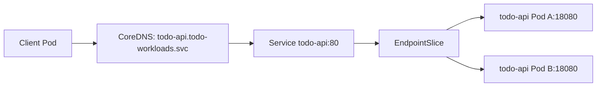
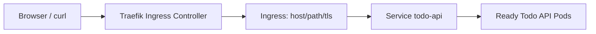
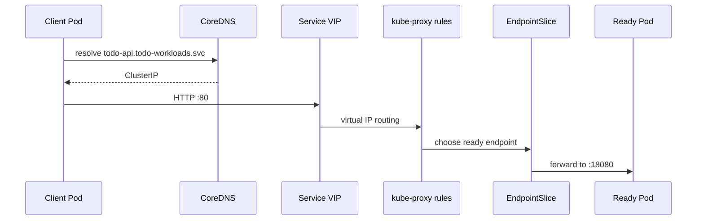
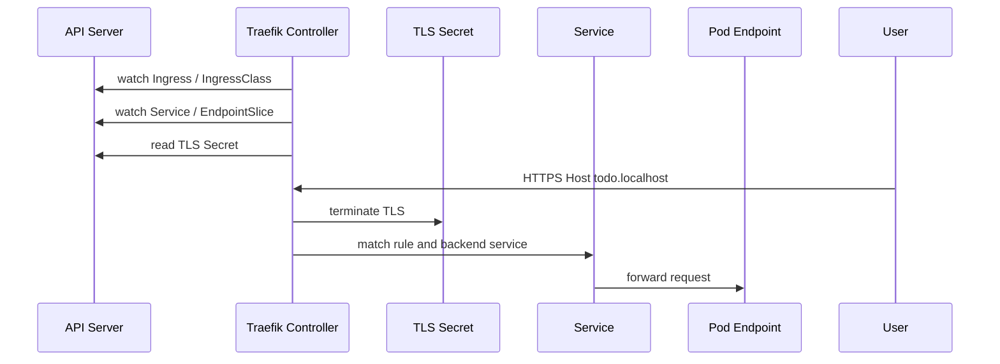

# 第 22 篇：Service、Ingress 与流量入口 [C]

第 21 篇已经把 `todo-api:v0.1.0` 部署成 Deployment，并通过 ClusterIP Service 和 `kubectl port-forward` 完成了本地访问。本篇继续向真实交付靠近：让 Todo API 拥有稳定的集群内 DNS，理解 ClusterIP、NodePort、LoadBalancer 的边界，安装 Traefik 作为 Ingress Controller，配置自签名 TLS，通过 HTTPS 访问 Todo API，并用 Gateway API 写出同一条入口规则。

本篇特色项目是：**为 Todo API 配置 Service、Traefik Ingress、HTTPS 和 Gateway API 对照入口，让本机通过 `https://todo.localhost:18443/readyz` 访问 Kubernetes 中的服务。**

## 1. 本章学习目标

### 1.1 知识目标

- 能解释 Service 为什么能为不断重建的 Pod 提供稳定入口。
- 能对比 ClusterIP、NodePort、LoadBalancer 和 ExternalName 的适用场景。
- 能说明 Ingress、IngressClass、Ingress Controller 三者的关系。
- 能解释 TLS 终止发生在入口层时，请求如何继续转发到后端 Service。
- 能说清 Gateway API 中 GatewayClass、Gateway、HTTPRoute 的职责分工。
- 能了解社区 Ingress NGINX 的退役背景和迁移方向。

### 1.2 技能目标

- 能为 Todo API 编写 NodePort、Ingress、Gateway 和 HTTPRoute YAML。
- 能部署一个本地 Traefik Ingress Controller，并用 `kubectl port-forward` 暴露入口层。
- 能生成本地自签名证书，创建 Kubernetes TLS Secret，并完成 HTTPS 访问验证。
- 能用 `kubectl get ingress`、`describe ingress`、`get endpointslices`、Traefik 日志定位入口问题。
- 能判断问题发生在 DNS/Host、TLS、IngressClass、Service selector、EndpointSlice 还是后端 Pod。

### 1.3 前置条件

开始本篇前，请确认你已经完成：

- 第 20 篇：本地 kind 集群 `todo-k8s` 可用。
- 第 21 篇：`todo-workloads` Namespace 中已经有 `todo-api` Deployment 和 ClusterIP Service，且 Pod 处于 Ready 状态。
- 本机有 `kubectl`、`kind`、`docker`、`openssl`。如果使用 Windows，建议在 WSL2 Ubuntu 中完成本章所有命令。

本篇继续使用第 21 篇的内存模式 Todo API。第 24 篇才会把 PostgreSQL 和 PVC 迁移进 Kubernetes。如果你的 Todo API Pod 在无数据库时无法 Ready，请先回到第 21 篇确认内存模式配置已经生效，再继续本篇入口层实验。

## 2. 本章工作场景与真实案例

### 2.1 技术痛点

只有 Deployment 和 ClusterIP Service 时，服务已经能在集群内访问，但还不能自然地面向用户、测试人员或外部系统暴露。团队常见问题包括：

- API Pod 一直在重建，直接访问 Pod IP 很快失效。
- 开发者只会 `port-forward`，不知道生产环境为什么需要 Ingress Controller。
- 创建了 Ingress YAML，但没有安装 Controller，以为 Kubernetes 会自动暴露公网入口。
- HTTPS 证书放错 Namespace，入口层返回默认证书或 TLS 握手失败。
- Service selector 写错，Ingress 路由正确但后端没有可用 Endpoint。
- 存量集群还在使用 Ingress NGINX，新集群又要求 Gateway API，团队不知道如何迁移。

本章把这些问题拆成一条清晰链路：`客户端 -> Traefik -> Ingress/Gateway 规则 -> Service -> EndpointSlice -> Pod`。

### 2.2 团队协作场景

在真实团队里，入口流量不是一个人随手改出来的：

- 后端工程师提供健康检查路径、Service 端口和应用路由边界。
- 平台工程师安装并升级 Traefik、维护 IngressClass / GatewayClass、定义可用入口。
- SRE 负责 TLS 证书、访问日志、告警、灰度、回滚和故障排查。
- 安全工程师审查 TLS 策略、证书来源、入口认证、WAF、限流和暴露面。
- 应用团队提交 Ingress 或 HTTPRoute，平台团队通过策略约束哪些 Namespace 可以使用哪些入口。

这也是 Gateway API 相比传统 Ingress 更强调的方向：把“基础设施入口”和“业务路由规则”拆开，让平台团队和应用团队各管各的边界。

### 2.3 课程项目关联

阶段四主线正在逐步把 Todo Platform 迁移到 Kubernetes：

```text
第 20 篇：kind 集群和 smoke Service
第 21 篇：Todo API Deployment + ClusterIP Service
第 22 篇：Traefik Ingress + HTTPS + Gateway API 对比
第 23 篇：ConfigMap / Secret 配置迁移
第 24 篇：PostgreSQL PVC 持久化
```

本篇会继续复用 `deployments/k8s-base/` 目录，在其中加入入口层相关 YAML。后续 Helm 和 Kustomize 章节会把这些 YAML 改造成可参数化、多环境可复用的发布资产。

## 3. 核心概念

### 3.1 Service：稳定入口和服务发现

Pod 是短生命周期对象，重建后 IP 可能变化。Service 是一层稳定抽象：它通过 selector 找到一组 Pod，并为这组 Pod 提供固定名称、固定端口和负载均衡入口。

最常见的 Service 结构如下：

```yaml
apiVersion: v1
kind: Service
metadata:
  name: todo-api
spec:
  type: ClusterIP
  selector:
    app.kubernetes.io/name: todo-api
  ports:
    - name: http
      port: 80
      targetPort: http
```

这里的 `port: 80` 是 Service 端口，`targetPort: http` 指向 Pod 容器里名为 `http` 的端口。第 21 篇的 Todo API 就是这种写法。

图 22-1 Service 到 Pod 的选择关系：



### 3.2 ClusterIP、NodePort、LoadBalancer、ExternalName

表 22-1 Service 类型对比：

| 类型 | 访问范围 | 典型用途 | 注意点 |
|---|---|---|---|
| ClusterIP | 集群内 | 后端服务内部访问 | 默认类型，不能直接被集群外访问 |
| NodePort | 节点 IP + 节点端口 | 裸机、实验、给外部 LB 转发 | 默认端口范围通常是 30000-32767，端口冲突要自己管理 |
| LoadBalancer | 云厂商负载均衡器 | 云上生产入口 | 需要云控制器或本地 LB 实现，kind 默认没有 |
| ExternalName | DNS CNAME | 把外部服务映射成集群内名字 | 不做代理，HTTP Host/TLS SNI 可能踩坑 |

在本地 kind 中，NodePort 和 LoadBalancer 都不能完全模拟云上的入口能力。NodePort 适合观察 Kubernetes 如何分配端口；LoadBalancer 在没有 MetalLB 或云控制器时通常显示 `<pending>`。本篇主线选择 Traefik + Ingress/Gateway，使用 `kubectl port-forward` 把 Traefik 的 443 暴露到本机 `18443`，这样不用重建第 20 篇的 kind 集群，也能完整验证 HTTPS。

### 3.3 Ingress、IngressClass 和 Controller

Ingress 是 Kubernetes 标准 API 对象，表达 HTTP/HTTPS 路由规则。IngressClass 表示“这条 Ingress 应该由哪个 Controller 处理”。Ingress Controller 是真正读取这些对象并配置反向代理的进程。

只创建 Ingress YAML 不会自动产生入口流量；集群里必须先有 Ingress Controller。

图 22-2 Ingress 工作结构：



本篇使用 Traefik 作为默认入口控制器，IngressClass 名称为 `traefik`，控制器值为 `traefik.io/ingress-controller`。

### 3.4 TLS 终止与 HTTPS

TLS 终止表示 HTTPS 连接在入口层被解密，入口层再用 HTTP 或 HTTPS 转发给后端。很多团队会让 Ingress Controller 终止 TLS，再把请求转发到集群内的 Service。

本章会创建一个本地自签名证书：

```text
客户端 HTTPS
  -> Traefik websecure entryPoint :443
  -> TLS Secret todo-api-local-tls
  -> HTTP 转发到 Service todo-api:80
  -> Pod 18080
```

图 22-3 TLS 终止链路。

自签名证书只适合本地实验，浏览器和 `curl` 默认不会信任它，所以本篇验证命令会使用 `curl -k`。生产环境应使用企业 CA 或 cert-manager / ACME 自动签发和轮换证书。

### 3.5 Gateway API：更清晰的入口模型

Gateway API 是 Kubernetes SIG Network 推动的新一代入口 API。它把传统 Ingress 中混在一起的职责拆开：

表 22-2 Gateway API 核心对象：

| 对象 | 归属角色 | 职责 |
|---|---|---|
| GatewayClass | 平台团队 | 声明哪类 Gateway 由哪个 Controller 实现 |
| Gateway | 平台团队或命名空间管理员 | 声明监听端口、协议、TLS 证书和允许绑定的 Route |
| HTTPRoute | 应用团队 | 声明 Host、Path、后端 Service 和流量规则 |
| ReferenceGrant | 平台/安全团队 | 允许跨 Namespace 引用后端或 Secret |

Ingress 仍然稳定可用，但 Kubernetes 官方已经冻结 Ingress API，并推荐新设计优先考虑 Gateway API。由于大量企业仍有存量 Ingress，本篇会让你同时会写 Ingress 和 HTTPRoute。

### 3.6 Ingress NGINX 的现状

社区 Ingress NGINX 曾经是最常见的 Ingress Controller。Kubernetes SIG Network 和 Security Response Committee 已宣布其在 2026 年 3 月退役，项目仓库也已归档，之后不再发布 bugfix 或安全修复。现有集群不会因此立刻坏掉，但新项目不应再把它作为默认选型。

本课程的策略是：

- 新主线使用 Traefik + Gateway API。
- Ingress NGINX 只在“存量迁移和识别风险”层面讲解。
- 如果维护旧集群，要先盘点 IngressClass、annotations、custom snippets、TLS、rewrite、auth，再分阶段迁移。

## 4. 原理深入

### 4.1 Service 流量如何到达 Pod

当你访问 `todo-api.todo-workloads.svc.cluster.local:80` 时，CoreDNS 先把 Service 名称解析成 ClusterIP。随后节点上的转发规则把流量导向 Service 的 EndpointSlice，也就是 Ready Pod 的 IP 和端口。



图 22-4 Service 流量到达 Pod（DNS -> ClusterIP -> EndpointSlice -> Pod）。

readinessProbe 很关键：Pod 未 Ready 时不应进入 EndpointSlice。入口层如果返回 502，先看 Service 和 EndpointSlice，通常比盯着 Ingress YAML 更快。

### 4.2 NodePort 与 LoadBalancer 的边界

NodePort 会让每个节点监听一个端口，并把流量转发到 Service 后端。它很直观，但生产中通常不会让用户直接访问节点端口，因为这样会暴露节点网络、缺少统一 TLS 和七层路由能力。

LoadBalancer 是云上最常见的外部入口，但 Kubernetes API 只声明“我需要一个外部负载均衡器”。真正创建负载均衡器的是云控制器或本地实现，例如云厂商 CCM、MetalLB、Cilium LB 等。kind 默认没有这些实现，所以 LoadBalancer Service 的 `EXTERNAL-IP` 往往是 `<pending>`。

本篇把 NodePort 和 LoadBalancer 放在对比实验里，主线使用 Ingress/Gateway。

### 4.3 Ingress Controller 如何生效

Ingress Controller 本质是一个控制器。它 watch Ingress、Service、EndpointSlice、Secret、IngressClass 等对象，然后生成反向代理配置。



图 22-5 Ingress Controller 工作流程（Watch -> 生成配置 -> TLS 终止 -> 转发）。

如果 Controller 没有安装、IngressClass 不匹配、TLS Secret 不存在，Ingress 对象可能存在，但入口访问仍然失败。

### 4.4 Gateway API 的职责分离

Gateway API 更像把入口平台拆成三层：

```text
GatewayClass：这个入口由谁实现
Gateway：这个入口监听哪些端口、域名、证书
HTTPRoute：这个应用的哪些 Host/Path 转发到哪个 Service
```

这比传统 Ingress 更适合企业平台，因为平台团队可以集中管理 Gateway，应用团队只需要提交 HTTPRoute。跨 Namespace 引用时，还可以通过 ReferenceGrant 做显式授权，减少“某个应用随手引用别的 Namespace 资源”的风险。

### 4.5 HTTP 到 HTTPS 的重定向

入口层经常需要把 HTTP 请求重定向到 HTTPS。Traefik 可以在 entryPoint 层配置 HTTP 到 HTTPS 的重定向，也可以通过 Middleware、IngressRoute 或 Gateway 策略实现。

本篇为了聚焦核心链路，只验证 HTTPS。HTTP 到 HTTPS 自动重定向会在后续 Helm/Kustomize 和生产入口章节中纳入模板化配置。

## 5. 手把手实验

### 5.1 实验目标

在第 21 篇 Todo API Deployment 和 ClusterIP Service 的基础上，部署 Traefik 入口控制器，创建本地 TLS Secret，通过 Ingress 和 Gateway API 两种方式用 HTTPS 访问 Todo API，并能排查入口层常见故障。

### 5.2 实验环境

表 22-3 实验工具与版本：

| 工具 | 推荐版本 | 用途 |
|---|---|---|
| Kubernetes API Server | Ch20 默认 `v1.35.0`，可覆盖到 1.36.x | 本地集群 |
| kubectl | v1.35.x 或与 API Server 相差不超过 1 个小版本 | 操作 Kubernetes API |
| kind | 0.31+ | 本地集群 |
| Traefik | `v3.6.17` | Ingress / Gateway Controller，锁定 3.6.x 最新补丁版本 |
| Gateway API CRDs | `v1.4.0` 标准通道 | 与 Traefik 3.6 Gateway Provider 对齐 |
| OpenSSL | 3.x 或系统自带版本 | 生成本地自签名证书 |
| Todo API | `todo-api:v0.1.0` | 后端服务 |

阶段四最终 Kubernetes 版本以第 20 篇统一后的集群版本为准。主线实验默认按 kind 实际 `v1.35.0` 执行；如果出版前统一切换到 1.36.x 节点镜像，本篇对象和命令无需结构性调整。Traefik 本篇锁定 `3.6.x` 最新补丁线，所以 Gateway API CRDs 固定为 Traefik 3.6 文档支持的 `v1.4.0`；如果后续升级到 Traefik 3.7.x，需要同步评估 Gateway API `v1.5.x` CRDs。

确认环境：

```bash
kubectl config current-context
kubectl get nodes
kubectl -n todo-workloads get deploy,svc,endpointslice
openssl version
```

如果第 21 篇资源已经清理，请先回到第 21 篇重新部署 `namespace.yaml`、`todo-api-secret.local.yaml`、`todo-api-deployment.yaml` 和 `todo-api-service.yaml`。

### 5.3 文件目录结构

在应用仓库根目录继续使用 `deployments/k8s-base/`：

```bash
mkdir -p deployments/k8s-base/tls
```

本篇完成后，目录结构应类似：

```text
deployments/k8s-base
├── namespace.yaml
├── todo-api-deployment.yaml
├── todo-api-service.yaml
├── todo-api-nodeport.yaml
├── todo-api-loadbalancer.yaml
├── traefik-controller.yaml
├── todo-api-tls.local.yaml
├── todo-api-ingress.yaml
├── traefik-gateway-platform.yaml
├── todo-api-httproute.yaml
├── tls
│   ├── openssl-todo-localhost.cnf
│   ├── todo.localhost.crt
│   └── todo.localhost.key
└── README.md
```

`todo-api-tls.local.yaml` 和 `tls/` 下的私钥文件只用于本地实验，不应提交到公开仓库。真实项目应使用 cert-manager、云证书服务或企业 CA。建议在应用仓库的 `.gitignore` 中加入：

```text
deployments/k8s-base/*.local.yaml
deployments/k8s-base/tls/
```

### 5.4 完整代码或配置

以下命令按 bash / WSL2 Ubuntu 编写。Windows PowerShell 用户建议在 WSL2 中执行；如果必须使用 PowerShell，请手动创建同名文件并复制 YAML 内容，或把 heredoc 改写成 PowerShell here-string。

创建 NodePort 对比 Service：

```bash
cat > deployments/k8s-base/todo-api-nodeport.yaml <<'YAML'
apiVersion: v1
kind: Service
metadata:
  name: todo-api-nodeport
  namespace: todo-workloads
  labels:
    app.kubernetes.io/name: todo-api
    app.kubernetes.io/part-of: todo-platform
spec:
  type: NodePort # ← 对比用；生产通常不直接暴露给用户
  selector:
    app.kubernetes.io/name: todo-api
    app.kubernetes.io/part-of: todo-platform
  ports:
    - name: http
      port: 80
      targetPort: http
      nodePort: 30082 # ← 默认 NodePort 范围 30000-32767，手工指定要避免冲突
YAML
```

创建 LoadBalancer 对比 Service：

```bash
cat > deployments/k8s-base/todo-api-loadbalancer.yaml <<'YAML'
apiVersion: v1
kind: Service
metadata:
  name: todo-api-loadbalancer
  namespace: todo-workloads
  labels:
    app.kubernetes.io/name: todo-api
    app.kubernetes.io/part-of: todo-platform
spec:
  type: LoadBalancer # ← kind 默认没有云 LB 控制器，EXTERNAL-IP 通常会是 <pending>
  selector:
    app.kubernetes.io/name: todo-api
    app.kubernetes.io/part-of: todo-platform
  ports:
    - name: http
      port: 80
      targetPort: http
YAML
```

安装 Gateway API CRDs。Traefik 3.6 的 Gateway Provider 与 Gateway API `v1.4.0` 对齐，本篇固定这个版本：

```bash
kubectl apply --server-side -f https://github.com/kubernetes-sigs/gateway-api/releases/download/v1.4.0/standard-install.yaml
```

如果网络无法直接访问 GitHub，可以先下载 `standard-install.yaml`，再执行 `kubectl apply --server-side -f standard-install.yaml`。

创建 Traefik Controller。这里不用 Helm，是为了让你看清 Controller 需要哪些 RBAC、监听端口和 provider 开关；后续交付章节会再讨论入口层如何逐步纳入 Helm Chart 或环境 overlay 管理：

```bash
cat > deployments/k8s-base/traefik-controller.yaml <<'YAML'
# 结构概览：
# 1. Namespace / ServiceAccount：隔离入口控制器运行身份
# 2. ClusterRole / Binding：允许 Traefik 读取 Namespace、Ingress、Gateway、Service、EndpointSlice、Secret
# 3. IngressClass：让 Ingress 通过 ingressClassName: traefik 绑定到本控制器
# 4. Deployment：运行 Traefik v3.6.17，启用 kubernetesIngress 和 kubernetesGateway provider
# 5. Service：暴露 Traefik 的 web、websecure、dashboard 端口，供 port-forward 使用
apiVersion: v1
kind: Namespace
metadata:
  name: traefik
---
apiVersion: v1
kind: ServiceAccount
metadata:
  name: traefik
  namespace: traefik
---
apiVersion: rbac.authorization.k8s.io/v1
kind: ClusterRole
metadata:
  name: traefik
rules:
  - apiGroups: [""]
    resources: ["namespaces"]
    verbs: ["get", "list", "watch"]
  - apiGroups: [""]
    resources: ["services", "endpoints", "secrets"]
    verbs: ["get", "list", "watch"]
  - apiGroups: ["discovery.k8s.io"]
    resources: ["endpointslices"]
    verbs: ["get", "list", "watch"]
  - apiGroups: ["networking.k8s.io"]
    resources: ["ingresses", "ingressclasses"]
    verbs: ["get", "list", "watch"]
  - apiGroups: ["networking.k8s.io"]
    resources: ["ingresses/status"]
    verbs: ["update", "patch"]
  - apiGroups: ["gateway.networking.k8s.io"]
    resources: ["gatewayclasses", "gateways", "httproutes", "grpcroutes", "referencegrants", "backendtlspolicies"]
    verbs: ["get", "list", "watch"]
  - apiGroups: ["gateway.networking.k8s.io"]
    resources: ["gatewayclasses/status", "gateways/status", "httproutes/status", "grpcroutes/status", "backendtlspolicies/status"]
    verbs: ["update", "patch"]
---
apiVersion: rbac.authorization.k8s.io/v1
kind: ClusterRoleBinding
metadata:
  name: traefik
roleRef:
  apiGroup: rbac.authorization.k8s.io
  kind: ClusterRole
  name: traefik
subjects:
  - kind: ServiceAccount
    name: traefik
    namespace: traefik
---
apiVersion: networking.k8s.io/v1
kind: IngressClass
metadata:
  name: traefik
spec:
  controller: traefik.io/ingress-controller
---
apiVersion: apps/v1
kind: Deployment
metadata:
  name: traefik
  namespace: traefik
  labels:
    app.kubernetes.io/name: traefik
spec:
  replicas: 1 # ← 本地实验单副本；生产应至少 2 副本并分散到不同节点
  selector:
    matchLabels:
      app.kubernetes.io/name: traefik
  template:
    metadata:
      labels:
        app.kubernetes.io/name: traefik
    spec:
      serviceAccountName: traefik
      containers:
        - name: traefik
          image: traefik:v3.6.17
          imagePullPolicy: IfNotPresent
          args:
            - --entrypoints.web.address=:80
            - --entrypoints.websecure.address=:443
            - --entrypoints.traefik.address=:8080
            - --api.dashboard=true
            - --api.insecure=true # ← 只为本地 port-forward 查看 Dashboard；生产不要开启
            - --ping=true
            - --accesslog=true
            - --providers.kubernetesingress=true
            - --providers.kubernetesingress.ingressclass=traefik
            - --providers.kubernetesgateway=true
            - --log.level=INFO
          ports:
            - name: web
              containerPort: 80
            - name: websecure
              containerPort: 443
            - name: dashboard
              containerPort: 8080
          readinessProbe:
            httpGet:
              path: /ping
              port: 8080
            periodSeconds: 5
          livenessProbe:
            httpGet:
              path: /ping
              port: 8080
            periodSeconds: 10
          resources:
            requests:
              cpu: 50m
              memory: 128Mi
            limits:
              cpu: 500m
              memory: 256Mi
---
apiVersion: v1
kind: Service
metadata:
  name: traefik
  namespace: traefik
  labels:
    app.kubernetes.io/name: traefik
spec:
  type: ClusterIP # ← 本地用 port-forward 暴露；生产通常用 LoadBalancer 或节点入口
  selector:
    app.kubernetes.io/name: traefik
  ports:
    - name: web
      port: 80
      targetPort: web
    - name: websecure
      port: 443
      targetPort: websecure
    - name: dashboard
      port: 8080
      targetPort: dashboard
YAML
```

生成本地 TLS 证书。证书包含 `todo.localhost` 和 `todo-gateway.localhost` 两个 SAN：

```bash
cat > deployments/k8s-base/tls/openssl-todo-localhost.cnf <<'EOF'
[req]
default_bits = 2048
prompt = no
default_md = sha256
distinguished_name = dn
x509_extensions = v3_req

[dn]
CN = todo.localhost

[v3_req]
subjectAltName = @alt_names

[alt_names]
DNS.1 = todo.localhost
DNS.2 = todo-gateway.localhost
EOF

openssl req -x509 -nodes -days 30 -newkey rsa:2048 \
  -keyout deployments/k8s-base/tls/todo.localhost.key \
  -out deployments/k8s-base/tls/todo.localhost.crt \
  -config deployments/k8s-base/tls/openssl-todo-localhost.cnf

kubectl -n todo-workloads create secret tls todo-api-local-tls \
  --cert=deployments/k8s-base/tls/todo.localhost.crt \
  --key=deployments/k8s-base/tls/todo.localhost.key \
  --dry-run=client -o yaml > deployments/k8s-base/todo-api-tls.local.yaml
```

创建 Ingress：

```bash
cat > deployments/k8s-base/todo-api-ingress.yaml <<'YAML'
apiVersion: networking.k8s.io/v1
kind: Ingress
metadata:
  name: todo-api
  namespace: todo-workloads
  labels:
    app.kubernetes.io/name: todo-api
    app.kubernetes.io/part-of: todo-platform
  annotations:
    traefik.ingress.kubernetes.io/router.entrypoints: websecure
spec:
  ingressClassName: traefik # ← 绑定到 traefik IngressClass
  tls:
    - hosts:
        - todo.localhost
      secretName: todo-api-local-tls # ← Secret 必须和 Ingress 在同一 Namespace
  rules:
    - host: todo.localhost
      http:
        paths:
          - path: /
            pathType: Prefix
            backend:
              service:
                name: todo-api
                port:
                  number: 80
YAML
```

创建 Gateway API 的平台入口资源。`GatewayClass` 是集群级资源，通常由平台团队维护；`Gateway` 声明本 Namespace 可用的 HTTPS 入口：

```bash
cat > deployments/k8s-base/traefik-gateway-platform.yaml <<'YAML'
apiVersion: gateway.networking.k8s.io/v1
kind: GatewayClass
metadata:
  name: traefik
spec:
  controllerName: traefik.io/gateway-controller
---
apiVersion: gateway.networking.k8s.io/v1
kind: Gateway
metadata:
  name: todo-api
  namespace: todo-workloads
spec:
  gatewayClassName: traefik
  listeners:
    - name: https
      protocol: HTTPS
      port: 443 # ← 必须匹配 Traefik 的 websecure entryPoint
      hostname: todo-gateway.localhost
      tls:
        mode: Terminate
        certificateRefs:
          - name: todo-api-local-tls
      allowedRoutes:
        namespaces:
          from: Same # ← 本章只允许同 Namespace 的 HTTPRoute 绑定
YAML
```

创建应用团队提交的 `HTTPRoute`。它只描述 Todo API 的 Host、Path 和后端 Service，不再负责创建集群级入口类别：

```bash
cat > deployments/k8s-base/todo-api-httproute.yaml <<'YAML'
apiVersion: gateway.networking.k8s.io/v1
kind: HTTPRoute
metadata:
  name: todo-api
  namespace: todo-workloads
spec:
  parentRefs:
    - name: todo-api
      sectionName: https
  hostnames:
    - todo-gateway.localhost
  rules:
    - matches:
        - path:
            type: PathPrefix
            value: /
      backendRefs:
        - name: todo-api
          port: 80
YAML
```

### 5.5 执行命令

确认第 21 篇服务可用。后续 Ingress 和 Gateway API 都依赖 Ready 端点；如果 Pod 不是 Running/Ready，或者 EndpointSlice 输出为空，请先回到第 21 篇排查内存模式、Probe 和 ClusterIP Service：

```bash
kubectl config use-context kind-todo-k8s
kubectl -n todo-workloads get pods -l app.kubernetes.io/name=todo-api
kubectl -n todo-workloads rollout status deployment/todo-api --timeout=180s
kubectl -n todo-workloads get svc todo-api
kubectl -n todo-workloads get endpointslices -l kubernetes.io/service-name=todo-api
```

应用 Service 对比 YAML：

```bash
kubectl apply -f deployments/k8s-base/todo-api-nodeport.yaml
kubectl apply -f deployments/k8s-base/todo-api-loadbalancer.yaml
kubectl -n todo-workloads get svc todo-api todo-api-nodeport todo-api-loadbalancer
```

在 kind 中看到 `todo-api-loadbalancer` 的 `EXTERNAL-IP` 为 `<pending>` 是正常现象；这说明集群没有云负载均衡实现。

NodePort 在 kind 中也只是让集群节点监听 `30082`。如果第 20 篇创建 kind 集群时没有配置 `extraPortMappings`，宿主机不能稳定地通过 `127.0.0.1:30082` 直接访问它。本篇保留 NodePort 和 LoadBalancer 是为了观察资源行为，真正的入口验证走 Traefik 的 `port-forward`。

安装 Gateway API CRDs 和 Traefik：

```bash
kubectl apply --server-side -f https://github.com/kubernetes-sigs/gateway-api/releases/download/v1.4.0/standard-install.yaml
kubectl apply -f deployments/k8s-base/traefik-controller.yaml
kubectl -n traefik rollout status deployment/traefik --timeout=180s
kubectl get ingressclass
```

应用 TLS、Ingress 和 Gateway API 配置：

```bash
kubectl apply -f deployments/k8s-base/todo-api-tls.local.yaml
kubectl apply -f deployments/k8s-base/todo-api-ingress.yaml
kubectl apply -f deployments/k8s-base/traefik-gateway-platform.yaml
kubectl apply -f deployments/k8s-base/todo-api-httproute.yaml
kubectl get gatewayclass
kubectl -n todo-workloads get ingress,gateway,httproute
```

启动 Traefik 本地端口转发。这个命令会占用当前终端。第 17 篇 Docker Compose 已经使用过 `18090`，所以本篇把 Traefik Dashboard API 映射到 `18091`，避免跨阶段端口冲突。主线验证只依赖 `18088:80 18443:443`；Dashboard API 是可选观察入口：

```bash
kubectl -n traefik port-forward svc/traefik 18088:80 18443:443 18091:8080
```

打开另一个终端验证 Ingress HTTPS。`--resolve` 会让 `curl` 把 `todo.localhost:18443` 直接解析到 `127.0.0.1`，确保请求经过上面的 `port-forward` 到达 Traefik：

```bash
curl -k -i --resolve todo.localhost:18443:127.0.0.1 \
  https://todo.localhost:18443/readyz
```

验证 Gateway API HTTPS。这里同样使用 `--resolve` 绕过本机 DNS 配置，只测试入口链路本身：

```bash
curl -k -i --resolve todo-gateway.localhost:18443:127.0.0.1 \
  https://todo-gateway.localhost:18443/readyz
```

可选：查看 Traefik Dashboard API。本文为了本地观察开启了 `--api.insecure=true`，这会让 Dashboard/API 在 Traefik Service 的 `8080` 端口上无认证可访问；它只适合本地临时实验，生产环境必须关闭或放在认证、授权和内网访问控制之后：

```bash
curl -s http://127.0.0.1:18091/api/http/routers | head
```

输出会是一段 JSON 路由列表，能看到 Traefik 已经加载 Ingress 或 Gateway 生成的路由：

```text
[{"entryPoints":["websecure"],"service":"todo-workloads-todo-api-80",...}]
```

### 5.6 预期输出

Service 对比输出类似：

```text
NAME                    TYPE           CLUSTER-IP      EXTERNAL-IP   PORT(S)
todo-api                ClusterIP      10.96.10.21     <none>        80/TCP
todo-api-nodeport       NodePort       10.96.22.33     <none>        80:30082/TCP
todo-api-loadbalancer   LoadBalancer   10.96.44.55     <pending>     80:30xxx/TCP
```

Traefik 就绪：

```text
deployment "traefik" successfully rolled out
```

Ingress 和 Gateway 对象：

```text
NAME                                CLASS     HOSTS            ADDRESS
ingress.networking.k8s.io/todo-api  traefik   todo.localhost

NAME                                      CLASS
gateway.gateway.networking.k8s.io/todo-api traefik
```

HTTPS 验证成功时：

```text
HTTP/2 200
content-type: application/json

{"status":"ready"}
```

如果你的 Todo API 返回格式略有不同，但 HTTP 状态码是 `200`，说明入口链路成功。

### 5.7 验证方法

执行以下检查：

```bash
kubectl -n traefik get deploy,svc,pod
kubectl -n todo-workloads get ingress todo-api -o wide
kubectl -n todo-workloads describe ingress todo-api
kubectl get gatewayclass traefik -o yaml
kubectl -n todo-workloads get gateway todo-api -o yaml
kubectl -n todo-workloads get httproute todo-api -o yaml
kubectl -n todo-workloads get endpointslices -l kubernetes.io/service-name=todo-api
kubectl -n traefik logs deployment/traefik --tail=80
```

判断标准：

- `traefik` Deployment Ready。
- `todo-api` Ingress 的 `ingressClassName` 是 `traefik`。
- `todo-api-local-tls` Secret 存在于 `todo-workloads` Namespace。
- `EndpointSlice` 中能看到 Ready 的 Todo API Pod 地址。
- `curl -k --resolve todo.localhost:18443:127.0.0.1 https://todo.localhost:18443/readyz` 返回 `200`。
- `curl -k --resolve todo-gateway.localhost:18443:127.0.0.1 https://todo-gateway.localhost:18443/readyz` 返回 `200`。

### 5.8 清理步骤

如果要继续第 23 篇，可以保留 `todo-workloads`、Todo API Deployment 和 Service，只清理入口对比资源：

```bash
kubectl -n todo-workloads delete -f deployments/k8s-base/todo-api-httproute.yaml --ignore-not-found
kubectl -n todo-workloads delete gateway todo-api --ignore-not-found
kubectl -n todo-workloads delete -f deployments/k8s-base/todo-api-ingress.yaml --ignore-not-found
kubectl -n todo-workloads delete -f deployments/k8s-base/todo-api-tls.local.yaml --ignore-not-found
kubectl -n todo-workloads delete -f deployments/k8s-base/todo-api-loadbalancer.yaml --ignore-not-found
kubectl -n todo-workloads delete -f deployments/k8s-base/todo-api-nodeport.yaml --ignore-not-found
```

如果你也要删除集群级 `GatewayClass`，再单独执行下面这条命令。共享集群里不要删除别人正在使用的 `GatewayClass`：

```bash
kubectl delete gatewayclass traefik --ignore-not-found
```

如果要完整清理 Traefik 和 Gateway API：

```bash
kubectl delete -f deployments/k8s-base/traefik-controller.yaml --ignore-not-found
kubectl delete --ignore-not-found -f https://github.com/kubernetes-sigs/gateway-api/releases/download/v1.4.0/standard-install.yaml
```

注意：删除 Gateway API CRDs 会影响整个集群中所有 Gateway、HTTPRoute、ReferenceGrant 等对象。共享集群里不要随便删除 CRDs。

预计耗时：90-120 分钟（动手操作约 70 分钟）。

## 6. 常见错误与排障

### 错误 1：创建了 Ingress，但访问一直 404

- **现象**：

  ```text
  HTTP/2 404
  404 page not found
  ```

- **原因**：Host 没匹配；`curl` 没有带正确 SNI/Host；IngressClass 不匹配；Traefik 没有读取这条 Ingress。
- **排查**：

  ```bash
  kubectl -n todo-workloads describe ingress todo-api
  kubectl get ingressclass traefik -o yaml
  kubectl -n traefik logs deployment/traefik --tail=100
  ```

  重点看 Ingress 的 `Rules` 是否包含 `todo.localhost`，以及 Traefik 日志里是否加载了 `todo-workloads/todo-api`。

- **修复**：使用本篇命令中的 `--resolve todo.localhost:18443:127.0.0.1`；确认 `spec.ingressClassName: traefik`；确认 Traefik args 中有 `--providers.kubernetesingress.ingressclass=traefik`。
- **预防**：入口排障先固定 Host、IngressClass 和 Controller 三件事，不要只看 Pod 是否 Running。

### 错误 2：HTTPS 证书不对或 TLS 握手失败

- **现象**：

  ```text
  curl: (60) SSL certificate problem: self-signed certificate
  ```

  或浏览器显示证书域名不匹配。

- **原因**：本篇使用自签名证书；证书 SAN 没包含访问域名；TLS Secret 不在 Ingress 所在 Namespace；Ingress 引用了错误的 Secret。
- **排查**：

  ```bash
  kubectl -n todo-workloads get secret todo-api-local-tls
  kubectl -n todo-workloads describe ingress todo-api
  openssl x509 -in deployments/k8s-base/tls/todo.localhost.crt -noout -text | grep -A2 "Subject Alternative Name"
  ```

- **修复**：本地实验用 `curl -k` 跳过信任校验；如果域名不匹配，重新生成包含 `todo.localhost` 和 `todo-gateway.localhost` 的证书并更新 Secret。
- **预防**：TLS Secret 要和 Ingress / Gateway 在同一 Namespace，生产证书要自动签发、轮换和监控过期时间。

### 错误 3：Traefik 返回 502 Bad Gateway

- **现象**：

  ```text
  HTTP/2 502
  Bad Gateway
  ```

- **原因**：Service 没有 Ready Endpoint；readinessProbe 失败；Service `targetPort` 写错；Todo API Pod 没有监听 `0.0.0.0:18080`。
- **排查**：

  ```bash
  kubectl -n todo-workloads get svc todo-api -o yaml
  kubectl -n todo-workloads get endpointslices -l kubernetes.io/service-name=todo-api -o yaml
  kubectl -n todo-workloads get pods -l app.kubernetes.io/name=todo-api
  kubectl -n todo-workloads logs deployment/todo-api --tail=80
  ```

  `EndpointSlice` 为空时，优先检查 Service selector 和 Pod label；Endpoint 存在但 502 时，继续看 Pod 日志和端口。

- **修复**：恢复第 21 篇的 Service selector 和 `targetPort: http`；修复 readinessProbe；重新等待 Deployment Ready。
- **预防**：入口发布前必须先验证 ClusterIP Service 和 EndpointSlice，再发布 Ingress/Gateway。

### 错误 4：Gateway 或 HTTPRoute 状态不是 Accepted

- **现象**：

  ```text
  Accepted: False
  ResolvedRefs: False
  ```

- **原因**：Gateway API CRDs 未安装；GatewayClass `controllerName` 写错；Gateway listener 端口和 Traefik entryPoint 不匹配；HTTPRoute 的 `parentRefs` 或 `hostnames` 不匹配。
- **排查**：

  ```bash
  kubectl get crd gateways.gateway.networking.k8s.io httproutes.gateway.networking.k8s.io
  kubectl get gatewayclass traefik -o yaml
  kubectl -n todo-workloads describe gateway todo-api
  kubectl -n todo-workloads describe httproute todo-api
  kubectl -n traefik logs deployment/traefik --tail=120
  ```

- **修复**：安装 Gateway API `v1.4.0` 标准 CRDs；确认 `controllerName: traefik.io/gateway-controller`；确认 Gateway listener `port: 443` 与 Traefik `websecure` entryPoint 一致。
- **预防**：Gateway API 对象要成组审查：GatewayClass、Gateway、HTTPRoute、TLS Secret、Controller provider 缺一不可。

### 错误 5：LoadBalancer 一直 `<pending>`

- **现象**：

  ```text
  todo-api-loadbalancer   LoadBalancer   10.96.x.y   <pending>   80:30xxx/TCP
  ```

- **原因**：kind 默认没有云厂商 LoadBalancer 控制器，也没有 MetalLB 这类本地实现。
- **排查**：

  ```bash
  kubectl -n todo-workloads describe svc todo-api-loadbalancer
  kubectl get pods -A | grep -E "metallb|cloud-controller|cilium"
  ```

- **修复**：本篇不要求修复它；这是对比实验。真实裸机集群可安装 MetalLB 或使用 Cilium LB；云上集群由云控制器创建 LB。
- **预防**：不要把 LoadBalancer 当作所有环境都能自动工作的对象。先确认集群是否有对应控制器。

## 7. 生产环境注意事项

1. **入口控制器要按生产组件管理。** Ingress Controller 位于所有外部流量的第一跳，必须有高可用副本、节点反亲和、资源限制、滚动升级策略、访问日志、指标和告警。单副本 Traefik 只适合本地实验；生产中要考虑节点故障、控制器重启、配置 reload 抖动和证书更新失败。

2. **TLS 不能靠手工 Secret 长期维护。** 本篇自签名证书只用于本地学习。生产环境应使用 cert-manager、云证书服务或企业 CA，把证书签发、续期、吊销和过期告警自动化。证书私钥是高敏感资产，必须配合 RBAC、审计、Secret 加密和备份恢复策略。

3. **Ingress 与 Gateway API 的权限边界不同。** 传统 Ingress 往往依赖 Controller-specific annotations，平台策略容易散落在应用 YAML 中。Gateway API 把 GatewayClass / Gateway / HTTPRoute 拆开，更适合平台团队管理入口、应用团队管理路由。生产采用 Gateway API 时，要同步设计 RBAC、ReferenceGrant 和跨 Namespace 引用策略。

4. **不要忽略真实客户端 IP 和七层安全。** 入口层经常需要保留真实 IP、处理 `X-Forwarded-*`、接入 WAF、限流、认证、CORS、访问日志和审计。不同云厂商 LoadBalancer、反向代理和 Ingress Controller 对这些字段的处理不完全一样，上线前必须压测和安全审查。

5. **Ingress NGINX 存量要做迁移盘点。** 社区 Ingress NGINX 已进入退役路径，旧集群不会立即失效，但安全修复和长期维护风险很高。迁移时不要只替换镜像；要盘点 annotations、rewrite、auth、snippet、TLS、灰度、监控和日志行为，再迁移到 Gateway API 或受支持的 Ingress Controller。

## 8. 本章小项目

本章小项目是 **Todo API Kubernetes HTTPS Entry Pack**。

项目产出：

- `deployments/k8s-base/todo-api-nodeport.yaml`
- `deployments/k8s-base/todo-api-loadbalancer.yaml`
- `deployments/k8s-base/traefik-controller.yaml`
- `deployments/k8s-base/todo-api-tls.local.yaml`（本地生成，不提交公开仓库）
- `deployments/k8s-base/todo-api-ingress.yaml`
- `deployments/k8s-base/traefik-gateway-platform.yaml`
- `deployments/k8s-base/todo-api-httproute.yaml`
- `deployments/k8s-base/tls/`（本地证书和私钥，不提交公开仓库）

主线验收：

- Traefik Deployment Ready。
- Todo API Ingress 能通过 `https://todo.localhost:18443/readyz` 返回 `200`。
- Todo API HTTPRoute 能通过 `https://todo-gateway.localhost:18443/readyz` 返回 `200`。
- 能解释为什么 LoadBalancer 在 kind 中是 `<pending>`。
- 能通过 EndpointSlice 判断入口 502 是不是后端 Service 问题。

进阶验收：

- 能说清 Ingress 和 Gateway API 的职责差异。
- 能说明 TLS Secret 为什么必须和 Ingress/Gateway 在同一 Namespace。
- 能写出一份 Ingress NGINX 到 Traefik / Gateway API 的迁移检查清单。

## 9. 本章练习题

基础题：

1. ClusterIP、NodePort、LoadBalancer 分别解决什么问题？
2. 为什么只创建 Ingress 对象不会自动暴露服务？
3. IngressClass 和 GatewayClass 的作用有什么相似和不同？
4. TLS 终止在入口层发生时，后端 Service 看到的是 HTTP 还是 HTTPS？
5. 为什么 kind 中 LoadBalancer Service 经常显示 `<pending>`？

实操题：

1. 把 Ingress 的 `host` 从 `todo.localhost` 改成 `todo2.localhost`，重新 apply，并用 `curl --resolve todo2.localhost:18443:127.0.0.1` 验证。看到 `/readyz` 返回 `200` 说明成功。
2. 故意把 Ingress 的 `service.name` 改成 `todo-api-missing`，观察 Traefik 返回什么状态码；用 `describe ingress` 和 Traefik 日志定位后恢复。
3. 把 HTTPRoute 的 `hostnames` 改成 `todo-gw2.localhost`，验证旧域名失败、新域名成功；实验结束后改回 `todo-gateway.localhost`。

思考题：

1. 如果你的公司有 200 个 Ingress NGINX 规则，你会如何分阶段迁移到 Gateway API？
2. 如果入口层要做灰度发布、限流和统一认证，你会放在 Ingress/Gateway、Service Mesh，还是应用代码里？为什么？

## 10. 本章面试题

### 面试题 1：Service 的 ClusterIP 为什么比 Pod IP 更适合被调用？

**一句话结论**：Pod IP 会随 Pod 重建变化，Service 提供稳定 DNS、稳定端口和对 Ready Pod 的负载均衡。

**展开解释**：Deployment 会不断创建、删除 Pod，直接依赖 Pod IP 会让调用方随时失效。Service 用 selector 找到一组 Pod，并由 EndpointSlice 记录 Ready 后端。调用方访问 Service DNS 或 ClusterIP，不需要知道具体 Pod IP。

**深入追问**：如果 Service selector 写错，Service 仍然存在，但 EndpointSlice 为空。排查入口 502 时，应同时看 Service selector、Pod labels、EndpointSlice 和 readinessProbe。

### 面试题 2：NodePort、LoadBalancer 和 Ingress 的区别是什么？

**一句话结论**：NodePort 暴露节点端口，LoadBalancer 请求外部负载均衡器，Ingress 管理 HTTP/HTTPS 七层路由。

**展开解释**：NodePort 是四层端口转发，适合实验或给外部 LB 做后端；LoadBalancer 依赖云控制器或本地 LB 实现；Ingress 需要 Controller，按 Host/Path 把 HTTP/HTTPS 流量转发到 Service，并可做 TLS 终止。

**深入追问**：生产入口常常是云 LoadBalancer 指向 Ingress Controller，Controller 再按 Ingress/Gateway 规则转发到业务 Service。它们不是互斥关系，而是不同层级。

### 面试题 3：为什么创建 Ingress 后没有任何效果？

**一句话结论**：Ingress 是声明，必须有 Ingress Controller 读取并实现它。

**展开解释**：Kubernetes API Server 只保存 Ingress 对象，不会自己配置 NGINX、Traefik 或云负载均衡器。Controller 需要 watch Ingress、Service、EndpointSlice、Secret，并生成实际代理配置。IngressClass 决定哪一个 Controller 处理这条规则。

**深入追问**：排查时先看 `kubectl get ingressclass`、`describe ingress`、Controller Pod 日志和 Controller 是否 Ready。多 Controller 集群里，IngressClass 写错会让规则被忽略。

### 面试题 4：Gateway API 相比 Ingress 解决了什么问题？

**一句话结论**：Gateway API 把基础设施入口和应用路由拆开，减少 annotation 依赖，更适合多团队协作。

**展开解释**：传统 Ingress 很多能力依赖 Controller-specific annotations，迁移困难，也不容易表达平台团队和应用团队的职责边界。Gateway API 用 GatewayClass、Gateway、HTTPRoute 分层，平台团队定义入口，应用团队定义路由，还能用 ReferenceGrant 控制跨 Namespace 引用。

**深入追问**：Gateway API 不是“所有 Controller 行为完全一样”的魔法。不同实现仍有扩展能力差异，迁移时要关注 conformance、扩展字段、TLS、流量拆分、鉴权和可观测性。

### 面试题 5：TLS Secret 放在哪里？为什么？

**一句话结论**：Ingress TLS Secret 必须和 Ingress 在同一 Namespace；Gateway 证书引用也要遵守 Gateway API 的引用规则。

**展开解释**：Secret 是命名空间级资源。Ingress 引用 `secretName` 时不会跨 Namespace 查找。Gateway API 可以通过更明确的引用模型和 ReferenceGrant 支持受控跨命名空间引用，但本篇为了降低复杂度，把 Gateway、HTTPRoute、TLS Secret 都放在 `todo-workloads`。

**深入追问**：生产环境中，证书 Secret 的读权限非常敏感。Ingress Controller 需要读取证书，但应用团队不一定应该能读取所有证书；这要通过 RBAC、命名空间边界和证书自动化工具设计。

## 11. 本章总结

本篇把 Todo API 从“只能通过 ClusterIP 和 port-forward 调试”推进到“具备入口层 HTTPS 访问”。你理解了 Service 的稳定入口、ClusterIP / NodePort / LoadBalancer 的边界、Ingress 和 Ingress Controller 的关系、TLS 终止、Traefik 的控制器职责，以及 Gateway API 如何把平台入口和应用路由拆开。

项目成果上，你已经拥有一组入口层 YAML：Traefik Controller、TLS Secret、Ingress、Gateway 和 HTTPRoute。它们仍然是本地学习版，但已经覆盖真实 Kubernetes 应用入口的核心链路。

能力价值上，你现在能从客户端请求一路排查到 Controller、Ingress/Gateway、Service、EndpointSlice 和 Pod，这是 Kubernetes 应用交付中非常关键的中高级排障能力。

## 12. 下一章衔接

第 23 篇会继续在本篇入口层之上，把 Todo API 的环境变量、JWT Secret、管理员用户哈希等配置从 YAML 硬编码迁移到 ConfigMap 和 Secret 管理。到那时，入口层负责“请求如何进来”，配置管理负责“应用以什么参数运行”，两者合起来才更接近真实团队的 Kubernetes 交付方式。
