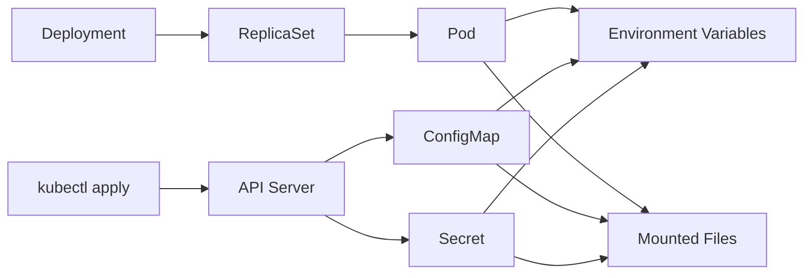

# 第 23 篇：ConfigMap、Secret 与配置管理 [C]

第 22 篇已经让 Todo API 具备了集群入口：Service 提供稳定访问，Traefik Ingress 和 Gateway API 负责把 HTTPS 流量转发到后端。现在还剩一个真实交付里绕不开的问题：应用到底以什么配置运行，敏感信息应该放在哪里，dev / test / prod 环境如何保持差异又不互相污染。

本篇特色项目是：**把 Todo API 的运行参数、JWT Secret 和管理员用户哈希迁移到 ConfigMap 与 Secret，并准备 dev / test / prod 三套配置骨架。**

## 1. 本章学习目标

### 1.1 知识目标

- 能解释 ConfigMap 和 Secret 的职责边界。
- 能说明环境变量注入、`envFrom`、`valueFrom` 和卷挂载的差异。
- 能区分 Secret 的 `Opaque`、`kubernetes.io/tls` 和 `kubernetes.io/dockerconfigjson` 类型。
- 能解释 ConfigMap / Secret 更新后，Pod 中环境变量和挂载文件的更新行为。
- 能说明为什么 Kubernetes Secret 不是“自动加密的保险箱”。
- 能理解 etcd 加密、Role-Based Access Control（RBAC）、Sealed Secrets、External Secrets 的使用边界。

### 1.2 技能目标

- 能为 Todo API 编写 ConfigMap 和 Secret YAML。
- 能把 Deployment 中硬编码的环境变量迁移到 ConfigMap / Secret。
- 能使用 `configMapKeyRef`、`secretKeyRef` 和 `envFrom` 注入配置。
- 能把 ConfigMap 作为文件挂载到 Pod，并验证文件更新。
- 能为 dev / test / prod 准备差异化配置。
- 能用 `kubectl describe`、`kubectl get`、`kubectl exec` 和 `rollout restart` 排查配置问题。

### 1.3 前置条件

开始本篇前，请确认你已经完成：

- 第 20 篇：本地 kind 集群 `todo-k8s` 可用。
- 第 21 篇：`todo-api:v0.1.0` 已部署为 Deployment，且 `todo-workloads` Namespace 存在。
- 第 22 篇：Todo API 已经可以通过 Service / Ingress / Gateway 访问。
- 第 14 篇：理解 `TODO_*` 环境变量、JWT Secret、管理员用户哈希和 `hash-password` 子命令。
- 第 16 篇：本地已经构建 `todo-api:v0.1.0` 镜像。
- 第 17 篇：理解容器如何通过环境变量读取配置。

本篇命令以 Linux / macOS / WSL2 Bash 为主。Windows 用户建议在 WSL2 Ubuntu 中完成实验；如果使用 PowerShell，请手动创建 YAML 文件，或把 heredoc 改写为 PowerShell here-string。

!!! warning "不要把本篇示例 Secret 复用到真实环境"
    文中的 JWT Secret、用户名和密码只用于本地教学。真实环境必须使用随机 Secret、受控密钥系统和最小权限 RBAC，不要把真实密码、Token、证书私钥或生产 DSN 提交到 Git。

## 2. 本章工作场景与真实案例

### 2.1 技术痛点

很多团队把服务部署到 Kubernetes 后，最先踩坑的不是镜像，也不是 Service，而是配置：

- Deployment YAML 里到处散落 `TODO_ENV`、`TODO_API_ADDR`、`TODO_JWT_SECRET`。
- dev / test / prod 三套环境靠手工改同一份 YAML，发布时很容易带错配置。
- JWT Secret、数据库密码、Redis 密码被提交到 Git 仓库。
- 修改 ConfigMap 后，以为 Pod 里的环境变量会自动变化，结果服务仍然使用旧配置。
- Secret 看起来只是 base64，团队误以为它已经安全加密。
- Ingress TLS Secret、应用 Secret、镜像拉取 Secret 混在一起，权限边界不清楚。

本篇会把这些问题收束成一条主线：**非敏感配置进入 ConfigMap，敏感配置进入 Secret，Deployment 只引用配置对象，不直接写配置值。**

### 2.2 团队协作场景

在真实团队里，配置通常由多个角色共同维护：

- 后端工程师定义应用需要哪些环境变量、配置文件和默认值。
- 平台工程师提供 ConfigMap / Secret 模板和多环境发布方式。
- SRE 负责配置变更的审计、回滚、重启策略和故障排查。
- 安全工程师审查 Secret 权限、etcd 加密、密钥轮换和泄露响应。
- 测试工程师在 test Namespace 中验证配置差异是否生效。

配置管理做得好，应用 YAML 会更稳定，环境差异会更可见，敏感信息也不会在仓库、日志和命令历史里到处扩散。

### 2.3 课程项目关联

阶段四正在把 Todo Platform 从“容器化服务”迁移到 Kubernetes 应用交付：

```text
第 20 篇：kind 集群和基础对象
第 21 篇：Todo API Deployment + Probe + HPA
第 22 篇：Service + Ingress + Gateway API
第 23 篇：ConfigMap + Secret 配置迁移
第 24 篇：PostgreSQL + PersistentVolumeClaim（PVC）持久化
```

第 21 篇为了降低难度，把部分配置直接写在 Deployment 中，并生成了一个本地 Secret。第 23 篇会把这些配置正式拆出来，为后续第 24 篇数据库 DSN、第 27 篇 Helm values、第 28 篇 Kustomize overlay 打好基础。

## 3. 核心概念

### 3.1 ConfigMap 是什么

ConfigMap 是 Kubernetes 中保存非敏感配置的对象。它适合放：

- 运行环境，例如 `TODO_ENV=dev`。
- 监听地址，例如 `TODO_API_ADDR=0.0.0.0:18080`。
- 日志级别，例如 `TODO_LOG_LEVEL=info`。
- Cross-Origin Resource Sharing（CORS）白名单、缓存 TTL、功能开关等非敏感参数。
- 配置文件内容，例如 `app.json`、`nginx.conf`、`runtime-notes.txt`。

ConfigMap 不适合放密码、Token、私钥、数据库 DSN 中的密码部分。ConfigMap 内容通常会被很多人读取，也经常进入 Git 仓库和审查流程。

### 3.2 Secret 是什么

Secret 是 Kubernetes 中保存敏感数据的对象。它适合放：

- JWT Secret。
- 管理员密码哈希。
- 数据库密码、Redis 密码。
- TLS 私钥。
- 私有镜像仓库认证信息。
- 第三方 API Token。

Secret 的内容默认以 base64 形式存储在对象里。base64 只是编码，不是加密。只要有读取 Secret 的权限，就可以还原原文。

常见 Secret 类型如下。

表 23-1 Secret 类型与用途：

| 类型 | 用途 | 本课程使用位置 |
|---|---|---|
| `Opaque` | 通用键值密钥 | Todo API 的 JWT Secret、用户哈希 |
| `kubernetes.io/tls` | TLS 证书和私钥 | 第 22 篇 Ingress / Gateway HTTPS |
| `kubernetes.io/dockerconfigjson` | 私有镜像仓库拉取凭据 | 后续生产镜像仓库场景 |

### 3.3 配置注入方式

Kubernetes 常见配置注入方式有四类。

表 23-2 配置注入方式对比：

| 方式 | 适合场景 | 是否自动进入环境变量 | 更新行为 |
|---|---|---|---|
| `env.value` | 少量固定值 | 是 | Pod 重建后才变 |
| `configMapKeyRef` / `secretKeyRef` | 精确引用某个 key | 是 | Pod 重建后才变 |
| `envFrom` | 整个 ConfigMap / Secret 都变成环境变量 | 是 | Pod 重建后才变 |
| `volumeMounts` | 配置文件、证书文件 | 否 | kubelet 会更新挂载文件，但应用是否重载取决于程序 |

重点记住：**环境变量不会因为 ConfigMap / Secret 更新而自动改变。** 如果应用通过环境变量读取配置，修改配置后通常需要重启 Pod。

### 3.4 多环境配置

多环境配置的目标不是把所有环境写成完全不同的 YAML，而是把共同部分和差异部分拆清楚。

Todo API 的配置可以这样划分：

| 配置项 | dev | test | prod | 放哪里 |
|---|---|---|---|---|
| `TODO_ENV` | `dev` | `test` | `prod` | ConfigMap |
| `TODO_API_ADDR` | `0.0.0.0:18080` | `0.0.0.0:18080` | `0.0.0.0:18080` | ConfigMap |
| `TODO_LOG_LEVEL` | `debug` | `info` | `info` | ConfigMap |
| `TODO_CORS_ALLOWED_ORIGINS` | 本地域名 | 测试域名 | 生产域名 | ConfigMap |
| `TODO_JWT_SECRET` | 本地实验值 | 测试随机值 | 生产随机值 | Secret |
| `TODO_AUTH_USERS` | 本地管理员 | 测试管理员 | 生产受控用户 | Secret |

本篇先手写三套目录。第 28 篇会用 Kustomize 管理 overlay，第 27 篇会从 Helm values 的角度再做一次模板化。

### 3.5 Secret 安全边界

Kubernetes Secret 的安全取决于一整套机制，而不是一个对象类型：

- API Server 权限：谁能 `get/list/watch` Secret。
- etcd 存储：是否开启静态加密。
- 日志与审计：是否把 Secret 原文写进日志。
- Git 流程：是否把真实 Secret 提交到仓库。
- 密钥轮换：Secret 泄露后如何替换并重启服务。
- 外部系统：是否使用 Sealed Secrets、External Secrets、Vault 或云厂商 Secret Manager。

Role-Based Access Control（RBAC）决定谁能通过 API Server 读取 Secret。即使开启了 etcd 静态加密，如果某个用户或 ServiceAccount 有 `get secrets` 权限，它仍然可以通过 Kubernetes API 读到解密后的内容。因此，etcd 加密解决的是“磁盘上如何保存”，RBAC 解决的是“谁能通过 API 读取”，二者不能互相替代。

Sealed Secrets 的典型工作流是：开发者在本地用集群公钥把明文 Secret 加密成 `SealedSecret`，把密文提交到 Git；集群内的 controller 用私钥解密并生成普通 Secret。它解决的是“Git 中不能保存明文 Secret”的问题，但生成后的普通 Secret 仍然要依赖 RBAC、审计和轮换策略保护。External Secrets 则通常从 Vault、云厂商 Secret Manager 等外部密钥系统同步 Secret 到集群。

本篇会用本地实验 Secret 讲清机制，但不会部署 Sealed Secrets controller。生产建议会放在第 7 节集中说明。

## 4. 原理深入

### 4.1 ConfigMap / Secret 到 Pod 的注入链路

图 23-1 配置注入链路：



Deployment 的 Pod template 引用了 ConfigMap / Secret。新的 Pod 被创建时，kubelet 会把这些对象里的数据注入容器环境变量，或者挂载成文件。

如果引用的 ConfigMap / Secret 不存在，Pod 通常会卡在 `CreateContainerConfigError`。这类错误优先看：

```bash
kubectl -n todo-workloads describe pod <pod-name>
kubectl -n todo-workloads get configmap
kubectl -n todo-workloads get secret
```

### 4.2 更新行为：环境变量与挂载文件不同

ConfigMap / Secret 更新后有两个不同结果：

- 通过环境变量注入的值：已经启动的容器不会自动改变。
- 通过卷挂载的文件：kubelet 会在一段时间后更新文件内容。

但是，文件更新不等于应用自动重新加载。应用如果只在启动时读取配置文件，即使文件变了，也需要重启进程或实现 reload 逻辑。

本篇实验会同时验证：

1. 修改 ConfigMap 文件内容后，Pod 内挂载文件会更新。
2. 修改 ConfigMap 环境变量后，Pod 中 `printenv` 看到的值不会变。
3. 执行 `kubectl rollout restart deployment/todo-api` 后，新 Pod 才会拿到新环境变量。

### 4.3 `envFrom` 和显式 key 引用的取舍

`envFrom` 很方便，能把整个 ConfigMap 或 Secret 的 key 全部变成环境变量：

```yaml
envFrom:
  - configMapRef:
      name: todo-api-config
  - secretRef:
      name: todo-api-auth
```

优点是简洁，缺点是边界不够显式。ConfigMap 中新增一个 key 后，它会自动进入容器环境变量。

显式 key 引用更啰嗦，但审查更清楚：

```yaml
env:
  - name: TODO_ENV
    valueFrom:
      configMapKeyRef:
        name: todo-api-config
        key: TODO_ENV
```

本篇主线使用 `envFrom`，因为 Todo API 的配置 key 都是 `TODO_*` 前缀，适合一次性注入。生产团队如果要求严格审查每个变量，可以改用显式 key 引用。

### 4.4 Secret 类型不是权限模型

Secret 类型告诉 Kubernetes 或周边组件“这个 Secret 的数据结构是什么”，但它不等于访问控制。

例如：

- `kubernetes.io/tls` 要求有 `tls.crt` 和 `tls.key`。
- `kubernetes.io/dockerconfigjson` 要求有 `.dockerconfigjson`。
- `Opaque` 对 key 名没有特殊要求。

真正控制谁能读取 Secret 的，是 RBAC、Namespace 边界、准入策略、审计和外部密钥系统。

### 4.5 配置变更触发 Pod 重启

Kubernetes 不会因为 ConfigMap / Secret 更新而自动重建 Deployment Pod。常见做法有三类：

1. 手动执行 `kubectl rollout restart deployment/todo-api`。
2. 修改 Pod template annotation，让 Deployment 产生新 ReplicaSet。
3. 使用 Helm / Kustomize / GitOps 工具生成配置 hash annotation。

本篇先使用最直接的 `rollout restart`。第 27 篇和第 28 篇会把这个动作模板化。

## 5. 手把手实验

### 5.1 实验目标

本实验会完成第 23 篇小项目：

- 创建 Todo API 的 ConfigMap，保存非敏感运行参数。
- 创建 Todo API 的 Secret，保存 JWT Secret 和管理员用户哈希。
- 修改 Deployment，让它通过 `envFrom` 引用 ConfigMap / Secret。
- 挂载一个 ConfigMap 文件，验证文件热更新。
- 准备 dev / test / prod 三套配置目录。
- 验证错误配置、缺失 Secret 和配置更新后的重启流程。

### 5.2 实验环境

| 工具 | 建议版本 | 用途 |
|---|---|---|
| Kubernetes | 1.36.x | 运行 Todo API |
| kind | 0.31.x | 本地 Kubernetes 集群 |
| kubectl | 1.36.x | 应用和排查 YAML |
| Docker | 29.x | 运行 `todo-api:v0.1.0` 生成密码哈希 |

确认当前集群与 Namespace：

```bash
kubectl config current-context
docker image inspect todo-api:v0.1.0 >/dev/null
kubectl get namespace todo-workloads
kubectl -n todo-workloads get deployment todo-api
kubectl -n todo-workloads get service todo-api
```

预期能看到本地镜像 `todo-api:v0.1.0`、`todo-workloads`、`todo-api` Deployment 和 Service。如果 Deployment 不存在，请先回到第 21 篇完成工作负载部署；如果镜像不存在，请先回到第 16 篇构建镜像，并按第 20 篇把镜像加载进 kind。

### 5.3 目录结构

本篇继续使用第 21 篇创建的 `deployments/k8s-base/`，并增加一个多环境示例目录：

```text
deployments/
└── k8s-base/
    ├── todo-api-configmap.yaml
    ├── todo-api-config-file.yaml
    ├── todo-api-secret.local.yaml
    ├── todo-api-deployment.yaml
    ├── todo-api-service.yaml
    └── environments/
        ├── dev/
        │   └── todo-api-configmap.yaml
        ├── test/
        │   └── todo-api-configmap.yaml
        └── prod/
            └── todo-api-configmap.yaml
```

创建目录：

```bash
mkdir -p deployments/k8s-base/environments/dev
mkdir -p deployments/k8s-base/environments/test
mkdir -p deployments/k8s-base/environments/prod
```

如果目录已经存在，命令不会破坏已有文件。

本篇会生成 `todo-api-secret.local.yaml` 作为本地实验 Secret。先确认本地仓库会忽略这类文件，避免误提交到 Git：

```bash
grep -Fq 'deployments/k8s-base/*.local.yaml' .gitignore 2>/dev/null || \
  printf '\ndeployments/k8s-base/*.local.yaml\n' >> .gitignore
git status --short
```

如果 `git status --short` 中已经出现 `todo-api-secret.local.yaml`，不要提交它。真实 Secret 一旦进入 Git 历史，即使后续删除文件，也应该按泄露处理并轮换密钥。

### 5.4 完整代码或配置

创建非敏感配置 `deployments/k8s-base/todo-api-configmap.yaml`：

```bash
cat > deployments/k8s-base/todo-api-configmap.yaml <<'YAML'
apiVersion: v1
kind: ConfigMap
metadata:
  name: todo-api-config
  namespace: todo-workloads
  labels:
    app.kubernetes.io/name: todo-api
    app.kubernetes.io/part-of: todo-platform
data:
  TODO_ENV: "dev"
  TODO_CONFIG_DIR: "/app/configs"
  TODO_API_ADDR: "0.0.0.0:18080"
  TODO_LOG_LEVEL: "info"
  TODO_CORS_ALLOWED_ORIGINS: "https://todo.localhost:18443,https://todo-gateway.localhost:18443"
  TODO_PPROF_ENABLED: "false"
  TODO_RELEASE: "chapter-23-config"
YAML
```

创建用于演示文件挂载和热更新的 ConfigMap `deployments/k8s-base/todo-api-config-file.yaml`：

```bash
cat > deployments/k8s-base/todo-api-config-file.yaml <<'YAML'
apiVersion: v1
kind: ConfigMap
metadata:
  name: todo-api-config-file
  namespace: todo-workloads
  labels:
    app.kubernetes.io/name: todo-api
    app.kubernetes.io/part-of: todo-platform
data:
  runtime-notes.txt: |
    config version: chapter-23-initial
    owner: platform-team
    purpose: demonstrate ConfigMap volume update
YAML
```

生成本地实验 Secret。这里复用第 14 篇的 `hash-password` 子命令，使用本地镜像生成管理员密码哈希：

```bash
HASH=$(docker run --rm todo-api:v0.1.0 hash-password "change-me-123")

kubectl -n todo-workloads create secret generic todo-api-auth \
  --from-literal=TODO_JWT_SECRET=0123456789abcdef0123456789abcdef \
  --from-literal=TODO_AUTH_USERS="admin=$HASH" \
  --dry-run=client -o yaml > deployments/k8s-base/todo-api-secret.local.yaml
```

!!! warning "本地 Secret 文件不要提交到公开仓库"
    `todo-api-secret.local.yaml` 包含 JWT Secret 和密码哈希，只服务于本地实验。真实团队通常不会把明文 Secret YAML 直接提交到 Git，而是使用 Sealed Secrets、External Secrets、Vault、云厂商 Secret Manager 或 GitOps 平台受控变量。

这里使用 `kubectl create secret --dry-run=client -o yaml` 生成 YAML，它会把值写入 `data` 字段并自动做 base64 编码。手写 Secret 时也可以使用 `stringData` 写明文，API Server 会在保存时转换成 `data`。例如：

```yaml
apiVersion: v1
kind: Secret
metadata:
  name: example
type: Opaque
stringData:
  username: admin
  password: local-demo-only
```

`stringData` 方便书写，但仍然是明文进入 YAML；它不能解决 Git 泄露问题。

更新 Todo API Deployment，让容器从 ConfigMap / Secret 注入环境变量，并挂载 `runtime-notes.txt`：

```bash
cat > deployments/k8s-base/todo-api-deployment.yaml <<'YAML'
apiVersion: apps/v1
kind: Deployment
metadata:
  name: todo-api
  namespace: todo-workloads
  labels:
    app.kubernetes.io/name: todo-api
    app.kubernetes.io/part-of: todo-platform
spec:
  replicas: 2
  revisionHistoryLimit: 5
  selector:
    matchLabels:
      app.kubernetes.io/name: todo-api
  strategy:
    type: RollingUpdate
    rollingUpdate:
      maxSurge: 1
      maxUnavailable: 0
  template:
    metadata:
      labels:
        app.kubernetes.io/name: todo-api
        app.kubernetes.io/part-of: todo-platform
    spec:
      containers:
        - name: todo-api
          image: todo-api:v0.1.0
          imagePullPolicy: IfNotPresent
          args: ["serve"]
          envFrom:
            - configMapRef:
                name: todo-api-config
            - secretRef:
                name: todo-api-auth
          ports:
            - name: http
              containerPort: 18080
          startupProbe:
            httpGet:
              path: /healthz
              port: http
            failureThreshold: 30
            periodSeconds: 2
          readinessProbe:
            httpGet:
              path: /readyz
              port: http
            initialDelaySeconds: 3
            periodSeconds: 5
          livenessProbe:
            httpGet:
              path: /healthz
              port: http
            initialDelaySeconds: 10
            periodSeconds: 10
          resources:
            requests:
              cpu: 50m
              memory: 64Mi
            limits:
              cpu: 500m
              memory: 256Mi
          volumeMounts:
            - name: runtime-config
              mountPath: /app/runtime-config
              readOnly: true
      volumes:
        - name: runtime-config
          configMap:
            name: todo-api-config-file
YAML
```

关键变化：

- `TODO_ENV`、`TODO_API_ADDR` 等非敏感配置来自 `todo-api-config`。
- `TODO_JWT_SECRET` 和 `TODO_AUTH_USERS` 来自 `todo-api-auth`。
- Deployment 不再直接写配置值。
- `runtime-config` 卷挂载 ConfigMap 文件，用来观察文件更新。

创建 dev / test / prod 三套配置示例。

dev 配置：

```bash
cat > deployments/k8s-base/environments/dev/todo-api-configmap.yaml <<'YAML'
apiVersion: v1
kind: ConfigMap
metadata:
  name: todo-api-config
  namespace: todo-workloads
data:
  TODO_ENV: "dev"
  TODO_CONFIG_DIR: "/app/configs"
  TODO_API_ADDR: "0.0.0.0:18080"
  TODO_LOG_LEVEL: "debug"
  TODO_CORS_ALLOWED_ORIGINS: "https://todo.localhost:18443,https://todo-gateway.localhost:18443"
  TODO_PPROF_ENABLED: "false"
  TODO_RELEASE: "chapter-23-dev"
YAML
```

test 配置：

```bash
cat > deployments/k8s-base/environments/test/todo-api-configmap.yaml <<'YAML'
apiVersion: v1
kind: ConfigMap
metadata:
  name: todo-api-config
  namespace: todo-workloads
data:
  TODO_ENV: "test"
  TODO_CONFIG_DIR: "/app/configs"
  TODO_API_ADDR: "0.0.0.0:18080"
  TODO_LOG_LEVEL: "info"
  TODO_CORS_ALLOWED_ORIGINS: "https://todo-test.localhost:18443"
  TODO_PPROF_ENABLED: "false"
  TODO_RELEASE: "chapter-23-test"
YAML
```

prod 配置：

```bash
cat > deployments/k8s-base/environments/prod/todo-api-configmap.yaml <<'YAML'
apiVersion: v1
kind: ConfigMap
metadata:
  name: todo-api-config
  namespace: todo-workloads
data:
  TODO_ENV: "prod"
  TODO_CONFIG_DIR: "/app/configs"
  TODO_API_ADDR: "0.0.0.0:18080"
  TODO_LOG_LEVEL: "info"
  TODO_CORS_ALLOWED_ORIGINS: "https://todo.example.com"
  TODO_PPROF_ENABLED: "false"
  TODO_RELEASE: "chapter-23-prod"
YAML
```

这三份文件暂时只是教学示例，本篇主线只应用根目录下的 `todo-api-configmap.yaml`。由于它们的对象名和 Namespace 都相同，直接 `kubectl apply -f environments/test/todo-api-configmap.yaml` 会覆盖当前 `todo-api-config`。第 28 篇会用 Kustomize 把这些差异整理成更标准的 overlay；如果你现在就想隔离验证，建议为 dev / test / prod 使用不同 Namespace。

### 5.5 应用配置

以下命令均在项目根目录执行，也就是包含 `deployments/` 目录的 `cloud-native-todo-platform/` 仓库根目录。

先用 server-side dry-run 让 API Server 检查 YAML。这样可以在真正修改集群前提前发现字段拼写、API 版本或对象格式错误：

```bash
kubectl apply --dry-run=server -f deployments/k8s-base/todo-api-configmap.yaml
kubectl apply --dry-run=server -f deployments/k8s-base/todo-api-config-file.yaml
kubectl apply --dry-run=server -f deployments/k8s-base/todo-api-secret.local.yaml
kubectl apply --dry-run=server -f deployments/k8s-base/todo-api-deployment.yaml
```

确认无误后应用 ConfigMap、Secret 和 Deployment：

```bash
kubectl apply -f deployments/k8s-base/todo-api-configmap.yaml
kubectl apply -f deployments/k8s-base/todo-api-config-file.yaml
kubectl apply -f deployments/k8s-base/todo-api-secret.local.yaml
kubectl apply -f deployments/k8s-base/todo-api-deployment.yaml
kubectl -n todo-workloads rollout status deployment/todo-api --timeout=180s
kubectl -n todo-workloads wait pod \
  -l app.kubernetes.io/name=todo-api \
  --for=condition=Ready \
  --timeout=180s
```

查看对象：

```bash
kubectl -n todo-workloads get configmap todo-api-config todo-api-config-file
kubectl -n todo-workloads get secret todo-api-auth
kubectl -n todo-workloads get pods -l app.kubernetes.io/name=todo-api
```

查看 Deployment 引用关系：

```bash
kubectl -n todo-workloads describe deployment todo-api
```

你应该能在输出中看到 `Environment Variables from` 类似信息，说明 Deployment 已经从 ConfigMap 和 Secret 注入环境变量。

### 5.6 验证配置生效

获取一个 Todo API Pod 名称：

```bash
kubectl -n todo-workloads wait pod \
  -l app.kubernetes.io/name=todo-api \
  --for=condition=Ready \
  --timeout=180s
POD="$(kubectl -n todo-workloads get pod \
  -l app.kubernetes.io/name=todo-api \
  --field-selector=status.phase=Running \
  -o jsonpath='{.items[0].metadata.name}')"
echo "$POD"
```

Deployment 配置了 `replicas: 2`，集群里通常会有两个 Running Pod。这里取第一个 Running Pod 做验证即可，本篇配置对两个副本的行为应该一致。如果 `kubectl wait` 超时，先执行 `kubectl -n todo-workloads get pods` 查看状态，再按第 6 节排查。

查看非敏感环境变量：

```bash
kubectl -n todo-workloads exec "$POD" -- printenv TODO_ENV
kubectl -n todo-workloads exec "$POD" -- printenv TODO_API_ADDR
kubectl -n todo-workloads exec "$POD" -- printenv TODO_RELEASE
```

预期输出类似：

```text
dev
0.0.0.0:18080
chapter-23-config
```

不要在日常排障中直接打印 Secret 值。本地实验可以只验证 key 存在：

```bash
kubectl -n todo-workloads exec "$POD" -- sh -c 'test -n "$TODO_JWT_SECRET" && echo "jwt secret exists"'
kubectl -n todo-workloads exec "$POD" -- sh -c 'test -n "$TODO_AUTH_USERS" && echo "auth users exists"'
```

查看挂载的 ConfigMap 文件：

```bash
kubectl -n todo-workloads exec "$POD" -- cat /app/runtime-config/runtime-notes.txt
```

预期输出包含：

```text
config version: chapter-23-initial
```

验证 API 仍然可访问：

```bash
kubectl -n todo-workloads port-forward service/todo-api 18082:80
```

另开一个终端执行：

```bash
curl -s http://127.0.0.1:18082/healthz
curl -s http://127.0.0.1:18082/readyz
```

验证完成后，在运行 `port-forward` 的终端按 `Ctrl+C` 终止端口转发。

### 5.7 验证 ConfigMap 文件更新

修改 `todo-api-config-file`：

```bash
kubectl -n todo-workloads patch configmap todo-api-config-file \
  --type merge \
  -p '{"data":{"runtime-notes.txt":"config version: chapter-23-updated\nowner: platform-team\npurpose: demonstrate ConfigMap volume update\n"}}'
```

等待 kubelet 同步挂载文件。通常几十秒内会更新，最慢可能需要一两分钟：

```bash
sleep 30
kubectl -n todo-workloads exec "$POD" -- cat /app/runtime-config/runtime-notes.txt
```

如果看到：

```text
config version: chapter-23-updated
```

说明 ConfigMap 作为卷挂载时，文件内容已经更新。

### 5.8 验证环境变量不会热更新

修改 `todo-api-config` 中的 `TODO_RELEASE`：

```bash
kubectl -n todo-workloads patch configmap todo-api-config \
  --type merge \
  -p '{"data":{"TODO_RELEASE":"chapter-23-env-updated"}}'
```

查看当前 Pod 中的环境变量：

```bash
kubectl -n todo-workloads exec "$POD" -- printenv TODO_RELEASE
```

你大概率仍然会看到旧值：

```text
chapter-23-config
```

这是正确现象。容器进程启动后，环境变量不会因为 ConfigMap 更新而改变。

重启 Deployment：

```bash
kubectl -n todo-workloads rollout restart deployment/todo-api
kubectl -n todo-workloads rollout status deployment/todo-api --timeout=180s
kubectl -n todo-workloads wait pod \
  -l app.kubernetes.io/name=todo-api \
  --for=condition=Ready \
  --timeout=180s
```

重新获取新 Pod 名称并验证：

```bash
POD="$(kubectl -n todo-workloads get pod \
  -l app.kubernetes.io/name=todo-api \
  --field-selector=status.phase=Running \
  -o jsonpath='{.items[0].metadata.name}')"
kubectl -n todo-workloads exec "$POD" -- printenv TODO_RELEASE
```

预期输出：

```text
chapter-23-env-updated
```

### 5.9 查看 Secret 但避免泄露

查看 Secret 元信息：

```bash
kubectl -n todo-workloads describe secret todo-api-auth
```

`describe` 会显示 key 名和大小，不会显示值。

下面命令会输出 base64 编码后的 Secret 数据：

```bash
kubectl -n todo-workloads get secret todo-api-auth -o yaml
```

不要把这类输出贴到 issue、聊天工具或日志系统里。base64 可以很容易还原，例如：

```bash
kubectl -n todo-workloads get secret todo-api-auth \
  -o jsonpath='{.data.TODO_JWT_SECRET}' | base64 -d
```

Linux 和 WSL2 通常使用 `base64 -d`；macOS 默认 `base64` 常用 `base64 -D`。如果命令报参数错误，换成：

```bash
kubectl -n todo-workloads get secret todo-api-auth \
  -o jsonpath='{.data.TODO_JWT_SECRET}' | base64 -D
```

本地实验看完即可，不要在共享环境中这样操作生产 Secret。

还可以检查当前身份是否有读取 Secret 的权限：

```bash
kubectl auth can-i get secrets -n todo-workloads
kubectl auth can-i list secrets -n todo-workloads
```

如果普通应用开发账号能随意 `list secrets`，生产环境就需要重新审查 RBAC。

### 5.10 了解其他 Secret 类型

第 22 篇已经用过 TLS Secret：

```bash
kubectl -n todo-workloads get secret todo-api-local-tls
kubectl -n todo-workloads describe secret todo-api-local-tls
```

私有镜像仓库通常使用 `dockerconfigjson` Secret。下面是命令形态示例，不要直接填真实凭据：

```bash
kubectl -n todo-workloads create secret docker-registry todo-registry-cred \
  --docker-server=registry.example.com \
  --docker-username='<username>' \
  --docker-password='<password>' \
  --docker-email='dev@example.com' \
  --dry-run=client -o yaml
```

Deployment 使用私有镜像时，会通过 `imagePullSecrets` 引用它：

```yaml
spec:
  imagePullSecrets:
    - name: todo-registry-cred
```

本篇不会真的接入私有仓库，第 29 篇 CI/CD 和镜像仓库章节会继续展开。

### 5.11 验证方法

完成实验后，可以用下面这组命令集中确认结果：

```bash
kubectl -n todo-workloads get configmap todo-api-config todo-api-config-file
kubectl -n todo-workloads get secret todo-api-auth
kubectl -n todo-workloads get deployment todo-api
kubectl -n todo-workloads wait pod \
  -l app.kubernetes.io/name=todo-api \
  --for=condition=Ready \
  --timeout=180s
kubectl -n todo-workloads describe deployment todo-api | grep -A6 "Environment Variables from"
kubectl auth can-i get secrets -n todo-workloads
```

判断标准：

- `todo-api-config` 和 `todo-api-config-file` 都存在。
- `todo-api-auth` 存在，`describe secret` 只显示 key 和大小，不直接显示值。
- `todo-api` Deployment 处于 Ready 状态。
- `Environment Variables from` 能看到 `todo-api-config` 和 `todo-api-auth`。
- Pod 内 `TODO_RELEASE` 在 rollout restart 后更新为 `chapter-23-env-updated`。
- `/healthz` 和 `/readyz` 通过 Service port-forward 返回成功。

预计耗时：90 分钟（动手操作约 60 分钟）。

### 5.12 清理步骤

如果继续学习第 24 篇，建议保留 `todo-workloads`、Todo API Deployment、Service、Ingress 和本篇 ConfigMap / Secret。第 24 篇会继续在这个 Namespace 中加入 PostgreSQL 和 PVC。

如果只想清理本篇新增对象，不要在 Deployment 仍引用它们时直接删除 ConfigMap / Secret。否则下一次 Pod 重建、扩容或滚动更新会因为缺少配置对象进入 `CreateContainerConfigError`。

安全清理有两种方式。

方式一：连同 Todo API 工作负载一起清理，适合结束本地实验：

```bash
kubectl -n todo-workloads delete deployment todo-api --ignore-not-found
kubectl delete -f deployments/k8s-base/todo-api-config-file.yaml --ignore-not-found
kubectl delete -f deployments/k8s-base/todo-api-configmap.yaml --ignore-not-found
kubectl delete -f deployments/k8s-base/todo-api-secret.local.yaml --ignore-not-found
```

方式二：如果要保留 Todo API Deployment，就先恢复第 21 篇的 Deployment 写法，确认新 Pod Ready 后，再清理本篇新增的 ConfigMap / Secret。不要让运行中的 Deployment 引用不存在的对象。

不要误删第 22 篇的 TLS Secret，除非你也准备清理入口层资源：

```bash
kubectl -n todo-workloads get secret
```

## 6. 常见错误与排障

### 错误 1：Pod 显示 `CreateContainerConfigError`

- **现象**：

  ```text
  todo-api-xxxxx   0/1   CreateContainerConfigError
  ```

- **常见原因**：Deployment 引用了不存在的 ConfigMap 或 Secret。
- **排查**：

  ```bash
  kubectl -n todo-workloads describe pod <pod-name>
  kubectl -n todo-workloads get configmap
  kubectl -n todo-workloads get secret
  ```

- **修复**：先创建缺失对象，再重启 Deployment。

  ```bash
  kubectl apply -f deployments/k8s-base/todo-api-configmap.yaml
  kubectl apply -f deployments/k8s-base/todo-api-secret.local.yaml
  kubectl -n todo-workloads rollout restart deployment/todo-api
  ```

### 错误 2：ConfigMap 改了，应用配置没变

- **现象**：`kubectl get configmap` 已经显示新值，但 API 行为没有变化。
- **原因**：应用通过环境变量读取配置，环境变量不会热更新。
- **排查**：

  ```bash
  kubectl -n todo-workloads exec <pod-name> -- printenv TODO_RELEASE
  ```

- **修复**：

  ```bash
  kubectl -n todo-workloads rollout restart deployment/todo-api
  kubectl -n todo-workloads rollout status deployment/todo-api
  ```

### 错误 3：挂载文件长时间没有更新

- **现象**：ConfigMap 已更新，但 Pod 内文件仍是旧内容。
- **原因**：kubelet 同步有延迟；使用 `subPath` 挂载单个文件时不会获得同样的自动更新行为；Pod 可能已经重建。
- **排查**：

  ```bash
  kubectl -n todo-workloads get configmap todo-api-config-file -o yaml
  kubectl -n todo-workloads exec <pod-name> -- ls -l /app/runtime-config
  kubectl -n todo-workloads exec <pod-name> -- cat /app/runtime-config/runtime-notes.txt
  ```

- **修复**：等待同步，或重启 Pod。需要热更新的配置尽量挂载整个 ConfigMap 目录，不要用 `subPath`。

### 错误 4：Secret 中的 bcrypt 哈希被 Shell 展开破坏

- **现象**：登录一直失败，日志提示认证失败。
- **原因**：bcrypt 哈希包含 `$`，如果没有正确引用，Shell 可能把它当成变量展开。
- **排查**：

  ```bash
  kubectl -n todo-workloads get secret todo-api-auth -o jsonpath='{.data.TODO_AUTH_USERS}' | base64 -d
  ```

- **修复**：生成 Secret 时用双引号包住整体，并确认 `HASH` 变量已经正确生成。

  ```bash
  HASH=$(docker run --rm todo-api:v0.1.0 hash-password "change-me-123")
  kubectl -n todo-workloads create secret generic todo-api-auth \
    --from-literal=TODO_AUTH_USERS="admin=$HASH" \
    --dry-run=client -o yaml
  ```

### 错误 5：把 Secret 提交到了 Git

- **现象**：PR 中出现 `todo-api-secret.local.yaml` 或真实 Secret。
- **原因**：本地实验文件没有被忽略，或团队没有建立 Secret 提交检查。
- **修复**：如果尚未 push，先从提交中移除 Secret，再重新提交不含 Secret 的版本；如果已经 push，先轮换密钥，再用 `git revert` 或联系仓库管理员清理历史。已经进入 Git 历史的 Secret 应按泄露处理，因为有权限读取历史的人仍可能拿到原值。
- **预防**：生产使用 Sealed Secrets、External Secrets 或 CI/CD Secret 注入，不提交明文 Secret。

## 7. 生产环境注意事项

1. **Secret 不是自动安全的。** Secret 默认只是 base64 编码。必须配合 RBAC、etcd 静态加密、审计、最小权限和密钥轮换，才能形成生产级安全边界。

2. **不要把真实 Secret 放进 Git。** Git 历史很难彻底清理，公开仓库更是高风险。生产 Secret 应由受控系统注入，例如 External Secrets、Vault、云厂商 Secret Manager 或 GitOps 平台的密钥功能。

3. **配置变更要有发布策略。** 修改 ConfigMap 不等于应用生效。团队要约定哪些配置可以通过文件热更新，哪些配置必须滚动重启，哪些配置必须走完整发布审批。

4. **多环境差异要最小化。** dev / test / prod 应尽量共享 Deployment 结构，只让域名、日志级别、副本数、资源、Secret 引用等必要字段不同。第 28 篇会用 Kustomize 进一步整理。

5. **敏感日志要脱敏。** 不要在 `kubectl logs`、应用日志、审计日志或错误响应里打印 JWT Secret、Authorization Header、数据库密码、Redis 密码和完整 DSN。

6. **Secret 轮换要演练。** JWT Secret 泄露后，需要替换 Secret、重启应用、让旧 Token 失效，并通知相关调用方。数据库密码和镜像拉取凭据也要有类似轮换流程。

7. **ConfigMap / Secret 不适合存大文件。** 它们是 Kubernetes API 对象，不是配置文件仓库或对象存储。大体积配置、二进制文件、模型文件应放到镜像、对象存储、PVC 或专门配置系统中。
   实践中应把单个 ConfigMap / Secret 控制在较小范围内，避免接近 API Server 和 etcd 对单个对象大小的限制。需要保存大文件时，应优先考虑镜像、PersistentVolumeClaim、对象存储或专门配置系统。

8. **稳定配置可以考虑 `immutable: true`。** 对很少变化的 ConfigMap / Secret，设置 immutable 可以减少误改和 kubelet watch 压力。但一旦设置后不能原地修改，只能删除重建，因此不适合频繁变化的运行参数。

## 8. 本章小项目

本章小项目是：**Todo API ConfigMap / Secret 配置迁移**。

### 8.1 项目产出

- `deployments/k8s-base/todo-api-configmap.yaml`：Todo API 非敏感运行配置。
- `deployments/k8s-base/todo-api-config-file.yaml`：用于演示文件挂载更新的 ConfigMap。
- `deployments/k8s-base/todo-api-secret.local.yaml`：本地实验 Secret，不提交公开仓库。
- `deployments/k8s-base/todo-api-deployment.yaml`：引用 ConfigMap / Secret 的 Deployment。
- `deployments/k8s-base/environments/dev/test/prod/`：三套环境配置示例。

### 8.2 验收标准

基础验收：

- `kubectl -n todo-workloads get configmap todo-api-config` 成功。
- `kubectl -n todo-workloads get secret todo-api-auth` 成功。
- `todo-api` Deployment 处于 Ready 状态。
- Pod 中 `TODO_ENV`、`TODO_API_ADDR`、`TODO_RELEASE` 来自 ConfigMap。
- Pod 中 JWT Secret 和管理员用户配置来自 Secret。
- `curl http://127.0.0.1:18082/readyz` 返回成功。

进阶验收：

- 修改 `todo-api-config-file` 后，Pod 内挂载文件能看到新内容。
- 修改 `TODO_RELEASE` 后，旧 Pod 环境变量不变；执行 `rollout restart` 后新 Pod 获得新值。
- 能解释 `Opaque`、`tls`、`dockerconfigjson` 三类 Secret 的用途。
- 能说清为什么 base64 不是加密。
- 能使用 `kubectl auth can-i get secrets -n todo-workloads` 检查 Secret 读取权限。
- 能写出 dev / test / prod 配置差异表。

## 9. 本章练习题

基础题：

1. ConfigMap 和 Secret 的职责边界是什么？
2. 为什么 Secret 的 base64 不是加密？
3. `envFrom` 和 `configMapKeyRef` 有什么区别？
4. ConfigMap 作为环境变量和作为卷挂载时，更新行为有什么不同？
5. TLS Secret 为什么通常和 Ingress / Gateway 放在同一个 Namespace？

实操题：

1. 把 `TODO_LOG_LEVEL` 从 `info` 改成 `debug`，观察旧 Pod 环境变量不变，重启后新 Pod 生效。
2. 新增一个 ConfigMap key：`TODO_FEATURE_EXPERIMENTAL=true`，通过 `envFrom` 注入后验证 Pod 中能看到该变量。
3. 故意删除 `todo-api-auth` Secret，重启 Deployment，观察 Pod 错误；再恢复 Secret 并让服务 Ready。
4. 创建一个 `test` 版本 ConfigMap，并把 `TODO_ENV` 切换为 `test`，通过 rollout restart 验证生效。

思考题：

1. 如果生产环境要求 Secret 每 90 天轮换一次，你会如何设计流程，避免服务中断？
2. 如果多个团队共用一个集群，谁应该有读取 Secret 的权限？应用开发、SRE、CI/CD 系统、Ingress Controller 的权限边界有什么不同？
3. 如果配置文件热更新后应用没有重新加载，你会选择改应用支持 reload，还是统一滚动重启？为什么？

## 10. 本章面试题

### 面试题 1：ConfigMap 和 Secret 的区别是什么？

**一句话结论**：ConfigMap 保存非敏感配置，Secret 保存敏感配置，但 Secret 的安全还依赖 RBAC、etcd 加密和密钥管理流程。

**展开解释**：ConfigMap 适合运行环境、日志级别、功能开关、配置文件模板等内容。Secret 适合密码、Token、私钥、JWT Secret、镜像拉取凭据等敏感数据。Secret 默认是 base64 编码，不等于加密，拥有读取权限的人可以还原原文。

**深入追问**：生产环境应限制 Secret 读取权限，开启 etcd 加密，避免把 Secret 打进日志或 Git，并建立密钥轮换流程。

### 面试题 2：ConfigMap 更新后，Pod 会自动使用新配置吗？

**一句话结论**：不一定。环境变量不会热更新，卷挂载文件会更新，但应用是否重新加载取决于程序实现。

**展开解释**：容器启动时环境变量已经固定，ConfigMap / Secret 后续变化不会改变进程环境。通过 volume 挂载的 ConfigMap 文件会由 kubelet 周期性更新，但如果应用只在启动时读取文件，仍然需要重启应用。

**深入追问**：常见做法是在配置变化后触发 Deployment 滚动重启，或者用 Helm / Kustomize 生成配置 hash annotation，让 Pod template 变化并产生新 ReplicaSet。

### 面试题 3：`envFrom` 有什么风险？

**一句话结论**：`envFrom` 简洁，但会把对象里的所有 key 都注入容器，配置边界不如逐项引用清晰。

**展开解释**：如果 ConfigMap 中新增了一个 key，使用 `envFrom` 的容器会自动得到这个环境变量。对于统一前缀、同一应用专用的配置对象，这很方便；对于共享 ConfigMap 或敏感边界严格的团队，逐项 `configMapKeyRef` / `secretKeyRef` 更容易审查。

**深入追问**：生产中可以约定每个 ConfigMap 只服务一个应用，并用命名规范、代码评审和策略工具限制配置扩散。

### 面试题 4：Kubernetes Secret 如何做生产加固？

**一句话结论**：用最小权限 RBAC 控制读取，开启 etcd 静态加密，避免明文入 Git，并接入外部密钥管理和轮换流程。

**展开解释**：Secret 对象本身不是完整安全方案。需要限制谁能 `get/list/watch` Secret，避免管理员之外的角色批量读取；etcd 存储层应启用 encryption at rest；GitOps 场景应使用 Sealed Secrets 或 External Secrets；应用日志和审计日志必须脱敏。

**深入追问**：Secret 轮换要考虑应用是否支持多密钥、旧 Token 失效策略、滚动重启顺序和回滚风险。

### 面试题 5：镜像拉取 Secret 和应用 Secret 有什么区别？

**一句话结论**：镜像拉取 Secret 给 kubelet 拉镜像使用，应用 Secret 注入容器给应用进程使用。

**展开解释**：`kubernetes.io/dockerconfigjson` Secret 通常通过 `imagePullSecrets` 引用，作用在 Pod 拉取私有镜像阶段。应用 Secret 例如 `TODO_JWT_SECRET` 通过环境变量或文件挂载进入容器，被业务进程读取。二者的读取者、权限边界和泄露影响不同。

**深入追问**：生产中镜像拉取 Secret 可以绑定到 ServiceAccount，应用 Secret 则应按 Namespace 和应用拆分，避免一个应用读取另一个应用的密钥。

## 11. 本章总结

本篇把 Todo API 的 Kubernetes 部署从“Deployment 里直接写配置值”推进到“ConfigMap / Secret 管理配置来源”。你学习了 ConfigMap 与 Secret 的职责边界，掌握了 `envFrom`、`configMapKeyRef`、`secretKeyRef` 和卷挂载的用法，也验证了环境变量和挂载文件在配置更新时的不同表现。

项目成果上，你新增了 Todo API 的非敏感 ConfigMap、本地实验 Secret、文件挂载 ConfigMap，以及 dev / test / prod 三套配置示例。现在 Deployment 更接近真实团队写法：镜像和运行策略留在工作负载对象里，运行参数和敏感数据由独立配置对象提供。

能力价值上，你已经能排查 Kubernetes 配置类故障：对象缺失、key 写错、Secret 引用失败、配置更新不生效、base64 误解和权限边界不清。这些问题在生产集群里非常常见，也是 Kubernetes 应用交付的核心能力。

## 12. 下一章衔接

第 24 篇会进入 Kubernetes 存储，把 PostgreSQL 迁移进集群，并用 PVC 保存数据库数据。本篇的 ConfigMap / Secret 会直接被下一章复用：数据库用户名、密码、数据库名、连接地址会进入 Secret 和 ConfigMap；PostgreSQL Pod 会依赖 PVC；Todo API 会通过配置切换到集群内数据库。

也就是说，第 23 篇解决“应用以什么参数运行、密钥从哪里来”，第 24 篇解决“有状态数据放在哪里、Pod 重建后如何保留”。两篇合在一起，才是 Todo Platform 在 Kubernetes 中从无状态 API 走向完整后端系统的关键一步。
