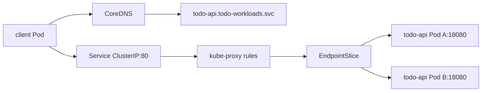
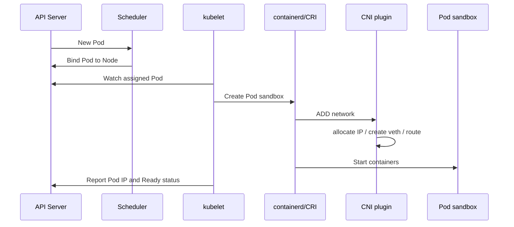
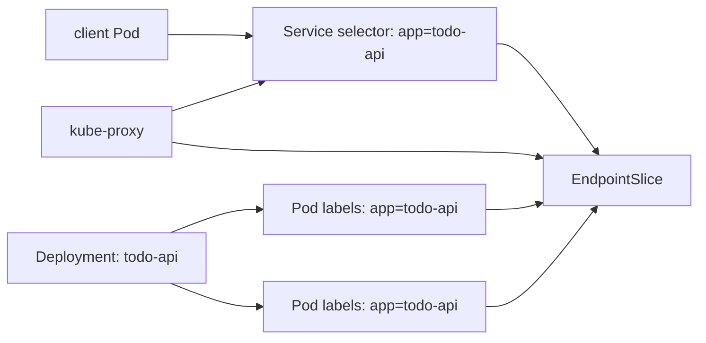
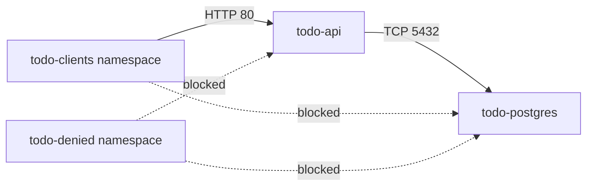

# 第 25 篇：Kubernetes 网络原理

第 24 篇把 Todo Platform 的 PostgreSQL 放进了 Kubernetes，并让 Todo API 通过 `todo-postgres.todo-workloads.svc.cluster.local` 访问数据库。到这里，平台已经有了真实的服务间调用链路：客户端访问 Todo API，Todo API 再访问 PostgreSQL。下一类真实问题也随之出现：DNS 为什么能解析，Service 为什么能把流量转到 Pod，网络策略为什么能拦住未授权访问。

本篇特色项目是：**为 Todo Platform 设计网络访问路径和 Namespace 隔离策略，验证 NetworkPolicy 拒绝非授权流量。**

## 1. 本章学习目标

### 1.1 知识目标

- 能解释 Kubernetes 网络模型中的 Pod IP、Service IP、Node IP 和 Ingress 入口之间的关系。
- 能说明 Container Network Interface（CNI，容器网络接口）插件在 Pod 网络中的职责。
- 能描述 CoreDNS 如何把 Service 名称解析为集群内访问地址。
- 能解释 kube-proxy iptables 模式下 Service 转发的大致链路。
- 能说明 kube-proxy IPVS 模式的 deprecated 状态，以及 nftables 为什么是新集群更推荐的演进方向。
- 能解释 NetworkPolicy 的默认放行、默认拒绝、入口流量和出口流量边界。

### 1.2 技能目标

- 能用 `kubectl get pod -o wide`、EndpointSlice、CoreDNS 日志和临时客户端排查 Pod 到 Service 的链路。
- 能创建一个支持 NetworkPolicy 的 kind 网络实验集群。
- 能编写 Namespace 级别的默认拒绝策略和按标签放行策略。
- 能验证 Todo API 允许授权客户端访问，同时拒绝非授权 Namespace 的流量。
- 能定位 DNS 解析失败、Service 没有 Endpoints、NetworkPolicy 误拦截等常见问题。

### 1.3 前置条件

开始本篇前，请确认你已经完成：

- 第 20 篇：理解控制面、Node、kubelet、kube-proxy 和 CNI 插件的位置。
- 第 21 篇：理解 Pod、Deployment、Probe、Job 和 Namespace。
- 第 22 篇：理解 Service、Ingress、Gateway API 与 Todo API 入口。
- 第 23 篇：理解 ConfigMap / Secret 对 Todo API 配置的影响。
- 第 24 篇：理解 `todo-api -> todo-postgres` 的服务间访问链路。

本篇会创建一个临时 kind 集群 `todo-network-lab` 来验证 NetworkPolicy。这样做是为了避免修改第 20-24 篇使用的主集群 `todo-k8s`。实验结束后可以直接删除临时集群。

本篇命令以 Linux / macOS / Windows Subsystem for Linux 2（WSL2，Windows 的 Linux 子系统）中的 Bash 为主。Windows PowerShell 用户需要按页面给出的文件名和内容手动创建 YAML 文件。

!!! warning "NetworkPolicy 需要 CNI 插件支持"
    Kubernetes API Server 可以保存 NetworkPolicy 对象，但是否真正拦截流量取决于 CNI 插件。kind 默认网络插件不负责执行 NetworkPolicy。本篇会在临时集群中安装 Calico，用它验证网络隔离效果。

## 2. 本章工作场景与真实案例

### 2.1 技术痛点

Kubernetes 网络故障经常看起来像“应用坏了”，但根因可能在完全不同的位置：

- Pod 有 IP，但不同 Pod 之间不通。
- Service 存在，但没有 Endpoints 或 EndpointSlice。
- `curl todo-api` 失败，其实是 DNS 解析失败。
- Ingress 返回 502，后端 Service selector 写错。
- API 连接 PostgreSQL 超时，可能是 NetworkPolicy 拦截。
- 团队创建了 NetworkPolicy，却发现默认 kind 集群根本没有执行策略。
- 旧集群使用 kube-proxy IPVS 模式，新集群文档却只讲 iptables，排障语言对不上。

本篇把这些问题拆成三条链路：**地址从哪里来、名字如何解析、流量如何转发与拦截。**

### 2.2 团队协作场景

真实团队里，Kubernetes 网络通常由多类角色协作：

- 后端工程师声明服务端口、健康检查路径和服务间调用地址。
- 平台工程师选择 CNI 插件、配置 Pod 网段、Service 网段和 kube-proxy 模式。
- Site Reliability Engineer（SRE，站点可靠性工程师）排查 DNS、Service、EndpointSlice、iptables 和 NetworkPolicy。
- 安全工程师制定服务间最小访问策略，限制数据库、管理端口和跨 Namespace 访问。
- 测试工程师用临时客户端验证 dev / test / prod 的网络策略是否符合预期。

网络策略不是“最后加一道锁”这么简单。它要求团队先讲清哪些服务应该互通，哪些服务必须隔离，否则策略很容易误伤业务流量。

### 2.3 Todo 平台模拟案例

> Todo 平台需要明确访问边界：授权客户端可以访问 Todo API，Todo API 可以访问 PostgreSQL，其他 Namespace 不能直接访问数据库。你需要把这张访问矩阵翻译成 DNS 验证、Service 访问和 NetworkPolicy。

这个案例关注集群网络的可解释性：允许什么、拒绝什么、如何证明策略生效，都要能用命令验证。
## 3. 核心概念

### 3.1 Kubernetes 网络模型

Kubernetes 网络模型的基础假设是：每个 Pod 都有独立 Pod IP，集群内 Pod 之间可以直接通信，不需要手工做 Network Address Translation（NAT，网络地址转换）。

表 25-1 Kubernetes 常见地址类型：

| 地址类型 | 示例 | 谁使用 | 是否稳定 |
|---|---|---|---|
| Pod IP | `192.168.1.23` | Pod 直接通信、EndpointSlice | 不稳定，Pod 重建会变化 |
| Service ClusterIP | `10.96.12.34` | 集群内客户端 | 稳定，跟随 Service 生命周期 |
| Node IP | `172.18.0.2` | kubelet、NodePort、节点间通信 | 相对稳定，跟随节点 |
| Ingress / Gateway 地址 | `127.0.0.1:18443` 或云负载均衡 IP | 集群外客户端 | 由入口层决定 |

Pod IP 不适合写进配置，因为 Pod 会重建。Service 提供稳定名字和稳定虚拟 IP，客户端应该访问 Service，而不是直接访问某个 Pod。

### 3.2 CNI 插件

CNI 是 Kubernetes 调用网络插件的标准接口。kubelet 创建 Pod sandbox 时，会调用容器运行时，容器运行时再通过 CNI 插件为 Pod 创建网络接口、分配 IP、配置路由。

常见 CNI 实现如下。

表 25-2 常见 CNI 插件对比：

| 插件 | 典型特点 | 是否支持 NetworkPolicy | 适合场景 | 本篇使用方式 |
|---|---|---|---|---|
| Flannel | 简单、轻量，关注 Pod 连通 | 通常不执行 Kubernetes NetworkPolicy | 学习环境、小集群基础网络 | 只做认知对比 |
| Calico | 成熟网络策略、BGP / VXLAN 模式、排障资料丰富 | 支持 | 通用生产集群、网络隔离教学 | 本篇实操 |
| Cilium | 基于 eBPF，支持高级观测和安全能力 | 支持 | 高性能、可观测性、安全策略复杂的集群 | 只做认知对比 |
| kindnet | kind 默认轻量网络 | 不执行 NetworkPolicy | 本地快速学习集群 | 说明为什么不用它验证 NetworkPolicy |

本篇选择 Calico 做 NetworkPolicy 实验，因为它对 Kubernetes NetworkPolicy 支持成熟，教学成本适中。

### 3.3 CoreDNS 与服务发现

CoreDNS 是 Kubernetes 默认 DNS 服务。它把 Service、Pod 等对象转换为集群内可解析的名称。

常见 Service DNS 格式：

```text linenums="0"
<service-name>.<namespace>.svc.cluster.local
```

例如第 24 篇中 Todo API 访问 PostgreSQL 的地址是：

```text linenums="0"
todo-postgres.todo-workloads.svc.cluster.local
```

在同一个 Namespace 中，可以简写成 `todo-postgres`；跨 Namespace 访问时，建议写完整名称，减少歧义。

### 3.4 Service、EndpointSlice 与 kube-proxy

Service 本身不是代理进程。它是一组规则：用 selector 找到后端 Pod，把稳定的 ClusterIP 和端口映射到后端 Endpoint。

EndpointSlice 保存 Service 当前后端 Pod 的 IP 和端口。kube-proxy 观察 Service 与 EndpointSlice，然后在节点上维护转发规则。

图 25-1 Pod 到 Service 的转发链路：



排查 Service 不通时，不要只看 Service。要一起看 Service selector、EndpointSlice、Pod readiness 和 kube-proxy 规则。

### 3.5 kube-proxy iptables 模式

kube-proxy 的职责是让 Service 虚拟 IP 能转发到后端 Pod。iptables 模式会在节点上维护一组 `KUBE-SVC-*`、`KUBE-SEP-*` 等链，把目标是 ClusterIP 的流量转发到后端 Endpoint。

你不需要背 iptables 链名，但要理解这条路径：

```text linenums="0"
Pod 发起请求 -> 目标是 Service ClusterIP -> 节点网络栈匹配 kube-proxy 规则 -> DNAT 到某个后端 Pod IP
```

Destination NAT（DNAT，目标地址转换）意味着客户端看起来访问的是 Service，实际包会被改写到某个后端 Pod。

### 3.6 kube-proxy IPVS 模式为什么只了解

IP Virtual Server（IPVS，IP 虚拟服务器）曾经是 kube-proxy 的一种高性能实现方式，很多旧集群仍然使用。Kubernetes 官方文档从 v1.35 起已经把 IPVS proxy mode 标记为 deprecated，并明确推荐用 nftables 作为更现代的替代方向。本篇不再把 IPVS 作为实操路径；你只需要知道旧集群排障中可能会看到 `ipvsadm`、虚拟服务和真实服务器这类概念。

如果你接手旧集群，看到 kube-proxy 配置里还有 `mode: ipvs`，排障时要查该集群的 Kubernetes 版本、发行版文档和升级计划。不要简单把它理解成“已经从所有集群消失”，更准确的说法是：它已经进入弃用路径，新建集群不应优先选择它。

本章不要求也不建议在实验集群中配置或验证 IPVS。这里保留 IPVS 背景，是为了让你接手旧集群时能听懂历史排障语言，并知道新集群应优先关注 iptables / nftables 这类当前主线模式。

### 3.7 NetworkPolicy

NetworkPolicy 是 Kubernetes 中声明 Pod 网络访问边界的对象。它通过 Pod label、Namespace label、端口和方向来表达允许哪些流量。

NetworkPolicy 有两个非常重要的默认行为：

- 如果某个 Pod 没有被任何 NetworkPolicy 选中，它默认允许所有入口和出口流量。
- 一旦某个 Pod 被某个 `Ingress` 或 `Egress` 策略选中，对应方向就变成“只允许策略明确放行的流量”。

最小默认拒绝入口策略如下：

```yaml linenums="0"
apiVersion: networking.k8s.io/v1
kind: NetworkPolicy
metadata:
  name: default-deny-ingress
  namespace: todo-workloads
spec:
  podSelector: {} # ← 选中该 Namespace 内所有 Pod
  policyTypes:
    - Ingress # ← 只限制入口流量，出口流量仍按默认规则
```

NetworkPolicy 是“允许列表”模型，不是“拒绝某个来源”的黑名单模型。

## 4. 原理深入

### 4.1 Pod 创建时网络如何建立

Pod 不是容器进程自己拿到 IP，而是在 Pod sandbox 创建阶段由网络插件完成配置。

图 25-2 Pod 网络创建流程：



因此，Pod 卡在 `ContainerCreating` 时，除了看镜像拉取，还要看 CNI 是否安装成功、节点网络接口是否正常、CNI DaemonSet 是否 Ready。

### 4.2 DNS 查询链路

Pod 内的 `/etc/resolv.conf` 通常指向集群 DNS Service。应用访问 `todo-postgres` 时，glibc 或 Go resolver 会按 search domain 尝试补全名称，最终查询 CoreDNS。

典型查询路径是：

```text linenums="0"
todo-postgres
todo-postgres.todo-workloads.svc.cluster.local
CoreDNS 查询 Kubernetes API 缓存
返回 Service ClusterIP
```

DNS 故障排查要同时看三件事：Pod 内 `/etc/resolv.conf`、CoreDNS Pod 状态、目标 Service 是否存在。

### 4.3 Service 转发与 EndpointSlice

Service selector 选中 Ready 的 Pod 后，控制器会维护 EndpointSlice。kube-proxy 不直接问 Deployment，它只关心 Service 和 EndpointSlice。

图 25-3 Service、EndpointSlice 与 Pod 的关系：



如果 Service selector 写错，Service 仍然存在，但 EndpointSlice 为空。客户端会看到连接失败、超时或 503，具体表现取决于访问路径。

### 4.4 NetworkPolicy 如何判定流量

NetworkPolicy 判定时会看“目标 Pod 是否被策略选中”和“来源是否匹配允许规则”。以 Todo Platform 为例：

- `todo-api` 应允许来自授权客户端 Namespace 的 HTTP 请求。
- `todo-postgres` 只应允许来自 `todo-api` Pod 的 5432 端口请求。
- 其它 Namespace 不应该直接访问 `todo-postgres`。

图 25-4 Todo Platform 网络隔离策略：



NetworkPolicy 是 Namespace 内对象。它不能跨 Namespace “保护所有东西”，需要在每个需要隔离的 Namespace 中声明。

## 5. 手把手实验

预计耗时：100 分钟（动手操作约 70 分钟）。

### 5.1 实验目标

本实验要完成：创建一个支持 NetworkPolicy 的临时 kind 集群，部署 Todo Platform 网络实验对象，观察 DNS、Service、EndpointSlice、kube-proxy 转发线索，并验证 NetworkPolicy 拒绝非授权流量。

### 5.2 实验环境

表 25-3 实验环境版本：

| 项目 | 版本 | 说明 |
|---|---|---|
| Kubernetes | 临时集群实际 v1.35.0，1.36.x 可选覆盖 | 本章网络策略实验不依赖 1.36 专属特性 |
| kubectl | 与 API Server 相差不超过 1 个小版本 | 访问临时实验集群并执行排障命令 |
| kind | 0.31.x | 创建临时网络实验集群 |
| Docker Engine | 29.x | 运行 kind 节点和加载镜像 |
| kind 节点镜像 | `registry.cn-guangzhou.aliyuncs.com/yleoer/node:v1.35.0@sha256:452d707d4862f52530247495d180205e029056831160e22870e37e3f6c1ac31f` | kind 0.31.0 官方 release 推荐镜像；临时实验集群实际 Kubernetes 版本为 1.35.0 |
| Calico | 3.32.0 | 提供 CNI 和 NetworkPolicy 执行能力 |
| Alpine | 3.23 | 运行轻量 HTTP / TCP 测试容器，2026-05-28 已验证 tag 可用 |

本篇使用临时集群 `todo-network-lab`。如果你已经在第 20-24 篇的主集群 `todo-k8s` 中运行 Todo Platform，不要直接修改主集群 CNI。临时集群里的 Namespace、Pod、Service 和 NetworkPolicy 都只服务本篇实验，删除 `todo-network-lab` 不会影响主集群中的 PostgreSQL、Todo API 或入口资源。

为保证可复现，本篇临时使用 kind 0.31.0 官方 release 明确列出的 `registry.cn-guangzhou.aliyuncs.com/yleoer/node:v1.35.0` 镜像，并 pin digest。第 25 篇实验只验证标准 DNS、Service、kube-proxy 线索和 NetworkPolicy 行为，不依赖 Kubernetes 1.36 专属特性。kind 发布 1.36.x 节点镜像后，可以把下面配置中的 `image` 行替换为对应的 1.36.x 官方镜像和 digest。

Calico 安装命令会访问 `raw.githubusercontent.com`。发布前已验证 Calico 3.32.0 的 `tigera-operator.yaml` 和 `custom-resources.yaml` 可下载，且官方 custom resources 中仍包含 `APIServer` 自定义资源。如果网络无法访问，请提前从 Calico 官方仓库下载对应 manifest，或使用团队可信镜像源；不要从来源不明的第三方链接复制安装清单。

Ubuntu 24.04 上如果 `fs.inotify.max_user_instances` 过低，Calico 或 kind 节点内组件可能出现 `Too many open files` 一类错误。创建临时集群前先检查宿主机 inotify 限制：

```bash
sysctl fs.inotify.max_user_instances fs.inotify.max_user_watches
sudo sysctl -w fs.inotify.max_user_instances=1024
```

临时集群会额外占用本机磁盘空间，主要来自 kind 节点镜像、Calico 镜像和 Alpine 镜像，建议预留 2-3 GB。如果本机同时保留多个 kind 集群，实验前可以用 `kind get clusters` 和 `docker system df` 观察空间占用。

确认本地工具版本：

```bash linenums="0"
docker version
kind version
kubectl version
```

准备 Alpine 镜像，避免实验时因为网络问题拉取失败：

```bash linenums="0"
docker pull registry.cn-guangzhou.aliyuncs.com/yleoer/alpine:3.23
```

### 5.3 文件目录结构

以下命令均在项目根目录执行。

创建本篇实验目录：

```bash linenums="0"
mkdir -p deployments/k8s-network/manifests
```

本篇完成后，目录结构应类似：

```text linenums="0"
deployments/k8s-network
├── calico-custom-resources.yaml
├── kind-calico-config.yaml
└── manifests
    ├── todo-network-app.yaml
    ├── todo-network-clients.yaml
    ├── todo-network-egress-policy.yaml（可选）
    └── todo-network-policy.yaml
```

### 5.4 完整代码或配置

创建 kind 配置。这里禁用默认 CNI，让 Calico 接管 Pod 网络：

将下面内容写入 `deployments/k8s-network/kind-calico-config.yaml`：

```yaml title="deployments/k8s-network/kind-calico-config.yaml"
apiVersion: kind.x-k8s.io/v1alpha4
kind: Cluster
name: todo-network-lab
networking:
  disableDefaultCNI: true # ← 禁用 kindnet，后续安装 Calico
  podSubnet: "192.168.0.0/16" # ← 与 Calico 默认 Pod 网段保持一致
  serviceSubnet: "10.96.0.0/16" # ← Kubernetes 默认 Service 网段
nodes:
  - role: control-plane
    image: registry.cn-guangzhou.aliyuncs.com/yleoer/node:v1.35.0@sha256:452d707d4862f52530247495d180205e029056831160e22870e37e3f6c1ac31f # ← kind 0.31.0 官方推荐镜像；kind 发布 1.36.x 后替换为课程基线镜像
```

创建 Todo Platform 网络实验对象。为了聚焦网络，本实验用 Alpine 模拟 Todo API 和 PostgreSQL 端口，不依赖真实业务镜像。这里的 `nc -l` 每次只处理一个连接后退出，再由 `while true` 自动重启；并发测试或重试时偶遇 `Connection refused` 属于模拟服务的短暂重启窗口，重新执行命令即可：

将下面内容写入 `deployments/k8s-network/manifests/todo-network-app.yaml`：

```yaml title="deployments/k8s-network/manifests/todo-network-app.yaml"
# 结构概览：
# 1. todo-workloads：模拟 Todo Platform 工作负载 Namespace
# 2. todo-api：监听 18080，模拟 Todo API HTTP 服务
# 3. todo-postgres：监听 5432，模拟 PostgreSQL TCP 服务
# 4. Service：为两个服务提供稳定 DNS 和 ClusterIP
apiVersion: v1
kind: Namespace
metadata:
  name: todo-workloads
  labels:
    app.kubernetes.io/part-of: todo-platform
---
apiVersion: apps/v1
kind: Deployment
metadata:
  name: todo-api
  namespace: todo-workloads
  labels:
    app.kubernetes.io/name: todo-api
    app.kubernetes.io/part-of: todo-platform
spec:
  replicas: 1
  selector:
    matchLabels:
      app.kubernetes.io/name: todo-api
  template:
    metadata:
      labels:
        app.kubernetes.io/name: todo-api
        app.kubernetes.io/part-of: todo-platform
    spec:
      containers:
        - name: api
          image: registry.cn-guangzhou.aliyuncs.com/yleoer/alpine:3.23
          imagePullPolicy: IfNotPresent
          command:
            - sh
            - -c
            - |
              while true; do
                printf 'HTTP/1.1 200 OK\r\nContent-Type: text/plain\r\n\r\ntodo api network lab\n' | nc -l -p 18080
              done
          ports:
            - name: http
              containerPort: 18080 # ← 模拟真实 Todo API 容器端口
---
apiVersion: v1
kind: Service
metadata:
  name: todo-api
  namespace: todo-workloads
  labels:
    app.kubernetes.io/name: todo-api
spec:
  selector:
    app.kubernetes.io/name: todo-api
  ports:
    - name: http
      port: 80 # ← 集群内客户端访问 Service 的端口
      targetPort: http # ← 转发到 Pod 的 18080 端口
---
apiVersion: apps/v1
kind: Deployment
metadata:
  name: todo-postgres
  namespace: todo-workloads
  labels:
    app.kubernetes.io/name: todo-postgres
    app.kubernetes.io/part-of: todo-platform
spec:
  replicas: 1
  selector:
    matchLabels:
      app.kubernetes.io/name: todo-postgres
  template:
    metadata:
      labels:
        app.kubernetes.io/name: todo-postgres
        app.kubernetes.io/part-of: todo-platform
    spec:
      containers:
        - name: postgres-port
          image: registry.cn-guangzhou.aliyuncs.com/yleoer/alpine:3.23
          imagePullPolicy: IfNotPresent
          command:
            - sh
            - -c
            - |
              while true; do
                printf 'postgres tcp endpoint\n' | nc -l -p 5432
              done
          ports:
            - name: postgres
              containerPort: 5432 # ← 模拟 PostgreSQL TCP 端口
---
apiVersion: v1
kind: Service
metadata:
  name: todo-postgres
  namespace: todo-workloads
  labels:
    app.kubernetes.io/name: todo-postgres
spec:
  selector:
    app.kubernetes.io/name: todo-postgres
  ports:
    - name: postgres
      port: 5432
      targetPort: postgres
```

创建两个客户端 Namespace：一个被授权访问 Todo API，一个未授权：

将下面内容写入 `deployments/k8s-network/manifests/todo-network-clients.yaml`：

```yaml title="deployments/k8s-network/manifests/todo-network-clients.yaml"
apiVersion: v1
kind: Namespace
metadata:
  name: todo-clients
  labels:
    todo-platform.io/client: allowed # ← NetworkPolicy 会允许这个 Namespace 访问 todo-api
---
apiVersion: v1
kind: Namespace
metadata:
  name: todo-denied
  labels:
    todo-platform.io/client: denied # ← 未授权 Namespace，用于验证拒绝流量
---
apiVersion: v1
kind: Pod
metadata:
  name: allowed-client
  namespace: todo-clients
  labels:
    app.kubernetes.io/name: network-client
spec:
  restartPolicy: Never
  containers:
    - name: client
      image: registry.cn-guangzhou.aliyuncs.com/yleoer/alpine:3.23
      imagePullPolicy: IfNotPresent
      command: ["sleep", "3600"]
---
apiVersion: v1
kind: Pod
metadata:
  name: denied-client
  namespace: todo-denied
  labels:
    app.kubernetes.io/name: network-client
spec:
  restartPolicy: Never
  containers:
    - name: client
      image: registry.cn-guangzhou.aliyuncs.com/yleoer/alpine:3.23
      imagePullPolicy: IfNotPresent
      command: ["sleep", "3600"]
```

创建 NetworkPolicy。策略目标是：默认拒绝 `todo-workloads` 中所有 Pod 的入口流量；允许授权客户端访问 `todo-api:18080`；只允许 `todo-api` 访问 `todo-postgres:5432`。

将下面内容写入 `deployments/k8s-network/manifests/todo-network-policy.yaml`：

```yaml title="deployments/k8s-network/manifests/todo-network-policy.yaml"
apiVersion: networking.k8s.io/v1
kind: NetworkPolicy
metadata:
  name: default-deny-ingress
  namespace: todo-workloads
spec:
  podSelector: {} # ← 选中 todo-workloads 内所有 Pod
  policyTypes:
    - Ingress # ← 只限制入口流量
---
apiVersion: networking.k8s.io/v1
kind: NetworkPolicy
metadata:
  name: allow-authorized-clients-to-api
  namespace: todo-workloads
spec:
  podSelector:
    matchLabels:
      app.kubernetes.io/name: todo-api # ← 只保护 todo-api Pod
  policyTypes:
    - Ingress
  ingress:
    - from:
        - namespaceSelector:
            matchLabels:
              todo-platform.io/client: allowed # ← 只允许授权 Namespace
      ports:
        - protocol: TCP
          port: 18080 # ← NetworkPolicy 匹配 Pod 端口，不是 Service 端口
---
apiVersion: networking.k8s.io/v1
kind: NetworkPolicy
metadata:
  name: allow-api-to-postgres
  namespace: todo-workloads
spec:
  podSelector:
    matchLabels:
      app.kubernetes.io/name: todo-postgres # ← 只保护 todo-postgres Pod
  policyTypes:
    - Ingress
  ingress:
    - from:
        - podSelector:
            matchLabels:
              app.kubernetes.io/name: todo-api # ← 只允许同 Namespace 的 todo-api Pod
      ports:
        - protocol: TCP
          port: 5432
```

### 5.5 执行命令

创建临时网络实验集群：

```bash linenums="0"
kind create cluster --name todo-network-lab --config deployments/k8s-network/kind-calico-config.yaml
kubectl config use-context kind-todo-network-lab
```

把 Alpine 镜像导入 kind 节点：

```bash linenums="0"
kind load docker-image registry.cn-guangzhou.aliyuncs.com/yleoer/alpine:3.23 --name todo-network-lab
```

安装 Calico 3.32.0。这里使用 Calico operator 安装方式，并为 kind 配置 VXLAN 网络。Calico 容器镜像会从镜像仓库拉取；如果你的网络受限，可以把 `Installation` 的 `registry` 和 `imagePath` 指向你自己的镜像仓库：

```bash linenums="0"
kubectl create -f https://raw.githubusercontent.com/projectcalico/calico/v3.32.0/manifests/tigera-operator.yaml
kubectl -n tigera-operator wait --for=condition=Available deployment/tigera-operator --timeout=180s

docker pull registry.cn-guangzhou.aliyuncs.com/yleoer/cni:v3.32.0
docker pull registry.cn-guangzhou.aliyuncs.com/yleoer/node:v3.32.0
docker pull registry.cn-guangzhou.aliyuncs.com/yleoer/kube-controllers:v3.32.0
```

将下面内容写入 `deployments/k8s-network/calico-custom-resources.yaml`：

```yaml title="deployments/k8s-network/calico-custom-resources.yaml"
apiVersion: operator.tigera.io/v1
kind: Installation
metadata:
  name: default
spec:
  registry: registry.cn-guangzhou.aliyuncs.com/
  imagePath: yleoer
  calicoNetwork:
    bgp: Disabled # ← kind 本地实验不需要 BGP
    ipPools:
      - cidr: 192.168.0.0/16
        encapsulation: VXLAN # ← 使用 VXLAN 封装 Pod 跨节点流量
---
apiVersion: operator.tigera.io/v1
kind: APIServer
metadata:
  name: default
spec: {} # ← Calico 3.32.0 官方 custom-resources.yaml 仍包含该 CR
```

继续执行：

```bash linenums="0"
kubectl apply -f deployments/k8s-network/calico-custom-resources.yaml
kubectl -n calico-system wait --for=condition=Available deployment/calico-kube-controllers --timeout=600s
kubectl -n calico-system wait --for=condition=Ready pod -l k8s-app=calico-node --timeout=600s
```

如果 wait 命令超时，不要立刻重建集群。先执行 `kubectl -n calico-system get pods` 和 `kubectl -n calico-system describe pod -l k8s-app=calico-node`，确认是镜像拉取慢、节点资源不足，还是 CNI 配置错误。`registry` 与 `imagePath` 组合后，operator 会按 `registry.cn-guangzhou.aliyuncs.com/yleoer/node:v3.32.0`、`registry.cn-guangzhou.aliyuncs.com/yleoer/cni:v3.32.0`、`registry.cn-guangzhou.aliyuncs.com/yleoer/kube-controllers:v3.32.0` 这类路径拉取镜像；如果你的仓库使用不同命名规则，先把镜像重标记成 operator 期望的路径再推送。

确认节点和 Calico Pod Ready：

```bash linenums="0"
kubectl get nodes -o wide
kubectl -n calico-system get pods
```

部署 Todo Platform 网络实验对象和客户端：

```bash linenums="0"
kubectl apply -f deployments/k8s-network/manifests/todo-network-app.yaml
kubectl apply -f deployments/k8s-network/manifests/todo-network-clients.yaml
kubectl -n todo-workloads wait --for=condition=Available deployment/todo-api --timeout=120s
kubectl -n todo-workloads wait --for=condition=Available deployment/todo-postgres --timeout=120s
kubectl -n todo-clients wait --for=condition=Ready pod/allowed-client --timeout=120s
kubectl -n todo-denied wait --for=condition=Ready pod/denied-client --timeout=120s
```

观察 Pod IP、Service 和 EndpointSlice：

```bash linenums="0"
kubectl -n todo-workloads get pods -o wide
kubectl -n todo-workloads get service
kubectl -n todo-workloads get endpointslice
```

从授权客户端解析 DNS 并访问 Todo API：

```bash linenums="0"
kubectl -n todo-clients exec allowed-client -- \
  nslookup todo-api.todo-workloads.svc.cluster.local

kubectl -n todo-clients exec allowed-client -- \
  wget -qO- --timeout=3 http://todo-api.todo-workloads.svc.cluster.local
```

在应用 NetworkPolicy 前，未授权客户端也能访问 Todo API。这一步用来建立对照：

```bash linenums="0"
kubectl -n todo-denied exec denied-client -- \
  wget -qO- --timeout=3 http://todo-api.todo-workloads.svc.cluster.local
```

查看 CoreDNS 和 kube-proxy 线索：

```bash linenums="0"
kubectl -n kube-system get pods -l k8s-app=kube-dns
kubectl -n kube-system logs deployment/coredns --tail=20
kubectl -n kube-system get configmap kube-proxy -o jsonpath='{.data.config\.conf}' | grep -E 'mode:|clusterCIDR:'
```

默认 CoreDNS 不一定记录每一次 DNS 查询日志，这里的日志主要用于检查 CoreDNS 是否启动异常、插件加载失败或访问 Kubernetes API 失败。真正验证解析结果，仍以客户端 Pod 内的 `nslookup` 为准。

如果第三条命令没有输出，先查看完整 ConfigMap，确认当前 kind 镜像中的 kube-proxy 配置键名：

```bash linenums="0"
kubectl -n kube-system get configmap kube-proxy -o yaml
```

进入 kind 节点观察 kube-proxy 维护的 iptables 链。这个命令只适用于 iptables proxy mode 的本地学习，不要在生产节点上随意执行；如果 kube-proxy 配置显示为 nftables 或其它模式，`KUBE-SVC` 链可能不存在，应改查对应模式的规则：

```bash linenums="0"
docker exec todo-network-lab-control-plane sh -c "iptables-save | grep KUBE-SVC | head"
```

应用 NetworkPolicy：

```bash linenums="0"
kubectl apply -f deployments/k8s-network/manifests/todo-network-policy.yaml
kubectl -n todo-workloads get networkpolicy
```

验证授权客户端仍然可以访问 Todo API：

```bash linenums="0"
kubectl -n todo-clients exec allowed-client -- \
  wget -qO- --timeout=3 http://todo-api.todo-workloads.svc.cluster.local
```

验证未授权客户端被拒绝：

```bash linenums="0"
kubectl -n todo-denied exec denied-client -- \
  sh -c 'wget -qO- --timeout=3 http://todo-api.todo-workloads.svc.cluster.local || echo "blocked by NetworkPolicy"'
```

验证授权客户端不能直接访问 PostgreSQL：

Alpine 使用 BusyBox 版本的 `nc`，不同发行版对 `-v`、`-z` 参数支持不完全一致。下面统一使用 `echo | nc -w 3` 做 TCP 连通性检查。

```bash linenums="0"
kubectl -n todo-clients exec allowed-client -- \
  sh -c 'echo | nc -w 3 todo-postgres.todo-workloads.svc.cluster.local 5432 >/tmp/postgres-check.out 2>&1 || echo "postgres blocked for client namespace"'
```

验证 Todo API Pod 可以访问 PostgreSQL：

```bash linenums="0"
API_POD=$(kubectl -n todo-workloads get pods \
  -l app.kubernetes.io/name=todo-api \
  -o jsonpath='{.items[0].metadata.name}')

kubectl -n todo-workloads exec "$API_POD" -- \
  sh -c 'echo | nc -w 3 todo-postgres.todo-workloads.svc.cluster.local 5432'
```

可选：观察 Egress 策略。主线实验用 Ingress 策略保护被访问方，已经能表达“谁可以访问我”。如果你还想观察“我可以访问谁”，可以为 `todo-api` 增加一条出口白名单：允许访问 PostgreSQL 的 5432 端口，并允许访问 CoreDNS 的 53 端口。

将下面内容写入 `deployments/k8s-network/manifests/todo-network-egress-policy.yaml`：

```yaml title="deployments/k8s-network/manifests/todo-network-egress-policy.yaml"
apiVersion: networking.k8s.io/v1
kind: NetworkPolicy
metadata:
  name: restrict-api-egress
  namespace: todo-workloads
spec:
  podSelector:
    matchLabels:
      app.kubernetes.io/name: todo-api # ← 只限制 todo-api 的出口流量
  policyTypes:
    - Egress
  egress:
    - to:
        - podSelector:
            matchLabels:
              app.kubernetes.io/name: todo-postgres
      ports:
        - protocol: TCP
          port: 5432
    - to:
        - namespaceSelector:
            matchLabels:
              kubernetes.io/metadata.name: kube-system # ← Kubernetes 自动给 Namespace 注入该标签，值就是 Namespace 名称
          podSelector:
            matchLabels:
              k8s-app: kube-dns
      ports:
        - protocol: UDP
          port: 53
        - protocol: TCP
          port: 53
```

继续执行：

```bash linenums="0"
kubectl apply -f deployments/k8s-network/manifests/todo-network-egress-policy.yaml
```

再次从 Todo API Pod 访问 PostgreSQL，仍应看到 `postgres tcp endpoint`。如果去掉 DNS 放行规则，使用 Service DNS 访问数据库时可能会先卡在名称解析阶段，这就是生产 Egress 策略容易误伤业务的典型原因。

### 5.6 预期输出

Calico Pod 应处于 Running：

```text linenums="0"
NAME                                      READY   STATUS    RESTARTS   AGE
calico-kube-controllers-...              1/1     Running   0          ...
calico-node-...                          1/1     Running   0          ...
```

Service 和 EndpointSlice 应存在：

```text linenums="0"
NAME            TYPE        CLUSTER-IP      EXTERNAL-IP   PORT(S)   AGE
todo-api        ClusterIP   10.96.x.x       <none>        80/TCP    ...
todo-postgres   ClusterIP   10.96.x.x       <none>        5432/TCP  ...
```

DNS 查询应返回 Service 地址：

```text linenums="0"
Name:      todo-api.todo-workloads.svc.cluster.local
Address:  10.96.x.x
```

应用 NetworkPolicy 前，未授权客户端能访问 Todo API：

```text linenums="0"
todo api network lab
```

应用 NetworkPolicy 后，授权客户端仍成功：

```text linenums="0"
todo api network lab
```

未授权客户端应被拒绝：

```text linenums="0"
blocked by NetworkPolicy
```

客户端直接访问 PostgreSQL 应被拒绝：

```text linenums="0"
postgres blocked for client namespace
```

Todo API Pod 访问 PostgreSQL 应成功：

```text linenums="0"
postgres tcp endpoint
```

### 5.7 验证方法

完成实验后，用下面的清单做最终验收。

确认 NetworkPolicy 已创建：

```bash linenums="0"
kubectl -n todo-workloads get networkpolicy
```

判断标准：能看到 `default-deny-ingress`、`allow-authorized-clients-to-api`、`allow-api-to-postgres` 三个策略。

确认 DNS 与 Service：

```bash linenums="0"
kubectl -n todo-clients exec allowed-client -- \
  nslookup todo-api.todo-workloads.svc.cluster.local

kubectl -n todo-workloads get endpointslice
```

判断标准：DNS 能解析，EndpointSlice 有后端地址。

确认隔离效果：

```bash linenums="0"
kubectl -n todo-clients exec allowed-client -- \
  wget -qO- --timeout=3 http://todo-api.todo-workloads.svc.cluster.local

kubectl -n todo-denied exec denied-client -- \
  sh -c 'wget -qO- --timeout=3 http://todo-api.todo-workloads.svc.cluster.local || echo blocked'

kubectl -n todo-clients exec allowed-client -- \
  sh -c 'echo | nc -w 3 todo-postgres.todo-workloads.svc.cluster.local 5432 >/tmp/postgres-check.out 2>&1 || echo blocked'
```

判断标准：授权客户端能访问 Todo API；未授权客户端访问 Todo API 输出 `blocked`；客户端 Namespace 不能直接访问 PostgreSQL。

### 5.8 清理步骤

本篇使用的是临时网络实验集群。确认不再需要后，直接删除集群：

```bash linenums="0"
kind delete cluster --name todo-network-lab
```

切回第 20-24 篇使用的主集群。如果你在第 20 篇使用了不同的集群名或 context 名称，请把 `kind-todo-k8s` 替换为你的实际 context：

```bash linenums="0"
kubectl config use-context kind-todo-k8s
```

如果你只想删除实验目录中的本地文件：

```bash linenums="0"
rm -rf deployments/k8s-network
```

## 6. 常见错误与排障

### 错误 1：Calico 未 Ready，Pod 一直 `ContainerCreating`

- **现象**：

  ```text linenums="0"
  todo-api-...   0/1   ContainerCreating   0   3m
  ```

- **原因**：临时集群禁用了默认 CNI，但 Calico 没有安装成功或 `calico-node` 未 Ready。
- **排查**：

  ```bash linenums="0"
  kubectl -n calico-system get pods
  kubectl -n calico-system describe pod -l k8s-app=calico-node
  kubectl describe node todo-network-lab-control-plane
  ```

  重点看 `calico-node` 是否 Running，以及节点事件里是否有 CNI 配置错误。

- **修复**：确认 `calico-custom-resources.yaml` 的 Pod CIDR 与 kind 配置一致，必要时删除临时集群后重建。
- **预防**：不要在已经运行默认 kindnet 的主集群里直接叠加 Calico；本篇使用临时集群就是为了避免 CNI 冲突。

### 错误 2：DNS 解析失败

- **现象**：

  ```text linenums="0"
  nslookup: can't resolve 'todo-api.todo-workloads.svc.cluster.local'
  ```

- **原因**：CoreDNS 未 Ready、Service 名称写错、Namespace 写错，或 Pod 内 `/etc/resolv.conf` 异常。
- **排查**：

  ```bash linenums="0"
  kubectl -n kube-system get pods -l k8s-app=kube-dns
  kubectl -n kube-system logs deployment/coredns --tail=50
  kubectl -n todo-workloads get service todo-api
  kubectl -n todo-clients exec allowed-client -- cat /etc/resolv.conf
  ```

- **修复**：先确认 Service 和 Namespace 名称正确，再看 CoreDNS Pod 是否 Ready。
- **预防**：跨 Namespace 访问时优先使用完整域名，例如 `todo-api.todo-workloads.svc.cluster.local`。

### 错误 3：Service 存在但访问失败

- **现象**：

  ```text linenums="0"
  wget: can't connect to remote host (10.96.x.x): Connection refused
  ```

- **原因**：Service selector 没有匹配到 Pod、Pod 没有 Ready、`targetPort` 写错，或后端容器没有监听端口。
- **排查**：

  ```bash linenums="0"
  kubectl -n todo-workloads get service todo-api -o yaml
  kubectl -n todo-workloads get pods --show-labels
  kubectl -n todo-workloads get endpointslice
  kubectl -n todo-workloads describe pod -l app.kubernetes.io/name=todo-api
  ```

  如果 EndpointSlice 为空，优先检查 Service selector 和 Pod label。

- **修复**：修正 selector、label 或 `targetPort`，重新 apply。
- **预防**：创建 Service 后立即检查 EndpointSlice，不要只看 Service 是否存在。

### 错误 4：NetworkPolicy 创建了但没有拦截

- **现象**：应用 `default-deny-ingress` 后，未授权客户端仍能访问 Todo API。
- **原因**：当前 CNI 不支持 NetworkPolicy，或者策略没有选中目标 Pod。
- **排查**：

  ```bash linenums="0"
  kubectl -n todo-workloads get networkpolicy
  kubectl -n todo-workloads get pods --show-labels
  kubectl -n calico-system get pods
  ```

  如果没有 `calico-system`，说明你可能在默认 kindnet 集群中测试，NetworkPolicy 对象存在但不会被执行。

- **修复**：使用本篇临时 Calico 集群，或换用支持 NetworkPolicy 的 CNI。
- **预防**：团队文档中必须写清 CNI 插件是否支持 NetworkPolicy，不能只看 API 对象是否创建成功。

### 错误 5：NetworkPolicy 误拦截数据库访问

- **现象**：Todo API Pod 访问 PostgreSQL 失败：

  ```text linenums="0"
  nc: todo-postgres.todo-workloads.svc.cluster.local (10.96.x.x:5432): timed out
  ```

- **原因**：`allow-api-to-postgres` 的 `podSelector` 或来源 `podSelector` 标签写错，导致策略没有放行 Todo API。
- **排查**：

  ```bash linenums="0"
  kubectl -n todo-workloads get networkpolicy allow-api-to-postgres -o yaml
  kubectl -n todo-workloads get pods --show-labels
  kubectl -n todo-workloads get endpointslice
  ```

- **修复**：确认 `todo-api` Pod 上有 `app.kubernetes.io/name=todo-api`，`todo-postgres` Pod 上有 `app.kubernetes.io/name=todo-postgres`。
- **预防**：NetworkPolicy 依赖标签，标签命名规范必须和 Deployment、Service selector 一起评审。

## 7. 生产环境注意事项

1. **先画访问矩阵，再写 NetworkPolicy。** 生产网络策略不应该靠猜。团队要列清楚哪些 Namespace、ServiceAccount 或应用能访问哪些服务和端口。Todo API 可以访问 PostgreSQL，不代表测试 Pod、调试 Pod、CI Pod 都应该访问数据库。

2. **NetworkPolicy 只管 Pod 网络，不等于完整安全方案。** 它不替代认证、授权、TLS、数据库账号权限和审计。攻击者如果已经拿到应用凭据，网络策略只能限制横向移动范围，不能修复应用自身权限过大。

3. **DNS、Service 和 EndpointSlice 要进入标准排障流程。** 很多“网络不通”其实是 Service selector 错、Pod readiness 失败或 DNS 名称写错。生产值班手册应该明确 `get endpointslice`、CoreDNS 日志和临时客户端验证步骤。

4. **CNI 是集群级关键组件。** 更换 CNI、修改 Pod CIDR 或开启高级网络能力会影响全体 Pod。生产变更必须有灰度环境、回滚方案和节点级监控，不能在业务集群中临时试验。

5. **原生 NetworkPolicy 不是所有网络治理能力的全集。** Kubernetes 原生策略只表达 Pod 之间的 L3/L4 允许关系，不负责 HTTP 路径、用户身份、JWT、SQL 权限或审计。Calico、Cilium 等 CNI 可能提供更强的扩展策略，但扩展字段会带来实现绑定，迁移前必须评估兼容性。

6. **旧集群网络模式要在升级前审计。** 如果旧集群仍使用 kube-proxy IPVS、特殊 CNI 插件或自定义 iptables 规则，升级到新 Kubernetes 版本前要先确认兼容性。不要只升级控制面版本，而忽略节点网络数据面。

## 8. 练习题与面试题

本章练习题和面试题已拆分到独立页面，完成正文学习后再进入题库练习与复盘。

[查看本章练习题与面试题](../../questions/stage-04-kubernetes/25-k8s-networking.md)

## 9. 本章总结

本篇把第 24 篇留下的 `todo-api -> todo-postgres` 链路拆开，系统讲解了 Kubernetes 网络中的 Pod IP、Service ClusterIP、CoreDNS、EndpointSlice、kube-proxy、CNI 和 NetworkPolicy。你不仅知道了“Service 名字为什么能访问”，还知道了“访问失败时应该沿哪条链路排查”。

项目成果上，你创建了一个支持 NetworkPolicy 的临时 Calico kind 集群，部署了 Todo Platform 网络实验对象，并验证了授权客户端可以访问 Todo API、未授权客户端被拒绝、客户端不能直连 PostgreSQL、Todo API 可以访问 PostgreSQL。这就是后续生产隔离策略的最小原型。

能力价值上，你已经具备 Kubernetes 网络排障的基础框架：看地址、看名字、看后端、看规则、看策略。进入真实工作后，这套顺序能帮你把“网络不通”从模糊抱怨拆成可定位、可复现、可修复的问题。

## 10. 下一章衔接

第 26 篇会进入 Kubernetes 安全，讨论 ServiceAccount、Role-Based Access Control（RBAC，基于角色的访问控制）、SecurityContext、Pod Security Standards 和 Secret 安全。本篇解决“哪些 Pod 在网络上可以互相访问”，下一篇会解决“哪些身份在 API 上可以做哪些操作、容器进程以什么权限运行”。

完成本篇后，建议删除临时集群 `todo-network-lab`，并把 `kubectl` context 切回主集群 `kind-todo-k8s`。第 26 篇会在主集群的独立 Namespace 中做安全实验，不需要继续使用本篇的临时 Calico 集群。

如果跳过本篇，下一章学习安全时容易只关注 RBAC，而忽略网络侧的最小访问边界。真实生产环境需要二者配合：RBAC 限制谁能改对象，NetworkPolicy 限制服务之间如何通信。
