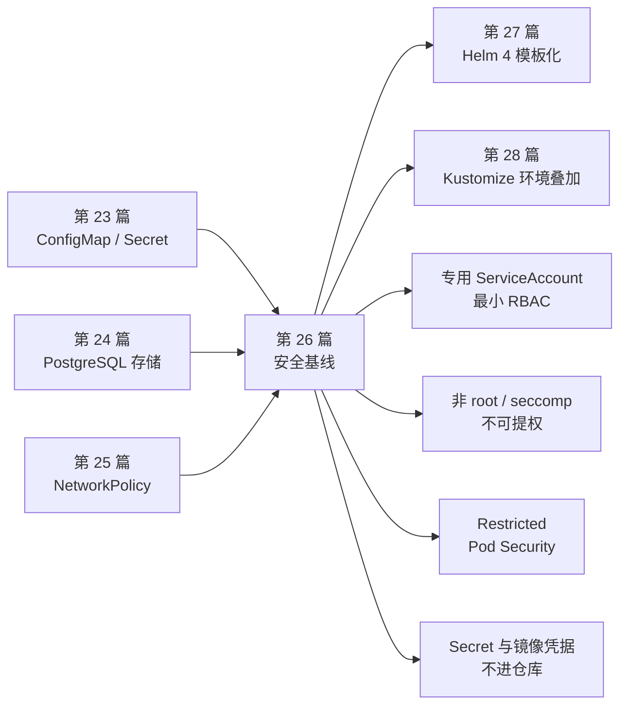
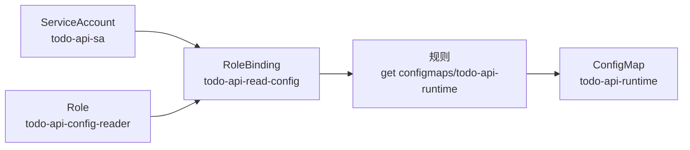
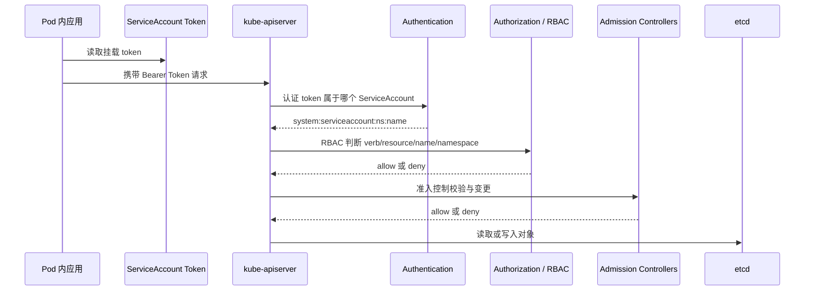
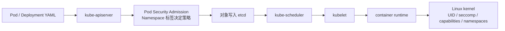
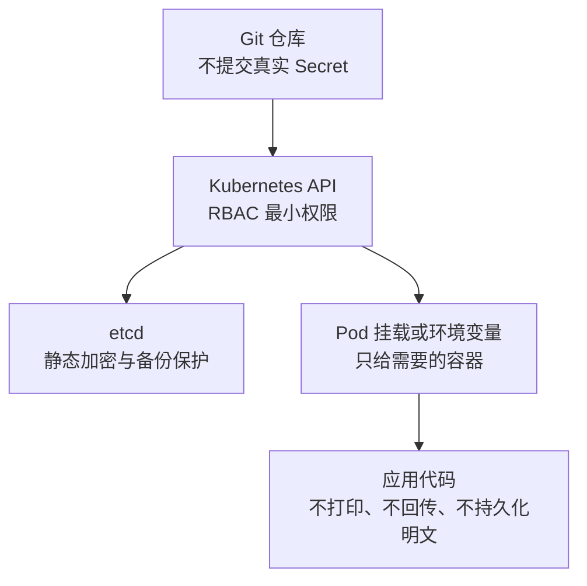
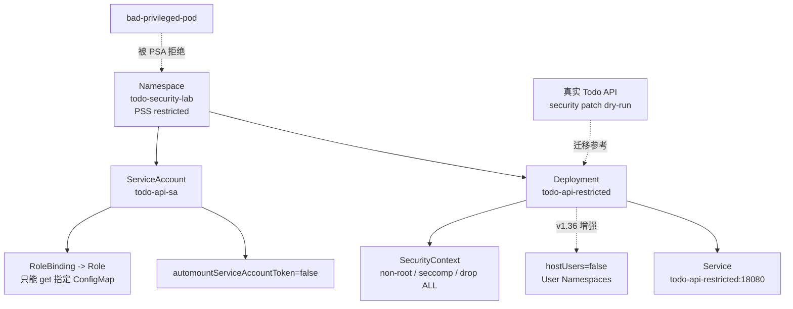

# 第 26 篇：Kubernetes 安全 [C]

第 25 篇把 Todo Platform 的网络链路拆开了：Pod IP 从哪里来，Service 如何转发，DNS 如何解析，NetworkPolicy 如何拦住未授权流量。网络隔离解决的是“谁能连谁”。到了安全章节，我们继续往里收紧：**谁能调用 Kubernetes API、容器以什么身份运行、Namespace 能否拒绝不安全 Pod、Secret 和镜像凭据如何避免扩散**。

本篇特色项目是：**为 Todo Platform 制定最小权限部署方案：专用 ServiceAccount、最小 RBAC、非 root 容器、User Namespaces、Restricted Pod Security 和 Secret / 镜像拉取密钥管理规范。**

## 1. 本章学习目标

### 1.1 知识目标

- 能解释 ServiceAccount 在 Kubernetes 中为什么是工作负载身份，而不是“普通用户账号”。
- 能区分 Role、ClusterRole、RoleBinding 和 ClusterRoleBinding 的作用边界。
- 能理解 RBAC 的最小权限原则，以及 `get`、`list`、`watch`、`create`、`bind`、`escalate`、`impersonate` 等权限的风险差异。
- 能说明 SecurityContext 中 `runAsNonRoot`、`runAsUser`、`allowPrivilegeEscalation`、Linux capabilities、seccomp 和只读根文件系统的作用。
- 能理解 User Namespaces 通过 `hostUsers: false` 把容器内用户和宿主机用户隔离开的原理。
- 能说明 Pod Security Standards 中 Privileged、Baseline、Restricted 三个级别的差异。
- 能理解 Secret、ServiceAccount token、镜像拉取密钥和私有仓库凭据的安全边界。

### 1.2 技能目标

- 能为 Todo API 创建专用 ServiceAccount，而不是继续使用默认 ServiceAccount。
- 能用 Role 和 RoleBinding 只授予 Todo API 读取指定 ConfigMap 的权限。
- 能用 `kubectl auth can-i --as=...` 验证 ServiceAccount 的实际授权结果。
- 能编写满足 Restricted Pod Security 的 Deployment。
- 能验证非 root 容器、不可提权、丢弃 capabilities、RuntimeDefault seccomp 和 ServiceAccount token 不自动挂载。
- 能用 Pod Security Admission 在 Namespace 级别拒绝不安全 Pod。
- 能生成本地镜像拉取密钥文件，并避免把真实凭据提交到仓库。

### 1.3 前置条件

开始本篇前，请确认你已经完成：

- 第 20 篇：已经有可用的 `todo-k8s` kind 集群，并能使用 `kubectl` 访问。
- 第 21 篇：理解 Deployment、Pod、Namespace、Label 和 Selector。
- 第 22 篇：理解 Service 如何为 Todo API 提供稳定访问入口。
- 第 23 篇：理解 ConfigMap / Secret 的配置注入方式。
- 第 24 篇：理解 Todo API 访问 PostgreSQL 的存储与配置链路。
- 第 25 篇：理解 NetworkPolicy 是网络层面的访问控制，不等于 API 权限控制。

本篇命令以 Linux / macOS / Windows Subsystem for Linux 2（WSL2，Windows 的 Linux 子系统）中的 Bash 为主。Windows PowerShell 用户需要手动创建 YAML 文件，或者把 `cat <<'YAML'` 这类 heredoc 命令改写为 PowerShell 等价写法。

!!! warning "User Namespaces 的版本与运行时要求"
    Kubernetes v1.36 官方博客和 User Namespaces 文档均把 User Namespaces 标注为 stable / GA，并通过 `spec.hostUsers: false` 启用。为了让第 20 篇已经创建的 `todo-k8s` 集群也能顺利完成主线实验，本篇把 User Namespaces 设计为 v1.36 增强步骤：RBAC、SecurityContext 和 Pod Security Standards 是必做主线，`hostUsers: false` 只在集群和运行时确认支持后再启用。

## 2. 本章工作场景与真实案例

### 2.1 技术痛点

很多团队把 Kubernetes 安全误解成“把镜像扫一遍漏洞”或“把公网入口关小一点”。这些都重要，但还远远不够。真正的事故往往来自几类更基础的松动：

- 应用 Pod 使用默认 ServiceAccount，并自动挂载了 Kubernetes API token。
- 为了图省事给业务 ServiceAccount 绑定 `cluster-admin`。
- 只限制了入口流量，却允许 Pod 在集群内读取任意 Secret。
- 容器默认以 root 运行，镜像中一个漏洞就可能变成节点级风险。
- Namespace 没有开启 Pod Security Admission，不安全 Pod 可以随意创建。
- 私有仓库凭据写进 YAML 后被提交到 Git 仓库。

本篇把这些问题收束成一句话：**Todo API 只应该拥有它运行所需的最小身份、最小权限和最小容器特权。**

### 2.2 团队协作场景

真实团队中，Kubernetes 安全不是某一个人的独角戏：

- 后端工程师声明应用是否需要访问 Kubernetes API、需要哪些配置、是否能以非 root 运行。
- 平台工程师维护 Namespace、ServiceAccount、RBAC、Pod Security Admission 和镜像仓库凭据。
- 安全工程师制定最小权限基线，审查 Secret 访问、特权容器、hostPath、hostNetwork 和 capabilities。
- SRE 负责把安全基线变成可观测、可回滚、可审计的运行规范。
- CI/CD 负责在变更进入集群前执行策略检查，避免危险 Manifest 进入生产。

好的安全设计不是让开发者“什么都不能做”，而是把默认路径设计成安全路径：普通业务 Pod 不需要集群管理员权限，不需要 root，不需要宿主机命名空间，也不需要长期保存 API token。

### 2.3 课程项目关联

第 20-25 篇已经把 Todo Platform 逐步放入 Kubernetes：

```text
第 20 篇：kind 集群、控制面、Node、kubelet、CNI 基础
第 21 篇：Todo API Deployment、Probe、Namespace
第 22 篇：Service / Ingress / Gateway API 入口
第 23 篇：ConfigMap / Secret 配置来源
第 24 篇：PostgreSQL StatefulSet 与持久化
第 25 篇：Service 链路、DNS、NetworkPolicy 网络隔离
第 26 篇：RBAC、非 root 容器、Pod Security 与 Secret 安全基线
```

本篇会创建独立 Namespace `todo-security-lab`，在不破坏 `todo-workloads` 主线资源的前提下，为 Todo API 演示一套最小权限安全基线。第 25 篇必须创建临时集群，因为切换 CNI 会影响整个集群；本篇只需要独立 Namespace，因为 RBAC、ServiceAccount 和 Pod Security Admission 都可以在 Namespace 边界内验证。后续第 27 篇 Helm 4 会把这些 Kubernetes Manifest 进一步模板化；第 28 篇 Kustomize 会把安全基线拆成可复用的环境叠加层。

图 26-1 展示本篇与前后章节的关系：



## 3. 核心概念

### 3.1 ServiceAccount 与工作负载身份

ServiceAccount 是 Kubernetes 给 Pod 使用的身份。人类用户通常来自证书、OIDC、云厂商 IAM 或外部身份系统；Pod 访问 Kubernetes API 时，通常使用 ServiceAccount。

每个 Namespace 都会自动有一个名为 `default` 的 ServiceAccount。如果 Pod 没有显式指定 `serviceAccountName`，就会使用它。这个默认行为很方便，但在生产环境并不理想：你很难从审计日志里判断到底是哪类工作负载在访问 API，也很难只给某个应用收窄权限。

本篇的 Todo API 会使用专用 ServiceAccount `todo-api-sa`。即使当前模拟服务并不需要访问 Kubernetes API，我们仍然创建这个身份，并设置 `automountServiceAccountToken: false`。这样做有两个目的：

- 身份边界清晰：未来 Todo API 如果确实需要读取 ConfigMap 或调用 API，可以只扩展这个身份。
- token 不默认暴露：没有 API 访问需求时，Pod 内不应该出现可用的 ServiceAccount token。

### 3.2 RBAC 四类对象

Kubernetes Role Based Access Control（RBAC，基于角色的访问控制）用四类对象描述“谁能对哪些资源做什么”。

表 26-1 RBAC 对象对比：

| 对象 | 作用范围 | 主要职责 | 常见使用方式 |
| --- | --- | --- | --- |
| Role | Namespace 内 | 定义某个 Namespace 内资源权限 | 允许 Todo API 读取本 Namespace 的指定 ConfigMap |
| ClusterRole | 集群级 | 定义集群资源权限，或可复用的跨 Namespace 权限模板 | 只读 Node、查看全局 CRD、复用 `view` / `edit` |
| RoleBinding | Namespace 内 | 把 Role 或 ClusterRole 绑定给用户、组或 ServiceAccount | 给 `todo-api-sa` 绑定本 Namespace 的最小权限 |
| ClusterRoleBinding | 集群级 | 把 ClusterRole 绑定到整个集群范围 | 谨慎用于平台组件，不用于普通业务 Pod |

图 26-2 展示 RoleBinding 如何把身份和权限连起来：



RBAC 是允许列表模型。没有绑定就没有权限；绑定错了 Namespace、Subject 名称或 API Group，`kubectl auth can-i` 就会返回 `no`。

!!! note "RBAC 不控制 ConfigMap / Secret 注入"
    Deployment 中的 `envFrom`、`configMapKeyRef`、`secretKeyRef` 和卷挂载由 kubelet 按 Pod spec 注入，不要求应用 ServiceAccount 自己拥有 `get configmaps` 或 `get secrets` 权限。本篇给 `todo-api-sa` 绑定读取指定 ConfigMap 的 Role，是为了演示“如果应用未来主动调用 Kubernetes API，应如何最小授权”，不是 ConfigMap 环境变量注入的前提。

### 3.3 SecurityContext 与非 root 容器

SecurityContext 是写在 Pod 或 Container 上的运行时安全约束。它不会修复镜像漏洞，也不会替代 RBAC 或 NetworkPolicy，但它能显著降低容器逃逸、误操作和横向移动的风险。

表 26-2 本篇使用的安全控制：

| 配置项 | 示例值 | 作用 |
| --- | --- | --- |
| `runAsNonRoot` | `true` | 要求容器不能以 root 用户运行 |
| `runAsUser` / `runAsGroup` | `10001` | 指定容器内进程 UID / GID |
| `fsGroup` | `10001` | 让挂载卷文件组权限与非 root 用户匹配 |
| `allowPrivilegeEscalation` | `false` | 禁止通过 setuid 等机制提权 |
| `capabilities.drop` | `["ALL"]` | 丢弃 Linux 默认 capabilities |
| `seccompProfile.type` | `RuntimeDefault` | 使用运行时默认 seccomp 过滤系统调用 |
| `readOnlyRootFilesystem` | `true` | 根文件系统只读，临时写入放到显式挂载卷 |

非 root 不是银弹。一个以 UID 10001 运行的进程仍然可以访问它有权限读取的 Secret、仍然可能有业务漏洞、仍然需要资源限制和网络隔离。但非 root 是容器安全基线的地板，不是天花板。

### 3.4 User Namespaces

User Namespaces 是 Linux 内核能力。它把容器内看到的用户 ID 和宿主机上的用户 ID 分开。启用后，容器内的 root 不再等同于宿主机 root；容器内的 capabilities 也会被限制在用户命名空间内。

Kubernetes v1.36 中，Pod 通过以下字段启用 User Namespaces：

```yaml
spec:
  hostUsers: false
```

这个字段的含义是：Pod 不使用宿主机用户命名空间，而是使用独立用户命名空间。官方文档把它定义为 Linux-only 功能，并要求节点内核、文件系统、container runtime 和 OCI runtime 支持相应能力。

User Namespaces 不能替代非 root。它解决的是“容器内用户映射到宿主机时是否仍然危险”；非 root 解决的是“容器内进程是否默认拥有 root 语义”。两者叠加，风险更低。

!!! note "User Namespaces 的限制"
    使用 `hostUsers: false` 的 Pod 不能同时使用 `hostNetwork: true`、`hostIPC: true` 或 `hostPID: true`。这很符合最小权限原则：如果你希望隔离用户命名空间，就不应该再共享宿主机网络、IPC 或 PID 命名空间。

### 3.5 Pod Security Standards 与 Pod Security Admission

Pod Security Standards（PSS）定义了三档 Pod 安全级别：

- **Privileged**：几乎不限制，适合少数受信任的系统级组件。
- **Baseline**：阻止已知的特权提升路径，兼容性较好。
- **Restricted**：按当前 Pod 加固最佳实践收紧，适合普通业务工作负载作为目标基线。

Pod Security Admission（PSA）是 Kubernetes 内置准入控制器，用 Namespace 标签启用。常见标签如下：

```yaml
metadata:
  labels:
    pod-security.kubernetes.io/enforce: restricted
    pod-security.kubernetes.io/enforce-version: latest
    pod-security.kubernetes.io/warn: restricted
    pod-security.kubernetes.io/warn-version: latest
    pod-security.kubernetes.io/audit: restricted
    pod-security.kubernetes.io/audit-version: latest
```

本地实验使用 `latest`，这样 v1.35 和 v1.36 集群都更容易执行。生产环境建议把版本固定到当前集群小版本，例如 `v1.36`，避免 Kubernetes 升级后策略含义悄悄变化。

### 3.6 Secret、镜像拉取密钥与私有仓库

Secret 用来保存敏感数据，但它不是“自动加密保险箱”。Kubernetes Secret 的值是 base64 编码；base64 不是加密。没有开启 etcd 静态加密时，Secret 默认以未加密形式存储在 API Server 的后端数据存储中。

镜像拉取密钥通常是 `kubernetes.io/dockerconfigjson` 类型的 Secret，用于从私有仓库拉取镜像。它的风险和数据库密码一样真实：一旦提交到 Git 仓库，就等于把仓库凭据暴露给所有能读仓库的人。

本篇遵循三条规则：

- 真实 Secret 不写入课程仓库，只生成 `*.local.yaml` 或直接 apply 到集群。
- 普通业务 ServiceAccount 不授予读取 Secret 的权限。
- 镜像拉取密钥按 Namespace 分发，并设置轮换机制。

## 4. 原理深入

### 4.1 Kubernetes API 请求如何被鉴权

Pod 内进程访问 Kubernetes API 时，请求大致经过四段：

图 26-4 Kubernetes API 鉴权链路：



RBAC 只回答“这个身份能不能做这个 API 操作”。它不负责校验 Pod 是否安全；Pod 是否允许创建，还要经过 Pod Security Admission、ResourceQuota、LimitRange、ValidatingAdmissionPolicy 或第三方策略引擎等准入控制。

### 4.2 最小 RBAC 为什么要从 Namespace 开始

Kubernetes RBAC 最容易出问题的地方不是语法，而是范围。`ClusterRoleBinding` 很诱人，因为一次绑定后“什么 Namespace 都能用”；也正因为如此，它的爆炸半径非常大。

普通业务应用优先使用：

```text
ServiceAccount -> RoleBinding -> Role -> Namespace 内少量资源
```

只有当权限确实涉及集群级资源时，才考虑 ClusterRole。即使使用 ClusterRole，也可以通过 RoleBinding 把它限制在某个 Namespace 内。这样可以复用权限模板，而不是把权限扩散到全集群。

几个需要格外谨慎的权限：

- `list` / `watch secrets`：返回内容会包含 Secret 数据，风险不低于 `get secrets`。
- `create pods`：能创建 Pod 往往意味着可以挂载同 Namespace 内的 Secret。
- `bind` / `escalate`：可能绕过 RBAC 防止越权的保护。
- `impersonate`：能冒充其它身份，风险取决于可冒充对象的权限。
- `nodes/proxy`：可能访问 kubelet API，不能当成普通只读权限。

### 4.3 Pod 从提交到运行的安全链路

SecurityContext 和 Pod Security Admission 处在不同层：

图 26-5 Pod 提交到运行的安全链路：



Pod Security Admission 在对象进入集群时检查 Manifest 是否符合策略；SecurityContext 则传递给运行时和内核，影响容器实际如何运行。前者像门禁，后者像运行时约束。两者需要一起使用。

### 4.4 Restricted 策略为什么会拒绝很多“能跑”的 Pod

很多 Pod 在默认 Namespace 里能运行，但在 Restricted Namespace 里会被拒绝。原因不是镜像坏了，而是 Manifest 没写清安全意图。

Restricted 通常要求：

- 不使用 hostNetwork、hostPID、hostIPC。
- 不使用 privileged 容器。
- 不允许 privilege escalation。
- 容器必须以非 root 运行。
- seccomp 必须显式设置为 `RuntimeDefault` 或 `Localhost`。
- 必须 drop `ALL` capabilities，只允许按需加回 `NET_BIND_SERVICE`。
- 卷类型只能使用受限集合，例如 ConfigMap、Secret、emptyDir、PVC、projected 等。

这也是本篇先写 Namespace 策略、再写 Deployment 的原因：我们让 Kubernetes 替我们检查 Manifest，而不是靠肉眼背诵规则。

### 4.5 Secret 安全从哪里开始

Secret 安全有四层边界：

图 26-6 Secret 安全四层边界：



很多泄漏不是 Kubernetes “泄漏”了 Secret，而是团队把 Secret 当成普通配置处理：写进仓库、打印到日志、给所有人 `list secrets`、让任意 Pod 都能挂载。Secret 安全的第一步，是承认它只是敏感数据对象，不是免疫风险的魔法盒。

## 5. 手把手实验

### 5.1 实验目标

本实验会在现有 `todo-k8s` 集群中创建独立 Namespace `todo-security-lab`，完成以下目标：

- 为 Todo API 创建专用 ServiceAccount `todo-api-sa`。
- 只授予它读取指定 ConfigMap 的权限，不授予 Secret、Pod 创建或集群级权限。
- 部署一个满足 Restricted Pod Security 的 Todo API 模拟服务。
- 验证 ServiceAccount token 没有自动挂载。
- 验证非 root、不可提权、drop capabilities 和 RuntimeDefault seccomp。
- 在 Kubernetes v1.36 且运行时支持时，增强验证 `hostUsers: false`。
- 使用 Pod Security Admission 拒绝一个特权 Pod。
- 演示私有仓库镜像拉取密钥的本地生成方式。

### 5.2 实验环境

表 26-3 实验环境版本：

| 组件 | 建议版本 | 说明 |
| --- | --- | --- |
| Kubernetes | v1.25+，推荐 v1.36.x | 主线实验使用 v1.25+ 稳定能力；User Namespaces 增强步骤推荐 v1.36 |
| kind | v0.29.x 或更新 | 继续使用第 20 篇创建的 `todo-k8s` 集群即可 |
| kubectl | 与集群小版本相差不超过 1 | 用于 apply、auth can-i、rollout 和 exec |
| 容器镜像 | `registry.cn-guangzhou.aliyuncs.com/yleoer/alpine:3.23` | 用 BusyBox `nc` 模拟 Todo API HTTP 服务 |
| 操作系统 | Linux / macOS / WSL2 | Windows PowerShell 用户需改写 heredoc |

表 26-4 本篇安全能力兼容性：

| 能力 | 主线要求 | 说明 |
| --- | --- | --- |
| ServiceAccount / RBAC | v1.25+ | Kubernetes 长期稳定能力 |
| Pod Security Admission | v1.25+ | 本篇用 Namespace 标签启用 Restricted |
| SecurityContext | v1.25+ | 非 root、seccomp、capabilities 等字段稳定可用 |
| User Namespaces | v1.36 推荐 | v1.36 GA；旧集群或旧运行时可能需要跳过增强步骤 |

先确认当前上下文和集群：

```bash
kubectl config current-context
kubectl get nodes -o wide
kubectl version
```

如果你当前不在第 20 篇创建的 kind 集群，可以切回：

```bash
kubectl config use-context kind-todo-k8s
```

如果你为第 20 篇使用了不同的集群名称，请把 `kind-todo-k8s` 替换成自己的 context 名称。

### 5.3 文件目录结构

以下命令均在项目根目录执行。

```bash
mkdir -p deployments/k8s-security
```

本篇会生成以下文件：

```text
deployments/k8s-security
├── namespace.yaml
├── todo-api-rbac.yaml
├── todo-api-restricted.yaml
├── todo-security-client.yaml
├── todo-api-userns-patch.yaml          # ← 可选，Kubernetes v1.36 增强验证
├── todo-api-security-patch.yaml        # ← 迁移到真实 Todo API Deployment 的参考补丁
├── bad-privileged-pod.yaml
└── image-pull-secret.local.yaml       # ← 可选，本地生成，不提交公开仓库
```

确认本地 Secret 文件不会进入 Git：

```bash
grep -F 'deployments/k8s-security/*.local.yaml' .gitignore || \
  printf '\ndeployments/k8s-security/*.local.yaml\n' >> .gitignore
```

### 5.4 完整代码或配置

创建启用 Restricted Pod Security 的 Namespace：

```bash
cat > deployments/k8s-security/namespace.yaml <<'YAML'
apiVersion: v1
kind: Namespace
metadata:
  name: todo-security-lab
  labels:
    app.kubernetes.io/part-of: todo-platform
    security.todo-platform.io/profile: restricted
    pod-security.kubernetes.io/enforce: restricted
    pod-security.kubernetes.io/enforce-version: latest
    pod-security.kubernetes.io/warn: restricted
    pod-security.kubernetes.io/warn-version: latest
    pod-security.kubernetes.io/audit: restricted
    pod-security.kubernetes.io/audit-version: latest
    # ← 本地实验使用 latest；生产环境建议固定为当前集群小版本，例如 v1.36。
YAML
```

创建 Todo API 的 ServiceAccount、ConfigMap、Role 和 RoleBinding：

```bash
cat > deployments/k8s-security/todo-api-rbac.yaml <<'YAML'
apiVersion: v1
kind: ServiceAccount
metadata:
  name: todo-api-sa
  namespace: todo-security-lab
  labels:
    app.kubernetes.io/name: todo-api
    app.kubernetes.io/part-of: todo-platform
automountServiceAccountToken: false
# ← 默认不把 API token 挂进 Pod；只有应用确实需要调用 Kubernetes API 时才打开。
---
apiVersion: v1
kind: ConfigMap
metadata:
  name: todo-api-runtime
  namespace: todo-security-lab
  labels:
    app.kubernetes.io/name: todo-api
    app.kubernetes.io/part-of: todo-platform
data:
  FEATURE_SECURITY_BASELINE: "enabled"
  LOG_LEVEL: "info"
---
apiVersion: rbac.authorization.k8s.io/v1
kind: Role
metadata:
  name: todo-api-config-reader
  namespace: todo-security-lab
  labels:
    app.kubernetes.io/name: todo-api
    app.kubernetes.io/part-of: todo-platform
rules:
  - apiGroups: [""]
    resources: ["configmaps"]
    resourceNames: ["todo-api-runtime"]
    verbs: ["get"]
    # ← 只允许读取指定 ConfigMap，不允许 list 所有 ConfigMap，也不允许读取 Secret。
---
apiVersion: rbac.authorization.k8s.io/v1
kind: RoleBinding
metadata:
  name: todo-api-read-config
  namespace: todo-security-lab
  labels:
    app.kubernetes.io/name: todo-api
    app.kubernetes.io/part-of: todo-platform
subjects:
  - kind: ServiceAccount
    name: todo-api-sa
    namespace: todo-security-lab
roleRef:
  apiGroup: rbac.authorization.k8s.io
  kind: Role
  name: todo-api-config-reader
YAML
```

创建满足 Restricted Pod Security 的 Todo API 模拟服务：

```bash
cat > deployments/k8s-security/todo-api-restricted.yaml <<'YAML'
apiVersion: apps/v1
kind: Deployment
metadata:
  name: todo-api-restricted
  namespace: todo-security-lab
  labels:
    app.kubernetes.io/name: todo-api
    app.kubernetes.io/part-of: todo-platform
    app.kubernetes.io/component: api
spec:
  replicas: 2
  selector:
    matchLabels:
      app.kubernetes.io/name: todo-api
      app.kubernetes.io/component: api
  template:
    metadata:
      labels:
        app.kubernetes.io/name: todo-api
        app.kubernetes.io/part-of: todo-platform
        app.kubernetes.io/component: api
    spec:
      serviceAccountName: todo-api-sa
      automountServiceAccountToken: false
      securityContext:
        runAsNonRoot: true
        runAsUser: 10001
        runAsGroup: 10001
        fsGroup: 10001
        seccompProfile:
          type: RuntimeDefault
      containers:
        - name: todo-api
          image: registry.cn-guangzhou.aliyuncs.com/yleoer/alpine:3.23
          imagePullPolicy: IfNotPresent
          ports:
            - name: http
              containerPort: 18080
          command:
            - /bin/sh
            - -c
            - |
              set -eu
              while true; do
                printf 'HTTP/1.1 200 OK\r\nContent-Type: text/plain\r\nConnection: close\r\n\r\nTodo API security baseline OK\n' | nc -l -p 18080
              done
              # ← BusyBox nc 每次处理一个连接后退出，再由 while true 重启；偶发 Connection refused 时重试即可。
          env:
            - name: TODO_FEATURE_SECURITY_BASELINE
              valueFrom:
                configMapKeyRef:
                  name: todo-api-runtime
                  key: FEATURE_SECURITY_BASELINE
          securityContext:
            allowPrivilegeEscalation: false
            readOnlyRootFilesystem: true
            capabilities:
              drop:
                - ALL
          volumeMounts:
            - name: tmp
              mountPath: /tmp
          resources:
            requests:
              cpu: 20m
              memory: 32Mi
            limits:
              cpu: 100m
              memory: 64Mi
      volumes:
        - name: tmp
          emptyDir: {}
---
apiVersion: v1
kind: Service
metadata:
  name: todo-api-restricted
  namespace: todo-security-lab
  labels:
    app.kubernetes.io/name: todo-api
    app.kubernetes.io/part-of: todo-platform
spec:
  type: ClusterIP
  selector:
    app.kubernetes.io/name: todo-api
    app.kubernetes.io/component: api
  ports:
    - name: http
      port: 18080
      targetPort: http
YAML
```

创建一个同样满足 Restricted 的临时客户端 Pod：

```bash
cat > deployments/k8s-security/todo-security-client.yaml <<'YAML'
apiVersion: v1
kind: Pod
metadata:
  name: todo-security-client
  namespace: todo-security-lab
  labels:
    app.kubernetes.io/name: todo-security-client
    app.kubernetes.io/part-of: todo-platform
spec:
  restartPolicy: Never
  automountServiceAccountToken: false
  securityContext:
    runAsNonRoot: true
    runAsUser: 10002
    runAsGroup: 10002
    seccompProfile:
      type: RuntimeDefault
  containers:
    - name: client
      image: registry.cn-guangzhou.aliyuncs.com/yleoer/alpine:3.23
      imagePullPolicy: IfNotPresent
      command: ["sh", "-c", "sleep 3600"]
      securityContext:
        allowPrivilegeEscalation: false
        readOnlyRootFilesystem: true
        capabilities:
          drop:
            - ALL
      volumeMounts:
        - name: tmp
          mountPath: /tmp
      resources:
        requests:
          cpu: 10m
          memory: 16Mi
        limits:
          cpu: 50m
          memory: 32Mi
  volumes:
    - name: tmp
      emptyDir: {}
YAML
```

创建 Kubernetes v1.36 User Namespaces 增强补丁。这个文件不参与主线实验，只有当你的集群和运行时确认支持 User Namespaces 时才执行：

```bash
cat > deployments/k8s-security/todo-api-userns-patch.yaml <<'YAML'
spec:
  template:
    spec:
      hostUsers: false
      # ← v1.36 GA：让 Pod 使用独立 Linux User Namespace，而不是宿主机用户命名空间。
YAML
```

创建迁移到真实 Todo API Deployment 的安全补丁。这个补丁面向第 21-24 篇保留在 `todo-workloads` Namespace 中的 `todo-api` Deployment，用来说明本篇安全基线如何回到主线项目：

```bash
cat > deployments/k8s-security/todo-api-security-patch.yaml <<'YAML'
spec:
  template:
    spec:
      serviceAccountName: todo-api-sa
      automountServiceAccountToken: false
      securityContext:
        runAsNonRoot: true
        runAsUser: 10001
        runAsGroup: 10001
        fsGroup: 10001
        seccompProfile:
          type: RuntimeDefault
      containers:
        - name: todo-api
          securityContext:
            allowPrivilegeEscalation: false
            capabilities:
              drop:
                - ALL
          # 如果你的真实 Todo API 镜像已经确认支持只读根文件系统，再打开下一行。
          # readOnlyRootFilesystem: true
YAML
```

!!! note "真实 Todo API 补丁需要配套 RBAC"
    `todo-api-security-patch.yaml` 只是展示把安全上下文迁移到真实 Deployment 的最小片段。正式应用到 `todo-workloads` 前，还要在 `todo-workloads` 中创建同名 `todo-api-sa`，并按真实应用是否需要 Kubernetes API 访问来决定是否绑定 Role。本章主线不会直接 patch `todo-workloads`，避免影响第 20-25 篇已有实验状态。

创建一个故意违规的特权 Pod，用于验证 Pod Security Admission 会拒绝它：

```bash
cat > deployments/k8s-security/bad-privileged-pod.yaml <<'YAML'
apiVersion: v1
kind: Pod
metadata:
  name: bad-privileged-pod
  namespace: todo-security-lab
spec:
  containers:
    - name: shell
      image: registry.cn-guangzhou.aliyuncs.com/yleoer/alpine:3.23
      command: ["sh", "-c", "sleep 3600"]
      securityContext:
        privileged: true
        runAsUser: 0
YAML
```

可选：生成私有仓库镜像拉取密钥。这里的命令只演示格式，请替换成自己的私有仓库地址和只读机器人账号。不要把生成的 `image-pull-secret.local.yaml` 提交到公开仓库。

```bash
export TODO_REGISTRY_SERVER=registry.example.com
export TODO_REGISTRY_USERNAME=todo-reader
export TODO_REGISTRY_EMAIL=dev@example.com

read -r -s -p "Registry read-only token: " TODO_REGISTRY_PASSWORD
echo
test -n "$TODO_REGISTRY_PASSWORD"

kubectl -n todo-security-lab create secret docker-registry todo-registry-pull \
  --docker-server="$TODO_REGISTRY_SERVER" \
  --docker-username="$TODO_REGISTRY_USERNAME" \
  --docker-password="$TODO_REGISTRY_PASSWORD" \
  --docker-email="$TODO_REGISTRY_EMAIL" \
  --dry-run=client -o yaml > deployments/k8s-security/image-pull-secret.local.yaml
```

如果真实生产镜像需要使用该密钥，可以在 ServiceAccount 中引用：

```yaml
imagePullSecrets:
  - name: todo-registry-pull
```

本篇模拟服务使用公开 Alpine 镜像，不需要实际应用这个私有仓库密钥。

### 5.5 执行命令

先做服务端 dry-run，确认 API Server、RBAC 和 Pod Security Admission 都能接受安全 Manifest：

```bash
kubectl apply --dry-run=server -f deployments/k8s-security/namespace.yaml
kubectl apply -f deployments/k8s-security/namespace.yaml

kubectl apply --dry-run=server -f deployments/k8s-security/todo-api-rbac.yaml
kubectl apply --dry-run=server -f deployments/k8s-security/todo-api-restricted.yaml
kubectl apply --dry-run=server -f deployments/k8s-security/todo-security-client.yaml
```

创建演示用 Secret。这个 Secret 只用于验证 RBAC 拒绝读取 Secret，不写入仓库：

```bash
kubectl -n todo-security-lab create secret generic todo-db-auth \
  --from-literal=POSTGRES_PASSWORD=local-demo-only \
  --dry-run=client -o yaml | kubectl apply -f -
```

应用 RBAC、Deployment 和客户端 Pod：

```bash
kubectl apply -f deployments/k8s-security/todo-api-rbac.yaml
kubectl apply -f deployments/k8s-security/todo-api-restricted.yaml
kubectl apply -f deployments/k8s-security/todo-security-client.yaml

kubectl -n todo-security-lab rollout status deployment/todo-api-restricted --timeout=180s
kubectl -n todo-security-lab wait --for=condition=Ready pod/todo-security-client --timeout=180s
```

验证 ServiceAccount 的最小权限：

```bash
SA=system:serviceaccount:todo-security-lab:todo-api-sa

kubectl auth can-i get configmap/todo-api-runtime -n todo-security-lab --as="$SA"
kubectl auth can-i list configmaps -n todo-security-lab --as="$SA"
kubectl auth can-i get secrets -n todo-security-lab --as="$SA"
kubectl auth can-i create pods -n todo-security-lab --as="$SA"
```

验证客户端能访问 Todo API Service：

```bash
kubectl -n todo-security-lab exec todo-security-client -- \
  wget -qO- --timeout=3 http://todo-api-restricted:18080
```

验证 Todo API Pod 没有自动挂载 ServiceAccount token：

这里的 `test ! -d` 表示检查目录不存在；后面的 `&&` 表示只有目录不存在时才打印成功消息。

```bash
kubectl -n todo-security-lab exec deployment/todo-api-restricted -- \
  sh -c 'test ! -d /var/run/secrets/kubernetes.io/serviceaccount && echo "service account token is not mounted"'
```

验证 Pod Security Admission 会拒绝特权 Pod：

```bash
kubectl apply --dry-run=server -f deployments/k8s-security/bad-privileged-pod.yaml
```

验证 Pod 的关键安全字段：

```bash
kubectl -n todo-security-lab get deployment todo-api-restricted \
  -o jsonpath='serviceAccountName={.spec.template.spec.serviceAccountName}{"\n"}'

kubectl -n todo-security-lab get deployment todo-api-restricted \
  -o jsonpath='automountServiceAccountToken={.spec.template.spec.automountServiceAccountToken}{"\n"}'

kubectl -n todo-security-lab get deployment todo-api-restricted \
  -o jsonpath='runAsNonRoot={.spec.template.spec.securityContext.runAsNonRoot}{"\n"}'

kubectl -n todo-security-lab get deployment todo-api-restricted \
  -o jsonpath='seccompProfile={.spec.template.spec.securityContext.seccompProfile.type}{"\n"}'

kubectl -n todo-security-lab get deployment todo-api-restricted \
  -o jsonpath='allowPrivilegeEscalation={.spec.template.spec.containers[0].securityContext.allowPrivilegeEscalation}{"\n"}'

kubectl -n todo-security-lab get deployment todo-api-restricted \
  -o jsonpath='capabilities.drop={.spec.template.spec.containers[0].securityContext.capabilities.drop[0]}{"\n"}'
```

可选增强：如果你的集群是 Kubernetes v1.36，且节点运行时支持 User Namespaces，可以把 `hostUsers: false` patch 到 Todo API Deployment：

```bash
kubectl -n todo-security-lab patch deployment todo-api-restricted \
  --type merge \
  --patch-file deployments/k8s-security/todo-api-userns-patch.yaml

kubectl -n todo-security-lab rollout status deployment/todo-api-restricted --timeout=180s

kubectl -n todo-security-lab get deployment todo-api-restricted \
  -o jsonpath='{.spec.template.spec.hostUsers}{"\n"}'
```

`hostUsers` 是普通标量字段，用 merge patch 足够；真实 Deployment 里要按容器名合并 `containers` 列表，所以后面的迁移补丁使用 strategic merge patch，避免覆盖镜像、探针和环境变量。

可选增强：查看 User Namespaces 的 UID 映射。不同运行时输出会略有差异，只要 `hostUsers: false` 的 Pod 成功运行，就说明当前集群支持该配置。Alpine 镜像里通常没有 UID 10001 对应的用户名，`id` 可能只显示数字 UID 或 `unknown`，这是正常的；Linux 可以用没有 `/etc/passwd` 条目的数字 UID 运行进程。

```bash
kubectl -n todo-security-lab exec deployment/todo-api-restricted -- \
  sh -c 'id && cat /proc/self/uid_map && readlink /proc/self/ns/user'
```

可选迁移：如果你要把安全基线迁回第 21-24 篇的真实 Todo API Deployment，先做服务端 dry-run。不要在本篇主线实验里直接 apply，除非你已经确认 `todo-workloads` 中也存在配套的 `todo-api-sa`。

```bash
kubectl -n todo-workloads patch deployment todo-api \
  --type strategic \
  --patch-file deployments/k8s-security/todo-api-security-patch.yaml \
  --dry-run=server -o yaml
```

### 5.6 预期输出

应用安全 Namespace：

```text
namespace/todo-security-lab created
```

Deployment 和客户端 Pod 就绪：

```text
deployment "todo-api-restricted" successfully rolled out
pod/todo-security-client condition met
```

RBAC 最小权限检查：

```text
yes
no
no
no
```

这四行分别表示：

- 可以读取指定的 `configmap/todo-api-runtime`。
- 不能列出所有 ConfigMap。
- 不能读取 Secret。
- 不能创建 Pod。

访问 Todo API Service：

```text
Todo API security baseline OK
```

ServiceAccount token 未挂载：

```text
service account token is not mounted
```

Pod Security Admission 拒绝特权 Pod 时，会看到类似输出：

```text
Error from server (Forbidden): error when creating "deployments/k8s-security/bad-privileged-pod.yaml": pods "bad-privileged-pod" is forbidden: violates PodSecurity "restricted:latest": privileged, allowPrivilegeEscalation != false, unrestricted capabilities, runAsNonRoot != true, seccompProfile
```

安全字段检查会输出：

```text
serviceAccountName=todo-api-sa
automountServiceAccountToken=false
runAsNonRoot=true
seccompProfile=RuntimeDefault
allowPrivilegeEscalation=false
capabilities.drop=ALL
```

如果执行了 User Namespaces 增强 patch，`hostUsers` 检查会输出：

```text
false
```

### 5.7 验证方法

第一层：确认 Namespace 已启用 Restricted Pod Security。

```bash
kubectl get namespace todo-security-lab --show-labels
```

判断标准：输出包含 `pod-security.kubernetes.io/enforce=restricted`。

第二层：确认 RBAC 是最小权限。

```bash
SA=system:serviceaccount:todo-security-lab:todo-api-sa
kubectl auth can-i get configmap/todo-api-runtime -n todo-security-lab --as="$SA"
kubectl auth can-i get secrets -n todo-security-lab --as="$SA"
```

判断标准：第一条返回 `yes`，第二条返回 `no`。

第三层：确认工作负载满足 Restricted。

```bash
kubectl -n todo-security-lab get pods
kubectl -n todo-security-lab describe pod -l app.kubernetes.io/name=todo-api
```

判断标准：Pod 处于 `Running`，事件中没有 Pod Security Admission 拒绝信息。

第四层：确认不安全 Pod 会被拒绝。

```bash
kubectl apply --dry-run=server -f deployments/k8s-security/bad-privileged-pod.yaml
```

判断标准：命令失败，并提示违反 `restricted` PodSecurity。

第五层：确认服务仍然可用。

```bash
kubectl -n todo-security-lab exec todo-security-client -- \
  wget -qO- --timeout=3 http://todo-api-restricted:18080
```

判断标准：输出 `Todo API security baseline OK`。

### 5.8 清理步骤

删除实验 Namespace：

```bash
kubectl delete namespace todo-security-lab
```

如果你不再保留本地实验文件，可以删除目录：

```bash
rm -rf deployments/k8s-security
```

本篇没有切换到临时 kind 集群，也没有修改 `todo-workloads` 主线 Namespace。清理 `todo-security-lab` 后，第 20-25 篇的主线资源不受影响。

预计耗时：80 分钟（动手操作约 55 分钟）。

## 6. 常见错误与排障

### 错误 1：Pod 被 Restricted Pod Security 拒绝

- **现象**：

```text
Error from server (Forbidden): pods "todo-api-restricted-..." is forbidden: violates PodSecurity "restricted:latest": allowPrivilegeEscalation != false, unrestricted capabilities, runAsNonRoot != true, seccompProfile
```

- **原因**：Pod 所在 Namespace 开启了 Restricted，但 Manifest 缺少必需的安全字段，或容器设置了 privileged、hostNetwork、hostPath 等不允许的能力。
- **排查**：

```bash
kubectl get namespace todo-security-lab --show-labels
kubectl -n todo-security-lab describe replicaset -l app.kubernetes.io/name=todo-api
kubectl -n todo-security-lab get events --sort-by=.lastTimestamp
```

- **修复**：补齐 `runAsNonRoot: true`、非零 `runAsUser`、`allowPrivilegeEscalation: false`、`capabilities.drop: [ALL]`、`seccompProfile.type: RuntimeDefault`，并移除 privileged、hostNetwork、hostPID、hostIPC、hostPath 等配置。
- **验证**：

```bash
kubectl apply --dry-run=server -f deployments/k8s-security/todo-api-restricted.yaml
```

### 错误 2：`kubectl auth can-i` 返回 `no`

- **现象**：

```text
no
```

本来期望 `todo-api-sa` 可以读取 `configmap/todo-api-runtime`，却返回 `no`。

- **原因**：RoleBinding 的 `subjects.name`、`subjects.namespace`、`roleRef.name` 或命令中的 `--as` 身份写错；也可能是 Role 中使用了 `resourceNames`，但验证命令没有指定具体资源名。
- **排查**：

```bash
kubectl -n todo-security-lab get serviceaccount todo-api-sa
kubectl -n todo-security-lab get role todo-api-config-reader -o yaml
kubectl -n todo-security-lab get rolebinding todo-api-read-config -o yaml
```

- **修复**：确认 ServiceAccount 完整身份是 `system:serviceaccount:todo-security-lab:todo-api-sa`。如果 Role 使用了 `resourceNames: ["todo-api-runtime"]`，验证时也要写成 `get configmap/todo-api-runtime`。
- **验证**：

```bash
kubectl auth can-i get configmap/todo-api-runtime \
  -n todo-security-lab \
  --as=system:serviceaccount:todo-security-lab:todo-api-sa
```

### 错误 3：非 root 容器启动失败或端口无法监听

- **现象**：

```text
bind: permission denied
```

或：

```text
Read-only file system
```

- **原因**：非 root 容器不能绑定 1024 以下低端口；只读根文件系统下，应用仍然试图写 `/var`、`/tmp`、当前目录或日志文件。
- **排查**：

```bash
kubectl -n todo-security-lab logs deployment/todo-api-restricted
kubectl -n todo-security-lab describe pod -l app.kubernetes.io/name=todo-api
```

- **修复**：让应用监听 1024 以上端口，例如本篇使用 `18080`；把临时写入路径改到显式挂载的 `emptyDir`，例如 `/tmp`；生产镜像应在 Dockerfile 中提前创建非 root 用户和可写目录。
- **验证**：

```bash
kubectl -n todo-security-lab rollout restart deployment/todo-api-restricted
kubectl -n todo-security-lab rollout status deployment/todo-api-restricted --timeout=180s
```

### 错误 4：应用访问 Kubernetes API 失败

- **现象**：

```text
open /var/run/secrets/kubernetes.io/serviceaccount/token: no such file or directory
```

或应用日志中出现：

```text
Unauthorized
```

- **原因**：本篇刻意设置了 `automountServiceAccountToken: false`。如果应用代码确实需要访问 Kubernetes API，Pod 内不会自动有 token。
- **排查**：

```bash
kubectl -n todo-security-lab get serviceaccount todo-api-sa -o yaml
kubectl -n todo-security-lab get deployment todo-api-restricted -o yaml | grep -n "automountServiceAccountToken"
```

- **修复**：先确认应用真的需要访问 Kubernetes API，再只为这个 Deployment 打开 token，并保持 Role 最小化。不要为了修复这个错误直接绑定 `cluster-admin`。
- **验证**：

```bash
kubectl auth can-i get configmap/todo-api-runtime \
  -n todo-security-lab \
  --as=system:serviceaccount:todo-security-lab:todo-api-sa
```

### 错误 5：User Namespaces 增强步骤导致 Pod 无法启动

- **现象**：

```text
Warning  Failed  kubelet  Error: failed to create containerd task: failed to set MOUNT_ATTR_IDMAP ... invalid argument
```

或 API Server 报告字段不支持。

- **原因**：User Namespaces 需要 Kubernetes API、Linux 内核、文件系统、container runtime 和 OCI runtime 共同支持。老版本 kind 节点镜像或宿主机环境可能暂时不满足。
- **排查**：

```bash
kubectl version
kubectl -n todo-security-lab describe pod -l app.kubernetes.io/name=todo-api
kubectl get nodes -o wide
```

- **修复**：优先升级到 Kubernetes v1.36 和支持 User Namespaces 的运行时。如果只是为了完成本篇 RBAC、SecurityContext 和 Pod Security 主线实验，可以跳过 `todo-api-userns-patch.yaml`，保留基础 Deployment。不要删除非 root、seccomp、capabilities 和不可提权配置。
- **验证**：

```bash
kubectl -n todo-security-lab rollout undo deployment/todo-api-restricted
kubectl -n todo-security-lab rollout status deployment/todo-api-restricted --timeout=180s
```

## 7. 生产环境注意事项

1. **默认拒绝高权限绑定**：业务 ServiceAccount 默认不应该拥有 ClusterRoleBinding，更不应该绑定 `cluster-admin`。优先使用 RoleBinding，把权限限制在 Namespace 内。
2. **避免通配符权限**：`apiGroups: ["*"]`、`resources: ["*"]`、`verbs: ["*"]` 会把未来新增资源也一起授权，生产环境要尽量避免。
3. **Secret 权限要单独审查**：`list` 和 `watch` Secret 通常等价于批量读取 Secret 内容。只有确实需要的系统组件才应该拥有这些权限。
4. **ServiceAccount token 默认不挂载**：无 API 访问需求的 Pod 设置 `automountServiceAccountToken: false`。确实需要访问 API 时，再为单个工作负载开启并绑定最小 Role。
5. **Pod Security 用 warn/audit 先铺路**：已有集群直接 enforce Restricted 可能打断业务。更稳妥的路线是先加 `warn` 和 `audit`，修复不合规工作负载后再启用 `enforce`。
6. **Restricted 不等于万无一失**：它不替代镜像漏洞扫描、供应链签名、NetworkPolicy、资源限制、审计日志、准入策略和运行时监控。
7. **User Namespaces 要看节点能力**：不要只检查 API 字段是否存在，还要验证内核、文件系统、containerd / CRI-O、runc / crun 是否满足要求。
8. **镜像拉取密钥要可轮换**：使用只读机器人账号，按 Namespace 分发，避免共用全局凭据。密钥泄漏后必须能快速吊销和重新下发。
9. **Secret 需要静态加密和备份保护**：生产集群应开启 etcd encryption at rest，并保护 etcd 快照、备份和管理员访问路径。
10. **审计高风险动词**：重点关注 `bind`、`escalate`、`impersonate`、`create pods`、`create serviceaccounts/token`、`nodes/proxy`、`list secrets` 等权限。

官方参考文档：

以下链接指向 Kubernetes 官方文档；如果链接随版本调整失效，请在 `kubernetes.io/docs/` 中搜索对应主题名称。

- [Role Based Access Control Good Practices](https://kubernetes.io/docs/concepts/security/rbac-good-practices/)
- [Pod Security Standards](https://kubernetes.io/docs/concepts/security/pod-security-standards/)
- [Configure a Security Context for a Pod or Container](https://kubernetes.io/docs/tasks/configure-pod-container/security-context/)
- [Use a User Namespace With a Pod](https://kubernetes.io/docs/tasks/configure-pod-container/user-namespaces/)
- [Kubernetes v1.36: User Namespaces in Kubernetes are finally GA](https://kubernetes.io/blog/2026/04/23/kubernetes-v1-36-userns-ga/)
- [Good practices for Kubernetes Secrets](https://kubernetes.io/docs/concepts/security/secrets-good-practices/)

## 8. 本章小项目

本章小项目是：**为 Todo Platform 制定最小权限 Kubernetes 安全基线**。

### 8.1 项目产出

你应该得到以下产出：

- `deployments/k8s-security/namespace.yaml`：启用 Restricted Pod Security 的实验 Namespace。
- `deployments/k8s-security/todo-api-rbac.yaml`：Todo API 专用 ServiceAccount、ConfigMap、最小 Role 和 RoleBinding。
- `deployments/k8s-security/todo-api-restricted.yaml`：满足 Restricted 的 Todo API Deployment 和 Service。
- `deployments/k8s-security/todo-security-client.yaml`：满足 Restricted 的临时验证客户端。
- `deployments/k8s-security/todo-api-userns-patch.yaml`：Kubernetes v1.36 User Namespaces 增强补丁。
- `deployments/k8s-security/todo-api-security-patch.yaml`：迁移到真实 Todo API Deployment 的参考安全补丁。
- `deployments/k8s-security/bad-privileged-pod.yaml`：用于验证 Pod Security Admission 拒绝效果的反例。
- `deployments/k8s-security/image-pull-secret.local.yaml`：可选私有仓库凭据文件，本地生成，不提交仓库。

图 26-3 展示 Todo Platform 安全基线：



### 8.2 验收标准

完成本章后，你应该能满足以下验收标准：

- `kubectl get namespace todo-security-lab --show-labels` 能看到 Restricted Pod Security 标签。
- `todo-api-sa` 只能读取 `configmap/todo-api-runtime`，不能读取 Secret、列出 ConfigMap 或创建 Pod。
- `todo-api-restricted` Deployment 成功 rollout，Pod 处于 Running。
- Todo API 容器以非 root UID 运行，设置了 `RuntimeDefault` seccomp，并丢弃 `ALL` capabilities。
- Pod 内没有自动挂载 ServiceAccount token。
- `bad-privileged-pod.yaml` 使用 `--dry-run=server` 会被 Pod Security Admission 拒绝。
- 在支持 User Namespaces 的 v1.36 集群中，`todo-api-userns-patch.yaml` patch 后 `hostUsers` 为 `false`。
- `todo-api-security-patch.yaml` 能对真实 `todo-api` Deployment 做服务端 dry-run，说明安全基线可以迁回主线项目。
- 私有仓库凭据只存在于本地 `*.local.yaml` 或集群 Secret 中，不进入 Git 仓库。

## 9. 本章练习题

基础题：

1. ServiceAccount 和 Kubernetes Namespace 是什么关系？为什么不建议所有业务 Pod 都使用 `default` ServiceAccount？
2. RoleBinding 可以绑定 ClusterRole 吗？如果可以，它的权限范围是 Namespace 还是整个集群？
3. 为什么 `list secrets` 不是一个安全的“只读权限”？
4. `allowPrivilegeEscalation: false` 和 `runAsNonRoot: true` 分别解决什么问题？
5. Pod Security Standards 中 Baseline 和 Restricted 的差异是什么？

实操题：

1. 把 `todo-api-config-reader` 的权限从指定 ConfigMap 扩展为读取本 Namespace 所有 ConfigMap，再用 `kubectl auth can-i list configmaps` 验证变化。完成后恢复最小权限。
2. 修改 `bad-privileged-pod.yaml`，逐项修复它违反 Restricted 的字段，直到 `kubectl apply --dry-run=server` 通过。
3. 生成一个 `todo-registry-pull` 镜像拉取密钥文件，并把它加入 `todo-api-sa` 的 `imagePullSecrets`。不要把真实密码提交到仓库。

思考题：

1. 如果某个控制器确实需要跨 Namespace 读取资源，应该如何在 ClusterRole、ClusterRoleBinding 和 Namespace 隔离之间做权衡？
2. User Namespaces、非 root、Pod Security Admission、NetworkPolicy 和 RBAC 分别位于哪一层？其中任意一层配置正确，是否可以替代其它层？

## 10. 本章面试题

### 面试题 1：ServiceAccount、Role 和 RoleBinding 如何配合？

**一句话结论**：ServiceAccount 表示工作负载身份，Role 定义权限，RoleBinding 把这个身份和权限绑定在某个 Namespace 内。

**展开解释**：Pod 通过 `serviceAccountName` 使用 ServiceAccount。Role 中的 rules 描述 API Group、Resource、Verb 和可选的 ResourceName。RoleBinding 的 subjects 指向 ServiceAccount，roleRef 指向 Role。最终 kube-apiserver 在鉴权时根据请求身份和 RBAC 规则判断 allow 或 deny。

**深入追问**：ClusterRole 可以通过 RoleBinding 绑定到某个 Namespace，从而复用权限模板但限制作用范围；ClusterRoleBinding 则把 ClusterRole 扩散到集群范围，普通业务工作负载应谨慎使用。

### 面试题 2：为什么不建议给业务 Pod 自动挂载 ServiceAccount token？

**一句话结论**：没有 API 访问需求的 Pod 不应该携带可用 API 凭据，否则应用漏洞可能变成 Kubernetes API 权限泄漏。

**展开解释**：ServiceAccount token 是 Pod 调用 API Server 的凭据。即使 RBAC 很小，只要 token 存在，攻击者拿到容器执行权后就可以尝试调用 API、探测权限边界或利用误配。`automountServiceAccountToken: false` 可以让无 API 访问需求的 Pod 不暴露 token。

**深入追问**：如果应用确实需要访问 API，应只给专用 ServiceAccount 绑定最小 Role，并优先使用短生命周期的 projected token。不要为了方便给它绑定 `cluster-admin`。

### 面试题 3：Restricted Pod Security 通常会检查哪些内容？

**一句话结论**：Restricted 会阻止特权容器、宿主机命名空间、危险卷类型、root 运行、未设置 seccomp、可提权和未丢弃 capabilities 等配置。

**展开解释**：Restricted 是面向普通业务工作负载的高约束基线。它要求 Pod 明确表达安全意图，例如非 root、`allowPrivilegeEscalation: false`、`seccompProfile: RuntimeDefault`、`capabilities.drop: [ALL]`。这些规则由 Pod Security Admission 或其它策略引擎在准入阶段执行。

**深入追问**：PSS 是策略标准，PSA 是 Kubernetes 内置执行机制。生产环境还可以配合 ValidatingAdmissionPolicy、Kyverno、Gatekeeper 或云厂商策略服务实现更细规则。

### 面试题 4：User Namespaces 和 `runAsNonRoot` 有什么区别？

**一句话结论**：`runAsNonRoot` 控制容器内进程不要以 root 运行；User Namespaces 控制容器内 UID/GID 映射到宿主机时不等于宿主机高权限用户。

**展开解释**：没有 User Namespaces 时，容器内 root 在内核视角仍可能与宿主机 root 有危险关联。启用 `hostUsers: false` 后，容器内用户被映射到宿主机上的非特权范围，降低容器逃逸后的破坏力。即便如此，普通业务仍应优先非 root 运行。

**深入追问**：User Namespaces 是 Linux-only，并依赖内核、文件系统、container runtime 和 OCI runtime 支持；它也不能与 hostNetwork、hostIPC、hostPID 同时使用。

### 面试题 5：Kubernetes Secret 的主要风险是什么？

**一句话结论**：Secret 是敏感数据对象，不是天然加密保险箱；风险来自未加密存储、过宽 RBAC、提交到 Git、被 Pod 滥挂载和应用日志泄漏。

**展开解释**：Secret 数据是 base64 编码，默认可能以未加密形式存储在 etcd 中。拥有 `get`、`list` 或 `watch` Secret 权限的主体可以读取 Secret 内容；能创建 Pod 的用户也可能通过挂载 Secret 间接读取数据。

**深入追问**：生产环境应开启 etcd 静态加密，限制 Secret RBAC，使用外部 Secret 管理系统或 CSI Driver，避免把明文或 base64 后的 Secret Manifest 提交到仓库，并建立轮换与审计机制。

## 11. 本章总结

本篇把 Todo Platform 的安全基线从“能运行”推进到“按最小权限运行”。我们创建了专用 ServiceAccount，用 RoleBinding 只授予读取指定 ConfigMap 的权限；通过 SecurityContext 让容器以非 root、不可提权、RuntimeDefault seccomp 和 drop ALL capabilities 运行；通过 Pod Security Admission 在 Namespace 级别拒绝不安全 Pod；通过 `automountServiceAccountToken: false` 和本地 Secret 文件规则减少凭据暴露。

到这里，Todo Platform 已经具备 Kubernetes 工作负载、服务入口、配置、存储、网络隔离和安全基线。下一步要解决的是：这些 YAML 如何被复用、参数化、发布和升级。

## 12. 下一章衔接

第 27 篇会进入 Helm 4 包管理。我们会把前几篇逐步写出的 Deployment、Service、ConfigMap、Secret、RBAC、NetworkPolicy 和安全上下文组织成 Chart，让 Todo Platform 从“一组手写 YAML”演进成“可版本化、可发布、可回滚的 Kubernetes 应用包”。
