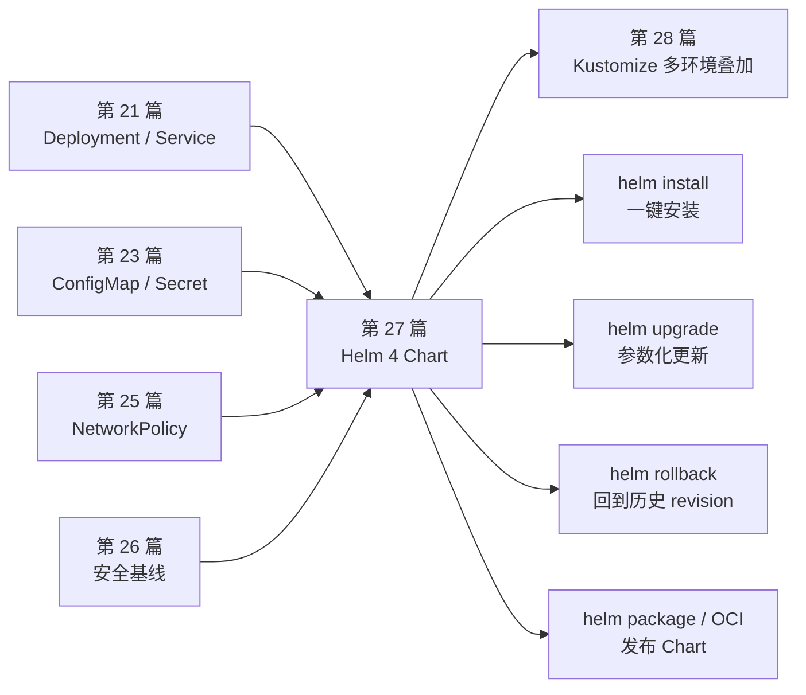
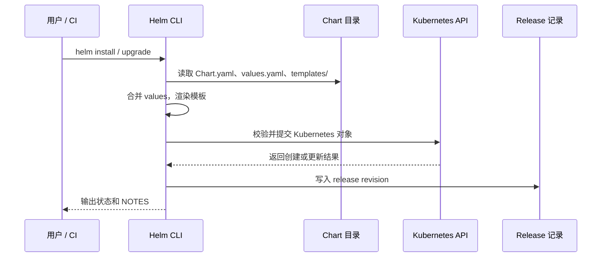
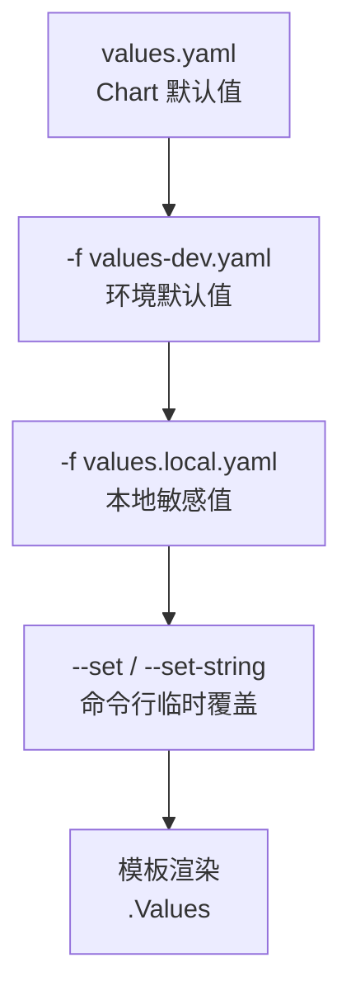
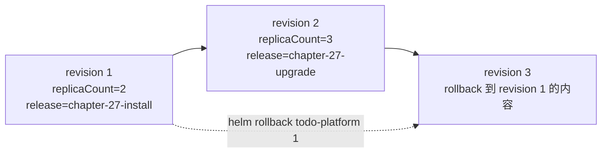
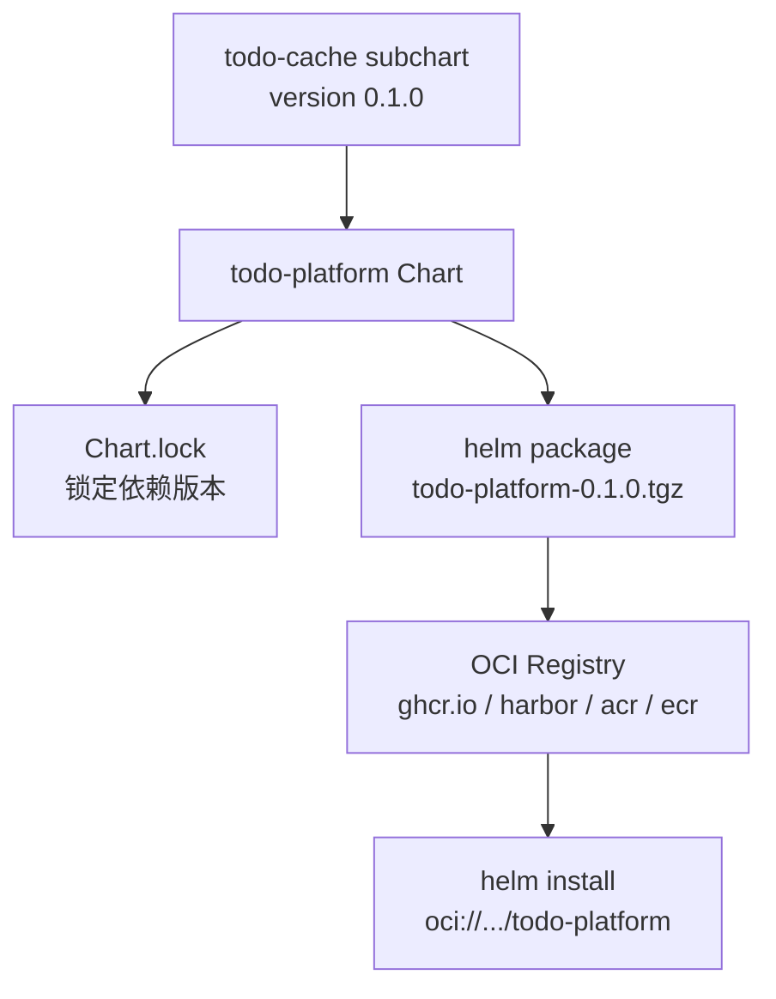
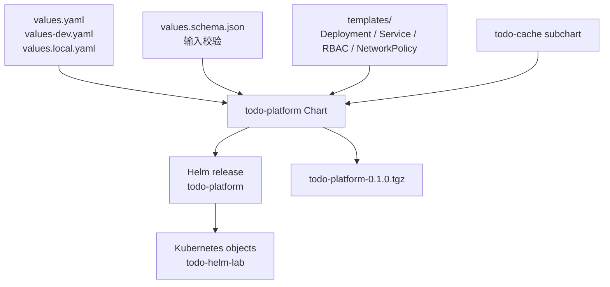

# 第 27 篇：Helm 4 包管理 [C]

第 20-26 篇把 Todo Platform 在 Kubernetes 中逐步拼起来：工作负载、Service、配置、存储、网络和安全基线都已经出现。到了这一篇，我们先把 Todo API 主链路收束成一个可版本化、可安装、可升级、可回滚的 Helm Chart。第 24 篇的 PostgreSQL StatefulSet 不是被丢弃，而是暂时留在主线 YAML 中：本篇先让 Chart 模板和 release 生命周期足够聚焦，后续多环境和生产工程章节再把数据库、入口和更复杂的环境差异逐步并入完整平台交付。

本篇特色项目是：**为 Todo API 主链路建立 Todo Platform Helm 4 Chart 第一版，让团队用一条 `helm install` 命令安装，用 `helm upgrade` 发布新配置，用 `helm rollback` 回到历史版本。**

## 1. 本章学习目标

### 1.1 知识目标

- 能解释 Helm 里的 Chart、Release、Repository、Registry 和 Values 分别解决什么问题。
- 能区分 `Chart.yaml` 中的 `version`、`appVersion`、`kubeVersion` 和依赖版本。
- 能说明 `templates/`、`values.yaml`、`_helpers.tpl`、`NOTES.txt` 和 `.helmignore` 的职责。
- 能理解 Helm 模板渲染时 `.Values`、`.Release`、`.Chart` 和 `.Capabilities` 的数据来源。
- 能描述 `helm install`、`helm upgrade`、`helm rollback` 如何改变 release revision。
- 能说明 Chart 依赖、`Chart.lock`、本地 subchart 和 OCI（Open Container Initiative，开放容器标准）registry 发布之间的关系。
- 能理解 Helm 4 中 `--dry-run=client`、`--dry-run=server`、`--rollback-on-failure`、`values.schema.json` 和 OCI digest 安装的意义。

### 1.2 技能目标

- 能为 Todo API 主链路编写符合 Helm 4 的 Chart 目录结构。
- 能把 Deployment、Service、ConfigMap、Secret、ServiceAccount、RBAC、NetworkPolicy 和 HPA 模板化。
- 能用 `values.yaml`、`values-dev.yaml`、`values-prod.yaml` 和本地 `values.local.yaml` 管理不同环境参数。
- 能用 `values.schema.json`、`helm lint`、`helm template` 和 `helm install --dry-run=server` 在发布前验证 Chart。
- 能用 `helm install` 安装 Todo API Helm release，并用 `helm status`、`helm history` 和 `helm get manifest` 查看 release。
- 能用 `helm upgrade` 修改副本数和发布标识，并能用 `helm rollback` 回滚。
- 能用本地 subchart 演示 Chart 依赖管理，并能把 Chart 打包成 `.tgz` 为 OCI 发布做准备。

### 1.3 前置条件

开始本篇前，请确认你已经完成：

- 第 20 篇：已经有可用的 `todo-k8s` kind 集群，并能使用 `kubectl` 访问。
- 第 21 篇：理解 Deployment、Pod、Service、HPA 和滚动更新。
- 第 23 篇：理解 ConfigMap / Secret 的配置注入方式。
- 第 24 篇：理解 PostgreSQL StatefulSet 与数据库 DSN 的来源。
- 第 25 篇：理解 NetworkPolicy 是网络层访问控制。
- 第 26 篇：理解 ServiceAccount、RBAC、SecurityContext 和 Pod Security 基线。
- 第 16 篇：本地已经构建过 `todo-api:v0.1.0` 镜像，并能把镜像加载到 kind 集群。

本篇命令以 Linux / macOS / Windows Subsystem for Linux 2（WSL2，Windows 的 Linux 子系统）中的 Bash 为主。Windows PowerShell 用户可以把 `cat <<'YAML'` 这类 heredoc 命令改写为 here-string，例如：

```powershell
@'
key: value
'@ | Set-Content -Encoding utf8 deployments/helm/todo-platform/example.yaml
```

由于本篇需要创建的文件较多，Windows 用户更推荐在 WSL2 中执行实验。

!!! note "Helm 4 与 Chart API 版本"
    本课程基线使用 Helm 4.2.x。Helm 4 官方文档说明：Helm 4 对 CLI、插件、OCI、server-side apply 等能力做了演进，但 Helm 3 常用的 `apiVersion: v2` Chart 仍然可以继续使用。本篇使用 `apiVersion: v2`，这样学习者能把现有生产 Chart 经验自然迁移到 Helm 4。

## 2. 本章工作场景与真实案例

### 2.1 技术痛点

前几篇中，我们不断用 `kubectl apply -f ...` 应用单个 YAML 文件。这个方式适合学习 Kubernetes 对象，但真实团队很快会遇到几个问题：

- YAML 文件越来越多，安装顺序靠文档记忆。
- dev、test、prod 只有少数字段不同，却复制出三套大文件。
- 镜像 tag、副本数、资源限制、域名、Secret 名称散落在不同 YAML 中。
- 发布后很难回答“这次上线的配置和上次相比改了什么”。
- 回滚时只能手工找旧文件，容易漏掉某个对象。
- 多个团队复用同一套部署规范时，只能复制粘贴。

Helm 的价值不只是“少写 YAML”，而是把 Kubernetes 应用变成一个有版本、有参数、有发布记录的包。

### 2.2 团队协作场景

真实团队中，Helm Chart 往往是平台工程和应用工程之间的契约：

- 后端工程师维护镜像、启动参数、健康检查路径和业务配置项。
- 平台工程师维护 Chart 模板、RBAC、安全上下文、资源限制和默认 values。
- SRE 负责 release 命名、安装命令、升级策略、回滚流程和历史保留。
- 安全工程师审查 Chart 是否把 Secret 写入 Git，是否默认开启最小权限。
- CI/CD 在合并前执行 `helm lint`、`helm template`、`--dry-run=server` 和策略检查。

好的 Chart 不应该把所有 Kubernetes 字段都暴露成参数。它应该把团队真正需要调整的字段暴露出来，把安全、标签、探针、资源限制和命名规范沉淀成默认路径。

### 2.3 课程项目关联

第 20-26 篇已经完成了 Todo Platform 在 Kubernetes 中的主线能力：

```text
第 20 篇：kind 集群、控制面、Node、kubelet、CNI 基础
第 21 篇：Todo API Deployment、Probe、Namespace、HPA
第 22 篇：Service / Ingress / Gateway API 入口
第 23 篇：ConfigMap / Secret 配置管理
第 24 篇：PostgreSQL StatefulSet 与持久化
第 25 篇：DNS、Service 链路、NetworkPolicy 网络隔离
第 26 篇：ServiceAccount、RBAC、非 root、Restricted 安全基线
第 27 篇：Helm 4 Chart、安装、升级、回滚和打包发布
```

本篇会使用独立 Namespace `todo-helm-lab`，不覆盖 `todo-workloads` 和 `todo-security-lab`。这样你可以安全地学习 Helm release 生命周期，而不会破坏前几篇保留的主线资源。

为了让第一次 Helm 实验足够聚焦，本篇 Chart 只打包 Todo API 主链路：Deployment、Service、ConfigMap、Secret、ServiceAccount、RBAC、NetworkPolicy、HPA 和 Helm test。第 24 篇的 PostgreSQL StatefulSet、第 22 篇的入口资源不会在本篇一次性 Helm 化；它们会在后续多环境和生产工程章节中逐步并入完整平台交付。

图 27-1 展示本篇在阶段四中的位置：



第 28 篇会继续处理多环境问题。Helm 适合把应用打包成可安装单元；Kustomize 适合在已存在的 YAML 或 Chart 渲染结果上做环境叠加。两者不是互相替代，而是常常配合使用。

## 3. 核心概念

### 3.1 Chart、Release、Repository 与 Registry

Helm 有四个最核心的名词：

| 概念 | 一句话定义 | Todo Platform 中的例子 |
| --- | --- | --- |
| Chart | 一个 Kubernetes 应用包 | `deployments/helm/todo-platform/` |
| Release | 某个 Chart 在某个集群 Namespace 中的一次安装实例 | `todo-platform` release 安装在 `todo-helm-lab` |
| Repository | 传统 HTTP Chart 仓库，提供 `index.yaml` 和 `.tgz` 包 | 企业内部 Chart 仓库 |
| Registry | OCI registry，用类似镜像仓库的方式存储 Chart | `oci://ghcr.io/<org>/charts/todo-platform` |

一个 Chart 可以安装很多次，每次安装都形成一个 release。例如同一个 `todo-platform` Chart 可以安装成 `todo-dev`、`todo-test`、`todo-prod` 三个 release，分别使用不同 values。

如果你之前用过 Helm 3，Helm 4 最需要重新确认的是 CLI 标志语义。下表中的 Helm 4 行为已用本课程基线 Helm `v4.2.0` 的 `helm install --help` 和 `helm upgrade --help` 核验过：

| 功能 | Helm 3 常见写法 | Helm 4 推荐写法 |
| --- | --- | --- |
| 失败回滚 | `--atomic` | `--rollback-on-failure` |
| 等待资源 Ready | `--wait` | `--wait=watcher` 或单独 `--wait` |
| dry-run | `--dry-run` | `--dry-run=client` / `--dry-run=server` |
| OCI 登录 | 有些脚本会写完整 URL | `helm registry login ghcr.io`，只写 registry 域名 |

Helm 4 中 `--wait` 是带策略的标志：省略 `--wait` 时默认只等待 hook；写 `--wait` 或 `--wait=watcher` 时使用 watcher 策略；写 `--wait=legacy` 时使用旧等待逻辑。`--rollback-on-failure` 会在失败时回滚，并默认启用 watcher 等待策略。

### 3.2 Chart 目录结构与 `Chart.yaml`

Helm Chart 是一个固定结构的目录。最小结构如下：

```text
todo-platform/
├── Chart.yaml
├── values.yaml
├── .helmignore
└── templates/
    ├── _helpers.tpl
    ├── deployment.yaml
    ├── service.yaml
    └── NOTES.txt
```

`Chart.yaml` 描述 Chart 自身：

```yaml
apiVersion: v2
name: todo-platform
description: Helm 4 chart for Cloud Native Todo Platform
type: application
version: 0.1.0
appVersion: "v0.1.0"
kubeVersion: ">=1.25.0-0"
```

几个字段容易混淆：

| 字段 | 作用 | 是否建议频繁变化 |
| --- | --- | --- |
| `apiVersion` | Chart 格式版本，本篇使用 `v2` | 很少变化 |
| `version` | Chart 包版本，必须符合 SemVer | 每次 Chart 逻辑变化都应变化 |
| `appVersion` | 应用版本，通常对应镜像 tag 或 Git tag | 应用发布时变化 |
| `kubeVersion` | 声明兼容的 Kubernetes 版本范围 | 支持矩阵变化时变化 |

`version` 和 `appVersion` 不要混用。修复一个模板 bug，应用镜像没变，也应该提升 `version`；只换应用镜像，Chart 模板没变，也可能只改 `appVersion` 和 values 中的 image tag。

### 3.3 `values.yaml` 与参数化边界

`values.yaml` 是 Chart 的默认参数。模板通过 `.Values` 读取这些参数：

```yaml
replicaCount: 2
image:
  repository: todo-api
  tag: v0.1.0
  pullPolicy: IfNotPresent
service:
  type: ClusterIP
  port: 80
```

模板中可以这样使用：

```yaml
spec:
  replicas: {{ .Values.replicaCount }}
  containers:
    - name: todo-api
      image: "{{ .Values.image.repository }}:{{ .Values.image.tag }}"
```

Helm 允许多层覆盖 values。常见优先级从低到高是：

```text
Chart 内置 values.yaml
-> helm install -f values-dev.yaml
-> helm install -f values.local.yaml
-> helm install --set replicaCount=3
```

如果多次使用 `-f`，右侧文件优先级更高。例如：

```bash
helm upgrade todo-platform ./deployments/helm/todo-platform \
  -f values.yaml \
  -f values-dev.yaml \
  -f values.local.yaml
```

这里显式写 `-f values.yaml` 只是为了演示覆盖顺序。实际安装本 Chart 时，Chart 内置的 `values.yaml` 会自动加载，不需要手动传入。`values.local.yaml` 会覆盖前两个文件中的同名字段。

### 3.4 模板、内置对象和 helper

Helm 模板使用 Go template 语法。常用内置对象包括：

| 对象 | 来源 | 常见用途 |
| --- | --- | --- |
| `.Values` | `values.yaml` 和命令行覆盖 | 副本数、镜像、资源限制 |
| `.Release` | 当前 release | release 名称、Namespace、revision |
| `.Chart` | `Chart.yaml` | Chart 名称、Chart 版本、应用版本 |
| `.Capabilities` | 当前集群能力 | 判断 API 版本是否存在 |

为了避免每个模板重复写标签和名称，Helm 通常把公共片段放进 `templates/_helpers.tpl`。以下是一个简化示例：

```yaml
{{- define "todo-platform.fullname" -}}
{{- printf "%s-%s" .Release.Name .Chart.Name | trunc 63 | trimSuffix "-" -}}
{{- end -}}
```

模板里再通过 `include` 调用：

```yaml
metadata:
  name: {{ include "todo-platform.fullname" . }}
```

`include` 比 `template` 更适合 YAML，因为它能接管输出结果并继续传给 `nindent`、`quote`、`toYaml` 这些函数。缩进出错是 Helm 初学者最常见的问题之一。

### 3.5 install、upgrade、rollback 与 release 记录

Helm 不只是把模板渲染后 apply 到集群。它还会记录 release 历史：

```bash
helm install todo-platform ./deployments/helm/todo-platform
helm upgrade todo-platform ./deployments/helm/todo-platform --set replicaCount=3
helm rollback todo-platform 1
helm history todo-platform
```

release revision 的变化类似这样：

| 操作 | 结果 |
| --- | --- |
| `helm install` | 创建 revision 1 |
| `helm upgrade` | 创建 revision 2 |
| `helm rollback todo-platform 1` | 创建 revision 3，内容回到 revision 1 |

注意：rollback 不是“把 revision 2 删除”，而是创建一个新的 revision，配置内容回到目标版本。这样审计链路是连续的。

### 3.6 Chart 依赖、`Chart.lock` 与 OCI 发布

Chart 可以依赖另一个 Chart。依赖声明写在父 Chart 的 `Chart.yaml` 中：

```yaml
dependencies:
  - name: todo-cache
    alias: cache
    version: 0.1.0
    repository: "file://../todo-cache"
    condition: cache.enabled
```

执行：

```bash
helm dependency update deployments/helm/todo-platform
```

Helm 会解析依赖，把依赖包放入父 Chart 的 `charts/` 目录，并生成 `Chart.lock`。生产项目应提交 `Chart.lock`，因为它记录了被锁定的依赖版本和摘要。

Chart 可以打包成 `.tgz`：

```bash
helm package deployments/helm/todo-platform --destination deployments/helm/packages
```

也可以推送到 OCI registry：

```bash
helm registry login ghcr.io
helm push deployments/helm/packages/todo-platform-0.1.0.tgz oci://ghcr.io/example/charts
```

Helm 4 的一个重要变化是：`helm registry login` 使用 registry 域名，不要写完整 `https://ghcr.io/example/charts` URL。

## 4. 原理深入

### 4.1 Helm 发布链路

`helm install` 的核心链路可以拆成六步。

图 27-2 Helm install / upgrade 发布链路：



从这个流程可以看出，Helm 的输入是 Chart 和 values，输出是 Kubernetes 对象和 release 记录。排障时也要沿着这两条线检查：渲染出来的 YAML 是否正确，集群是否接受这些对象。

### 4.2 values 合并与覆盖

Helm 的 values 是多层合并模型。

图 27-3 values 覆盖顺序：



这带来两个实践原则：

- 稳定默认值放进 `values.yaml`，例如端口、探针路径、标签规范。
- 环境差异放进 `values-dev.yaml`、`values-prod.yaml`，例如副本数、资源限制、域名。
- 真实 Secret 不进 Git，放进 `values.local.yaml`、外部 Secret 系统或现有 Kubernetes Secret。

不要把 values 当成“所有字段都能改”的大开关。过度参数化会让 Chart 难以审查，也会让团队失去统一基线。

### 4.3 模板渲染与 YAML 缩进

Helm 模板最终必须生成合法 Kubernetes YAML。模板语法本身没有错，不代表输出 YAML 一定正确。

常见错误是缩进：

```yaml
labels:
{{ include "todo-platform.labels" . }}
```

这会把 labels 内容顶到行首，生成无效 YAML。正确写法是：

```yaml
labels:
{{ include "todo-platform.labels" . | nindent 4 }}
```

`nindent 4` 会先换行，再缩进 4 个空格。只要模板要嵌入 YAML 子树，就优先考虑 `toYaml | nindent` 或 `include | nindent`。

### 4.4 release revision 与回滚

Helm release 是有历史的。

图 27-4 release revision 与 rollback：



回滚只是把目标 revision 的 manifest 和 values 重新应用一次。它不会自动修复外部系统状态。例如数据库迁移已经执行、数据已经变更、外部负载均衡已经改 DNS 时，Chart 回滚只负责 Kubernetes 对象层面。

### 4.5 依赖与发布仓库

Chart 依赖和 OCI 发布解决的是“可复用”和“可分发”。

图 27-5 Chart 依赖与 OCI 发布：



本篇使用本地 `file://` subchart 做依赖演示，这样学习者不需要公网 Chart 仓库。生产中可以依赖企业内部 Chart 仓库、OCI registry 或开源 Chart，但一定要固定版本并提交锁文件。

## 5. 手把手实验

### 5.1 实验目标

把 Todo API 主链路打包为 Todo Platform Helm 4 Chart 第一版，在 `todo-helm-lab` Namespace 中完成安装、升级、回滚、依赖更新和本地打包。

### 5.2 实验环境

| 工具 | 建议版本 | 用途 |
| --- | --- | --- |
| Helm | v4.2.x | Chart 渲染、安装、升级、回滚和打包 |
| Kubernetes | v1.35.0（kind 实际版本），v1.25+ 可完成主线 | 运行 Todo API Helm release |
| kubectl | 与集群小版本相近 | 查看和验证资源 |
| kind | v0.30+ | 本地 Kubernetes 集群 |
| Docker | 29.x | 构建和加载 `todo-api:v0.1.0` 镜像 |
| Bash | Linux / macOS / WSL2 | 执行 heredoc 创建文件 |

检查版本：

```bash
helm version --short
kubectl version --client
kubectl cluster-info
docker image inspect todo-api:v0.1.0 >/dev/null
```

如果 kind 节点中没有 `todo-api:v0.1.0` 镜像，先加载：

```bash
kind load docker-image todo-api:v0.1.0 --name todo-k8s
```

### 5.3 文件目录结构

以下命令均在项目根目录执行，也就是包含 `docs/` 和 `.gitignore` 的仓库根目录。

```bash
mkdir -p deployments/helm/todo-platform/templates/tests
mkdir -p deployments/helm/todo-cache/templates
mkdir -p deployments/helm/packages
```

最终目录如下：

```text
deployments/helm/
├── packages/                                  # ← helm package 输出目录，不提交
├── todo-cache/                                # ← 本地 subchart，演示依赖
│   ├── Chart.yaml
│   ├── values.yaml
│   └── templates/
│       └── cache-configmap.yaml
└── todo-platform/
    ├── Chart.yaml
    ├── values.yaml
    ├── values-dev.yaml
    ├── values-prod.yaml
    ├── values.schema.json                    # ← values 输入校验规则
    ├── values.local.yaml                      # ← 本地敏感值，不提交
    ├── .helmignore
    └── templates/
        ├── _helpers.tpl
        ├── configmap.yaml
        ├── runtime-configmap.yaml
        ├── secret.yaml
        ├── serviceaccount.yaml
        ├── rbac.yaml
        ├── deployment.yaml
        ├── service.yaml
        ├── hpa.yaml
        ├── networkpolicy.yaml
        ├── NOTES.txt
        └── tests/
            └── test-connection.yaml
```

确认 `.gitignore` 包含 Helm 本地文件规则：

```bash
grep -q 'deployments/helm/**/*.local.yaml' .gitignore || cat >> .gitignore <<'EOF'
deployments/helm/**/*.local.yaml
deployments/helm/**/charts/*.tgz
deployments/helm/packages/
EOF
```

### 5.4 完整 Chart 配置

先创建本地 subchart。它只生成一个 ConfigMap，用来演示 Chart 依赖和 alias，不参与 Todo API 主链路：

```bash
cat > deployments/helm/todo-cache/Chart.yaml <<'YAML'
apiVersion: v2
name: todo-cache
description: A tiny local subchart used to demonstrate Helm dependencies.
type: application
version: 0.1.0
appVersion: "v0.1.0"
YAML
```

```bash
cat > deployments/helm/todo-cache/values.yaml <<'YAML'
message: "todo-cache local dependency is enabled"
YAML
```

```bash
cat > deployments/helm/todo-cache/templates/cache-configmap.yaml <<'YAML'
apiVersion: v1
kind: ConfigMap
metadata:
  name: {{ .Release.Name }}-cache-info
  labels:
    app.kubernetes.io/name: todo-cache
    app.kubernetes.io/instance: {{ .Release.Name }}
    app.kubernetes.io/managed-by: {{ .Release.Service }}
data:
  message: {{ .Values.message | quote }}
YAML
```

创建父 Chart 的 `Chart.yaml`。这里使用 `file://../todo-cache` 做本地依赖，避免公网仓库不稳定影响主线实验：

```bash
cat > deployments/helm/todo-platform/Chart.yaml <<'YAML'
apiVersion: v2
name: todo-platform
description: Helm 4 chart for Cloud Native Todo Platform.
type: application
version: 0.1.0
appVersion: "v0.1.0"
kubeVersion: ">=1.25.0-0"
keywords:
  - todo
  - kubernetes
  - helm
  - cloud-native
maintainers:
  - name: platform-team
    email: platform@example.com
dependencies:
  - name: todo-cache
    alias: cache
    version: 0.1.0
    repository: "file://../todo-cache"
    condition: cache.enabled
YAML
```

创建 `.helmignore`，避免把本地 Secret 和临时输出打进 Chart 包。不要忽略 `charts/*.tgz`，否则父 Chart 打包时会漏掉依赖包：

```bash
cat > deployments/helm/todo-platform/.helmignore <<'EOF'
.git/
.DS_Store
*.local.yaml
packages/
tmp/
EOF
```

创建 `values.schema.json`。它不会替代业务校验，但能在 `helm lint`、`helm template`、`helm install` 和 `helm upgrade` 时提前拦住明显错误，例如副本数写成字符串、JWT Secret 太短、HPA 最大副本数小于 1：

```bash
cat > deployments/helm/todo-platform/values.schema.json <<'JSON'
{
  "$schema": "https://json-schema.org/draft-07/schema#",
  "type": "object",
  "properties": {
    "replicaCount": {
      "type": "integer",
      "minimum": 1
    },
    "image": {
      "type": "object",
      "properties": {
        "repository": {
          "type": "string",
          "minLength": 1
        },
        "tag": {
          "type": "string",
          "minLength": 1
        },
        "pullPolicy": {
          "type": "string",
          "enum": ["Always", "IfNotPresent", "Never"]
        }
      }
    },
    "auth": {
      "type": "object",
      "properties": {
        "create": {
          "type": "boolean"
        },
        "existingSecret": {
          "type": "string"
        },
        "jwtSecret": {
          "type": "string",
          "minLength": 32
        },
        "authUsers": {
          "type": "string",
          "minLength": 1
        }
      }
    },
    "hpa": {
      "type": "object",
      "properties": {
        "enabled": {
          "type": "boolean"
        },
        "minReplicas": {
          "type": "integer",
          "minimum": 1
        },
        "maxReplicas": {
          "type": "integer",
          "minimum": 1
        },
        "averageUtilization": {
          "type": "integer",
          "minimum": 1,
          "maximum": 100
        }
      }
    }
  }
}
JSON
```

创建默认 values。默认值适合本地开发，但 `auth.authUsers` 是占位值，真正安装前会由 `values.local.yaml` 覆盖：

```bash
cat > deployments/helm/todo-platform/values.yaml <<'YAML'
nameOverride: ""
fullnameOverride: ""

replicaCount: 2
revisionHistoryLimit: 5 # ← 保留最近 5 个 ReplicaSet 历史，便于排查和回滚。

image:
  repository: todo-api
  tag: v0.1.0
  pullPolicy: IfNotPresent

imagePullSecrets: []

serviceAccount:
  create: true
  name: ""
  automountToken: false # ← Todo API 不调用 Kubernetes API，默认不挂载 ServiceAccount token。

rbac:
  create: true

config:
  env: dev
  apiAddr: "0.0.0.0:18080" # ← 容器内监听地址，Service 会转发到这个端口。
  logLevel: debug
  corsAllowedOrigins: "https://todo.localhost:18443,https://todo-gateway.localhost:18443"
  pprofEnabled: "false"
  release: "chapter-27-install"

runtimeConfig:
  enabled: true
  notes: |-
    config version: chapter-27-helm
    owner: platform-team
    purpose: rendered by Helm 4

auth:
  create: true
  existingSecret: ""
  jwtSecret: "dev-only-jwt-secret-change-me-0123456789"
  authUsers: "admin=replace-with-generated-hash"

podSecurityContext:
  runAsNonRoot: true
  runAsUser: 10001 # ← 继承第 26 篇非 root 安全基线。
  runAsGroup: 10001
  fsGroup: 10001
  seccompProfile:
    type: RuntimeDefault

containerSecurityContext:
  allowPrivilegeEscalation: false
  readOnlyRootFilesystem: true # ← 根文件系统只读，临时写入通过 /tmp emptyDir 承接。
  capabilities:
    drop:
      - ALL

service:
  type: ClusterIP
  port: 80
  targetPort: 18080 # ← 对应 Todo API 容器内的 TODO_API_ADDR 端口。

resources:
  requests:
    cpu: 50m
    memory: 64Mi
  limits:
    cpu: 500m
    memory: 256Mi

probes:
  startup:
    periodSeconds: 2
    failureThreshold: 30
  readiness:
    periodSeconds: 5
    failureThreshold: 3
  liveness:
    periodSeconds: 10
    failureThreshold: 3

hpa:
  enabled: false
  minReplicas: 2
  maxReplicas: 5
  averageUtilization: 60

networkPolicy:
  enabled: true

cache:
  enabled: false
  message: "todo-cache dependency is disabled by default"
YAML
```

创建 dev values：

```bash
cat > deployments/helm/todo-platform/values-dev.yaml <<'YAML'
replicaCount: 2

config:
  env: dev
  logLevel: debug
  release: "chapter-27-dev"

resources:
  requests:
    cpu: 50m
    memory: 64Mi
  limits:
    cpu: 500m
    memory: 256Mi

hpa:
  enabled: false

cache:
  enabled: false
YAML
```

创建 prod values 示例。它不直接用于本地主线安装，因为真实生产 Secret 应该由外部系统创建。注意：这里开启了 HPA，但 HPA 真正生效还依赖集群安装 metrics-server，并且容器必须配置合理的 `resources.requests`，否则 HPA 可能无法计算 CPU 利用率。

```bash
cat > deployments/helm/todo-platform/values-prod.yaml <<'YAML'
replicaCount: 3

config:
  env: prod
  logLevel: info
  corsAllowedOrigins: "https://todo.example.com"
  release: "chapter-27-prod"

auth:
  create: false
  existingSecret: todo-api-auth-prod

resources:
  requests:
    cpu: 200m
    memory: 256Mi
  limits:
    cpu: "1"
    memory: 512Mi

hpa:
  enabled: true
  minReplicas: 3
  maxReplicas: 10
  averageUtilization: 60

networkPolicy:
  enabled: true
YAML
```

创建 helper 模板：

```bash
cat > deployments/helm/todo-platform/templates/_helpers.tpl <<'YAML'
{{/*
Return the chart name.
*/}}
{{- define "todo-platform.name" -}}
{{- default .Chart.Name .Values.nameOverride | trunc 63 | trimSuffix "-" -}}
{{- end -}}

{{/*
Return the full resource name.
*/}}
{{- define "todo-platform.fullname" -}}
{{- if .Values.fullnameOverride -}}
{{- .Values.fullnameOverride | trunc 63 | trimSuffix "-" -}}
{{- else -}}
{{- $name := default .Chart.Name .Values.nameOverride -}}
{{- if contains $name .Release.Name -}}
{{- .Release.Name | trunc 63 | trimSuffix "-" -}}
{{- else -}}
{{- printf "%s-%s" .Release.Name $name | trunc 63 | trimSuffix "-" -}}
{{- end -}}
{{- end -}}
{{- end -}}

{{/*
Common labels shared by all resources.
*/}}
{{- define "todo-platform.labels" -}}
helm.sh/chart: {{ printf "%s-%s" .Chart.Name .Chart.Version | replace "+" "_" }}
app.kubernetes.io/name: {{ include "todo-platform.name" . }}
app.kubernetes.io/instance: {{ .Release.Name }}
app.kubernetes.io/version: {{ .Chart.AppVersion | quote }}
app.kubernetes.io/managed-by: {{ .Release.Service }}
app.kubernetes.io/part-of: todo-platform
{{- end -}}

{{/*
Selector labels must stay stable across upgrades.
*/}}
{{- define "todo-platform.selectorLabels" -}}
app.kubernetes.io/name: {{ include "todo-platform.name" . }}
app.kubernetes.io/instance: {{ .Release.Name }}
{{- end -}}

{{/*
ServiceAccount name.
*/}}
{{- define "todo-platform.serviceAccountName" -}}
{{- if .Values.serviceAccount.create -}}
{{- default (include "todo-platform.fullname" .) .Values.serviceAccount.name -}}
{{- else -}}
{{- default "default" .Values.serviceAccount.name -}}
{{- end -}}
{{- end -}}

{{/*
Secret name used by the API deployment.
*/}}
{{- define "todo-platform.authSecretName" -}}
{{- if .Values.auth.existingSecret -}}
{{- .Values.auth.existingSecret -}}
{{- else -}}
{{- printf "%s-auth" (include "todo-platform.fullname" .) -}}
{{- end -}}
{{- end -}}
YAML
```

创建 ConfigMap 模板：

本篇没有把 PostgreSQL 纳入 Helm Chart 第一版，因此这里故意不设置 `TODO_DATABASE_DSN`。第 12 篇和第 21 篇已经说明过：Todo API 未设置 `TODO_DATABASE_DSN` 时会使用内存 Repository；设置后才切换到 PostgreSQL Repository。这个选择让本篇实验聚焦 Helm 生命周期，而不是数据库连接。

```bash
cat > deployments/helm/todo-platform/templates/configmap.yaml <<'YAML'
apiVersion: v1
kind: ConfigMap
metadata:
  name: {{ include "todo-platform.fullname" . }}
  labels:
{{ include "todo-platform.labels" . | nindent 4 }}
data:
  TODO_ENV: {{ .Values.config.env | quote }}
  TODO_API_ADDR: {{ .Values.config.apiAddr | quote }}
  TODO_LOG_LEVEL: {{ .Values.config.logLevel | quote }}
  TODO_CORS_ALLOWED_ORIGINS: {{ .Values.config.corsAllowedOrigins | quote }}
  TODO_PPROF_ENABLED: {{ .Values.config.pprofEnabled | quote }}
  TODO_RELEASE: {{ .Values.config.release | quote }}
  # 本篇故意不设置 TODO_DATABASE_DSN；未设置时 Todo API 使用内存 Repository。
YAML
```

创建运行时文件 ConfigMap：

```bash
cat > deployments/helm/todo-platform/templates/runtime-configmap.yaml <<'YAML'
{{- if .Values.runtimeConfig.enabled }}
apiVersion: v1
kind: ConfigMap
metadata:
  name: {{ include "todo-platform.fullname" . }}-runtime
  labels:
{{ include "todo-platform.labels" . | nindent 4 }}
data:
  runtime-notes.txt: |-
{{ .Values.runtimeConfig.notes | nindent 4 }}
{{- end }}
YAML
```

创建 Secret 模板。它只服务本地实验；生产环境建议设置 `auth.create=false` 并使用 `auth.existingSecret`：

```bash
cat > deployments/helm/todo-platform/templates/secret.yaml <<'YAML'
{{- if and .Values.auth.create (not .Values.auth.existingSecret) }}
apiVersion: v1
kind: Secret
metadata:
  name: {{ include "todo-platform.authSecretName" . }}
  labels:
{{ include "todo-platform.labels" . | nindent 4 }}
type: Opaque
stringData:
  TODO_JWT_SECRET: {{ .Values.auth.jwtSecret | quote }}
  TODO_AUTH_USERS: {{ .Values.auth.authUsers | quote }}
{{- end }}
YAML
```

创建 ServiceAccount：

```bash
cat > deployments/helm/todo-platform/templates/serviceaccount.yaml <<'YAML'
{{- if .Values.serviceAccount.create }}
apiVersion: v1
kind: ServiceAccount
metadata:
  name: {{ include "todo-platform.serviceAccountName" . }}
  labels:
{{ include "todo-platform.labels" . | nindent 4 }}
automountServiceAccountToken: {{ .Values.serviceAccount.automountToken }}
{{- end }}
YAML
```

创建 RBAC：

```bash
cat > deployments/helm/todo-platform/templates/rbac.yaml <<'YAML'
{{- if .Values.rbac.create }}
apiVersion: rbac.authorization.k8s.io/v1
kind: Role
metadata:
  name: {{ include "todo-platform.fullname" . }}-config-reader
  labels:
{{ include "todo-platform.labels" . | nindent 4 }}
rules:
  - apiGroups: [""]
    resources: ["configmaps"]
    resourceNames:
      - {{ include "todo-platform.fullname" . | quote }}
    verbs: ["get"]
---
apiVersion: rbac.authorization.k8s.io/v1
kind: RoleBinding
metadata:
  name: {{ include "todo-platform.fullname" . }}-read-config
  labels:
{{ include "todo-platform.labels" . | nindent 4 }}
subjects:
  - kind: ServiceAccount
    name: {{ include "todo-platform.serviceAccountName" . }}
    namespace: {{ .Release.Namespace }}
roleRef:
  apiGroup: rbac.authorization.k8s.io
  kind: Role
  name: {{ include "todo-platform.fullname" . }}-config-reader
{{- end }}
YAML
```

创建 Deployment。这里把第 21 篇的探针、第 23 篇的 ConfigMap / Secret、第 26 篇的安全上下文组合到一个模板中：

```bash
cat > deployments/helm/todo-platform/templates/deployment.yaml <<'YAML'
apiVersion: apps/v1
kind: Deployment
metadata:
  name: {{ include "todo-platform.fullname" . }}
  labels:
{{ include "todo-platform.labels" . | nindent 4 }}
spec:
  replicas: {{ .Values.replicaCount }}
  revisionHistoryLimit: {{ .Values.revisionHistoryLimit }}
  selector:
    matchLabels:
{{ include "todo-platform.selectorLabels" . | nindent 6 }}
  strategy:
    type: RollingUpdate
    rollingUpdate:
      maxSurge: 1 # ← 升级时允许额外创建 1 个新 Pod。
      maxUnavailable: 0 # ← 升级期间至少保持旧 Pod 可用。
  template:
    metadata:
      labels:
{{ include "todo-platform.selectorLabels" . | nindent 8 }}
        app.kubernetes.io/part-of: todo-platform
    spec:
      serviceAccountName: {{ include "todo-platform.serviceAccountName" . }}
      automountServiceAccountToken: {{ .Values.serviceAccount.automountToken }}
      terminationGracePeriodSeconds: 30 # ← 给应用 30 秒处理优雅退出。
      securityContext:
{{ toYaml .Values.podSecurityContext | nindent 8 }}
      {{- with .Values.imagePullSecrets }}
      imagePullSecrets:
{{ toYaml . | nindent 8 }}
      {{- end }}
      containers:
        - name: todo-api
          image: "{{ .Values.image.repository }}:{{ .Values.image.tag | default .Chart.AppVersion }}"
          imagePullPolicy: {{ .Values.image.pullPolicy }}
          args:
            - serve
          ports:
            - name: http
              containerPort: {{ .Values.service.targetPort }}
          envFrom:
            - configMapRef:
                name: {{ include "todo-platform.fullname" . }}
            - secretRef:
                name: {{ include "todo-platform.authSecretName" . }}
          startupProbe:
            httpGet:
              path: /healthz
              port: http
            periodSeconds: {{ .Values.probes.startup.periodSeconds }}
            failureThreshold: {{ .Values.probes.startup.failureThreshold }}
          readinessProbe:
            httpGet:
              path: /readyz
              port: http
            periodSeconds: {{ .Values.probes.readiness.periodSeconds }}
            failureThreshold: {{ .Values.probes.readiness.failureThreshold }}
          livenessProbe:
            httpGet:
              path: /healthz
              port: http
            periodSeconds: {{ .Values.probes.liveness.periodSeconds }}
            failureThreshold: {{ .Values.probes.liveness.failureThreshold }}
          resources:
{{ toYaml .Values.resources | nindent 12 }}
          securityContext:
{{ toYaml .Values.containerSecurityContext | nindent 12 }}
          volumeMounts:
            - name: tmp
              mountPath: /tmp
          {{- if .Values.runtimeConfig.enabled }}
            - name: runtime-config
              mountPath: /app/runtime-config
              readOnly: true
          {{- end }}
      volumes:
        - name: tmp
          emptyDir: {} # ← 配合 readOnlyRootFilesystem，为 /tmp 提供可写空间。
      {{- if .Values.runtimeConfig.enabled }}
        - name: runtime-config
          configMap:
            name: {{ include "todo-platform.fullname" . }}-runtime
      {{- end }}
YAML
```

创建 Service：

```bash
cat > deployments/helm/todo-platform/templates/service.yaml <<'YAML'
apiVersion: v1
kind: Service
metadata:
  name: {{ include "todo-platform.fullname" . }}
  labels:
{{ include "todo-platform.labels" . | nindent 4 }}
spec:
  type: {{ .Values.service.type }}
  selector:
{{ include "todo-platform.selectorLabels" . | nindent 4 }}
  ports:
    - name: http
      port: {{ .Values.service.port }}
      targetPort: http
YAML
```

创建 HPA：

```bash
cat > deployments/helm/todo-platform/templates/hpa.yaml <<'YAML'
{{- if .Values.hpa.enabled }}
apiVersion: autoscaling/v2
kind: HorizontalPodAutoscaler
metadata:
  name: {{ include "todo-platform.fullname" . }}
  labels:
{{ include "todo-platform.labels" . | nindent 4 }}
spec:
  scaleTargetRef:
    apiVersion: apps/v1
    kind: Deployment
    name: {{ include "todo-platform.fullname" . }}
  minReplicas: {{ .Values.hpa.minReplicas }}
  maxReplicas: {{ .Values.hpa.maxReplicas }}
  metrics:
    - type: Resource
      resource:
        name: cpu
        target:
          type: Utilization
          averageUtilization: {{ .Values.hpa.averageUtilization }}
{{- end }}
YAML
```

创建 NetworkPolicy。它只限制入口流量，允许同 Namespace 内的客户端访问 Todo API：

```bash
cat > deployments/helm/todo-platform/templates/networkpolicy.yaml <<'YAML'
{{- if .Values.networkPolicy.enabled }}
apiVersion: networking.k8s.io/v1
kind: NetworkPolicy
metadata:
  name: {{ include "todo-platform.fullname" . }}
  labels:
{{ include "todo-platform.labels" . | nindent 4 }}
spec:
  podSelector:
    matchLabels:
{{ include "todo-platform.selectorLabels" . | nindent 6 }}
  policyTypes:
    - Ingress
  ingress:
    - from:
        - podSelector: {}
      ports:
        - protocol: TCP
          port: http
{{- end }}
YAML
```

创建 Helm test Pod：

```bash
cat > deployments/helm/todo-platform/templates/tests/test-connection.yaml <<'YAML'
apiVersion: v1
kind: Pod
metadata:
  name: "{{ include "todo-platform.fullname" . }}-test-connection"
  labels:
{{ include "todo-platform.labels" . | nindent 4 }}
  annotations:
    "helm.sh/hook": test
    "helm.sh/hook-delete-policy": hook-succeeded
spec:
  restartPolicy: Never
  containers:
    - name: wget
      image: registry.cn-guangzhou.aliyuncs.com/yleoer/alpine:3.23
      command:
        - wget
      args:
        - -qO-
        - "http://{{ include "todo-platform.fullname" . }}:{{ .Values.service.port }}/healthz"
YAML
```

创建 `NOTES.txt`。安装完成后 Helm 会输出这段提示：

```bash
cat > deployments/helm/todo-platform/templates/NOTES.txt <<'EOF'
Todo Platform has been installed.

Release:
  Name: {{ .Release.Name }}
  Namespace: {{ .Release.Namespace }}
  Chart: {{ .Chart.Name }} {{ .Chart.Version }}
  App: {{ .Chart.AppVersion }}

Check rollout:
  kubectl -n {{ .Release.Namespace }} rollout status deployment/{{ include "todo-platform.fullname" . }}

Access locally:
  kubectl -n {{ .Release.Namespace }} port-forward service/{{ include "todo-platform.fullname" . }} 18084:{{ .Values.service.port }}
  curl http://127.0.0.1:18084/healthz

Run Helm test:
  helm test {{ .Release.Name }} -n {{ .Release.Namespace }} --logs
EOF
```

生成本地 values。`values.local.yaml` 包含本地实验 Secret，不要提交到 Git。

这里要提前记住一个安全边界：Helm dry-run、`helm get manifest`、release 记录和 CI 日志都可能出现渲染后的 Secret。下面的固定 JWT Secret 和本地管理员哈希只服务于实验；生产环境应设置 `auth.create=false` 和 `auth.existingSecret`，让 External Secrets、Sealed Secrets、Vault、云密钥服务或平台流水线单独创建真实 Secret。

`hash-password` 子命令来自第 14 篇，并在第 16 篇镜像构建实验中验证过。如果下面命令提示找不到镜像或子命令，请先回到第 16 篇重新构建 `todo-api:v0.1.0`。PowerShell 用户应使用 `$HASH = docker run --rm todo-api:v0.1.0 hash-password "change-me-123"`，并用 PowerShell here-string 创建 `values.local.yaml`。

```bash
HASH=$(docker run --rm todo-api:v0.1.0 hash-password "change-me-123")

cat > deployments/helm/todo-platform/values.local.yaml <<YAML
auth:
  create: true
  jwtSecret: "0123456789abcdef0123456789abcdef"
  authUsers: "admin=${HASH}"
YAML
```

### 5.5 执行命令

先更新 Chart 依赖。由于依赖来自本地 `file://../todo-cache`，这一步不需要访问公网：

```bash
helm dependency update deployments/helm/todo-platform
```

静态检查 Chart：

```bash
helm lint deployments/helm/todo-platform \
  -f deployments/helm/todo-platform/values-dev.yaml \
  -f deployments/helm/todo-platform/values.local.yaml
```

客户端渲染模板，确认输出 YAML：

```bash
helm template todo-platform deployments/helm/todo-platform \
  -n todo-helm-lab \
  -f deployments/helm/todo-platform/values-dev.yaml \
  -f deployments/helm/todo-platform/values.local.yaml \
  > /tmp/todo-platform-rendered.yaml

grep -n "kind: Deployment" /tmp/todo-platform-rendered.yaml
grep -n "kind: NetworkPolicy" /tmp/todo-platform-rendered.yaml
```

先确保实验 Namespace 存在。这样后面的 server-side dry-run 可以校验命名空间内资源，而不会因为 Namespace 尚不存在提前失败：

```bash
kubectl create namespace todo-helm-lab --dry-run=client -o yaml | kubectl apply -f -
```

用 API Server 做服务端 dry-run。Helm 4 的 `--dry-run=server` 会连接集群，让 API Server 检查资源字段和准入规则：

```bash
helm install todo-platform deployments/helm/todo-platform \
  -n todo-helm-lab \
  --create-namespace \
  -f deployments/helm/todo-platform/values-dev.yaml \
  -f deployments/helm/todo-platform/values.local.yaml \
  --dry-run=server
```

确认无误后安装 release。`--wait=watcher` 是 Helm 4 的等待策略写法，已经用 Helm `v4.2.0` help 输出核验；Helm 3 时代常见的布尔型 `--wait` 心智模型不要直接套用到这里：

```bash
helm install todo-platform deployments/helm/todo-platform \
  -n todo-helm-lab \
  --create-namespace \
  -f deployments/helm/todo-platform/values-dev.yaml \
  -f deployments/helm/todo-platform/values.local.yaml \
  --wait=watcher \
  --timeout=180s
```

查看 release 和 Kubernetes 对象：

```bash
helm status todo-platform -n todo-helm-lab
helm history todo-platform -n todo-helm-lab
helm get values todo-platform -n todo-helm-lab
helm get manifest todo-platform -n todo-helm-lab | head -30

kubectl -n todo-helm-lab get deploy,svc,cm,secret,sa,role,rolebinding,networkpolicy
kubectl -n todo-helm-lab rollout status deployment/todo-platform --timeout=180s
```

验证 Service 可访问：

```bash
kubectl -n todo-helm-lab port-forward service/todo-platform 18084:80
```

另开一个终端执行：

```bash
curl -fsS http://127.0.0.1:18084/healthz
curl -fsS http://127.0.0.1:18084/readyz
```

验证完成后，在运行 `port-forward` 的终端按 `Ctrl+C` 终止端口转发。

执行 Helm test：

```bash
helm test todo-platform -n todo-helm-lab --logs
```

升级 release，把副本数改为 3，并更新发布标识。`--rollback-on-failure` 是 Helm 4 中更直白的失败回滚标志，用来替代 Helm 3 脚本中常见的 `--atomic` 表达；本地实验也可以直接使用这个参数熟悉 Helm 4 的新命名：

```bash
helm upgrade todo-platform deployments/helm/todo-platform \
  -n todo-helm-lab \
  -f deployments/helm/todo-platform/values-dev.yaml \
  -f deployments/helm/todo-platform/values.local.yaml \
  --set replicaCount=3 \
  --set config.release=chapter-27-upgrade \
  --rollback-on-failure \
  --wait=watcher \
  --timeout=180s
```

查看升级结果：

```bash
helm history todo-platform -n todo-helm-lab
kubectl -n todo-helm-lab get deployment todo-platform \
  -o jsonpath='replicas={.spec.replicas}{"\n"}'
kubectl -n todo-helm-lab get configmap todo-platform \
  -o jsonpath='TODO_RELEASE={.data.TODO_RELEASE}{"\n"}'
```

回滚到 revision 1：

```bash
helm rollback todo-platform 1 \
  -n todo-helm-lab \
  --wait=watcher \
  --timeout=180s
```

查看回滚结果：

```bash
helm history todo-platform -n todo-helm-lab
kubectl -n todo-helm-lab get deployment todo-platform \
  -o jsonpath='replicas={.spec.replicas}{"\n"}'
kubectl -n todo-helm-lab get configmap todo-platform \
  -o jsonpath='TODO_RELEASE={.data.TODO_RELEASE}{"\n"}'
```

打包 Chart。因为本课程不提交 `charts/*.tgz` 依赖包缓存，所以在干净工作区、CI 或换机器后，打包前先执行 `helm dependency build`，用 `Chart.lock` 重新生成依赖包：

```bash
helm dependency build deployments/helm/todo-platform
helm package deployments/helm/todo-platform --destination deployments/helm/packages
helm show chart deployments/helm/packages/todo-platform-0.1.0.tgz
```

可选：推送到 OCI registry。下面命令包含占位符，不要直接复制执行到真实仓库。登录 GHCR 这类私有 registry 时通常使用 GitHub PAT、CI token 或机器人账号；不要把 token 明文写进脚本或 shell 历史。

```bash
helm registry login ghcr.io
helm push deployments/helm/packages/todo-platform-0.1.0.tgz oci://ghcr.io/<github-user>/charts
helm install todo-platform-oci oci://ghcr.io/<github-user>/charts/todo-platform \
  --version 0.1.0 \
  -n todo-helm-lab-oci \
  --create-namespace
```

Helm 4 支持按 OCI digest 安装 Chart，这能减少同名 tag 被替换带来的供应链风险。真实发布后，可以从 registry 或 CI 输出中取得 digest，再用下面这种形式安装：

```bash
helm install todo-platform-oci oci://ghcr.io/<github-user>/charts/todo-platform@sha256:<digest> \
  -n todo-helm-lab-oci \
  --create-namespace
```

### 5.6 预期输出

依赖更新成功：

```text
Saving 1 charts
Deleting outdated charts
```

lint 成功：

```text
==> Linting deployments/helm/todo-platform
[INFO] Chart.yaml: icon is recommended

1 chart(s) linted, 0 chart(s) failed
```

服务端 dry-run 会输出渲染后的 Manifest，并显示 release 信息。只要没有 `Error:`，就说明 API Server 接受这些对象。

安装成功：

```text
NAME: todo-platform
LAST DEPLOYED: ...
NAMESPACE: todo-helm-lab
STATUS: deployed
REVISION: 1
```

对象列表包含：

```text
deployment.apps/todo-platform
service/todo-platform
configmap/todo-platform
secret/todo-platform-auth
serviceaccount/todo-platform
role.rbac.authorization.k8s.io/todo-platform-config-reader
rolebinding.rbac.authorization.k8s.io/todo-platform-read-config
networkpolicy.networking.k8s.io/todo-platform
```

访问健康检查：

```text
ok
```

升级后，history 至少包含两条：

```text
REVISION  UPDATED                  STATUS      CHART                APP VERSION  DESCRIPTION
1         ...                      superseded  todo-platform-0.1.0  v0.1.0       Install complete
2         ...                      deployed    todo-platform-0.1.0  v0.1.0       Upgrade complete
```

回滚后，history 会新增一条 revision：

```text
REVISION  STATUS      DESCRIPTION
1         superseded  Install complete
2         superseded  Upgrade complete
3         deployed    Rollback to 1
```

打包成功：

```text
Successfully packaged chart and saved it to: deployments/helm/packages/todo-platform-0.1.0.tgz
```

### 5.7 验证方法

第一层：确认 Chart 静态检查通过。

```bash
helm lint deployments/helm/todo-platform \
  -f deployments/helm/todo-platform/values-dev.yaml \
  -f deployments/helm/todo-platform/values.local.yaml
```

判断标准：输出 `0 chart(s) failed`。

第二层：确认依赖锁定文件存在。

```bash
test -f deployments/helm/todo-platform/Chart.lock && echo "Chart.lock exists"
ls deployments/helm/todo-platform/charts/
helm dependency list deployments/helm/todo-platform
```

判断标准：看到 `todo-cache` 或别名 `cache` 依赖，状态为 `ok`。

第三层：确认 release 处于 deployed。

```bash
helm status todo-platform -n todo-helm-lab
helm list -n todo-helm-lab
```

判断标准：`STATUS` 是 `deployed`。

第四层：确认 Kubernetes 对象 Ready。

```bash
kubectl -n todo-helm-lab get pods
kubectl -n todo-helm-lab rollout status deployment/todo-platform --timeout=180s
```

判断标准：Pod 处于 `Running`，Deployment rollout 成功。

第五层：确认升级和回滚改变了 release history。

```bash
helm history todo-platform -n todo-helm-lab
```

判断标准：install、upgrade、rollback 都有独立 revision，rollback 后当前 revision 是最新一条。

第六层：确认服务仍然可用。

```bash
kubectl -n todo-helm-lab port-forward service/todo-platform 18084:80
curl -fsS http://127.0.0.1:18084/healthz
```

判断标准：返回 `ok` 或应用健康检查的成功响应。

### 5.8 清理步骤

卸载 Helm release：

```bash
helm uninstall todo-platform -n todo-helm-lab
```

删除实验 Namespace：

```bash
kubectl delete namespace todo-helm-lab --ignore-not-found
```

如果你不再保留本地实验文件，可以删除目录：

```bash
rm -rf deployments/helm
```

本篇没有修改 `todo-workloads` 和 `todo-security-lab`。清理 `todo-helm-lab` 后，第 20-26 篇的主线资源不受影响。

预计耗时：90 分钟（动手操作约 65 分钟）。

## 6. 常见错误与排障

### 错误 1：`helm dependency update` 找不到本地 subchart

- **现象**：

```text
Error: directory ../todo-cache not found
```

- **原因**：`Chart.yaml` 中的 `repository: "file://../todo-cache"` 是相对于父 Chart 目录解析的。如果目录创建位置不对，Helm 找不到依赖。
- **排查**：

```bash
pwd
ls deployments/helm
cat deployments/helm/todo-platform/Chart.yaml
```

- **修复**：确认目录是 `deployments/helm/todo-cache/` 和 `deployments/helm/todo-platform/` 兄弟关系，然后重新执行：

```bash
helm dependency update deployments/helm/todo-platform
```

### 错误 2：模板缩进导致 YAML 无法解析

- **现象**：

```text
Error: YAML parse error on todo-platform/templates/deployment.yaml:
error converting YAML to JSON: yaml: line 23: did not find expected key
```

- **原因**：`include`、`toYaml` 或条件块缩进不正确。Helm 模板语法可能是合法的，但渲染出来的 YAML 不合法。
- **排查**：

```bash
helm template todo-platform deployments/helm/todo-platform \
  -n todo-helm-lab \
  -f deployments/helm/todo-platform/values.local.yaml \
  --debug
```

- **修复**：嵌入 YAML 子树时使用 `nindent`，例如：

```yaml
labels:
{{ include "todo-platform.labels" . | nindent 4 }}
```

### 错误 3：安装后 Pod 出现 `ImagePullBackOff`

- **现象**：

```text
todo-platform-xxxxx   0/1   ImagePullBackOff
```

- **原因**：kind 节点中没有 `todo-api:v0.1.0`；镜像 tag 写错；或者 `image.pullPolicy` 设置为 `Always` 导致去远程仓库拉取本地镜像。
- **排查**：

```bash
docker image inspect todo-api:v0.1.0
kubectl -n todo-helm-lab describe pod -l app.kubernetes.io/name=todo-platform
helm get values todo-platform -n todo-helm-lab
```

- **修复**：

```bash
kind load docker-image todo-api:v0.1.0 --name todo-k8s
helm upgrade todo-platform deployments/helm/todo-platform \
  -n todo-helm-lab \
  -f deployments/helm/todo-platform/values-dev.yaml \
  -f deployments/helm/todo-platform/values.local.yaml \
  --set image.pullPolicy=IfNotPresent \
  --wait=watcher \
  --timeout=180s
```

### 错误 4：release 名称已经存在

- **现象**：

```text
Error: INSTALLATION FAILED: cannot re-use a name that is still in use
```

- **原因**：同一 Namespace 中已经有名为 `todo-platform` 的 release。Helm release 名称在 Namespace 内必须唯一。
- **排查**：

```bash
helm list -n todo-helm-lab
helm status todo-platform -n todo-helm-lab
```

- **修复**：如果要更新已有 release，用 `helm upgrade`；如果要重新安装，先卸载：

```bash
helm uninstall todo-platform -n todo-helm-lab
helm install todo-platform deployments/helm/todo-platform -n todo-helm-lab --create-namespace
```

### 错误 5：升级时改了不可变字段

- **现象**：

```text
Error: UPGRADE FAILED: cannot patch "todo-platform" with kind Deployment:
Deployment.apps "todo-platform" is invalid: spec.selector: Invalid value: field is immutable
```

- **原因**：Deployment 的 `spec.selector` 是不可变字段。常见原因是改了 helper 中的 selector labels，或者把 release 名称、Chart 名称、selector 关系改乱。
- **排查**：

```bash
helm get manifest todo-platform -n todo-helm-lab > /tmp/release-old.yaml
helm template todo-platform deployments/helm/todo-platform \
  -n todo-helm-lab \
  -f deployments/helm/todo-platform/values.local.yaml > /tmp/release-new.yaml
diff -u /tmp/release-old.yaml /tmp/release-new.yaml | less
```

- **修复**：保持 selector labels 稳定。不要把会变化的 `appVersion`、Chart 版本、环境名放进 selector。必要时创建新 release 或计划一次有停机窗口的重建。

## 7. 生产环境注意事项

1. **版本、依赖和输入校验要可追溯**：`version` 是 Chart 包版本，`appVersion` 是应用版本，模板、默认 values、依赖或行为变化都应该提升 Chart 版本。生产项目应提交 `Chart.lock` 和 `values.schema.json`，但不要提交 `charts/*.tgz` 依赖包缓存；CI 或发布脚本在打包前执行 `helm dependency build`，用锁文件重建依赖包。
2. **Secret 和安全字段要有默认防线**：values 会出现在 CI 日志、dry-run 输出、release 记录和排障命令中，真实 Secret 不应进入 values 文件。生产 Chart 应支持 `existingSecret`，由 External Secrets、Sealed Secrets、Vault 或云密钥服务管理敏感值。`runAsNonRoot`、`allowPrivilegeEscalation`、`capabilities.drop`、`seccompProfile` 这类安全字段不要轻易暴露成随意关闭的开关。
3. **发布、升级和回滚要经过服务端验证**：CI 至少执行 `helm dependency build`、`helm lint`、`helm template` 和 `helm install --dry-run=server`。升级时使用 `--rollback-on-failure`、`--wait=watcher` 和合理 `--timeout`。不要在 selector 中放会变化的标签，否则升级可能触发不可变字段错误。记住 rollback 会创建新的 revision，不会删除失败历史。
4. **供应链和运行依赖要显式声明**：生产发布优先使用 Git SHA tag 或镜像 digest，Chart 推送到私有 OCI registry 时要控制 push / pull 权限，关键 Chart 包应使用 provenance、签名、digest 或企业供应链系统做校验。启用 HPA 时，集群必须有 metrics-server，应用也必须设置资源 requests，否则 HPA 无法可靠计算利用率。
5. **状态数据不能只依赖 Helm 回滚**：Helm rollback 只能回滚 Kubernetes 对象，不能自动回滚数据库数据、PVC 内容、外部 DNS、第三方 API 配置或已经执行的数据库迁移。涉及状态服务时，上线前要有备份、迁移兼容性检查、回滚演练和独立的数据恢复方案。

官方参考文档：

以下链接指向 Helm 官方文档或 Helm 官方 GitHub release；如果链接随版本调整失效，请在 `helm.sh/docs/` 中搜索对应主题名称。

- [Helm 4 Overview](https://helm.sh/docs/overview/)
- [Helm Commands](https://helm.sh/docs/helm/)
- [Chart Template Guide](https://helm.sh/docs/chart_template_guide/)
- [helm upgrade](https://helm.sh/docs/helm/helm_upgrade/)
- [Helm v4.2.0 Release](https://github.com/helm/helm/releases/tag/v4.2.0)

## 8. 本章小项目

本章小项目是：**为 Todo API 主链路建立 Todo Platform Helm 4 Chart 第一版发布包**。

### 8.1 项目产出

你应该得到以下产出：

- `deployments/helm/todo-platform/Chart.yaml`：Todo Platform 父 Chart 元数据和本地 subchart 依赖。
- `deployments/helm/todo-platform/values.yaml`：默认参数。
- `deployments/helm/todo-platform/values-dev.yaml`：开发环境覆盖参数。
- `deployments/helm/todo-platform/values-prod.yaml`：生产环境示例参数。
- `deployments/helm/todo-platform/values.schema.json`：values 输入校验规则。
- `deployments/helm/todo-platform/values.local.yaml`：本地实验 Secret 覆盖文件，不提交。
- `deployments/helm/todo-platform/templates/`：Deployment、Service、ConfigMap、Secret、RBAC、NetworkPolicy、HPA 和 test 模板。
- `deployments/helm/todo-cache/`：本地 subchart，用于演示依赖管理。
- `deployments/helm/todo-platform/Chart.lock`：依赖锁定文件。
- `deployments/helm/packages/todo-platform-0.1.0.tgz`：本地打包产物，不提交。

图 27-6 本章小项目产出关系：



### 8.2 能力验收标准

完成本篇后，你应该能够做到：

- `helm dependency update deployments/helm/todo-platform` 成功生成 `Chart.lock`。
- `values.schema.json` 能在 values 类型或 Secret 长度错误时阻止渲染。
- `helm lint` 对 Todo Platform Chart 返回 0 个失败。
- `helm template` 能渲染出 Deployment、Service、ConfigMap、Secret、RBAC 和 NetworkPolicy。
- `helm install` 后 release 状态为 `deployed`。
- Todo API Pod 处于 `Running`，Service 能通过 port-forward 访问。
- `helm upgrade` 后 release history 出现新的 revision，副本数或配置确实变化。
- `helm rollback` 后 release history 再次新增 revision，配置回到目标 revision 内容。
- `helm dependency build` 能在干净工作区按 `Chart.lock` 重建依赖包。
- `helm package` 能生成 `todo-platform-0.1.0.tgz`。

## 9. 本章练习题

### 9.1 基础题

1. 用一句话解释 Chart 和 Release 的区别。
2. `Chart.yaml` 中 `version` 和 `appVersion` 分别应该什么时候变化？
3. 为什么 `templates/_helpers.tpl` 里的模板名称建议以 Chart 名称作为前缀？
4. 为什么 production values 不应该直接保存真实数据库密码或 JWT Secret？
5. `helm rollback todo-platform 1` 为什么会创建新的 revision？

### 9.2 实操题

1. 把 `hpa.enabled` 改为 `true`，执行 `helm upgrade`，验证 HPA 对象是否出现；如果集群没有 metrics-server，观察 HPA 指标为空时的提示。
2. 把 `cache.enabled` 改为 `true`，执行 `helm upgrade`，验证本地 subchart 生成的 ConfigMap 是否出现。
3. 给 Chart 增加 `values-test.yaml`，设置 `replicaCount: 1`、`config.env: test` 和 `config.release: chapter-27-test`；再故意把 `replicaCount` 写成字符串，观察 `values.schema.json` 拦截错误，修复后用 `helm template` 验证输出。

### 9.3 思考题

1. Helm 和 Kustomize 都能管理多环境配置。为什么本课程先讲 Helm，再讲 Kustomize？
2. 如果一次 Helm upgrade 同时修改了镜像版本、数据库迁移 Job 和 Secret 名称，回滚时可能有哪些 Kubernetes 之外的风险？

## 10. 本章面试题

### 面试题 1：Helm Chart 和普通 Kubernetes YAML 的核心区别是什么？

**一句话结论**：普通 YAML 描述一组固定对象，Helm Chart 描述一个可参数化、可版本化、可安装和可回滚的 Kubernetes 应用包。

**展开解释**：Chart 通过 `Chart.yaml` 描述包元数据，通过 `values.yaml` 暴露参数，通过 `templates/` 渲染 Kubernetes 对象。安装后 Helm 会创建 release 记录，后续 upgrade 和 rollback 都基于 release 历史执行。

**深入追问**：Helm 不会替你理解业务状态。它能回滚 Deployment、Service、ConfigMap 等对象，但不能自动回滚数据库数据或外部系统变更。

### 面试题 2：`version` 和 `appVersion` 有什么区别？

**一句话结论**：`version` 是 Chart 包版本，`appVersion` 是应用版本。

**展开解释**：修改模板、values 默认值、依赖或 Chart 行为时，应提升 `version`。应用镜像从 `v0.1.0` 升到 `v0.1.1` 时，可以同步更新 `appVersion`。两者可以相同，也可以不同，但语义不能混。

**深入追问**：如果只改了 Deployment 模板的安全上下文，镜像没变，也要提升 Chart `version`，否则使用者无法区分两个包的行为差异。

### 面试题 3：Helm values 的覆盖顺序是什么？

**一句话结论**：Chart 默认 values 最低，多个 `-f` 文件按从左到右覆盖，命令行 `--set` 通常优先级最高。

**展开解释**：团队通常把稳定默认值放在 `values.yaml`，把环境差异放在 `values-dev.yaml` 或 `values-prod.yaml`，把本地敏感值放在不提交的 `values.local.yaml`。后面的文件覆盖前面的同名字段。

**深入追问**：`--set` 适合临时覆盖少量简单值；复杂结构、字符串数字、长文本或敏感值更适合 values 文件、`--set-string`、`--set-file` 或外部 Secret 管理系统。

### 面试题 4：为什么 Helm rollback 不等于万能回滚？

**一句话结论**：Helm rollback 只重新应用历史 revision 的 Kubernetes Manifest 和 values，不回滚集群外部状态。

**展开解释**：Deployment、Service、ConfigMap 这类对象可以随 manifest 回退，但数据库迁移、PVC 数据、外部 DNS、第三方 API 配置和消息队列状态不会自动回到过去。

**深入追问**：生产发布中，数据库迁移应尽量向前兼容；危险迁移需要备份、演练、灰度和独立回滚方案，不能只依赖 `helm rollback`。

### 面试题 5：Chart 依赖、OCI registry 和 Helm 4 迁移要点分别是什么？

**一句话结论**：Chart 依赖解决复用和组合问题，OCI registry 解决 Chart 包分发和权限管理问题，Helm 4 迁移重点关注 CLI 标志、server-side dry-run、等待策略、registry 登录格式和 digest 安装。

**展开解释**：父 Chart 可以通过 `dependencies` 引用 subchart，并用 `Chart.lock` 锁定版本。打包后的 `.tgz` 可以放在传统 Helm repository，也可以推送到 OCI registry，和容器镜像使用相似的仓库权限、tag 和 digest 机制。Helm 4 推荐用 `--rollback-on-failure` 表达失败回滚，`--dry-run=server` 明确要求连接 API Server，`--wait=watcher` 使用新的等待策略，`helm registry login` 只写 registry 域名；Chart 本身仍可继续使用 `apiVersion: v2`。

**深入追问**：依赖必须固定版本，不要让生产发布依赖“最新版本”。OCI 安装时如果能使用 digest，可以进一步减少同名 tag 被替换的风险。迁移生产流水线时，不能只替换命令名；还要验证 release 历史、Secret 暴露、依赖构建、OCI 凭证和准入控制行为，确保 CI 与真实集群策略一致。

## 11. 本章总结

本篇把 Todo API 主链路从“一组 Kubernetes YAML”推进到“可版本化发布的 Helm 4 Chart 第一版”。你已经理解 Chart、Release、Values、模板、依赖和 OCI 发布的边界，也亲手完成了安装、升级、回滚、依赖更新和本地打包。

更重要的是，你现在能把平台默认规则沉淀进 Chart：统一命名、统一标签、统一安全上下文、统一 RBAC、统一探针、资源限制和 values 输入校验。Helm 的价值不只是模板语法，而是让团队在可复用的发布单元上协作。

## 12. 下一章衔接

第 28 篇会进入 Kustomize 多环境配置管理。我们会继续使用 Todo Platform，学习如何用 base 和 overlay 管理 dev、test、prod 的差异，并讨论 Helm values 与 Kustomize overlay 的边界：什么时候应该在 Chart 内暴露参数，什么时候应该在环境层做补丁。

本篇没有把 PSA Namespace 标签、Ingress/TLS 和 PostgreSQL 纳入 Helm Chart 第一版；下一篇会继续判断这些差异应该通过 Helm values 暴露，还是由 Kustomize overlay 在环境层补齐。
