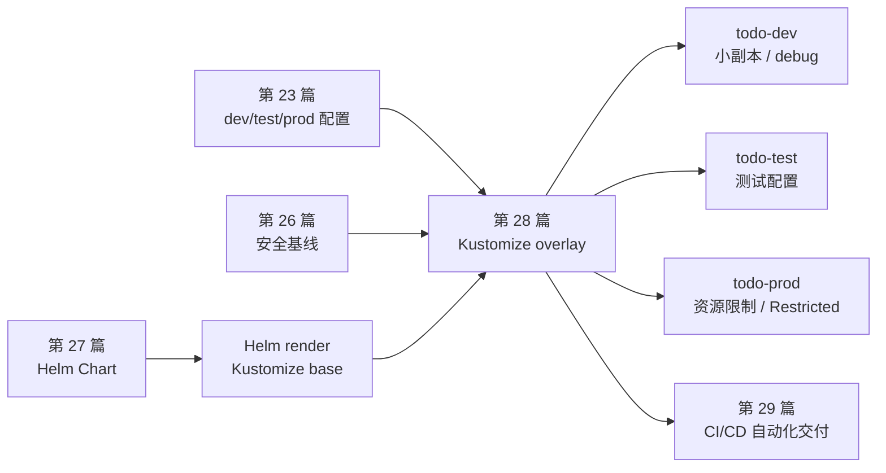
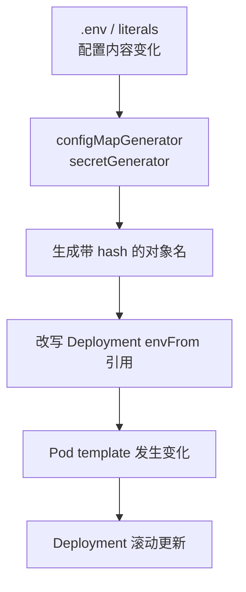
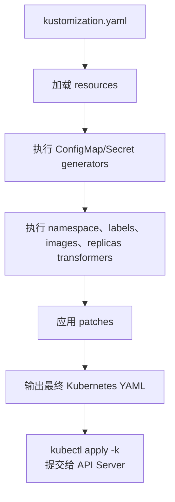
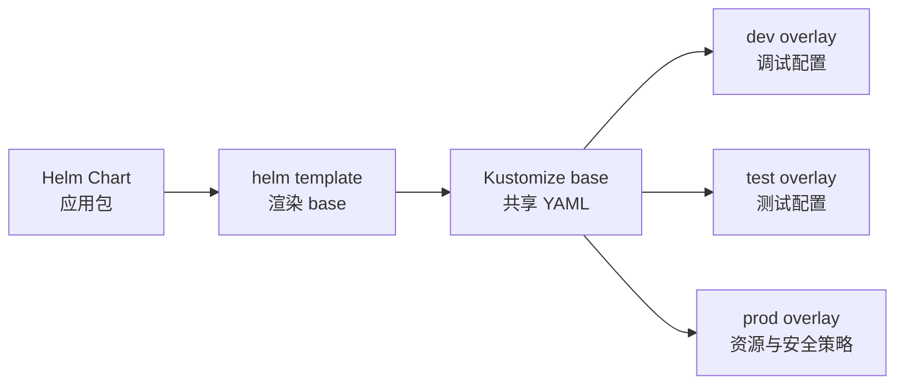

# 第 28 篇：Kustomize 多环境配置管理 [C]

第 27 篇把 Todo API 主链路整理成了 Helm 4 Chart。到了阶段四收官篇，我们不再继续复制三套 YAML，也不把每个环境差异都塞进 Helm values，而是学习用 Kustomize 的 base / overlay 模型管理 dev、test、prod 三套环境。

本篇特色项目是：**基于第 27 篇 Helm Chart 的渲染结果，为 Todo Platform 建立 `dev`、`test`、`prod` 三套 Kustomize overlay，让不同 Namespace 使用不同副本数、配置域名、资源规格、Secret 和安全标签。**

## 1. 本章学习目标

### 1.1 知识目标

- 能解释 Kustomize 的 base、overlay、resource、transformer、generator 和 patch 各自解决什么问题。
- 能区分 Helm 的参数化打包能力与 Kustomize 的声明式环境叠加能力。
- 能说明 `configMapGenerator` 和 `secretGenerator` 为什么会默认生成带 hash 后缀的对象名。
- 能理解 `patches`、`images`、`replicas`、`namespace`、`labels` 在 Kustomize 渲染链路中的作用。
- 能解释为什么 `namespace:` transformer 不会自动修正已经写死的 RoleBinding subject Namespace，以及 Role `resourceNames` 如何跟随 generator 名称改写。
- 能描述 Kustomize 在 GitOps、CI/CD 和多环境发布中的常见位置。

### 1.2 技能目标

- 能从第 27 篇 Helm Chart 渲染出可复用的 Kustomize base。
- 能为 Todo Platform 创建 `dev`、`test`、`prod` 三套 overlay。
- 能用 `configMapGenerator` 生成环境配置，用 `secretGenerator` 管理本地实验 Secret。
- 能用 `replicas`、`images` 和 `patches` 修改副本数、镜像版本、资源限制、RBAC subject Namespace 和 Role `resourceNames`。
- 能用 `kubectl kustomize`、`kubectl apply -k --dry-run=server` 和 `kubectl apply -k` 验证多环境 YAML。
- 能排查 Kustomize 路径、patch、generator、Namespace 和 Secret 文件相关错误。

### 1.3 前置条件

开始本篇前，请确认你已经完成：

- 第 20 篇：已有可用的 `todo-k8s` kind 集群，并能使用 `kubectl` 操作资源。
- 第 21 篇：理解 Deployment、Service、探针和滚动更新。
- 第 23 篇：理解 ConfigMap / Secret 与 dev、test、prod 配置差异。
- 第 26 篇：理解 ServiceAccount、RBAC、SecurityContext 和 Pod Security Admission。
- 第 27 篇：已经创建 `deployments/helm/todo-platform/` Helm Chart。
- 第 16 篇：本地已有 `todo-api:v0.1.0` 镜像，必要时能加载到 kind 集群。

本篇命令以 Linux / macOS / Windows Subsystem for Linux 2（WSL2，Windows 的 Linux 子系统）中的 Bash 为主。Windows PowerShell 用户可以把 `cat <<'YAML'` 改成 here-string：

```powershell
@'
key: value
'@ | Set-Content -Encoding utf8 deployments/kustomize/base/example.yaml
```

本机验证基线：

```bash
kubectl version --client --output=yaml
```

预期能看到类似输出：

```yaml
clientVersion:
  gitVersion: v1.34.1
kustomizeVersion: v5.7.1
```

!!! note "为什么本篇使用 `kubectl kustomize`"
    Kustomize 可以独立安装，也内置在 `kubectl` 中。本篇使用 `kubectl kustomize` 和 `kubectl apply -k`，这样学习者不需要再安装一个新二进制。不同 `kubectl` 小版本内置的 Kustomize 版本可能不同，本篇使用的字段在 Kustomize v5.7.1 中已验证。

## 2. 本章工作场景与真实案例

### 2.1 技术痛点

第 23 篇已经出现过 dev、test、prod 三套 ConfigMap。那时我们只是把三份文件放到不同目录里，学习者如果直接 `kubectl apply -f`，同名对象会互相覆盖。第 27 篇用 Helm values 解决了“一套 Chart，多套参数”的问题，但真实团队还会遇到另一个边界：有些差异不是应用包本身的参数，而是环境层的交付策略。

典型问题包括：

- dev、test、prod 需要不同 Namespace 和 Pod Security Admission 标签。
- prod 需要更高资源限制，dev 需要更小副本数。
- 同一套 Helm Chart 渲染出的 YAML 需要进入 GitOps 仓库，由 Argo CD 或 Flux 继续管理。
- 某些环境要额外补 Ingress、监控 annotation、策略标签或临时 patch，不希望改动 Chart 默认模板。
- 多环境 YAML 如果复制三份，升级 Chart 后很难知道哪些环境漏同步。

Kustomize 解决的是“在不改 base 的前提下，对同一组 Kubernetes YAML 做环境叠加”。它不是模板引擎，而是声明式补丁和转换工具。

### 2.2 团队协作场景

真实团队中，Helm 与 Kustomize 常常分工协作：

- 平台工程师维护 Helm Chart，把应用打包成稳定、可复用的发布单元。
- 环境负责人维护 Kustomize overlay，把 dev、test、prod 的差异放在独立目录中审查。
- 安全工程师审查 prod overlay 是否开启 Restricted PSA 标签、资源限制和 Secret 外部化。
- SRE 在 CI 中执行 `kubectl kustomize`、`kubectl apply --dry-run=server -k` 和策略检查。
- GitOps 控制器只同步某个 overlay，而不是让每个环境手工拼命令。

这能把职责边界变清楚：Chart 定义“应用应该有哪些对象”，overlay 定义“这个环境怎样运行这些对象”。

### 2.3 课程项目关联

阶段四到这里已经形成一条完整交付链：

```text
第 20 篇：kind 集群和 kubectl 基础
第 21 篇：Todo API Deployment / Service / 探针
第 22 篇：入口层和域名访问
第 23 篇：ConfigMap / Secret 配置管理
第 24 篇：PostgreSQL 持久化
第 25 篇：NetworkPolicy 网络隔离
第 26 篇：RBAC、非 root、Pod Security 基线
第 27 篇：Helm 4 Chart 和 release 生命周期
第 28 篇：Kustomize dev / test / prod overlay
```

本篇会产出 `deployments/kustomize/` 目录。为了避免破坏第 20-27 篇资源，实验会使用三个独立 Namespace：`todo-dev`、`todo-test`、`todo-prod`。

图 28-1 展示本篇和前后章节的关系：



下一阶段会进入 CI/CD。第 29 篇会把本篇的 `kubectl kustomize`、server-side dry-run 和部署验证放进流水线，让 Git 变更自动触发构建、检查和交付。

## 3. 核心概念

### 3.1 base 与 overlay

Kustomize 的核心思想很朴素：base 是共享基础配置，overlay 是某个环境的差异。

```text
deployments/kustomize/
├── base/
│   ├── kustomization.yaml
│   └── todo-platform-rendered.yaml
└── overlays/
    ├── dev/
    ├── test/
    └── prod/
```

base 里放“所有环境都应该有”的对象，例如 Deployment、Service、ServiceAccount、Role、RoleBinding、NetworkPolicy。overlay 引用 base，然后声明环境差异，例如 Namespace、副本数、ConfigMap 数据、Secret 来源和资源限制。

最小 overlay 长这样：

```yaml
apiVersion: kustomize.config.k8s.io/v1beta1
kind: Kustomization
namespace: todo-dev
resources:
  - ../../base
```

执行：

```bash
kubectl kustomize deployments/kustomize/overlays/dev
```

Kustomize 不直接修改 base 文件，而是输出一份新的 YAML 流。这也是它适合 Git 审查的原因：共享内容和环境差异分开存放。

### 3.2 `kustomization.yaml`

`kustomization.yaml` 是 Kustomize 的入口文件。常用字段如下：

| 字段 | 作用 | 本篇用途 |
| --- | --- | --- |
| `resources` | 引入 YAML 文件或另一个 Kustomization 目录 | overlay 引用 `../../base` |
| `namespace` | 给 namespaced 对象设置 Namespace | dev/test/prod 分别进入不同 Namespace |
| `labels` | 给对象增加标签 | 增加 `app.kubernetes.io/environment` |
| `configMapGenerator` | 生成 ConfigMap | 生成每个环境独立的 `todo-platform-env` 配置 |
| `secretGenerator` | 生成 Secret | 本地实验生成 `todo-api-auth` |
| `images` | 替换镜像名、tag 或 digest | 管理 Todo API 镜像版本 |
| `replicas` | 修改 Deployment 副本数 | dev 1 个，test 2 个，prod 3 个 |
| `patches` | 对对象做局部修改 | 修正 RoleBinding subject Namespace、Role resourceNames、调整资源 |

这些字段可以理解为一组内置 transformer 和 generator。Kustomize 读取资源后，按规则生成、转换、补丁，最后输出完整 Kubernetes YAML。

### 3.3 generator 与 hash 后缀

`configMapGenerator` 和 `secretGenerator` 默认会给生成的对象名追加 hash 后缀，例如：

```text
todo-platform-8ftt2fk9f9
todo-api-auth-5kg8h8978m
```

这不是多余装饰，而是 Kustomize 的重要设计：当 ConfigMap 或 Secret 内容变化时，对象名也变化，Deployment 中的引用会被自动改写，Pod template 随之变化，Kubernetes 就会触发滚动更新。

图 28-2 展示这个链路：



生产环境中不要轻易设置 `generatorOptions.disableNameSuffixHash: true`。关闭 hash 后，ConfigMap 内容变了但 Pod template 可能不变，旧 Pod 不会自动重启。

### 3.4 patch 策略

Kustomize 支持多种 patch 风格。Kustomize v5 中推荐统一使用 `patches` 字段：

```yaml
patches:
  - path: patch-deployment-resources.yaml
  - target:
      group: rbac.authorization.k8s.io
      version: v1
      kind: RoleBinding
      name: todo-platform-read-config
    patch: |-
      - op: replace
        path: /subjects/0/namespace
        value: todo-dev
```

这里包含两类常见补丁：

- `path` 指向一个 Kubernetes 风格的局部 YAML，常用于修改 Deployment 资源限制。
- `patch` 内联 JSON Patch，常用于精确替换数组位置，例如 `/subjects/0/namespace`。

新手最容易踩的坑是 patch 目标对象名不匹配。Kustomize 的 patch 必须能找到唯一对象，否则会报错。

### 3.5 `images`、`replicas` 与 `namespace`

Kustomize 对常见发布差异提供了专门字段，不需要为了每个字段都写 patch：

```yaml
images:
  - name: todo-api
    newTag: v0.1.0

replicas:
  - name: todo-platform
    count: 3

namespace: todo-prod
```

注意一个重要边界：`namespace:` 会给 namespaced 对象设置 `metadata.namespace`，但不会自动修正 YAML 里已经写死的任意字符串。第 27 篇 Helm Chart 的 RoleBinding subject 中有：

```yaml
subjects:
  - kind: ServiceAccount
    name: todo-platform
    namespace: todo-kustomize-base
```

Kustomize 不会猜测这段字符串也要跟着环境变化，所以本篇会在每个 overlay 中显式 patch 它。

另一个容易忽略的点是 Role 的 `resourceNames`。第 27 篇 Helm Chart 默认只允许读取 `todo-platform` ConfigMap；本篇 overlay 会让 Deployment 改读 `todo-platform-env-*`。因此 overlay 也要把 Role `resourceNames[0]` patch 成 generator 名称 `todo-platform-env`，Kustomize 再把它自动改写成最终 hash 名称。

### 3.6 Helm 与 Kustomize 的边界

Helm 和 Kustomize 都能处理“多环境”，但它们解决的问题不同：

| 维度 | Helm | Kustomize |
| --- | --- | --- |
| 核心模型 | Chart 包和 release | base 与 overlay |
| 表达方式 | 模板与 values | 原始 YAML 与补丁 |
| 适合解决 | 应用打包、依赖、安装升级、回滚 | 环境差异、GitOps 叠加、局部补丁 |
| 状态记录 | Helm release history | 不保存 release 状态，依赖 Git / Kubernetes |
| 风险点 | values 太多会变成迷你编程语言 | patch 太碎会难以追踪最终结果 |

本篇采用一种真实团队常见路线：**先用 Helm 渲染出标准应用 YAML，作为 Kustomize base；再用 overlay 管理环境差异。**

## 4. 原理深入

### 4.1 Kustomize 渲染链路

Kustomize 的输入是一组 YAML 和 `kustomization.yaml`，输出还是 YAML。它不会连接 Kubernetes API Server，也不会保存 release 状态。

图 28-3 展示渲染过程：



`kubectl kustomize` 只做本地渲染；`kubectl apply -k` 会先渲染，再把结果提交给 API Server。两者适合放在 CI 的不同阶段：前者检查生成结果，后者配合 `--dry-run=server` 检查集群 API 和准入策略。

### 4.2 从 Helm Chart 到 Kustomize base

本篇不会让 Kustomize 直接执行 Helm Chart inflator。原因有三个：

1. 新手刚学完 Helm，先看到“Helm 渲染结果也是普通 YAML”更容易建立心智模型。
2. CI 和 GitOps 中常见做法是把 Chart 渲染固定成一个 base，再对环境做审查和叠加。
3. Kustomize 的 Helm inflator 需要额外开关和 Helm 环境，教学成本高于收益。

本篇流程如下：

```text
Helm Chart
  │
  ├─ helm template --skip-tests
  ▼
Kustomize base
  │
  ├─ overlay/dev
  ├─ overlay/test
  └─ overlay/prod
```

图 28-4 展示 Helm 与 Kustomize 的职责边界：



当 Chart 模板变化时，需要重新生成 base；当只是环境差异变化时，只改 overlay。

### 4.3 ConfigMap / Secret hash 如何触发滚动更新

Kubernetes 自身不会因为 ConfigMap 内容变化自动重启 Pod。如果 Deployment 只是引用固定名 `todo-platform`，你更新 ConfigMap 后，旧 Pod 仍然用旧环境变量运行。

Kustomize 的 generator 默认追加 hash 后缀并改写引用，例如：

```yaml
envFrom:
  - configMapRef:
      name: todo-platform-8ftt2fk9f9
  - secretRef:
      name: todo-api-auth-5kg8h8978m
```

当配置变化时，hash 变化，Deployment 的 Pod template 也变化，滚动更新自然发生。这比手工 `kubectl rollout restart` 更适合 GitOps。

### 4.4 patch 为什么要小而明确

patch 的价值是“只表达差异”，但 patch 也很容易失控。一个好的 overlay patch 应该满足：

- 只修改一个明确目的，例如资源限制、RoleBinding subject Namespace 或 Role `resourceNames`。
- patch 文件名能说明意图，例如 `patch-deployment-resources.yaml`。
- 不复制整个 Deployment，否则 overlay 会变成第二套 base。
- 目标对象唯一，避免一个 patch 同时命中多个对象。

本篇故意把 RoleBinding subject Namespace 和 Role `resourceNames` 作为显式 patch，是为了让你看到 Kustomize 的边界：它理解 Kubernetes 常见字段，但不会替你推断所有字符串语义。把 `resourceNames` patch 成 generator 名称后，Kustomize 会继续把它改写成带 hash 的最终 ConfigMap 名称。

### 4.5 多环境配置如何进入 CI/CD

第 29 篇会进入 CI/CD，本篇产物正好是流水线输入。一个典型检查顺序是：

```text
git diff
  │
  ├─ kubectl kustomize overlays/dev
  ├─ kubectl kustomize overlays/test
  ├─ kubectl kustomize overlays/prod
  │
  ├─ kubectl apply --dry-run=server -k overlays/dev
  ├─ kubectl apply --dry-run=server -k overlays/test
  └─ kubectl apply --dry-run=server -k overlays/prod
```

生产流水线还会增加策略检查，例如禁止 `latest` 镜像、要求资源限制、要求 Restricted PSA 标签、禁止提交明文 Secret、要求变更经过审批。

## 5. 手把手实验

### 5.1 实验目标

基于第 27 篇 Helm Chart 生成 Kustomize base，并创建 dev、test、prod 三套 overlay；每套 overlay 能独立渲染、服务端 dry-run、部署到不同 Namespace，并能访问 Todo API 健康检查接口。

### 5.2 实验环境

| 工具 | 建议版本 | 用途 |
| --- | --- | --- |
| kubectl | v1.34.1 或与集群相近 | 内置 Kustomize，执行 `kubectl kustomize` 和 `kubectl apply -k` |
| Kustomize | kubectl 内置 v5.7.1 | 渲染 base / overlay |
| Helm | v4.2.x | 从第 27 篇 Chart 生成 base |
| Kubernetes | kind 实际 v1.35.0，v1.25+ 可完成主线 | 运行 dev/test/prod Namespace |
| Docker | 29.x | 运行 `todo-api:v0.1.0 hash-password` |
| curl | 任意现代版本 | 验证服务可达 |

检查工具：

```bash
kubectl version --client --output=yaml
helm version --short
docker image inspect todo-api:v0.1.0 --format '{{.RepoTags}}'
```

如果 `helm version --short` 输出 `helm: command not found` 或 `The term 'helm' is not recognized`，说明 Helm 不在 `PATH` 中，请先回到第 27 篇完成 Helm 4 安装。如果 `todo-api:v0.1.0` 不存在，请回到第 16 篇重新构建镜像，并按第 21 篇方式加载到 kind：

```bash
kind load docker-image todo-api:v0.1.0 --name todo-k8s
```

### 5.3 文件目录结构

本篇实验会生成如下目录：

```text
deployments/kustomize/
├── base/
│   ├── kustomization.yaml
│   ├── todo-platform-rendered.yaml
│   └── values-kustomize-base.yaml
└── overlays/
    ├── dev/
    │   ├── .secrets/
    │   │   └── todo-api-auth.env
    │   ├── kustomization.yaml
    │   └── namespace.yaml
    ├── test/
    │   ├── .secrets/
    │   │   └── todo-api-auth.env
    │   ├── kustomization.yaml
    │   ├── namespace.yaml
    │   └── patch-deployment-resources.yaml
    └── prod/
        ├── .secrets/
        │   └── todo-api-auth.env
        ├── kustomization.yaml
        ├── namespace.yaml
        └── patch-deployment-resources.yaml
```

`.secrets/` 目录只服务本地实验，不应提交到 Git。本篇会同步建议 `.gitignore` 规则。

### 5.4 完整配置

先创建目录：

```bash
mkdir -p deployments/kustomize/base
mkdir -p deployments/kustomize/overlays/dev/.secrets
mkdir -p deployments/kustomize/overlays/test/.secrets
mkdir -p deployments/kustomize/overlays/prod/.secrets
```

创建 Helm 渲染 base 使用的 values。这里关闭 Helm Secret 模板，改由 Kustomize overlay 的 `secretGenerator` 生成 Secret：

```bash
cat > deployments/kustomize/base/values-kustomize-base.yaml <<'YAML'
auth:
  create: false # ← Secret 交给 Kustomize overlay 生成，base 不保存敏感数据。
  existingSecret: todo-api-auth

config:
  release: chapter-28-base

cache:
  enabled: false
YAML
```

更新 Helm 本地依赖，并把 Chart 渲染为 Kustomize base。`--skip-tests` 用来跳过 Helm test Pod，避免把测试 hook 当成常驻资源应用到集群：

```bash
helm dependency build deployments/helm/todo-platform

helm template todo-platform deployments/helm/todo-platform \
  -n todo-kustomize-base \
  -f deployments/helm/todo-platform/values-dev.yaml \
  -f deployments/kustomize/base/values-kustomize-base.yaml \
  --skip-tests \
  > deployments/kustomize/base/todo-platform-rendered.yaml
```

创建 base 的 `kustomization.yaml`：

```bash
cat > deployments/kustomize/base/kustomization.yaml <<'YAML'
apiVersion: kustomize.config.k8s.io/v1beta1
kind: Kustomization
resources:
  - todo-platform-rendered.yaml
YAML
```

创建本地实验 Secret 输入文件。`hash-password` 子命令来自第 14 篇，并在第 16 篇镜像构建实验中验证过。`.secrets/` 只服务本地实验，不要把真实生产密钥放入 GitOps 仓库：

```bash
HASH=$(docker run --rm todo-api:v0.1.0 hash-password "change-me-123")

cat > deployments/kustomize/overlays/dev/.secrets/todo-api-auth.env <<EOF
TODO_JWT_SECRET=dev-0123456789abcdef0123456789abcdef
TODO_AUTH_USERS=admin=${HASH}
EOF

cat > deployments/kustomize/overlays/test/.secrets/todo-api-auth.env <<EOF
TODO_JWT_SECRET=test-0123456789abcdef0123456789abcde
TODO_AUTH_USERS=admin=${HASH}
EOF

cat > deployments/kustomize/overlays/prod/.secrets/todo-api-auth.env <<EOF
TODO_JWT_SECRET=prod-0123456789abcdef0123456789abcde
TODO_AUTH_USERS=admin=${HASH}
EOF
```

PowerShell 用户请使用：

```powershell
$HASH = docker run --rm todo-api:v0.1.0 hash-password "change-me-123"
```

再用 here-string 创建三个 `.env` 文件。

创建 dev Namespace：

```bash
cat > deployments/kustomize/overlays/dev/namespace.yaml <<'YAML'
apiVersion: v1
kind: Namespace
metadata:
  name: todo-dev
  labels:
    pod-security.kubernetes.io/enforce: restricted
    pod-security.kubernetes.io/enforce-version: latest
YAML
```

创建 dev overlay。dev 使用 1 个副本、debug 日志和本地域名：

```bash
cat > deployments/kustomize/overlays/dev/kustomization.yaml <<'YAML'
apiVersion: kustomize.config.k8s.io/v1beta1
kind: Kustomization
namespace: todo-dev

resources:
  - ../../base
  - namespace.yaml

labels:
  - pairs:
      app.kubernetes.io/environment: dev
    includeSelectors: false # ← 不改 selector，避免未来升级触发不可变字段问题。

configMapGenerator:
  - name: todo-platform-env # ← 使用新名字生成环境配置，保留 hash 后缀以触发滚动更新。
    literals:
      - TODO_ENV=dev
      - TODO_LOG_LEVEL=debug
      - TODO_CORS_ALLOWED_ORIGINS=https://todo-dev.localhost:18443
      - TODO_PPROF_ENABLED=true
      - TODO_RELEASE=chapter-28-dev

secretGenerator:
  - name: todo-api-auth
    envs:
      - .secrets/todo-api-auth.env
    type: Opaque

images:
  - name: todo-api
    newTag: v0.1.0

replicas:
  - name: todo-platform
    count: 1

patches:
  - target:
      group: apps
      version: v1
      kind: Deployment
      name: todo-platform
    patch: |-
      - op: replace
        path: /spec/template/spec/containers/0/envFrom/0/configMapRef/name
        value: todo-platform-env
  - target:
      group: rbac.authorization.k8s.io
      version: v1
      kind: Role
      name: todo-platform-config-reader
    patch: |-
      - op: replace
        path: /rules/0/resourceNames/0
        value: todo-platform-env
  - target:
      group: rbac.authorization.k8s.io
      version: v1
      kind: RoleBinding
      name: todo-platform-read-config
    patch: |-
      - op: replace
        path: /subjects/0/namespace
        value: todo-dev
YAML
```

创建 test Namespace：

```bash
cat > deployments/kustomize/overlays/test/namespace.yaml <<'YAML'
apiVersion: v1
kind: Namespace
metadata:
  name: todo-test
  labels:
    pod-security.kubernetes.io/enforce: restricted
    pod-security.kubernetes.io/enforce-version: latest
YAML
```

创建 test 资源补丁。test 环境使用中等资源规格：

```bash
cat > deployments/kustomize/overlays/test/patch-deployment-resources.yaml <<'YAML'
apiVersion: apps/v1
kind: Deployment
metadata:
  name: todo-platform
spec:
  template:
    spec:
      containers:
        - name: todo-api
          resources:
            requests:
              cpu: 100m
              memory: 128Mi
            limits:
              cpu: 750m
              memory: 384Mi
YAML
```

创建 test overlay：

```bash
cat > deployments/kustomize/overlays/test/kustomization.yaml <<'YAML'
apiVersion: kustomize.config.k8s.io/v1beta1
kind: Kustomization
namespace: todo-test

resources:
  - ../../base
  - namespace.yaml

labels:
  - pairs:
      app.kubernetes.io/environment: test
    includeSelectors: false

configMapGenerator:
  - name: todo-platform-env
    literals:
      - TODO_ENV=test
      - TODO_LOG_LEVEL=info
      - TODO_CORS_ALLOWED_ORIGINS=https://todo-test.localhost:18443
      - TODO_PPROF_ENABLED=false
      - TODO_RELEASE=chapter-28-test

secretGenerator:
  - name: todo-api-auth
    envs:
      - .secrets/todo-api-auth.env
    type: Opaque

images:
  - name: todo-api
    newTag: v0.1.0

replicas:
  - name: todo-platform
    count: 2

patches:
  - path: patch-deployment-resources.yaml
  - target:
      group: apps
      version: v1
      kind: Deployment
      name: todo-platform
    patch: |-
      - op: replace
        path: /spec/template/spec/containers/0/envFrom/0/configMapRef/name
        value: todo-platform-env
  - target:
      group: rbac.authorization.k8s.io
      version: v1
      kind: Role
      name: todo-platform-config-reader
    patch: |-
      - op: replace
        path: /rules/0/resourceNames/0
        value: todo-platform-env
  - target:
      group: rbac.authorization.k8s.io
      version: v1
      kind: RoleBinding
      name: todo-platform-read-config
    patch: |-
      - op: replace
        path: /subjects/0/namespace
        value: todo-test
YAML
```

创建 prod Namespace。prod 同时启用 enforce、audit、warn 三类 PSA 标签，方便提前发现不符合 Restricted 的 Pod：

```bash
cat > deployments/kustomize/overlays/prod/namespace.yaml <<'YAML'
apiVersion: v1
kind: Namespace
metadata:
  name: todo-prod
  labels:
    pod-security.kubernetes.io/enforce: restricted
    pod-security.kubernetes.io/enforce-version: latest
    pod-security.kubernetes.io/audit: restricted
    pod-security.kubernetes.io/audit-version: latest
    pod-security.kubernetes.io/warn: restricted
    pod-security.kubernetes.io/warn-version: latest
YAML
```

创建 prod 资源补丁。prod 环境使用更高资源规格：

```bash
cat > deployments/kustomize/overlays/prod/patch-deployment-resources.yaml <<'YAML'
apiVersion: apps/v1
kind: Deployment
metadata:
  name: todo-platform
spec:
  template:
    spec:
      containers:
        - name: todo-api
          resources:
            requests:
              cpu: 200m
              memory: 256Mi
            limits:
              cpu: "1"
              memory: 512Mi
YAML
```

创建 prod overlay：

```bash
cat > deployments/kustomize/overlays/prod/kustomization.yaml <<'YAML'
apiVersion: kustomize.config.k8s.io/v1beta1
kind: Kustomization
namespace: todo-prod

resources:
  - ../../base
  - namespace.yaml

labels:
  - pairs:
      app.kubernetes.io/environment: prod
    includeSelectors: false

configMapGenerator:
  - name: todo-platform-env
    literals:
      - TODO_ENV=prod
      - TODO_LOG_LEVEL=info
      - TODO_CORS_ALLOWED_ORIGINS=https://todo.example.com
      - TODO_PPROF_ENABLED=false
      - TODO_RELEASE=chapter-28-prod

secretGenerator:
  - name: todo-api-auth
    envs:
      - .secrets/todo-api-auth.env
    type: Opaque

images:
  - name: todo-api
    newTag: v0.1.0

replicas:
  - name: todo-platform
    count: 3

patches:
  - path: patch-deployment-resources.yaml
  - target:
      group: apps
      version: v1
      kind: Deployment
      name: todo-platform
    patch: |-
      - op: replace
        path: /spec/template/spec/containers/0/envFrom/0/configMapRef/name
        value: todo-platform-env
  - target:
      group: rbac.authorization.k8s.io
      version: v1
      kind: Role
      name: todo-platform-config-reader
    patch: |-
      - op: replace
        path: /rules/0/resourceNames/0
        value: todo-platform-env
  - target:
      group: rbac.authorization.k8s.io
      version: v1
      kind: RoleBinding
      name: todo-platform-read-config
    patch: |-
      - op: replace
        path: /subjects/0/namespace
        value: todo-prod
YAML
```

### 5.5 执行命令

先本地渲染三个 overlay：

```bash
kubectl kustomize deployments/kustomize/overlays/dev > /tmp/todo-dev.yaml
kubectl kustomize deployments/kustomize/overlays/test > /tmp/todo-test.yaml
kubectl kustomize deployments/kustomize/overlays/prod > /tmp/todo-prod.yaml
```

快速确认三套环境差异：

```bash
grep -n "namespace: todo-dev" /tmp/todo-dev.yaml | head
grep -n "TODO_RELEASE" /tmp/todo-test.yaml
grep -n "todo.example.com" /tmp/todo-prod.yaml
```

确认 generator 已经生成带 hash 的环境 ConfigMap / Secret，并且 Deployment 引用被改写：

```bash
grep -n "name: todo-platform-env-" /tmp/todo-dev.yaml | head
grep -n "name: todo-api-auth-" /tmp/todo-dev.yaml | head
grep -n "configMapRef" -A2 /tmp/todo-dev.yaml
grep -n "secretRef" -A2 /tmp/todo-dev.yaml
```

先创建 Namespace，避免 server-side dry-run 因 Namespace 不存在而提前失败。`kubectl apply --dry-run=server -k` 会把 overlay 渲染结果发送给 API Server 校验，但 dry-run 不会真的持久化 Namespace；如果 Namespace 尚不存在，后续 namespaced 资源可能会先报 `namespaces "todo-dev" not found`：

```bash
kubectl create namespace todo-dev --dry-run=client -o yaml | kubectl apply -f -
kubectl create namespace todo-test --dry-run=client -o yaml | kubectl apply -f -
kubectl create namespace todo-prod --dry-run=client -o yaml | kubectl apply -f -
```

使用 API Server 做服务端 dry-run：

```bash
kubectl apply --dry-run=server -k deployments/kustomize/overlays/dev
kubectl apply --dry-run=server -k deployments/kustomize/overlays/test
kubectl apply --dry-run=server -k deployments/kustomize/overlays/prod
```

确认无误后应用三套 overlay：

```bash
kubectl apply -k deployments/kustomize/overlays/dev
kubectl apply -k deployments/kustomize/overlays/test
kubectl apply -k deployments/kustomize/overlays/prod
```

等待 Deployment 就绪：

```bash
kubectl -n todo-dev rollout status deployment/todo-platform --timeout=180s
kubectl -n todo-test rollout status deployment/todo-platform --timeout=180s
kubectl -n todo-prod rollout status deployment/todo-platform --timeout=180s
```

查看对象：

```bash
kubectl -n todo-dev get deploy,svc,cm,secret,sa,role,rolebinding,networkpolicy
kubectl -n todo-test get deploy,svc,cm,secret,sa,role,rolebinding,networkpolicy
kubectl -n todo-prod get deploy,svc,cm,secret,sa,role,rolebinding,networkpolicy
```

验证 dev 服务可访问：

```bash
kubectl -n todo-dev port-forward service/todo-platform 18085:80
```

另开一个终端执行：

```bash
curl -fsS http://127.0.0.1:18085/healthz
curl -fsS http://127.0.0.1:18085/readyz
```

验证完成后，在运行 `port-forward` 的终端按 `Ctrl+C` 停止端口转发。

### 5.6 预期输出

`kubectl kustomize` 渲染后，能看到 Namespace 差异：

```text
metadata:
  name: todo-platform
  namespace: todo-dev
```

环境 ConfigMap 和 Secret 名称带 hash：

```text
name: todo-platform-env-8f4f2g6h7d
name: todo-api-auth-5m92k4t7b6
```

Deployment 引用已经被改写：

```yaml
envFrom:
  - configMapRef:
      name: todo-platform-env-8f4f2g6h7d
  - secretRef:
      name: todo-api-auth-5m92k4t7b6
```

服务端 dry-run 应返回类似：

```text
namespace/todo-dev configured (server dry run)
serviceaccount/todo-platform created (server dry run)
deployment.apps/todo-platform created (server dry run)
service/todo-platform created (server dry run)
```

Deployment 就绪：

```text
deployment "todo-platform" successfully rolled out
```

`curl` 健康检查：

```text
Todo API healthz OK
Todo API readyz OK
```

如果你的 Todo API 镜像返回的是 JSON 或不同短文本，只要 `curl -fsS` 退出码为 0，并且 Pod Ready，就表示主线验证通过。

### 5.7 验证方法

验证三套环境副本数：

```bash
kubectl -n todo-dev get deployment todo-platform -o jsonpath='dev={.spec.replicas}{"\n"}'
kubectl -n todo-test get deployment todo-platform -o jsonpath='test={.spec.replicas}{"\n"}'
kubectl -n todo-prod get deployment todo-platform -o jsonpath='prod={.spec.replicas}{"\n"}'
```

预期：

```text
dev=1
test=2
prod=3
```

验证 ConfigMap 环境差异：

```bash
DEV_CM=$(kubectl -n todo-dev get configmap -o name | grep '^configmap/todo-platform-env-' | head -1)
TEST_CM=$(kubectl -n todo-test get configmap -o name | grep '^configmap/todo-platform-env-' | head -1)
PROD_CM=$(kubectl -n todo-prod get configmap -o name | grep '^configmap/todo-platform-env-' | head -1)

kubectl -n todo-dev get "$DEV_CM" -o jsonpath='{.data.TODO_RELEASE}{"\n"}'
kubectl -n todo-test get "$TEST_CM" -o jsonpath='{.data.TODO_RELEASE}{"\n"}'
kubectl -n todo-prod get "$PROD_CM" -o jsonpath='{.data.TODO_RELEASE}{"\n"}'
```

预期分别包含：

```text
chapter-28-dev
chapter-28-test
chapter-28-prod
```

验证 RoleBinding subject Namespace 已被修正：

```bash
kubectl -n todo-dev get rolebinding todo-platform-read-config \
  -o jsonpath='{.subjects[0].namespace}{"\n"}'
kubectl -n todo-test get rolebinding todo-platform-read-config \
  -o jsonpath='{.subjects[0].namespace}{"\n"}'
kubectl -n todo-prod get rolebinding todo-platform-read-config \
  -o jsonpath='{.subjects[0].namespace}{"\n"}'
```

预期：

```text
todo-dev
todo-test
todo-prod
```

验证 Role `resourceNames` 已经跟随环境 ConfigMap hash 改写：

```bash
kubectl -n todo-dev get role todo-platform-config-reader \
  -o jsonpath='{.rules[0].resourceNames[0]}{"\n"}'
kubectl -n todo-test get role todo-platform-config-reader \
  -o jsonpath='{.rules[0].resourceNames[0]}{"\n"}'
kubectl -n todo-prod get role todo-platform-config-reader \
  -o jsonpath='{.rules[0].resourceNames[0]}{"\n"}'
```

预期分别以环境 ConfigMap 名称开头：

```text
todo-platform-env-...
todo-platform-env-...
todo-platform-env-...
```

验证 prod Namespace 的 Pod Security 标签：

```bash
kubectl get namespace todo-prod --show-labels
```

预期能看到：

```text
pod-security.kubernetes.io/enforce=restricted
pod-security.kubernetes.io/audit=restricted
pod-security.kubernetes.io/warn=restricted
```

验证 prod 资源规格：

```bash
kubectl -n todo-prod get deployment todo-platform \
  -o jsonpath='cpu={.spec.template.spec.containers[0].resources.requests.cpu} memory={.spec.template.spec.containers[0].resources.requests.memory}{"\n"}'
```

预期：

```text
cpu=200m memory=256Mi
```

### 5.8 清理步骤

删除三套 overlay 创建的资源：

```bash
kubectl delete -k deployments/kustomize/overlays/prod --ignore-not-found
kubectl delete -k deployments/kustomize/overlays/test --ignore-not-found
kubectl delete -k deployments/kustomize/overlays/dev --ignore-not-found
```

如果 Namespace 仍然存在，可以直接删除：

```bash
kubectl delete namespace todo-dev todo-test todo-prod --ignore-not-found
```

如果你只是想重新做本篇实验，可以保留 `deployments/kustomize/`。如果要完全清理本篇文件：

```bash
rm -rf deployments/kustomize
```

预计耗时：15 分钟阅读，45-60 分钟动手操作。

## 6. 常见错误与排障

### 错误 1：overlay 找不到 base

- **现象**：执行 `kubectl kustomize deployments/kustomize/overlays/dev` 报错：

  ```text
  accumulating resources: accumulation err='accumulating resources from '../../base': evalsymlink failure
  ```

- **原因**：`resources: - ../../base` 路径写错，或者当前目录没有创建 `deployments/kustomize/base/kustomization.yaml`。
- **排查**：

  ```bash
  test -f deployments/kustomize/base/kustomization.yaml
  test -f deployments/kustomize/base/todo-platform-rendered.yaml
  pwd
  ```

  如果前两条没有返回 0，说明 base 文件缺失。`pwd` 应该是课程项目根目录。

- **修复**：回到 5.4 节重新创建 base，确认命令从包含 `deployments/` 的仓库根目录执行。
- **预防**：不要在 `overlays/dev` 目录里直接运行复制命令；课程所有路径都按项目根目录书写。

### 错误 2：环境 ConfigMap 没有 hash 或应用仍读取 base 配置

- **现象**：

  ```text
  envFrom:
    - configMapRef:
        name: todo-platform
  ```

- **原因**：overlay 把 `configMapGenerator` 写成了和 base 同名的 `todo-platform` 并使用 `behavior: merge`，或者忘记 patch Deployment 的 `envFrom[0].configMapRef.name`。这样最终 Deployment 仍引用固定名 ConfigMap，配置变化不会通过 hash 名称触发滚动更新。
- **排查**：

  ```bash
  kubectl kustomize deployments/kustomize/overlays/dev | grep -n "configMapRef" -A2
  rg -n "todo-platform-env|envFrom/0/configMapRef/name" deployments/kustomize/overlays/dev/kustomization.yaml
  ```

  如果 `configMapRef` 后面仍是 `todo-platform`，说明 Deployment 没有切到环境 ConfigMap。

- **修复**：使用独立 generator 名称，并 patch Deployment 引用：

  ```yaml
  configMapGenerator:
    - name: todo-platform-env
      literals:
        - TODO_RELEASE=chapter-28-dev

  patches:
    - target:
        group: apps
        version: v1
        kind: Deployment
        name: todo-platform
      patch: |-
        - op: replace
          path: /spec/template/spec/containers/0/envFrom/0/configMapRef/name
          value: todo-platform-env
  ```

- **预防**：想让配置变化触发滚动更新时，优先让 overlay 生成新的环境 ConfigMap，并确认 Deployment 引用的是生成器名称，而不是 base 中固定名对象。

### 错误 3：RBAC 仍指向 base Namespace 或 base ConfigMap

- **现象**：对象都创建成功，但 RBAC 检查异常。RoleBinding 里 subject 仍然是 `todo-kustomize-base`，或者 Role 仍只允许读取 `todo-platform`：

  ```bash
  kubectl -n todo-dev get rolebinding todo-platform-read-config \
    -o jsonpath='{.subjects[0].namespace}{"\n"}'
  kubectl -n todo-dev get role todo-platform-config-reader \
    -o jsonpath='{.rules[0].resourceNames[0]}{"\n"}'
  ```

  输出：

  ```text
  todo-kustomize-base
  todo-platform
  ```

- **原因**：Kustomize 的 `namespace:` 会改对象的 `metadata.namespace`，但不会自动改写 RoleBinding `subjects[].namespace` 里已经写死的字符串。另一方面，overlay 已让 Deployment 引用 `todo-platform-env-*`，Role `resourceNames` 也应该先 patch 成 generator 名称 `todo-platform-env`，再由 Kustomize 改写成最终 hash 名称。
- **排查**：

  ```bash
  rg -n "/subjects/0/namespace|/rules/0/resourceNames/0|todo-dev|todo-platform-env" deployments/kustomize/overlays/dev/kustomization.yaml
  kubectl kustomize deployments/kustomize/overlays/dev | grep -n "subjects\\|resourceNames" -A3
  ```

  如果没有对应 patch，说明 overlay 漏掉了 RBAC 修正。

- **修复**：给每个 overlay 增加两个 JSON Patch：

  ```yaml
  patches:
    - target:
        group: rbac.authorization.k8s.io
        version: v1
        kind: Role
        name: todo-platform-config-reader
      patch: |-
        - op: replace
          path: /rules/0/resourceNames/0
          value: todo-platform-env
    - target:
        group: rbac.authorization.k8s.io
        version: v1
        kind: RoleBinding
        name: todo-platform-read-config
      patch: |-
        - op: replace
          path: /subjects/0/namespace
          value: todo-dev
  ```

- **预防**：凡是 generator 改变了 ConfigMap / Secret 名称，或者 base 里有显式 Namespace 字符串，都要检查 Deployment 引用、Role `resourceNames`、RoleBinding subject、Volume 引用和其他对象引用是否一起被改写。

### 错误 4：server-side dry-run 提示 Namespace 不存在

- **现象**：

  ```text
  namespaces "todo-dev" not found
  ```

- **原因**：`kubectl apply --dry-run=server -k` 会连接 API Server 校验资源。即使 overlay 中包含 Namespace 对象，server dry-run 不会真的创建它，后续 namespaced 资源仍可能因为 Namespace 不存在而校验失败。
- **排查**：

  ```bash
  kubectl get namespace todo-dev
  ```

- **修复**：先创建空 Namespace，再执行 server-side dry-run：

  ```bash
  kubectl create namespace todo-dev --dry-run=client -o yaml | kubectl apply -f -
  kubectl apply --dry-run=server -k deployments/kustomize/overlays/dev
  ```

- **预防**：CI 中可以先应用 Namespace 层，或把 Namespace 检查作为单独步骤。

### 错误 5：Secret env 文件缺失或被误提交

- **现象 1**：渲染失败：

  ```text
  loading KV pairs: env source files: [.secrets/todo-api-auth.env]: no such file or directory
  ```

- **现象 2**：`git status` 显示 `.secrets/todo-api-auth.env` 准备提交。
- **原因**：本地实验 Secret 文件没有创建，或 `.gitignore` 没有排除 `.secrets/`。
- **排查**：

  ```bash
  test -f deployments/kustomize/overlays/dev/.secrets/todo-api-auth.env
  git status --short
  ```

- **修复**：按 5.4 节重新生成 `.env` 文件，并在 `.gitignore` 中加入：

  ```gitignore
  deployments/kustomize/overlays/**/.secrets/
  deployments/kustomize/**/*.local.*
  ```

- **预防**：生产环境不要把真实 Secret 写入 Kustomize 仓库，应改用 External Secrets、Sealed Secrets、Vault 或云密钥服务。

## 7. 生产环境注意事项

1. **base 要有来源和再生成流程。** 本篇把 Helm 渲染结果保存为 Kustomize base，这是教学和 GitOps 中都常见的做法，但必须说明 base 来自哪个 Chart 版本、哪些 values 和哪条渲染命令。Chart 变更后要重新生成 base，否则 overlay 可能继续基于旧对象工作。

2. **SecretGenerator 不等于生产密钥管理。** Kustomize 能从 env 文件生成 Secret，但 Secret 内容仍然会出现在本地文件、CI 工作区和渲染输出中。生产环境更推荐 External Secrets、Sealed Secrets、Vault 或云密钥服务；如果必须使用 `secretGenerator`，也要保证明文输入不进入 Git。

3. **不要随意关闭 generator hash。** hash 后缀能让 ConfigMap / Secret 内容变化触发 Deployment 滚动更新。关闭 hash 后，GitOps 同步可能只更新 ConfigMap 本体，Pod 不会自动重启，排障时会出现“配置已更新但应用行为没变”的错觉。

4. **patch 要小、可审查、可验证。** overlay 不应该复制整个 Deployment。生产仓库中，patch 文件名、目标对象和修改字段都要清晰，CI 应输出 `kubectl kustomize` 结果并做策略检查，避免某个 overlay 偷偷关闭资源限制、PSA 标签或安全上下文。

5. **Helm 与 Kustomize 的职责边界要稳定。** 如果某个差异是应用安装者经常调整的参数，优先放 Helm values；如果它是环境层策略，例如 Namespace 标签、环境域名、资源等级、GitOps 补丁，适合放 Kustomize overlay。边界频繁摆动会让团队不知道该改 Chart 还是改 overlay。

## 8. 本章小项目

本章小项目：**为 Todo Platform 建立 dev、test、prod 三套 Kustomize overlay，并完成渲染、dry-run、部署和验证。**

### 8.1 项目产出

完成后，你应该得到：

- `deployments/kustomize/base/kustomization.yaml`
- `deployments/kustomize/base/todo-platform-rendered.yaml`
- `deployments/kustomize/base/values-kustomize-base.yaml`
- `deployments/kustomize/overlays/dev/kustomization.yaml`
- `deployments/kustomize/overlays/dev/namespace.yaml`
- `deployments/kustomize/overlays/test/kustomization.yaml`
- `deployments/kustomize/overlays/test/namespace.yaml`
- `deployments/kustomize/overlays/test/patch-deployment-resources.yaml`
- `deployments/kustomize/overlays/prod/kustomization.yaml`
- `deployments/kustomize/overlays/prod/namespace.yaml`
- `deployments/kustomize/overlays/prod/patch-deployment-resources.yaml`
- 三套本地 `.secrets/todo-api-auth.env`，但这些文件不应提交。

### 8.2 能力验收标准

- 能解释 base 与 overlay 的职责边界。
- 能从 Helm Chart 生成不含明文 Secret 的 Kustomize base。
- 能用 `kubectl kustomize` 渲染 dev、test、prod 三套 YAML。
- 能用 `configMapGenerator` 生成环境配置，并看到 ConfigMap hash 后缀。
- 能用 `secretGenerator` 生成 Secret，并确认 Deployment 引用被改写。
- 能用 `replicas` 分别设置 dev=1、test=2、prod=3。
- 能用 `patches` 修正 RoleBinding subject Namespace 和 Role `resourceNames`。
- 能用 `kubectl apply --dry-run=server -k` 通过 API Server 校验。
- 能部署三套环境，并访问至少一套环境的 `/healthz` 和 `/readyz`。
- 能说明 Kustomize 与 Helm 各自适合解决的问题。

## 9. 本章练习题

### 9.1 基础题

1. 用一句话解释 Kustomize base 和 overlay 的区别。
2. `configMapGenerator` 默认追加 hash 后缀解决什么问题？
3. 为什么本篇关闭 Helm Secret 模板，改用 overlay 的 `secretGenerator`？
4. `kubectl kustomize` 和 `kubectl apply -k` 的区别是什么？
5. 为什么 RoleBinding subject Namespace 和 Role `resourceNames` 需要显式 patch？

### 9.2 实操题

1. 给 dev overlay 增加一个 `TODO_RELEASE=chapter-28-dev-v2`，重新 `kubectl apply -k`，观察 ConfigMap 名称和 Pod 是否滚动更新。
2. 给 test overlay 增加一个 JSON Patch，把 Deployment 的 `terminationGracePeriodSeconds` 改为 `20`，用 `kubectl kustomize` 验证输出。
3. 给 prod overlay 的 `images` 增加 `digest` 字段，思考 tag 与 digest 同时出现时团队应该如何制定发布规范。

### 9.3 思考题

1. 如果某个字段 dev/test/prod 都会变，它应该放 Helm values，还是放 Kustomize overlay？判断依据是什么？
2. GitOps 控制器同步的是 `overlays/prod`。如果 base 由 Helm 重新渲染，应该如何审查这次变更是否安全？

## 10. 本章面试题

### 面试题 1：Kustomize 和 Helm 的核心区别是什么？

**一句话结论**：Helm 是应用打包与 release 管理工具，Kustomize 是对已有 Kubernetes YAML 做环境叠加和补丁的工具。

**展开解释**：Helm 用模板和 values 生成对象，并记录 release history；Kustomize 不维护 release 状态，而是从 base 和 overlay 生成最终 YAML。Helm 更适合分发应用包，Kustomize 更适合管理环境差异和 GitOps 目录。

**深入追问**：两者可以组合使用。常见方式是 Helm 渲染 base，Kustomize overlay 管理环境差异；也可以由 Argo CD 分别支持 Helm source 和 Kustomize source。

### 面试题 2：为什么 ConfigMap / Secret generator 默认带 hash？

**一句话结论**：hash 后缀让配置内容变化反映到对象名和 Pod template 中，从而触发滚动更新。

**展开解释**：Kubernetes 不会因为 ConfigMap 内容变化自动重启 Pod。Kustomize 生成新名字后，会自动改写 Deployment 中的引用，Pod template 变化，Deployment 才会创建新 ReplicaSet。

**深入追问**：生产环境不要为了“名字好看”轻易关闭 hash。固定名适合少数外部系统约定场景，但需要额外设计滚动重启机制。

### 面试题 3：Kustomize patch 为什么应该尽量小？

**一句话结论**：小 patch 更容易审查、定位和组合，大 patch 会让 overlay 变成第二套 base。

**展开解释**：overlay 的价值是只描述环境差异。如果复制完整 Deployment，base 升级时 overlay 很可能漏同步，最终 dev、test、prod 实际运行结构越来越分裂。

**深入追问**：生产评审中可以要求 patch 文件名表达意图，并在 CI 中输出最终渲染 YAML 做策略检查。

### 面试题 4：为什么 `namespace:` 不一定能修正所有 Namespace 引用？

**一句话结论**：Kustomize 会处理 Kubernetes 对象常见的 Namespace 字段，但不会推断每个字符串都代表 Namespace。

**展开解释**：对象的 `metadata.namespace` 会被 transformer 设置，但 RoleBinding `subjects[].namespace` 如果来自 Helm 渲染并写成固定值，就需要显式 patch。否则 RoleBinding 可能指向错误 Namespace 的 ServiceAccount。

**深入追问**：排查这类问题时，不要只看 `kubectl get rolebinding` 的 Namespace，还要看 `subjects` 内容。

### 面试题 5：Kustomize overlay 如何进入生产流水线？

**一句话结论**：生产流水线应先渲染 overlay，再做服务端 dry-run、策略校验、审查和 GitOps 同步。

**展开解释**：典型步骤包括 `kubectl kustomize overlays/prod`、`kubectl apply --dry-run=server -k overlays/prod`、禁止明文 Secret、检查资源限制和安全标签、最后由 GitOps 控制器同步到集群。

**深入追问**：如果 overlay 引用的 base 来自 Helm 渲染，流水线还要检查 Chart 版本、values 输入和生成 base 的命令，保证 base 可追溯。

## 11. 本章总结

本篇完成了阶段四的最后一块拼图：用 Kustomize 把 Todo Platform 的 dev、test、prod 环境差异整理成可审查、可渲染、可部署的 overlay。你已经掌握 base / overlay、generator、patch、images、replicas 和 Namespace transformer 的关键用法。

更重要的是，你现在能解释 Helm 与 Kustomize 的边界：Helm 负责把应用打包成稳定发布单元，Kustomize 负责把同一组 YAML 按环境叠加成最终交付形态。阶段四的 Todo Platform 已经具备 Kubernetes 工作负载、入口、配置、存储、网络、安全、Helm 和 Kustomize 的完整应用交付骨架。

## 12. 下一章衔接

第 29 篇会进入 CI/CD 自动化交付。我们会把前面手工执行的检查串起来：代码测试、镜像构建、Helm / Kustomize 渲染、server-side dry-run、推送镜像和部署到 Kubernetes。到那时，本篇的 `deployments/kustomize/overlays/dev`、`test`、`prod` 会成为流水线和 GitOps 的天然输入。
