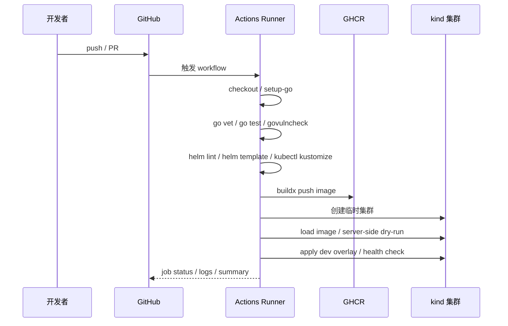

# 第 29 篇：CI/CD 自动化交付

第 28 篇已经把 Todo Platform 的 Kubernetes 交付物整理成 Helm Chart 和 Kustomize overlay。到这里，手工命令已经足够完整：你能测试 Go 代码、构建 Docker 镜像、渲染 Helm、验证 Kustomize，并把资源部署到 kind 集群。

但真实团队不会依赖某个人在本机逐条执行这些命令。本篇开始进入阶段五生产工程能力：把前面手工验证过的步骤串进 GitHub Actions，让每次 Pull Request 和 push 都自动完成测试、扫描、镜像构建、镜像推送和 Kubernetes 部署验证。

本篇特色项目是：**为 Todo Platform 建立完整 CI/CD 流水线：Pull Request 自动门禁，main 分支 push 自动构建并推送镜像，再用临时 kind 集群验证 Kubernetes 交付物。**

## 1. 本章学习目标

### 1.1 知识目标

- 能解释 Continuous Integration（CI，持续集成）和 Continuous Delivery / Deployment（CD，持续交付 / 持续部署）的区别。
- 能描述 GitHub Actions 中 workflow、event、job、step、runner、action、secret 和 environment 的职责。
- 能说明为什么 PR 门禁、镜像构建、镜像推送和部署验证应该拆成不同 job。
- 能解释 `GITHUB_TOKEN`、`permissions`、GitHub Container Registry（GHCR）和环境保护规则之间的关系。
- 能说明镜像标签、digest、回滚和审计之间的关系。
- 能理解为什么 CI/CD 不应该直接把生产 kubeconfig 暴露给任意 PR。

### 1.2 技能目标

- 能为 Todo Platform 编写 GitHub Actions workflow。
- 能在流水线中执行 `go vet`、`go test`、`govulncheck`、`helm lint`、`helm template` 和 `kubectl kustomize`。
- 能使用 Docker 官方 Actions 构建并推送 Todo API 镜像到 GHCR。
- 能用 kind 临时集群执行 Kubernetes server-side dry-run 和最小部署验证。
- 能为 workflow 设置最小权限、并区分 PR、push 和手动触发的行为。
- 能排查常见 CI/CD 失败：权限不足、镜像推送失败、Dockerfile 上下文错误、Kustomize Secret 缺失、部署验证失败。

## 2. 本章工作场景与真实案例

### 2.1 技术痛点

前面几篇已经有很多可执行命令，但它们仍然依赖人工顺序：

- 开发者本地忘记跑 `go test ./...`，把编译失败的代码推到远程。
- Docker 镜像在某个人电脑上能构建，在 CI 里因为上下文或缓存差异失败。
- Helm 模板能本地渲染，但合并后才发现 Secret、RBAC 或 NetworkPolicy 字段不符合集群策略。
- Kustomize overlay 的 dev、test、prod 只有某一套被验证，其它环境在发布时才暴露错误。
- 镜像 tag 被覆盖，线上到底运行哪个 commit 很难追溯。
- 部署失败后团队只能翻聊天记录，找不到哪一次流水线修改了什么。

CI/CD 的价值不只是“自动化省时间”，而是把团队约定变成可重复执行的门禁。每次变更都用同一套命令检查、同一套镜像标签发布、同一套部署验证收尾，问题才会尽早暴露。

### 2.2 团队协作场景

真实团队里的流水线通常由多类角色共同维护：

- 后端工程师维护 Go 测试、迁移命令、Dockerfile 和应用健康检查。
- 平台工程师维护 workflow、runner、镜像仓库、Kubernetes 部署凭据和环境保护规则。
- SRE 关注发布节奏、失败回滚、部署历史、并发发布控制和告警联动。
- 安全工程师审查 `permissions`、Secrets、第三方 Action、镜像扫描、漏洞门禁和审计日志。
- 测试工程师把集成测试、冒烟测试和环境验证纳入 PR 或合并后流水线。

一个成熟的流程通常不是“所有事情放进一个 job”。更合理的拆分是：PR 只做不需要敏感凭据的检查；main push 才构建并推送镜像；部署 job 需要 environment 审批、并发控制和更严格的权限。

### 2.3 Todo 平台模拟案例

> Todo 平台需要一条自动化流水线，在代码提交后完成 Go 测试、镜像构建、SBOM 或基础扫描、Helm/Kustomize 渲染校验和部署清单产出。

这个案例关注交付入口：人工本地成功不等于团队可交付，流水线必须把构建、验证和发布证据固定下来。
## 3. 核心概念

### 3.1 CI、CD 和流水线边界

CI 是把代码变更尽快集成到主干前的自动检查。对 Todo Platform 来说，CI 至少包括：

```text linenums="0"
go vet -> go test -> govulncheck -> helm lint -> kustomize render
```

CD 有两层含义：

| 名词 | 关注点 | 是否自动进生产 |
|---|---|---|
| Continuous Delivery | 持续交付，产物随时可发布 | 通常需要人工审批 |
| Continuous Deployment | 持续部署，产物自动上线 | 是 |

本篇采用更稳妥的教学路线：main 分支 push 后自动构建镜像并在临时 kind 集群验证部署；真实生产集群部署作为可选步骤，需要 environment 审批和受控 kubeconfig。

### 3.2 GitHub Actions 基本结构

最小 workflow 长这样：

```yaml linenums="0"
name: Todo Platform CI/CD

on:
  pull_request:
    branches: [main]
  push:
    branches: [main]

jobs:
  validate:
    runs-on: ubuntu-24.04
    steps:
      - uses: actions/checkout@v4
      - run: go test ./...
```

表 29-1 GitHub Actions 核心对象：

| 对象 | 一句话定义 | 本篇示例 |
|---|---|---|
| workflow | 一份自动化流程 YAML | `todo-platform-ci-cd.yml` |
| event | 触发 workflow 的事件 | `pull_request`、`push`、`workflow_dispatch` |
| job | 一组在同一 runner 上执行的步骤 | `validate`、`build-image`、`deploy-kind` |
| step | job 内的一步命令或 action | `go test ./...`、`docker/build-push-action` |
| runner | 执行 job 的机器 | GitHub 托管的 `ubuntu-24.04` |
| action | 可复用的步骤封装 | `actions/setup-go@v5`、`docker/build-push-action@v7` |
| secret | 加密保存的敏感变量 | `KUBECONFIG_B64` |
| environment | 部署环境和审批边界 | `dev`、`prod` |

### 3.3 触发器：PR、push 与手动触发

本篇使用三类触发器：

```yaml linenums="0"
on:
  pull_request:
    branches: [main]
  push:
    branches: [main]
  workflow_dispatch:
    inputs:
      deploy:
        description: "Run deployment validation"
        type: boolean
        default: true
```

PR 触发适合做不需要敏感凭据的验证。来自 fork 的 PR 通常拿不到仓库 Secret，这是安全设计，不是 bug。

push 到 main 说明变更已经通过审查，可以执行镜像推送这类需要写权限的动作。

`workflow_dispatch` 允许平台工程师手动重跑验证，适合排查偶发失败或演示流水线。

### 3.4 权限与 Secrets

GitHub Actions 会为每次 workflow run 创建 `GITHUB_TOKEN`。不要默认给它写权限，而是按 job 设置最小权限：

```yaml linenums="0"
permissions:
  contents: read

jobs:
  build-image:
    permissions:
      contents: read
      packages: write
```

本篇推送 GHCR 镜像只需要 `packages: write`。如果访问生产集群，应该使用环境级 Secret，例如 `KUBECONFIG_B64`，并且只让部署 job 能读取。

不要在 PR job 中打印 Secret，也不要使用 `pull_request_target` 去执行外部贡献者提交的脚本。`pull_request_target` 能读取目标仓库权限，误用会导致严重供应链风险。

### 3.5 镜像标签策略

镜像 tag 应该同时服务于人和机器：

```text linenums="0"
ghcr.io/OWNER/REPO/todo-api:sha-<commit-sha>
ghcr.io/OWNER/REPO/todo-api:main
ghcr.io/OWNER/REPO/todo-api:latest
```

`latest` 方便演示，但不能作为生产回滚依据。生产发布至少要记录 commit SHA tag 和 digest：

```text linenums="0"
ghcr.io/acme/todo-platform/todo-api:sha-9f1e2d...
digest: sha256:...
```

digest 是镜像内容的不可变标识。后续排障时，你要能回答：这个 Pod 运行的是哪个 Git commit、哪个镜像 digest、由哪次 workflow 构建。

### 3.6 部署验证：为什么使用临时 kind

本篇默认不直接部署到长期集群，而是在 GitHub Actions runner 上创建临时 kind 集群：

```text linenums="0"
install tools -> kind create cluster -> load image -> server-side dry-run -> apply dev overlay -> health check
```

这样做有三个好处：

1. 不需要把真实集群 kubeconfig 暴露给每个练习仓库。
2. 能验证 Kubernetes API Server 是否接受渲染后的 YAML。
3. 每次 workflow 结束后集群销毁，不污染长期环境。

真实团队可以在此基础上增加一个受保护的 `deploy-dev` 或 `deploy-prod` job，部署到共享集群或交给 GitOps 系统同步。

这与计划蓝图里“更新 Deployment 镜像版本”的方向一致，但教学实现刻意选择临时 kind 集群来降低风险：先证明镜像和 Kubernetes 交付物能在干净集群中启动，再把真实集群部署留给受保护 environment 或第 30 篇的 GitOps。

## 4. 原理深入

### 4.1 从 Git push 到 Kubernetes 验证的链路

图 29-2 CI/CD 流水线执行链路：



关键点是：前面的 job 越便宜越早执行。Go 测试失败时，不应该浪费时间构建镜像；Helm 渲染失败时，也不应该进入部署验证。

### 4.2 job 拆分与依赖关系

本篇 workflow 拆成三个 job：

```text linenums="0"
validate -> build-image -> deploy-kind
```

`validate` 不需要 Secret，也不写仓库和镜像仓库。它可以在 PR 和 push 上运行。

`build-image` 需要 `packages: write`，只在 main push 或手动触发时运行。

`deploy-kind` 需要前一个 job 构建出的镜像 tag。它不访问真实生产集群，只在临时 kind 中做部署验证。

这种拆分让权限边界更清楚：不是每个 job 都能推镜像，也不是每个 PR 都能触碰部署凭据。

### 4.3 缓存与构建速度

CI 构建慢通常来自三类重复工作：

- Go module 每次重新下载。
- Docker 每次从零构建。
- Kubernetes 工具每次重复安装。

本篇使用 `actions/setup-go@v5` 的 Go 缓存，并使用 Docker Buildx 的 GitHub Actions cache：

```yaml linenums="0"
cache-from: type=gha
cache-to: type=gha,mode=max
```

缓存只能提升速度，不能成为正确性的前提。流水线要能在冷缓存下成功，才算可复现。

### 4.4 镜像推送与 GHCR 权限

推送 GHCR 时，workflow 需要：

```yaml linenums="0"
permissions:
  contents: read
  packages: write
```

登录方式：

```yaml linenums="0"
- uses: docker/login-action@v3
  with:
    registry: ghcr.io
    username: ${{ github.actor }}
    password: ${{ secrets.GITHUB_TOKEN }}
```

`GITHUB_TOKEN` 适合推送当前仓库关联的 package。如果推送到其它组织、其它仓库或第三方 registry，可能需要额外 Personal Access Token（PAT）或云厂商 OIDC 登录。

### 4.5 部署策略：直接部署与 GitOps

本篇最后一个 job 会把资源部署到临时 kind 集群，这是 CI 内部验证。

生产团队有两种常见路径：

| 路径 | 做法 | 适合场景 |
|---|---|---|
| CI 直接部署 | workflow 持有部署凭据，执行 `kubectl apply` 或 `helm upgrade` | 小团队、开发环境、临时环境 |
| GitOps 部署 | CI 更新交付仓库，Argo CD / Flux 从 Git 同步 | 多环境、多人审批、生产集群 |

第 30 篇会进入 GitOps，把本篇“推镜像并验证”之后的动作改成“更新 Git 中的部署事实来源”。

## 5. 手把手实验

预计耗时：70 分钟（动手操作约 45 分钟）。

### 5.1 实验目标

在 Todo Platform 应用仓库中新增 GitHub Actions CI/CD 流水线，实现：

- PR 自动执行 Go 检查、漏洞扫描、Helm 和 Kustomize 静态验证。
- main push 自动构建 Todo API 镜像并推送到 GHCR。
- main push 自动创建临时 kind 集群，加载新镜像，执行 server-side dry-run，并部署 dev overlay 做健康检查。

### 5.2 实验环境

表 29-2 实验工具与版本：

| 工具 | 建议版本 | 用途 |
|---|---|---|
| GitHub Actions runner | `ubuntu-24.04` | 执行 workflow |
| Go | 1.26.x | 执行 `go vet`、`go test`、`govulncheck` |
| Docker Buildx | Docker 官方 `setup-buildx-action@v4` | 构建并缓存镜像 |
| Docker build-push-action | `docker/build-push-action@v7` | 构建并推送镜像 |
| GitHub Container Registry | `ghcr.io` | 保存 Todo API 镜像 |
| actionlint | v1.7.12 | 本地检查 GitHub Actions 语义错误 |
| kind | 0.31.0 | 创建临时 Kubernetes 集群 |
| Kubernetes | kind 节点 v1.35.0 | 部署验证 |
| kubectl | v1.35.0 | server-side dry-run 和部署 |
| Helm | v4.2.0 | lint、template 和依赖构建 |

说明：课程蓝图中的 Kubernetes 基线为 1.36.x，阶段五为了保持从第 29 篇到第 33 篇的实验连续性，统一使用 kind 节点 v1.35.0。本篇不使用 Kubernetes 1.36 专属能力；如果你的实验环境已经升级到 1.36.x，workflow 和验证命令仍然适用。

确认应用仓库已经具备以下文件。下面命令在应用仓库根目录执行，也就是 `go.mod` 所在目录：

```bash linenums="0"
test -f go.mod
test -f api/Dockerfile
test -d deployments/helm/todo-platform
test -d deployments/helm/todo-cache
test -d deployments/kustomize/overlays/dev
```

如果这些文件不存在，请先完成第 8、16、27、28 篇。

实验前再完成这组检查：

- [ ] 应用仓库已经推送到 GitHub。
- [ ] `Settings -> Actions -> General` 中已允许 GitHub Actions 运行。
- [ ] `Workflow permissions` 允许 workflow 写入 package；如果组织强制只读，需要管理员放开 GHCR 写入，或改用受控 PAT / 环境凭据。
- [ ] 仓库或组织没有禁止创建 GitHub Container Registry package。
- [ ] `api/Dockerfile` 中声明了 workflow 传入的 `ARG VERSION`、`ARG COMMIT` 和 `ARG BUILD_DATE`。
- [ ] `deployments/helm/todo-platform/Chart.yaml` 存在。
- [ ] `deployments/helm/todo-cache/` 存在；第 27 篇的 Helm 依赖使用 `file://../todo-cache`，CI runner 需要能在 checkout 后找到这个兄弟目录。
- [ ] `deployments/kustomize/overlays/dev`、`test`、`prod` 都有 `kustomization.yaml`。
- [ ] 仓库名和组织名即使包含大写字母，workflow 也会在推送镜像前统一转成小写，避免 OCI 镜像名不合法。

如果本机已经安装 Go，可以先安装 `actionlint`。这里固定到 v1.7.12，便于复现本章检查结果：

```bash linenums="0"
go install github.com/rhysd/actionlint/cmd/actionlint@v1.7.12
actionlint -version
```

### 5.3 文件目录结构

以下命令默认在 Todo Platform 应用仓库根目录执行。创建 CI/CD 目录：

```bash linenums="0"
mkdir -p .github/workflows .github/ci
```

完成后目录如下：

```text linenums="0"
.github/
├── ci/
│   └── helm-values-ci.yaml
└── workflows/
    └── todo-platform-ci-cd.yml
```

### 5.4 完整代码或配置

创建 CI 专用 Helm values。它只用于模板渲染和本地 kind 验证，不包含真实生产 Secret：

将下面内容写入 `.github/ci/helm-values-ci.yaml`：

```yaml title=".github/ci/helm-values-ci.yaml"
replicaCount: 1

image:
  repository: todo-api
  tag: v0.1.0
  pullPolicy: IfNotPresent

config:
  env: ci
  logLevel: info
  release: "chapter-29-ci"

auth:
  create: true
  existingSecret: ""
  jwtSecret: "ci-only-jwt-secret-0123456789abcdef"
  authUsers: "admin=ci-placeholder-hash"

hpa:
  enabled: false

cache:
  enabled: false
```

注意：CI 环境不部署 PostgreSQL，因此这里故意不设置 `TODO_DATABASE_DSN`。Todo API v0.1.0 检测到没有 DSN 时会自动使用内存 Repository，这是第 12 篇建立的行为。部署验证只检查 API 能否启动并响应健康检查，不依赖真实数据库。

`cache.enabled: false` 会跳过第 27 篇示例 Chart 中的 Redis subchart。CI 只需要验证 Todo API 的最小运行实例，缓存依赖会留到更完整的集成环境中验证。

确认 `api/Dockerfile` 声明了 workflow 通过 `build-args` 传入的参数。第 16 篇的 Dockerfile 已经把这些参数写入 OCI 镜像标签：

```bash linenums="0"
grep -n "^ARG" api/Dockerfile
```

期望至少看到：

```text linenums="0"
ARG VERSION
ARG COMMIT
ARG BUILD_DATE
```

如果缺失，请在 `api/Dockerfile` 的构建阶段补充对应 `ARG`。没有声明的 build arg 通常不会让 Docker 构建失败，但会被忽略，镜像标签和审计信息就无法进入构建过程。

`docker/build-push-action@v7` 的 `build-args: |` 写法会把多行文本按 Buildx 支持的 `KEY=VALUE` 列表传入。发布前仍建议在一次真实 workflow run 中检查镜像 OCI label，确认 `VERSION`、`COMMIT` 和 `BUILD_DATE` 已进入镜像元数据。

创建 GitHub Actions workflow：

将下面内容写入 `.github/workflows/todo-platform-ci-cd.yml`：

```yaml title=".github/workflows/todo-platform-ci-cd.yml"
name: Todo Platform CI/CD

on:
  pull_request:
    branches: [main]
  push:
    branches: [main]
  workflow_dispatch:
    inputs:
      deploy:
        description: "Run kind deployment validation"
        type: boolean
        default: true

permissions:
  contents: read

env:
  GO_VERSION: "1.26.x"
  REGISTRY: ghcr.io
  IMAGE_NAME: ${{ github.repository }}/todo-api
  KIND_VERSION: "v0.31.0"
  KUBECTL_VERSION: "v1.35.0"
  HELM_VERSION: "v4.2.0"
  KIND_NODE_IMAGE: "registry.cn-guangzhou.aliyuncs.com/yleoer/node:v1.35.0@sha256:452d707d4862f52530247495d180205e029056831160e22870e37e3f6c1ac31f"

jobs:
  validate:
    name: Validate code and manifests
    runs-on: ubuntu-24.04
    timeout-minutes: 20

    steps:
      - name: Checkout repository
        uses: actions/checkout@v4

      - name: Set up Go
        uses: actions/setup-go@v5
        with:
          go-version: ${{ env.GO_VERSION }}
          cache: true
          cache-dependency-path: go.sum

      - name: Go vet
        run: go vet ./...

      - name: Go test
        run: go test ./... -count=1 -race -coverprofile=coverage.out

      - name: Govulncheck
        uses: golang/govulncheck-action@v1
        with:
          go-package: ./...

      - name: Install kubectl and Helm
        run: |
          set -euo pipefail
          curl -fsSLo kubectl "https://dl.k8s.io/release/${KUBECTL_VERSION}/bin/linux/amd64/kubectl"
          sudo install -m 0755 kubectl /usr/local/bin/kubectl
          curl -fsSLo helm.tar.gz "https://get.helm.sh/helm-${HELM_VERSION}-linux-amd64.tar.gz"
          tar -xzf helm.tar.gz
          sudo install -m 0755 linux-amd64/helm /usr/local/bin/helm
          kubectl version --client
          helm version

      - name: Helm dependency build
        run: helm dependency build deployments/helm/todo-platform

      - name: Helm lint
        run: |
          helm lint deployments/helm/todo-platform \
            -f deployments/helm/todo-platform/values-dev.yaml \
            -f .github/ci/helm-values-ci.yaml

      - name: Helm template
        run: |
          helm template todo-platform deployments/helm/todo-platform \
            -n todo-ci \
            -f deployments/helm/todo-platform/values-dev.yaml \
            -f .github/ci/helm-values-ci.yaml \
            > /tmp/todo-platform-helm.yaml
          grep -n "kind: Deployment" /tmp/todo-platform-helm.yaml
          grep -n "kind: NetworkPolicy" /tmp/todo-platform-helm.yaml

      - name: Prepare Kustomize local secrets
        run: |
          set -euo pipefail
          # validate job 会渲染 dev/test/prod 三套 overlay，因此三个环境都需要临时 Secret 输入文件。
          for env in dev test prod; do
            mkdir -p "deployments/kustomize/overlays/${env}/.secrets"
            cat > "deployments/kustomize/overlays/${env}/.secrets/todo-api-auth.env" <<'EOF'
          TODO_JWT_SECRET=ci-only-jwt-secret-0123456789abcdef
          TODO_AUTH_USERS=admin=ci-placeholder-hash
          EOF
          done

      - name: Kustomize render
        run: |
          kubectl kustomize deployments/kustomize/overlays/dev > /tmp/todo-dev.yaml
          kubectl kustomize deployments/kustomize/overlays/test > /tmp/todo-test.yaml
          kubectl kustomize deployments/kustomize/overlays/prod > /tmp/todo-prod.yaml
          grep -n "namespace: todo-dev" /tmp/todo-dev.yaml | head
          grep -n "TODO_RELEASE" /tmp/todo-test.yaml

  build-image:
    name: Build and push image
    runs-on: ubuntu-24.04
    timeout-minutes: 25
    needs: validate
    if: github.event_name == 'push' || github.event_name == 'workflow_dispatch'
    permissions:
      contents: read
      packages: write

    outputs:
      image-ref: ${{ steps.image.outputs.image-ref }}
      image-name: ${{ steps.image.outputs.image-name }}
      image-tag: ${{ steps.image.outputs.image-tag }}

    steps:
      - name: Checkout repository
        uses: actions/checkout@v4

      - name: Set up Docker Buildx
        uses: docker/setup-buildx-action@v4

      - name: Normalize image name
        id: image-name
        run: |
          image_name_lc="$(printf '%s' "${IMAGE_NAME}" | tr '[:upper:]' '[:lower:]')"
          echo "name=${image_name_lc}" >> "$GITHUB_OUTPUT"

      - name: Log in to GHCR
        uses: docker/login-action@v3
        with:
          registry: ${{ env.REGISTRY }}
          username: ${{ github.actor }}
          password: ${{ secrets.GITHUB_TOKEN }}

      - name: Docker metadata
        id: meta
        uses: docker/metadata-action@v6
        with:
          images: ${{ env.REGISTRY }}/${{ steps.image-name.outputs.name }}
          tags: |
            type=sha,format=long,prefix=sha-
            type=ref,event=branch
            type=raw,value=latest,enable={{is_default_branch}}

      - name: Capture build time
        id: build-time
        run: echo "created=$(date -u +'%Y-%m-%dT%H:%M:%SZ')" >> "$GITHUB_OUTPUT"

      - name: Build and push
        id: build
        uses: docker/build-push-action@v7
        with:
          context: .
          file: api/Dockerfile
          push: true
          tags: ${{ steps.meta.outputs.tags }}
          labels: ${{ steps.meta.outputs.labels }}
          build-args: |
            VERSION=${{ github.ref_name }}
            COMMIT=${{ github.sha }}
            BUILD_DATE=${{ steps.build-time.outputs.created }}
          cache-from: type=gha
          cache-to: type=gha,mode=max

      - name: Export image reference
        id: image
        run: |
          image_name="${REGISTRY}/${{ steps.image-name.outputs.name }}"
          image_tag="sha-${GITHUB_SHA}"
          echo "image-name=${image_name}" >> "$GITHUB_OUTPUT"
          echo "image-tag=${image_tag}" >> "$GITHUB_OUTPUT"
          echo "image-ref=${image_name}:${image_tag}" >> "$GITHUB_OUTPUT"
          echo "Built digest: ${{ steps.build.outputs.digest }}" >> "$GITHUB_STEP_SUMMARY"

  deploy-kind:
    name: Deploy to temporary kind
    runs-on: ubuntu-24.04
    timeout-minutes: 25
    needs: build-image
    if: github.event_name == 'push' || (github.event_name == 'workflow_dispatch' && inputs.deploy)
    permissions:
      contents: read
      packages: read
    concurrency:
      group: todo-platform-kind-${{ github.ref }}
      cancel-in-progress: true

    steps:
      - name: Checkout repository
        uses: actions/checkout@v4

      - name: Log in to GHCR
        uses: docker/login-action@v3
        with:
          registry: ${{ env.REGISTRY }}
          username: ${{ github.actor }}
          password: ${{ secrets.GITHUB_TOKEN }}

      - name: Install kind, kubectl and Helm
        run: |
          set -euo pipefail
          curl -fsSLo kind "https://kind.sigs.k8s.io/dl/${KIND_VERSION}/kind-linux-amd64"
          sudo install -m 0755 kind /usr/local/bin/kind
          curl -fsSLo kubectl "https://dl.k8s.io/release/${KUBECTL_VERSION}/bin/linux/amd64/kubectl"
          sudo install -m 0755 kubectl /usr/local/bin/kubectl
          curl -fsSLo helm.tar.gz "https://get.helm.sh/helm-${HELM_VERSION}-linux-amd64.tar.gz"
          tar -xzf helm.tar.gz
          sudo install -m 0755 linux-amd64/helm /usr/local/bin/helm

      - name: Create kind cluster
        run: |
          kind create cluster --name todo-ci --image "${KIND_NODE_IMAGE}"
          kubectl get nodes -o wide

      - name: Pull and load image
        run: |
          set -euo pipefail
          docker pull "${{ needs.build-image.outputs.image-ref }}"
          kind load docker-image "${{ needs.build-image.outputs.image-ref }}" --name todo-ci

      - name: Prepare Kustomize local secrets
        run: |
          set -euo pipefail
          # deploy-kind 只部署 dev overlay，因此这里只需要 dev 的临时 Secret 输入文件。
          mkdir -p deployments/kustomize/overlays/dev/.secrets
          cat > deployments/kustomize/overlays/dev/.secrets/todo-api-auth.env <<'EOF'
          TODO_JWT_SECRET=ci-only-jwt-secret-0123456789abcdef
          TODO_AUTH_USERS=admin=ci-placeholder-hash
          EOF

      - name: Render dev overlay with new image
        run: |
          set -euo pipefail
          mkdir -p deployments/kustomize/overlays/ci-dev-image
          cat > deployments/kustomize/overlays/ci-dev-image/kustomization.yaml <<'EOF'
          apiVersion: kustomize.config.k8s.io/v1beta1
          kind: Kustomization
          resources:
            - ../dev
          images:
            - name: todo-api
              newName: ${{ needs.build-image.outputs.image-name }}
              newTag: ${{ needs.build-image.outputs.image-tag }}
          EOF
          kubectl kustomize deployments/kustomize/overlays/ci-dev-image > /tmp/todo-dev-image.yaml
          grep -n "image:" /tmp/todo-dev-image.yaml

      - name: Server-side dry-run
        run: |
          kubectl create namespace todo-dev --dry-run=client -o yaml | kubectl apply -f -
          kubectl apply --dry-run=server -f /tmp/todo-dev-image.yaml

      - name: Apply dev overlay
        run: |
          kubectl apply -f /tmp/todo-dev-image.yaml
          kubectl -n todo-dev rollout status deployment/todo-platform --timeout=180s
          kubectl -n todo-dev get deploy,svc,pod

      - name: Health check
        run: |
          kubectl -n todo-dev port-forward service/todo-platform 18085:80 >/tmp/port-forward.log 2>&1 &
          PF_PID=$!
          trap 'kill $PF_PID || true' EXIT
          sleep 5
          curl -fsS http://127.0.0.1:18085/healthz
          curl -fsS http://127.0.0.1:18085/readyz
```

关键字段解释：

| 字段 | 作用 |
|---|---|
| `permissions: contents: read` | 默认只给读仓库权限，避免 workflow 天生拥有写权限 |
| `packages: write` | 只给镜像构建 job 推送 GHCR 的权限 |
| `needs` | 保证测试通过后才构建镜像，镜像构建成功后才部署验证 |
| `if` | PR 不推镜像，只有 main push 或手动触发才执行构建 / 部署 |
| `concurrency` | 同一分支只保留一个部署验证，避免旧流水线覆盖新结果 |
| `Normalize image name` | 把 `OWNER/REPO/todo-api` 转成小写，避免 GHCR 拒绝大写镜像名 |
| `build-args` | 把分支名、commit SHA 和 UTC 构建时间传给 Dockerfile，写入 OCI 镜像标签 |
| `cache-from/cache-to` | 使用 GitHub Actions cache 加速 Docker Buildx |
| `kind load docker-image` | 把刚推送的镜像导入临时 kind 节点，避免依赖集群拉取权限 |
| `ci-dev-image` 临时 overlay | 通过 Kustomize `images` 覆盖 dev overlay 的镜像，不修改已提交的环境目录 |

这里故意使用 Kustomize `images` 字段生成临时 overlay，而不是使用旧资料里常见的 `kubectl set image --local`。`--local` 标志已经从新版本 `kubectl set image` 中移除，继续使用会让 CI 在部署验证阶段失败。

### 5.5 执行命令

先在本地做 YAML 语法检查，避免提交明显错误：

```bash linenums="0"
git diff -- .github/workflows/todo-platform-ci-cd.yml
```

如果你本机安装了 `yq`，可以检查 workflow 能被解析：

```bash linenums="0"
yq '.jobs | keys' .github/workflows/todo-platform-ci-cd.yml
```

如果你本机安装了 `actionlint`，再检查 GitHub Actions 语义：

```bash linenums="0"
actionlint .github/workflows/todo-platform-ci-cd.yml
```

`yq` 只能证明 YAML 结构可解析；`actionlint` 会进一步检查 GitHub Actions 表达式、`needs`、`if` 条件和权限字段，更接近真实 PR 运行前的门禁。

提交到功能分支并创建 Pull Request：

```bash linenums="0"
git add .github/ci/helm-values-ci.yaml .github/workflows/todo-platform-ci-cd.yml
git commit -m "add todo platform ci cd workflow"
git push -u origin feature/todo-platform-cicd
```

在 GitHub 页面创建 PR。PR 打开后应自动触发 `validate` job。

PR 合并到 `main` 后，`push` 事件会触发完整链路：

```text linenums="0"
validate -> build-image -> deploy-kind
```

### 5.6 预期输出

PR 阶段的 Actions 页面应看到：

```text linenums="0"
Todo Platform CI/CD / Validate code and manifests
✓ Checkout repository
✓ Set up Go
✓ Go vet
✓ Go test
✓ Govulncheck
✓ Install kubectl and Helm
✓ Helm dependency build
✓ Helm lint
✓ Helm template
✓ Prepare Kustomize local secrets
✓ Kustomize render
```

合并到 main 后应看到三个 job：

```text linenums="0"
Validate code and manifests   Success
Build and push image          Success
Deploy to temporary kind      Success
```

`Build and push image` 的 summary 中应出现 digest：

```text linenums="0"
Built digest: sha256:...
```

`Deploy to temporary kind` 中应出现：

```text linenums="0"
deployment.apps/todo-platform successfully rolled out
ok
```

### 5.7 验证方法

第一层：确认 PR 门禁生效。

```text linenums="0"
GitHub -> Pull requests -> Checks -> Todo Platform CI/CD
```

判断标准：PR 页面显示 `Validate code and manifests` 通过，失败时 PR 不应合并。

第二层：确认镜像进入 GHCR。

```text linenums="0"
GitHub -> Packages -> todo-api
```

判断标准：能看到 `sha-<commit>`、`main` 或 `latest` 标签，以及镜像 digest。

第三层：确认部署验证使用新镜像。

在 `deploy-kind` job 日志中搜索：

```text linenums="0"
kind load docker-image
ci-dev-image
kubectl apply --dry-run=server
rollout status deployment/todo-platform
```

判断标准：临时 `ci-dev-image` overlay 生成的 `/tmp/todo-dev-image.yaml` 使用的是 `ghcr.io/.../todo-api:sha-<commit>`，server-side dry-run 和 Deployment rollout 都成功。

第四层：确认健康检查真的访问了服务。

```text linenums="0"
curl -fsS http://127.0.0.1:18085/healthz
curl -fsS http://127.0.0.1:18085/readyz
```

判断标准：两条命令返回成功；如果应用健康检查返回 `ok` 或 `ready`，说明 Pod、Service 和端口转发链路有效。

第五层：确认最小权限没有被放宽。

检查 workflow：

```bash linenums="0"
grep -n "permissions:" .github/workflows/todo-platform-ci-cd.yml
grep -n "packages: write" .github/workflows/todo-platform-ci-cd.yml
```

判断标准：只有 `build-image` job 拥有 `packages: write`，没有使用全局 `write-all`。

### 5.8 清理步骤

本篇在 GitHub Actions runner 中创建的 kind 集群会随 runner 销毁。你通常不需要手工清理远端 runner。

本地如需删除实验文件：

```bash linenums="0"
rm -f .github/ci/helm-values-ci.yaml
rm -f .github/workflows/todo-platform-ci-cd.yml
```

如果已经推送 GHCR 镜像，请在 GitHub Packages 页面按需删除测试镜像。删除镜像前确认没有环境仍在引用对应 digest。

## 6. 常见错误与排障

### 错误 1：workflow 没有触发

- **现象**：

  ```text linenums="0"
  No checks have been run
  ```

- **原因**：workflow 文件不在 `.github/workflows/`；文件后缀不是 `.yml` / `.yaml`；PR 目标分支不是 `main`；仓库没有启用 GitHub Actions。
- **排查**：

  ```bash linenums="0"
  test -f .github/workflows/todo-platform-ci-cd.yml
  git branch --show-current
  git status --short
  ```

  重点确认文件已经提交并推送到远程分支。

- **修复**：把 workflow 放到 `.github/workflows/`，推送到 GitHub，再重新打开 PR 或 push 一次提交。
- **预防**：为 `.github/workflows/` 配置 CODEOWNERS，让流水线变更必须经过平台或 DevOps 负责人审查。

### 错误 2：推送 GHCR 失败，提示权限不足

- **现象**：

  ```text linenums="0"
  denied: permission_denied: write_package
  ```

- **原因**：`build-image` job 缺少 `packages: write`；仓库或组织限制了 GitHub Actions 写 package；使用了错误 registry 或 token。
- **排查**：

  ```bash linenums="0"
  grep -n "packages: write" .github/workflows/todo-platform-ci-cd.yml
  grep -n "docker/login-action" .github/workflows/todo-platform-ci-cd.yml
  ```

  GitHub 页面还要检查 `Settings -> Actions -> General` 和 package 权限。

- **修复**：给 `build-image` job 增加 `packages: write`；确认登录 GHCR 时使用 `registry: ghcr.io`、`username: ${{ github.actor }}` 和 `secrets.GITHUB_TOKEN`。
- **预防**：只在 push 到受保护分支后推镜像，不在外部 PR 中执行需要写权限的 job。

### 错误 3：Docker build 找不到 `go.mod` 或 `api/Dockerfile`

- **现象**：

  ```text linenums="0"
  failed to compute cache key: "/go.mod" not found
  unable to prepare context: path "api/Dockerfile" not found
  ```

- **原因**：Docker build context 写错；仓库目录结构和课程不一致；`.dockerignore` 误排除了 `go.mod`、`api/` 或 `configs/`。
- **排查**：

  ```bash linenums="0"
  test -f go.mod
  test -f api/Dockerfile
  grep -n "context:" .github/workflows/todo-platform-ci-cd.yml
  grep -n "file:" .github/workflows/todo-platform-ci-cd.yml
  ```

- **修复**：保持 `context: .` 和 `file: api/Dockerfile`；如果你的项目结构不同，同步修改 workflow 和 Dockerfile 中的 COPY 路径。
- **预防**：Dockerfile 变更和 workflow 变更放在同一个 PR 中验证。

### 错误 4：Kustomize 渲染失败，提示 Secret 文件不存在

- **现象**：

  ```text linenums="0"
  evalsymlink failure on .../.secrets/todo-api-auth.env
  no such file or directory
  ```

- **原因**：第 28 篇 overlay 使用 `secretGenerator.envs` 引用 `.secrets/todo-api-auth.env`，但 CI runner 是干净环境，不会自动拥有本地 Secret 文件。
- **排查**：

  ```bash linenums="0"
  grep -n "secretGenerator" -A5 deployments/kustomize/overlays/dev/kustomization.yaml
  grep -n "Prepare Kustomize local secrets" -A8 .github/workflows/todo-platform-ci-cd.yml
  ```

- **修复**：在 workflow 中生成 CI 专用 `.secrets/todo-api-auth.env`。不要把真实生产 Secret 提交到 Git。
- **预防**：所有本地 `.secrets/` 都应在 `.gitignore` 中，CI 用仓库 Secret、环境 Secret 或临时占位值生成。

### 错误 5：部署验证失败，Pod 一直不 Ready

- **现象**：

  ```text linenums="0"
  error: deployment "todo-platform" exceeded its progress deadline
  ```

- **原因**：镜像没有正确加载到 kind；Deployment 中镜像名没有被替换成新镜像；健康检查路径失败；应用启动依赖缺失。
- **排查**：

  ```bash linenums="0"
  kubectl -n todo-dev get pods
  kubectl -n todo-dev describe pod -l app.kubernetes.io/name=todo-platform
  kubectl -n todo-dev logs deployment/todo-platform --tail=80
  grep -n "image:" /tmp/todo-dev-image.yaml
  ```

  如果日志中出现 `ImagePullBackOff`，优先检查 `kind load docker-image` 和 `/tmp/todo-dev-image.yaml` 中的 `image:` 字段。

- **修复**：确认 `needs.build-image.outputs.image-ref` 是完整 GHCR tag；确认临时 `ci-dev-image` overlay 中 `images.name` 的值是 `todo-api`；必要时在 workflow 中输出 `/tmp/todo-dev-image.yaml` 的 Deployment 片段。
- **预防**：部署验证不要只做 `kubectl apply --dry-run=server`，还要至少等待 rollout 并访问 `/healthz`、`/readyz`。

## 7. 生产环境注意事项

1. **PR 门禁和部署权限必须分层。** PR 来自外部 fork 时，不应读取生产 Secret，也不应执行部署脚本。把 `validate` job 设计成无 Secret、只读权限，可以让贡献者安全参与；把镜像推送和部署放到 main push 或受保护 environment 中，才能避免“有人在 PR 里改脚本读取密钥”的事故。不要轻易使用 `pull_request_target` 执行 PR 中的代码。

2. **Action 版本要可治理。** 教学中使用 `actions/checkout@v4`、`actions/setup-go@v5` 这类已验证 major tag 便于阅读；生产中应评估是否 pin 到 commit SHA，并用 Dependabot 或内部流程统一升级。第三方 action 越多，供应链风险越大。关键仓库应限制允许的 actions 来源，并为 `.github/workflows/` 设置强制审查。

3. **镜像发布必须可追溯。** `latest` 不能作为生产发布依据。每次构建至少保留 commit SHA tag、digest、构建时间、workflow run id 和源仓库链接。Kubernetes 部署记录中应能追踪到 digest。发生漏洞或回滚时，团队才能知道哪些环境运行了受影响镜像。

4. **生产部署需要 environment、审批和并发控制。** GitHub Actions environment 可以绑定保护规则和环境级 Secret。生产 job 应设置 `environment: prod`、`concurrency`、required reviewers，并保留部署记录。不要允许多个生产部署 job 并发修改同一个 Namespace，否则旧版本可能覆盖新版本。

5. **长期集群凭据要最小化。** 本篇用临时 kind 避免真实 kubeconfig 泄露。生产中优先使用云厂商 OpenID Connect（OIDC）短期凭据、专用 ServiceAccount、最小 RBAC 和审计日志。如果必须使用 kubeconfig Secret，应 base64 保存、限制 environment 访问、定期轮换，并确保日志不会输出 kubeconfig 内容。

如果团队暂时还没有接入云厂商 OIDC，至少要把真实集群部署限制在受保护 environment 中。下面是一个可复制的最小 `deploy-prod` job 骨架，它依赖 `prod` environment 中的 `KUBECONFIG_B64` Secret；后续接入 OIDC 时，可以只替换 `Configure kubeconfig` 这一步：

```yaml linenums="0"
deploy-prod:
  name: Deploy to production
  runs-on: ubuntu-24.04
  timeout-minutes: 20
  needs: build-image
  if: github.ref == 'refs/heads/main'
  environment: prod
  permissions:
    contents: read
  concurrency:
    group: todo-platform-prod
    cancel-in-progress: false

  steps:
    - name: Checkout repository
      uses: actions/checkout@v4

    - name: Install kubectl
      run: |
        set -euo pipefail
        curl -fsSLo kubectl "https://dl.k8s.io/release/v1.35.0/bin/linux/amd64/kubectl"
        sudo install -m 0755 kubectl /usr/local/bin/kubectl
        kubectl version --client

    - name: Configure kubeconfig
      env:
        KUBECONFIG_B64: ${{ secrets.KUBECONFIG_B64 }}
      run: |
        set -euo pipefail
        mkdir -p "${HOME}/.kube"
        printf '%s' "${KUBECONFIG_B64}" | base64 -d > "${HOME}/.kube/config"
        chmod 0600 "${HOME}/.kube/config"
        kubectl config current-context

    - name: Deploy image
      run: |
        set -euo pipefail
        kubectl -n todo-prod set image deployment/todo-platform \
          todo-api="${{ needs.build-image.outputs.image-ref }}"
        kubectl -n todo-prod rollout status deployment/todo-platform --timeout=300s
```

这段配置仍然不是生产最佳终点：它只是把部署权限放进受保护 environment，并要求人工审批。更成熟的方案会用 OIDC 换取短期云凭据，或在第 30 篇改成 GitOps，由 CI 更新 Git 中的镜像 tag / digest，再让 Argo CD 同步到集群。

官方参考文档：

- [GitHub Actions workflow syntax](https://docs.github.com/en/actions/reference/workflows-and-actions/workflow-syntax)
- [GitHub Actions environments and protection rules](https://docs.github.com/actions/deployment/using-environments-for-deployment)
- [Publishing Docker images with GitHub Actions](https://docs.github.com/actions/guides/publishing-docker-images)
- [Docker Build GitHub Actions](https://docs.docker.com/build/ci/github-actions/)
- [actions/setup-go](https://github.com/actions/setup-go)
- [golang/govulncheck-action](https://github.com/golang/govulncheck-action)

## 8. 练习题与面试题

本章练习题和面试题已拆分到独立页面，完成正文学习后再进入题库练习与复盘。

[查看本章练习题与面试题](../../questions/stage-05-production-engineering/29-cicd.md)

## 9. 本章总结

本篇把 Todo Platform 从“手工执行交付命令”推进到“由 GitHub Actions 自动执行交付门禁”。你学习了 CI/CD 的边界、GitHub Actions 的 workflow/job/step 模型、`GITHUB_TOKEN` 最小权限、GHCR 镜像推送、镜像标签策略和 kind 临时集群部署验证。

项目成果上，你新增了 `.github/ci/helm-values-ci.yaml` 和 `.github/workflows/todo-platform-ci-cd.yml`，让 PR 自动验证 Go 代码、Helm Chart 和 Kustomize overlay，让 main push 自动构建镜像并在临时 Kubernetes 集群中验证部署。

能力价值上，你现在能把“我本机能跑”升级成“每次提交都自动证明能跑”。这是进入生产工程的第一道门：没有可靠流水线，后面的 GitOps、监控、日志、链路追踪和生产排障都会缺少可信入口。

## 10. 下一章衔接

第 30 篇会进入 GitOps 与 Argo CD。本篇的 CI/CD 流水线已经能测试、构建、推镜像和验证 Kubernetes 交付物；下一篇会进一步回答一个生产问题：**如果不希望 CI 直接持有生产集群写权限，怎样让 Git 成为部署事实来源，并由 Argo CD 自动同步到集群？**

注意，第 30 篇需要一个持续运行的 Kubernetes 集群来承载 Argo CD，而不是本篇 workflow 结束后即销毁的临时 kind 集群。到那时，CI 的职责会收敛为“生成可信制品、更新 Git 中的期望状态”，Argo CD 的职责会变成“持续把集群真实状态调谐到 Git 声明的期望状态”。
