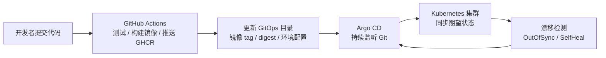
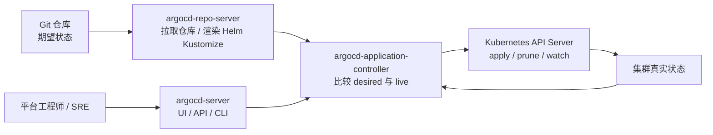
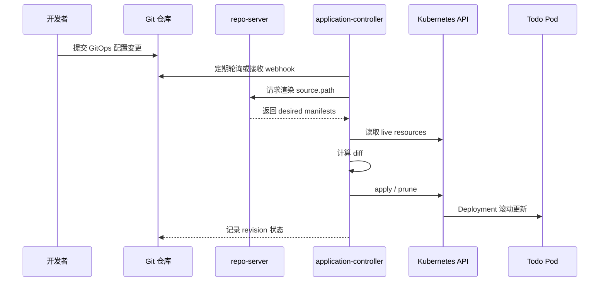
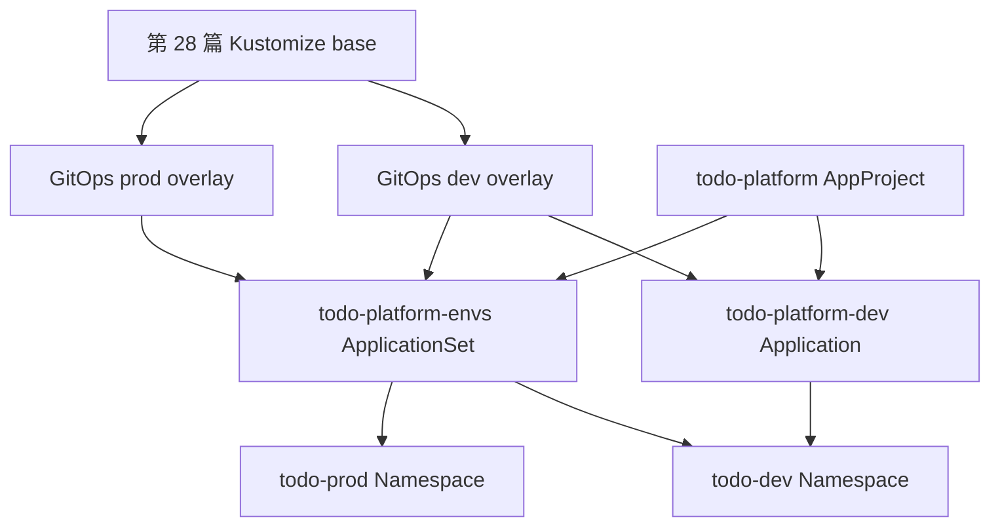

# 第 30 篇：GitOps 与 Argo CD [C]

第 29 篇已经把 Todo Platform 的测试、镜像构建、镜像推送和临时 kind 部署验证放进 GitHub Actions。那条流水线证明了一件事：每次变更都能自动生成可信制品，并验证 Kubernetes 交付物能启动。

但生产发布还有一个关键问题：如果 CI 持有生产集群写权限，一旦 workflow、token 或脚本被误改，生产环境会直接暴露在流水线风险下。本篇把交付模型进一步演进为 GitOps：CI 负责生成镜像并更新 Git 中的期望状态，Argo CD 在集群内持续把真实状态同步到 Git 声明的状态。

本篇特色项目是：**使用 Argo CD 管理 Todo Platform 的 dev 和 prod 两套 Kubernetes 环境发布，让 Git 变更自动驱动集群同步，并完成漂移检测、自动修复、手动同步和 Git 回滚演练。**

## 1. 本章学习目标

### 1.1 知识目标

- 能解释 GitOps 的核心思想：Git 是部署期望状态的唯一事实来源。
- 能描述 Argo CD 的 Application、AppProject、ApplicationSet、repo-server、application-controller 和 argocd-server 的职责。
- 能区分 `Synced` / `OutOfSync` 与 `Healthy` / `Degraded` 两组状态。
- 能说明自动同步、手动同步、`prune`、`selfHeal` 和配置漂移检测之间的关系。
- 能理解为什么 GitOps 中的生产回滚优先使用 Git revert，而不是在集群里手工改资源。
- 能说明 GitOps 仓库中 Secret、镜像 tag / digest、环境目录和审批策略的边界。

### 1.2 技能目标

- 能在持续运行的 kind 集群中安装 Argo CD v3.4.3。
- 能编写 Todo Platform 的 Argo CD `Application` 和 `AppProject` YAML。
- 能把第 28 篇 Kustomize overlay 改造成适合 GitOps 的 dev/prod 环境目录。
- 能使用 Argo CD CLI 和 `kubectl` 查看同步状态、健康状态、历史记录和事件。
- 能通过 Git 变更触发 Argo CD 自动同步，并通过手工修改集群对象观察 `selfHeal` 漂移修复。
- 能用 `ApplicationSet` 生成 dev/prod 两个环境的 Application。
- 能排查常见 GitOps 失败：仓库访问失败、Kustomize 渲染失败、Secret 缺失、镜像拉取失败、误删资源风险。

## 2. 本章工作场景与真实案例

### 2.1 技术痛点

CI 直接部署很直观：workflow 拿到 kubeconfig 后执行 `kubectl apply` 或 `helm upgrade`。小团队的 dev 环境可以这样做，但生产环境会慢慢暴露几个问题：

- 集群写权限分散在多个 CI runner、多个仓库 Secret 和多个 workflow 中，审计困难。
- 发布历史主要存在 CI 日志里，Git 中不一定能看到“当前生产到底应该运行什么配置”。
- 运维临时 `kubectl edit` 修复问题后，Git 里没有记录，下一次发布可能覆盖或扩大差异。
- 多环境发布时，dev、test、prod 的变更路径不同，容易出现“dev 已经上线，但 prod 目录忘记更新”的情况。
- 回滚时有人改镜像 tag，有人改 Deployment，有人重跑旧 workflow，团队很难确认哪个动作是最终事实。

GitOps 的目标不是把所有人工动作都消灭，而是让集群的期望状态回到 Git。凡是要改变环境，都先改变 Git；凡是集群里发生偏离，都能被发现、审计和修复。

### 2.2 团队协作场景

真实团队中，GitOps 通常把职责拆得更清楚：

- 后端工程师合并代码后，由 CI 构建镜像，并把新镜像 tag 或 digest 写入 GitOps 配置。
- 平台工程师维护 Argo CD、AppProject、ApplicationSet、仓库凭据、RBAC、SSO 和集群注册。
- SRE 审查生产目录的 PR，关注同步窗口、回滚策略、告警联动、资源漂移和发布节奏。
- 安全工程师审查 GitOps 仓库权限、密钥管理、Argo CD 权限、第三方仓库来源和生产变更审计。
- 测试工程师通过 dev/test 环境的同步结果验证镜像、配置和冒烟测试，再决定是否推动 prod 目录变更。

出问题时也更容易定位：如果 Git 期望状态错了，修 Git；如果 Git 正确但集群不同步，查 Argo CD；如果 Argo CD 已同步但应用不健康，查 Kubernetes 资源和应用日志。

### 2.3 课程项目关联

本篇承接前面几篇产物：

```text
第 27 篇：Todo Platform Helm 4 Chart
第 28 篇：Kustomize dev/test/prod overlay
第 29 篇：GitHub Actions 构建镜像并验证部署
```

第 28 篇的 overlay 里使用了本地 `.secrets/todo-api-auth.env`。这适合本地实验和 CI 临时渲染，但不适合 Argo CD：Argo CD 在集群内从 Git 拉取仓库，不能读取你电脑上的 `.secrets/` 文件，也不应该从 Git 拉取明文生产密钥。

所以本篇会新增 GitOps 专用目录：

```text
deployments/gitops/
├── argocd/
│   ├── todo-platform-project.yaml
│   ├── todo-platform-dev-application.yaml
│   └── todo-platform-applicationset.yaml
└── envs/
    ├── dev/
    │   ├── kustomization.yaml
    │   └── namespace.yaml
    └── prod/
        ├── kustomization.yaml
        ├── namespace.yaml
        └── patch-deployment-resources.yaml
```

图 30-1 展示第 29 篇到第 30 篇的职责变化：



本篇产物会被第 31 篇 Prometheus / Grafana 复用：Argo CD 管理的 dev/prod 环境会成为后续监控、日志、Tracing 和生产排障的基础运行环境。

## 3. 核心概念

### 3.1 GitOps：Git 是唯一事实来源

GitOps 是一种声明式交付模式：Git 仓库保存应用在集群中的期望状态，集群内的控制器负责持续同步。

最小 GitOps 目录可以长这样：

```text
deployments/gitops/envs/dev/
├── kustomization.yaml
└── namespace.yaml
```

`kustomization.yaml` 里声明这个环境需要哪些 Kubernetes 对象：

```yaml
apiVersion: kustomize.config.k8s.io/v1beta1
kind: Kustomization
namespace: todo-dev
resources:
  - ../../../kustomize/base
  - namespace.yaml
images:
  - name: todo-api
    newName: ghcr.io/example/todo-platform/todo-api
    newTag: sha-abc1234
```

没有 GitOps 时，发布动作可能是某个人在本地执行 `kubectl apply -f xxx.yaml`。有 GitOps 后，发布动作变成“提交一条修改 GitOps 目录的 PR”。集群内的 Argo CD 会看到 Git 变化，再把变化同步到 Kubernetes。

### 3.2 Argo CD Application

`Application` 是 Argo CD 管理一个应用的核心自定义资源。它回答四个问题：

- 从哪个 Git 仓库读取。
- 读取哪个分支、tag 或 commit。
- 使用仓库里的哪个目录。
- 同步到哪个集群和 Namespace。

最小示例：

```yaml
apiVersion: argoproj.io/v1alpha1
kind: Application
metadata:
  name: todo-platform-dev
  namespace: argocd
spec:
  project: todo-platform
  source:
    repoURL: https://github.com/example/cloud-native-todo-platform.git
    targetRevision: main
    path: deployments/gitops/envs/dev
  destination:
    server: https://kubernetes.default.svc
    namespace: todo-dev
```

表 30-1 Application 关键字段：

| 字段 | 含义 | 本篇取值 |
|---|---|---|
| `metadata.namespace` | Application 资源放在哪个 Namespace | `argocd` |
| `spec.project` | 使用哪个 AppProject 做权限约束 | `todo-platform` |
| `spec.source.repoURL` | Git 仓库地址 | 当前 Todo Platform 应用仓库 |
| `spec.source.targetRevision` | Git revision | `main` |
| `spec.source.path` | 仓库中的交付目录 | `deployments/gitops/envs/dev` |
| `spec.destination.server` | 目标 Kubernetes API | `https://kubernetes.default.svc` |
| `spec.destination.namespace` | 默认目标 Namespace | `todo-dev` |

### 3.3 同步状态与健康状态

Argo CD 页面上常见两组状态：

| 状态类型 | 常见值 | 含义 |
|---|---|---|
| Sync Status | `Synced` | 集群真实对象与 Git 期望状态一致 |
| Sync Status | `OutOfSync` | Git 与集群不同，或者 Git 中有对象尚未应用 |
| Health Status | `Healthy` | 应用资源运行正常，例如 Deployment Available |
| Health Status | `Progressing` | 正在滚动更新或等待 Pod Ready |
| Health Status | `Degraded` | 资源存在失败，例如 Pod CrashLoopBackOff |
| Health Status | `Missing` | Git 中声明的对象在集群中不存在 |

这两组状态不是同一件事。一个应用可以 `Synced` 但 `Degraded`：说明 Git 里的 YAML 已经应用到集群，但应用自己没跑起来。也可以 `OutOfSync` 但 `Healthy`：说明集群当前还能运行，只是它和 Git 已经不一致。

### 3.4 AppProject

`AppProject` 是 Argo CD 的权限边界。它限制一组 Application 可以从哪些仓库读取、可以部署到哪些集群和 Namespace、可以管理哪些资源类型。

示例：

```yaml
apiVersion: argoproj.io/v1alpha1
kind: AppProject
metadata:
  name: todo-platform
  namespace: argocd
spec:
  sourceRepos:
    - https://github.com/example/cloud-native-todo-platform.git
  destinations:
    - server: https://kubernetes.default.svc
      namespace: todo-dev
    - server: https://kubernetes.default.svc
      namespace: todo-prod
  clusterResourceWhitelist:
    - group: ""
      kind: Namespace
  namespaceResourceWhitelist:
    - group: "*"
      kind: "*"
```

如果所有应用都使用默认 `default` project，短期能跑，长期会失去隔离。生产中通常按团队、业务线或环境划分 AppProject。

### 3.5 自动同步、Prune 与 Self Heal

自动同步配置放在 `syncPolicy` 中：

```yaml
syncPolicy:
  automated:
    prune: true
    selfHeal: true
  syncOptions:
    - CreateNamespace=true
    - PruneLast=true
```

含义如下：

| 配置 | 作用 | 风险 |
|---|---|---|
| `automated` | Git 变化后自动同步 | 错误变更会更快进入集群 |
| `prune` | Git 删除对象后，集群也删除对象 | 路径或分支配错可能误删资源 |
| `selfHeal` | 集群被手工改动后，自动修回 Git 状态 | 临时救火修改会被覆盖 |
| `CreateNamespace=true` | 自动创建目标 Namespace | Namespace 标签和配额仍需治理 |
| `PruneLast=true` | 删除动作放在同步最后 | 降低升级中先删后建的风险 |

本篇在 dev 上开启自动同步和自愈，便于演示；prod 示例也会展示自动同步配置，但生产团队通常要求 prod 目录变更必须经过 PR 审批、窗口控制和告警确认。

### 3.6 ApplicationSet

`ApplicationSet` 用一个模板生成多个 `Application`。当你有 dev、test、prod 多环境，或者多个集群都要部署同一应用时，不应该复制粘贴多份几乎相同的 Application。

最小示例：

```yaml
apiVersion: argoproj.io/v1alpha1
kind: ApplicationSet
metadata:
  name: todo-platform-envs
  namespace: argocd
spec:
  goTemplate: true
  goTemplateOptions: ["missingkey=error"]
  generators:
    - list:
        elements:
          - env: dev
            namespace: todo-dev
            path: deployments/gitops/envs/dev
          - env: prod
            namespace: todo-prod
            path: deployments/gitops/envs/prod
  template:
    metadata:
      name: "todo-platform-{{.env}}"
    spec:
      project: todo-platform
      source:
        repoURL: https://github.com/example/cloud-native-todo-platform.git
        targetRevision: main
        path: "{{.path}}"
      destination:
        server: https://kubernetes.default.svc
        namespace: "{{.namespace}}"
```

Argo CD v2.3 起已经内置 ApplicationSet controller，本篇使用的 Argo CD v3.4.3 不需要单独安装 ApplicationSet。

## 4. 原理深入

### 4.1 Argo CD 组件如何协作

图 30-2 Argo CD 核心组件协作：



`repo-server` 负责把 Git 中的 Helm、Kustomize 或普通 YAML 渲染成 Kubernetes manifest。`application-controller` 负责比较 Git 期望状态和集群真实状态，并执行同步。`argocd-server` 提供 Web UI、API 和 CLI 入口。

### 4.2 从 Git commit 到集群同步的过程

图 30-3 GitOps 同步时序：



GitOps 和普通 CI/CD 的关键差异在于：CI 不再直接把 YAML 写进集群。CI 更新 Git，Argo CD 从集群内拉取 Git，并用自己的 ServiceAccount 改集群。

### 4.3 Desired、Live 与 Target

Argo CD 排障时经常看到三个概念：

- Desired：从 Git 渲染出来的期望对象。
- Live：集群中实际存在的对象。
- Target Revision：Application 指向的 Git revision，例如 `main`、`v1.0.0` 或某个 commit SHA。

当 Desired 与 Live 不一致时，应用就是 `OutOfSync`。当 Live 资源自身运行失败时，应用可能是 `Degraded`。所以排障顺序通常是：

```text
repoURL / targetRevision / path 是否正确
  -> Kustomize / Helm 是否能渲染
  -> Argo CD 是否有权限同步
  -> Kubernetes 资源是否健康
  -> 应用日志是否正常
```

### 4.4 自动同步与漂移修复

手工执行：

```bash
kubectl -n todo-dev scale deployment/todo-platform --replicas=2
```

如果 Git 中 dev 环境声明 `replicas: 1`，Argo CD 会发现 Live 与 Desired 不一致。开启 `selfHeal` 后，Argo CD 会把 Deployment 改回 1 个副本。

这很有用，也很危险。它保护了 Git 的事实来源地位，但也意味着生产事故中手工救火可能被 Argo CD 覆盖。真实生产应有明确流程：临时修改要么暂停同步，要么立刻补 Git PR，要么在事故后用 Git 变更恢复长期状态。

### 4.5 回滚为什么优先用 Git revert

Argo CD CLI 有 `argocd app rollback`，但在 GitOps 语义下，生产回滚更推荐回滚 Git：

```bash
git revert <bad-commit>
git push origin main
```

原因是 Git 才是事实来源。如果你只在 Argo CD 里回滚到旧 revision，但 Git 仍然指向坏配置，下一次自动同步可能又把坏配置带回来。对于开启自动同步的应用，Git revert 更清晰：审计记录、审批流程、配置状态和集群状态都能保持一致。

### 4.6 Secret 为什么不直接放 Git

第 28 篇的 `.secrets/todo-api-auth.env` 是本地实验输入，不提交 Git。本篇让 Argo CD 管理 Git 中的公开配置，但认证密钥由集群内预创建的 `Secret/todo-api-auth` 提供：

```text
GitOps 仓库：Deployment 引用 todo-api-auth
Kubernetes 集群：提前创建 Secret/todo-api-auth
Argo CD：同步 Deployment，但不管理 Secret 明文
```

生产环境可以进一步使用 External Secrets、Sealed Secrets、Vault 或云密钥服务，把“密钥来源”也声明化，但不把明文放进普通 Git 仓库。

## 5. 手把手实验

### 5.1 实验目标

在一个持续运行的 kind 集群中安装 Argo CD v3.4.3，创建 Todo Platform 的 GitOps dev/prod 目录，使用 Argo CD Application 管理 dev 环境，再使用 ApplicationSet 管理 dev/prod 两套环境，并演示自动同步、漂移修复和 Git 回滚。

预计耗时：90 分钟（动手操作约 60 分钟）。

### 5.2 实验环境

表 30-2 实验工具与版本：

| 工具 | 建议版本 | 用途 |
|---|---|---|
| Git | 2.45+ | 提交 GitOps 配置变更 |
| Docker Engine | 29.x | 运行 kind 节点 |
| kind | 0.31.0 | 创建持续运行的 Kubernetes 实验集群 |
| Kubernetes | kind 节点 v1.35.0 | 承载 Argo CD 和 Todo Platform |
| kubectl | v1.35.0 | 安装 Argo CD、查看资源和排障 |
| Helm | v4.2.0 | 确认第 27 篇 Chart 依赖和第 28 篇 base 已生成 |
| Argo CD | v3.4.3 | GitOps 控制器和 CLI |

说明：2026-05-29 查询 Argo CD 官方 GitHub Releases，当前最新稳定版本为 v3.4.3。本篇锁定该版本，避免 `stable` 分支随时间变化导致实验不可复现。

开始前请确认你在 Todo Platform 应用仓库根目录，也就是 `go.mod` 所在目录：

```bash
test -f go.mod
test -d deployments/helm/todo-platform
test -d deployments/kustomize/base
test -d deployments/kustomize/overlays/dev
test -d deployments/kustomize/overlays/prod
```

如果 `deployments/kustomize/base/todo-platform-rendered.yaml` 不存在，请先回到第 28 篇重新执行 Helm 渲染 base 的步骤。

本篇要求应用仓库已经推送到 GitHub，并且 Argo CD 能从集群访问这个仓库。公开仓库可以直接使用 HTTPS 地址；私有仓库需要在 Argo CD 中配置 repository credentials，第 6 节会给出排障和修复方式。

### 5.3 文件目录结构

本篇会新增以下文件：

```text
deployments/gitops/
├── argocd/
│   ├── todo-platform-project.yaml
│   ├── todo-platform-dev-application.yaml
│   └── todo-platform-applicationset.yaml
└── envs/
    ├── dev/
    │   ├── kustomization.yaml
    │   └── namespace.yaml
    └── prod/
        ├── kustomization.yaml
        ├── namespace.yaml
        └── patch-deployment-resources.yaml
```

创建目录：

```bash
mkdir -p deployments/gitops/argocd
mkdir -p deployments/gitops/envs/dev
mkdir -p deployments/gitops/envs/prod
```

这些文件是应用仓库产物，不是本教材仓库产物。教材仓库只保存教程正文。

### 5.4 完整代码或配置

先准备仓库地址。下面命令会把 SSH 形式的 GitHub 地址转换成 Argo CD 更容易访问的 HTTPS 地址：

```bash
REPO_URL="$(git remote get-url origin)"
case "$REPO_URL" in
  git@github.com:*) REPO_URL="https://github.com/${REPO_URL#git@github.com:}" ;;
esac
echo "$REPO_URL"

GITOPS_REVISION="$(git branch --show-current)"
echo "$GITOPS_REVISION"
```

本地学习时让 Argo CD 指向当前分支，确保刚提交的实验文件能被读取；生产环境应把 `GITOPS_REVISION` 固定为受保护的 `main`、环境分支或不可变 tag。

创建 dev Namespace：

```bash
cat > deployments/gitops/envs/dev/namespace.yaml <<'YAML'
apiVersion: v1
kind: Namespace
metadata:
  name: todo-dev
  labels:
    pod-security.kubernetes.io/enforce: restricted
    pod-security.kubernetes.io/enforce-version: latest
    app.kubernetes.io/managed-by: argocd
YAML
```

创建 dev GitOps overlay。它直接复用第 28 篇的 `deployments/kustomize/base`，但不使用 `secretGenerator`，因为 Secret 由集群内预创建：

```bash
cat > deployments/gitops/envs/dev/kustomization.yaml <<'YAML'
apiVersion: kustomize.config.k8s.io/v1beta1
kind: Kustomization
namespace: todo-dev

resources:
  - ../../../kustomize/base
  - namespace.yaml

labels:
  - pairs:
      app.kubernetes.io/environment: dev
      app.kubernetes.io/managed-by: argocd
    includeSelectors: false # ← 不改 selector，避免触发 Deployment selector 不可变问题。

configMapGenerator:
  - name: todo-platform-env
    literals:
      - TODO_API_ADDR=0.0.0.0:18080
      # GitOps 实验仍沿用内存 Repository；未设置 TODO_DATABASE_DSN 时 Todo API 不连接 PostgreSQL。
      - TODO_ENV=dev
      - TODO_LOG_LEVEL=debug
      - TODO_CORS_ALLOWED_ORIGINS=https://todo-dev.localhost:18443
      - TODO_PPROF_ENABLED=true
      - TODO_RELEASE=chapter-30-dev

images:
  - name: todo-api
    newName: todo-api
    newTag: v0.1.0

replicas:
  - name: todo-platform
    count: 1

patches:
  - target:
      group: apps
      version: v1
      kind: Deployment
      name: todo-platform
    patch: |-
      - op: replace
        path: /spec/template/spec/containers/0/envFrom/0/configMapRef/name
        value: todo-platform-env
  - target:
      group: rbac.authorization.k8s.io
      version: v1
      kind: Role
      name: todo-platform-config-reader
    patch: |-
      - op: replace
        path: /rules/0/resourceNames/0
        value: todo-platform-env
  - target:
      group: rbac.authorization.k8s.io
      version: v1
      kind: RoleBinding
      name: todo-platform-read-config
    patch: |-
      - op: replace
        path: /subjects/0/namespace
        value: todo-dev
YAML
```

创建 prod Namespace：

```bash
cat > deployments/gitops/envs/prod/namespace.yaml <<'YAML'
apiVersion: v1
kind: Namespace
metadata:
  name: todo-prod
  labels:
    pod-security.kubernetes.io/enforce: restricted
    pod-security.kubernetes.io/enforce-version: latest
    app.kubernetes.io/managed-by: argocd
YAML
```

创建 prod 资源 patch：

```bash
cat > deployments/gitops/envs/prod/patch-deployment-resources.yaml <<'YAML'
apiVersion: apps/v1
kind: Deployment
metadata:
  name: todo-platform
spec:
  template:
    spec:
      containers:
        - name: todo-api
          resources:
            requests:
              cpu: 200m
              memory: 256Mi
            limits:
              cpu: "1"
              memory: 512Mi
YAML
```

创建 prod GitOps overlay。生产示例使用 3 个副本、更保守的日志级别和更高资源配置：

```bash
cat > deployments/gitops/envs/prod/kustomization.yaml <<'YAML'
apiVersion: kustomize.config.k8s.io/v1beta1
kind: Kustomization
namespace: todo-prod

resources:
  - ../../../kustomize/base
  - namespace.yaml

labels:
  - pairs:
      app.kubernetes.io/environment: prod
      app.kubernetes.io/managed-by: argocd
    includeSelectors: false

configMapGenerator:
  - name: todo-platform-env
    literals:
      - TODO_API_ADDR=0.0.0.0:18080
      # 本篇聚焦 GitOps 发布链路，仍不设置 TODO_DATABASE_DSN。
      - TODO_ENV=prod
      - TODO_LOG_LEVEL=info
      - TODO_CORS_ALLOWED_ORIGINS=https://todo.example.com
      - TODO_PPROF_ENABLED=false
      - TODO_RELEASE=chapter-30-prod

images:
  - name: todo-api
    newName: todo-api
    newTag: v0.1.0

replicas:
  - name: todo-platform
    count: 3

patches:
  - path: patch-deployment-resources.yaml
  - target:
      group: apps
      version: v1
      kind: Deployment
      name: todo-platform
    patch: |-
      - op: replace
        path: /spec/template/spec/containers/0/envFrom/0/configMapRef/name
        value: todo-platform-env
  - target:
      group: rbac.authorization.k8s.io
      version: v1
      kind: Role
      name: todo-platform-config-reader
    patch: |-
      - op: replace
        path: /rules/0/resourceNames/0
        value: todo-platform-env
  - target:
      group: rbac.authorization.k8s.io
      version: v1
      kind: RoleBinding
      name: todo-platform-read-config
    patch: |-
      - op: replace
        path: /subjects/0/namespace
        value: todo-prod
YAML
```

创建 AppProject。这里不用默认 `default` project，而是把 Todo Platform 限定在本章需要的仓库、Namespace 和资源类型内：

```bash
cat > deployments/gitops/argocd/todo-platform-project.yaml <<YAML
apiVersion: argoproj.io/v1alpha1
kind: AppProject
metadata:
  name: todo-platform
  namespace: argocd
spec:
  description: Todo Platform GitOps project
  sourceRepos:
    - ${REPO_URL}
  destinations:
    - server: https://kubernetes.default.svc
      namespace: todo-dev
    - server: https://kubernetes.default.svc
      namespace: todo-prod
  clusterResourceWhitelist:
    - group: ""
      kind: Namespace
  namespaceResourceWhitelist:
    - group: ""
      kind: ServiceAccount
    - group: ""
      kind: ConfigMap
    - group: ""
      kind: Service
    - group: "apps"
      kind: Deployment
    - group: "autoscaling"
      kind: HorizontalPodAutoscaler
    - group: "networking.k8s.io"
      kind: NetworkPolicy
    - group: "rbac.authorization.k8s.io"
      kind: Role
    - group: "rbac.authorization.k8s.io"
      kind: RoleBinding
YAML
```

这份白名单覆盖第 28 篇 base 从 Helm Chart 渲染出的主链路对象。后续如果你把 Ingress、Job、CronJob 或 ExternalSecret 也纳入 GitOps，需要同步扩展 AppProject 白名单，否则 Argo CD 会拒绝同步。

创建 dev Application。这里开启自动同步、自动 prune 和 self-heal，便于演示 GitOps 控制循环：

```bash
cat > deployments/gitops/argocd/todo-platform-dev-application.yaml <<YAML
apiVersion: argoproj.io/v1alpha1
kind: Application
metadata:
  name: todo-platform-dev
  namespace: argocd
  labels:
    app.kubernetes.io/part-of: todo-platform
    app.kubernetes.io/environment: dev
spec:
  project: todo-platform
  source:
    repoURL: ${REPO_URL}
    targetRevision: ${GITOPS_REVISION}
    path: deployments/gitops/envs/dev
  destination:
    server: https://kubernetes.default.svc
    namespace: todo-dev
  syncPolicy:
    automated:
      prune: true
      selfHeal: true
    syncOptions:
      - CreateNamespace=true
      - PruneLast=true
      - ApplyOutOfSyncOnly=true
  revisionHistoryLimit: 10
YAML
```

创建 ApplicationSet。它用 list generator 生成 dev/prod 两个 Application。多环境模板默认不启用自动同步，尤其避免把 prod 复制成 dev 的 auto-sync 策略；本篇前面已经用单独的 dev Application 演示过自动同步和漂移修复：

```bash
cat > deployments/gitops/argocd/todo-platform-applicationset.yaml <<YAML
apiVersion: argoproj.io/v1alpha1
kind: ApplicationSet
metadata:
  name: todo-platform-envs
  namespace: argocd
spec:
  goTemplate: true
  goTemplateOptions: ["missingkey=error"]
  generators:
    - list:
        elements:
          - env: dev
            namespace: todo-dev
            path: deployments/gitops/envs/dev
          - env: prod
            namespace: todo-prod
            path: deployments/gitops/envs/prod
  template:
    metadata:
      name: "todo-platform-{{.env}}"
      labels:
        app.kubernetes.io/part-of: todo-platform
        app.kubernetes.io/environment: "{{.env}}"
    spec:
      project: todo-platform
      source:
        repoURL: ${REPO_URL}
        targetRevision: ${GITOPS_REVISION}
        path: "{{.path}}"
      destination:
        server: https://kubernetes.default.svc
        namespace: "{{.namespace}}"
      syncPolicy:
        syncOptions:
          - CreateNamespace=true
          - PruneLast=true
          - ApplyOutOfSyncOnly=true
      revisionHistoryLimit: 10
YAML
```

注意：本篇同时保留 `namespace.yaml`、`CreateNamespace=true` 和预创建 Namespace。`namespace.yaml` 用来让 GitOps 管理 Namespace 标签与安全基线；`CreateNamespace=true` 是防止目标 Namespace 不存在的兜底；实验里提前创建 Namespace 是为了先放入不进入 Git 的运行时 Secret。

### 5.5 执行命令

先本地验证 GitOps overlay 能渲染。下面命令不访问集群，只检查 Kustomize 路径和 YAML 结构：

```bash
kubectl kustomize deployments/gitops/envs/dev > /tmp/todo-gitops-dev.yaml
kubectl kustomize deployments/gitops/envs/prod > /tmp/todo-gitops-prod.yaml
grep -n "kind: Deployment" /tmp/todo-gitops-dev.yaml
grep -n "namespace: todo-prod" /tmp/todo-gitops-prod.yaml
```

创建或复用一个持续运行的 kind 集群。第 29 篇的 CI 集群会随 workflow 销毁，本篇需要保留集群给 Argo CD 持续运行：

```bash
kind create cluster --name todo-gitops --image kindest/node:v1.35.0
kubectl cluster-info --context kind-todo-gitops
```

安装 Argo CD。官方 v3.4.3 安装清单需要 server-side apply，避免大型 CRD 在 client-side apply 时触发 annotation 大小限制：

```bash
ARGOCD_VERSION="v3.4.3"

kubectl create namespace argocd --dry-run=client -o yaml | kubectl apply -f -
kubectl apply -n argocd --server-side --force-conflicts \
  -f "https://raw.githubusercontent.com/argoproj/argo-cd/${ARGOCD_VERSION}/manifests/install.yaml"

kubectl -n argocd rollout status deployment/argocd-server --timeout=300s
kubectl -n argocd rollout status statefulset/argocd-application-controller --timeout=300s
```

安装 Argo CD CLI。不同系统选择对应命令：

=== "Linux / WSL"

    ```bash
    ARGOCD_VERSION="v3.4.3"
    curl -fsSLo argocd "https://github.com/argoproj/argo-cd/releases/download/${ARGOCD_VERSION}/argocd-linux-amd64"
    sudo install -m 0755 argocd /usr/local/bin/argocd
    argocd version --client
    ```

=== "macOS"

    ```bash
    brew install argocd
    argocd version --client
    ```

=== "Windows PowerShell"

    ```powershell
    $Version = "v3.4.3"
    Invoke-WebRequest -Uri "https://github.com/argoproj/argo-cd/releases/download/$Version/argocd-windows-amd64.exe" -OutFile "$env:USERPROFILE\argocd.exe"
    $env:PATH = "$env:USERPROFILE;$env:PATH"
    argocd version --client
    ```

获取初始密码并登录。这里用 port-forward 访问本地 8080 端口：

=== "Linux / macOS / WSL"

    ```bash
    kubectl -n argocd port-forward svc/argocd-server 8080:443 >/tmp/argocd-port-forward.log 2>&1 &
    ARGOCD_PF_PID=$!

    argocd admin initial-password -n argocd
    argocd login localhost:8080 --username admin --password '<PASTE_INITIAL_PASSWORD>' --insecure
    ```

=== "Windows PowerShell"

    ```powershell
    $PortForward = Start-Process kubectl -ArgumentList "-n","argocd","port-forward","svc/argocd-server","8080:443" -NoNewWindow -PassThru

    argocd admin initial-password -n argocd
    argocd login localhost:8080 --username admin --password '<PASTE_INITIAL_PASSWORD>' --insecure
    ```

登录成功后建议立即修改密码，再删除初始密码 Secret。学习环境可以先跳过；生产环境不能长期保留初始密码入口：

```bash
argocd account update-password --current-password '<PASTE_INITIAL_PASSWORD>' --new-password '<NEW_STRONG_PASSWORD>'

kubectl -n argocd delete secret argocd-initial-admin-secret --ignore-not-found
```

如果 Todo API 镜像只存在本机，需要先把镜像加载进 kind 集群。第 29 篇已经把正式镜像推送到 GHCR；如果你还在本地学习阶段，可以继续使用本地 `todo-api:v0.1.0`：

```bash
docker image inspect todo-api:v0.1.0
kind load docker-image todo-api:v0.1.0 --name todo-gitops
```

创建 dev/prod Namespace 和运行时 Secret。这里先用第 14 篇实现的 `hash-password` 子命令生成真实密码 hash，避免占位字符串导致认证逻辑不可用。生产环境应改用 External Secrets、Sealed Secrets、Vault 或云密钥服务：

=== "Linux / macOS / WSL"

    ```bash
    HASH="$(docker run --rm todo-api:v0.1.0 hash-password "change-me-123")"
    test -n "$HASH"

    kubectl create namespace todo-dev --dry-run=client -o yaml | kubectl apply -f -
    kubectl create namespace todo-prod --dry-run=client -o yaml | kubectl apply -f -

    kubectl -n todo-dev create secret generic todo-api-auth \
      --from-literal=TODO_JWT_SECRET=dev-0123456789abcdef0123456789abcdef \
      --from-literal="TODO_AUTH_USERS=admin=${HASH}" \
      --dry-run=client -o yaml | kubectl apply -f -

    kubectl -n todo-prod create secret generic todo-api-auth \
      --from-literal=TODO_JWT_SECRET=prod-0123456789abcdef0123456789abcde \
      --from-literal="TODO_AUTH_USERS=admin=${HASH}" \
      --dry-run=client -o yaml | kubectl apply -f -
    ```

=== "Windows PowerShell"

    ```powershell
    $Hash = docker run --rm todo-api:v0.1.0 hash-password "change-me-123"
    if (-not $Hash) { throw "hash-password failed" }

    kubectl create namespace todo-dev --dry-run=client -o yaml | kubectl apply -f -
    kubectl create namespace todo-prod --dry-run=client -o yaml | kubectl apply -f -

    kubectl -n todo-dev create secret generic todo-api-auth `
      --from-literal=TODO_JWT_SECRET=dev-0123456789abcdef0123456789abcdef `
      --from-literal="TODO_AUTH_USERS=admin=$Hash" `
      --dry-run=client -o yaml | kubectl apply -f -

    kubectl -n todo-prod create secret generic todo-api-auth `
      --from-literal=TODO_JWT_SECRET=prod-0123456789abcdef0123456789abcde `
      --from-literal="TODO_AUTH_USERS=admin=$Hash" `
      --dry-run=client -o yaml | kubectl apply -f -
    ```

提交并推送 GitOps 配置。Argo CD 只能从远端 Git 仓库读取配置，不能读取你本机尚未提交的文件：

```bash
git add deployments/gitops
git commit -m "add todo platform gitops manifests"
git push origin HEAD
```

如果你希望完全模拟生产流程，可以创建 PR 并合并到 `main` 后，再把 `GITOPS_REVISION` 改为 `main` 重新生成 Application / ApplicationSet。

应用 AppProject 和 dev Application：

```bash
kubectl apply -f deployments/gitops/argocd/todo-platform-project.yaml
kubectl apply -f deployments/gitops/argocd/todo-platform-dev-application.yaml
```

等待 Argo CD 同步并检查状态：

```bash
argocd app get todo-platform-dev
argocd app wait todo-platform-dev --sync --health --timeout 300
kubectl -n todo-dev get deploy,svc,pod
```

手工制造一次漂移。Git 中 dev 声明 1 个副本，下面命令把集群手工改成 2 个副本：

```bash
kubectl -n todo-dev scale deployment/todo-platform --replicas=2
kubectl -n todo-dev get deployment todo-platform
```

等待 Argo CD self-heal 把副本数修回 Git 中的 1：

```bash
sleep 30
kubectl -n todo-dev get deployment todo-platform
argocd app get todo-platform-dev
```

演示 Git 变更触发自动同步。把 dev 的发布标记从 `chapter-30-dev` 改为 `chapter-30-dev-v2`：

=== "Linux / WSL"

    ```bash
    sed -i 's/TODO_RELEASE=chapter-30-dev/TODO_RELEASE=chapter-30-dev-v2/' deployments/gitops/envs/dev/kustomization.yaml
    git add deployments/gitops/envs/dev/kustomization.yaml
    git commit -m "promote dev release marker"
    git push origin HEAD

    argocd app wait todo-platform-dev --sync --health --timeout 300
    kubectl -n todo-dev get configmap | grep todo-platform-env
    ```

=== "macOS"

    ```bash
    sed -i '' 's/TODO_RELEASE=chapter-30-dev/TODO_RELEASE=chapter-30-dev-v2/' deployments/gitops/envs/dev/kustomization.yaml
    git add deployments/gitops/envs/dev/kustomization.yaml
    git commit -m "promote dev release marker"
    git push origin HEAD

    argocd app wait todo-platform-dev --sync --health --timeout 300
    kubectl -n todo-dev get configmap | grep todo-platform-env
    ```

=== "Windows PowerShell"

    ```powershell
    $Path = "deployments/gitops/envs/dev/kustomization.yaml"
    $Content = Get-Content $Path -Raw
    $Content.Replace("TODO_RELEASE=chapter-30-dev", "TODO_RELEASE=chapter-30-dev-v2") | Set-Content $Path

    git add deployments/gitops/envs/dev/kustomization.yaml
    git commit -m "promote dev release marker"
    git push origin HEAD

    argocd app wait todo-platform-dev --sync --health --timeout 300
    kubectl -n todo-dev get configmap | Select-String todo-platform-env
    ```

演示 Git 回滚。这里不用 `kubectl edit`，也不用在 Argo CD UI 中临时改资源，而是回滚刚才的 Git commit：

```bash
git revert HEAD --no-edit
git push origin HEAD

argocd app wait todo-platform-dev --sync --health --timeout 300
kubectl -n todo-dev get configmap | grep todo-platform-env
```

切换到 ApplicationSet 管理 dev/prod。先用 Argo CD 的非级联删除移除单独的 dev Application，但保留已经同步出来的 Kubernetes 资源；随后由 ApplicationSet 重新接管。这里不用 `kubectl delete application --cascade=orphan`，因为 Argo CD 是否级联删除资源取决于 Application finalizer：

```bash
argocd app delete todo-platform-dev --cascade=false -y
kubectl apply -f deployments/gitops/argocd/todo-platform-applicationset.yaml

kubectl -n argocd get applicationset todo-platform-envs
kubectl -n argocd get applications
argocd app sync todo-platform-dev --timeout 300
argocd app sync todo-platform-prod --timeout 300
argocd app wait todo-platform-dev --sync --health --timeout 300
argocd app wait todo-platform-prod --sync --health --timeout 300
```

### 5.6 预期输出

Argo CD 组件启动完成后应看到：

```text
deployment "argocd-server" successfully rolled out
statefulset rolling update complete 1 pods at revision argocd-application-controller-...
```

Application 初次创建后，可能先显示 `OutOfSync`，随后自动同步：

```text
Name:               argocd/todo-platform-dev
Project:            todo-platform
Server:             https://kubernetes.default.svc
Namespace:          todo-dev
Sync Status:        Synced to main (...)
Health Status:      Healthy
```

dev 环境资源应出现：

```text
NAME                            READY   UP-TO-DATE   AVAILABLE   AGE
deployment.apps/todo-platform   1/1     1            1           2m

NAME                    TYPE        CLUSTER-IP      EXTERNAL-IP   PORT(S)     AGE
service/todo-platform   ClusterIP   10.96.x.y       <none>        18080/TCP   2m

NAME                                 READY   STATUS    RESTARTS   AGE
pod/todo-platform-xxxxxxxxxx-xxxxx   1/1     Running   0          2m
```

手工扩容后短暂看到 2 个副本，随后被 self-heal 修回 1：

```text
NAME            READY   UP-TO-DATE   AVAILABLE
todo-platform   2/2     2            2

...等待 Argo CD 修复...

NAME            READY   UP-TO-DATE   AVAILABLE
todo-platform   1/1     1            1
```

ApplicationSet 创建后应看到两个 Application：

```text
NAME                 SYNC STATUS   HEALTH STATUS
todo-platform-dev    Synced        Healthy
todo-platform-prod   Synced        Healthy
```

### 5.7 验证方法

第一层：确认 Argo CD 控制面正常。

```bash
kubectl -n argocd get pods
kubectl -n argocd get crd applications.argoproj.io applicationsets.argoproj.io appprojects.argoproj.io
```

判断标准：Argo CD Pod 均为 `Running`，三个 CRD 都存在。

第二层：确认 GitOps overlay 可渲染。

```bash
kubectl kustomize deployments/gitops/envs/dev | grep -n "TODO_RELEASE"
kubectl kustomize deployments/gitops/envs/prod | grep -n "replicas:"
```

判断标准：dev 输出包含 `chapter-30-dev`，prod 输出包含 3 副本配置。

第三层：确认 Application 同步状态。

```bash
argocd app get todo-platform-dev
argocd app history todo-platform-dev
```

判断标准：状态为 `Synced` 和 `Healthy`，history 中能看到至少一次同步记录。

第四层：确认集群真实资源。

```bash
kubectl -n todo-dev get deploy todo-platform
kubectl -n todo-dev get pods -l app.kubernetes.io/name=todo-platform
kubectl -n todo-dev logs deployment/todo-platform --tail=30
```

判断标准：Deployment Available，Pod Running，日志中没有配置缺失或认证 Secret 缺失错误。

第五层：确认漂移修复。

```bash
kubectl -n todo-dev scale deployment/todo-platform --replicas=2
sleep 30
kubectl -n todo-dev get deployment todo-platform -o jsonpath='{.spec.replicas}{"\n"}'
```

判断标准：最终输出回到 `1`。

第六层：确认 ApplicationSet 管理多环境。

```bash
kubectl -n argocd get applicationset todo-platform-envs
kubectl -n argocd get applications -l app.kubernetes.io/part-of=todo-platform
```

判断标准：存在 `todo-platform-dev` 和 `todo-platform-prod` 两个 Application。

### 5.8 清理步骤

先停止本地 port-forward：

=== "Linux / macOS / WSL"

    ```bash
    kill "$ARGOCD_PF_PID"
    ```

=== "Windows PowerShell"

    ```powershell
    Stop-Process -Id $PortForward.Id
    ```

如果只想停止 Todo Platform，但保留 Argo CD：

```bash
kubectl -n argocd delete applicationset todo-platform-envs --ignore-not-found
argocd app delete todo-platform-dev --cascade -y
argocd app delete todo-platform-prod --cascade -y
kubectl delete namespace todo-dev todo-prod --ignore-not-found
```

先删除 ApplicationSet 是为了停止它继续重建 dev/prod Application。如果某个 Application 已经不存在，`argocd app delete` 会提示找不到对象；清理实验环境时可以忽略这类 NotFound 信息。最后删除 Namespace 是兜底清理，确保即使 Application 已被提前删除，实验资源也不会残留。

如果要删除 Argo CD：

```bash
kubectl delete namespace argocd --ignore-not-found
```

如果要删除整个实验集群：

```bash
kind delete cluster --name todo-gitops
```

如果要撤销本篇创建的 GitOps 文件：

```bash
rm -rf deployments/gitops
git add -A deployments/gitops
git commit -m "remove todo platform gitops manifests"
git push origin HEAD
```

## 6. 常见错误与排障

### 错误 1：Argo CD 无法访问 Git 仓库

- **现象**：

  ```text
  rpc error: code = Unknown desc = authentication required
  repository not accessible
  ```

- **原因**：Application 的 `repoURL` 指向私有仓库，或者 SSH 地址没有配置 deploy key。Argo CD 运行在集群中，不会自动拥有你本机的 Git 凭据。
- **排查**：

  ```bash
  argocd app get todo-platform-dev
  kubectl -n argocd logs deployment/argocd-repo-server --tail=80
  kubectl -n argocd get secret -l argocd.argoproj.io/secret-type=repository
  ```

  如果 repo-server 日志出现 `authentication required`，说明是仓库凭据问题，不是 Kubernetes YAML 问题。

- **修复**：公开学习仓库可使用 HTTPS 地址。私有仓库可以通过 Argo CD CLI 添加仓库凭据：

  ```bash
  argocd repo add "$REPO_URL" \
    --username "$GITHUB_ACTOR" \
    --password "$GITHUB_TOKEN"
  ```

- **预防**：生产环境使用只读 deploy key、GitHub App 或专用机器人账号，不要把个人长期 token 填进共享集群。

### 错误 2：Kustomize 渲染失败，找不到 `.secrets`

- **现象**：

  ```text
  ComparisonError: Failed to load target state
  loading KV pairs: env source files: [.secrets/todo-api-auth.env]: no such file or directory
  ```

- **原因**：Application 直接指向了第 28 篇的 `deployments/kustomize/overlays/dev`，而那个 overlay 使用本地 `.secrets/`。Argo CD 从 Git 渲染时拿不到这个未提交目录。
- **排查**：

  ```bash
  argocd app get todo-platform-dev
  grep -n "secretGenerator" -A5 deployments/kustomize/overlays/dev/kustomization.yaml
  grep -n "secretGenerator" -A5 deployments/gitops/envs/dev/kustomization.yaml
  ```

  GitOps overlay 不应包含 `secretGenerator`。

- **修复**：让 Application 指向 `deployments/gitops/envs/dev`，并在集群中预创建 `Secret/todo-api-auth`。
- **预防**：本地实验 Secret、CI 临时 Secret 和 GitOps 生产 Secret 要分开治理。不要把第 28 篇 `.secrets/` 当成 GitOps 方案。

### 错误 3：Pod 不 Ready，提示 Secret 不存在

- **现象**：

  ```text
  secret "todo-api-auth" not found
  ```

  或者 Pod 一直处于 `CreateContainerConfigError`。

- **原因**：Deployment 引用了 `todo-api-auth`，但目标 Namespace 中没有预创建 Secret。
- **排查**：

  ```bash
  kubectl -n todo-dev get secret todo-api-auth
  kubectl -n todo-dev describe pod -l app.kubernetes.io/name=todo-platform
  ```

  如果 describe 中显示 `secret "todo-api-auth" not found`，说明问题发生在容器启动前。

- **修复**：

  ```bash
  HASH="$(docker run --rm todo-api:v0.1.0 hash-password "change-me-123")"
  test -n "$HASH"

  kubectl -n todo-dev create secret generic todo-api-auth \
    --from-literal=TODO_JWT_SECRET=dev-0123456789abcdef0123456789abcdef \
    --from-literal="TODO_AUTH_USERS=admin=${HASH}" \
    --dry-run=client -o yaml | kubectl apply -f -
  ```

- **预防**：生产环境把 Secret 生命周期纳入平台流程，例如 External Secrets 先同步 Secret，应用再由 Argo CD 同步。

### 错误 4：Application 一直 OutOfSync 或 InvalidSpecError

- **现象**：

  ```text
  InvalidSpecError: Unable to generate manifests in deployments/gitops/envs/dev
  app path does not exist
  ```

- **原因**：`spec.source.path` 写错，或者 GitOps 文件只在本地创建但没有 push 到 `targetRevision` 指向的分支。
- **排查**：

  ```bash
  git status --short
  git branch --show-current
  git log --oneline -3
  grep -n "path:" deployments/gitops/argocd/todo-platform-dev-application.yaml
  argocd app get todo-platform-dev
  ```

  如果本地有未提交文件，Argo CD 看不到；如果 `targetRevision` 指向 `main`，但你只推到了 feature 分支，Argo CD 也看不到。

- **修复**：提交并推送 GitOps 文件到 Application 指向的分支，或者把 `targetRevision` 临时改成当前学习分支。
- **预防**：真实团队中，GitOps 目录变更必须经过 PR 合并到受保护分支后再由 Argo CD 同步。

### 错误 5：Pod ImagePullBackOff

- **现象**：

  ```text
  Failed to pull image "todo-api:v0.1.0"
  ImagePullBackOff
  ```

- **原因**：kind 集群节点没有本地镜像，或者 GitOps overlay 指向私有 registry 但没有配置 `imagePullSecrets`。
- **排查**：

  ```bash
  kubectl -n todo-dev describe pod -l app.kubernetes.io/name=todo-platform
  kubectl kustomize deployments/gitops/envs/dev | grep -n "image:"
  docker image inspect todo-api:v0.1.0
  ```

  如果镜像是 `todo-api:v0.1.0`，kind 节点需要提前 `kind load docker-image`。如果镜像是 `ghcr.io/...`，检查 registry 访问权限。

- **修复**：

  ```bash
  kind load docker-image todo-api:v0.1.0 --name todo-gitops
  kubectl -n todo-dev rollout restart deployment/todo-platform
  ```

  或者把 `images.newName` 改成 GHCR 中可拉取的镜像，并配置 `imagePullSecrets`。

- **预防**：生产发布使用不可变 digest，并确保目标集群具备 registry 拉取权限。

### 错误 6：切换到 ApplicationSet 后资源被删，或 dev Application 无法接管

- **现象**：

  ```text
  application.argoproj.io "todo-platform-dev" deleted
  deployment.apps/todo-platform not found
  applications.argoproj.io "todo-platform-dev" already exists
  ```

- **原因**：从单独 Application 切换到 ApplicationSet 时，先前的 `todo-platform-dev` Application 仍然占用同名对象，或者删除时触发了 Argo CD 级联删除，把已经同步出来的 Kubernetes 资源一起删掉。
- **排查**：

  ```bash
  kubectl -n argocd get application todo-platform-dev -o yaml
  kubectl -n argocd get applicationset todo-platform-envs
  kubectl -n todo-dev get deploy,svc,pod
  ```

  如果 Application 还存在，ApplicationSet 不能创建同名 Application；如果业务资源已经消失，说明之前执行过级联删除，需要重新同步。

- **修复**：

  ```bash
  argocd app delete todo-platform-dev --cascade=false -y
  kubectl apply -f deployments/gitops/argocd/todo-platform-applicationset.yaml
  argocd app sync todo-platform-dev --timeout 300
  ```

- **预防**：接管场景使用 `--cascade=false` 保留业务资源；清理环境时才使用默认级联删除。真实生产切换控制器归属前，应先在非生产环境验证 finalizer、ownerReference 和资源保留策略。

## 7. 生产环境注意事项

1. **GitOps 仓库必须受保护。** Git 是事实来源后，保护 Git 分支就等于保护生产入口。生产目录应要求 PR、审批、状态检查、CODEOWNERS 和会话解决；禁止直接 push；镜像 tag / digest 变更应能追溯到 CI run、commit 和制品扫描结果。否则 GitOps 只是把“谁能改集群”的问题转移成“谁能改 Git”。

2. **Argo CD 权限要按项目和环境收敛。** 不要长期让所有 Application 使用 default project 和全集群权限。AppProject 应限制 sourceRepos、destinations、Namespace 和资源类型；Argo CD 自身接入 SSO 后，也要区分只读、同步 dev、审批 prod、管理项目等角色。多租户平台尤其要避免一个团队的 Application 管理另一个团队的 Namespace。本章 AppProject 已经用资源白名单代替 `group: "*", kind: "*"`，后续新增 Ingress、Job 或 ExternalSecret 时也要显式评审后再放行。

3. **Secret 不应以明文进入 GitOps 仓库。** 本篇用预创建 Secret 避免明文进入 Git，但生产还需要自动化。常见方案是 External Secrets 读取云密钥服务、Sealed Secrets 提交加密后的 Secret、Vault Agent 注入或平台侧同步 Secret。无论哪种方案，都要明确密钥轮换、审计、灾备和误删恢复流程。

4. **自动同步要按环境分级。** dev 环境开启 auto-sync、prune、selfHeal 很适合快速反馈；prod 环境通常需要 PR 审批、同步窗口、发布冻结、告警静默和回滚预案。`prune: true` 可以清理废弃资源，也可能在路径配错时删除关键对象。生产启用 prune 前，应先用非生产环境验证并限制 Application 的目标范围。本章 ApplicationSet 默认不启用自动同步，要求手动 `argocd app sync`，就是为了把 prod 发布动作显式留给人和流程。

5. **Argo CD 本身也要生产化。** 生产环境应考虑 Argo CD HA 安装、Redis 高可用、repo-server 资源限制、SSO、TLS、审计日志、备份恢复和通知告警。Argo CD 管理的是部署入口，一旦不可用，现有业务 Pod 通常仍会运行，但新发布、漂移修复和回滚会受影响，所以它也需要监控和灾备。

官方参考文档：

- [Argo CD Getting Started](https://argo-cd.readthedocs.io/en/stable/getting_started/)
- [Argo CD Application Specification](https://argo-cd.readthedocs.io/en/stable/user-guide/application-specification/)
- [Argo CD ApplicationSet Introduction](https://argo-cd.readthedocs.io/en/stable/operator-manual/applicationset/)
- [Argo CD v3.4.3 Release](https://github.com/argoproj/argo-cd/releases/tag/v3.4.3)

## 8. 本章小项目

### 8.1 项目产出

本章完成后，Todo Platform 应用仓库新增：

- `deployments/gitops/envs/dev/kustomization.yaml`：GitOps dev 环境期望状态。
- `deployments/gitops/envs/dev/namespace.yaml`：dev Namespace 与 Pod Security 标签。
- `deployments/gitops/envs/prod/kustomization.yaml`：GitOps prod 环境期望状态。
- `deployments/gitops/envs/prod/namespace.yaml`：prod Namespace 与 Pod Security 标签。
- `deployments/gitops/envs/prod/patch-deployment-resources.yaml`：prod 资源请求和限制。
- `deployments/gitops/argocd/todo-platform-project.yaml`：Argo CD 项目权限边界。
- `deployments/gitops/argocd/todo-platform-dev-application.yaml`：单环境 Application。
- `deployments/gitops/argocd/todo-platform-applicationset.yaml`：dev/prod 多环境 ApplicationSet。

图 30-4 本章小项目产出关系：



### 8.2 能力验收标准

基础验收：

- 能安装 Argo CD v3.4.3，并看到 `argocd-server`、`argocd-repo-server`、`argocd-application-controller` 正常运行。
- 能写出 `AppProject`，限制 Todo Platform 只能部署到 `todo-dev` 和 `todo-prod`。
- 能写出 `Application`，指向 `deployments/gitops/envs/dev`。
- 能解释为什么 GitOps overlay 不再使用第 28 篇的 `.secrets/`。

进阶验收：

- `todo-platform-dev` 能自动同步到 `Synced` 和 `Healthy`。
- 手工修改 dev Deployment 副本数后，Argo CD 能自动修复漂移。
- Git 修改 `TODO_RELEASE` 后，Argo CD 能自动同步新 ConfigMap 并滚动更新。
- 能通过 Git revert 完成回滚，并解释为什么不优先使用集群内手工回滚。
- ApplicationSet 能生成 `todo-platform-dev` 和 `todo-platform-prod` 两个 Application。

作品集验收：

- 能展示 GitOps 目录结构截图、Argo CD Application 页面截图、同步历史和一次漂移修复证据。
- 能讲清楚第 29 篇 CI 与第 30 篇 GitOps 的边界：CI 产出制品并更新 Git，Argo CD 从 Git 同步集群。

## 9. 本章练习题

基础题：

1. GitOps 中“Git 是唯一事实来源”是什么意思？它和普通 `kubectl apply` 有什么区别？
2. Argo CD 的 Sync Status 和 Health Status 分别表示什么？
3. `prune` 和 `selfHeal` 分别解决什么问题？各自有什么风险？
4. 为什么 Argo CD 不能直接读取第 28 篇本地 `.secrets/` 目录？
5. AppProject 在生产环境中的作用是什么？

实操题：

1. 给 dev overlay 增加 `TODO_LOG_LEVEL=info`，提交并推送。验收标准：Argo CD 自动同步，新的 ConfigMap 名称发生变化，Deployment 完成滚动更新。
2. 暂时关闭 dev Application 的 `selfHeal`，手工把副本数改成 2，观察 Argo CD 状态。验收标准：能看到 `OutOfSync`，但副本数不会自动恢复；重新开启后能恢复。
3. 在 ApplicationSet 中增加一个 `test` 元素，并创建 `deployments/gitops/envs/test`。验收标准：Argo CD 自动生成 `todo-platform-test` Application。

思考题：

1. 如果生产环境出现紧急故障，你会先暂停 Argo CD 同步、直接手工改集群，还是先提交 Git revert？什么情况下选择不同方案？
2. 如果 CI 构建镜像后自动提交 GitOps PR，你会如何设计审批、镜像扫描、回滚和审计，避免坏镜像进入 prod？

## 10. 本章面试题

### 面试题 1：CI 直接部署和 GitOps 部署有什么区别？

**一句话结论**：CI 直接部署是流水线主动改集群，GitOps 是流水线改 Git，再由集群内控制器把 Git 期望状态同步到集群。

**展开解释**：CI 直接部署简单，适合 dev、临时环境或小团队，但 CI 需要持有集群写权限，部署历史散在 workflow 日志中。GitOps 把部署配置放进 Git，所有变更走 PR、审计和回滚，Argo CD 负责持续同步、漂移检测和自愈，更适合多环境和生产集群。

**深入追问**：生产中还要讨论 Git 分支保护、Argo CD RBAC、AppProject 限权、Secret 管理、同步窗口、prune 风险和事故时如何暂停同步。

### 面试题 2：Argo CD 的 Synced 和 Healthy 是同一个概念吗？

**一句话结论**：不是。`Synced` 表示集群对象与 Git 期望状态一致，`Healthy` 表示这些对象自身运行正常。

**展开解释**：一个应用可能 `Synced` 但 `Degraded`，例如 Git 中的 Deployment 已经应用，但 Pod 因 Secret 缺失 CrashLoopBackOff。也可能 `OutOfSync` 但 `Healthy`，例如有人手工扩容了 Deployment，应用仍正常服务，但集群状态已经偏离 Git。

**深入追问**：排障时先看 source/path/revision 是否能渲染，再看 sync diff，然后看 Kubernetes 事件、Pod 状态、日志和探针。

### 面试题 3：`prune` 和 `selfHeal` 为什么不能无脑开启？

**一句话结论**：它们能强化 Git 事实来源，但也会放大错误配置和覆盖临时救火动作。

**展开解释**：`prune` 会删除 Git 中已移除的资源，适合清理废弃对象，但路径配错或目录误删时可能删除关键资源。`selfHeal` 会把手工改动修回 Git 状态，适合防止漂移，但事故中直接 `kubectl edit` 的临时修复可能被覆盖。

**深入追问**：生产环境应使用 AppProject 限制作用域，配合 PR 审批、同步窗口、告警确认和分环境策略；dev 可以自动化强一些，prod 要更谨慎。

### 面试题 4：ApplicationSet 解决什么问题？

**一句话结论**：ApplicationSet 用模板批量生成 Application，适合多环境、多集群或 monorepo 场景。

**展开解释**：没有 ApplicationSet 时，dev、test、prod 可能复制三份 Application YAML，只改 path 和 namespace，后续很容易漏改。ApplicationSet 通过 list、git、cluster、matrix 等 generator 生成参数，再渲染模板，统一管理一组应用。

**深入追问**：要注意模板参数缺失、命名冲突、prod 自动同步风险、不同环境的审批策略，以及 ApplicationSet 本身的权限边界。

### 面试题 5：GitOps 中如何做回滚？

**一句话结论**：优先回滚 Git 中的期望状态，例如 `git revert`，再让 Argo CD 同步。

**展开解释**：如果只在集群里手工改 Deployment 或只在 Argo CD 中临时 rollback，Git 仍然保留坏配置，下一次同步可能又把坏状态带回来。Git revert 有审计记录、能走审批、能触发相同的同步链路，也能让团队确认当前生产期望状态。

**深入追问**：数据库迁移、不可逆变更和多服务联动不能只靠 Deployment 回滚。要提前设计备份、兼容性、灰度、feature flag、迁移回滚脚本和发布冻结策略。

## 11. 本章总结

本篇把 Todo Platform 从“CI 构建并验证”推进到“GitOps 声明式发布”。你学习了 GitOps 的事实来源模型、Argo CD Application / AppProject / ApplicationSet 的结构、同步状态与健康状态的区别、自动同步、prune、selfHeal、漂移检测和 Git 回滚。

项目成果上，你新增了 `deployments/gitops/` 目录，让 dev/prod 两套环境可以由 Argo CD 从 Git 同步到 Kubernetes。你也处理了一个真实生产边界：本地 `.secrets/` 不能直接进入 GitOps，Secret 要由集群内密钥系统或预创建资源提供。

能力价值上，你现在能把第 29 篇的 CI/CD 和本篇 GitOps 组合成企业常见交付链路：CI 负责验证和制品，Git 负责承载期望状态，Argo CD 负责持续同步和漂移治理。这是后续监控、日志、Tracing 和生产排障的运行基础。

## 12. 下一章衔接

第 31 篇会进入 Prometheus 与 Grafana 监控。本篇已经让 Todo Platform 的 dev/prod 环境由 Argo CD 持续管理；下一篇会回答另一个生产问题：**应用已经能自动发布到集群后，如何知道它是否健康、是否变慢、是否错误率升高、是否需要告警？**

到那时，Argo CD 提供“部署状态”，Prometheus 和 Grafana 提供“运行状态”。两者结合后，你才能从“我把应用发布上去了”进一步走向“我知道应用上线后是否真的稳定”。
