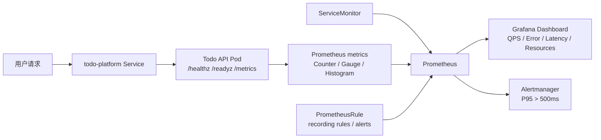
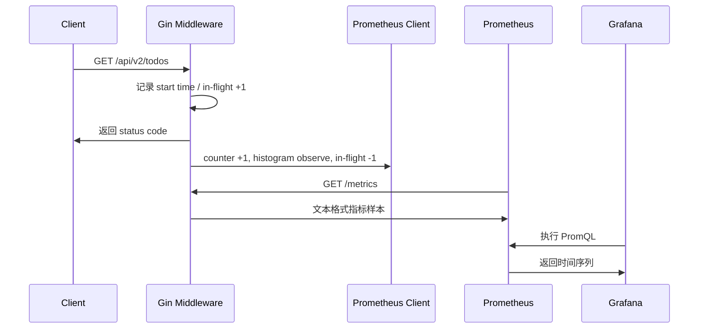
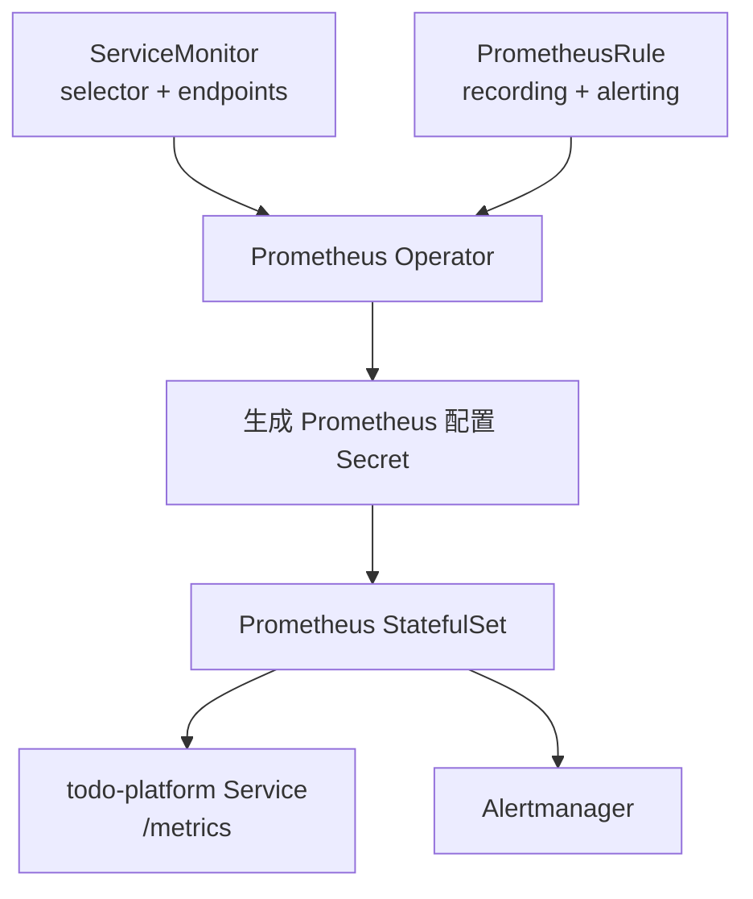
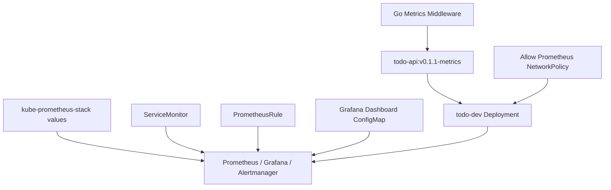

# 第 31 篇：Prometheus 与 Grafana 监控

第 30 篇已经让 Todo Platform 进入 GitOps 发布模型：Git 保存期望状态，Argo CD 负责把 dev/prod 环境同步到 Kubernetes。那解决的是“部署状态”问题：什么版本应该运行、是否同步、是否健康。

但真实生产事故常常不是“有没有部署成功”，而是“部署成功后是否跑得好”：QPS 是否突然下降、P95 延迟是否超过用户可接受范围、5xx 错误率是否上升、Pod CPU 和内存是否接近限制。本篇把 Todo Platform 从“能发布”推进到“能被观测”：使用 Prometheus 采集指标，使用 PromQL 查询和聚合，使用 Grafana 建立 dashboard，并配置 P95 延迟超过 500ms 的告警规则。

本篇特色项目是：**为 Todo Platform 建立 API 延迟（P50/P95/P99）、错误率、QPS、资源使用监控面板，并配置 P95 延迟超过 500ms 的 Prometheus 告警规则。**

## 1. 本章学习目标

### 1.1 知识目标

- 能解释指标、日志、链路追踪三类可观测数据各自解决的问题。
- 能用 RED 和 USE 两套指标体系设计 API 服务与基础设施监控。
- 能描述 Prometheus、Prometheus Operator、ServiceMonitor、PrometheusRule、Alertmanager 和 Grafana 的职责。
- 能说明 Counter、Gauge、Histogram 三类指标的语义和适用场景。
- 能区分 PromQL 中的瞬时向量、范围向量、聚合运算、`rate`、`histogram_quantile` 和 recording rules。
- 能解释为什么监控告警应该围绕用户影响和 SLO，而不是只围绕机器资源阈值。

### 1.2 技能目标

- 能为 Go Gin 服务新增 `/metrics` 指标端点，并暴露请求总数、请求耗时直方图和并发请求数。
- 能使用 Helm 安装 `kube-prometheus-stack`，并确认 Prometheus、Grafana、Alertmanager 和 CRD 正常工作。
- 能编写 `ServiceMonitor` 抓取 Todo API 指标。
- 能编写 PromQL 查询 Todo API 的 QPS、错误率、P50/P95/P99 延迟和 Pod 资源使用。
- 能编写 `PrometheusRule`，把常用查询沉淀为 recording rules，并配置 P95 延迟告警。
- 能通过 Grafana dashboard 可视化 Todo Platform 的运行状态。
- 能排查常见监控问题：Target 不出现、指标为空、Dashboard 无数据、告警不触发、指标基数过高。

## 2. 本章工作场景与真实案例

### 2.1 技术痛点

很多团队第一次把服务部署到 Kubernetes 后，会以为 `kubectl get pods` 显示 `Running` 就代表系统正常。这个判断在生产环境里远远不够：

- Pod 是 `Running`，但接口 P95 延迟已经从 80ms 涨到 900ms，用户感知是“系统很慢”。
- Deployment 是 `Available`，但 5xx 错误率从 0.1% 升到 8%，只是探针仍然返回 200。
- HPA 没有扩容，因为 CPU 不高，但请求排队和下游数据库慢查询已经让 API 超时。
- 一次 GitOps 发布显示 `Synced` 和 `Healthy`，但新版本的某个路由错误率异常，Argo CD 并不会替业务做语义判断。
- 事故复盘时只有日志片段，没有请求量、错误率和延迟曲线，团队很难判断“什么时候开始坏、影响多大、是否恢复”。

Prometheus 与 Grafana 的价值不是让页面变好看，而是把系统行为变成可查询、可告警、可复盘的时间序列。SRE 看到异常曲线后，才能决定是回滚、扩容、限流、隔离下游，还是继续观察。

### 2.2 团队协作场景

真实团队里，监控不是某一个角色单独完成的工作：

- 后端工程师负责在代码里暴露业务指标，确保 label 低基数、路由维度稳定、直方图 bucket 符合接口延迟分布。
- 平台工程师维护 Prometheus Operator、Grafana、Alertmanager、存储保留策略、远程写入和权限边界。
- SRE 设计 SLO、告警分级、静默规则、值班通知和 runbook，并持续删除噪声告警。
- 测试工程师在压测或回归环境里观察 QPS、错误率和延迟曲线，确认新版本性能没有明显退化。
- 安全工程师关注 `/metrics` 暴露范围、Grafana 登录方式、dashboard 权限、跨 namespace 抓取和敏感 label 泄露。

出问题时，团队通常先看四张图：请求量是否变化、错误率是否升高、延迟是否变慢、资源是否打满。指标回答“系统发生了什么”；第 32 篇的日志和链路追踪会继续回答“为什么发生、慢在哪里”。

### 2.3 课程项目关联

本篇承接前面几篇产物：

```text
第 14 篇：Todo API v5 已具备生产风格配置、认证和结构化日志
第 21 篇：Todo API 已部署为 Kubernetes Deployment / Service
第 27 篇：Todo Platform Helm Chart 提供稳定标签和 Service 端口名
第 28 篇：Kustomize overlay 管理 dev/test/prod 环境差异
第 30 篇：Argo CD 管理 todo-dev 与 todo-prod 两套环境
```

本篇会新增两类产物：

```text
api/internal/metrics/                  # Go 服务指标埋点
observability/
├── grafana/
│   └── todo-api-dashboard-configmap.yaml
└── prometheus/
    ├── kube-prometheus-stack-values.yaml
    ├── todo-allow-prometheus-networkpolicy.yaml
    ├── todo-servicemonitor.yaml
    └── todo-prometheus-rules.yaml
```

图 31-1 展示本篇产物在 Todo Platform 中的位置：



本篇产物会被第 32 篇复用：当 Grafana 图表显示某个时间段 P95 延迟升高时，第 32 篇会用 Loki 日志和 OpenTelemetry Trace 继续定位是哪条请求链路、哪个下游调用或哪段代码变慢。

## 3. 核心概念

### 3.1 可观测性三大支柱

可观测性不是“装一个监控系统”，而是让系统对外暴露足够信号，使团队能从外部现象推断内部状态。常见三类信号是：

| 类型 | 回答的问题 | 示例 |
|---|---|---|
| Metrics | 发生了多少、变化趋势如何 | QPS、错误率、P95 延迟、CPU 使用率 |
| Logs | 某一次事件的上下文是什么 | 请求 ID、错误栈、用户动作、关键字段 |
| Traces | 一次请求跨服务经历了哪些步骤 | API -> Redis -> PostgreSQL 的耗时分布 |

指标适合做趋势、告警和容量判断；日志适合查看单个事件细节；链路追踪适合定位跨服务调用路径。本篇只处理指标，后续章节再把日志和 Trace 接进同一个排障流程。

### 3.2 RED 与 USE 指标体系

RED 常用于在线服务：

| 指标 | 含义 | Todo API 示例 |
|---|---|---|
| Rate | 请求速率 | 每秒处理多少 HTTP 请求 |
| Errors | 错误比例 | 5xx 或业务错误占比 |
| Duration | 请求耗时 | P50/P95/P99 延迟 |

USE 常用于基础设施资源：

| 指标 | 含义 | Kubernetes 示例 |
|---|---|---|
| Utilization | 使用率 | CPU 使用、内存 working set |
| Saturation | 饱和度 | CPU throttling、队列长度、磁盘 IO 等待 |
| Errors | 错误数 | 容器重启、网络丢包、磁盘错误 |

本篇对 Todo API 使用 RED，对 Pod 和容器使用 USE。这样 dashboard 不只显示“机器忙不忙”，也能显示“用户请求是否成功、是否变慢”。

### 3.3 Prometheus 架构

Prometheus 是一个拉取式时间序列数据库。它周期性访问目标的 `/metrics` 端点，把指标样本写入本地 TSDB，并提供 PromQL 查询接口。

最小抓取配置大致长这样：

```yaml
scrape_configs:
  - job_name: todo-api
    metrics_path: /metrics
    static_configs:
      - targets:
          - todo-platform.todo-dev.svc.cluster.local:80
```

在 Kubernetes 里，我们通常不手写这段配置，而是交给 Prometheus Operator。Operator 读取 `ServiceMonitor` 这类自定义资源，再生成 Prometheus 的实际抓取配置。

### 3.4 ServiceMonitor 与 PrometheusRule

`ServiceMonitor` 描述“到哪里抓指标”：

```yaml
apiVersion: monitoring.coreos.com/v1
kind: ServiceMonitor
metadata:
  name: todo-api
  namespace: monitoring
spec:
  namespaceSelector:
    matchNames:
      - todo-dev
  selector:
    matchLabels:
      app.kubernetes.io/name: todo-platform
      app.kubernetes.io/instance: todo-platform
  endpoints:
    - port: http
      path: /metrics
      interval: 15s
```

`PrometheusRule` 描述“哪些查询要长期保存、哪些条件要告警”：

```yaml
apiVersion: monitoring.coreos.com/v1
kind: PrometheusRule
metadata:
  name: todo-api-rules
  namespace: monitoring
spec:
  groups:
    - name: todo-api.alerts
      rules:
        - alert: TodoApiHighP95Latency
          expr: todo_api:p95_latency_seconds5m > 0.5
          for: 2m
```

ServiceMonitor 解决采集问题，PrometheusRule 解决查询复用和告警问题。它们都是 Kubernetes CRD，安装 Prometheus Operator 后才会被 API Server 识别。

### 3.5 Counter、Gauge 与 Histogram

Go 服务常见三类指标：

| 类型 | 特点 | Todo API 中怎么用 |
|---|---|---|
| Counter | 只能递增，适合累计事件 | `todo_api_http_requests_total` |
| Gauge | 可增可减，适合当前状态 | `todo_api_http_in_flight_requests` |
| Histogram | 记录分桶分布，适合计算分位数 | `todo_api_http_request_duration_seconds` |

不要用 Gauge 表示请求总数，因为重启后会归零且语义不清；不要用 Counter 表示当前并发，因为并发数会上升也会下降；不要用平均延迟替代 P95/P99，因为少量慢请求会被平均值掩盖。

### 3.6 Grafana Dashboard

Grafana 不负责采集指标，它负责查询数据源并可视化。一个 dashboard 通常包含：

- Stat 面板：显示当前 QPS、错误率、P95 延迟。
- Time series 面板：显示一段时间内的延迟、错误率和资源变化。
- 变量：通过 namespace、service、pod 切换观察对象。
- 告警入口：从异常面板跳到 Prometheus 告警或日志/Trace 查询。

本篇用 ConfigMap 自动导入 dashboard。这样 dashboard 也能放进 Git，而不是只存在某个人手工点出来的 Grafana UI 里。

## 4. 原理深入

### 4.1 从请求到指标样本

Todo API 的指标链路如下：



应用不主动把每条请求推给 Prometheus。应用只维护内存中的指标状态，Prometheus 按 `scrape_interval` 主动拉取。拉取间隔太长会降低告警及时性，太短会增加 Prometheus 和应用负载。本地实验用 15 秒，生产环境常见 15-60 秒。

### 4.2 Prometheus Operator 如何发现目标

`kube-prometheus-stack` 安装后，会创建 Prometheus Operator。Operator 的工作不是替 Prometheus 存数据，而是把 Kubernetes 自定义资源转换成 Prometheus 配置：



如果 ServiceMonitor 写错 label，Prometheus 不会报“配置文件语法错误”，而是 Targets 里没有 Todo API；如果 PrometheusRule 没被选中，Rules 页面不会出现对应规则。排障时要从 CRD、selector、target、PromQL 四层逐步看。

### 4.3 PromQL 数据类型与窗口

PromQL 最容易混淆的是“当前值”和“一段时间内的变化”。

瞬时向量表示某一时刻的一组时间序列：

```promql
up{namespace="todo-dev"}
```

范围向量表示每条时间序列在一段时间内的样本：

```promql
todo_api_http_requests_total[5m]
```

Counter 需要配合 `rate` 或 `increase` 才能看出速率或增量：

```promql
sum(rate(todo_api_http_requests_total[5m]))
```

直接对 Counter 求和只能得到“进程启动以来累计多少请求”，不能得到 QPS。`rate(counter[5m])` 的含义是：过去 5 分钟内平均每秒增长多少。

### 4.4 Histogram 如何计算 P95

Prometheus histogram 会导出三类指标：

```text
todo_api_http_request_duration_seconds_bucket{le="0.1",...}
todo_api_http_request_duration_seconds_sum{...}
todo_api_http_request_duration_seconds_count{...}
```

分位数来自 `_bucket`，典型写法是：

```promql
histogram_quantile(
  0.95,
  sum by (le) (rate(todo_api_http_request_duration_seconds_bucket[5m]))
)
```

`sum by (le)` 很关键。它把不同 Pod、不同 route、不同 status 的 bucket 聚合起来，但保留 `le` 这个桶边界。没有 `le`，`histogram_quantile` 无法知道每个桶的累计数量。

### 4.5 Recording Rules 与 Alerting Rules

复杂 PromQL 如果每个 dashboard 面板都实时计算，会带来两类问题：查询慢、写法散。Recording rules 把常用查询预先计算成新时间序列，例如：

```promql
todo_api:p95_latency_seconds5m
```

Alerting rules 则基于 PromQL 判断是否触发告警。生产环境里不要把告警写成“CPU 超过 80% 就报警”这么粗糙。CPU 高可能是正常流量增长，真正应该优先报警的是用户影响，比如“5xx 错误率持续超过阈值”“P95 延迟持续超过 SLO”。

本篇实验会把 P95 延迟超过 500ms 持续 2 分钟作为告警示例。500ms 不是所有业务的通用标准，而是课程项目的练习阈值；真实项目要根据 SLO、用户体验和历史基线调整。

## 5. 手把手实验

### 5.1 实验目标

在第 30 篇的 `todo-gitops` kind 集群和 `todo-dev` 环境基础上，为 Todo API 暴露 Prometheus 指标，安装 kube-prometheus-stack，配置 ServiceMonitor、PrometheusRule 和 Grafana dashboard，并验证 QPS、错误率、P95/P99 延迟、CPU/内存面板有数据。

预计耗时：90 分钟（动手操作约 65 分钟）。

### 5.2 实验环境

本篇命令默认在 **Cloud Native Todo Platform 应用仓库根目录** 执行，也就是包含 `api/`、`deployments/`、`observability/` 的仓库根目录。

本篇创建文件的命令使用 Bash here-doc。Linux、macOS 和 WSL 可以直接执行；Windows 用户建议在 WSL 或 Git Bash 中执行文件创建命令，`kubectl`、`helm`、`docker` 和浏览器访问步骤在 PowerShell 中同样适用。

表 31-1 是本篇实验版本。版本信息在 2026-05-29 查询：Prometheus 上游最新为 `v3.12.0`，Grafana 上游最新为 `v13.0.1+security-01`；本实验锁定 `kube-prometheus-stack` chart `86.0.1`，实际组件版本以该 chart 的默认 values 和依赖为准，避免把上游最新版本和 Helm Chart 内置版本混用。

| 工具 | 版本 | 用途 |
|---|---:|---|
| Go | 1.26.x | 编译 Todo API 并运行测试 |
| Docker Engine | 29.x | 构建 Todo API 镜像 |
| kind | v0.31.0 | 运行本地 Kubernetes 集群 |
| Kubernetes | v1.35.0 | 第 30 篇 `todo-gitops` 集群 |
| kubectl | v1.35.x | 管理 Kubernetes 资源 |
| Helm | v4.2.x | 安装 kube-prometheus-stack |
| kube-prometheus-stack | 86.0.1 | 安装 Prometheus Operator、Prometheus、Grafana、Alertmanager |
| prometheus/client_golang | v1.23.2 | Go 服务暴露 Prometheus 指标 |

说明：课程蓝图中的 Kubernetes 基线为 1.36.x，本篇继续使用第 30 篇创建的 kind v1.35.0 集群，是为了保持阶段五实验环境连续。本篇不使用 Kubernetes 1.36 专属能力；如果你的集群已经升级到 1.36.x，下面命令仍然适用。

先确认第 30 篇环境仍然可用：

```bash
pwd
test -f go.mod
test -f api/internal/handler/gin/handler.go
test -d deployments/gitops/envs/dev
grep '^module ' go.mod
kubectl config current-context
kubectl get namespace todo-dev
kubectl -n todo-dev get deploy,svc,pod
```

如果 `todo-dev` 不存在，先回到第 30 篇完成 Argo CD 同步。Prometheus 能采集的前提是目标服务已经在集群内运行。

本篇沿用第 30 篇 dev 环境的数据模式：如果 `TODO_DATABASE_DSN` 为空，Todo API 使用内存 Repository；监控实验只验证指标暴露、抓取、查询、面板和告警，不依赖 PostgreSQL。

检查本地工具：

```bash
go version
docker version --format '{{.Server.Version}}'
kind version
kubectl version --client
helm version
```

本篇需要在同一个 kind 集群里同时运行 Argo CD、Todo API、Prometheus、Grafana、Alertmanager、kube-state-metrics 和 node-exporter。建议 Docker Desktop 为 kind 节点预留至少 6GB 内存；如果安装监控栈时大量 Pod 长时间 `Pending` 或 `OOMKilled`，优先检查 Docker Desktop 的资源上限。

### 5.3 文件目录结构

创建本篇目录：

```bash
mkdir -p api/internal/metrics
mkdir -p observability/prometheus
mkdir -p observability/grafana
```

最终目录如下：

```text
cloud-native-todo-platform/
├── api/
│   └── internal/
│       ├── handler/
│       │   └── gin/
│       │       └── handler.go
│       └── metrics/
│           ├── http.go
│           └── http_test.go
├── deployments/
│   └── gitops/
│       └── envs/
│           └── dev/
│               └── kustomization.yaml
└── observability/
    ├── grafana/
    │   └── todo-api-dashboard-configmap.yaml
    └── prometheus/
        ├── kube-prometheus-stack-values.yaml
        ├── todo-allow-prometheus-networkpolicy.yaml
        ├── todo-prometheus-rules.yaml
        └── todo-servicemonitor.yaml
```

### 5.4 完整代码或配置

#### 5.4.1 增加 Go 指标依赖

安装 Prometheus Go client：

```bash
go get github.com/prometheus/client_golang@v1.23.2
go mod tidy
```

这里使用官方 Go client，而不是自己拼接 `/metrics` 文本。Prometheus exposition format 有严格格式，client 库能处理并发安全、Counter 重置、Histogram bucket 和 OpenMetrics 输出。

#### 5.4.2 创建 HTTP 指标包

创建 `api/internal/metrics/http.go`：

```bash
cat > api/internal/metrics/http.go <<'GO'
package metrics

import (
	"net/http"
	"strconv"
	"time"

	"github.com/gin-gonic/gin"
	"github.com/prometheus/client_golang/prometheus"
	"github.com/prometheus/client_golang/prometheus/collectors"
	"github.com/prometheus/client_golang/prometheus/promauto"
	"github.com/prometheus/client_golang/prometheus/promhttp"
)

var Registry = prometheus.NewRegistry()

var (
	RequestsTotal = promauto.With(Registry).NewCounterVec(
		prometheus.CounterOpts{
			Namespace: "todo_api",
			Name:      "http_requests_total",
			Help:      "Total number of HTTP requests handled by Todo API.",
		},
		[]string{"method", "route", "status"},
	)

	RequestDurationSeconds = promauto.With(Registry).NewHistogramVec(
		prometheus.HistogramOpts{
			Namespace: "todo_api",
			Name:      "http_request_duration_seconds",
			Help:      "HTTP request duration in seconds.",
			Buckets:   []float64{0.005, 0.01, 0.025, 0.05, 0.1, 0.25, 0.5, 1, 2.5, 5},
		},
		[]string{"method", "route", "status"},
	)

	InFlightRequests = promauto.With(Registry).NewGauge(
		prometheus.GaugeOpts{
			Namespace: "todo_api",
			Name:      "http_in_flight_requests",
			Help:      "Current number of in-flight HTTP requests.",
		},
	)
)

func init() {
	Registry.MustRegister(
		collectors.NewGoCollector(),
		collectors.NewProcessCollector(collectors.ProcessCollectorOpts{}),
	)
}

func Handler() http.Handler {
	return promhttp.HandlerFor(Registry, promhttp.HandlerOpts{
		EnableOpenMetrics: true,
	})
}

func HTTPMetrics() gin.HandlerFunc {
	return func(c *gin.Context) {
		start := time.Now()
		InFlightRequests.Inc()
		defer InFlightRequests.Dec()

		c.Next()

		route := c.FullPath()
		if route == "" {
			route = "unmatched"
		}

		status := strconv.Itoa(c.Writer.Status())
		RequestsTotal.WithLabelValues(c.Request.Method, route, status).Inc()
		RequestDurationSeconds.WithLabelValues(c.Request.Method, route, status).Observe(time.Since(start).Seconds())
	}
}
GO
```

这里刻意使用 `route` 而不是原始 URL path。`/api/v2/todos/1`、`/api/v2/todos/2` 在 Gin 中都会归一成 `/api/v2/todos/:id`，避免每个 ID 产生一条新的时间序列。生产环境绝对不要把 `user_id`、`request_id`、订单号这类高基数字段放进 label。

创建测试 `api/internal/metrics/http_test.go`：

```bash
cat > api/internal/metrics/http_test.go <<'GO'
package metrics

import (
	"net/http"
	"net/http/httptest"
	"strings"
	"testing"

	"github.com/gin-gonic/gin"
)

func TestHTTPMetrics(t *testing.T) {
	gin.SetMode(gin.TestMode)

	router := gin.New()
	router.Use(HTTPMetrics())
	router.GET("/healthz", func(c *gin.Context) {
		c.JSON(http.StatusOK, gin.H{"status": "ok"})
	})

	req := httptest.NewRequest(http.MethodGet, "/healthz", nil)
	rec := httptest.NewRecorder()
	router.ServeHTTP(rec, req)

	if rec.Code != http.StatusOK {
		t.Fatalf("GET /healthz status = %d", rec.Code)
	}

	metricsReq := httptest.NewRequest(http.MethodGet, "/metrics", nil)
	metricsRec := httptest.NewRecorder()
	Handler().ServeHTTP(metricsRec, metricsReq)

	body := metricsRec.Body.String()
	if !strings.Contains(body, `todo_api_http_requests_total{method="GET",route="/healthz",status="200"}`) {
		t.Fatalf("metrics output does not contain healthz counter:\n%s", body)
	}
	if !strings.Contains(body, "todo_api_http_request_duration_seconds_bucket") {
		t.Fatalf("metrics output does not contain duration histogram:\n%s", body)
	}
}
GO
```

#### 5.4.3 把指标接入 Gin Router

更新 `api/internal/handler/gin/handler.go` 的 import，新增 metrics 包：

```go
import (
	"log/slog"
	"net/http"
	"strconv"

	"cloud-native-todo-platform/api/internal/metrics"

	"github.com/gin-gonic/gin"
	"github.com/gin-gonic/gin/binding"
)
```

这是在已有 import 块中新增 `cloud-native-todo-platform/api/internal/metrics` 这一行，其余 import 保持不变。如果你的 `go.mod` 中 `module` 不是 `cloud-native-todo-platform`，需要把导入路径前缀改成你自己的 module 名。

在 `NewRouter` 中注册 `/metrics`，并把指标中间件放在业务路由之前：

```go
router := gin.New()
router.Use(RequestID(), AccessLog(logger), Recovery(logger), Timeout(defaultRequestTimeout), BodyLimit(maxBodyBytes), SecurityHeaders(), CORS(opts.AllowedOrigins))

router.GET("/metrics", gin.WrapH(metrics.Handler()))
router.Use(metrics.HTTPMetrics())

router.GET("/healthz", h.healthz)
router.GET("/readyz", h.readyz)
router.GET("/openapi.yaml", h.openapi)
router.POST("/api/v2/auth/login", h.login)
```

修改时先找到 `NewRouter` 函数中已有的 `router := gin.New()` 和基础中间件注册位置，只插入 `/metrics` 路由和 `metrics.HTTPMetrics()` 中间件，不要删除原有的健康检查、OpenAPI、登录和受保护 Todo 路由。

`/metrics` 放在 `metrics.HTTPMetrics()` 前面，是为了避免 Prometheus 每次 scrape 都把 `/metrics` 自身计入业务 QPS。业务接口、健康检查和登录接口会被统计；如果你的团队希望统计 scrape 行为，可以把 `/metrics` 移到中间件之后。

修改后运行测试：

```bash
go test ./api/internal/metrics ./api/internal/handler/gin
```

#### 5.4.4 创建 kube-prometheus-stack values

创建 `observability/prometheus/kube-prometheus-stack-values.yaml`：

```bash
cat > observability/prometheus/kube-prometheus-stack-values.yaml <<'YAML'
grafana:
  enabled: true
  adminPassword: "admin"
  defaultDashboardsEnabled: true
  service:
    type: ClusterIP
  sidecar:
    dashboards:
      enabled: true
      label: grafana_dashboard
      labelValue: "1"
      searchNamespace: ALL
    datasources:
      enabled: true
      defaultDatasourceEnabled: true
      isDefaultDatasource: true
      name: Prometheus
      uid: prometheus

prometheus:
  prometheusSpec:
    retention: 6h
    scrapeInterval: 15s
    evaluationInterval: 15s
    serviceMonitorSelectorNilUsesHelmValues: false
    serviceMonitorSelector: {}
    serviceMonitorNamespaceSelector: {}
    ruleSelectorNilUsesHelmValues: false
    ruleSelector: {}
    ruleNamespaceSelector: {}
    resources:
      requests:
        cpu: 200m
        memory: 512Mi
      limits:
        cpu: "1"
        memory: 2Gi

alertmanager:
  enabled: true
  alertmanagerSpec:
    retention: 6h

kube-state-metrics:
  enabled: true

prometheus-node-exporter:
  enabled: true
YAML
```

`adminPassword: "admin"` 只适合本地实验。生产环境应使用外部 Secret、SSO、OIDC 或企业身份系统，并限制 Grafana 管理员权限。

`serviceMonitorSelectorNilUsesHelmValues: false` 和 `ruleSelectorNilUsesHelmValues: false` 的含义是：不要只选择 Helm release 自己打标签的 ServiceMonitor / PrometheusRule，而是允许 Prometheus 发现我们后续创建的 Todo API 监控对象。

#### 5.4.5 创建 ServiceMonitor

创建 `observability/prometheus/todo-servicemonitor.yaml`：

```bash
cat > observability/prometheus/todo-servicemonitor.yaml <<'YAML'
apiVersion: monitoring.coreos.com/v1
kind: ServiceMonitor
metadata:
  name: todo-api
  namespace: monitoring
  labels:
    app.kubernetes.io/name: todo-api
    app.kubernetes.io/part-of: todo-platform
spec:
  namespaceSelector:
    matchNames:
      - todo-dev
  selector:
    matchLabels:
      app.kubernetes.io/name: todo-platform
      app.kubernetes.io/instance: todo-platform
  endpoints:
    - port: http
      path: /metrics
      interval: 15s
      scrapeTimeout: 5s
YAML
```

这里选择的是 `todo-dev` namespace 中带有 `app.kubernetes.io/name=todo-platform` 和 `app.kubernetes.io/instance=todo-platform` 的 Service。第 27 篇 Helm Chart 已经为 Service 写入这两个稳定 label，Service 端口名是 `http`，所以 ServiceMonitor 不需要关心 Service 实际端口是 80 还是 18080。

如果你在前面章节中改过 Helm release 名称，先查看 Service 的真实 label：

```bash
kubectl -n todo-dev get svc todo-platform --show-labels
kubectl -n todo-dev get svc todo-platform -o jsonpath='{.spec.ports[*].name}{"\n"}'
```

然后把 ServiceMonitor 的 `selector.matchLabels` 改成和 Service 一致。

#### 5.4.6 创建 PrometheusRule

创建 `observability/prometheus/todo-prometheus-rules.yaml`：

```bash
cat > observability/prometheus/todo-prometheus-rules.yaml <<'YAML'
apiVersion: monitoring.coreos.com/v1
kind: PrometheusRule
metadata:
  name: todo-api-rules
  namespace: monitoring
  labels:
    app.kubernetes.io/name: todo-api
    app.kubernetes.io/part-of: todo-platform
spec:
  groups:
    - name: todo-api.recording
      interval: 15s
      rules:
        - record: todo_api:request_rate5m
          expr: sum(rate(todo_api_http_requests_total[5m]))
        - record: todo_api:error_rate5m
          expr: |
            sum(rate(todo_api_http_requests_total{status=~"5.."}[5m]))
            /
            clamp_min(sum(rate(todo_api_http_requests_total[5m])), 1)
        - record: todo_api:p50_latency_seconds5m
          expr: |
            histogram_quantile(
              0.50,
              sum by (le) (rate(todo_api_http_request_duration_seconds_bucket[5m]))
            )
        - record: todo_api:p95_latency_seconds5m
          expr: |
            histogram_quantile(
              0.95,
              sum by (le) (rate(todo_api_http_request_duration_seconds_bucket[5m]))
            )
        - record: todo_api:p99_latency_seconds5m
          expr: |
            histogram_quantile(
              0.99,
              sum by (le) (rate(todo_api_http_request_duration_seconds_bucket[5m]))
            )
    - name: todo-api.alerts
      interval: 15s
      rules:
        - alert: TodoApiHighP95Latency
          expr: todo_api:p95_latency_seconds5m > 0.5
          for: 2m
          labels:
            severity: warning
            service: todo-api
          annotations:
            summary: "Todo API P95 latency is above 500ms"
            description: "Todo API P95 latency is {{ $value }}s for more than 2 minutes."
            runbook_url: "https://example.com/runbooks/todo-api-high-latency"
YAML
```

`clamp_min(..., 1)` 用于避免请求量为 0 时分母过小导致查询结果异常。生产环境里错误率通常会结合最小流量门槛，例如“过去 5 分钟请求数超过 100 且错误率超过 5%”才告警。

#### 5.4.7 创建 Grafana Dashboard ConfigMap

创建 `observability/grafana/todo-api-dashboard-configmap.yaml`：

```bash
cat > observability/grafana/todo-api-dashboard-configmap.yaml <<'YAML'
apiVersion: v1
kind: ConfigMap
metadata:
  name: todo-api-dashboard
  namespace: monitoring
  labels:
    grafana_dashboard: "1"
    app.kubernetes.io/name: todo-api-dashboard
    app.kubernetes.io/part-of: todo-platform
data:
  todo-api-dashboard.json: |-
    {
      "id": null,
      "uid": "todo-api-overview",
      "title": "Todo API Overview",
      "timezone": "browser",
      "schemaVersion": 41,
      "version": 1,
      "refresh": "15s",
      "tags": ["todo-platform", "prometheus", "chapter-31"],
      "time": {
        "from": "now-30m",
        "to": "now"
      },
      "panels": [
        {
          "id": 1,
          "type": "stat",
          "title": "QPS",
          "datasource": {"type": "prometheus", "uid": "prometheus"},
          "gridPos": {"h": 4, "w": 6, "x": 0, "y": 0},
          "targets": [
            {"expr": "todo_api:request_rate5m", "legendFormat": "requests/s", "refId": "A"}
          ],
          "fieldConfig": {
            "defaults": {"unit": "reqps", "decimals": 2},
            "overrides": []
          },
          "options": {"reduceOptions": {"calcs": ["lastNotNull"]}}
        },
        {
          "id": 2,
          "type": "stat",
          "title": "5xx Error Rate",
          "datasource": {"type": "prometheus", "uid": "prometheus"},
          "gridPos": {"h": 4, "w": 6, "x": 6, "y": 0},
          "targets": [
            {"expr": "100 * todo_api:error_rate5m", "legendFormat": "5xx %", "refId": "A"}
          ],
          "fieldConfig": {
            "defaults": {
              "unit": "percent",
              "decimals": 2,
              "thresholds": {
                "mode": "absolute",
                "steps": [
                  {"color": "green", "value": null},
                  {"color": "yellow", "value": 1},
                  {"color": "red", "value": 5}
                ]
              }
            },
            "overrides": []
          },
          "options": {"reduceOptions": {"calcs": ["lastNotNull"]}}
        },
        {
          "id": 3,
          "type": "stat",
          "title": "P95 Latency",
          "datasource": {"type": "prometheus", "uid": "prometheus"},
          "gridPos": {"h": 4, "w": 6, "x": 12, "y": 0},
          "targets": [
            {"expr": "todo_api:p95_latency_seconds5m", "legendFormat": "p95", "refId": "A"}
          ],
          "fieldConfig": {
            "defaults": {
              "unit": "s",
              "decimals": 3,
              "thresholds": {
                "mode": "absolute",
                "steps": [
                  {"color": "green", "value": null},
                  {"color": "yellow", "value": 0.3},
                  {"color": "red", "value": 0.5}
                ]
              }
            },
            "overrides": []
          },
          "options": {"reduceOptions": {"calcs": ["lastNotNull"]}}
        },
        {
          "id": 4,
          "type": "stat",
          "title": "In-flight Requests",
          "datasource": {"type": "prometheus", "uid": "prometheus"},
          "gridPos": {"h": 4, "w": 6, "x": 18, "y": 0},
          "targets": [
            {"expr": "sum(todo_api_http_in_flight_requests)", "legendFormat": "in-flight", "refId": "A"}
          ],
          "fieldConfig": {
            "defaults": {"unit": "short", "decimals": 0},
            "overrides": []
          },
          "options": {"reduceOptions": {"calcs": ["lastNotNull"]}}
        },
        {
          "id": 5,
          "type": "timeseries",
          "title": "Latency Quantiles",
          "datasource": {"type": "prometheus", "uid": "prometheus"},
          "gridPos": {"h": 8, "w": 12, "x": 0, "y": 4},
          "targets": [
            {"expr": "todo_api:p50_latency_seconds5m", "legendFormat": "p50", "refId": "A"},
            {"expr": "todo_api:p95_latency_seconds5m", "legendFormat": "p95", "refId": "B"},
            {"expr": "todo_api:p99_latency_seconds5m", "legendFormat": "p99", "refId": "C"}
          ],
          "fieldConfig": {
            "defaults": {"unit": "s", "decimals": 3},
            "overrides": []
          },
          "options": {"legend": {"displayMode": "table", "placement": "bottom"}}
        },
        {
          "id": 6,
          "type": "timeseries",
          "title": "Requests by Status",
          "datasource": {"type": "prometheus", "uid": "prometheus"},
          "gridPos": {"h": 8, "w": 12, "x": 12, "y": 4},
          "targets": [
            {
              "expr": "sum by (status) (rate(todo_api_http_requests_total[5m]))",
              "legendFormat": "{{status}}",
              "refId": "A"
            }
          ],
          "fieldConfig": {
            "defaults": {"unit": "reqps", "decimals": 2},
            "overrides": []
          },
          "options": {"legend": {"displayMode": "table", "placement": "bottom"}}
        },
        {
          "id": 7,
          "type": "timeseries",
          "title": "CPU Usage",
          "datasource": {"type": "prometheus", "uid": "prometheus"},
          "gridPos": {"h": 8, "w": 12, "x": 0, "y": 12},
          "targets": [
            {
              "expr": "sum(rate(container_cpu_usage_seconds_total{namespace=\"todo-dev\", pod=~\"todo-platform-.*\", container=\"todo-api\"}[5m]))",
              "legendFormat": "cpu cores",
              "refId": "A"
            }
          ],
          "fieldConfig": {
            "defaults": {"unit": "cores", "decimals": 3},
            "overrides": []
          },
          "options": {"legend": {"displayMode": "table", "placement": "bottom"}}
        },
        {
          "id": 8,
          "type": "timeseries",
          "title": "Memory Working Set",
          "datasource": {"type": "prometheus", "uid": "prometheus"},
          "gridPos": {"h": 8, "w": 12, "x": 12, "y": 12},
          "targets": [
            {
              "expr": "sum(container_memory_working_set_bytes{namespace=\"todo-dev\", pod=~\"todo-platform-.*\", container=\"todo-api\"})",
              "legendFormat": "memory",
              "refId": "A"
            }
          ],
          "fieldConfig": {
            "defaults": {"unit": "bytes", "decimals": 0},
            "overrides": []
          },
          "options": {"legend": {"displayMode": "table", "placement": "bottom"}}
        }
      ]
    }
YAML
```

这个 dashboard 使用固定的 `todo-dev` namespace，是为了让新手第一次打开就能看到数据。生产环境建议增加 Grafana 变量，让团队能在 namespace、service、pod 之间切换。

#### 5.4.8 允许 Prometheus 跨 namespace 抓取指标

第 27 篇 Helm Chart 已经为 Todo API 创建了 NetworkPolicy，只允许同 namespace 内的 Pod 访问 Todo API。Prometheus 安装在 `monitoring` namespace，如果 CNI 启用了 NetworkPolicy，这条默认策略会阻断 Prometheus 抓取 `/metrics`。因此本篇需要显式增加一条入口放行策略。

注意：NetworkPolicy 是否真正执行取决于 CNI 插件。kind 默认 kindnet 不执行 NetworkPolicy，本地实验主要验证 YAML 结构、selector 和排障路径；如果要验证真实阻断与放行效果，应使用 Calico、Cilium 或云厂商托管 CNI。

创建 `observability/prometheus/todo-allow-prometheus-networkpolicy.yaml`：

```bash
cat > observability/prometheus/todo-allow-prometheus-networkpolicy.yaml <<'YAML'
apiVersion: networking.k8s.io/v1
kind: NetworkPolicy
metadata:
  name: todo-platform-allow-prometheus
  namespace: todo-dev
  labels:
    app.kubernetes.io/name: todo-platform
    app.kubernetes.io/part-of: todo-platform
spec:
  podSelector:
    matchLabels:
      app.kubernetes.io/name: todo-platform
      app.kubernetes.io/instance: todo-platform
  policyTypes:
    - Ingress
  ingress:
    - from:
        - namespaceSelector:
            matchLabels:
              kubernetes.io/metadata.name: monitoring
      ports:
        - protocol: TCP
          port: http
YAML
```

这条策略不会删除第 27 篇已有的同 namespace 访问规则。Kubernetes NetworkPolicy 的 ingress 规则是叠加生效的：已有策略允许 `todo-dev` 内部访问，本篇新增策略允许 `monitoring` namespace 访问。生产环境可以进一步加上 `podSelector`，只允许 Prometheus Pod 抓取，而不是放行整个 `monitoring` namespace。

### 5.5 执行命令

#### 5.5.1 本地验证 Go 指标

先运行测试：

```bash
go test ./api/internal/metrics ./api/internal/handler/gin
```

启动本地 Todo API：

```bash
HASH=$(docker run --rm todo-api:v0.1.0 hash-password "change-me-123")
TODO_JWT_SECRET=0123456789abcdef0123456789abcdef \
TODO_AUTH_USERS="admin=${HASH}" \
go run ./api/cmd/todo-api serve
```

`TODO_JWT_SECRET` 和 `TODO_AUTH_USERS` 来自第 14 篇生产配置实验。Todo API 启动时会校验 JWT Secret 长度和用户配置；如果不设置这两个环境变量，本地 `go run` 会在配置校验阶段失败。

另开一个终端，访问健康检查和指标：

```bash
curl -s http://127.0.0.1:18080/healthz
curl -s http://127.0.0.1:18080/metrics | grep -E 'todo_api_http_requests_total|todo_api_http_request_duration_seconds_bucket|todo_api_http_in_flight_requests' | head
```

本地验证能证明代码埋点正确；后面的 Kubernetes 验证会证明 Prometheus 能抓到这些指标。

#### 5.5.2 构建并加载新镜像

停止本地 `go run` 后，构建带指标的新镜像：

```bash
docker build -t todo-api:v0.1.1-metrics -f api/Dockerfile .
kind load docker-image todo-api:v0.1.1-metrics --name todo-gitops
```

更新 dev GitOps overlay 的镜像 tag。打开 `deployments/gitops/envs/dev/kustomization.yaml`，把 `images` 中的 `newTag` 改为：

```yaml
images:
  - name: todo-api
    newName: todo-api
    newTag: v0.1.1-metrics
```

如果你在第 30 篇使用的是 GHCR 镜像，把 `newName` 保持为你的 GHCR 仓库地址，只把 `newTag` 改成新版本；本地 kind 实验则使用 `todo-api:v0.1.1-metrics`。

提交并推送 GitOps 变更，让 Argo CD 同步 dev 环境：

```bash
git add go.mod go.sum api/internal/metrics api/internal/handler/gin/handler.go deployments/gitops/envs/dev/kustomization.yaml observability/
git commit -m "接入 Todo API Prometheus 指标"
CURRENT_BRANCH=$(git branch --show-current)
git push -u origin "${CURRENT_BRANCH}"
argocd app sync todo-platform-dev --timeout 300
argocd app wait todo-platform-dev --sync --health --timeout 300
kubectl -n todo-dev rollout status deployment/todo-platform --timeout=180s
```

如果第 30 篇的 `todo-platform-dev` Application 跟踪的是 `main`，不要为了实验直接推送 `main`。应先按团队流程合并 PR，或在学习环境中把 Application 的 `targetRevision` 临时设置为当前实验分支；否则 Argo CD 看不到这次 `newTag` 变更。

> **警告**：生产和团队协作场景应通过 PR 合并到 Application 跟踪的分支。只有本地学习环境才建议临时修改 `targetRevision` 指向实验分支。

如果你没有继续运行 Argo CD，也可以临时直接应用 dev overlay，但这会绕过第 30 篇的 GitOps 流程，只建议用于本地排错：

```bash
kubectl apply -k deployments/gitops/envs/dev
kubectl -n todo-dev rollout status deployment/todo-platform --timeout=180s
```

#### 5.5.3 安装 kube-prometheus-stack

添加 Helm 仓库并安装：

```bash
helm repo add prometheus-community https://prometheus-community.github.io/helm-charts
helm repo update prometheus-community
helm upgrade --install monitoring prometheus-community/kube-prometheus-stack \
  --version 86.0.1 \
  --namespace monitoring \
  --create-namespace \
  -f observability/prometheus/kube-prometheus-stack-values.yaml \
  --set prometheus.prometheusSpec.image.registry=registry.cn-guangzhou.aliyuncs.com/yleoer \
  --set prometheus.prometheusSpec.image.repository=prometheus \
  --set alertmanager.alertmanagerSpec.image.registry=registry.cn-guangzhou.aliyuncs.com/yleoer \
  --set alertmanager.alertmanagerSpec.image.repository=alertmanager \
  --set grafana.image.registry=registry.cn-guangzhou.aliyuncs.com/yleoer \
  --set grafana.image.repository=grafana \
  --set kube-state-metrics.image.registry=registry.cn-guangzhou.aliyuncs.com/yleoer \
  --set kube-state-metrics.image.repository=kube-state-metrics \
  --set prometheus-node-exporter.image.registry=registry.cn-guangzhou.aliyuncs.com/yleoer \
  --set prometheus-node-exporter.image.repository=node-exporter \
  --set prometheusOperator.image.registry=registry.cn-guangzhou.aliyuncs.com/yleoer \
  --set prometheusOperator.image.repository=prometheus-operator \
  --set prometheusOperator.prometheusConfigReloader.image.registry=registry.cn-guangzhou.aliyuncs.com/yleoer \
  --set prometheusOperator.prometheusConfigReloader.image.repository=prometheus-config-reloader \
  --wait \
  --timeout 10m
```

确认核心 Pod：

```bash
kubectl -n monitoring get pods
kubectl -n monitoring rollout status deployment/monitoring-grafana --timeout=300s
kubectl -n monitoring rollout status statefulset/prometheus-monitoring-kube-prometheus-prometheus --timeout=300s
kubectl -n monitoring rollout status statefulset/alertmanager-monitoring-kube-prometheus-alertmanager --timeout=300s
```

如果 StatefulSet 名称因为 chart 版本变化不同，先执行：

```bash
kubectl -n monitoring get statefulset
```

然后用实际名称重新运行 `rollout status`。

如果 10 分钟后仍未 Ready，先看 Pod 状态和事件：

```bash
kubectl -n monitoring get pods -o wide
kubectl -n monitoring describe pod -l app.kubernetes.io/name=grafana
kubectl -n monitoring describe pod -l app.kubernetes.io/name=prometheus
```

如果看到 `ImagePullBackOff`，优先检查镜像拉取网络；如果看到 `Pending` 或 `OOMKilled`，优先增加 Docker Desktop 分配给 kind 的内存。

确认 Grafana 实际镜像版本，后续 dashboard JSON 导入问题会用到它：

```bash
kubectl -n monitoring get deployment monitoring-grafana -o jsonpath='{.spec.template.spec.containers[0].image}{"\n"}'
```

#### 5.5.4 应用 ServiceMonitor、PrometheusRule 和 Dashboard

先做 server-side dry-run。这里必须在安装 kube-prometheus-stack 之后执行，因为 `ServiceMonitor` 和 `PrometheusRule` 的 CRD 由 Prometheus Operator 安装：

```bash
kubectl apply --server-side --dry-run=server -f observability/prometheus/todo-servicemonitor.yaml
kubectl apply --server-side --dry-run=server -f observability/prometheus/todo-prometheus-rules.yaml
kubectl apply --server-side --dry-run=server -f observability/prometheus/todo-allow-prometheus-networkpolicy.yaml
kubectl apply --server-side --dry-run=server -f observability/grafana/todo-api-dashboard-configmap.yaml
```

再正式应用监控对象：

```bash
kubectl apply -f observability/prometheus/todo-servicemonitor.yaml
kubectl apply -f observability/prometheus/todo-prometheus-rules.yaml
kubectl apply -f observability/prometheus/todo-allow-prometheus-networkpolicy.yaml
kubectl apply -f observability/grafana/todo-api-dashboard-configmap.yaml
```

确认对象存在：

```bash
kubectl -n monitoring get servicemonitor todo-api
kubectl -n monitoring get prometheusrule todo-api-rules
kubectl -n todo-dev get networkpolicy todo-platform-allow-prometheus
kubectl -n monitoring get configmap todo-api-dashboard
```

#### 5.5.5 生成测试流量

先确认 Service 能访问：

```bash
kubectl -n todo-dev port-forward service/todo-platform 18080:http
```

另开终端：

```bash
curl -s http://127.0.0.1:18080/healthz
curl -s http://127.0.0.1:18080/metrics | grep todo_api_http_requests_total | head
```

在集群内启动一个临时负载 Pod，每 0.2 秒访问一次 `/healthz`：

```bash
kubectl -n todo-dev run todo-load \
  --image=curlimages/curl:8.16.0 \
  --restart=Never \
  --command -- sh -c 'while true; do curl -fsS http://todo-platform/healthz >/dev/null; sleep 0.2; done'
```

如果镜像 tag 不存在，或本地网络无法从 Docker Hub 拉取 `curlimages/curl`，可以保留前面的 `kubectl port-forward`，在本机另开一个 Bash 终端生成流量：

```bash
while true; do curl -fsS http://127.0.0.1:18080/healthz >/dev/null; sleep 0.2; done
```

如果使用集群内负载 Pod，查看负载 Pod 日志。如果没有输出且 Pod 仍在 Running，说明循环请求正常：

```bash
kubectl -n todo-dev get pod todo-load
kubectl -n todo-dev logs todo-load --tail=5
```

#### 5.5.6 打开 Prometheus 和 Grafana

打开 Prometheus：

```bash
kubectl -n monitoring port-forward service/monitoring-kube-prometheus-prometheus 9090:9090
```

访问：

```text
http://127.0.0.1:9090
```

在 Prometheus UI 的 `Status -> Targets` 中搜索 `todo-api`。也可以直接用 API 检查：

```bash
curl -s 'http://127.0.0.1:9090/api/v1/targets?state=active' | grep -o 'todo-api' | head
```

打开 Grafana：

```bash
kubectl -n monitoring port-forward service/monitoring-grafana 3000:80
```

访问：

```text
http://127.0.0.1:3000
```

登录信息：

```text
username: admin
password: admin
```

打开 `Dashboards -> Todo API Overview`，等待 1-2 分钟后应能看到 QPS、P95 延迟、请求状态、CPU 和内存曲线。

#### 5.5.7 执行 PromQL 查询

在 Prometheus UI 的 Graph 页面执行以下查询。

先确认第 27 篇 Helm Chart 渲染出的容器名。后面的 CPU 和内存 PromQL 使用 `container="todo-api"` 过滤容器，如果你的输出不是 `todo-api`，需要同步调整 PromQL：

```bash
kubectl -n todo-dev get deployment todo-platform -o jsonpath='{.spec.template.spec.containers[*].name}{"\n"}'
```

检查 Prometheus 是否抓到 Todo API：

```promql
up{namespace="todo-dev", service="todo-platform"}
```

查看 QPS：

```promql
sum(rate(todo_api_http_requests_total[5m]))
```

按状态码查看请求速率：

```promql
sum by (status) (rate(todo_api_http_requests_total[5m]))
```

查看 5xx 错误率：

```promql
sum(rate(todo_api_http_requests_total{status=~"5.."}[5m]))
/
clamp_min(sum(rate(todo_api_http_requests_total[5m])), 1)
```

查看 P95 延迟：

```promql
histogram_quantile(
  0.95,
  sum by (le) (rate(todo_api_http_request_duration_seconds_bucket[5m]))
)
```

查看 recording rule：

```promql
todo_api:p95_latency_seconds5m
```

查看 Pod CPU：

```promql
sum(rate(container_cpu_usage_seconds_total{namespace="todo-dev", pod=~"todo-platform-.*", container="todo-api"}[5m]))
```

### 5.6 预期输出

Go 测试输出类似：

```text
ok  	cloud-native-todo-platform/api/internal/metrics	0.12s
ok  	cloud-native-todo-platform/api/internal/handler/gin	0.31s
```

本地 `/metrics` 输出中应出现 Todo API 指标：

```text
# HELP todo_api_http_requests_total Total number of HTTP requests handled by Todo API.
# TYPE todo_api_http_requests_total counter
todo_api_http_requests_total{method="GET",route="/healthz",status="200"} 1
# HELP todo_api_http_request_duration_seconds HTTP request duration in seconds.
# TYPE todo_api_http_request_duration_seconds histogram
todo_api_http_request_duration_seconds_bucket{method="GET",route="/healthz",status="200",le="0.005"} 1
```

kube-prometheus-stack 安装成功后，核心工作负载类似：

```text
NAME                                                   READY   STATUS    RESTARTS   AGE
pod/alertmanager-monitoring-kube-prometheus-alertmanager-0   2/2     Running   0          2m
pod/monitoring-grafana-xxxxxxxxxx-xxxxx               3/3     Running   0          2m
pod/prometheus-monitoring-kube-prometheus-prometheus-0 2/2     Running   0          2m
pod/monitoring-kube-state-metrics-xxxxxxxxxx-xxxxx     1/1     Running   0          2m
```

ServiceMonitor 和 PrometheusRule 应存在：

```text
NAME       AGE
todo-api   30s

NAME             AGE
todo-api-rules   30s
```

Prometheus 查询 `up{namespace="todo-dev", service="todo-platform"}` 应看到：

```text
up{endpoint="http", namespace="todo-dev", service="todo-platform", ...} 1
```

Grafana dashboard 应显示：

```text
Dashboard: Todo API Overview
QPS: > 0
5xx Error Rate: 0%
P95 Latency: 有数值
Latency Quantiles: p50 / p95 / p99 三条线
CPU Usage: 有曲线
Memory Working Set: 有曲线
```

### 5.7 验证方法

**第一层：应用指标端点**

```bash
kubectl -n todo-dev port-forward service/todo-platform 18080:http
curl -s http://127.0.0.1:18080/metrics | grep todo_api_http_requests_total
curl -s http://127.0.0.1:18080/metrics | grep todo_api_http_request_duration_seconds_bucket
```

判断标准：能看到 `todo_api_` 前缀的 Counter 和 Histogram。

**第二层：ServiceMonitor 选择到 Service**

```bash
kubectl -n monitoring get servicemonitor todo-api -o yaml
kubectl -n todo-dev get svc todo-platform --show-labels
kubectl -n todo-dev get networkpolicy todo-platform-allow-prometheus -o yaml
```

判断标准：Service 的 label 与 ServiceMonitor 的 `selector.matchLabels` 一致，端口名包含 `http`；NetworkPolicy 允许 `monitoring` namespace 访问 Todo API 的 `http` 端口。

**第三层：Prometheus Target 正常**

```bash
kubectl -n monitoring port-forward service/monitoring-kube-prometheus-prometheus 9090:9090
curl -s 'http://127.0.0.1:9090/api/v1/targets?state=active' | grep -E 'todo-api|todo-platform'
```

判断标准：Todo API target 状态为 `up`，最近一次抓取没有错误。

**第四层：PromQL 有业务数据**

```bash
curl -G 'http://127.0.0.1:9090/api/v1/query' \
  --data-urlencode 'query=sum(rate(todo_api_http_requests_total[5m]))'
```

判断标准：返回 JSON 中 `status` 为 `success`，`value` 的数值大于 0。

**第五层：Recording Rules 生效**

```bash
curl -G 'http://127.0.0.1:9090/api/v1/query' \
  --data-urlencode 'query=todo_api:p95_latency_seconds5m'
```

判断标准：能查询到 `todo_api:p95_latency_seconds5m`，说明 PrometheusRule 已被 Prometheus 选中并计算。

**第六层：Grafana Dashboard 导入**

```bash
kubectl -n monitoring logs deployment/monitoring-grafana -c grafana-sc-dashboard --tail=50
kubectl -n monitoring get configmap todo-api-dashboard -o jsonpath='{.metadata.labels.grafana_dashboard}{"\n"}'
```

判断标准：ConfigMap label 输出 `1`，Grafana 日志没有 dashboard JSON 解析错误，UI 中能看到 `Todo API Overview`。

**第七层：告警规则存在**

```bash
curl -s 'http://127.0.0.1:9090/api/v1/rules' | grep TodoApiHighP95Latency
curl -s 'http://127.0.0.1:9090/api/v1/alerts' | grep TodoApiHighP95Latency || true
```

判断标准：`rules` API 能看到告警规则。`alerts` API 不一定立刻出现 firing，因为本地服务延迟通常低于 500ms，这是正常现象。

### 5.8 清理步骤

停止本地 port-forward 进程后，按需要选择清理范围。

只停止负载 Pod：

```bash
kubectl -n todo-dev delete pod todo-load --ignore-not-found
```

删除本篇监控对象，但保留 kube-prometheus-stack：

```bash
kubectl delete -f observability/grafana/todo-api-dashboard-configmap.yaml --ignore-not-found
kubectl delete -f observability/prometheus/todo-prometheus-rules.yaml --ignore-not-found
kubectl delete -f observability/prometheus/todo-servicemonitor.yaml --ignore-not-found
kubectl delete -f observability/prometheus/todo-allow-prometheus-networkpolicy.yaml --ignore-not-found
```

卸载 kube-prometheus-stack：

```bash
helm uninstall monitoring -n monitoring
kubectl delete namespace monitoring --ignore-not-found
```

如果准备继续第 32 篇，不建议卸载 monitoring namespace。第 32 篇会继续使用 Grafana 作为日志和 Trace 的入口。

如需撤销 Todo API 指标代码，使用 Git revert 回滚本篇提交：

```bash
git log --oneline --max-count=5
git revert <本篇提交 SHA>
git push
argocd app sync todo-platform-dev --timeout 300
```

## 6. 常见错误与排障

### 错误 1：Prometheus Targets 中看不到 Todo API 或 Target 一直 Down

- **现象**：Prometheus UI 的 `Status -> Targets` 中没有 `todo-api`，或 Target 存在但状态为 `down`。

  ```text
  "activeTargets": []
  context deadline exceeded
  server returned HTTP status 403 Forbidden
  ```

- **原因**：ServiceMonitor 的 namespace、selector label 或端口名与 Service 不匹配；Prometheus 的 `serviceMonitorNamespaceSelector` 没有放开；或者第 27 篇 NetworkPolicy 只允许同 namespace 访问，导致 `monitoring` namespace 中的 Prometheus 无法连到 Todo API。
- **排查**：

  ```bash
  kubectl -n monitoring get servicemonitor todo-api -o yaml
  kubectl -n todo-dev get svc todo-platform --show-labels
  kubectl -n todo-dev get svc todo-platform -o jsonpath='{.spec.ports[*].name}{"\n"}'
  kubectl -n todo-dev describe networkpolicy todo-platform
  kubectl -n todo-dev describe networkpolicy todo-platform-allow-prometheus
  kubectl -n monitoring get prometheus -o yaml | grep -E 'serviceMonitorSelector|serviceMonitorNamespaceSelector' -A5
  ```

  如果 Service label 不包含 ServiceMonitor 中写的 label，Prometheus 就不会生成抓取目标。如果端口名不是 `http`，`endpoints.port: http` 也会失败。如果 Target 存在但 `down`，并伴随 timeout，优先检查 NetworkPolicy 是否允许 `monitoring` namespace 访问 `todo-dev` 的 Todo API Pod。

- **修复**：把 `observability/prometheus/todo-servicemonitor.yaml` 中的 `namespaceSelector`、`selector.matchLabels` 和 `endpoints.port` 改成真实值；同时应用 `observability/prometheus/todo-allow-prometheus-networkpolicy.yaml`，然后等待 Prometheus 下一轮 scrape。
- **预防**：ServiceMonitor 不要凭记忆写 label。每次接新服务前，先用 `kubectl get svc --show-labels` 确认；跨 namespace 抓取时同步检查 NetworkPolicy。

### 错误 2：`/metrics` 返回 404 或没有 `todo_api_` 指标

- **现象**：

  ```text
  404 page not found
  ```

  或者：

  ```bash
  curl -s http://127.0.0.1:18080/metrics | grep todo_api_
  # 没有输出
  ```

- **原因**：Gin Router 没有注册 `/metrics`；或者只新增了 metrics 包，但没有在 `NewRouter` 中 `router.Use(metrics.HTTPMetrics())`。
- **排查**：

  ```bash
  grep -n 'metrics.Handler' api/internal/handler/gin/handler.go
  grep -n 'metrics.HTTPMetrics' api/internal/handler/gin/handler.go
  go test ./api/internal/metrics ./api/internal/handler/gin
  ```

  第一条应能看到 `/metrics` 注册，第二条应能看到业务路由前的指标中间件。

- **修复**：按第 5.4.3 节补齐 import、`router.GET("/metrics", ...)` 和 `router.Use(metrics.HTTPMetrics())`，重新测试、构建镜像并同步 dev 环境。
- **预防**：为 metrics 包保留测试，保证至少一次请求后 `/metrics` 能导出 Counter 和 Histogram。

### 错误 3：PromQL 查询为空

- **现象**：`sum(rate(todo_api_http_requests_total[5m]))` 返回空数组。

  ```json
  {"status":"success","data":{"resultType":"vector","result":[]}}
  ```

- **原因**：Prometheus 刚开始抓取还没有足够样本；没有测试流量；metric 名称写错；或者 ServiceMonitor target 仍然是 down。
- **排查**：

  ```bash
  curl -G 'http://127.0.0.1:9090/api/v1/query' --data-urlencode 'query=up{namespace="todo-dev"}'
  curl -G 'http://127.0.0.1:9090/api/v1/query' --data-urlencode 'query=todo_api_http_requests_total'
  kubectl -n todo-dev get pod todo-load
  ```

  如果 `up` 是 0，先修 target。如果 `up` 是 1 但 Counter 没有增长，说明没有请求进入被埋点的路由。

- **修复**：等待两个 scrape 周期后重新查询；启动 `todo-load`；确认 metric 名称为 `todo_api_http_requests_total`；确认 `/metrics` 输出有数据。
- **预防**：Dashboard 面板上线前先在 Prometheus UI 验证 PromQL。不要直接把未验证查询放进 Grafana。

### 错误 4：Grafana Dashboard 无数据或未自动导入

- **现象**：Grafana 中没有 `Todo API Overview`，或者 dashboard 打开后显示 `No data`。

  ```text
  Dashboard not found
  No data
  ```

- **原因**：Dashboard ConfigMap 缺少 `grafana_dashboard: "1"` label；sidecar 没有搜索所有 namespace；Dashboard datasource uid 与 Grafana 默认 datasource 不一致；Prometheus 本身还没抓到数据。
- **排查**：

  ```bash
  kubectl -n monitoring get configmap todo-api-dashboard -o jsonpath='{.metadata.labels}{"\n"}'
  kubectl -n monitoring logs deployment/monitoring-grafana -c grafana-sc-dashboard --tail=80
  kubectl -n monitoring get secret monitoring-grafana -o name
  ```

  如果 sidecar 日志出现 JSON parse error，说明 dashboard JSON 格式有误。如果 datasource 报错，检查 values 中 `grafana.sidecar.datasources.uid` 是否为 `prometheus`。

- **修复**：补齐 ConfigMap label；重新 apply dashboard；确认 values 中 `searchNamespace: ALL` 和 datasource `uid: prometheus`；等待 sidecar 重新扫描。
- **预防**：Dashboard 用 ConfigMap 管理并纳入 Git，变更后通过 PR 审查 JSON 和 PromQL。

### 错误 5：告警规则不出现或一直不触发

- **现象**：Prometheus `Rules` 页面没有 `TodoApiHighP95Latency`，或规则存在但始终是 `inactive`。

  ```text
  no rule groups found
  TodoApiHighP95Latency inactive
  ```

- **原因**：Prometheus 没有选中 PrometheusRule；规则表达式查询为空；延迟没有超过 500ms；`for: 2m` 还没满足持续时间。
- **排查**：

  ```bash
  kubectl -n monitoring get prometheusrule todo-api-rules -o yaml
  curl -s 'http://127.0.0.1:9090/api/v1/rules' | grep -E 'todo-api|TodoApiHighP95Latency'
  curl -G 'http://127.0.0.1:9090/api/v1/query' --data-urlencode 'query=todo_api:p95_latency_seconds5m'
  ```

  如果 recording rule 查询为空，告警表达式自然也不会触发。如果 P95 是 `0.01`，它没有超过 `0.5`，告警 inactive 是正确结果。

- **修复**：先让 PrometheusRule 被选中；再验证 recording rule 有值。本地演示告警时，可以临时把阈值改成 `> 0.001`，等待 2 分钟看到 firing 后再改回 `> 0.5`。
- **预防**：告警发布前先验证表达式、持续时间和通知链路。不要为了“看到告警”把生产阈值调得过低。

## 7. 生产环境注意事项

1. **控制指标基数**。Prometheus 的成本主要来自时间序列数量，label 组合越多，内存和磁盘压力越大。HTTP 指标应使用路由模板作为 `route`，不要使用原始 URL；不要把 `user_id`、`request_id`、token、订单号放进 label。高基数字段应该进入日志或 Trace，而不是 metrics。

2. **围绕 SLO 设计 Histogram bucket**。直方图 bucket 不是越多越好。Todo API 示例使用 5ms 到 5s 的 bucket，是为了覆盖本地实验和常见 Web API 延迟。生产系统应根据 SLO 调整，例如目标 P95 小于 300ms，就要在 100ms、200ms、300ms、500ms 附近有足够细的 bucket，否则分位数会不准。

3. **告警要面向用户影响**。CPU、内存、Pod 重启是重要信号，但不一定等于用户受影响。优先建设“错误率升高”“P95/P99 延迟超过 SLO”“可用副本不足”“关键依赖不可用”这类症状告警，再补充容量和资源告警。每条告警都应有负责人、处理步骤和静默策略。

4. **保护监控系统本身**。Prometheus、Grafana 和 Alertmanager 是生产排障入口，需要资源 requests/limits、持久化、备份、权限控制、SSO、TLS 和 NetworkPolicy。Grafana admin 密码不能写在 Git 中；Prometheus 抓取跨 namespace 目标时要审查 RBAC、NetworkPolicy 和敏感指标暴露。实验中使用 `{}` selector 是为了简化学习，生产环境建议用明确 label selector 收敛可发现的 ServiceMonitor 和 PrometheusRule。

5. **为增长预留存储和查询策略**。本地实验 retention 只有 6 小时，生产环境常见保留 15-30 天甚至更长。单机 Prometheus 容量有限，数据量上来后应考虑 remote write、Thanos、Cortex、Mimir 或 VictoriaMetrics 等长期存储方案。复杂 dashboard 查询要用 recording rules 降低实时查询成本。

## 8. 本章小项目

### 8.1 项目产出

完成本篇后，Todo Platform 新增以下能力：

- `api/internal/metrics/http.go`：Go HTTP 指标埋点，暴露 Counter、Gauge、Histogram。
- `api/internal/metrics/http_test.go`：验证指标中间件和 `/metrics` 输出。
- 更新后的 `api/internal/handler/gin/handler.go`：新增 `/metrics` 路由和指标中间件。
- `observability/prometheus/kube-prometheus-stack-values.yaml`：本地监控栈安装配置。
- `observability/prometheus/todo-servicemonitor.yaml`：让 Prometheus 抓取 Todo API。
- `observability/prometheus/todo-prometheus-rules.yaml`：QPS、错误率、P50/P95/P99 recording rules 和 P95 延迟告警。
- `observability/prometheus/todo-allow-prometheus-networkpolicy.yaml`：允许 monitoring namespace 中的 Prometheus 抓取 Todo API。
- `observability/grafana/todo-api-dashboard-configmap.yaml`：Todo API dashboard 自动导入配置。

图 31-2 是本章小项目交付关系：



### 8.2 能力验收标准

| 能力 | 验收标准 |
|---|---|
| 指标埋点 | `/metrics` 输出 `todo_api_http_requests_total` 和 `todo_api_http_request_duration_seconds_bucket` |
| Kubernetes 抓取 | Prometheus Targets 中 Todo API 为 `up` |
| PromQL 查询 | 能写出 QPS、错误率、P95/P99、CPU、内存查询 |
| Recording rules | `todo_api:p95_latency_seconds5m` 能查询到数据 |
| 告警规则 | Prometheus Rules 中存在 `TodoApiHighP95Latency` |
| Grafana 面板 | `Todo API Overview` 显示 QPS、错误率、延迟和资源曲线 |
| 排障能力 | 能定位 Target 缺失、PromQL 空数据、Dashboard 无数据和告警不触发 |
| 生产意识 | 能解释 label 基数、SLO、Histogram bucket、告警噪声和监控系统安全风险 |

## 9. 本章练习题

**基础题**

1. RED 指标体系中的 Rate、Errors、Duration 分别对应 Todo API 的哪些 PromQL？
2. 为什么 Counter 不能直接用于当前并发请求数？当前并发应该用哪类指标？
3. `rate(todo_api_http_requests_total[5m])` 和 `increase(todo_api_http_requests_total[5m])` 有什么区别？
4. `histogram_quantile(0.95, sum by (le) (...))` 中为什么必须保留 `le` label？
5. ServiceMonitor 的 `selector.matchLabels` 匹配的是 Pod label 还是 Service label？

**实操题**

1. 增加一个按 route 维度展示 QPS 的 Grafana 面板。验收标准：面板中能看到 `/healthz`、`/readyz` 或 `/api/v2/auth/login` 等路由的曲线。
2. 把 `TodoApiHighP95Latency` 的阈值临时改成 `0.001`，生成流量并观察告警进入 firing 状态。验收标准：Prometheus Alerts 页面能看到 firing，然后把阈值改回 `0.5`。
3. 给 Dashboard 增加 namespace 变量，让查询不再写死 `todo-dev`。验收标准：Grafana 顶部出现 namespace 下拉框，并能选择 `todo-dev`。

**思考题**

1. 如果某次发布后 P95 延迟升高，但 CPU 和内存都正常，你会如何利用指标继续缩小范围？
2. 如果团队要求把 `user_id` 加到所有 HTTP 指标 label 中，方便按用户排查问题，你会如何解释风险，并给出替代方案？

## 10. 本章面试题

### 面试题 1：Prometheus 为什么通常采用 pull 模型？

**一句话结论**：Pull 模型让 Prometheus 主动发现和抓取目标，更适合 Kubernetes 这类目标频繁变化的环境，也便于统一控制抓取频率和目标健康状态。

**展开解释**：在 Kubernetes 中，Pod 会滚动更新、扩缩容和重建。如果每个应用主动 push，监控系统需要处理大量客户端配置、重试和身份问题。Prometheus 通过 ServiceMonitor 发现 Service，再周期性拉取 `/metrics`，Targets 页面还能直接显示 up/down 和 scrape error。Pushgateway 只适合短生命周期批处理任务，不适合长期运行服务替代 pull。

**深入追问**：如果服务在 NAT 后面或无法被 Prometheus 访问怎么办？可以使用 Agent、remote write、Pushgateway 或边缘 Prometheus 代理，但要明确场景和数据可靠性边界。

### 面试题 2：Counter、Gauge、Histogram 分别适合什么场景？

**一句话结论**：Counter 适合累计事件，Gauge 适合当前状态，Histogram 适合请求耗时这类分布数据。

**展开解释**：请求总数只能增加，所以用 Counter，再通过 `rate` 计算 QPS；当前并发请求数会上升下降，所以用 Gauge；请求延迟不能只看平均值，需要 P95/P99，所以用 Histogram bucket 配合 `histogram_quantile`。类型选错会导致 PromQL 语义错误，例如对 Gauge 使用 `rate` 通常没有业务意义。

**深入追问**：Summary 和 Histogram 怎么选？Prometheus 生态中更推荐 Histogram，因为它能在服务端聚合多个实例的 bucket；Summary 的客户端分位数跨实例聚合困难。

### 面试题 3：为什么要控制 Prometheus label 基数？

**一句话结论**：每一组 label 都是一条时间序列，高基数会迅速放大 Prometheus 内存、磁盘和查询成本。

**展开解释**：`route="/api/v2/todos/:id"` 可能只有几十条序列，但 `path="/api/v2/todos/123456"` 会随着每个 ID 生成新序列。如果再叠加 user_id、status、method、pod，就会产生爆炸式增长。Prometheus 适合统计聚合，不适合承载请求级明细。请求级定位应该使用日志和 Trace。

**深入追问**：如果确实需要按租户看指标怎么办？可以只对有限租户、付费租户或稳定 tenant_id 维度做 label，并设置采样、聚合、保留周期和容量预算；大规模明细仍建议进入日志或分析系统。

### 面试题 4：PrometheusRule 中 recording rule 和 alerting rule 有什么区别？

**一句话结论**：Recording rule 把 PromQL 结果预计算成新时间序列，alerting rule 根据 PromQL 条件生成告警状态。

**展开解释**：Dashboard 中反复计算复杂查询会增加 Prometheus 压力，也容易出现各面板写法不一致。Recording rule 把标准查询固化为 `todo_api:p95_latency_seconds5m` 这类序列，Dashboard 和告警都能复用。Alerting rule 则关注持续条件，例如 P95 延迟超过 500ms 持续 2 分钟后触发 warning。

**深入追问**：为什么告警要加 `for`？因为瞬时尖峰可能是短暂抖动，`for` 可以过滤噪声，让告警更接近真实用户影响。

### 面试题 5：Grafana 面板显示 No data，你会怎么排查？

**一句话结论**：从数据源、PromQL、Prometheus target、ServiceMonitor selector 和应用 `/metrics` 逐层排查。

**展开解释**：先在 Grafana Explore 中执行同一条 PromQL，确认是否是 dashboard 配置问题；再到 Prometheus UI 执行查询，确认数据源是否有数据；接着看 Targets 中 Todo API 是否 up；如果 target 不存在，看 ServiceMonitor selector、namespaceSelector 和 Service 端口名；如果 target up 但没有业务指标，直接 curl `/metrics` 看应用是否暴露 `todo_api_` 指标。

**深入追问**：如果 Prometheus 有数据但 Grafana 没有？重点检查 Grafana datasource uid、时间范围、变量值、面板查询和 dashboard JSON 导入日志。

## 11. 本章总结

本篇把 Todo Platform 从“能被部署”推进到“能被观测”。知识上，你理解了可观测性三大支柱、RED/USE 指标体系、Prometheus 拉取模型、ServiceMonitor、PrometheusRule、Counter/Gauge/Histogram、PromQL 和 Grafana dashboard。

项目成果上，你为 Todo API 增加了 Prometheus 指标端点，把请求量、错误率、延迟分位数和当前并发暴露出来；你安装了 kube-prometheus-stack，配置了 ServiceMonitor、recording rules、P95 延迟告警和 Grafana dashboard；你还通过负载 Pod 验证了 QPS、P95/P99 延迟、CPU 和内存曲线。

能力价值上，这一章是 SRE 和平台工程的关键分界线：只会部署应用，还不足以支撑生产；能用指标判断系统是否满足 SLO、能把异常转化为可排查信号，才开始具备中高级云原生工程能力。

## 12. 下一章衔接

本篇指标能回答“系统什么时候变慢、错误率是否升高、影响范围多大”。但指标通常不能直接告诉你“是哪一次请求慢、哪条 SQL 慢、哪个下游调用慢、错误栈是什么”。

第 32 篇会继续为 Todo Platform 接入 Loki 日志和 OpenTelemetry 链路追踪。到那时，我们会把本篇的 Grafana 指标图、结构化日志和 Trace 瀑布图连起来，完成一次从告警发现到根因定位的完整排障链路。
