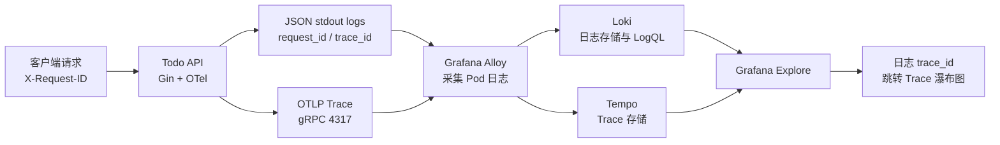
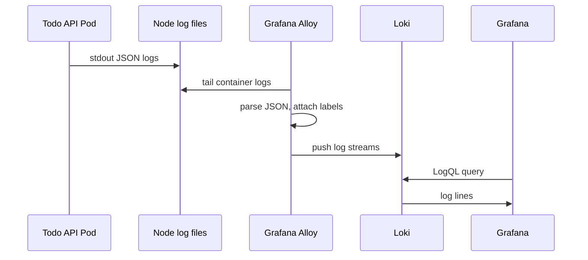
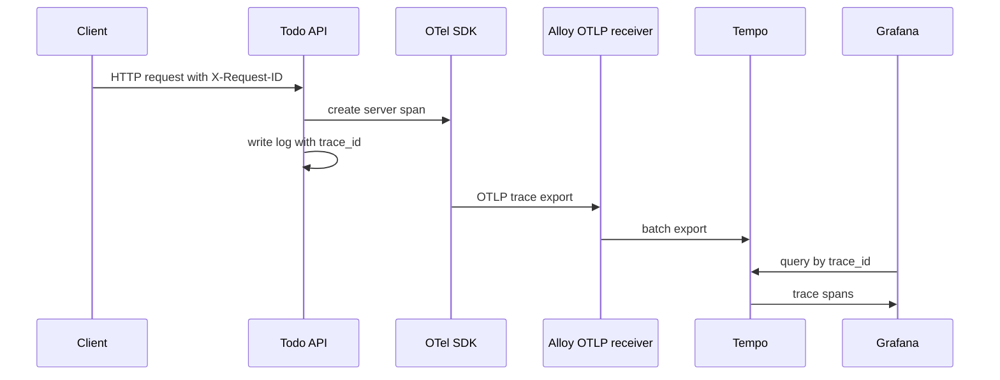
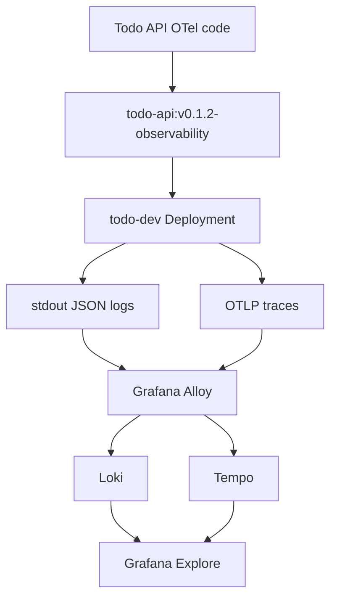

# 第 32 篇：日志与 OpenTelemetry 链路追踪

第 31 篇已经让 Todo Platform 具备指标监控能力：Grafana 能看到 QPS、错误率、P95/P99 延迟和资源使用，PrometheusRule 能在 P95 延迟超过阈值时告警。指标能告诉我们“系统什么时候变慢、影响范围多大”，但它通常不能直接回答“是哪一次请求慢、慢在哪一步、当时日志里发生了什么”。

本篇继续补齐可观测性闭环：使用 Loki 采集 Kubernetes 中 Todo API 的结构化日志，使用 OpenTelemetry 为 Go Gin 服务生成请求 Trace，使用 Tempo 保存 Trace，并在 Grafana 中通过 `request_id` 和 `trace_id` 从日志跳到 Trace 瀑布图。到这里，Todo Platform 的排障路径会从“看到指标异常”推进到“定位单次请求的完整执行路径”。

本篇特色项目是：**为 Todo Platform 接入 Loki 日志采集和 OpenTelemetry 请求链路追踪，部署 Grafana Alloy 与 Tempo，通过 `request_id` 在 Loki 日志和 Tempo Trace 之间跳转排查一次慢请求。**

## 1. 本章学习目标

### 1.1 知识目标

- 能解释结构化日志、日志采集、日志索引和日志保留策略之间的关系。
- 能描述 Loki、Grafana、Grafana Alloy、Tempo、OpenTelemetry SDK 和 OTLP 的职责边界。
- 能说明 Promtail 的历史定位，以及为什么 2026 年后生产环境应优先使用 Grafana Alloy。
- 能区分 Trace、Span、Trace ID、Span ID、Parent Span 和 Context Propagation。
- 能解释 W3C Trace Context、`traceparent`、`request_id` 与日志关联字段之间的关系。
- 能对比 Loki/Tempo 与 ELK/EFK 的适用场景和成本模型。

### 1.2 技能目标

- 能为 Todo API 接入 OpenTelemetry Go SDK 和 Gin 中间件。
- 能为关键业务操作增加一个手动 Span，让 Trace 瀑布图体现入口和业务处理耗时。
- 能让 Todo API 的结构化日志输出 `request_id`、`trace_id` 和 `span_id`。
- 能安装 Loki、Tempo 和 Grafana Alloy，并让 Alloy 同时采集 Pod 日志和接收 OTLP Trace。
- 能在 Grafana 中配置 Loki、Tempo 两个数据源和 derived field 跳转。
- 能使用 LogQL 按 `request_id` 查询一次请求日志。
- 能使用 Tempo 查看一次请求的 Span 树和耗时分布。
- 能排查日志为空、Trace 不出现、Grafana 跳转失败、字段基数过高等常见问题。

## 2. 本章工作场景与真实案例

### 2.1 技术痛点

监控系统报警之后，团队通常还会遇到几类真实问题：

- P95 延迟超过 500ms，但 Prometheus 只能告诉你“慢了”，不能告诉你是哪一次请求慢。
- Grafana 上错误率升高，但只看指标无法知道错误栈、请求参数、用户、路由和下游依赖状态。
- Pod 重启后本地容器日志消失，事故复盘时只能靠零散截图或 CI 日志猜测。
- 多个服务串联时，API、缓存、数据库、第三方服务各写各的日志，没有统一请求上下文。
- 开发、测试、SRE 使用不同查询入口，日志里叫 `request_id`，Trace 里叫 `trace_id`，沟通时很难对齐同一次请求。

日志和 Trace 不是指标的替代品，而是指标之后的下一层证据。指标负责发现异常，日志负责解释事件上下文，Trace 负责还原请求路径。三者串起来，才是一条完整的生产排障链路。

### 2.2 团队协作场景

真实团队中，可观测性通常这样分工：

- 后端工程师在代码中输出结构化 JSON 日志，接入 OpenTelemetry SDK，并确保每条请求日志包含 `request_id`、`trace_id`、路由、状态码和耗时。
- 平台工程师部署 Loki、Tempo、Grafana Alloy、Grafana 数据源和保留策略，并维护跨 namespace 的 RBAC 与 NetworkPolicy。
- SRE 设计日志查询模板、Trace 排障路径、采样策略、告警跳转链接和事故复盘模板。
- 安全工程师审查日志字段，避免 token、密码、手机号、身份证号、内部密钥等敏感信息进入 Loki。
- 测试工程师在压测和回归时保留典型 `request_id`，把 Grafana 日志和 Trace 链接贴进缺陷单。

事故发生时，排障动作应该像接力一样顺滑：告警指向 Grafana 指标面板，指标面板定位时间窗口，日志按 `request_id` 找到错误上下文，Trace 显示哪段 Span 耗时最高，最后由代码、配置或依赖负责人处理。

### 2.3 课程项目关联

本篇承接前面几篇产物：

```text linenums="0"
第 14 篇：Todo API 已输出 JSON 结构化日志和 request_id
第 30 篇：Argo CD 管理 todo-dev 环境
第 31 篇：Prometheus / Grafana 已提供指标、告警和 Grafana 入口
```

本篇新增的产物会放在 `observability/` 下：

```text linenums="0"
observability/
├── alloy/
│   └── alloy-values.yaml
├── grafana/
│   ├── todo-logs-dashboard-configmap.yaml
│   └── todo-observability-datasources.yaml
├── loki/
│   └── loki-values.yaml
├── otel/
│   └── todo-otel-env-patch.yaml
└── tempo/
    └── tempo-values.yaml
```

图 32-1 展示本篇的可观测链路：



本篇完成后，第 33 篇 Kubernetes 生产排障会复用这些能力：当 Pod `CrashLoopBackOff`、Service 502、OOMKilled 或 DNS 故障发生时，我们会同时查看事件、日志、指标和 Trace，而不是只靠单一命令猜原因。

## 3. 核心概念

### 3.1 结构化日志

结构化日志是机器可解析的日志。它通常使用 JSON 格式，每个字段都有稳定名字：

```json linenums="0"
{
  "time": "2026-05-29T10:15:31Z",
  "level": "INFO",
  "msg": "http request",
  "method": "POST",
  "path": "/api/v2/todos",
  "status": 201,
  "duration_ms": 18,
  "request_id": "todo-demo-1748504131",
  "trace_id": "3f9a2d6f0b7b4e7d9c8a6d1f2e3c4b5a",
  "span_id": "7a1b2c3d4e5f6789",
  "user": "admin"
}
```

对 Loki 来说，最重要的不是日志是不是 JSON，而是哪些字段进入 label，哪些字段留在日志正文。`namespace`、`pod`、`container`、`app`、`level` 适合作为 label；`request_id`、`trace_id`、`user` 通常不适合作为 label，因为它们基数太高，会显著增加索引和查询成本。如果把 `request_id` 做成 label，假设每秒 1000 个不同请求，几分钟内就会产生数十万条日志流，Loki 的内存和索引压力会迅速膨胀。

### 3.2 Loki、LogQL 与 Grafana

Loki 是 Grafana 生态中的日志系统。它的设计理念是“像 Prometheus 一样给日志打 label”，但不全文索引所有日志内容。查询语言叫 LogQL：

```logql linenums="0"
{namespace="todo-dev", app="todo-platform"} |= "http request"
```

解析 JSON 后按字段过滤：

```logql linenums="0"
{namespace="todo-dev", app="todo-platform"} | json | request_id="todo-demo-1748504131"
```

统计 5 分钟内错误日志数量：

```logql linenums="0"
sum by (level) (
  count_over_time({namespace="todo-dev", app="todo-platform"} | json | level="ERROR" [5m])
)
```

Grafana 负责查询 Loki、展示日志、从日志字段跳到 Tempo Trace。Loki 本身不负责采集 Pod 日志，本篇用 Grafana Alloy 负责采集。

### 3.3 Promtail、Alloy 与日志采集

Promtail 曾经是 Loki 最常见的日志采集代理。它运行在每个 Kubernetes 节点上，读取容器日志文件，添加 Kubernetes label，再发送到 Loki。

但截至 2026-05-29，Promtail 已经不适合作为新项目默认选择。Grafana 官方文档标注 Promtail 已在 2026-03-02 进入 EOL。本篇仍会讲清 Promtail 在架构中的历史角色，但实验使用 Grafana Alloy。Alloy 是 Grafana Agent 的继任者，能在同一个进程中处理日志、指标、Trace 和 OpenTelemetry Collector 流水线。

本篇 Alloy 做两件事：

- 使用 `loki.source.kubernetes` 采集 `todo-dev` 中 Todo API 的 Pod 日志并发送到 Loki。
- 使用 `otelcol.receiver.otlp` 接收 Todo API 上报的 Trace，并转发到 Tempo。

### 3.4 OpenTelemetry、Trace 与 Span

OpenTelemetry 是一套可观测性标准和 SDK。它不等于某个后端系统，而是定义应用如何生成 telemetry 数据、如何传播上下文、如何通过 OTLP 导出。

一次请求对应一个 Trace，Trace 里有多个 Span：

```text linenums="0"
Trace: 3f9a2d6f0b7b4e7d9c8a6d1f2e3c4b5a
└── Span: HTTP POST /api/v2/todos
    ├── Span: auth verify
    ├── Span: repository create
    └── Span: response encode
```

本篇先接入 HTTP server Span，并为创建 Todo 增加一个手动业务 Span。后续如果为 PostgreSQL、Redis、外部 HTTP client 接入 OTel instrumentation，就能看到更完整的下游调用耗时。

### 3.5 Context Propagation

上下文传播让多个服务知道“这是同一次请求”。W3C Trace Context 使用 `traceparent` Header：

```text linenums="0"
traceparent: 00-3f9a2d6f0b7b4e7d9c8a6d1f2e3c4b5a-7a1b2c3d4e5f6789-01
```

字段含义：

| 字段 | 含义 |
|---|---|
| `00` | Trace Context 版本 |
| `3f9a...` | Trace ID，标识整条请求链路 |
| `7a1...` | 当前 Span ID |
| `01` | trace flags，常见含义是 sampled |

`request_id` 是团队或网关常用的业务排障 ID，`trace_id` 是分布式追踪系统使用的链路 ID。生产环境里两者可以共存：客户端或网关传入 `X-Request-ID`，OpenTelemetry 负责传播 `traceparent`，日志同时记录两者。

### 3.6 Tempo 与 Jaeger

Jaeger 是经典的分布式追踪系统，适合学习 Trace UI 和采样概念。Tempo 是 Grafana 生态中的 Trace 后端，设计上不为所有 Span 建复杂索引，而是依赖 Trace ID 查询，并与 Loki、Prometheus、Grafana 深度集成。

本篇使用 Tempo，因为第 31 篇已经使用 Grafana 作为统一入口。你仍然应该理解 Jaeger：很多企业已有 Jaeger，OpenTelemetry 可以把 Trace 导出到 Jaeger、Tempo、Zipkin 或商业 APM。关键不是后端名字，而是应用必须用标准上下文和 OTLP 生成可迁移的数据。

## 4. 原理深入

### 4.1 日志采集链路如何运转

Kubernetes 容器日志默认写到节点文件。`kubectl logs` 读取的也是这些日志文件。Alloy 作为 DaemonSet 运行在每个节点，发现 Pod，读取容器日志，添加 label，发送到 Loki。



Loki 查询性能高度依赖 label 选择。`{namespace="todo-dev", app="todo-platform"}` 会先缩小日志流，再通过 `| json | request_id="..."` 在日志内容中筛选字段。不要把每个 `request_id` 都做成 label。

### 4.2 Trace 上报链路如何运转

应用内 OTel SDK 会为 HTTP 请求创建 Span，再通过 OTLP gRPC 发给 Alloy。Alloy 的 `otelcol` 流水线接收 Trace，经过 batch processor 后转发给 Tempo。



OTLP 是协议，Alloy 是接收和转发代理，Tempo 是存储后端。把这三者分开理解，排障时会清楚很多。

### 4.3 日志和 Trace 如何关联

本篇使用两步关联：

1. 日志中记录 `request_id`，便于从客户端、测试报告或用户反馈找到对应日志。
2. 同一条日志中记录 `trace_id`，Grafana Loki derived field 根据 `trace_id` 跳到 Tempo。

示例日志：

```json linenums="0"
{"msg":"http request","request_id":"todo-demo-1748504131","trace_id":"3f9a2d6f0b7b4e7d9c8a6d1f2e3c4b5a","span_id":"7a1b2c3d4e5f6789","status":200}
```

LogQL 查询：

```logql linenums="0"
{namespace="todo-dev", app="todo-platform"} | json | request_id="todo-demo-1748504131"
```

Grafana 从结果里识别 `trace_id`，点击跳转到 Tempo。这样排障人员不需要手动复制 Trace ID。

### 4.4 ELK / EFK 与 Loki / Tempo 的取舍

ELK / EFK 通常指 Elasticsearch、Logstash 或 Fluentd、Kibana。它适合复杂全文检索、字段分析和较强的日志分析场景，但资源成本和运维复杂度较高。

Loki / Tempo 更偏云原生和标签查询，适合与 Prometheus/Grafana 协同：

| 维度 | ELK / EFK | Loki / Tempo |
|---|---|---|
| 日志索引 | 通常索引大量字段 | 主要索引 label |
| 查询入口 | Kibana | Grafana |
| 成本模型 | 存储和索引成本高 | 更依赖 label 设计 |
| Trace 集成 | 需要额外系统 | Tempo 与 Grafana 原生集成 |
| 适用场景 | 审计、搜索、复杂分析 | SRE 排障、指标日志 Trace 联动 |

本课程选择 Loki/Tempo，是因为它们能自然承接第 31 篇的 Prometheus/Grafana 体系。

## 5. 手把手实验

### 5.1 实验目标

在第 31 篇 `monitoring` namespace 和 Grafana 基础上，为 Todo API 接入 OpenTelemetry Trace，将结构化日志采集到 Loki，将 Trace 保存到 Tempo，并在 Grafana 中通过 `request_id` 查询日志、通过 `trace_id` 跳转到 Trace。

预计耗时：100 分钟（动手操作约 75 分钟）。

### 5.2 实验环境

本篇命令默认在 **Cloud Native Todo Platform 应用仓库根目录** 执行，也就是包含 `api/`、`deployments/`、`observability/` 的仓库根目录。

版本信息在 2026-05-29 查询。Loki 上游最新为 `v3.7.2`，Tempo 上游最新为 `v3.0.0`；本实验锁定 Grafana Helm charts 中适合本地 kind 的 chart 版本，实际组件版本以 chart `appVersion` 为准。Tempo chart `1.24.4` 的 `appVersion` 是 `2.9.0`，这里按 chart 打包版本锁定实验稳定性，不直接追上游 `v3.0.0`。

| 工具 | 版本 | 用途 |
|---|---:|---|
| Go | 1.26.x | 编译 Todo API |
| Kubernetes | v1.35.0 | 第 30-31 篇 kind 集群 |
| Helm | v4.2.x | 安装 Loki、Tempo、Alloy |
| Grafana | 第 31 篇 kube-prometheus-stack 内置 | 统一查询入口 |
| Loki chart | 7.0.0，appVersion 3.6.7 | 日志存储 |
| Tempo chart | 1.24.4，appVersion 2.9.0 | Trace 存储 |
| Alloy chart | 1.8.2，appVersion v1.16.1 | 日志采集和 OTLP 转发 |
| OpenTelemetry Go | v1.44.0 | Go Trace SDK |
| otelgin | v0.69.0 | Gin 路由自动生成 server span |

说明：课程蓝图中的 Kubernetes 基线为 1.36.x，本篇继续使用第 30-31 篇的 kind v1.35.0 集群，是为了保持监控、日志和 Trace 实验环境连续。本篇不使用 Kubernetes 1.36 专属能力；如果你的集群已经升级到 1.36.x，下面命令仍然适用。

Promtail chart 当前仍能在 Grafana Helm index 中看到，但 Promtail 官方文档已标注 EOL。本篇不会使用 Promtail 部署新实验。

Todo API 仍沿用前面章节的默认运行方式：如果 `TODO_DATABASE_DSN` 为空，服务使用内存 Repository；如果你的环境已经接入 PostgreSQL，本篇的日志和 Trace 接入方式不变，只是 Trace 中会多出数据库调用排障价值。

先确认前置环境：

```bash linenums="0"
pwd
test -f go.mod
test -f api/cmd/todo-api/main.go
test -f api/internal/handler/gin/middleware.go
test -d observability/prometheus
kubectl get namespace monitoring
kubectl -n monitoring get deployment monitoring-grafana
kubectl get namespace todo-dev
kubectl -n todo-dev get deploy,svc,pod
```

检查本地工具：

```bash linenums="0"
go version
helm version
kubectl version --client
docker version --format '{{.Server.Version}}'
```

本篇会在同一个 kind 集群中继续增加 Loki、Tempo 和 Alloy。建议 Docker Desktop 为 kind 预留至少 8GB 内存；如果第 31 篇的 Prometheus/Grafana 已经占用较多资源，安装前先关闭不需要的本地应用。

Kubernetes 默认允许跨 namespace 出站流量，所以没有配置 deny-all egress NetworkPolicy 时，`todo-dev` 中的 Todo API 可以访问 `alloy.observability.svc.cluster.local:4317`。如果你的集群启用了 `todo-dev` 的默认拒绝出站策略，需要额外放通 Todo API 到 `observability` namespace 的 TCP `4317`/`4318`。

### 5.3 文件目录结构

创建目录：

```bash linenums="0"
mkdir -p api/internal/observability
mkdir -p observability/alloy observability/loki observability/tempo observability/otel observability/grafana
```

最终目录如下：

```text linenums="0"
cloud-native-todo-platform/
├── api/
│   ├── cmd/
│   │   └── todo-api/
│   │       └── main.go
│   └── internal/
│       ├── handler/
│       │   └── gin/
│       │       ├── handler.go
│       │       └── middleware.go
│       └── observability/
│           └── tracing.go
└── observability/
    ├── alloy/
    │   └── alloy-values.yaml
    ├── grafana/
    │   ├── todo-logs-dashboard-configmap.yaml
    │   └── todo-observability-datasources.yaml
    ├── loki/
    │   └── loki-values.yaml
    ├── otel/
    │   └── todo-otel-env-patch.yaml
    └── tempo/
        └── tempo-values.yaml
```

### 5.4 完整代码或配置

#### 5.4.1 增加 OpenTelemetry 依赖

```bash linenums="0"
go get go.opentelemetry.io/otel@v1.44.0
go get go.opentelemetry.io/otel/sdk@v1.44.0
go get go.opentelemetry.io/otel/exporters/otlp/otlptrace/otlptracegrpc@v1.44.0
go get go.opentelemetry.io/contrib/instrumentation/github.com/gin-gonic/gin/otelgin@v0.69.0
go mod tidy
```

`go.opentelemetry.io/otel` 提供 API，`go.opentelemetry.io/otel/sdk` 负责采样和导出，`otlptracegrpc` 通过 OTLP gRPC 发送 Trace，`otelgin` 为 Gin 路由自动创建 HTTP server span。

#### 5.4.2 创建 tracing 初始化代码

创建 `api/internal/observability/tracing.go`：

```bash linenums="0"
cat > api/internal/observability/tracing.go <<'GO'
package observability

import (
	"context"
	"errors"

	"go.opentelemetry.io/otel"
	"go.opentelemetry.io/otel/attribute"
	"go.opentelemetry.io/otel/exporters/otlp/otlptrace/otlptracegrpc"
	"go.opentelemetry.io/otel/propagation"
	"go.opentelemetry.io/otel/sdk/resource"
	sdktrace "go.opentelemetry.io/otel/sdk/trace"
)

type TracingConfig struct {
	ServiceName string
	Environment string
	Endpoint    string
}

func SetupTracing(ctx context.Context, cfg TracingConfig) (func(context.Context) error, error) {
	if cfg.ServiceName == "" {
		return nil, errors.New("service name is required")
	}
	if cfg.Endpoint == "" {
		return func(context.Context) error { return nil }, nil
	}

	exporter, err := otlptracegrpc.New(ctx,
		otlptracegrpc.WithEndpoint(cfg.Endpoint),
		otlptracegrpc.WithInsecure(),
	)
	if err != nil {
		return nil, err
	}

	res, err := resource.Merge(
		resource.Default(),
		resource.NewWithAttributes(
			"",
			attribute.String("service.name", cfg.ServiceName),
			attribute.String("deployment.environment", cfg.Environment),
		),
	)
	if err != nil {
		return nil, err
	}

	provider := sdktrace.NewTracerProvider(
		sdktrace.WithBatcher(exporter),
		sdktrace.WithResource(res),
		sdktrace.WithSampler(sdktrace.ParentBased(sdktrace.TraceIDRatioBased(1.0))),
	)

	otel.SetTracerProvider(provider)
	otel.SetTextMapPropagator(
		propagation.NewCompositeTextMapPropagator(
			propagation.TraceContext{},
			propagation.Baggage{},
		),
	)

	return provider.Shutdown, nil
}
GO
```

本地实验采样率设置为 100%，方便每次请求都能看到 Trace。生产环境应按流量和成本调整采样策略，例如 1%-10% 概率采样、错误请求全采样或基于尾采样策略保留慢请求。

#### 5.4.3 让日志包含 trace 字段

更新 `api/internal/handler/gin/middleware.go`，在 import 中增加 OTel trace 包：

```go linenums="0"
import (
	"context"
	"log/slog"
	"net/http"
	"strconv"
	"strings"
	"sync/atomic"
	"time"

	"cloud-native-todo-platform/api/internal/auth"

	"github.com/gin-gonic/gin"
	"go.opentelemetry.io/otel/trace"
)
```

在文件中增加一个小函数：

```go linenums="0"
func traceFields(ctx context.Context) []any {
	spanContext := trace.SpanContextFromContext(ctx)
	if !spanContext.IsValid() {
		return nil
	}
	return []any{
		"trace_id", spanContext.TraceID().String(),
		"span_id", spanContext.SpanID().String(),
	}
}
```

把 `AccessLog` 中的 `logger.Info("http request", ...)` 改成先组装字段：

```go linenums="0"
attrs := []any{
	"method", c.Request.Method,
	"path", c.Request.URL.Path,
	"status", c.Writer.Status(),
	"bytes", c.Writer.Size(),
	"duration_ms", time.Since(started).Milliseconds(),
	"request_id", c.Writer.Header().Get("X-Request-ID"),
	"user", username,
}
attrs = append(attrs, traceFields(c.Request.Context())...)
logger.Info("http request", attrs...)
```

把 `AuditLog` 中的审计日志也改成同样模式：

```go linenums="0"
attrs := []any{
	"user", username,
	"method", c.Request.Method,
	"path", c.Request.URL.Path,
	"status", c.Writer.Status(),
	"request_id", c.Writer.Header().Get("X-Request-ID"),
}
attrs = append(attrs, traceFields(c.Request.Context())...)
logger.Info("audit event", attrs...)
```

这样 Loki 中的日志仍然可以按 `request_id` 查询，同时 Grafana 可以从日志中提取 `trace_id` 跳转到 Tempo。

#### 5.4.4 为 Gin 注册 OTel 中间件

更新 `api/internal/handler/gin/handler.go`，在已有 import 中新增 `otelgin`：

```go linenums="0"
import (
	"log/slog"
	"net/http"
	"strconv"

	"cloud-native-todo-platform/api/internal/metrics"

	"github.com/gin-gonic/gin"
	"github.com/gin-gonic/gin/binding"
	"go.opentelemetry.io/contrib/instrumentation/github.com/gin-gonic/gin/otelgin"
)
```

这是在已有 import 块中新增 `go.opentelemetry.io/contrib/instrumentation/github.com/gin-gonic/gin/otelgin` 这一行，其余 import 保持不变。如果你的 `go.mod` 中 `module` 不是 `cloud-native-todo-platform`，需要把导入路径前缀改成你自己的 module 名。

把基础中间件注册改成：

```go linenums="0"
router.Use(
	RequestID(),
	otelgin.Middleware("todo-api"),
	AccessLog(logger),
	Recovery(logger),
	Timeout(defaultRequestTimeout),
	BodyLimit(maxBodyBytes),
	SecurityHeaders(),
	CORS(opts.AllowedOrigins),
)
```

`otelgin.Middleware("todo-api")` 应放在 `AccessLog` 之前。这样 `AccessLog` 在请求结束时读取到的 `context.Context` 中已经有当前 Span，日志才能带上 `trace_id` 和 `span_id`。

本篇先接入 HTTP server Span。为了让 Tempo 瀑布图至少能看到一层业务处理耗时，可以继续在 `createTodo` 这类关键写操作里增加一个手动 Span。先在 `api/internal/handler/gin/handler.go` 的 import 中额外增加：

```go linenums="0"
	"go.opentelemetry.io/otel"
	"go.opentelemetry.io/otel/attribute"
```

然后找到 `createTodo` 函数，在调用 service 之前创建业务 Span，并把新的 `ctx` 传给下游：

```go linenums="0"
ctx, span := otel.Tracer("todo-api").Start(c.Request.Context(), "todo.create")
span.SetAttributes(attribute.String("todo.operation", "create"))
defer span.End()

todo, err := h.service.Create(ctx, input.Title)
```

如果你的 `createTodo` 里原来是 `h.service.Create(c.Request.Context(), input.Title)`，只替换这一处调用即可，不要把请求标题、JWT 或用户隐私字段写入 Span attribute。这样 Tempo 中会看到 `POST /api/v2/todos` 下面挂着 `todo.create`，更容易理解“请求入口”和“业务处理”之间的耗时关系。

#### 5.4.5 在 main.go 中启用 Trace 导出

更新 `api/cmd/todo-api/main.go` import，新增 observability 包：

```go linenums="0"
import (
	"context"
	"errors"
	"fmt"
	"log/slog"
	"net/http"
	_ "net/http/pprof"
	"os"
	"os/signal"
	"strings"
	"syscall"
	"time"

	"cloud-native-todo-platform/api/internal/auth"
	"cloud-native-todo-platform/api/internal/cache"
	appconfig "cloud-native-todo-platform/api/internal/config"
	"cloud-native-todo-platform/api/internal/database"
	ginapi "cloud-native-todo-platform/api/internal/handler/gin"
	"cloud-native-todo-platform/api/internal/middleware"
	"cloud-native-todo-platform/api/internal/observability"
	"cloud-native-todo-platform/api/internal/ratelimit"
	"cloud-native-todo-platform/api/internal/repository"
	"cloud-native-todo-platform/api/internal/service"
	"cloud-native-todo-platform/api/internal/tasks"
)
```

在 `serve` 函数创建 `ctx` 后，初始化 tracing：

```go linenums="0"
	serviceName := strings.TrimSpace(os.Getenv("TODO_OTEL_SERVICE_NAME"))
	if serviceName == "" {
		serviceName = "todo-api"
	}
	tracingShutdown, err := observability.SetupTracing(ctx, observability.TracingConfig{
		ServiceName: serviceName,
		Environment: cfg.Env,
		Endpoint:    strings.TrimSpace(os.Getenv("TODO_OTEL_EXPORTER_OTLP_ENDPOINT")),
	})
	if err != nil {
		return fmt.Errorf("tracing setup failed: %w", err)
	}
	defer func() {
		shutdownCtx, cancel := context.WithTimeout(context.Background(), 5*time.Second)
		defer cancel()
		if err := tracingShutdown(shutdownCtx); err != nil {
			logger.Warn("tracing shutdown failed", "error", err)
		}
	}()
```

`TODO_OTEL_EXPORTER_OTLP_ENDPOINT` 为空时，`SetupTracing` 返回空 shutdown 函数，应用可以正常本地运行。部署到 Kubernetes 后，我们会把它设置为 Alloy 的 OTLP gRPC Service 地址。

#### 5.4.6 创建 Loki values

创建 `observability/loki/loki-values.yaml`：

```bash linenums="0"
cat > observability/loki/loki-values.yaml <<'YAML'
deploymentMode: SingleBinary

loki:
  auth_enabled: false
  commonConfig:
    replication_factor: 1
  storage:
    type: filesystem
  schemaConfig:
    configs:
      - from: "2026-01-01"
        store: tsdb
        object_store: filesystem
        schema: v13
        index:
          prefix: loki_index_
          period: 24h

singleBinary:
  replicas: 1
  persistence:
    enabled: false
  resources:
    requests:
      cpu: 100m
      memory: 256Mi
    limits:
      cpu: 500m
      memory: 768Mi

read:
  replicas: 0
write:
  replicas: 0
backend:
  replicas: 0

gateway:
  enabled: true
  deploymentStrategy:
    type: Recreate

chunksCache:
  enabled: false
resultsCache:
  enabled: false
YAML
```

这里的 `commonConfig` 和 `schemaConfig` 是 Loki Helm chart 的 values 键名；chart 渲染后会生成 Loki 运行时配置里的 `common` 和 `schema_config`。这份配置只服务本地 kind 实验：单副本、文件系统、无持久化、关闭缓存。`gateway` 在单节点 kind 上改成 `Recreate`，是为了避免默认滚动更新在资源紧张时同时拉起新旧 Pod 失败。生产环境应使用对象存储、持久化、明确保留周期、多副本和容量规划。

#### 5.4.7 创建 Tempo values

创建 `observability/tempo/tempo-values.yaml`：

```bash linenums="0"
cat > observability/tempo/tempo-values.yaml <<'YAML'
tempo:
  reportingEnabled: false
  retention: 6h
  receivers:
    otlp:
      protocols:
        grpc:
          endpoint: 0.0.0.0:4317
        http:
          endpoint: 0.0.0.0:4318
  resources:
    requests:
      cpu: 100m
      memory: 256Mi
    limits:
      cpu: 500m
      memory: 768Mi

service:
  type: ClusterIP
YAML
```

Tempo 单体 chart `1.24.4` 中，`reportingEnabled`、`retention` 和 `receivers` 都位于 `tempo` 键下。Tempo 默认更适合按 Trace ID 查询。本篇不做复杂 TraceQL 检索，只演示从 Loki 日志中的 `trace_id` 跳转到 Tempo 查看瀑布图。

#### 5.4.8 创建 Alloy values

这份 River 配置有两条数据流。日志流是 `discovery.kubernetes -> discovery.relabel -> loki.source.kubernetes -> loki.process -> loki.write`；Trace 流是 `otelcol.receiver.otlp -> otelcol.processor.batch -> otelcol.exporter.otlp`。`loki.source.kubernetes` 接收前面 discovery/relabel 生成的 `targets`，再通过 Kubernetes API tail Pod 日志。

创建 `observability/alloy/alloy-values.yaml`：

```bash linenums="0"
cat > observability/alloy/alloy-values.yaml <<'YAML'
controller:
  type: daemonset

service:
  enabled: true
  type: ClusterIP

alloy:
  extraPorts:
    - name: otlp-grpc
      port: 4317
      targetPort: 4317
      protocol: TCP
    - name: otlp-http
      port: 4318
      targetPort: 4318
      protocol: TCP
  configMap:
    create: true
    content: |-
      discovery.kubernetes "pods" {
        role = "pod"
      }

      discovery.relabel "todo_pod_logs" {
        targets = discovery.kubernetes.pods.targets

        rule {
          source_labels = ["__meta_kubernetes_namespace"]
          action        = "keep"
          regex         = "todo-dev"
        }

        rule {
          source_labels = ["__meta_kubernetes_pod_label_app_kubernetes_io_name"]
          action        = "keep"
          regex         = "todo-platform"
        }

        rule {
          source_labels = ["__meta_kubernetes_namespace"]
          target_label  = "namespace"
        }

        rule {
          source_labels = ["__meta_kubernetes_pod_name"]
          target_label  = "pod"
        }

        rule {
          source_labels = ["__meta_kubernetes_pod_container_name"]
          target_label  = "container"
        }

        rule {
          source_labels = ["__meta_kubernetes_pod_label_app_kubernetes_io_name"]
          target_label  = "app"
        }
      }

      loki.source.kubernetes "todo_pod_logs" {
        targets    = discovery.relabel.todo_pod_logs.output
        forward_to = [loki.process.todo_json.receiver]
      }

      loki.process "todo_json" {
        stage.json {
          expressions = {
            level      = "level",
            msg        = "msg",
            request_id = "request_id",
            trace_id   = "trace_id",
            span_id    = "span_id",
          }
        }

        stage.labels {
          values = {
            level = "level",
          }
        }

        forward_to = [loki.write.default.receiver]
      }

      loki.write "default" {
        endpoint {
          url = "http://loki-gateway.observability.svc.cluster.local/loki/api/v1/push"
        }
      }

      otelcol.receiver.otlp "default" {
        grpc {
          endpoint = "0.0.0.0:4317"
        }

        http {
          endpoint = "0.0.0.0:4318"
        }

        output {
          traces = [otelcol.processor.batch.default.input]
        }
      }

      otelcol.processor.batch "default" {
        output {
          traces = [otelcol.exporter.otlp.tempo.input]
        }
      }

      otelcol.exporter.otlp "tempo" {
        client {
          endpoint = "tempo.observability.svc.cluster.local:4317"
          tls {
            insecure = true
          }
        }
      }
YAML
```

Alloy 的日志流水线只把 `level` 提升为 Loki label，`request_id` 和 `trace_id` 仍留在日志内容里，查询时通过 `| json` 解析。这样能避免高基数字段扩大 Loki 索引。

#### 5.4.9 创建 Grafana 数据源

第 31 篇的 Grafana sidecar 已启用 datasource 自动发现。创建 `observability/grafana/todo-observability-datasources.yaml`：

```bash linenums="0"
cat > observability/grafana/todo-observability-datasources.yaml <<'YAML'
apiVersion: v1
kind: ConfigMap
metadata:
  name: todo-observability-datasources
  namespace: monitoring
  labels:
    grafana_datasource: "1"
    app.kubernetes.io/part-of: todo-platform
data:
  datasources.yaml: |-
    apiVersion: 1
    datasources:
      - name: Loki
        uid: loki
        type: loki
        access: proxy
        url: http://loki-gateway.observability.svc.cluster.local
        jsonData:
          derivedFields:
            - name: TraceID
              matcherRegex: '"trace_id":"([a-f0-9]{32})"'
              datasourceUid: tempo
              url: '$${__value.raw}'
      - name: Tempo
        uid: tempo
        type: tempo
        access: proxy
        url: http://tempo.observability.svc.cluster.local:3100
        jsonData:
          tracesToLogsV2:
            datasourceUid: loki
            spanStartTimeShift: "-5m"
            spanEndTimeShift: "5m"
            tags:
              - namespace
              - pod
              - app
          serviceMap:
            datasourceUid: prometheus
YAML
```

`$${__value.raw}` 是 Grafana provisioning 中常见写法，用于避免 `$` 被当成环境变量提前替换。`$$` 最终会转义成单个 `$`，也就是把 `${__value.raw}` 交给 Grafana derived field，让它把日志里匹配到的 Trace ID 传给 Tempo。

#### 5.4.10 创建日志 dashboard

创建 `observability/grafana/todo-logs-dashboard-configmap.yaml`：

```bash linenums="0"
cat > observability/grafana/todo-logs-dashboard-configmap.yaml <<'YAML'
apiVersion: v1
kind: ConfigMap
metadata:
  name: todo-logs-dashboard
  namespace: monitoring
  labels:
    grafana_dashboard: "1"
    app.kubernetes.io/part-of: todo-platform
data:
  todo-logs-dashboard.json: |-
    {
      "id": null,
      "uid": "todo-logs-traces",
      "title": "Todo Logs and Traces",
      "timezone": "browser",
      "schemaVersion": 41,
      "version": 1,
      "refresh": "15s",
      "tags": ["todo-platform", "loki", "tempo", "chapter-32"],
      "time": {
        "from": "now-30m",
        "to": "now"
      },
      "panels": [
        {
          "id": 1,
          "type": "timeseries",
          "title": "Log Lines by Level",
          "datasource": {"type": "loki", "uid": "loki"},
          "gridPos": {"h": 8, "w": 12, "x": 0, "y": 0},
          "targets": [
            {
              "expr": "sum by (level) (count_over_time({namespace=\"todo-dev\", app=\"todo-platform\"} | json [5m]))",
              "refId": "A"
            }
          ],
          "fieldConfig": {
            "defaults": {"unit": "short", "decimals": 0},
            "overrides": []
          }
        },
        {
          "id": 2,
          "type": "logs",
          "title": "Todo API Logs",
          "datasource": {"type": "loki", "uid": "loki"},
          "gridPos": {"h": 12, "w": 24, "x": 0, "y": 8},
          "targets": [
            {
              "expr": "{namespace=\"todo-dev\", app=\"todo-platform\"} | json",
              "refId": "A"
            }
          ],
          "options": {
            "showLabels": false,
            "showTime": true,
            "wrapLogMessage": true
          }
        }
      ]
    }
YAML
```

Dashboard 只是入口。真正的排障仍建议在 Grafana Explore 中按时间窗口、`request_id`、`trace_id` 和 Trace 跳转逐步定位。

#### 5.4.11 创建 GitOps 环境变量 patch

创建 `observability/otel/todo-otel-env-patch.yaml`，作为修改 dev overlay 时的参考片段：

```bash linenums="0"
cat > observability/otel/todo-otel-env-patch.yaml <<'YAML'
# Add these literals to deployments/gitops/envs/dev/kustomization.yaml
configMapGenerator:
  - name: todo-platform-env
    behavior: merge
    literals:
      - TODO_OTEL_SERVICE_NAME=todo-api
      - TODO_OTEL_EXPORTER_OTLP_ENDPOINT=alloy.observability.svc.cluster.local:4317
YAML
```

随后手工打开 `deployments/gitops/envs/dev/kustomization.yaml`，在已有 `configMapGenerator` 的 `literals` 中追加：

```yaml linenums="0"
      - TODO_OTEL_SERVICE_NAME=todo-api
      - TODO_OTEL_EXPORTER_OTLP_ENDPOINT=alloy.observability.svc.cluster.local:4317
```

不要新建第二个同名 `configMapGenerator` 放进 dev overlay；上面的 `todo-otel-env-patch.yaml` 只是给你保存变更意图，实际应合并进第 30-31 篇已经存在的 dev overlay。

### 5.5 执行命令

#### 5.5.1 本地验证 OpenTelemetry 代码

```bash linenums="0"
go test ./api/internal/observability ./api/internal/handler/gin ./api/cmd/todo-api
go build -o bin/todo-api ./api/cmd/todo-api
```

本地不设置 `TODO_OTEL_EXPORTER_OTLP_ENDPOINT` 时，应用不会导出 Trace，但应能正常启动：

```bash linenums="0"
HASH=$(./bin/todo-api hash-password "change-me-123")
TODO_JWT_SECRET=0123456789abcdef0123456789abcdef \
TODO_AUTH_USERS="admin=${HASH}" \
./bin/todo-api serve
```

另开终端请求健康检查：

```bash linenums="0"
curl -i -H "X-Request-ID: local-otel-check" http://127.0.0.1:18080/healthz
```

判断标准：服务日志仍是 JSON，包含 `request_id`。此时没有 `trace_id` 也可以接受，因为本地未设置 OTLP endpoint。

#### 5.5.2 安装 Loki、Tempo 和 Alloy

添加 Grafana Helm 仓库：

```bash linenums="0"
helm repo add grafana https://grafana.github.io/helm-charts
helm repo update grafana
```

先在本地渲染一次 Helm 模板，提前发现 values 键名、River 语法或 Service 名称变化：

```bash linenums="0"
helm template loki grafana/loki \
  --version 7.0.0 \
  --namespace observability \
  -f observability/loki/loki-values.yaml >/tmp/loki-rendered.yaml

helm template tempo grafana/tempo \
  --version 1.24.4 \
  --namespace observability \
  -f observability/tempo/tempo-values.yaml >/tmp/tempo-rendered.yaml

helm template alloy grafana/alloy \
  --version 1.8.2 \
  --namespace observability \
  -f observability/alloy/alloy-values.yaml >/tmp/alloy-rendered.yaml
```

安装 Loki：

```bash linenums="0"
helm upgrade --install loki grafana/loki \
  --version 7.0.0 \
  --namespace observability \
  --create-namespace \
  -f observability/loki/loki-values.yaml \
  --set loki.image.repository=registry.cn-guangzhou.aliyuncs.com/yleoer/loki \
  --wait \
  --timeout 10m
```

安装 Tempo：

```bash linenums="0"
helm upgrade --install tempo grafana/tempo \
  --version 1.24.4 \
  --namespace observability \
  -f observability/tempo/tempo-values.yaml \
  --set tempo.image.repository=registry.cn-guangzhou.aliyuncs.com/yleoer/tempo \
  --wait \
  --timeout 10m
```

安装 Alloy：

```bash linenums="0"
helm upgrade --install alloy grafana/alloy \
  --version 1.8.2 \
  --namespace observability \
  -f observability/alloy/alloy-values.yaml \
  --set alloy.image.repository=registry.cn-guangzhou.aliyuncs.com/yleoer/alloy \
  --wait \
  --timeout 10m
```

确认工作负载：

```bash linenums="0"
kubectl -n observability get pods
kubectl -n observability get svc
kubectl -n observability rollout status daemonset/alloy --timeout=300s
kubectl -n observability rollout status statefulset/loki --timeout=300s
kubectl -n observability rollout status deployment/tempo --timeout=300s
```

如果资源名称与 chart 实际渲染结果不同，先用 `kubectl -n observability get deploy,sts,ds` 查看实际名称，再重新执行 rollout 检查。

确认 Loki gateway Service 名称，后续 Alloy 和 Grafana 数据源会使用这个地址：

```bash linenums="0"
kubectl -n observability get svc loki-gateway
kubectl -n observability get svc -l app.kubernetes.io/instance=loki
```

如果没有 `loki-gateway`，以第二条命令看到的实际 gateway Service 为准，替换 Alloy `loki.write` 和 Grafana Loki datasource 中的 URL。

#### 5.5.3 应用 Grafana 数据源和 Dashboard

```bash linenums="0"
kubectl apply --server-side --dry-run=server -f observability/grafana/todo-observability-datasources.yaml
kubectl apply --server-side --dry-run=server -f observability/grafana/todo-logs-dashboard-configmap.yaml
kubectl apply -f observability/grafana/todo-observability-datasources.yaml
kubectl apply -f observability/grafana/todo-logs-dashboard-configmap.yaml
```

等待 Grafana sidecar 重新加载：

```bash linenums="0"
kubectl -n monitoring logs deployment/monitoring-grafana -c grafana-sc-datasources --tail=50
kubectl -n monitoring logs deployment/monitoring-grafana -c grafana-sc-dashboard --tail=50
```

同时确认第 31 篇安装的 Grafana 镜像版本。如果 dashboard import 提示 `schemaVersion` 不兼容，可以在当前 Grafana UI 中重新导出 dashboard，再把导出的 `schemaVersion` 回写到 ConfigMap。

```bash linenums="0"
kubectl -n monitoring get deployment monitoring-grafana -o jsonpath='{.spec.template.spec.containers[0].image}{"\n"}'
```

#### 5.5.4 构建镜像并同步 dev 环境

构建新镜像并加载到 kind：

```bash linenums="0"
docker build -t todo-api:v0.1.2-observability -f api/Dockerfile .
kind load docker-image todo-api:v0.1.2-observability --name todo-gitops
```

更新 `deployments/gitops/envs/dev/kustomization.yaml`：

```yaml linenums="0"
images:
  - name: todo-api
    newName: todo-api
    newTag: v0.1.2-observability
```

同时确认 `configMapGenerator` 的 `literals` 中包含：

```yaml linenums="0"
      - TODO_OTEL_SERVICE_NAME=todo-api
      - TODO_OTEL_EXPORTER_OTLP_ENDPOINT=alloy.observability.svc.cluster.local:4317
```

提交并推送变更，让 Argo CD 同步：

```bash linenums="0"
git add go.mod go.sum api/cmd/todo-api/main.go api/internal/handler/gin api/internal/observability observability/ deployments/gitops/envs/dev/kustomization.yaml
git commit -m "接入 Todo API 日志与 OpenTelemetry 链路追踪"
CURRENT_BRANCH=$(git branch --show-current)
git push -u origin "${CURRENT_BRANCH}"
argocd app sync todo-platform-dev --timeout 300
argocd app wait todo-platform-dev --sync --health --timeout 300
kubectl -n todo-dev rollout status deployment/todo-platform --timeout=180s
```

如果第 30 篇 Application 跟踪的是 `main`，仍然不要直接推送 `main`。按团队流程合并 PR，或仅在本地学习环境临时修改 `targetRevision`。

#### 5.5.5 生成带 request_id 的请求

打开 Todo API port-forward：

```bash linenums="0"
kubectl -n todo-dev port-forward service/todo-platform 18080:http
```

另开终端生成请求：

```bash linenums="0"
REQ_ID="todo-otel-$(date +%s)"
curl -s -H "X-Request-ID: ${REQ_ID}" http://127.0.0.1:18080/healthz
echo "${REQ_ID}"
```

生成一次带认证的业务请求：

```bash linenums="0"
TOKEN=$(curl -s \
  -H 'Content-Type: application/json' \
  -d '{"username":"admin","password":"change-me-123"}' \
  http://127.0.0.1:18080/api/v2/auth/login | sed -n 's/.*"token":"\([^"]*\)".*/\1/p')

REQ_ID="todo-create-$(date +%s)"
curl -s \
  -H "Authorization: Bearer ${TOKEN}" \
  -H "Content-Type: application/json" \
  -H "X-Request-ID: ${REQ_ID}" \
  -d '{"title":"trace one todo request"}' \
  http://127.0.0.1:18080/api/v2/todos

echo "${REQ_ID}"
```

#### 5.5.6 查询 Loki 日志

打开 Loki 端口：

```bash linenums="0"
kubectl -n observability port-forward service/loki-gateway 3100:80
```

查询最近 15 分钟日志。这里使用 `/query_range`，因为我们要查一段时间内产生的日志行，而不是只查某一个瞬时时刻：

```bash linenums="0"
curl -G 'http://127.0.0.1:3100/loki/api/v1/query_range' \
  --data-urlencode 'query={namespace="todo-dev", app="todo-platform"} | json | line_format "{{.request_id}} {{.trace_id}} {{.msg}}"' \
  --data-urlencode 'limit=5' \
  --data-urlencode 'direction=backward' \
  --data-urlencode 'since=15m'
```

按 request_id 查询：

```bash linenums="0"
curl -G 'http://127.0.0.1:3100/loki/api/v1/query_range' \
  --data-urlencode "query={namespace=\"todo-dev\", app=\"todo-platform\"} | json | request_id=\"${REQ_ID}\"" \
  --data-urlencode 'limit=5' \
  --data-urlencode 'direction=backward' \
  --data-urlencode 'since=15m'
```

如果你安装了 `jq`，可以从日志正文提取 Trace ID：

```bash linenums="0"
TRACE_ID=$(curl -sG 'http://127.0.0.1:3100/loki/api/v1/query_range' \
  --data-urlencode "query={namespace=\"todo-dev\", app=\"todo-platform\"} | json | request_id=\"${REQ_ID}\"" \
  --data-urlencode 'limit=1' \
  --data-urlencode 'direction=backward' \
  --data-urlencode 'since=15m' \
  | jq -r '.data.result[0].values[0][1] // "{}" | fromjson? | .trace_id // empty')
echo "${TRACE_ID}"
```

注意，`trace_id` 没有被提升成 Loki label，所以不能从 `.data.result[0].stream.trace_id` 读取。`stream` 里只会有 `namespace`、`app`、`pod`、`container`、`level` 这类低基数字段；`request_id` 和 `trace_id` 应留在 JSON 日志正文中，通过 `| json` 或上面的 `fromjson` 解析。`fromjson?` 表示把日志行字符串解析为 JSON；后面的 `?` 让解析失败时返回空值，而不是让整个 `jq` 命令直接报错。

实际排障中更推荐在 Grafana Explore 里查询：

```logql linenums="0"
{namespace="todo-dev", app="todo-platform"} | json | request_id="todo-create-..."
```

#### 5.5.7 查询 Tempo Trace

打开 Tempo 端口：

<<<<<<< HEAD
```bash linenums="0"
kubectl -n observability port-forward service/tempo 3200:3100
=======
```bash
kubectl -n observability port-forward service/tempo 3200:3200
>>>>>>> origin/main
```

如果已经拿到 Trace ID：

```bash linenums="0"
test -n "${TRACE_ID}"
curl -s "http://127.0.0.1:3200/api/traces/${TRACE_ID}" \
  | jq -r '.batches[].scopeSpans[].spans[].name'
```

在 Grafana 中也可以打开 `Explore -> Tempo`，粘贴 Trace ID 查看瀑布图。

#### 5.5.8 在 Grafana 中完成跳转

打开 Grafana：

```bash linenums="0"
kubectl -n monitoring port-forward service/monitoring-grafana 3000:80
```

访问：

```text linenums="0"
http://127.0.0.1:3000
```

在 `Explore -> Loki` 中执行：

```logql linenums="0"
{namespace="todo-dev", app="todo-platform"} | json | request_id="todo-create-..."
```

展开日志行，确认能看到 `trace_id`。如果 derived field 生效，Grafana 会把 Trace ID 渲染成可点击链接，点击后跳到 Tempo Trace 视图。

### 5.6 预期输出

Go 测试输出类似：

```text linenums="0"
ok  	cloud-native-todo-platform/api/internal/observability	0.10s
ok  	cloud-native-todo-platform/api/internal/handler/gin	0.32s
ok  	cloud-native-todo-platform/api/cmd/todo-api	0.18s
```

observability namespace 中应看到：

```text linenums="0"
NAME                         READY   STATUS    RESTARTS   AGE
pod/alloy-xxxxx              2/2     Running   0          2m
pod/loki-0                   2/2     Running   0          3m
pod/tempo-xxxxxxxxxx-xxxxx   1/1     Running   0          2m
```

Todo API 日志中应出现：

```json linenums="0"
{"level":"INFO","msg":"http request","method":"POST","path":"/api/v2/todos","status":201,"request_id":"todo-create-1748504131","trace_id":"3f9a2d6f0b7b4e7d9c8a6d1f2e3c4b5a","span_id":"7a1b2c3d4e5f6789"}
```

Loki 查询应返回日志结果：

```json linenums="0"
{
  "status": "success",
  "data": {
    "resultType": "streams",
    "result": [
      {
        "stream": {
          "namespace": "todo-dev",
          "app": "todo-platform",
          "level": "INFO"
        },
        "values": [
          ["...", "{\"level\":\"INFO\",\"msg\":\"http request\",...}"]
        ]
      }
    ]
  }
}
```

Tempo 查询应返回 Span 名称，例如：

```text linenums="0"
GET /healthz
POST /api/v2/todos
todo.create
```

Grafana 中应能看到：

```text linenums="0"
Explore -> Loki: 查询 request_id 能看到日志
日志详情: 包含 trace_id
点击 TraceID: 跳转到 Tempo Trace 瀑布图
Dashboard: Todo Logs and Traces 有日志量和日志列表
```

### 5.7 验证方法

**第一层：应用日志含关联字段**

```bash linenums="0"
kubectl -n todo-dev logs deployment/todo-platform --tail=50 | grep -E 'request_id|trace_id'
```

判断标准：请求日志包含 `request_id`，启用 OTLP endpoint 后包含 `trace_id` 和 `span_id`。

**第二层：Alloy 配置加载成功**

```bash linenums="0"
kubectl -n observability logs daemonset/alloy --tail=80
kubectl -n observability get svc alloy -o jsonpath='{.spec.ports[*].name}{"\n"}'
```

判断标准：Alloy 日志没有 River 配置解析错误，Service 端口包含 `otlp-grpc`。

**第三层：Loki 有日志**

```bash linenums="0"
kubectl -n observability port-forward service/loki-gateway 3100:80
curl -G 'http://127.0.0.1:3100/loki/api/v1/query_range' \
  --data-urlencode 'query={namespace="todo-dev", app="todo-platform"}' \
  --data-urlencode 'limit=5' \
  --data-urlencode 'direction=backward' \
  --data-urlencode 'since=15m'
```

判断标准：返回结果中存在 Todo API 日志流。

**第四层：Tempo 有 Trace**

<<<<<<< HEAD
```bash linenums="0"
kubectl -n observability port-forward service/tempo 3200:3100
=======
```bash
kubectl -n observability port-forward service/tempo 3200:3200
>>>>>>> origin/main
curl -s "http://127.0.0.1:3200/api/traces/${TRACE_ID}" | head
```

判断标准：能按 Trace ID 查询到 Span 数据。

**第五层：Grafana 数据源存在**

```bash linenums="0"
kubectl -n monitoring get configmap todo-observability-datasources -o jsonpath='{.metadata.labels.grafana_datasource}{"\n"}'
kubectl -n monitoring logs deployment/monitoring-grafana -c grafana-sc-datasources --tail=80
```

判断标准：ConfigMap label 为 `1`，sidecar 日志没有 provisioning 错误。

**第六层：Grafana Dashboard 导入**

```bash linenums="0"
kubectl -n monitoring get configmap todo-logs-dashboard -o jsonpath='{.metadata.labels.grafana_dashboard}{"\n"}'
kubectl -n monitoring logs deployment/monitoring-grafana -c grafana-sc-dashboard --tail=80
```

判断标准：Grafana 中出现 `Todo Logs and Traces` dashboard。

**第七层：request_id 到 Trace 跳转**

在 Grafana Explore 中执行：

```logql linenums="0"
{namespace="todo-dev", app="todo-platform"} | json | request_id="todo-create-..."
```

判断标准：日志详情中有 `trace_id`，TraceID 链接能跳转到 Tempo，并显示 HTTP server Span；创建 Todo 的请求还能看到 `todo.create` 业务 Span。

### 5.8 清理步骤

只删除本篇 Grafana 配置：

```bash linenums="0"
kubectl delete -f observability/grafana/todo-logs-dashboard-configmap.yaml --ignore-not-found
kubectl delete -f observability/grafana/todo-observability-datasources.yaml --ignore-not-found
```

卸载 Alloy、Tempo、Loki：

```bash linenums="0"
helm uninstall alloy -n observability
helm uninstall tempo -n observability
helm uninstall loki -n observability
kubectl delete namespace observability --ignore-not-found
```

如果准备继续第 33 篇，不建议清理本篇产物。第 33 篇会直接使用日志、指标和 Trace 组合排查故障。

如需撤销 Todo API 代码改动，使用 Git revert：

```bash linenums="0"
git log --oneline --max-count=5
git revert <本篇提交 SHA>
git push
argocd app sync todo-platform-dev --timeout 300
```

## 6. 常见错误与排障

### 错误 1：Loki 查询不到 Todo API 日志

- **现象**：

  ```json linenums="0"
  {"status":"success","data":{"resultType":"streams","result":[]}}
  ```

- **原因**：Alloy 没有发现 `todo-dev` Pod；River 配置语法错误导致 Alloy Pod `CrashLoopBackOff`；relabel 规则没有匹配 label；Loki gateway 地址错误；Todo API 没有产生日志。
- **排查**：

  ```bash linenums="0"
  kubectl -n observability logs daemonset/alloy --tail=100
  kubectl -n observability logs daemonset/alloy --tail=100 | grep -i -E 'error|river|parse'
  kubectl -n observability get pod -l app.kubernetes.io/name=alloy
  kubectl -n todo-dev get pod -l app.kubernetes.io/name=todo-platform --show-labels
  kubectl -n observability get svc loki-gateway
  kubectl -n todo-dev logs deployment/todo-platform --tail=20
  ```

  如果 `kubectl logs` 能看到日志，但 Loki 没有，问题多半在 Alloy 发现、relabel 或写入 Loki 的配置。

- **修复**：确认 `app.kubernetes.io/name=todo-platform` label 存在；确认 Alloy `loki.write` 地址为 `http://loki-gateway.observability.svc.cluster.local/loki/api/v1/push`；如果 Alloy 日志提示 River 解析失败，先修正 `observability/alloy/alloy-values.yaml` 后重新 `helm upgrade`；重启 Alloy。
- **预防**：采集配置上线前，用一个明确 namespace 和 label 做最小范围测试。

### 错误 2：日志中没有 `trace_id`

- **现象**：

  ```json linenums="0"
  {"msg":"http request","request_id":"todo-otel-123","status":200}
  ```

- **原因**：`otelgin.Middleware` 没有注册；中间件顺序不对；`AccessLog` 没有从 `context.Context` 读取 SpanContext；应用仍运行旧镜像。
- **排查**：

  ```bash linenums="0"
  grep -n 'otelgin.Middleware' api/internal/handler/gin/handler.go
  grep -n 'traceFields' api/internal/handler/gin/middleware.go
  kubectl -n todo-dev get deployment todo-platform -o jsonpath='{.spec.template.spec.containers[0].image}{"\n"}'
  kubectl -n todo-dev logs deployment/todo-platform --tail=30
  ```

- **修复**：把 `otelgin.Middleware("todo-api")` 放在 `AccessLog(logger)` 之前；重新构建镜像、加载 kind 并同步 Argo CD。
- **预防**：为日志字段增加测试或冒烟检查，确保每个发布版本都能输出 `request_id` 和 `trace_id`。

### 错误 3：`TRACE_ID` 为空或 Tempo 查不到 Trace

- **现象**：

  ```text linenums="0"
  echo "${TRACE_ID}"

  trace not found
  ```

- **原因**：从 Loki `stream` label 中读取 `trace_id`，但 `trace_id` 实际留在 JSON 日志正文；`TODO_OTEL_EXPORTER_OTLP_ENDPOINT` 没有注入；Alloy Service 没有暴露 `4317`；Alloy OTLP receiver 或 Tempo exporter 配置错误；Tempo 未 Ready。
- **排查**：

  ```bash linenums="0"
  curl -sG 'http://127.0.0.1:3100/loki/api/v1/query_range' \
    --data-urlencode "query={namespace=\"todo-dev\", app=\"todo-platform\"} | json | request_id=\"${REQ_ID}\"" \
    --data-urlencode 'limit=1' \
    --data-urlencode 'since=15m' \
    | jq -r '.data.result[0].values[0][1] // "{}" | fromjson?'

  kubectl -n todo-dev get deployment todo-platform -o jsonpath='{.spec.template.spec.containers[0].envFrom}{"\n"}'
  kubectl -n todo-dev exec deployment/todo-platform -- printenv | grep TODO_OTEL
  kubectl -n observability get svc alloy -o yaml
  kubectl -n observability logs daemonset/alloy --tail=100 | grep -i otlp
  kubectl -n observability logs deployment/tempo --tail=100
  ```

- **修复**：先确认日志正文中真的有 `trace_id`，再用 `fromjson` 从日志正文提取；确认 dev overlay 中包含 `TODO_OTEL_EXPORTER_OTLP_ENDPOINT=alloy.observability.svc.cluster.local:4317`；确认 Alloy `extraPorts` 暴露 `otlp-grpc`；确认 Tempo Service 可用。
- **预防**：每次改 OTel endpoint 后，先用 `kubectl exec printenv` 确认环境变量实际进入 Pod。

### 错误 4：Grafana 中 TraceID 不能点击

- **现象**：Loki 日志里明明有 `trace_id`，但 Grafana Explore 不显示跳转链接。
- **原因**：Loki datasource 的 derived field 没有被加载；正则没有匹配 JSON 日志；`datasourceUid` 不是 `tempo`；Grafana sidecar 没有识别 datasource ConfigMap。
- **排查**：

  ```bash linenums="0"
  kubectl -n monitoring get configmap todo-observability-datasources -o yaml
  kubectl -n monitoring logs deployment/monitoring-grafana -c grafana-sc-datasources --tail=80
  ```

  检查 `matcherRegex` 是否为 `"trace_id":"([a-f0-9]{32})"`，并确认 Tempo 数据源 uid 是 `tempo`。

- **修复**：重新 apply datasource ConfigMap，等待 sidecar 加载；必要时重启 `monitoring-grafana`。
- **预防**：Grafana datasource、dashboard 都使用 ConfigMap 纳入 Git，避免手工点击配置丢失。

### 错误 5：把 `request_id` 或 `trace_id` 做成 Loki label

- **现象**：Loki 内存升高、查询变慢，或者 Alloy 日志出现大量 stream 创建。
- **原因**：每个请求的 `request_id` 和 `trace_id` 都不同，作为 label 会生成海量日志流。
- **排查**：

  ```bash linenums="0"
  grep -n 'stage.labels' observability/alloy/alloy-values.yaml -A10
  ```

  如果看到 `request_id` 或 `trace_id` 被放入 `stage.labels`，说明配置有高基数风险。

- **修复**：只把 `level`、`namespace`、`pod`、`container`、`app` 等低基数字段作为 label；`request_id` 和 `trace_id` 留在 JSON 日志正文，用 `| json` 解析过滤。
- **预防**：评审日志采集配置时，把 label 基数作为必查项。

## 7. 生产环境注意事项

1. **日志字段必须标准化**。生产系统应定义统一日志字段：`time`、`level`、`msg`、`service`、`env`、`request_id`、`trace_id`、`span_id`、`user`、`method`、`path`、`status`、`duration_ms`。字段名一旦进入查询、告警和 runbook，就不要随意改名；新增字段要说明用途和敏感性。

2. **敏感信息不能进入日志**。认证 Header、JWT、密码、手机号、身份证号、邮箱、内部密钥、数据库连接串都不应原样写入日志。即使 Loki 有权限控制，日志系统也常被多人访问，并且保留时间较长。生产环境要在应用层和采集层都做脱敏策略。

3. **Trace 采样要服务于排障目标**。本地实验使用 100% 采样，生产高流量服务不能照搬。头部采样成本低但可能漏掉慢请求，尾部采样能按错误和延迟保留更有价值的 Trace，但需要 Collector 层支持和更多内存。Tempo 擅长按 Trace ID 精确查看瀑布图，不适合直接做“列出所有错误 Span”这类全量扫描；生产排障通常先由 Prometheus 告警或 Loki 日志缩小范围，再跳到 Tempo 看单次请求链路。

4. **Loki label 要低基数**。Loki 不是 Elasticsearch，它的成本模型依赖 label 设计。`namespace`、`app`、`pod`、`container`、`level` 通常合理；`request_id`、`trace_id`、`user_id`、订单号通常不合理。高基数字段留在日志正文，通过 LogQL pipeline 解析。

5. **可观测系统也要高可用和限流**。Loki、Tempo、Alloy、Grafana 在生产中需要 requests/limits、持久化、对象存储、租户隔离、保留策略、限流、备份和访问控制。Loki 要明确 retention，例如按合规和成本设置 7-30 天，并根据 namespace、租户或业务等级差异化。如果生产集群采用默认拒绝出站流量，还要允许业务 namespace 访问 Alloy 或 OpenTelemetry Collector 的 OTLP gRPC/HTTP 端口。应用侧 OTLP exporter 要有批处理、超时和优雅关闭；Pod 终止时如果没有调用 `Shutdown`，最后几秒的 Trace 可能丢失。

## 8. 本章小项目

### 8.1 项目产出

完成本篇后，Todo Platform 新增以下能力：

- `api/internal/observability/tracing.go`：OpenTelemetry Trace 初始化。
- 更新后的 `api/internal/handler/gin/middleware.go`：日志包含 `trace_id` 和 `span_id`。
- 更新后的 `api/internal/handler/gin/handler.go`：Gin 自动生成 HTTP server span，并为创建 Todo 增加 `todo.create` 业务 Span。
- 更新后的 `api/cmd/todo-api/main.go`：通过 `TODO_OTEL_EXPORTER_OTLP_ENDPOINT` 启用 Trace 导出。
- `observability/loki/loki-values.yaml`：本地 Loki 安装配置。
- `observability/tempo/tempo-values.yaml`：本地 Tempo 安装配置。
- `observability/alloy/alloy-values.yaml`：日志采集和 OTLP Trace 转发配置。
- `observability/grafana/todo-observability-datasources.yaml`：Grafana Loki/Tempo 数据源和 derived field。
- `observability/grafana/todo-logs-dashboard-configmap.yaml`：日志 dashboard。
- `observability/otel/todo-otel-env-patch.yaml`：GitOps overlay 中 OTel 环境变量参考。

图 32-2 是本章小项目交付关系：



### 8.2 能力验收标准

| 能力 | 验收标准 |
|---|---|
| 结构化日志 | Todo API 日志包含 `request_id`、`trace_id`、`span_id` |
| 日志采集 | Loki 能查询 `{namespace="todo-dev", app="todo-platform"}` |
| LogQL 查询 | 能用 `| json | request_id="..."` 找到单次请求 |
| Trace 采集 | Tempo 能按 Trace ID 返回 HTTP server Span 和 `todo.create` 业务 Span |
| Grafana 数据源 | Loki 和 Tempo 数据源可用 |
| 关联跳转 | Loki 日志中的 TraceID 能跳转到 Tempo |
| 排障能力 | 能定位日志为空、Trace 缺失、derived field 失效、高基数 label |
| 生产意识 | 能说明日志脱敏、采样、保留、成本和访问控制风险 |

## 9. 练习题与面试题

本章练习题和面试题已拆分到独立页面，完成正文学习后再进入题库练习与复盘。

[查看本章练习题与面试题](../../questions/stage-05-production-engineering/32-logging-opentelemetry.md)

## 10. 本章总结

本篇把 Todo Platform 的可观测性从指标扩展到日志和 Trace。知识上，你理解了结构化日志、Loki、LogQL、Promtail 与 Alloy 的演进关系、OpenTelemetry Trace/Span/Context Propagation、Tempo 与 Jaeger 的定位，以及 ELK/EFK 与 Loki/Tempo 的取舍。

项目成果上，你让 Todo API 能输出带 `request_id`、`trace_id`、`span_id` 的结构化日志；你用 Alloy 采集 Pod 日志并接收 OTLP Trace；你部署了 Loki 和 Tempo；你配置了 Grafana Loki/Tempo 数据源、日志 dashboard 和从日志跳 Trace 的 derived field。

能力价值上，这一章让你具备了中高级云原生排障的关键能力：当指标报警出现时，你不再只看 Pod 状态或猜测代码问题，而是能通过日志和 Trace 还原一次请求的上下文、路径和耗时分布。

## 11. 下一章衔接

第 31 篇提供指标，第 32 篇提供日志和 Trace。下一篇第 33 篇会把这些工具放到真实故障场景中：Pod `Pending`、`CrashLoopBackOff`、`ImagePullBackOff`、OOMKilled、Service 不通、DNS 异常、PVC 挂载失败。

到那时，我们会按生产排障顺序组合使用 `kubectl describe`、事件、日志、Prometheus 指标、Loki 查询和 Tempo Trace，把“工具会用”推进到“故障能定位、能修复、能复盘”。
