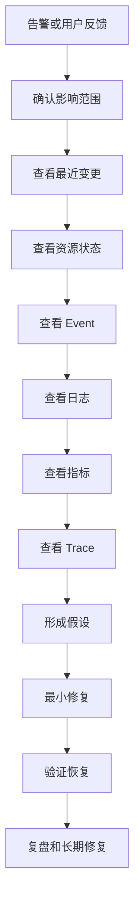
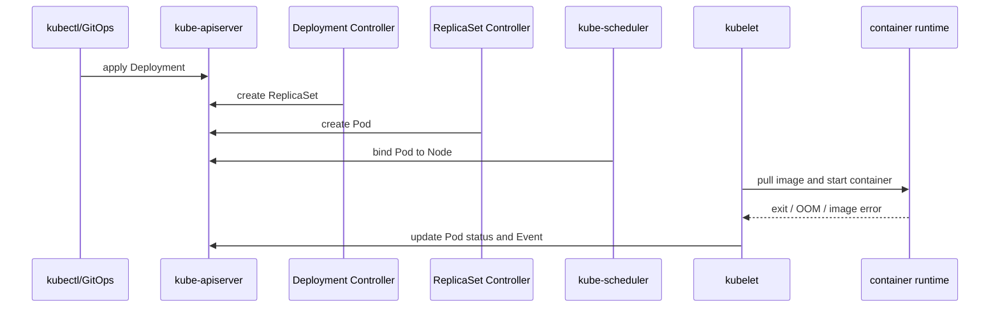
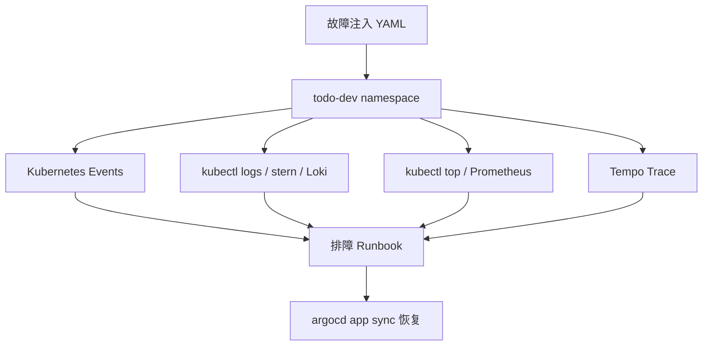

# 第 33 篇：Kubernetes 生产排障

## 1. 本章学习目标

**知识目标**

- 能解释生产排障中“症状、范围、最近变更、证据、修复、复盘”的闭环流程。
- 能区分 Pod Phase、Container State、Pod Condition、Event 和日志各自表达的信息。
- 能说明 `Pending`、`CrashLoopBackOff`、`ImagePullBackOff`、`OOMKilled` 和 CPU Throttling 的典型原因。
- 能说明 Service endpoints 为空、DNS 解析失败和 PVC 绑定失败的典型原因。
- 能对比 `kubectl describe`、`kubectl logs`、`kubectl top`、Prometheus、Loki、Tempo、k9s、stern、`kubectl debug` 在排障链路中的定位。
- 能说明 GitOps 环境中直接修改集群对象为什么会产生 drift，以及如何用 Argo CD 恢复期望状态。

**技能目标**

- 能独立按标准顺序定位 Todo Platform 的 Pod 启动失败、镜像拉取失败、CrashLoop、OOMKilled 和资源瓶颈。
- 能通过 Service、EndpointSlice、CoreDNS、NetworkPolicy 和临时调试 Pod 定位服务不通与 DNS 问题。
- 能通过 PVC、StorageClass、PV、Pod 事件定位存储挂载失败。
- 能使用 `k9s` 快速观察资源状态，使用 `stern` 聚合多 Pod 日志，使用 `kubectl debug` 给 distroless 容器注入临时调试能力。
- 能完成一次故障注入、修复验证和复盘记录，形成可交给团队使用的 Kubernetes runbook。

## 2. 本章工作场景与真实案例

### 2.1 技术痛点

真实生产故障很少只给你一个清晰错误。用户只会说“接口慢了”“登录失败”“页面 502”“刚发布后不稳定”。如果排障时只靠猜测，常见结果是反复重启 Pod、盲目回滚、把网络问题误判成代码问题，或者把应用错误误判成 Kubernetes 故障。

Kubernetes 排障要解决的是证据链问题：先确认影响范围，再找最近变更，再用事件、日志、指标和 Trace 逐步缩小位置。第 31 篇提供了指标，第 32 篇提供了日志和 Trace，本篇会把这些信号放进真实故障流程里使用。

### 2.2 团队协作场景

后端工程师负责确认应用是否正确启动、配置是否有效、日志中是否有业务错误、最近代码变更是否引入异常。平台工程师负责确认 Deployment、Service、Ingress、NetworkPolicy、PVC、节点资源、镜像拉取和调度是否正常。SRE 或值班工程师负责把告警、影响范围、处置动作和复盘记录串起来，避免“谁都看了一眼，但没有人形成结论”。

在 GitOps 环境中，排障还有一个边界：集群里的对象由 Argo CD 管理，临时 `kubectl patch` 可以用于故障注入和快速验证，但最终修复必须回到 Git 仓库，或者通过 `argocd app sync` 恢复期望状态。

### 2.3 课程项目关联

本篇承接第 30 篇的 Argo CD、第 31 篇的 Prometheus/Grafana、第 32 篇的 Loki/Tempo/Alloy。实验对象仍是 `todo-dev` namespace 中的 Todo Platform，并额外创建若干 `todo-trouble-*` 临时故障资源。

完成本篇后，Todo Platform 进入 `v3.3-troubleshooting` 阶段：你不只是“部署了一个应用”，而是能在它出故障时按流程定位、修复、验证和复盘。下一篇第 34 篇进入 Kubernetes API 扩展机制，本篇积累的排障视角会帮助你理解后续 Controller 和 Operator 为什么必须持续写 `status.conditions`、Event 和日志。

## 3. 核心概念

### 3.1 Kubernetes 排障的四类证据

Kubernetes 排障不要先猜原因，先收集证据。最常用的四类证据如下：

| 证据 | 典型命令 | 回答的问题 |
|---|---|---|
| 资源状态 | `kubectl get pod,deploy,svc,pvc` | 现在对象处于什么状态 |
| 事件 | `kubectl describe pod`、`kubectl get events` | Kubernetes 最近做了什么、失败在哪里 |
| 日志 | `kubectl logs`、`stern`、Loki | 应用或组件自己报了什么 |
| 指标与 Trace | `kubectl top`、Prometheus、Tempo | 资源是否打满、某次请求慢在哪里 |

最小排障起手式：

```bash linenums="0"
kubectl -n todo-dev get deploy,rs,pod,svc,endpointslices,pvc
kubectl -n todo-dev get events --sort-by=.lastTimestamp | tail -30
kubectl -n todo-dev logs deployment/todo-platform --tail=80
```

第一条看资源全貌，第二条看最近事件，第三条看应用日志。不要一上来就删除 Pod。删除 Pod 可能让证据消失，也可能掩盖真正的配置问题。

### 3.2 Pod Phase、Container State 与 Restart Count

Pod 的 `STATUS` 是压缩后的展示，不是完整诊断结果。真正排障时要看三个层次：

| 层次 | 示例 | 含义 |
|---|---|---|
| Pod Phase | `Pending`、`Running`、`Failed` | Pod 整体生命周期阶段 |
| Container State | `Waiting`、`Running`、`Terminated` | 容器当前状态 |
| Waiting Reason | `ImagePullBackOff`、`CrashLoopBackOff` | 容器为什么没有正常运行 |
| Last State | `OOMKilled`、`Error` | 上一次容器为什么退出 |
| Restart Count | `5`、`12` | kubelet 已经重启过多少次 |

查看完整字段：

```bash linenums="0"
POD=$(kubectl -n todo-dev get pod -l app.kubernetes.io/name=todo-platform -o jsonpath='{.items[0].metadata.name}')
kubectl -n todo-dev get pod "${POD}" -o jsonpath='{range .status.containerStatuses[*]}name={.name} state={.state} lastState={.lastState} restarts={.restartCount}{"\n"}{end}'
```

如果 `lastState.terminated.reason` 是 `OOMKilled`，说明容器被内存限制杀掉；如果 `state.waiting.reason` 是 `CrashLoopBackOff`，说明容器启动后退出，kubelet 正在退避重启。

### 3.3 Event 是 Kubernetes 的现场记录

Event 是控制面和 kubelet 留下的短期现场记录。很多问题只看日志看不到，比如调度失败、镜像拉取失败、PVC 绑定失败、探针失败。

按时间排序查看：

```bash linenums="0"
kubectl -n todo-dev get events --sort-by=.lastTimestamp
```

只看某个 Pod 的事件：

```bash linenums="0"
kubectl -n todo-dev describe pod "${POD}"
```

常见关键词：

| 关键词 | 常见含义 |
|---|---|
| `FailedScheduling` | 节点资源不足、nodeSelector 不匹配、污点不容忍 |
| `ErrImagePull` / `ImagePullBackOff` | 镜像名、tag、仓库权限、网络或 imagePullPolicy 问题 |
| `Back-off restarting failed container` | 容器进程退出，进入 CrashLoop |
| `Unhealthy` | startup/readiness/liveness 探针失败 |
| `FailedMount` | PVC、Secret、ConfigMap 或 volume 挂载失败 |

### 3.4 Service、EndpointSlice 与 DNS

Service 本身只是稳定入口，真正转发到哪里由 EndpointSlice 决定。Service 不通时，先看 selector 是否能选中 Pod，再看 EndpointSlice 是否有地址。

```bash linenums="0"
kubectl -n todo-dev get svc todo-platform -o wide
kubectl -n todo-dev get endpointslice -l kubernetes.io/service-name=todo-platform -o yaml
kubectl -n todo-dev get pod -l app.kubernetes.io/name=todo-platform --show-labels
```

如果 Service selector 写错，EndpointSlice 可能为空。此时 DNS 可以正常解析 Service，但请求仍然没有后端。

DNS 排障要分两层：

1. Service 名能不能解析，例如 `todo-platform.todo-dev.svc.cluster.local`。
2. 解析后能不能连接到目标端口，例如 `http://todo-platform.todo-dev.svc.cluster.local:18080/healthz`。

如果用户看到的是 Ingress 或 Gateway 返回 `502`，排障不要停在 Service。继续检查 Ingress Controller 或 Gateway Controller 的 Pod 和日志。以前面 Traefik 入口为例：

```bash linenums="0"
kubectl get pods -A | grep -i traefik
kubectl -n traefik get pods -l app.kubernetes.io/name=traefik
kubectl -n traefik logs deployment/traefik --tail=100
kubectl -n todo-dev get ingress,httproute
```

如果你的入口控制器 namespace 不是 `traefik`，先用第一条命令确认实际 namespace，再替换后续命令。如果 Helm Chart 使用了不同 label，可以先执行 `kubectl -n traefik get pods --show-labels` 确认 selector。

### 3.5 PVC、PV 与 StorageClass

PVC 排障的核心是“请求是否能绑定到可用存储”。PVC `Pending` 时，不要只看 Pod，要看 PVC、StorageClass 和事件。

```bash linenums="0"
kubectl -n todo-dev get pvc
kubectl get storageclass
kubectl -n todo-dev describe pvc todo-trouble-data
```

常见原因：

| 现象 | 常见原因 |
|---|---|
| PVC 一直 `Pending` | StorageClass 不存在、没有默认 StorageClass、容量或访问模式不匹配 |
| Pod `FailedMount` | PVC 未绑定、Secret/ConfigMap 缺失、节点挂载失败 |
| 写入失败 | 容器用户权限、只读文件系统、挂载路径错误 |

### 3.6 k9s、stern 与 kubectl debug

`k9s` 是交互式 Kubernetes TUI，适合快速浏览资源、事件、日志和进入 Pod。`stern` 适合同时追踪多个 Pod 的日志，尤其是 Deployment 滚动更新或多副本服务。`kubectl debug` 适合给运行中的 Pod 注入临时容器，解决 distroless 镜像里没有 shell、curl、dig、tcpdump 的问题。

验证工具：

```bash linenums="0"
k9s version
stern --version
kubectl debug --help | head
```

这些工具不能替代排障思路。它们只是让你更快看到证据，真正的判断仍然来自事件、状态、日志、指标和 Trace 的组合。

## 4. 原理深入

### 4.1 生产排障标准流程

图 33-1 是本篇使用的排障流程：



这条流程有两个关键点：

1. 先收敛范围，再深入细节。不要在不知道影响范围时直接盯着某一个 Pod。
2. 每个修复都要能回滚。生产环境中“试一下”必须有边界、有记录、有恢复方案。

### 4.2 kube-scheduler、kubelet 与控制器分别留下什么证据

Pod 失败不是一个组件单独决定的。不同故障对应不同控制面路径：



如果卡在调度前，重点看 `FailedScheduling`。如果已经调度到节点但容器起不来，重点看 kubelet 事件、container status 和日志。这个边界能帮你快速判断“问题在控制面、节点、镜像、配置还是应用进程”。

### 4.3 GitOps 环境里的临时修复与永久修复

第 30 篇之后，Todo Platform 的 dev 环境由 Argo CD 管理。排障时你可能会直接执行：

```bash linenums="0"
kubectl -n todo-dev set image deployment/todo-platform todo-api=todo-api:v0.1.2-observability
```

这能快速验证假设，但它不是长期修复。Argo CD 会把 Git 中的期望状态重新同步回来。正确流程是：

1. 临时修复用于止血或验证。
2. 确认根因后，把修复写回 GitOps overlay 或 Helm values。
3. 通过 Pull Request 审查。
4. 由 Argo CD 同步到集群。
5. 验证并记录复盘。

本篇实验为了故障注入会直接 patch 集群对象。每个实验都会给出恢复命令，最后统一执行 `argocd app sync` 让集群回到 Git 期望状态。

### 4.4 从指标、日志、Trace 回到 Kubernetes 对象

第 31 篇和第 32 篇让你具备了三类可观测数据。本篇使用它们时遵循一条规则：可观测数据告诉你“哪里异常”，Kubernetes 对象告诉你“为什么异常”。

示例：

| 信号 | 可能结论 | 还要回查 |
|---|---|---|
| P95 延迟升高 | 请求变慢 | Pod CPU throttling、下游 DNS、数据库连接、Trace Span |
| 错误率升高 | 接口失败 | 应用日志、recent rollout、ConfigMap/Secret |
| Loki 出现 `context deadline exceeded` | 下游超时 | Service endpoints、NetworkPolicy、DNS |
| Tempo 中某个 Span 耗时异常 | 某一步慢 | 对应 Pod 资源、节点、下游服务 |

排障不是“选一个工具”，而是在多个工具之间建立证据闭环。

## 5. 手把手实验

### 5.1 实验目标

在 `todo-dev` 中完成一组安全的故障注入与恢复演练：模拟 `Pending`、`ImagePullBackOff`、`CrashLoopBackOff`、`OOMKilled`、Service endpoints 为空、DNS 配置错误、PVC 绑定失败，并按标准流程定位和修复。

本篇沿用前序章节的 Todo Platform dev 环境。若 `TODO_DATABASE_DSN` 为空，Todo API 使用内存 Repository；本篇故障注入只修改 Kubernetes 对象和演练资源，不依赖 PostgreSQL，也不会验证持久化数据能力。

预计耗时：120 分钟（动手操作约 90 分钟）。

> 注意：本实验只允许在本地 kind 或一次性 dev 集群执行，不要在共享测试、预发或生产集群直接注入故障。

### 5.2 实验环境

本篇命令默认在 **Cloud Native Todo Platform 应用仓库根目录** 执行，也就是包含 `api/`、`deployments/`、`observability/` 的仓库根目录。

本篇命令默认使用 Bash 语法，例如 here-doc、`tail`、`awk`、`grep` 和 JSON patch 的单引号。Windows 用户建议在 Git Bash 或 WSL 中执行；如果必须使用 PowerShell，请把 `cat > file <<'EOF'` 这类命令改为手工创建文件，或使用 PowerShell 的 here-string。

版本信息在 2026-05-29 查询：

| 工具 | 版本 | 用途 |
|---|---:|---|
| Kubernetes | v1.35.0 | 第 30-32 篇 kind 集群 |
| kind | v0.31.0 | 本地 Kubernetes 集群 |
| kubectl | v1.35.x | 查看状态、事件、日志和调试 |
| Helm | v4.2.x | 前序章节安装监控和可观测组件 |
| Argo CD CLI | v3.x | 恢复 GitOps 期望状态 |
| k9s | v0.50.18 | 交互式查看资源和日志 |
| stern | v1.34.0 | 多 Pod 日志追踪 |
| jq | 1.7.x | 解析 JSON 输出 |

说明：课程蓝图中的 Kubernetes 基线为 1.36.x，本篇继续使用第 30-32 篇已经创建的 kind 集群实际版本 v1.35.0，是为了保持实验环境连续。本篇不使用 Kubernetes 1.36 专属能力；如果你的集群已经升级到 1.36.x，下面命令仍然适用。

确认前置环境：

```bash linenums="0"
pwd
test -d deployments/gitops/envs/dev
test -d observability/prometheus
test -d observability/grafana
kubectl get namespace todo-dev
kubectl get namespace monitoring
kubectl get namespace observability
kubectl -n todo-dev get deploy,svc,pod
kubectl -n argocd get applications.argoproj.io
argocd app list
argocd app get todo-platform-dev
```

如果 `argocd app list` 提示未登录或找不到 Argo CD server，先按第 30 篇方式打开端口转发并登录。终端 A 保持端口转发运行：

```bash linenums="0"
kubectl -n argocd port-forward service/argocd-server 8080:443
```

终端 B 登录并确认应用名称：

```bash linenums="0"
argocd login 127.0.0.1:8080 --insecure
argocd app get todo-platform-dev
```

确认工具版本：

```bash linenums="0"
kubectl version --client
kind version
helm version
argocd version --client
k9s version
stern --version
jq --version
```

确认本篇用到的公共镜像 tag 可以访问：

```bash linenums="0"
docker manifest inspect registry.cn-guangzhou.aliyuncs.com/yleoer/pause:3.10 >/dev/null
docker manifest inspect registry.cn-guangzhou.aliyuncs.com/yleoer/busybox:1.36.1-1 >/dev/null
docker manifest inspect registry.cn-guangzhou.aliyuncs.com/yleoer/agnhost:2.53 >/dev/null
docker manifest inspect curlimages/curl:8.16.0 >/dev/null
docker manifest inspect nicolaka/netshoot:v0.14 >/dev/null
```

如果网络环境无法访问 Docker Hub 或 `registry.k8s.io`，先从企业镜像代理拉取等价镜像，再加载到 kind 集群，或者把 YAML 中的镜像地址替换为企业内部镜像仓库：

```bash linenums="0"
docker pull <your-registry>/<image>:<tag>
kind load docker-image <your-registry>/<image>:<tag> --name todo-gitops
```

如果没有安装 `k9s` 或 `stern`，本篇仍可只用 `kubectl` 完成实验；但建议安装，因为生产排障中它们能显著提升查看速度。

### 5.3 文件目录结构

创建故障演练目录：

```bash linenums="0"
mkdir -p troubleshooting/k8s
```

最终目录如下：

```text linenums="0"
troubleshooting/
└── k8s/
    ├── 01-pending-pod.yaml
    ├── 02-broken-service.yaml
    ├── 03-pvc-missing-storageclass.yaml
    ├── 04-dns-broken.yaml
    ├── 05-oom-demo.yaml
    └── 99-cleanup.sh
```

### 5.4 完整代码或配置

#### 5.4.1 创建 Pending 故障 Pod

创建 `troubleshooting/k8s/01-pending-pod.yaml`：

```bash linenums="0"
cat > troubleshooting/k8s/01-pending-pod.yaml <<'YAML'
apiVersion: v1
kind: Pod
metadata:
  name: todo-pending-demo
  namespace: todo-dev
  labels:
    app.kubernetes.io/name: todo-pending-demo
    app.kubernetes.io/part-of: todo-platform
spec:
  # 故意要求一个不存在的节点标签，触发 FailedScheduling。
  nodeSelector:
    troubleshooting.cloudnative.example/missing-node: "true"
  containers:
    - name: pause
      image: registry.cn-guangzhou.aliyuncs.com/yleoer/pause:3.10
      resources:
        requests:
          cpu: 10m
          memory: 16Mi
        limits:
          cpu: 50m
          memory: 32Mi
YAML
```

关键点：`nodeSelector` 要求节点必须带有指定 label。kind 节点默认没有这个 label，所以 Pod 会停留在 `Pending`，Event 中会出现 `FailedScheduling`。

#### 5.4.2 创建 Service selector 错误

创建 `troubleshooting/k8s/02-broken-service.yaml`：

```bash linenums="0"
cat > troubleshooting/k8s/02-broken-service.yaml <<'YAML'
apiVersion: v1
kind: Service
metadata:
  name: todo-broken-service
  namespace: todo-dev
  labels:
    app.kubernetes.io/name: todo-broken-service
    app.kubernetes.io/part-of: todo-platform
spec:
  type: ClusterIP
  selector:
    # 故意写错 selector，真实 Todo Pod 的 name 是 todo-platform。
    app.kubernetes.io/name: todo-platform-typo
  ports:
    - name: http
      port: 18080
      targetPort: http
YAML
```

关键点：Service selector 选不中任何 Pod 时，Service 仍然能创建，DNS 也能解析，但 EndpointSlice 没有后端地址。

#### 5.4.3 创建 PVC 绑定失败

创建 `troubleshooting/k8s/03-pvc-missing-storageclass.yaml`：

```bash linenums="0"
cat > troubleshooting/k8s/03-pvc-missing-storageclass.yaml <<'YAML'
apiVersion: v1
kind: PersistentVolumeClaim
metadata:
  name: todo-trouble-data
  namespace: todo-dev
  labels:
    app.kubernetes.io/name: todo-trouble-data
    app.kubernetes.io/part-of: todo-platform
spec:
  accessModes:
    - ReadWriteOnce
  # 故意引用不存在的 StorageClass，触发 PVC Pending。
  storageClassName: does-not-exist
  resources:
    requests:
      storage: 1Gi
---
apiVersion: v1
kind: Pod
metadata:
  name: todo-pvc-demo
  namespace: todo-dev
  labels:
    app.kubernetes.io/name: todo-pvc-demo
    app.kubernetes.io/part-of: todo-platform
spec:
  securityContext:
    runAsNonRoot: true
    runAsUser: 1000
    seccompProfile:
      type: RuntimeDefault
  containers:
    - name: writer
      image: registry.cn-guangzhou.aliyuncs.com/yleoer/busybox:1.36.1-1
      command: ["sh", "-c", "date >> /data/probe.txt && sleep 3600"]
      securityContext:
        allowPrivilegeEscalation: false
        capabilities:
          drop:
            - ALL
      volumeMounts:
        - name: data
          mountPath: /data
      resources:
        requests:
          cpu: 10m
          memory: 16Mi
        limits:
          cpu: 50m
          memory: 64Mi
  volumes:
    - name: data
      persistentVolumeClaim:
        claimName: todo-trouble-data
YAML
```

关键点：Pod 使用了无法绑定的 PVC，所以 Pod 也会等待 volume 就绪。排障时要同时看 Pod Event 和 PVC Event。

#### 5.4.4 创建 DNS 配置故障

创建 `troubleshooting/k8s/04-dns-broken.yaml`：

```bash linenums="0"
cat > troubleshooting/k8s/04-dns-broken.yaml <<'YAML'
apiVersion: v1
kind: Pod
metadata:
  name: todo-dns-client
  namespace: todo-dev
  labels:
    app.kubernetes.io/name: todo-dns-client
    app.kubernetes.io/part-of: todo-platform
spec:
  # 故意覆盖集群 DNS 配置，让这个 Pod 使用不可达的 DNS 服务器。
  # 这样不依赖 CNI 是否执行 NetworkPolicy，也能稳定复现 DNS 解析失败。
  securityContext:
    runAsNonRoot: true
    runAsUser: 1000
    seccompProfile:
      type: RuntimeDefault
  dnsPolicy: None
  dnsConfig:
    nameservers:
      - 203.0.113.10
    options:
      - name: timeout
        value: "1"
      - name: attempts
        value: "2"
  containers:
    - name: dns
      image: registry.cn-guangzhou.aliyuncs.com/yleoer/busybox:1.36.1-1
      command: ["sh", "-c", "sleep 3600"]
      securityContext:
        allowPrivilegeEscalation: false
        capabilities:
          drop:
            - ALL
      resources:
        requests:
          cpu: 10m
          memory: 32Mi
        limits:
          cpu: 100m
          memory: 128Mi
YAML
```

关键点：很多生产 DNS 故障并不是 CoreDNS 挂了，而是 Pod 级 `dnsPolicy`/`dnsConfig` 错误、NetworkPolicy 出站阻断，或节点级 DNS 配置异常。本实验用错误 `dnsConfig` 稳定复现单个 Pod 的 DNS 失败。

#### 5.4.5 创建 OOMKilled 演练 Pod

创建 `troubleshooting/k8s/05-oom-demo.yaml`：

```bash linenums="0"
cat > troubleshooting/k8s/05-oom-demo.yaml <<'YAML'
apiVersion: v1
kind: Pod
metadata:
  name: todo-oom-demo
  namespace: todo-dev
  labels:
    app.kubernetes.io/name: todo-oom-demo
    app.kubernetes.io/part-of: todo-platform
spec:
  restartPolicy: Always
  securityContext:
    runAsNonRoot: true
    runAsUser: 65532
    seccompProfile:
      type: RuntimeDefault
  containers:
    - name: memory-hog
      image: registry.cn-guangzhou.aliyuncs.com/yleoer/agnhost:2.53
      securityContext:
        allowPrivilegeEscalation: false
        capabilities:
          drop:
            - ALL
      args:
        - stress
        - --mem-total
        - 160Mi
        - --mem-alloc-size
        - 16Mi
        - --mem-alloc-sleep
        - 100ms
      resources:
        requests:
          cpu: 20m
          memory: 32Mi
        limits:
          cpu: 200m
          memory: 64Mi
YAML
```

关键点：容器尝试分配约 `160Mi` 内存，但 limit 只有 `64Mi`，kubelet 会记录 `OOMKilled`。如果你的镜像仓库访问受限，可以把该镜像提前拉取到本地并 `kind load docker-image` 到集群。

#### 5.4.6 创建清理脚本

创建 `troubleshooting/k8s/99-cleanup.sh`：

```bash linenums="0"
cat > troubleshooting/k8s/99-cleanup.sh <<'BASH'
#!/usr/bin/env bash
set -euo pipefail

kubectl -n todo-dev delete pod todo-pending-demo --ignore-not-found
kubectl -n todo-dev delete service todo-broken-service --ignore-not-found
kubectl -n todo-dev delete pod todo-pvc-demo --ignore-not-found
kubectl -n todo-dev delete pvc todo-trouble-data --ignore-not-found
kubectl -n todo-dev delete pod todo-dns-client --ignore-not-found
kubectl -n todo-dev delete networkpolicy allow-dns-egress --ignore-not-found
kubectl -n todo-dev delete pod todo-oom-demo --ignore-not-found

echo "troubleshooting resources cleaned"
BASH

chmod +x troubleshooting/k8s/99-cleanup.sh
```

### 5.5 执行命令

每个演练都先确认故障确实生效，再进入排查。生产排障也一样：不要只凭告警标题下结论，先用状态、Event、日志或指标确认当前症状。

#### 5.5.1 建立健康基线

先确认 Todo Platform 当前是健康的：

```bash linenums="0"
kubectl -n todo-dev get deploy todo-platform
kubectl -n todo-dev rollout status deployment/todo-platform --timeout=180s
kubectl -n todo-dev get pod -l app.kubernetes.io/name=todo-platform -o wide
kubectl -n todo-dev get svc todo-platform
kubectl -n todo-dev get endpointslice -l kubernetes.io/service-name=todo-platform
```

打开本地访问：

```bash linenums="0"
kubectl -n todo-dev port-forward service/todo-platform 18080:http
```

另一个终端验证健康检查：

```bash linenums="0"
curl -i http://127.0.0.1:18080/healthz
curl -i http://127.0.0.1:18080/readyz
```

预期输出：

```text linenums="0"
HTTP/1.1 200 OK
...
```

如果第 31-32 篇的监控组件还在，可以同时打开 Grafana，观察 `Todo API QPS`、错误率、日志和 Trace。基线健康时再注入故障，排障对比才清晰。

#### 5.5.2 演练一：Pod Pending

注入故障：

```bash linenums="0"
kubectl apply -f troubleshooting/k8s/01-pending-pod.yaml
kubectl -n todo-dev get pod todo-pending-demo -w
```

看到 `Pending` 后按 `Ctrl+C` 退出 watch。

排查：

```bash linenums="0"
kubectl -n todo-dev describe pod todo-pending-demo
kubectl -n todo-dev get events --field-selector involvedObject.name=todo-pending-demo --sort-by=.lastTimestamp
kubectl get nodes --show-labels
```

判断标准：Event 中出现类似输出：

```text linenums="0"
Warning  FailedScheduling  default-scheduler  0/1 nodes are available: 1 node(s) didn't match Pod's node affinity/selector.
```

修复：

```bash linenums="0"
kubectl -n todo-dev delete pod todo-pending-demo
```

生产中的永久修复通常不是删除 Pod，而是修正 `nodeSelector`、node affinity、资源请求、污点容忍或节点容量。

#### 5.5.3 演练二：ImagePullBackOff

这个演练会短暂修改 GitOps 管理的 Todo Deployment。它用于学习镜像拉取排障，修复后会用 Argo CD 恢复。

注入故障：

```bash linenums="0"
kubectl -n todo-dev set image deployment/todo-platform todo-api=todo-api:not-exist-33
sleep 3
kubectl -n todo-dev rollout status deployment/todo-platform --timeout=60s
```

`rollout status` 可能超时，这是预期结果。排查：

```bash linenums="0"
kubectl -n todo-dev get pod -l app.kubernetes.io/name=todo-platform
BAD_POD=$(kubectl -n todo-dev get pod -l app.kubernetes.io/name=todo-platform --sort-by=.metadata.creationTimestamp --no-headers | tail -1 | awk '{print $1}')
kubectl -n todo-dev describe pod "${BAD_POD}"
kubectl -n todo-dev get events --sort-by=.lastTimestamp | grep -E 'ErrImagePull|ImagePullBackOff|not-exist-33'
```

预期关键词：

```text linenums="0"
ErrImagePull
ImagePullBackOff
Failed to pull image "todo-api:not-exist-33"
```

修复时首选 GitOps 恢复：

```bash linenums="0"
argocd app sync todo-platform-dev --timeout 300
kubectl -n todo-dev rollout status deployment/todo-platform --timeout=180s
```

如果你的 Argo CD Application 名称不同，先执行：

```bash linenums="0"
argocd app list
```

如果现场无法立刻完成 Argo CD CLI 登录，可以先用 Kubernetes 回滚作为止血动作：

```bash linenums="0"
kubectl -n todo-dev rollout undo deployment/todo-platform
kubectl -n todo-dev rollout status deployment/todo-platform --timeout=180s
```

止血后仍要回到第 30 篇的 GitOps 流程，完成 `argocd app sync`，确保集群状态和 Git 期望状态一致。

#### 5.5.4 演练三：CrashLoopBackOff

注入故障，让 Todo API 进程收到错误子命令后退出：

```bash linenums="0"
kubectl -n todo-dev patch deployment todo-platform --type='json' \
  -p='[{"op":"add","path":"/spec/template/spec/containers/0/args","value":["not-a-real-command"]}]'
kubectl -n todo-dev rollout status deployment/todo-platform --timeout=60s
```

这里使用 JSON Patch 的 `add` 而不是 `replace`，是为了兼容原始 Deployment 中没有 `args` 字段的情况；如果字段已存在，`add` 会替换该字段的值。

排查：

```bash linenums="0"
kubectl -n todo-dev get pod -l app.kubernetes.io/name=todo-platform
CRASH_POD=$(kubectl -n todo-dev get pod -l app.kubernetes.io/name=todo-platform --sort-by=.metadata.creationTimestamp --no-headers | tail -1 | awk '{print $1}')
kubectl -n todo-dev describe pod "${CRASH_POD}"
kubectl -n todo-dev logs "${CRASH_POD}" --previous --tail=80
kubectl -n todo-dev get pod "${CRASH_POD}" -o jsonpath='{.status.containerStatuses[0].lastState.terminated.reason}{" exitCode="}{.status.containerStatuses[0].lastState.terminated.exitCode}{" restarts="}{.status.containerStatuses[0].restartCount}{"\n"}'
```

预期关键词：

```text linenums="0"
Back-off restarting failed container
Error exitCode=1
```

修复时首选 GitOps 恢复：

```bash linenums="0"
argocd app sync todo-platform-dev --timeout 300
kubectl -n todo-dev rollout status deployment/todo-platform --timeout=180s
```

如果现场无法立刻完成 Argo CD CLI 登录，可以先执行：

```bash linenums="0"
kubectl -n todo-dev rollout undo deployment/todo-platform
kubectl -n todo-dev rollout status deployment/todo-platform --timeout=180s
```

这只是本地止血，后续仍要完成 Argo CD 登录和同步，避免下一次 GitOps reconciliation 又把集群拉回未确认状态。

如果 Argo CD 自动 self-heal 很快，这个故障可能被自动恢复。这在生产中是好事，说明 GitOps 控制器正在把集群拉回期望状态。

#### 5.5.5 演练四：OOMKilled 与资源瓶颈

注入故障：

```bash linenums="0"
kubectl apply -f troubleshooting/k8s/05-oom-demo.yaml
kubectl -n todo-dev get pod todo-oom-demo -w
```

等 Pod 重启后按 `Ctrl+C`。排查：

```bash linenums="0"
kubectl -n todo-dev describe pod todo-oom-demo
kubectl -n todo-dev get pod todo-oom-demo -o jsonpath='{.status.containerStatuses[0].lastState.terminated.reason}{" exitCode="}{.status.containerStatuses[0].lastState.terminated.exitCode}{" restarts="}{.status.containerStatuses[0].restartCount}{"\n"}'
kubectl -n todo-dev top pod todo-oom-demo
```

预期关键词：

```text linenums="0"
OOMKilled exitCode=137
```

如果 Metrics Server 未安装，`kubectl top` 会失败。第 31 篇已经部署 Prometheus，你也可以在 Grafana 中查看容器内存：

```promql linenums="0"
container_memory_working_set_bytes{namespace="todo-dev", pod="todo-oom-demo"}
```

如果排查的是请求变慢而不是容器退出，还要同时看 CPU 使用和 throttling。CPU throttling 不一定触发重启，但会显著拉高 P95/P99 延迟：

```promql linenums="0"
rate(container_cpu_usage_seconds_total{namespace="todo-dev", pod="todo-oom-demo"}[5m])
rate(container_cpu_cfs_throttled_periods_total{namespace="todo-dev", pod="todo-oom-demo"}[5m])
```

修复：

```bash linenums="0"
kubectl -n todo-dev delete pod todo-oom-demo
```

生产修复要先确认是内存泄漏、突发流量、缓存配置不当，还是 limit 设置过低。不要只把 limit 盲目调大。

本演练使用 `restartPolicy: Always`，所以 OOM 后 Pod 会被 kubelet 反复重启。生产中的一次性 Job 可能使用 `Never` 或 `OnFailure`，此时 OOM 后的重试和告警方式要结合 Job 的 backoff 策略一起判断。

#### 5.5.6 演练五：Service endpoints 为空

注入故障：

```bash linenums="0"
kubectl apply -f troubleshooting/k8s/02-broken-service.yaml
kubectl -n todo-dev get svc todo-broken-service
kubectl -n todo-dev get endpointslice -l kubernetes.io/service-name=todo-broken-service
```

从临时 Pod 访问：

```bash linenums="0"
kubectl -n todo-dev run todo-curl-once \
  --rm -i --restart=Never \
  --image=curlimages/curl:8.16.0 \
  --command -- curl -sS --max-time 3 http://todo-broken-service:18080/healthz
```

预期结果是请求失败。不同 CNI、kube-proxy 模式和超时设置下，输出可能是 timeout、connection refused 或 no route to host。示例之一如下：

```text linenums="0"
curl: (28) Operation timed out after 3000 milliseconds with 0 bytes received
```

排查：

```bash linenums="0"
kubectl -n todo-dev get svc todo-broken-service -o jsonpath='{.spec.selector}{"\n"}'
kubectl -n todo-dev get pod -l app.kubernetes.io/name=todo-platform --show-labels
kubectl -n todo-dev describe svc todo-broken-service
kubectl -n todo-dev get endpointslice -l kubernetes.io/service-name=todo-broken-service -o yaml
```

判断标准：Service selector 是 `todo-platform-typo`，但 Pod label 是 `todo-platform`，所以 EndpointSlice 为空。这里的核心证据不是 curl 的具体报错文本，而是 Service 没有任何后端。

修复：

```bash linenums="0"
kubectl -n todo-dev patch service todo-broken-service --type='json' \
  -p='[{"op":"replace","path":"/spec/selector/app.kubernetes.io~1name","value":"todo-platform"}]'
kubectl -n todo-dev get endpointslice -l kubernetes.io/service-name=todo-broken-service
```

再次验证：

```bash linenums="0"
kubectl -n todo-dev run todo-curl-once \
  --rm -i --restart=Never \
  --image=curlimages/curl:8.16.0 \
  --command -- curl -i --max-time 5 http://todo-broken-service:18080/healthz
```

#### 5.5.7 演练六：DNS 配置错误

注入故障：

```bash linenums="0"
kubectl apply -f troubleshooting/k8s/04-dns-broken.yaml
kubectl -n todo-dev wait --for=condition=Ready pod/todo-dns-client --timeout=120s
```

验证 DNS 失败：

```bash linenums="0"
kubectl -n todo-dev exec todo-dns-client -- nslookup kubernetes.default.svc.cluster.local
```

预期关键词：

```text linenums="0"
connection timed out; no servers could be reached
```

排查：

```bash linenums="0"
kubectl -n todo-dev get pod todo-dns-client -o jsonpath='{.spec.dnsPolicy}{"\n"}{.spec.dnsConfig}{"\n"}'
kubectl -n todo-dev get networkpolicy
kubectl -n kube-system get svc kube-dns
kubectl -n kube-system get pod -l k8s-app=kube-dns
```

判断标准：CoreDNS Pod 和 Service 正常，只有 `todo-dns-client` 的 `dnsPolicy: None` 和 `dnsConfig.nameservers` 指向不可达地址，所以根因不是 DNS 服务宕机。如果你的真实故障中没有自定义 `dnsConfig`，继续检查 NetworkPolicy 是否允许访问 kube-dns 的 UDP/TCP 53。

修复方式一，删除故障 Pod，重新创建使用默认集群 DNS 的调试 Pod：

```bash linenums="0"
kubectl -n todo-dev delete pod todo-dns-client
kubectl -n todo-dev run todo-dns-client \
  --image=registry.cn-guangzhou.aliyuncs.com/yleoer/busybox:1.36.1-1 \
  --restart=Never \
  --command -- sleep 3600
kubectl -n todo-dev wait --for=condition=Ready pod/todo-dns-client --timeout=120s
kubectl -n todo-dev exec todo-dns-client -- nslookup kubernetes.default.svc.cluster.local
```

修复方式二，如果生产中是 NetworkPolicy 出站阻断，应该显式允许 DNS egress。注意：NetworkPolicy 只有在 CNI 插件支持并启用策略执行时才会生效；kind 默认的 kindnet 不执行 NetworkPolicy。要验证策略效果，应使用 Calico、Cilium 或云厂商托管 CNI。

示例策略如下：

```yaml linenums="0"
apiVersion: networking.k8s.io/v1
kind: NetworkPolicy
metadata:
  name: allow-dns-egress
  namespace: todo-dev
spec:
  podSelector:
    matchLabels:
      app.kubernetes.io/name: todo-dns-client
  policyTypes:
    - Egress
  egress:
    - to:
        - namespaceSelector:
            matchLabels:
              kubernetes.io/metadata.name: kube-system
          podSelector:
            matchLabels:
              k8s-app: kube-dns
      ports:
        - protocol: UDP
          port: 53
        - protocol: TCP
          port: 53
```

#### 5.5.8 演练七：PVC 绑定失败

注入故障：

```bash linenums="0"
kubectl apply -f troubleshooting/k8s/03-pvc-missing-storageclass.yaml
kubectl -n todo-dev get pvc todo-trouble-data
kubectl -n todo-dev get pod todo-pvc-demo
```

排查：

```bash linenums="0"
kubectl -n todo-dev describe pvc todo-trouble-data
kubectl -n todo-dev describe pod todo-pvc-demo
kubectl get storageclass
kubectl -n todo-dev get events --sort-by=.lastTimestamp | grep -E 'todo-trouble-data|todo-pvc-demo|does-not-exist'
```

预期关键词：

```text linenums="0"
storageclass.storage.k8s.io "does-not-exist" not found
pod has unbound immediate PersistentVolumeClaims
```

修复：

```bash linenums="0"
kubectl -n todo-dev delete pod todo-pvc-demo
kubectl -n todo-dev delete pvc todo-trouble-data
```

如果要改成可工作的 PVC，先确认默认 StorageClass：

```bash linenums="0"
kubectl get storageclass
```

然后重新创建使用真实 StorageClass 的 PVC。PVC 的 `storageClassName` 通常不适合在已创建后直接修改，生产中要谨慎处理数据迁移和备份。

#### 5.5.9 使用 stern 聚合日志

创建一个请求 ID：

```bash linenums="0"
REQ_ID="trouble-$(date +%s)"
curl -i -H "X-Request-ID: ${REQ_ID}" http://127.0.0.1:18080/healthz
```

用 `stern` 观察 Todo 相关日志：

```bash linenums="0"
stern -n todo-dev 'todo-platform|todo-.*demo' --since 10m --tail 50
```

如果第 32 篇 Loki 还在，也可以用 LogQL 查同一个请求：

```logql linenums="0"
{namespace="todo-dev", app="todo-platform"} | json | request_id="trouble-..."
```

`stern` 更适合现场追日志，Loki 更适合跨时间窗口检索和保留。

#### 5.5.10 使用 kubectl debug 调试 distroless 容器

第 16 篇之后 Todo API 镜像通常是 distroless 风格，容器里没有 shell。不要为了排障把生产镜像改成带 shell 的大镜像，可以用临时容器：

```bash linenums="0"
POD=$(kubectl -n todo-dev get pod -l app.kubernetes.io/name=todo-platform -o jsonpath='{.items[0].metadata.name}')
kubectl -n todo-dev debug -it "${POD}" \
  --image=nicolaka/netshoot:v0.14 \
  --target=todo-api \
  -- bash
```

进入临时容器后可以执行：

```bash linenums="0"
dig todo-platform.todo-dev.svc.cluster.local
curl -i http://todo-platform.todo-dev.svc.cluster.local:18080/healthz
ss -tnp
```

退出：

```bash linenums="0"
exit
```

如果无法拉取 `nicolaka/netshoot`，可以换成企业内部允许的调试镜像。生产集群应限制谁可以创建 ephemeral containers，因为它等价于进入业务 Pod 的网络和进程排障上下文。

#### 5.5.11 使用 k9s 快速定位

启动：

```bash linenums="0"
k9s -n todo-dev
```

建议练习以下动作：

| 操作 | 目标 |
|---|---|
| 输入 `:pod` | 查看 Pod 列表和状态 |
| 选中异常 Pod 后按 `d` | 查看 describe 和 Event |
| 选中 Pod 后按 `l` | 查看日志 |
| 输入 `:svc` | 查看 Service |
| 输入 `:pvc` | 查看 PVC |
| 输入 `:events` | 查看事件流 |

不同版本的 k9s 快捷键可能略有差异，按 `?` 可以查看当前版本的快捷键列表。

k9s 是提速工具，不是唯一入口。正式复盘中仍要把关键 `kubectl` 命令和输出记录下来，方便团队复现。

### 5.6 预期输出

完成全部故障演练后，你应该能看到以下典型输出：

```text linenums="0"
todo-pending-demo     0/1     Pending              0
todo-platform-...     0/1     ImagePullBackOff     0
todo-platform-...     0/1     CrashLoopBackOff     3
todo-oom-demo         0/1     OOMKilled            2
todo-trouble-data     Pending
```

修复后，基线应用应恢复：

```text linenums="0"
deployment.apps/todo-platform successfully rolled out
NAME            TYPE        CLUSTER-IP      PORT(S)
todo-platform   ClusterIP   10.96.x.x       18080/TCP
```

健康检查返回：

```text linenums="0"
HTTP/1.1 200 OK
```

### 5.7 验证方法

**第一层：GitOps 应用恢复健康**

```bash linenums="0"
argocd app get todo-platform-dev
kubectl -n todo-dev rollout status deployment/todo-platform --timeout=180s
```

判断标准：Argo CD 应用是 `Synced` 和 `Healthy`，Deployment rollout 成功。

如果 `argocd app get` 失败，先回到 5.2 节完成 Argo CD CLI 登录；如果需要先恢复业务，再执行：

```bash linenums="0"
kubectl -n todo-dev rollout undo deployment/todo-platform
kubectl -n todo-dev rollout status deployment/todo-platform --timeout=180s
```

业务恢复后仍要完成 `argocd app sync todo-platform-dev`，把临时状态收敛回 Git 期望状态。

**第二层：Pod 没有异常状态**

```bash linenums="0"
kubectl -n todo-dev get pod
kubectl -n todo-dev get events --sort-by=.lastTimestamp | tail -30
```

判断标准：没有持续的 `ImagePullBackOff`、`CrashLoopBackOff`、`Pending`、`FailedMount`。

**第三层：Service 有后端**

```bash linenums="0"
kubectl -n todo-dev get endpointslice -l kubernetes.io/service-name=todo-platform
```

判断标准：EndpointSlice 中存在 Todo Pod IP 和 `18080` 端口。

**第四层：健康检查可访问**

```bash linenums="0"
curl -i http://127.0.0.1:18080/healthz
curl -i http://127.0.0.1:18080/readyz
```

判断标准：返回 `200 OK`。

**第五层：可观测性数据恢复**

```bash linenums="0"
kubectl -n todo-dev logs deployment/todo-platform --tail=30
kubectl -n monitoring get deployment monitoring-grafana
kubectl -n observability get pods
```

判断标准：应用日志持续输出；Grafana、Loki、Tempo、Alloy 仍然运行。Grafana 中 Todo API QPS、错误率和日志面板能看到新数据。

### 5.8 清理步骤

清理本篇创建的故障资源：

```bash linenums="0"
./troubleshooting/k8s/99-cleanup.sh
```

让 Argo CD 恢复 Todo Platform：

```bash linenums="0"
argocd app sync todo-platform-dev --timeout 300
kubectl -n todo-dev rollout status deployment/todo-platform --timeout=180s
```

如果清理现场时 Argo CD CLI 暂时不可用，先执行本地回滚止血：

```bash linenums="0"
kubectl -n todo-dev rollout undo deployment/todo-platform
kubectl -n todo-dev rollout status deployment/todo-platform --timeout=180s
```

随后补做 Argo CD 登录和同步，避免 GitOps 状态长期漂移。

确认无残留：

```bash linenums="0"
kubectl -n todo-dev get pod,svc,pvc,networkpolicy | grep -E 'todo-(pending|broken|pvc|dns|oom|trouble)' || true
```

如果准备进入第 34 篇，不需要卸载第 31-32 篇的 `monitoring` 和 `observability` namespace；后续 Operator 章节仍会使用这些可观测能力。

## 6. 常见错误与排障

### 错误 1：Pod 一直 Pending（对应演练一）

- **现象**：

  ```text linenums="0"
  NAME                READY   STATUS    RESTARTS   AGE
  todo-pending-demo   0/1     Pending   0          2m
  ```

- **原因**：资源请求超过节点容量；`nodeSelector` 或 affinity 不匹配；节点有 taint 而 Pod 没有 toleration；PVC 未绑定也可能让 Pod 等待。
- **排查**：

  ```bash linenums="0"
  kubectl -n todo-dev describe pod todo-pending-demo
  kubectl describe node
  kubectl -n todo-dev get pvc
  ```

  重点看 `Events` 中是否有 `FailedScheduling`，以及提示是资源不足、selector 不匹配还是 PVC 未绑定。

- **修复**：修正调度约束、降低 requests、增加节点容量、补充 toleration 或修复 PVC。
- **预防**：上线前用 `kubectl describe` 和 `helm template` 检查 requests、node affinity、toleration；为关键 workload 设计合理的资源请求。

### 错误 2：ImagePullBackOff（对应演练二）

- **现象**：

  ```text linenums="0"
  Warning  Failed  kubelet  Failed to pull image "todo-api:not-exist-33"
  Warning  BackOff kubelet  Back-off pulling image "todo-api:not-exist-33"
  ```

- **原因**：镜像 tag 不存在；仓库地址写错；私有仓库缺少 `imagePullSecrets`；kind 节点没有加载本地镜像；`imagePullPolicy: Always` 导致必须远程拉取。
- **排查**：

  ```bash linenums="0"
  kubectl -n todo-dev describe pod "${BAD_POD}"
  kubectl -n todo-dev get deployment todo-platform -o jsonpath='{.spec.template.spec.containers[0].image}{"\n"}'
  kubectl -n todo-dev get secret
  ```

  先确认 Pod 里实际镜像名，再确认仓库权限和拉取策略。

- **修复**：改回存在的镜像 tag；为私有仓库配置 `imagePullSecrets`；kind 本地实验执行 `kind load docker-image`；通过 GitOps overlay 提交正确镜像。
- **预防**：CI 中构建镜像后记录 digest，部署使用可追踪 tag 或 digest；PR 中渲染 Kustomize/Helm 输出，避免 tag 拼错。

### 错误 3：CrashLoopBackOff（对应演练三）

- **现象**：

  ```text linenums="0"
  Warning  BackOff  kubelet  Back-off restarting failed container todo-api
  ```

- **原因**：应用启动参数错误；必需环境变量缺失；配置校验失败；探针过早杀掉容器；依赖服务不可用；进程启动后 panic 或退出。
- **排查**：

  ```bash linenums="0"
  kubectl -n todo-dev logs "${CRASH_POD}" --previous --tail=100
  kubectl -n todo-dev describe pod "${CRASH_POD}"
  kubectl -n todo-dev get pod "${CRASH_POD}" -o jsonpath='{.status.containerStatuses[0].lastState}{"\n"}'
  ```

  `--previous` 很关键，因为当前容器可能还没来得及输出日志就又退出了。

- **修复**：根据日志修复参数、环境变量或配置；必要时临时放宽 startupProbe；如果是发布引入，先回滚到上一版本。
- **预防**：应用启动前做配置校验；CI 中增加 `go test`、镜像启动冒烟和 Kustomize 渲染检查。

### 错误 4：Service DNS 能解析但请求超时（对应演练五、六）

- **现象**：

  ```text linenums="0"
  curl: (28) Operation timed out after 3000 milliseconds with 0 bytes received
  ```

  也可能表现为 `connection refused`、`no route to host` 或 Ingress/Gateway 返回 `502`，具体取决于网络路径和入口控制器。

- **原因**：Service selector 选不中 Pod；Pod readiness 未通过，EndpointSlice 没有 ready endpoint；targetPort 名称不匹配；NetworkPolicy 阻断。
- **排查**：

  ```bash linenums="0"
  kubectl -n todo-dev get svc todo-platform -o yaml
  kubectl -n todo-dev get endpointslice -l kubernetes.io/service-name=todo-platform -o yaml
  kubectl -n todo-dev get pod -l app.kubernetes.io/name=todo-platform --show-labels
  kubectl -n todo-dev get networkpolicy
  kubectl get pods -A | grep -i traefik
  ```

  如果 EndpointSlice 为空，先查 selector 和 readiness；如果有 endpoint 但连接失败，再查 NetworkPolicy 和应用监听端口。如果入口层返回 `502`，继续看 Ingress/Gateway Controller 的日志。

- **修复**：修正 selector、端口名、readinessProbe 或 NetworkPolicy。
- **预防**：每次修改 Service selector、Pod label 和端口名时同时验证 EndpointSlice。

### 错误 5：PVC Pending 或 Pod FailedMount（对应演练七）

- **现象**：

  ```text linenums="0"
  pod has unbound immediate PersistentVolumeClaims
  storageclass.storage.k8s.io "does-not-exist" not found
  ```

- **原因**：StorageClass 不存在；没有默认 StorageClass；访问模式不匹配；PV 容量不足；Secret/ConfigMap volume 缺失；节点挂载失败。
- **排查**：

  ```bash linenums="0"
  kubectl -n todo-dev describe pvc todo-trouble-data
  kubectl get storageclass
  kubectl get pv
  kubectl -n todo-dev describe pod todo-pvc-demo
  ```

  重点看 PVC Events，而不是只看 Pod 状态。

- **修复**：创建或选择正确 StorageClass；删除并重建错误 PVC；修复 PV 容量、访问模式或挂载引用。
- **预防**：生产数据卷变更必须有备份、恢复演练和变更窗口；不要在不了解数据影响时直接删除 PVC。

## 7. 生产环境注意事项

1. **先止血，再根因，再永久修复**。生产事故中，临时扩容、回滚、切流可以先恢复用户体验，但不能代替根因分析。每个临时动作都要记录时间、执行人、命令和回滚方式。GitOps 环境中，临时 `kubectl patch` 必须最终回到 Git，否则下一次同步会覆盖你的修改，或者长期留下无法解释的 drift。

2. **权限和调试工具要受控**。`kubectl debug`、`exec`、查看 Secret、修改 NetworkPolicy、删除 PVC 都是高权限动作。生产集群应通过 RBAC、审计日志和 break-glass 流程控制使用范围。调试镜像要来自可信仓库，不能为了方便把生产业务镜像改成带 shell 和包管理器的大镜像。

3. **资源问题不要只靠调大 limit**。OOMKilled、CPU Throttling 和 Pending 可能来自真实流量、代码泄漏、缓存配置、请求突增或资源请求不合理。调大 limit 只是止血手段之一。长期修复要结合 Prometheus 趋势、压测结果、HPA 策略和业务容量模型，避免把问题从一个 Pod 转移到节点层面。

4. **网络排障要区分 DNS、Service、Endpoint 和策略**。DNS 能解析不代表 Service 有后端，Service 有 endpoint 也不代表 NetworkPolicy 放通。NetworkPolicy 是否真的生效取决于 CNI，kind 默认 kindnet 不执行策略，生产验证应使用支持策略的 Calico、Cilium 或云厂商 CNI。生产 runbook 应明确检查顺序：DNS 解析、EndpointSlice、Pod readiness、目标端口、NetworkPolicy、Ingress/Gateway、上游负载均衡。每一层都要有对应命令和判断标准。

5. **存储排障必须保护数据**。PVC、PV、StorageClass 故障常常涉及真实数据。生产中不能为了让 Pod 启动就随意删除 PVC 或重建数据库卷。处理前要确认备份、快照、恢复点、访问模式和绑定关系；删除资源前至少做一次影响确认，并让业务负责人知道可能的数据影响。

## 8. 本章小项目

### 8.1 项目产出

完成本篇后，Todo Platform 新增以下能力：

- `troubleshooting/k8s/01-pending-pod.yaml`：调度失败演练。
- `troubleshooting/k8s/02-broken-service.yaml`：Service endpoints 为空演练。
- `troubleshooting/k8s/03-pvc-missing-storageclass.yaml`：PVC 绑定失败演练。
- `troubleshooting/k8s/04-dns-broken.yaml`：DNS 配置错误演练。
- `troubleshooting/k8s/05-oom-demo.yaml`：OOMKilled 演练。
- `troubleshooting/k8s/99-cleanup.sh`：故障资源清理脚本。
- 一套 Todo Platform Kubernetes 生产排障 runbook。

图 33-2 是本章小项目交付关系：



建议把每次演练按下面模板写成事故复盘记录。模板不追求长，而是要求证据完整、责任清晰：

```markdown linenums="0"
## 事故复盘：<标题>

- 时间线：<告警时间、确认时间、止血时间、恢复时间>
- 影响范围：<namespace、服务、接口、用户比例、持续时间>
- 用户症状：<502、超时、登录失败、延迟升高等>
- 检测信号：<告警、Event、日志、指标、Trace 链接>
- 根因：<直接原因和触发条件>
- 止血动作：<执行命令、执行人、回滚方式>
- 永久修复：<代码、YAML、容量、流程或监控修复>
- 预防措施：<测试、告警、准入、runbook 更新>
- 负责人和截止时间：<owner / due date>
```

### 8.2 能力验收标准

| 能力 | 验收标准 |
|---|---|
| 调度排障 | 能通过 Event 解释 Pod Pending 原因 |
| 镜像排障 | 能定位 ImagePullBackOff 的镜像名、tag 或权限问题 |
| 启动排障 | 能使用 `--previous` 日志定位 CrashLoopBackOff |
| 资源排障 | 能识别 OOMKilled、exit code 137 和资源 limit 关系 |
| 服务排障 | 能通过 EndpointSlice 判断 Service selector 是否正确 |
| DNS 排障 | 能区分 CoreDNS 故障、Pod DNS 配置错误和 NetworkPolicy 阻断 |
| 存储排障 | 能通过 PVC Event 定位 StorageClass 问题 |
| 工具链 | 能用 k9s、stern、`kubectl debug` 辅助定位 |
| GitOps 恢复 | 能用 Argo CD 把临时故障注入恢复为 Git 期望状态 |
| 复盘能力 | 能写出症状、影响范围、根因、修复、预防措施 |

## 9. 练习题与面试题

本章练习题和面试题已拆分到独立页面，完成正文学习后再进入题库练习与复盘。

[查看本章练习题与面试题](../../questions/stage-05-production-engineering/33-k8s-troubleshooting.md)

## 10. 本章总结

本篇把第 29-32 篇的交付和可观测性能力整合成真实排障流程。知识上，你理解了 Pod 状态、事件、日志、指标、Trace、Service、EndpointSlice、DNS、NetworkPolicy、PVC 和 StorageClass 在排障中的位置。

项目成果上，你为 Todo Platform 增加了一组可重复执行的故障注入 YAML 和清理脚本，完成了 `Pending`、`ImagePullBackOff`、`CrashLoopBackOff`、`OOMKilled`、Service selector 错误、DNS 阻断和 PVC 绑定失败的恢复演练。

能力价值上，你已经从“会部署 Kubernetes 应用”推进到“能在应用出问题时定位、修复、验证和复盘”。这正是企业级云原生工程师和平台工程师的分水岭。

## 11. 下一章衔接

阶段五到这里完成了 CI/CD、GitOps、监控、日志、Trace 和生产排障闭环。下一篇第 34 篇会进入阶段六：Kubernetes API 扩展机制。

从第 34 篇开始，我们会把视角从“使用 Kubernetes 对象”推进到“扩展 Kubernetes API”。你会理解 CRD、GroupVersionKind、GroupVersionResource、声明式 API 和控制循环。第 33 篇的排障经验会继续发挥作用：一个合格的 Operator 不只是创建资源，还要写清楚 status、conditions、events 和日志，让未来的使用者能像本篇一样排查它。
