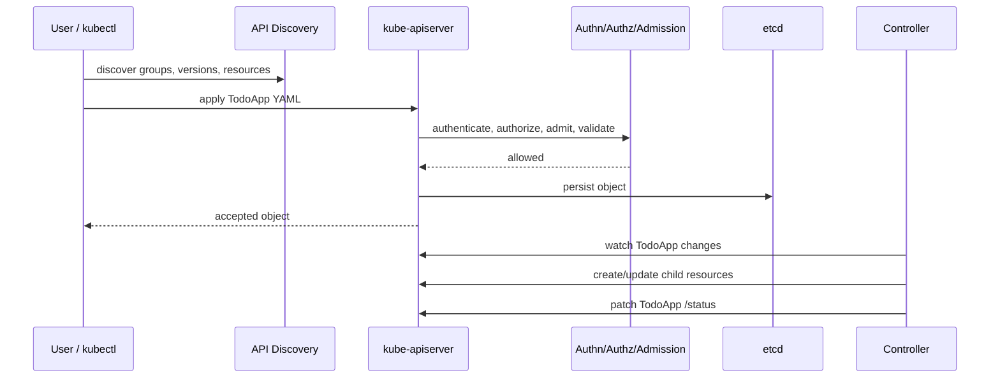
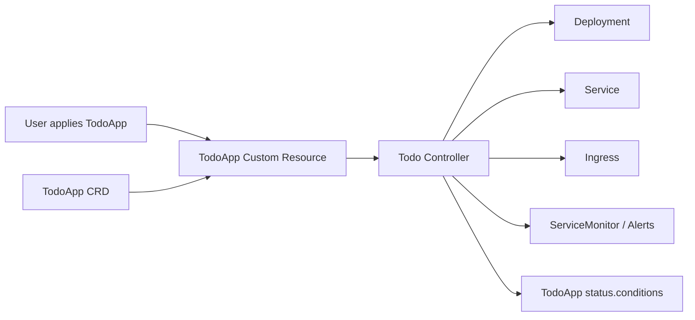
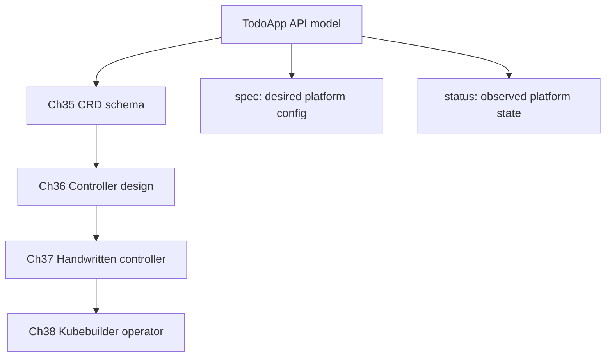

# 第 34 篇：Kubernetes API 扩展机制 [B]

本篇开始进入阶段六：平台工程与 Operator 能力。

前 33 篇中，你已经能把 Todo Platform 部署到 Kubernetes，接入 CI/CD、GitOps、Prometheus、Grafana、Loki、Tempo，并完成生产排障。接下来要进一步思考一个平台工程问题：如果团队不希望每个业务方都直接维护 Deployment、Service、Ingress、ConfigMap、Secret、HPA、ServiceMonitor 和告警规则，能不能提供一个更高层的 Kubernetes API，让用户只提交一份 `TodoApp`，其余资源由平台自动管理？

答案就是 Kubernetes API 扩展。本篇不会急着安装 CRD，也不会写 Controller；它先把最重要的概念讲透：Kubernetes API Machinery、声明式 API、GVK、GVR、CRD、Controller、`spec`、`status` 和 Conditions。第 35 篇会真正编写 CRD YAML，第 36-38 篇会进入控制循环和 Operator 开发。

本篇特色项目是：**设计 Todo Platform 的 `TodoApp` 自定义资源模型草案，明确 `spec` 描述什么期望状态，`status` 回写什么实际状态，为后续 CRD 和 Controller 开发打基础。**

## 1. 本章学习目标

### 1.1 知识目标

- 能解释 Kubernetes API 为什么是资源化、声明式、可扩展的 API。
- 能区分 Resource、Object、Kind、Collection、Subresource 的含义。
- 能解释 Group、Version、Kind（GVK）与 Group、Version、Resource（GVR）的区别。
- 能说明 CRD（CustomResourceDefinition，自定义资源定义）和自定义资源实例的关系。
- 能解释 `spec`、`status`、`conditions` 在声明式 API 中各自承担的职责。
- 能说明 CRD 本身只扩展 API 存储和校验，真正的自动化行为需要 Controller。

### 1.2 技能目标

- 能使用 `kubectl api-resources`、`kubectl api-versions`、`kubectl explain` 和 `kubectl get --raw` 探查 Kubernetes API。
- 能从一个内置对象中识别 `apiVersion`、`kind`、`metadata`、`spec` 和 `status`。
- 能为 Todo Platform 写出 `TodoApp` 自定义资源的初版 `spec` 与 `status` 设计草案。
- 能判断一个自定义资源模型是否把用户输入、系统输出和运行状态混在了一起。
- 能为第 35 篇 CRD 实现准备清晰的字段边界和验收标准。

## 2. 本章工作场景与真实案例

### 2.1 技术痛点

Kubernetes 内置对象足够强大，但它们不是业务语言。一个 Todo API 在集群中运行，背后可能需要 Deployment、Service、Ingress、ConfigMap、Secret、HPA、ServiceMonitor、PrometheusRule、NetworkPolicy、PVC 等十几类对象。对平台团队来说，这些对象是可控的工程单元；对业务团队来说，它们往往只是“我想上线一个服务”的实现细节。

如果没有更高层 API，常见问题会反复出现：

- 业务团队复制粘贴 YAML，某个 label、端口名或 selector 写错，导致 Service 没有 endpoint。
- 每个环境的 Helm values 越来越长，字段含义只有平台团队知道。
- 监控、日志、Trace、NetworkPolicy、资源请求这些生产要求依赖人工评审，容易漏。
- 排障时只能从一堆底层对象推断业务意图，不知道“这个应用期望有几个副本、哪个版本、是否应该启用入口和监控”。

Kubernetes API 扩展要解决的是“平台抽象”问题：把一组底层对象收束成一个业务可理解的 API。例如用户提交：

```yaml
apiVersion: platform.todo.example.com/v1alpha1
kind: TodoApp
metadata:
  name: todo-platform
  namespace: todo-dev
spec:
  image: todo-api:v0.1.2-observability
  replicas: 2
  ingress:
    enabled: true
    host: todo.dev.local
```

平台 Controller 看到这个 `TodoApp` 后，再自动创建和维护 Deployment、Service、Ingress、监控和状态回写。

### 2.2 团队协作场景

平台工程师负责设计 CRD 的 API 边界：哪些字段让用户填写，哪些字段由系统默认，哪些字段只能由 Controller 回写。平台工程师还要维护 Controller、RBAC、升级策略、文档和兼容性。

后端工程师或业务团队负责提交 `TodoApp` 这类高层资源，不再直接关心 Deployment 的 selector、Service 的 targetPort、PrometheusRule 的表达式等细节。业务团队仍然要理解字段含义，例如镜像版本、副本数、域名和资源规格。

SRE 负责基于 `status.conditions`、Event、日志和指标判断平台是否按预期工作。第 33 篇已经强调：一个合格的系统必须可排障。Operator 不是“把 YAML 藏起来”，而是把意图、实际状态和异常原因写得更清楚。

### 2.3 课程项目关联

本篇承接第 29-33 篇的生产工程闭环。Todo Platform 已经具备交付、GitOps、监控、日志、Trace 和排障能力；阶段六会把这些能力进一步抽象为平台 API。

从本篇开始，项目进入 `v4.0-operator` 阶段：

- 第 34 篇：设计 `TodoApp` 自定义资源模型，明确 `spec` 和 `status`。
- 第 35 篇：实现 `TodoApp`、`TodoDatabase`、`TodoCache` 三个 CRD。
- 第 36 篇：分析 Controller 需要 Watch 哪些资源，以及 Reconcile 要做什么。
- 第 37 篇：手写简化版 Controller，理解控制循环本质。
- 第 38 篇：使用 Kubebuilder 重写 Todo Operator。

本篇产物是 `operator/api-model/` 下的 API 模型草案。它不会直接部署到集群，但会被第 35 篇改造成正式 CRD。

## 3. 核心概念

### 3.1 Kubernetes API 是资源化 API

Kubernetes API 是一个基于 HTTP 的资源化 API。你通过 `GET`、`POST`、`PUT`、`PATCH`、`DELETE` 读取和修改资源对象。`kubectl` 不是绕过 API 的特殊工具，它只是 Kubernetes API 的客户端之一。

以 Deployment 为例：

```yaml
apiVersion: apps/v1
kind: Deployment
metadata:
  name: todo-platform
  namespace: todo-dev
spec:
  replicas: 2
```

这里至少包含三层信息：

| 字段 | 作用 |
|---|---|
| `apiVersion` | 这个对象属于哪个 API group 和 version，例如 `apps/v1` |
| `kind` | 这个对象的类型，例如 `Deployment` |
| `metadata` | 名称、namespace、label、annotation、resourceVersion 等通用元数据 |
| `spec` | 用户希望系统达到的状态 |

官方 Kubernetes API 概念文档把 resource type、kind、collection、subresource 区分得很清楚：resource type 是 URL 中使用的复数资源名，例如 `pods`；kind 是对象 schema 的名称，例如 `Pod`；collection 是同类对象列表；subresource 是对象下面的子接口，例如 `status` 或 `scale`。

在本项目中，未来的 `TodoApp` 也会遵守同样结构：

```yaml
apiVersion: platform.todo.example.com/v1alpha1
kind: TodoApp
metadata:
  name: todo-platform
  namespace: todo-dev
spec:
  replicas: 2
```

### 3.2 Group、Version、Kind（GVK）

GVK 用来描述“这个对象是什么类型”。

| 对象 | Group | Version | Kind | apiVersion |
|---|---|---|---|---|
| Pod | core group | v1 | Pod | `v1` |
| Deployment | apps | v1 | Deployment | `apps/v1` |
| Ingress | networking.k8s.io | v1 | Ingress | `networking.k8s.io/v1` |
| TodoApp | platform.todo.example.com | v1alpha1 | TodoApp | `platform.todo.example.com/v1alpha1` |

注意 core group 比较特殊，`Pod` 的 `apiVersion` 写 `v1`，而不是 `/v1` 或 `core/v1`。

GVK 常出现在 YAML 和 Go 类型注册中。你写 YAML 时使用的是：

```yaml
apiVersion: apps/v1
kind: Deployment
```

Controller 在解码对象时，也需要知道对象的 GVK，才能把 JSON/YAML 数据转换成正确的 Go struct。

### 3.3 Group、Version、Resource（GVR）

GVR 用来描述“API 路径里访问哪个资源集合”。

| 对象 | Group | Version | Resource | 典型路径 |
|---|---|---|---|---|
| Pod | core group | v1 | pods | `/api/v1/namespaces/todo-dev/pods` |
| Deployment | apps | v1 | deployments | `/apis/apps/v1/namespaces/todo-dev/deployments` |
| ServiceMonitor | monitoring.coreos.com | v1 | servicemonitors | `/apis/monitoring.coreos.com/v1/namespaces/todo-dev/servicemonitors` |
| TodoApp | platform.todo.example.com | v1alpha1 | todoapps | `/apis/platform.todo.example.com/v1alpha1/namespaces/todo-dev/todoapps` |

GVK 面向对象类型，GVR 面向 REST 资源路径。新手常把两者混在一起：

- YAML 里写 `kind: Deployment`，不是 `kind: deployments`。
- URL 和 RBAC 里写 `resources: ["deployments"]`，不是 `resources: ["Deployment"]`。
- `kubectl get deployment` 能工作，是因为 kubectl 帮你把常见简称、单数、复数映射到真实 resource。

### 3.4 声明式 API：期望状态与实际状态

Kubernetes 的核心不是“执行一个命令后立刻完成动作”，而是“提交期望状态，然后由控制器持续调谐”。

例如你提交：

```yaml
spec:
  replicas: 3
```

这并不代表 API server 自己会创建 3 个 Pod。API server 负责保存对象、校验字段、提供 watch；Deployment Controller 看到期望副本数后，才会创建或删除 ReplicaSet / Pod，让实际状态接近期望状态。

这就是声明式 API 的关键分工：

| 角色 | 职责 |
|---|---|
| 用户 | 写 `spec`，表达期望状态 |
| API server | 校验、存储、暴露 API、提供 watch |
| Controller | 观察对象变化，执行调谐 |
| status | 记录系统观察到的实际状态 |

未来的 `TodoApp` 也一样。用户写：

```yaml
spec:
  replicas: 2
  ingress:
    enabled: true
```

Controller 才负责创建 Deployment、Service、Ingress，并把结果写回：

```yaml
status:
  readyReplicas: 2
  url: https://todo.dev.local
```

### 3.5 CRD 与自定义资源

CRD（CustomResourceDefinition，自定义资源定义）是一种 Kubernetes 内置资源，用来告诉 API server：“请为我增加一种新的资源类型”。

CRD 定义的是类型，例如：

```yaml
apiVersion: apiextensions.k8s.io/v1
kind: CustomResourceDefinition
metadata:
  name: todoapps.platform.todo.example.com
spec:
  group: platform.todo.example.com
  names:
    plural: todoapps
    singular: todoapp
    kind: TodoApp
  scope: Namespaced
```

自定义资源是这个类型的实例，例如：

```yaml
apiVersion: platform.todo.example.com/v1alpha1
kind: TodoApp
metadata:
  name: todo-platform
  namespace: todo-dev
spec:
  replicas: 2
```

一个很重要的边界：**CRD 只让 API server 认识和存储 `TodoApp`，不会自动创建 Deployment 或 Service。** 自动化行为来自 Controller。没有 Controller 时，`TodoApp` 只是存进 etcd 的一份声明式数据。

### 3.6 spec、status 与 Conditions

在 Kubernetes API 设计中，`spec` 是用户输入，`status` 是系统输出。

| 字段 | 谁写 | 表达什么 | 示例 |
|---|---|---|---|
| `spec` | 用户、GitOps、上层平台 | 期望状态 | replicas、image、host、resource profile |
| `status` | Controller | 已观察到的实际状态 | readyReplicas、url、observedGeneration |
| `status.conditions` | Controller | 可机器判断的状态结论 | Available、Progressing、Degraded |

`conditions` 不是日志，也不是随便写的一段文本。它应该让人和程序都能判断当前资源是否可用、是否仍在调谐、是否失败、失败原因是什么。

一个 `TodoApp` 的条件可能是：

```yaml
status:
  conditions:
    - type: Available
      status: "True"
      reason: AllComponentsReady
      message: Deployment, Service and Ingress are ready.
```

第 33 篇讲排障时强调过：未来使用者要能通过 status、events 和日志定位问题。阶段六开发 Operator 时，这一点会反复出现。

## 4. 原理深入

### 4.1 从 kubectl 到 API server 的路径

图 34-1 展示一次典型 API 调用的路径：



API server 本身不运行你的业务逻辑。它更像一个强一致的 API 网关和存储入口：认证、鉴权、准入、校验、默认值、持久化、watch 都发生在这里。Controller 才是持续工作的自动化程序。

### 4.2 API Discovery 与 RESTMapper

`kubectl` 之所以知道 `deploy` 是 `deployments.apps`，是因为它会通过 API discovery 发现服务端支持哪些 Group、Version、Resource。

你可以直接查看 discovery 信息：

```bash
kubectl api-versions
kubectl api-resources
kubectl get --raw /apis/apps/v1 | jq '.resources[] | select(.name=="deployments")'
```

当你输入：

```bash
kubectl get deploy -n todo-dev
```

kubectl 大致会完成这些事情：

1. 通过 discovery 找到 `deploy` 对应 `deployments`。
2. 确认它属于 `apps/v1`。
3. 确认它是 namespaced resource。
4. 拼出 API 路径 `/apis/apps/v1/namespaces/todo-dev/deployments`。
5. 发起 HTTP GET 请求并把结果显示成表格。

Controller-runtime、client-go 中也有类似的映射能力。理解 discovery 能帮助你排查“no matches for kind”“the server doesn't have a resource type”这类错误。

### 4.3 版本不是字符串装饰

Kubernetes API version 不是随便写的字符串。它决定：

- 资源对象在哪个 API 路径下暴露。
- 这个版本的 schema 如何定义。
- 字段是否稳定、是否可能变化。
- 不同版本之间如何转换。
- 哪个版本作为 storage version 存入 etcd。

常见版本含义：

| 版本 | 含义 | 生产建议 |
|---|---|---|
| `v1alpha1` | 早期实验版本，字段可能频繁变化 | 适合课程和原型 |
| `v1beta1` | 接近稳定，但仍可能调整 | 适合受控试点 |
| `v1` | 稳定 API，兼容性要求更高 | 适合生产承诺 |

本阶段会从 `platform.todo.example.com/v1alpha1` 开始，因为 Todo Operator 还在教学和实验阶段。第 35 篇会进一步讨论 CRD 版本升级。

### 4.4 status subresource 的边界

很多 Kubernetes 资源把 `status` 做成 subresource，例如：

```text
/apis/apps/v1/namespaces/todo-dev/deployments/todo-platform/status
```

这样做有两个好处：

1. 权限可以分开：用户可以修改 `spec`，Controller 才能修改 `status`。
2. 更新可以分开：Controller 回写 status 时，不需要覆盖用户刚刚修改的 spec。

未来设计 `TodoApp` CRD 时，也应该启用 status subresource。否则用户可能误改 status，Controller 也可能在更新对象时和用户的 spec 修改产生冲突。

### 4.5 CRD、Controller 与 Operator 的关系

CRD、Controller、Operator 经常被混用，但它们不是同一个东西：

| 名称 | 一句话解释 | 在 Todo Platform 中的角色 |
|---|---|---|
| CRD | 定义一种新的 Kubernetes API 类型 | 定义 `TodoApp` 是什么字段结构 |
| Custom Resource | CRD 类型的一个实例 | `todo-platform` 这个 TodoApp 对象 |
| Controller | 监听对象并调谐实际状态的程序 | 看到 TodoApp 后创建 Deployment / Service |
| Operator | 面向某个领域的 Controller + 运维知识 | 管理 Todo Platform 生命周期 |

图 34-2 展示它们的关系：



本篇只完成 CRD 之前的 API 设计；第 35 篇会让 API server 真正认识 `TodoApp`；第 37-38 篇会让 Controller 真正动起来。

## 5. 手把手实验

### 5.1 实验目标

本篇实验不安装 CRD，也不写 Controller，而是完成三件事：

1. 使用 kubectl 探查 Kubernetes API discovery、GVK、GVR 和 status subresource。
2. 设计 `TodoApp` 自定义资源实例草案。
3. 验证在 CRD 尚未安装时，API server 会拒绝未知 kind，从而理解“先有 CRD，再有自定义资源实例”的顺序。

预计耗时：70 分钟。

### 5.2 实验环境

本篇命令默认在 **Cloud Native Todo Platform 应用仓库根目录** 执行，也就是包含 `api/`、`deployments/`、`observability/` 的仓库根目录。

本篇继续使用第 30-33 篇的 `todo-gitops` kind 集群。课程蓝图的 Kubernetes 基线为 1.36.x；如果你沿用阶段五环境，集群可能是 v1.35.0。本篇只使用稳定 API discovery、内置资源读取和本地 YAML 设计，不依赖 Kubernetes 1.36 专属能力。

| 工具 | 建议版本 | 用途 |
|---|---:|---|
| Kubernetes | v1.35.0 或 v1.36.x | API discovery 和内置对象探查 |
| kubectl | 与集群 minor 版本接近 | 查询 API、解释字段、server-side dry-run |
| jq | 1.7.x | 解析 `kubectl get --raw` 的 JSON 输出 |
| Git | 2.45+ | 保存 API 模型草案 |

确认前置环境：

```bash
pwd
test -d deployments/gitops/envs/dev
kubectl config current-context
kubectl get namespace todo-dev
kubectl -n todo-dev get deployment todo-platform
kubectl version --client
jq --version
```

如果 `todo-dev` 不存在，可以先回到第 30 篇同步 GitOps 环境；如果只是想学习 API discovery，本篇大部分命令也可以在任意可访问的 Kubernetes 集群中执行。

### 5.3 文件目录结构

创建 API 模型目录：

```bash
mkdir -p operator/api-model
```

最终目录如下：

```text
operator/
└── api-model/
    ├── todoapp-example.yaml
    ├── todoapp-status-example.yaml
    └── todoapp-api-map.md
```

### 5.4 完整代码或配置

#### 5.4.1 创建 TodoApp 自定义资源草案

创建 `operator/api-model/todoapp-example.yaml`：

```bash
cat > operator/api-model/todoapp-example.yaml <<'YAML'
apiVersion: platform.todo.example.com/v1alpha1
kind: TodoApp
metadata:
  name: todo-platform
  namespace: todo-dev
  labels:
    app.kubernetes.io/name: todo-platform
    app.kubernetes.io/part-of: todo-platform
spec:
  image: todo-api:v0.1.2-observability
  replicas: 2
  service:
    port: 18080
  ingress:
    enabled: true
    host: todo.dev.local
  resources:
    profile: small
  observability:
    metrics: true
    logs: true
    tracing: true
  rollout:
    strategy: RollingUpdate
YAML
```

关键点：这个 YAML 现在还不能 apply，因为 API server 还不认识 `TodoApp`。它是第 35 篇 CRD 的输入设计。

#### 5.4.2 创建 TodoApp status 草案

创建 `operator/api-model/todoapp-status-example.yaml`：

```bash
cat > operator/api-model/todoapp-status-example.yaml <<'YAML'
apiVersion: platform.todo.example.com/v1alpha1
kind: TodoApp
metadata:
  name: todo-platform
  namespace: todo-dev
status:
  observedGeneration: 3
  readyReplicas: 2
  url: https://todo.dev.local
  components:
    deployment: todo-platform
    service: todo-platform
    ingress: todo-platform
  conditions:
    - type: Available
      status: "True"
      reason: AllComponentsReady
      message: Deployment, Service and Ingress are ready.
      lastTransitionTime: "2026-05-29T10:00:00Z"
    - type: Progressing
      status: "False"
      reason: ReconcileComplete
      message: Latest desired state has been reconciled.
      lastTransitionTime: "2026-05-29T10:00:00Z"
YAML
```

关键点：真实用户不应该手写这份 status。它展示的是 Controller 未来应该回写什么。

#### 5.4.3 创建 API 映射说明

创建 `operator/api-model/todoapp-api-map.md`：

```bash
cat > operator/api-model/todoapp-api-map.md <<'MD'
# TodoApp API Model

## GVK

- Group: platform.todo.example.com
- Version: v1alpha1
- Kind: TodoApp
- apiVersion: platform.todo.example.com/v1alpha1

## GVR

- Group: platform.todo.example.com
- Version: v1alpha1
- Resource: todoapps
- Namespaced path: /apis/platform.todo.example.com/v1alpha1/namespaces/{namespace}/todoapps/{name}

## Field ownership

| Field | Owner | Meaning |
|---|---|---|
| spec.image | User / GitOps | Desired Todo API image |
| spec.replicas | User / GitOps | Desired replica count |
| spec.ingress | User / GitOps | Desired external access |
| spec.observability | User / GitOps | Desired observability integration |
| status.readyReplicas | Controller | Observed ready replicas |
| status.url | Controller | Observed external URL |
| status.conditions | Controller | Machine-readable resource state |
MD
```

### 5.5 执行命令

#### 5.5.1 探查 API groups 与 versions

查看集群支持的 API versions：

```bash
kubectl api-versions | sort | head -30
kubectl api-versions | grep -E '^(v1|apps/v1|apiextensions.k8s.io/v1)$'
```

查看内置资源：

```bash
kubectl api-resources | head -20
kubectl api-resources --api-group=apps
kubectl api-resources --api-group=apiextensions.k8s.io
```

预期能看到：

```text
deployments   deploy   apps/v1   true   Deployment
customresourcedefinitions   crd,crds   apiextensions.k8s.io/v1   false   CustomResourceDefinition
```

#### 5.5.2 查看 GVK 与 GVR

从内置 Deployment 对象读取 GVK：

```bash
kubectl -n todo-dev get deployment todo-platform \
  -o jsonpath='{.apiVersion}{" "}{.kind}{"\n"}'
```

预期输出：

```text
apps/v1 Deployment
```

查看 Deployment 的 GVR 信息：

```bash
kubectl api-resources --api-group=apps | grep '^deployments'
```

预期输出中应包含：

```text
deployments   deploy   apps/v1   true   Deployment
```

#### 5.5.3 直接访问 API discovery

查看 core API：

```bash
kubectl get --raw /api | jq .
```

查看 apps/v1 discovery：

```bash
kubectl get --raw /apis/apps/v1 \
  | jq '.resources[] | select(.name=="deployments") | {name, singularName, namespaced, kind, verbs}'
```

预期能看到 `deployments` 是 namespaced resource，kind 是 `Deployment`，并支持 `get`、`list`、`watch`、`create`、`update`、`patch`、`delete` 等 verbs。

#### 5.5.4 查看 spec 与 status

查看 Deployment 的期望副本和实际副本：

```bash
kubectl -n todo-dev get deployment todo-platform \
  -o jsonpath='spec.replicas={.spec.replicas} status.readyReplicas={.status.readyReplicas}{"\n"}'
```

查看 Conditions：

```bash
kubectl -n todo-dev get deployment todo-platform \
  -o json | jq '.status.conditions[] | {type, status, reason, message}'
```

查看 status subresource：

```bash
kubectl get --raw /apis/apps/v1/namespaces/todo-dev/deployments/todo-platform/status \
  | jq '{apiVersion, kind, status}'
```

判断标准：你能看到用户写入的 `spec.replicas`，也能看到 Controller 回写的 `status.readyReplicas` 和 `status.conditions`。

#### 5.5.5 使用 kubectl explain 理解 schema

查看 Deployment 字段说明：

```bash
kubectl explain deployment
kubectl explain deployment.spec
kubectl explain deployment.status.conditions
```

这一步很重要。未来第 35 篇安装 CRD 后，`kubectl explain todoapp.spec` 也应该能显示我们定义的 OpenAPI schema。

#### 5.5.6 验证 TodoApp 还不能 apply

先确认 API server 还不认识 `TodoApp`：

```bash
kubectl api-resources | grep -i todoapp || true
```

尝试 server-side dry-run：

```bash
kubectl apply --dry-run=server -f operator/api-model/todoapp-example.yaml
```

预期错误类似：

```text
error: resource mapping not found for name: "todo-platform" namespace: "todo-dev" from "operator/api-model/todoapp-example.yaml": no matches for kind "TodoApp" in version "platform.todo.example.com/v1alpha1"
ensure CRDs are installed first
```

这不是失败，而是本篇要证明的关键事实：自定义资源实例必须等 CRD 安装后才能被 API server 接受。

#### 5.5.7 检查 TodoApp 模型边界

查看我们设计的 `spec`：

```bash
grep -n '^spec:' -A20 operator/api-model/todoapp-example.yaml
```

查看我们设计的 `status`：

```bash
grep -n '^status:' -A30 operator/api-model/todoapp-status-example.yaml
```

检查字段归属：

```bash
cat operator/api-model/todoapp-api-map.md
```

判断标准：

- `spec` 中只出现用户期望，例如 image、replicas、ingress、observability。
- `status` 中只出现系统观察结果，例如 readyReplicas、url、components、conditions。
- 未来 Controller 可以根据 `spec` 创建资源，并根据实际资源状态回写 `status`。

### 5.6 预期输出

完成实验后，你应该得到以下关键结果：

```text
apps/v1 Deployment
deployments   deploy   apps/v1   true   Deployment
customresourcedefinitions   crd,crds   apiextensions.k8s.io/v1   false   CustomResourceDefinition
spec.replicas=... status.readyReplicas=...
no matches for kind "TodoApp" in version "platform.todo.example.com/v1alpha1"
```

同时本地目录中应存在：

```text
operator/api-model/todoapp-example.yaml
operator/api-model/todoapp-status-example.yaml
operator/api-model/todoapp-api-map.md
```

### 5.7 验证方法

**第一层：能发现 API 资源**

```bash
kubectl api-resources --api-group=apps | grep '^deployments'
kubectl api-resources --api-group=apiextensions.k8s.io | grep customresourcedefinitions
```

判断标准：能看到 Deployment 和 CRD 的 resource、group、version、kind。

**第二层：能区分 GVK 与 GVR**

```bash
kubectl -n todo-dev get deployment todo-platform -o jsonpath='{.apiVersion}{" "}{.kind}{"\n"}'
kubectl api-resources --api-group=apps | grep '^deployments'
```

判断标准：能说出 `apps/v1 Deployment` 是 GVK 视角，`apps/v1 deployments` 是 GVR 视角。

**第三层：能读取 spec 与 status**

```bash
kubectl -n todo-dev get deployment todo-platform \
  -o jsonpath='spec={.spec.replicas} status={.status.readyReplicas}{"\n"}'
```

判断标准：能解释 spec 是期望副本数，status 是 Controller 观察到的实际就绪副本数。

**第四层：能解释 CRD 安装顺序**

```bash
kubectl apply --dry-run=server -f operator/api-model/todoapp-example.yaml
```

判断标准：看到 `no matches for kind "TodoApp"` 时，能解释这是因为 CRD 尚未安装，而不是 YAML 缩进错误。

**第五层：能完成 TodoApp API 草案**

```bash
test -f operator/api-model/todoapp-example.yaml
test -f operator/api-model/todoapp-status-example.yaml
test -f operator/api-model/todoapp-api-map.md
```

判断标准：三个文件存在，且字段边界能支撑第 35 篇 CRD 设计。

### 5.8 清理步骤

本篇没有向集群创建资源。建议保留 `operator/api-model/`，因为第 35 篇会继续使用。

如果你只想清理本篇本地草案：

```bash
rm -rf operator/api-model
```

如果你在实验过程中额外创建了测试对象，请按对象类型删除。例如：

```bash
kubectl -n todo-dev delete deployment api-shape-demo --ignore-not-found
```

## 6. 常见错误与排障

### 错误 1：把 Kind 写成复数 resource

- **现象**：

  ```yaml
  kind: deployments
  ```

- **原因**：把 GVR 中的 `resources: deployments` 当成 YAML 里的 `kind`。
- **排查**：

  ```bash
  kubectl api-resources --api-group=apps | grep '^deployments'
  kubectl explain deployment
  ```

- **修复**：YAML 中使用 `kind: Deployment`；RBAC、API path、GVR 里才使用 `deployments`。
- **预防**：记住一句话：YAML 看 GVK，URL/RBAC 看 GVR。

### 错误 2：CRD 未安装就 apply 自定义资源

- **现象**：

  ```text
  no matches for kind "TodoApp" in version "platform.todo.example.com/v1alpha1"
  ```

- **原因**：API server 尚未通过 CRD 注册 `TodoApp` 类型。
- **排查**：

  ```bash
  kubectl api-resources | grep -i todoapp || true
  kubectl get crd | grep -i todo || true
  ```

- **修复**：第 35 篇先安装 `todoapps.platform.todo.example.com` CRD，再 apply `TodoApp` 实例。
- **预防**：GitOps 或 Helm 发布 CRD 时，先应用 CRD，再应用 CR 实例。

### 错误 3：把运行结果写进 spec

- **现象**：`spec` 中出现 `readyReplicas`、`urlReady`、`lastError`、`observedGeneration` 这类运行结果。
- **原因**：没有区分用户期望和系统观察值。
- **排查**：

  ```bash
  grep -n 'readyReplicas\|observedGeneration\|lastError' operator/api-model/todoapp-example.yaml || true
  ```

- **修复**：把运行结果移到 `status`，并由 Controller 回写。
- **预防**：设计字段时先问“这个字段是用户想要的，还是系统观察到的？”

### 错误 4：以为 CRD 会自动创建业务资源

- **现象**：安装 CRD 并创建 `TodoApp` 后，没有 Deployment、Service 或 Ingress 出现。
- **原因**：CRD 只扩展 API 类型，不包含自动化逻辑；Controller 尚未部署。
- **排查**：

  ```bash
  kubectl get crd | grep todoapps
  kubectl -n todo-dev get todoapp
  kubectl -n todo-dev get deployment,svc,ingress
  ```

- **修复**：第 37-38 篇部署 Controller，让它 Watch `TodoApp` 并调谐子资源。
- **预防**：文档中明确区分 CRD、CR、Controller、Operator。

### 错误 5：status 设计成一段不可解析文本

- **现象**：

  ```yaml
  status:
    message: everything is probably ok
  ```

- **原因**：status 没有结构化，无法被脚本、告警或 UI 稳定消费。
- **排查**：检查是否有 `conditions`、`observedGeneration`、关键组件状态和明确 reason。
- **修复**：使用 Conditions 表达状态，包含 `type`、`status`、`reason`、`message`、`lastTransitionTime`。
- **预防**：把第 33 篇的排障视角前置到 API 设计阶段。

## 7. 生产环境注意事项

1. **API group 要稳定且归属清晰**。课程使用 `platform.todo.example.com` 是为了演示；真实企业应使用自己控制的域名，例如 `platform.example.com`。不要使用别人的域名，也不要频繁更换 group，否则会影响所有已创建资源和 RBAC。

2. **v1alpha1 不等于可以随意破坏用户数据**。即使是 alpha API，也要记录字段语义和废弃策略。字段一旦被用户写入 Git，就会进入发布流程和审计链路，随意删除会造成升级风险。

3. **CRD schema 必须严格设计**。开放的 `map[string]interface{}` 看似灵活，实际会让校验、默认值、文档、UI 和 Controller 逻辑都变复杂。第 35 篇会用 OpenAPI schema 限制字段类型、枚举和必填项。

4. **status 只能由 Controller 回写**。生产 CRD 应启用 status subresource，并用 RBAC 把 `todoapps` 和 `todoapps/status` 权限分开，避免普通用户伪造运行状态。

5. **Conditions 是运维接口，不是装饰字段**。SRE、告警系统、UI 和 CLI 都可能读取 Conditions。`type` 和 `reason` 要稳定，`message` 可以更详细，但不要让自动化依赖自由文本。

6. **CRD 不是把所有 YAML 塞进一个对象**。好的平台 API 会隐藏底层复杂度，同时保留必要的安全边界。过度抽象会让用户无法表达真实需求，过度暴露又会退化成“另一种 Helm values”。

官方参考：

- [Kubernetes API Concepts](https://kubernetes.io/docs/reference/using-api/api-concepts/)
- [Custom Resources](https://kubernetes.io/docs/concepts/api-extension/custom-resources/)
- [Extend the Kubernetes API with CustomResourceDefinitions](https://kubernetes.io/docs/tasks/access-kubernetes-api/extend-api-custom-resource-definitions/)

## 8. 本章小项目

### 8.1 项目产出

本章完成 Todo Platform 的第一版 API 模型设计，产出：

- `operator/api-model/todoapp-example.yaml`：`TodoApp` 自定义资源实例草案。
- `operator/api-model/todoapp-status-example.yaml`：未来 Controller 应回写的 status 草案。
- `operator/api-model/todoapp-api-map.md`：GVK、GVR 和字段归属说明。

图 34-3 是本章产物和后续章节的关系：



### 8.2 能力验收标准

| 能力 | 验收标准 |
|---|---|
| API discovery | 能用 `kubectl api-resources` 找到 Deployment 与 CRD |
| GVK/GVR 区分 | 能说出 `apps/v1 Deployment` 与 `apps/v1 deployments` 的区别 |
| 声明式 API | 能解释 `spec.replicas` 和 `status.readyReplicas` 的不同 |
| CRD 边界 | 能说明 CRD 不会自动创建业务资源，必须有 Controller |
| status 设计 | 能设计包含 `observedGeneration` 和 `conditions` 的 status |
| TodoApp 模型 | 能写出 `TodoApp` 的初版 `spec` 与字段归属表 |

## 9. 本章练习题

**基础题**

1. Kubernetes 中 Resource 和 Kind 有什么区别？
2. 为什么 `Pod` 的 `apiVersion` 是 `v1`，而 Deployment 是 `apps/v1`？
3. GVK 和 GVR 分别在哪些场景中出现？
4. 为什么说 CRD 只是扩展 API，而不是自动化逻辑？
5. `spec` 和 `status` 为什么要分开？

**实操题**

1. 使用 `kubectl get --raw /apis/apps/v1` 找到 `deployments` 的 discovery 信息。验收标准：能指出 `kind`、`namespaced` 和 `verbs`。
2. 为 `TodoApp` 增加一个 `spec.autoscaling` 草案字段。验收标准：字段只描述期望状态，不包含实际副本数。
3. 为 `TodoApp` 设计一个 `Degraded` condition 示例。验收标准：包含 `type`、`status`、`reason`、`message` 和 `lastTransitionTime`。

**思考题**

1. 如果把所有 Helm values 原样塞进 `TodoApp.spec.values`，会带来什么长期维护问题？
2. 如果用户可以修改 `status.conditions`，会对排障、告警和自动化产生什么风险？

## 10. 本章面试题

### 面试题 1：Kubernetes 为什么容易扩展？

**一句话结论**：因为 Kubernetes 把集群能力抽象成资源化、声明式 API，并允许通过 CRD 注册新的资源类型，再由 Controller 基于 watch 和 reconcile 实现自动化。

**展开解释**：API server 负责校验、存储、鉴权和 watch；CRD 让 API server 认识新的 kind；Controller 监听这些对象并调谐底层资源。这样平台团队可以把业务运维知识封装成新的 Kubernetes API，而不需要修改 kube-apiserver 源码。

**深入追问**：CRD 和 Aggregated API Server 有什么区别？CRD 适合大多数声明式资源扩展，API server 负责存储；Aggregated API Server 适合需要自定义存储、复杂子资源或特殊协议行为的高级扩展。

### 面试题 2：GVK 和 GVR 有什么区别？

**一句话结论**：GVK 描述对象类型，GVR 描述 REST API 资源路径。

**展开解释**：YAML 中的 `apiVersion: apps/v1` 和 `kind: Deployment` 是 GVK 视角；API path 和 RBAC 中的 `resources: ["deployments"]` 是 GVR 视角。kubectl 和 client-go 会通过 discovery 和 RESTMapper 在两者之间映射。

**深入追问**：为什么要关心这个区别？写 Controller、RBAC、动态客户端和排查 `no matches for kind` 时，混淆 GVK/GVR 会直接导致 watch 不到对象或权限配置错误。

### 面试题 3：CRD 安装后，为什么创建 CR 不一定有业务资源生成？

**一句话结论**：CRD 只让 API server 认识和存储新资源，业务资源的创建需要 Controller。

**展开解释**：安装 `TodoApp` CRD 后，API server 可以接受 `TodoApp` 对象并存储到 etcd，但它不知道 TodoApp 应该对应哪些 Deployment、Service 或 Ingress。只有 Todo Controller 监听到 TodoApp 后，才会执行调谐逻辑。

**深入追问**：如果 Controller 停止了会怎样？已创建的底层资源通常还在，但新的 spec 变更不会被调谐，status 也不会更新。排障时要同时看 CR、Controller Pod、Event、日志和 status.conditions。

### 面试题 4：为什么 status 应该作为 subresource？

**一句话结论**：status subresource 可以把用户修改 spec 和 Controller 回写 status 的权限与更新路径分开。

**展开解释**：用户通常应该能创建和更新 `todoapps`，但不应该伪造 `todoapps/status`。Controller 回写 status 时也不应该覆盖用户刚刚修改的 spec。status subresource 提供了更清晰的 RBAC 和并发更新边界。

**深入追问**：没有 status subresource 会有什么风险？用户和 Controller 都更新同一个主资源，容易产生字段冲突；RBAC 也很难精细限制谁能写运行状态。

### 面试题 5：如何设计一个好的 Conditions？

**一句话结论**：Conditions 要稳定、结构化、可机器判断，用 `type` 表达状态维度，用 `status` 表达真假或未知，用 `reason` 和 `message` 解释原因。

**展开解释**：常见字段包括 `type`、`status`、`reason`、`message`、`lastTransitionTime`、`observedGeneration`。`type` 和 `reason` 应尽量稳定，便于 UI、告警和脚本消费；`message` 可以提供更详细的人类可读解释。

**深入追问**：Conditions 和日志有什么区别？Conditions 是资源当前状态摘要，适合快速判断和自动化；日志是过程记录，适合追踪细节。两者都需要，但不能互相替代。

## 11. 本章总结

本篇打开了阶段六的大门。知识上，你理解了 Kubernetes API Machinery 的基本组成：资源化 API、API discovery、GVK、GVR、声明式 API、CRD、自定义资源、Controller、`spec`、`status` 和 Conditions。

实践上，你没有急着安装 CRD，而是先用 kubectl 探查了内置 API，确认了 Deployment 的 GVK/GVR、spec/status 和 status subresource；随后设计了 `TodoApp` 的初版 API 模型，明确了用户输入和系统输出的边界。

能力价值上，你开始从“Kubernetes 使用者”转向“平台 API 设计者”。这一步非常关键：Operator 的核心不是写一堆 Go 代码，而是先设计一个稳定、可演进、可排障的 API。

## 12. 下一章衔接

下一篇第 35 篇会进入 CRD 设计与实践。我们会把本篇的 `TodoApp` 模型变成真正的 `CustomResourceDefinition`，并继续设计 `TodoDatabase`、`TodoCache` 两个资源。

到那时，你会学习 CRD YAML 的完整结构、OpenAPI schema、字段校验、required、enum、pattern、minimum/maximum、status subresource、短名称、printer columns 和版本演进。完成第 35 篇后，`kubectl get todoapp` 将不再报 `no matches for kind`，而是成为 Todo Operator 的第一个正式 API 入口。
