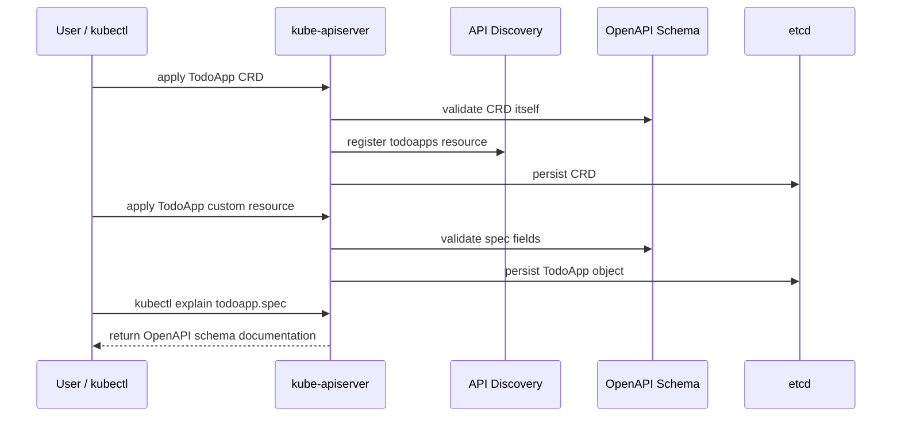
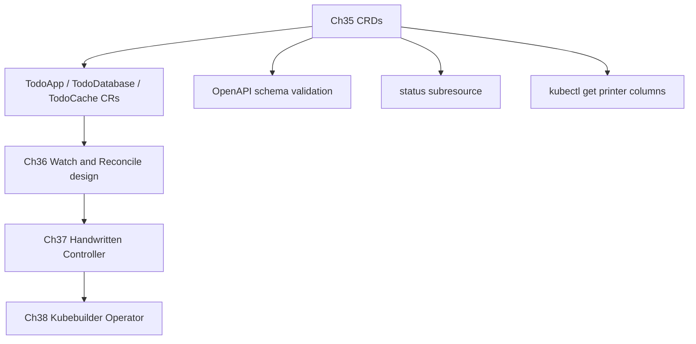

# 第 35 篇：CRD 设计与实践 [C]

第 34 篇已经完成了 `TodoApp` 自定义资源模型草案：我们知道 `spec` 表达用户期望，`status` 表达系统观察结果，也知道 CRD 只是让 API server 认识一种新资源，真正的自动化行为要等 Controller 登场。

本篇进入阶段六第一篇完整实践章：把纸面 API 变成 Kubernetes API server 能真正识别、校验、解释和操作的 `CustomResourceDefinition`。完成后，`kubectl get todoapp`、`kubectl explain todoapp.spec`、`kubectl describe tododatabase` 这些命令都会变成真实可用的接口。

本篇特色项目是：**实现 `TodoApp`、`TodoDatabase`、`TodoCache` 三个 CRD，定义完整的 OpenAPI schema、status subresource、additional printer columns 和示例自定义资源，为第 36-38 篇 Controller 开发打下 API 基础。**

## 1. 本章学习目标

### 1.1 知识目标

- 能解释 CRD YAML 中 `group`、`scope`、`names`、`versions`、`schema`、`subresources` 和 `additionalPrinterColumns` 的职责。
- 能说明 OpenAPI schema 如何完成类型校验、必填字段、枚举、正则、数值范围和默认值约束。
- 能解释 `status` subresource 为什么能保护 `spec` 与 `status` 的写入边界。
- 能描述 CRD 版本演进中 `served`、`storage`、`deprecated`、`deprecationWarning` 和 `status.storedVersions` 的作用。
- 能区分“CRD 安装成功”“CR 实例创建成功”和“业务资源被自动创建”这三件事。

### 1.2 技能目标

- 能独立编写生产风格的 `TodoApp`、`TodoDatabase`、`TodoCache` 三个 CRD。
- 能使用 `kubectl apply`、`kubectl explain`、`kubectl get`、`kubectl describe`、`kubectl edit`、`kubectl delete` 操作自定义资源。
- 能用 server-side dry-run 验证 OpenAPI schema 对非法字段的拦截效果。
- 能通过 `/status` subresource 回写状态，并验证主资源写入会忽略 `status`。
- 能为后续 Controller 设计准备稳定、可演进、可排障的 API 边界。

## 2. 本章工作场景与真实案例

### 2.1 技术痛点

阶段五结束后，Todo Platform 已经具备生产工程能力，但业务团队仍然要面对一批底层对象：Deployment、Service、Ingress、ConfigMap、Secret、ServiceMonitor、PrometheusRule、NetworkPolicy 等。第 34 篇把这些对象抽象成 `TodoApp` 模型，本篇要解决更具体的问题：**如何让 API server 真的认识这个模型，并拒绝明显错误的输入。**

如果 CRD 设计不严谨，生产里常见问题会很快出现：

- 用户把 `replicas` 写成 `"two"`，API server 没拦住，Controller 才在运行时报错。
- 用户把数据库大小写成 `huge`，平台团队不知道该映射成多少 GiB。
- 用户把运行结果写进 `spec.readyReplicas`，GitOps 每次同步都覆盖 Controller 观察到的状态。
- CRD 升级时直接删除字段，旧环境里的 Git 配置和存量 CR 立刻失效。
- `kubectl get todoapp` 只显示名字和年龄，SRE 不能一眼看出可用状态、镜像和副本数。

CRD 的价值不只是“能存一份自定义 YAML”。它还要提供 schema、文档、校验、发现、表格输出、状态边界和版本演进承诺。

### 2.2 团队协作场景

平台工程师负责设计 CRD schema，决定哪些字段暴露给业务团队，哪些字段由平台默认，哪些字段以后不能随意修改。平台工程师也要评审版本演进策略，避免字段重命名、类型变更和枚举收窄破坏已有发布流程。

后端工程师或业务团队负责提交 `TodoApp`、`TodoDatabase`、`TodoCache` 实例。他们不需要理解底层 Deployment 或 StatefulSet 的全部细节，但必须知道 API 字段语义，例如镜像、域名、数据库容量、Redis 内存规格和观测开关。

SRE 负责通过 `kubectl get`、`kubectl describe`、`status.conditions`、Events、日志和指标判断平台状态。好的 CRD 会让 SRE 快速回答：“这个应用期望是什么？平台已经观察到什么？失败原因是什么？状态是否追上最新 generation？”

### 2.3 课程项目关联

本篇承接第 34 篇的 `operator/api-model/` 草案，并输出阶段六第一批真实 Kubernetes API：

- `TodoApp`：描述 Todo API 应用本身，包括镜像、副本、服务端口、Ingress、资源规格和可观测性。
- `TodoDatabase`：描述 Todo Platform 需要的 PostgreSQL 数据库能力，包括版本、存储、Secret 和备份策略。
- `TodoCache`：描述 Todo Platform 需要的 Redis 缓存能力，包括版本、内存规格、副本和持久化。

本篇只安装 CRD 和创建 CR 实例，不会创建 Deployment、PostgreSQL 或 Redis。第 36 篇会分析 Controller 应该如何 watch 这些资源；第 37-38 篇会让 Controller 根据 CR 自动创建底层资源并回写 status。

项目版本线进入 `v4.1-crd-design`。

## 3. 核心概念

### 3.1 CRD 是 Kubernetes API 类型定义

CRD 的全称是 `CustomResourceDefinition`。它本身是 Kubernetes 内置资源，用来告诉 API server：“请暴露一种新的资源类型，并按我定义的 schema 校验它。”

一个最小 CRD 至少要回答这些问题：

| 字段 | 作用 | Todo 示例 |
|---|---|---|
| `spec.group` | API group | `platform.todo.example.com` |
| `spec.scope` | 是否 namespaced | `Namespaced` |
| `spec.names.plural` | REST resource 复数名 | `todoapps` |
| `spec.names.kind` | YAML 中的 Kind | `TodoApp` |
| `spec.versions[].name` | API version | `v1alpha1` |
| `spec.versions[].served` | 是否对外服务 | `true` |
| `spec.versions[].storage` | 是否作为存储版本 | `true` |
| `schema.openAPIV3Schema` | 字段结构和校验 | `spec.image` 必填 |

安装完成后，API server 会把新资源加入 discovery：

```bash
kubectl api-resources --api-group=platform.todo.example.com
```

你随后才能创建这样的自定义资源：

```yaml
apiVersion: platform.todo.example.com/v1alpha1
kind: TodoApp
metadata:
  name: todo-platform
  namespace: todo-dev
spec:
  image: todo-api:v0.1.2-observability
  replicas: 2
```

### 3.2 OpenAPI Schema 是 API 契约

`openAPIV3Schema` 是 CRD 的核心。它决定哪些字段存在、字段类型是什么、哪些字段必填、哪些值合法，以及未知字段是否会被裁剪。

本篇会用到这些常见约束：

| 约束 | 示例 | 作用 |
|---|---|---|
| `type` | `type: integer` | 限制字段类型 |
| `required` | `required: ["image"]` | 要求字段必须存在 |
| `enum` | `enum: ["small", "medium", "large"]` | 限制可选值 |
| `pattern` | `pattern: '^[a-z0-9.-]+$'` | 限制字符串格式 |
| `minimum` / `maximum` | `minimum: 1`、`maximum: 10` | 限制数值范围 |
| `default` | `default: 2` | 设置默认值 |
| `description` | `description: Desired replicas.` | 让 `kubectl explain` 可读 |

把校验放进 CRD，比把所有错误都留给 Controller 更稳。API server 会在写入时拒绝明显错误，GitOps 同步也能更早失败。

### 3.3 spec、status 与 conditions 的 CRD 表达

在 CRD schema 中，`spec` 和 `status` 都是普通字段，但它们的写入责任不同：

| 字段 | 谁写 | 用途 |
|---|---|---|
| `spec` | 用户、GitOps、上层平台 | 描述期望状态 |
| `status` | Controller | 描述观察到的实际状态 |
| `status.conditions` | Controller | 给人和自动化系统看的状态结论 |

CRD 里启用 status subresource：

```yaml
subresources:
  status: {}
```

启用后，写主资源时 `status` 会被忽略；Controller 要通过 `/status` 子资源更新状态。这样可以把用户修改 `spec` 和 Controller 回写 `status` 的权限、冲突和审计边界分开。

### 3.4 additionalPrinterColumns 是 SRE 体验

默认情况下，`kubectl get todoapp` 只显示 `NAME` 和 `AGE`。生产环境里这不够。SRE 希望一眼看到镜像、副本、Ready 状态、数据库容量或缓存规格。

CRD 的 `additionalPrinterColumns` 可以把关键字段展示到表格输出：

```yaml
additionalPrinterColumns:
  - name: Image
    type: string
    jsonPath: .spec.image
  - name: Ready
    type: string
    jsonPath: .status.conditions[?(@.type=="Available")].status
```

这不是装饰项，而是运维接口。好的列设计可以减少排障时的来回查询。

### 3.5 CRD 版本不是文件版本号

CRD 的 `versions` 是 API 版本承诺，不是随手写的文件版本号。一个 CRD 可以同时 served 多个版本，但只能有一个 storage 版本：

```yaml
versions:
  - name: v1alpha1
    served: true
    storage: true
```

后续从 `v1alpha1` 演进到 `v1beta1` 或 `v1` 时，要考虑：

- 新版本是否继续兼容旧字段。
- 旧版本是否仍然 `served`。
- 哪个版本是 `storage`。
- 是否需要 conversion webhook。
- 什么时候才能移除旧版本和 `status.storedVersions`。

本篇先实现单版本 `v1alpha1`。版本演进会用示例片段解释，不在主实验中破坏 CRD。

## 4. 原理深入

### 4.1 从 apply CRD 到创建 CR 的流程

图 35-1 展示本篇实验的核心流程：



CRD 安装成功后，API server 会开始接受 `platform.todo.example.com/v1alpha1` 下面的资源请求。但这仍然不代表业务资源会被创建。此时还没有 Controller，`TodoApp`、`TodoDatabase`、`TodoCache` 都只是被 API server 校验并保存起来。

### 4.2 Schema 校验发生在写入路径

当你提交一个 CR 实例时，API server 会根据 CRD schema 做校验。比如 `TodoApp.spec.replicas` 定义为整数，且 `minimum: 1`、`maximum: 10`，那么下面这个对象会被拒绝：

```yaml
spec:
  replicas: 0
```

这类错误应该尽早失败。否则 Controller 需要处理大量“不可能被正确调谐”的输入，排障成本会从提交时转移到运行时。

### 4.3 status subresource 的写入边界

启用 status subresource 后：

- 对主资源的 `POST`、`PUT`、`PATCH` 会忽略 `status`。
- 对 `/status` 子资源的更新只处理 `status`。
- RBAC 可以把 `todoapps` 和 `todoapps/status` 分开授权。

这就是 Operator 开发中常见 RBAC 的来源：

```yaml
resources:
  - todoapps
verbs:
  - get
  - list
  - watch
  - create
  - update
  - patch
---
resources:
  - todoapps/status
verbs:
  - get
  - update
  - patch
```

本篇不会写 RBAC，但会通过 `kubectl patch --subresource=status` 验证 `/status` 子资源确实可用。

### 4.4 版本演进的安全边界

CRD 版本升级最容易踩坑的地方是把“修改 YAML 文件”误以为“存量对象自动迁移”。官方文档强调：对象写入时会按当时的 storage version 存储；如果 storage version 后来改变，已有对象不会自动转换成新存储版本，除非你执行迁移或更新流程。

安全演进的基本策略是：

1. 先新增兼容字段，不删除旧字段。
2. 新版本先 `served: true`、`storage: false`，让客户端试用。
3. 需要改变存储版本时，明确迁移存量对象。
4. 旧版本标记 `deprecated: true` 并提供 `deprecationWarning`。
5. 确认没有旧存储版本后，再移除旧版本。

本篇的 `v1alpha1` 不承诺生产稳定性，但仍然按生产习惯设计字段边界，因为 API 一旦进入 Git，就很难随便改。

### 4.5 三个 CRD 的职责边界

本篇不把所有配置塞进一个 `TodoApp`，而是拆成三个 CRD：

| CRD | 职责 | 后续 Controller 会做什么 |
|---|---|---|
| `TodoApp` | 描述应用层能力 | 创建 Deployment、Service、Ingress、监控配置 |
| `TodoDatabase` | 描述数据库能力 | 创建 PostgreSQL 相关资源或对接托管数据库 |
| `TodoCache` | 描述缓存能力 | 创建 Redis 相关资源或对接托管缓存 |

拆分的好处是边界清晰：数据库和缓存可以独立生命周期、独立权限、独立 status。坏处是 Controller 需要处理跨资源引用。第 36 篇会继续分析这些 Watch 和 Reconcile 关系。

## 5. 手把手实验

### 5.1 实验目标

本篇实验会完成四件事：

1. 编写并安装 `TodoApp`、`TodoDatabase`、`TodoCache` 三个 CRD。
2. 使用 `kubectl explain`、`api-resources` 和 `get` 验证 CRD 已注册。
3. 创建三个自定义资源实例，并验证 OpenAPI schema 校验生效。
4. 使用 status subresource 模拟 Controller 回写状态。

预计耗时：90 分钟（动手操作约 65 分钟）。

### 5.2 实验环境

本篇命令默认在 **Cloud Native Todo Platform 应用仓库根目录** 执行，也就是包含第 34 篇 `operator/api-model/` 的仓库根目录。

继续使用第 30-34 篇的 `todo-gitops` kind 集群。课程蓝图基线为 Kubernetes 1.36.x；如果你沿用阶段五环境，集群可能是 v1.35.0。本篇使用 `apiextensions.k8s.io/v1`、OpenAPI schema、status subresource 和 additional printer columns，这些能力在 v1.35/v1.36 环境中稳定可用。

| 工具 | 建议版本 | 用途 |
|---|---:|---|
| Kubernetes | v1.35.0 或 v1.36.x | 安装 CRD 和创建 CR |
| kubectl | 与集群 minor 版本接近 | 操作 CRD、自定义资源和 status subresource |
| jq | 1.7.x | 检查 JSON 输出 |
| Git | 2.45+ | 保存 CRD 和示例资源 |

确认前置环境：

```bash
pwd
test -d operator/api-model || echo "skip: Ch34 api-model not found"
kubectl config current-context
kubectl version --client
kubectl get namespace todo-dev || kubectl create namespace todo-dev
jq --version
```

PowerShell：

```powershell
Get-Location
if (-not (Test-Path operator/api-model)) { "skip: Ch34 api-model not found" }
kubectl config current-context
kubectl version --client
kubectl get namespace todo-dev
if ($LASTEXITCODE -ne 0) { kubectl create namespace todo-dev }
jq --version
```

如果你没有第 34 篇的 `operator/api-model/`，也可以继续本篇实验。本篇会重新创建正式 CRD 和样例 CR 文件。

### 5.3 文件目录结构

创建目录：

```bash
mkdir -p operator/crds/base operator/crds/versions operator/samples
```

PowerShell：

```powershell
New-Item -ItemType Directory -Force -Path operator/crds/base,operator/crds/versions,operator/samples
```

最终目录如下：

```text
operator/
├── crds/
│   ├── base/
│   │   ├── todoapps.platform.todo.example.com.yaml
│   │   ├── tododatabases.platform.todo.example.com.yaml
│   │   └── todocaches.platform.todo.example.com.yaml
│   └── versions/
│       └── todoapps-versioning-notes.md
└── samples/
    ├── todoapp.yaml
    ├── tododatabase.yaml
    └── todocache.yaml
```

### 5.4 完整代码或配置

下面的文件创建命令使用 Bash heredoc，适用于 Linux、macOS、Git Bash 和 WSL。Windows 用户如果直接使用 PowerShell，建议用编辑器创建同名文件并复制对应 YAML 内容；PowerShell 不支持 `cat <<'YAML'` 这种 heredoc 语法，长 YAML 也不适合在两套 shell 语法里重复维护。

#### 5.4.1 TodoApp CRD

创建 `operator/crds/base/todoapps.platform.todo.example.com.yaml`：

```bash
cat > operator/crds/base/todoapps.platform.todo.example.com.yaml <<'YAML'
apiVersion: apiextensions.k8s.io/v1
kind: CustomResourceDefinition
metadata:
  name: todoapps.platform.todo.example.com
spec:
  group: platform.todo.example.com
  scope: Namespaced
  names:
    plural: todoapps
    singular: todoapp
    kind: TodoApp
    listKind: TodoAppList
    shortNames:
      - tda
    categories:
      - todo-platform
  versions:
    - name: v1alpha1
      served: true
      storage: true
      subresources:
        status: {}
      additionalPrinterColumns:
        - name: Image
          type: string
          jsonPath: .spec.image
        - name: Replicas
          type: integer
          jsonPath: .spec.replicas
        - name: Ready
          type: integer
          jsonPath: .status.readyReplicas
        - name: Available
          type: string
          jsonPath: .status.conditions[?(@.type=="Available")].status
        - name: Age
          type: date
          jsonPath: .metadata.creationTimestamp
      schema:
        openAPIV3Schema:
          type: object
          description: TodoApp describes the desired application-level platform contract.
          required:
            - spec
          properties:
            spec:
              type: object
              required:
                - image
              properties:
                image:
                  type: string
                  minLength: 1
                  pattern: '^[a-zA-Z0-9._/\-:@]+$'
                  description: Container image for the Todo API.
                replicas:
                  type: integer
                  minimum: 1
                  maximum: 10
                  default: 2
                  description: Desired number of API replicas.
                service:
                  type: object
                  properties:
                    port:
                      type: integer
                      minimum: 1
                      maximum: 65535
                      default: 18080
                      description: Service port exposed by the Todo API.
                ingress:
                  type: object
                  x-kubernetes-validations:
                    - rule: "!has(self.enabled) || self.enabled == false || has(self.host)"
                      message: "spec.ingress.host is required when spec.ingress.enabled is true"
                  properties:
                    enabled:
                      type: boolean
                      default: false
                    host:
                      type: string
                      pattern: '^([a-z0-9]([-a-z0-9]*[a-z0-9])?\.)+[a-z]{2,}$'
                      description: DNS host used by Ingress when enabled.
                resources:
                  type: object
                  properties:
                    profile:
                      type: string
                      enum:
                        - small
                        - medium
                        - large
                      default: small
                      description: Platform-managed resource profile.
                observability:
                  type: object
                  properties:
                    metrics:
                      type: boolean
                      default: true
                    logs:
                      type: boolean
                      default: true
                    tracing:
                      type: boolean
                      default: true
                rollout:
                  type: object
                  properties:
                    strategy:
                      type: string
                      enum:
                        - RollingUpdate
                        - Recreate
                      default: RollingUpdate
            status:
              type: object
              properties:
                observedGeneration:
                  type: integer
                  minimum: 0
                readyReplicas:
                  type: integer
                  minimum: 0
                url:
                  type: string
                components:
                  type: object
                  properties:
                    deployment:
                      type: string
                    service:
                      type: string
                    ingress:
                      type: string
                conditions:
                  type: array
                  items:
                    type: object
                    required:
                      - type
                      - status
                      - reason
                      - lastTransitionTime
                    properties:
                      type:
                        type: string
                        enum:
                          - Available
                          - Progressing
                          - Degraded
                      status:
                        type: string
                        enum:
                          - "True"
                          - "False"
                          - Unknown
                      reason:
                        type: string
                        minLength: 1
                        maxLength: 64
                      message:
                        type: string
                        maxLength: 512
                      observedGeneration:
                        type: integer
                        minimum: 0
                      lastTransitionTime:
                        type: string
                        format: date-time
YAML
```

关键字段说明：

- `group` 和 `names.plural` 共同决定 REST 路径：`/apis/platform.todo.example.com/v1alpha1/namespaces/{ns}/todoapps`。
- `required: ["spec"]` 和 `spec.required: ["image"]` 保证用户至少声明应用镜像。
- `replicas.minimum` / `maximum` 把副本数限制在教学环境可承受范围内。
- `resources.profile` 用枚举暴露平台规格，避免业务方直接填写 CPU/memory。
- `subresources.status: {}` 让 status 写入走 `/status` 子资源。
- `x-kubernetes-validations` 用 CEL 表达跨字段约束：当 `ingress.enabled=true` 时必须填写 `ingress.host`。OpenAPI schema 擅长类型、枚举和范围校验；这类“字段 A 为真时字段 B 必填”的规则，要用 CEL 或 admission webhook 表达。

#### 5.4.2 TodoDatabase CRD

创建 `operator/crds/base/tododatabases.platform.todo.example.com.yaml`：

```bash
cat > operator/crds/base/tododatabases.platform.todo.example.com.yaml <<'YAML'
apiVersion: apiextensions.k8s.io/v1
kind: CustomResourceDefinition
metadata:
  name: tododatabases.platform.todo.example.com
spec:
  group: platform.todo.example.com
  scope: Namespaced
  names:
    plural: tododatabases
    singular: tododatabase
    kind: TodoDatabase
    listKind: TodoDatabaseList
    shortNames:
      - tdb
    categories:
      - todo-platform
  versions:
    - name: v1alpha1
      served: true
      storage: true
      subresources:
        status: {}
      additionalPrinterColumns:
        - name: Engine
          type: string
          jsonPath: .spec.engine
        - name: Version
          type: string
          jsonPath: .spec.version
        - name: Storage
          type: string
          jsonPath: .spec.storage.size
        - name: Ready
          type: string
          jsonPath: .status.conditions[?(@.type=="Ready")].status
        - name: Age
          type: date
          jsonPath: .metadata.creationTimestamp
      schema:
        openAPIV3Schema:
          type: object
          description: TodoDatabase describes the PostgreSQL contract required by Todo Platform.
          required:
            - spec
          properties:
            spec:
              type: object
              required:
                - engine
                - version
                - storage
                - credentialsSecretName
              properties:
                engine:
                  type: string
                  enum:
                    - PostgreSQL
                  description: Database engine managed by the platform.
                version:
                  type: string
                  pattern: '^18(\.[0-9]+)?$'
                  description: PostgreSQL major or patch version.
                storage:
                  type: object
                  required:
                    - size
                  properties:
                    size:
                      type: string
                      pattern: '^([1-9][0-9]*)(Mi|Gi)$'
                      description: Requested persistent storage size.
                    className:
                      type: string
                      maxLength: 63
                      description: Optional Kubernetes StorageClass name.
                credentialsSecretName:
                  type: string
                  pattern: '^[a-z0-9]([-a-z0-9]*[a-z0-9])?$'
                  description: Secret name used to store database credentials.
                backup:
                  type: object
                  properties:
                    enabled:
                      type: boolean
                      default: false
                    schedule:
                      type: string
                      default: "0 2 * * *"
                      description: Cron expression for backup jobs.
                    retentionDays:
                      type: integer
                      minimum: 1
                      maximum: 365
                      default: 7
            status:
              type: object
              properties:
                observedGeneration:
                  type: integer
                  minimum: 0
                phase:
                  type: string
                  enum:
                    - Pending
                    - Provisioning
                    - Ready
                    - Degraded
                endpoint:
                  type: string
                ready:
                  type: boolean
                conditions:
                  type: array
                  items:
                    type: object
                    required:
                      - type
                      - status
                      - reason
                      - lastTransitionTime
                    properties:
                      type:
                        type: string
                        enum:
                          - Ready
                          - BackupReady
                          - Degraded
                      status:
                        type: string
                        enum:
                          - "True"
                          - "False"
                          - Unknown
                      reason:
                        type: string
                        minLength: 1
                        maxLength: 64
                      message:
                        type: string
                        maxLength: 512
                      observedGeneration:
                        type: integer
                        minimum: 0
                      lastTransitionTime:
                        type: string
                        format: date-time
YAML
```

关键字段说明：

- `engine` 目前只允许 `PostgreSQL`，后续如果支持 MySQL，应新增版本并设计迁移策略。
- `storage.size` 用正则限制为 `Mi` 或 `Gi`，避免出现 `10G`、`huge` 这类 Controller 难以解释的输入。
- `credentialsSecretName` 使用 DNS 风格命名，方便后续直接映射到 Kubernetes Secret。
- `backup.retentionDays` 限制范围，避免教学集群被长期备份占满。

#### 5.4.3 TodoCache CRD

创建 `operator/crds/base/todocaches.platform.todo.example.com.yaml`：

```bash
cat > operator/crds/base/todocaches.platform.todo.example.com.yaml <<'YAML'
apiVersion: apiextensions.k8s.io/v1
kind: CustomResourceDefinition
metadata:
  name: todocaches.platform.todo.example.com
spec:
  group: platform.todo.example.com
  scope: Namespaced
  names:
    plural: todocaches
    singular: todocache
    kind: TodoCache
    listKind: TodoCacheList
    shortNames:
      - tcache
    categories:
      - todo-platform
  versions:
    - name: v1alpha1
      served: true
      storage: true
      subresources:
        status: {}
      additionalPrinterColumns:
        - name: Engine
          type: string
          jsonPath: .spec.engine
        - name: Version
          type: string
          jsonPath: .spec.version
        - name: Memory
          type: string
          jsonPath: .spec.memoryProfile
        - name: Ready
          type: string
          jsonPath: .status.conditions[?(@.type=="Ready")].status
        - name: Age
          type: date
          jsonPath: .metadata.creationTimestamp
      schema:
        openAPIV3Schema:
          type: object
          description: TodoCache describes the Redis cache contract required by Todo Platform.
          required:
            - spec
          properties:
            spec:
              type: object
              required:
                - engine
                - version
              properties:
                engine:
                  type: string
                  enum:
                    - Redis
                version:
                  type: string
                  pattern: '^8(\.[0-9]+)?$'
                  description: Redis major or patch version.
                memoryProfile:
                  type: string
                  enum:
                    - small
                    - medium
                    - large
                  default: small
                  description: Platform-managed Redis memory profile.
                replicas:
                  type: integer
                  minimum: 1
                  maximum: 3
                  default: 1
                persistence:
                  type: object
                  properties:
                    enabled:
                      type: boolean
                      default: false
                    size:
                      type: string
                      pattern: '^([1-9][0-9]*)(Mi|Gi)$'
                      default: "1Gi"
            status:
              type: object
              properties:
                observedGeneration:
                  type: integer
                  minimum: 0
                phase:
                  type: string
                  enum:
                    - Pending
                    - Provisioning
                    - Ready
                    - Degraded
                endpoint:
                  type: string
                ready:
                  type: boolean
                conditions:
                  type: array
                  items:
                    type: object
                    required:
                      - type
                      - status
                      - reason
                      - lastTransitionTime
                    properties:
                      type:
                        type: string
                        enum:
                          - Ready
                          - Degraded
                      status:
                        type: string
                        enum:
                          - "True"
                          - "False"
                          - Unknown
                      reason:
                        type: string
                        minLength: 1
                        maxLength: 64
                      message:
                        type: string
                        maxLength: 512
                      observedGeneration:
                        type: integer
                        minimum: 0
                      lastTransitionTime:
                        type: string
                        format: date-time
YAML
```

关键字段说明：

- `engine` 固定为 `Redis`，避免 Controller 同时承载多种缓存实现。
- `version` 限制在 Redis 8.x，和课程技术栈保持一致。
- `memoryProfile` 与 `TodoApp.resources.profile` 一样，由平台映射为具体资源。
- `persistence.enabled` 允许业务方表达是否需要持久化，但具体 PVC 模板仍由平台控制。

#### 5.4.4 三个自定义资源样例

创建 `operator/samples/todoapp.yaml`：

```bash
cat > operator/samples/todoapp.yaml <<'YAML'
apiVersion: platform.todo.example.com/v1alpha1
kind: TodoApp
metadata:
  name: todo-platform
  namespace: todo-dev
spec:
  image: todo-api:v0.1.2-observability
  replicas: 2
  service:
    port: 18080
  ingress:
    enabled: true
    host: todo.dev.local
  resources:
    profile: small
  observability:
    metrics: true
    logs: true
    tracing: true
  rollout:
    strategy: RollingUpdate
YAML
```

创建 `operator/samples/tododatabase.yaml`：

```bash
cat > operator/samples/tododatabase.yaml <<'YAML'
apiVersion: platform.todo.example.com/v1alpha1
kind: TodoDatabase
metadata:
  name: todo-postgres
  namespace: todo-dev
spec:
  engine: PostgreSQL
  version: "18"
  storage:
    size: 5Gi
  credentialsSecretName: todo-postgres-credentials
  backup:
    enabled: true
    schedule: "0 2 * * *"
    retentionDays: 7
YAML
```

创建 `operator/samples/todocache.yaml`：

```bash
cat > operator/samples/todocache.yaml <<'YAML'
apiVersion: platform.todo.example.com/v1alpha1
kind: TodoCache
metadata:
  name: todo-redis
  namespace: todo-dev
spec:
  engine: Redis
  version: "8"
  memoryProfile: small
  replicas: 1
  persistence:
    enabled: false
YAML
```

这些样例都是“期望状态”。它们不会自动创建真实 PostgreSQL、Redis 或 Todo API Deployment。第 37-38 篇的 Controller 会让这些声明真正产生底层资源。

#### 5.4.5 版本演进预览

创建 `operator/crds/versions/todoapps-versioning-notes.md`，这份文件只记录版本演进思路，不是可以直接 apply 的 CRD：

```bash
cat > operator/crds/versions/todoapps-versioning-notes.md <<'EOF'
# TodoApp v1beta1 versioning notes

This is a design note, not an applyable CRD manifest.

When TodoApp evolves from v1alpha1 to v1beta1:

- keep v1alpha1 served while existing clients migrate
- mark v1alpha1 deprecated and provide deprecationWarning
- add v1beta1 with a full structural OpenAPI schema
- use conversion webhook if fields are renamed, moved, or transformed
- change storage version only with a storage migration and rollback plan
- remove v1alpha1 only after old storedVersions disappear

Illustrative versions shape:

~~~yaml
versions:
  - name: v1alpha1
    served: true
    storage: false
    deprecated: true
    deprecationWarning: "platform.todo.example.com/v1alpha1 TodoApp is deprecated; use v1beta1."
  - name: v1beta1
    served: true
    storage: true
~~~
EOF
```

这里故意不生成 `todoapps-v1beta1-preview.yaml`，因为读者很容易把“演示用 CRD”误 apply 到集群里。真实升级不能用 `x-kubernetes-preserve-unknown-fields` 偷懒放开校验；应该为每个版本定义完整 schema，并在需要时实现 conversion webhook。

### 5.5 执行命令

#### 5.5.1 安装 CRD

先确认本地文件存在：

```bash
ls operator/crds/base
```

先让 API server 做一次 server-side dry-run：

```bash
kubectl apply --dry-run=server -f operator/crds/base
```

如果这里已经失败，先修 CRD YAML，不要继续 apply。dry-run 会让 API server 按真实规则校验 CRD 结构，但不会把对象写入集群。

安装三个 CRD：

```bash
kubectl apply --server-side -f operator/crds/base
```

等待 CRD Established：

```bash
kubectl wait --for=condition=Established crd/todoapps.platform.todo.example.com --timeout=60s
kubectl wait --for=condition=Established crd/tododatabases.platform.todo.example.com --timeout=60s
kubectl wait --for=condition=Established crd/todocaches.platform.todo.example.com --timeout=60s
```

为什么要等 Established：CRD 对象写入成功和 API discovery 完全可用之间可能有短暂延迟。等待条件可以避免下一步立即创建 CR 时遇到偶发的 `no matches for kind`。

#### 5.5.2 验证 API discovery 和 explain

查看 API resource：

```bash
kubectl api-resources --api-group=platform.todo.example.com
```

预期能看到：

```text
NAME            SHORTNAMES   APIVERSION                            NAMESPACED   KIND
todoapps        tda          platform.todo.example.com/v1alpha1     true         TodoApp
todocaches      tcache       platform.todo.example.com/v1alpha1     true         TodoCache
tododatabases   tdb          platform.todo.example.com/v1alpha1     true         TodoDatabase
```

查看 schema 文档：

```bash
kubectl explain todoapp.spec
kubectl explain todoapp.spec.image
kubectl explain tododatabase.spec.storage.size
kubectl explain todocache.spec.memoryProfile
```

如果 `kubectl explain` 能显示字段说明，说明 CRD 的 OpenAPI schema 已经被 API server 接收。

查看当前存储版本：

```bash
kubectl get crd todoapps.platform.todo.example.com \
  -o jsonpath='{.status.storedVersions}{"\n"}'
```

单版本 CRD 的输出应类似：

```text
["v1alpha1"]
```

后续做多版本升级时，只有确认旧版本不再出现在 `status.storedVersions` 里，才能考虑从 CRD 中移除旧版本。

#### 5.5.3 创建自定义资源实例

应用三个样例：

```bash
kubectl apply -f operator/samples/todoapp.yaml
kubectl apply -f operator/samples/tododatabase.yaml
kubectl apply -f operator/samples/todocache.yaml
```

查看表格输出：

```bash
kubectl -n todo-dev get todoapp,tododatabase,todocache
```

也可以使用 short name：

```bash
kubectl -n todo-dev get tda,tdb,tcache
```

此时 `Ready` 或 `Available` 列可能为空，因为还没有 Controller 回写 status。这是预期结果。

#### 5.5.4 验证 schema 拦截非法输入

验证 `replicas` 低于最小值会被拒绝：

```bash
kubectl apply --dry-run=server -f - <<'YAML'
apiVersion: platform.todo.example.com/v1alpha1
kind: TodoApp
metadata:
  name: invalid-replicas
  namespace: todo-dev
spec:
  image: todo-api:v0.1.2-observability
  replicas: 0
YAML
```

预期错误包含：

```text
spec.replicas: Invalid value: 0: spec.replicas in body should be greater than or equal to 1
```

验证数据库版本不符合约束会被拒绝：

```bash
kubectl apply --dry-run=server -f - <<'YAML'
apiVersion: platform.todo.example.com/v1alpha1
kind: TodoDatabase
metadata:
  name: invalid-db
  namespace: todo-dev
spec:
  engine: PostgreSQL
  version: "17"
  storage:
    size: 5Gi
  credentialsSecretName: todo-postgres-credentials
YAML
```

预期错误包含 `spec.version` 和 `does not match pattern`。

验证缓存枚举不合法会被拒绝：

```bash
kubectl apply --dry-run=server -f - <<'YAML'
apiVersion: platform.todo.example.com/v1alpha1
kind: TodoCache
metadata:
  name: invalid-cache
  namespace: todo-dev
spec:
  engine: Redis
  version: "8"
  memoryProfile: tiny
YAML
```

预期错误包含 `Unsupported value: "tiny"`。

验证 CEL 跨字段校验会拦截缺少 host 的 Ingress：

```bash
kubectl apply --dry-run=server -f - <<'YAML'
apiVersion: platform.todo.example.com/v1alpha1
kind: TodoApp
metadata:
  name: invalid-ingress
  namespace: todo-dev
spec:
  image: todo-api:v0.1.2-observability
  ingress:
    enabled: true
YAML
```

预期错误包含 `spec.ingress.host is required when spec.ingress.enabled is true`。

#### 5.5.5 验证 status subresource

尝试通过主资源 patch 写入 status：

```bash
kubectl -n todo-dev patch todoapp todo-platform --type=merge \
  -p '{"status":{"readyReplicas":2}}'

kubectl -n todo-dev get todoapp todo-platform \
  -o jsonpath='{.status.readyReplicas}{"\n"}'
```

命令可能返回 `todoapp.platform.todo.example.com/todo-platform patched`，但第二条 jsonpath 应该输出空行。如果 status subresource 已启用，主资源 patch 不应该更新 `status.readyReplicas`；真正的状态写入要走 `/status`。

通过 `/status` 子资源模拟 Controller 回写状态：

```bash
kubectl -n todo-dev patch todoapp todo-platform --subresource=status --type=merge \
  -p '{"status":{"observedGeneration":1,"readyReplicas":2,"url":"https://todo.dev.local","conditions":[{"type":"Available","status":"True","reason":"AllComponentsReady","message":"CRD status subresource is working.","observedGeneration":1,"lastTransitionTime":"2026-05-29T10:00:00Z"}]}}'
```

查看结果：

```bash
kubectl -n todo-dev get todoapp todo-platform
kubectl -n todo-dev describe todoapp todo-platform
```

同样可以给数据库和缓存回写状态：

```bash
kubectl -n todo-dev patch tododatabase todo-postgres --subresource=status --type=merge \
  -p '{"status":{"observedGeneration":1,"phase":"Ready","endpoint":"todo-postgres.todo-dev.svc.cluster.local:5432","ready":true,"conditions":[{"type":"Ready","status":"True","reason":"DatabaseReady","message":"Database contract is accepted.","observedGeneration":1,"lastTransitionTime":"2026-05-29T10:00:00Z"}]}}'

kubectl -n todo-dev patch todocache todo-redis --subresource=status --type=merge \
  -p '{"status":{"observedGeneration":1,"phase":"Ready","endpoint":"todo-redis.todo-dev.svc.cluster.local:6379","ready":true,"conditions":[{"type":"Ready","status":"True","reason":"CacheReady","message":"Cache contract is accepted.","observedGeneration":1,"lastTransitionTime":"2026-05-29T10:00:00Z"}]}}'
```

再次查看：

```bash
kubectl -n todo-dev get todoapp,tododatabase,todocache
```

现在 additional printer columns 应该能展示 Ready 或 Available 状态。

#### 5.5.6 体验 kubectl edit 和 delete

编辑 `TodoApp`：

```bash
kubectl -n todo-dev edit todoapp todo-platform
```

可以把 `spec.replicas` 从 `2` 改为 `3`，保存后查看 generation：

```bash
kubectl -n todo-dev get todoapp todo-platform \
  -o jsonpath='generation={.metadata.generation} observed={.status.observedGeneration}{"\n"}'
```

此时 `metadata.generation` 可能已经增加，但 `status.observedGeneration` 仍是旧值，因为还没有真正的 Controller 自动回写。这正是第 36-38 篇要解决的问题。

删除一个 CR 实例：

```bash
kubectl -n todo-dev delete todocache todo-redis
kubectl -n todo-dev get todocache
```

再恢复它：

```bash
kubectl apply -f operator/samples/todocache.yaml
```

### 5.6 预期输出

安装 CRD 后：

```text
customresourcedefinition.apiextensions.k8s.io/todoapps.platform.todo.example.com serverside-applied
customresourcedefinition.apiextensions.k8s.io/tododatabases.platform.todo.example.com serverside-applied
customresourcedefinition.apiextensions.k8s.io/todocaches.platform.todo.example.com serverside-applied
```

API discovery：

```text
todoapps        tda      platform.todo.example.com/v1alpha1   true   TodoApp
todocaches      tcache   platform.todo.example.com/v1alpha1   true   TodoCache
tododatabases   tdb      platform.todo.example.com/v1alpha1   true   TodoDatabase
```

创建 CR 后：

```text
todoapp.platform.todo.example.com/todo-platform created
tododatabase.platform.todo.example.com/todo-postgres created
todocache.platform.todo.example.com/todo-redis created
```

如果你重复执行命令，也可能看到 `configured` 或 `unchanged`。这代表对象已经存在或内容没有变化，不是错误。

非法输入 dry-run：

```text
The TodoApp "invalid-replicas" is invalid: spec.replicas: Invalid value: 0...
```

status 回写后：

```text
NAME            IMAGE                            REPLICAS   READY   AVAILABLE   AGE
todo-platform   todo-api:v0.1.2-observability    2          2       True        ...
```

### 5.7 验证方法

**第一层：CRD 已安装**

```bash
kubectl get crd todoapps.platform.todo.example.com
kubectl get crd tododatabases.platform.todo.example.com
kubectl get crd todocaches.platform.todo.example.com
```

判断标准：三个 CRD 都存在，且 `kubectl wait` 已经看到 Established。

**第二层：schema 可解释**

```bash
kubectl explain todoapp.spec.image
kubectl explain tododatabase.spec.storage.size
kubectl explain todocache.spec.memoryProfile
```

判断标准：能看到字段 description、类型和层级路径。

**第三层：CR 实例可操作**

```bash
kubectl -n todo-dev get todoapp,tododatabase,todocache
kubectl -n todo-dev describe todoapp todo-platform
```

判断标准：三个自定义资源能被 `get` 和 `describe` 操作。

**第四层：schema 校验生效**

```bash
kubectl apply --dry-run=server -f - <<'YAML'
apiVersion: platform.todo.example.com/v1alpha1
kind: TodoApp
metadata:
  name: invalid
  namespace: todo-dev
spec:
  image: todo-api:v0.1.2-observability
  replicas: 99
YAML
```

判断标准：API server 拒绝写入，并提示 `maximum` 相关错误。

**第五层：status subresource 可用**

```bash
kubectl -n todo-dev patch todoapp todo-platform --subresource=status --type=merge \
  -p '{"status":{"observedGeneration":1,"readyReplicas":2}}'

kubectl -n todo-dev get todoapp todo-platform \
  -o jsonpath='{.status.readyReplicas}{"\n"}'
```

判断标准：输出为 `2`。

### 5.8 清理步骤

如果要保留给第 36-38 篇使用，建议只保留文件和 CRD，不清理。后续 Controller 会继续使用这三个 CRD。

如果你要清理 CR 实例：

```bash
kubectl -n todo-dev delete todoapp todo-platform --ignore-not-found
kubectl -n todo-dev delete tododatabase todo-postgres --ignore-not-found
kubectl -n todo-dev delete todocache todo-redis --ignore-not-found
```

如果你要清理 CRD，先备份当前 CR 实例：

```bash
kubectl get todoapp,tododatabase,todocache -n todo-dev -o yaml > todo-cr-backup.yaml
```

确认备份文件存在后，再删除 CRD：

```bash
kubectl delete crd todoapps.platform.todo.example.com --ignore-not-found
kubectl delete crd tododatabases.platform.todo.example.com --ignore-not-found
kubectl delete crd todocaches.platform.todo.example.com --ignore-not-found
```

注意：删除 CRD 会级联删除该类型下的所有 CR 实例。共享集群或后续课程环境中不要随意执行，生产环境还应走变更审批、回滚演练和恢复验证。

如果只想删除本地实验文件：

```bash
rm -rf operator/crds operator/samples
```

PowerShell：

```powershell
Remove-Item -Recurse -Force operator/crds,operator/samples
```

## 6. 常见错误与排障

### 错误 1：CRD 名称不符合 plural.group

- **现象**：

  ```text
  The CustomResourceDefinition "todoapps" is invalid: metadata.name: Invalid value...
  ```

- **原因**：CRD 的 `metadata.name` 必须是 `<plural>.<group>`，例如 `todoapps.platform.todo.example.com`。
- **排查**：

  ```bash
  grep -n 'name: todoapps.platform.todo.example.com\|group: platform.todo.example.com\|plural: todoapps' \
    operator/crds/base/todoapps.platform.todo.example.com.yaml
  ```

  也可以直接打开 YAML，检查 `metadata.name` 是否等于 `spec.names.plural` 加 `.` 加 `spec.group`。

- **修复**：保持 `metadata.name`、`spec.group`、`spec.names.plural` 三者一致。
- **预防**：文件名也使用 CRD 完整名称，减少复制时改漏字段。

### 错误 2：schema 缩进错误导致 CRD 被拒绝

- **现象**：

  ```text
  strict decoding error: unknown field "spec.versions[0].openAPIV3Schema"
  ```

- **原因**：`openAPIV3Schema` 必须位于 `spec.versions[].schema.openAPIV3Schema` 下，而不是直接放在 version 下。
- **排查**：

  ```bash
  kubectl explain crd.spec.versions.schema.openAPIV3Schema
  ```

- **修复**：把 schema 调整到正确层级。
- **预防**：写完 CRD 后先用 `kubectl apply --dry-run=server -f` 验证。

### 错误 3：CR 实例字段被 schema 拦截

- **现象**：

  ```text
  spec.replicas: Invalid value: 0: spec.replicas in body should be greater than or equal to 1
  ```

- **原因**：CRD schema 中配置了 `minimum: 1`，用户提交了非法值。
- **排查**：

  ```bash
  kubectl explain todoapp.spec.replicas
  ```

- **修复**：把 CR 实例改成合法值，例如 `replicas: 2`。
- **预防**：把错误留在 API server 写入阶段，而不是让 Controller 运行时报错。

### 错误 4：`kubectl get` 没有显示 Ready 列

- **现象**：`kubectl get todoapp` 中 `READY` 或 `AVAILABLE` 列为空。
- **原因**：additional printer columns 读取的是 status 字段；还没有 Controller 或手动 status patch 回写状态。
- **排查**：

  ```bash
  kubectl -n todo-dev get todoapp todo-platform -o jsonpath='{.status}{"\n"}'
  ```

- **修复**：本篇用 `kubectl patch --subresource=status` 模拟 Controller 回写；后续章节由 Controller 自动回写。
- **预防**：区分 CR 创建成功和 status 已调谐完成。

### 错误 5：删除 CRD 后 CR 实例一起消失

- **现象**：删除 CRD 后，`kubectl get todoapp` 报资源类型不存在，原来的 TodoApp 实例也无法查询。
- **原因**：CRD 是自定义资源类型定义。删除类型定义会删除该类型下的实例数据。
- **排查**：

  ```bash
  kubectl get crd | grep platform.todo.example.com
  ```

- **修复**：如果只是想清理实例，只删除 `todoapp`、`tododatabase`、`todocache`，不要删除 CRD。
- **预防**：共享集群中把 CRD 删除操作纳入变更审批。

### 错误 6：在 PowerShell 中直接执行 Bash heredoc

- **现象**：

  ```text
  Missing file specification after redirection operator.
  ```

- **原因**：PowerShell 不支持 `cat > file <<'YAML'` 这种 Bash heredoc 语法。
- **排查**：确认当前终端是 PowerShell、Git Bash、WSL 还是 Linux/macOS shell。
- **修复**：在 Git Bash / WSL 中执行本篇 Bash 命令，或使用编辑器手动创建对应 YAML 文件。
- **预防**：长 YAML 以文件内容为准，不把 shell 创建方式当成 Kubernetes 语法本身。

### 错误 7：误 apply 版本演进 notes

- **现象**：

  ```text
  error: no objects passed to apply
  ```

  或者把自己临时写的 `v1beta1` 预览 CRD apply 后，已有 CRD 版本、schema 或 storage 设置被意外改动。

- **原因**：`operator/crds/versions/todoapps-versioning-notes.md` 是设计说明，不是 Kubernetes 清单。
- **排查**：

  ```bash
  file operator/crds/versions/todoapps-versioning-notes.md
  kubectl get crd todoapps.platform.todo.example.com \
    -o jsonpath='{.spec.versions[*].name}{" stored="}{.status.storedVersions}{"\n"}'
  ```

- **修复**：只 apply `operator/crds/base`；如果已经错误修改 CRD，先导出现有 CR，再按团队变更流程恢复 CRD 定义。
- **预防**：版本升级实验必须单独设计完整 schema、conversion 和迁移计划，不要把 notes 当模板。

## 7. 生产环境注意事项

1. **CRD schema 是长期 API 契约**。字段一旦进入 GitOps 仓库，就会被 CI、审计、回滚、文档和用户习惯依赖。新增可选字段通常安全；删除字段、修改类型、收窄枚举和改变默认值都可能破坏已有环境。即使当前是 `v1alpha1`，也要记录字段语义和废弃策略。

2. **status subresource 和 RBAC 必须分开设计**。普通用户应能创建和修改 `spec`，但不应伪造 `status.conditions`。Controller 需要 `todoapps/status`、`tododatabases/status`、`todocaches/status` 的 `patch` 或 `update` 权限。权限边界不清会让排障、告警和审计都失去可信度。

3. **additional printer columns 要服务排障，而不是展示所有字段**。列太少，SRE 需要频繁 `describe`；列太多，表格难读。建议只展示镜像、规格、Ready 状态、容量、端点这类一眼判断健康度的字段。复杂细节放到 `status.conditions` 和 `describe` 中。

4. **版本升级不能只改 CRD 文件**。如果 storage version 改变，已有对象不会自动重写成新版本。生产环境要规划 conversion、存储版本迁移、废弃告警和回滚策略。旧版本在从 `spec.versions` 中移除前，必须确认不再存在旧的 storedVersions。

5. **不要用宽松 schema 逃避设计**。`x-kubernetes-preserve-unknown-fields` 或大段自由 map 看似灵活，但会削弱校验、文档、UI、默认值和 Controller 类型安全。平台 API 应该暴露稳定意图，而不是把所有 Helm values 原样塞进 CRD。

6. **删除 CRD 前必须有备份和恢复计划**。删除 CRD 会删除所有同类型 CR，影响范围通常比删除单个 Deployment 大。生产环境至少要先导出 CR、确认 GitOps 源、准备恢复命令，并让业务方知道 API 类型会短暂不可用。

   ```bash
   kubectl get todoapp,tododatabase,todocache -A -o yaml > todo-cr-backup.yaml
   ```

官方参考：

- [Kubernetes CRD API Reference](https://kubernetes.io/docs/reference/kubernetes-api/apiextensions/custom-resource-definition-v1/)
- [Extend the Kubernetes API with CustomResourceDefinitions](https://kubernetes.io/docs/tasks/access-kubernetes-api/extend-api-custom-resource-definitions/)
- [Versions in CustomResourceDefinitions](https://kubernetes.io/docs/tasks/extend-kubernetes/custom-resources/custom-resource-definition-versioning/)
- [Kubernetes CEL Validation](https://kubernetes.io/docs/reference/using-api/cel)

## 8. 本章小项目

### 8.1 项目产出

本章完成 Todo Platform 的 CRD 层 API 设计，产出：

- `operator/crds/base/todoapps.platform.todo.example.com.yaml`
- `operator/crds/base/tododatabases.platform.todo.example.com.yaml`
- `operator/crds/base/todocaches.platform.todo.example.com.yaml`
- `operator/samples/todoapp.yaml`
- `operator/samples/tododatabase.yaml`
- `operator/samples/todocache.yaml`
- `operator/crds/versions/todoapps-versioning-notes.md`

图 35-2 展示本章产物和后续章节的关系：



### 8.2 能力验收标准

| 能力 | 验收标准 |
|---|---|
| CRD 结构 | 能解释 `group`、`names`、`scope`、`versions`、`schema` 的作用 |
| schema 校验 | 非法 `replicas`、数据库版本、缓存规格会被 server-side dry-run 拒绝 |
| CEL 校验 | `ingress.enabled=true` 且缺少 `ingress.host` 会被 server-side dry-run 拒绝 |
| kubectl 操作 | 能 `get`、`describe`、`explain`、`edit`、`delete` 三个自定义资源 |
| status subresource | 能通过 `--subresource=status` 回写 status，并理解主资源写入会忽略 status |
| printer columns | `kubectl get todoapp,tododatabase,todocache` 能展示关键列 |
| 版本演进 | 能说明 `served`、`storage`、`deprecated` 和 storage version 迁移风险 |

## 9. 本章练习题

**基础题**

1. CRD 的 `metadata.name` 为什么必须是 `<plural>.<group>`？
2. `served: true` 和 `storage: true` 分别代表什么？
3. `status` subresource 启用后，主资源写入 status 为什么会被忽略？
4. `additionalPrinterColumns` 适合展示哪些字段？不适合展示哪些字段？
5. 为什么不能把所有配置都放进 `spec.values`？

**实操题**

1. 为 `TodoApp.spec.resources.profile` 增加 `xlarge` 会带来什么兼容性影响？先只修改本地文件，不要 apply。验收标准：能说明枚举扩展和 Controller 映射的关系。
2. 给 `TodoDatabase` 增加 `spec.backup.encryption.enabled` 字段。验收标准：字段类型为 boolean，默认值为 true 或 false，并能用 `kubectl explain` 查看。
3. 创建一个非法 `TodoCache`，把 `replicas` 设置为 5。验收标准：server-side dry-run 被 API server 拒绝。
4. 用 status subresource 给 `TodoDatabase` 写入 `Degraded` condition。验收标准：`kubectl describe tododatabase todo-postgres` 能看到对应状态。
5. 删除 `TodoApp.spec.ingress.host`，只保留 `ingress.enabled: true`。验收标准：能解释为什么 OpenAPI 的普通 required 不够用，以及 CEL 规则如何拦截这个输入。

**思考题**

1. 如果 `TodoDatabase.spec.version` 从字符串改成整数，会影响哪些已有用户和工具？
2. 如果 Controller 只看 `spec`，从不回写 `status.conditions`，SRE 排障会遇到什么问题？
3. 哪些校验适合放在 OpenAPI schema，哪些适合放在 CEL，哪些必须交给 validating admission webhook？

## 10. 本章面试题

### 面试题 1：CRD 的 `served` 和 `storage` 有什么区别？

**一句话结论**：`served` 决定某个 API 版本是否对客户端可访问，`storage` 决定新写入对象以哪个版本存入后端存储。

**展开解释**：一个 CRD 可以同时 served 多个版本，但只能有一个 storage 版本。客户端可以请求任意 served 版本；API server 会根据 conversion 策略返回对应版本。修改 storage version 不会自动迁移已有对象。

**深入追问**：什么时候能删除旧版本？确认没有客户端依赖旧版本，并完成存储版本迁移，旧版本不再出现在 `status.storedVersions` 后，才能从 CRD 中移除。

### 面试题 2：OpenAPI schema 为什么对 Operator 很重要？

**一句话结论**：schema 把明显错误拦在 API server 写入阶段，减少 Controller 运行时分支和排障成本。

**展开解释**：类型、必填、枚举、正则、范围和默认值都可以在 schema 中表达。这样 GitOps 同步时就能发现错误，`kubectl explain` 也能生成字段文档。Controller 可以更专注于调谐合法输入。

**深入追问**：OpenAPI、CEL 和 webhook 怎么分工？类型、枚举、范围和简单字段结构优先放 OpenAPI；同一对象内的跨字段关系优先用 CEL；需要查其他资源、访问外部系统或做复杂业务判断时，再使用 validating admission webhook。

### 面试题 3：status subresource 解决了什么问题？

**一句话结论**：它把用户写 `spec` 和 Controller 写 `status` 的路径、权限和冲突边界分开。

**展开解释**：启用 status subresource 后，主资源的写入会忽略 status，Controller 必须通过 `/status` 更新状态。RBAC 可以单独授权 `todoapps/status`，避免普通用户伪造 Ready 状态。

**深入追问**：没有 status subresource 会怎样？Controller 和用户都更新同一个主对象，容易互相覆盖；权限也难以精细控制。

### 面试题 4：为什么 additional printer columns 是 API 设计的一部分？

**一句话结论**：因为 `kubectl get` 是 SRE 高频入口，列设计直接影响排障效率。

**展开解释**：好的 printer columns 会展示健康度、版本、规格、容量和关键端点。它们让人不用反复 `kubectl get -o yaml` 就能判断系统状态。列太多会降低可读性，列太少又缺乏运维价值。

**深入追问**：如果 Ready 列为空代表什么？可能是 Controller 尚未回写 status，也可能是 jsonPath 写错，或 condition 类型与列定义不一致。

### 面试题 5：CRD 版本升级时最容易犯什么错？

**一句话结论**：最容易把字段破坏性变更当成普通 YAML 修改，忽略已有 CR、GitOps 配置和 storage version。

**展开解释**：删除字段、改类型、收窄枚举、改变默认值都可能破坏已有用户。即使添加新版本，也要考虑 conversion、storedVersions、客户端兼容和回滚路径。

**深入追问**：如何安全废弃字段？先保留旧字段并标注 deprecated，在新字段可用后让 Controller 同时兼容两者，发布迁移文档，最后在新 API 版本中移除。

## 11. 本章总结

本篇把第 34 篇的 API 模型草案变成了真正的 Kubernetes API。你编写并安装了 `TodoApp`、`TodoDatabase`、`TodoCache` 三个 CRD，定义了 OpenAPI schema、status subresource 和 additional printer columns，并用 `kubectl explain`、server-side dry-run、自定义资源创建和 status patch 验证了它们。

知识上，你理解了 CRD YAML 的关键结构、schema 校验、版本演进和 status 写入边界。实践上，你已经能让 API server 认识 Todo Platform 的三个平台资源。能力上，你开始具备设计可校验、可演进、可排障 Kubernetes API 的基础。

本篇仍然没有 Controller，所以自定义资源不会自动创建 Deployment、数据库或缓存。这个“不会自动发生”的边界非常重要：CRD 定义 API，Controller 执行调谐。下一篇就会分析 Controller 应该如何监听这些资源。

## 12. 下一章衔接

下一篇第 36 篇会进入 Controller 机制：Informer 与 Workqueue。我们会围绕本篇的三个 CRD 继续追问：

- Controller 应该 Watch `TodoApp`、`TodoDatabase`、`TodoCache` 中的哪些事件？
- `TodoApp` 和底层 Deployment、Service、Ingress 之间如何建立 owner 或引用关系？
- 什么时候需要重新入队？
- Reconcile 如何做到幂等？
- status.conditions 应该在什么时机更新？

完成第 36 篇后，你会从“API 类型已经定义好”进入“控制循环应该如何运转”的阶段，为第 37 篇手写 Controller 做准备。
