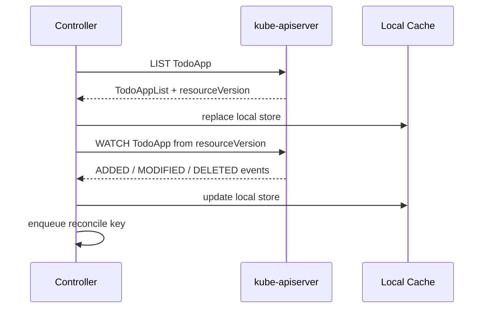
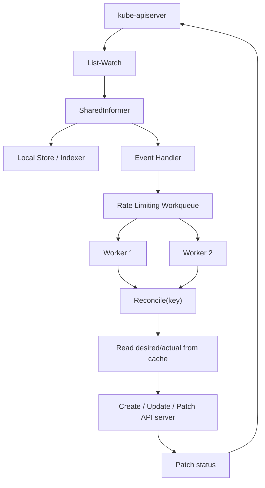
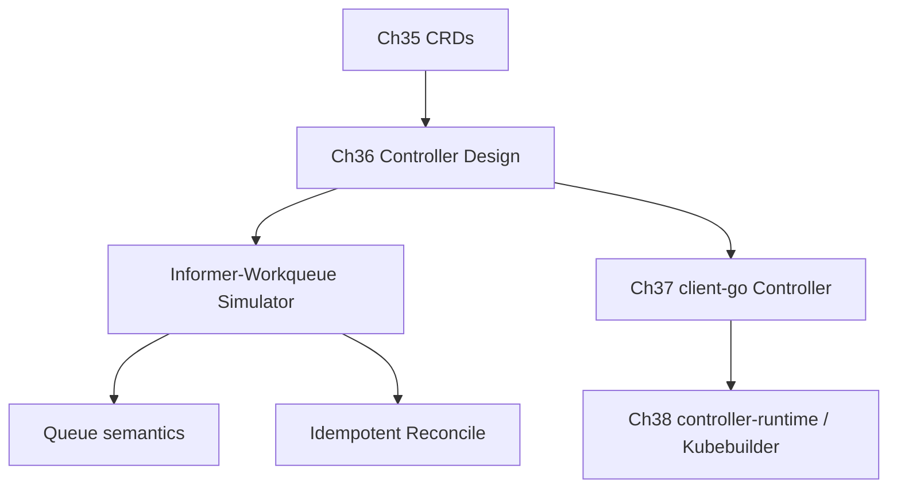

# 第 36 篇：Controller 机制：Informer 与 Workqueue [B]

第 35 篇已经把 `TodoApp`、`TodoDatabase`、`TodoCache` 三个纸面 API 变成了真实 CRD。API server 现在能识别、校验和保存这些对象，但它仍然不会自动创建 Deployment、Service、数据库或缓存。原因很简单：**CRD 定义 API，Controller 执行调谐。**

本篇进入 Controller 的核心机制：Informer 如何把 API server 里的对象变化同步到本地缓存，Workqueue 如何把事件转换成稳定的调谐任务，Reconcile 如何反复把实际状态推向期望状态。学完本篇后，第 37 篇手写 Controller 里的 `Informer -> Workqueue -> Reconcile -> status` 链路就不再是黑盒。

本篇特色项目是：**分析 Todo Operator 的控制循环需求，设计 Watch、Index 和 Reconcile 边界，并编写一个不依赖 client-go 的 Go 模拟程序，观察“事件入队 -> 去重 -> 出队处理 -> 失败重试 -> 幂等调谐”的完整过程。**

## 1. 本章学习目标

### 1.1 知识目标

- 能解释 Kubernetes Controller 为什么是一个持续运行的控制循环。
- 能描述 List-Watch、Reflector、SharedInformer、Store、Lister 之间的协作关系。
- 能说明 Workqueue 为什么要支持去重、延迟、限速和重试。
- 能解释 Reconcile 为什么必须幂等，以及为什么不能只依赖事件本身做业务判断。
- 能对比 client-go 手写 Controller 和 controller-runtime 的 Manager、Client、Scheme、Reconciler 抽象。

### 1.2 技能目标

- 能为 `TodoApp`、`TodoDatabase`、`TodoCache` 设计 Watch 关系和入队 key。
- 能画出 `Informer -> Workqueue -> Worker -> Reconcile` 的数据流图。
- 能编写并运行一个最小 Go 模拟程序，观察队列去重、依赖就绪和失败重试。
- 能识别重复 Reconcile、热点资源、缓存未同步和 Finalizer 阻塞删除等常见问题。

## 2. 本章工作场景与真实案例

### 2.1 技术痛点

如果只有第 35 篇的 CRD，平台仍然只是“能存 YAML”。业务团队创建了下面这个对象：

```yaml
apiVersion: platform.todo.example.com/v1alpha1
kind: TodoApp
metadata:
  name: todo-platform
  namespace: todo-dev
spec:
  image: todo-api:v0.1.2-observability
  replicas: 2
```

API server 会保存它，但不会自动创建 Deployment。真正的自动化必须由 Controller 完成：它要监听 `TodoApp`，读取当前集群状态，创建或更新底层资源，再把结果写回 `status.conditions`。

没有 Controller 机制知识时，常见问题会很快出现：

- 只在创建事件里写逻辑，更新、删除、重启恢复都漏掉。
- 每次事件都直接调用 API server，集群大一点就触发限流。
- Reconcile 不幂等，重复事件导致重复创建资源。
- 依赖资源状态变化没有重新入队，`TodoApp` 永远卡在 `Progressing`。
- Controller 读缓存后立刻期望读到刚写入的对象，遇到缓存延迟就误判失败。

Controller 的价值不是“收到事件就执行一次脚本”，而是把用户声明的期望状态和集群实际状态持续对齐。

### 2.2 团队协作场景

平台工程师负责设计 Controller 的 Watch、Reconcile、status、finalizer 和 RBAC 边界。他们要回答：哪些对象变化会触发 TodoApp 调谐？调谐失败如何重试？什么状态写入 `status.conditions`？删除时如何清理外部资源？

后端工程师或业务团队只提交 `TodoApp`、`TodoDatabase`、`TodoCache` 这类高层声明。他们不关心 Controller 内部使用 Informer 还是 controller-runtime，但他们关心 `kubectl get todoapp` 里是否能看到 Ready 状态，以及失败原因是否清楚。

SRE 负责观察 Controller 运行状态：队列是否积压、Reconcile 是否频繁失败、API server 是否被打爆、leader election 是否正常、删除是否卡 finalizer。生产 Controller 不是写完逻辑就结束，它本身也要被监控、限流、排障和升级。

### 2.3 课程项目关联

本篇承接第 35 篇的三个 CRD，输出第 37 篇手写 Controller 的设计草图：

- `TodoApp` 变化时，Controller 要创建或更新 Deployment、Service、Ingress 和观测配置。
- `TodoDatabase`、`TodoCache` 变化时，可能影响 `TodoApp` 的连接信息和 Ready 状态。
- Deployment、Service、Ingress 等底层资源变化时，也要反向触发拥有者 `TodoApp` 的 Reconcile。
- Controller 每次 Reconcile 后要更新 `status.observedGeneration`、`readyReplicas` 和 `conditions`。

本篇不连接真实 Kubernetes API，也不依赖 client-go。我们先用一个小程序模拟核心思想，把“控制循环”这件事看清楚。第 37 篇再把同样的模型搬进真实 client-go Controller。

项目版本线进入阶段六子版本 `v4.2-controller-design`，它仍属于 `v4.0-operator` 总版本线。

## 3. 核心概念

### 3.1 Controller 是控制循环

Kubernetes 官方把 Controller 描述为持续观察集群状态并在需要时发起变更的控制循环。它不是一次性任务，而是一直运行的后台进程。

最小 Controller 的逻辑可以写成下面这样：

```text
while running:
  desired = read user object spec
  actual = read current cluster state
  diff = compare desired and actual
  if diff exists:
    create/update/delete resources
  update status
```

对 Todo Operator 来说，`desired` 来自 `TodoApp.spec`，`actual` 来自 Deployment、Service、Ingress、TodoDatabase、TodoCache 等对象。Controller 的职责是不断消除两者差异。

### 3.2 List-Watch 是事件来源

Controller 不应该每秒全量扫描 API server。Kubernetes API 提供 List-Watch 模式：

1. 先 List 当前已有对象，拿到完整列表和 `resourceVersion`。
2. 再从该 `resourceVersion` 开始 Watch 后续变化。
3. 如果 Watch 断开或遇到历史版本过旧，就重新 List 再 Watch。

图 36-1 展示 List-Watch 的基本流程：



这里的关键点是：Watch 是为了“知道发生了变化”，不是为了把事件本身当成唯一事实来源。真正做决策时，Reconcile 仍然要从缓存或 API 中读取对象的当前状态。

### 3.3 Informer 是本地缓存和事件分发器

Informer 可以理解为对 List-Watch 的封装。它通常包含几层职责：

| 组件 | 职责 | Todo Operator 示例 |
|---|---|---|
| Reflector | 执行 List-Watch，把事件同步到本地 Store | 监听 `TodoApp` CR |
| Store / Indexer | 保存本地对象缓存，并提供索引 | 按 namespace/name 或 owner 查询 |
| SharedInformer | 让多个处理器共享同一份 Watch 和缓存 | `TodoApp` Controller 和监控逻辑复用 |
| EventHandler | 把 Add/Update/Delete 事件转成队列 key | 入队 `todo-dev/todo-platform` |
| Lister | 从缓存读取对象 | Reconcile 中读取 `TodoApp` |

SharedInformer 的价值是减少 API server 压力。多个消费者可以共享同一份缓存，而不是每个 Controller 都自己 Watch 一遍。

### 3.4 Workqueue 是调谐任务缓冲区

事件不能直接等于 Reconcile 调用。原因有三个：

- 同一个对象可能在很短时间内连续更新，只需要最终调谐一次。
- Reconcile 失败时需要重试，但不能疯狂重试打爆 API server。
- 多个 worker 并发处理时，需要避免同一个 key 被同时处理。

Workqueue 负责把事件变成稳定的任务。典型 key 是 `namespace/name`：

```text
TodoApp event: todo-dev/todo-platform changed
enqueue key:   todo-dev/todo-platform
worker gets:   todo-dev/todo-platform
reconcile:     read current TodoApp and related resources
```

这里入队的是 key，不是完整对象。对象可能已经被更新多次，Reconcile 取当前状态即可。

### 3.5 Reconcile 是幂等调谐函数

Reconcile 的输入通常只有一个 key：

```go
func Reconcile(ctx context.Context, key string) error
```

它应该做到：

- 同样的输入执行多次，不产生重复副作用。
- 对象不存在时正常退出，因为它可能已经被删除。
- 底层资源存在就更新，不存在就创建。
- 状态没有变化时不做无意义写入。
- 失败时返回错误，让队列按策略重试。

幂等不是“不会重复执行”，而是“重复执行也能得到正确结果”。Kubernetes Controller 天生会重复 Reconcile，代码必须接受这一点。

### 3.6 controller-runtime 是更高层封装

第 37 篇会先用 client-go 手写简化 Controller，第 38 篇会使用 Kubebuilder 和 controller-runtime。controller-runtime 把很多底层机制封装成更易用的抽象：

| 抽象 | 作用 | 对应底层概念 |
|---|---|---|
| Manager | 管理 cache、client、scheme、leader election、webhook server | Controller 进程运行时 |
| Client | 读写 Kubernetes 对象 | 读缓存 + 写 API server |
| Scheme | 注册 Go 类型和 GVK 的映射 | 类型识别 |
| Reconciler | 业务调谐函数 | Reconcile |
| Builder | 声明 Watch 哪些资源 | Informer 和 EventHandler |

理解本篇的 Informer 和 Workqueue 后，再看 controller-runtime 就会清楚：它不是魔法，只是把重复样板代码收起来。

## 4. 原理深入

### 4.1 从事件到调谐的数据流

图 36-2 展示一个典型 Controller 的运行路径：



注意两条路径：

- 事件路径：API server -> Informer -> EventHandler -> Workqueue。
- 决策路径：Worker -> Reconcile -> 读取当前状态 -> 写入 API server。

事件只负责唤醒 Reconcile。Reconcile 不应该相信“事件里带的旧对象就是最终状态”。

### 4.2 为什么需要缓存同步

Controller 启动时，Informer 需要先 List 当前对象并填充本地缓存。只有缓存完成初始同步后，Controller 才能安全启动 worker。否则可能出现：

- 队列里已经有 `TodoApp` key，但本地缓存还没有这个对象。
- Reconcile 误以为对象不存在，跳过创建。
- Controller 启动后短时间内状态来回抖动。

因此真实 Controller 常见启动顺序是：

```text
start informer
wait for cache sync
start workers
process queue
```

第 37 篇手写 Controller 会显式调用类似 `WaitForCacheSync` 的逻辑。本篇模拟程序也会用日志标出 cache sync 边界，并在缓存同步后再启动 worker。

### 4.3 Workqueue 如何去重和重试

Workqueue 通常不是简单数组。它至少需要维护三类状态：

| 状态 | 含义 | 作用 |
|---|---|---|
| queued | key 已经在队列中等待处理 | 防止重复入队 |
| processing | key 正在被某个 worker 处理 | 防止并发处理同一个 key |
| dirty | key 在处理期间又发生了变化 | 当前处理结束后再入队一次 |

这套机制解决了一个常见场景：`TodoApp` 在 Reconcile 过程中又被更新。Controller 不会并发处理同一个 key，而是在本轮结束后再处理最新状态。

失败重试通常使用 rate limiting queue：

```text
first failure: retry after 100ms
second failure: retry after 200ms
third failure: retry after 400ms
...
success: forget retry history
```

真实 client-go 的 workqueue 还会组合整体限速和单对象限速，避免热点对象拖垮 Controller。

### 4.4 Reconcile 为什么必须从当前状态出发

假设用户连续执行两次修改：

```bash
kubectl patch todoapp todo-platform -p '{"spec":{"replicas":3}}'
kubectl patch todoapp todo-platform -p '{"spec":{"replicas":5}}'
```

Controller 可能只处理一次队列 key。如果 Reconcile 依赖第一条事件里的 replicas=3，就会创建错误副本数。正确做法是：事件只入队 key，Reconcile 读取当前对象，看到最终 replicas=5，然后调谐。

这也是 Kubernetes Controller 的核心心智模型：

```text
事件不是命令，事件只是提醒：请重新检查实际状态。
```

### 4.5 Todo Operator 的 Watch 设计

对于本课程项目，最小 Watch 设计如下：

| Watch 对象 | 事件来源 | 入队 key | 为什么 |
|---|---|---|---|
| `TodoApp` | 用户创建、修改、删除应用声明 | `namespace/name` | 主资源变化必须调谐 |
| `TodoDatabase` | 数据库契约变化或 Ready 状态变化 | 关联的 `TodoApp` key | 应用连接信息和 Ready 状态依赖数据库 |
| `TodoCache` | 缓存契约变化或 Ready 状态变化 | 关联的 `TodoApp` key | 应用连接信息和 Ready 状态依赖缓存 |
| `Deployment` | 副本状态变化 | owner `TodoApp` key | 回写 `readyReplicas` |
| `Service` | 服务创建、端口变化 | owner `TodoApp` key | 回写访问端点 |
| `Ingress` | 域名或地址变化 | owner `TodoApp` key | 回写 URL |

表中的 owner 或关联关系是 Controller 设计占位，不是凭空存在的魔法。真实实现需要通过 ownerReference、约定 label、字段引用或 `spec.databaseRef` / `spec.cacheRef` 这类显式字段建立反向映射；如果一个数据库被多个 `TodoApp` 共享，还需要一对多索引。

第 37 篇先实现最小版本：监听 `TodoApp`，回写 status。第 38 篇用 Kubebuilder 后，再逐步补全 owner reference、secondary watch 和索引。

### 4.6 Index 的作用

如果 Deployment 变化了，Controller 需要知道它属于哪个 `TodoApp`。最常见方式是 owner reference：

```yaml
metadata:
  ownerReferences:
    - apiVersion: platform.todo.example.com/v1alpha1
      kind: TodoApp
      name: todo-platform
      uid: ...
      controller: true
```

如果没有 owner reference，也可以用 label 或 spec 引用建立索引：

```yaml
metadata:
  labels:
    platform.todo.example.com/app: todo-platform
```

Index 的意义是把“底层资源变化”快速映射回“哪个主资源需要 Reconcile”。没有 Index，Controller 可能需要扫描 namespace 下所有对象，性能和复杂度都会变差。

## 5. 手把手实验

### 5.1 实验目标

本实验会编写一个不依赖 client-go 的 Go 程序，模拟 Todo Operator 的事件入队、队列去重、失败重试和幂等 Reconcile。

预计耗时：75 分钟（动手操作约 45 分钟）。

### 5.2 实验环境

本篇命令默认在 **Cloud Native Todo Platform 应用仓库根目录** 执行。实验不需要连接真实 Kubernetes 集群，只需要 Go 工具链。

| 工具 | 建议版本 | 用途 |
|---|---:|---|
| Go | 1.26.x | 编译运行模拟程序 |
| Git | 2.45+ | 保存实验文件 |
| PowerShell / Bash | 任意现代版本 | 创建目录和运行命令 |

确认环境：

```bash
pwd
go version
git status --short
```

PowerShell：

```powershell
Get-Location
go version
git status --short
```

### 5.3 文件目录结构

创建目录：

```bash
mkdir -p operator/controller-lab
```

PowerShell：

```powershell
New-Item -ItemType Directory -Force -Path operator/controller-lab
```

最终目录：

```text
operator/
└── controller-lab/
    ├── go.mod
    ├── main.go
    └── controller-design.md
```

### 5.4 完整代码或配置

#### 5.4.1 go.mod

下面的 `cat <<EOF` 写文件方式适用于 Linux、macOS、Git Bash 和 WSL。PowerShell 用户可以用编辑器创建同名文件，或用 PowerShell here-string，文件内容保持一致。

创建 `operator/controller-lab/go.mod`：

```bash
cat > operator/controller-lab/go.mod <<'EOF'
module todo-controller-lab

go 1.26
EOF
```

PowerShell 可以使用编辑器创建同名文件，内容保持一致。

#### 5.4.2 最小 Informer-Workqueue 模拟程序

创建 `operator/controller-lab/main.go`：

```bash
cat > operator/controller-lab/main.go <<'GO'
package main

import (
	"fmt"
	"sort"
	"sync"
	"time"
)

type Kind string

const (
	KindTodoApp       Kind = "TodoApp"
	KindTodoDatabase  Kind = "TodoDatabase"
	KindTodoCache     Kind = "TodoCache"
	KindDeployment    Kind = "Deployment"
)

type Event struct {
	At        time.Duration
	Type      string
	Kind      Kind
	Namespace string
	Name      string
	Owner     string
	Replicas  int
	Ready     bool
}

type TodoApp struct {
	Namespace  string
	Name       string
	Generation int64
	Replicas   int
}

func (a TodoApp) Key() string {
	return a.Namespace + "/" + a.Name
}

type ClusterState struct {
	mu              sync.RWMutex
	apps            map[string]TodoApp
	databaseReady   map[string]bool
	cacheReady      map[string]bool
	deploymentReady map[string]int
}

func NewClusterState() *ClusterState {
	return &ClusterState{
		apps:            map[string]TodoApp{},
		databaseReady:   map[string]bool{},
		cacheReady:      map[string]bool{},
		deploymentReady: map[string]int{},
	}
}

func appKey(namespace, name string) string {
	return namespace + "/" + name
}

func (s *ClusterState) ApplyEvent(e Event) (string, bool) {
	s.mu.Lock()
	defer s.mu.Unlock()

	switch e.Kind {
	case KindTodoApp:
		key := appKey(e.Namespace, e.Name)
		if e.Type == "Deleted" {
			delete(s.apps, key)
			return key, true
		}
		old := s.apps[key]
		old.Namespace = e.Namespace
		old.Name = e.Name
		old.Generation++
		if e.Replicas > 0 {
			old.Replicas = e.Replicas
		}
		s.apps[key] = old
		return key, true
	case KindTodoDatabase:
		key := appKey(e.Namespace, e.Owner)
		s.databaseReady[key] = e.Ready
		return key, true
	case KindTodoCache:
		key := appKey(e.Namespace, e.Owner)
		s.cacheReady[key] = e.Ready
		return key, true
	case KindDeployment:
		key := appKey(e.Namespace, e.Owner)
		s.deploymentReady[key] = e.Replicas
		return key, true
	default:
		return "", false
	}
}

func (s *ClusterState) Snapshot(key string) (TodoApp, bool, bool, bool, int) {
	s.mu.RLock()
	defer s.mu.RUnlock()
	app, ok := s.apps[key]
	return app, ok, s.databaseReady[key], s.cacheReady[key], s.deploymentReady[key]
}

type WorkQueue struct {
	mu         sync.Mutex
	cond       *sync.Cond
	queue      []string
	queued     map[string]bool
	processing map[string]bool
	dirty      map[string]bool
	retries    map[string]int
	shutdown   bool
}

func NewWorkQueue() *WorkQueue {
	q := &WorkQueue{
		queued:     map[string]bool{},
		processing: map[string]bool{},
		dirty:      map[string]bool{},
		retries:    map[string]int{},
	}
	q.cond = sync.NewCond(&q.mu)
	return q
}

func (q *WorkQueue) Add(key string) {
	q.mu.Lock()
	defer q.mu.Unlock()

	if q.shutdown {
		return
	}
	if q.processing[key] {
		q.dirty[key] = true
		fmt.Printf("queue: mark dirty %s\n", key)
		return
	}
	if q.queued[key] {
		fmt.Printf("queue: dedupe %s\n", key)
		return
	}
	q.queued[key] = true
	q.queue = append(q.queue, key)
	q.cond.Signal()
	fmt.Printf("queue: add %s\n", key)
}

func (q *WorkQueue) AddAfter(key string, delay time.Duration) {
	fmt.Printf("queue: retry %s after %s\n", key, delay)
	go func() {
		time.Sleep(delay)
		q.mu.Lock()
		_, shouldRetry := q.retries[key]
		q.mu.Unlock()
		if !shouldRetry {
			fmt.Printf("queue: skip stale retry %s\n", key)
			return
		}
		q.Add(key)
	}()
}

func (q *WorkQueue) Get() (string, bool) {
	q.mu.Lock()
	defer q.mu.Unlock()

	for len(q.queue) == 0 && !q.shutdown {
		q.cond.Wait()
	}
	if len(q.queue) == 0 && q.shutdown {
		return "", false
	}
	key := q.queue[0]
	q.queue = q.queue[1:]
	delete(q.queued, key)
	q.processing[key] = true
	return key, true
}

func (q *WorkQueue) Done(key string) {
	q.mu.Lock()
	defer q.mu.Unlock()

	delete(q.processing, key)
	if q.dirty[key] && !q.queued[key] {
		delete(q.dirty, key)
		q.queued[key] = true
		q.queue = append(q.queue, key)
		q.cond.Signal()
		fmt.Printf("queue: re-add dirty %s\n", key)
	}
}

func (q *WorkQueue) RetryDelay(key string) time.Duration {
	q.mu.Lock()
	defer q.mu.Unlock()

	q.retries[key]++
	if q.retries[key] > 5 {
		q.retries[key] = 5
	}
	return time.Duration(q.retries[key]) * 120 * time.Millisecond
}

func (q *WorkQueue) Forget(key string) {
	q.mu.Lock()
	defer q.mu.Unlock()
	delete(q.retries, key)
}

func (q *WorkQueue) Shutdown() {
	q.mu.Lock()
	defer q.mu.Unlock()
	q.shutdown = true
	q.cond.Broadcast()
}

func reconcile(state *ClusterState, key string) error {
	time.Sleep(80 * time.Millisecond)

	app, exists, dbReady, cacheReady, readyReplicas := state.Snapshot(key)
	if !exists {
		fmt.Printf("reconcile %s: TodoApp not found, nothing to do\n", key)
		return nil
	}

	fmt.Printf("reconcile %s: desired replicas=%d generation=%d\n", key, app.Replicas, app.Generation)

	if !dbReady || !cacheReady {
		return fmt.Errorf("dependencies not ready: database=%v cache=%v", dbReady, cacheReady)
	}
	if readyReplicas < app.Replicas {
		return fmt.Errorf("deployment not ready: ready=%d desired=%d", readyReplicas, app.Replicas)
	}

	fmt.Printf("status %s: Available=True observedGeneration=%d readyReplicas=%d\n", key, app.Generation, readyReplicas)
	return nil
}

func startWorker(id int, q *WorkQueue, state *ClusterState, wg *sync.WaitGroup) {
	defer wg.Done()
	for {
		key, ok := q.Get()
		if !ok {
			fmt.Printf("worker-%d: shutdown\n", id)
			return
		}

		fmt.Printf("worker-%d: get %s\n", id, key)
		err := reconcile(state, key)
		q.Done(key)

		if err != nil {
			fmt.Printf("worker-%d: error %s: %v\n", id, key, err)
			q.AddAfter(key, q.RetryDelay(key))
			continue
		}
		q.Forget(key)
	}
}

func sortedKeys(m map[string]bool) []string {
	keys := make([]string, 0, len(m))
	for key := range m {
		keys = append(keys, key)
	}
	sort.Strings(keys)
	return keys
}

func main() {
	state := NewClusterState()
	queue := NewWorkQueue()

	events := []Event{
		{At: 0, Type: "Added", Kind: KindTodoApp, Namespace: "todo-dev", Name: "todo-platform", Replicas: 2},
		{At: 20 * time.Millisecond, Type: "Modified", Kind: KindTodoApp, Namespace: "todo-dev", Name: "todo-platform", Replicas: 3},
		{At: 160 * time.Millisecond, Type: "Modified", Kind: KindTodoDatabase, Namespace: "todo-dev", Name: "todo-postgres", Owner: "todo-platform", Ready: true},
		{At: 260 * time.Millisecond, Type: "Modified", Kind: KindTodoCache, Namespace: "todo-dev", Name: "todo-redis", Owner: "todo-platform", Ready: true},
		{At: 360 * time.Millisecond, Type: "Modified", Kind: KindDeployment, Namespace: "todo-dev", Name: "todo-platform", Owner: "todo-platform", Replicas: 1},
		{At: 520 * time.Millisecond, Type: "Modified", Kind: KindDeployment, Namespace: "todo-dev", Name: "todo-platform", Owner: "todo-platform", Replicas: 3},
	}

	var wg sync.WaitGroup
	fmt.Println("informer: list initial TodoApp objects")
	time.Sleep(40 * time.Millisecond)
	fmt.Println("informer: cache synced, start workers")
	wg.Add(1)
	go startWorker(1, queue, state, &wg)

	start := time.Now()
	for _, event := range events {
		time.Sleep(event.At - time.Since(start))
		key, ok := state.ApplyEvent(event)
		fmt.Printf("event: %s %s/%s kind=%s -> key=%s\n", event.Type, event.Namespace, event.Name, event.Kind, key)
		if ok {
			queue.Add(key)
		}
	}

	time.Sleep(900 * time.Millisecond)

	state.mu.RLock()
	keys := sortedKeys(state.databaseReady)
	state.mu.RUnlock()
	fmt.Printf("known app keys from dependency index: %v\n", keys)

	queue.Shutdown()
	wg.Wait()
}
GO
```

这段程序模拟了几件事：

- Informer 先完成初始 List 和 cache sync，再启动 worker。
- Informer 收到不同资源事件后，只把 `namespace/name` key 放进队列。
- 同一个 key 多次入队会被去重。
- Reconcile 失败后按延迟重试。
- 依赖数据库、缓存和 Deployment 都 Ready 后，最终写出 Available 状态。

为保持输出可读，本程序用 `queue: skip stale retry` 跳过成功后残留的延迟重试，这是教学模拟中的简化。真实生产代码应直接使用 client-go workqueue 或 controller-runtime 队列，并以官方实现的去重、限速和重试语义为准。

#### 5.4.3 Controller 需求分析文档

创建 `operator/controller-lab/controller-design.md`：

```bash
cat > operator/controller-lab/controller-design.md <<'EOF'
# Todo Operator Controller Design

## Primary resource

- TodoApp

## Secondary resources

- TodoDatabase
- TodoCache
- Deployment
- Service
- Ingress

## Queue key

- namespace/name of TodoApp

## Watch rules

| Resource | Enqueue key | Reason |
|---|---|---|
| TodoApp | self namespace/name | User changed desired app state |
| TodoDatabase | owner TodoApp key | Database readiness affects TodoApp |
| TodoCache | owner TodoApp key | Cache readiness affects TodoApp |
| Deployment | owner TodoApp key | Replica readiness affects TodoApp status |
| Service | owner TodoApp key | Service endpoint affects TodoApp status |
| Ingress | owner TodoApp key | URL affects TodoApp status |

## Reconcile steps

1. Get TodoApp from cache.
2. If TodoApp is missing, return success.
3. Ensure finalizer if external cleanup is needed.
4. Ensure Deployment, Service, Ingress.
5. Read TodoDatabase and TodoCache readiness.
6. Patch TodoApp status.conditions.
7. Return retry on transient errors.

## Required indexes

- Deployment owner -> TodoApp key
- Service owner -> TodoApp key
- Ingress owner -> TodoApp key
- TodoDatabase reference -> TodoApp key
- TodoCache reference -> TodoApp key
EOF
```

### 5.5 执行命令

进入实验目录：

```bash
cd operator/controller-lab
```

格式化并运行程序：

```bash
go fmt ./...
go run .
```

查看设计文档：

```bash
cat controller-design.md
```

PowerShell：

```powershell
Get-Content controller-design.md
```

为什么要先做模拟程序：真实 client-go Controller 有 Informer、Indexer、Workqueue、Scheme、typed client 等样板代码，新手容易被 API 淹没。本实验把 Kubernetes 外壳拿掉，只保留控制循环本质。

### 5.6 预期输出

运行 `go run .` 后，输出类似下面这样：

```text
informer: list initial TodoApp objects
informer: cache synced, start workers
event: Added todo-dev/todo-platform kind=TodoApp -> key=todo-dev/todo-platform
queue: add todo-dev/todo-platform
worker-1: get todo-dev/todo-platform
event: Modified todo-dev/todo-platform kind=TodoApp -> key=todo-dev/todo-platform
queue: mark dirty todo-dev/todo-platform
reconcile todo-dev/todo-platform: desired replicas=3 generation=2
queue: re-add dirty todo-dev/todo-platform
worker-1: error todo-dev/todo-platform: dependencies not ready: database=false cache=false
queue: retry todo-dev/todo-platform after 120ms
worker-1: get todo-dev/todo-platform
reconcile todo-dev/todo-platform: desired replicas=3 generation=2
...
status todo-dev/todo-platform: Available=True observedGeneration=2 readyReplicas=3
queue: skip stale retry todo-dev/todo-platform
known app keys from dependency index: [todo-dev/todo-platform]
worker-1: shutdown
```

具体行顺序可能因 goroutine 调度略有差异，但应该能看到四类关键信息：

- event 把不同资源变化映射成同一个 TodoApp key。
- queue 对重复 key 做去重或 dirty 标记。
- reconcile 在依赖未 Ready 时失败并重试。
- 依赖全部 Ready 后 status 变成 Available。

### 5.7 验证方法

**第一层：程序可运行**

```bash
go run .
```

判断标准：程序最终输出 `Available=True` 和 `worker-1: shutdown`。

**第二层：队列 key 正确**

```bash
go run . | grep -- '-> key=todo-dev/todo-platform'
```

判断标准：`TodoApp`、`TodoDatabase`、`TodoCache`、`Deployment` 事件都能映射到 `todo-dev/todo-platform`。

**第三层：重试逻辑生效**

```bash
go run . | grep 'queue: retry'
```

判断标准：依赖未就绪时至少出现一次 retry。

**第四层：设计文档完整**

```bash
grep -n 'Watch rules\|Reconcile steps\|Required indexes' controller-design.md
```

判断标准：设计文档包含 Watch、Reconcile 和 Index 三部分。

### 5.8 清理步骤

如果只想删除实验文件：

```bash
cd ../..
rm -rf operator/controller-lab
```

PowerShell：

```powershell
Set-Location ../..
Remove-Item -Recurse -Force operator/controller-lab
```

如果你准备继续第 37 篇，建议保留 `operator/controller-lab/controller-design.md`，它会成为手写 Controller 的设计输入。

## 6. 常见错误与排障

本节排查命令默认在 Cloud Native Todo Platform 应用仓库根目录执行。如果你还停留在 `operator/controller-lab` 目录，可以先执行 `cd ../..`。

### 错误 1：把事件对象当成最终状态

- **现象**：Controller 收到 `replicas=2` 的旧事件后创建 2 个副本，但用户已经把 `replicas` 改成 3。
- **原因**：Reconcile 使用事件里携带的旧对象，而不是用 key 重新读取当前状态。
- **排查**：

  ```bash
  grep -n 'reconcile' operator/controller-lab/main.go
  ```

  重点看 Reconcile 是否从缓存或 API 读取当前对象，而不是直接消费事件对象。

- **修复**：事件处理器只入队 `namespace/name`，Reconcile 开始时重新读取当前对象。
- **预防**：记住“事件只是提醒，不是命令”。

### 错误 2：队列没有去重导致重复调谐风暴

- **现象**：同一个 `TodoApp` 高频更新时，日志里出现大量重复 Reconcile，API server QPS 快速上升。
- **原因**：使用普通 channel 或 slice 直接承接事件，没有 queued、processing、dirty 状态。
- **排查**：

  ```bash
  go run ./operator/controller-lab | grep 'queue: dedupe\|queue: mark dirty'
  ```

  如果完全没有去重或 dirty 日志，说明队列模型太简单。

- **修复**：使用 client-go workqueue，或实现等价的去重状态机。
- **预防**：生产 Controller 不要用裸 channel 代替 workqueue。

### 错误 3：依赖资源变化没有重新入队

- **现象**：Deployment 已经 Ready，但 `TodoApp.status.readyReplicas` 长时间不更新。
- **原因**：Controller 只 Watch `TodoApp`，没有 Watch Deployment 或没有把 Deployment 映射回 owner TodoApp key。
- **排查**：

  ```bash
  grep -n 'KindDeployment\|Owner' operator/controller-lab/main.go
  ```

  检查底层资源事件是否能映射到主资源 key。

- **修复**：为底层资源设置 owner reference 或 label index，并在事件处理器里入队对应 TodoApp。
- **预防**：设计 Controller 时同时列出 primary resource 和 secondary resource。

### 错误 4：Reconcile 不幂等

- **现象**：重复运行 Reconcile 后创建多个同名外部资源，或反复 patch status 导致事件循环。
- **原因**：代码只会 create，不会先 get/update；或者无变化时仍然写 status。
- **排查**：

  ```bash
  grep -n 'Ensure\|Patch\|status' operator/controller-lab/controller-design.md
  ```

  检查设计是否包含“存在则更新、无变化则跳过”的判断。

- **修复**：把每一步写成 Ensure 语义：期望存在则创建或更新，期望不存在则删除，状态无变化则不写。
- **预防**：本地测试时连续执行同一个 Reconcile，用第二次执行验证无副作用。

### 错误 5：Finalizer 阻塞删除

- **现象**：删除 CR 后对象一直处于 `Terminating`，`metadata.finalizers` 不为空。
- **原因**：Controller 添加了 finalizer，但删除逻辑失败或没有移除 finalizer。
- **排查**：

  ```bash
  kubectl -n todo-dev get todoapp todo-platform -o jsonpath='{.metadata.finalizers}{"\n"}'
  kubectl -n todo-dev describe todoapp todo-platform
  ```

  如果对象有 `deletionTimestamp` 且 finalizer 长时间不消失，就要检查 Controller 删除分支。

- **修复**：确保外部资源清理成功后移除 finalizer；清理失败时写清楚 `status.conditions` 或 Event。
- **预防**：给 finalizer 分支加超时、重试、告警和人工恢复文档。

## 7. 生产环境注意事项

1. **不要让 Controller 直接压垮 API server**。生产 Controller 应使用 Informer 缓存读取对象，减少高频 GET/LIST；写操作要合并无意义 patch，配置合理 QPS/Burst，并使用 workqueue 限速。热点资源或错误重试风暴会造成 API server 压力，严重时影响整个集群控制面。

2. **Reconcile 必须能接受重复、乱序和延迟**。Watch 事件可能断开重连，缓存也可能短暂滞后。Controller 不能假设事件只来一次、按业务顺序到达，或写入后立刻从缓存读到最新对象。正确设计是从当前状态出发，重复执行也不会产生错误副作用。

3. **status 是排障接口，不是日志垃圾桶**。Controller 应写清楚 `observedGeneration`、`conditions.type`、`reason`、`message` 和关键 Ready 数字。不要每次循环都写 status，否则会制造额外 update 事件。只有状态真正变化时才 patch。

4. **Finalizer 要有失败恢复方案**。凡是创建外部资源、云资源或跨 namespace 资源的 Controller，都可能需要 finalizer。生产环境必须说明删除卡住时怎么查、怎么重试、怎么人工清理，以及什么情况下可以安全移除 finalizer。

5. **Controller 自身也要可观测**。至少要暴露 Reconcile 次数、错误次数、队列长度、队列延迟、单次 Reconcile 耗时和 worker 数。阶段五已经建设了 Prometheus/Grafana/Loki/Tempo，后续 Operator 也要接入同一套观测体系。

官方参考：

- [Kubernetes Controllers](https://kubernetes.io/docs/concepts/architecture/controller/)
- [Kubernetes API Concepts: Efficient detection of changes](https://kubernetes.io/docs/reference/using-api/api-concepts/)
- [client-go workqueue package](https://pkg.go.dev/k8s.io/client-go/util/workqueue)
- [controller-runtime package](https://pkg.go.dev/sigs.k8s.io/controller-runtime)

## 8. 本章小项目

### 8.1 项目产出

本章完成 Todo Operator 控制循环设计，产出：

- `operator/controller-lab/go.mod`
- `operator/controller-lab/main.go`
- `operator/controller-lab/controller-design.md`

图 36-3 展示本章产物和后续章节的关系：



### 8.2 能力验收标准

| 能力 | 验收标准 |
|---|---|
| 控制循环 | 能画出 Informer、Workqueue、Worker、Reconcile 的关系 |
| 缓存机制 | 能解释 List-Watch、resourceVersion、缓存同步的作用 |
| 队列机制 | 能说明去重、dirty、重试和限速的意义 |
| Reconcile 设计 | 能为 TodoApp 写出幂等 Reconcile 步骤 |
| Watch 设计 | 能列出 TodoApp 的 primary 和 secondary resources |
| 实验运行 | 能运行模拟程序并观察 Available=True 输出 |

## 9. 本章练习题

**基础题**

1. Controller 为什么不能只处理创建事件？
2. Informer 缓存解决了什么问题？它带来了什么新问题？
3. Workqueue 为什么通常只保存 `namespace/name`，而不是保存完整对象？
4. 什么是 `dirty` key？它解决什么并发问题？
5. Reconcile 幂等和 HTTP 幂等有什么相似点？

**实操题**

1. 修改模拟程序，把 `Deployment` Ready 事件从 `Replicas: 3` 改成 `Replicas: 2`。验收标准：程序不会输出 `Available=True`。
2. 再增加一个 `TodoApp`，名字为 `todo-admin`。验收标准：队列能处理两个不同 key。
3. 把 `TodoDatabase` 事件删除。验收标准：程序会持续重试，并能解释为什么。

**思考题**

1. 如果 `TodoDatabase` 被多个 `TodoApp` 共享，Index 应该如何设计？
2. 如果 Controller 写 status 又触发自己 Reconcile，如何避免无意义循环？
3. 为什么 controller-runtime 默认 client “读缓存、写 API server” 对新手来说容易造成误解？

## 10. 本章面试题

### 面试题 1：Informer 和 Watch 有什么区别？

**一句话结论**：Watch 是 API server 提供的事件流，Informer 是客户端对 List-Watch、缓存和事件分发的封装。

**展开解释**：Watch 只告诉你对象变化；Informer 会先 List 初始对象，再 Watch 增量变化，并维护本地 Store。多个处理器可以共享 SharedInformer，减少 API server 压力。

**深入追问**：为什么要等 cache sync？因为 worker 启动前必须确认本地缓存已有初始状态，否则 Reconcile 可能误判对象不存在。

### 面试题 2：Workqueue 为什么不直接处理事件？

**一句话结论**：队列把不稳定的事件流转换成可控的调谐任务。

**展开解释**：Workqueue 支持去重、限速、延迟重试和并发控制。同一个对象多次变化时，Controller 只需要处理最终状态。失败时也不能立刻无限重试，而要按退避策略重新入队。

**深入追问**：为什么队列 key 通常是 `namespace/name`？因为 Reconcile 应读取当前状态，而不是依赖事件里的旧对象。

### 面试题 3：什么是幂等 Reconcile？

**一句话结论**：同一个 Reconcile 运行多次，最终结果仍然正确，不产生重复副作用。

**展开解释**：幂等 Reconcile 会先读取当前状态，再决定创建、更新、删除或跳过。资源已存在时更新，不存在时创建；status 没变化时不重复 patch。

**深入追问**：如何测试幂等？连续调用两次 Reconcile，第二次不应创建新资源，也不应产生无意义更新。

### 面试题 4：secondary resource 变化如何触发主资源 Reconcile？

**一句话结论**：通过 owner reference、label index 或字段索引，把底层资源事件映射回主资源 key。

**展开解释**：Deployment Ready 状态变化会影响 `TodoApp.status.readyReplicas`，所以 Deployment 事件也要入队对应 TodoApp。没有这种反向映射，主资源状态会滞后。

**深入追问**：什么时候 owner reference 不够？跨 namespace、外部云资源或共享依赖资源通常不能只靠 owner reference，需要显式索引或引用关系。

### 面试题 5：controller-runtime 的 Manager 解决了什么问题？

**一句话结论**：Manager 统一管理 Controller 运行所需的 cache、client、scheme、leader election 和生命周期。

**展开解释**：手写 client-go Controller 要自己创建 Informer、Workqueue、worker 和信号处理。controller-runtime 把这些通用能力封装起来，让开发者专注 Reconcile 业务逻辑。

**深入追问**：controller-runtime client 为什么可能读到旧数据？默认 client 通常读缓存、写 API server，缓存同步存在延迟，所以 Controller 不能依赖强读写一致性。

## 11. 本章总结

本篇把第 35 篇的 CRD API 推进到了 Controller 控制循环。你理解了 Controller 为什么要通过 List-Watch 和 Informer 获取变化，为什么要用 Workqueue 把事件变成可控任务，也理解了 Reconcile 为什么必须幂等。

实践上，你编写了一个不依赖 client-go 的 Go 模拟程序，观察到了 TodoApp、TodoDatabase、TodoCache 和 Deployment 事件如何映射到同一个 Reconcile key，依赖未就绪时如何重试，最终 Ready 后如何输出 Available 状态。

能力上，你已经能为 Todo Operator 设计 Watch、Index 和 Reconcile 步骤。下一篇就可以把这些设计落实到真实 Kubernetes 集群里，用 client-go 手写一个最小 Controller。

## 12. 下一章衔接

下一篇第 37 篇会进入手写简化版 Controller。我们会把本篇的模拟程序替换成真实 client-go 组件：

- 用 `SharedInformerFactory` 或动态 Informer 监听 `TodoApp`。
- 用 workqueue 承接 `namespace/name` key。
- 用 worker 循环调用 Reconcile。
- 用 Kubernetes client 回写 `TodoApp.status.conditions`。
- 把 Controller 部署到 kind 集群，并创建 CR 端到端验证。

完成第 37 篇后，你会真正拥有一个可以运行在 Kubernetes 集群中的 TodoApp Controller。
