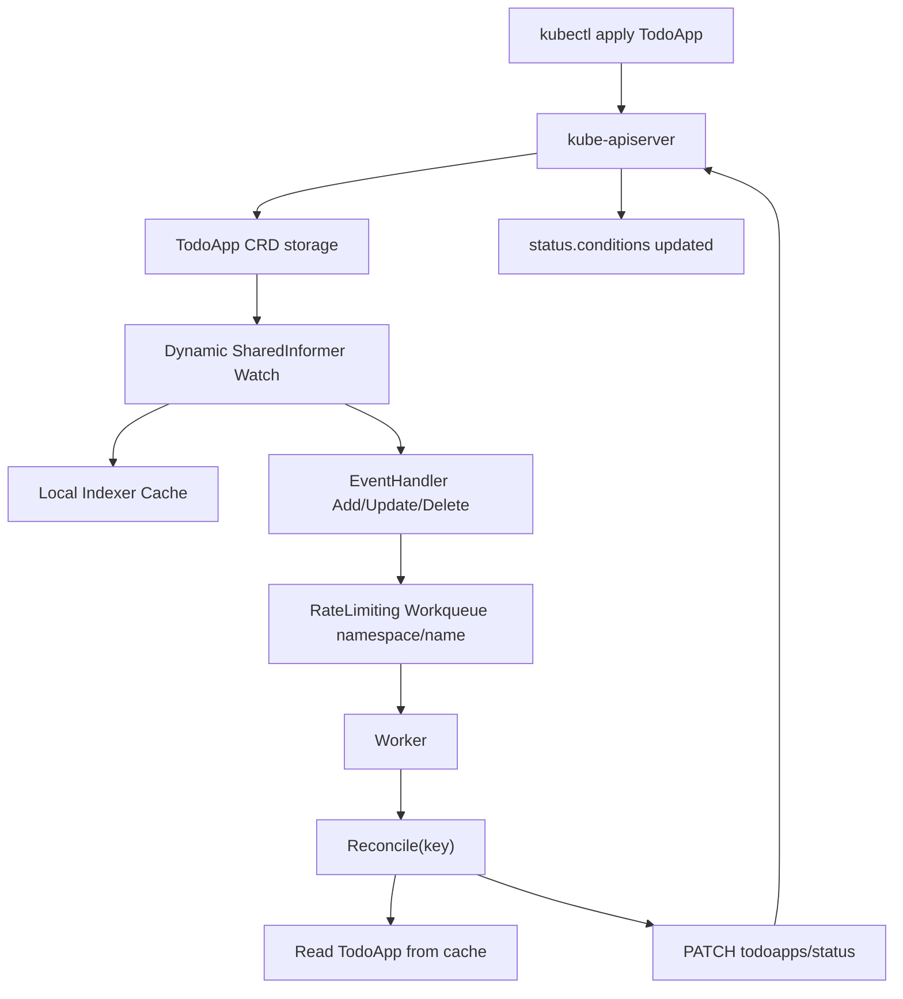
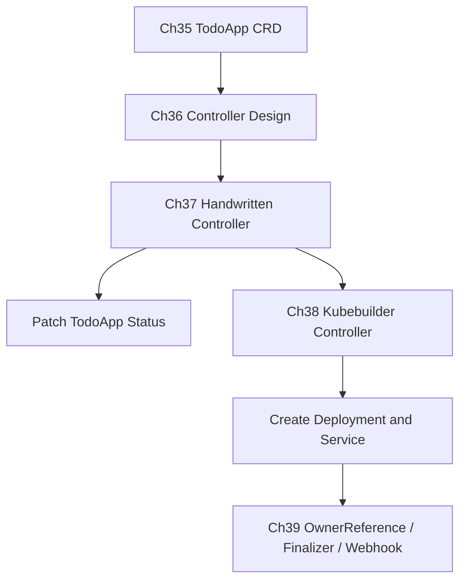

# 第 37 篇：手写简化版 Controller [C]

第 35 篇已经把 `TodoApp`、`TodoDatabase`、`TodoCache` 注册成真实 CRD，第 36 篇已经把 `Informer -> Workqueue -> Reconcile` 的控制循环拆开讲清楚。本篇把这条链路放回真实 Kubernetes 集群：不用 Kubebuilder，不用代码生成，直接用 client-go 手写一个最小 `TodoApp` Controller。

本篇特色项目是：**编写并部署一个手写 TodoApp Controller，监听 `platform.todo.example.com/v1alpha1` 的 `TodoApp` 资源，将事件放入 workqueue，执行 Reconcile，并通过 `/status` 子资源回写 `status.conditions`。**

这不是生产版 Operator。它不会创建 Deployment、Service、Ingress，也不会处理 OwnerReference 和 Finalizer；这些会留给第 38-39 篇。本篇只做一件事：让学习者亲手看见真实 client-go Controller 如何从 Watch 事件走到 status 回写。

## 1. 本章学习目标

### 1.1 知识目标

- 能解释动态客户端、GVR、SharedInformer、Indexer、Workqueue 在手写 Controller 中的分工。
- 能描述 `TodoApp` 事件从 API server 到 Reconcile 再到 `/status` patch 的完整路径。
- 能说明为什么本篇使用 dynamic client，而不是提前引入 Go 类型生成和 typed client。
- 能区分主资源写入、status 子资源写入、RBAC 权限三者的边界。
- 能解释第 37 篇手写版和第 38 篇 Kubebuilder 版的职责差异。

### 1.2 技能目标

- 能独立搭建 `operator/handwritten/` Go 项目并引入 `client-go v0.36.1`。
- 能编写 `main.go` 创建 kubeconfig、dynamic client、SharedInformerFactory 和 cache sync。
- 能编写 `controller.go` 实现事件入队、worker 出队、失败重试和 Reconcile。
- 能编写最小 RBAC 与 Deployment，把 Controller 部署到 kind 集群。
- 能创建 `TodoApp` CR 并验证 Controller 自动回写 `status.conditions`。

## 2. 本章工作场景与真实案例

### 2.1 技术痛点

很多团队第一次写 Operator 时会直接打开 Kubebuilder 模板，然后面对一堆 `scheme`、`manager`、`reconcile.Request`、`client.Client` 和 marker。代码能跑，但心里很虚：到底是谁在 Watch？谁在排队？失败后谁重试？为什么 status 要单独授权？

本篇故意不用 Kubebuilder。我们手写最少的 Controller 结构，让每个动作都暴露出来：

- `dynamicinformer` 负责 Watch `TodoApp`。
- `cache.WaitForCacheSync` 保证 worker 启动前本地缓存已经同步。
- `workqueue` 把事件 key 排队并处理失败重试。
- `reconcile` 从缓存读取当前对象，而不是相信事件旧对象。
- `dynamicClient.Resource(gvr).Namespace(ns).Patch(..., "status")` 只回写 status。

没有这层理解时，后面写 Kubebuilder 很容易把框架当魔法。一旦遇到权限、缓存延迟、重复 Reconcile 或 status 写不进去，排障会很被动。

### 2.2 团队协作场景

平台工程师负责编写和维护 Controller。他们需要把第 36 篇的控制循环设计落到代码里，并给 SRE 提供清晰日志、RBAC、部署方式和回滚步骤。

后端工程师或业务团队只提交 `TodoApp` YAML。他们期待平台自动处理生命周期，不关心内部使用 client-go 还是 controller-runtime；但他们会通过 `kubectl get todoapp` 和 `kubectl describe todoapp` 判断平台是否接受了声明。

SRE 负责部署 Controller、观察日志、确认 status 是否回写、定位 RBAC 权限不足、cache sync 失败或 queue 重试风暴。生产中 Controller 本身也属于关键控制面组件，不能只按普通业务 Pod 对待。

### 2.3 课程项目关联

本篇承接第 35-36 篇，产出第一个能运行在 Kubernetes 集群中的 TodoApp Controller：

- 输入：`operator/crds/base/todoapps.platform.todo.example.com.yaml` 和 `operator/handwritten/samples/todoapp.yaml`。
- 代码：`operator/handwritten/main.go`、`operator/handwritten/controller.go`。
- 部署：`operator/handwritten/manifests/rbac.yaml`、`operator/handwritten/manifests/deployment.yaml`。
- 输出：`TodoApp.status.observedGeneration` 和 `TodoApp.status.conditions` 由 Controller 自动回写。

项目版本线进入阶段六子版本 `v4.3-handwritten-controller`，它仍属于 `v4.0-operator` 总版本线。第 38 篇会用 Kubebuilder 重写同一件事，并开始自动创建 Deployment 与 Service。

## 3. 核心概念

### 3.1 为什么本篇使用 dynamic client

client-go 有两类常见客户端：

| 客户端 | 使用前提 | 优点 | 代价 |
|---|---|---|---|
| typed client | 已有 Go 类型、Scheme、clientset | 类型安全，字段访问舒服 | 需要代码生成或手写类型 |
| dynamic client | 只知道 GVR 和 JSON 结构 | 不需要代码生成，适合教学和通用工具 | 字段访问要用 `unstructured` |

本篇目标是理解 Controller 本质，不是提前学习代码生成。因此我们使用 dynamic client 操作 `unstructured.Unstructured`。

TodoApp 的 GVR 是：

```go
var todoAppGVR = schema.GroupVersionResource{
	Group:    "platform.todo.example.com",
	Version:  "v1alpha1",
	Resource: "todoapps",
}
```

这对应第 35 篇 CRD 里的：

```yaml
spec:
  group: platform.todo.example.com
  names:
    plural: todoapps
  versions:
    - name: v1alpha1
```

写 Controller 时要特别注意：YAML 里的 `kind: TodoApp` 是 GVK 视角；dynamic client 操作 API 时使用的是 GVR，也就是复数资源名 `todoapps`。

### 3.2 SharedInformer 监听自定义资源

SharedInformer 负责把 API server 中的对象变化同步到本地缓存，并把事件分发给处理函数。对于 dynamic client，创建 Informer 的核心代码是：

```go
factory := dynamicinformer.NewFilteredDynamicSharedInformerFactory(
	dynamicClient,
	10*time.Minute,
	namespace,
	nil,
)
informer := factory.ForResource(todoAppGVR).Informer()
```

`10*time.Minute` 是 resync period。它不是每 10 分钟重新全量 List API server，而是周期性把缓存中的对象重新送回事件处理链路，让 Controller 有机会重新检查漂移。

### 3.3 Workqueue 只保存 key

Informer 收到事件后，不把整个对象塞进队列，而是只保存 `namespace/name`：

```go
key, err := cache.DeletionHandlingMetaNamespaceKeyFunc(obj)
queue.Add(key)
```

原因是 Reconcile 应该读取当前状态。事件里的对象可能已经过期，尤其是用户短时间连续修改 `spec.replicas` 时，Controller 只需要处理最终状态。

本篇使用 client-go 1.36 的 typed workqueue：

```go
queue := workqueue.NewTypedRateLimitingQueueWithConfig(
	workqueue.DefaultTypedControllerRateLimiter[string](),
	workqueue.TypedRateLimitingQueueConfig[string]{Name: "todoapp"},
)
```

它支持去重、延迟重试、限速和 `Forget` 清理重试历史。第 36 篇自己模拟的 `queued / processing / dirty` 状态，在这里由 client-go 官方队列实现。

### 3.4 Reconcile 的最小职责

本篇的 Reconcile 只做四步：

1. 根据队列 key 从 Informer 缓存读取最新 `TodoApp`。
2. 如果对象已经删除，正常返回。
3. 从 `spec.image` 和 `spec.replicas` 计算本次观察结果。
4. 通过 `/status` 子资源 patch `status.observedGeneration` 与 `status.conditions`。

它不会创建 Deployment，也不会设置 OwnerReference。这样做是为了让本篇聚焦在 client-go 控制循环，避免一次塞进太多 Operator 机制。

### 3.5 status 子资源和 RBAC

第 35 篇已经为 `TodoApp` 开启了：

```yaml
subresources:
  status: {}
```

这意味着 Controller 回写状态时要请求：

```text
PATCH /apis/platform.todo.example.com/v1alpha1/namespaces/todo-dev/todoapps/todo-platform/status
```

RBAC 也要分别授权：

```yaml
resources:
  - todoapps
verbs:
  - get
  - list
  - watch
---
resources:
  - todoapps/status
verbs:
  - get
  - patch
  - update
```

能读取主资源，不代表能写 status；能写主资源，也不应该顺手改 spec。这个边界是 Operator 权限最小化的起点。

### 3.6 本篇与 Kubebuilder 的关系

第 38 篇 Kubebuilder 会把很多手写代码藏起来：

| 本篇手写代码 | Kubebuilder/controller-runtime 对应能力 |
|---|---|
| `dynamicinformer.NewFilteredDynamicSharedInformerFactory` | Manager 管理 cache |
| `informer.AddEventHandler` | Builder 声明 `For(&TodoApp{})` |
| `workqueue.TypedRateLimitingInterface` | controller-runtime 内置队列 |
| `cache.WaitForCacheSync` | Manager 启动时统一同步缓存 |
| 手写 `Patch(..., "status")` | `r.Status().Patch(...)` |

学完本篇后再看 Kubebuilder，你会知道它省掉的是样板代码，不是省掉 Controller 的基本原则。

## 4. 原理深入

### 4.1 端到端数据流

图 37-1 展示本篇 Controller 的完整运行路径。



关键点是：事件处理器只负责入队；真正的业务判断发生在 Reconcile 中；状态写入必须走 `/status` 子资源。

### 4.2 启动顺序为什么重要

Controller 正确启动顺序是：

```text
create dynamic client
create informer and event handler
start informer factory
wait for cache sync
start workers
process queue
```

如果不等 cache sync 就启动 worker，第一次 Reconcile 可能从缓存里读不到刚刚 List 到的对象，误以为对象已经删除。第 36 篇用日志模拟了这个边界，本篇用真实的：

```go
factory.Start(ctx.Done())
if ok := cache.WaitForCacheSync(ctx.Done(), informer.HasSynced); !ok {
	log.Fatal("wait for cache sync failed")
}
```

### 4.3 为什么 Delete 事件也要入队

即使本篇删除分支只是打印日志，也要把 Delete 事件纳入队列。真实 Controller 删除对象时可能要：

- 清理外部云资源。
- 移除 finalizer。
- 删除或确认子资源已级联删除。
- 停止不再需要的定时任务。

本篇先保留删除事件处理框架，第 39 篇再把 finalizer 和 OwnerReference 补全。

### 4.4 本篇 status 为什么不写 Available=True

本篇 Controller 只证明“我看到了 TodoApp 并完成了 Reconcile”，还没有创建 Deployment、Service 或 Ingress。生产上不能在没有验证底层工作负载的情况下写 `Available=True`。

所以本篇写入两条 condition：

| type | status | reason | 含义 |
|---|---|---|---|
| `Progressing` | `True` | `Reconciled` | 手写 Controller 已观察并接受本次 spec |
| `Available` | `False` | `WorkloadNotCreated` | 真正工作负载创建留到第 38 篇 |

这比为了“看起来成功”而写 `Available=True` 更接近真实平台工程习惯。

还有两个 status 细节要从一开始养成习惯：如果期望 status 和当前 status 完全一致，就不要再 patch；`lastTransitionTime` 只应该在 condition 状态真正切换时变化，不能每次 Reconcile 都刷新时间。否则 status 写入会触发 Update 事件，Update 事件又触发下一次 Reconcile，轻则日志噪声变大，重则形成无意义的热循环。

### 4.5 失败重试路径

Reconcile 返回错误时，本篇通过 rate limiting queue 重试：

```go
if c.queue.NumRequeues(key) < 5 {
	c.queue.AddRateLimited(key)
	return true
}
c.queue.Forget(key)
```

这解决两个问题：短暂错误会被自动重试，持续错误不会无限热循环。生产版本还会把失败次数、队列长度和 Reconcile 耗时暴露为 Prometheus 指标；第 41 篇会补这部分。

## 5. 手把手实验

### 5.1 实验目标

本实验会手写一个 client-go Controller，部署到 kind 集群，创建 `TodoApp` CR 后自动回写 `status.conditions`。

预计耗时：120 分钟（动手操作约 80 分钟）。

### 5.2 实验环境

本篇命令默认在 **Cloud Native Todo Platform 应用仓库根目录** 执行，并继续使用第 30-36 篇的 `todo-gitops` kind 集群。课程蓝图 Kubernetes 基线为 1.36.x；如果你沿用阶段五环境，集群可能是 v1.35.0。本篇使用的 CRD、Informer、Workqueue、status subresource 都是稳定能力，v1.35 和 v1.36 均可执行。

| 工具 | 建议版本 | 用途 |
|---|---:|---|
| Go | 1.26.x | 编译 Controller |
| Kubernetes | v1.35.0 或 v1.36.x | 运行 CRD 与 Controller |
| kubectl | 与集群 minor 版本保持 ±1 | 安装 CRD、查看 status |
| kind | 0.30+ | 本地集群与镜像加载 |
| Docker | 28+ | 构建 Controller 镜像 |
| Git Bash / WSL / PowerShell | 任意现代版本 | 创建文件和执行命令 |

确认环境：

```bash
git status --short
go version
kubectl config current-context
kubectl version --client
kind get clusters
docker version
```

PowerShell：

```powershell
git status --short
go version
kubectl config current-context
kubectl version --client
kind get clusters
docker version
```

如果 `kind get clusters` 输出为空，请先按前文创建 kind 集群。若集群名称不是 `todo-gitops`，后文 `kind load docker-image --name todo-gitops` 要替换成自己的集群名。

### 5.3 文件目录结构

创建目录：

```bash
mkdir -p operator/handwritten/manifests operator/handwritten/samples
```

PowerShell：

```powershell
New-Item -ItemType Directory -Force -Path operator/handwritten/manifests,operator/handwritten/samples
```

最终目录：

```text
operator/
├── crds/
│   └── base/
│       └── todoapps.platform.todo.example.com.yaml
└── handwritten/
    ├── go.mod
    ├── main.go
    ├── controller.go
    ├── Dockerfile
    ├── manifests/
    │   ├── rbac.yaml
    │   └── deployment.yaml
    └── samples/
        └── todoapp.yaml
```

### 5.4 完整代码或配置

下面的 here-doc 写文件方式适用于 Linux、macOS、Git Bash 和 WSL。PowerShell 用户可以用编辑器创建同名文件，或使用 PowerShell here-string，文件内容保持一致；如果本机装了 Git Bash 或 WSL，直接在其中执行 here-doc 命令会更省事。

本节会创建 7 个文件：

| 文件 | 作用 |
|---|---|
| `operator/handwritten/go.mod` | Go 模块与 client-go 依赖 |
| `operator/handwritten/main.go` | 构建 kubeconfig、dynamic client、informer 和启动流程 |
| `operator/handwritten/controller.go` | 事件入队、worker、Reconcile 与 status patch |
| `operator/handwritten/Dockerfile` | 构建可部署到集群的 Controller 镜像 |
| `operator/handwritten/manifests/rbac.yaml` | ServiceAccount、Role、RoleBinding |
| `operator/handwritten/manifests/deployment.yaml` | Controller Deployment |
| `operator/handwritten/samples/todoapp.yaml` | 用于触发 Reconcile 的样例 CR |

#### 5.4.1 go.mod

创建 `operator/handwritten/go.mod`：

```bash
cat > operator/handwritten/go.mod <<'EOF'
module todo-handwritten-controller

go 1.26

require (
	k8s.io/apimachinery v0.36.1
	k8s.io/client-go v0.36.1
)
EOF
```

版本选择说明：

- `v0.36.1` 对应 Kubernetes 1.36 客户端库。
- 如果你的集群仍是 v1.35.x，也可以使用 `v0.35.x`；本篇为了和新计划文档的 1.36 基线对齐，统一使用 `v0.36.1`。
- client-go 版本号使用 `v0.xx.y`，不是 `v1.xx.y`，这是 Kubernetes Go 模块的长期约定。
- `go.sum` 会在后面的 `go mod tidy` 中生成；构建 Docker 镜像前必须先完成本地编译检查。

#### 5.4.2 main.go

创建 `operator/handwritten/main.go`：

```bash
cat > operator/handwritten/main.go <<'EOF'
package main

import (
	"context"
	"flag"
	"log"
	"os"
	"os/signal"
	"path/filepath"
	"syscall"
	"time"

	"k8s.io/apimachinery/pkg/runtime/schema"
	"k8s.io/client-go/dynamic"
	"k8s.io/client-go/dynamic/dynamicinformer"
	"k8s.io/client-go/rest"
	"k8s.io/client-go/tools/cache"
	"k8s.io/client-go/tools/clientcmd"
)

var todoAppGVR = schema.GroupVersionResource{
	Group:    "platform.todo.example.com",
	Version:  "v1alpha1",
	Resource: "todoapps",
}

func main() {
	var kubeconfig string
	var namespace string
	var workers int

	flag.StringVar(&kubeconfig, "kubeconfig", "", "Path to kubeconfig. Empty means in-cluster config first, then default kubeconfig.")
	flag.StringVar(&namespace, "namespace", "todo-dev", "Namespace to watch TodoApp resources.")
	flag.IntVar(&workers, "workers", 1, "Number of reconcile workers.")
	flag.Parse()
	if workers < 1 {
		log.Fatalf("workers must be >= 1, got %d", workers)
	}

	ctx, stop := signal.NotifyContext(context.Background(), os.Interrupt, syscall.SIGTERM)
	defer stop()

	config, err := buildConfig(kubeconfig)
	if err != nil {
		log.Fatalf("build kubernetes config: %v", err)
	}

	dynamicClient, err := dynamic.NewForConfig(config)
	if err != nil {
		log.Fatalf("create dynamic client: %v", err)
	}

	factory := dynamicinformer.NewFilteredDynamicSharedInformerFactory(dynamicClient, 10*time.Minute, namespace, nil)
	informer := factory.ForResource(todoAppGVR).Informer()
	controller := NewController(dynamicClient, informer, todoAppGVR)

	log.Printf("starting TodoApp controller namespace=%s workers=%d", namespace, workers)
	factory.Start(ctx.Done())
	if ok := cache.WaitForCacheSync(ctx.Done(), informer.HasSynced); !ok {
		log.Fatal("wait for cache sync failed")
	}

	controller.Run(ctx, workers)
}

func buildConfig(kubeconfig string) (*rest.Config, error) {
	if kubeconfig == "" {
		if config, err := rest.InClusterConfig(); err == nil {
			return config, nil
		}
		kubeconfig = defaultKubeconfig()
	}
	return clientcmd.BuildConfigFromFlags("", kubeconfig)
}

func defaultKubeconfig() string {
	if home := os.Getenv("HOME"); home != "" {
		return filepath.Join(home, ".kube", "config")
	}
	if userProfile := os.Getenv("USERPROFILE"); userProfile != "" {
		return filepath.Join(userProfile, ".kube", "config")
	}
	return ""
}
EOF
```

关键点：

- `todoAppGVR` 必须和第 35 篇 CRD 的 group、version、plural 完全一致。
- `buildConfig` 先尝试 in-cluster config，再回退到本地 kubeconfig，因此同一份代码既能在本地运行，也能部署到集群。
- `WaitForCacheSync` 是 worker 启动前的安全边界。

#### 5.4.3 controller.go

创建 `operator/handwritten/controller.go`：

```bash
cat > operator/handwritten/controller.go <<'EOF'
package main

import (
	"context"
	"encoding/json"
	"fmt"
	"log"
	"time"

	"k8s.io/apimachinery/pkg/api/errors"
	"k8s.io/apimachinery/pkg/api/meta"
	metav1 "k8s.io/apimachinery/pkg/apis/meta/v1"
	"k8s.io/apimachinery/pkg/apis/meta/v1/unstructured"
	"k8s.io/apimachinery/pkg/runtime/schema"
	"k8s.io/apimachinery/pkg/types"
	"k8s.io/client-go/dynamic"
	"k8s.io/client-go/tools/cache"
	"k8s.io/client-go/util/workqueue"
)

type Controller struct {
	client   dynamic.Interface
	informer cache.SharedIndexInformer
	queue    workqueue.TypedRateLimitingInterface[string]
	gvr      schema.GroupVersionResource
}

func NewController(client dynamic.Interface, informer cache.SharedIndexInformer, gvr schema.GroupVersionResource) *Controller {
	c := &Controller{
		client:   client,
		informer: informer,
		queue: workqueue.NewTypedRateLimitingQueueWithConfig(
			workqueue.DefaultTypedControllerRateLimiter[string](),
			workqueue.TypedRateLimitingQueueConfig[string]{Name: "todoapp"},
		),
		gvr: gvr,
	}

	_, _ = informer.AddEventHandler(cache.ResourceEventHandlerFuncs{
		AddFunc: func(obj any) {
			c.enqueue(obj)
		},
		UpdateFunc: func(oldObj, newObj any) {
			oldMeta, err := meta.Accessor(oldObj)
			if err != nil {
				c.enqueue(newObj)
				return
			}
			newMeta, err := meta.Accessor(newObj)
			if err != nil {
				c.enqueue(newObj)
				return
			}
			if oldMeta.GetGeneration() == newMeta.GetGeneration() {
				log.Printf("skip status-only update %s/%s generation=%d", newMeta.GetNamespace(), newMeta.GetName(), newMeta.GetGeneration())
				return
			}
			c.enqueue(newObj)
		},
		DeleteFunc: func(obj any) {
			c.enqueue(obj)
		},
	})

	return c
}

func (c *Controller) Run(ctx context.Context, workers int) {
	defer c.queue.ShutDown()

	for i := 0; i < workers; i++ {
		go c.runWorker(ctx)
	}

	<-ctx.Done()
	log.Println("stopping TodoApp controller")
}

func (c *Controller) enqueue(obj any) {
	key, err := cache.DeletionHandlingMetaNamespaceKeyFunc(obj)
	if err != nil {
		log.Printf("drop object without key: %v", err)
		return
	}
	c.queue.Add(key)
	log.Printf("enqueue %s", key)
}

func (c *Controller) runWorker(ctx context.Context) {
	for c.processNextWorkItem(ctx) {
	}
}

func (c *Controller) processNextWorkItem(ctx context.Context) bool {
	key, shutdown := c.queue.Get()
	if shutdown {
		return false
	}
	defer c.queue.Done(key)

	if err := c.reconcile(ctx, key); err != nil {
		if c.queue.NumRequeues(key) < 5 {
			log.Printf("reconcile %s failed: %v", key, err)
			c.queue.AddRateLimited(key)
			return true
		}
		c.queue.Forget(key)
		log.Printf("drop %s after too many retries: %v", key, err)
		return true
	}

	c.queue.Forget(key)
	return true
}

func (c *Controller) reconcile(ctx context.Context, key string) error {
	namespace, name, err := cache.SplitMetaNamespaceKey(key)
	if err != nil {
		return fmt.Errorf("split key %q: %w", key, err)
	}

	obj, exists, err := c.informer.GetIndexer().GetByKey(key)
	if err != nil {
		return fmt.Errorf("read cache %s: %w", key, err)
	}
	if !exists {
		log.Printf("TodoApp %s has been deleted", key)
		return nil
	}

	app, ok := obj.(*unstructured.Unstructured)
	if !ok {
		return fmt.Errorf("unexpected object type %T", obj)
	}

	image, _, _ := unstructured.NestedString(app.Object, "spec", "image")
	replicas, found, _ := unstructured.NestedInt64(app.Object, "spec", "replicas")
	if !found || replicas == 0 {
		// Normal requests are protected by the CRD schema. This keeps the controller defensive.
		replicas = 2
	}

	conditions := []any{
		map[string]any{
			"type":               "Progressing",
			"status":             "True",
			"reason":             "Reconciled",
			"message":            fmt.Sprintf("Handwritten controller observed image=%s replicas=%d", image, replicas),
			"observedGeneration": app.GetGeneration(),
			"lastTransitionTime": conditionLastTransitionTime(app, "Progressing", "True"),
		},
		map[string]any{
			"type":               "Available",
			"status":             "False",
			"reason":             "WorkloadNotCreated",
			"message":            "Workload creation is reserved for the Kubebuilder chapter.",
			"observedGeneration": app.GetGeneration(),
			"lastTransitionTime": conditionLastTransitionTime(app, "Available", "False"),
		},
	}

	if image == "" {
		// Normal requests are rejected by required + minLength schema validation.
		conditions = []any{
			map[string]any{
				"type":               "Degraded",
				"status":             "True",
				"reason":             "InvalidSpec",
				"message":            "spec.image is empty; CRD validation should normally reject this object.",
				"observedGeneration": app.GetGeneration(),
				"lastTransitionTime": conditionLastTransitionTime(app, "Degraded", "True"),
			},
		}
	}

	status := map[string]any{
		"observedGeneration": app.GetGeneration(),
		"readyReplicas":      int64(0),
		"conditions":         conditions,
	}

	if statusObserved(app, status) {
		log.Printf("skip status patch %s generation=%d: status already current", key, app.GetGeneration())
		return nil
	}

	patch, err := json.Marshal(map[string]any{"status": status})
	if err != nil {
		return fmt.Errorf("marshal status patch: %w", err)
	}

	_, err = c.client.Resource(c.gvr).Namespace(namespace).Patch(ctx, name, types.MergePatchType, patch, metav1.PatchOptions{}, "status")
	if errors.IsNotFound(err) {
		log.Printf("TodoApp %s disappeared before status patch", key)
		return nil
	}
	if err != nil {
		return fmt.Errorf("patch status %s: %w", key, err)
	}

	log.Printf("reconciled %s generation=%d observedGeneration=%d", key, app.GetGeneration(), app.GetGeneration())
	return nil
}

func conditionLastTransitionTime(app *unstructured.Unstructured, conditionType, status string) string {
	conditions, found, _ := unstructured.NestedSlice(app.Object, "status", "conditions")
	if !found {
		return metav1.Now().Format(time.RFC3339)
	}
	for _, item := range conditions {
		condition, ok := item.(map[string]any)
		if !ok {
			continue
		}
		if condition["type"] == conditionType && condition["status"] == status {
			lastTransitionTime, ok := condition["lastTransitionTime"].(string)
			if ok && lastTransitionTime != "" {
				return lastTransitionTime
			}
		}
	}
	return metav1.Now().Format(time.RFC3339)
}

// statusObserved compares each field this controller owns before writing status.
func statusObserved(app *unstructured.Unstructured, status map[string]any) bool {
	desiredObserved, ok := status["observedGeneration"].(int64)
	if !ok {
		return false
	}
	currentObserved, found, _ := unstructured.NestedInt64(app.Object, "status", "observedGeneration")
	if !found || currentObserved != desiredObserved {
		return false
	}

	desiredReady, ok := status["readyReplicas"].(int64)
	if !ok {
		return false
	}
	currentReady, found, _ := unstructured.NestedInt64(app.Object, "status", "readyReplicas")
	if !found || currentReady != desiredReady {
		return false
	}

	desiredConditions, ok := status["conditions"].([]any)
	if !ok {
		return false
	}
	currentConditions, found, _ := unstructured.NestedSlice(app.Object, "status", "conditions")
	if !found {
		return false
	}
	return conditionsObserved(currentConditions, desiredConditions)
}

func conditionsObserved(currentConditions []any, desiredConditions []any) bool {
	if len(currentConditions) != len(desiredConditions) {
		return false
	}
	for _, desiredItem := range desiredConditions {
		desired, ok := desiredItem.(map[string]any)
		if !ok || !conditionObserved(currentConditions, desired) {
			return false
		}
	}
	return true
}

func conditionObserved(currentConditions []any, desired map[string]any) bool {
	desiredType, ok := desired["type"].(string)
	if !ok {
		return false
	}
	for _, item := range currentConditions {
		current, ok := item.(map[string]any)
		if !ok || current["type"] != desiredType {
			continue
		}
		for _, field := range []string{"type", "status", "reason", "message", "lastTransitionTime"} {
			if current[field] != desired[field] {
				return false
			}
		}
		desiredObserved, ok := desired["observedGeneration"].(int64)
		if !ok {
			return false
		}
		currentObserved, ok := int64Value(current["observedGeneration"])
		return ok && currentObserved == desiredObserved
	}
	return false
}

func int64Value(value any) (int64, bool) {
	switch typed := value.(type) {
	case int64:
		return typed, true
	case int:
		return int64(typed), true
	case int32:
		return int64(typed), true
	case float64:
		if typed == float64(int64(typed)) {
			return int64(typed), true
		}
	}
	return 0, false
}
EOF
```

关键点：

- `AddFunc` 和 `DeleteFunc` 直接调用 `enqueue`；`UpdateFunc` 先比较 `metadata.generation`，跳过 status-only update 触发的重复事件。
- `processNextWorkItem` 中成功后必须 `Forget`，失败后使用 `AddRateLimited`。
- `reconcile` 使用 `informer.GetIndexer().GetByKey(key)` 读取缓存中的当前对象。
- status patch 的最后一个参数是 `"status"`，表示写入 `/status` 子资源。
- `statusObserved` 会在写入前逐字段比较当前 status，避免无变化 patch；`lastTransitionTime` 只在 condition 状态转换时刷新。
- 本篇不写 `Available=True`，因为还没有真实创建 Deployment；这是有意为之。

#### 5.4.4 Dockerfile

创建 `operator/handwritten/Dockerfile`：

```bash
cat > operator/handwritten/Dockerfile <<'EOF'
FROM registry.cn-guangzhou.aliyuncs.com/yleoer/golang:1.26-bookworm AS build
WORKDIR /src

COPY go.mod go.sum ./
RUN go mod download

# Copying the whole module keeps the Dockerfile valid if later lessons add internal packages.
COPY . .
RUN CGO_ENABLED=0 GOOS=linux go build -trimpath -ldflags="-s -w" -o /out/todo-handwritten-controller .

FROM registry.cn-guangzhou.aliyuncs.com/yleoer/static-debian12:nonroot
COPY --from=build /out/todo-handwritten-controller /todo-handwritten-controller
USER 65532:65532
ENTRYPOINT ["/todo-handwritten-controller"]
EOF
```

#### 5.4.5 RBAC

创建 `operator/handwritten/manifests/rbac.yaml`：

```bash
cat > operator/handwritten/manifests/rbac.yaml <<'YAML'
apiVersion: v1
kind: ServiceAccount
metadata:
  name: todo-handwritten-controller
  namespace: todo-dev
---
apiVersion: rbac.authorization.k8s.io/v1
kind: Role
metadata:
  name: todo-handwritten-controller
  namespace: todo-dev
rules:
  - apiGroups:
      - platform.todo.example.com
    resources:
      - todoapps
    verbs:
      - get
      - list
      - watch
  - apiGroups:
      - platform.todo.example.com
    resources:
      - todoapps/status
    verbs:
      - get
      - patch
      - update
---
apiVersion: rbac.authorization.k8s.io/v1
kind: RoleBinding
metadata:
  name: todo-handwritten-controller
  namespace: todo-dev
subjects:
  - kind: ServiceAccount
    name: todo-handwritten-controller
    namespace: todo-dev
roleRef:
  apiGroup: rbac.authorization.k8s.io
  kind: Role
  name: todo-handwritten-controller
YAML
```

这份 RBAC 只允许读取 `todoapps` 和写 `todoapps/status`，不会授予 Deployment、Service、Secret 等权限。第 38 篇开始创建子资源后，再扩展 RBAC。

#### 5.4.6 Controller Deployment

创建 `operator/handwritten/manifests/deployment.yaml`：

```bash
cat > operator/handwritten/manifests/deployment.yaml <<'YAML'
apiVersion: apps/v1
kind: Deployment
metadata:
  name: todo-handwritten-controller
  namespace: todo-dev
  labels:
    app.kubernetes.io/name: todo-handwritten-controller
    app.kubernetes.io/part-of: todo-platform
spec:
  replicas: 1
  selector:
    matchLabels:
      app.kubernetes.io/name: todo-handwritten-controller
  template:
    metadata:
      labels:
        app.kubernetes.io/name: todo-handwritten-controller
        app.kubernetes.io/part-of: todo-platform
    spec:
      serviceAccountName: todo-handwritten-controller
      containers:
        - name: controller
          image: todo-handwritten-controller:v0.1.0
          imagePullPolicy: IfNotPresent
          args:
            - --namespace=todo-dev
            - --workers=1
          resources:
            requests:
              cpu: 20m
              memory: 64Mi
            limits:
              cpu: 200m
              memory: 128Mi
          securityContext:
            allowPrivilegeEscalation: false
            readOnlyRootFilesystem: true
            runAsNonRoot: true
            runAsUser: 65532
            capabilities:
              drop:
                - ALL
      securityContext:
        seccompProfile:
          type: RuntimeDefault
YAML
```

#### 5.4.7 样例 TodoApp

创建 `operator/handwritten/samples/todoapp.yaml`：

```bash
cat > operator/handwritten/samples/todoapp.yaml <<'YAML'
apiVersion: platform.todo.example.com/v1alpha1
kind: TodoApp
metadata:
  name: todo-platform
  namespace: todo-dev
spec:
  image: todo-api:v0.1.2-observability
  replicas: 2
  service:
    port: 18080
  ingress:
    enabled: false
  resources:
    profile: small
  observability:
    metrics: true
    logs: true
    tracing: true
  rollout:
    strategy: RollingUpdate
YAML
```

### 5.5 执行命令

#### 5.5.1 准备命名空间和 CRD

```bash
ls operator/crds/base/todoapps.platform.todo.example.com.yaml
kubectl create namespace todo-dev --dry-run=client -o yaml | kubectl apply -f -
kubectl apply --server-side -f operator/crds/base
kubectl wait --for=condition=Established crd/todoapps.platform.todo.example.com --timeout=60s
```

如果你还没有第 35 篇生成的 `operator/crds/base`，请先回到第 35 篇完成 CRD 文件创建。Controller 必须在 CRD 安装后才能 Watch `TodoApp`。这里对整个 `operator/crds/base` 执行 apply 会同时安装 `TodoDatabase` 和 `TodoCache` CRD，不会影响本篇实验。

#### 5.5.2 本地编译检查

```bash
cd operator/handwritten
go mod tidy
go fmt ./...
go test ./...
go vet ./...
go build ./...
cd ../..
```

这些命令分别完成依赖解析、格式化、基础编译测试、静态检查和二进制构建。`go test ./...` 即使没有测试文件，也会编译包并发现 API 使用错误；`go vet ./...` 能提前发现一部分格式化、结构体标签和 API 误用问题。

如果 `go mod tidy` 下载依赖较慢，可以临时设置 Go 代理后重试：

```bash
go env -w GOPROXY=https://proxy.golang.org,direct
```

#### 5.5.3 本地运行 Controller

开一个终端运行：

```bash
cd operator/handwritten
go run . --namespace=todo-dev
```

保持这个终端不要关闭。再开另一个终端，在仓库根目录执行：

```bash
kubectl apply -f operator/handwritten/samples/todoapp.yaml
kubectl -n todo-dev get todoapp todo-platform
kubectl -n todo-dev get todoapp todo-platform -o jsonpath='{.status.observedGeneration}{"\n"}'
kubectl -n todo-dev get todoapp todo-platform -o jsonpath='{.status.conditions[*].reason}{"\n"}'
```

本地运行方式最适合调试，因为日志直接显示在终端里。`go run . --namespace=todo-dev` 会持续 Watch API server，不会像一次性命令那样自动退出；看到 status 回写后，可以按 `Ctrl+C` 停止 Controller。本地运行会使用当前 kubeconfig 访问集群，只适合开发调试；生产 Controller 应部署在集群内，并使用受限的 ServiceAccount。

#### 5.5.4 构建镜像并加载到 kind

请先完成 5.5.2 节的 `go mod tidy`，确保 `operator/handwritten/go.sum` 已生成，否则 Dockerfile 中的 `COPY go.mod go.sum ./` 会找不到 `go.sum`。

```bash
docker build -t todo-handwritten-controller:v0.1.0 operator/handwritten
kind load docker-image todo-handwritten-controller:v0.1.0 --name todo-gitops
```

如果你的 kind 集群名称不是 `todo-gitops`，把 `--name todo-gitops` 改成 `kind get clusters` 输出的集群名。

#### 5.5.5 部署到集群

```bash
kubectl apply -f operator/handwritten/manifests/rbac.yaml
kubectl apply -f operator/handwritten/manifests/deployment.yaml
kubectl -n todo-dev rollout status deployment/todo-handwritten-controller --timeout=90s
kubectl -n todo-dev logs deployment/todo-handwritten-controller --tail=50
```

#### 5.5.6 端到端验证 status 自动回写

先重新应用样例 CR：

```bash
kubectl apply -f operator/handwritten/samples/todoapp.yaml
kubectl -n todo-dev get todoapp todo-platform -o yaml
```

再修改 spec，触发 Update 事件：

```bash
kubectl -n todo-dev patch todoapp todo-platform --type=merge -p '{"spec":{"replicas":3}}'
kubectl -n todo-dev get todoapp todo-platform \
  -o jsonpath='generation={.metadata.generation} observed={.status.observedGeneration} reasons={.status.conditions[*].reason}{"\n"}'
```

PowerShell：

```powershell
kubectl -n todo-dev patch todoapp todo-platform --type=merge -p '{\"spec\":{\"replicas\":3}}'
kubectl -n todo-dev get todoapp todo-platform `
  -o jsonpath='generation={.metadata.generation} observed={.status.observedGeneration} reasons={.status.conditions[*].reason}{"\n"}'
```

如果 `generation` 和 `observed` 相等，说明 Controller 已经观察到最新 spec 并回写 status。

### 5.6 预期输出

本地或集群日志应包含类似内容：

```text
starting TodoApp controller namespace=todo-dev workers=1
enqueue todo-dev/todo-platform
reconciled todo-dev/todo-platform generation=1 observedGeneration=1
skip status-only update todo-dev/todo-platform generation=1
enqueue todo-dev/todo-platform
reconciled todo-dev/todo-platform generation=2 observedGeneration=2
skip status-only update todo-dev/todo-platform generation=2
```

查看 CR：

```text
NAME            IMAGE                          REPLICAS   READY   AVAILABLE   AGE
todo-platform   todo-api:v0.1.2-observability  3          0       False       2m
```

查看 conditions：

```text
Reconciled WorkloadNotCreated
```

**`Available=False` 是预期结果**，因为本篇还没有创建真正的 Deployment。真正工作负载会在第 38 篇由 Kubebuilder Controller 创建。

### 5.7 验证方法

**第一层：代码可编译**

```bash
cd operator/handwritten
go test ./...
go vet ./...
go build ./...
cd ../..
```

判断标准：命令返回 0，没有编译错误或 vet 告警。

**第二层：CRD 已安装**

```bash
kubectl get crd todoapps.platform.todo.example.com
kubectl api-resources --api-group=platform.todo.example.com
```

判断标准：能看到 `todoapps` 资源。

**第三层：Controller Pod 正常**

```bash
kubectl -n todo-dev get deployment,pod -l app.kubernetes.io/name=todo-handwritten-controller
kubectl -n todo-dev logs deployment/todo-handwritten-controller --tail=20
```

判断标准：Deployment 可用，日志包含 `starting TodoApp controller` 和 `reconciled`。

**第四层：status 由 Controller 回写**

```bash
kubectl -n todo-dev get todoapp todo-platform \
  -o jsonpath='observed={.status.observedGeneration} reasons={.status.conditions[*].reason}{"\n"}'
```

判断标准：`observed` 不为空，并包含 `Reconciled`。

**第五层：RBAC 权限最小化**

```bash
kubectl auth can-i list todoapps \
  --api-group=platform.todo.example.com \
  --as=system:serviceaccount:todo-dev:todo-handwritten-controller \
  -n todo-dev
kubectl auth can-i patch todoapps \
  --api-group=platform.todo.example.com \
  --subresource=status \
  --as=system:serviceaccount:todo-dev:todo-handwritten-controller \
  -n todo-dev
kubectl auth can-i create deployments \
  --api-group=apps \
  --as=system:serviceaccount:todo-dev:todo-handwritten-controller \
  -n todo-dev
```

判断标准：前两条输出 `yes`，第三条输出 `no`。这说明本篇 Controller 只能 Watch `TodoApp` 和写 status，不能创建 Deployment。

### 5.8 清理步骤

如果准备继续第 38 篇，可以保留 CRD 和样例 CR，只删除本篇手写 Controller：

```bash
kubectl -n todo-dev delete deployment todo-handwritten-controller --ignore-not-found
kubectl -n todo-dev delete rolebinding todo-handwritten-controller --ignore-not-found
kubectl -n todo-dev delete role todo-handwritten-controller --ignore-not-found
kubectl -n todo-dev delete serviceaccount todo-handwritten-controller --ignore-not-found
```

如果要彻底清理本篇样例 CR：

```bash
kubectl -n todo-dev delete todoapp todo-platform --ignore-not-found
```

不建议删除 `operator/crds/base` 中的 CRD，因为第 38-39 篇还会继续使用它们。删除 CRD 会级联删除所有同类 CR 实例。

## 6. 常见错误与排障

### 错误 1：CRD 未安装，Informer 无法 List

对应实验环节：5.5.1。

- **现象**：

  ```text
  the server could not find the requested resource
  ```

- **原因**：Controller 启动时 API server 还不认识 `todoapps.platform.todo.example.com`。

- **排查**：

  ```bash
  kubectl get crd todoapps.platform.todo.example.com
  kubectl api-resources --api-group=platform.todo.example.com
  ```

  如果第一条报 NotFound，或者第二条看不到 `todoapps`，说明 CRD 未安装。

- **修复**：

  ```bash
  kubectl apply --server-side -f operator/crds/base
  kubectl wait --for=condition=Established crd/todoapps.platform.todo.example.com --timeout=60s
  ```

- **预防**：部署 Controller 前先等待 CRD Established；生产发布中把 CRD 安装和 Controller 发布拆成明确步骤。

### 错误 2：RBAC 缺少 todoapps/status 权限

对应实验环节：5.4.5、5.5.5、5.7 第五层。

- **现象**：

  ```text
  forbidden: User "system:serviceaccount:todo-dev:todo-handwritten-controller" cannot patch resource "todoapps/status"
  ```

- **原因**：Role 只授权了 `todoapps`，没有授权 `todoapps/status`。

- **排查**：

  ```bash
  kubectl auth can-i patch todoapps \
    --api-group=platform.todo.example.com \
    --subresource=status \
    --as=system:serviceaccount:todo-dev:todo-handwritten-controller \
    -n todo-dev
  ```

  如果输出 `no`，就是 status 子资源权限缺失。

- **修复**：检查 `operator/handwritten/manifests/rbac.yaml` 中是否包含 `resources: ["todoapps/status"]` 和 `verbs: ["patch", "update"]`，然后重新 apply。

- **预防**：为主资源和 status 子资源分别写 RBAC；不要用 `resources: ["*"]` 掩盖权限边界。

### 错误 3：GVR 写成 kind 或单数

对应实验环节：5.4.2、5.4.3。

- **现象**：

  ```text
  the server doesn't have a resource type "TodoApp"
  ```

- **原因**：dynamic client 使用的是 GVR，`Resource` 必须写 CRD 的复数名 `todoapps`，不能写 `TodoApp` 或 `todoapp`。

- **排查**：

  ```bash
  grep -n 'Resource:' operator/handwritten/main.go
  kubectl api-resources --api-group=platform.todo.example.com
  ```

  对比代码中的 `Resource` 和 API discovery 输出。

- **修复**：

  ```go
  Resource: "todoapps",
  ```

- **预防**：写 dynamic client 前先用 `kubectl api-resources` 查 GVR；YAML `kind` 和 API path `resource` 不要混用。

### 错误 4：镜像加载到错误 kind 集群

对应实验环节：5.5.4、5.5.5。

- **现象**：

  ```text
  ErrImagePull
  ImagePullBackOff
  ```

- **原因**：`docker build` 只把镜像放到本机 Docker，kind 节点里没有；或者 `kind load docker-image` 加载到了另一个集群。

- **排查**：

  ```bash
  kind get clusters
  kubectl -n todo-dev describe pod -l app.kubernetes.io/name=todo-handwritten-controller
  ```

  如果事件里出现 `pull access denied` 或 `image not found`，就是镜像不可见。

- **修复**：

  ```bash
  docker build -t todo-handwritten-controller:v0.1.0 operator/handwritten
  kind load docker-image todo-handwritten-controller:v0.1.0 --name todo-gitops
  kubectl -n todo-dev rollout restart deployment/todo-handwritten-controller
  ```

- **预防**：每次改 Controller 镜像后重新 build、load、rollout restart；在多 kind 集群环境中明确 `--name`。

### 错误 5：status patch 触发重复 Reconcile

对应实验环节：5.4.3、5.5.6。

- **现象**：没有修改 `spec`，日志里仍然反复出现同一个对象的 `enqueue` 和 `reconciled`。

  ```text
  enqueue todo-dev/todo-platform
  reconciled todo-dev/todo-platform generation=3 observedGeneration=3
  enqueue todo-dev/todo-platform
  reconciled todo-dev/todo-platform generation=3 observedGeneration=3
  ```

- **原因**：Controller 每次 Reconcile 都 patch status，或者每次都刷新 `lastTransitionTime`。status 写入会触发 Update 事件，如果 `UpdateFunc` 不过滤 status-only update，就会再次入队。

- **排查**：

  ```bash
  kubectl -n todo-dev get todoapp todo-platform \
    -o jsonpath='generation={.metadata.generation} observed={.status.observedGeneration}{"\n"}'
  kubectl -n todo-dev logs deployment/todo-handwritten-controller --tail=80
  ```

  如果 `generation` 没变但日志持续重复 Reconcile，就要检查 status patch 是否缺少差异判断。

- **修复**：在 `UpdateFunc` 中比较 `oldObj.metadata.generation` 和 `newObj.metadata.generation`，跳过 status-only update；在 Reconcile 中写入前比较期望 status 和当前 status，没有变化就直接返回。

- **预防**：status 不变不 patch；`lastTransitionTime` 只在 condition 的 `status` 发生转换时更新，不要把它当作“本次处理时间”。

## 7. 生产环境注意事项

1. **不要在生产中长期依赖 dynamic client 写业务 Operator**。dynamic client 适合教学、通用工具和早期原型，但字段访问靠字符串路径，重构和类型检查能力弱。生产版通常会使用 Kubebuilder 生成 Go 类型、DeepCopy、Scheme 和 typed Reconciler，让编译器帮助发现字段错误。本篇选择 dynamic client，是为了让控制循环清晰可见。

2. **status 不能粉饰太平，也不能无差别刷新**。本篇没有创建 Deployment，所以不写 `Available=True`。生产 Controller 必须先观察底层资源真实状态，再写 Ready 或 Available。否则 SRE 会看到“平台显示正常，但用户服务不可访问”的危险假象。`conditions.reason` 和 `message` 要能解释当前状态，而不是只写 `Success`。同时，status 没变化时不要 patch，`lastTransitionTime` 只在 condition 状态切换时更新，避免 Controller 自己制造重复 Reconcile。

3. **RBAC 从最小权限开始扩展**。本篇 Role 只允许 `get/list/watch todoapps` 和 `patch/update todoapps/status`，不能创建 Deployment。后续每增加一种子资源，都要明确为什么需要该权限。生产集群中不要为了省事给 Operator `cluster-admin`，否则 Controller 漏洞会扩大成集群级风险。

4. **Controller 自身需要发布和回滚策略**。手写 Controller 也是控制面组件，升级失败会影响所有 `TodoApp` 的调谐。生产环境至少要有镜像版本、健康探针、资源限制、日志采集、回滚命令和变更窗口。第 41 篇会继续补 leader election、指标、队列深度和性能优化。

5. **缓存读取不是强一致读**。Informer client 默认从本地缓存读对象，写 status 后马上从缓存读可能仍是旧值。Reconcile 必须接受短暂延迟和重复执行。需要强一致确认时，可以直接读 API server，但不要把所有读都改成直连 API server，否则会放大控制面压力。

官方参考：

- [Kubernetes Controllers](https://kubernetes.io/docs/concepts/architecture/controller/)
- [client-go dynamic package](https://pkg.go.dev/k8s.io/client-go/dynamic)
- [client-go dynamic informer package](https://pkg.go.dev/k8s.io/client-go/dynamic/dynamicinformer)
- [client-go workqueue package](https://pkg.go.dev/k8s.io/client-go/util/workqueue)

## 8. 本章小项目

### 8.1 项目产出

本章完成手写 TodoApp Controller，产出：

- `operator/handwritten/go.mod`
- `operator/handwritten/main.go`
- `operator/handwritten/controller.go`
- `operator/handwritten/Dockerfile`
- `operator/handwritten/manifests/rbac.yaml`
- `operator/handwritten/manifests/deployment.yaml`
- `operator/handwritten/samples/todoapp.yaml`

图 37-2 展示本章产物和后续章节关系：



### 8.2 能力验收标准

| 能力 | 验收标准 |
|---|---|
| client-go 项目搭建 | 能完成 `go mod tidy`、`go test ./...`、`go vet ./...`、`go build ./...` |
| Informer 监听 | 能解释 dynamic informer 如何通过 GVR Watch `TodoApp` |
| Workqueue 使用 | 能说明 `AddRateLimited`、`Forget`、`Done` 的职责 |
| Reconcile 编写 | 能从缓存读取对象，并在对象删除时正常返回 |
| status 回写 | 能通过 `/status` 子资源 patch `conditions` |
| RBAC 最小化 | 能证明 SA 可以写 `todoapps/status`，但不能创建 Deployment |
| 集群部署 | 能把镜像加载到 kind，并让 Controller Pod 正常运行 |

## 9. 本章练习题

**基础题**

1. dynamic client 为什么使用 GVR，而不是直接使用 YAML 中的 kind？
2. 为什么事件处理器只入队 `namespace/name`，不直接在事件回调里 patch status？
3. `WaitForCacheSync` 解决了什么启动竞态？
4. 为什么 status 子资源需要单独的 RBAC？
5. 本篇为什么不写 `Available=True`？

**实操题**

1. 把 `--workers=1` 改成 `--workers=2` 部署，观察日志是否仍然能正常 Reconcile 同一个 `TodoApp`。
2. 修改 `TodoApp.spec.image`，验证 `metadata.generation` 增加后 `status.observedGeneration` 会跟上。
3. 临时删除 `todoapps/status` RBAC 权限，观察 Controller 日志中的 forbidden 错误，再恢复权限。

**思考题**

1. 如果要让本篇 Controller 创建 Deployment，需要新增哪些 RBAC、代码结构和状态判断？
2. 为什么生产 Controller 通常需要 leader election？
3. 如果 `TodoApp` 有上千个实例，Informer 缓存、worker 数和队列指标应该如何设计？

## 10. 本章面试题

### 面试题 1：手写 Controller 的核心组件有哪些？

**一句话结论**：client-go 手写 Controller 通常由 client、Informer、Indexer、Workqueue、Worker 和 Reconcile 组成。

**展开解释**：client 负责访问 API server；Informer 负责 List-Watch 并维护本地缓存；Indexer 提供按 key 读取对象；Workqueue 提供去重、重试和限速；Worker 从队列取 key；Reconcile 根据当前状态做调谐并写回 status。

**深入追问**：为什么不是收到事件就直接处理？因为事件对象可能过期，Reconcile 应该从缓存或 API server 读取当前状态。

### 面试题 2：dynamic client 和 typed client 怎么选？

**一句话结论**：dynamic client 适合不想生成类型的通用操作，typed client 适合生产 Operator 的类型安全开发。

**展开解释**：dynamic client 操作 `unstructured.Unstructured`，只需要 GVR，不需要 Go 类型；typed client 需要类型、Scheme 和 clientset，但字段访问有编译期检查。Kubebuilder 会生成类型并使用 controller-runtime client，属于 typed 开发体验。

**深入追问**：dynamic client 最大风险是什么？字段路径是字符串，重构时编译器帮不上忙，容易把 `spec.replicas`、`status.conditions` 这类字段拼错。

### 面试题 3：为什么写 status 要走 `/status` 子资源？

**一句话结论**：`spec` 是用户期望，`status` 是系统观察结果，二者应由不同主体写入并分别授权。

**展开解释**：用户或 GitOps 系统修改 spec；Controller 回写 status。开启 status subresource 后，主资源 update/patch 不会顺手修改 status，Controller 必须请求 `/status` 路径。RBAC 也可以只授予 Controller 写 status 的权限，减少误改 spec 的风险。

**深入追问**：如果 RBAC 只有 `todoapps` 的 patch 权限，能写 status 吗？不能。需要 `todoapps/status` 的 patch 或 update 权限。

### 面试题 4：Workqueue 中 `Forget` 和 `Done` 有什么区别？

**一句话结论**：`Done` 表示本次处理结束，`Forget` 表示清理该 key 的重试历史。

**展开解释**：每次 `Get` 之后都应该 `Done`，否则队列会认为该 key 仍在处理。Reconcile 成功后还要 `Forget`，否则 rate limiter 可能保留失败历史，后续同一个 key 的重试延迟会异常增长。

**深入追问**：失败时先 `Done` 还是先 `AddRateLimited`？本篇用 `defer Done`，失败分支调用 `AddRateLimited` 后返回。client-go 队列会处理好重入队状态，但生产代码要遵循官方推荐模式，避免漏掉 `Done` 和 `Forget`。

### 面试题 5：为什么本篇没有创建 Deployment？

**一句话结论**：本篇目标是理解手写控制循环，创建子资源会引入 OwnerReference、资源模板、更新策略、RBAC 扩展和真实 Ready 判断，适合放到下一步。

**展开解释**：一个能写 status 的最小 Controller 已经覆盖 Informer、Workqueue、Reconcile、RBAC、status subresource 和部署流程。第 38 篇使用 Kubebuilder 后再创建 Deployment/Service，能更清楚地对比框架封装和手写样板代码。

**深入追问**：如果非要在本篇创建 Deployment，最容易出错的地方是什么？幂等更新、OwnerReference、selector 不可变字段、status 真实性和 RBAC 权限范围。

## 11. 本章总结

本篇完成了阶段六的第一个真实 Controller。知识上，你理解了 dynamic client、GVR、SharedInformer、Indexer、Workqueue、Reconcile、status subresource 和 RBAC 如何组合成一个最小控制循环。

实践上，你编写了 `operator/handwritten/` 项目，既能在本地通过 kubeconfig 运行，也能构建镜像部署到 kind 集群。创建或修改 `TodoApp` 后，Controller 会自动观察事件、入队、Reconcile，并回写 `status.conditions`。

工程价值上，你已经能解释 Kubebuilder 之前的“裸机制”。这很重要：未来使用框架时，你知道它在帮你管理什么，也知道权限、缓存、队列和 status 出问题时应该从哪里查。

## 12. 下一章衔接

下一篇第 38 篇会进入 Kubebuilder 入门。我们会用 controller-runtime 重写本篇能力，并进一步让 `TodoApp` 自动创建 Deployment 和 Service。

进入第 38 篇前，请保留：

- `operator/crds/base/` 中的三个 CRD。
- `operator/handwritten/` 作为手写版本对照。
- `todo-dev` namespace 和 `todo-platform` 样例 CR。

第 38 篇会重点回答三个问题：

- Kubebuilder 如何生成 API 类型、Scheme、RBAC marker 和 Reconciler 框架？
- controller-runtime 相比本篇手写 Controller 省掉了哪些样板代码？
- 当 Controller 开始创建 Deployment 和 Service 后，status 如何从“已观察”升级为“真实可用”？
