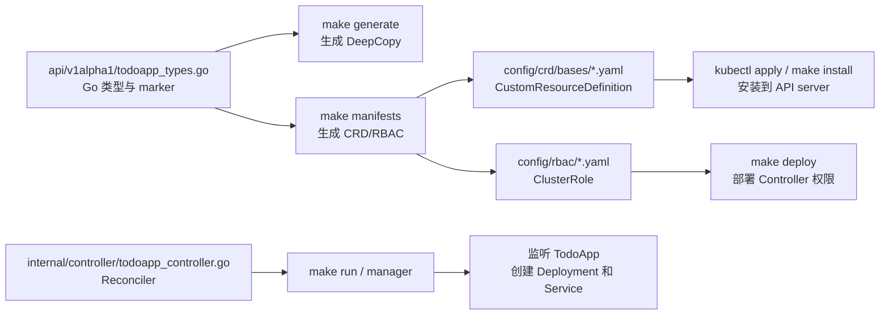
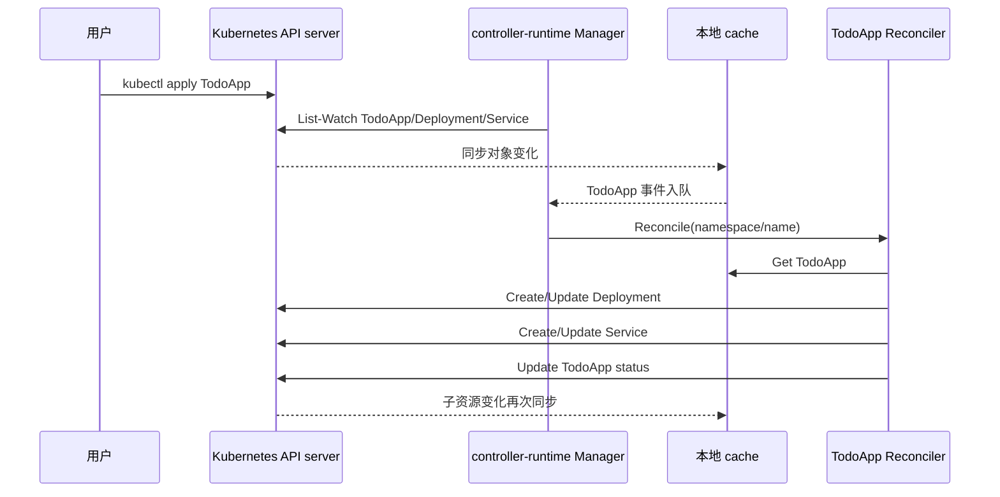

# 第 38 篇：Kubebuilder 入门 [C]

第 36 篇已经讲清楚 `Informer -> Workqueue -> Reconcile` 的控制循环，第 37 篇已经把这条链路落到手写 client-go Controller 上。本篇换一个更贴近生产团队的方式：使用 Kubebuilder 和 controller-runtime 开发 Todo Operator。

Kubebuilder 不是把 Controller 原理藏起来，而是把项目骨架、代码生成、CRD 生成、RBAC 生成、Manager、cache、client、Scheme 和 Controller 注册这些重复工作标准化。开发者仍然要理解 Reconcile、幂等、状态回写和资源归属，只是不用每次从零搭好脚手架。

本篇特色项目是：**使用 Kubebuilder 重写 Todo Operator：定义 `TodoApp` API 类型，自动生成 CRD，让 Reconciler 根据 `TodoApp` 创建 Deployment 和 Service，并在 kind 集群中验证从自定义资源到工作负载的完整链路。**

## 1. 本章学习目标

### 1.1 知识目标

- 能解释 Kubebuilder 项目中 `api/`、`internal/controller/`、`config/`、`cmd/main.go` 和 `Makefile` 的职责。
- 能说明 Go struct、kubebuilder marker、DeepCopy 代码和 CRD YAML 之间的生成关系。
- 能解释 controller-runtime 中 Manager、cache、client、Scheme、Controller 和 Reconciler 的协作关系。
- 能对比手写 client-go Controller 和 Kubebuilder Controller 在项目结构、依赖管理、RBAC 生成和本地调试上的差异。
- 能说明 OwnerReference 如何让 Deployment、Service 成为 `TodoApp` 的子资源，并触发拥有者 Reconcile。

### 1.2 技能目标

- 能独立初始化 Kubebuilder 项目并创建 `TodoApp` API 与 Controller。
- 能编写 `TodoAppSpec`、`TodoAppStatus` 和 kubebuilder marker，并通过 `make manifests` 生成 CRD。
- 能编写幂等 Reconciler，根据 `TodoApp` 创建或更新 Deployment 和 Service。
- 能在本地运行 Controller，并使用 kind 集群创建 CR 端到端验证。
- 能排查 CRD 未安装、RBAC 权限不足、Scheme 未注册、Service 不可变字段更新失败等常见问题。

## 2. 本章工作场景与真实案例

### 2.1 技术痛点

手写 Controller 能帮助我们看清底层机制，但生产团队很少愿意长期维护一套完全手写的 Informer、Workqueue、worker、signal handler、leader election、RBAC YAML 和 CRD 生成流程。代码越写越多后，团队会遇到几类现实问题：

- API 类型和 CRD YAML 分离维护，字段改了 Go struct，却忘记同步 OpenAPI schema。
- RBAC YAML 靠人工手写，Reconcile 新增了 Deployment 或 Service 操作，却忘记加权限。
- 多个 Controller 需要共享 cache、client、Scheme 和启动生命周期，手写初始化代码不断重复。
- 本地调试、镜像构建、部署清单、Webhook、测试环境没有统一入口，项目很难交接。
- 代码生成工具版本不一致，团队成员生成的 CRD、DeepCopy 和 RBAC 结果不同。

Kubebuilder 解决的是 Operator 工程化问题：让 API 类型、Controller、生成命令和部署配置围绕同一套约定组织起来。它不能替你设计好 API，也不能替你写出幂等 Reconcile，但它能把“每个 Operator 都要做的脏活累活”变成标准流程。

### 2.2 团队协作场景

平台工程师负责维护 Kubebuilder 项目。他们设计 `TodoApp` 字段，评审 kubebuilder marker，编写 Reconciler，维护 RBAC、镜像构建和发布流程。对平台团队来说，Kubebuilder 提供的是可持续演进的工程骨架。

业务团队或后端工程师只提交 `TodoApp` 资源。例如他们希望上线 `todo-api:v0.1.2-observability`，只需要声明镜像、副本数和端口。底层 Deployment、Service、label、owner reference、status 都由 Operator 维护。

SRE 负责运行和排障 Operator。他们关注 Controller 日志、Reconcile 错误、队列积压、RBAC Forbidden、leader election、`status.conditions` 和子资源状态。Kubebuilder 生成的项目结构让这些能力更容易标准化接入，但生产稳定性仍然取决于 Reconciler 的设计质量。

### 2.3 课程项目关联

本篇承接第 34-36 篇的 API 与控制循环设计，也会对齐第 37 篇手写 Controller 的核心逻辑。我们不再手工维护 CRD YAML，而是通过 Go 类型和 marker 生成 `TodoApp` CRD；不再手工拼 Informer 和 Workqueue，而是使用 controller-runtime 的 Manager 和 Builder 注册 Controller。

第 37 篇的手写版本位于 `<project-root>/operator/handwritten/`，本篇 Kubebuilder 版本位于 `<project-root>/operator/kubebuilder/`。两个目录在同一个项目仓库中并列存在，便于学习者直接对比“手写控制循环”和“工程化 Operator 项目”的差异。

本篇输出会被后续章节继续演进：

- 第 39 篇会在本篇 Operator 上增加 OwnerReference 深化、Finalizer、Webhook、Conditions 和事件记录。
- 第 40 篇会为本篇 Reconciler 增加 envtest、kind 集成测试、镜像构建和发布流程。
- 第 41 篇会围绕 RBAC 最小化、性能、观测和多租户边界把 Operator 推向生产可用。
- 第 42 篇会使用最终版 `TodoApp` 一键交付完整 Todo Platform。

项目版本线进入阶段六子版本 `v4.4-kubebuilder-operator`，它仍属于 `v4.0-operator` 总版本线。这里的子版本号用于阶段六内部衔接，便于和第 37 篇手写版本以及后续高级机制版本区分。

## 3. 核心概念

### 3.1 Kubebuilder 是 Operator 项目脚手架

Kubebuilder 是 Kubernetes 官方生态中常用的 Operator 开发框架。它提供项目初始化、API 创建、Controller 创建、代码生成、CRD 生成、RBAC 生成、本地运行、镜像构建和部署配置等约定。

一个新项目通常从两条命令开始：

```bash
kubebuilder init --domain todo.example.com --repo github.com/example/todo-operator
kubebuilder create api --group platform --version v1alpha1 --kind TodoApp --resource --controller
```

第一条命令创建项目骨架，第二条命令创建 API 类型和 Controller。这里的 `--group platform` 与 `--domain todo.example.com` 组合后，对外 API group 就是 `platform.todo.example.com`。

在 Todo Operator 中，Kubebuilder 的作用是把下面这些内容放进同一个工程：

表 38-1 Kubebuilder 项目目录职责

| 目录或文件 | 职责 | 本篇会修改吗 |
|---|---|---|
| `api/v1alpha1/` | 定义 `TodoApp` Go 类型和状态结构 | 会 |
| `internal/controller/` | 编写 Reconciler 业务逻辑 | 会 |
| `config/crd/bases/` | 存放生成后的 CRD YAML | 由命令生成 |
| `config/rbac/` | 生成 RBAC YAML | 由 marker 生成 |
| `config/samples/` | 示例自定义资源 | 会 |
| `cmd/main.go` | 启动 Manager 并注册 Controller | 通常少量调整 |
| `Makefile` | 统一生成、构建、安装、部署命令 | 直接使用 |

这套结构的价值在于团队成员能很快找到边界：API 字段在 `api/`，调谐逻辑在 `controller/`，部署清单在 `config/`，生成入口在 `make` 命令。

### 3.2 Go struct 与 CRD YAML 的关系

在第 35 篇中，我们手写了 CRD YAML。Kubebuilder 的思路不同：先写 Go 类型，再通过 marker 生成 CRD。

例如下面这个字段：

```go
// +kubebuilder:validation:Minimum=1
// +kubebuilder:validation:Maximum=10
// +kubebuilder:default:=1
Replicas int32 `json:"replicas,omitempty"`
```

它会生成 CRD schema 中的数值范围和默认值约束。这样 API 类型和 CRD 结构能保持同源：字段在 Go 里变了，运行 `make manifests` 后，CRD YAML 也会同步变化。

常见 marker 可以分成几类：

表 38-2 常见 kubebuilder marker 类型

| marker 类型 | 示例 | 作用 |
|---|---|---|
| 对象类型 | `+kubebuilder:object:root=true` | 标记根对象和列表对象 |
| 子资源 | `+kubebuilder:subresource:status` | 启用 `/status` subresource |
| 校验 | `+kubebuilder:validation:Minimum=1` | 生成 OpenAPI schema 校验 |
| 默认值 | `+kubebuilder:default:=8080` | 让 API server 默认字段 |
| 打印列 | `+kubebuilder:printcolumn:...` | 定义 `kubectl get` 输出列 |
| RBAC | `+kubebuilder:rbac:...` | 生成 Controller 权限 |

marker 是注释，但它不是普通注释。它会被 controller-tools 读取，并转换成 CRD、RBAC 或 webhook 配置。

### 3.3 DeepCopy 解决对象拷贝问题

Kubernetes 对象通常包含 map、slice、指针和嵌套结构。直接赋值可能造成共享底层数据，Controller 修改一个对象时误伤缓存中的对象。DeepCopy 代码用于生成安全的深拷贝方法。

Kubebuilder 项目中运行：

```bash
make generate
```

会根据 API 类型生成 `zz_generated.deepcopy.go`。这个文件通常不手写，但要提交到仓库，因为它是编译所需代码。

### 3.4 Reconciler 是业务调谐入口

Kubebuilder 生成的 Controller 最核心方法仍然叫 `Reconcile`：

```go
func (r *TodoAppReconciler) Reconcile(ctx context.Context, req ctrl.Request) (ctrl.Result, error) {
    // 读取 TodoApp
    // 计算期望 Deployment 和 Service
    // 创建或更新底层资源
    // 回写 status
    return ctrl.Result{}, nil
}
```

`req` 里通常只有 `namespace/name`。这和第 36 篇的结论一致：Controller 不应该依赖事件里的旧对象做业务判断，而应该在 Reconcile 中重新读取当前状态。

### 3.5 Manager、Client、Scheme 和 Controller

controller-runtime 把 Controller 运行时拆成几类核心对象：

表 38-3 controller-runtime 核心组件

| 组件 | 作用 | Todo Operator 中的体现 |
|---|---|---|
| Manager | 统一管理 cache、client、Scheme、Controller、健康检查和生命周期 | `cmd/main.go` 中创建 |
| Scheme | 注册 Go 类型与 GVK 的映射 | `platformv1alpha1.AddToScheme` |
| Client | 读写 Kubernetes API 对象 | `r.Get`、`r.Create`、`r.Update`、`r.Status().Update` |
| Cache | 本地缓存，降低 API server 压力 | 默认 client 读缓存 |
| Controller | 监听对象变化并触发 Reconcile | `SetupWithManager` 注册 |
| Reconciler | 执行业务调谐逻辑 | `TodoAppReconciler` |

默认情况下，controller-runtime client 通常是“读缓存，写 API server”。这能提升性能，但也意味着刚写入的对象不一定立刻能从缓存读到，所以 Reconcile 必须能容忍缓存延迟和重复执行。

### 3.6 OwnerReference 连接主资源与子资源

本篇会让 `TodoApp` 创建 Deployment 和 Service。它们之间不是松散关系，而应该通过 OwnerReference 建立归属：

```go
if err := controllerutil.SetControllerReference(&app, deployment, r.Scheme); err != nil {
    return ctrl.Result{}, err
}
```

OwnerReference 带来两个直接好处：

- 删除 `TodoApp` 后，Kubernetes garbage collector 可以级联清理子资源。
- `SetupWithManager` 中使用 `Owns(&appsv1.Deployment{})` 后，Deployment 变化可以反向触发拥有者 `TodoApp` 的 Reconcile。

这就是第 36 篇说的 secondary resource 事件映射回主资源 key。在 Kubebuilder 中，这个映射由 controller-runtime Builder 帮我们接上。

## 4. 原理深入

### 4.1 从代码到集群资源的生成链路

Kubebuilder 开发不是“写完 Go 代码直接跑”。API 类型、marker、生成命令和 Kubernetes API server 之间有一条明确链路。



图 38-1 Kubebuilder 从 Go 类型到 Kubernetes 资源的生成链路。

这条链路有一个关键点：`make generate` 和 `make manifests` 解决的问题不同。

- `make generate` 生成 Go 代码，主要是 DeepCopy。
- `make manifests` 生成 Kubernetes YAML，主要是 CRD、RBAC 和 webhook 配置。

如果只改了 Reconciler 逻辑，通常不需要重新生成 CRD；如果改了 API 类型、marker 或 RBAC marker，就要重新执行生成命令。

### 4.2 Manager 启动后的运行流程

当你执行 `make run` 时，Kubebuilder 项目会启动本地 Controller 进程。它连接当前 kubeconfig 指向的集群，启动 cache，注册 Controller，然后进入 Reconcile 循环。



图 38-2 controller-runtime Manager 与 Reconciler 的运行流程。

注意这里的读写路径不完全相同：`Get` 默认可能读本地 cache，`Create`、`Update`、`Status().Update` 会写 API server。设计 Reconcile 时不要假设写完立刻读到最新对象，也不要因为一次缓存滞后就判定失败。

### 4.3 与手写 Controller 的对比

Kubebuilder 没有改变 Controller 的本质，它只是改变了工程入口。

表 38-4 手写 Controller 与 Kubebuilder Controller 对比

| 能力 | 手写 client-go Controller | Kubebuilder / controller-runtime |
|---|---|---|
| Informer 初始化 | 自己创建 SharedInformerFactory | Manager 管理 cache |
| Workqueue | 自己创建并维护 worker | Controller 内部管理队列 |
| Reconcile key | 自己定义 `namespace/name` | `ctrl.Request` 提供 NamespacedName |
| API 类型注册 | 自己维护 Scheme | 项目生成 `AddToScheme` |
| CRD YAML | 手写或单独维护 | Go 类型 + marker 生成 |
| RBAC | 手写 YAML | RBAC marker 生成 |
| 子资源 watch | 自己写事件 handler | `For`、`Owns`、`Watches` 声明 |
| 本地运行 | 自己写 main 和信号处理 | `make run` 和 Manager |

所以学习顺序不能倒过来：如果完全不懂控制循环，Kubebuilder 会像魔法；理解第 36 篇后再看 Kubebuilder，它只是把同样的模型做成工程框架。

## 5. 手把手实验

### 5.1 实验目标

实验步骤 1：明确实验目标。

完成一个最小可运行的 Kubebuilder Todo Operator：创建 `TodoApp` 后，Controller 自动创建同名 Deployment 和 Service，并把 Deployment Ready 副本数写回 `TodoApp.status`。

### 5.2 实验环境

实验步骤 2：准备实验环境。

建议使用 Linux、macOS 或 Windows WSL2。Kubebuilder 项目依赖 `make`、Go 工具链、Docker、kubectl 和一个 Kubernetes 集群，Windows 原生 PowerShell 可以运行部分命令，但 `make` 和控制器本地运行体验通常不如 WSL2 稳定。**本章后续实验命令默认在 Bash 环境中执行，并且默认当前目录是 `<project-root>/operator/kubebuilder/`。**

表 38-5 本章实验工具版本

| 工具 | 建议版本 | 用途 |
|---|---|---|
| Go | 1.26.x | 编译 Operator |
| Docker | 29.x | 运行 kind 节点和构建镜像 |
| kubectl | 1.36.x | 操作 Kubernetes API |
| kind | 0.31+ | 创建本地 Kubernetes 集群 |
| Kubebuilder | 4.11.x | 初始化 Operator 项目 |
| make | GNU Make 4.x | 执行生成、运行和部署命令 |

如果尚未安装 Kubebuilder 和 kind，可以先安装工具。下面命令使用 Kubebuilder 4.11.x 下载入口安装 Kubebuilder，并用 Go 安装 kind 0.31.0：

=== "Linux / macOS / WSL2"

    安装 Kubebuilder：

    ```bash
    curl -L -o kubebuilder "https://go.kubebuilder.io/dl/4.11.0/$(go env GOOS)/$(go env GOARCH)"
    chmod +x kubebuilder
    sudo install -m 755 kubebuilder /usr/local/bin/kubebuilder
    ```

    安装 kind，并确保 Go 二进制目录在 `PATH` 中：

    ```bash
    go install sigs.k8s.io/kind@v0.31.0
    export PATH="$(go env GOPATH)/bin:$PATH"
    ```

    如果下载 GitHub 或 `go.kubebuilder.io` 速度很慢，可以先配置 Go 模块代理和网络代理：

    ```bash
    go env -w GOPROXY=https://goproxy.cn,direct
    export HTTPS_PROXY=<your-proxy>
    export HTTP_PROXY=<your-proxy>
    ```

=== "Windows PowerShell"

    建议在 WSL2 中执行本章完整实验。原生 PowerShell 可以用来检查 `go`、`docker` 和 `kubectl`，但 `make`、Kubebuilder 脚手架和本地 Controller 调试建议放在 WSL2 Bash 中完成。

检查本机工具版本：

=== "Linux / macOS / WSL2"

    ```bash
    go version
    docker version
    kubectl version --client
    kind version
    kubebuilder version
    make --version
    ```

=== "Windows PowerShell"

    ```powershell
    go version
    docker version
    kubectl version --client
    ```

    如果使用 WSL2 完成本章实验，请在 WSL2 终端中执行 Linux / macOS / WSL2 标签页里的完整检查命令。

预期输出：

```text
go version go1.26.x linux/amd64
Client Version: v1.36.x
kind v0.31.0 ...
Version: main.version{KubeBuilderVersion:"4.11.x", ...}
GNU Make 4.x
```

如果 `kubebuilder` 或 `kind` 不存在，请先按官方文档安装对应平台二进制。Windows 用户建议在 WSL2 中安装并完成本实验。

### 5.3 文件目录结构

实验步骤 3：确认文件目录结构。

本实验最终目录结构如下。注意：文件系统目录使用 `<project-root>/operator/kubebuilder/`，Go module 路径仍然使用 `github.com/example/todo-operator`，二者不要求完全同名。

```text
operator/
└── kubebuilder/
    ├── api/
    │   └── v1alpha1/
    │       ├── groupversion_info.go
    │       ├── todoapp_types.go
    │       └── zz_generated.deepcopy.go
    ├── cmd/
    │   └── main.go
    ├── config/
    │   ├── crd/
    │   │   └── bases/
    │   │       └── platform.todo.example.com_todoapps.yaml
    │   ├── rbac/
    │   ├── samples/
    │   │   └── platform_v1alpha1_todoapp.yaml
    │   └── manager/
    ├── internal/
    │   └── controller/
    │       ├── todoapp_controller.go
    │       └── suite_test.go
    ├── Dockerfile
    ├── Makefile
    ├── go.mod
    └── PROJECT
```

### 5.4 初始化 Kubebuilder 项目

实验步骤 4：创建项目骨架。

创建实验目录：

```bash
mkdir -p <project-root>/operator/kubebuilder
cd <project-root>/operator/kubebuilder
```

初始化项目骨架。`--domain` 决定 API group 后缀，`--repo` 决定 Go module 路径；`kubebuilder init` 本身没有 `Create Resource` 或 `Create Controller` 交互确认：

```bash
kubebuilder init --domain todo.example.com --repo github.com/example/todo-operator
```

预期输出会包含项目文件生成信息：

```text
Writing kustomize manifests for you to edit...
Writing scaffold for you to edit...
Get controller runtime:
go get sigs.k8s.io/controller-runtime@...
Update dependencies:
go mod tidy
Next: define a resource with:
kubebuilder create api
```

如果初始化阶段因为拉取 Go module 失败而中断，先检查网络和 `GOPROXY`，再重新执行 `kubebuilder init`。在公司网络中，也可能需要配置 `HTTPS_PROXY` 和 `HTTP_PROXY`。

创建 `TodoApp` API 和 Controller。`kubebuilder create api` 会询问是否创建 Resource 和 Controller，都输入 `y`：

```bash
kubebuilder create api --group platform --version v1alpha1 --kind TodoApp --resource --controller
```

预期输出：

```text
Create Resource [y/n]
y
Create Controller [y/n]
y
Writing kustomize manifests for you to edit...
Writing scaffold for you to edit...
api/v1alpha1/todoapp_types.go
internal/controller/todoapp_controller.go
```

### 5.5 定义 TodoApp API 类型

实验步骤 5：编写 API 类型、示例资源和 Controller 代码。

编辑 `api/v1alpha1/todoapp_types.go`，替换为下面的完整内容：

```go
package v1alpha1

import (
	metav1 "k8s.io/apimachinery/pkg/apis/meta/v1"
)

// TodoAppSpec defines the desired state of TodoApp.
type TodoAppSpec struct {
	// Image is the container image of the Todo API service.
	// +kubebuilder:validation:Required
	// +kubebuilder:validation:MinLength=1
	Image string `json:"image"`

	// Replicas is the desired number of Todo API pods.
	// +kubebuilder:validation:Minimum=1
	// +kubebuilder:validation:Maximum=10
	// +kubebuilder:default:=1
	Replicas int32 `json:"replicas,omitempty"`

	// Port is the HTTP port exposed by the Todo API container and Service.
	// +kubebuilder:validation:Minimum=1
	// +kubebuilder:validation:Maximum=65535
	// +kubebuilder:default:=8080
	Port int32 `json:"port,omitempty"`
}

// TodoAppStatus defines the observed state of TodoApp.
type TodoAppStatus struct {
	// ObservedGeneration is the latest metadata.generation reconciled by the controller.
	ObservedGeneration int64 `json:"observedGeneration,omitempty"`

	// ReadyReplicas is copied from the owned Deployment status.
	ReadyReplicas int32 `json:"readyReplicas,omitempty"`

	// Conditions describes the latest platform level state of the TodoApp.
	// +kubebuilder:validation:Optional
	// +listType=map
	// +listMapKey=type
	Conditions []metav1.Condition `json:"conditions,omitempty"`
}

// +kubebuilder:object:root=true
// +kubebuilder:subresource:status
// +kubebuilder:printcolumn:name="Image",type=string,JSONPath=`.spec.image`
// +kubebuilder:printcolumn:name="Replicas",type=integer,JSONPath=`.spec.replicas`
// +kubebuilder:printcolumn:name="Ready",type=integer,JSONPath=`.status.readyReplicas`
// +kubebuilder:printcolumn:name="Age",type=date,JSONPath=`.metadata.creationTimestamp`

// TodoApp is the Schema for the todoapps API.
type TodoApp struct {
	metav1.TypeMeta   `json:",inline"`
	metav1.ObjectMeta `json:"metadata,omitempty"`

	// +kubebuilder:validation:Required
	Spec   TodoAppSpec   `json:"spec"`
	Status TodoAppStatus `json:"status,omitempty"`
}

// +kubebuilder:object:root=true

// TodoAppList contains a list of TodoApp.
type TodoAppList struct {
	metav1.TypeMeta `json:",inline"`
	metav1.ListMeta `json:"metadata,omitempty"`
	Items           []TodoApp `json:"items"`
}

func init() {
	SchemeBuilder.Register(&TodoApp{}, &TodoAppList{})
}
```

这段代码定义了三件事：

- `spec.image` 是必填字段，用来决定 Deployment 镜像。
- `spec` 本身也是必填字段，避免用户提交空对象后 Controller 创建空镜像 Deployment。
- `spec.replicas` 和 `spec.port` 有默认值和范围限制。
- `status.conditions` 使用 Kubernetes 标准 Conditions 结构，后续章节会继续扩展。

生成 DeepCopy 代码：

```bash
make generate
```

生成 CRD 和 RBAC 清单：

```bash
make manifests
```

检查 CRD 中是否包含必填字段、打印列和状态子资源：

```bash
grep -n "required:\\|subresources\\|additionalPrinterColumns\\|readyReplicas" config/crd/bases/platform.todo.example.com_todoapps.yaml
```

预期输出：

```text
...
required:
  - spec
...
subresources:
  status: {}
additionalPrinterColumns:
...
jsonPath: .status.readyReplicas
...
```

### 5.6 编写 Reconciler

本小节继续完成实验步骤 5：编写 Controller 调谐逻辑。

编辑 `internal/controller/todoapp_controller.go`，替换为下面的完整内容：

```go
package controller

import (
	"context"
	"fmt"
	"reflect"

	appsv1 "k8s.io/api/apps/v1"
	corev1 "k8s.io/api/core/v1"
	apierrors "k8s.io/apimachinery/pkg/api/errors"
	"k8s.io/apimachinery/pkg/api/meta"
	metav1 "k8s.io/apimachinery/pkg/apis/meta/v1"
	"k8s.io/apimachinery/pkg/runtime"
	"k8s.io/apimachinery/pkg/types"
	"k8s.io/apimachinery/pkg/util/intstr"
	ctrl "sigs.k8s.io/controller-runtime"
	"sigs.k8s.io/controller-runtime/pkg/client"
	"sigs.k8s.io/controller-runtime/pkg/controller/controllerutil"
	"sigs.k8s.io/controller-runtime/pkg/log"

	platformv1alpha1 "github.com/example/todo-operator/api/v1alpha1"
)

// TodoAppReconciler reconciles a TodoApp object.
type TodoAppReconciler struct {
	client.Client
	Scheme *runtime.Scheme
}

// +kubebuilder:rbac:groups=platform.todo.example.com,resources=todoapps,verbs=get;list;watch
// +kubebuilder:rbac:groups=platform.todo.example.com,resources=todoapps/status,verbs=get;update;patch
// +kubebuilder:rbac:groups=platform.todo.example.com,resources=todoapps/finalizers,verbs=update
// +kubebuilder:rbac:groups=apps,resources=deployments,verbs=get;list;watch;create;update;patch;delete
// +kubebuilder:rbac:groups="",resources=services,verbs=get;list;watch;create;update;patch;delete

// Reconcile compares the desired TodoApp state with the actual cluster state.
func (r *TodoAppReconciler) Reconcile(ctx context.Context, req ctrl.Request) (ctrl.Result, error) {
	logger := log.FromContext(ctx)

	var app platformv1alpha1.TodoApp
	if err := r.Get(ctx, req.NamespacedName, &app); err != nil {
		return ctrl.Result{}, client.IgnoreNotFound(err)
	}

	deployment := desiredDeployment(&app)
	if err := controllerutil.SetControllerReference(&app, deployment, r.Scheme); err != nil {
		return ctrl.Result{}, err
	}

	if err := r.reconcileDeployment(ctx, deployment); err != nil {
		return ctrl.Result{}, err
	}

	service := desiredService(&app)
	if err := controllerutil.SetControllerReference(&app, service, r.Scheme); err != nil {
		return ctrl.Result{}, err
	}

	if err := r.reconcileService(ctx, service); err != nil {
		return ctrl.Result{}, err
	}

	if err := r.reconcileStatus(ctx, &app); err != nil {
		return ctrl.Result{}, err
	}

	logger.Info("reconciled TodoApp", "todoapp", req.NamespacedName)
	return ctrl.Result{}, nil
}

func (r *TodoAppReconciler) reconcileDeployment(ctx context.Context, desired *appsv1.Deployment) error {
	var current appsv1.Deployment
	key := types.NamespacedName{Name: desired.Name, Namespace: desired.Namespace}
	if err := r.Get(ctx, key, &current); err != nil {
		if apierrors.IsNotFound(err) {
			return r.Create(ctx, desired)
		}
		return err
	}

	changed := false
	if !reflect.DeepEqual(current.OwnerReferences, desired.OwnerReferences) {
		current.OwnerReferences = desired.OwnerReferences
		changed = true
	}
	if !reflect.DeepEqual(current.Labels, desired.Labels) {
		current.Labels = desired.Labels
		changed = true
	}
	if current.Spec.Replicas == nil || *current.Spec.Replicas != *desired.Spec.Replicas {
		current.Spec.Replicas = desired.Spec.Replicas
		changed = true
	}
	if !reflect.DeepEqual(current.Spec.Template.Labels, desired.Spec.Template.Labels) {
		current.Spec.Template.Labels = desired.Spec.Template.Labels
		changed = true
	}

	// This teaching reconciler manages only the todo-api container and leaves sidecars unchanged.
	desiredContainer := desired.Spec.Template.Spec.Containers[0]
	containerChanged := true
	for index := range current.Spec.Template.Spec.Containers {
		if current.Spec.Template.Spec.Containers[index].Name != desiredContainer.Name {
			continue
		}
		container := &current.Spec.Template.Spec.Containers[index]
		containerChanged = false
		if container.Image != desiredContainer.Image {
			container.Image = desiredContainer.Image
			changed = true
		}
		if !reflect.DeepEqual(container.Ports, desiredContainer.Ports) {
			container.Ports = desiredContainer.Ports
			changed = true
		}
		break
	}
	if containerChanged {
		current.Spec.Template.Spec.Containers = append(current.Spec.Template.Spec.Containers, desiredContainer)
		changed = true
	}

	if !changed {
		return nil
	}
	return r.Update(ctx, &current)
}

func (r *TodoAppReconciler) reconcileService(ctx context.Context, desired *corev1.Service) error {
	var current corev1.Service
	key := types.NamespacedName{Name: desired.Name, Namespace: desired.Namespace}
	if err := r.Get(ctx, key, &current); err != nil {
		if apierrors.IsNotFound(err) {
			return r.Create(ctx, desired)
		}
		return err
	}

	changed := false
	if !reflect.DeepEqual(current.OwnerReferences, desired.OwnerReferences) {
		current.OwnerReferences = desired.OwnerReferences
		changed = true
	}
	if !reflect.DeepEqual(current.Labels, desired.Labels) {
		current.Labels = desired.Labels
		changed = true
	}
	if !reflect.DeepEqual(current.Spec.Selector, desired.Spec.Selector) {
		current.Spec.Selector = desired.Spec.Selector
		changed = true
	}
	if !reflect.DeepEqual(current.Spec.Ports, desired.Spec.Ports) {
		current.Spec.Ports = desired.Spec.Ports
		changed = true
	}

	if !changed {
		return nil
	}
	return r.Update(ctx, &current)
}

func (r *TodoAppReconciler) reconcileStatus(ctx context.Context, app *platformv1alpha1.TodoApp) error {
	before := app.DeepCopy()

	var deployment appsv1.Deployment
	key := types.NamespacedName{Name: childName(app), Namespace: app.Namespace}
	if err := r.Get(ctx, key, &deployment); err != nil {
		if apierrors.IsNotFound(err) {
			app.Status.ReadyReplicas = 0
			app.Status.ObservedGeneration = app.Generation
			meta.SetStatusCondition(&app.Status.Conditions, metav1.Condition{
				Type:               "Available",
				Status:             metav1.ConditionFalse,
				Reason:             "DeploymentNotFound",
				Message:            "owned Deployment has not been created yet",
				ObservedGeneration: app.Generation,
				LastTransitionTime: metav1.Now(),
			})
			return r.updateStatusIfChanged(ctx, before, app)
		}
		return err
	}

	app.Status.ReadyReplicas = deployment.Status.ReadyReplicas
	app.Status.ObservedGeneration = app.Generation

	replicas := desiredReplicas(app)
	conditionStatus := metav1.ConditionFalse
	reason := "WaitingForReplicas"
	message := fmt.Sprintf("ready replicas %d/%d", deployment.Status.ReadyReplicas, replicas)
	if deployment.Status.ReadyReplicas >= replicas {
		conditionStatus = metav1.ConditionTrue
		reason = "DeploymentAvailable"
		message = "all requested Todo API replicas are ready"
	}

	meta.SetStatusCondition(&app.Status.Conditions, metav1.Condition{
		Type:               "Available",
		Status:             conditionStatus,
		Reason:             reason,
		Message:            message,
		ObservedGeneration: app.Generation,
		LastTransitionTime: metav1.Now(),
	})

	return r.updateStatusIfChanged(ctx, before, app)
}

func (r *TodoAppReconciler) updateStatusIfChanged(ctx context.Context, before, after *platformv1alpha1.TodoApp) error {
	if reflect.DeepEqual(before.Status, after.Status) {
		return nil
	}
	return r.Status().Update(ctx, after)
}

func desiredDeployment(app *platformv1alpha1.TodoApp) *appsv1.Deployment {
	labels := appLabels(app)
	replicas := desiredReplicas(app)
	port := desiredPort(app)

	return &appsv1.Deployment{
		ObjectMeta: metav1.ObjectMeta{
			Name:      childName(app),
			Namespace: app.Namespace,
			Labels:    labels,
		},
		Spec: appsv1.DeploymentSpec{
			Replicas: &replicas,
			Selector: &metav1.LabelSelector{MatchLabels: labels},
			Template: corev1.PodTemplateSpec{
				ObjectMeta: metav1.ObjectMeta{Labels: labels},
				Spec: corev1.PodSpec{
					Containers: []corev1.Container{
						{
							Name:  "todo-api",
							Image: app.Spec.Image,
							Ports: []corev1.ContainerPort{
								{Name: "http", ContainerPort: port, Protocol: corev1.ProtocolTCP},
							},
						},
					},
				},
			},
		},
	}
}

func desiredService(app *platformv1alpha1.TodoApp) *corev1.Service {
	labels := appLabels(app)
	port := desiredPort(app)

	return &corev1.Service{
		ObjectMeta: metav1.ObjectMeta{
			Name:      childName(app),
			Namespace: app.Namespace,
			Labels:    labels,
		},
		Spec: corev1.ServiceSpec{
			Type:     corev1.ServiceTypeClusterIP,
			Selector: labels,
			Ports: []corev1.ServicePort{
				{
					Name:       "http",
					Port:       port,
					TargetPort: intstr.FromString("http"),
					Protocol:   corev1.ProtocolTCP,
				},
			},
		},
	}
}

func appLabels(app *platformv1alpha1.TodoApp) map[string]string {
	return map[string]string{
		"app.kubernetes.io/name":       "todo-api",
		"app.kubernetes.io/instance":   app.Name,
		"app.kubernetes.io/managed-by": "todo-operator",
	}
}

func childName(app *platformv1alpha1.TodoApp) string {
	return app.Name + "-api"
}

func desiredReplicas(app *platformv1alpha1.TodoApp) int32 {
	if app.Spec.Replicas < 1 {
		return 1
	}
	return app.Spec.Replicas
}

func desiredPort(app *platformv1alpha1.TodoApp) int32 {
	if app.Spec.Port < 1 {
		return 8080
	}
	return app.Spec.Port
}

// SetupWithManager registers this reconciler with the controller-runtime manager.
func (r *TodoAppReconciler) SetupWithManager(mgr ctrl.Manager) error {
	return ctrl.NewControllerManagedBy(mgr).
		For(&platformv1alpha1.TodoApp{}).
		Owns(&appsv1.Deployment{}).
		Owns(&corev1.Service{}).
		Complete(r)
}
```

这段代码有几个关键点。

调谐入口与错误处理：

- `client.IgnoreNotFound(err)` 表示 `TodoApp` 已被删除时不再报错重试。
- `SetControllerReference` 让 Deployment 和 Service 归属于 `TodoApp`。
- `reconcileDeployment` 和 `reconcileService` 都先读当前状态，再决定创建、更新或跳过，保证幂等。

字段更新策略：

- Deployment 只更新 `replicas`、Pod label 和 container 等由 Operator 管理的字段，避免反复覆盖 API server 默认值。
- Service 没有整体替换 `Spec`，只更新 `selector` 和 `ports`，避免误改 `clusterIP` 这类不可变字段。
- `Status().Update` 只写 `/status` subresource，不修改 `spec`。

事件触发与运行方式：

- `Owns(&appsv1.Deployment{})` 和 `Owns(&corev1.Service{})` 让子资源变化也能触发 `TodoApp` Reconcile。
- Reconcile 成功后返回 `ctrl.Result{}`，依赖主资源和子资源事件再次触发调谐，而不是固定每 30 秒轮询一次。

格式化、重新生成清单并检查代码。这里必须再次执行 `make manifests`，因为刚才的 Reconciler 文件包含 RBAC marker，`config/rbac/role.yaml` 需要同步更新：

格式化 Go 代码：

```bash
gofmt -w api/v1alpha1/todoapp_types.go internal/controller/todoapp_controller.go
```

整理 Go module 依赖：

```bash
go mod tidy
```

根据 API marker 和 RBAC marker 重新生成清单：

```bash
make manifests
```

运行 Kubebuilder 项目的测试入口：

```bash
make test
```

`make test` 首次运行时可能下载 envtest 依赖，二进制体积通常在 100MB 以上，网络较慢时需要等待。Kubebuilder 默认会把 `setup-envtest` 和相关二进制放到项目 `bin/` 或本地工具缓存目录中。如果下载失败，先单独执行 `make envtest`；国内网络环境可以先配置 `GOPROXY`、`HTTPS_PROXY` 或公司内部代理，再重试 `make test`。

预期输出：

```text
?   	github.com/example/todo-operator/api/v1alpha1	[no test files]
ok  	github.com/example/todo-operator/internal/controller	...
```

### 5.7 准备示例 TodoApp

本小节继续完成实验步骤 5：编写示例自定义资源 YAML。

编辑 `config/samples/platform_v1alpha1_todoapp.yaml`：

```yaml
apiVersion: platform.todo.example.com/v1alpha1
kind: TodoApp
metadata:
  name: todo-platform
  namespace: default
spec:
  image: nginxdemos/hello:plain-text  # ← 使用可直接暴露 HTTP 的示例镜像
  replicas: 2                         # ← 期望创建 2 个 Pod
  port: 80                            # ← 容器和 Service 暴露端口
```

本篇为了聚焦 Operator 机制，使用 `nginxdemos/hello:plain-text` 作为可访问的 HTTP 镜像。真实项目中这里会替换为课程前面构建出来的 Todo API 镜像。如果所在网络无法拉取该镜像，先通过 `kubectl describe pod` 确认是否为 `ErrImagePull` 或 `ImagePullBackOff`，再替换为内部仓库中可访问、监听 80 端口的 HTTP 示例镜像。

> **可选实验**：如果已经完成前面章节的 Todo API 镜像构建，可以把镜像加载到 kind 集群后再切换 `TodoApp.spec.image`。这一步不是完成本章的必需操作，目的是把本章 Operator 实验接回课程主线。

```bash
docker build -t todo-api:v0.1.2-observability <todo-platform-root>/todo-api
kind load docker-image todo-api:v0.1.2-observability --name todo-operator
```

后续创建 `TodoApp` 后，可以把镜像切换回课程 Todo API：

```bash
kubectl patch todoapp todo-platform --type merge -p '{"spec":{"image":"todo-api:v0.1.2-observability","port":8080}}'
```

### 5.8 创建 kind 集群并安装 CRD

实验步骤 6：按顺序执行集群和 CRD 安装命令。

创建本地集群：

```bash
kind create cluster --name todo-operator
```

确认 kubectl 指向 kind 集群：

```bash
kubectl config use-context kind-todo-operator
kubectl cluster-info
```

安装 CRD：

```bash
make install
```

验证 API server 已识别 `TodoApp`：

```bash
kubectl api-resources | grep -i todoapp
kubectl explain todoapp.spec
```

预期输出：

```text
todoapps    platform.todo.example.com/v1alpha1    true    TodoApp

GROUP:      platform.todo.example.com
KIND:       TodoApp
VERSION:    v1alpha1
FIELD: spec <Object>
```

验证 CRD schema 能拦截非法输入。下面的对象故意缺少 `spec.image`，并把 `replicas` 写成 `0`：

```bash
kubectl apply --dry-run=server -f - <<'EOF'
apiVersion: platform.todo.example.com/v1alpha1
kind: TodoApp
metadata:
  name: invalid-todo
  namespace: default
spec:
  replicas: 0
EOF
```

预期输出：

```text
The TodoApp "invalid-todo" is invalid: spec.image: Required value
...
spec.replicas: Invalid value: 0: spec.replicas in body should be greater than or equal to 1
```

### 5.9 本地运行 Controller

实验步骤 7：运行 Controller 并验证核心行为。

启动前再次确认当前 kubeconfig 指向 kind 集群，避免 Controller 连接到错误环境：

```bash
kubectl config current-context
```

预期输出：

```text
kind-todo-operator
```

在第一个终端中启动 Controller：

```bash
make run
```

预期日志：

```text
INFO    setup    starting manager
INFO    starting server    {"name": "health probe", "addr": "[::]:8081"}
INFO    Starting EventSource    {"controller": "todoapp", "source": "kind source: *v1alpha1.TodoApp"}
INFO    Starting Controller     {"controller": "todoapp"}
INFO    Starting workers        {"controller": "todoapp", "worker count": 1}
```

保持第一个终端不要关闭。打开第二个终端，进入同一个 `<project-root>/operator/kubebuilder/` 目录，创建示例 CR：

```bash
kubectl apply -f config/samples/platform_v1alpha1_todoapp.yaml
```

预期输出：

```text
todoapp.platform.todo.example.com/todo-platform created
```

查看 `TodoApp` 和子资源：

```bash
kubectl get todoapp
kubectl get deployment,service,pods -l app.kubernetes.io/instance=todo-platform
```

预期输出：

```text
NAME            IMAGE                         REPLICAS   READY   AGE
todo-platform   nginxdemos/hello:plain-text   2          2       60s

NAME                            READY   UP-TO-DATE   AVAILABLE   AGE
deployment.apps/todo-platform-api   2/2     2            2           60s

NAME                        TYPE        CLUSTER-IP      EXTERNAL-IP   PORT(S)   AGE
service/todo-platform-api   ClusterIP   10.96.xxx.xxx   <none>        80/TCP    60s
```

查看 status：

```bash
kubectl get todoapp todo-platform -o yaml
```

关键输出：

```yaml
status:
  observedGeneration: 1
  readyReplicas: 2
  conditions:
    - type: Available
      status: "True"
      reason: DeploymentAvailable
      message: all requested Todo API replicas are ready
```

验证 Service 是否能访问。先转发端口：

```bash
kubectl port-forward service/todo-platform-api 8080:80
```

在另一个终端访问：

```bash
curl http://127.0.0.1:8080
```

预期输出：

```text
Server address: ...
Server name: todo-platform-api-...
Date: ...
URI: /
```

### 5.10 验证更新与幂等

本小节继续完成实验步骤 7：验证更新、幂等和状态收敛。

先重复提交同一份 `TodoApp`，验证无变化时不会重复创建子资源：

```bash
kubectl apply -f config/samples/platform_v1alpha1_todoapp.yaml
kubectl get deployment,service -l app.kubernetes.io/instance=todo-platform
```

预期输出：

```text
todoapp.platform.todo.example.com/todo-platform unchanged

NAME                            READY   UP-TO-DATE   AVAILABLE   AGE
deployment.apps/todo-platform-api   2/2     2            2           ...

NAME                        TYPE        CLUSTER-IP      EXTERNAL-IP   PORT(S)   AGE
service/todo-platform-api   ClusterIP   10.96.xxx.xxx   <none>        80/TCP    ...
```

这一步才是幂等验证：输入没有变化，Controller 可能仍然收到事件并执行 Reconcile，但 Deployment 和 Service 的数量、名称和核心 spec 不应出现重复或异常变化。

然后修改副本数，验证 Controller 能把新的期望状态推给 Deployment：

```bash
kubectl patch todoapp todo-platform --type merge -p '{"spec":{"replicas":3}}'
```

观察 Deployment 是否扩容：

```bash
kubectl get deployment todo-platform-api
kubectl get todoapp todo-platform
```

预期输出：

```text
NAME                READY   UP-TO-DATE   AVAILABLE   AGE
todo-platform-api   3/3     3            3           ...

NAME            IMAGE                         REPLICAS   READY   AGE
todo-platform   nginxdemos/hello:plain-text   3          3       ...
```

如果现在再次执行 sample 文件，会把 `replicas` 从 `3` 回滚到文件中的 `2`，这属于一次真实变更，不是幂等验证：

```bash
kubectl apply -f config/samples/platform_v1alpha1_todoapp.yaml
```

预期结果是 Deployment 回到 `2` 副本。幂等不是“不再运行”，而是“同一份期望状态重复运行不会产生错误副作用；期望状态变化时，实际状态会被调谐到新值”。

### 5.11 清理实验环境

实验步骤 8：清理实验资源。

删除示例 CR：

```bash
kubectl delete -f config/samples/platform_v1alpha1_todoapp.yaml --ignore-not-found
```

确认 Deployment 和 Service 已被 OwnerReference 级联删除：

```bash
kubectl get deployment,service -l app.kubernetes.io/instance=todo-platform
```

预期输出：

```text
No resources found in default namespace.
```

回到第一个终端，按 `Ctrl+C` 停止 `make run`。然后卸载 CRD：

```bash
make uninstall
```

删除 kind 集群：

```bash
kind delete cluster --name todo-operator
```

预计耗时：90 分钟，其中动手编码约 60 分钟，集群验证和排障约 30 分钟。

## 6. 常见错误与排障

### 错误 1：`no matches for kind "TodoApp"`

- **现象**：创建示例 CR 时报错：

  ```text
  error: resource mapping not found for name: "todo-platform" namespace: "default" from "config/samples/platform_v1alpha1_todoapp.yaml": no matches for kind "TodoApp" in version "platform.todo.example.com/v1alpha1"
  ensure CRDs are installed first
  ```

- **原因**：CRD 尚未安装到当前集群，或者 kubectl 当前上下文不是你安装 CRD 的集群。
- **排查**：查看当前上下文和 API 资源：

  ```bash
  kubectl config current-context
  kubectl api-resources | grep -i todoapp
  ```

  如果第二条没有输出，说明 API server 还不认识 `TodoApp`。

- **修复**：确认 kubeconfig 指向 kind 集群后重新安装 CRD：

  ```bash
  kubectl config use-context kind-todo-operator
  make install
  ```

- **预防**：每次新建或切换集群后，先执行 `make install`，再创建自定义资源。

### 错误 2：`forbidden: User cannot create resource "deployments"`

- **现象**：Controller 部署到集群后日志出现：

  ```text
  deployments.apps is forbidden: User "system:serviceaccount:todo-operator-system:todo-operator-controller-manager" cannot create resource "deployments" in API group "apps"
  ```

- **原因**：RBAC marker 没有声明 Deployment 权限，或者修改 marker 后没有重新执行 `make manifests` 和 `make deploy`。
- **排查**：查看生成的 ClusterRole：

  ```bash
  grep -n "deployments" config/rbac/role.yaml
  kubectl auth can-i create deployments --as system:serviceaccount:todo-operator-system:todo-operator-controller-manager
  ```

  如果 `kubectl auth can-i` 返回 `no`，说明运行账号没有权限。

- **修复**：补充 RBAC marker 后重新生成并部署：

  ```bash
  make manifests
  make deploy IMG=<your-registry>/todo-operator:v0.1.0
  ```

- **预防**：Reconciler 每新增一种读写资源，都同步检查 RBAC marker。

### 错误 3：`no kind is registered for the type`

- **现象**：启动 Controller 或设置 owner reference 时报错：

  ```text
  no kind is registered for the type v1alpha1.TodoApp in scheme "pkg/runtime/scheme.go"
  ```

- **原因**：`TodoApp` 类型没有注册到 Manager 使用的 Scheme。Kubebuilder 默认会在 `cmd/main.go` 中调用 `platformv1alpha1.AddToScheme(scheme)`，但手动改 module 或移动包路径时容易破坏。
- **排查**：检查 `cmd/main.go`：

  ```bash
  grep -n "AddToScheme" cmd/main.go
  ```

  需要能看到 `platformv1alpha1.AddToScheme(scheme)`。

  预期输出：

  ```text
  35:	utilruntime.Must(platformv1alpha1.AddToScheme(scheme))
  ```

- **修复**：把 API 包注册到 Scheme：

  ```go
  utilruntime.Must(platformv1alpha1.AddToScheme(scheme))
  ```

- **预防**：新增 API group 或 version 后，都检查 `cmd/main.go` 的 Scheme 注册。

### 错误 4：更新 Service 时报 `field is immutable`

- **现象**：Controller 更新 Service 时报错：

  ```text
  Service "todo-platform-api" is invalid: spec.clusterIPs[0]: Invalid value: []string(nil): field is immutable
  ```

- **原因**：代码把 `current.Spec = desired.Spec` 整体替换，导致 `clusterIP`、`clusterIPs` 等由 API server 分配的不可变字段被清空。
- **排查**：查看 Reconciler 是否整体替换 Service spec：

  ```bash
  grep -n "current.Spec = desired.Spec" internal/controller/todoapp_controller.go
  ```

- **修复**：只更新自己管理的字段，例如 `selector` 和 `ports`，不要整体覆盖 Service `Spec`。
- **预防**：对 Service、PVC、StatefulSet 等包含不可变字段的资源，更新逻辑要逐字段处理。

### 错误 5：`the object has been modified; please apply your changes to the latest version`

- **现象**：回写 status 时偶发冲突：

  ```text
  Operation cannot be fulfilled on todoapps.platform.todo.example.com "todo-platform": the object has been modified; please apply your changes to the latest version and try again
  ```

- **原因**：Controller 读到对象后，另一个写入已经更新了 resourceVersion。status 更新需要基于最新对象。
- **排查**：观察是否有多个 Controller 副本、频繁 patch，或手动快速修改同一个 `TodoApp`：

  ```bash
  kubectl get todoapp todo-platform -o jsonpath='{.metadata.resourceVersion}{"\n"}'
  kubectl logs -n todo-operator-system deploy/todo-operator-controller-manager
  ```

  如果日志中反复出现 `the object has been modified`，同时 `resourceVersion` 在快速变化，说明有多个写入方正在更新同一个 `TodoApp` 或 status 写入过于频繁。

- **修复**：让 Reconcile 返回错误，由 controller-runtime 自动重试；复杂场景可改用 `client.Status().Patch` 并做冲突重试。
- **预防**：status 更新前先比较变化，避免无意义写入；生产环境开启 leader election，避免多个实例同时处理同一资源。

## 7. 生产环境注意事项

- **API 字段要谨慎演进**。Kubebuilder 让改 Go struct 很容易，但 CRD 是对用户的 API 承诺。字段重命名、类型变更、枚举收窄和默认值变化都可能破坏 GitOps 仓库里的存量 YAML。生产 Operator 应维护版本策略，必要时引入 `v1beta1`、conversion webhook 和兼容性测试。

- **RBAC 必须按 Reconciler 行为最小化**。开发环境常把权限放宽到能跑通，生产环境不能长期使用过大的 ClusterRole。本篇为了教学让 Controller 管理 Deployment 和 Service，后续应明确 namespace 范围、资源范围和 verb 范围。例如只允许 Operator 在业务命名空间管理 Deployment 和 Service，而不是默认拿到整个集群的所有资源权限。

- **Reconcile 必须容忍重复、乱序和缓存延迟**。controller-runtime 的 cache 能降低 API server 压力，但不是强一致读路径。生产逻辑不要依赖“刚写入就立刻读到”，也不要因为一次 `NotFound` 或状态滞后就删除关键资源。所有外部副作用都要设计成可重试、可恢复、可观察。

- **状态回写要服务排障而不是装饰页面**。`status.conditions` 应给出清晰的 `type`、`status`、`reason`、`message` 和 `observedGeneration`。SRE 看到 `kubectl describe todoapp` 时，应能判断当前失败是镜像拉取、Deployment 未就绪、权限不足还是依赖资源缺失。

- **Operator 自身也要被当作生产服务运行**。它需要资源 requests/limits、健康检查、日志级别、指标、告警、leader election、滚动升级和回滚策略。一个会管理业务应用的 Operator 如果自身不可观测、不可升级，就会变成新的单点风险。

## 8. 本章小项目

本章小项目是完成 `<project-root>/operator/kubebuilder/` 中的 Kubebuilder 最小版本。

### 8.1 项目任务

- 使用 Kubebuilder 初始化 `github.com/example/todo-operator` 项目。
- 创建 `platform.todo.example.com/v1alpha1` 下的 `TodoApp` API。
- 在 `TodoAppSpec` 中定义 `image`、`replicas`、`port`。
- 在 `TodoAppStatus` 中定义 `observedGeneration`、`readyReplicas`、`conditions`。
- 编写 Reconciler 自动创建 Deployment 和 Service。
- 使用 OwnerReference 建立 `TodoApp` 与子资源关系。
- 在 kind 集群中创建 `TodoApp` 并验证 status。

### 8.2 验收标准

完成后应能观察到以下结果：

- `make generate`、`make manifests`、`make test` 均执行成功。
- `kubectl api-resources | grep -i todoapp` 能看到 `todoapps`。
- `kubectl apply --dry-run=server` 能拦截缺少 `spec.image` 或非法 `replicas` 的资源。
- `kubectl get todoapp` 能显示 `IMAGE`、`REPLICAS`、`READY` 列。
- 创建 `TodoApp` 后，自动生成 `todo-platform-api` Deployment 和 Service。
- 修改 `spec.replicas` 后，Deployment 副本数随之变化。
- `status.conditions[type=Available]` 能反映 Deployment 是否就绪。
- 删除 `TodoApp` 后，Deployment 和 Service 被级联删除。

### 8.3 建议提交内容

如果把本章成果提交到项目仓库，建议提交以下文件：

```text
api/v1alpha1/todoapp_types.go
api/v1alpha1/zz_generated.deepcopy.go
internal/controller/todoapp_controller.go
config/crd/bases/platform.todo.example.com_todoapps.yaml
config/rbac/role.yaml
config/samples/platform_v1alpha1_todoapp.yaml
go.mod
go.sum
PROJECT
Makefile
Dockerfile
```

不要提交本地 kind 集群缓存、临时日志、构建产物或个人 IDE 配置。

## 9. 本章练习题

### 9.1 基础题

1. Kubebuilder 项目中 `api/` 和 `internal/controller/` 分别放什么？为什么不要把 API 类型和 Reconcile 逻辑混在一个文件里？
2. `make generate` 和 `make manifests` 的输出分别是什么？修改 `TodoAppSpec` 后为什么两个命令通常都要执行？
3. `+kubebuilder:subresource:status` 解决了什么问题？如果没有 status subresource，用户和 Controller 同时写对象会有什么风险？
4. controller-runtime 默认 client 为什么可能读到缓存中的旧数据？这种行为对 Reconcile 设计有什么影响？
5. `For(&TodoApp{})` 和 `Owns(&Deployment{})` 在 Controller 注册中分别表示什么？

### 9.2 实操题

1. 给 `TodoAppSpec` 增加 `resources` 字段，用来声明 CPU 和内存 requests。验收标准：`make manifests` 后 CRD schema 中能看到 `resources` 字段，并且 Deployment container 中出现对应 requests。
2. 给 `TodoApp` 增加 `Service` 打印列，显示 Service 端口。验收标准：执行 `kubectl get todoapp` 时能看到新增列，且值来自 `spec.port`。
3. 把示例镜像从 `nginxdemos/hello:plain-text` 改成课程 Todo API 镜像，并通过 `kubectl port-forward` 访问健康检查接口。验收标准：curl 返回 Todo API 的健康检查响应。

### 9.3 思考题

1. 如果业务团队希望一个 `TodoApp` 同时管理 PostgreSQL、Redis、Deployment、Service、Ingress、ServiceMonitor 和告警规则，你会把所有逻辑放在一个 Reconciler 里，还是拆成多个 Reconciler？为什么？
2. 如果 Controller 创建 Deployment 成功，但回写 status 失败，下次 Reconcile 应该怎么处理？这个场景为什么能体现幂等设计的重要性？

## 10. 本章面试题

### 面试题 1：Kubebuilder 和 controller-runtime 的关系是什么？

**一句话结论**：Kubebuilder 是项目脚手架和生成工具，controller-runtime 是运行 Controller 的库。

**展开解释**：Kubebuilder 负责初始化项目、创建 API、生成 CRD/RBAC、提供 Makefile 和部署清单。controller-runtime 提供 Manager、cache、client、Reconciler、Builder、leader election 等运行时能力。Kubebuilder 生成的 Controller 代码本质上是在使用 controller-runtime。

**深入追问**：不用 Kubebuilder 能不能用 controller-runtime？可以。Kubebuilder 不是必需依赖，但它提供了一套成熟目录结构和生成流程，团队协作成本更低。

### 面试题 2：kubebuilder marker 是什么？为什么生产项目要重视它？

**一句话结论**：marker 是写在 Go 注释里的生成指令，会被转换成 CRD、RBAC、Webhook 等配置。

**展开解释**：例如 `+kubebuilder:validation:Minimum=1` 会生成 OpenAPI 数值校验，`+kubebuilder:rbac` 会生成 ClusterRole 权限，`+kubebuilder:subresource:status` 会启用 status subresource。marker 写错不是注释无效这么简单，而是会直接影响 API 校验、权限和运行行为。

**深入追问**：如何避免 marker 漂移？把 `make manifests` 纳入 CI，要求生成文件无 diff，并对关键 CRD schema 做兼容性评审。

### 面试题 3：controller-runtime client 为什么默认读缓存？

**一句话结论**：读缓存可以减少 API server 压力，提高 Controller 在大量对象场景下的性能。

**展开解释**：Controller 通常要频繁读取被管理对象和子资源。如果每次都直接访问 API server，大规模集群中很容易触发限流。cache 通过 List-Watch 同步对象，本地读取速度更快、压力更小。

**深入追问**：读缓存的代价是什么？可能读到短暂旧状态。Reconcile 必须幂等并容忍重复执行，不能假设写后立即读一致。

### 面试题 4：OwnerReference 在 Operator 中有什么作用？

**一句话结论**：OwnerReference 表达资源归属关系，用于级联删除和子资源事件反向触发主资源 Reconcile。

**展开解释**：本篇中 Deployment 和 Service 都由 `TodoApp` 拥有。删除 `TodoApp` 时，garbage collector 可以清理子资源；Deployment 状态变化时，controller-runtime 可以通过 `Owns` 把事件映射回拥有者 `TodoApp`。

**深入追问**：OwnerReference 有什么限制？跨 namespace owner reference 不能随意使用，外部云资源也不能靠 Kubernetes garbage collector 清理，这些场景需要 Finalizer 或显式引用索引。

### 面试题 5：如何判断一个 Reconciler 是否幂等？

**一句话结论**：同一个输入状态下多次执行 Reconcile，最终集群状态一致，不产生重复资源或无意义副作用。

**展开解释**：幂等 Reconciler 会先读取当前状态，再创建缺失资源、更新差异字段、跳过已满足状态。它不会因为收到重复事件就重复创建 Service，也不会每次都写 status 造成事件风暴。

**深入追问**：怎么测试？连续创建同一个 `TodoApp`、重复 apply 同一份 YAML、重启 Controller，再观察 Deployment/Service 数量、status 更新频率和日志错误是否稳定。

## 11. 本章总结

本篇把 Todo Operator 从手写 Controller 思路推进到 Kubebuilder 工程化实践。知识上，你学习了 Kubebuilder 项目结构、Go 类型与 CRD 的生成关系、DeepCopy 的作用、marker 的价值，以及 controller-runtime 中 Manager、cache、client、Scheme、Controller 和 Reconciler 的协作方式。你也看到了 Kubebuilder 并没有改变控制循环本质，只是把通用工程结构和生成流程标准化。

实践上，你在 `<project-root>/operator/kubebuilder/` 中完成了一个最小 Kubebuilder Operator：`TodoApp` API 由 Go struct 和 marker 定义，CRD 和 RBAC 由命令生成，Reconciler 根据 `TodoApp` 自动创建 Deployment 和 Service，并将 Deployment Ready 副本数回写到 `status.conditions`。实验还验证了 schema 校验、kind 集群运行、Service 访问、扩缩容、幂等和级联删除。

能力上，你已经能用生产团队常见方式开发 Kubernetes Operator 的第一版功能。接下来要做的不是堆更多 YAML，而是把删除清理、字段默认、校验、事件、状态和多版本演进这些生产机制补齐。学完本篇后，你可以参与企业内部平台 API 的第一版落地，也能读懂大多数 Kubebuilder Operator 项目的目录结构和调谐入口。

## 12. 下一章衔接

下一篇第 39 篇会基于本篇 `<project-root>/operator/kubebuilder/` 继续增强 Operator 机制。我们会直接打开 `api/v1alpha1/todoapp_types.go` 增加 Webhook marker 和更完整的字段约束，在 `internal/controller/todoapp_controller.go` 中增加 Finalizer 删除清理、Event 记录和更细的 Conditions，并在 `config/` 目录中生成 webhook 与 RBAC 配置。

如果跳过本篇直接学习高级机制，很容易只知道 Finalizer、Webhook、Conditions 的概念，却不知道它们应该接在 Kubebuilder 项目的哪些文件、哪些生成命令和哪段 Reconcile 生命周期里。本篇产出的 `TodoApp` API、Reconciler 和本地 kind 验证流程，会作为后续章节的共同基础。
