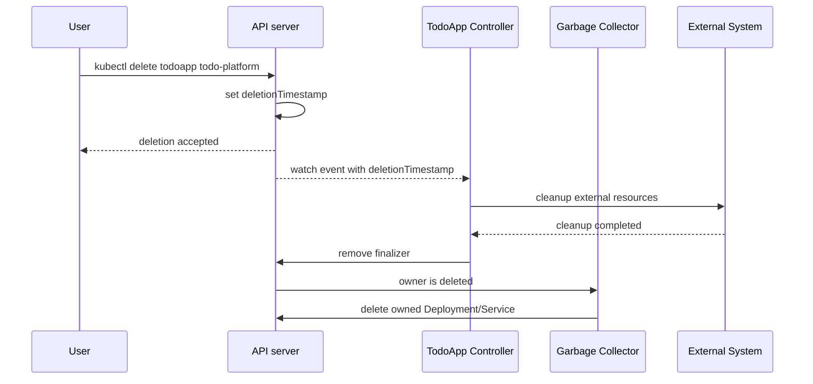
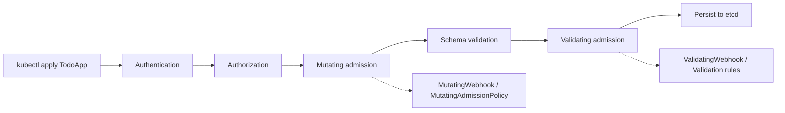
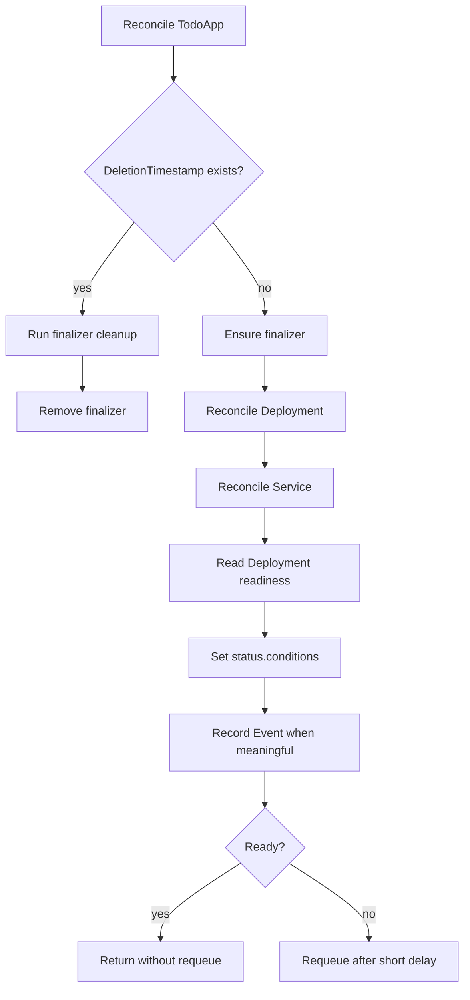

# 第 39 篇：Operator 高级机制

第 38 篇已经用 Kubebuilder 完成了 Todo Operator 的最小工程化版本：`TodoApp` 能自动创建 Deployment 和 Service，并把 Ready 副本数写回 status。本篇继续在 `<project-root>/operator/kubebuilder/` 上增强它，让这个 Operator 开始具备生产级生命周期管理能力。

很多团队第一次写 Operator 时会停在“能创建资源”这一层，但生产环境真正难的是“资源什么时候属于谁”“删除前要清理什么”“用户提交的 spec 是否可信”“状态应该如何表达”“错误要不要重试”“API 以后如何升级”。这些问题分别对应 OwnerReference、Finalizer、Admission Webhook、MutatingAdmissionPolicy、Status Conditions、Event、重试策略和多版本 CRD。

本篇的目标不是把所有高级机制讲成抽象名词，而是把它们落到同一个 Todo Operator 里：创建时默认字段，提交时校验字段，运行时记录事件和状态，删除时执行清理逻辑，并理解未来多版本演进要怎样设计。

本篇内容密度较高，建议分两次学习：第一次聚焦 Webhook 默认值与校验，也就是 §3.3、§5.2-§5.6；第二次聚焦 Finalizer、Conditions、Events 与调谐策略，也就是 §3.2、§3.5、§5.7-§5.10。`MutatingAdmissionPolicy` 和多版本 CRD 作为生产演进视角，先按“了解并能解释边界”处理，不要求第一次就完整实现 conversion webhook。

## 1. 本章学习目标

### 1.1 知识目标

学完本章后，你应该能够：

- 能解释 OwnerReference 与 Kubernetes garbage collector 如何配合完成级联删除。
- 能解释 Finalizer 为什么会阻塞资源删除，以及它适合清理哪些“非 Kubernetes 子资源”。
- 能对比 OpenAPI schema 校验、Admission Webhook 校验和 CEL-based Admission Policy 的职责边界。
- 能描述 `status.conditions`、Event 和 Controller 日志三者分别服务于什么排障场景。
- 能解释多版本 CRD 与 conversion webhook 为什么是生产 Operator API 演进的关键能力。

### 1.2 技能目标

学完本章后，你应该能够：

- 能在 Kubebuilder 项目中为 `TodoApp` 增加 Finalizer、Event 记录和更细粒度 Conditions。
- 能使用 `kubebuilder create webhook` 生成默认值注入和字段校验 Webhook，并部署到 kind 集群验证。
- （了解）能编写一个 CEL-based `MutatingAdmissionPolicy` 示例，理解 Kubernetes 1.36 中策略型默认值的适用边界。
- 能排查 Webhook TLS、Service endpoint、Finalizer 卡住、status 冲突和 Admission Policy 不生效等常见问题。
- 能为 Todo Operator 设计从 `v1alpha1` 演进到 `v1beta1` 的兼容策略。

## 2. 本章工作场景与真实案例

### 2.1 技术痛点

第 38 篇的 Operator 已经能自动创建 Deployment 和 Service，但它仍然像一个“能跑的实验品”。如果用户删除 `TodoApp`，Kubernetes 可以通过 OwnerReference 清理 Deployment 和 Service，但如果 Operator 同时创建了外部数据库、云负载均衡、DNS 记录、备份策略，garbage collector 就管不到了。没有 Finalizer，主资源一删就消失，Controller 再也没有机会做删除前清理。

另一个痛点是输入不可信。平台团队希望业务方只写一份 `TodoApp` YAML，但业务方可能漏写镜像、把副本数写成 0、使用 `latest` 标签、把端口写成 70000。只靠文档约定很脆弱，必须把默认值和校验前移到 API 准入阶段，让错误在进入集群前就被拒绝。

第三个痛点是状态不可读。生产排障时，SRE 不应该只能翻 Controller 日志，而应该能直接通过 `kubectl get todoapp`、`kubectl describe todoapp` 和 `kubectl get events` 判断平台是否 Ready、卡在哪一步、最近发生了什么。这就是 Conditions 和 Events 的价值。

### 2.2 团队协作场景

平台开发者负责设计 `TodoApp` API、编写 Reconciler、Webhook、Finalizer 和 Conditions 逻辑，并在代码评审中说明哪些字段可以默认、哪些字段必须拒绝。平台 SRE 负责部署 Operator、安装证书依赖、观察 Webhook 是否可达、处理 Finalizer 卡住和 status 异常更新。业务开发者只提交 `TodoApp` YAML，他们不需要理解 Deployment、Service、Webhook 证书，但需要读懂被拒绝时的错误信息。

在真实团队里，Webhook 和 Finalizer 通常需要更严格的变更评审。Webhook 一旦故障，可能导致所有相关 CR 创建或更新失败；Finalizer 一旦写错，可能导致大量资源长期停留在 `Terminating`。因此本篇实验会刻意让每个机制都有验证命令和排障入口，而不是只展示“理想路径”。

### 2.3 Todo 平台模拟案例

> Todo Operator 需要处理真实生命周期问题。你需要为 `TodoApp` 增加 OwnerReference、Finalizer、Webhook 校验、Conditions、事件记录和异常路径处理。

这个案例强调 Operator 不是简单创建 Deployment：删除、升级、非法输入、依赖缺失和状态解释都需要明确的生命周期设计。
## 3. 核心概念

### 3.1 OwnerReference：资源归属关系

OwnerReference 是 Kubernetes 对象 metadata 中的一组归属引用，用来表达“这个对象由哪个对象拥有”。当 owner 被删除时，Kubernetes garbage collector 可以自动清理 dependents。

第 38 篇已经在代码中使用过：

```go linenums="0"
if err := controllerutil.SetControllerReference(todo, deployment, r.Scheme); err != nil {
	return err
}
```

它会在 Deployment 上生成类似下面的 metadata：

```yaml linenums="0"
metadata:
  ownerReferences:
    - apiVersion: platform.todo.example.com/v1alpha1
      kind: TodoApp
      name: todo-platform
      uid: 4f8f0a7a-7f2e-4c9d-9a5b-2e3a3e7b0001
      controller: true
      blockOwnerDeletion: true
```

表 39-1 OwnerReference 字段含义

| 字段 | 含义 | 排障时怎么看 |
|---|---|---|
| `apiVersion` / `kind` | owner 的 API 类型 | 是否指向正确的 `TodoApp` |
| `name` / `uid` | owner 的名称和唯一 ID | `uid` 比 `name` 更可靠，重名对象不会混淆 |
| `controller` | 表示控制器 owner | 一个对象最多只能有一个 controller owner |
| `blockOwnerDeletion` | owner 删除时是否等待 dependent 处理 | 需要 owner 侧具备对应权限 |

OwnerReference 适合清理 Kubernetes 内部子资源，例如 Deployment、Service、ConfigMap、Secret、Ingress。它不适合清理外部系统资源，例如云数据库、DNS 记录、对象存储桶、第三方监控配置，这些资源需要 Finalizer。

### 3.2 Finalizer：删除前最后一道钩子

Finalizer 是 metadata 中的字符串列表。只要对象还带着 Finalizer，用户执行 `kubectl delete` 后对象不会立刻从 etcd 消失，而是进入“带有 deletionTimestamp 的删除中状态”。Controller 看到这个状态后执行清理逻辑，成功后移除 Finalizer，对象才会真正删除。

一个带 Finalizer 的 `TodoApp` 看起来像这样：

```yaml linenums="0"
metadata:
  finalizers:
    - platform.todo.example.com/todoapp-cleanup
```

删除生命周期可以概括为：

```text linenums="0"
用户删除 TodoApp
  -> API server 设置 deletionTimestamp
  -> TodoApp 仍保留在集群中
  -> Reconciler 执行外部资源清理
  -> Reconciler 移除 finalizer
  -> API server 真正删除 TodoApp
```

Finalizer 的关键点是“必须幂等”。清理外部资源可能失败，Controller 会重试；清理逻辑不能因为重复执行就删除错误资源，或者因为外部资源已经不存在就一直报错。

### 3.3 Admission Webhook：默认值与校验

Admission Webhook 是 API server 在对象写入前调用的 HTTPS 扩展点。Kubebuilder 可以生成两类 Webhook：

- Mutating Webhook：修改对象，例如给 `spec.image`、`spec.replicas`、`spec.port` 填默认值。
- Validating Webhook：校验对象，例如拒绝 `latest` 镜像标签、拒绝超大副本数、拒绝非法端口。

本篇使用下面的 Kubebuilder 命令生成 Webhook 骨架：

```bash linenums="0"
kubebuilder create webhook --group platform --version v1alpha1 --kind TodoApp --defaulting --programmatic-validation
```

Webhook 和 CRD OpenAPI schema 的关系不是二选一。OpenAPI schema 适合表达简单结构约束，例如数字范围、字符串长度、枚举值；Webhook 适合表达需要代码判断的复杂规则，例如镜像必须带固定标签、不同字段之间必须匹配、更新时某些字段不可变。

### 3.4 MutatingAdmissionPolicy：CEL-based 默认值策略

Kubernetes 1.36 中，`MutatingAdmissionPolicy` 已经进入 stable。它允许平台团队用 CEL 表达式做一部分准入阶段的字段修改，不需要为简单默认值维护一个 Webhook 服务。

一个最小示例是：当 `TodoApp.spec.port` 缺失时，自动填充 80。

```yaml linenums="0"
apiVersion: admissionregistration.k8s.io/v1
kind: MutatingAdmissionPolicy
metadata:
  name: todoapp-default-port
spec:
  matchConstraints:
    resourceRules:
      - apiGroups: ["platform.todo.example.com"]
        apiVersions: ["v1alpha1"]
        operations: ["CREATE"]
        resources: ["todoapps"]
  mutations:
    - patchType: ApplyConfiguration
      applyConfiguration:
        expression: >
          Object{
            spec: Object.spec{
              port: has(object.spec.port) ? object.spec.port : 80
            }
          }
```

本篇把它作为“了解和对比”内容：简单默认值可以考虑 CEL policy，复杂逻辑、外部依赖、跨字段校验和更新前后对象对比仍然更适合 Webhook 或 Controller。

### 3.5 Conditions、Events 与错误重试

`status.conditions` 是给机器和人读的长期状态，Event 是给人排查最近发生了什么的短期记录，日志是给开发者追踪代码路径的细节证据。三者不能互相替代。

表 39-2 状态表达方式对比

| 机制 | 适合表达 | 保留时间 | 典型查看命令 |
|---|---|---|---|
| Conditions | 当前是否 Ready、为什么不 Ready | 跟随对象长期存在 | `kubectl get todoapp -o yaml` |
| Events | 最近发生的创建、更新、失败、删除动作 | 集群事件 TTL 内保留 | `kubectl describe todoapp` |
| Logs | 代码级调用链、错误堆栈、调试细节 | 依赖日志系统 | `kubectl logs` |

Reconcile 返回错误时，controller-runtime 会根据 rate limiter 自动重试。返回 `ctrl.Result{RequeueAfter: ...}` 时，表示即使没有新事件也要稍后再次调谐。生产代码要区分“短暂错误”“用户输入错误”和“等待外部系统收敛”，不能所有情况都无限快速重试。

### 3.6 多版本 CRD 与转换 Webhook

`v1alpha1` 表示 API 仍处于早期阶段，字段可能变化。生产环境中，一旦业务方把 `TodoApp` YAML 放进 GitOps 仓库，API 就成了承诺。字段重命名、类型变化、枚举收窄和默认值变化都可能破坏已有用户。

多版本 CRD 的常见路径是：

```text linenums="0"
v1alpha1
  -> v1beta1
  -> v1
```

如果多个版本字段完全兼容，可以通过 CRD schema 直接服务多个版本。如果字段发生结构性变化，例如 `spec.image` 拆成 `spec.image.repository` 和 `spec.image.tag`，就需要 conversion webhook 在版本之间转换对象。

本篇不会完整实现 conversion webhook，因为第 40 篇会进入测试、发布和升级。但本篇会讲清楚多版本设计原则，避免你把 `v1alpha1` 当成永远不会变的最终 API。

表 39-3 TodoApp 多版本演进示例

| 字段 | `v1alpha1` | `v1beta1` 设计 | 是否需要转换 |
|---|---|---|---|
| 镜像 | `spec.image: string` | `spec.image.repository` + `spec.image.tag` | 需要 conversion webhook |
| 副本数 | `spec.replicas: integer` | 保持 `spec.replicas` | 不需要 |
| 端口 | `spec.port: integer` | 保持 `spec.port`，但增加命名端口 | 视字段结构而定 |
| 资源限制 | 无 | `spec.resources.requests/limits` | 可通过默认值补齐 |

本篇实验的验收重点仍是 `v1alpha1` 生命周期机制，但学习者需要能说清楚：如果下一篇或生产版本把 `spec.image` 拆成结构体，旧 YAML 不能直接失效，必须提供版本转换或至少提供清晰迁移路径。

## 4. 原理深入

### 4.1 删除流程：OwnerReference 与 Finalizer 如何协作

OwnerReference 和 Finalizer 经常同时出现，但职责不同：OwnerReference 清理集群内 dependent，Finalizer 给 Controller 一个删除前清理窗口。

图 39-1 TodoApp 删除生命周期



如果只有 OwnerReference，没有 Finalizer，集群内子资源可以被清理，但外部系统没有清理机会。如果只有 Finalizer，没有 OwnerReference，Controller 可以清理外部资源，但 Kubernetes 不知道哪些 Deployment 和 Service 应该随 `TodoApp` 删除。

### 4.2 Admission 流程：从提交 YAML 到写入 etcd

当用户提交 `TodoApp` YAML 时，请求不会直接写入 etcd。API server 会先完成认证、鉴权、准入、schema 校验等步骤。

图 39-2 Admission Webhook 与 CEL Policy 的位置



在这个链路里，默认值应该尽早注入，校验应该尽早失败。这样 Reconciler 收到的 `TodoApp` 就更接近“可信输入”，代码里不用在每个分支反复处理明显非法的 spec。

### 4.3 状态回写流程：不要把 status 当日志

Conditions 应该表达稳定状态，而不是记录所有细节。比如 `Ready=False, Reason=DeploymentNotReady` 是好状态；每次 Reconcile 都追加一个新的 Condition 是坏状态。Kubernetes 社区推荐同一个 `type` 的 Condition 只保留最新状态，通过 `LastTransitionTime` 表达变化时间。

图 39-3 Reconcile 状态与事件流



事件也不能滥用。生产 Controller 不应该每秒记录一次 Normal Event，否则会造成事件噪声。建议只在关键生命周期节点记录，例如 `FinalizerAdded`、`DeploymentCreated`、`Ready`、`CleanupFailed`。

## 5. 手把手实验

预计耗时：90 分钟（动手操作约 65 分钟）。

### 5.1 实验目标

实验步骤 1：明确实验目标。

在第 38 篇的 `<project-root>/operator/kubebuilder/` 项目中，为 `TodoApp` 增加 Finalizer、Admission Webhook、Conditions、Event 和一个 CEL-based MutatingAdmissionPolicy 示例，并在 kind 集群中验证默认值、校验、状态回写和删除清理。

### 5.2 实验环境

实验步骤 2：准备实验环境。

本章继续使用第 38 篇工具链。后续命令默认在 Bash 环境中执行，并且当前目录是 `<project-root>/operator/kubebuilder/`。

表 39-4 本章实验工具版本

| 工具 | 建议版本 | 用途 |
|---|---|---|
| Go | 1.26.x | 编译 Operator |
| Docker | 29.x | 构建本地 Operator 镜像 |
| kubectl | 1.36.x | 操作 Kubernetes API |
| kind | 0.31+ | 创建本地 Kubernetes 1.36 集群 |
| Kubebuilder | 4.11.x | 生成 Webhook 骨架 |
| cert-manager | 1.20.x | 为 Webhook 注入证书 |
| GNU Make | 4.x | 执行生成、构建、部署命令 |

> **版本兼容提示**：本章按课程计划锁定 cert-manager 1.20.x。真实环境中如果 Kubernetes 1.36 与证书组件出现兼容性问题，先查阅 cert-manager 的 supported releases，再决定是否在实验记录中临时切换到 1.21.x；课程正文仍以锁定版本为准，避免隐式漂移。

确认当前项目：

```bash linenums="0"
pwd
```

预期输出类似：

```text linenums="0"
<project-root>/operator/kubebuilder
```

确认工具版本：

```bash linenums="0"
go version
docker version --format '{{.Server.Version}}'
kubectl version --client
kind version
kubebuilder version
```

本篇需要 Kubernetes 1.36.x。后续创建 kind 集群时固定使用课程节点镜像：

```bash linenums="0"
export KIND_NODE_IMAGE=registry.cn-guangzhou.aliyuncs.com/yleoer/node:v1.36.0
```

如果你从第 34-38 篇一路沿用阶段五的 `todo-gitops` 集群，请先确认服务端版本。前几篇可以在 v1.35/v1.36 上运行，但本篇的 `MutatingAdmissionPolicy` 可选实验需要 v1.36 API。若当前集群仍是 v1.35，可以继续完成 Webhook、Finalizer、Events 和 Conditions 主实验，但应跳过 §5.11；如果要完整验证 §5.11，请新建一个 v1.36 kind 集群，不要在共享测试或生产集群上为了课程实验删除 CRD 或重建集群。

首次创建集群时，kind 会自动拉取 `registry.cn-guangzhou.aliyuncs.com/yleoer/node:v1.36.0`，镜像体积较大，网络较慢时可能需要几分钟。如果你在公司网络或国内网络环境中拉取失败，可以先配置 Docker 代理或镜像加速，再手动执行 `docker pull "${KIND_NODE_IMAGE}"`。

如果课程环境提供了更新的 1.36.x patch 镜像，可以替换为对应 tag，但必须在实验记录中写明实际使用的完整镜像名，避免“kind 默认版本”带来的不可复现问题。

如果 `kubebuilder` 或 `kind` 缺失，请回到第 38 篇的安装步骤补齐。

### 5.3 文件目录结构

实验步骤 3：确认文件目录结构。

本实验最终涉及的关键文件如下：

```text linenums="0"
operator/
└── kubebuilder/
    ├── api/
    │   └── v1alpha1/
    │       └── todoapp_types.go
    ├── cmd/
    │   └── main.go
    ├── config/
    │   ├── certmanager/
    │   ├── default/
    │   │   └── kustomization.yaml
    │   ├── manager/
    │   │   └── kustomization.yaml
    │   ├── mutating-policy/
    │   │   └── todoapp-default-port.yaml
    │   ├── samples/
    │   │   ├── platform_v1alpha1_todoapp.yaml
    │   │   ├── platform_v1alpha1_todoapp_invalid.yaml
    │   │   └── platform_v1alpha1_todoapp_defaults.yaml
    │   └── webhook/
    ├── internal/
    │   ├── controller/
    │   │   └── todoapp_controller.go
    │   └── webhook/
    │       └── v1alpha1/
    │           └── todoapp_webhook.go
    ├── Dockerfile
    ├── Makefile
    ├── go.mod
    └── PROJECT
```

### 5.4 生成 Webhook 骨架

实验步骤 4：生成 Webhook 代码和配置。

在 Kubebuilder 项目根目录执行：

```bash linenums="0"
kubebuilder create webhook --group platform --version v1alpha1 --kind TodoApp --defaulting --programmatic-validation
```

预期输出：

```text linenums="0"
Writing scaffold for you to edit...
internal/webhook/v1alpha1/todoapp_webhook.go
cmd/main.go
```

不同 Kubebuilder 小版本生成的文件位置可能略有差异。Kubebuilder 4.11.x 默认会生成 `internal/webhook/v1alpha1/todoapp_webhook.go`，同时在 `cmd/main.go` 中增加 Webhook 注册入口；有些版本还会生成额外的 API 辅助文件。如果你的输出不同，以实际生成文件为准，但后续代码逻辑保持一致。

本篇采用 Kubebuilder 4.11.x 官方书中常见的独立 `SetupTodoAppWebhookWithManager` 函数写法。如果你的生成结果是把 `SetupWebhookWithManager` 作为 `TodoApp` 类型方法，也可以保留生成的注册入口，但要确保默认值和校验逻辑仍然注册到同一个 `TodoApp` Webhook 上。

### 5.5 更新 TodoApp API 类型

本小节继续完成实验步骤 4：修改 API 类型。

编辑 `api/v1alpha1/todoapp_types.go`，替换为下面的完整内容：

```go linenums="0"
/*
Copyright 2026.

Licensed under the Apache License, Version 2.0 (the "License");
you may not use this file except in compliance with the License.
*/

package v1alpha1

import (
	metav1 "k8s.io/apimachinery/pkg/apis/meta/v1"
)

const (
	DefaultTodoAppImage    = "registry.cn-guangzhou.aliyuncs.com/yleoer/hello:plain-text"
	DefaultTodoAppReplicas = int32(2)
	DefaultTodoAppPort     = int32(80)
)

type TodoAppPhase string

const (
	TodoAppPhasePending     TodoAppPhase = "Pending"
	TodoAppPhaseProgressing TodoAppPhase = "Progressing"
	TodoAppPhaseReady       TodoAppPhase = "Ready"
	TodoAppPhaseDeleting    TodoAppPhase = "Deleting"
	TodoAppPhaseError       TodoAppPhase = "Error"
)

type TodoAppSpec struct {
	// Image is the application container image.
	// The webhook defaults it when omitted.
	// +optional
	Image string `json:"image,omitempty"`

	// Replicas is the desired number of application Pods.
	// A nil value means the webhook should apply the course default.
	// +kubebuilder:validation:Minimum=1
	// +kubebuilder:validation:Maximum=10
	// +optional
	Replicas *int32 `json:"replicas,omitempty"`

	// Port is the HTTP container port exposed by the generated Service.
	// +kubebuilder:validation:Minimum=1
	// +kubebuilder:validation:Maximum=65535
	// +optional
	Port *int32 `json:"port,omitempty"`
}

func (in TodoAppSpec) ImageOrDefault() string {
	if in.Image == "" {
		return DefaultTodoAppImage
	}
	return in.Image
}

func (in TodoAppSpec) ReplicasOrDefault() int32 {
	if in.Replicas == nil {
		return DefaultTodoAppReplicas
	}
	return *in.Replicas
}

func (in TodoAppSpec) PortOrDefault() int32 {
	if in.Port == nil {
		return DefaultTodoAppPort
	}
	return *in.Port
}

type TodoAppStatus struct {
	// ObservedGeneration records the latest metadata.generation handled by the controller.
	// +optional
	ObservedGeneration int64 `json:"observedGeneration,omitempty"`

	// Phase is a compact human-readable summary for kubectl get.
	// +kubebuilder:validation:Enum=Pending;Progressing;Ready;Deleting;Error
	// +optional
	Phase TodoAppPhase `json:"phase,omitempty"`

	// ReadyReplicas is copied from the owned Deployment status.
	// +optional
	ReadyReplicas int32 `json:"readyReplicas,omitempty"`

	// Conditions describe the current platform state.
	// +listType=map
	// +listMapKey=type
	// +optional
	Conditions []metav1.Condition `json:"conditions,omitempty"`
}

// +kubebuilder:object:root=true
// +kubebuilder:subresource:status
// +kubebuilder:printcolumn:name="Image",type=string,JSONPath=`.spec.image`
// +kubebuilder:printcolumn:name="Replicas",type=integer,JSONPath=`.spec.replicas`
// +kubebuilder:printcolumn:name="Phase",type=string,JSONPath=`.status.phase`
// +kubebuilder:printcolumn:name="Ready",type=integer,JSONPath=`.status.readyReplicas`
// +kubebuilder:printcolumn:name="Age",type=date,JSONPath=`.metadata.creationTimestamp`

type TodoApp struct {
	metav1.TypeMeta   `json:",inline"`
	metav1.ObjectMeta `json:"metadata,omitempty"`

	Spec   TodoAppSpec   `json:"spec,omitempty"`
	Status TodoAppStatus `json:"status,omitempty"`
}

// +kubebuilder:object:root=true

type TodoAppList struct {
	metav1.TypeMeta `json:",inline"`
	metav1.ListMeta `json:"metadata,omitempty"`
	Items           []TodoApp `json:"items"`
}

func init() {
	SchemeBuilder.Register(&TodoApp{}, &TodoAppList{})
}
```

这里把 `replicas` 和 `port` 改成指针类型，是为了区分“用户没有写字段”和“用户明确写了非法值”。这是生产 API 设计里的常见细节：如果用普通 `int32`，Go 里缺省值和显式 `0` 都是 0，Webhook 很难判断应该默认还是拒绝。

### 5.6 编写默认值与校验 Webhook

本小节继续完成实验步骤 4：实现 Admission Webhook。

编辑 `internal/webhook/v1alpha1/todoapp_webhook.go`，替换为下面的完整内容：

```go linenums="0"
/*
Copyright 2026.

Licensed under the Apache License, Version 2.0 (the "License");
you may not use this file except in compliance with the License.
*/

package v1alpha1

import (
	"context"
	"strings"

	apierrors "k8s.io/apimachinery/pkg/api/errors"
	"k8s.io/apimachinery/pkg/runtime/schema"
	"k8s.io/apimachinery/pkg/util/validation/field"
	ctrl "sigs.k8s.io/controller-runtime"
	"sigs.k8s.io/controller-runtime/pkg/webhook/admission"

	platformv1alpha1 "github.com/example/todo-operator/api/v1alpha1"
)

var todoAppGroupKind = schema.GroupKind{
	Group: "platform.todo.example.com",
	Kind:  "TodoApp",
}

// +kubebuilder:webhook:path=/mutate-platform-todo-example-com-v1alpha1-todoapp,mutating=true,failurePolicy=fail,sideEffects=None,groups=platform.todo.example.com,resources=todoapps,verbs=create;update,versions=v1alpha1,name=mtodoapp-v1alpha1.kb.io,admissionReviewVersions=v1

type TodoAppCustomDefaulter struct{}

func (d *TodoAppCustomDefaulter) Default(ctx context.Context, todoApp *platformv1alpha1.TodoApp) error {
	if strings.TrimSpace(todoApp.Spec.Image) == "" {
		todoApp.Spec.Image = platformv1alpha1.DefaultTodoAppImage
	}
	if todoApp.Spec.Replicas == nil {
		replicas := platformv1alpha1.DefaultTodoAppReplicas
		todoApp.Spec.Replicas = &replicas
	}
	if todoApp.Spec.Port == nil {
		port := platformv1alpha1.DefaultTodoAppPort
		todoApp.Spec.Port = &port
	}

	return nil
}

// +kubebuilder:webhook:path=/validate-platform-todo-example-com-v1alpha1-todoapp,mutating=false,failurePolicy=fail,sideEffects=None,groups=platform.todo.example.com,resources=todoapps,verbs=create;update,versions=v1alpha1,name=vtodoapp-v1alpha1.kb.io,admissionReviewVersions=v1

type TodoAppCustomValidator struct{}

func (v *TodoAppCustomValidator) ValidateCreate(ctx context.Context, todoApp *platformv1alpha1.TodoApp) (admission.Warnings, error) {
	return nil, validateTodoApp(todoApp)
}

func (v *TodoAppCustomValidator) ValidateUpdate(ctx context.Context, oldTodoApp *platformv1alpha1.TodoApp, newTodoApp *platformv1alpha1.TodoApp) (admission.Warnings, error) {
	var warnings admission.Warnings
	if oldTodoApp.Spec.Port != nil && newTodoApp.Spec.Port != nil && *oldTodoApp.Spec.Port != *newTodoApp.Spec.Port {
		warnings = append(warnings, "changing spec.port updates the Service targetPort in this teaching operator")
	}
	return warnings, validateTodoApp(newTodoApp)
}

func (v *TodoAppCustomValidator) ValidateDelete(ctx context.Context, todoApp *platformv1alpha1.TodoApp) (admission.Warnings, error) {
	return nil, nil
}

func validateTodoApp(todo *platformv1alpha1.TodoApp) error {
	var allErrs field.ErrorList
	specPath := field.NewPath("spec")

	if strings.TrimSpace(todo.Spec.Image) == "" {
		allErrs = append(allErrs, field.Required(specPath.Child("image"), "image is required after defaulting"))
	} else {
		if strings.HasSuffix(todo.Spec.Image, ":latest") || !strings.Contains(todo.Spec.Image, ":") {
			allErrs = append(allErrs, field.Invalid(specPath.Child("image"), todo.Spec.Image, "image must include an explicit non-latest tag"))
		}
	}

	if todo.Spec.Replicas == nil {
		allErrs = append(allErrs, field.Required(specPath.Child("replicas"), "replicas is required after defaulting"))
	} else if *todo.Spec.Replicas < 1 || *todo.Spec.Replicas > 10 {
		allErrs = append(allErrs, field.Invalid(specPath.Child("replicas"), *todo.Spec.Replicas, "replicas must be between 1 and 10"))
	}

	if todo.Spec.Port == nil {
		allErrs = append(allErrs, field.Required(specPath.Child("port"), "port is required after defaulting"))
	} else if *todo.Spec.Port < 1 || *todo.Spec.Port > 65535 {
		allErrs = append(allErrs, field.Invalid(specPath.Child("port"), *todo.Spec.Port, "port must be between 1 and 65535"))
	}

	if len(allErrs) > 0 {
		return apierrors.NewInvalid(todoAppGroupKind, todo.Name, allErrs)
	}
	return nil
}

func SetupTodoAppWebhookWithManager(mgr ctrl.Manager) error {
	return ctrl.NewWebhookManagedBy(mgr, &platformv1alpha1.TodoApp{}).
		WithDefaulter(&TodoAppCustomDefaulter{}).
		WithValidator(&TodoAppCustomValidator{}).
		Complete()
}
```

`ValidateUpdate` 对端口变更只返回 warning，不直接拒绝，是一个有意的教学设计：生产中 SRE 可能确实需要调整后端服务端口，本章先让变更可见，再由团队策略决定是否升级为强拒绝。

确认 `cmd/main.go` 中有 Webhook 注册逻辑。Kubebuilder 通常会自动生成，关键片段应类似：

```go linenums="0"
webhookv1alpha1 "github.com/example/todo-operator/internal/webhook/v1alpha1"
```

```go linenums="0"
if err = webhookv1alpha1.SetupTodoAppWebhookWithManager(mgr); err != nil {
	setupLog.Error(err, "unable to create webhook", "webhook", "TodoApp")
	os.Exit(1)
}
```

### 5.7 增强 Reconciler：Finalizer、Events 与 Conditions

本小节继续完成实验步骤 4：实现 Controller 高级机制。

编辑 `internal/controller/todoapp_controller.go`，替换为下面的完整内容。这个文件较长，阅读时按四组理解：`Reconcile` 主流程、`reconcileDelete` 删除路径、`desiredDeployment` / `desiredService` 期望资源构造、`updateStatus` / `recordEvent` 辅助函数。实际复制时仍建议一次替换完整文件，避免 import 和 helper 函数遗漏。

和第 38 篇相比，这里有三处刻意变化。第一，Deployment 和 Service 都直接使用 `todo.Name`，方便 OwnerReference、Events 和排障输出围绕同一个对象名关联；第 38 篇的 `{name}-api` 命名适合强调“由主资源派生子资源”，本篇更强调生命周期闭环。第二，Service 固定暴露集群内 `port: 80`，`targetPort` 指向 `TodoApp.spec.port`，让用户声明的是容器监听端口，而 Service 对外入口保持稳定。第三，本篇在部分更新逻辑中用 `reflect.DeepEqual` 比较容器和端口结构，便于教学中看清“期望态整体变化”；生产 Operator 可以进一步收窄字段所有权，避免覆盖别的控制面写入。

```go linenums="0"
/*
Copyright 2026.

Licensed under the Apache License, Version 2.0 (the "License");
you may not use this file except in compliance with the License.
*/

package controller

import (
	"context"
	"fmt"
	"reflect"
	"time"

	appsv1 "k8s.io/api/apps/v1"
	corev1 "k8s.io/api/core/v1"
	apierrors "k8s.io/apimachinery/pkg/api/errors"
	apimeta "k8s.io/apimachinery/pkg/api/meta"
	"k8s.io/apimachinery/pkg/api/resource"
	"k8s.io/apimachinery/pkg/apis/meta/v1"
	"k8s.io/apimachinery/pkg/runtime"
	"k8s.io/apimachinery/pkg/types"
	intstr "k8s.io/apimachinery/pkg/util/intstr"
	ctrl "sigs.k8s.io/controller-runtime"
	"sigs.k8s.io/controller-runtime/pkg/client"
	"sigs.k8s.io/controller-runtime/pkg/controller/controllerutil"
	"sigs.k8s.io/controller-runtime/pkg/log"

	platformv1alpha1 "github.com/example/todo-operator/api/v1alpha1"
)

const todoAppFinalizer = "platform.todo.example.com/todoapp-cleanup"

type TodoAppReconciler struct {
	client.Client
	Scheme   *runtime.Scheme
	Recorder recordEventRecorder
}

type recordEventRecorder interface {
	Event(object runtime.Object, eventtype, reason, message string)
	Eventf(object runtime.Object, eventtype, reason, messageFmt string, args ...interface{})
}

func (r *TodoAppReconciler) recordEvent(object runtime.Object, eventtype, reason, message string) {
	if r.Recorder == nil {
		return
	}
	r.Recorder.Event(object, eventtype, reason, message)
}

func (r *TodoAppReconciler) recordEventf(object runtime.Object, eventtype, reason, messageFmt string, args ...interface{}) {
	if r.Recorder == nil {
		return
	}
	r.Recorder.Eventf(object, eventtype, reason, messageFmt, args...)
}

// +kubebuilder:rbac:groups=platform.todo.example.com,resources=todoapps,verbs=get;list;watch;create;update;patch;delete
// +kubebuilder:rbac:groups=platform.todo.example.com,resources=todoapps/status,verbs=get;update;patch
// +kubebuilder:rbac:groups=platform.todo.example.com,resources=todoapps/finalizers,verbs=update
// +kubebuilder:rbac:groups=apps,resources=deployments,verbs=get;list;watch;create;update;patch;delete
// +kubebuilder:rbac:groups="",resources=services,verbs=get;list;watch;create;update;patch;delete
// +kubebuilder:rbac:groups="",resources=events,verbs=create;patch

func (r *TodoAppReconciler) Reconcile(ctx context.Context, req ctrl.Request) (ctrl.Result, error) {
	logger := log.FromContext(ctx)

	var todo platformv1alpha1.TodoApp
	if err := r.Get(ctx, req.NamespacedName, &todo); err != nil {
		return ctrl.Result{}, client.IgnoreNotFound(err)
	}

	if !todo.ObjectMeta.DeletionTimestamp.IsZero() {
		return r.reconcileDelete(ctx, &todo)
	}

	if !controllerutil.ContainsFinalizer(&todo, todoAppFinalizer) {
		controllerutil.AddFinalizer(&todo, todoAppFinalizer)
		if err := r.Update(ctx, &todo); err != nil {
			return ctrl.Result{}, err
		}
		r.recordEvent(&todo, corev1.EventTypeNormal, "FinalizerAdded", "Added cleanup finalizer")
		return ctrl.Result{Requeue: true}, nil
	}

	deployment, err := r.desiredDeployment(&todo)
	if err != nil {
		return ctrl.Result{}, err
	}
	if err := r.reconcileDeployment(ctx, deployment); err != nil {
		if todo.Status.Phase != platformv1alpha1.TodoAppPhaseError {
			r.recordEventf(&todo, corev1.EventTypeWarning, "DeploymentReconcileFailed", "Failed to reconcile Deployment: %v", err)
		}
		_ = r.updateStatus(ctx, &todo, 0, platformv1alpha1.TodoAppPhaseError, "Ready", v1.ConditionFalse, "DeploymentReconcileFailed", err.Error())
		return ctrl.Result{}, err
	}

	service, err := r.desiredService(&todo)
	if err != nil {
		return ctrl.Result{}, err
	}
	if err := r.reconcileService(ctx, service); err != nil {
		if todo.Status.Phase != platformv1alpha1.TodoAppPhaseError {
			r.recordEventf(&todo, corev1.EventTypeWarning, "ServiceReconcileFailed", "Failed to reconcile Service: %v", err)
		}
		_ = r.updateStatus(ctx, &todo, 0, platformv1alpha1.TodoAppPhaseError, "Ready", v1.ConditionFalse, "ServiceReconcileFailed", err.Error())
		return ctrl.Result{}, err
	}

	readyReplicas, err := r.readDeploymentReadyReplicas(ctx, &todo)
	if err != nil {
		logger.Error(err, "unable to read deployment readiness")
		return ctrl.Result{}, err
	}

	desiredReplicas := todo.Spec.ReplicasOrDefault()
	if readyReplicas == desiredReplicas {
		wasReady := todo.Status.Phase == platformv1alpha1.TodoAppPhaseReady && todo.Status.ReadyReplicas == readyReplicas
		if err := r.updateStatus(ctx, &todo, readyReplicas, platformv1alpha1.TodoAppPhaseReady, "Ready", v1.ConditionTrue, "DeploymentReady", "All desired replicas are ready"); err != nil {
			return ctrl.Result{}, err
		}
		if !wasReady {
			r.recordEvent(&todo, corev1.EventTypeNormal, "Ready", "TodoApp is ready")
		}
		return ctrl.Result{}, nil
	}

	message := fmt.Sprintf("Waiting for Deployment readiness: %d/%d ready", readyReplicas, desiredReplicas)
	if err := r.updateStatus(ctx, &todo, readyReplicas, platformv1alpha1.TodoAppPhaseProgressing, "Ready", v1.ConditionFalse, "DeploymentNotReady", message); err != nil {
		return ctrl.Result{}, err
	}

	return ctrl.Result{RequeueAfter: 10 * time.Second}, nil
}

func (r *TodoAppReconciler) reconcileDelete(ctx context.Context, todo *platformv1alpha1.TodoApp) (ctrl.Result, error) {
	if !controllerutil.ContainsFinalizer(todo, todoAppFinalizer) {
		return ctrl.Result{}, nil
	}

	if todo.Status.Phase != platformv1alpha1.TodoAppPhaseDeleting {
		r.recordEvent(todo, corev1.EventTypeNormal, "Deleting", "Running finalizer cleanup")
	}
	_ = r.updateStatus(ctx, todo, todo.Status.ReadyReplicas, platformv1alpha1.TodoAppPhaseDeleting, "Deleting", v1.ConditionTrue, "FinalizerRunning", "Running deletion cleanup")

	if err := r.cleanupExternalResources(ctx, todo); err != nil {
		if todo.Status.Phase != platformv1alpha1.TodoAppPhaseError {
			r.recordEventf(todo, corev1.EventTypeWarning, "CleanupFailed", "Finalizer cleanup failed: %v", err)
		}
		_ = r.updateStatus(ctx, todo, todo.Status.ReadyReplicas, platformv1alpha1.TodoAppPhaseError, "Deleting", v1.ConditionTrue, "CleanupFailed", err.Error())
		return ctrl.Result{RequeueAfter: 15 * time.Second}, err
	}

	controllerutil.RemoveFinalizer(todo, todoAppFinalizer)
	if err := r.Update(ctx, todo); err != nil {
		return ctrl.Result{}, err
	}

	r.recordEvent(todo, corev1.EventTypeNormal, "Deleted", "Finalizer cleanup completed")
	return ctrl.Result{}, nil
}

func (r *TodoAppReconciler) cleanupExternalResources(ctx context.Context, todo *platformv1alpha1.TodoApp) error {
	// The teaching project has no real external cloud resources yet.
	// Keep this function idempotent so retries are safe.
	return nil
}

func (r *TodoAppReconciler) desiredDeployment(todo *platformv1alpha1.TodoApp) (*appsv1.Deployment, error) {
	replicas := todo.Spec.ReplicasOrDefault()
	labels := labelsForTodoApp(todo.Name)

	deployment := &appsv1.Deployment{
		ObjectMeta: v1.ObjectMeta{
			Name:      todo.Name,
			Namespace: todo.Namespace,
			Labels:    labels,
		},
		Spec: appsv1.DeploymentSpec{
			Replicas: &replicas,
			Selector: &v1.LabelSelector{MatchLabels: labels},
			Template: corev1.PodTemplateSpec{
				ObjectMeta: v1.ObjectMeta{Labels: labels},
				Spec: corev1.PodSpec{
					Containers: []corev1.Container{
						{
							Name:  "todo-api",
							Image: todo.Spec.ImageOrDefault(),
							Ports: []corev1.ContainerPort{
								{Name: "http", ContainerPort: todo.Spec.PortOrDefault()},
							},
							Resources: corev1.ResourceRequirements{
								// MustParse is safe here because these are course-owned fixed literals.
								Requests: corev1.ResourceList{
									corev1.ResourceCPU:    resource.MustParse("50m"),
									corev1.ResourceMemory: resource.MustParse("64Mi"),
								},
								Limits: corev1.ResourceList{
									corev1.ResourceCPU:    resource.MustParse("500m"),
									corev1.ResourceMemory: resource.MustParse("256Mi"),
								},
							},
						},
					},
				},
			},
		},
	}

	if err := controllerutil.SetControllerReference(todo, deployment, r.Scheme); err != nil {
		return nil, err
	}
	return deployment, nil
}

func (r *TodoAppReconciler) desiredService(todo *platformv1alpha1.TodoApp) (*corev1.Service, error) {
	labels := labelsForTodoApp(todo.Name)
	service := &corev1.Service{
		ObjectMeta: v1.ObjectMeta{
			Name:      todo.Name,
			Namespace: todo.Namespace,
			Labels:    labels,
		},
		Spec: corev1.ServiceSpec{
			Type:     corev1.ServiceTypeClusterIP,
			Selector: labels,
			Ports: []corev1.ServicePort{
				{
					Name:       "http",
					Port:       80,
					TargetPort: intstr.FromInt32(todo.Spec.PortOrDefault()),
				},
			},
		},
	}

	if err := controllerutil.SetControllerReference(todo, service, r.Scheme); err != nil {
		return nil, err
	}
	return service, nil
}

func (r *TodoAppReconciler) reconcileDeployment(ctx context.Context, desired *appsv1.Deployment) error {
	var current appsv1.Deployment
	err := r.Get(ctx, types.NamespacedName{Name: desired.Name, Namespace: desired.Namespace}, &current)
	if apierrors.IsNotFound(err) {
		return r.Create(ctx, desired)
	}
	if err != nil {
		return err
	}

	changed := false
	if current.Spec.Replicas == nil || desired.Spec.Replicas == nil || *current.Spec.Replicas != *desired.Spec.Replicas {
		current.Spec.Replicas = desired.Spec.Replicas
		changed = true
	}
	if !reflect.DeepEqual(current.Spec.Template.Labels, desired.Spec.Template.Labels) {
		current.Spec.Template.Labels = desired.Spec.Template.Labels
		changed = true
	}

	desiredContainer := desired.Spec.Template.Spec.Containers[0]
	containerChanged := true
	for index := range current.Spec.Template.Spec.Containers {
		if current.Spec.Template.Spec.Containers[index].Name == desiredContainer.Name {
			if !reflect.DeepEqual(current.Spec.Template.Spec.Containers[index], desiredContainer) {
				current.Spec.Template.Spec.Containers[index] = desiredContainer
				changed = true
			}
			containerChanged = false
			break
		}
	}
	if containerChanged {
		current.Spec.Template.Spec.Containers = append(current.Spec.Template.Spec.Containers, desiredContainer)
		changed = true
	}

	if !changed {
		return nil
	}
	return r.Update(ctx, &current)
}

func (r *TodoAppReconciler) reconcileService(ctx context.Context, desired *corev1.Service) error {
	var current corev1.Service
	err := r.Get(ctx, types.NamespacedName{Name: desired.Name, Namespace: desired.Namespace}, &current)
	if apierrors.IsNotFound(err) {
		return r.Create(ctx, desired)
	}
	if err != nil {
		return err
	}

	changed := false
	if !reflect.DeepEqual(current.Spec.Selector, desired.Spec.Selector) {
		current.Spec.Selector = desired.Spec.Selector
		changed = true
	}
	if !reflect.DeepEqual(current.Spec.Ports, desired.Spec.Ports) {
		current.Spec.Ports = desired.Spec.Ports
		changed = true
	}

	if !changed {
		return nil
	}
	return r.Update(ctx, &current)
}

func (r *TodoAppReconciler) readDeploymentReadyReplicas(ctx context.Context, todo *platformv1alpha1.TodoApp) (int32, error) {
	var deployment appsv1.Deployment
	err := r.Get(ctx, types.NamespacedName{Name: todo.Name, Namespace: todo.Namespace}, &deployment)
	if apierrors.IsNotFound(err) {
		return 0, nil
	}
	if err != nil {
		return 0, err
	}
	return deployment.Status.ReadyReplicas, nil
}

func (r *TodoAppReconciler) updateStatus(ctx context.Context, todo *platformv1alpha1.TodoApp, readyReplicas int32, phase platformv1alpha1.TodoAppPhase, conditionType string, conditionStatus v1.ConditionStatus, reason string, message string) error {
	before := todo.DeepCopy().Status

	todo.Status.ObservedGeneration = todo.Generation
	todo.Status.ReadyReplicas = readyReplicas
	todo.Status.Phase = phase
	apimeta.SetStatusCondition(&todo.Status.Conditions, v1.Condition{
		Type:               conditionType,
		Status:             conditionStatus,
		ObservedGeneration: todo.Generation,
		Reason:             reason,
		Message:            message,
		LastTransitionTime: v1.Now(),
	})

	if reflect.DeepEqual(before, todo.Status) {
		return nil
	}
	return r.Status().Update(ctx, todo)
}

func labelsForTodoApp(name string) map[string]string {
	return map[string]string{
		"app.kubernetes.io/name":       "todo-api",
		"app.kubernetes.io/instance":   name,
		"app.kubernetes.io/managed-by": "todo-operator",
	}
}

func (r *TodoAppReconciler) SetupWithManager(mgr ctrl.Manager) error {
	return ctrl.NewControllerManagedBy(mgr).
		For(&platformv1alpha1.TodoApp{}).
		Owns(&appsv1.Deployment{}).
		Owns(&corev1.Service{}).
		Complete(r)
}
```

这个 Reconciler 有几个新增重点：

- `todoapps/finalizers` RBAC marker 允许 Controller 更新 finalizer。
- `events` RBAC marker 允许 Controller 写 Kubernetes Event。
- `reconcileDelete` 专门处理删除路径，清理成功后才移除 finalizer。
- `updateStatus` 使用 `DeepCopy` 获取 status 快照，再用 `SetStatusCondition` 更新同一类 Condition，避免无限追加历史状态，也避免后续新增 slice 或 map 字段时遗漏深拷贝。
- `recordEventRecorder` 只声明 `Event` 和 `Eventf` 两个方法，和 `mgr.GetEventRecorderFor("todoapp-controller")` 返回的 recorder 能力对齐；`recordEvent` 和 `recordEventf` 对 `Recorder` 做 nil 保护，方便第 40 篇 envtest 构造 Reconciler。
- Ready、Deleting 和失败事件只在状态变化时记录，避免每次 Reconcile 都制造重复事件。

还需要确认 `cmd/main.go` 创建 Reconciler 时注入 Event Recorder。关键片段如下：

```go linenums="0"
if err = (&controller.TodoAppReconciler{
	Client:   mgr.GetClient(),
	Scheme:   mgr.GetScheme(),
	Recorder: mgr.GetEventRecorderFor("todoapp-controller"),
}).SetupWithManager(mgr); err != nil {
	setupLog.Error(err, "unable to create controller", "controller", "TodoApp")
	os.Exit(1)
}
```

格式化并重新生成代码：

```bash linenums="0"
gofmt -w api/v1alpha1/todoapp_types.go internal/webhook/v1alpha1/todoapp_webhook.go internal/controller/todoapp_controller.go cmd/main.go
```

生成 DeepCopy、CRD、RBAC 和 Webhook 清单：

```bash linenums="0"
make generate
make manifests
```

整理依赖并运行测试入口：

```bash linenums="0"
go mod tidy
make test
```

如果 `make test` 首次下载 envtest 较慢，先执行：

```bash linenums="0"
make envtest
```

### 5.8 启用 Webhook 部署配置

实验步骤 5：按顺序执行部署命令。

Webhook 必须能被 API server 访问，因此本章不使用本地 `make run` 验证 Webhook，而是把 Operator 部署到 kind 集群里。

创建或复用 kind 集群：

```bash linenums="0"
kind create cluster --name todo-operator --image "${KIND_NODE_IMAGE}"
kubectl config use-context kind-todo-operator
```

确认服务端版本：

```bash linenums="0"
kubectl version
```

预期输出中服务端版本应为 `v1.36.x`。如果不是，先删除集群并使用正确的 `KIND_NODE_IMAGE` 重新创建：

```bash linenums="0"
kind delete cluster --name todo-operator
kind create cluster --name todo-operator --image "${KIND_NODE_IMAGE}"
```

安装 cert-manager。先下载清单并替换镜像地址，再从本地文件安装：

```bash linenums="0"
CERT_MANAGER_VERSION="v1.20.0"
curl -L -o cert-manager.yaml "https://github.com/cert-manager/cert-manager/releases/download/${CERT_MANAGER_VERSION}/cert-manager.yaml"
sed -i 's|quay.io/jetstack/|registry.cn-guangzhou.aliyuncs.com/yleoer/|g' cert-manager.yaml
kubectl apply -f cert-manager.yaml
```

等待 cert-manager 就绪：

```bash linenums="0"
kubectl wait --for=condition=Available deployment --all -n cert-manager --timeout=300s
```

打开 `config/default/kustomization.yaml`，启用 Webhook 和 cert-manager 相关配置。Kubebuilder 默认会把这些内容以注释形式生成出来，本章必须至少完成四处启用：

1. 在 `resources` 中启用 `../webhook` 和 `../certmanager`。
2. 在 `patches` 中启用 manager webhook volume patch。
3. 在 `patches` 中启用 webhook CA injection patch。
4. 在生成文件包含 `replacements` 时，启用证书 DNS 名称替换块。

先定位生成的注释块：

```bash linenums="0"
grep -nE "WEBHOOK|CERTMANAGER|manager_webhook_patch|webhookcainjection_patch" config/default/kustomization.yaml
```

第一处：`resources` 中必须包含 `../webhook` 和 `../certmanager`：

```yaml linenums="0"
resources:
  - ../crd
  - ../rbac
  - ../manager
  - ../webhook
  - ../certmanager
```

第二处：`patches` 中必须包含 manager webhook volume patch 和 webhook CA injection patch：

```yaml linenums="0"
patches:
  - path: manager_webhook_patch.yaml
  - path: webhookcainjection_patch.yaml
```

第三处：如果生成文件包含 cert-manager 证书替换块，需要启用 `replacements`，让证书 DNS 名称和 Webhook Service 对齐。关键片段如下：

```yaml linenums="0"
replacements:
  - source:
      kind: Service
      version: v1
      name: webhook-service
      fieldPath: .metadata.name
    targets:
      - select:
          kind: Certificate
          group: cert-manager.io
          version: v1
        fieldPaths:
          - .spec.dnsNames.0
          - .spec.dnsNames.1
        options:
          delimiter: "."
          index: 0
```

第四处：确认 `config/default` 最终能渲染出 Webhook、证书和带 webhook volume 的 manager Deployment：

```bash linenums="0"
kubectl kustomize config/default | grep -E "kind: (MutatingWebhookConfiguration|ValidatingWebhookConfiguration|Certificate|Issuer|Deployment)"
```

`kubectl kustomize` 仍是 kubectl 官方子命令；如果你的环境偏好独立二进制，也可以使用 `kustomize build config/default` 得到同样的渲染结果。

预期输出至少包含：

```text linenums="0"
kind: MutatingWebhookConfiguration
kind: ValidatingWebhookConfiguration
kind: Certificate
kind: Issuer
kind: Deployment
```

不同 Kubebuilder 版本的 `kustomization.yaml` 片段可能略有差异。判断标准不是逐字相同，而是 `config/default` 最终能渲染出 `MutatingWebhookConfiguration`、`ValidatingWebhookConfiguration`、`Certificate`、`Issuer`，并且 manager Deployment 中包含 webhook 证书 volume 和 `--webhook-cert-path` 相关配置。

构建本地 Operator 镜像：

```bash linenums="0"
docker build -t todo-operator:v0.2.0-lifecycle .
```

确认本地镜像存在：

```bash linenums="0"
docker images todo-operator:v0.2.0-lifecycle
```

把镜像加载到 kind：

```bash linenums="0"
kind load docker-image todo-operator:v0.2.0-lifecycle --name todo-operator
```

确认镜像已进入 kind 节点：

```bash linenums="0"
docker exec todo-operator-control-plane crictl images | grep todo-operator
```

部署 Operator：

```bash linenums="0"
make deploy IMG=todo-operator:v0.2.0-lifecycle
```

等待 Controller Manager 就绪：

```bash linenums="0"
kubectl wait --for=condition=Available deployment/todo-operator-controller-manager -n todo-operator-system --timeout=180s
```

检查证书、Service 和 endpoints：

```bash linenums="0"
kubectl get certificate,issuer -n todo-operator-system
kubectl get svc,endpoints -n todo-operator-system
```

判断标准：

```text linenums="0"
Certificate READY=True
webhook-service endpoints 不为空
```

查看 Webhook 配置：

```bash linenums="0"
kubectl get mutatingwebhookconfiguration,validatingwebhookconfiguration | grep todo
```

预期输出类似：

```text linenums="0"
mutatingwebhookconfiguration.admissionregistration.k8s.io/todo-operator-mutating-webhook-configuration
validatingwebhookconfiguration.admissionregistration.k8s.io/todo-operator-validating-webhook-configuration
```

### 5.9 验证默认值、校验、状态和事件

实验步骤 6：观察预期输出。

创建一个省略 `image`、`replicas` 和 `port` 的样例，验证 Mutating Webhook 默认值：

将下面内容写入 `config/samples/platform_v1alpha1_todoapp_defaults.yaml`：

```yaml title="config/samples/platform_v1alpha1_todoapp_defaults.yaml"
apiVersion: platform.todo.example.com/v1alpha1
kind: TodoApp
metadata:
  name: todo-defaults
  namespace: default
spec: {}
```

提交样例：

```bash linenums="0"
kubectl apply -f config/samples/platform_v1alpha1_todoapp_defaults.yaml
```

查看默认值是否已写入对象：

```bash linenums="0"
kubectl get todoapp todo-defaults -o jsonpath='{.spec.image}{" "}{.spec.replicas}{" "}{.spec.port}{"\n"}'
```

预期输出：

```text linenums="0"
registry.cn-guangzhou.aliyuncs.com/yleoer/hello:plain-text 2 80
```

创建一个非法样例，验证 Validating Webhook：

将下面内容写入 `config/samples/platform_v1alpha1_todoapp_invalid.yaml`：

```yaml title="config/samples/platform_v1alpha1_todoapp_invalid.yaml"
apiVersion: platform.todo.example.com/v1alpha1
kind: TodoApp
metadata:
  name: todo-invalid
  namespace: default
spec:
  image: registry.cn-guangzhou.aliyuncs.com/yleoer/nginx:latest
  replicas: 2
  port: 80
```

提交非法样例：

```bash linenums="0"
kubectl apply -f config/samples/platform_v1alpha1_todoapp_invalid.yaml
```

预期输出应包含：

```text linenums="0"
The TodoApp "todo-invalid" is invalid:
* spec.image: Invalid value: "registry.cn-guangzhou.aliyuncs.com/yleoer/nginx:latest": image must include an explicit non-latest tag
```

如果把 `replicas` 改成 `20` 或把 `port` 改成 `70000`，请求也会被拒绝。根据 Admission 与 CRD schema 的执行顺序，错误可能来自 Webhook，也可能先被 CRD OpenAPI schema 拦截；无论哪一种，非法对象都不会进入 etcd。

验证正常样例：

```bash linenums="0"
kubectl apply -f config/samples/platform_v1alpha1_todoapp.yaml
```

查看 `TodoApp` 状态：

```bash linenums="0"
kubectl get todoapp
```

预期输出类似：

```text linenums="0"
NAME            IMAGE                         REPLICAS   PHASE         READY   AGE
todo-defaults   registry.cn-guangzhou.aliyuncs.com/yleoer/hello:plain-text   2          Progressing   0       20s
todo-platform   registry.cn-guangzhou.aliyuncs.com/yleoer/hello:plain-text   2          Progressing   0       5s
```

等待镜像拉取和 Pod Ready 后再次查看：

```bash linenums="0"
kubectl get todoapp todo-platform -o jsonpath='{.status.phase}{" "}{.status.readyReplicas}{"\n"}'
```

预期输出：

```text linenums="0"
Ready 2
```

查看 Conditions：

```bash linenums="0"
kubectl get todoapp todo-platform -o yaml | yq '.status.conditions'
```

如果本机没有 `yq`，使用：

```bash linenums="0"
kubectl get todoapp todo-platform -o jsonpath='{range .status.conditions[*]}{.type}{" "}{.status}{" "}{.reason}{"\n"}{end}'
```

预期输出：

```text linenums="0"
Ready True DeploymentReady
```

查看事件：

```bash linenums="0"
kubectl describe todoapp todo-platform
```

预期在 Events 区域看到类似内容：

```text linenums="0"
Normal  FinalizerAdded  todoapp-controller  Added cleanup finalizer
Normal  Ready           todoapp-controller  TodoApp is ready
```

### 5.10 验证 Finalizer 删除清理

实验步骤 7：验证删除路径。

删除 `TodoApp`：

```bash linenums="0"
kubectl delete todoapp todo-platform
```

立刻观察删除过程：

```bash linenums="0"
kubectl get todoapp todo-platform -o yaml
```

如果对象还在删除中，会看到：

```yaml linenums="0"
metadata:
  deletionTimestamp: "2026-05-29T10:00:00Z"
  finalizers:
    - platform.todo.example.com/todoapp-cleanup
status:
  phase: Deleting
```

本篇的 `cleanupExternalResources` 是幂等空实现，所以 Finalizer 很快会被移除，对象最终消失：

```bash linenums="0"
kubectl get todoapp todo-platform
```

预期输出：

```text linenums="0"
Error from server (NotFound): todoapps.platform.todo.example.com "todo-platform" not found
```

确认 OwnerReference 清理了子资源：

```bash linenums="0"
kubectl get deployment,service -l app.kubernetes.io/instance=todo-platform
```

预期输出：

```text linenums="0"
No resources found in default namespace.
```

### 5.11 可选：验证 MutatingAdmissionPolicy

本小节继续完成实验步骤 7：了解 Kubernetes 1.36 的 CEL-based 默认值策略。

> **可选实验**：如果你的集群 API server 支持 `admissionregistration.k8s.io/v1` 中的 `MutatingAdmissionPolicy`，可以执行本小节。旧集群或未启用该 API 的集群会提示找不到资源类型，这不是本章主实验失败。由于本章主实验已经使用 Mutating Webhook 为 `TodoApp` 填默认值，本小节重点验证 API 支持和策略写法，不要求同时观察两套默认值机制叠加后的效果。

先确认 API 是否存在：

```bash linenums="0"
kubectl version
kubectl api-resources | grep -i mutatingadmission
```

如果 `kubectl version` 中的 Server Version 不是 `v1.36.x`，或者 `api-resources` 没有输出，直接跳过本小节。不同 Kubernetes 小版本的字段细节可能调整，继续实验前先查看当前集群的 schema：

```bash linenums="0"
kubectl explain mutatingadmissionpolicy.spec
kubectl explain mutatingadmissionpolicybinding.spec
```

创建目录：

```bash linenums="0"
mkdir -p config/mutating-policy
```

创建 `config/mutating-policy/todoapp-default-port.yaml`：

```yaml linenums="0"
apiVersion: admissionregistration.k8s.io/v1
kind: MutatingAdmissionPolicy
metadata:
  name: todoapp-default-port
spec:
  matchConstraints:
    resourceRules:
      - apiGroups: ["platform.todo.example.com"]
        apiVersions: ["v1alpha1"]
        operations: ["CREATE"]
        resources: ["todoapps"]
  mutations:
    - patchType: ApplyConfiguration
      applyConfiguration:
        expression: >
          Object{
            spec: Object.spec{
              port: has(object.spec.port) ? object.spec.port : 80
            }
          }
---
apiVersion: admissionregistration.k8s.io/v1
kind: MutatingAdmissionPolicyBinding
metadata:
  name: todoapp-default-port
spec:
  policyName: todoapp-default-port
  matchResources:
    namespaceSelector: {}
```

先检查清单语法：

```bash linenums="0"
kubectl apply --dry-run=server -f config/mutating-policy/todoapp-default-port.yaml
```

确认无误后应用策略：

```bash linenums="0"
kubectl apply -f config/mutating-policy/todoapp-default-port.yaml
```

验证 API 是否支持：

```bash linenums="0"
kubectl get mutatingadmissionpolicy todoapp-default-port
```

判断标准：如果能看到策略对象，说明集群支持该 API；如果提示 `the server doesn't have a resource type "mutatingadmissionpolicy"`，说明当前集群版本或 API 配置不满足本可选实验要求。

### 5.12 清理实验环境

实验步骤 8：清理实验资源。

删除样例资源：

```bash linenums="0"
kubectl delete -f config/samples/platform_v1alpha1_todoapp_defaults.yaml --ignore-not-found
kubectl delete -f config/samples/platform_v1alpha1_todoapp.yaml --ignore-not-found
```

删除可选 Admission Policy：

```bash linenums="0"
kubectl delete -f config/mutating-policy/todoapp-default-port.yaml --ignore-not-found
```

卸载 Operator：

```bash linenums="0"
make undeploy
```

删除 kind 集群：

```bash linenums="0"
kind delete cluster --name todo-operator
```

## 6. 常见错误与排障

### 错误 1：Webhook 报 `x509: certificate signed by unknown authority`

- **现象**：提交 `TodoApp` 时报错：

  ```text linenums="0"
  failed calling webhook "vtodoapp-v1alpha1.kb.io": tls: failed to verify certificate: x509: certificate signed by unknown authority
  ```

- **原因**：WebhookConfiguration 中的 `caBundle` 没有被 cert-manager 注入，或 manager Pod 使用的证书 Secret 尚未生成。
- **排查**：

  ```bash linenums="0"
  kubectl get certificate,issuer -n todo-operator-system
  ```

  关注 `READY` 是否为 `True`。如果 `False`，继续查看 cert-manager 日志。

  ```bash linenums="0"
  kubectl logs -n cert-manager deploy/cert-manager
  ```

- **修复**：确认已安装 cert-manager，`config/default/kustomization.yaml` 中 cert-manager 相关 resources、patches、replacements 已启用，然后重新执行 `make deploy IMG=todo-operator:v0.2.0-lifecycle`。
- **预防**：把 Webhook 部署和证书状态检查写进发布脚本，第 40 篇会把这一步纳入集成测试。

### 错误 2：Webhook 报 `no endpoints available for service`

- **现象**：

  ```text linenums="0"
  failed calling webhook "mtodoapp-v1alpha1.kb.io": no endpoints available for service "todo-operator-webhook-service"
  ```

- **原因**：API server 找到了 Webhook Service，但 Service 后面没有 Ready 的 manager Pod，通常是镜像拉取失败、Pod CrashLoopBackOff 或 label selector 不匹配。
- **排查**：

  ```bash linenums="0"
  kubectl get pod,svc,endpoints -n todo-operator-system
  ```

  如果 endpoints 为空，说明 Service 没有后端 Pod。

  ```bash linenums="0"
  kubectl describe pod -n todo-operator-system -l control-plane=controller-manager
  ```

- **修复**：如果是 `ImagePullBackOff`，确认已经执行 `kind load docker-image`，且 `make deploy IMG=...` 使用同一个镜像名。如果是 CrashLoop，查看 `kubectl logs` 定位启动错误。
- **预防**：本地 kind 镜像名、Deployment 镜像名和 `imagePullPolicy` 要匹配；生产环境应使用可访问的镜像仓库。

### 错误 3：`TodoApp` 一直卡在 `Terminating`

- **现象**：

  ```bash linenums="0"
  kubectl get todoapp
  ```

  输出中对象长期存在，AGE 继续增长，`kubectl get -o yaml` 能看到 `deletionTimestamp` 和 finalizer。

- **原因**：Finalizer 清理逻辑失败，或者 Controller 已经停止，导致 finalizer 没有被移除。
- **排查**：

  ```bash linenums="0"
  kubectl get todoapp todo-platform -o jsonpath='{.metadata.finalizers}{" "}{.metadata.deletionTimestamp}{"\n"}'
  ```

  如果 finalizer 仍在且 deletionTimestamp 不为空，说明对象正在等待 Controller 清理。

  ```bash linenums="0"
  kubectl logs -n todo-operator-system deploy/todo-operator-controller-manager
  ```

- **修复**：优先修复 Controller 或外部清理失败原因。只有确认外部资源已经人工清理后，才可以手动移除 finalizer：

  ```bash linenums="0"
  kubectl patch todoapp todo-platform --type merge -p '{"metadata":{"finalizers":null}}'
  ```

  这条命令会清空该对象上的全部 finalizers，只能在确认本示例没有其他控制器 finalizer、且外部资源已经清理后使用。

- **预防**：Finalizer 清理函数必须幂等，并为外部 API 调用设置超时、重试和告警。

### 错误 4：Status 更新报 `the object has been modified`

- **现象**：

  ```text linenums="0"
  Operation cannot be fulfilled on todoapps.platform.todo.example.com "todo-platform": the object has been modified
  ```

- **原因**：Controller 基于旧的 `resourceVersion` 更新 status，期间对象已经被用户、Webhook 或另一个 Reconcile 更新。
- **排查**：

  ```bash linenums="0"
  kubectl get todoapp todo-platform -o jsonpath='{.metadata.resourceVersion}{" "}{.metadata.generation}{" "}{.status.observedGeneration}{"\n"}'
  ```

  如果 `resourceVersion` 高频变化，需要查看是否有多个写入方。

- **修复**：简单场景让 Reconcile 返回错误，由 controller-runtime 重试；复杂场景使用 `client.Status().Patch` 或 `retry.RetryOnConflict`。
- **预防**：status 更新前比较新旧状态，避免每次 Reconcile 都写 status。

### 错误 5：`MutatingAdmissionPolicy` 资源类型不存在

- **现象**：

  ```text linenums="0"
  error: resource mapping not found for name: "todoapp-default-port" namespace: "" from "...": no matches for kind "MutatingAdmissionPolicy" in version "admissionregistration.k8s.io/v1"
  ```

- **原因**：当前 Kubernetes 版本低于 1.36，或 API server 没有启用对应 API。
- **排查**：

  ```bash linenums="0"
  kubectl version
  kubectl api-resources | grep -i mutatingadmission
  ```

  先确认 Server Version 是否为 `v1.36.x`，再看 `api-resources` 是否有输出。没有输出说明当前集群不支持本可选能力。

- **修复**：跳过可选实验，继续使用 Mutating Webhook；或者删除 kind 集群后使用 `registry.cn-guangzhou.aliyuncs.com/yleoer/node:v1.36.0` 重新创建课程锁定环境。
- **预防**：生产上线前明确集群版本矩阵，不要在多版本集群中默认启用新 API。

## 7. 生产环境注意事项

- **Webhook 是集群写路径的一部分，必须按高可用组件设计**。如果 `failurePolicy=Fail`，Webhook 不可用会阻断所有匹配资源的创建和更新；如果设置为 `Ignore`，又可能放过非法配置。生产环境应至少部署多副本、开启 readinessProbe、配置证书轮换监控，并在升级时先验证 Webhook Service endpoint 和证书注入状态。

- **Finalizer 清理逻辑必须有超时、幂等和人工接管方案**。外部云资源删除可能失败、超时或返回“已经不存在”。Controller 应把“已经不存在”视为清理成功，避免对象永久卡住。对数据库、DNS、对象存储这类高风险资源，建议记录外部资源 ID、写入审计事件，并准备人工移除 finalizer 的应急流程。

- **Conditions 要稳定，不能变成追加式日志**。生产对象的 Conditions 应围绕少数稳定 type 设计，例如 `Ready`、`Progressing`、`Degraded`、`Deleting`。每次 Reconcile 都追加新 Condition 会导致对象膨胀和无意义 watch 事件。更新 status 前必须比较变化，避免 status 写入风暴。

- **Admission 规则变更要按 API 兼容性处理**。把原来允许的字段突然拒绝，可能导致 GitOps 同步失败或老版本业务无法更新资源。Webhook 校验增强应先以 warning、审计或灰度方式观察，再逐步切换到拒绝。涉及字段删除、类型变更时，需要规划 CRD 版本和 conversion webhook。

- **不要把所有逻辑都塞进 Webhook**。Webhook 应该快速、确定、无副作用。它不应该访问慢速外部系统，也不应该创建资源。需要长时间等待、调用外部 API、反复重试的工作应该放在 Reconciler 中，通过 Conditions 和 Events 暴露进度。

## 8. 练习题与面试题

本章练习题和面试题已拆分到独立页面，完成正文学习后再进入题库练习与复盘。

[查看本章练习题与面试题](../../questions/stage-06-platform-operator/39-operator-advanced.md)

## 9. 本章总结

本篇把 Todo Operator 从“能创建子资源”推进到“能管理生命周期”。知识上，你理解了 OwnerReference、Finalizer、Admission Webhook、MutatingAdmissionPolicy、Conditions、Events、重试策略和多版本 CRD 的职责边界。它们不是零散高级特性，而是生产 Operator 必须面对的 API 生命周期问题。

实践上，你在 `<project-root>/operator/kubebuilder/` 中增强了 `TodoApp`：Webhook 负责默认值和校验，Reconciler 负责 Finalizer 删除清理、Deployment/Service 调谐、Events 记录和 Conditions 回写，Kustomize 配置负责把 Webhook、证书和 Controller Manager 部署到 kind 集群。你也验证了默认值注入、非法输入拒绝、状态收敛和删除清理。

能力上，你已经能从平台工程视角评价一个 Operator 是否具备生产雏形：输入是否被约束，删除是否可控，状态是否可读，错误是否可排查，API 是否有升级路径。下一步要把这些能力纳入自动化测试、镜像构建、发布和升级流程。

## 10. 下一章衔接

下一篇第 40 篇会基于本篇 `operator/kubebuilder/` 继续推进 Operator 测试、发布与升级。我们会为 Webhook 默认值、Webhook 校验、Finalizer 删除、Conditions 回写和 Deployment/Service 调谐编写 envtest 与 kind 集成测试。

第 40 篇还会把本篇的本地镜像部署流程升级为更完整的发布流程：构建 Operator 镜像、生成部署清单、整理 Helm 4 Chart，并验证升级和回滚。请保留本篇新增的 `api/v1alpha1/todoapp_types.go`、`internal/webhook/v1alpha1/todoapp_webhook.go`、`internal/controller/todoapp_controller.go` 和 `config/` 目录变更，它们会成为下一篇测试用例和发布产物的基础。
