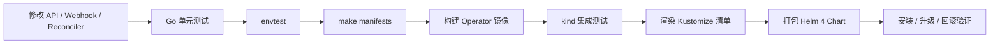
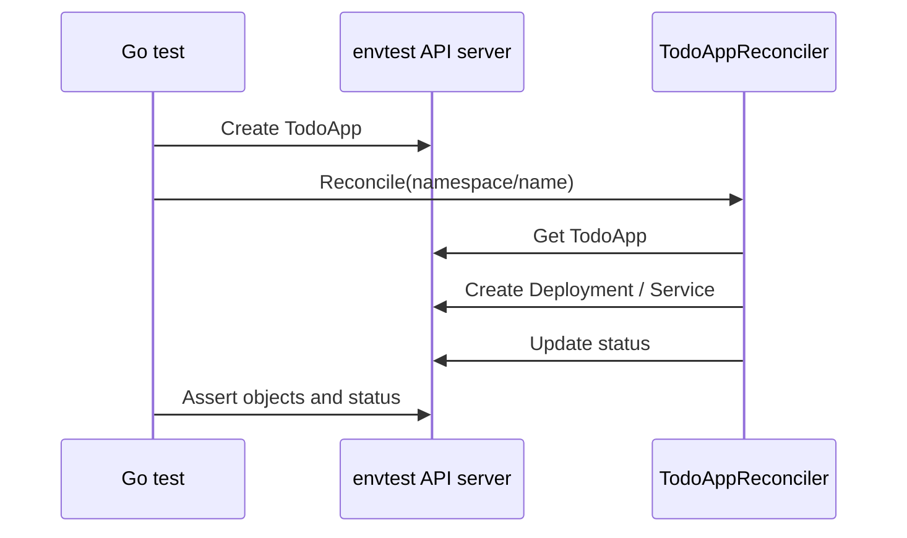

# 第 40 篇：Operator 测试、发布与升级 [C]

第 39 篇已经把 Todo Operator 推进到具备生产雏形的阶段：它有 OwnerReference、Finalizer、Admission Webhook、Conditions、Events 和清晰的删除路径。到这里，一个新的问题出现了：这些能力怎么证明没有坏？更进一步，怎么把 Operator 作为一个可发布、可升级、可回滚的控制面组件交付出去？

很多团队写 Operator 时，会在本地 `make run` 跑通一次就进入集群部署。短期看很快，长期看很危险：Webhook 默认值改坏会阻断用户提交，Finalizer 写错会让对象卡在 `Terminating`，RBAC 少一个 verb 会让 Controller 在生产里循环报错，CRD schema 不兼容会让 GitOps 同步失败。本篇的目标就是把第 39 篇的功能纳入测试和发布流水线。

本篇特色项目是：**为 Todo Operator 建立测试和发布流水线：envtest 单元测试 -> kind 集成测试 -> 构建 Operator 镜像 -> Kustomize/Helm 4 发布 -> 升级与回滚验证。**

## 1. 本章学习目标

### 1.1 知识目标

学完本章后，你应该能够：

- 能解释 `envtest`、fake client、kind 集成测试和真实集群验证分别解决什么问题。
- 能描述 Operator 发布时 CRD、RBAC、Webhook、Deployment 和镜像版本之间的依赖顺序。
- 能说明 Helm 4 Chart 与 Kustomize 在 Operator 发布中的职责边界。
- 能解释 CRD 升级为什么不能等同于普通 Deployment 升级，以及回滚时有什么限制。
- 能理解测试用例、发布清单和升级策略如何共同降低控制面变更风险。

### 1.2 技能目标

学完本章后，你应该能够：

- 能为 `TodoApp` 的默认值、校验、Reconcile、Finalizer 和 Conditions 编写自动化测试。
- 能在 kind 集群中运行端到端集成测试，验证 Webhook、Deployment、Service 和删除清理。
- 能构建 Todo Operator 镜像，并用 Kustomize 生成可审查的发布清单。
- 能整理一个最小可用的 Helm 4 Chart，用 `helm install`、`helm upgrade` 和 `helm rollback` 管理 Operator。
- 能编写发布前 checklist，判断一次 Operator 升级是否具备上线条件。

## 2. 本章工作场景与真实案例

### 2.1 技术痛点

Operator 的测试难点不在“能不能写 Go 单元测试”，而在它横跨了多层 Kubernetes 行为。`TodoApp` 的默认值发生在 Admission 阶段，schema 校验发生在 API server 写入路径，Reconcile 创建的是 Deployment 和 Service，Finalizer 又依赖删除语义和重试。只用 fake client 很容易测出一个“看起来通过”的结果，却没有真正验证 CRD、status subresource、OwnerReference、RBAC 或 Webhook 配置。

发布也同样容易出问题。业务服务镜像升级失败，最多影响一个应用；Operator 升级失败，可能影响所有由它管理的 `TodoApp`。如果新版本 Controller 和旧版本 CRD 不兼容，Reconcile 会持续报错；如果 Webhook Service 没有 endpoints，用户提交 CR 会被 API server 拦截；如果 Helm 回滚只回滚 Deployment，却没有考虑 CRD schema 已经变化，就可能留下更难排查的不一致状态。

本篇把测试和发布放在一起讲，是因为它们在真实团队里不是两件事。测试不是为了“覆盖率数字好看”，而是为了决定能不能发布；发布不是把 YAML apply 一遍，而是把测试过的镜像、生成过的 RBAC、校验过的 CRD 和明确的回滚路径组合成一个可重复流程。

### 2.2 团队协作场景

平台开发者负责编写 envtest 和 Reconciler 测试，确保 `TodoApp` API、Webhook 和 Controller 行为可回归。平台 SRE 负责 kind 集成测试、镜像构建、Chart 发布、证书依赖、升级窗口和回滚演练。业务开发者只关心一件事：升级 Operator 后，他们已有的 `TodoApp` YAML 是否仍然能创建、更新、删除，并且状态是否可读。

在企业内部平台中，Operator 常常由平台团队统一发布到多个环境。开发环境可以允许快速迭代；测试环境必须跑端到端验证；生产环境则需要变更审批、镜像不可变 tag、发布前 dry-run、发布后 smoke test 和明确的 rollback 命令。本篇实验会把这些动作简化成学习者能在本地完成的版本。

### 2.3 课程项目关联

本篇继续使用第 39 篇的 `<project-root>/operator/kubebuilder/` 项目，并新增 `<project-root>/operator/helm/todo-operator/`。项目版本线推进到阶段六子版本 `v4.6-operator-release`，它仍属于 `v4.0-operator` 总版本线。

本篇产出会被后续章节继续复用：

- 第 41 篇会基于本篇的测试和发布流水线，继续做 RBAC 最小化、Watch 范围限制、性能和可观测性增强。
- 第 42 篇会把最终 Operator 作为 Cloud Native Todo Platform 的一键交付入口。
- 本篇新增的 `test/envtest/`、`test/e2e/` 和 `operator/helm/todo-operator/` 会成为后续生产化改造的安全网。

## 3. 核心概念

### 3.1 Operator 测试金字塔

Operator 的测试可以分成四层。

表 40-1 Operator 测试层次

| 层次 | 运行位置 | 适合验证 | 不适合验证 |
|---|---|---|---|
| 纯函数测试 | 本地 Go 进程 | 默认值函数、字段校验、helper 函数 | API server 行为 |
| envtest | 本地临时 API server 和 etcd | CRD schema、status subresource、Reconciler 创建资源 | 真实网络、镜像拉取、Webhook Service 可达性 |
| kind 集成测试 | 本地 Kubernetes 集群 | Webhook、RBAC、Deployment、Service、镜像运行 | 大规模和云厂商差异 |
| 真实环境验证 | 共享或生产前集群 | 网络、证书、镜像仓库、监控、升级窗口 | 快速高频回归 |

`envtest` 是 controller-runtime 提供的测试工具。它会在本地拉起一个真实的 API server 和 etcd，并安装 CRD。和 fake client 相比，它能验证更多 Kubernetes API 行为，例如 status subresource、OpenAPI schema、resourceVersion 和 deletionTimestamp。它仍然不是完整集群：不会调度 Pod，也不会真的运行 Deployment，所以镜像拉取和 Webhook Service 可达性要交给 kind 集成测试。

还要注意一个边界：本篇的 envtest 不安装 Admission Webhook 调用链。Webhook 默认值和校验会先通过直接 Go 测试覆盖，真正的 API server 调用 Webhook 行为放到 kind 集成测试里验证。如果你要在 envtest 中测试 Admission 调用链，需要额外配置 `WebhookInstallOptions` 并启动 Webhook server，本篇不把它放进主实验，避免一次引入过多基础设施。

本篇采用的策略是：Webhook 默认值和校验先做直接 Go 测试；Reconciler 使用 envtest 验证 Deployment、Service、status 和 Finalizer；完整部署链路使用 kind 验证。

### 3.2 envtest 与 fake client 的边界

fake client 是一个内存对象存储，优点是快，缺点是太“听话”。例如你把 status 当成普通字段更新，fake client 可能通过；真实 API server 会要求 status subresource 权限和独立更新路径。你写了非法 CR，fake client 也可能接受；真实 API server 会先执行 CRD schema 校验。

envtest 的价值是让测试更接近真实 API server。它会读取 `config/crd/bases/` 中的 CRD，启动 API server 后再让测试创建 `TodoApp`。如果 CRD 没有声明 status subresource，`r.Status().Update(ctx, todo)` 就会暴露问题；如果 schema 和 Go 类型不匹配，创建对象时也更容易失败。

但 envtest 不会替你启动 Controller Manager，也不会调度 Pod。测试中需要显式调用 `Reconcile`，并通过修改 Deployment status 来模拟“Pod 已经 Ready”。这不是缺点，而是边界：envtest 负责 API 层和 Controller 逻辑，kind 负责完整集群行为。

### 3.3 kind 集成测试验证什么

kind 集成测试把 Operator 部署进一个真实 Kubernetes 集群。它能验证：

- 镜像是否能被集群拉取或通过 `kind load` 加载。
- RBAC 是否足够让 Controller 创建 Deployment、Service、Event 和更新 status/finalizer。
- cert-manager 是否能为 Webhook 注入证书。
- Mutating/Validating Webhook 是否真的被 API server 调用。
- 创建、扩缩容、删除 `TodoApp` 后，底层资源是否按预期变化。

它的代价是慢，通常需要几十秒到几分钟。因此本篇建议把 envtest 放在每次提交和本地快速回归里，把 kind 集成测试放在 PR、发布候选镜像或夜间流水线里。

### 3.4 发布清单：CRD、RBAC、Webhook 和 Deployment 的顺序

Operator 发布不是只发布一个 Deployment。一个完整发布通常包含：

1. CRD：让 API server 认识 `TodoApp`。
2. RBAC：让 Controller 有权限读写主资源、status、finalizer 和子资源。
3. Webhook 证书与 Service：让 API server 能调用默认值和校验逻辑。
4. WebhookConfiguration：把 API 请求路由到 Webhook Service。
5. Controller Manager Deployment：运行 Reconciler。
6. 示例 CR 或业务 CR：用户提交的 `TodoApp`。

顺序错了会出现很具体的问题：先提交 CR 再安装 CRD，会报 `no matches for kind`；WebhookConfiguration 已经启用但 Service 没有 endpoints，会导致创建 `TodoApp` 失败；Controller Deployment 先启动但 RBAC 不足，会不断报 `forbidden`。

本篇会同时使用 Kustomize 和 Helm 4。Kustomize 继续作为 Kubebuilder 生成清单的源头，适合开发和审查；Helm 4 Chart 用于打包、版本化、安装、升级和回滚。

### 3.5 CRD 升级与回滚不是普通应用升级

Deployment 回滚通常很直接：切回上一版镜像即可。CRD 升级更敏感，因为它定义的是 API 契约。一旦用户已经提交了新字段，直接回滚到旧 CRD 可能导致对象无法读取或无法更新。即使 Helm 管理了 Chart release，也不能把 CRD schema、存储版本迁移和对象兼容性当成普通模板处理。

安全的 CRD 升级策略通常是：

1. 新增字段优先做可选字段，旧对象继续合法。
2. 新版本 Controller 同时兼容旧字段和新字段。
3. 发布前用 server-side dry-run 验证旧样例和新样例。
4. 需要新 API 版本时，先让旧版本继续 `served: true`。
5. 回滚时先回滚 Controller，再评估 CRD 是否真的需要回滚；不要盲目删除新版本 schema。

本篇不会完整实现 conversion webhook，但会在发布流程中加入兼容性检查和回滚演练。

## 4. 原理深入

### 4.1 从提交代码到发布 Operator 的流水线

图 40-1 Todo Operator 测试发布流水线



这条流水线有两个关键原则。第一，越靠前越快，越靠后越真实。Webhook helper 的测试应该秒级完成；kind 集成测试慢一些，但能发现本地 API server 发现不了的问题。第二，发布产物必须来自已测试的输入。测试的是同一份 Go 代码、同一个镜像 tag、同一套 CRD/RBAC/Webhook 清单，才有发布意义。

### 4.2 envtest 中 Reconcile 为什么要手动触发

真实集群里，Controller Manager 会监听 `TodoApp`、Deployment 和 Service 的 watch 事件，然后把请求放进队列。envtest 只启动 API server 和 etcd，不会自动启动你的 Controller。测试代码要手动构造 `ctrl.Request`，调用 `Reconcile`，再读取 API server 中的对象。

图 40-2 envtest 调用链



这种手动触发让测试很清晰：你能精确知道第几次 Reconcile 应该添加 Finalizer，第几次应该创建子资源，第几次应该把 status 变成 Ready。缺点是它不会自动覆盖所有 watch 事件，所以端到端行为还要交给 kind。

### 4.3 发布和回滚的控制点

一次 Operator 发布至少有三个控制点：

- **发布前**：`make generate`、`make manifests`、`go test ./...`、envtest、kind 集成测试、`helm lint` 和 `helm template --include-crds` 必须通过。
- **发布中**：先安装或更新 CRD/RBAC/Webhook 依赖，再滚动升级 Controller Manager。
- **发布后**：创建测试 `TodoApp`，验证默认值、校验、Deployment/Service、status、Events 和删除清理。

回滚也要分层处理。镜像回滚可以通过 `helm rollback` 或重新 `make deploy IMG=...` 完成；CRD 回滚必须先确认没有新字段、新存储版本或新对象依赖。真实生产中，CRD 变化通常需要单独审批和更严格的迁移计划。

## 5. 手把手实验：为 Todo Operator 建立测试和发布流水线

### 5.1 步骤 1：实验目标

本实验会继续使用第 39 篇的 `<project-root>/operator/kubebuilder/`，并新增以下内容：

- `internal/webhook/v1alpha1/todoapp_webhook_test.go`：直接测试默认值和校验逻辑。
- `test/envtest/todoapp_envtest_test.go`：使用 envtest 验证 Reconciler 行为。
- `test/e2e/run-kind-e2e.sh`：在 kind 中执行端到端集成测试。
- `dist/`：保存 Kustomize 渲染出的发布清单。
- `<project-root>/operator/helm/todo-operator/`：Operator Helm 4 Chart。

完成后，你应该能够执行：

```bash
go test ./...
test/e2e/run-kind-e2e.sh
helm install todo-operator ../helm/todo-operator -n todo-operator-system --create-namespace
helm upgrade todo-operator ../helm/todo-operator -n todo-operator-system
helm rollback todo-operator 1 -n todo-operator-system
```

### 5.2 步骤 2：实验环境

本章继续使用第 39 篇的工具链。后续命令默认在 Bash 环境中执行，并且当前目录是 `<project-root>/operator/kubebuilder/`。

表 40-2 本章实验工具版本

| 工具 | 建议版本 | 用途 |
|---|---|---|
| Go | 1.26.x | 编译和测试 Operator |
| Docker | 29.x | 构建本地 Operator 镜像 |
| kubectl | 1.36.x | 操作 Kubernetes API |
| kind | 0.31+ | 创建本地 Kubernetes 1.36 集群 |
| Kubebuilder | 4.11.x | 生成代码、CRD、RBAC 和 Webhook 清单 |
| controller-runtime envtest | 随 Kubebuilder 项目依赖 | 启动本地 API server 和 etcd |
| cert-manager | 1.20.x | 为 Webhook 注入证书 |
| Helm | 4.2.x | 打包、安装、升级和回滚 Operator |
| GNU Make | 4.x | 执行生成、构建、部署命令 |

> **版本兼容提示**：本章继续按课程计划使用 cert-manager 1.20.x 和 Kubernetes 1.36.x。若你所在环境的证书组件与 Kubernetes 小版本存在兼容性问题，先按团队环境矩阵调整实验版本，并记录实际版本；不要在正文命令中混用多个 cert-manager 版本。

确认当前目录：

```bash
pwd
```

预期输出类似：

```text
<project-root>/operator/kubebuilder
```

确认工具版本：

```bash
go version
docker version --format '{{.Server.Version}}'
kubectl version --client
kind version
kubebuilder version
helm version
```

设置本章镜像和集群名称：

```bash
export OPERATOR_IMG=todo-operator:v0.3.0-test
export KIND_NODE_IMAGE=kindest/node:v1.36.0
export KIND_CLUSTER_NAME=todo-operator-e2e
```

Windows PowerShell 使用下面的等价写法：

```powershell
$env:OPERATOR_IMG = "todo-operator:v0.3.0-test"
$env:KIND_NODE_IMAGE = "kindest/node:v1.36.0"
$env:KIND_CLUSTER_NAME = "todo-operator-e2e"
```

如果 envtest 首次下载较慢，先执行：

```bash
make envtest
```

### 5.3 步骤 3：目录结构

本章完成后，关键目录结构如下：

```text
operator/
├── kubebuilder/
│   ├── api/
│   │   └── v1alpha1/
│   ├── internal/
│   │   ├── controller/
│   │   │   └── todoapp_controller.go
│   │   └── webhook/
│   │       └── v1alpha1/
│   │           ├── todoapp_webhook.go
│   │           └── todoapp_webhook_test.go
│   ├── test/
│   │   ├── envtest/
│   │   │   └── todoapp_envtest_test.go
│   │   └── e2e/
│   │       └── run-kind-e2e.sh
│   ├── config/
│   ├── dist/
│   │   └── todo-operator-v0.3.0.yaml
│   └── Makefile
└── helm/
    └── todo-operator/
        ├── Chart.yaml
        ├── values.yaml
        ├── crds/
        │   └── platform.todo.example.com_todoapps.yaml
        └── templates/
            ├── _helpers.tpl
            ├── certificate.yaml
            ├── deployment.yaml
            ├── rbac.yaml
            ├── service.yaml
            ├── serviceaccount.yaml
            └── webhooks.yaml
```

### 5.4 步骤 4.1：编写 Webhook 直接测试

Webhook 默认值和校验逻辑是普通 Go 代码，可以先直接测试。这类测试快、稳定，适合每次提交都运行。

创建 `internal/webhook/v1alpha1/todoapp_webhook_test.go`：

```go
package v1alpha1

import (
	"context"
	"strings"
	"testing"

	platformv1alpha1 "github.com/example/todo-operator/api/v1alpha1"
)

func TestTodoAppDefault(t *testing.T) {
	todo := &platformv1alpha1.TodoApp{}
	defaulter := &TodoAppCustomDefaulter{}

	if err := defaulter.Default(context.Background(), todo); err != nil {
		t.Fatalf("default TodoApp: %v", err)
	}

	if todo.Spec.Image != platformv1alpha1.DefaultTodoAppImage {
		t.Fatalf("image = %q, want %q", todo.Spec.Image, platformv1alpha1.DefaultTodoAppImage)
	}
	if todo.Spec.Replicas == nil || *todo.Spec.Replicas != platformv1alpha1.DefaultTodoAppReplicas {
		t.Fatalf("replicas = %v, want %d", todo.Spec.Replicas, platformv1alpha1.DefaultTodoAppReplicas)
	}
	if todo.Spec.Port == nil || *todo.Spec.Port != platformv1alpha1.DefaultTodoAppPort {
		t.Fatalf("port = %v, want %d", todo.Spec.Port, platformv1alpha1.DefaultTodoAppPort)
	}
}

func TestTodoAppValidateRejectsLatestImage(t *testing.T) {
	replicas := int32(2)
	port := int32(80)
	todo := &platformv1alpha1.TodoApp{}
	todo.Name = "todo-invalid"
	todo.Spec.Image = "nginx:latest"
	todo.Spec.Replicas = &replicas
	todo.Spec.Port = &port

	validator := &TodoAppCustomValidator{}
	_, err := validator.ValidateCreate(context.Background(), todo)
	if err == nil {
		t.Fatal("ValidateCreate should reject latest image tag")
	}
	if !strings.Contains(err.Error(), "image must include an explicit non-latest tag") {
		t.Fatalf("unexpected error: %v", err)
	}
}

func TestTodoAppValidateWarnsOnPortChange(t *testing.T) {
	oldPort := int32(80)
	newPort := int32(8080)
	replicas := int32(2)

	oldTodo := &platformv1alpha1.TodoApp{}
	oldTodo.Name = "todo-platform"
	oldTodo.Spec.Image = "nginxdemos/hello:plain-text"
	oldTodo.Spec.Replicas = &replicas
	oldTodo.Spec.Port = &oldPort

	newTodo := oldTodo.DeepCopy()
	newTodo.Spec.Port = &newPort

	validator := &TodoAppCustomValidator{}
	warnings, err := validator.ValidateUpdate(context.Background(), oldTodo, newTodo)
	if err != nil {
		t.Fatalf("ValidateUpdate returned error: %v", err)
	}
	if len(warnings) != 1 {
		t.Fatalf("warnings length = %d, want 1", len(warnings))
	}
}
```

这三个测试分别覆盖默认值、强拒绝和 warning。它们不会启动 API server，因此不能替代 envtest，但能快速保护 Webhook 业务逻辑。

### 5.5 步骤 4.2：编写 envtest Reconciler 测试

创建目录：

```bash
mkdir -p test/envtest
```

创建 `test/envtest/todoapp_envtest_test.go`：

```go
package envtest

import (
	"context"
	"os"
	"path/filepath"
	"testing"
	"time"

	appsv1 "k8s.io/api/apps/v1"
	corev1 "k8s.io/api/core/v1"
	apierrors "k8s.io/apimachinery/pkg/api/errors"
	metav1 "k8s.io/apimachinery/pkg/apis/meta/v1"
	"k8s.io/apimachinery/pkg/runtime"
	utilruntime "k8s.io/apimachinery/pkg/util/runtime"
	clientgoscheme "k8s.io/client-go/kubernetes/scheme"
	"k8s.io/client-go/tools/record"
	ctrl "sigs.k8s.io/controller-runtime"
	"sigs.k8s.io/controller-runtime/pkg/client"
	"sigs.k8s.io/controller-runtime/pkg/envtest"
	"sigs.k8s.io/controller-runtime/pkg/log/zap"

	platformv1alpha1 "github.com/example/todo-operator/api/v1alpha1"
	"github.com/example/todo-operator/internal/controller"
)

var (
	testEnv   *envtest.Environment
	testClient client.Client
	testScheme = runtime.NewScheme()
)

func TestMain(m *testing.M) {
	ctrl.SetLogger(zap.New(zap.UseDevMode(true)))

	utilruntime.Must(clientgoscheme.AddToScheme(testScheme))
	utilruntime.Must(platformv1alpha1.AddToScheme(testScheme))

	testEnv = &envtest.Environment{
		CRDDirectoryPaths: []string{
			filepath.Join("..", "..", "config", "crd", "bases"),
		},
		ErrorIfCRDPathMissing: true,
	}

	cfg, err := testEnv.Start()
	if err != nil {
		panic(err)
	}

	testClient, err = client.New(cfg, client.Options{Scheme: testScheme})
	if err != nil {
		panic(err)
	}

	code := m.Run()

	if err := testEnv.Stop(); err != nil {
		panic(err)
	}
	os.Exit(code)
}

func TestReconcileCreatesDeploymentServiceAndStatus(t *testing.T) {
	ctx := context.Background()
	ensureNamespace(t, ctx, "default")

	replicas := int32(2)
	port := int32(80)
	todo := &platformv1alpha1.TodoApp{
		ObjectMeta: metav1.ObjectMeta{
			Name:      "todo-envtest",
			Namespace: "default",
		},
		Spec: platformv1alpha1.TodoAppSpec{
			Image:    "nginxdemos/hello:plain-text",
			Replicas: &replicas,
			Port:     &port,
		},
	}
	if err := testClient.Create(ctx, todo); err != nil {
		t.Fatalf("create TodoApp: %v", err)
	}

	reconciler := newReconciler()
	request := ctrl.Request{NamespacedName: client.ObjectKeyFromObject(todo)}

	if _, err := reconciler.Reconcile(ctx, request); err != nil {
		t.Fatalf("first reconcile: %v", err)
	}
	if _, err := reconciler.Reconcile(ctx, request); err != nil {
		t.Fatalf("second reconcile: %v", err)
	}

	var deployment appsv1.Deployment
	if err := testClient.Get(ctx, request.NamespacedName, &deployment); err != nil {
		t.Fatalf("get Deployment: %v", err)
	}
	if len(deployment.OwnerReferences) != 1 {
		t.Fatalf("ownerReferences length = %d, want 1", len(deployment.OwnerReferences))
	}

	var service corev1.Service
	if err := testClient.Get(ctx, request.NamespacedName, &service); err != nil {
		t.Fatalf("get Service: %v", err)
	}
	if service.Spec.Ports[0].TargetPort.IntVal != port {
		t.Fatalf("service targetPort = %d, want %d", service.Spec.Ports[0].TargetPort.IntVal, port)
	}

	deployment.Status.ReadyReplicas = replicas
	if err := testClient.Status().Update(ctx, &deployment); err != nil {
		t.Fatalf("update Deployment status: %v", err)
	}

	if _, err := reconciler.Reconcile(ctx, request); err != nil {
		t.Fatalf("third reconcile: %v", err)
	}

	var updated platformv1alpha1.TodoApp
	if err := testClient.Get(ctx, request.NamespacedName, &updated); err != nil {
		t.Fatalf("get updated TodoApp: %v", err)
	}
	if updated.Status.Phase != platformv1alpha1.TodoAppPhaseReady {
		t.Fatalf("phase = %q, want %q", updated.Status.Phase, platformv1alpha1.TodoAppPhaseReady)
	}
	if updated.Status.ReadyReplicas != replicas {
		t.Fatalf("readyReplicas = %d, want %d", updated.Status.ReadyReplicas, replicas)
	}
}

func TestReconcileRemovesFinalizerOnDelete(t *testing.T) {
	ctx := context.Background()
	ensureNamespace(t, ctx, "default")

	replicas := int32(1)
	port := int32(80)
	todo := &platformv1alpha1.TodoApp{
		ObjectMeta: metav1.ObjectMeta{
			Name:      "todo-delete",
			Namespace: "default",
		},
		Spec: platformv1alpha1.TodoAppSpec{
			Image:    "nginxdemos/hello:plain-text",
			Replicas: &replicas,
			Port:     &port,
		},
	}
	if err := testClient.Create(ctx, todo); err != nil {
		t.Fatalf("create TodoApp: %v", err)
	}

	reconciler := newReconciler()
	request := ctrl.Request{NamespacedName: client.ObjectKeyFromObject(todo)}

	if _, err := reconciler.Reconcile(ctx, request); err != nil {
		t.Fatalf("reconcile add finalizer: %v", err)
	}
	if err := testClient.Get(ctx, request.NamespacedName, todo); err != nil {
		t.Fatalf("get TodoApp after finalizer reconcile: %v", err)
	}
	if len(todo.Finalizers) == 0 {
		t.Fatal("finalizer should be added before delete")
	}

	if err := testClient.Delete(ctx, todo); err != nil {
		t.Fatalf("delete TodoApp: %v", err)
	}
	if _, err := reconciler.Reconcile(ctx, request); err != nil {
		t.Fatalf("reconcile delete: %v", err)
	}

	eventually(t, 5*time.Second, func() bool {
		var current platformv1alpha1.TodoApp
		err := testClient.Get(ctx, request.NamespacedName, &current)
		return apierrors.IsNotFound(err)
	}, "TodoApp should be deleted after finalizer cleanup")
}

func newReconciler() *controller.TodoAppReconciler {
	return &controller.TodoAppReconciler{
		Client:   testClient,
		Scheme:   testScheme,
		Recorder: record.NewFakeRecorder(20),
	}
}

func ensureNamespace(t *testing.T, ctx context.Context, name string) {
	t.Helper()
	namespace := &corev1.Namespace{ObjectMeta: metav1.ObjectMeta{Name: name}}
	err := testClient.Create(ctx, namespace)
	if err != nil && !apierrors.IsAlreadyExists(err) {
		t.Fatalf("create namespace %s: %v", name, err)
	}
}

func eventually(t *testing.T, timeout time.Duration, condition func() bool, message string) {
	t.Helper()
	deadline := time.Now().Add(timeout)
	for time.Now().Before(deadline) {
		if condition() {
			return
		}
		time.Sleep(100 * time.Millisecond)
	}
	t.Fatal(message)
}
```

这份测试有一个重要细节：`envtest` 不会调度 Pod，所以我们手动修改 Deployment status，把 `ReadyReplicas` 设为期望值，再触发一次 Reconcile。这样可以专注验证 Controller 根据 Deployment 状态回写 `TodoApp.status` 的逻辑。

### 5.6 步骤 5-6：运行代码生成并观察 envtest 输出

先重新生成 DeepCopy、CRD、RBAC 和 Webhook 清单：

```bash
make generate
make manifests
```

整理依赖：

```bash
go mod tidy
```

运行全部 Go 测试：

```bash
go test ./...
```

预期输出类似：

```text
ok  	github.com/example/todo-operator/internal/webhook/v1alpha1	0.231s
ok  	github.com/example/todo-operator/test/envtest	8.742s
```

如果首次运行时 envtest 二进制缺失，先执行：

```bash
make envtest
go test ./test/envtest -run TestReconcileCreatesDeploymentServiceAndStatus -v
```

这一步属于实验步骤 6：观察输出。判断标准不是耗时完全相同，而是测试包全部 `ok`，且没有 `failed to start control plane`、`no matches for kind` 或 status 更新错误。

### 5.7 步骤 4.3：编写 kind 端到端集成测试脚本

envtest 已经验证了 Reconciler，但 Webhook 证书、Service endpoints、RBAC 和镜像运行还需要完整集群。创建目录：

```bash
mkdir -p test/e2e
```

创建 `test/e2e/run-kind-e2e.sh`：

```bash
#!/usr/bin/env bash
set -euo pipefail

CLUSTER_NAME="${KIND_CLUSTER_NAME:-todo-operator-e2e}"
KIND_NODE_IMAGE="${KIND_NODE_IMAGE:-kindest/node:v1.36.0}"
IMG="${OPERATOR_IMG:-todo-operator:v0.3.0-test}"
CERT_MANAGER_VERSION="${CERT_MANAGER_VERSION:-v1.20.0}"
DELETE_CLUSTER="${DELETE_CLUSTER:-false}"

ROOT_DIR="$(cd "$(dirname "${BASH_SOURCE[0]}")/../.." && pwd)"
cd "${ROOT_DIR}"

cleanup() {
  kubectl delete -f /tmp/todoapp-invalid.yaml --ignore-not-found=true >/dev/null 2>&1 || true
  kubectl delete -f /tmp/todoapp-e2e.yaml --ignore-not-found=true >/dev/null 2>&1 || true
  make undeploy >/dev/null 2>&1 || true
  if [[ "${DELETE_CLUSTER}" == "true" ]]; then
    kind delete cluster --name "${CLUSTER_NAME}" >/dev/null 2>&1 || true
  fi
}
trap cleanup EXIT

if ! kind get clusters | grep -qx "${CLUSTER_NAME}"; then
  kind create cluster --name "${CLUSTER_NAME}" --image "${KIND_NODE_IMAGE}"
fi

kubectl config use-context "kind-${CLUSTER_NAME}"

make generate
make manifests

kubectl apply -f "https://github.com/cert-manager/cert-manager/releases/download/${CERT_MANAGER_VERSION}/cert-manager.yaml"
kubectl wait --for=condition=Available deployment --all -n cert-manager --timeout=300s

docker build -t "${IMG}" .
kind load docker-image "${IMG}" --name "${CLUSTER_NAME}"

make deploy IMG="${IMG}"
kubectl wait --for=condition=Available deployment/todo-operator-controller-manager -n todo-operator-system --timeout=180s

kubectl get certificate,issuer -n todo-operator-system
kubectl get svc,endpoints -n todo-operator-system

cat > /tmp/todoapp-e2e.yaml <<'YAML'
apiVersion: platform.todo.example.com/v1alpha1
kind: TodoApp
metadata:
  name: todo-e2e
  namespace: default
spec:
  image: nginxdemos/hello:plain-text
  replicas: 2
  port: 80
YAML

kubectl apply -f /tmp/todoapp-e2e.yaml

for i in {1..60}; do
  if kubectl get deployment todo-e2e >/dev/null 2>&1; then
    break
  fi
  sleep 2
done
kubectl get deployment todo-e2e >/dev/null
kubectl rollout status deployment/todo-e2e --timeout=180s

for i in {1..60}; do
  phase="$(kubectl get todoapp todo-e2e -o jsonpath='{.status.phase}' 2>/dev/null || true)"
  ready="$(kubectl get todoapp todo-e2e -o jsonpath='{.status.readyReplicas}' 2>/dev/null || true)"
  if [[ "${phase}" == "Ready" && "${ready}" == "2" ]]; then
    break
  fi
  sleep 2
done

phase="$(kubectl get todoapp todo-e2e -o jsonpath='{.status.phase}')"
ready="$(kubectl get todoapp todo-e2e -o jsonpath='{.status.readyReplicas}')"
if [[ "${phase} ${ready}" != "Ready 2" ]]; then
  echo "TodoApp status = ${phase} ${ready}, want Ready 2"
  exit 1
fi
echo "${phase} ${ready}"
kubectl get deployment,service -l app.kubernetes.io/instance=todo-e2e

cat > /tmp/todoapp-invalid.yaml <<'YAML'
apiVersion: platform.todo.example.com/v1alpha1
kind: TodoApp
metadata:
  name: todo-invalid-e2e
  namespace: default
spec:
  image: nginx:latest
  replicas: 2
  port: 80
YAML

if kubectl apply -f /tmp/todoapp-invalid.yaml; then
  echo "invalid TodoApp was accepted unexpectedly"
  exit 1
fi

kubectl delete -f /tmp/todoapp-e2e.yaml
kubectl wait --for=delete todoapp/todo-e2e --timeout=120s
```

给脚本增加执行权限：

```bash
chmod +x test/e2e/run-kind-e2e.sh
```

本脚本使用 Bash here-doc 和 `chmod`，Windows 学习者建议在 Git Bash 或 WSL 中运行。如果只能使用 PowerShell，可以把脚本内容保存为 `.ps1`，并把 `cat > file <<'YAML'` 改写为 PowerShell here-string：`@' ... '@ | Set-Content file.yaml`。

运行集成测试：

```bash
test/e2e/run-kind-e2e.sh
```

预期输出中应包含：

```text
deployment.apps/todo-operator-controller-manager condition met
deployment "todo-e2e" successfully rolled out
Ready 2
```

脚本中有一行保护逻辑：如果出现 `invalid TodoApp was accepted unexpectedly`，说明非法 `TodoApp` 被接受，脚本会主动 `exit 1`。正常情况下，你会看到 API server 返回 `image must include an explicit non-latest tag` 一类拒绝信息。脚本还通过 `trap cleanup EXIT` 做失败清理：无论中途哪一步失败，都会尽力删除测试 CR、卸载 Operator；只有显式设置 `DELETE_CLUSTER=true` 时才会删除 kind 集群。

### 5.8 步骤 5-7：生成并验证 Kustomize 发布清单

Kustomize 继续作为 Kubebuilder 项目的清单源头。这里必须把清单中的 manager 镜像固定为本章刚测试过的 `OPERATOR_IMG`，否则发布清单可能仍然引用 Kubebuilder 默认镜像，和集成测试使用的镜像不一致。

先生成发布目录和安装清单：

```bash
mkdir -p dist
make build-installer IMG="${OPERATOR_IMG}"
cp dist/install.yaml dist/todo-operator-v0.3.0.yaml
```

确认清单里包含本章镜像 tag：

```bash
grep -n "${OPERATOR_IMG}" dist/todo-operator-v0.3.0.yaml
```

检查清单中是否包含关键对象：

```bash
grep -E "kind: (CustomResourceDefinition|Deployment|Service|MutatingWebhookConfiguration|ValidatingWebhookConfiguration|Certificate|Issuer)" dist/todo-operator-v0.3.0.yaml
```

预期输出类似：

```text
kind: CustomResourceDefinition
kind: Service
kind: Deployment
kind: Certificate
kind: Issuer
kind: MutatingWebhookConfiguration
kind: ValidatingWebhookConfiguration
```

使用 server-side dry-run 验证清单：

```bash
kubectl get crd certificates.cert-manager.io issuers.cert-manager.io
kubectl apply --dry-run=server -f dist/todo-operator-v0.3.0.yaml
```

第一条命令用于确认 cert-manager CRD 已经存在，因为发布清单中包含 `Certificate` 和 `Issuer`。如果它们不存在，先安装 cert-manager，或者仅使用 `kubectl apply --dry-run=client` 做本地结构检查。server-side dry-run 的价值是让 API server 真正校验当前集群是否认识这些资源类型。

如果 dry-run 通过，再应用：

```bash
kubectl apply -f dist/todo-operator-v0.3.0.yaml
```

如果你执行了真实 `apply`，进入 Helm 实验前先撤销这次 Kustomize 发布，避免 Helm 接管同名资源时报冲突：

```bash
kubectl delete -f dist/todo-operator-v0.3.0.yaml --ignore-not-found
```

这条删除命令只适合本地临时 kind 实验集群。共享集群或生产前环境中不要用它清理整份清单，因为其中包含 CRD；删除 CRD 会影响所有 `TodoApp` 实例。共享环境应只卸载本次发布的 Deployment、Webhook、RBAC 和证书资源，并由平台负责人单独管理 CRD 生命周期。

Kustomize 发布方式适合开发和审查，因为它直接反映 Kubebuilder 生成结果。缺点是它没有 Helm release 记录，升级和回滚需要自己管理文件版本。因此下一步会整理 Helm 4 Chart。

### 5.9 步骤 4.4：整理 Helm 4 Chart

从 `operator/kubebuilder/` 创建 Chart 目录：

```bash
mkdir -p ../helm/todo-operator/crds
mkdir -p ../helm/todo-operator/templates
cp config/crd/bases/platform.todo.example.com_todoapps.yaml ../helm/todo-operator/crds/
```

Helm 的 `crds/` 目录只适合安装 CRD 初始版本：安装 release 时它会先于模板资源被创建，但 Helm 不会像普通模板那样升级或删除这些 CRD。生产中 CRD 升级应走独立的兼容性检查和审批流程；本章把 CRD 放进 `crds/`，是为了让本地实验能一条 `helm install` 完成首次安装。

创建 `../helm/todo-operator/Chart.yaml`：

```yaml
apiVersion: v2
name: todo-operator
description: Helm 4 Chart for the Cloud Native Todo Operator
type: application
version: 0.3.0
appVersion: v0.3.0-test
kubeVersion: ">=1.36.0-0"
```

创建 `../helm/todo-operator/values.yaml`：

```yaml
image:
  repository: todo-operator # ← 本地 kind 实验镜像仓库名
  tag: v0.3.0-test # ← 必须使用不可变版本 tag，生产不要使用 latest
  pullPolicy: IfNotPresent # ← kind load 后本地节点已有镜像

replicaCount: 1 # ← 第 41 篇会扩展为高可用多副本

serviceAccount:
  create: true
  name: ""

webhook:
  enabled: true
  servicePort: 443
  containerPort: 9443

resources:
  requests:
    cpu: 50m
    memory: 64Mi
  limits:
    cpu: 500m
    memory: 256Mi
```

创建 `../helm/todo-operator/templates/_helpers.tpl`：

```gotemplate
{{- define "todo-operator.name" -}}
todo-operator
{{- end -}}

{{- define "todo-operator.fullname" -}}
{{- if .Release.Name -}}
{{ .Release.Name | trunc 63 | trimSuffix "-" }}
{{- else -}}
{{ include "todo-operator.name" . }}
{{- end -}}
{{- end -}}

{{- define "todo-operator.serviceAccountName" -}}
{{- if .Values.serviceAccount.create -}}
{{- default (include "todo-operator.fullname" .) .Values.serviceAccount.name -}}
{{- else -}}
{{- default "default" .Values.serviceAccount.name -}}
{{- end -}}
{{- end -}}
```

创建 `../helm/todo-operator/templates/serviceaccount.yaml`：

```yaml
{{- if .Values.serviceAccount.create }}
apiVersion: v1
kind: ServiceAccount
metadata:
  name: {{ include "todo-operator.serviceAccountName" . }}
  namespace: {{ .Release.Namespace }}
  labels:
    app.kubernetes.io/name: {{ include "todo-operator.name" . }}
    app.kubernetes.io/instance: {{ .Release.Name }}
{{- end }}
```

创建 RBAC 模板前，先查看 Kubebuilder marker 生成的权限：

```bash
make manifests
sed -n '1,220p' config/rbac/role.yaml
```

Helm Chart 中的 RBAC 应与 `config/rbac/role.yaml` 保持一致。后续如果第 41 篇收敛 RBAC marker，需要同步更新这里的模板，避免“测试用 Kustomize 权限”和“发布用 Helm 权限”不一致。

创建 `../helm/todo-operator/templates/rbac.yaml`：

```yaml
apiVersion: rbac.authorization.k8s.io/v1
kind: ClusterRole
metadata:
  name: {{ include "todo-operator.fullname" . }}-manager-role
rules:
  - apiGroups: ["platform.todo.example.com"]
    resources: ["todoapps"]
    verbs: ["get", "list", "watch", "create", "update", "patch", "delete"]
  - apiGroups: ["platform.todo.example.com"]
    resources: ["todoapps/status"]
    verbs: ["get", "update", "patch"]
  - apiGroups: ["platform.todo.example.com"]
    resources: ["todoapps/finalizers"]
    verbs: ["update"]
  - apiGroups: ["apps"]
    resources: ["deployments"]
    verbs: ["get", "list", "watch", "create", "update", "patch", "delete"]
  - apiGroups: [""]
    resources: ["services"]
    verbs: ["get", "list", "watch", "create", "update", "patch", "delete"]
  - apiGroups: [""]
    resources: ["events"]
    verbs: ["create", "patch"]
  - apiGroups: ["coordination.k8s.io"]
    resources: ["leases"]
    verbs: ["get", "list", "watch", "create", "update", "patch", "delete"]
---
apiVersion: rbac.authorization.k8s.io/v1
kind: ClusterRoleBinding
metadata:
  name: {{ include "todo-operator.fullname" . }}-manager-rolebinding
roleRef:
  apiGroup: rbac.authorization.k8s.io
  kind: ClusterRole
  name: {{ include "todo-operator.fullname" . }}-manager-role
subjects:
  - kind: ServiceAccount
    name: {{ include "todo-operator.serviceAccountName" . }}
    namespace: {{ .Release.Namespace }}
```

创建 `../helm/todo-operator/templates/service.yaml`：

```yaml
{{- if .Values.webhook.enabled }}
apiVersion: v1
kind: Service
metadata:
  name: {{ include "todo-operator.fullname" . }}-webhook-service
  namespace: {{ .Release.Namespace }}
  labels:
    app.kubernetes.io/name: {{ include "todo-operator.name" . }}
    app.kubernetes.io/instance: {{ .Release.Name }}
spec:
  ports:
    - port: {{ .Values.webhook.servicePort }}
      targetPort: webhook-server
      protocol: TCP
      name: https
  selector:
    app.kubernetes.io/name: {{ include "todo-operator.name" . }}
    app.kubernetes.io/instance: {{ .Release.Name }}
{{- end }}
```

创建 `../helm/todo-operator/templates/deployment.yaml`：

```yaml
apiVersion: apps/v1
kind: Deployment
metadata:
  name: {{ include "todo-operator.fullname" . }}-controller-manager
  namespace: {{ .Release.Namespace }}
  labels:
    app.kubernetes.io/name: {{ include "todo-operator.name" . }}
    app.kubernetes.io/instance: {{ .Release.Name }}
spec:
  replicas: {{ .Values.replicaCount }}
  selector:
    matchLabels:
      app.kubernetes.io/name: {{ include "todo-operator.name" . }}
      app.kubernetes.io/instance: {{ .Release.Name }}
  template:
    metadata:
      labels:
        app.kubernetes.io/name: {{ include "todo-operator.name" . }}
        app.kubernetes.io/instance: {{ .Release.Name }}
    spec:
      serviceAccountName: {{ include "todo-operator.serviceAccountName" . }}
      containers:
        - name: manager
          image: "{{ .Values.image.repository }}:{{ .Values.image.tag }}"
          imagePullPolicy: {{ .Values.image.pullPolicy }}
          args:
            - --leader-elect=false
            - --health-probe-bind-address=:8081
            - --metrics-bind-address=:8080
            - --webhook-cert-path=/tmp/k8s-webhook-server/serving-certs
          ports:
            - name: webhook-server
              containerPort: {{ .Values.webhook.containerPort }}
              protocol: TCP
          livenessProbe:
            httpGet:
              path: /healthz
              port: 8081
            initialDelaySeconds: 15
            periodSeconds: 20
          readinessProbe:
            httpGet:
              path: /readyz
              port: 8081
            initialDelaySeconds: 5
            periodSeconds: 10
          resources:
            {{- toYaml .Values.resources | nindent 12 }}
          volumeMounts:
            - mountPath: /tmp/k8s-webhook-server/serving-certs
              name: cert
              readOnly: true
      volumes:
        - name: cert
          secret:
            secretName: {{ include "todo-operator.fullname" . }}-webhook-server-cert
```

创建 `../helm/todo-operator/templates/certificate.yaml`：

```yaml
{{- if .Values.webhook.enabled }}
apiVersion: cert-manager.io/v1
kind: Issuer
metadata:
  name: {{ include "todo-operator.fullname" . }}-selfsigned-issuer
  namespace: {{ .Release.Namespace }}
spec:
  selfSigned: {}
---
apiVersion: cert-manager.io/v1
kind: Certificate
metadata:
  name: {{ include "todo-operator.fullname" . }}-serving-cert
  namespace: {{ .Release.Namespace }}
spec:
  dnsNames:
    - {{ include "todo-operator.fullname" . }}-webhook-service.{{ .Release.Namespace }}.svc
    - {{ include "todo-operator.fullname" . }}-webhook-service.{{ .Release.Namespace }}.svc.cluster.local
  issuerRef:
    kind: Issuer
    name: {{ include "todo-operator.fullname" . }}-selfsigned-issuer
  secretName: {{ include "todo-operator.fullname" . }}-webhook-server-cert
{{- end }}
```

创建 `../helm/todo-operator/templates/webhooks.yaml`：

```yaml
{{- if .Values.webhook.enabled }}
apiVersion: admissionregistration.k8s.io/v1
kind: MutatingWebhookConfiguration
metadata:
  name: {{ include "todo-operator.fullname" . }}-mutating-webhook-configuration
  annotations:
    cert-manager.io/inject-ca-from: {{ .Release.Namespace }}/{{ include "todo-operator.fullname" . }}-serving-cert
webhooks:
  - name: mtodoapp-v1alpha1.kb.io
    admissionReviewVersions: ["v1"]
    clientConfig:
      service:
        name: {{ include "todo-operator.fullname" . }}-webhook-service
        namespace: {{ .Release.Namespace }}
        path: /mutate-platform-todo-example-com-v1alpha1-todoapp
        port: {{ .Values.webhook.servicePort }}
    failurePolicy: Fail
    sideEffects: None
    rules:
      - apiGroups: ["platform.todo.example.com"]
        apiVersions: ["v1alpha1"]
        operations: ["CREATE", "UPDATE"]
        resources: ["todoapps"]
---
apiVersion: admissionregistration.k8s.io/v1
kind: ValidatingWebhookConfiguration
metadata:
  name: {{ include "todo-operator.fullname" . }}-validating-webhook-configuration
  annotations:
    cert-manager.io/inject-ca-from: {{ .Release.Namespace }}/{{ include "todo-operator.fullname" . }}-serving-cert
webhooks:
  - name: vtodoapp-v1alpha1.kb.io
    admissionReviewVersions: ["v1"]
    clientConfig:
      service:
        name: {{ include "todo-operator.fullname" . }}-webhook-service
        namespace: {{ .Release.Namespace }}
        path: /validate-platform-todo-example-com-v1alpha1-todoapp
        port: {{ .Values.webhook.servicePort }}
    failurePolicy: Fail
    sideEffects: None
    rules:
      - apiGroups: ["platform.todo.example.com"]
        apiVersions: ["v1alpha1"]
        operations: ["CREATE", "UPDATE"]
        resources: ["todoapps"]
{{- end }}
```

检查 Chart：

```bash
helm lint ../helm/todo-operator
helm template todo-operator ../helm/todo-operator -n todo-operator-system --include-crds > /tmp/todo-operator-chart.yaml
```

预期输出类似：

```text
1 chart(s) linted, 0 chart(s) failed
```

### 5.10 步骤 5-7：使用 Helm 安装、升级和回滚

确保 cert-manager 已安装：

```bash
kubectl get deployment -n cert-manager
```

如果没有安装，执行：

```bash
kubectl apply -f https://github.com/cert-manager/cert-manager/releases/download/v1.20.0/cert-manager.yaml
kubectl wait --for=condition=Available deployment --all -n cert-manager --timeout=300s
```

先加载 Chart 默认使用的镜像 tag：

```bash
docker tag "${OPERATOR_IMG}" todo-operator:v0.3.0-test
kind load docker-image todo-operator:v0.3.0-test --name "${KIND_CLUSTER_NAME}"
```

安装 Operator：

```bash
helm install todo-operator ../helm/todo-operator -n todo-operator-system --create-namespace
```

等待就绪：

```bash
kubectl wait --for=condition=Available deployment/todo-operator-controller-manager -n todo-operator-system --timeout=180s
kubectl get mutatingwebhookconfiguration,validatingwebhookconfiguration | grep todo-operator
```

模拟升级：给镜像打一个新 tag，并通过 Helm values 升级：

```bash
docker tag todo-operator:v0.3.0-test todo-operator:v0.3.1-test
kind load docker-image todo-operator:v0.3.1-test --name "${KIND_CLUSTER_NAME}"
helm upgrade todo-operator ../helm/todo-operator -n todo-operator-system --set image.tag=v0.3.1-test
```

查看发布历史：

```bash
helm history todo-operator -n todo-operator-system
```

预期输出类似：

```text
REVISION	UPDATED                 	STATUS    	CHART               	APP VERSION	DESCRIPTION
1       	2026-05-30 10:00:00     	superseded	todo-operator-0.3.0	v0.3.0-test	Install complete
2       	2026-05-30 10:05:00     	deployed  	todo-operator-0.3.0	v0.3.0-test	Upgrade complete
```

回滚到上一版：

```bash
helm rollback todo-operator 1 -n todo-operator-system
```

验证镜像 tag 已回到旧版本：

```bash
kubectl get deployment todo-operator-controller-manager -n todo-operator-system -o jsonpath='{.spec.template.spec.containers[0].image}{"\n"}'
```

预期输出：

```text
todo-operator:v0.3.0-test
```

注意：本实验回滚的是 Controller 镜像和 Helm 模板资源。CRD schema 回滚必须单独评估，不要在生产中把 CRD 当作普通 Deployment 一样随意降级。

### 5.11 步骤 7：验证 CRD 升级兼容性

本小节不引入真实 `v1beta1`，而是建立升级前必须跑的检查流程。先保存当前 CRD：

```bash
kubectl get crd todoapps.platform.todo.example.com -o yaml > /tmp/todoapps-crd-before.yaml
```

验证旧样例仍然能通过 server-side dry-run：

```bash
kubectl apply --dry-run=server -f config/samples/platform_v1alpha1_todoapp.yaml
```

查看存储版本：

```bash
kubectl get crd todoapps.platform.todo.example.com -o jsonpath='{.status.storedVersions}{"\n"}'
```

单版本课程实验中，预期输出类似：

```text
["v1alpha1"]
```

如果未来新增 `v1beta1`，发布前至少要再做三件事：

1. `v1alpha1` 旧样例 dry-run 仍然通过。
2. `v1beta1` 新样例 dry-run 通过。
3. 如果 storage version 改变，必须规划存量对象迁移和回滚窗口。

这一步的能力价值是：把“能 apply 新 CRD”升级为“能证明旧用户不会被新 CRD 破坏”。

发布前建议把下面这份 checklist 放进 PR 描述或发布单：

```text
- go test ./... 通过
- test/e2e/run-kind-e2e.sh 通过
- make manifests 后无未提交 diff
- 发布镜像 tag 和 digest 已记录
- dist/todo-operator-v0.3.0.yaml 中的镜像等于本次测试镜像
- helm lint 和 helm template --include-crds 通过
- 旧版 TodoApp 样例 server-side dry-run 通过
- Webhook Service endpoints、Certificate READY、WebhookConfiguration caBundle 正常
- 已写明 helm rollback 命令和 CRD 不随意回滚的处理原则
```

一个最小 GitHub Actions 示例可以写成这样。示例假设 runner 已经提供 Helm 4；如果你的 CI 环境没有 Helm，需要先用团队认可的安装步骤固定到 `4.2.x`。

```yaml
name: operator-test

on:
  pull_request:
    paths:
      - "operator/kubebuilder/**"
      - "operator/helm/**"

jobs:
  test:
    runs-on: ubuntu-latest
    steps:
      - uses: actions/checkout@v4
      - uses: actions/setup-go@v5
        with:
          go-version: "1.26.x"
      - name: Run unit and envtest
        working-directory: operator/kubebuilder
        run: |
          make generate
          make manifests
          go test ./...
      - name: Render Helm chart
        working-directory: operator/kubebuilder
        run: |
          helm lint ../helm/todo-operator
          helm template todo-operator ../helm/todo-operator --include-crds > /tmp/todo-operator-chart.yaml
```

这份 CI 示例没有运行 kind e2e，因为 kind 集成测试通常更慢，企业里可以放到发布候选流水线或夜间任务中。如果团队要求每个 PR 都跑完整链路，可以在后续 job 中安装 kind、构建镜像并执行 `test/e2e/run-kind-e2e.sh`。

### 5.12 步骤 8：清理实验环境

删除 Helm release：

```bash
helm uninstall todo-operator -n todo-operator-system
```

删除命名空间：

```bash
kubectl delete namespace todo-operator-system --ignore-not-found
```

删除 kind 集群：

```bash
kind delete cluster --name "${KIND_CLUSTER_NAME}"
```

删除临时文件：

```bash
rm -f /tmp/todoapp-e2e.yaml /tmp/todoapp-invalid.yaml /tmp/todo-operator-chart.yaml /tmp/todoapps-crd-before.yaml
```

如果希望保留集成测试集群继续调试，可以不删除 kind 集群，但要至少卸载 Helm release 和测试 `TodoApp`，避免下一轮实验受旧资源影响。

本实验预计耗时 80-120 分钟。首次下载 envtest、cert-manager 镜像和 kind 节点镜像时会更久。

## 6. 常见错误与排障

### 错误 1：envtest 启动失败，提示找不到 kube-apiserver

- **现象**：

  ```text
  unable to start control plane itself: failed to start the controlplane
  fork/exec .../kube-apiserver: no such file or directory
  ```

- **原因**：envtest 需要本地 Kubernetes API server 和 etcd 二进制。Kubebuilder 项目通常通过 `make envtest` 下载，如果首次下载失败或版本缓存损坏，就会出现这个错误。
- **排查**：

  ```bash
  make envtest
  find bin -name kube-apiserver -o -name etcd
  ```

- **修复**：重新执行 `make envtest`，确认网络代理和 `GOPROXY` 可用，再运行 `go test ./test/envtest -v`。
- **预防**：在 CI 中缓存 envtest 二进制，避免每次流水线重新下载。

### 错误 2：envtest 创建 `TodoApp` 报 `no matches for kind`

- **现象**：

  ```text
  no matches for kind "TodoApp" in version "platform.todo.example.com/v1alpha1"
  ```

- **原因**：测试启动时没有找到 CRD 文件，或者 `make manifests` 没有生成最新 CRD。
- **排查**：

  ```bash
  ls config/crd/bases
  grep -n "kind: CustomResourceDefinition" config/crd/bases/platform.todo.example.com_todoapps.yaml
  ```

- **修复**：执行 `make manifests`，并确认 envtest 中的 `CRDDirectoryPaths` 指向 `../../config/crd/bases`。
- **预防**：测试中设置 `ErrorIfCRDPathMissing: true`，让路径错误尽早失败。

### 错误 3：kind 集成测试中 Webhook 调用失败

- **现象**：

  ```text
  failed calling webhook "vtodoapp-v1alpha1.kb.io":
  Post "https://todo-operator-webhook-service...": no endpoints available for service
  ```

  或：

  ```text
  x509: certificate signed by unknown authority
  ```

- **原因**：Controller Manager Pod 没有 Ready、Webhook Service 没有 endpoints、cert-manager 还没注入 CA，或者 Helm/Kustomize 中证书 DNS 名称与 Service 不匹配。
- **排查**：

  ```bash
  kubectl get pods -n todo-operator-system
  kubectl get svc,endpoints -n todo-operator-system
  kubectl get certificate,issuer -n todo-operator-system
  kubectl get validatingwebhookconfiguration -o yaml | grep -n "caBundle"
  ```

- **修复**：等待 cert-manager 就绪，确认 Webhook Service selector 能选中 Controller Manager Pod，然后重新部署 Operator。
- **预防**：把 `kubectl wait`、`kubectl get certificate` 和 endpoints 检查写进集成测试脚本。

### 错误 4：Helm 安装失败，提示 CRD 已存在或无法接管

- **现象**：

  ```text
  rendered manifests contain a resource that already exists
  CustomResourceDefinition "todoapps.platform.todo.example.com" exists and cannot be imported into the current release
  ```

- **原因**：CRD 可能已经由 Kustomize、`make install` 或旧 Helm release 安装。Helm 对 CRD 的生命周期管理比较谨慎，不应该用普通模板强行覆盖生产 CRD。
- **排查**：

  ```bash
  kubectl get crd todoapps.platform.todo.example.com -o jsonpath='{.metadata.labels}{"\n"}'
  helm list -A | grep todo-operator
  ```

- **修复**：学习环境可以先卸载旧 release 并删除测试 CRD；生产环境应把 CRD 安装升级作为独立步骤，确认兼容后再安装 Controller。
- **预防**：明确一个 CRD 所有者，不要同时让 Kustomize、Helm 和手工命令争夺同一个 CRD。

### 错误 5：`helm rollback` 后 Controller 镜像回退了，但旧 CR 无法更新

- **现象**：

  ```text
  The TodoApp "todo-platform" is invalid:
  spec.someNewField: Forbidden: unknown field
  ```

- **原因**：你回滚了 Controller，但 CRD schema 或用户对象已经包含新版本字段。Controller 回滚不等于 API 契约回滚。
- **排查**：

  ```bash
  helm history todo-operator -n todo-operator-system
  kubectl get crd todoapps.platform.todo.example.com -o jsonpath='{.status.storedVersions}{"\n"}'
  kubectl get todoapp -A -o yaml | grep -n "someNewField"
  ```

- **修复**：如果新字段已经被用户使用，优先让旧 Controller 兼容该字段，或者发布修复版 Controller。不要急着删除 CRD 字段。
- **预防**：CRD 新字段先做可选，发布前跑旧样例和新样例的 dry-run，重大 schema 变化单独审批。

## 7. 生产环境注意事项

1. **测试要覆盖控制面风险，而不是只追求覆盖率**。Operator 的高风险点是准入失败、权限不足、删除卡住、status 写风暴、CRD 不兼容和升级失败。测试用例应围绕这些风险设计，而不是只测 helper 函数。

2. **镜像 tag 必须不可变**。生产发布不要使用 `latest`，也不要复用已经发布过的 tag。建议使用 Git SHA、语义化版本或构建号，并把镜像 digest 写入发布记录。这样回滚时才知道自己回到了哪个二进制。

3. **CRD 升级要独立审查**。CRD 是用户 API 契约，不能和普通 Deployment 一样随意回滚。删除字段、改变类型、收窄枚举、改变默认值都可能破坏已有 GitOps 配置。重大变更应先新增版本、保留旧版本 served，并准备迁移策略。

4. **Webhook 发布要有保护窗口**。`failurePolicy=Fail` 可以保护非法配置，但 Webhook 不可用会阻断写请求。发布前必须确认 Webhook Service endpoints、证书注入、CA bundle 和 readinessProbe。生产中还应设置多副本和 PodDisruptionBudget，第 41 篇会继续展开。

5. **Helm release 记录不是完整审计**。Helm 能记录模板资源的安装、升级和回滚，但镜像仓库、CRD 迁移、外部证书、集群策略和人工审批也要纳入发布记录。企业环境通常还会把 `helm template` 输出、镜像 digest、测试报告和审批单一起归档。

## 8. 本章小项目

本章小项目是完成 `<project-root>/operator/kubebuilder/` 的测试发布流水线，并新增 `<project-root>/operator/helm/todo-operator/` Chart。

你需要交付：

- Webhook 默认值和校验测试。
- envtest Reconciler 测试。
- kind 端到端集成测试脚本。
- Kustomize 渲染发布清单。
- Helm 4 Chart。
- 升级和回滚验证记录。

验收标准：

| 验收项 | 判断方式 |
|---|---|
| Webhook 测试 | `go test ./internal/webhook/...` 通过 |
| envtest | `go test ./test/envtest -v` 通过 |
| kind 集成测试 | `test/e2e/run-kind-e2e.sh` 成功退出 |
| 镜像发布 | `docker build` 和 `kind load` 成功 |
| Kustomize 清单 | `kubectl apply --dry-run=server -f dist/todo-operator-v0.3.0.yaml` 通过 |
| Helm Chart | `helm lint`、`helm install`、`helm upgrade`、`helm rollback` 通过 |
| CRD 兼容性 | 旧样例 server-side dry-run 通过，`storedVersions` 可解释 |

项目完成后，版本线可以标记为 `v4.6-operator-release`。

## 9. 练习题

### 基础题

1. `envtest` 和 fake client 的核心差异是什么？为什么 Operator 测试不能只依赖 fake client？
2. kind 集成测试比 envtest 多验证了哪些内容？
3. 为什么 Webhook 默认值和校验逻辑可以先做直接 Go 测试？
4. Operator 发布清单通常包含哪些资源？这些资源的安装顺序为什么重要？
5. 为什么 CRD 回滚比 Deployment 回滚更危险？

### 实操题

1. 为 `ValidateCreate` 增加一个测试：当 `replicas=0` 时必须被拒绝，并检查错误信息包含 `replicas must be between 1 and 10`。
2. 修改 envtest 用例，验证 `TodoApp` 创建后 Deployment 的 `labels` 包含 `app.kubernetes.io/managed-by=todo-operator`。
3. 给 `run-kind-e2e.sh` 增加扩缩容验证：把 `replicas` 从 2 改为 3，确认 Deployment 最终 Ready 副本数为 3。

### 思考题

1. 如果生产集群禁止安装 cert-manager，你会如何调整 Operator Webhook 证书发布方案？
2. 如果一个 CRD 新版本把 `spec.image` 拆成 `spec.image.repository` 和 `spec.image.tag`，你会如何设计兼容性测试和回滚策略？

## 10. 面试题

### 面试题 1：Operator 的 envtest 主要测试什么？

**一句话结论**：envtest 用真实 API server 和 etcd 测试 CRD、status subresource 和 Reconciler 与 Kubernetes API 的交互。

**展开解释**：它比 fake client 更接近真实集群，能发现 CRD 未安装、schema 不匹配、status 更新路径错误和 deletionTimestamp 语义问题。但它不会调度 Pod，也不会验证镜像拉取和 Service 网络，所以还需要 kind 或真实集群集成测试。

**深入追问**：什么时候不用 envtest？纯函数、字段解析、默认值 helper 可以用普通 Go 单元测试；完整部署链路应该用 kind 或真实集群。

### 面试题 2：为什么 Operator 需要 kind 集成测试？

**一句话结论**：因为 Operator 的关键风险很多发生在真实集群环境里，例如 RBAC、Webhook Service、证书、镜像和 Deployment rollout。

**展开解释**：envtest 可以证明 Reconciler 逻辑大体正确，但不能证明 manager Pod 能启动、Webhook Service 有 endpoints、cert-manager 能注入 CA、镜像能拉取、RBAC 权限足够。kind 集成测试用本地真实集群把这些环节串起来。

**深入追问**：kind 测试应该放在每次提交吗？小项目可以放在 PR；大型项目通常把快速单元测试放在每次提交，把 kind 集成测试放在 PR、夜间构建或发布候选阶段。

### 面试题 3：Helm 发布 Operator 时，CRD 应该怎么处理？

**一句话结论**：CRD 应该被当成 API 契约独立管理，不能只依赖普通 Helm 模板升级回滚。

**展开解释**：CRD 影响所有用户对象和 API server 行为。新增字段、改变 schema、切换 storage version 都可能影响已有 CR。实践中常把 CRD 放在 Chart 的 `crds/` 目录或独立发布包中，升级前先做 server-side dry-run 和兼容性检查。

**深入追问**：回滚时能不能直接回滚 CRD？不能盲目回滚。必须先确认没有新字段对象、没有新 storage version 依赖，并评估旧 Controller 是否能兼容当前 CRD。

### 面试题 4：Operator 发布前你会检查哪些内容？

**一句话结论**：检查测试、镜像、清单、权限、Webhook、CRD 兼容性和回滚路径。

**展开解释**：具体包括 `go test ./...`、envtest、kind 集成测试、镜像 digest、`make manifests` 是否同步、RBAC 是否最小且足够、Webhook 证书和 endpoints 是否正常、旧 CR dry-run 是否通过、Helm `lint/template/install/upgrade/rollback` 是否通过。

**深入追问**：如果只能选一个发布后 smoke test？创建一个最小 `TodoApp`，确认默认值、Deployment/Service、status Ready、Event 和删除清理都正常。

### 面试题 5：为什么 Operator 回滚不能只看 Helm revision？

**一句话结论**：Helm revision 只能说明模板资源回到了某个版本，不能自动证明 CRD、用户对象和外部状态都回到了兼容状态。

**展开解释**：Operator 管理的是长期存在的 API 对象。升级期间用户可能已经创建了带新字段的 CR，CRD status 中可能出现新 storedVersions，外部资源也可能被新 Controller 调谐过。回滚需要同时考虑 Controller、CRD、CR 实例和外部副作用。

**深入追问**：怎么降低回滚风险？保持字段向后兼容，先发布能读旧字段和新字段的 Controller，CRD 变更单独审批，发布前后都跑兼容性测试。

## 11. 本章总结

本篇把 Todo Operator 从“功能完成”推进到“可测试、可发布、可升级”。知识上，你理解了 Operator 测试金字塔：直接 Go 测试保护默认值和校验逻辑，envtest 保护 API server 交互和 Reconciler 行为，kind 集成测试保护 Webhook、RBAC、镜像和真实集群部署链路。

实践上，你为第 39 篇的 Todo Operator 增加了 Webhook 测试、envtest Reconciler 测试、kind 端到端脚本、Kustomize 发布清单和 Helm 4 Chart，并实际演练了安装、升级、回滚和 CRD 兼容性检查。它们共同构成了一个小型但完整的 Operator 发布流水线。

能力上，你已经不只是会写 Controller，而是能以平台工程视角回答“这个 Operator 能不能上线”。你知道上线前要测什么，发布时要按什么顺序，回滚时哪些东西不能随便动。这是从开发 Operator 走向维护 Operator 的关键一步。

## 12. 下一章衔接

下一篇第 41 篇会基于本篇 `operator/kubebuilder/` 和 `operator/helm/todo-operator/` 继续推进 Operator 生产实践。我们会把 RBAC 从“能跑通”收敛到最小权限，增加 Watch 范围控制、资源限制、指标暴露、日志策略和性能优化。

请保留本篇新增的 `internal/webhook/v1alpha1/todoapp_webhook_test.go`、`test/envtest/todoapp_envtest_test.go`、`test/e2e/run-kind-e2e.sh`、`dist/todo-operator-v0.3.0.yaml` 和 `operator/helm/todo-operator/`，它们会成为第 41 篇生产化改造的安全网。
