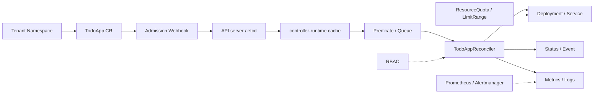
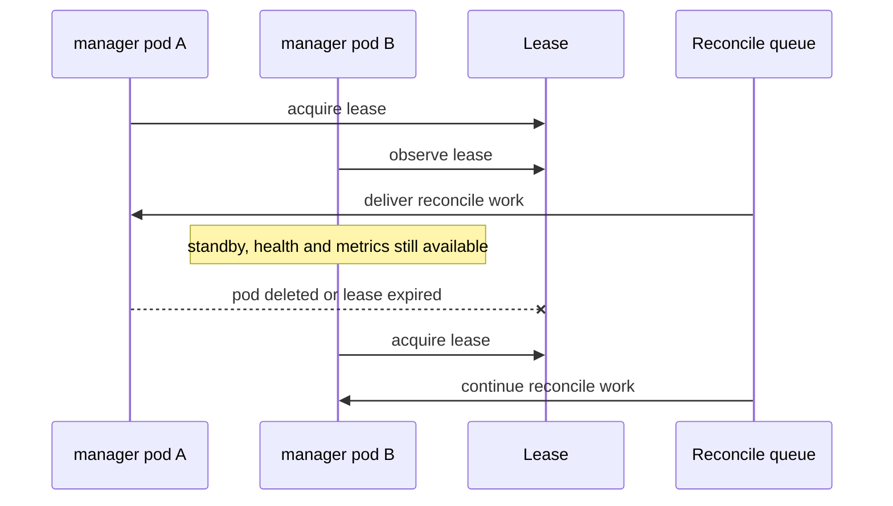
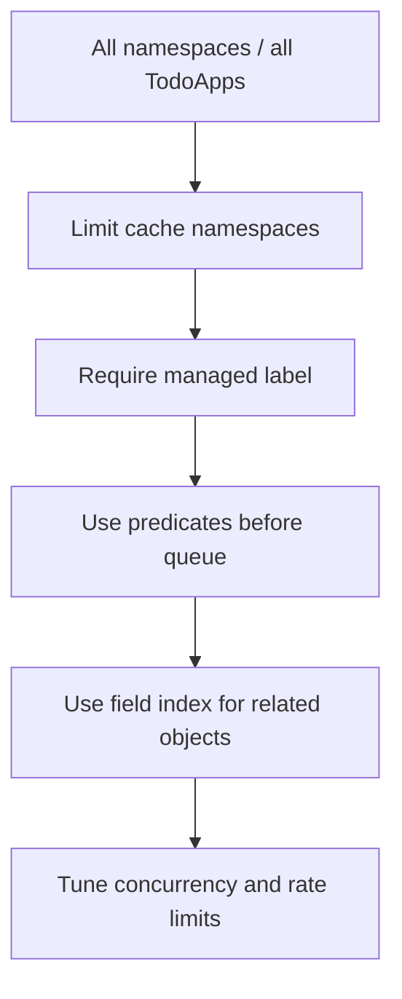

# 第 41 篇：Operator 生产实践 [C]

第 40 篇已经把 Todo Operator 纳入测试、发布、升级和回滚流水线。到这里，它已经不是一个只能本地演示的 Controller，而是一个可以被打包、安装和验证的控制面组件。新的问题随之出现：这个 Operator 真能进入生产环境吗？

生产环境里的 Operator 和普通业务服务不一样。业务服务出问题，通常影响自己的请求；Operator 出问题，可能持续修改集群资源、阻断 Admission 写入、放大 API server 压力，甚至让一批租户的应用同时进入异常状态。因此本篇不再追求“功能更多”，而是把第 40 篇产物向生产基线收敛：权限更小、Watch 范围更清楚、资源边界更明确、指标日志更可观察、故障处理更可演练。

本篇特色项目是：**将 Todo Operator 升级为生产可用版本：实施最小 RBAC 权限、限制 Watch 范围、增加资源与安全配置、暴露 Prometheus 指标、补充告警规则和发布后 smoke test。**

## 1. 本章学习目标

### 1.1 知识目标

学完本章后，你应该能够：

- 能解释 Operator 生产化评估时为什么要同时看权限、安全、性能、可观测性和升级回滚。
- 能描述 RBAC 最小权限、命名空间隔离、Webhook `namespaceSelector` 和 Watch 范围控制之间的关系。
- 能对比 label selector、predicate、field index 和 cache namespace 在降低 Reconcile 压力时分别解决什么问题。
- 能说明 Controller 指标、结构化日志、Events 和 Conditions 各自适合回答哪类排障问题。
- 能解释多副本 Controller Manager 为什么必须开启 leader election，以及它对可用性和一致性的影响。

### 1.2 技能目标

学完本章后，你应该能够：

- 能把 Todo Operator 的 RBAC 从“能跑通”收敛到“够用但不过度授权”。
- 能为 Operator 配置 Watch 命名空间、label selector、Webhook 命名空间选择器和租户资源配额。
- 能为 Controller 增加 predicate 与 field index，降低无效事件和大规模 List 压力。
- 能在 Helm 4 Chart 中配置资源 requests/limits、安全上下文、PodDisruptionBudget、metrics Service、ServiceMonitor 和 PrometheusRule。
- 能编写发布后 smoke test 和生产事故排障 checklist，判断 Operator 是否具备上线条件。

## 2. 本章工作场景与真实案例

### 2.1 技术痛点

第 40 篇的发布流水线证明了 Operator 能安装、能升级、能回滚，但“能发布”不等于“能生产运行”。如果 Controller 拿着过大的 ClusterRole，一处漏洞就可能变成集群级风险；如果它默认 Watch 全集群所有 `TodoApp`、Deployment 和 Service，大规模租户增长后会给 API server 和本地 cache 带来压力；如果 Webhook 覆盖所有命名空间，某次证书或 endpoints 故障会阻断并不属于这个平台的写请求。

另一个常见问题是可观测性不足。Operator 出故障时，业务同学看到的是 `TodoApp` 不 Ready，平台同学看到的是 Controller 日志里一堆重试。如果没有清晰的 Conditions、Events、metrics 和告警，团队很难回答三个生产问题：谁受影响、影响多久、应该回滚还是修复配置。

本篇要解决的不是“再加一个功能”，而是把控制面组件纳入生产治理：最小权限、租户边界、资源边界、观测边界和事故处理边界。

### 2.2 团队协作场景

平台开发者负责修改 Reconciler、RBAC marker、cache 配置、predicate、Helm 模板和 smoke test。平台 SRE 负责审查权限边界、部署命名空间、资源限制、PodDisruptionBudget、PrometheusRule 和发布窗口。安全团队关注 ServiceAccount 是否越权、容器是否非 root、Webhook 是否影响非目标命名空间。业务团队关注自己的 `TodoApp` 是否仍能按预期创建、扩缩容、升级和删除。

真实企业环境通常会把 Operator 分成开发、预发和生产三套配置。开发环境可以 Watch 一个实验命名空间；预发环境模拟多个租户命名空间；生产环境必须有明确的租户准入标签、资源配额、发布后 smoke test、告警和回滚记录。本篇实验会把这些动作压缩到本地 kind 集群中完成。

### 2.3 课程项目关联

本篇继续使用第 40 篇的 `<project-root>/operator/kubebuilder/` 和 `<project-root>/operator/helm/todo-operator/`。项目版本线推进到阶段六子版本 `v4.7-operator-production`，它仍属于 `v4.0-operator` 总版本线。

本篇产出会被后续章节复用：

- 第 42 篇会把生产化后的 Operator 作为 Cloud Native Todo Platform 的最终一键交付入口。
- 本篇新增的最小权限、Watch 范围、metrics、告警和 smoke test 会成为最终作品集中的“生产可用性证据”。
- 本篇的事故案例和 checklist 会被第 42 篇整理成面试讲解稿和项目复盘材料。

## 3. 核心概念

### 3.1 Operator 生产化评估矩阵

生产可用的 Operator 至少要回答五个问题。

表 41-1 Operator 生产化评估矩阵

| 维度 | 关键问题 | Todo Operator 本篇动作 |
|---|---|---|
| 权限 | ServiceAccount 是否只拥有必要资源和 verb | 收敛 RBAC marker，删除不需要的 create/delete 权限 |
| 隔离 | 是否只影响目标租户和命名空间 | 配置 Watch namespace、label selector、Webhook `namespaceSelector` |
| 性能 | 大规模对象下是否会放大 API server 压力 | 增加 predicate、field index 和 cache 范围限制 |
| 可观测性 | 出问题时是否知道影响面和原因 | 暴露 metrics、结构化日志、Events、Conditions 和告警 |
| 可运维性 | 升级、回滚、驱逐、重启是否可控 | 多副本、leader election、PDB、资源限制和 smoke test |

这个矩阵的价值在于把“上线感觉还行”变成可检查的工程项。生产评审时，不应该只问 `helm install` 是否成功，还要问：这个 release 会 Watch 哪些 namespace？Webhook 会拦截哪些对象？ServiceAccount 能不能删除用户 CR？Controller 重启时是否有第二个副本接管？Prometheus 能不能在错误率升高时提醒我们？

### 3.2 RBAC 最小权限

RBAC 最小权限不是把权限写得越少越好，而是让权限和 Reconciler 行为一一对应。Todo Operator 的行为很清楚：读取 `TodoApp`，更新它的 status 和 finalizer，创建和更新同 namespace 的 Deployment、Service，记录 Event，使用 Lease 做 leader election。它不应该创建或删除 `TodoApp` 本身，也不应该操作 Secret、ConfigMap、Node 或其他租户资源。

一个可审查的 marker 示例是：

```go
// +kubebuilder:rbac:groups=platform.todo.example.com,resources=todoapps,verbs=get;list;watch;update;patch
// +kubebuilder:rbac:groups=platform.todo.example.com,resources=todoapps/status,verbs=get;update;patch
// +kubebuilder:rbac:groups=platform.todo.example.com,resources=todoapps/finalizers,verbs=update
// +kubebuilder:rbac:groups=apps,resources=deployments,verbs=get;list;watch;create;update;patch;delete
// +kubebuilder:rbac:groups="",resources=services,verbs=get;list;watch;create;update;patch;delete
// +kubebuilder:rbac:groups="",resources=events,verbs=create;patch
// +kubebuilder:rbac:groups=coordination.k8s.io,resources=leases,verbs=get;list;watch;create;update;patch;delete
```

这里保留 `todoapps` 的 `update;patch`，是因为当前实现使用 `Update` 修改 finalizer。更严格的项目可以把 finalizer 更新改成专用 patch，并通过实际 `kubectl auth can-i` 和集成测试证明不需要主资源 `update`。生产 RBAC 的核心不是“看起来最小”，而是“代码路径、测试和权限能够互相解释”。

### 3.3 多租户、命名空间隔离与资源配额

Operator 的隔离分三层。

第一层是 **cache 和 Watch 范围**。controller-runtime 默认可能监听所有命名空间的目标资源。对多租户平台来说，这通常过大。可以用 `WATCH_NAMESPACE` 把 cache 限制在一个或多个租户命名空间里。

第二层是 **对象选择器**。即使在同一个命名空间里，也可能存在不希望由本 Operator 接管的 `TodoApp`。本篇使用标签 `platform.todo.example.com/managed=true` 作为接管信号。

第三层是 **Admission 范围**。Webhook 是 API server 写路径的一部分，应该通过 `namespaceSelector` 只拦截启用了平台能力的命名空间。例如只有带有 `platform.todo.example.com/admission=enabled` 标签的命名空间才触发 TodoApp Webhook。

资源配额是租户隔离的补充。`ResourceQuota` 可以限制一个命名空间里 `TodoApp` 的数量，`LimitRange` 可以给生成的业务 Pod 设置默认资源边界。Operator 不能替代平台配额；它应该尊重并暴露这些限制。

### 3.4 Predicate、Index 与 Cache 调优

controller-runtime 的 cache 通过 List-Watch 把对象同步到本地，再让 Reconciler 从本地读取。cache 能降低 API server 压力，但如果范围过大，也会把无关对象同步到本地，占用内存并增加启动时间。

本篇使用三种调优手段：

- **cache namespace 限制**：从源头减少需要同步的 namespace。
- **predicate 过滤事件**：让不带接管标签的对象不进入 Reconcile 队列。
- **field index**：为被拥有的 Deployment 建立 owner 索引，后续查找子资源时不用全量 List。

它们解决的问题不同。cache 限制减少“看见多少对象”；predicate 减少“哪些事件入队”；field index 优化“需要查找关联对象时怎么快一点”。不要把它们混为一个开关。

### 3.5 Metrics、日志、Events 与 Conditions

Operator 排障有四类信号。

表 41-2 Operator 可观测性信号

| 信号 | 适合回答的问题 | 示例 |
|---|---|---|
| Metrics | 系统性趋势和告警 | Reconcile 错误率、耗时分位数、队列深度 |
| 结构化日志 | 单次调谐过程细节 | `reconcile failed`，带 namespace/name、reason |
| Events | 用户可见的生命周期提示 | `DeploymentCreated`、`CleanupFailed` |
| Conditions | 当前对象状态 | `Ready=False`、`Degraded=True` |

生产排障时，四类信号要互相补充。Prometheus 告诉你“错误率升高”；日志告诉你“哪段代码失败”；Events 告诉业务用户“对象发生过什么”；Conditions 告诉自动化系统“当前是否可用”。只依赖日志，会让用户看不到状态；只依赖 Conditions，又缺少聚合告警。

## 4. 原理深入

### 4.1 生产 Operator 的运行边界

图 41-1 Todo Operator 生产运行边界



这张图里有三个边界最容易被忽略。第一，Admission Webhook 在对象写入前执行，它的问题会影响用户写请求。第二，cache 在 Reconciler 之前同步对象，它的范围决定了内存和 API server List-Watch 压力。第三，RBAC 不是部署附属品，而是 Controller 能做什么的硬边界。

### 4.2 多副本与 leader election

Controller Manager 可以运行多个副本，但同一个 Controller 的调谐逻辑通常只能由 leader 执行。否则两个副本可能同时处理同一个 `TodoApp`，重复写 status、重复记录 Event，甚至同时操作外部资源。controller-runtime 通过 Lease 实现 leader election：多个副本都运行，但只有拿到 Lease 的副本执行需要 leader 的 Controller。

图 41-2 多副本 Controller Manager 与 Lease



多副本不是为了让同一个 Controller 并行处理更多对象，而是为了让一个副本被驱逐、重启或升级时，另一个副本能接管。生产环境还需要 PDB，避免自愿驱逐一次性赶走所有副本。

### 4.3 从事件到告警的闭环

一次失败的 Reconcile 应该形成闭环：

1. Reconciler 返回 error，controller-runtime 记录错误并按限速队列重试。
2. 代码在关键失败点写 Warning Event，让 `kubectl describe todoapp` 能看到原因。
3. status Condition 从 `Ready=True` 变为 `Ready=False` 或 `Degraded=True`。
4. controller-runtime metrics 中错误计数增加，PrometheusRule 触发告警。
5. 发布后 smoke test 或值班人员根据 checklist 判断修复、回滚或人工接管。

这个闭环避免了两个坏结果：一是 Controller 在后台悄悄重试，业务用户不知道发生了什么；二是告警响了但没有对象级线索，只能翻大量日志。

### 4.4 性能优化的顺序

Operator 性能优化要先收敛范围，再优化局部代码。

图 41-3 Watch 与 Reconcile 压力收敛顺序



初学者容易直接调 `MaxConcurrentReconciles`，以为并发提高就能解决性能问题。实际生产中，先减少无关对象和无效事件更重要。如果一个 Operator 本不该处理某个租户命名空间，就不要把它同步进 cache；如果一个 `TodoApp` 没有接管标签，就不要让它进入队列。

## 5. 手把手实验：把 Todo Operator 收敛到生产基线

### 5.1 步骤 1：实验目标

本实验会在第 40 篇基础上完成以下改造：

- 收敛 RBAC marker，并验证 ServiceAccount 权限。
- 在 `cmd/main.go` 中支持 `WATCH_NAMESPACE` 和 `WATCH_LABEL_SELECTOR`。
- 在 `TodoAppReconciler` 中增加 label predicate 和 Deployment owner field index。
- 扩展 Helm 4 Chart，加入多副本、leader election、资源限制、安全上下文、PDB、metrics Service、ServiceMonitor 和 PrometheusRule。
- 新增租户命名空间配额、发布后 smoke test 和生产 checklist。

### 5.2 步骤 2：实验环境

后续命令默认在 `<project-root>/operator/kubebuilder/` 中执行。

表 41-3 本章实验工具版本

| 工具 | 建议版本 | 用途 |
|---|---|---|
| Go | 1.26.x | 编译和测试 Operator |
| Docker | 29.x | 构建本地 Operator 镜像 |
| kubectl | 1.36.x | 验证权限、资源和状态 |
| kind | 0.31+ | 本地 Kubernetes 1.36 集群 |
| Kubebuilder | 4.11.x | 生成 RBAC 和清单 |
| controller-runtime | Kubebuilder 4.11.x 项目依赖版本 | Manager、cache、predicate、metrics |
| cert-manager | 1.20.x | Webhook 证书 |
| Helm | 4.2.x | 安装和升级 Chart |
| Prometheus Operator CRD | 可选 | 验证 `ServiceMonitor` 和 `PrometheusRule` 渲染 |

确认当前目录和工具：

```bash
pwd
go version
kubectl version --client
helm version
```

预期输出类似：

```text
<project-root>/operator/kubebuilder
go version go1.26.x ...
Client Version: v1.36.x
version.BuildInfo{Version:"v4.2.x", ...}
```

### 5.3 步骤 3：文件目录结构

本章最终涉及的关键文件如下：

```text
operator/
├── kubebuilder/
│   ├── cmd/
│   │   └── main.go
│   ├── config/
│   │   ├── rbac/
│   │   │   └── role.yaml
│   │   └── samples/
│   │       ├── platform_v1alpha1_todoapp.yaml
│   │       └── platform_v1alpha1_todoapp_unmanaged.yaml
│   ├── internal/
│   │   └── controller/
│   │       └── todoapp_controller.go
│   └── test/
│       └── e2e/
│           └── run-production-smoke.sh
└── helm/
    └── todo-operator/
        ├── values.yaml
        └── templates/
            ├── deployment.yaml
            ├── metrics-service.yaml
            ├── pdb.yaml
            ├── prometheusrule.yaml
            ├── rbac.yaml
            ├── servicemonitor.yaml
            └── webhooks.yaml
```

### 5.4 步骤 4.1：收敛 RBAC marker

编辑 `internal/controller/todoapp_controller.go` 中 Reconciler 上方的 RBAC marker，把主资源权限收敛为下面这样：

```go
// +kubebuilder:rbac:groups=platform.todo.example.com,resources=todoapps,verbs=get;list;watch;update;patch
// +kubebuilder:rbac:groups=platform.todo.example.com,resources=todoapps/status,verbs=get;update;patch
// +kubebuilder:rbac:groups=platform.todo.example.com,resources=todoapps/finalizers,verbs=update
// +kubebuilder:rbac:groups=apps,resources=deployments,verbs=get;list;watch;create;update;patch;delete
// +kubebuilder:rbac:groups="",resources=services,verbs=get;list;watch;create;update;patch;delete
// +kubebuilder:rbac:groups="",resources=events,verbs=create;patch
// +kubebuilder:rbac:groups=coordination.k8s.io,resources=leases,verbs=get;list;watch;create;update;patch;delete
```

然后重新生成 RBAC：

```bash
make manifests
cat config/rbac/role.yaml
```

预期能看到 `todoapps` 的 verbs 不再包含 `create` 和 `delete`：

```text
resources:
- todoapps
verbs:
- get
- list
- watch
- update
- patch
```

表 41-4 `TodoApp` 主资源 RBAC 收敛对比

| 资源 | 第 39/40 篇 verbs | 本篇 verbs | 变化原因 |
|---|---|---|---|
| `todoapps` | `get;list;watch;create;update;patch;delete` | `get;list;watch;update;patch` | Controller 只读取和更新已有 CR，不创建或删除用户 CR |
| `todoapps/status` | `get;update;patch` | `get;update;patch` | status subresource 仍需要单独更新 |
| `todoapps/finalizers` | `update` | `update` | 添加和移除 finalizer 仍需要权限 |
| `leases` | 通常放在集群级 RBAC 中 | 安装命名空间内的 `Role` | leader election 只需要操作自身命名空间中的 Lease |

如果你的代码已经把 finalizer 更新改成 `client.Patch`，可以进一步验证是否能删除主资源 `update`。本篇先保留 `update;patch`，让权限和第 39 篇代码路径保持一致。

### 5.5 步骤 4.2：同步 Helm RBAC 模板

第 40 篇的 Helm Chart 中 RBAC 以“能跑通”为目标，本篇必须同步收敛 Chart 模板，否则 `make manifests` 生成的权限和 `helm install` 实际安装的权限会不一致。编辑 `../helm/todo-operator/templates/rbac.yaml`，替换为下面的完整模板：

```yaml
apiVersion: rbac.authorization.k8s.io/v1
kind: Role
metadata:
  name: {{ include "todo-operator.fullname" . }}-leader-election-role
  namespace: {{ .Release.Namespace }}
rules:
  - apiGroups: ["coordination.k8s.io"]
    resources: ["leases"]
    verbs: ["get", "list", "watch", "create", "update", "patch", "delete"]
---
apiVersion: rbac.authorization.k8s.io/v1
kind: RoleBinding
metadata:
  name: {{ include "todo-operator.fullname" . }}-leader-election-rolebinding
  namespace: {{ .Release.Namespace }}
roleRef:
  apiGroup: rbac.authorization.k8s.io
  kind: Role
  name: {{ include "todo-operator.fullname" . }}-leader-election-role
subjects:
  - kind: ServiceAccount
    name: {{ include "todo-operator.serviceAccountName" . }}
    namespace: {{ .Release.Namespace }}
{{- range .Values.watch.namespaces }}
---
apiVersion: rbac.authorization.k8s.io/v1
kind: Role
metadata:
  name: {{ include "todo-operator.fullname" $ }}-manager-role
  namespace: {{ . }}
rules:
  - apiGroups: ["platform.todo.example.com"]
    resources: ["todoapps"]
    verbs: ["get", "list", "watch", "update", "patch"]
  - apiGroups: ["platform.todo.example.com"]
    resources: ["todoapps/status"]
    verbs: ["get", "update", "patch"]
  - apiGroups: ["platform.todo.example.com"]
    resources: ["todoapps/finalizers"]
    verbs: ["update"]
  - apiGroups: ["apps"]
    resources: ["deployments"]
    verbs: ["get", "list", "watch", "create", "update", "patch", "delete"]
  - apiGroups: [""]
    resources: ["services"]
    verbs: ["get", "list", "watch", "create", "update", "patch", "delete"]
  - apiGroups: [""]
    resources: ["events"]
    verbs: ["create", "patch"]
---
apiVersion: rbac.authorization.k8s.io/v1
kind: RoleBinding
metadata:
  name: {{ include "todo-operator.fullname" $ }}-manager-rolebinding
  namespace: {{ . }}
roleRef:
  apiGroup: rbac.authorization.k8s.io
  kind: Role
  name: {{ include "todo-operator.fullname" $ }}-manager-role
subjects:
  - kind: ServiceAccount
    name: {{ include "todo-operator.serviceAccountName" $ }}
    namespace: {{ $.Release.Namespace }}
{{- end }}
```

这个模板和第 40 篇有一个重要差异：它不再用一个集群级 `ClusterRoleBinding` 覆盖所有命名空间，而是按 `watch.namespaces` 为每个租户命名空间生成 `Role` 和 `RoleBinding`。Leader election 的 Lease 权限只授予 Operator 安装命名空间。这样 `todo-operator-system` 中的 ServiceAccount 只能在被授权的租户命名空间里管理 `TodoApp`、Deployment、Service 和 Event。

Helm 模板里 `range .Values.watch.namespaces` 会把 `.` 切换成当前命名空间字符串，所以循环内部要用 `$` 回到 Chart 根作用域，例如 `{{ include "todo-operator.fullname" $ }}` 和 `{{ $.Release.Namespace }}`。这是 Helm 模板里很常见的作用域写法，后续模板中看到 `$` 时可以按“根对象”理解。

Webhook 证书相关的 `Certificate`、`Issuer` 和最终生成的 Secret 由 cert-manager 控制器管理，不需要 Todo Operator 的 ServiceAccount 拥有 `cert-manager.io` 或 Secret 写权限。Todo Operator 只需要把 Webhook server 需要的 Secret 挂载进 Pod；证书签发、续期和 CA 注入是 cert-manager 的职责。Leader election 的 Lease 权限现在也只授予 Operator 安装命名空间，不再使用集群级 `ClusterRole`。

> **顺序提醒**：租户 namespace 必须先存在，否则 Helm 无法在这些 namespace 中创建 Role 和 RoleBinding。本章后续会先创建 `todo-team-a`、`todo-team-b`，再执行 `helm upgrade --install`。

渲染模板确认 `todoapps` 不再包含 `create` 和 `delete`：

```bash
helm template todo-operator ../helm/todo-operator \
  -n todo-operator-system \
  --show-only templates/rbac.yaml | grep -A8 'resources: \["todoapps"\]'
```

预期输出应包含：

```text
resources: ["todoapps"]
verbs: ["get", "list", "watch", "update", "patch"]
```

### 5.6 步骤 4.3：让 Manager 支持 Watch 范围

以下代码片段均添加到 `cmd/main.go` 中。helper 函数放在 `main()` 函数之前；`ctrl.Options` 的修改在原有 `ctrl.NewManager` 调用处就地替换；Reconciler 注册代码在原有 `TodoAppReconciler` 初始化处补充 `WatchLabelSelector` 字段。原文件中已有的日志、Scheme、metrics、webhook server、health probe 和 leader election flag 代码都要保留。

编辑 `cmd/main.go`，在原有 import 基础上增加下面这些依赖：

```go
import (
	"strings"

	metav1 "k8s.io/apimachinery/pkg/apis/meta/v1"
	"sigs.k8s.io/controller-runtime/pkg/cache"
)
```

在 `main.go` 中增加两个 helper：

```go
func cacheNamespacesFromEnv() map[string]cache.Config {
	raw := strings.TrimSpace(os.Getenv("WATCH_NAMESPACE"))
	if raw == "" {
		return nil
	}

	namespaces := map[string]cache.Config{}
	for _, item := range strings.Split(raw, ",") {
		namespace := strings.TrimSpace(item)
		if namespace != "" {
			namespaces[namespace] = cache.Config{}
		}
	}
	return namespaces
}

func labelSelectorFromEnv() (*metav1.LabelSelector, error) {
	raw := strings.TrimSpace(os.Getenv("WATCH_LABEL_SELECTOR"))
	if raw == "" {
		return nil, nil
	}
	return metav1.ParseToLabelSelector(raw)
}
```

创建 Manager 时，把 cache 范围和 leader election namespace 接入：

```go
watchLabelSelector, err := labelSelectorFromEnv()
if err != nil {
	setupLog.Error(err, "unable to parse WATCH_LABEL_SELECTOR")
	os.Exit(1)
}

mgr, err := ctrl.NewManager(ctrl.GetConfigOrDie(), ctrl.Options{
	Scheme: scheme,
	Metrics: metricsserver.Options{
		BindAddress: metricsAddr,
	},
	Cache: cache.Options{
		DefaultNamespaces: cacheNamespacesFromEnv(),
	},
	WebhookServer:          webhookServer,
	HealthProbeBindAddress: probeAddr,
	LeaderElection:         enableLeaderElection,
	LeaderElectionID:       "todo-operator.platform.todo.example.com",
	LeaderElectionNamespace: os.Getenv("POD_NAMESPACE"),
})
```

注册 Reconciler 时，把 label selector 传进去：

```go
if err = (&controller.TodoAppReconciler{
	Client:             mgr.GetClient(),
	Scheme:             mgr.GetScheme(),
	Recorder:           mgr.GetEventRecorderFor("todoapp-controller"),
	WatchLabelSelector: watchLabelSelector,
}).SetupWithManager(mgr); err != nil {
	setupLog.Error(err, "unable to create controller", "controller", "TodoApp")
	os.Exit(1)
}
```

这段代码的行为是：`WATCH_NAMESPACE` 为空时仍 Watch 全部命名空间；设置为 `todo-team-a,todo-team-b` 时只同步这两个命名空间。`WATCH_LABEL_SELECTOR` 为空时接管所有 `TodoApp`；设置为 `platform.todo.example.com/managed=true` 时只让带标签的对象进入 Reconcile。

改造后的 `main.go` 结构可以按下面顺序自查：

```text
import block
init() 注册 Scheme
cacheNamespacesFromEnv()
labelSelectorFromEnv()
main()
  解析 flag
  创建 webhook server
  解析 WATCH_LABEL_SELECTOR
  ctrl.NewManager(... Cache + LeaderElectionNamespace ...)
  注册 TodoAppReconciler(... WatchLabelSelector ...)
  注册 Webhook、healthz、readyz
  mgr.Start(...)
```

### 5.7 步骤 4.4：增加 Predicate、Field Index 和内部接管防御

编辑 `internal/controller/todoapp_controller.go` 的 import，确保包含：

```go
import (
	"context"

	appsv1 "k8s.io/api/apps/v1"
	corev1 "k8s.io/api/core/v1"
	metav1 "k8s.io/apimachinery/pkg/apis/meta/v1"
	"k8s.io/apimachinery/pkg/labels"
	"k8s.io/apimachinery/pkg/runtime"
	ctrl "sigs.k8s.io/controller-runtime"
	"sigs.k8s.io/controller-runtime/pkg/builder"
	"sigs.k8s.io/controller-runtime/pkg/client"
	"sigs.k8s.io/controller-runtime/pkg/predicate"
)
```

给 Reconciler 增加字段：

```go
const deploymentOwnerNameKey = ".metadata.controller"

type TodoAppReconciler struct {
	client.Client
	Scheme             *runtime.Scheme
	Recorder           recordEventRecorder
	WatchLabelSelector *metav1.LabelSelector
}

func (r *TodoAppReconciler) shouldManage(todo *platformv1alpha1.TodoApp) (bool, error) {
	if r.WatchLabelSelector == nil {
		return true, nil
	}

	selector, err := metav1.LabelSelectorAsSelector(r.WatchLabelSelector)
	if err != nil {
		return false, err
	}
	return selector.Matches(labels.Set(todo.Labels)), nil
}
```

这份结构体里，`Client`、`Scheme` 和 `Recorder` 来自第 39 篇；其中 `Recorder` 使用第 39 篇定义的 `recordEventRecorder` 最小接口，包含 `Event` 和 `Eventf` 两个方法，能够继续兼容第 40 篇 envtest 中的 `record.NewFakeRecorder(20)`。`WatchLabelSelector` 是本篇新增字段，用来把 `cmd/main.go` 中解析出的接管标签传给 Reconciler。

在 `Reconcile` 读取到 `TodoApp` 后，立即增加一次内部防御：

```go
managed, err := r.shouldManage(&todo)
if err != nil {
	return ctrl.Result{}, err
}
if !managed {
	return ctrl.Result{}, nil
}
```

这一步不能只依赖 predicate。predicate 能过滤主资源 watch 事件，但历史子资源事件、人工 enqueue 或未来新增的 watch 源仍可能触发 Reconcile。Reconcile 内部再次判断接管标签，可以避免未被接管的 `TodoApp` 被误调谐。注意：如果一个已经被接管的对象后来移除了标签，生产系统要先定义清理或迁移策略；本篇 smoke test 只验证“从未被接管的对象不会创建子资源”。

替换 `SetupWithManager`：

```go
func (r *TodoAppReconciler) SetupWithManager(mgr ctrl.Manager) error {
	if err := mgr.GetFieldIndexer().IndexField(
		context.Background(),
		&appsv1.Deployment{},
		deploymentOwnerNameKey,
		func(rawObj client.Object) []string {
			deployment, ok := rawObj.(*appsv1.Deployment)
			if !ok {
				return nil
			}

			owner := metav1.GetControllerOf(deployment)
			if owner == nil {
				return nil
			}
			if owner.APIVersion != platformv1alpha1.GroupVersion.String() || owner.Kind != "TodoApp" {
				return nil
			}
			return []string{owner.Name}
		},
	); err != nil {
		return err
	}

	var todoOptions []builder.ForOption

	if r.WatchLabelSelector != nil {
		selectorPredicate, err := predicate.LabelSelectorPredicate(*r.WatchLabelSelector)
		if err != nil {
			return err
		}
		todoOptions = append(todoOptions, builder.WithPredicates(selectorPredicate))
	}

	return ctrl.NewControllerManagedBy(mgr).
		For(&platformv1alpha1.TodoApp{}, todoOptions...).
		Owns(&appsv1.Deployment{}).
		Owns(&corev1.Service{}).
		Complete(r)
}
```

如果你的文件中还没有引用 `platformv1alpha1`，需要保留第 39 篇已有的导入：

```go
platformv1alpha1 "github.com/example/todo-operator/api/v1alpha1"
```

这里故意只把 label predicate 放在主资源 `TodoApp` 上，没有直接套到 owned Deployment/Service。原因是第 39 篇生成的子资源标签不一定包含 `platform.todo.example.com/managed=true`；如果把同一个 predicate 套到子资源事件上，Deployment status 变化可能不会重新入队。当子资源变化触发 Reconcile 时，内部 `shouldManage` 会在读取 `TodoApp` 后做二次检查，防止未接管对象被误处理。`deploymentOwnerNameKey` 索引的是 controller owner 的 name，而不是直接索引整个 `metadata.ownerReferences`，这个 index 暂时不改变业务行为，但它为后续按 owner 快速查找 Deployment 打基础。生产 Controller 常见的演进方向是：不要靠命名约定猜子资源，而是通过 owner 或标签索引列出关联对象。

完成 §5.6 和 §5.7 的代码修改后，先做一次编译检查，再继续写 Helm 模板：

```bash
go build ./...
```

如果这里编译失败，优先检查 `TodoAppReconciler` 是否已经新增 `WatchLabelSelector` 字段、`recordEventRecorder` 是否仍保留在 controller 文件中，以及 `cmd/main.go` 的新增 import 是否和现有 import 合并正确。

### 5.8 步骤 4.5：扩展 Helm values

编辑 `../helm/todo-operator/values.yaml`，把第 40 篇的 values 扩展为下面的生产基线：

```yaml
image:
  repository: todo-operator
  tag: v0.4.0-test
  pullPolicy: IfNotPresent

replicaCount: 2

manager:
  leaderElection: true
  metricsBindAddress: ":8080"
  healthProbeBindAddress: ":8081"
  logLevel: info
  logEncoder: json

watch:
  # 留空列表 [] 表示不限制命名空间，继续 Watch 全部命名空间。
  # 生产环境建议显式列出目标租户命名空间。
  namespaces:
    - todo-team-a
    - todo-team-b
  labelSelector: platform.todo.example.com/managed=true

serviceAccount:
  create: true
  name: ""

webhook:
  enabled: true
  servicePort: 443
  containerPort: 9443
  namespaceSelector:
    matchLabels:
      platform.todo.example.com/admission: enabled

resources:
  requests:
    cpu: 100m
    memory: 128Mi
  limits:
    cpu: 500m
    memory: 512Mi

podSecurityContext:
  runAsNonRoot: true
  # 65532 是 distroless/nobody 常见 UID；如果你的镜像使用其他非 root 用户，请按镜像实际 UID 调整。
  runAsUser: 65532
  runAsGroup: 65532
  seccompProfile:
    type: RuntimeDefault

containerSecurityContext:
  allowPrivilegeEscalation: false
  readOnlyRootFilesystem: true
  capabilities:
    drop:
      - ALL

podDisruptionBudget:
  enabled: true
  minAvailable: 1

metrics:
  service:
    enabled: true
    port: 8080
  serviceMonitor:
    enabled: true
    interval: 30s
  prometheusRule:
    enabled: true
```

这份 values 故意把生产开关集中在一个文件里，方便 PR 审查。生产配置不应该散落在多个模板深处，让审查者只能靠搜索猜测。

### 5.9 步骤 4.6：更新 Deployment、PDB 和 Metrics 模板

更新 `../helm/todo-operator/templates/deployment.yaml` 中的 Pod spec 关键部分：

```yaml
spec:
  replicas: {{ .Values.replicaCount }}
  selector:
    matchLabels:
      app.kubernetes.io/name: {{ include "todo-operator.name" . }}
      app.kubernetes.io/instance: {{ .Release.Name }}
  template:
    metadata:
      labels:
        app.kubernetes.io/name: {{ include "todo-operator.name" . }}
        app.kubernetes.io/instance: {{ .Release.Name }}
    spec:
      serviceAccountName: {{ include "todo-operator.serviceAccountName" . }}
      securityContext:
        {{- toYaml .Values.podSecurityContext | nindent 8 }}
      containers:
        - name: manager
          image: "{{ .Values.image.repository }}:{{ .Values.image.tag }}"
          imagePullPolicy: {{ .Values.image.pullPolicy }}
          args:
            - --leader-elect={{ .Values.manager.leaderElection }}
            - --health-probe-bind-address={{ .Values.manager.healthProbeBindAddress }}
            - --metrics-bind-address={{ .Values.manager.metricsBindAddress }}
            - --webhook-cert-path=/tmp/k8s-webhook-server/serving-certs
            - --zap-log-level={{ .Values.manager.logLevel }}
            - --zap-encoder={{ .Values.manager.logEncoder }}
          env:
            - name: WATCH_NAMESPACE
              value: {{ join "," .Values.watch.namespaces | quote }}
            - name: WATCH_LABEL_SELECTOR
              value: {{ .Values.watch.labelSelector | quote }}
            - name: POD_NAMESPACE
              valueFrom:
                fieldRef:
                  fieldPath: metadata.namespace
          ports:
            - name: webhook-server
              containerPort: {{ .Values.webhook.containerPort }}
              protocol: TCP
            - name: metrics
              containerPort: {{ trimPrefix ":" .Values.manager.metricsBindAddress }}
              protocol: TCP
          securityContext:
            {{- toYaml .Values.containerSecurityContext | nindent 12 }}
          livenessProbe:
            httpGet:
              path: /healthz
              port: 8081
            initialDelaySeconds: 15
            periodSeconds: 20
          readinessProbe:
            httpGet:
              path: /readyz
              port: 8081
            initialDelaySeconds: 5
            periodSeconds: 10
          resources:
            {{- toYaml .Values.resources | nindent 12 }}
          volumeMounts:
            - mountPath: /tmp/k8s-webhook-server/serving-certs
              name: cert
              readOnly: true
      volumes:
        - name: cert
          secret:
            secretName: {{ include "todo-operator.fullname" . }}-webhook-server-cert
```

创建 `../helm/todo-operator/templates/pdb.yaml`：

```yaml
{{- if .Values.podDisruptionBudget.enabled }}
apiVersion: policy/v1
kind: PodDisruptionBudget
metadata:
  name: {{ include "todo-operator.fullname" . }}-pdb
  namespace: {{ .Release.Namespace }}
spec:
  minAvailable: {{ .Values.podDisruptionBudget.minAvailable }}
  selector:
    matchLabels:
      app.kubernetes.io/name: {{ include "todo-operator.name" . }}
      app.kubernetes.io/instance: {{ .Release.Name }}
{{- end }}
```

创建 `../helm/todo-operator/templates/metrics-service.yaml`：

```yaml
{{- if .Values.metrics.service.enabled }}
apiVersion: v1
kind: Service
metadata:
  name: {{ include "todo-operator.fullname" . }}-metrics
  namespace: {{ .Release.Namespace }}
  labels:
    app.kubernetes.io/name: {{ include "todo-operator.name" . }}
    app.kubernetes.io/instance: {{ .Release.Name }}
spec:
  ports:
    - name: http-metrics
      port: {{ .Values.metrics.service.port }}
      targetPort: metrics
      protocol: TCP
  selector:
    app.kubernetes.io/name: {{ include "todo-operator.name" . }}
    app.kubernetes.io/instance: {{ .Release.Name }}
{{- end }}
```

注意 `trimPrefix ":" .Values.manager.metricsBindAddress` 只适合 `:8080` 这种端口格式。如果你改成 `127.0.0.1:8080`，应显式增加一个 `metrics.containerPort` 值，避免模板解析错误。生产 Chart 更建议显式定义 `metrics.containerPort: 8080`，让监听地址和容器端口分别配置。

### 5.10 步骤 4.7：限制 Webhook 范围并增加监控资源

更新 `../helm/todo-operator/templates/webhooks.yaml`，在两个 Webhook 的 `webhooks` 条目中加入：

```yaml
    namespaceSelector:
      {{- toYaml .Values.webhook.namespaceSelector | nindent 6 }}
```

最终结构应类似：

```yaml
webhooks:
  - name: vtodoapp-v1alpha1.kb.io
    admissionReviewVersions: ["v1"]
    namespaceSelector:
      matchLabels:
        platform.todo.example.com/admission: enabled
    clientConfig:
      service:
        name: {{ include "todo-operator.fullname" . }}-webhook-service
        namespace: {{ .Release.Namespace }}
        path: /validate-platform-todo-example-com-v1alpha1-todoapp
        port: {{ .Values.webhook.servicePort }}
```

创建 `../helm/todo-operator/templates/servicemonitor.yaml`：

```yaml
{{- if .Values.metrics.serviceMonitor.enabled }}
apiVersion: monitoring.coreos.com/v1
kind: ServiceMonitor
metadata:
  name: {{ include "todo-operator.fullname" . }}
  namespace: {{ .Release.Namespace }}
  labels:
    app.kubernetes.io/name: {{ include "todo-operator.name" . }}
    app.kubernetes.io/instance: {{ .Release.Name }}
spec:
  selector:
    matchLabels:
      app.kubernetes.io/name: {{ include "todo-operator.name" . }}
      app.kubernetes.io/instance: {{ .Release.Name }}
  namespaceSelector:
    matchNames:
      - {{ .Release.Namespace }}
  endpoints:
    - port: http-metrics
      path: /metrics
      interval: {{ .Values.metrics.serviceMonitor.interval }}
{{- end }}
```

创建 `../helm/todo-operator/templates/prometheusrule.yaml`：

```yaml
{{- if .Values.metrics.prometheusRule.enabled }}
apiVersion: monitoring.coreos.com/v1
kind: PrometheusRule
metadata:
  name: {{ include "todo-operator.fullname" . }}
  namespace: {{ .Release.Namespace }}
  labels:
    app.kubernetes.io/name: {{ include "todo-operator.name" . }}
    app.kubernetes.io/instance: {{ .Release.Name }}
spec:
  groups:
    - name: todo-operator.rules
      rules:
        - alert: TodoOperatorReconcileErrors
          expr: increase(controller_runtime_reconcile_errors_total{controller="todoapp"}[10m]) > 0
          for: 5m
          labels:
            severity: warning
          annotations:
            summary: Todo Operator reconcile errors detected
            description: The TodoApp controller has reconcile errors in the last 10 minutes.
        - alert: TodoOperatorReconcileP99Slow
          expr: histogram_quantile(0.99, sum(rate(controller_runtime_reconcile_time_seconds_bucket{controller="todoapp"}[5m])) by (le)) > 5
          for: 10m
          labels:
            severity: warning
          annotations:
            summary: Todo Operator reconcile latency is high
            description: P99 reconcile latency has been above 5 seconds for 10 minutes.
{{- end }}
```

`controller="todoapp"` 是 controller-runtime 根据 Controller 注册名称生成的常见标签值，但不同项目脚手架或显式命名可能不同。发布前先用下面的命令确认实际标签，再把 PrometheusRule 中的 label 写死：

```bash
kubectl port-forward -n todo-operator-system svc/todo-operator-metrics 18080:8080 >/tmp/todo-operator-port-forward.log 2>&1 &
curl -s http://127.0.0.1:18080/metrics | grep -E "controller_runtime_reconcile_(total|errors_total|time_seconds)"
```

如果实际输出中的 `controller` 不是 `todoapp`，以 `/metrics` 为准调整规则。`TodoOperatorReconcileP99Slow` 中的 5 秒阈值适合本地教学和小规模环境，生产环境应按对象数量、外部依赖和 SLO 单独配置。

如果你的集群没有 Prometheus Operator CRD，`helm template` 可以渲染这些资源，但 `kubectl apply` 会因为找不到 `ServiceMonitor` 或 `PrometheusRule` kind 而失败。学习环境可以先设置：

```bash
helm template todo-operator ../helm/todo-operator \
  --set metrics.serviceMonitor.enabled=false \
  --set metrics.prometheusRule.enabled=false
```

生产环境不要因为 CRD 缺失就删除监控，而应该明确选择监控栈：Prometheus Operator、托管 Prometheus，或者由平台统一采集 `/metrics`。

### 5.11 步骤 4.8：增加租户命名空间和配额

创建两个租户命名空间：

```bash
kubectl create namespace todo-team-a --dry-run=client -o yaml | kubectl apply -f -
kubectl create namespace todo-team-b --dry-run=client -o yaml | kubectl apply -f -
kubectl label namespace todo-team-a platform.todo.example.com/admission=enabled --overwrite
kubectl label namespace todo-team-b platform.todo.example.com/admission=enabled --overwrite
```

如果你在纯 PowerShell 中对管道语义不熟，也可以使用下面的直接命令；遇到 AlreadyExists 时说明命名空间已经存在，可以继续执行 label 命令：

```powershell
kubectl create namespace todo-team-a
kubectl create namespace todo-team-b
kubectl label namespace todo-team-a platform.todo.example.com/admission=enabled --overwrite
kubectl label namespace todo-team-b platform.todo.example.com/admission=enabled --overwrite
```

为 `todo-team-a` 创建一个教学用配额文件 `/tmp/todo-team-a-quota.yaml`：

```yaml
apiVersion: v1
kind: ResourceQuota
metadata:
  name: todoapp-quota
  namespace: todo-team-a
spec:
  hard:
    count/todoapps.platform.todo.example.com: "20"
    pods: "50"
    requests.cpu: "2"
    requests.memory: 4Gi
    limits.cpu: "4"
    limits.memory: 8Gi
---
apiVersion: v1
kind: LimitRange
metadata:
  name: todoapp-default-limits
  namespace: todo-team-a
spec:
  limits:
    - type: Container
      defaultRequest:
        cpu: 50m
        memory: 64Mi
      default:
        cpu: 500m
        memory: 256Mi
```

应用配额：

```bash
kubectl apply -f /tmp/todo-team-a-quota.yaml
kubectl describe resourcequota todoapp-quota -n todo-team-a
```

预期输出中能看到自定义资源计数：

```text
Resource                    Used  Hard
count/todoapps.platform...  0     20
pods                        0     50
requests.cpu                0     2
```

Kubernetes 对自定义资源配额使用 `count/<resource>.<group>` 形式；如果 API server 或 CRD 尚未就绪，`kubectl apply` 会提示无法识别 `count/todoapps.platform.todo.example.com`，此时先确认 `TodoApp` CRD 已安装，再重新应用配额。

### 5.12 步骤 4.9：编写生产 smoke test 脚本

发布后 smoke test 要回答三个问题：Operator ServiceAccount 是否被正确授权、被接管的 `TodoApp` 是否能完整调谐、未接管对象是否不会被误处理。创建 `test/e2e/run-production-smoke.sh`：

```bash
mkdir -p test/e2e
cat > test/e2e/run-production-smoke.sh <<'EOF'
#!/usr/bin/env bash
set -euo pipefail

OPERATOR_NAMESPACE="${OPERATOR_NAMESPACE:-todo-operator-system}"
RELEASE_NAME="${RELEASE_NAME:-todo-operator}"
TENANT_NAMESPACE="${TENANT_NAMESPACE:-todo-team-a}"
MANAGED_NAME="${MANAGED_NAME:-todo-production-smoke}"
UNMANAGED_NAME="${UNMANAGED_NAME:-todo-unmanaged}"
METRICS_LOCAL_PORT="${METRICS_LOCAL_PORT:-18080}"

for cmd in kubectl curl grep mktemp; do
  if ! command -v "${cmd}" >/dev/null 2>&1; then
    echo "missing required command: ${cmd}"
    exit 1
  fi
done

managed_file="$(mktemp)"
unmanaged_file="$(mktemp)"
port_forward_pid=""
metrics_ready=false

cleanup() {
  kubectl delete -f "${managed_file}" --ignore-not-found >/dev/null 2>&1 || true
  kubectl delete -f "${unmanaged_file}" --ignore-not-found >/dev/null 2>&1 || true
  if [ -n "${port_forward_pid}" ]; then
    kill "${port_forward_pid}" >/dev/null 2>&1 || true
  fi
  rm -f "${managed_file}" "${unmanaged_file}"
}
trap cleanup EXIT

expect_can_i() {
  local expected="$1"
  shift
  local actual
  actual="$(kubectl auth can-i "$@")"
  if [ "${actual}" != "${expected}" ]; then
    echo "expected '${expected}' for kubectl auth can-i $*, got '${actual}'"
    exit 1
  fi
}

service_account="system:serviceaccount:${OPERATOR_NAMESPACE}:${RELEASE_NAME}"

kubectl rollout status "deployment/${RELEASE_NAME}-controller-manager" \
  -n "${OPERATOR_NAMESPACE}" \
  --timeout=180s

expect_can_i yes list todoapps.platform.todo.example.com --as="${service_account}" -n "${TENANT_NAMESPACE}"
expect_can_i no delete todoapps.platform.todo.example.com --as="${service_account}" -n "${TENANT_NAMESPACE}"
expect_can_i yes create deployments.apps --as="${service_account}" -n "${TENANT_NAMESPACE}"
expect_can_i no create deployments.apps --as="${service_account}" -n default
expect_can_i no get secrets --as="${service_account}" -n "${TENANT_NAMESPACE}"

cat > "${managed_file}" <<YAML
apiVersion: platform.todo.example.com/v1alpha1
kind: TodoApp
metadata:
  name: ${MANAGED_NAME}
  namespace: ${TENANT_NAMESPACE}
  labels:
    platform.todo.example.com/managed: "true"
spec:
  image: registry.cn-guangzhou.aliyuncs.com/yleoer/hello:plain-text
  replicas: 2
  port: 80
YAML

kubectl apply -f "${managed_file}"
kubectl rollout status "deployment/${MANAGED_NAME}" -n "${TENANT_NAMESPACE}" --timeout=180s

ready_replicas="$(kubectl get todoapp "${MANAGED_NAME}" -n "${TENANT_NAMESPACE}" -o jsonpath='{.status.readyReplicas}')"
if [ "${ready_replicas}" != "2" ]; then
  echo "expected readyReplicas=2, got ${ready_replicas}"
  kubectl get todoapp "${MANAGED_NAME}" -n "${TENANT_NAMESPACE}" -o yaml
  exit 1
fi

ready_condition="$(kubectl get todoapp "${MANAGED_NAME}" -n "${TENANT_NAMESPACE}" -o jsonpath='{range .status.conditions[?(@.type=="Ready")]}{.status}{end}')"
if [ "${ready_condition}" != "True" ]; then
  echo "expected Ready=True, got ${ready_condition}"
  kubectl describe todoapp "${MANAGED_NAME}" -n "${TENANT_NAMESPACE}" || true
  exit 1
fi

cat > "${unmanaged_file}" <<YAML
apiVersion: platform.todo.example.com/v1alpha1
kind: TodoApp
metadata:
  name: ${UNMANAGED_NAME}
  namespace: ${TENANT_NAMESPACE}
spec:
  image: registry.cn-guangzhou.aliyuncs.com/yleoer/hello:plain-text
  replicas: 1
  port: 80
YAML

kubectl apply -f "${unmanaged_file}"
sleep 10
if kubectl get deployment "${UNMANAGED_NAME}" -n "${TENANT_NAMESPACE}" >/dev/null 2>&1; then
  echo "unmanaged TodoApp unexpectedly created a Deployment"
  exit 1
fi

kubectl port-forward -n "${OPERATOR_NAMESPACE}" "svc/${RELEASE_NAME}-metrics" "${METRICS_LOCAL_PORT}:8080" >/tmp/todo-operator-port-forward.log 2>&1 &
port_forward_pid="$!"

for _ in 1 2 3 4 5 6 7 8 9 10 11 12 13 14 15; do
  if curl -fsS "http://127.0.0.1:${METRICS_LOCAL_PORT}/metrics" >/dev/null 2>&1; then
    metrics_ready=true
    break
  fi
  sleep 1
done

if [ "${metrics_ready}" != "true" ]; then
  echo "metrics endpoint is not ready"
  cat /tmp/todo-operator-port-forward.log || true
  exit 1
fi

curl -fsS "http://127.0.0.1:${METRICS_LOCAL_PORT}/metrics" \
  | grep -E "controller_runtime_reconcile_(total|errors_total|time_seconds)" >/dev/null

curl -fsS "http://127.0.0.1:${METRICS_LOCAL_PORT}/metrics" \
  | grep -E "workqueue_(depth|adds_total|retries_total)" >/dev/null || true

kubectl delete -f "${managed_file}"
kubectl wait --for=delete "todoapp/${MANAGED_NAME}" -n "${TENANT_NAMESPACE}" --timeout=120s

echo "production smoke test passed"
EOF
chmod +x test/e2e/run-production-smoke.sh
```

脚本里有两个细节值得注意。第一，`kubectl auth can-i create deployments.apps -n default` 预期返回 `no`，这是验证 Helm RBAC 已经从集群级绑定收敛到目标租户命名空间。第二，`workqueue_*` 指标只做宽松检查：不同 controller-runtime 版本的 workqueue 标签和指标组合可能不同，生产告警规则应先以实际 `/metrics` 输出为准。

### 5.13 步骤 5-7：执行验证和发布后 smoke test

先运行代码生成和测试：

```bash
make generate
make manifests
go test ./...
```

确认 cert-manager 已安装。第 40 篇如果保留了 kind 集群，这一步通常已经满足；如果你重建了集群，需要重新安装：

```bash
if ! kubectl get deployment -n cert-manager cert-manager >/dev/null 2>&1; then
  curl -L -o cert-manager.yaml https://github.com/cert-manager/cert-manager/releases/download/v1.20.0/cert-manager.yaml
  sed -i 's|quay.io/jetstack/|registry.cn-guangzhou.aliyuncs.com/yleoer/|g' cert-manager.yaml
  kubectl apply -f cert-manager.yaml
  kubectl wait --for=condition=Available deployment --all -n cert-manager --timeout=300s
fi
```

渲染 Helm Chart。若当前集群没有 Prometheus Operator CRD，先关闭监控 CR：

```bash
helm lint ../helm/todo-operator
helm template todo-operator ../helm/todo-operator \
  -n todo-operator-system \
  --include-crds \
  --set metrics.serviceMonitor.enabled=false \
  --set metrics.prometheusRule.enabled=false \
  > /tmp/todo-operator-production.yaml
```

预期输出：

```text
1 chart(s) linted, 0 chart(s) failed
```

构建并加载镜像：

```bash
export OPERATOR_IMG=todo-operator:v0.4.0-test
docker build -t "${OPERATOR_IMG}" .
kind load docker-image "${OPERATOR_IMG}" --name "${KIND_CLUSTER_NAME:-todo-operator-e2e}"
```

安装或升级 Operator：

```bash
helm upgrade --install todo-operator ../helm/todo-operator \
  -n todo-operator-system \
  --create-namespace \
  --set image.repository=todo-operator \
  --set image.tag=v0.4.0-test \
  --set metrics.serviceMonitor.enabled=false \
  --set metrics.prometheusRule.enabled=false
```

等待 Controller Manager Ready：

```bash
kubectl rollout status deployment/todo-operator-controller-manager -n todo-operator-system --timeout=180s
kubectl get pods -n todo-operator-system
```

预期输出类似：

```text
deployment "todo-operator-controller-manager" successfully rolled out
NAME                                                READY   STATUS    RESTARTS   AGE
todo-operator-controller-manager-...                1/1     Running   0          40s
todo-operator-controller-manager-...                1/1     Running   0          40s
```

验证 RBAC 权限：

```bash
SA=system:serviceaccount:todo-operator-system:todo-operator
kubectl auth can-i list todoapps.platform.todo.example.com --as="${SA}" -n todo-team-a
kubectl auth can-i delete todoapps.platform.todo.example.com --as="${SA}" -n todo-team-a
kubectl auth can-i create deployments.apps --as="${SA}" -n todo-team-a
kubectl auth can-i create deployments.apps --as="${SA}" -n default
kubectl auth can-i get secrets --as="${SA}" -n todo-team-a
```

预期输出：

```text
yes
no
yes
no
no
```

创建被接管的 `TodoApp`：

```bash
cat >/tmp/todoapp-production-smoke.yaml <<'YAML'
apiVersion: platform.todo.example.com/v1alpha1
kind: TodoApp
metadata:
  name: todo-production-smoke
  namespace: todo-team-a
  labels:
    platform.todo.example.com/managed: "true"
spec:
  image: registry.cn-guangzhou.aliyuncs.com/yleoer/hello:plain-text
  replicas: 2
  port: 80
YAML

kubectl apply -f /tmp/todoapp-production-smoke.yaml
kubectl rollout status deployment/todo-production-smoke -n todo-team-a --timeout=180s
kubectl get todoapp todo-production-smoke -n todo-team-a -o yaml
```

判断标准：

- `Deployment` Ready 副本数为 2。
- `TodoApp.status.observedGeneration` 等于当前 generation。
- `TodoApp.status.conditions` 中存在 `Ready=True`。
- `kubectl describe todoapp` 能看到关键 Event。

再创建一个未打接管标签的对象：

```bash
cat >/tmp/todoapp-unmanaged.yaml <<'YAML'
apiVersion: platform.todo.example.com/v1alpha1
kind: TodoApp
metadata:
  name: todo-unmanaged
  namespace: todo-team-a
spec:
  image: registry.cn-guangzhou.aliyuncs.com/yleoer/hello:plain-text
  replicas: 1
  port: 80
YAML

kubectl apply -f /tmp/todoapp-unmanaged.yaml
sleep 10
kubectl get deployment todo-unmanaged -n todo-team-a
```

预期输出：

```text
Error from server (NotFound): deployments.apps "todo-unmanaged" not found
```

这个结果说明 label selector 生效：Webhook 可能仍会默认和校验对象，但 Reconciler 不会接管未带标签的 `TodoApp`。

最后检查 metrics endpoint：

```bash
kubectl port-forward -n todo-operator-system svc/todo-operator-metrics 8080:8080 >/tmp/todo-operator-port-forward.log 2>&1 &
curl -s http://127.0.0.1:8080/metrics | grep -E "controller_runtime_reconcile_(total|errors_total|time_seconds)"
```

预期输出包含：

```text
controller_runtime_reconcile_total{controller="todoapp",result="success"} ...
controller_runtime_reconcile_errors_total{controller="todoapp"} ...
controller_runtime_reconcile_time_seconds_bucket{controller="todoapp",le="..."} ...
```

上面这些命令也可以直接通过脚本执行：

```bash
test/e2e/run-production-smoke.sh
```

预期输出：

```text
deployment "todo-operator-controller-manager" successfully rolled out
...
production smoke test passed
```

如果你使用手工 `kubectl port-forward ... &` 检查 metrics，测试结束后记得关闭后台进程。Bash 中可用 `jobs` 查看后台任务，再执行 `kill %1`；如果无法确认任务号，可以用 `pkill -f 'port-forward.*todo-operator-metrics'` 清理。

### 5.14 步骤 8：清理实验环境

删除测试对象：

```bash
kubectl delete -f /tmp/todoapp-production-smoke.yaml --ignore-not-found
kubectl delete -f /tmp/todoapp-unmanaged.yaml --ignore-not-found
```

卸载 Operator：

```bash
helm uninstall todo-operator -n todo-operator-system
kubectl delete namespace todo-operator-system --ignore-not-found
```

删除租户命名空间和临时文件：

```bash
kubectl delete namespace todo-team-a todo-team-b --ignore-not-found
rm -f /tmp/todo-team-a-quota.yaml /tmp/todoapp-production-smoke.yaml /tmp/todoapp-unmanaged.yaml /tmp/todo-operator-production.yaml
```

如果你保留 kind 集群继续调试，请至少确认没有残留 `TodoApp`、Deployment 和 Helm release：

```bash
kubectl get todoapp -A
helm list -A | grep todo-operator
```

本实验预计耗时 90-120 分钟。首次拉取 kind 节点镜像、cert-manager 镜像或重新构建 Operator 镜像时会更久。

## 6. 常见错误与排障

### 错误 1：RBAC 收敛后 Controller 报 forbidden

- **现象**：

  ```text
  deployments.apps is forbidden: User "system:serviceaccount:todo-operator-system:todo-operator" cannot create resource "deployments" in API group "apps" in the namespace "todo-team-a"
  ```

- **原因**：RBAC marker 或 Helm RBAC 模板没有同步，Controller 实际行为需要的 verb 没有授权。
- **排查**：

  ```bash
  kubectl auth can-i create deployments.apps --as=system:serviceaccount:todo-operator-system:todo-operator -n todo-team-a
  kubectl get role todo-operator-manager-role -n todo-team-a -o yaml
  kubectl get rolebinding todo-operator-manager-rolebinding -n todo-team-a -o yaml
  ```

  第一条如果返回 `no`，说明运行中的 ServiceAccount 没有创建 Deployment 的权限；后两条用于确认 Helm 安装后的实际 Role 和 RoleBinding，而不是只看源码 marker。

- **修复**：把 Reconciler 实际需要的资源和 verb 补回 marker 与 Helm 模板，执行 `make manifests` 后重新发布 Chart。
- **预防**：每次收敛 RBAC 后都运行 `kubectl auth can-i` 和 kind e2e；不要只靠肉眼审查 YAML。

### 错误 2：设置 WATCH_NAMESPACE 后对象不再被调谐

- **现象**：

  ```text
  todoapp.platform.todo.example.com/todo-production-smoke created
  Error from server (NotFound): deployments.apps "todo-production-smoke" not found
  ```

- **原因**：`TodoApp` 创建在不属于 `WATCH_NAMESPACE` 的命名空间，或者 `WATCH_NAMESPACE` 中有空格、拼写错误。
- **排查**：

  ```bash
  kubectl get deployment todo-operator-controller-manager -n todo-operator-system -o jsonpath='{.spec.template.spec.containers[0].env}{"\n"}'
  kubectl get todoapp -A
  ```

  对比 `WATCH_NAMESPACE` 的值和 `TodoApp.metadata.namespace`，确认是否一致。

- **修复**：调整 Helm values 中的 `watch.namespaces`，或把 `TodoApp` 移到被 Watch 的租户命名空间。
- **预防**：发布前把目标租户 namespace 列表放进变更单；新增租户时同步更新 Operator release 或采用明确的多 release 模式。

### 错误 3：Webhook 拒绝或跳过了不该处理的命名空间

- **现象**：

  ```text
  failed calling webhook "vtodoapp-v1alpha1.kb.io": no endpoints available for service
  ```

  或者在未标记命名空间中创建非法 `TodoApp` 没有被 Webhook 拒绝。

- **原因**：`namespaceSelector` 标签配置与预期不一致。带标签的 namespace 会触发 Webhook；未带标签的 namespace 会跳过 Webhook。
- **排查**：

  ```bash
  kubectl get namespace --show-labels | grep todo-team
  kubectl get validatingwebhookconfiguration todo-operator-validating-webhook-configuration -o yaml | grep -A6 namespaceSelector
  kubectl get endpoints -n todo-operator-system
  ```

  先确认 namespace 标签，再确认 WebhookConfiguration 中的 selector，最后确认 Webhook Service endpoints。

- **修复**：给目标 namespace 加上 `platform.todo.example.com/admission=enabled`，并确认 Controller Manager Pod Ready。
- **预防**：租户准入流程中同时创建 namespace、ResourceQuota、LimitRange 和 admission 标签；不要让业务团队手工猜标签。

### 错误 4：PrometheusRule 无法 apply

- **现象**：

  ```text
  no matches for kind "PrometheusRule" in version "monitoring.coreos.com/v1"
  ```

- **原因**：当前集群没有安装 Prometheus Operator CRD，但 Helm Chart 渲染了 `ServiceMonitor` 或 `PrometheusRule`。
- **排查**：

  ```bash
  kubectl api-resources | grep monitoring.coreos.com
  helm template todo-operator ../helm/todo-operator --show-only templates/prometheusrule.yaml
  ```

  如果第一条没有输出，说明集群不认识这些监控 CRD。

- **修复**：学习环境可临时设置 `metrics.serviceMonitor.enabled=false` 和 `metrics.prometheusRule.enabled=false`；生产环境应按平台标准安装监控 CRD 或改用托管 Prometheus 的采集方式。
- **预防**：Chart values 中保留监控开关，并在发布说明里写清楚依赖的监控栈。

### 错误 5：多副本启动后两个 Pod 都在处理对象

- **现象**：

  ```text
  repeated Events: DeploymentUpdated from two different controller-manager Pods
  ```

- **原因**：多副本部署时没有开启 leader election，或者不同版本使用了不同的 leader election ID/namespace，导致多个副本同时认为自己是 leader。
- **排查**：

  ```bash
  kubectl get leases -n todo-operator-system
  kubectl logs -n todo-operator-system deploy/todo-operator-controller-manager | grep -i leader
  helm get values todo-operator -n todo-operator-system
  ```

  检查 Lease 是否存在，日志中是否有 leader election 记录，values 中 `manager.leaderElection` 是否为 `true`。

- **修复**：设置 `manager.leaderElection=true`，固定 `LeaderElectionID` 和 `LeaderElectionNamespace`，重新升级 release。
- **预防**：只要 `replicaCount > 1`，就必须开启 leader election；升级 controller-runtime 版本时不要随意改变 resource lock 和 ID。

## 7. 生产环境注意事项

1. **最小权限必须用运行路径验证，而不是只看 YAML。** RBAC 收敛后要跑 envtest、kind e2e、`kubectl auth can-i` 和发布后 smoke test。尤其是 finalizer、status、events、leader election 这几类权限很容易遗漏。生产审查时应把“Controller 做了什么”和“ServiceAccount 被允许做什么”逐项对齐，避免一边越权一边缺权。

2. **Watch 范围是生产边界，不只是性能优化。** 如果 Operator 只服务某些租户，就不应该默认 Watch 全集群。命名空间列表、接管标签和 Webhook `namespaceSelector` 要写进租户接入流程。否则新增命名空间、迁移租户或误打标签时，可能出现对象被错误接管或完全无人调谐的情况。

3. **多副本必须配合 leader election、PDB 和资源请求。** 只把 `replicaCount` 从 1 改成 2，并不自动等于高可用。没有 leader election 可能重复调谐；没有 PDB 可能在节点维护时同时被驱逐；没有合理 requests 可能在资源紧张时启动慢、cache 同步慢，进一步造成发布后误判。

4. **监控指标要和动作手册绑定。** `controller_runtime_reconcile_errors_total` 升高时，值班人员应该知道先看哪些 namespace、哪些 `TodoApp`、哪些 Events 和哪条回滚命令。没有动作手册的告警只会制造噪声。本篇的 PrometheusRule 是起点，生产环境还应补充告警分级、静默策略和事故复盘模板。

5. **Webhook 影响写路径，发布必须留观察窗口。** 即使第 40 篇已经测试过 Webhook，生产升级仍要关注 endpoints、证书、CA bundle、延迟和失败率。启用 `namespaceSelector` 后，还要确认目标 namespace 都带正确标签。发布后至少观察 15-30 分钟的 admission 错误、业务 GitOps 同步状态和 smoke test 结果。

**事故案例：Webhook 证书过期导致租户 CR 更新失败。** 某团队的 Tenant Operator 在周五晚间证书过期，cert-manager 自动续期失败，`failurePolicy=Fail` 的 ValidatingWebhook 开始拒绝目标命名空间里的 Tenant CR 创建和更新。值班人员最初只看到 GitOps 同步失败，误以为是业务 YAML 写错，排查 40 分钟后才发现 WebhookConfiguration 中的 CA bundle 和 Service endpoints 状态异常。复盘结论是：Webhook 必须用 `namespaceSelector` 控制影响面，证书过期和 Webhook 请求失败率必须进入告警，发布单里要写清楚紧急降级动作，例如临时缩小 Webhook 范围或切换到经过评审的 `failurePolicy` 策略。这个案例对应本篇的三条主线：限制影响范围、监控证书和 Admission、准备可审计的应急流程。

**事故案例：RBAC 从 ClusterRole 收敛到 Role 后漏绑租户命名空间。** 某平台团队为了最小权限，把 Operator 从全局 `ClusterRoleBinding` 改成每个租户 namespace 一个 `RoleBinding`。变更在 `todo-team-a` 验证通过后直接推广，但 `todo-team-b` 的 RoleBinding 没有随租户清单同步创建，结果业务方提交的 `TodoApp` 一直处于 Pending，Controller 日志反复出现 forbidden，GitOps 却只显示 CR 已经 apply 成功。复盘结论是：RBAC 收敛不能只看模板 diff，必须把“租户 namespace 列表、ServiceAccount 名称、RoleBinding 生成结果、`kubectl auth can-i` 输出、smoke test”作为同一张发布检查表。这个案例也解释了为什么本篇强调 Watch 范围、RBAC、Helm values 和发布后验证必须一起变更。

## 8. 本章小项目

本章小项目是完成 `<project-root>/operator/kubebuilder/` 和 `<project-root>/operator/helm/todo-operator/` 的生产基线改造。

你需要交付：

- 收敛后的 RBAC marker 和生成的 `config/rbac/role.yaml`。
- 支持 `WATCH_NAMESPACE` 和 `WATCH_LABEL_SELECTOR` 的 `cmd/main.go`。
- 支持 predicate 和 Deployment owner index 的 `TodoAppReconciler`。
- 增强后的 Helm Chart：多副本、leader election、资源限制、安全上下文、PDB、metrics Service、ServiceMonitor、PrometheusRule 和 Webhook namespace selector。
- 租户命名空间配额样例和发布后 smoke test 脚本。

验收标准：

| 验收项 | 判断方式 |
|---|---|
| RBAC 最小权限 | `delete todoapps` 返回 `no`，目标 namespace 创建 Deployment 返回 `yes`，`default` namespace 创建 Deployment 返回 `no` |
| Watch 范围 | 目标 namespace 中带标签 `TodoApp` 被调谐，未带标签对象不创建 Deployment |
| 多副本可用 | `replicaCount=2` 时只产生一个 leader，两个 Pod Ready |
| 资源与安全 | Deployment 中存在 requests/limits、非 root、只读 rootfs 和 drop capabilities |
| Webhook 范围 | 只有带 admission 标签的 namespace 触发 Webhook |
| Metrics | `/metrics` 暴露 controller-runtime reconcile 指标 |
| 告警资源 | 有 Prometheus Operator CRD 时 `ServiceMonitor` 和 `PrometheusRule` 可 apply |
| Smoke test | 创建、Ready、扩缩容、删除和 finalizer 清理均通过 |

项目完成后，版本线可以标记为 `v4.7-operator-production`。

## 9. 练习题

### 基础题

1. 为什么 RBAC 最小权限不能只靠“删除看起来多余的 verb”完成？还需要哪些验证？
2. `WATCH_NAMESPACE`、label selector 和 Webhook `namespaceSelector` 分别限制的是哪一段流程？
3. controller-runtime cache 默认行为对大规模集群有什么风险？为什么限制 cache 范围通常比直接提高并发更重要？
4. Conditions、Events、日志和 metrics 分别适合回答什么排障问题？
5. 为什么 `replicaCount=2` 时必须开启 leader election？

### 实操题

1. 把 `watch.namespaces` 从 `todo-team-a,todo-team-b` 改为只包含 `todo-team-a`，在 `todo-team-b` 创建带接管标签的 `TodoApp`。验收标准：`TodoApp` 被创建，但不会生成 Deployment。
2. 给 Helm Chart 增加 `manager.maxConcurrentReconciles` 值，并在 `SetupWithManager` 中接入 controller options。验收标准：`helm template` 能看到参数，Controller 启动日志能确认并发配置。
3. 先执行 `curl -s http://127.0.0.1:8080/metrics | grep workqueue` 确认实际 workqueue 指标，再增加一个 PrometheusRule：当 TodoApp 队列深度持续 10 分钟大于 100 时告警。验收标准：`helm template --show-only templates/prometheusrule.yaml` 能渲染出新规则。

### 思考题

1. 如果安全团队要求 Operator 不能使用 ClusterRole，只允许每个租户 namespace 一个 RoleBinding，你会如何调整 Helm Chart 和发布流程？
2. 如果某次升级后 `TodoApp` Reconcile 错误率升高，但业务 Pod 仍然 Running，你会先回滚、先静默告警还是先排查？请说明决策依据。

## 10. 面试题

### 面试题 1：如何判断一个 Operator 是否具备生产可用性？

**一句话结论**：要从权限、隔离、性能、可观测性和运维动作五个维度判断，而不是只看能否安装成功。

**展开解释**：生产 Operator 应该有最小 RBAC、明确 Watch 范围、资源限制、安全上下文、leader election、发布后 smoke test、metrics、日志、Events、Conditions 和回滚手册。它还要证明 CRD、Webhook、Controller 和 Helm Chart 的变更能被测试和审查。

**深入追问**：如果只能先补一个维度，优先补什么？通常先补权限和发布后 smoke test，因为它们分别限制风险上限和验证核心路径是否可用。

### 面试题 2：Predicate、Index 和 Cache 范围有什么区别？

**一句话结论**：Cache 范围决定同步哪些对象，Predicate 决定哪些事件入队，Index 决定如何高效查找关联对象。

**展开解释**：限制 cache namespace 可以减少 List-Watch 对象数量；predicate 可以过滤未被接管的对象或无意义更新；field index 可以避免按标签或 owner 查找子资源时全量扫描。三者可以叠加，但不能互相替代。

**深入追问**：为什么不直接提高 `MaxConcurrentReconciles`？并发只能加快处理已经进入队列的请求，不能减少无关对象同步、无效事件入队或低效 List 的成本。

### 面试题 3：Operator 为什么需要 leader election？

**一句话结论**：多副本 Controller Manager 需要 leader election 来保证同一时刻只有一个副本执行调谐逻辑。

**展开解释**：如果两个副本同时 Reconcile 同一个对象，可能重复写 status、重复记录 Event，或对外部资源执行重复操作。leader election 用 Lease 选出一个活跃副本，其他副本作为热备。当前 leader 失效后，备副本再接管。

**深入追问**：leader election 是否提升吞吐？通常不是。它主要提升可用性，不是让同一个 Controller 并行处理更多对象。吞吐需要结合队列、并发、cache、外部 API 限流和幂等设计一起评估。

### 面试题 4：Webhook 的 `namespaceSelector` 有什么生产价值？

**一句话结论**：它能把 Admission 影响范围限制在目标命名空间，避免 Webhook 故障阻断无关租户。

**展开解释**：Webhook 位于 API server 写路径，`failurePolicy=Fail` 时服务不可用会导致匹配对象创建或更新失败。通过 `namespaceSelector`，平台可以只让带准入标签的 namespace 使用该 Webhook，降低故障影响面，也让租户接入流程更明确。

**深入追问**：只配置 `namespaceSelector` 是否足够隔离？不够。它只限制 Admission，还要配合 Watch namespace、RBAC、ResourceQuota、NetworkPolicy 和发布流程。

### 面试题 5：Operator 的监控应该看哪些指标？

**一句话结论**：至少看 Reconcile 错误率、耗时、队列深度、workqueue 重试、Pod 重启和 Webhook 请求失败。

**展开解释**：controller-runtime 默认暴露 Reconcile 和 workqueue 相关指标，可以用于判断 Controller 是否在持续失败或积压。结合 Kubernetes Pod 指标和 API server admission 指标，可以区分是 Controller 调谐问题、资源不足问题还是 Webhook 写路径问题。

**深入追问**：为什么还需要 Events 和 Conditions？metrics 适合聚合趋势，不能告诉业务用户某个 `TodoApp` 为什么不 Ready。Events 和 Conditions 提供对象级解释，是排障闭环的一部分。

## 11. 本章总结

本篇把 Todo Operator 从“可测试、可发布、可升级”推进到“具备生产基线”。知识上，你建立了 Operator 生产化评估矩阵，理解了最小 RBAC、租户隔离、Watch 范围、cache 调优、predicate、field index、leader election、metrics、日志、Events 和 Conditions 的职责边界。

实践上，你收敛了 Todo Operator 的 RBAC，增加了 `WATCH_NAMESPACE` 和 `WATCH_LABEL_SELECTOR`，用 predicate 和 index 降低无效事件与查找成本，并把 Helm Chart 扩展为更接近生产的版本：多副本、leader election、资源限制、安全上下文、PDB、Webhook namespace selector、metrics Service、ServiceMonitor 和 PrometheusRule。

能力上，你已经可以从平台工程视角评估一个 Operator 是否适合进入生产：它能影响哪些对象，失败时影响哪些租户，出问题时谁会收到告警，值班人员如何定位，回滚时有哪些边界。这比“能写 Controller”更接近真实岗位要求。

## 12. 下一章衔接

下一篇第 42 篇会进入阶段六最终综合集成与职业能力验收。我们会把第 34-41 篇的 Operator 能力串起来，完成 Cloud Native Todo Platform 的最终交付视图：从 Git Push、CI/CD、GitOps、Helm Chart 到 Todo Operator 一键交付整套 Todo 平台。

请保留本篇新增或修改的 RBAC、`cmd/main.go` Watch 配置、`TodoAppReconciler` predicate/index、Helm 生产 values、metrics 模板、告警模板和 smoke test。它们会成为第 42 篇作品集、架构图、部署说明和面试讲解稿的核心证据。
