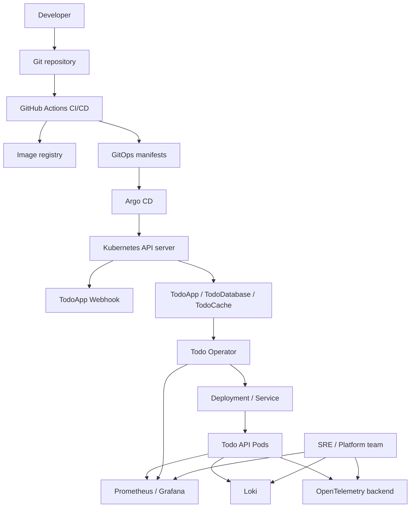
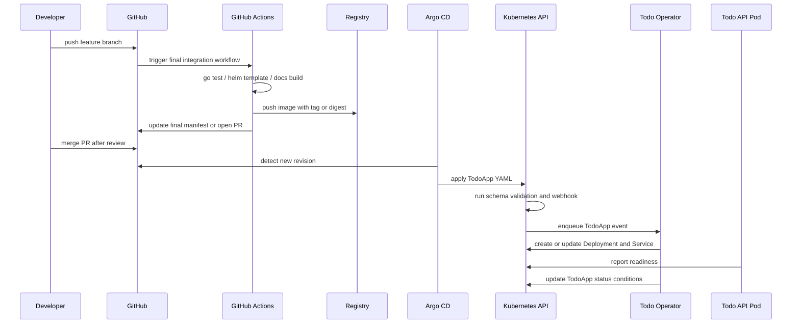
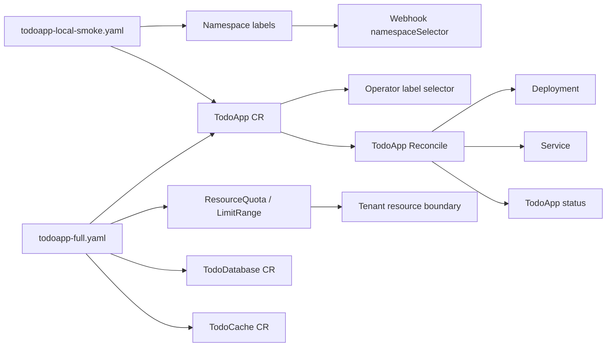
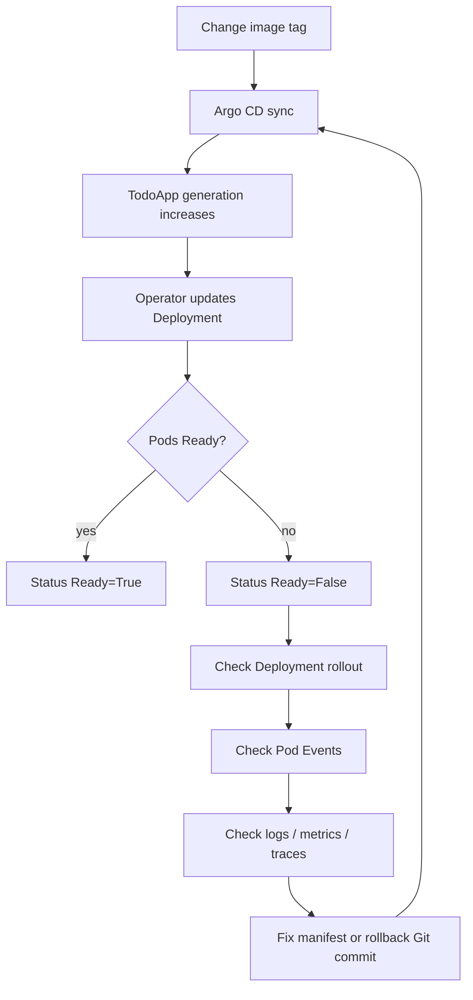
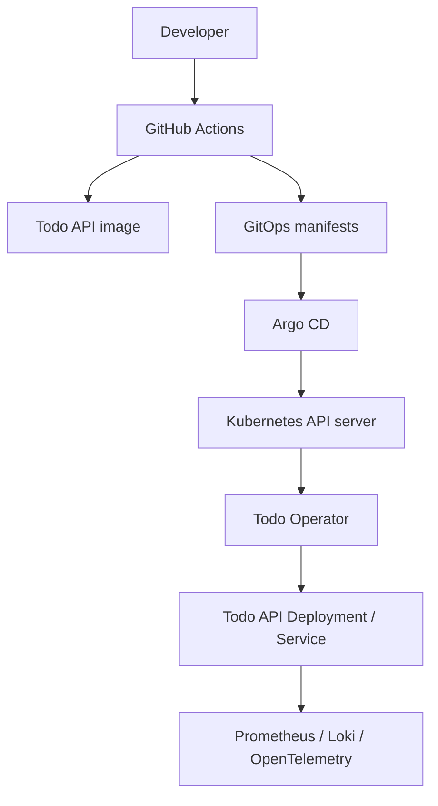

# 第 42 篇：综合集成与能力验收

走到第 42 篇，Cloud Native Todo Platform 已经不再是一个单点练习。你已经写过 Go API，做过 Docker 镜像，部署过 Kubernetes 工作负载，配置过 Helm、Kustomize、CI/CD、GitOps、Prometheus、Grafana、Loki、OpenTelemetry，也从 CRD、Controller、Kubebuilder、Webhook、Finalizer、测试发布一直推进到 Operator 生产实践。

最后一篇要做的事不是再加一个孤立功能，而是把这些能力串成一条可以展示、可以验收、可以排障、可以讲给面试官听的完整交付链路。真实岗位里，一个项目能不能写在简历上，不取决于它用了多少技术名词，而取决于你能不能讲清楚：它解决了什么问题，架构边界在哪里，发布链路如何收敛，出故障时怎么定位，回滚时有什么证据。

本篇特色项目是：**整理 Cloud Native Todo Platform 最终作品集，完成从 Git Push、CI/CD、GitOps、Argo CD、Todo Operator 到一条 YAML 触发应用交付的综合演练，并把交付过程沉淀成部署说明、排障文档和面试讲解稿。**

## 1. 本章学习目标

### 1.1 知识目标

学完本章后，你应该能够：

- 能解释 Cloud Native Todo Platform 的最终架构分层，以及 Go API、容器镜像、Kubernetes、GitOps、可观测性和 Operator 各自负责什么。
- 能描述从 Git Push 到运行中 Pod 的全链路状态流转：代码提交、CI 验证、镜像发布、GitOps 同步、Operator 调谐、监控验证。
- 能对比“应用 Helm Chart 交付”和“Operator + 自定义资源交付”的边界、优势和风险。
- 能解释为什么最终作品集必须包含架构图、部署说明、验证记录、故障复盘和面试讲解稿，而不只是代码仓库地址。
- 能把 Service Mesh、WASM、eBPF、供应链安全、平台工程和 SRE 能力放到后续学习路线中，判断下一步应该补哪块短板。

### 1.2 技能目标

学完本章后，你应该能够：

- 能独立整理项目目录，形成面向团队交付的 `deployments/final/`、`docs/portfolio/`、`scripts/final-verify.sh` 和 GitOps Application 示例。
- 能编写最小可执行 `TodoApp` 交付 YAML，用一条 `kubectl apply -f deployments/final/todoapp-local-smoke.yaml` 验证当前 Operator 闭环。
- 能配置最终集成 CI，验证 Go 测试、Operator 构建、Helm 模板、文档构建和最终 YAML server-side dry-run。
- 能通过 Argo CD Application 把最终交付入口纳入 GitOps，并判断 `Synced`、`OutOfSync`、`Healthy`、`Degraded` 的原因。
- 能模拟一次镜像错误故障，从 `TodoApp`、Deployment、Events、日志、metrics 和 Git 变更记录中定位并修复。
- 能写出可用于简历和面试的项目表达，包括项目亮点、个人贡献、技术选型、故障案例和追问答案。

## 2. 本章工作场景与真实案例

### 2.1 技术痛点

很多学习者做到最后会遇到一个很现实的问题：每一篇单独看都能跑通，但项目放到一起就讲不清楚。面试官问“你这个项目怎么部署”，回答变成“先跑一个脚本，再装一个 Helm Chart，然后看一下 Grafana”；SRE 同学问“出了问题怎么回滚”，回答变成“应该可以看日志”；团队负责人问“这个 Operator 的边界是什么”，回答变成“它会创建 Deployment 和 Service”。

这类回答的问题不是技术没学，而是缺少最终集成视图。真实项目交付需要把功能链路、发布链路、观测链路和排障链路对齐。否则代码仓库里有很多文件，但没有一个人能快速判断：这次提交是否通过了验证，镜像标签是否可追踪，Argo CD 同步的是哪一次变更，Operator 接管了哪些命名空间，告警触发后应该看哪份手册。

本章要解决的痛点是“从能做实验到能交付项目”。你要把前 41 篇产物整理成一个可验收的最终状态：一条 YAML 能触发交付，CI 能说明变更是否可信，GitOps 能说明集群状态来自哪个提交，可观测系统能说明运行状态，作品集文档能说明你真的理解了这套系统。

### 2.2 团队协作场景

在团队里，平台工程师负责维护 Operator、CRD、Helm Chart、GitOps 模板和发布流水线；应用开发者负责提交 Todo API 代码和最终 `TodoApp` 声明；SRE 负责检查运行状态、告警规则、容量边界和回滚动作；安全团队负责审查 RBAC、镜像来源、Secret 管理、准入控制和供应链记录；面试或晋升评审时，候选人需要把这些协作边界讲成一个完整故事。

本章实验会模拟这条协作线。你会创建一个最终交付分支，补齐最终 YAML、GitHub Actions 工作流、Argo CD Application、验证脚本和作品集文档。然后通过一次故障注入证明这不是“截图项目”：当镜像标签错误导致 Pod 无法启动时，你能按证据链定位到 Deployment、Events、`TodoApp.status.conditions`、Operator 指标和 Git 变更，再通过 GitOps 修复。

### 2.3 课程项目关联

本章继续使用前面所有阶段积累的目录，尤其是：

- `api/`：第 9-14 篇积累的 Todo API 服务。
- `deployments/`：第 15-28 篇积累的 Docker、Kubernetes、Helm 和 Kustomize 交付文件。
- `.github/workflows/`：第 29 篇积累的 CI/CD 流水线。
- `observability/`：第 31-32 篇积累的 Prometheus、Grafana、Loki 和 OpenTelemetry 配置。
- `operator/kubebuilder/` 与 `operator/helm/todo-operator/`：第 38-41 篇积累的 Todo Operator。

本章把项目版本线推进到 `v5.0-final-delivery`。其中第 41 篇的 `v4.7-operator-production` 是 Operator 自身的生产基线，本篇的 `v5.0-final-delivery` 是整个 Cloud Native Todo Platform 的综合交付基线。

需要提前说明一个边界：第 35 篇定义过 `TodoApp`、`TodoDatabase`、`TodoCache` 三个 CRD，第 38-41 篇实际完成的是 `TodoApp` 对 Deployment、Service、status、Events 和 metrics 的自动化管理。也就是说，当前课程主线已经具备“应用交付 Operator”的可执行能力，但还没有实现数据库和缓存的独立 Controller。

因此本章实验采用“两条路径”：

- **路径 A：最小可执行闭环**。只依赖第 41 篇已有 Operator，使用 `deployments/final/todoapp-local-smoke.yaml` 创建 `TodoApp`，验证 Deployment、Service、Ready condition、RBAC、metrics 和故障演练。这条路径是本章必须跑通的主路径。
- **路径 B：完整作品集增强路径**。使用 `deployments/final/todoapp-full.yaml` 表达 `TodoApp`、`TodoDatabase`、`TodoCache` 的最终平台契约，并接入 Argo CD、Prometheus、Loki、Trace 和作品集证据。只有当你已经安装第 35 篇三个 CRD，或已经继续实现 DB/Cache Controller 时，才把它作为完整可执行路径。

这样安排不是降低目标，而是让课程边界更真实：企业项目经常会先交付一个可运行的最小闭环，再把尚未自动化的能力写成明确的 API 契约和路线图。面试或评审时，能诚实讲清“已经实现什么、还计划实现什么”，比把未完成能力说成已完成更专业。

## 3. 核心概念

### 3.1 最终交付契约

最终交付契约是团队约定的“用户只需要提交什么，平台负责完成什么”。在本项目里，业务方提交的是 `TodoApp` 以及相关平台资源声明；平台方提前安装 CRD、Operator、监控、日志、链路追踪和 GitOps 控制面。

表 42-1 最终交付契约

| 契约对象 | 谁负责 | 作用 | 本章文件 |
|---|---|---|---|
| `TodoApp` CR | 应用团队提交，平台团队定义 | 声明 Todo API 镜像、副本数、端口和接管标签 | `deployments/final/todoapp-local-smoke.yaml` / `todoapp-full.yaml` |
| Operator Helm release | 平台团队 | 安装 CRD、Webhook、Controller Manager、metrics、RBAC | `operator/helm/todo-operator/` |
| GitOps Application | 平台/SRE | 把最终交付目录同步到目标集群 | `deployments/gitops/applications/todo-platform-final.yaml` |
| CI 工作流 | 平台/应用共同维护 | 在合并前验证代码、模板、文档和最终 YAML | `.github/workflows/final-integration.yml` |
| 作品集文档 | 项目负责人 | 解释架构、部署、排障、截图和面试表达 | `docs/portfolio/` |

这份契约的价值在于降低协作成本。应用团队不用理解全部 Deployment 字段，平台团队也不用替每个应用手写 YAML。双方通过 CRD schema、Webhook 校验、RBAC 和验证脚本对齐边界。

### 3.2 全链路部署验证

全链路部署验证不是只看最后一个 Pod 是否 Running，而是证明每个控制点都有证据。代码提交要能对应 CI 记录，CI 记录要能对应镜像标签或 digest，GitOps 变更要能对应 Argo CD 同步记录，Argo CD 同步要能对应集群里的 `TodoApp`，`TodoApp` 要能对应 Deployment、Service、Events、Conditions 和 metrics。

最小证据链如下：

```text linenums="0"
git commit SHA
  -> GitHub Actions run
  -> image tag or digest
  -> GitOps manifest commit
  -> Argo CD application revision
  -> TodoApp metadata.generation
  -> Deployment rollout revision
  -> Service endpoint
  -> metrics/logs/traces evidence
```

如果其中任何一段断掉，生产排障时就会出现“我不知道现在集群里跑的是哪次提交”的问题。最终集成章的核心能力，就是让这条链路可追踪、可复现、可回滚。

### 3.3 一条 YAML 与平台前置能力

“一条 YAML 部署整套平台”容易被误解成一个文件里要塞进所有 Kubernetes 对象。更准确的说法是：平台前置能力已经安装完成后，应用团队通过一份声明式入口触发平台自动化交付。

本章会给出两份 YAML。第一份是 **最小可执行 YAML**，只包含命名空间准入边界和 `TodoApp`，用于证明第 41 篇 Operator 能完成真实调谐。第二份是 **完整作品集 YAML**，在最小路径之上加入资源配额、数据库和缓存契约，用于表达最终平台设计。

完整作品集 YAML 包含四类内容：

- 命名空间准入标签：告诉 Webhook 和 Operator 这个 namespace 属于 Todo Platform 管理范围。
- 租户资源边界：`ResourceQuota`、`LimitRange` 等限制教学集群资源消耗。
- 平台依赖契约：`TodoDatabase`、`TodoCache` 这类 CR 表达数据库和缓存需求。
- 应用交付入口：`TodoApp` 触发 Operator 创建 Deployment、Service，并回写 status。

注意，Operator、CRD、Prometheus、Loki、Tempo 或 Jaeger、Argo CD 这些属于平台控制面，不应该由业务 YAML 每次重复安装。它们更像“机场跑道”，业务 YAML 是“航班计划”。航班计划可以一份文件提交，但跑道需要平台团队先维护好。

因此，本章的“必须通过”标准是最小可执行 YAML 能创建并验证 `TodoApp`；“增强通过”标准才是完整作品集 YAML 能在具备 DB/Cache CRD 和 GitOps 控制面的环境中闭环。

### 3.4 最终作品集

最终作品集是把项目能力翻译成别人能检查的证据。它不是简历包装词，而是把工程产物整理成结构化材料。

表 42-2 作品集证据清单

| 证据 | 文件或截图 | 回答的问题 |
|---|---|---|
| 总架构图 | `docs/portfolio/architecture.md` | 系统由哪些层组成，数据和控制流如何走 |
| 部署说明 | `docs/portfolio/deploy-runbook.md` | 新环境如何安装、验证、回滚 |
| 最终 YAML | `deployments/final/todoapp-full.yaml` | 用户如何声明一个 Todo Platform 实例 |
| GitOps 记录 | Argo CD Application 截图或导出 | 当前集群状态来自哪个 Git revision |
| Grafana 截图 | `docs/portfolio/evidence/grafana-overview.png` | QPS、延迟、错误率和资源状态是否可观察 |
| 日志/Trace 截图 | `docs/portfolio/evidence/log-trace-correlation.png` | request_id 如何从日志跳到 Trace |
| 故障复盘 | `docs/portfolio/troubleshooting.md` | 出故障时如何定位、修复、预防 |
| 面试讲解稿 | `docs/portfolio/interview-talk-track.md` | 如何在 3-5 分钟讲清楚项目 |

面试官通常不会逐行读你的所有代码，但会抓住一个点深入追问。作品集的作用，是让你每个关键点都有对应证据，而不是靠记忆临场发挥。

### 3.5 工程能力表达模型

项目表达可以按“四层模型”组织：

1. **业务目标**：这个平台让应用团队用声明式方式交付 Todo 服务，减少手写 Kubernetes 资源和发布不一致。
2. **架构设计**：Go API 运行在 Kubernetes 上，CI/CD 生产镜像，GitOps 管理期望状态，Operator 负责应用生命周期，可观测系统负责反馈运行状态。
3. **工程取舍**：为什么用 CRD 表达应用，为什么 Operator 只接管带标签对象，为什么 Webhook 要限制 namespace，为什么使用 GitOps 而不是手工 `kubectl apply`。
4. **事故经验**：展示一次真实风格故障，从现象、影响面、定位路径、修复动作到预防措施。

这个模型能避免“背技术栈清单”。你不是说“我会 Kubernetes、Helm、Argo CD、Prometheus”，而是说“我用这些组件解决了一条从代码到生产运行的交付问题，并能说明每个组件的边界”。

## 4. 原理深入

### 4.1 最终总架构



这张图有两条线。上半部分是交付控制线：开发者提交代码，CI 验证并发布镜像，GitOps 记录期望状态，Argo CD 同步到集群，API server 触发 Webhook 和 Operator。下半部分是运行反馈线：Pod、Operator 和 Kubernetes 事件把状态反馈给 Prometheus、日志系统和链路追踪系统。

真实生产中最重要的是这两条线能闭环。交付线没有反馈，就会变成“部署完才知道坏了”；反馈线没有交付记录，就会变成“看到故障但不知道是哪次变更引入的”。

### 4.2 Git Push 到 Operator 调谐的时序



这条时序里有几个关键的状态门：

- CI 失败时，变更不应该进入 GitOps 目录。
- Webhook 拒绝时，错误应该暴露给提交 YAML 的人。
- Operator 调谐失败时，`TodoApp.status.conditions` 和 Events 应该能说明原因。
- Pod 不 Ready 时，Deployment rollout、容器日志和指标要能定位到镜像、探针、资源或依赖问题。

### 4.3 一条 YAML 背后的控制边界



从用户视角看，最小路径和完整路径都是“一条 YAML 入口”。从平台视角看，它们会经过多道边界：namespace 标签决定 Admission 是否生效，接管标签决定 Operator 是否处理，RBAC 决定 Operator 是否有权创建子资源，Quota 决定租户能消耗多少资源，status 决定用户能看到什么结果。

这也是为什么第 41 篇强调最小 RBAC、Watch 范围、Webhook `namespaceSelector`、predicate 和 metrics。没有这些边界，一条 YAML 不是简化交付，而是扩大事故影响面。

### 4.4 故障演练闭环



本章故障演练选择“错误镜像标签”，因为它真实、常见、影响明确。现象通常是 `ImagePullBackOff` 或 `ErrImagePull`，不会破坏集群，也能完整覆盖 GitOps、Operator、Deployment、Events 和 status。排障时不要直接改线上 Pod，而要回到声明式入口：修复 Git 中的镜像值，让 Argo CD 重新同步，Operator 再调谐到新状态。

### 4.5 从项目到工程能力

表 42-3 项目能力到工程能力的映射

| 项目证据 | 工程能力 | 表达重点 |
|---|---|---|
| Go API 与测试 | 后端工程能力 | API 设计、测试、配置、优雅关闭 |
| Dockerfile 与镜像扫描 | 容器化能力 | 多阶段构建、非 root、镜像体积和安全 |
| Kubernetes YAML / Helm / Kustomize | 应用交付能力 | 工作负载、配置、存储、网络和多环境 |
| CI/CD 与 GitOps | 发布工程能力 | 可重复发布、审查、回滚和审计 |
| Prometheus / Loki / Trace | 可观测性能力 | 指标、日志、链路追踪如何协同排障 |
| CRD / Controller / Operator | 平台工程能力 | 声明式 API、控制循环、生命周期自动化 |
| 故障复盘 | SRE 思维 | 影响面、定位证据、修复动作、预防机制 |

最终作品集要服务于这个映射。一个好的项目讲解不是“我写了很多文件”，而是“这些文件分别证明了哪些工程能力”。

## 5. 手把手实验

### 5.1 步骤 1：实验目标

本次实验目标是：在项目仓库中整理最终交付入口和作品集材料，先用一条 `kubectl apply -f deployments/final/todoapp-local-smoke.yaml` 跑通当前 Operator 的最小闭环，再用 `deployments/final/todoapp-full.yaml` 整理完整平台契约和作品集证据。

预计耗时：90 分钟（动手操作约 60 分钟）。

### 5.2 步骤 2：实验环境

表 42-4 实验工具版本

| 工具 | 版本 | 用途 |
|---|---|---|
| Go | 1.26.x | API 和 Operator 测试构建 |
| Docker | 29.x | 构建和加载镜像 |
| Kubernetes | 1.36.x | kind 集群和 API server 验证 |
| kubectl | 1.36.x | 资源 apply、wait、describe、logs |
| Helm | 4.2.x | Operator Chart lint、template、install |
| Kubebuilder | 4.11.x | Operator 项目和 controller-runtime 依赖 |
| Argo CD | 3.2.x | GitOps 同步最终交付目录 |
| Prometheus / Grafana | 课程第 31 篇版本 | 指标采集和面板验证 |
| Loki / OpenTelemetry backend | 课程第 32 篇版本 | 日志和链路追踪验证 |

本章默认你已经完成第 41 篇，至少具备以下前置状态：

- `todoapps.platform.todo.example.com` CRD 已安装；如果要直接运行本章完整 YAML，`tododatabases.platform.todo.example.com` 和 `todocaches.platform.todo.example.com` 也应已安装。
- Todo Operator 已通过 Helm 安装到 `todo-operator-system`。
- Operator Watch 范围包含 `todo-team-a`。
- `WATCH_LABEL_SELECTOR` 包含 `platform.todo.example.com/managed=true`。
- metrics Service 已暴露。

先执行下面的检查：

```bash linenums="0"
kubectl get crd todoapps.platform.todo.example.com
kubectl get deploy -n todo-operator-system
kubectl get svc -n todo-operator-system
kubectl get ns todo-team-a --ignore-not-found
```

如果你还没有安装 Operator，先回到第 41 篇完成 Helm 部署和 smoke test，再继续本章。

### 5.3 步骤 3：文件目录结构

本章在项目根目录新增或整理下面这些文件：

```text linenums="0"
cloud-native-todo-platform/
├── .github/
│   └── workflows/
│       └── final-integration.yml
├── deployments/
│   ├── final/
│   │   ├── todoapp-local-smoke.yaml
│   │   └── todoapp-full.yaml
│   └── gitops/
│       └── applications/
│           └── todo-platform-final.yaml
├── docs/
│   └── portfolio/
│       ├── architecture.md
│       ├── deploy-runbook.md
│       ├── troubleshooting.md
│       ├── interview-talk-track.md
│       └── evidence/
│           └── README.md
└── scripts/
    └── final-verify.sh
```

如果你的仓库里还没有这些目录，先创建：

```bash linenums="0"
mkdir -p .github/workflows
mkdir -p deployments/final
mkdir -p deployments/gitops/applications
mkdir -p docs/portfolio/evidence
mkdir -p scripts
```

### 5.4 步骤 4：完整配置

#### 5.4.1 最小可执行 YAML

先创建 `deployments/final/todoapp-local-smoke.yaml`。这份文件只验证第 41 篇已经实现的能力：namespace 准入标签、`TodoApp` 接管标签、Deployment/Service 调谐和 status 回写。

```yaml linenums="0"
apiVersion: v1
kind: Namespace
metadata:
  name: todo-team-a
  labels:
    platform.todo.example.com/admission: "enabled"
    platform.todo.example.com/tenant: "todo-team-a"
---
apiVersion: platform.todo.example.com/v1alpha1
kind: TodoApp
metadata:
  name: todo-platform-final
  namespace: todo-team-a
  labels:
    platform.todo.example.com/managed: "true"
    platform.todo.example.com/part-of: "cloud-native-todo-platform"
  annotations:
    platform.todo.example.com/release: "v5.0-final-delivery"
    platform.todo.example.com/source: "deployments/final/todoapp-local-smoke.yaml"
spec:
  image: registry.cn-guangzhou.aliyuncs.com/yleoer/hello:plain-text
  replicas: 2
  port: 80
```

这里使用 `registry.cn-guangzhou.aliyuncs.com/yleoer/hello:plain-text` 是为了让本地 kind 和课程环境稳定验收。它不是最终业务镜像，只用于证明 Operator 闭环可执行。真正作品集里应把 `TodoApp.spec.image` 替换为课程 Todo API 镜像或镜像 digest。

#### 5.4.2 完整作品集 YAML

创建 `deployments/final/todoapp-full.yaml`：

```yaml linenums="0"
apiVersion: v1
kind: Namespace
metadata:
  name: todo-team-a
  labels:
    platform.todo.example.com/admission: "enabled"
    platform.todo.example.com/tenant: "todo-team-a"
---
apiVersion: v1
kind: ResourceQuota
metadata:
  name: todo-team-a-quota
  namespace: todo-team-a
spec:
  hard:
    pods: "20"
    requests.cpu: "4"
    requests.memory: 8Gi
    limits.cpu: "8"
    limits.memory: 16Gi
    count/todoapps.platform.todo.example.com: "5"
---
apiVersion: v1
kind: LimitRange
metadata:
  name: todo-team-a-defaults
  namespace: todo-team-a
spec:
  limits:
    - type: Container
      defaultRequest:
        cpu: 100m
        memory: 128Mi
      default:
        cpu: 500m
        memory: 512Mi
---
apiVersion: v1
kind: Secret
metadata:
  name: todo-postgres-credentials
  namespace: todo-team-a
type: Opaque
stringData:
  username: todo
  password: change-me-in-real-env # 使用前替换为环境专用 Secret，不要提交真实生产密码。
---
apiVersion: platform.todo.example.com/v1alpha1
kind: TodoDatabase
metadata:
  name: todo-postgres
  namespace: todo-team-a
  labels:
    platform.todo.example.com/managed: "true"
spec:
  engine: PostgreSQL
  version: "18"
  storage:
    size: 5Gi
  credentialsSecretName: todo-postgres-credentials
  backup:
    enabled: true
    schedule: "0 2 * * *"
    retentionDays: 7
---
apiVersion: platform.todo.example.com/v1alpha1
kind: TodoCache
metadata:
  name: todo-redis
  namespace: todo-team-a
  labels:
    platform.todo.example.com/managed: "true"
spec:
  engine: Redis
  version: "8"
  memoryProfile: small
  replicas: 1
  persistence:
    enabled: false
---
apiVersion: platform.todo.example.com/v1alpha1
kind: TodoApp
metadata:
  name: todo-platform-final
  namespace: todo-team-a
  labels:
    platform.todo.example.com/managed: "true"
    platform.todo.example.com/part-of: "cloud-native-todo-platform"
  annotations:
    platform.todo.example.com/release: "v5.0-final-delivery"
    platform.todo.example.com/source: "deployments/final/todoapp-full.yaml"
spec:
  image: ghcr.io/your-org/todo-api:v5.0.0 # 使用前替换为 CI 发布的镜像 tag 或 digest。
  replicas: 2
  port: 80
```

这份文件是最终作品集契约，适合放进 PR 和 Argo CD。`ghcr.io/your-org/todo-api:v5.0.0` 和 `change-me-in-real-env` 都是占位符，使用前必须替换。它默认要求集群中已经安装 `TodoDatabase` 和 `TodoCache` CRD。当前课程 Operator 不会调谐数据库和缓存实例，所以它们在这里的作用是表达平台 API 边界；如果你已经继续实现 DB/Cache Controller，它们才会触发真正的 PostgreSQL 和 Redis 交付。

为了避免作品集误读，本章后续提到“一条 YAML”时，默认指两层含义：路径 A 是当前课程已实现的最小闭环，也就是 `TodoApp` 触发 Operator 创建应用层 Deployment 和 Service；路径 B 是完整平台契约展示，也就是同一份作品集中包含 `TodoDatabase` 和 `TodoCache` 这类未来可调谐的 API 对象。路径 B 不是在声称当前 Operator 已经自动交付数据库和缓存。

#### 5.4.3 GitOps Application

创建 `deployments/gitops/applications/todo-platform-final.yaml`：

```yaml linenums="0"
apiVersion: argoproj.io/v1alpha1
kind: Application
metadata:
  name: todo-platform-final
  namespace: argocd
  labels:
    app.kubernetes.io/part-of: cloud-native-todo-platform
spec:
  project: default
  source:
    repoURL: https://github.com/your-org/cloud-native-todo-platform.git
    targetRevision: main
    path: deployments/final
    directory:
      include: todoapp-full.yaml
  destination:
    server: https://kubernetes.default.svc
    namespace: todo-team-a
  syncPolicy:
    automated:
      selfHeal: true
    syncOptions:
      - CreateNamespace=true
      - ServerSideApply=true
```

把 `repoURL` 改成你的项目仓库地址。这里用 `directory.include: todoapp-full.yaml` 是为了让 Argo CD 只同步完整作品集入口，不把本地 smoke YAML 一起同步。生产环境建议把 `targetRevision` 固定到环境分支或发布标签，例如 `prod`、`release/v5.0.0`，避免所有 `main` 变更自动进入生产。

`ServerSideApply=true` 用于让 Argo CD 采用 server-side apply，适合字段较多的 CR 和后续多控制面协作场景，也能避免大型对象的 `last-applied-configuration` annotation 过大。它会改变字段所有权和冲突检测方式，生产环境应先在预发环境验证。

本示例默认没有开启 `prune`。生产环境只有在确认删除资源的影响面后，才建议开启自动 prune；如果最终 YAML 包含 Namespace 或 CR 实例，错误 prune 可能导致租户资源被删除。

#### 5.4.4 最终集成 CI

创建 `.github/workflows/final-integration.yml`：

```yaml linenums="0"
name: final-integration

on:
  pull_request:
    branches:
      - main
  push:
    branches:
      - main

jobs:
  validate:
    runs-on: ubuntu-latest
    steps:
      - name: Checkout
        uses: actions/checkout@v4

      - name: Set up Go
        uses: actions/setup-go@v5
        with:
          go-version: "1.26"
          cache: true
          cache-dependency-path: |
            api/go.sum
            operator/kubebuilder/go.sum

      - name: Set up Python
        uses: actions/setup-python@v5
        with:
          python-version: "3.13"

      - name: Install Helm and kubectl
        env:
          HELM_VERSION: v4.2.0
          KUBECTL_VERSION: v1.36.0
        run: |
          curl -fsSLo helm.tar.gz "https://get.helm.sh/helm-${HELM_VERSION}-linux-amd64.tar.gz"
          tar -xzf helm.tar.gz
          sudo install -m 0755 linux-amd64/helm /usr/local/bin/helm
          curl -fsSLo kubectl "https://dl.k8s.io/release/${KUBECTL_VERSION}/bin/linux/amd64/kubectl"
          sudo install -m 0755 kubectl /usr/local/bin/kubectl
          helm version
          kubectl version --client=true

      - name: Install docs dependencies
        run: |
          if [ -f requirements.txt ]; then
            python -m pip install --upgrade pip
            python -m pip install -r requirements.txt
          fi

      - name: Validate API
        run: |
          if [ -d api ]; then
            cd api
            go test ./...
            go build ./...
          fi

      - name: Validate Operator
        run: |
          if [ -d operator/kubebuilder ]; then
            cd operator/kubebuilder
            go test ./...
            go build ./...
          fi

      - name: Validate Operator Helm chart
        run: |
          if [ -d operator/helm/todo-operator ]; then
            helm lint operator/helm/todo-operator
            helm template todo-operator operator/helm/todo-operator \
              --namespace todo-operator-system \
              --set watch.namespaces="{todo-team-a}" \
              >/tmp/todo-operator-rendered.yaml
          fi

      - name: Validate final YAML syntax
        run: |
          test -f deployments/final/todoapp-local-smoke.yaml
          test -f deployments/final/todoapp-full.yaml
          kubectl apply --dry-run=client --validate=false -f deployments/final/todoapp-local-smoke.yaml
          kubectl apply --dry-run=client --validate=false -f deployments/final/todoapp-full.yaml

      - name: Build docs
        run: |
          if [ -f mkdocs.yml ]; then
            python -m mkdocs build --strict
          fi
```

上面的 workflow 使用当前验证过的 `actions/checkout@v4`、`actions/setup-go@v5` 和 `actions/setup-python@v5`。出版前不要只凭记忆判断版本号是否存在，应执行下面的命令复核 tag：

<<<<<<< HEAD
```bash linenums="0"
git ls-remote --tags https://github.com/actions/checkout.git refs/tags/v6
git ls-remote --tags https://github.com/actions/setup-go.git refs/tags/v6
git ls-remote --tags https://github.com/actions/setup-python.git refs/tags/v6
=======
```bash
git ls-remote --tags https://github.com/actions/checkout.git refs/tags/v4
git ls-remote --tags https://github.com/actions/setup-go.git refs/tags/v5
git ls-remote --tags https://github.com/actions/setup-python.git refs/tags/v5
>>>>>>> origin/main
```

如果未来升级到更高 major 版本 action，必须先确认 tag 真实存在、runner 版本满足 action runtime 要求，并至少在 GitHub Actions 中跑通一次完整 workflow。`python-version: "3.13"` 是当前课程验证线；若改用 Python 3.14，应同步验证 runner 镜像支持。Helm 4.2.0 实测不支持短格式版本输出，本章用 `helm version`、`helm template --include-crds` 和一次真实 `helm install/upgrade/rollback` 证明锁定版本可用。

`kubectl apply --dry-run=client --validate=false` 只能检查 YAML 基本结构，并跳过 OpenAPI schema 校验；它无法验证集群中是否真的有 CRD，也不会调用 Webhook。生产 CI 可以增加一个 kind job：安装 CRD 和 Operator 后执行 `--dry-run=server`，这样能发现 schema、Webhook 和 RBAC 问题。这里把 client dry-run 放在主 workflow，是为了让没有 kubeconfig 的 GitHub runner 也能完成基础语法检查。

#### 5.4.5 最终验证脚本

创建 `scripts/final-verify.sh`：

```bash linenums="0"
#!/usr/bin/env bash
set -euo pipefail

NAMESPACE="${NAMESPACE:-todo-team-a}"
APP_NAME="${APP_NAME:-todo-platform-final}"
MANIFEST="${MANIFEST:-deployments/final/todoapp-local-smoke.yaml}"
OPERATOR_NAMESPACE="${OPERATOR_NAMESPACE:-todo-operator-system}"
OPERATOR_SERVICE_ACCOUNT="${OPERATOR_SERVICE_ACCOUNT:-todo-operator}"
METRICS_SERVICE="${METRICS_SERVICE:-todo-operator-metrics}"
METRICS_LOCAL_PORT="${METRICS_LOCAL_PORT:-18083}"

if [ "${1:-}" = "--help" ]; then
  cat <<'EOF'
Usage:
  scripts/final-verify.sh

Environment variables:
  NAMESPACE                  target tenant namespace, default todo-team-a
  APP_NAME                   TodoApp name, default todo-platform-final
  MANIFEST                   manifest path, default deployments/final/todoapp-local-smoke.yaml
  OPERATOR_NAMESPACE         operator namespace, default todo-operator-system
  OPERATOR_SERVICE_ACCOUNT   operator service account, default todo-operator
  METRICS_SERVICE            metrics service name, default todo-operator-metrics
  METRICS_LOCAL_PORT         local port for metrics port-forward, default 18083
EOF
  exit 0
fi

port_forward_pid=""

cleanup() {
  if [ -n "${port_forward_pid}" ]; then
    kill "${port_forward_pid}" >/dev/null 2>&1 || true
  fi
}
trap cleanup EXIT

need() {
  if ! command -v "$1" >/dev/null 2>&1; then
    echo "missing required command: $1" >&2
    exit 1
  fi
}

need kubectl
need grep
need sed
need curl

echo "==> checking CRDs"
kubectl get crd todoapps.platform.todo.example.com >/dev/null

echo "==> applying manifest: ${MANIFEST}"
kubectl apply -f "${MANIFEST}"

echo "==> waiting for namespace and TodoApp"
kubectl get namespace "${NAMESPACE}" >/dev/null
kubectl -n "${NAMESPACE}" get todoapp "${APP_NAME}" >/dev/null

echo "==> waiting for generated Deployment"
kubectl -n "${NAMESPACE}" rollout status "deployment/${APP_NAME}" --timeout=180s

echo "==> checking Service"
kubectl -n "${NAMESPACE}" get service "${APP_NAME}" >/dev/null

echo "==> checking TodoApp Ready condition"
ready_condition="$(kubectl -n "${NAMESPACE}" get todoapp "${APP_NAME}" \
  -o jsonpath='{range .status.conditions[?(@.type=="Ready")]}{.status}{" "}{.reason}{end}')"
echo "${ready_condition}"
echo "${ready_condition}" | grep -E 'True .*DeploymentReady|True'

echo "==> checking RBAC boundary"
SA="system:serviceaccount:${OPERATOR_NAMESPACE}:${OPERATOR_SERVICE_ACCOUNT}"
if kubectl -n "${OPERATOR_NAMESPACE}" get serviceaccount "${OPERATOR_SERVICE_ACCOUNT}" >/dev/null 2>&1; then
  kubectl auth can-i create deployments --as="${SA}" -n "${NAMESPACE}" | grep yes
  kubectl auth can-i delete todoapps --as="${SA}" -n "${NAMESPACE}" | grep no
else
  echo "skip RBAC check: serviceaccount ${SA} not found"
  echo "set OPERATOR_SERVICE_ACCOUNT to the Helm-rendered service account name"
fi

echo "==> checking operator metrics"
if kubectl -n "${OPERATOR_NAMESPACE}" get service "${METRICS_SERVICE}" >/dev/null 2>&1; then
  kubectl -n "${OPERATOR_NAMESPACE}" port-forward "svc/${METRICS_SERVICE}" "${METRICS_LOCAL_PORT}:8080" \
    >/tmp/todo-final-port-forward.log 2>&1 &
  port_forward_pid="$!"

  for attempt in $(seq 1 20); do
    if curl -fsS "http://127.0.0.1:${METRICS_LOCAL_PORT}/metrics" >/tmp/todo-final-metrics.txt 2>/dev/null; then
      break
    fi
    sleep 1
  done

  grep 'controller_runtime_reconcile' /tmp/todo-final-metrics.txt
else
  echo "skip metrics check: service ${OPERATOR_NAMESPACE}/${METRICS_SERVICE} not found"
  echo "set METRICS_SERVICE to the Helm-rendered metrics service name"
  : > /tmp/todo-final-metrics.txt
fi

echo "==> optional DB/Cache CRD check"
if kubectl get crd tododatabases.platform.todo.example.com >/dev/null 2>&1; then
  kubectl -n "${NAMESPACE}" get tododatabase || true
else
  echo "TodoDatabase CRD not found; this is fine for the local smoke path"
fi

if kubectl get crd todocaches.platform.todo.example.com >/dev/null 2>&1; then
  kubectl -n "${NAMESPACE}" get todocache || true
else
  echo "TodoCache CRD not found; this is fine for the local smoke path"
fi

echo "==> collecting evidence"
mkdir -p docs/portfolio/evidence
kubectl -n "${NAMESPACE}" get todoapp "${APP_NAME}" -o yaml > docs/portfolio/evidence/final-todoapp.yaml
kubectl -n "${NAMESPACE}" get deploy,svc,pod > docs/portfolio/evidence/final-k8s-state.txt
kubectl -n "${NAMESPACE}" get events --sort-by=.lastTimestamp > docs/portfolio/evidence/final-events.txt
if [ -s /tmp/todo-final-metrics.txt ]; then
  sed -n '1,80p' /tmp/todo-final-metrics.txt > docs/portfolio/evidence/final-metrics-sample.txt
else
  echo "metrics sample not collected" > docs/portfolio/evidence/final-metrics-sample.txt
fi

echo "final verification passed"
```

脚本默认验证最小可执行路径。如果你已经具备完整 DB/Cache CRD 和真实 Todo API 镜像，可以这样验证完整作品集 YAML：

```bash linenums="0"
MANIFEST=deployments/final/todoapp-full.yaml scripts/final-verify.sh
```

给脚本增加执行权限：

```bash linenums="0"
chmod +x scripts/final-verify.sh
```

Windows 用户建议在 WSL 或 Git Bash 中执行这个脚本。如果必须使用 PowerShell，可以把每条 `kubectl` 命令拆开执行，本章后面的验证标准保持不变。

PowerShell 中设置环境变量的写法如下：

```powershell linenums="0"
$env:MANIFEST = "deployments/final/todoapp-local-smoke.yaml"
$env:METRICS_LOCAL_PORT = "18081"
bash scripts/final-verify.sh
```

查看脚本可覆盖参数：

```bash linenums="0"
scripts/final-verify.sh --help
```

#### 5.4.6 作品集架构说明

创建 `docs/portfolio/architecture.md`：

~~~~markdown linenums="0"
# Cloud Native Todo Platform 架构说明

## 项目目标

Cloud Native Todo Platform 用一个渐进式项目串联 Go 后端、容器化、Kubernetes 应用交付、生产工程、可观测性和 Operator 开发能力。最终目标是让应用团队通过 TodoApp 自定义资源声明 Todo 服务，由平台自动完成 Deployment、Service、状态回写和运行观测。

## 总架构



## 核心取舍

- 用 CRD 表达业务交付入口，减少应用团队直接维护底层 Kubernetes 资源。
- 用 GitOps 管理集群期望状态，保证变更可审查、可追踪、可回滚。
- 用 Operator 管理生命周期，把默认值、校验、OwnerReference、Finalizer、status 和 Events 做成平台能力。
- 用 Prometheus、日志和 Trace 形成排障闭环，而不是只依赖 Pod 是否 Running。

## 当前边界

当前 Operator 已实现 TodoApp 到 Deployment/Service 的调谐。TodoDatabase 和 TodoCache 是平台 API 契约，可在后续 Controller 中扩展为 PostgreSQL 和 Redis 的自动化交付。
~~~~

#### 5.4.7 部署手册

创建 `docs/portfolio/deploy-runbook.md`：

```markdown linenums="0"
# Cloud Native Todo Platform 部署手册

## 前置条件

- Kubernetes 1.36.x 集群可用。
- cert-manager、Prometheus Operator、Argo CD 已按课程前文安装。
- Todo Operator 已安装到 todo-operator-system。
- Operator Watch 范围包含 todo-team-a。
- 当前课程 Operator 管理 TodoApp 到 Deployment/Service；TodoDatabase 和 TodoCache 需要额外 Controller 才会交付真实数据库和缓存。

## 部署步骤

1. 推送代码并等待 final-integration 工作流通过。
2. 确认 Todo API 镜像已发布，并更新 deployments/final/todoapp-full.yaml。
3. 通过 PR 合并 GitOps 变更。
4. 等待 Argo CD Application 进入 Synced 和 Healthy。
5. 执行 scripts/final-verify.sh 收集证据。

## 回滚步骤

1. 找到上一次健康的 Git commit 或镜像 digest。
2. revert GitOps manifest 变更，禁止直接修改线上 Deployment。
3. 等待 Argo CD 同步。
4. 观察 TodoApp conditions、Deployment rollout、Prometheus 告警和业务探针。

## 发布后观察窗口

发布后至少观察 15-30 分钟：

- TodoApp Ready condition 是否稳定为 True。
- Deployment 是否有重复重启。
- controller_runtime_reconcile_errors_total 是否增长。
- API QPS、P95 延迟、5xx 错误率是否异常。
- Loki 中是否出现启动失败或依赖连接错误。
```

#### 5.4.8 故障排查文档

创建 `docs/portfolio/troubleshooting.md`：

```markdown linenums="0"
# Cloud Native Todo Platform 故障排查记录

## 演练场景：错误镜像标签

### 现象

TodoApp 更新后长时间不是 Ready，Deployment rollout 超时，Pod 出现 ImagePullBackOff。

### 影响面

影响 todo-team-a 命名空间中的 todo-platform-final 实例。Operator 自身和其他命名空间不受影响。

### 定位步骤

1. 查看 TodoApp 状态：

   kubectl -n todo-team-a describe todoapp todo-platform-final

2. 查看 Deployment rollout：

   kubectl -n todo-team-a rollout status deployment/todo-platform-final

3. 查看 Pod 事件：

   kubectl -n todo-team-a get events --sort-by=.lastTimestamp

4. 查看 Operator 日志和 metrics：

   kubectl -n todo-operator-system logs deploy/todo-operator-controller-manager
   curl -s http://127.0.0.1:18080/metrics | grep controller_runtime_reconcile

### 根因

GitOps manifest 中的 spec.image 指向不存在或无权限拉取的镜像标签。

### 修复

把 spec.image 修复为 CI 已发布的 tag 或 digest，通过 PR 合并后等待 Argo CD 同步。不要直接 patch Deployment。

### 预防

CI 中增加镜像存在性检查；生产 manifest 优先使用 digest；发布前执行 server-side dry-run 和最终 smoke test。
```

#### 5.4.9 面试讲解稿

创建 `docs/portfolio/interview-talk-track.md`：

```markdown linenums="0"
# Cloud Native Todo Platform 面试讲解稿

## 30 秒版本

这个项目用 Todo 业务串联 Go 后端、Docker、Kubernetes、CI/CD、GitOps、可观测性和 Operator 开发。最终形态是业务方提交 TodoApp 自定义资源，平台用 Operator 自动创建 Deployment 和 Service，并通过 status、Events、Prometheus、日志和 Trace 反馈运行状态。

## 3 分钟版本

项目分为六个阶段。前两阶段完成 Go API 和工程化测试；第三阶段完成 Docker 镜像和本地编排；第四阶段把应用迁移到 Kubernetes，并补齐网络、存储、安全、Helm 和 Kustomize；第五阶段接入 CI/CD、Argo CD、Prometheus、Grafana、Loki、OpenTelemetry 和生产排障；第六阶段从 CRD 和 Controller 原理出发，用 Kubebuilder 实现 Todo Operator，并补齐 Webhook、Finalizer、Conditions、测试发布和生产基线。

我重点负责最终平台交付链路：定义 TodoApp API，编写 Reconciler，限制 RBAC 和 Watch 范围，配置 Helm Chart、metrics、ServiceMonitor、PrometheusRule，并整理最终一条 YAML、GitOps Application、验证脚本和故障复盘。

## 可展开追问

- 为什么用 Operator，而不是只用 Helm？
- Webhook 失败会影响什么，如何限制影响范围？
- Reconcile 为什么必须幂等？
- GitOps 回滚和 kubectl patch 回滚有什么区别？
- 看到 ImagePullBackOff 时，你会按什么顺序排查？
```

#### 5.4.10 证据目录说明

创建 `docs/portfolio/evidence/README.md`：

```markdown linenums="0"
# Evidence

这个目录保存最终验收证据。

建议包含：

- final-todoapp.yaml：最终 TodoApp 对象状态。
- final-k8s-state.txt：Deployment、Service、Pod 状态。
- final-events.txt：按时间排序的 Kubernetes Events。
- final-metrics-sample.txt：Operator metrics 样例。
- grafana-overview.png：Grafana 面板截图。
- log-trace-correlation.png：日志和 Trace 关联截图。
- argocd-final-application.png：Argo CD Application 同步状态截图。

不要提交真实生产 Secret、Token、内网地址或用户数据。
```

### 5.5 步骤 5：执行命令

下面命令默认在项目根目录执行，并假设当前 kubeconfig 已指向第 41 篇使用的 kind 集群。Windows 用户建议使用 WSL 或 Git Bash；PowerShell 用户把 `export A=B` 改成 `$env:A = "B"`。

#### 5.5.1 本地验证文件和模板

先检查文件是否都在：

```bash linenums="0"
test -f deployments/final/todoapp-local-smoke.yaml
test -f deployments/final/todoapp-full.yaml
test -f deployments/gitops/applications/todo-platform-final.yaml
test -f .github/workflows/final-integration.yml
test -x scripts/final-verify.sh
```

验证 YAML 基本结构。这里使用 `--validate=false`，是因为 client dry-run 环境不一定能访问集群 OpenAPI schema，也不一定安装了全部 CRD：

```bash linenums="0"
kubectl apply --dry-run=client --validate=false -f deployments/final/todoapp-local-smoke.yaml
kubectl apply --dry-run=client --validate=false -f deployments/final/todoapp-full.yaml
kubectl apply --dry-run=client --validate=false -f deployments/gitops/applications/todo-platform-final.yaml
```

如果你的集群已安装所有 CRD，可以进一步执行 server-side dry-run。最小路径只要求 `TodoApp` CRD；完整路径还要求 `TodoDatabase` 和 `TodoCache` CRD：

```bash linenums="0"
kubectl apply --dry-run=server -f deployments/final/todoapp-local-smoke.yaml
kubectl apply --dry-run=server -f deployments/final/todoapp-full.yaml
```

#### 5.5.2 确认 Operator 安装状态

```bash linenums="0"
kubectl get pods -n todo-operator-system
kubectl get deploy -n todo-operator-system
kubectl get svc -n todo-operator-system
kubectl get sa -n todo-operator-system
kubectl get validatingwebhookconfiguration | grep todo
```

确认 Operator 的 ServiceAccount 权限仍符合第 41 篇收敛结果：

```bash linenums="0"
SA=system:serviceaccount:todo-operator-system:todo-operator
kubectl auth can-i create deployments --as="${SA}" -n todo-team-a
kubectl auth can-i delete todoapps --as="${SA}" -n todo-team-a
```

预期第一个返回 `yes`，第二个返回 `no`。如果你的 Helm release 渲染出的 ServiceAccount 不是 `todo-operator`，先用 `kubectl get sa -n todo-operator-system` 找到真实名称，再替换 `SA`。

#### 5.5.3 跑通最小可执行闭环

```bash linenums="0"
kubectl apply -f deployments/final/todoapp-local-smoke.yaml
kubectl -n todo-team-a get todoapp
kubectl -n todo-team-a get deploy,svc,pod
```

这一段是本章主路径。只要第 41 篇 Operator 已安装，并且 Watch 范围包含 `todo-team-a`，就应该能跑通。

#### 5.5.4 运行最终验证脚本

```bash linenums="0"
scripts/final-verify.sh
```

脚本会完成这些检查：

- `TodoApp` CRD 是否存在。
- 最小 YAML 是否能 apply。
- `TodoApp` 是否存在。
- Deployment 是否 rollout 成功。
- Service 是否存在。
- `TodoApp.status.conditions` 是否进入 Ready。
- Operator RBAC 是否符合预期，如果 ServiceAccount 名称能匹配。
- metrics 是否能访问，如果 metrics Service 名称能匹配。
- 证据文件是否写入 `docs/portfolio/evidence/`。

如果你的 ServiceAccount 或 metrics Service 名称不同，用环境变量覆盖：

```bash linenums="0"
OPERATOR_SERVICE_ACCOUNT=todo-operator-controller-manager \
METRICS_SERVICE=todo-operator-controller-manager-metrics-service \
scripts/final-verify.sh
```

#### 5.5.5 验证完整作品集 YAML

完整路径需要三个 CRD 都已安装：

```bash linenums="0"
kubectl get crd todoapps.platform.todo.example.com
kubectl get crd tododatabases.platform.todo.example.com
kubectl get crd todocaches.platform.todo.example.com
```

把 `deployments/final/todoapp-full.yaml` 中的镜像替换为你的真实 Todo API 镜像或 digest，然后执行：

```bash linenums="0"
kubectl apply --dry-run=server -f deployments/final/todoapp-full.yaml
kubectl apply -f deployments/final/todoapp-full.yaml
MANIFEST=deployments/final/todoapp-full.yaml scripts/final-verify.sh
```

如果你尚未实现 DB/Cache Controller，`TodoDatabase` 和 `TodoCache` 只会作为 API 对象存在，不会自动创建 PostgreSQL 或 Redis。这一点要写进作品集的“当前边界”。

#### 5.5.6 模拟一次错误镜像故障

把镜像改成一个不存在的 tag：

```bash linenums="0"
kubectl -n todo-team-a patch todoapp todo-platform-final --type=merge \
  -p '{"spec":{"image":"registry.cn-guangzhou.aliyuncs.com/yleoer/hello:missing-final-42"}}'
```

观察 rollout：

```bash linenums="0"
kubectl -n todo-team-a rollout status deployment/todo-platform-final --timeout=60s
kubectl -n todo-team-a get pods
kubectl -n todo-team-a get events --sort-by=.lastTimestamp | tail -n 20
kubectl -n todo-team-a describe todoapp todo-platform-final
curl -s http://127.0.0.1:18080/metrics | grep controller_runtime_reconcile_errors_total || true
```

最后一行需要你已经通过 `scripts/final-verify.sh` 或手工 `kubectl port-forward` 暴露了 metrics。如果没有暴露 metrics，可以先跳过；它的作用是观察 Reconcile 错误计数是否随故障增长。

修复镜像：

```bash linenums="0"
kubectl -n todo-team-a patch todoapp todo-platform-final --type=merge \
  -p '{"spec":{"image":"registry.cn-guangzhou.aliyuncs.com/yleoer/hello:plain-text"}}'

kubectl -n todo-team-a rollout status deployment/todo-platform-final --timeout=180s
```

在 GitOps 生产流程中，这个修复不应该用 `kubectl patch` 直接做在线修改，而应该改 `deployments/final/todoapp-full.yaml` 并通过 PR 合并。这里用 patch 是为了本地快速演练定位路径。

#### 5.5.7 接入 Argo CD

如果你的本地集群已经安装 Argo CD，先修改 Application 的 `repoURL`，然后执行：

```bash linenums="0"
kubectl apply -f deployments/gitops/applications/todo-platform-final.yaml
kubectl -n argocd get application todo-platform-final
```

查看同步状态：

```bash linenums="0"
argocd app get todo-platform-final
argocd app sync todo-platform-final
argocd app wait todo-platform-final --health --timeout 180
```

如果没有安装 Argo CD CLI，也可以用 `kubectl` 查看：

```bash linenums="0"
kubectl -n argocd get application todo-platform-final -o yaml
```

重点看 `.status.sync.status`、`.status.health.status`、`.status.operationState.phase` 和 `.status.summary`。

Argo CD 修复故障时，不要直接 patch 线上 Deployment。推荐流程是：

```bash linenums="0"
git checkout -b fix/final-image-digest
# 编辑 deployments/final/todoapp-full.yaml，把 spec.image 改为已存在的镜像 tag 或 digest
git add deployments/final/todoapp-full.yaml
git commit -m "修复最终交付镜像版本"
git push origin fix/final-image-digest
```

PR 合并后，等待 Argo CD 同步，再检查 Application revision 是否已经变成新的 commit。

#### 5.5.8 补充可观测性证据

如果第 31-32 篇的可观测组件已经安装，可以保存下面三类证据。Prometheus 查询示例：

```promql linenums="0"
rate(controller_runtime_reconcile_errors_total{controller="todoapp"}[5m])
histogram_quantile(0.95, rate(controller_runtime_reconcile_time_seconds_bucket{controller="todoapp"}[5m]))
```

第一条用于观察 `TodoApp` Reconcile 错误率，第二条用于观察 Reconcile P95 耗时。实际查询时要先确认第 41 篇 Controller 注册名称对应的 `controller` label 是否就是 `todoapp`。

Loki 查询示例：

```logql linenums="0"
{namespace="todo-team-a"} |= "todo-platform-final"
{namespace="todo-operator-system"} |= "todo-platform-final"
```

第一条用于查询业务命名空间中的应用日志，第二条用于查询 Operator 日志中是否出现同名对象的调谐记录。

Trace 查询没有统一命令，取决于你在第 32 篇使用 Tempo、Jaeger 还是其他后端。作品集里至少保存一张截图，能展示 `request_id` 或 trace id 如何从 API 日志跳到 Trace 明细。

### 5.6 步骤 6：预期输出

最小可执行 YAML apply 成功时，你会看到类似输出：

```text linenums="0"
namespace/todo-team-a configured
todoapp.platform.todo.example.com/todo-platform-final configured
```

查看核心对象：

```bash linenums="0"
kubectl -n todo-team-a get todoapp todo-platform-final
```

预期输出：

```text linenums="0"
NAME                  IMAGE                         REPLICAS   PHASE   READY   AGE
todo-platform-final   registry.cn-guangzhou.aliyuncs.com/yleoer/hello:plain-text   2          Ready   2       2m
```

查看工作负载：

```bash linenums="0"
kubectl -n todo-team-a get deploy,svc,pod
```

预期输出：

```text linenums="0"
NAME                                  READY   UP-TO-DATE   AVAILABLE   AGE
deployment.apps/todo-platform-final   2/2     2            2           2m

NAME                          TYPE        CLUSTER-IP      EXTERNAL-IP   PORT(S)   AGE
service/todo-platform-final   ClusterIP   10.96.120.42    <none>        80/TCP    2m

NAME                                       READY   STATUS    RESTARTS   AGE
pod/todo-platform-final-6f8d7d9c7f-2b9xw   1/1     Running   0          2m
pod/todo-platform-final-6f8d7d9c7f-vm7sk   1/1     Running   0          2m
```

验证脚本成功时，最后会输出：

```text linenums="0"
final verification passed
```

故障演练时，错误镜像会看到类似输出：

```text linenums="0"
Warning  Failed     kubelet  Failed to pull image "registry.cn-guangzhou.aliyuncs.com/yleoer/hello:missing-final-42"
Warning  Failed     kubelet  Error: ImagePullBackOff
```

这就是排障文档中要记录的关键证据。

### 5.7 步骤 7：验证方法

本章完成后，先用必须项验收，再看增强项。

必须通过：

| 验收项 | 命令 | 通过标准 |
|---|---|---|
| 最小 YAML 可应用 | `kubectl apply -f deployments/final/todoapp-local-smoke.yaml` | Namespace 和 TodoApp created 或 configured |
| Operator 接管对象 | `kubectl -n todo-team-a get deploy todo-platform-final` | Deployment 存在 |
| 业务副本 Ready | `kubectl -n todo-team-a rollout status deploy/todo-platform-final` | rollout 成功 |
| 状态回写 | `kubectl -n todo-team-a describe todoapp todo-platform-final` | Ready condition 为 True |
| RBAC 边界 | `kubectl auth can-i delete todoapps --as="${SA}" -n todo-team-a` | 返回 no |
| metrics 暴露 | `curl http://127.0.0.1:18080/metrics` | 包含 controller_runtime_reconcile 指标 |
| 故障可定位 | 查看 Events 和排障文档 | 能解释 ImagePullBackOff 根因 |
| 作品集完整 | `ls docs/portfolio` | 架构、部署、排障、讲解稿和 evidence 目录存在 |

增强项：

| 验收项 | 命令 | 通过标准 |
|---|---|---|
| 完整 YAML 可应用 | `kubectl apply -f deployments/final/todoapp-full.yaml` | TodoApp、TodoDatabase、TodoCache created 或 configured |
| GitOps 可接入 | `argocd app get todo-platform-final` | Application 可创建并进入 Synced |
| Prometheus 证据 | 查询 reconcile 错误率和耗时 | 能保存查询结果或 Grafana 截图 |
| 日志证据 | 使用 LogQL 查询目标 namespace | 能定位应用或 Operator 日志 |
| Trace 证据 | 在 Trace 后端按 trace id 查询 | 能展示一次请求链路 |

如果要把本章作为最终课程验收，建议录制或保存三类证据：

- 终端输出：最终验证脚本完整通过。
- 截图：Argo CD Application、Grafana 面板、日志/Trace 关联。
- 文档：架构说明、部署手册、故障复盘和面试讲解稿。

### 5.8 步骤 8：清理步骤

如果只想清理本章创建的租户资源：

```bash linenums="0"
kubectl delete -f deployments/final/todoapp-local-smoke.yaml --ignore-not-found
kubectl delete -f deployments/final/todoapp-full.yaml --ignore-not-found
```

如果删除时 `TodoApp` 卡在 `Terminating`，先查看 finalizer 和 Operator 日志：

```bash linenums="0"
kubectl -n todo-team-a get todoapp todo-platform-final -o yaml
kubectl -n todo-operator-system logs deploy/todo-operator-controller-manager --tail=100
```

确认不是生产环境、且已经理解风险后，才可以在实验环境中手动移除 finalizer：

```bash linenums="0"
kubectl -n todo-team-a patch todoapp todo-platform-final --type=merge \
  -p '{"metadata":{"finalizers":[]}}'
```

如果还创建了 Argo CD Application：

```bash linenums="0"
kubectl -n argocd delete application todo-platform-final --ignore-not-found
```

如果你使用 Argo CD CLI，也可以执行：

```bash linenums="0"
argocd app delete todo-platform-final
```

不要在共享集群中随意删除 CRD 或 Operator。删除 CRD 会删除所有命名空间中的同类自定义资源，这不是普通清理动作。

## 6. 常见错误与排障

### 错误 1：`no matches for kind "TodoApp"`

- **现象**：

  ```text linenums="0"
  error: resource mapping not found for name: "todo-platform-final" namespace: "todo-team-a" from "deployments/final/todoapp-local-smoke.yaml": no matches for kind "TodoApp" in version "platform.todo.example.com/v1alpha1"
  ensure CRDs are installed first
  ```

- **原因**：集群中没有安装 `todoapps.platform.todo.example.com` CRD，或当前 kubeconfig 指向了错误集群。

- **排查**：

  ```bash linenums="0"
  kubectl config current-context
  kubectl get crd | grep todo
  kubectl get crd todoapps.platform.todo.example.com
  ```

  如果 `kubectl get crd` 中没有 `todoapps`，说明第 35 篇或第 40-41 篇的 CRD 安装没有完成。

- **修复**：安装 Operator Helm Chart 或 CRD 清单，然后重新 apply 最小 YAML。完整作品集 YAML 还需要安装 `TodoDatabase` 和 `TodoCache` CRD。

- **预防**：在最终验证脚本开头检查 CRD；GitOps 应用可以用 sync wave 或依赖关系保证 CRD 先于 CR 实例安装。

### 错误 2：Webhook 调用失败，创建 TodoApp 被拒绝

- **现象**：

  ```text linenums="0"
  Error from server (InternalError): error when creating "todoapp-full.yaml":
  Internal error occurred: failed calling webhook "vtodoapp.kb.io":
  failed to call webhook: Post "https://todo-operator-webhook-service...": no endpoints available for service
  ```

- **原因**：Webhook Service 没有 endpoints、证书没有挂载、cert-manager 未正常签发证书，或 namespace 标签触发了 Webhook 但 Operator Pod 不可用。

- **排查**：

  ```bash linenums="0"
  kubectl -n todo-operator-system get pods,svc,endpoints
  kubectl get validatingwebhookconfiguration | grep todo
  kubectl -n todo-operator-system describe certificate
  kubectl -n todo-operator-system logs deploy/todo-operator-controller-manager --tail=100
  ```

  重点看 Webhook Service 是否有 endpoints，证书 Secret 是否存在，Controller Manager 是否 Ready。

- **修复**：恢复 Operator Pod、检查 cert-manager、重新部署 Helm Chart。实验环境中如果必须先恢复写入，可以临时移除目标 namespace 的 admission 标签，但要记录风险。

- **预防**：Webhook 必须限制 `namespaceSelector`；证书过期、Webhook 请求错误率和 endpoints 缺失应进入告警。

### 错误 3：Argo CD Application 一直 `OutOfSync`

- **现象**：

  ```text linenums="0"
  Name:               argocd/todo-platform-final
  Sync Status:        OutOfSync from main
  Health Status:      Missing
  ```

- **原因**：`repoURL`、`targetRevision` 或 `path` 配错；Argo CD 没有仓库权限；目标目录里有 CRD 不存在导致同步失败；命名空间或资源被手工改动后与 Git 不一致。

- **排查**：

  ```bash linenums="0"
  argocd app get todo-platform-final
  argocd app diff todo-platform-final
  kubectl -n argocd get application todo-platform-final -o yaml
  ```

  看 `.status.conditions` 和 `.status.operationState.message`，通常会直接指出路径不存在、认证失败或 apply 失败。

- **修复**：修正 Application 的 source 配置；给 Argo CD 添加仓库凭据；先安装 CRD；删除不该手工维护的线上漂移。

- **预防**：最终交付目录合并前用 CI 检查路径存在；生产 GitOps 不要依赖本地未提交文件。

### 错误 4：Deployment 卡在 `ImagePullBackOff`

- **现象**：

  ```text linenums="0"
  NAME                                   READY   STATUS             RESTARTS   AGE
  todo-platform-final-6f8d7d9c7f-abcde   0/1     ImagePullBackOff   0          2m
  ```

- **原因**：镜像标签不存在、仓库需要认证、镜像架构不匹配、`imagePullPolicy` 与本地 kind 镜像加载方式冲突。

- **排查**：

  ```bash linenums="0"
  kubectl -n todo-team-a describe pod -l app.kubernetes.io/name=todo-platform-final
  kubectl -n todo-team-a get events --sort-by=.lastTimestamp | tail -n 20
  kubectl -n todo-team-a get deploy todo-platform-final -o jsonpath='{.spec.template.spec.containers[0].image}{"\n"}'
  ```

  Events 中如果出现 `manifest unknown`，说明镜像标签不存在；如果是 `pull access denied`，多半是认证或仓库地址问题。

- **修复**：把 `TodoApp.spec.image` 改成存在的 tag 或 digest；私有仓库要配置 `imagePullSecrets`，并让 Operator 支持传递该字段。

- **预防**：CI 在更新最终 YAML 前检查镜像存在；生产使用 digest；kind 本地测试时确保镜像已 load 到目标集群。

### 错误 5：验证脚本访问不到 metrics

- **现象**：

  ```text linenums="0"
  curl: (7) Failed to connect to 127.0.0.1 port 18080 after 0 ms: Could not connect to server
  grep: /tmp/todo-final-metrics.txt: No such file or directory
  ```

- **原因**：metrics Service 名称和脚本变量不一致；Service 没有暴露 8080；port-forward 端口被占用；Operator Chart 没有启用 metrics。

- **排查**：

  ```bash linenums="0"
  kubectl -n todo-operator-system get svc
  kubectl -n todo-operator-system describe svc todo-operator-metrics
  cat /tmp/todo-final-port-forward.log
  ```

  如果日志里出现 `address already in use`，说明本地端口冲突。

- **修复**：设置 `METRICS_SERVICE` 或 `METRICS_LOCAL_PORT` 后重跑脚本，例如 `METRICS_LOCAL_PORT=18081 scripts/final-verify.sh`；或修复 Helm values 中的 metrics Service 配置。

- **预防**：把 metrics Service 名称写入项目约定；验证脚本要允许通过环境变量覆盖端口和 Service 名称。

## 7. 生产环境注意事项

1. **一条 YAML 是交付入口，不是绕过评审的理由。** 生产环境中，最终 YAML 仍然必须经过 PR、CI、代码审查、Argo CD 同步和发布窗口。越是把复杂性封装到 Operator，越要保证 CRD schema、Webhook 校验和 RBAC 边界可信，否则一个看似简单的字段变化就可能触发大范围调谐。

2. **镜像必须可追踪，最好使用 digest。** 教学环境可以用 tag 演示，生产环境应让 CI 输出镜像 digest，并把 digest 写入 GitOps 变更。这样当告警出现时，SRE 能从 Pod 镜像反查构建记录、源代码提交和审批记录。只使用 `latest` 或手工覆盖镜像，会让回滚和审计变得很脆弱。

3. **Operator 的影响面要在发布单里写清楚。** 发布 Operator 不是普通业务发布。它可能影响多个命名空间的 CR、Webhook 写路径、status 回写和子资源调谐。生产发布前要列出 Watch namespace、接管标签、Webhook selector、RBAC 变化、CRD schema 变化和回滚方案，避免控制面升级变成租户故障。

4. **可观测证据要能支持复盘。** Grafana 截图、日志查询和 Trace 链接不是装饰材料，它们要能回答影响面、开始时间、结束时间、错误率、慢请求路径和修复结果。生产事故复盘时，只有“看了日志，重启好了”是不够的；需要保留能解释因果链的证据。

5. **作品集要脱敏。** 面试或公开分享时，不要暴露真实域名、Token、Secret、客户名称、内部镜像仓库地址和生产告警截图。可以保留结构、流程、字段和排障方法，把敏感值替换为示例值。专业的脱敏比炫耀真实生产截图更能体现工程素养。

## 8. 本章小项目

本章小项目是完成 Cloud Native Todo Platform 最终交付包。你需要在项目仓库中交付：

- `deployments/final/todoapp-local-smoke.yaml`：最小可执行交付入口，必须能在第 41 篇 Operator 上跑通。
- `deployments/final/todoapp-full.yaml`：完整作品集交付入口，表达 TodoApp、TodoDatabase 和 TodoCache 平台契约。
- `deployments/gitops/applications/todo-platform-final.yaml`：Argo CD Application 示例。
- `.github/workflows/final-integration.yml`：最终集成 CI。
- `scripts/final-verify.sh`：最终验收脚本。
- `docs/portfolio/architecture.md`：项目总架构说明。
- `docs/portfolio/deploy-runbook.md`：部署和回滚手册。
- `docs/portfolio/troubleshooting.md`：故障演练与复盘。
- `docs/portfolio/interview-talk-track.md`：面试讲解稿。
- `docs/portfolio/evidence/`：最终验证证据和截图目录。

验收标准：

| 验收项 | 判断方式 |
|---|---|
| 最小一条 YAML 可执行 | `kubectl apply -f deployments/final/todoapp-local-smoke.yaml` 成功 |
| Operator 自动调谐 | `TodoApp` 创建后生成同名 Deployment 和 Service |
| 业务状态 Ready | Deployment rollout 成功，`TodoApp.status.conditions` 为 Ready |
| 完整契约可说明 | 能解释 `todoapp-full.yaml` 中 DB/Cache 当前是 API 契约还是已调谐资源 |
| GitOps 可接入 | Argo CD Application 能指向 `deployments/final` 并只 include `todoapp-full.yaml` |
| CI 覆盖核心路径 | Go、Helm、YAML、docs 至少有对应验证步骤 |
| 故障可复现 | 错误镜像演练能产生可解释的 `ImagePullBackOff` 证据 |
| 证据可归档 | `docs/portfolio/evidence/` 包含对象状态、Events、metrics 样例和截图占位 |
| 面试可表达 | 3 分钟讲解稿能讲清业务目标、架构、取舍和故障经验 |

项目完成后，版本线可以标记为 `v5.0-final-delivery`。

## 9. 练习题与面试题

本章练习题和面试题已拆分到独立页面，完成正文学习后再进入题库练习与复盘。

[查看本章练习题与面试题](../../questions/stage-06-platform-operator/42-final-integration-career.md)

## 10. 本章总结

本篇完成了 Cloud Native Todo Platform 的最终集成。知识上，你把 Go API、Docker、Kubernetes、Helm、Kustomize、CI/CD、GitOps、可观测性、CRD、Controller 和 Operator 放进同一张交付图里，理解了从代码提交到运行中 Pod 的完整状态链路。

实践上，你整理了最小可执行 YAML、完整作品集 YAML、GitOps Application、最终集成 CI、验证脚本、架构说明、部署手册、故障排查文档和面试讲解稿。你还通过错误镜像演练验证了排障路径：从 `TodoApp` 到 Deployment、Pod Events、Operator metrics 和 GitOps 源头，而不是停留在“重启试试”。

能力上，你已经具备把一个学习项目转换成职业作品集的基本方法：用工程证据证明技术能力，用故障复盘证明生产意识，用清晰表达证明你理解架构取舍。至此，这套课程的主线从“会写一个服务”推进到了“能交付一个可治理的平台能力”。

## 11. 课程收官与后续学习路线

这是 Cloud Native Todo Platform 主线课程的最后一篇。后续不再进入新的正文章节，但你的学习可以沿六条路线继续深入：

- **Service Mesh**：学习 Istio、Linkerd、流量治理、mTLS、灰度发布和服务间可观测性。
- **WASM**：理解 Wasm 在网关扩展、插件系统、边缘计算和安全沙箱中的应用。
- **eBPF**：学习 Cilium、网络观测、内核级性能分析和低侵入故障定位。
- **供应链安全**：补齐 SBOM、SLSA、镜像签名、准入策略、漏洞扫描和 provenance。
- **平台工程**：继续演进开发者门户、模板化交付、Backstage、Crossplane 和多租户治理。
- **SRE**：深入 SLO、错误预算、容量规划、混沌工程、事故指挥和复盘机制。

最终建议你保留三份材料：一个能运行的仓库，一个能证明运行结果的 evidence 目录，一份能讲清楚项目的 3-5 分钟讲解稿。技术会更新，但这种把复杂系统讲清楚、交付清楚、排障清楚的能力，会长期有用。

如果你已经跟着课程走到这里，接下来最有价值的事不是继续堆更多工具名，而是挑一个真实环境，把这条交付链路再跑一遍、讲一遍、复盘一遍。能把复杂系统稳定落地的人，永远比只会背技术清单的人更稀缺。
