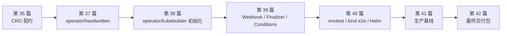

# 阶段六附录 A：Operator 开发能力验收

本附录用于阶段六出版前和学习完成后的总验收。第 34-42 篇已经把 Todo Platform 从“部署到 Kubernetes 的应用”推进到“由平台 API 和 Operator 管理的交付对象”。这一页只收束阶段六能力，不替代第 42 篇的全课程最终作品集。

## 1. 阶段六能力闭环

阶段六的主线不是“会用 Kubebuilder 生成代码”，而是理解并交付一个可演进、可测试、可发布、可排障的 Kubernetes Operator。

| 环节 | 对应章节 | 核心产物 | 验收信号 |
|---|---|---|---|
| API Machinery | 第 34 篇 | TodoApp API 模型草案 | 能解释 GVK/GVR、spec/status 和声明式 API |
| CRD 契约 | 第 35 篇 | TodoApp、TodoDatabase、TodoCache CRD | `kubectl explain`、schema 校验、status subresource 可用 |
| 控制循环 | 第 36 篇 | Informer/Workqueue 模拟程序 | 能画出事件入队、去重、重试和幂等调谐流程 |
| 手写 Controller | 第 37 篇 | client-go Controller | 创建 TodoApp 后能自动回写 status |
| Kubebuilder Operator | 第 38 篇 | Kubebuilder Todo Operator | TodoApp 自动生成 Deployment 和 Service |
| 生命周期增强 | 第 39 篇 | Webhook、Finalizer、Events、Conditions | 默认值、校验、删除清理和状态回写可验证 |
| 测试发布 | 第 40 篇 | envtest、kind e2e、Helm Chart | 测试、安装、升级、回滚链路通过 |
| 生产基线 | 第 41 篇 | 最小 RBAC、Watch 范围、metrics、PDB | 生产安全、可观测性和稳定性检查通过 |
| 最终集成 | 第 42 篇 | 最终 YAML、作品集文档、面试讲解稿 | 能演示最小闭环并诚实说明项目边界 |

阶段六项目主线可以按下面路径理解。第 35 篇先定义 API 契约，第 37 篇用手写 Controller 建立控制循环直觉，第 38-41 篇持续在同一个 `<project-root>/operator/kubebuilder/` 项目上叠加能力，第 42 篇再收束为最终交付包。



## 2. 两条验收路径

| 路径 | 适合对象 | 必做范围 | 完成标志 |
|---|---|---|---|
| 路径 A：最小 Operator 闭环 | 第一次学习 Operator、时间有限的学习者 | 第 34-38 篇，第 40 篇 envtest 基础，第 42 篇最小 YAML | 能从 CRD 到 Reconciler 跑通 TodoApp -> Deployment/Service |
| 路径 B：完整生产作品集 | 准备用于求职、面试或团队评审的学习者 | 完整完成第 34-42 篇和本附录 | 能展示 CRD 设计、Webhook、Finalizer、测试发布、生产化和职业表达 |

路径 A 的目标是先建立控制循环直觉，不要求一次掌握 Webhook、Helm、metrics 和多租户边界。路径 B 才用于最终作品集：每个高级机制都要能说明“它解决的生产问题是什么”。

## 3. 作品集交付清单

| 作品集证据 | 建议内容 |
|---|---|
| API 设计 | TodoApp/TodoDatabase/TodoCache 字段表、版本策略、spec/status 边界 |
| CRD 验证 | `kubectl explain`、server-side dry-run、非法字段被拒绝的输出 |
| Controller 图 | Informer -> Workqueue -> Reconcile -> status 的流程图 |
| 手写 Controller | client-go 项目代码、RBAC、status 回写截图 |
| Kubebuilder Operator | API 类型、marker、Reconciler、Deployment/Service 创建结果 |
| Webhook 与 Finalizer | 默认值注入、非法输入拒绝、删除清理、Events 和 Conditions |
| 测试报告 | `go test ./...`、envtest、kind e2e 运行输出 |
| 发布产物 | Operator 镜像 tag/digest、Helm Chart、Kustomize 清单 |
| 生产基线 | 最小 RBAC、Watch namespace、leader election、metrics、PrometheusRule |
| 最终演示 | `todoapp-local-smoke.yaml`、Argo CD Application、故障演练记录 |
| 面试表达 | 30 秒介绍、3 分钟讲解、项目边界说明 |

作品集说明应避免堆工具名。推荐表达：

```text
我为 Todo Platform 设计并实现了一个 Kubernetes Operator：先用 CRD 定义平台 API，再用 Kubebuilder Reconciler 把 TodoApp 调谐为 Deployment 和 Service；随后补齐 Webhook 默认值/校验、Finalizer 删除清理、Conditions 状态回写、envtest/kind 集成测试、Helm 发布和生产基线。当前 Operator 管理应用层资源，TodoDatabase/TodoCache 作为 API 边界和后续扩展方向保留。
```

## 4. 阶段六总体验收命令

文档仓库验证：

```bash
mkdocs build --strict
```

CRD 基线验证：

```bash
kubectl apply --server-side -f operator/crds/base
kubectl wait --for=condition=Established crd/todoapps.platform.todo.example.com --timeout=60s
kubectl explain todoapp.spec
kubectl apply --dry-run=server -f operator/samples/todoapp.yaml
```

Kubebuilder 项目验证：

```bash
cd operator/kubebuilder
make generate
make manifests
go test ./...
make test
```

envtest 与 kind 集成验证：

```bash
make envtest
KUBEBUILDER_ASSETS="$(pwd)/bin/k8s/1.35.0-linux-amd64" go test ./test/envtest -v
./test/e2e/run-kind-e2e.sh
```

首次 Helm 安装前，先创建并标注租户 namespace。Chart 会在这些 namespace 中创建 Role 和 RoleBinding；namespace 不存在时，Helm install 会失败并留下 failed release：

```bash
kubectl create namespace todo-team-a --dry-run=client -o yaml | kubectl apply -f -
kubectl create namespace todo-team-b --dry-run=client -o yaml | kubectl apply -f -
kubectl label namespace todo-team-a platform.todo.example.com/admission=enabled --overwrite
kubectl label namespace todo-team-b platform.todo.example.com/admission=enabled --overwrite
```

Helm 发布验证：

```bash
helm lint ../helm/todo-operator
helm template todo-operator ../helm/todo-operator --include-crds >/tmp/todo-operator.yaml
helm install todo-operator ../helm/todo-operator -n todo-operator-system --create-namespace
helm upgrade todo-operator ../helm/todo-operator -n todo-operator-system
helm rollback todo-operator 1 -n todo-operator-system
```

生产基线验证：

```bash
OPERATOR_SA="${OPERATOR_SA:-todo-operator}"
kubectl auth can-i create deployments.apps -n todo-team-a \
  --as="system:serviceaccount:todo-operator-system:${OPERATOR_SA}"
kubectl auth can-i create events -n todo-operator-system \
  --as="system:serviceaccount:todo-operator-system:${OPERATOR_SA}"
kubectl -n todo-operator-system get deploy,svc,pod
kubectl -n todo-operator-system port-forward svc/todo-operator-metrics 8080:8080
```

如果使用第 40-41 篇 Helm Chart 且 release 名为 `todo-operator`，默认 ServiceAccount 通常是 `todo-operator`。如果使用 Kubebuilder `make deploy` 或自定义 values，可能是 `todo-operator-controller-manager` 或其他名称；先用 `kubectl get sa -n todo-operator-system` 确认，再覆盖 `OPERATOR_SA`。

最终最小闭环：

```bash
kubectl apply -f deployments/final/todoapp-local-smoke.yaml
kubectl -n todo-final get todoapp todo-final-smoke
kubectl -n todo-final rollout status deployment/todo-final-smoke --timeout=180s
```

## 5. 项目边界确认

阶段六当前实现的核心闭环是：

```text
TodoApp CR -> Todo Operator -> Deployment / Service / status.conditions
```

`TodoDatabase` 和 `TodoCache` 已在第 35 篇定义为 CRD，并在第 42 篇作为完整平台契约的一部分出现；但课程主线没有实现它们对应的 Controller。因此它们当前代表“平台 API 边界”和“作品集扩展方向”，不会自动交付 PostgreSQL 或 Redis。

出版和面试表达中应坚持这条边界：已实现的是应用层 Operator 闭环；数据库和缓存 Controller 是下一阶段增强，不应包装成已经完成的全栈自动化。

## 6. 出版前 Checklist

- [ ] 第 34-42 篇均通过 `mkdocs build --strict`。
- [ ] 第 34-38 篇说明 v1.35/v1.36 兼容边界。
- [ ] 第 39-42 篇明确建议使用 Kubernetes v1.36.x。
- [ ] `MutatingAdmissionPolicy` 被标注为 v1.36 能力或可选实验。
- [ ] CRD schema、CEL 校验、status subresource 和 additional printer columns 实际验证通过。
- [ ] 手写 Controller 可本地运行并可部署到 kind。
- [ ] Kubebuilder Operator 能创建 Deployment/Service 并回写 status。
- [ ] Webhook 默认值、校验、证书、Service endpoints 均可验证。
- [ ] Finalizer 删除清理不会让 TodoApp 长期卡在 Terminating。
- [ ] envtest、kind e2e、Helm install/upgrade/rollback 均实际跑通。
- [ ] RBAC、Watch 范围、leader election、metrics、PDB 和安全上下文都有生产说明。
- [ ] 所有删除 CRD、删除 namespace、`rm -rf` 命令均标注为本地实验。
- [ ] 第 42 篇对 TodoDatabase/TodoCache Controller 未实现的边界保持诚实说明。
- [ ] 阶段六作品集至少包含 CRD、Operator、测试发布、生产基线和最终演示五类证据。
